Demo\_DiSTATIS
================

Idea
----

To test how different normalization works on a cube, we first run a DiSTATIS on this cube to get the result that we can compare the results from other techniques to.

Objectives
----------

Here, we illustrate the DiSTATIS results.

Read data
---------

This is a data cube of correlation: ROIs x ROIs x 10 sessions

``` r
## Exclude negative correlations
cubes$rcube[cubes$rcube < 0] <- 0
# Dimensions
dim(cubes$rcube)
## [1] 602 602  10
```

This correlation data are then transformed into distances (for DiSTATIS)

``` r
dcube <- cor2dist(cubes$rcube)
# Dimension
dim(dcube)
## [1] 602 602  10
```

Compute SS of each community
----------------------------

Get community information and create colors for different communities

``` r
Comm.col <- list(oc = as.matrix(vox.des$Comm.Col), gc = as.matrix(CommName$CommColor))
rownames(Comm.col$oc) <- vox.des$NodeID
rownames(Comm.col$gc) <- CommName$CommLabel.short
```

Check data with heatmap for the 1st session
-------------------------------------------

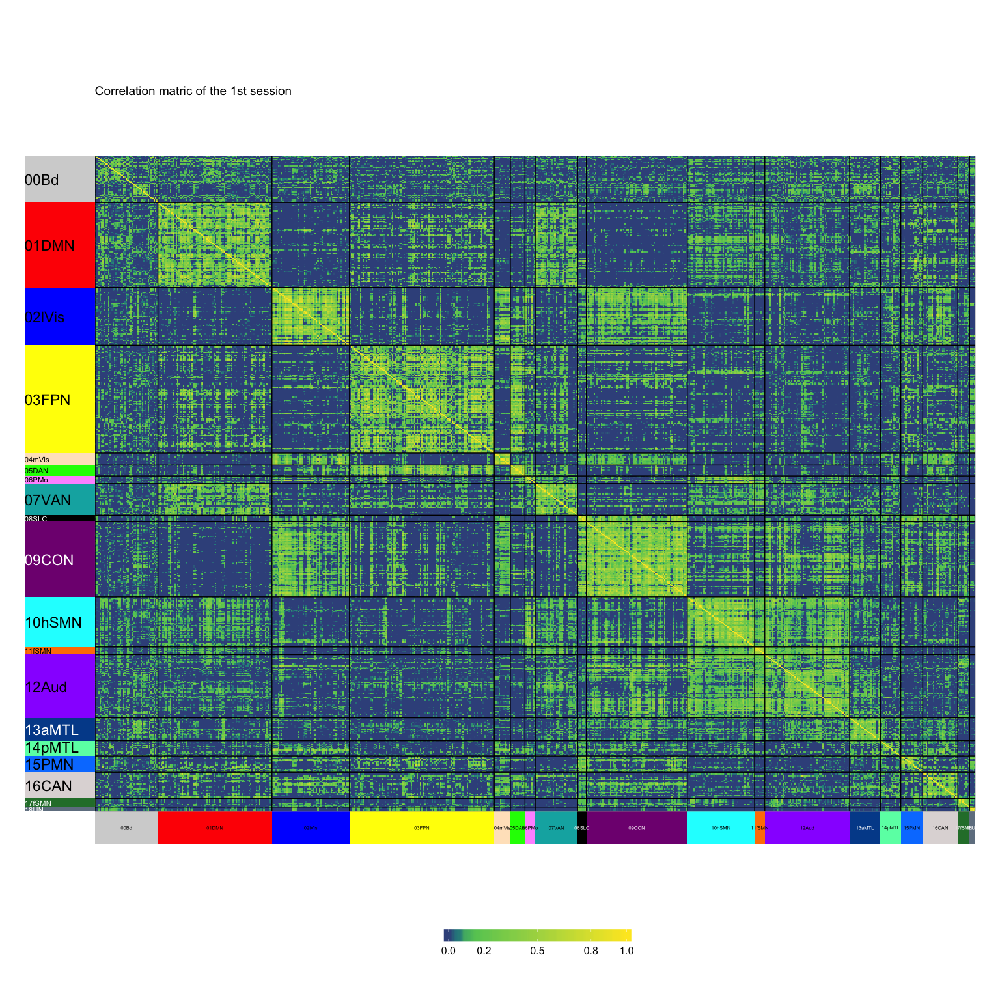

Check the sums of squares (of correlation matrix) of the 1st session
--------------------------------------------------------------------

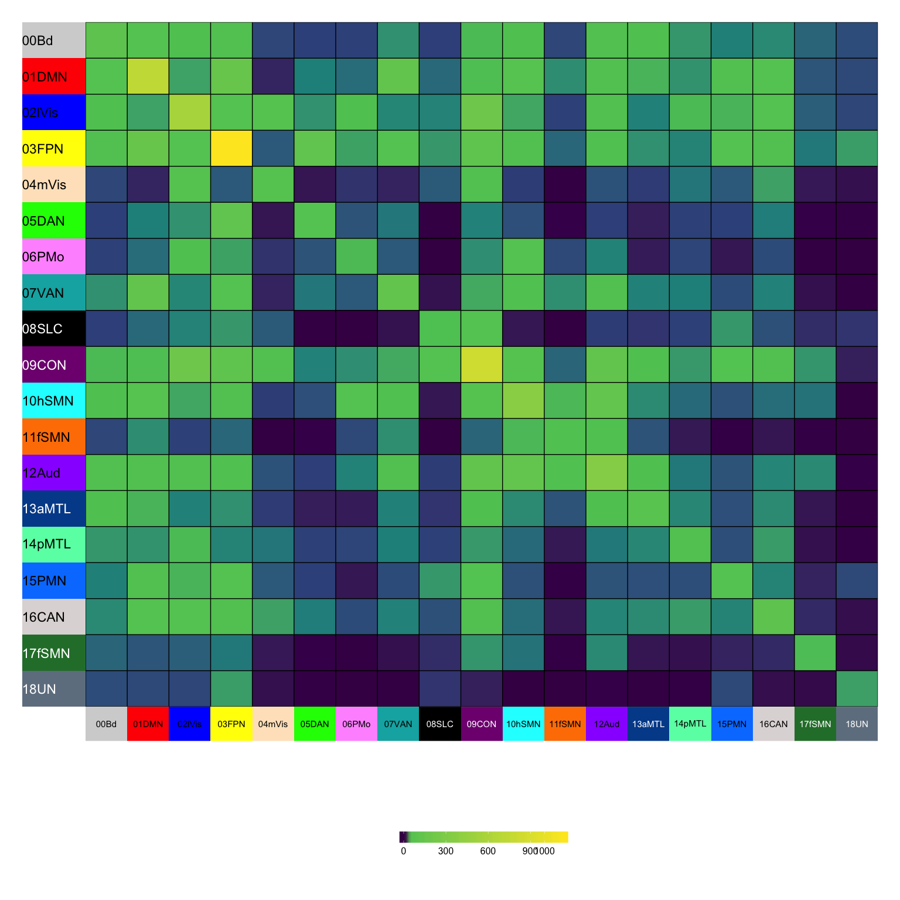

Check the sums of squares (of distance matrix) of the 1st session
-----------------------------------------------------------------

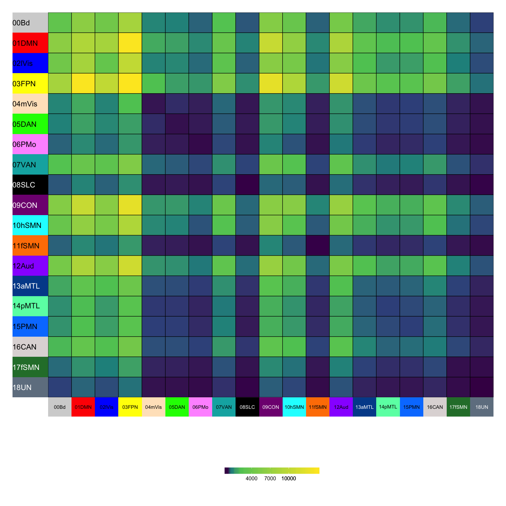

Run DiSTATIS
------------

``` r
# DiSTATIS
distatis.res <- distatis(dcube)
```

Plot results
------------

### Rv space

#### Eigenvalues

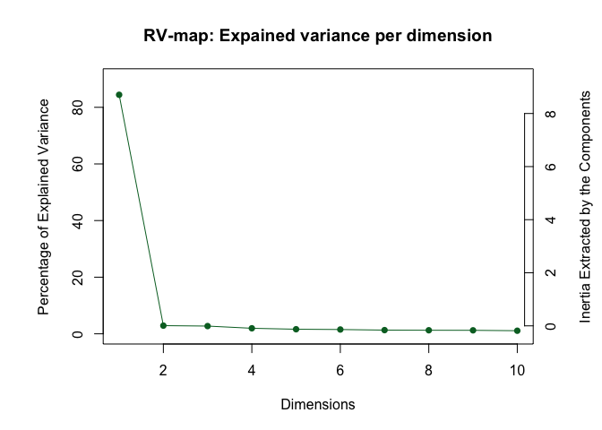

#### Factor scores

``` r
### Rv factor scores
rv.graph <- createFactorMap(distatis.res$res4Cmat$G,
                axis1 = 1, axis2 = 2)
### Dimension labels for the Rv map
rv.labels <- createxyLabels.gen(lambda = distatis.res$res4Cmat$eigValues,
                                tau = distatis.res$res4Cmat$tau,
                                axisName = "Dimension ")
### Show plot
Rvmap <- rv.graph$zeMap + rv.labels
print(Rvmap)
```

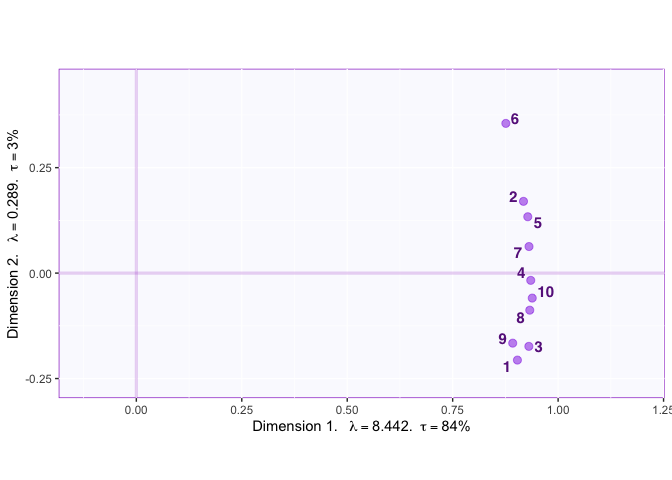

### Compromise space

#### Eigenvalues

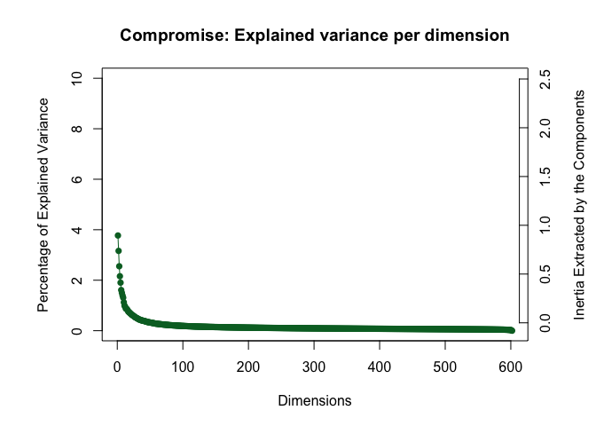

Set the components of interest

``` r
x_cp <- 1
y_cp <- 2
```

#### Factor scores

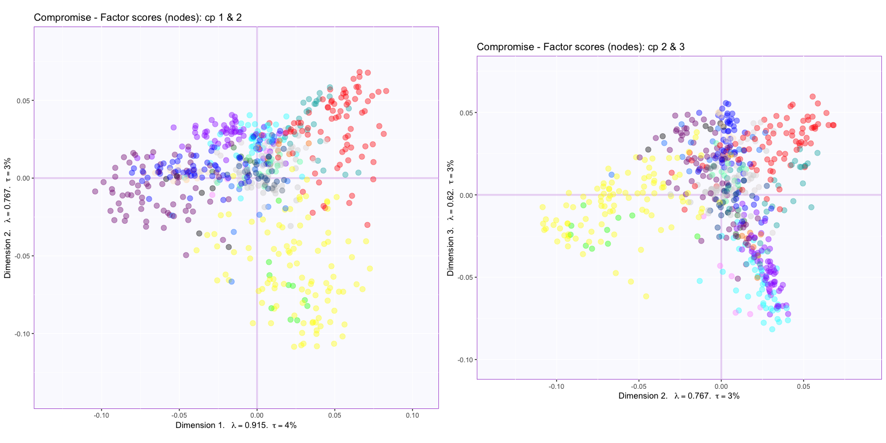

### Now plot the compromise space with means, confidence intervals, and tolerance intervals

#### Compute means for each network

``` r
BootCube.Comm <- Boot4Mean(distatis.res$res4Splus$F,
                         design = vox.des$Comm.rcd,
                         niter = 100,
                         suppressProgressBar = TRUE)
```

#### Plot

##### All heat maps and Rv

Rv factor scores:

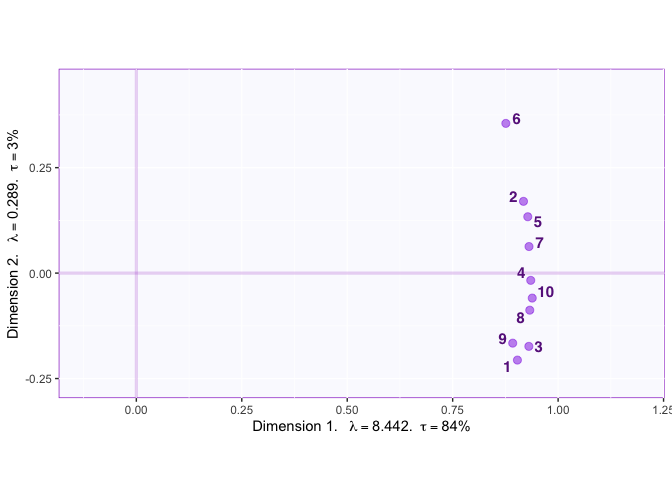

Heap maps of correlation matrices:


Heap maps of SS of correlation matrices:

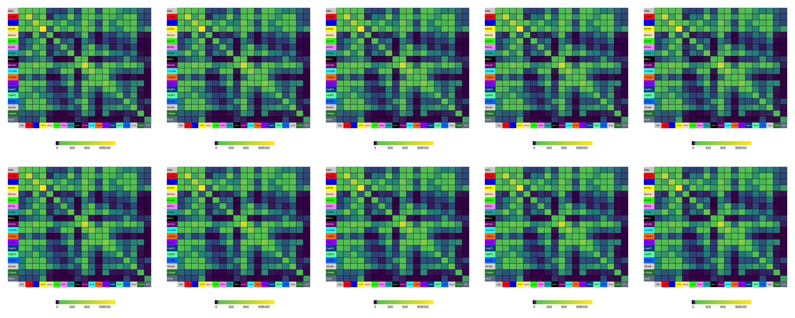

Heap maps of SS of distance matrices:

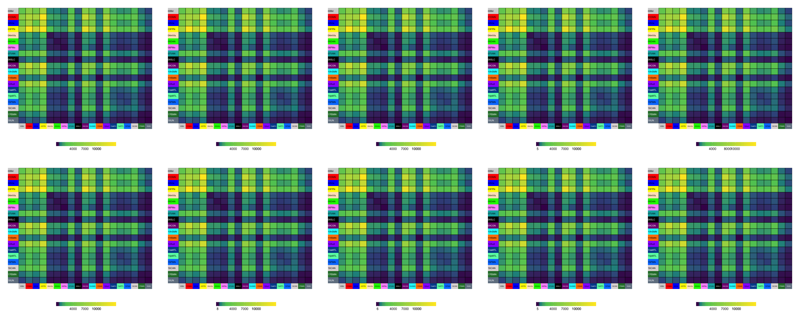

##### Component 1 & 2

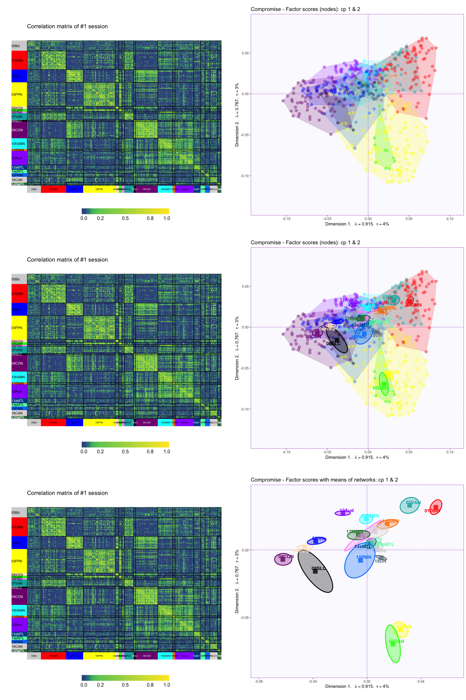

##### Component 2 & 3

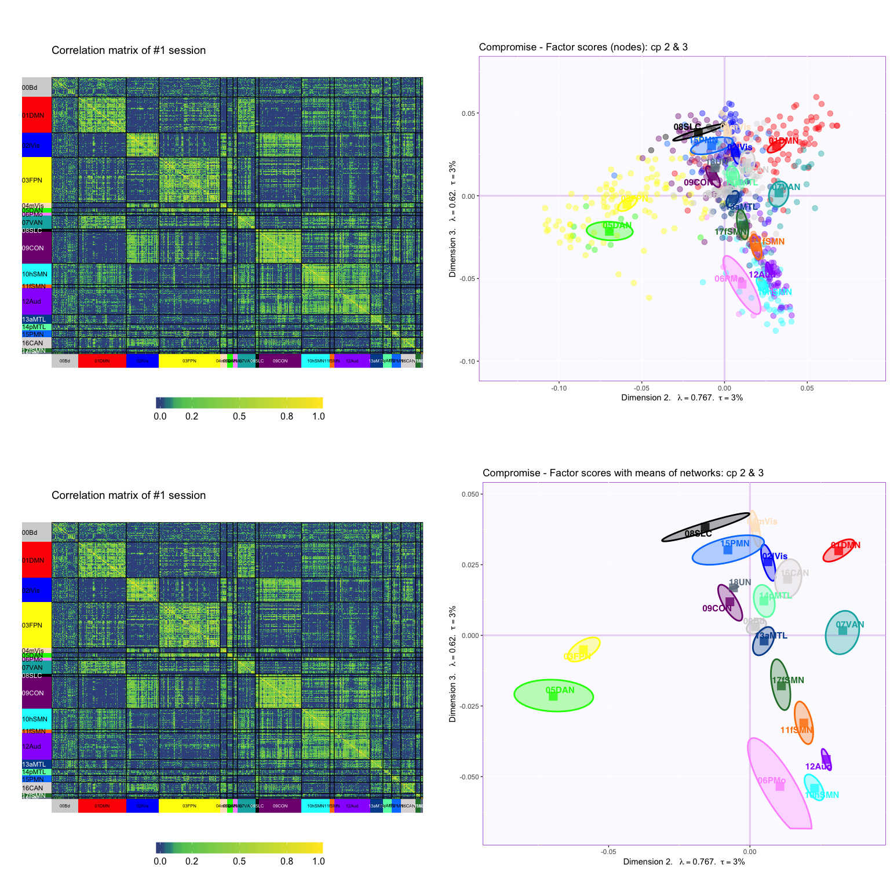

Interpretation
--------------

#### From JCY:

-   Distance in the factor score maps illustrate the relationship between two networks with a shorter distance reflecting a stronger correlation

-   Component 1: Defult mode (DMN) VS Cingulo-opercular (CON)

    -   DMN and CON have almost opposite pattern in several big networks (i.e., lateral Visual (lVis), DMN, CON, ventral attention (vATN), Salience(SLC))

    -   Stronger correlation to DMN: vATN,

    -   Stronger correlation to CON: lVis, mVis, CON, SLC

-   Component 2: DMN -&gt; CON -&gt; Fronto-parietal (FPN) & dorsal attention (dATN)

    -   FPN is the network with the most SS of correlation, CON is the second most, and DMN is the third most

    -   FPN is not does not share pattern with either DMN or CON and only connects to these two networks moderately

    -   FPN is stronly correlated only to dATN

-   Component 3: Sensorimotor networds VS Salience, medial temporal (MTL)

    -   All sensorimotor networks have small correlation to salience, parietal memory (PMN) and mVis networks

    -   Salience, PMN, and mVis all have small correlation to sensorimotor, attention, PMN, Auditory, and MTL networks

    -   These are seen in both the correlation matrix and the SS of correlation

#### from MYC:

-   Factor 1:
    -   I agree with your observation.
    -   Default Mode (DMN) and Cingular-Opercular Network (CON) being opposite is not surprising. CON is the top-down processing attentional network that is quite different from frontal-parietal network (FPN), which shares more similarity with DMN. So along Factor 1, we see DMN, FP and its cousin DAN on one side, and CON on the other (along with Salience \[SAN\]).
    -   **One thing to note is that there are very few nodes in some of these networks. The normalization allows them to give a bigger contribution despite their smaller size, but they are also just less consistent (thus the a larger confidence interval for networks like Salience).** &lt;- correct me if this is a wrong way to view how network-size interacts with normalization and therefore the interpretation.
-   Factor 2:
    -   Here we have Frontal Parietal (FPN) and its cousin Dorsal Attention Network (DAN) pulling weight on one side, and essentially the rest of the stuff along the middle, and maybe DMN, Ventral Attention Network (VAN), and Auditory (AUD) on the other.
    -   The VAN is topographically (physically) located close to Auditory areas, and has decent connection to DMN. VAN and DAN are sort of opposite in their connection pattern, so that may be why they are on opposite sides.
    -   **I’m not sure how the SS of correlation plays into the explanation for Factor 2? Because DAN has a rather weak SS correlation, but its at the very end factor 2.**
-   Factor 3: Differentiating between Visual networks from the rest of the sensory-motor networks
    -   Here we have all the motor (premotor, hand/face motor) networks & auditory (AUD) opposing the visual networks plus Salience, which shows moderate correlation to both Visual networks. I think that is the bigger contrast for factor 3.
