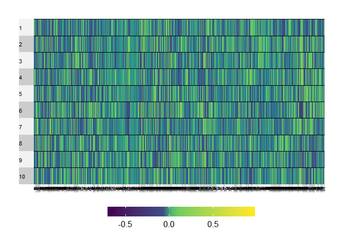
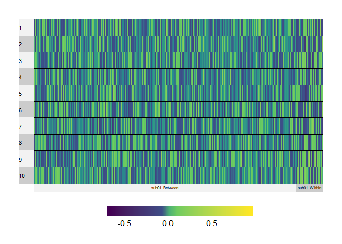
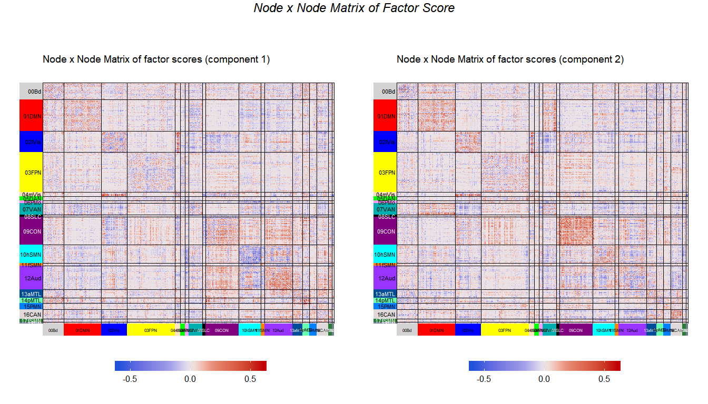
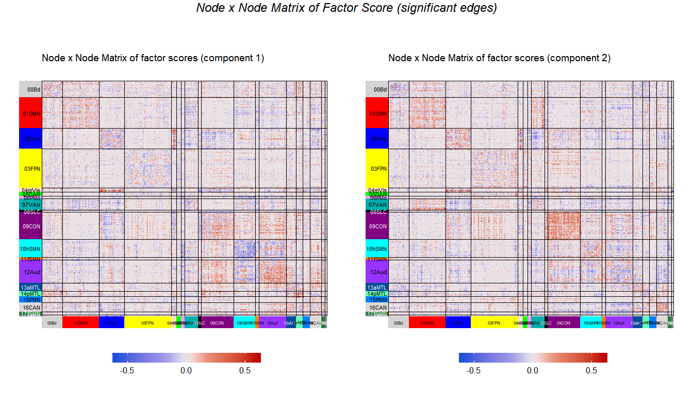

MuSuDemo\_nopreproc
================

## Outline

##### Correlation matirx (subj1-subj3) -\> rectangular matrix \[sessions x edges by network by subject\] -\> center across sessions -\> SVD

## Objectives

Here, we illustrate the results when the rectangular matrix (sessions x
edges by network by subject) is analyzed by SVD after the each edge is
centered (center across
sessions).

## Read cube data (z(correlation) matrix) and the information for communities

This is a data cube of correlation: ROIs x ROIs x 10 sessions

``` r
# Dimensions
dim(cubes$rcube)
```

    ## [1] 602 602  10

## Read the rectangular table

### The grand table:

<!-- -->

### the heatmap with columns arranged according to edgetype

<!-- -->

## SVD

The data are transposed so that the rows are now different edges of
different subject and the columns are different sessions. The data are
centered across sessions (each edge is centered).

``` r
# Use subject_edge_label as column names
colnames(gt.sub1_centXsess) <- labels.sub1$subjects_edge_label
# SVD on the rectangular data ------------------------
pca.res.subj <- epPCA(t(gt.sub1_centXsess),scale = FALSE, center = FALSE, DESIGN = labels.sub1$subjects_edge_label, make_design_nominal = TRUE, graphs = FALSE)
# check dimension
dim(t(gt.sub1_centXsess))
```

    ## [1] 180901     10

### Check the contribution of each variable

``` r
cI <- pca.res.subj$ExPosition.Data$ci
#--- get the sum of contribution for each edge
c_edge <- labels.sub1$subjects_edge_label %>% as.matrix %>% makeNominalData %>% t %>% "%*%"(cI)
rownames(c_edge) <- sub(".","",rownames(c_edge))
#--- compute the sums of squares of each variable for each component
absCtrEdg <- as.matrix(c_edge) %*% diag(pca.res.subj$ExPosition.Data$eigs)
#--- get the contribution for component 1 AND 2 by sum(SS from 1, SS from 2)/sum(eigs 1, eigs 2)
edgCtr12 <- (absCtrEdg[,1] + absCtrEdg[,2])/(pca.res.subj$ExPosition.Data$eigs[1] + pca.res.subj$ExPosition.Data$eigs[2])
edgCtr23 <- (absCtrEdg[,3] + absCtrEdg[,2])/(pca.res.subj$ExPosition.Data$eigs[2] + pca.res.subj$ExPosition.Data$eigs[3])
#--- the important variables are the ones that contribute more than or equal to the average
importantEdg12 <- (edgCtr12 >= 1/length(edgCtr12))
importantEdg23 <- (edgCtr23 >= 1/length(edgCtr23))
importantEdg1 <- (cI[,1] >= 1/length(cI[,1]))
importantEdg2 <- (cI[,2] >= 1/length(cI[,2]))
#--- color for networks
col4ImportantEdg <- unique(pca.res.subj$Plotting.Data$fi.col) # get colors
col4NS <- 'gray90' # set color for not significant edges to gray
col4ImportantEdg[!importantEdg12] <- col4NS # replace them in the color vector
```

## Inference

To have a (relatively) clearer view of the results, we compute the mean
for each edge (or edge type) that we are interested in.

``` r
# Compute means of factor scores for different edges----
#mean.fi <- getMeans(pca.res.subj$ExPosition.Data$fi, labels.sub1$subjects_edge_label) # with t(gt)

#BootCube.Comm <- Boot4Mean(pca.res.subj$ExPosition.Data$fi,
#                           design = labels.sub1$subjects_edge_label,
#                           niter = 100,
#                           suppressProgressBar = TRUE)


# Compute means of factor scores for different types of edges
#mean.fi.bw <- getMeans(pca.res.subj$ExPosition.Data$fi, labels.sub1$subjects_wb) # with t(gt)
#BootCube.Comm.bw <- Boot4Mean(pca.res.subj$ExPosition.Data$fi,
#                           design = labels.sub1$subjects_wb,
#                           niter = 100,
#                           suppressProgressBar = TRUE)
```

## Plot

First, we plot the 10 sessions

<!-- -->

Next, we plot each edges

<!-- -->

If we plot only the edges that significantly contribute to the
component

<!-- -->
