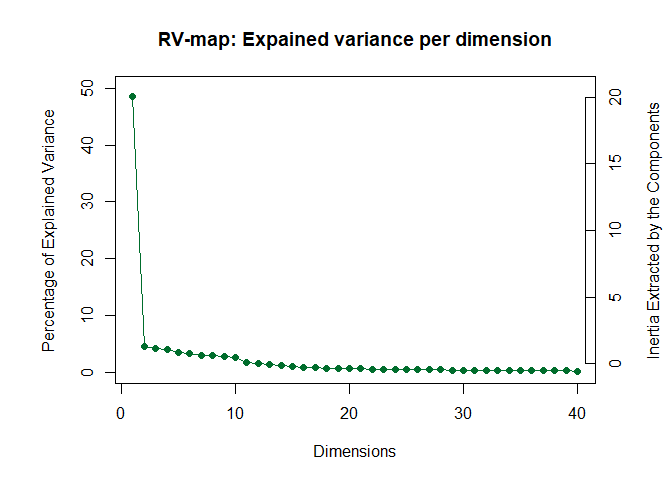
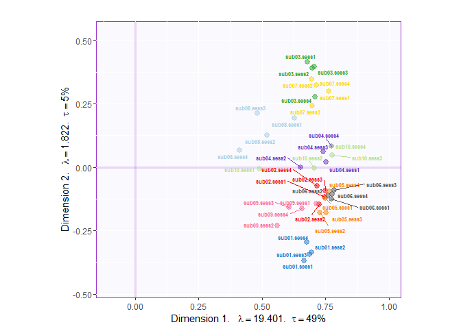
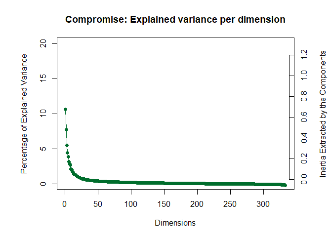
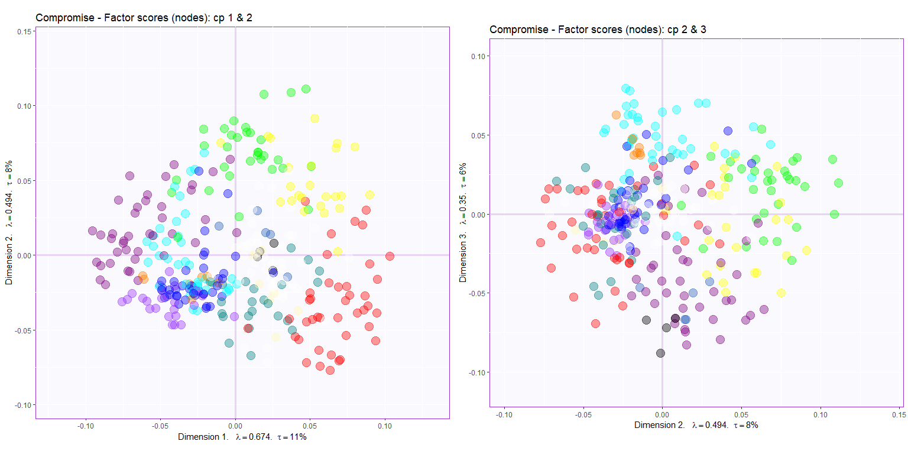
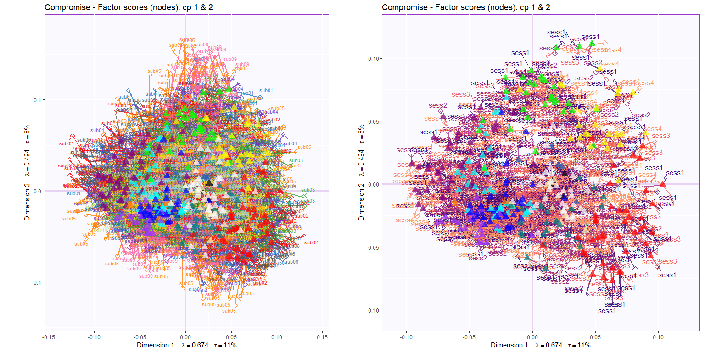
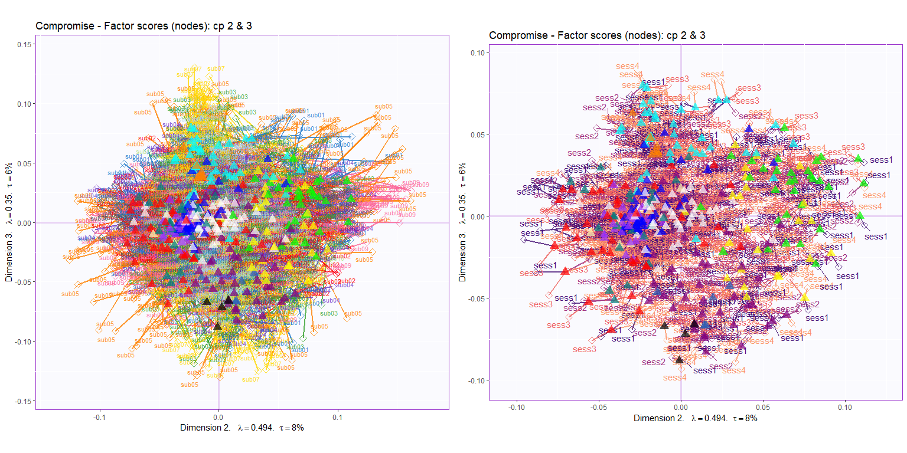
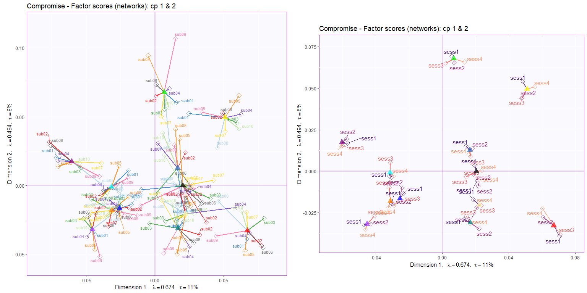
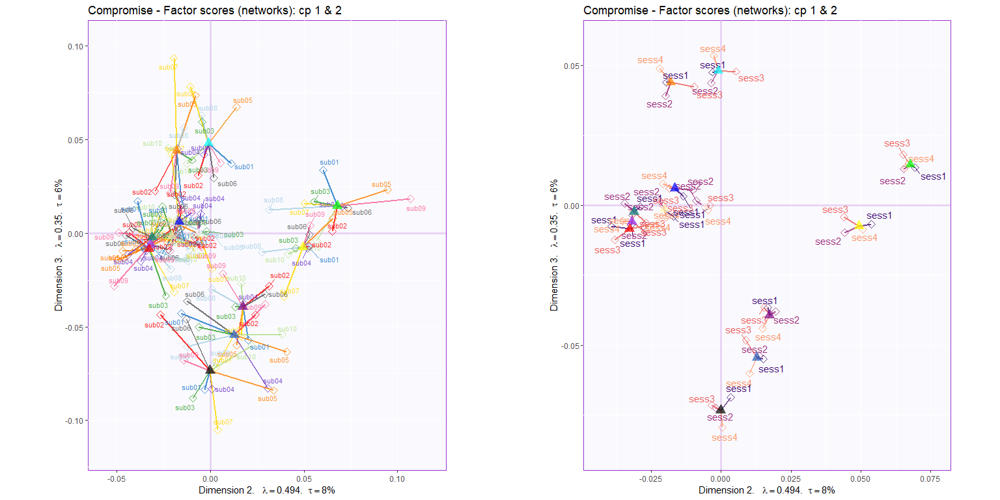

DiSTATIS on edges derived from Gordon Group parcellation (n nodes = 333)
simmulations
================

## Objectives

This attempt perform DiSTATIS on mean connectivity of edges (e.g., mean
connectivity between DMN and FPN, mean connectivity within DMN) of
common networks across participants. The results from this analysis can
be compared to regular DiSTATIS of rs*f*MRI.

## Read data

This is a data cube of mean correlations: networks x networks x 4
sessions (2-5)

``` r
# Dimensions
dim(all.cubes)
## [1] 333 333  40
```

> Induce system-level changes (sim attack)

**Attack 1**

  - In all *subjects* and Even-numbered *sessions* (2 & 4), Reduce
    within connectivity in Default Mode (Syslabel: 1), Default-FP (1\_3)
    and Default\_VAN (1\_5).
      - identify within default connectivity, default-FP and default-VAN
      - Simulate reduced connectivity by dividing edges that were
        identified by above and reduce 50% of connectivity (/2)

<!-- end list -->

``` r

i_3 <- which(CommName$Community=="Default")
i_6 <- which(CommName$Community=="FrontoParietal")
i_15 <- which(CommName$Community=="DorsalAttn")

session2attack <- which(tab.design$session %in% c("sess2","sess4"))

all.cubes[i_3, i_3, session2attack] <-  all.cubes[i_3, i_3, session2attack]/2
all.cubes[i_3, i_6, session2attack] <-  all.cubes[i_3, i_6, session2attack]/2
all.cubes[i_3, i_15, session2attack] <-  all.cubes[i_3, i_15, session2attack]/2
all.cubes[i_6, i_3, session2attack] <-  all.cubes[i_6, i_3, session2attack]/2
all.cubes[i_15, i_3, session2attack] <-  all.cubes[i_15, i_3, session2attack]/2
```

Create colors based on design

Run DiSTATIS with the negative z-transformed correlation matrix (seen as
covariance matrix) is equivalent to run DiSTATIS with distance matrices

``` r
distatis.res <- distatis(all.cubes, Distance = FALSE)
```

## Plot results

### Rv space

This results show how similar the tables are to one another.

#### Eigenvalues

<!-- -->

#### Factor scores

``` r
### Rv factor scores
rv.graph <- createFactorMap(distatis.res$res4Cmat$G,
                            axis1 = 1, axis2 = 2,
                            col.points = table.color$oc,
                            col.labels = table.color$oc,
                            text.cex = 2)
### Dimension labels for the Rv map
rv.labels <- createxyLabels.gen(lambda = distatis.res$res4Cmat$eigValues,
                                tau = distatis.res$res4Cmat$tau,
                                axisName = "Dimension ")
### Show plot
Rvmap <- rv.graph$zeMap + rv.labels
print(Rvmap)
```

<!-- -->

### Compromise space

#### Eigenvalues

<!-- -->

Set the components of interest

``` r
x_cp <- 1
y_cp <- 2
```

#### Factor scores

<!-- -->

#### Partial factor scores

Component 1 & 2

<!-- -->

Component 2 & 3

<!-- -->

#### Mean partial factor scores

Component 1 & 2

<!-- -->

Component 2 & 3

<!-- -->
