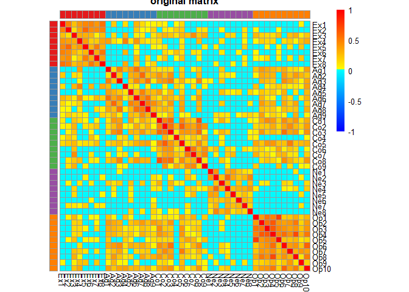
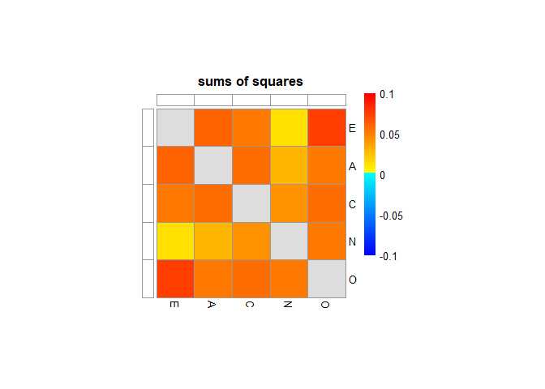
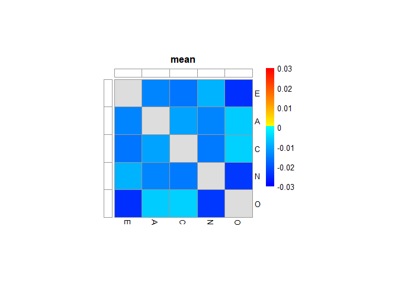
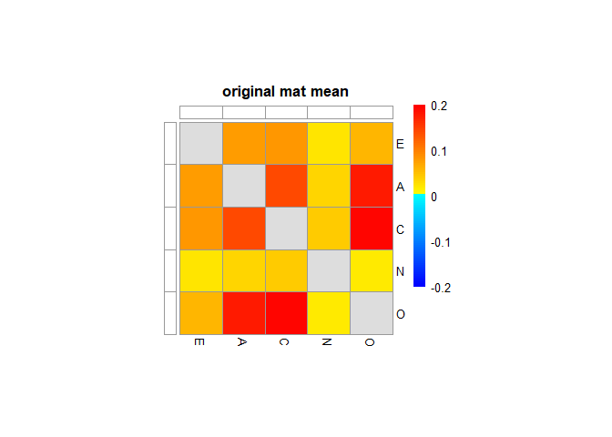

Demonstrating STATIS normalization on a correlation matrix
================

## Idea

Before starting this project, we were not sure how we should normalize
our data to control for counding factors (e.g., voxel size and network
size) and keep important signals. (But what is really the important
information?) Since the correlation matrix we work on resemble a
distance matrix. We came up with the idea of matrix preprocessing steps
similar to that of DiSTATIS (i.e., STATIS for distance matrices). This
type of preprocessing consists of two steps:

  - Double-center
  - Normalized by the first eigenvalue of the double-centered matrix

## Objectives

Here, we illustrate how data are changed along these steps and how the
final singular value decomposition (SVD) results are affected.

## Start with an example data

### Fake data

We start with a fake data with blocks of
    correlation.

    ##      Ex1 Ex2 Ex3 Ex4 Ex5 Ex6 Ex7 Ex8 Ag1 Ag2 Ag3 Ag4 Ag5 Ag6 Ag7 Ag8 Ag9
    ## [1,]   5   2   4   4   4   3   3   3   2   4   5   3   3   3   3   4   4
    ## [2,]   2   2   4   4   4   3   2   2   3   4   4   4   4   4   4   4   5
    ## [3,]   3   2   4   3   2   2   2   5   1   1   1   5   1   1   1   1   4
    ## [4,]   2   2   2   2   2   3   2   4   2   5   5   3   3   3   4   4   4
    ## [5,]   4   3   2   3   3   3   4   4   2   4   5   2   2   3   4   4   5
    ## [6,]   5   4   2   4   4   4   4   5   2   4   5   4   4   4   2   2   4
    ##      Co1 Co2 Co3 Co4 Co5 Co6 Co7 Co8 Co9 Ne1 Ne2 Ne3 Ne4 Ne5 Ne6 Ne7 Ne8
    ## [1,]   5   4   5   2   3   4   4   4   3   3   4   5   5   2   1   3   4
    ## [2,]   3   2   4   3   4   4   4   4   4   2   2   4   3   2   2   2   2
    ## [3,]   1   1   2   4   1   5   4   1   5   5   5   1   5   5   5   5   2
    ## [4,]   3   4   5   2   2   4   4   4   5   5   3   2   4   3   2   2   3
    ## [5,]   5   1   5   1   2   5   4   5   2   2   3   4   3   4   3   4   3
    ## [6,]   4   4   5   5   2   4   4   5   2   4   4   4   5   2   4   1   2
    ##      Op1 Op2 Op3 Op4 Op5 Op6 Op7 Op8 Op9 Op10
    ## [1,]   2   5   3   4   2   3   5   5   3    4
    ## [2,]   5   5   5   5   4   4   4   5   4    4
    ## [3,]   5   4   1   3   4   1   1   5   5    2
    ## [4,]   4   5   5   5   3   4   2   5   4    5
    ## [5,]   3   4   4   4   4   5   4   4   5    2
    ## [6,]   4   4   4   2   2   5   4   2   5    4

### Fake correlation

Then, compute its correlation matrix.

``` r
### fake correlation:
# changed to all positive values
cor.X <- abs(cor(X))
dim(cor.X)
## [1] 44 44
```

Setting up colors for
plotting

``` r
group.col <- RColorBrewer::brewer.pal(5,"Set1")[c(rep(x=1,8),rep(x=2,9),rep(x=3,9),rep(x=4,8),rep(x=5,10))]
group.des <- c(rep("E",8),rep("A",9),rep("C",9),rep("N",8),rep("O",10))
group.des.nominal <- makeNominalData(as.matrix(group.des))
group.des.nomnorm <- group.des.nominal/c(rep(8,8),rep(9,9),rep(9,9),rep(8,8),rep(10,10))
group.des.df <- data.frame(group = factor(group.des),row.names = colnames(X))
group.des.col <- list(group = c(E = RColorBrewer::brewer.pal(5,"Set1")[1],
                                A = RColorBrewer::brewer.pal(5,"Set1")[2],
                                C = RColorBrewer::brewer.pal(5,"Set1")[3],
                                N = RColorBrewer::brewer.pal(5,"Set1")[4],
                                O = RColorBrewer::brewer.pal(5,"Set1")[5]))
value.col <- colorRamps::blue2red(100)
```

Plot the heatmap:

<!-- -->

## STATIS-like normalization

### STEP 1 : Double centering

Centering across columns and rows so that each row and column has a mean
of 0.

``` r
# center columns and rows
corX.c <- cor.X %>% scale(scale = FALSE) %>% t %>% scale(scale = FALSE)
```

Plot the heatmap:

<!-- -->

### STEP 1.5: Eigen decomposition

Perform an eigen decomposition and record the eigenvalues.

``` r
# get the first eigenvalue
eig.res.corX <-eigen(corX.c)
Lambda.corX <- eig.res.corX$`values`
Q.corX <- eig.res.corX$vectors
Q1 <- as.matrix(diag(Q.corX[,1]))
rownames(Q1) <- colnames(X)
colnames(Q1) <- colnames(X)
```

Plot eigen vectors:

<!-- -->

### STEP 2 : Devided the double-centered matrix by the first eigenvalue

``` r
end.X <- corX.c/Lambda.corX[1]
```

Plot final result:

<!-- -->

With its sums of squares:

    ##            E          A          C          N          O
    ## E 0.63034447 0.08440248 0.08143856 0.03657052 0.08679331
    ## A 0.08440248 0.52976288 0.07137913 0.04836717 0.08029743
    ## C 0.08143856 0.07137913 0.57525775 0.05417395 0.08189754
    ## N 0.03657052 0.04836717 0.05417395 0.51436852 0.07621190
    ## O 0.08679331 0.08029743 0.08189754 0.07621190 0.62997334

<!-- -->

With its normalized sums of
    squares:

    ##              E            A            C            N            O
    ## E 0.0098491323 0.0011722566 0.0011310911 0.0005714144 0.0010849164
    ## A 0.0011722566 0.0065402825 0.0008812238 0.0006717662 0.0008921937
    ## C 0.0011310911 0.0008812238 0.0071019476 0.0007524159 0.0009099726
    ## N 0.0005714144 0.0006717662 0.0007524159 0.0080370081 0.0009526487
    ## O 0.0010849164 0.0008921937 0.0009099726 0.0009526487 0.0062997334

<!-- -->

With its block means:

    ##             E            A            C            N            O
    ## E  0.07439877 -0.016439572 -0.019177658 -0.003769920 -0.024447573
    ## A -0.01643957  0.044606346 -0.010614144 -0.006492626 -0.012247224
    ## C -0.01917766 -0.010614144  0.050199436 -0.017111186 -0.006595688
    ## N -0.00376992 -0.006492626 -0.017111186  0.055188822 -0.019891691
    ## O -0.02444757 -0.012247224 -0.006595688 -0.019891691  0.052430032

<!-- -->

Plot the heatmap of the original matrix again to compare:

<!-- -->

With its sums of squares:

    ##           E         A         C         N         O
    ## E 16.408816  1.973762  1.759135  1.865285  1.674820
    ## A  1.973762 17.195436  3.916326  2.533291  4.487809
    ## C  1.759135  3.916326 19.344140  1.623011  5.818310
    ## N  1.865285  2.533291  1.623011 12.647106  1.945488
    ## O  1.674820  4.487809  5.818310  1.945488 25.977010

<!-- -->

With its normalized sums of squares:

    ##            E          A          C          N          O
    ## E 0.25638775 0.02741336 0.02443243 0.02914508 0.02093525
    ## A 0.02741336 0.21228933 0.04834971 0.03518460 0.04986454
    ## C 0.02443243 0.04834971 0.23881655 0.02254181 0.06464789
    ## N 0.02914508 0.03518460 0.02254181 0.19761104 0.02431860
    ## O 0.02093525 0.04986454 0.06464789 0.02431860 0.25977010

<!-- -->

With its block means:

    ##           E         A         C         N         O
    ## E 0.4441491 0.1258018 0.1217734 0.1439061 0.1185444
    ## A 0.1258018 0.3772353 0.1763237 0.1561171 0.1867380
    ## C 0.1217734 0.1763237 0.4107040 0.1225258 0.2141826
    ## N 0.1439061 0.1561171 0.1225258 0.3580850 0.1286357
    ## O 0.1185444 0.1867380 0.2141826 0.1286357 0.4521532

<!-- -->

## Try PCA

Let’s see how the PCA results are changed after the STATIS-like
normalization.

``` r
# Group design
group.des <- c(rep(x=1,8),rep(x=2,9),rep(x=3,9),rep(x=4,8),rep(x=5,10))
# PCA with original correlation matrix
corX.pca.res <- epPCA(cor.X, center = FALSE, scale = FALSE, DESIGN = group.des, make_design_nominal = TRUE, graphs = FALSE)
# PCA with the STATIS-normalized matrix
endX.pca.res <- epPCA(end.X, center = FALSE, scale = FALSE, DESIGN = group.des, make_design_nominal = TRUE, graphs = FALSE)
```

#### PCA results with original correlation matrix

<!-- -->

#### PCA results with STATIS-normalized matrix

<!-- -->
