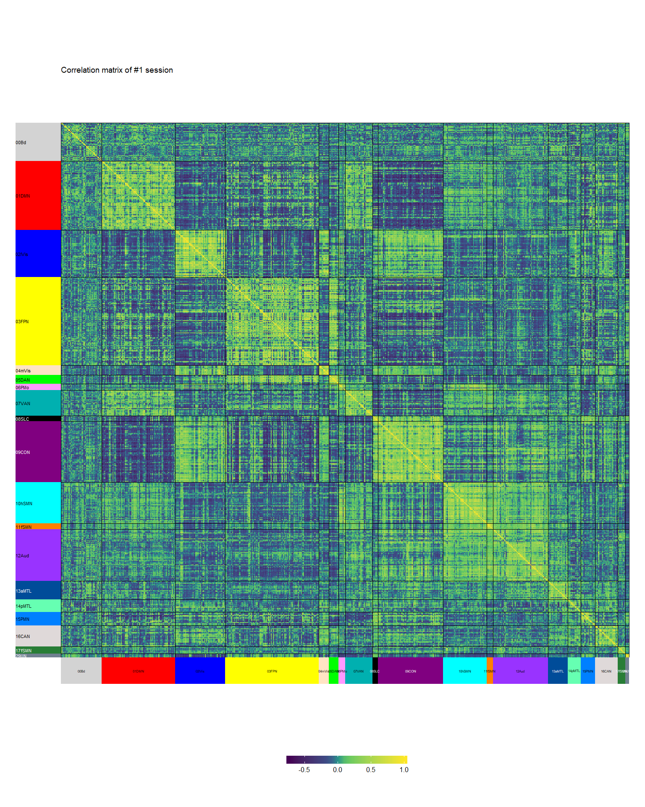
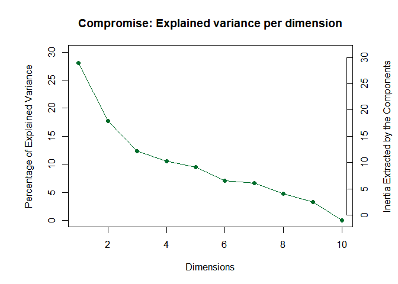
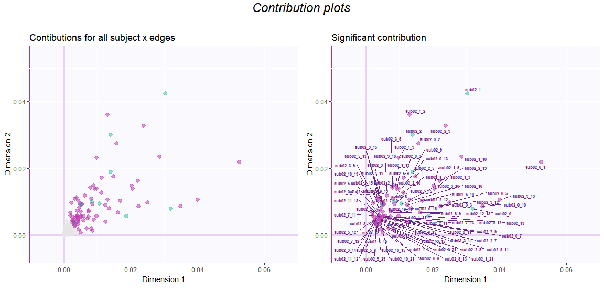
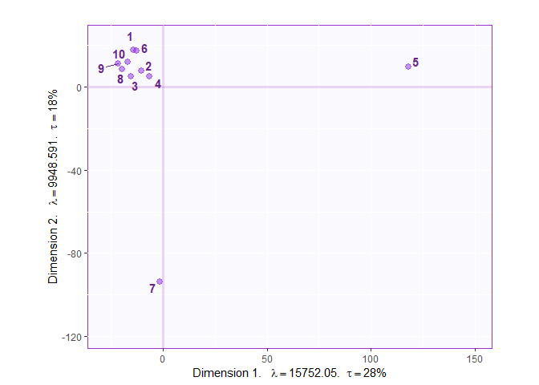
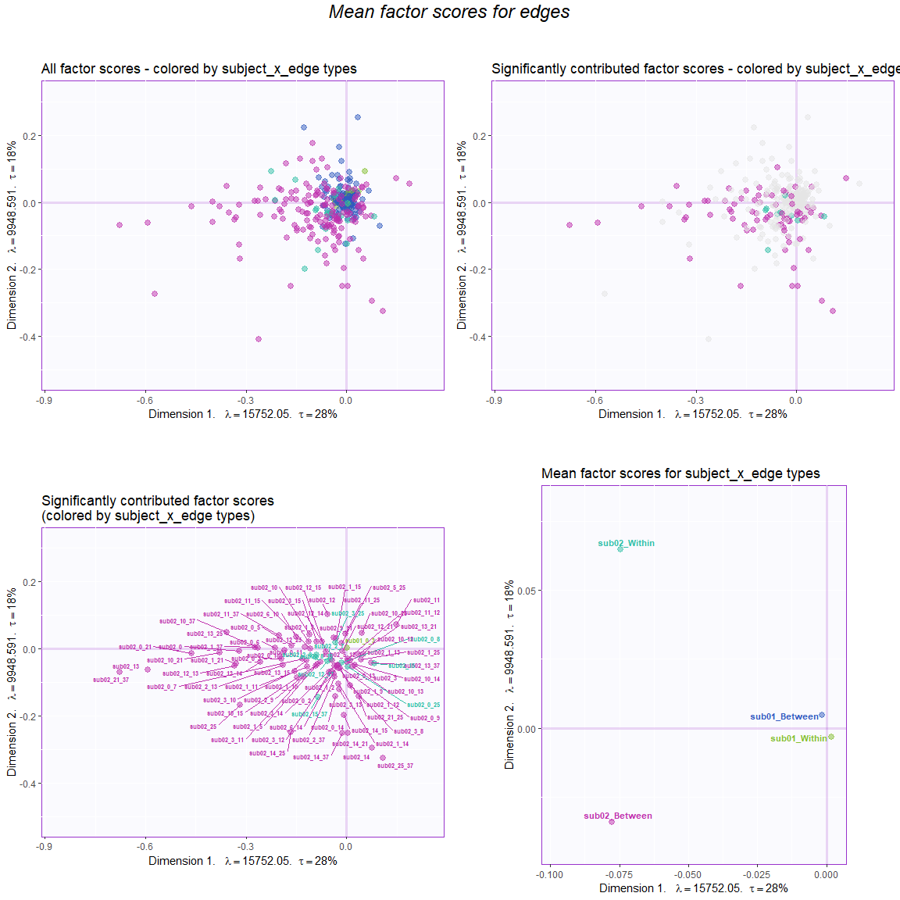
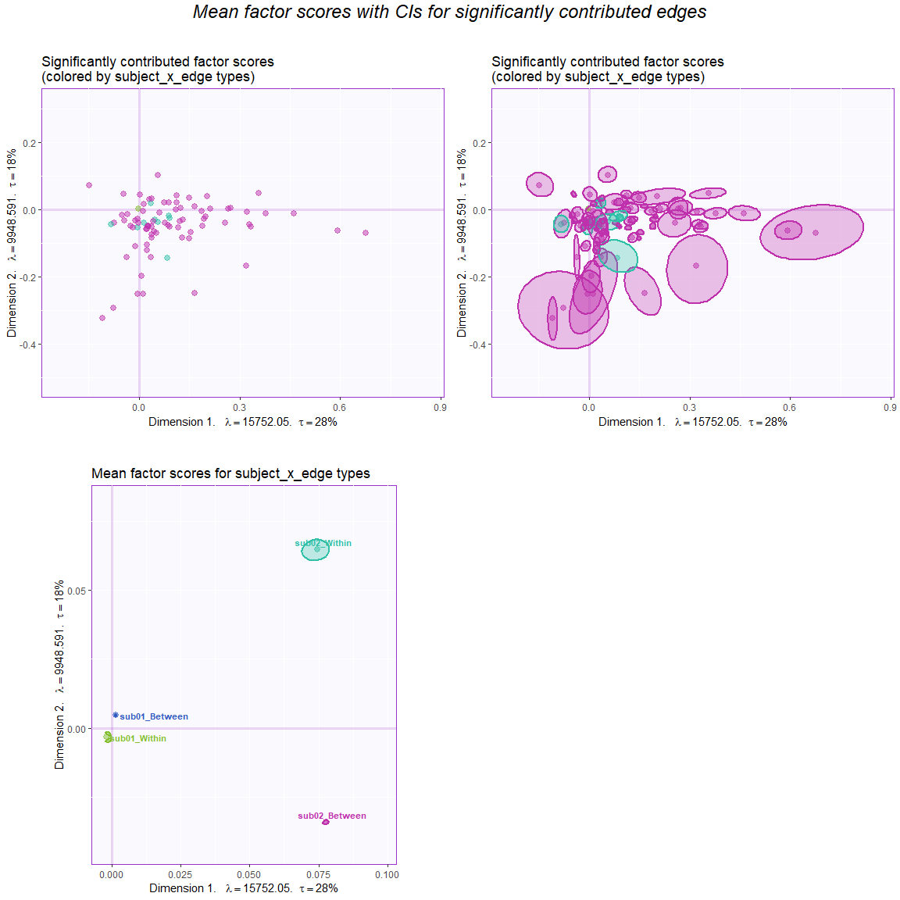
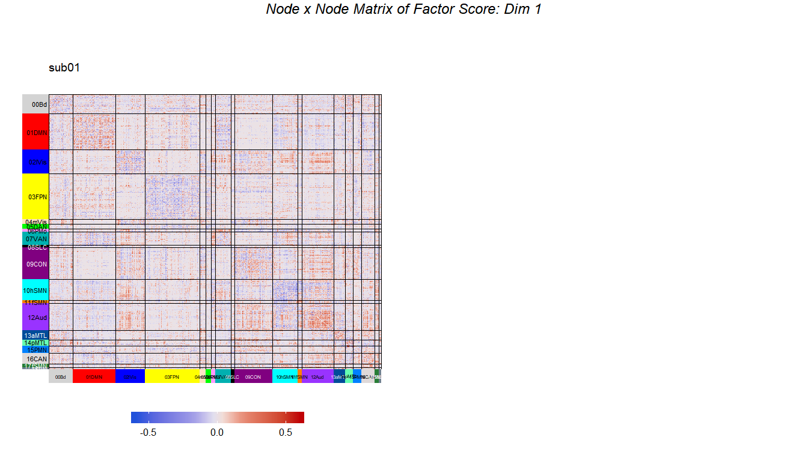
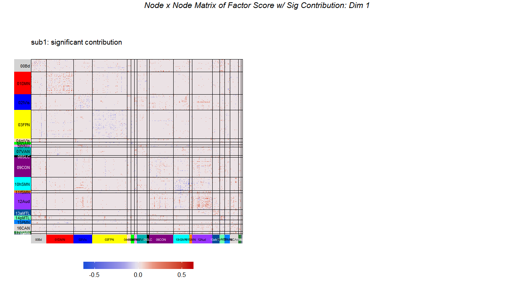
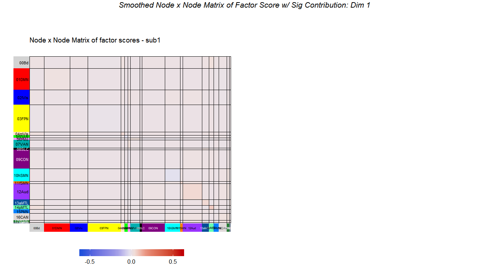

MuSu\_(NA, c, NA)
================

> This is an SVD with centered columns.

##### Data:

The data are from the morning scan club (MSC) resting-state data where
the 2 participants (i.e., subjects 1 and 8 from the original study) were
each scanned 10 times. The data that are analyzed here are the
z-transformed coefficients of correlation between regions. These regions
can be categorized into 12 networks:

| Comm |         Community         | CommLabel.short |
| :--: | :-----------------------: | :-------------: |
|  0   |         UnAssign          |      00Bd       |
|  1   |          Default          |      01DMN      |
|  2   |      lateral Visual       |     02lVis      |
|  3   |      Frontoparietal       |      03FPN      |
|  4   |       medial Visual       |     04mVis      |
|  5   |     dorsal Attention      |      05DAN      |
|  6   |         Premotor          |      06PMo      |
|  7   |     ventral Attention     |      07VAN      |
|  8   |         Salience          |      08SLC      |
|  9   |    Cingular opercular     |      09CON      |
|  10  |    Sensorimotor - hand    |     10hSMN      |
|  11  |    Sensorimotor - face    |     11fSMN      |
|  12  |         Auditory          |      12Aud      |
|  13  | anterior Medial temporal  |     13aMTL      |
|  14  | posterior Medial temporal |     14pMTL      |
|  15  |      Parietal memory      |      15PMN      |
|  16  |          Context          |      16CAN      |
|  17  |    Sensorimotor - foot    |     17fSMN      |
|  21  |          Unknown          |      21UN       |
|  25  |          Unknown          |      25UN       |
|  29  |          Unknown          |      29UN       |
|  34  |          UnKnown          |      34UN       |
|  37  |          UnKnown          |      37UN       |

``` r
# read parcel labels for each subject
parcel.comm.path <- "../data/parcel_community"
parcelfile2read <- c("/sub-MSC01_node_parcel_comm.txt","/sub-MSC08_node_parcel_comm.txt")
parcel.list <- lapply(1:length(parcelfile2read), function(x){
  parcel <- read.table(paste0(parcel.comm.path, parcelfile2read[x]),sep = ",")
  getVoxDes(parcel,CommName)
})
names(parcel.list) <- c("sub01","sub08")

#--- Create colors for heatmap
labelcol <- list(sub01 = parcel.list$sub01$Comm.col$gc[order(rownames(parcel.list$sub01$Comm.col$gc))],
                 sub08 = parcel.list$sub08$Comm.col$gc[order(rownames(parcel.list$sub08$Comm.col$gc))])
textcol <- list(sub01 = c(rep("black",8),rep("white",2),rep("black",3),"white",rep("black",3),rep("white",2)),
                sub08 = c(rep("black",8),rep("white",2),rep("black",3),"white",rep("black",1),rep("white",3)))
```

As a result, the correlation matrix of each session of each subject will
look like this:

<!-- -->

This correlation matrix were then turned into a rectangular matrix

##### Rectangular data:

  - Rows: 5 sessions

  - Columns: Different edges (e.g, *within DMN*, *between DMN & CON*,
    *between DMN & FPN*, etc.) of different subjects

*Note: The data was transformed from the upper triangle of the
correlation matrices. From the correlation matrix of each session, its
upper triangle are reshape as a vector. These reshaped vectors of
different sessions are then concatenated on the rows and those of
different subjects are concatenated on the columns.*

##### Method:

  - Centering: across sessions (rows) (i.e., the columns are centered)

  - Normalizing: none

<!-- end list -->

``` r
# Centered across sessions
gt_preproc <- expo.scale(gt, center = TRUE, scale = FALSE)
# set the column names
colnames(gt_preproc) <- gtlabel$subjects_edge_label
# check dimension
dim(t(gt_preproc))
```

    ## [1] 432596     10

Then, the preprocessed data are decomposed by the
SVD:

``` r
svd.res <- epPCA(t(gt_preproc),scale = FALSE, center = FALSE, DESIGN = gtlabel$subjects_wb, make_design_nominal = TRUE, graphs = FALSE)
```

##### Results:

###### Scree plot

First, the scree plot illustrates the eigen value with percentage of
explained variance of each component. The results showed that there are
three important components with the percentage of explained variance
more than average (i.e., 1/10).

<!-- -->

###### Contributions

Before checking the factor scores, we first plot the contributions to
check the importance of network edges. The important edges are defined
as those that with significant mean contribution to both components 1
and 2.

We first compute the contribution and find the important edges and
sessions:

``` r
#--- get the contribution of each component
cI <- svd.res$ExPosition.Data$ci
cJ <- svd.res$ExPosition.Data$cj
#--- get the sum of contribution for each edge
c_edge <- gtlabel$subjects_edge_label %>% as.matrix %>% makeNominalData %>% t %>% "%*%"(cI)
rownames(c_edge) <- sub(".","",rownames(c_edge))
rownames(cJ) <- c(1:10)
## Find important sessions
#--- get the contribution for component 1 AND 2 by sum(SS from 1, SS from 2)/sum(eigs 1, eigs 2)
sesCtr12 <- (cJ[,1]+cJ[,2])/(svd.res$ExPosition.Data$eigs[1] + svd.res$ExPosition.Data$eigs[2])
#--- the important sessions are the ones that contribute more than or equal to the average
importantSes <- (sesCtr12 >= 1/length(sesCtr12))
importantSes1 <- (cJ[,1] >= 1/length(cJ[,1]))
importantSes2 <- (cJ[,2] >= 1/length(cJ[,2]))
#--- color for sessions
col4ImportantSes <- svd.res$Plotting.Data$fj.col # get colors
col4NS <- 'gray48' # set color for not significant edges to gray
col4ImportantSes[!importantSes] <- col4NS # replace them in the color vector

## Find important edges
#--- compute the sums of squares of each variable for each component
absCtrEdg <- as.matrix(c_edge) %*% diag(svd.res$ExPosition.Data$eigs)
#--- get the contribution for component 1 AND 2 by sum(SS from 1, SS from 2)/sum(eigs 1, eigs 2)
edgCtr12 <- (absCtrEdg[,1] + absCtrEdg[,2])/(svd.res$ExPosition.Data$eigs[1] + svd.res$ExPosition.Data$eigs[2])
#--- the important variables are the ones that contribute more than or equal to the average
importantEdg <- (edgCtr12 >= 1/length(edgCtr12))
importantEdg1 <- (cI[,1] >= 1/length(cI[,1]))
importantEdg2 <- (cI[,2] >= 1/length(cI[,2]))
#--- find the between/within description for each network edge
net.edge <- matrix(NA, nrow = nrow(c_edge),ncol = 1)
for (i in 1:nrow(c_edge)){
  edge2check <- rownames(c_edge)[i]
  net.edge[i,1] <- unique(gtlabel[which(gtlabel$subjects_edge_label == edge2check),"subjects_wb"])
}
#--- create color based on the between/within description for network edges
net.edge.col <- net.edge %>% makeNominalData %>% createColorVectorsByDesign
rownames(net.edge.col$gc) <- sub(".","",rownames(net.edge.col$gc))
rownames(net.edge.col$oc) <- rownames(c_edge)
#--- color for networks
col4ImportantEdg <- net.edge.col$oc # get colors
col4NS <- 'gray90' # set color for not significant edges to gray
col4ImportantEdg[!importantEdg] <- col4NS # replace them in the color vector
```

Then the contributions are shown in plots

<!-- --> The
contribution for each network edge is computed by dividing its total SS
across region edges and dimensions (i.e., the cross product of
contribution and eigenvalues) by the total eigenvalues of the two
components.

###### Factor scores

First, we plot the factor scores for the 10 sessions

<!-- -->

To have a clearer view of the factor scores for the subject x edges, we
first compute the mean factor scores for the each network edge.

``` r
# Compute means of factor scores for different edges----
mean.fi <- getMeans(svd.res$ExPosition.Data$fi, gtlabel$subjects_edge_label) # with t(gt)
colnames(mean.fi) <- sapply(c(1:ncol(mean.fi)), function(x){sprintf("Factor %s",x)})

BootCube.Comm <- Boot4Mean(svd.res$ExPosition.Data$fi,
                           design = gtlabel$subjects_edge_label,
                           niter = 100,
                           suppressProgressBar = TRUE)


# Compute means of factor scores for different types of edges
mean.fi.bw <- getMeans(svd.res$ExPosition.Data$fi, gtlabel$subjects_wb) # with t(gt)
colnames(mean.fi.bw) <- sapply(c(1:ncol(mean.fi.bw)), function(x){sprintf("Factor %s",x)})

BootCube.Comm.bw <- Boot4Mean(svd.res$ExPosition.Data$fi,
                           design = gtlabel$subjects_wb,
                           niter = 100,
                           suppressProgressBar = TRUE)
```

Next, we plot the factor scores for the subject x edges (a mess): Dim 1
& 2

<!-- -->
Note that a network edge with its region edges significantly contribute
to the components both positively and negatively results in a
significant mean factor score that is close to the origin. Also, a
network edge with only few region edges will lead to a small total SS as
compared to the total eigenvalues; this type of network edge might not
be significant even when being far away from the origin. (This is shown
in the chunk named `checkCtr` which is hidden/commented in the .rmd.)

We can also add boostrap intervals for the factor
    scores

    ## Warning: Removed 3 rows containing non-finite values (stat_ellipse).

    ## Warning: Removed 35 rows containing non-finite values (stat_ellipse).

<!-- -->

We can also show the factor scores for network edges as square matrix of
sub01 (subj1) and sub02 (subj8)

<!-- -->

Factor score in squarem matrix that have significant contribution only

<!-- -->

Smoothed Sig Factor Score

<!-- -->
