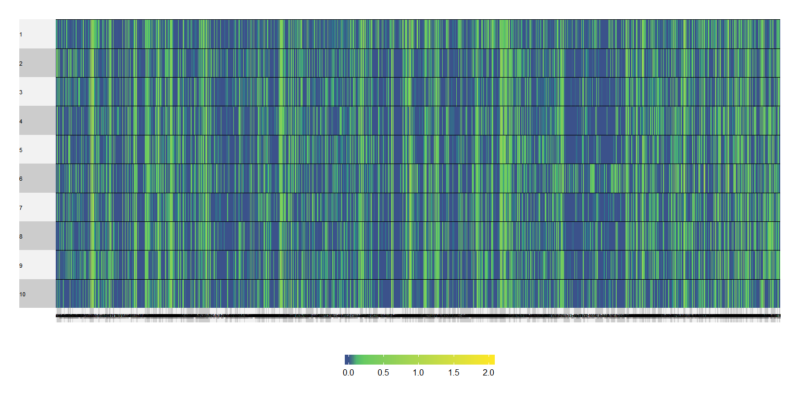

---
title: "MuSu_(NA, c, NA)"
output: github_document
---


> This is an SVD with centered columns.

##### Data:

###### The data are from the morning scan club (MSC) resting-state data where each of the 10 participants were scanned 10 times. The data that are analyzed here are the z-transformed coefficients of correlation between regions. These regions can be categorized into 12 networks: 


----------------------------------------------------
 Comm           Community           CommLabel.short 
------ --------------------------- -----------------
  0             UnAssign                 00Bd       

  1              Default                 01DMN      

  2          lateral Visual             02lVis      

  3          Frontoparietal              03FPN      

  4           medial Visual             04mVis      

  5         dorsal Attention             05DAN      

  6             Premotor                 06PMo      

  7         ventral Attention            07VAN      

  8             Salience                 08SLC      

  9        Cingular opercular            09CON      

  10       Sensorimotor - hand          10hSMN      

  11       Sensorimotor - face          11fSMN      

  12            Auditory                 12Aud      

  13    anterior Medial temporal        13aMTL      

  14    posterior Medial temporal       14pMTL      

  15         Parietal memory             15PMN      

  16             Context                 16CAN      

  17       Sensorimotor - foot          17fSMN      

  29             Unknown                 18UN       
----------------------------------------------------

###### As a result, the correlation matrix of each session of each subject will look like this:

<!-- -->

###### This correlation matrix were then turned into a rectangular matrix

#### Rectangular data:

+ Rows: 5 sessions

+ Columns: Different edges (e.g, _within DMN_, _between DMN & CON_, _between DMN & FPN_, etc.)

_Note: The data was transformed from the upper triangle of the correlation matrices. From the correlation matrix of each session, its upper triangle are reshape as a vector. These sessions are concatenated on the rows and these of different subjects are concatenated on the columns._

### The grand table:

```
##     [1] "sub01_Between" "sub01_Between" "sub01_Between" "sub01_Within" 
##     [5] "sub01_Between" "sub01_Between" "sub01_Between" "sub01_Between"
##     [9] "sub01_Between" "sub01_Between" "sub01_Within"  "sub01_Between"
##    [13] "sub01_Between" "sub01_Within"  "sub01_Between" "sub01_Between"
##    [17] "sub01_Between" "sub01_Between" "sub01_Between" "sub01_Between"
##    [21] "sub01_Between" "sub01_Between" "sub01_Between" "sub01_Between"
##    [25] "sub01_Between" "sub01_Within"  "sub01_Between" "sub01_Between"
##    [29] "sub01_Between" "sub01_Between" "sub01_Between" "sub01_Between"
##    [33] "sub01_Between" "sub01_Between" "sub01_Within"  "sub01_Between"
##    [37] "sub01_Between" "sub01_Within"  "sub01_Between" "sub01_Between"
##    [41] "sub01_Between" "sub01_Between" "sub01_Between" "sub01_Between"
##    [45] "sub01_Between" "sub01_Between" "sub01_Between" "sub01_Between"
##    [49] "sub01_Between" "sub01_Between" "sub01_Between" "sub01_Between"
##    [53] "sub01_Between" "sub01_Between" "sub01_Between" "sub01_Between"
##    [57] "sub01_Between" "sub01_Between" "sub01_Between" "sub01_Between"
##    [61] "sub01_Between" "sub01_Between" "sub01_Between" "sub01_Between"
##    [65] "sub01_Between" "sub01_Between" "sub01_Between" "sub01_Between"
##    [69] "sub01_Between" "sub01_Between" "sub01_Between" "sub01_Between"
##    [73] "sub01_Between" "sub01_Between" "sub01_Between" "sub01_Between"
##    [77] "sub01_Between" "sub01_Within"  "sub01_Between" "sub01_Between"
##    [81] "sub01_Between" "sub01_Between" "sub01_Between" "sub01_Between"
##    [85] "sub01_Between" "sub01_Between" "sub01_Between" "sub01_Between"
##    [89] "sub01_Between" "sub01_Within"  "sub01_Within"  "sub01_Within" 
##    [93] "sub01_Between" "sub01_Between" "sub01_Within"  "sub01_Between"
##    [97] "sub01_Within"  "sub01_Between" "sub01_Between" "sub01_Between"
##   [101] "sub01_Between" "sub01_Between" "sub01_Between" "sub01_Between"
##   [105] "sub01_Between" "sub01_Between" "sub01_Between" "sub01_Between"
##   [109] "sub01_Between" "sub01_Between" "sub01_Between" "sub01_Between"
##   [113] "sub01_Between" "sub01_Between" "sub01_Between" "sub01_Between"
##   [117] "sub01_Between" "sub01_Between" "sub01_Between" "sub01_Between"
##   [121] "sub01_Between" "sub01_Between" "sub01_Between" "sub01_Between"
##   [125] "sub01_Between" "sub01_Between" "sub01_Between" "sub01_Between"
##   [129] "sub01_Between" "sub01_Between" "sub01_Between" "sub01_Between"
##   [133] "sub01_Between" "sub01_Between" "sub01_Between" "sub01_Within" 
##   [137] "sub01_Between" "sub01_Between" "sub01_Between" "sub01_Between"
##   [141] "sub01_Between" "sub01_Between" "sub01_Between" "sub01_Between"
##   [145] "sub01_Between" "sub01_Between" "sub01_Between" "sub01_Between"
##   [149] "sub01_Between" "sub01_Between" "sub01_Between" "sub01_Between"
##   [153] "sub01_Between" "sub01_Between" "sub01_Between" "sub01_Between"
##   [157] "sub01_Between" "sub01_Between" "sub01_Between" "sub01_Between"
##   [161] "sub01_Between" "sub01_Between" "sub01_Between" "sub01_Between"
##   [165] "sub01_Between" "sub01_Between" "sub01_Between" "sub01_Between"
##   [169] "sub01_Between" "sub01_Between" "sub01_Within"  "sub01_Between"
##   [173] "sub01_Between" "sub01_Between" "sub01_Between" "sub01_Between"
##   [177] "sub01_Between" "sub01_Between" "sub01_Between" "sub01_Between"
##   [181] "sub01_Between" "sub01_Between" "sub01_Between" "sub01_Between"
##   [185] "sub01_Between" "sub01_Between" "sub01_Between" "sub01_Between"
##   [189] "sub01_Within"  "sub01_Within"  "sub01_Between" "sub01_Between"
##   [193] "sub01_Between" "sub01_Between" "sub01_Between" "sub01_Between"
##   [197] "sub01_Between" "sub01_Between" "sub01_Between" "sub01_Between"
##   [201] "sub01_Between" "sub01_Between" "sub01_Between" "sub01_Between"
##   [205] "sub01_Between" "sub01_Between" "sub01_Between" "sub01_Within" 
##   [209] "sub01_Within"  "sub01_Within"  "sub01_Between" "sub01_Between"
##   [213] "sub01_Between" "sub01_Between" "sub01_Within"  "sub01_Between"
##   [217] "sub01_Between" "sub01_Within"  "sub01_Between" "sub01_Between"
##   [221] "sub01_Between" "sub01_Between" "sub01_Between" "sub01_Between"
##   [225] "sub01_Between" "sub01_Between" "sub01_Between" "sub01_Between"
##   [229] "sub01_Between" "sub01_Between" "sub01_Between" "sub01_Between"
##   [233] "sub01_Between" "sub01_Between" "sub01_Between" "sub01_Within" 
##   [237] "sub01_Between" "sub01_Between" "sub01_Within"  "sub01_Between"
##   [241] "sub01_Between" "sub01_Between" "sub01_Between" "sub01_Between"
##   [245] "sub01_Between" "sub01_Between" "sub01_Between" "sub01_Between"
##   [249] "sub01_Between" "sub01_Between" "sub01_Between" "sub01_Between"
##   [253] "sub01_Within"  "sub01_Between" "sub01_Between" "sub01_Between"
##   [257] "sub01_Between" "sub01_Between" "sub01_Between" "sub01_Between"
##   [261] "sub01_Between" "sub01_Between" "sub01_Between" "sub01_Between"
##   [265] "sub01_Between" "sub01_Between" "sub01_Between" "sub01_Between"
##   [269] "sub01_Between" "sub01_Between" "sub01_Between" "sub01_Between"
##   [273] "sub01_Between" "sub01_Between" "sub01_Between" "sub01_Between"
##   [277] "sub01_Between" "sub01_Between" "sub01_Between" "sub01_Between"
##   [281] "sub01_Between" "sub01_Between" "sub01_Between" "sub01_Between"
##   [285] "sub01_Between" "sub01_Between" "sub01_Between" "sub01_Between"
##   [289] "sub01_Between" "sub01_Between" "sub01_Between" "sub01_Between"
##   [293] "sub01_Between" "sub01_Between" "sub01_Between" "sub01_Between"
##   [297] "sub01_Between" "sub01_Between" "sub01_Between" "sub01_Within" 
##   [301] "sub01_Between" "sub01_Between" "sub01_Between" "sub01_Between"
##   [305] "sub01_Between" "sub01_Between" "sub01_Between" "sub01_Between"
##   [309] "sub01_Between" "sub01_Between" "sub01_Between" "sub01_Between"
##   [313] "sub01_Between" "sub01_Between" "sub01_Between" "sub01_Within" 
##   [317] "sub01_Within"  "sub01_Between" "sub01_Between" "sub01_Between"
##   [321] "sub01_Between" "sub01_Between" "sub01_Between" "sub01_Between"
##   [325] "sub01_Between" "sub01_Between" "sub01_Between" "sub01_Between"
##   [329] "sub01_Between" "sub01_Between" "sub01_Between" "sub01_Between"
##   [333] "sub01_Between" "sub01_Between" "sub01_Between" "sub01_Between"
##   [337] "sub01_Between" "sub01_Between" "sub01_Between" "sub01_Between"
##   [341] "sub01_Between" "sub01_Between" "sub01_Between" "sub01_Between"
##   [345] "sub01_Between" "sub01_Between" "sub01_Between" "sub01_Between"
##   [349] "sub01_Within"  "sub01_Within"  "sub01_Between" "sub01_Between"
##   [353] "sub01_Between" "sub01_Between" "sub01_Between" "sub01_Between"
##   [357] "sub01_Between" "sub01_Between" "sub01_Between" "sub01_Between"
##   [361] "sub01_Between" "sub01_Within"  "sub01_Between" "sub01_Between"
##   [365] "sub01_Between" "sub01_Between" "sub01_Between" "sub01_Between"
##   [369] "sub01_Between" "sub01_Between" "sub01_Between" "sub01_Between"
##   [373] "sub01_Between" "sub01_Between" "sub01_Between" "sub01_Between"
##   [377] "sub01_Between" "sub01_Between" "sub01_Between" "sub01_Between"
##   [381] "sub01_Between" "sub01_Between" "sub01_Within"  "sub01_Between"
##   [385] "sub01_Between" "sub01_Within"  "sub01_Between" "sub01_Between"
##   [389] "sub01_Between" "sub01_Between" "sub01_Between" "sub01_Between"
##   [393] "sub01_Between" "sub01_Between" "sub01_Between" "sub01_Between"
##   [397] "sub01_Between" "sub01_Between" "sub01_Between" "sub01_Within" 
##   [401] "sub01_Within"  "sub01_Between" "sub01_Between" "sub01_Between"
##   [405] "sub01_Between" "sub01_Between" "sub01_Within"  "sub01_Between"
##   [409] "sub01_Between" "sub01_Within"  "sub01_Between" "sub01_Within" 
##   [413] "sub01_Between" "sub01_Between" "sub01_Between" "sub01_Between"
##   [417] "sub01_Between" "sub01_Between" "sub01_Between" "sub01_Between"
##   [421] "sub01_Within"  "sub01_Between" "sub01_Between" "sub01_Between"
##   [425] "sub01_Between" "sub01_Between" "sub01_Between" "sub01_Between"
##   [429] "sub01_Between" "sub01_Between" "sub01_Between" "sub01_Between"
##   [433] "sub01_Between" "sub01_Between" "sub01_Between" "sub01_Within" 
##   [437] "sub01_Between" "sub01_Between" "sub01_Within"  "sub01_Between"
##   [441] "sub01_Within"  "sub01_Between" "sub01_Between" "sub01_Between"
##   [445] "sub01_Between" "sub01_Between" "sub01_Between" "sub01_Between"
##   [449] "sub01_Between" "sub01_Within"  "sub01_Between" "sub01_Between"
##   [453] "sub01_Between" "sub01_Between" "sub01_Between" "sub01_Between"
##   [457] "sub01_Between" "sub01_Between" "sub01_Between" "sub01_Between"
##   [461] "sub01_Between" "sub01_Between" "sub01_Between" "sub01_Between"
##   [465] "sub01_Within"  "sub01_Between" "sub01_Between" "sub01_Between"
##   [469] "sub01_Between" "sub01_Between" "sub01_Between" "sub01_Between"
##   [473] "sub01_Between" "sub01_Between" "sub01_Between" "sub01_Between"
##   [477] "sub01_Between" "sub01_Between" "sub01_Between" "sub01_Between"
##   [481] "sub01_Between" "sub01_Between" "sub01_Between" "sub01_Between"
##   [485] "sub01_Between" "sub01_Between" "sub01_Between" "sub01_Between"
##   [489] "sub01_Between" "sub01_Between" "sub01_Between" "sub01_Between"
##   [493] "sub01_Between" "sub01_Between" "sub01_Between" "sub01_Between"
##   [497] "sub01_Between" "sub01_Between" "sub01_Between" "sub01_Between"
##   [501] "sub01_Between" "sub01_Between" "sub01_Between" "sub01_Between"
##   [505] "sub01_Between" "sub01_Between" "sub01_Between" "sub01_Between"
##   [509] "sub01_Between" "sub01_Between" "sub01_Between" "sub01_Between"
##   [513] "sub01_Between" "sub01_Between" "sub01_Between" "sub01_Between"
##   [517] "sub01_Between" "sub01_Between" "sub01_Between" "sub01_Between"
##   [521] "sub01_Between" "sub01_Between" "sub01_Between" "sub01_Between"
##   [525] "sub01_Between" "sub01_Between" "sub01_Between" "sub01_Within" 
##   [529] "sub01_Between" "sub01_Between" "sub01_Between" "sub01_Between"
##   [533] "sub01_Between" "sub01_Between" "sub01_Between" "sub01_Between"
##   [537] "sub01_Between" "sub01_Between" "sub01_Between" "sub01_Between"
##   [541] "sub01_Between" "sub01_Between" "sub01_Between" "sub01_Between"
##   [545] "sub01_Between" "sub01_Between" "sub01_Between" "sub01_Between"
##   [549] "sub01_Between" "sub01_Between" "sub01_Between" "sub01_Between"
##   [553] "sub01_Between" "sub01_Between" "sub01_Between" "sub01_Between"
##   [557] "sub01_Between" "sub01_Between" "sub01_Between" "sub01_Within" 
##   [561] "sub01_Within"  "sub01_Between" "sub01_Between" "sub01_Between"
##   [565] "sub01_Between" "sub01_Between" "sub01_Between" "sub01_Between"
##   [569] "sub01_Between" "sub01_Between" "sub01_Between" "sub01_Between"
##   [573] "sub01_Between" "sub01_Between" "sub01_Between" "sub01_Between"
##   [577] "sub01_Between" "sub01_Between" "sub01_Between" "sub01_Between"
##   [581] "sub01_Between" "sub01_Between" "sub01_Between" "sub01_Between"
##   [585] "sub01_Between" "sub01_Between" "sub01_Between" "sub01_Between"
##   [589] "sub01_Between" "sub01_Between" "sub01_Between" "sub01_Between"
##   [593] "sub01_Between" "sub01_Between" "sub01_Between" "sub01_Between"
##   [597] "sub01_Within"  "sub01_Between" "sub01_Between" "sub01_Between"
##   [601] "sub01_Between" "sub01_Between" "sub01_Between" "sub01_Between"
##   [605] "sub01_Within"  "sub01_Between" "sub01_Between" "sub01_Between"
##   [609] "sub01_Between" "sub01_Between" "sub01_Between" "sub01_Between"
##   [613] "sub01_Between" "sub01_Between" "sub01_Between" "sub01_Between"
##   [617] "sub01_Between" "sub01_Between" "sub01_Between" "sub01_Between"
##   [621] "sub01_Between" "sub01_Between" "sub01_Between" "sub01_Between"
##   [625] "sub01_Between" "sub01_Between" "sub01_Between" "sub01_Between"
##   [629] "sub01_Between" "sub01_Between" "sub01_Between" "sub01_Within" 
##   [633] "sub01_Between" "sub01_Between" "sub01_Between" "sub01_Between"
##   [637] "sub01_Between" "sub01_Between" "sub01_Between" "sub01_Within" 
##   [641] "sub01_Between" "sub01_Between" "sub01_Between" "sub01_Between"
##   [645] "sub01_Between" "sub01_Between" "sub01_Between" "sub01_Between"
##   [649] "sub01_Between" "sub01_Between" "sub01_Between" "sub01_Between"
##   [653] "sub01_Between" "sub01_Between" "sub01_Between" "sub01_Between"
##   [657] "sub01_Between" "sub01_Between" "sub01_Between" "sub01_Between"
##   [661] "sub01_Between" "sub01_Between" "sub01_Between" "sub01_Between"
##   [665] "sub01_Between" "sub01_Within"  "sub01_Between" "sub01_Between"
##   [669] "sub01_Between" "sub01_Between" "sub01_Between" "sub01_Between"
##   [673] "sub01_Between" "sub01_Between" "sub01_Between" "sub01_Between"
##   [677] "sub01_Between" "sub01_Between" "sub01_Between" "sub01_Between"
##   [681] "sub01_Between" "sub01_Between" "sub01_Between" "sub01_Between"
##   [685] "sub01_Between" "sub01_Between" "sub01_Between" "sub01_Between"
##   [689] "sub01_Between" "sub01_Between" "sub01_Between" "sub01_Between"
##   [693] "sub01_Between" "sub01_Between" "sub01_Between" "sub01_Between"
##   [697] "sub01_Between" "sub01_Between" "sub01_Between" "sub01_Between"
##   [701] "sub01_Between" "sub01_Between" "sub01_Between" "sub01_Within" 
##   [705] "sub01_Between" "sub01_Between" "sub01_Within"  "sub01_Between"
##   [709] "sub01_Within"  "sub01_Between" "sub01_Between" "sub01_Between"
##   [713] "sub01_Between" "sub01_Between" "sub01_Between" "sub01_Between"
##   [717] "sub01_Between" "sub01_Within"  "sub01_Between" "sub01_Between"
##   [721] "sub01_Between" "sub01_Between" "sub01_Between" "sub01_Between"
##   [725] "sub01_Between" "sub01_Between" "sub01_Between" "sub01_Between"
##   [729] "sub01_Between" "sub01_Between" "sub01_Between" "sub01_Between"
##   [733] "sub01_Within"  "sub01_Within"  "sub01_Between" "sub01_Between"
##   [737] "sub01_Between" "sub01_Between" "sub01_Between" "sub01_Between"
##   [741] "sub01_Between" "sub01_Between" "sub01_Between" "sub01_Between"
##   [745] "sub01_Between" "sub01_Between" "sub01_Between" "sub01_Between"
##   [749] "sub01_Between" "sub01_Between" "sub01_Between" "sub01_Between"
##   [753] "sub01_Between" "sub01_Between" "sub01_Between" "sub01_Between"
##   [757] "sub01_Between" "sub01_Between" "sub01_Between" "sub01_Between"
##   [761] "sub01_Between" "sub01_Between" "sub01_Between" "sub01_Between"
##   [765] "sub01_Between" "sub01_Between" "sub01_Between" "sub01_Between"
##   [769] "sub01_Between" "sub01_Between" "sub01_Between" "sub01_Between"
##   [773] "sub01_Within"  "sub01_Within"  "sub01_Within"  "sub01_Between"
##   [777] "sub01_Between" "sub01_Between" "sub01_Between" "sub01_Between"
##   [781] "sub01_Between" "sub01_Between" "sub01_Between" "sub01_Between"
##   [785] "sub01_Between" "sub01_Between" "sub01_Within"  "sub01_Between"
##   [789] "sub01_Within"  "sub01_Between" "sub01_Between" "sub01_Between"
##   [793] "sub01_Between" "sub01_Between" "sub01_Between" "sub01_Between"
##   [797] "sub01_Between" "sub01_Between" "sub01_Between" "sub01_Between"
##   [801] "sub01_Between" "sub01_Between" "sub01_Between" "sub01_Between"
##   [805] "sub01_Between" "sub01_Between" "sub01_Between" "sub01_Between"
##   [809] "sub01_Between" "sub01_Between" "sub01_Between" "sub01_Between"
##   [813] "sub01_Between" "sub01_Between" "sub01_Between" "sub01_Between"
##   [817] "sub01_Between" "sub01_Between" "sub01_Between" "sub01_Between"
##   [821] "sub01_Between" "sub01_Between" "sub01_Between" "sub01_Between"
##   [825] "sub01_Between" "sub01_Between" "sub01_Within"  "sub01_Between"
##   [829] "sub01_Within"  "sub01_Between" "sub01_Between" "sub01_Between"
##   [833] "sub01_Between" "sub01_Between" "sub01_Between" "sub01_Between"
##   [837] "sub01_Between" "sub01_Between" "sub01_Between" "sub01_Between"
##   [841] "sub01_Between" "sub01_Between" "sub01_Between" "sub01_Between"
##   [845] "sub01_Between" "sub01_Between" "sub01_Between" "sub01_Between"
##   [849] "sub01_Between" "sub01_Between" "sub01_Between" "sub01_Between"
##   [853] "sub01_Between" "sub01_Between" "sub01_Between" "sub01_Between"
##   [857] "sub01_Between" "sub01_Between" "sub01_Between" "sub01_Between"
##   [861] "sub01_Within"  "sub01_Between" "sub01_Between" "sub01_Between"
##   [865] "sub01_Between" "sub01_Between" "sub01_Between" "sub01_Between"
##   [869] "sub01_Between" "sub01_Between" "sub01_Between" "sub01_Between"
##   [873] "sub01_Between" "sub01_Between" "sub01_Between" "sub01_Between"
##   [877] "sub01_Between" "sub01_Between" "sub01_Between" "sub01_Between"
##   [881] "sub01_Between" "sub01_Between" "sub01_Between" "sub01_Between"
##   [885] "sub01_Between" "sub01_Between" "sub01_Between" "sub01_Between"
##   [889] "sub01_Between" "sub01_Between" "sub01_Between" "sub01_Between"
##   [893] "sub01_Between" "sub01_Between" "sub01_Between" "sub01_Between"
##   [897] "sub01_Between" "sub01_Between" "sub01_Between" "sub01_Between"
##   [901] "sub01_Between" "sub01_Between" "sub01_Between" "sub01_Between"
##   [905] "sub01_Between" "sub01_Between" "sub01_Between" "sub01_Between"
##   [909] "sub01_Between" "sub01_Between" "sub01_Between" "sub01_Between"
##   [913] "sub01_Between" "sub01_Between" "sub01_Between" "sub01_Between"
##   [917] "sub01_Between" "sub01_Between" "sub01_Between" "sub01_Between"
##   [921] "sub01_Between" "sub01_Between" "sub01_Between" "sub01_Between"
##   [925] "sub01_Between" "sub01_Between" "sub01_Between" "sub01_Between"
##   [929] "sub01_Between" "sub01_Between" "sub01_Between" "sub01_Between"
##   [933] "sub01_Between" "sub01_Between" "sub01_Between" "sub01_Between"
##   [937] "sub01_Between" "sub01_Between" "sub01_Between" "sub01_Between"
##   [941] "sub01_Between" "sub01_Between" "sub01_Between" "sub01_Between"
##   [945] "sub01_Between" "sub01_Within"  "sub01_Between" "sub01_Between"
##   [949] "sub01_Between" "sub01_Between" "sub01_Between" "sub01_Between"
##   [953] "sub01_Between" "sub01_Between" "sub01_Between" "sub01_Between"
##   [957] "sub01_Between" "sub01_Between" "sub01_Between" "sub01_Between"
##   [961] "sub01_Between" "sub01_Between" "sub01_Between" "sub01_Between"
##   [965] "sub01_Between" "sub01_Between" "sub01_Between" "sub01_Between"
##   [969] "sub01_Between" "sub01_Between" "sub01_Between" "sub01_Between"
##   [973] "sub01_Between" "sub01_Between" "sub01_Between" "sub01_Between"
##   [977] "sub01_Between" "sub01_Between" "sub01_Between" "sub01_Between"
##   [981] "sub01_Between" "sub01_Between" "sub01_Between" "sub01_Between"
##   [985] "sub01_Between" "sub01_Between" "sub01_Between" "sub01_Between"
##   [989] "sub01_Within"  "sub01_Within"  "sub01_Between" "sub01_Between"
##   [993] "sub01_Between" "sub01_Between" "sub01_Between" "sub01_Between"
##   [997] "sub01_Between" "sub01_Between" "sub01_Between" "sub01_Between"
##  [1001] "sub01_Between" "sub01_Between" "sub01_Between" "sub01_Between"
##  [1005] "sub01_Between" "sub01_Between" "sub01_Between" "sub01_Between"
##  [1009] "sub01_Between" "sub01_Between" "sub01_Between" "sub01_Between"
##  [1013] "sub01_Between" "sub01_Between" "sub01_Between" "sub01_Between"
##  [1017] "sub01_Between" "sub01_Between" "sub01_Between" "sub01_Between"
##  [1021] "sub01_Between" "sub01_Between" "sub01_Between" "sub01_Between"
##  [1025] "sub01_Between" "sub01_Between" "sub01_Between" "sub01_Between"
##  [1029] "sub01_Between" "sub01_Between" "sub01_Between" "sub01_Between"
##  [1033] "sub01_Within"  "sub01_Within"  "sub01_Within"  "sub01_Between"
##  [1037] "sub01_Between" "sub01_Between" "sub01_Between" "sub01_Between"
##  [1041] "sub01_Between" "sub01_Between" "sub01_Between" "sub01_Between"
##  [1045] "sub01_Between" "sub01_Between" "sub01_Between" "sub01_Between"
##  [1049] "sub01_Between" "sub01_Between" "sub01_Between" "sub01_Between"
##  [1053] "sub01_Between" "sub01_Between" "sub01_Between" "sub01_Between"
##  [1057] "sub01_Between" "sub01_Between" "sub01_Between" "sub01_Between"
##  [1061] "sub01_Between" "sub01_Between" "sub01_Between" "sub01_Between"
##  [1065] "sub01_Between" "sub01_Between" "sub01_Between" "sub01_Between"
##  [1069] "sub01_Between" "sub01_Between" "sub01_Between" "sub01_Between"
##  [1073] "sub01_Between" "sub01_Between" "sub01_Between" "sub01_Between"
##  [1077] "sub01_Between" "sub01_Within"  "sub01_Within"  "sub01_Within" 
##  [1081] "sub01_Within"  "sub01_Between" "sub01_Between" "sub01_Between"
##  [1085] "sub01_Between" "sub01_Between" "sub01_Between" "sub01_Between"
##  [1089] "sub01_Between" "sub01_Between" "sub01_Between" "sub01_Between"
##  [1093] "sub01_Between" "sub01_Between" "sub01_Between" "sub01_Between"
##  [1097] "sub01_Between" "sub01_Between" "sub01_Between" "sub01_Between"
##  [1101] "sub01_Between" "sub01_Between" "sub01_Between" "sub01_Between"
##  [1105] "sub01_Between" "sub01_Between" "sub01_Between" "sub01_Between"
##  [1109] "sub01_Between" "sub01_Between" "sub01_Between" "sub01_Between"
##  [1113] "sub01_Within"  "sub01_Within"  "sub01_Within"  "sub01_Between"
##  [1117] "sub01_Between" "sub01_Between" "sub01_Between" "sub01_Between"
##  [1121] "sub01_Within"  "sub01_Between" "sub01_Between" "sub01_Between"
##  [1125] "sub01_Between" "sub01_Between" "sub01_Between" "sub01_Between"
##  [1129] "sub01_Between" "sub01_Between" "sub01_Between" "sub01_Between"
##  [1133] "sub01_Between" "sub01_Between" "sub01_Between" "sub01_Between"
##  [1137] "sub01_Between" "sub01_Between" "sub01_Between" "sub01_Between"
##  [1141] "sub01_Between" "sub01_Between" "sub01_Between" "sub01_Between"
##  [1145] "sub01_Between" "sub01_Between" "sub01_Between" "sub01_Between"
##  [1149] "sub01_Between" "sub01_Between" "sub01_Between" "sub01_Between"
##  [1153] "sub01_Between" "sub01_Between" "sub01_Between" "sub01_Between"
##  [1157] "sub01_Between" "sub01_Between" "sub01_Between" "sub01_Within" 
##  [1161] "sub01_Within"  "sub01_Within"  "sub01_Between" "sub01_Between"
##  [1165] "sub01_Between" "sub01_Between" "sub01_Between" "sub01_Within" 
##  [1169] "sub01_Between" "sub01_Between" "sub01_Between" "sub01_Between"
##  [1173] "sub01_Between" "sub01_Between" "sub01_Between" "sub01_Within" 
##  [1177] "sub01_Within"  "sub01_Between" "sub01_Between" "sub01_Within" 
##  [1181] "sub01_Between" "sub01_Within"  "sub01_Between" "sub01_Between"
##  [1185] "sub01_Between" "sub01_Between" "sub01_Between" "sub01_Between"
##  [1189] "sub01_Between" "sub01_Between" "sub01_Within"  "sub01_Between"
##  [1193] "sub01_Between" "sub01_Between" "sub01_Between" "sub01_Between"
##  [1197] "sub01_Between" "sub01_Between" "sub01_Between" "sub01_Between"
##  [1201] "sub01_Between" "sub01_Between" "sub01_Between" "sub01_Between"
##  [1205] "sub01_Between" "sub01_Within"  "sub01_Within"  "sub01_Between"
##  [1209] "sub01_Between" "sub01_Between" "sub01_Between" "sub01_Between"
##  [1213] "sub01_Between" "sub01_Between" "sub01_Within"  "sub01_Between"
##  [1217] "sub01_Between" "sub01_Between" "sub01_Between" "sub01_Between"
##  [1221] "sub01_Between" "sub01_Between" "sub01_Between" "sub01_Between"
##  [1225] "sub01_Between" "sub01_Between" "sub01_Between" "sub01_Between"
##  [1229] "sub01_Between" "sub01_Between" "sub01_Between" "sub01_Between"
##  [1233] "sub01_Between" "sub01_Between" "sub01_Between" "sub01_Between"
##  [1237] "sub01_Between" "sub01_Between" "sub01_Between" "sub01_Between"
##  [1241] "sub01_Between" "sub01_Between" "sub01_Between" "sub01_Between"
##  [1245] "sub01_Between" "sub01_Between" "sub01_Between" "sub01_Between"
##  [1249] "sub01_Between" "sub01_Between" "sub01_Between" "sub01_Between"
##  [1253] "sub01_Between" "sub01_Between" "sub01_Between" "sub01_Between"
##  [1257] "sub01_Within"  "sub01_Within"  "sub01_Within"  "sub01_Between"
##  [1261] "sub01_Between" "sub01_Between" "sub01_Between" "sub01_Between"
##  [1265] "sub01_Within"  "sub01_Between" "sub01_Between" "sub01_Between"
##  [1269] "sub01_Between" "sub01_Between" "sub01_Between" "sub01_Between"
##  [1273] "sub01_Within"  "sub01_Within"  "sub01_Between" "sub01_Between"
##  [1277] "sub01_Between" "sub01_Between" "sub01_Between" "sub01_Between"
##  [1281] "sub01_Between" "sub01_Within"  "sub01_Between" "sub01_Within" 
##  [1285] "sub01_Between" "sub01_Between" "sub01_Between" "sub01_Between"
##  [1289] "sub01_Between" "sub01_Between" "sub01_Between" "sub01_Between"
##  [1293] "sub01_Between" "sub01_Between" "sub01_Between" "sub01_Between"
##  [1297] "sub01_Between" "sub01_Between" "sub01_Between" "sub01_Between"
##  [1301] "sub01_Between" "sub01_Between" "sub01_Between" "sub01_Between"
##  [1305] "sub01_Between" "sub01_Between" "sub01_Between" "sub01_Between"
##  [1309] "sub01_Between" "sub01_Between" "sub01_Between" "sub01_Between"
##  [1313] "sub01_Between" "sub01_Between" "sub01_Between" "sub01_Within" 
##  [1317] "sub01_Within"  "sub01_Between" "sub01_Between" "sub01_Between"
##  [1321] "sub01_Between" "sub01_Between" "sub01_Between" "sub01_Between"
##  [1325] "sub01_Between" "sub01_Between" "sub01_Between" "sub01_Between"
##  [1329] "sub01_Between" "sub01_Between" "sub01_Between" "sub01_Between"
##  [1333] "sub01_Between" "sub01_Between" "sub01_Between" "sub01_Between"
##  [1337] "sub01_Between" "sub01_Between" "sub01_Between" "sub01_Between"
##  [1341] "sub01_Between" "sub01_Between" "sub01_Between" "sub01_Between"
##  [1345] "sub01_Between" "sub01_Between" "sub01_Between" "sub01_Between"
##  [1349] "sub01_Between" "sub01_Between" "sub01_Between" "sub01_Between"
##  [1353] "sub01_Between" "sub01_Between" "sub01_Between" "sub01_Between"
##  [1357] "sub01_Between" "sub01_Within"  "sub01_Within"  "sub01_Within" 
##  [1361] "sub01_Between" "sub01_Between" "sub01_Between" "sub01_Between"
##  [1365] "sub01_Between" "sub01_Within"  "sub01_Between" "sub01_Between"
##  [1369] "sub01_Between" "sub01_Between" "sub01_Between" "sub01_Between"
##  [1373] "sub01_Between" "sub01_Within"  "sub01_Within"  "sub01_Between"
##  [1377] "sub01_Within"  "sub01_Between" "sub01_Between" "sub01_Between"
##  [1381] "sub01_Between" "sub01_Between" "sub01_Between" "sub01_Between"
##  [1385] "sub01_Between" "sub01_Between" "sub01_Between" "sub01_Between"
##  [1389] "sub01_Between" "sub01_Between" "sub01_Between" "sub01_Between"
##  [1393] "sub01_Between" "sub01_Between" "sub01_Between" "sub01_Between"
##  [1397] "sub01_Between" "sub01_Between" "sub01_Between" "sub01_Between"
##  [1401] "sub01_Between" "sub01_Between" "sub01_Between" "sub01_Between"
##  [1405] "sub01_Between" "sub01_Between" "sub01_Between" "sub01_Between"
##  [1409] "sub01_Between" "sub01_Within"  "sub01_Within"  "sub01_Within" 
##  [1413] "sub01_Between" "sub01_Between" "sub01_Between" "sub01_Between"
##  [1417] "sub01_Between" "sub01_Within"  "sub01_Between" "sub01_Between"
##  [1421] "sub01_Between" "sub01_Between" "sub01_Between" "sub01_Between"
##  [1425] "sub01_Between" "sub01_Within"  "sub01_Within"  "sub01_Between"
##  [1429] "sub01_Within"  "sub01_Between" "sub01_Within"  "sub01_Between"
##  [1433] "sub01_Between" "sub01_Between" "sub01_Between" "sub01_Between"
##  [1437] "sub01_Between" "sub01_Within"  "sub01_Between" "sub01_Within" 
##  [1441] "sub01_Between" "sub01_Between" "sub01_Between" "sub01_Between"
##  [1445] "sub01_Between" "sub01_Between" "sub01_Between" "sub01_Between"
##  [1449] "sub01_Between" "sub01_Between" "sub01_Between" "sub01_Between"
##  [1453] "sub01_Between" "sub01_Between" "sub01_Between" "sub01_Between"
##  [1457] "sub01_Between" "sub01_Between" "sub01_Between" "sub01_Between"
##  [1461] "sub01_Between" "sub01_Between" "sub01_Between" "sub01_Between"
##  [1465] "sub01_Between" "sub01_Between" "sub01_Between" "sub01_Between"
##  [1469] "sub01_Between" "sub01_Between" "sub01_Between" "sub01_Within" 
##  [1473] "sub01_Within"  "sub01_Between" "sub01_Between" "sub01_Between"
##  [1477] "sub01_Between" "sub01_Between" "sub01_Between" "sub01_Between"
##  [1481] "sub01_Between" "sub01_Between" "sub01_Within"  "sub01_Between"
##  [1485] "sub01_Between" "sub01_Between" "sub01_Between" "sub01_Between"
##  [1489] "sub01_Between" "sub01_Between" "sub01_Between" "sub01_Between"
##  [1493] "sub01_Between" "sub01_Between" "sub01_Between" "sub01_Between"
##  [1497] "sub01_Between" "sub01_Between" "sub01_Between" "sub01_Between"
##  [1501] "sub01_Between" "sub01_Between" "sub01_Between" "sub01_Between"
##  [1505] "sub01_Between" "sub01_Between" "sub01_Between" "sub01_Between"
##  [1509] "sub01_Between" "sub01_Between" "sub01_Between" "sub01_Between"
##  [1513] "sub01_Between" "sub01_Between" "sub01_Between" "sub01_Between"
##  [1517] "sub01_Within"  "sub01_Within"  "sub01_Within"  "sub01_Between"
##  [1521] "sub01_Between" "sub01_Between" "sub01_Between" "sub01_Between"
##  [1525] "sub01_Within"  "sub01_Between" "sub01_Between" "sub01_Between"
##  [1529] "sub01_Between" "sub01_Between" "sub01_Between" "sub01_Between"
##  [1533] "sub01_Within"  "sub01_Within"  "sub01_Between" "sub01_Within" 
##  [1537] "sub01_Between" "sub01_Within"  "sub01_Within"  "sub01_Between"
##  [1541] "sub01_Between" "sub01_Between" "sub01_Between" "sub01_Between"
##  [1545] "sub01_Between" "sub01_Between" "sub01_Within"  "sub01_Between"
##  [1549] "sub01_Within"  "sub01_Between" "sub01_Between" "sub01_Between"
##  [1553] "sub01_Between" "sub01_Between" "sub01_Between" "sub01_Between"
##  [1557] "sub01_Between" "sub01_Between" "sub01_Between" "sub01_Between"
##  [1561] "sub01_Between" "sub01_Between" "sub01_Between" "sub01_Between"
##  [1565] "sub01_Between" "sub01_Between" "sub01_Between" "sub01_Between"
##  [1569] "sub01_Between" "sub01_Between" "sub01_Between" "sub01_Between"
##  [1573] "sub01_Between" "sub01_Between" "sub01_Between" "sub01_Between"
##  [1577] "sub01_Between" "sub01_Between" "sub01_Between" "sub01_Between"
##  [1581] "sub01_Within"  "sub01_Within"  "sub01_Between" "sub01_Between"
##  [1585] "sub01_Between" "sub01_Between" "sub01_Between" "sub01_Between"
##  [1589] "sub01_Between" "sub01_Between" "sub01_Between" "sub01_Within" 
##  [1593] "sub01_Between" "sub01_Between" "sub01_Within"  "sub01_Between"
##  [1597] "sub01_Between" "sub01_Between" "sub01_Between" "sub01_Between"
##  [1601] "sub01_Between" "sub01_Between" "sub01_Between" "sub01_Between"
##  [1605] "sub01_Between" "sub01_Between" "sub01_Between" "sub01_Between"
##  [1609] "sub01_Between" "sub01_Between" "sub01_Between" "sub01_Between"
##  [1613] "sub01_Between" "sub01_Between" "sub01_Between" "sub01_Between"
##  [1617] "sub01_Between" "sub01_Between" "sub01_Between" "sub01_Between"
##  [1621] "sub01_Between" "sub01_Between" "sub01_Between" "sub01_Between"
##  [1625] "sub01_Between" "sub01_Between" "sub01_Between" "sub01_Within" 
##  [1629] "sub01_Within"  "sub01_Within"  "sub01_Between" "sub01_Between"
##  [1633] "sub01_Between" "sub01_Between" "sub01_Between" "sub01_Within" 
##  [1637] "sub01_Between" "sub01_Between" "sub01_Between" "sub01_Between"
##  [1641] "sub01_Between" "sub01_Between" "sub01_Between" "sub01_Within" 
##  [1645] "sub01_Within"  "sub01_Between" "sub01_Within"  "sub01_Between"
##  [1649] "sub01_Within"  "sub01_Within"  "sub01_Between" "sub01_Within" 
##  [1653] "sub01_Between" "sub01_Between" "sub01_Between" "sub01_Between"
##  [1657] "sub01_Between" "sub01_Between" "sub01_Between" "sub01_Between"
##  [1661] "sub01_Between" "sub01_Between" "sub01_Between" "sub01_Between"
##  [1665] "sub01_Between" "sub01_Between" "sub01_Between" "sub01_Between"
##  [1669] "sub01_Between" "sub01_Between" "sub01_Between" "sub01_Between"
##  [1673] "sub01_Between" "sub01_Between" "sub01_Between" "sub01_Between"
##  [1677] "sub01_Between" "sub01_Between" "sub01_Between" "sub01_Between"
##  [1681] "sub01_Between" "sub01_Between" "sub01_Between" "sub01_Between"
##  [1685] "sub01_Within"  "sub01_Within"  "sub01_Within"  "sub01_Between"
##  [1689] "sub01_Between" "sub01_Between" "sub01_Between" "sub01_Between"
##  [1693] "sub01_Within"  "sub01_Between" "sub01_Between" "sub01_Between"
##  [1697] "sub01_Between" "sub01_Between" "sub01_Between" "sub01_Between"
##  [1701] "sub01_Within"  "sub01_Within"  "sub01_Between" "sub01_Within" 
##  [1705] "sub01_Between" "sub01_Within"  "sub01_Within"  "sub01_Between"
##  [1709] "sub01_Within"  "sub01_Between" "sub01_Within"  "sub01_Between"
##  [1713] "sub01_Between" "sub01_Between" "sub01_Between" "sub01_Between"
##  [1717] "sub01_Between" "sub01_Between" "sub01_Between" "sub01_Between"
##  [1721] "sub01_Between" "sub01_Between" "sub01_Between" "sub01_Between"
##  [1725] "sub01_Between" "sub01_Between" "sub01_Between" "sub01_Between"
##  [1729] "sub01_Between" "sub01_Between" "sub01_Between" "sub01_Between"
##  [1733] "sub01_Between" "sub01_Between" "sub01_Between" "sub01_Between"
##  [1737] "sub01_Between" "sub01_Between" "sub01_Between" "sub01_Between"
##  [1741] "sub01_Between" "sub01_Between" "sub01_Within"  "sub01_Within" 
##  [1745] "sub01_Within"  "sub01_Between" "sub01_Between" "sub01_Between"
##  [1749] "sub01_Between" "sub01_Between" "sub01_Within"  "sub01_Between"
##  [1753] "sub01_Between" "sub01_Between" "sub01_Between" "sub01_Between"
##  [1757] "sub01_Between" "sub01_Between" "sub01_Within"  "sub01_Within" 
##  [1761] "sub01_Between" "sub01_Within"  "sub01_Between" "sub01_Within" 
##  [1765] "sub01_Within"  "sub01_Between" "sub01_Within"  "sub01_Between"
##  [1769] "sub01_Within"  "sub01_Within"  "sub01_Between" "sub01_Between"
##  [1773] "sub01_Between" "sub01_Between" "sub01_Between" "sub01_Between"
##  [1777] "sub01_Between" "sub01_Between" "sub01_Between" "sub01_Between"
##  [1781] "sub01_Between" "sub01_Between" "sub01_Between" "sub01_Between"
##  [1785] "sub01_Between" "sub01_Between" "sub01_Between" "sub01_Between"
##  [1789] "sub01_Between" "sub01_Between" "sub01_Between" "sub01_Between"
##  [1793] "sub01_Between" "sub01_Between" "sub01_Between" "sub01_Between"
##  [1797] "sub01_Between" "sub01_Between" "sub01_Between" "sub01_Between"
##  [1801] "sub01_Between" "sub01_Between" "sub01_Between" "sub01_Between"
##  [1805] "sub01_Within"  "sub01_Between" "sub01_Between" "sub01_Between"
##  [1809] "sub01_Between" "sub01_Between" "sub01_Between" "sub01_Between"
##  [1813] "sub01_Between" "sub01_Between" "sub01_Between" "sub01_Between"
##  [1817] "sub01_Between" "sub01_Between" "sub01_Between" "sub01_Between"
##  [1821] "sub01_Between" "sub01_Between" "sub01_Between" "sub01_Between"
##  [1825] "sub01_Between" "sub01_Between" "sub01_Between" "sub01_Between"
##  [1829] "sub01_Between" "sub01_Between" "sub01_Between" "sub01_Between"
##  [1833] "sub01_Between" "sub01_Between" "sub01_Between" "sub01_Between"
##  [1837] "sub01_Between" "sub01_Between" "sub01_Between" "sub01_Between"
##  [1841] "sub01_Between" "sub01_Between" "sub01_Between" "sub01_Between"
##  [1845] "sub01_Between" "sub01_Between" "sub01_Between" "sub01_Between"
##  [1849] "sub01_Between" "sub01_Between" "sub01_Between" "sub01_Between"
##  [1853] "sub01_Between" "sub01_Between" "sub01_Between" "sub01_Between"
##  [1857] "sub01_Between" "sub01_Between" "sub01_Between" "sub01_Between"
##  [1861] "sub01_Between" "sub01_Between" "sub01_Between" "sub01_Between"
##  [1865] "sub01_Between" "sub01_Between" "sub01_Between" "sub01_Between"
##  [1869] "sub01_Between" "sub01_Between" "sub01_Between" "sub01_Between"
##  [1873] "sub01_Between" "sub01_Between" "sub01_Between" "sub01_Between"
##  [1877] "sub01_Between" "sub01_Between" "sub01_Between" "sub01_Between"
##  [1881] "sub01_Between" "sub01_Between" "sub01_Between" "sub01_Between"
##  [1885] "sub01_Between" "sub01_Between" "sub01_Between" "sub01_Between"
##  [1889] "sub01_Between" "sub01_Between" "sub01_Between" "sub01_Between"
##  [1893] "sub01_Within"  "sub01_Between" "sub01_Between" "sub01_Between"
##  [1897] "sub01_Between" "sub01_Between" "sub01_Between" "sub01_Between"
##  [1901] "sub01_Within"  "sub01_Between" "sub01_Between" "sub01_Between"
##  [1905] "sub01_Between" "sub01_Between" "sub01_Between" "sub01_Between"
##  [1909] "sub01_Between" "sub01_Between" "sub01_Between" "sub01_Between"
##  [1913] "sub01_Between" "sub01_Between" "sub01_Between" "sub01_Between"
##  [1917] "sub01_Between" "sub01_Between" "sub01_Between" "sub01_Between"
##  [1921] "sub01_Between" "sub01_Between" "sub01_Between" "sub01_Between"
##  [1925] "sub01_Between" "sub01_Between" "sub01_Within"  "sub01_Within" 
##  [1929] "sub01_Between" "sub01_Between" "sub01_Between" "sub01_Between"
##  [1933] "sub01_Between" "sub01_Between" "sub01_Between" "sub01_Between"
##  [1937] "sub01_Between" "sub01_Between" "sub01_Between" "sub01_Between"
##  [1941] "sub01_Between" "sub01_Between" "sub01_Between" "sub01_Between"
##  [1945] "sub01_Between" "sub01_Between" "sub01_Between" "sub01_Between"
##  [1949] "sub01_Between" "sub01_Between" "sub01_Between" "sub01_Between"
##  [1953] "sub01_Between" "sub01_Between" "sub01_Between" "sub01_Between"
##  [1957] "sub01_Between" "sub01_Between" "sub01_Between" "sub01_Between"
##  [1961] "sub01_Between" "sub01_Between" "sub01_Between" "sub01_Between"
##  [1965] "sub01_Between" "sub01_Between" "sub01_Between" "sub01_Between"
##  [1969] "sub01_Between" "sub01_Between" "sub01_Between" "sub01_Between"
##  [1973] "sub01_Between" "sub01_Between" "sub01_Between" "sub01_Between"
##  [1977] "sub01_Between" "sub01_Between" "sub01_Between" "sub01_Between"
##  [1981] "sub01_Between" "sub01_Between" "sub01_Between" "sub01_Between"
##  [1985] "sub01_Between" "sub01_Between" "sub01_Between" "sub01_Within" 
##  [1989] "sub01_Between" "sub01_Between" "sub01_Between" "sub01_Between"
##  [1993] "sub01_Between" "sub01_Between" "sub01_Between" "sub01_Between"
##  [1997] "sub01_Between" "sub01_Between" "sub01_Between" "sub01_Between"
##  [2001] "sub01_Between" "sub01_Between" "sub01_Between" "sub01_Between"
##  [2005] "sub01_Between" "sub01_Between" "sub01_Between" "sub01_Between"
##  [2009] "sub01_Between" "sub01_Between" "sub01_Between" "sub01_Between"
##  [2013] "sub01_Between" "sub01_Within"  "sub01_Between" "sub01_Between"
##  [2017] "sub01_Between" "sub01_Between" "sub01_Between" "sub01_Between"
##  [2021] "sub01_Between" "sub01_Between" "sub01_Between" "sub01_Between"
##  [2025] "sub01_Between" "sub01_Between" "sub01_Between" "sub01_Between"
##  [2029] "sub01_Between" "sub01_Between" "sub01_Between" "sub01_Between"
##  [2033] "sub01_Between" "sub01_Between" "sub01_Between" "sub01_Between"
##  [2037] "sub01_Between" "sub01_Between" "sub01_Between" "sub01_Between"
##  [2041] "sub01_Between" "sub01_Between" "sub01_Between" "sub01_Between"
##  [2045] "sub01_Between" "sub01_Between" "sub01_Between" "sub01_Between"
##  [2049] "sub01_Between" "sub01_Between" "sub01_Within"  "sub01_Between"
##  [2053] "sub01_Between" "sub01_Between" "sub01_Between" "sub01_Between"
##  [2057] "sub01_Between" "sub01_Between" "sub01_Between" "sub01_Between"
##  [2061] "sub01_Between" "sub01_Between" "sub01_Between" "sub01_Between"
##  [2065] "sub01_Between" "sub01_Between" "sub01_Between" "sub01_Between"
##  [2069] "sub01_Between" "sub01_Between" "sub01_Between" "sub01_Between"
##  [2073] "sub01_Between" "sub01_Between" "sub01_Between" "sub01_Between"
##  [2077] "sub01_Within"  "sub01_Between" "sub01_Between" "sub01_Within" 
##  [2081] "sub01_Between" "sub01_Between" "sub01_Between" "sub01_Between"
##  [2085] "sub01_Between" "sub01_Between" "sub01_Between" "sub01_Between"
##  [2089] "sub01_Between" "sub01_Between" "sub01_Between" "sub01_Between"
##  [2093] "sub01_Between" "sub01_Between" "sub01_Between" "sub01_Between"
##  [2097] "sub01_Between" "sub01_Between" "sub01_Between" "sub01_Between"
##  [2101] "sub01_Between" "sub01_Between" "sub01_Between" "sub01_Between"
##  [2105] "sub01_Between" "sub01_Between" "sub01_Between" "sub01_Between"
##  [2109] "sub01_Between" "sub01_Between" "sub01_Between" "sub01_Between"
##  [2113] "sub01_Between" "sub01_Between" "sub01_Within"  "sub01_Between"
##  [2117] "sub01_Between" "sub01_Between" "sub01_Between" "sub01_Between"
##  [2121] "sub01_Between" "sub01_Between" "sub01_Between" "sub01_Between"
##  [2125] "sub01_Between" "sub01_Between" "sub01_Between" "sub01_Between"
##  [2129] "sub01_Between" "sub01_Between" "sub01_Between" "sub01_Between"
##  [2133] "sub01_Between" "sub01_Between" "sub01_Between" "sub01_Between"
##  [2137] "sub01_Between" "sub01_Between" "sub01_Between" "sub01_Between"
##  [2141] "sub01_Within"  "sub01_Between" "sub01_Between" "sub01_Within" 
##  [2145] "sub01_Within"  "sub01_Between" "sub01_Between" "sub01_Between"
##  [2149] "sub01_Between" "sub01_Between" "sub01_Between" "sub01_Between"
##  [2153] "sub01_Between" "sub01_Between" "sub01_Between" "sub01_Between"
##  [2157] "sub01_Between" "sub01_Between" "sub01_Between" "sub01_Between"
##  [2161] "sub01_Between" "sub01_Between" "sub01_Between" "sub01_Between"
##  [2165] "sub01_Between" "sub01_Between" "sub01_Between" "sub01_Between"
##  [2169] "sub01_Between" "sub01_Between" "sub01_Between" "sub01_Between"
##  [2173] "sub01_Between" "sub01_Between" "sub01_Between" "sub01_Between"
##  [2177] "sub01_Between" "sub01_Between" "sub01_Between" "sub01_Between"
##  [2181] "sub01_Between" "sub01_Between" "sub01_Between" "sub01_Between"
##  [2185] "sub01_Between" "sub01_Between" "sub01_Between" "sub01_Between"
##  [2189] "sub01_Between" "sub01_Between" "sub01_Between" "sub01_Between"
##  [2193] "sub01_Between" "sub01_Between" "sub01_Between" "sub01_Between"
##  [2197] "sub01_Between" "sub01_Between" "sub01_Between" "sub01_Between"
##  [2201] "sub01_Between" "sub01_Between" "sub01_Between" "sub01_Between"
##  [2205] "sub01_Between" "sub01_Between" "sub01_Within"  "sub01_Between"
##  [2209] "sub01_Between" "sub01_Between" "sub01_Between" "sub01_Between"
##  [2213] "sub01_Between" "sub01_Between" "sub01_Between" "sub01_Between"
##  [2217] "sub01_Between" "sub01_Between" "sub01_Between" "sub01_Between"
##  [2221] "sub01_Between" "sub01_Between" "sub01_Between" "sub01_Between"
##  [2225] "sub01_Between" "sub01_Between" "sub01_Between" "sub01_Between"
##  [2229] "sub01_Between" "sub01_Between" "sub01_Between" "sub01_Between"
##  [2233] "sub01_Between" "sub01_Between" "sub01_Between" "sub01_Between"
##  [2237] "sub01_Between" "sub01_Between" "sub01_Between" "sub01_Between"
##  [2241] "sub01_Between" "sub01_Between" "sub01_Between" "sub01_Between"
##  [2245] "sub01_Between" "sub01_Between" "sub01_Between" "sub01_Between"
##  [2249] "sub01_Between" "sub01_Between" "sub01_Between" "sub01_Between"
##  [2253] "sub01_Between" "sub01_Between" "sub01_Between" "sub01_Between"
##  [2257] "sub01_Between" "sub01_Between" "sub01_Between" "sub01_Between"
##  [2261] "sub01_Between" "sub01_Between" "sub01_Between" "sub01_Between"
##  [2265] "sub01_Between" "sub01_Between" "sub01_Between" "sub01_Between"
##  [2269] "sub01_Between" "sub01_Between" "sub01_Between" "sub01_Between"
##  [2273] "sub01_Within"  "sub01_Between" "sub01_Between" "sub01_Between"
##  [2277] "sub01_Between" "sub01_Within"  "sub01_Between" "sub01_Between"
##  [2281] "sub01_Between" "sub01_Between" "sub01_Between" "sub01_Between"
##  [2285] "sub01_Between" "sub01_Between" "sub01_Between" "sub01_Between"
##  [2289] "sub01_Between" "sub01_Between" "sub01_Between" "sub01_Between"
##  [2293] "sub01_Between" "sub01_Between" "sub01_Between" "sub01_Between"
##  [2297] "sub01_Between" "sub01_Between" "sub01_Between" "sub01_Between"
##  [2301] "sub01_Between" "sub01_Between" "sub01_Between" "sub01_Between"
##  [2305] "sub01_Between" "sub01_Between" "sub01_Between" "sub01_Between"
##  [2309] "sub01_Between" "sub01_Between" "sub01_Between" "sub01_Between"
##  [2313] "sub01_Between" "sub01_Between" "sub01_Between" "sub01_Between"
##  [2317] "sub01_Between" "sub01_Between" "sub01_Between" "sub01_Between"
##  [2321] "sub01_Between" "sub01_Between" "sub01_Between" "sub01_Between"
##  [2325] "sub01_Between" "sub01_Between" "sub01_Between" "sub01_Between"
##  [2329] "sub01_Between" "sub01_Between" "sub01_Between" "sub01_Between"
##  [2333] "sub01_Between" "sub01_Between" "sub01_Between" "sub01_Between"
##  [2337] "sub01_Between" "sub01_Between" "sub01_Between" "sub01_Within" 
##  [2341] "sub01_Between" "sub01_Between" "sub01_Between" "sub01_Between"
##  [2345] "sub01_Within"  "sub01_Within"  "sub01_Between" "sub01_Within" 
##  [2349] "sub01_Between" "sub01_Between" "sub01_Between" "sub01_Between"
##  [2353] "sub01_Between" "sub01_Between" "sub01_Between" "sub01_Within" 
##  [2357] "sub01_Between" "sub01_Between" "sub01_Between" "sub01_Between"
##  [2361] "sub01_Between" "sub01_Between" "sub01_Between" "sub01_Between"
##  [2365] "sub01_Between" "sub01_Between" "sub01_Between" "sub01_Between"
##  [2369] "sub01_Between" "sub01_Between" "sub01_Between" "sub01_Between"
##  [2373] "sub01_Between" "sub01_Between" "sub01_Between" "sub01_Between"
##  [2377] "sub01_Between" "sub01_Between" "sub01_Between" "sub01_Between"
##  [2381] "sub01_Between" "sub01_Within"  "sub01_Within"  "sub01_Between"
##  [2385] "sub01_Between" "sub01_Between" "sub01_Between" "sub01_Between"
##  [2389] "sub01_Between" "sub01_Between" "sub01_Between" "sub01_Between"
##  [2393] "sub01_Between" "sub01_Between" "sub01_Between" "sub01_Between"
##  [2397] "sub01_Between" "sub01_Between" "sub01_Between" "sub01_Between"
##  [2401] "sub01_Between" "sub01_Between" "sub01_Between" "sub01_Between"
##  [2405] "sub01_Between" "sub01_Between" "sub01_Between" "sub01_Between"
##  [2409] "sub01_Within"  "sub01_Between" "sub01_Between" "sub01_Between"
##  [2413] "sub01_Between" "sub01_Between" "sub01_Between" "sub01_Between"
##  [2417] "sub01_Between" "sub01_Between" "sub01_Between" "sub01_Between"
##  [2421] "sub01_Between" "sub01_Between" "sub01_Between" "sub01_Between"
##  [2425] "sub01_Between" "sub01_Between" "sub01_Between" "sub01_Between"
##  [2429] "sub01_Between" "sub01_Between" "sub01_Between" "sub01_Between"
##  [2433] "sub01_Between" "sub01_Between" "sub01_Between" "sub01_Between"
##  [2437] "sub01_Between" "sub01_Between" "sub01_Between" "sub01_Between"
##  [2441] "sub01_Between" "sub01_Between" "sub01_Between" "sub01_Between"
##  [2445] "sub01_Between" "sub01_Between" "sub01_Within"  "sub01_Within" 
##  [2449] "sub01_Within"  "sub01_Between" "sub01_Between" "sub01_Between"
##  [2453] "sub01_Between" "sub01_Between" "sub01_Within"  "sub01_Between"
##  [2457] "sub01_Between" "sub01_Between" "sub01_Between" "sub01_Between"
##  [2461] "sub01_Between" "sub01_Between" "sub01_Within"  "sub01_Within" 
##  [2465] "sub01_Between" "sub01_Within"  "sub01_Between" "sub01_Within" 
##  [2469] "sub01_Within"  "sub01_Between" "sub01_Within"  "sub01_Between"
##  [2473] "sub01_Within"  "sub01_Within"  "sub01_Within"  "sub01_Between"
##  [2477] "sub01_Between" "sub01_Between" "sub01_Between" "sub01_Between"
##  [2481] "sub01_Between" "sub01_Between" "sub01_Between" "sub01_Between"
##  [2485] "sub01_Between" "sub01_Between" "sub01_Between" "sub01_Between"
##  [2489] "sub01_Between" "sub01_Between" "sub01_Between" "sub01_Between"
##  [2493] "sub01_Between" "sub01_Between" "sub01_Between" "sub01_Between"
##  [2497] "sub01_Between" "sub01_Between" "sub01_Between" "sub01_Between"
##  [2501] "sub01_Between" "sub01_Between" "sub01_Between" "sub01_Between"
##  [2505] "sub01_Between" "sub01_Between" "sub01_Between" "sub01_Between"
##  [2509] "sub01_Between" "sub01_Between" "sub01_Between" "sub01_Between"
##  [2513] "sub01_Between" "sub01_Between" "sub01_Between" "sub01_Between"
##  [2517] "sub01_Within"  "sub01_Within"  "sub01_Within"  "sub01_Between"
##  [2521] "sub01_Between" "sub01_Between" "sub01_Between" "sub01_Between"
##  [2525] "sub01_Within"  "sub01_Between" "sub01_Between" "sub01_Between"
##  [2529] "sub01_Between" "sub01_Between" "sub01_Between" "sub01_Between"
##  [2533] "sub01_Within"  "sub01_Within"  "sub01_Between" "sub01_Within" 
##  [2537] "sub01_Between" "sub01_Within"  "sub01_Within"  "sub01_Between"
##  [2541] "sub01_Within"  "sub01_Between" "sub01_Within"  "sub01_Within" 
##  [2545] "sub01_Within"  "sub01_Between" "sub01_Between" "sub01_Between"
##  [2549] "sub01_Between" "sub01_Between" "sub01_Between" "sub01_Between"
##  [2553] "sub01_Between" "sub01_Between" "sub01_Between" "sub01_Within" 
##  [2557] "sub01_Between" "sub01_Between" "sub01_Between" "sub01_Between"
##  [2561] "sub01_Between" "sub01_Between" "sub01_Between" "sub01_Between"
##  [2565] "sub01_Between" "sub01_Between" "sub01_Between" "sub01_Between"
##  [2569] "sub01_Between" "sub01_Between" "sub01_Between" "sub01_Between"
##  [2573] "sub01_Between" "sub01_Between" "sub01_Between" "sub01_Between"
##  [2577] "sub01_Between" "sub01_Between" "sub01_Between" "sub01_Between"
##  [2581] "sub01_Between" "sub01_Between" "sub01_Between" "sub01_Between"
##  [2585] "sub01_Between" "sub01_Between" "sub01_Between" "sub01_Within" 
##  [2589] "sub01_Within"  "sub01_Within"  "sub01_Between" "sub01_Between"
##  [2593] "sub01_Between" "sub01_Between" "sub01_Between" "sub01_Within" 
##  [2597] "sub01_Between" "sub01_Between" "sub01_Between" "sub01_Between"
##  [2601] "sub01_Between" "sub01_Between" "sub01_Between" "sub01_Within" 
##  [2605] "sub01_Within"  "sub01_Between" "sub01_Within"  "sub01_Between"
##  [2609] "sub01_Within"  "sub01_Within"  "sub01_Between" "sub01_Within" 
##  [2613] "sub01_Between" "sub01_Within"  "sub01_Within"  "sub01_Within" 
##  [2617] "sub01_Between" "sub01_Between" "sub01_Between" "sub01_Between"
##  [2621] "sub01_Between" "sub01_Between" "sub01_Between" "sub01_Between"
##  [2625] "sub01_Between" "sub01_Between" "sub01_Within"  "sub01_Within" 
##  [2629] "sub01_Between" "sub01_Within"  "sub01_Between" "sub01_Between"
##  [2633] "sub01_Between" "sub01_Between" "sub01_Between" "sub01_Between"
##  [2637] "sub01_Between" "sub01_Within"  "sub01_Between" "sub01_Between"
##  [2641] "sub01_Between" "sub01_Between" "sub01_Between" "sub01_Between"
##  [2645] "sub01_Between" "sub01_Between" "sub01_Between" "sub01_Between"
##  [2649] "sub01_Between" "sub01_Between" "sub01_Between" "sub01_Between"
##  [2653] "sub01_Between" "sub01_Between" "sub01_Between" "sub01_Between"
##  [2657] "sub01_Between" "sub01_Between" "sub01_Between" "sub01_Between"
##  [2661] "sub01_Between" "sub01_Between" "sub01_Between" "sub01_Within" 
##  [2665] "sub01_Within"  "sub01_Between" "sub01_Between" "sub01_Between"
##  [2669] "sub01_Between" "sub01_Between" "sub01_Between" "sub01_Between"
##  [2673] "sub01_Between" "sub01_Between" "sub01_Between" "sub01_Between"
##  [2677] "sub01_Between" "sub01_Between" "sub01_Between" "sub01_Between"
##  [2681] "sub01_Between" "sub01_Between" "sub01_Between" "sub01_Between"
##  [2685] "sub01_Between" "sub01_Between" "sub01_Between" "sub01_Between"
##  [2689] "sub01_Between" "sub01_Between" "sub01_Within"  "sub01_Between"
##  [2693] "sub01_Between" "sub01_Between" "sub01_Between" "sub01_Between"
##  [2697] "sub01_Between" "sub01_Within"  "sub01_Between" "sub01_Between"
##  [2701] "sub01_Between" "sub01_Between" "sub01_Between" "sub01_Between"
##  [2705] "sub01_Between" "sub01_Between" "sub01_Between" "sub01_Between"
##  [2709] "sub01_Between" "sub01_Between" "sub01_Between" "sub01_Between"
##  [2713] "sub01_Between" "sub01_Between" "sub01_Between" "sub01_Between"
##  [2717] "sub01_Between" "sub01_Between" "sub01_Between" "sub01_Between"
##  [2721] "sub01_Between" "sub01_Between" "sub01_Between" "sub01_Between"
##  [2725] "sub01_Between" "sub01_Between" "sub01_Between" "sub01_Between"
##  [2729] "sub01_Between" "sub01_Between" "sub01_Between" "sub01_Between"
##  [2733] "sub01_Between" "sub01_Between" "sub01_Between" "sub01_Between"
##  [2737] "sub01_Between" "sub01_Between" "sub01_Between" "sub01_Between"
##  [2741] "sub01_Between" "sub01_Between" "sub01_Between" "sub01_Between"
##  [2745] "sub01_Between" "sub01_Between" "sub01_Between" "sub01_Between"
##  [2749] "sub01_Between" "sub01_Between" "sub01_Between" "sub01_Between"
##  [2753] "sub01_Between" "sub01_Between" "sub01_Between" "sub01_Between"
##  [2757] "sub01_Between" "sub01_Between" "sub01_Between" "sub01_Between"
##  [2761] "sub01_Between" "sub01_Between" "sub01_Within"  "sub01_Between"
##  [2765] "sub01_Between" "sub01_Between" "sub01_Between" "sub01_Within" 
##  [2769] "sub01_Within"  "sub01_Within"  "sub01_Between" "sub01_Between"
##  [2773] "sub01_Between" "sub01_Between" "sub01_Between" "sub01_Between"
##  [2777] "sub01_Between" "sub01_Between" "sub01_Between" "sub01_Between"
##  [2781] "sub01_Between" "sub01_Between" "sub01_Between" "sub01_Between"
##  [2785] "sub01_Between" "sub01_Between" "sub01_Between" "sub01_Between"
##  [2789] "sub01_Between" "sub01_Between" "sub01_Between" "sub01_Between"
##  [2793] "sub01_Between" "sub01_Between" "sub01_Between" "sub01_Between"
##  [2797] "sub01_Between" "sub01_Between" "sub01_Between" "sub01_Between"
##  [2801] "sub01_Between" "sub01_Between" "sub01_Between" "sub01_Between"
##  [2805] "sub01_Between" "sub01_Between" "sub01_Within"  "sub01_Within" 
##  [2809] "sub01_Within"  "sub01_Between" "sub01_Between" "sub01_Between"
##  [2813] "sub01_Between" "sub01_Between" "sub01_Within"  "sub01_Between"
##  [2817] "sub01_Between" "sub01_Between" "sub01_Between" "sub01_Between"
##  [2821] "sub01_Between" "sub01_Between" "sub01_Within"  "sub01_Within" 
##  [2825] "sub01_Between" "sub01_Within"  "sub01_Between" "sub01_Within" 
##  [2829] "sub01_Within"  "sub01_Between" "sub01_Within"  "sub01_Between"
##  [2833] "sub01_Within"  "sub01_Within"  "sub01_Within"  "sub01_Between"
##  [2837] "sub01_Between" "sub01_Between" "sub01_Between" "sub01_Between"
##  [2841] "sub01_Between" "sub01_Between" "sub01_Between" "sub01_Between"
##  [2845] "sub01_Between" "sub01_Within"  "sub01_Within"  "sub01_Within" 
##  [2849] "sub01_Between" "sub01_Between" "sub01_Between" "sub01_Between"
##  [2853] "sub01_Between" "sub01_Between" "sub01_Between" "sub01_Between"
##  [2857] "sub01_Between" "sub01_Between" "sub01_Between" "sub01_Between"
##  [2861] "sub01_Between" "sub01_Between" "sub01_Between" "sub01_Between"
##  [2865] "sub01_Between" "sub01_Between" "sub01_Between" "sub01_Between"
##  [2869] "sub01_Between" "sub01_Between" "sub01_Between" "sub01_Between"
##  [2873] "sub01_Between" "sub01_Between" "sub01_Between" "sub01_Between"
##  [2877] "sub01_Between" "sub01_Between" "sub01_Between" "sub01_Between"
##  [2881] "sub01_Between" "sub01_Within"  "sub01_Within"  "sub01_Within" 
##  [2885] "sub01_Between" "sub01_Between" "sub01_Between" "sub01_Between"
##  [2889] "sub01_Between" "sub01_Within"  "sub01_Between" "sub01_Between"
##  [2893] "sub01_Between" "sub01_Between" "sub01_Between" "sub01_Between"
##  [2897] "sub01_Between" "sub01_Within"  "sub01_Within"  "sub01_Between"
##  [2901] "sub01_Within"  "sub01_Between" "sub01_Within"  "sub01_Within" 
##  [2905] "sub01_Between" "sub01_Within"  "sub01_Between" "sub01_Within" 
##  [2909] "sub01_Within"  "sub01_Within"  "sub01_Between" "sub01_Between"
##  [2913] "sub01_Between" "sub01_Between" "sub01_Between" "sub01_Between"
##  [2917] "sub01_Between" "sub01_Between" "sub01_Between" "sub01_Between"
##  [2921] "sub01_Within"  "sub01_Within"  "sub01_Within"  "sub01_Between"
##  [2925] "sub01_Between" "sub01_Within"  "sub01_Between" "sub01_Between"
##  [2929] "sub01_Between" "sub01_Between" "sub01_Between" "sub01_Between"
##  [2933] "sub01_Between" "sub01_Between" "sub01_Between" "sub01_Between"
##  [2937] "sub01_Between" "sub01_Between" "sub01_Between" "sub01_Between"
##  [2941] "sub01_Between" "sub01_Between" "sub01_Between" "sub01_Between"
##  [2945] "sub01_Between" "sub01_Between" "sub01_Between" "sub01_Between"
##  [2949] "sub01_Between" "sub01_Between" "sub01_Between" "sub01_Between"
##  [2953] "sub01_Between" "sub01_Between" "sub01_Between" "sub01_Between"
##  [2957] "sub01_Between" "sub01_Between" "sub01_Between" "sub01_Between"
##  [2961] "sub01_Between" "sub01_Between" "sub01_Between" "sub01_Between"
##  [2965] "sub01_Between" "sub01_Between" "sub01_Between" "sub01_Between"
##  [2969] "sub01_Between" "sub01_Between" "sub01_Between" "sub01_Between"
##  [2973] "sub01_Between" "sub01_Between" "sub01_Between" "sub01_Between"
##  [2977] "sub01_Between" "sub01_Between" "sub01_Between" "sub01_Between"
##  [2981] "sub01_Between" "sub01_Between" "sub01_Between" "sub01_Between"
##  [2985] "sub01_Between" "sub01_Between" "sub01_Between" "sub01_Within" 
##  [2989] "sub01_Between" "sub01_Between" "sub01_Between" "sub01_Between"
##  [2993] "sub01_Within"  "sub01_Within"  "sub01_Within"  "sub01_Between"
##  [2997] "sub01_Between" "sub01_Between" "sub01_Between" "sub01_Between"
##  [3001] "sub01_Within"  "sub01_Between" "sub01_Between" "sub01_Between"
##  [3005] "sub01_Between" "sub01_Between" "sub01_Between" "sub01_Between"
##  [3009] "sub01_Between" "sub01_Between" "sub01_Between" "sub01_Between"
##  [3013] "sub01_Between" "sub01_Between" "sub01_Between" "sub01_Between"
##  [3017] "sub01_Between" "sub01_Between" "sub01_Between" "sub01_Between"
##  [3021] "sub01_Between" "sub01_Between" "sub01_Between" "sub01_Between"
##  [3025] "sub01_Between" "sub01_Between" "sub01_Between" "sub01_Between"
##  [3029] "sub01_Between" "sub01_Between" "sub01_Between" "sub01_Between"
##  [3033] "sub01_Between" "sub01_Between" "sub01_Within"  "sub01_Within" 
##  [3037] "sub01_Within"  "sub01_Between" "sub01_Between" "sub01_Between"
##  [3041] "sub01_Between" "sub01_Between" "sub01_Within"  "sub01_Between"
##  [3045] "sub01_Between" "sub01_Between" "sub01_Between" "sub01_Between"
##  [3049] "sub01_Between" "sub01_Between" "sub01_Within"  "sub01_Within" 
##  [3053] "sub01_Between" "sub01_Within"  "sub01_Between" "sub01_Within" 
##  [3057] "sub01_Within"  "sub01_Between" "sub01_Within"  "sub01_Between"
##  [3061] "sub01_Within"  "sub01_Within"  "sub01_Within"  "sub01_Between"
##  [3065] "sub01_Between" "sub01_Between" "sub01_Between" "sub01_Between"
##  [3069] "sub01_Between" "sub01_Between" "sub01_Between" "sub01_Between"
##  [3073] "sub01_Between" "sub01_Within"  "sub01_Within"  "sub01_Within" 
##  [3077] "sub01_Between" "sub01_Between" "sub01_Within"  "sub01_Within" 
##  [3081] "sub01_Between" "sub01_Between" "sub01_Between" "sub01_Between"
##  [3085] "sub01_Between" "sub01_Between" "sub01_Between" "sub01_Between"
##  [3089] "sub01_Between" "sub01_Between" "sub01_Between" "sub01_Between"
##  [3093] "sub01_Between" "sub01_Between" "sub01_Between" "sub01_Between"
##  [3097] "sub01_Between" "sub01_Between" "sub01_Between" "sub01_Between"
##  [3101] "sub01_Between" "sub01_Between" "sub01_Between" "sub01_Between"
##  [3105] "sub01_Between" "sub01_Between" "sub01_Between" "sub01_Between"
##  [3109] "sub01_Between" "sub01_Between" "sub01_Between" "sub01_Between"
##  [3113] "sub01_Between" "sub01_Between" "sub01_Between" "sub01_Between"
##  [3117] "sub01_Between" "sub01_Between" "sub01_Between" "sub01_Between"
##  [3121] "sub01_Between" "sub01_Between" "sub01_Between" "sub01_Between"
##  [3125] "sub01_Between" "sub01_Between" "sub01_Between" "sub01_Between"
##  [3129] "sub01_Between" "sub01_Between" "sub01_Between" "sub01_Between"
##  [3133] "sub01_Between" "sub01_Between" "sub01_Between" "sub01_Between"
##  [3137] "sub01_Between" "sub01_Between" "sub01_Between" "sub01_Between"
##  [3141] "sub01_Between" "sub01_Between" "sub01_Within"  "sub01_Between"
##  [3145] "sub01_Between" "sub01_Between" "sub01_Between" "sub01_Within" 
##  [3149] "sub01_Within"  "sub01_Within"  "sub01_Between" "sub01_Between"
##  [3153] "sub01_Between" "sub01_Between" "sub01_Between" "sub01_Within" 
##  [3157] "sub01_Between" "sub01_Between" "sub01_Within"  "sub01_Between"
##  [3161] "sub01_Between" "sub01_Between" "sub01_Between" "sub01_Between"
##  [3165] "sub01_Between" "sub01_Between" "sub01_Between" "sub01_Between"
##  [3169] "sub01_Between" "sub01_Between" "sub01_Between" "sub01_Between"
##  [3173] "sub01_Between" "sub01_Between" "sub01_Between" "sub01_Between"
##  [3177] "sub01_Between" "sub01_Between" "sub01_Between" "sub01_Between"
##  [3181] "sub01_Between" "sub01_Between" "sub01_Between" "sub01_Between"
##  [3185] "sub01_Between" "sub01_Between" "sub01_Between" "sub01_Between"
##  [3189] "sub01_Between" "sub01_Between" "sub01_Between" "sub01_Within" 
##  [3193] "sub01_Within"  "sub01_Within"  "sub01_Between" "sub01_Between"
##  [3197] "sub01_Between" "sub01_Between" "sub01_Between" "sub01_Within" 
##  [3201] "sub01_Between" "sub01_Between" "sub01_Between" "sub01_Between"
##  [3205] "sub01_Between" "sub01_Between" "sub01_Between" "sub01_Within" 
##  [3209] "sub01_Within"  "sub01_Between" "sub01_Within"  "sub01_Between"
##  [3213] "sub01_Within"  "sub01_Within"  "sub01_Between" "sub01_Within" 
##  [3217] "sub01_Between" "sub01_Within"  "sub01_Within"  "sub01_Within" 
##  [3221] "sub01_Between" "sub01_Between" "sub01_Between" "sub01_Between"
##  [3225] "sub01_Between" "sub01_Between" "sub01_Between" "sub01_Between"
##  [3229] "sub01_Between" "sub01_Between" "sub01_Within"  "sub01_Within" 
##  [3233] "sub01_Within"  "sub01_Between" "sub01_Between" "sub01_Within" 
##  [3237] "sub01_Within"  "sub01_Between" "sub01_Within"  "sub01_Between"
##  [3241] "sub01_Between" "sub01_Between" "sub01_Between" "sub01_Between"
##  [3245] "sub01_Between" "sub01_Between" "sub01_Between" "sub01_Between"
##  [3249] "sub01_Between" "sub01_Between" "sub01_Between" "sub01_Between"
##  [3253] "sub01_Between" "sub01_Between" "sub01_Between" "sub01_Between"
##  [3257] "sub01_Between" "sub01_Between" "sub01_Between" "sub01_Between"
##  [3261] "sub01_Between" "sub01_Between" "sub01_Between" "sub01_Between"
##  [3265] "sub01_Between" "sub01_Between" "sub01_Between" "sub01_Between"
##  [3269] "sub01_Between" "sub01_Between" "sub01_Between" "sub01_Between"
##  [3273] "sub01_Between" "sub01_Between" "sub01_Between" "sub01_Between"
##  [3277] "sub01_Between" "sub01_Between" "sub01_Between" "sub01_Between"
##  [3281] "sub01_Between" "sub01_Between" "sub01_Between" "sub01_Between"
##  [3285] "sub01_Between" "sub01_Between" "sub01_Between" "sub01_Between"
##  [3289] "sub01_Between" "sub01_Between" "sub01_Between" "sub01_Between"
##  [3293] "sub01_Between" "sub01_Between" "sub01_Between" "sub01_Between"
##  [3297] "sub01_Between" "sub01_Between" "sub01_Between" "sub01_Between"
##  [3301] "sub01_Between" "sub01_Within"  "sub01_Between" "sub01_Between"
##  [3305] "sub01_Between" "sub01_Between" "sub01_Within"  "sub01_Within" 
##  [3309] "sub01_Within"  "sub01_Between" "sub01_Between" "sub01_Between"
##  [3313] "sub01_Between" "sub01_Between" "sub01_Within"  "sub01_Between"
##  [3317] "sub01_Between" "sub01_Within"  "sub01_Between" "sub01_Within" 
##  [3321] "sub01_Between" "sub01_Between" "sub01_Between" "sub01_Between"
##  [3325] "sub01_Between" "sub01_Between" "sub01_Between" "sub01_Between"
##  [3329] "sub01_Between" "sub01_Between" "sub01_Between" "sub01_Between"
##  [3333] "sub01_Between" "sub01_Between" "sub01_Between" "sub01_Between"
##  [3337] "sub01_Between" "sub01_Between" "sub01_Between" "sub01_Between"
##  [3341] "sub01_Between" "sub01_Between" "sub01_Between" "sub01_Between"
##  [3345] "sub01_Between" "sub01_Between" "sub01_Between" "sub01_Between"
##  [3349] "sub01_Between" "sub01_Between" "sub01_Between" "sub01_Between"
##  [3353] "sub01_Between" "sub01_Between" "sub01_Between" "sub01_Between"
##  [3357] "sub01_Between" "sub01_Between" "sub01_Between" "sub01_Between"
##  [3361] "sub01_Between" "sub01_Between" "sub01_Between" "sub01_Between"
##  [3365] "sub01_Between" "sub01_Between" "sub01_Between" "sub01_Between"
##  [3369] "sub01_Between" "sub01_Between" "sub01_Between" "sub01_Between"
##  [3373] "sub01_Between" "sub01_Between" "sub01_Between" "sub01_Between"
##  [3377] "sub01_Between" "sub01_Between" "sub01_Between" "sub01_Between"
##  [3381] "sub01_Between" "sub01_Between" "sub01_Between" "sub01_Between"
##  [3385] "sub01_Between" "sub01_Between" "sub01_Between" "sub01_Between"
##  [3389] "sub01_Between" "sub01_Between" "sub01_Between" "sub01_Between"
##  [3393] "sub01_Between" "sub01_Between" "sub01_Between" "sub01_Between"
##  [3397] "sub01_Between" "sub01_Between" "sub01_Between" "sub01_Between"
##  [3401] "sub01_Between" "sub01_Between" "sub01_Between" "sub01_Between"
##  [3405] "sub01_Within"  "sub01_Between" "sub01_Between" "sub01_Between"
##  [3409] "sub01_Between" "sub01_Between" "sub01_Between" "sub01_Between"
##  [3413] "sub01_Within"  "sub01_Between" "sub01_Between" "sub01_Between"
##  [3417] "sub01_Between" "sub01_Between" "sub01_Between" "sub01_Between"
##  [3421] "sub01_Between" "sub01_Between" "sub01_Between" "sub01_Between"
##  [3425] "sub01_Between" "sub01_Between" "sub01_Between" "sub01_Between"
##  [3429] "sub01_Between" "sub01_Between" "sub01_Between" "sub01_Between"
##  [3433] "sub01_Between" "sub01_Between" "sub01_Between" "sub01_Between"
##  [3437] "sub01_Between" "sub01_Between" "sub01_Within"  "sub01_Within" 
##  [3441] "sub01_Between" "sub01_Between" "sub01_Between" "sub01_Between"
##  [3445] "sub01_Between" "sub01_Between" "sub01_Between" "sub01_Between"
##  [3449] "sub01_Between" "sub01_Between" "sub01_Between" "sub01_Between"
##  [3453] "sub01_Between" "sub01_Between" "sub01_Between" "sub01_Between"
##  [3457] "sub01_Between" "sub01_Between" "sub01_Between" "sub01_Between"
##  [3461] "sub01_Between" "sub01_Between" "sub01_Between" "sub01_Between"
##  [3465] "sub01_Between" "sub01_Within"  "sub01_Between" "sub01_Between"
##  [3469] "sub01_Between" "sub01_Between" "sub01_Between" "sub01_Between"
##  [3473] "sub01_Within"  "sub01_Between" "sub01_Between" "sub01_Between"
##  [3477] "sub01_Within"  "sub01_Between" "sub01_Between" "sub01_Between"
##  [3481] "sub01_Between" "sub01_Between" "sub01_Between" "sub01_Between"
##  [3485] "sub01_Between" "sub01_Between" "sub01_Within"  "sub01_Between"
##  [3489] "sub01_Between" "sub01_Within"  "sub01_Between" "sub01_Within" 
##  [3493] "sub01_Between" "sub01_Between" "sub01_Between" "sub01_Between"
##  [3497] "sub01_Between" "sub01_Between" "sub01_Between" "sub01_Between"
##  [3501] "sub01_Within"  "sub01_Between" "sub01_Between" "sub01_Between"
##  [3505] "sub01_Between" "sub01_Between" "sub01_Between" "sub01_Between"
##  [3509] "sub01_Between" "sub01_Between" "sub01_Between" "sub01_Between"
##  [3513] "sub01_Between" "sub01_Between" "sub01_Between" "sub01_Within" 
##  [3517] "sub01_Within"  "sub01_Between" "sub01_Between" "sub01_Between"
##  [3521] "sub01_Between" "sub01_Between" "sub01_Between" "sub01_Between"
##  [3525] "sub01_Within"  "sub01_Between" "sub01_Between" "sub01_Between"
##  [3529] "sub01_Between" "sub01_Between" "sub01_Between" "sub01_Between"
##  [3533] "sub01_Between" "sub01_Between" "sub01_Between" "sub01_Within" 
##  [3537] "sub01_Between" "sub01_Between" "sub01_Between" "sub01_Between"
##  [3541] "sub01_Between" "sub01_Between" "sub01_Between" "sub01_Between"
##  [3545] "sub01_Between" "sub01_Between" "sub01_Between" "sub01_Between"
##  [3549] "sub01_Between" "sub01_Between" "sub01_Between" "sub01_Between"
##  [3553] "sub01_Between" "sub01_Between" "sub01_Between" "sub01_Between"
##  [3557] "sub01_Between" "sub01_Between" "sub01_Between" "sub01_Between"
##  [3561] "sub01_Between" "sub01_Between" "sub01_Between" "sub01_Between"
##  [3565] "sub01_Between" "sub01_Between" "sub01_Between" "sub01_Between"
##  [3569] "sub01_Between" "sub01_Between" "sub01_Between" "sub01_Within" 
##  [3573] "sub01_Between" "sub01_Between" "sub01_Between" "sub01_Between"
##  [3577] "sub01_Between" "sub01_Between" "sub01_Between" "sub01_Within" 
##  [3581] "sub01_Between" "sub01_Between" "sub01_Between" "sub01_Between"
##  [3585] "sub01_Between" "sub01_Between" "sub01_Between" "sub01_Between"
##  [3589] "sub01_Between" "sub01_Between" "sub01_Between" "sub01_Between"
##  [3593] "sub01_Between" "sub01_Between" "sub01_Between" "sub01_Between"
##  [3597] "sub01_Between" "sub01_Between" "sub01_Between" "sub01_Between"
##  [3601] "sub01_Between" "sub01_Between" "sub01_Between" "sub01_Between"
##  [3605] "sub01_Between" "sub01_Within"  "sub01_Within"  "sub01_Between"
##  [3609] "sub01_Between" "sub01_Between" "sub01_Between" "sub01_Between"
##  [3613] "sub01_Between" "sub01_Between" "sub01_Between" "sub01_Between"
##  [3617] "sub01_Between" "sub01_Between" "sub01_Between" "sub01_Between"
##  [3621] "sub01_Between" "sub01_Between" "sub01_Between" "sub01_Between"
##  [3625] "sub01_Between" "sub01_Between" "sub01_Between" "sub01_Between"
##  [3629] "sub01_Between" "sub01_Between" "sub01_Between" "sub01_Between"
##  [3633] "sub01_Within"  "sub01_Between" "sub01_Between" "sub01_Between"
##  [3637] "sub01_Between" "sub01_Between" "sub01_Between" "sub01_Within" 
##  [3641] "sub01_Between" "sub01_Between" "sub01_Between" "sub01_Within" 
##  [3645] "sub01_Between" "sub01_Between" "sub01_Between" "sub01_Between"
##  [3649] "sub01_Between" "sub01_Between" "sub01_Between" "sub01_Between"
##  [3653] "sub01_Between" "sub01_Within"  "sub01_Between" "sub01_Between"
##  [3657] "sub01_Within"  "sub01_Between" "sub01_Between" "sub01_Between"
##  [3661] "sub01_Between" "sub01_Between" "sub01_Between" "sub01_Between"
##  [3665] "sub01_Within"  "sub01_Between" "sub01_Between" "sub01_Between"
##  [3669] "sub01_Between" "sub01_Between" "sub01_Between" "sub01_Between"
##  [3673] "sub01_Between" "sub01_Between" "sub01_Between" "sub01_Between"
##  [3677] "sub01_Between" "sub01_Between" "sub01_Between" "sub01_Between"
##  [3681] "sub01_Between" "sub01_Between" "sub01_Between" "sub01_Between"
##  [3685] "sub01_Between" "sub01_Between" "sub01_Between" "sub01_Between"
##  [3689] "sub01_Between" "sub01_Between" "sub01_Within"  "sub01_Within" 
##  [3693] "sub01_Between" "sub01_Between" "sub01_Between" "sub01_Between"
##  [3697] "sub01_Between" "sub01_Between" "sub01_Between" "sub01_Between"
##  [3701] "sub01_Between" "sub01_Between" "sub01_Between" "sub01_Between"
##  [3705] "sub01_Between" "sub01_Between" "sub01_Between" "sub01_Between"
##  [3709] "sub01_Between" "sub01_Between" "sub01_Between" "sub01_Between"
##  [3713] "sub01_Between" "sub01_Between" "sub01_Between" "sub01_Between"
##  [3717] "sub01_Between" "sub01_Within"  "sub01_Between" "sub01_Between"
##  [3721] "sub01_Between" "sub01_Between" "sub01_Between" "sub01_Between"
##  [3725] "sub01_Within"  "sub01_Between" "sub01_Between" "sub01_Between"
##  [3729] "sub01_Within"  "sub01_Between" "sub01_Between" "sub01_Between"
##  [3733] "sub01_Between" "sub01_Between" "sub01_Between" "sub01_Between"
##  [3737] "sub01_Between" "sub01_Between" "sub01_Within"  "sub01_Between"
##  [3741] "sub01_Within"  "sub01_Between" "sub01_Within"  "sub01_Between"
##  [3745] "sub01_Between" "sub01_Between" "sub01_Between" "sub01_Between"
##  [3749] "sub01_Between" "sub01_Between" "sub01_Within"  "sub01_Between"
##  [3753] "sub01_Between" "sub01_Between" "sub01_Between" "sub01_Between"
##  [3757] "sub01_Between" "sub01_Between" "sub01_Between" "sub01_Between"
##  [3761] "sub01_Between" "sub01_Between" "sub01_Between" "sub01_Between"
##  [3765] "sub01_Between" "sub01_Between" "sub01_Between" "sub01_Between"
##  [3769] "sub01_Between" "sub01_Between" "sub01_Between" "sub01_Between"
##  [3773] "sub01_Between" "sub01_Between" "sub01_Between" "sub01_Between"
##  [3777] "sub01_Within"  "sub01_Within"  "sub01_Between" "sub01_Between"
##  [3781] "sub01_Between" "sub01_Between" "sub01_Between" "sub01_Between"
##  [3785] "sub01_Between" "sub01_Between" "sub01_Between" "sub01_Between"
##  [3789] "sub01_Between" "sub01_Between" "sub01_Between" "sub01_Between"
##  [3793] "sub01_Between" "sub01_Between" "sub01_Between" "sub01_Between"
##  [3797] "sub01_Between" "sub01_Between" "sub01_Between" "sub01_Between"
##  [3801] "sub01_Between" "sub01_Between" "sub01_Between" "sub01_Within" 
##  [3805] "sub01_Between" "sub01_Between" "sub01_Between" "sub01_Between"
##  [3809] "sub01_Between" "sub01_Between" "sub01_Within"  "sub01_Between"
##  [3813] "sub01_Between" "sub01_Between" "sub01_Within"  "sub01_Between"
##  [3817] "sub01_Between" "sub01_Between" "sub01_Between" "sub01_Between"
##  [3821] "sub01_Between" "sub01_Between" "sub01_Between" "sub01_Between"
##  [3825] "sub01_Within"  "sub01_Between" "sub01_Within"  "sub01_Within" 
##  [3829] "sub01_Between" "sub01_Between" "sub01_Between" "sub01_Between"
##  [3833] "sub01_Between" "sub01_Between" "sub01_Between" "sub01_Between"
##  [3837] "sub01_Between" "sub01_Between" "sub01_Between" "sub01_Between"
##  [3841] "sub01_Between" "sub01_Between" "sub01_Between" "sub01_Between"
##  [3845] "sub01_Between" "sub01_Between" "sub01_Between" "sub01_Between"
##  [3849] "sub01_Between" "sub01_Between" "sub01_Between" "sub01_Between"
##  [3853] "sub01_Between" "sub01_Between" "sub01_Between" "sub01_Between"
##  [3857] "sub01_Between" "sub01_Between" "sub01_Between" "sub01_Between"
##  [3861] "sub01_Between" "sub01_Between" "sub01_Within"  "sub01_Between"
##  [3865] "sub01_Between" "sub01_Between" "sub01_Between" "sub01_Between"
##  [3869] "sub01_Between" "sub01_Between" "sub01_Between" "sub01_Between"
##  [3873] "sub01_Between" "sub01_Between" "sub01_Between" "sub01_Between"
##  [3877] "sub01_Between" "sub01_Between" "sub01_Between" "sub01_Between"
##  [3881] "sub01_Between" "sub01_Between" "sub01_Between" "sub01_Between"
##  [3885] "sub01_Between" "sub01_Between" "sub01_Between" "sub01_Between"
##  [3889] "sub01_Within"  "sub01_Between" "sub01_Between" "sub01_Within" 
##  [3893] "sub01_Within"  "sub01_Within"  "sub01_Between" "sub01_Between"
##  [3897] "sub01_Between" "sub01_Between" "sub01_Between" "sub01_Between"
##  [3901] "sub01_Between" "sub01_Between" "sub01_Between" "sub01_Between"
##  [3905] "sub01_Between" "sub01_Between" "sub01_Between" "sub01_Between"
##  [3909] "sub01_Between" "sub01_Between" "sub01_Between" "sub01_Between"
##  [3913] "sub01_Between" "sub01_Between" "sub01_Between" "sub01_Between"
##  [3917] "sub01_Between" "sub01_Between" "sub01_Between" "sub01_Between"
##  [3921] "sub01_Between" "sub01_Between" "sub01_Between" "sub01_Between"
##  [3925] "sub01_Between" "sub01_Between" "sub01_Between" "sub01_Between"
##  [3929] "sub01_Between" "sub01_Between" "sub01_Between" "sub01_Between"
##  [3933] "sub01_Between" "sub01_Between" "sub01_Between" "sub01_Between"
##  [3937] "sub01_Between" "sub01_Between" "sub01_Between" "sub01_Between"
##  [3941] "sub01_Between" "sub01_Between" "sub01_Between" "sub01_Between"
##  [3945] "sub01_Between" "sub01_Between" "sub01_Between" "sub01_Between"
##  [3949] "sub01_Between" "sub01_Between" "sub01_Within"  "sub01_Between"
##  [3953] "sub01_Between" "sub01_Between" "sub01_Between" "sub01_Between"
##  [3957] "sub01_Between" "sub01_Between" "sub01_Between" "sub01_Between"
##  [3961] "sub01_Between" "sub01_Between" "sub01_Between" "sub01_Between"
##  [3965] "sub01_Between" "sub01_Between" "sub01_Between" "sub01_Between"
##  [3969] "sub01_Between" "sub01_Between" "sub01_Between" "sub01_Between"
##  [3973] "sub01_Between" "sub01_Between" "sub01_Between" "sub01_Between"
##  [3977] "sub01_Within"  "sub01_Between" "sub01_Between" "sub01_Within" 
##  [3981] "sub01_Within"  "sub01_Within"  "sub01_Between" "sub01_Between"
##  [3985] "sub01_Between" "sub01_Between" "sub01_Between" "sub01_Between"
##  [3989] "sub01_Between" "sub01_Between" "sub01_Between" "sub01_Between"
##  [3993] "sub01_Between" "sub01_Between" "sub01_Between" "sub01_Between"
##  [3997] "sub01_Between" "sub01_Between" "sub01_Between" "sub01_Between"
##  [4001] "sub01_Between" "sub01_Between" "sub01_Between" "sub01_Between"
##  [4005] "sub01_Within"  "sub01_Between" "sub01_Between" "sub01_Between"
##  [4009] "sub01_Between" "sub01_Between" "sub01_Between" "sub01_Between"
##  [4013] "sub01_Between" "sub01_Between" "sub01_Between" "sub01_Between"
##  [4017] "sub01_Between" "sub01_Between" "sub01_Between" "sub01_Between"
##  [4021] "sub01_Between" "sub01_Between" "sub01_Between" "sub01_Between"
##  [4025] "sub01_Between" "sub01_Between" "sub01_Between" "sub01_Between"
##  [4029] "sub01_Between" "sub01_Between" "sub01_Between" "sub01_Between"
##  [4033] "sub01_Between" "sub01_Between" "sub01_Between" "sub01_Between"
##  [4037] "sub01_Between" "sub01_Between" "sub01_Between" "sub01_Within" 
##  [4041] "sub01_Between" "sub01_Between" "sub01_Between" "sub01_Between"
##  [4045] "sub01_Between" "sub01_Between" "sub01_Between" "sub01_Between"
##  [4049] "sub01_Between" "sub01_Between" "sub01_Between" "sub01_Between"
##  [4053] "sub01_Between" "sub01_Between" "sub01_Between" "sub01_Between"
##  [4057] "sub01_Between" "sub01_Between" "sub01_Between" "sub01_Between"
##  [4061] "sub01_Between" "sub01_Between" "sub01_Between" "sub01_Between"
##  [4065] "sub01_Between" "sub01_Within"  "sub01_Between" "sub01_Between"
##  [4069] "sub01_Within"  "sub01_Within"  "sub01_Within"  "sub01_Between"
##  [4073] "sub01_Between" "sub01_Between" "sub01_Between" "sub01_Between"
##  [4077] "sub01_Between" "sub01_Between" "sub01_Between" "sub01_Between"
##  [4081] "sub01_Between" "sub01_Between" "sub01_Between" "sub01_Between"
##  [4085] "sub01_Between" "sub01_Between" "sub01_Between" "sub01_Between"
##  [4089] "sub01_Between" "sub01_Between" "sub01_Between" "sub01_Between"
##  [4093] "sub01_Between" "sub01_Within"  "sub01_Within"  "sub01_Between"
##  [4097] "sub01_Between" "sub01_Between" "sub01_Between" "sub01_Between"
##  [4101] "sub01_Between" "sub01_Between" "sub01_Between" "sub01_Between"
##  [4105] "sub01_Between" "sub01_Between" "sub01_Between" "sub01_Between"
##  [4109] "sub01_Between" "sub01_Between" "sub01_Between" "sub01_Between"
##  [4113] "sub01_Between" "sub01_Between" "sub01_Between" "sub01_Between"
##  [4117] "sub01_Between" "sub01_Between" "sub01_Between" "sub01_Between"
##  [4121] "sub01_Between" "sub01_Between" "sub01_Between" "sub01_Between"
##  [4125] "sub01_Between" "sub01_Between" "sub01_Between" "sub01_Between"
##  [4129] "sub01_Between" "sub01_Within"  "sub01_Between" "sub01_Between"
##  [4133] "sub01_Between" "sub01_Between" "sub01_Between" "sub01_Between"
##  [4137] "sub01_Between" "sub01_Between" "sub01_Between" "sub01_Between"
##  [4141] "sub01_Between" "sub01_Between" "sub01_Between" "sub01_Between"
##  [4145] "sub01_Between" "sub01_Between" "sub01_Between" "sub01_Between"
##  [4149] "sub01_Between" "sub01_Between" "sub01_Between" "sub01_Between"
##  [4153] "sub01_Between" "sub01_Between" "sub01_Between" "sub01_Within" 
##  [4157] "sub01_Between" "sub01_Between" "sub01_Within"  "sub01_Within" 
##  [4161] "sub01_Within"  "sub01_Between" "sub01_Between" "sub01_Between"
##  [4165] "sub01_Between" "sub01_Between" "sub01_Between" "sub01_Between"
##  [4169] "sub01_Between" "sub01_Between" "sub01_Between" "sub01_Between"
##  [4173] "sub01_Between" "sub01_Between" "sub01_Between" "sub01_Between"
##  [4177] "sub01_Between" "sub01_Between" "sub01_Between" "sub01_Between"
##  [4181] "sub01_Between" "sub01_Between" "sub01_Between" "sub01_Within" 
##  [4185] "sub01_Within"  "sub01_Within"  "sub01_Between" "sub01_Between"
##  [4189] "sub01_Between" "sub01_Between" "sub01_Between" "sub01_Between"
##  [4193] "sub01_Between" "sub01_Between" "sub01_Between" "sub01_Between"
##  [4197] "sub01_Between" "sub01_Between" "sub01_Between" "sub01_Between"
##  [4201] "sub01_Between" "sub01_Between" "sub01_Between" "sub01_Between"
##  [4205] "sub01_Between" "sub01_Between" "sub01_Between" "sub01_Between"
##  [4209] "sub01_Between" "sub01_Between" "sub01_Between" "sub01_Between"
##  [4213] "sub01_Between" "sub01_Between" "sub01_Between" "sub01_Between"
##  [4217] "sub01_Between" "sub01_Between" "sub01_Between" "sub01_Between"
##  [4221] "sub01_Within"  "sub01_Between" "sub01_Between" "sub01_Between"
##  [4225] "sub01_Between" "sub01_Between" "sub01_Between" "sub01_Between"
##  [4229] "sub01_Between" "sub01_Between" "sub01_Between" "sub01_Between"
##  [4233] "sub01_Between" "sub01_Between" "sub01_Between" "sub01_Between"
##  [4237] "sub01_Between" "sub01_Between" "sub01_Between" "sub01_Between"
##  [4241] "sub01_Between" "sub01_Between" "sub01_Between" "sub01_Between"
##  [4245] "sub01_Between" "sub01_Between" "sub01_Within"  "sub01_Between"
##  [4249] "sub01_Between" "sub01_Within"  "sub01_Within"  "sub01_Within" 
##  [4253] "sub01_Between" "sub01_Between" "sub01_Between" "sub01_Between"
##  [4257] "sub01_Between" "sub01_Between" "sub01_Between" "sub01_Between"
##  [4261] "sub01_Between" "sub01_Between" "sub01_Between" "sub01_Between"
##  [4265] "sub01_Between" "sub01_Between" "sub01_Between" "sub01_Between"
##  [4269] "sub01_Between" "sub01_Between" "sub01_Between" "sub01_Between"
##  [4273] "sub01_Between" "sub01_Between" "sub01_Within"  "sub01_Within" 
##  [4277] "sub01_Within"  "sub01_Within"  "sub01_Between" "sub01_Between"
##  [4281] "sub01_Between" "sub01_Between" "sub01_Between" "sub01_Between"
##  [4285] "sub01_Between" "sub01_Between" "sub01_Between" "sub01_Between"
##  [4289] "sub01_Between" "sub01_Between" "sub01_Between" "sub01_Between"
##  [4293] "sub01_Between" "sub01_Between" "sub01_Between" "sub01_Between"
##  [4297] "sub01_Between" "sub01_Between" "sub01_Between" "sub01_Between"
##  [4301] "sub01_Between" "sub01_Between" "sub01_Between" "sub01_Between"
##  [4305] "sub01_Between" "sub01_Between" "sub01_Between" "sub01_Between"
##  [4309] "sub01_Between" "sub01_Between" "sub01_Between" "sub01_Between"
##  [4313] "sub01_Within"  "sub01_Between" "sub01_Between" "sub01_Between"
##  [4317] "sub01_Between" "sub01_Between" "sub01_Between" "sub01_Between"
##  [4321] "sub01_Between" "sub01_Between" "sub01_Between" "sub01_Between"
##  [4325] "sub01_Between" "sub01_Between" "sub01_Between" "sub01_Between"
##  [4329] "sub01_Between" "sub01_Between" "sub01_Between" "sub01_Between"
##  [4333] "sub01_Between" "sub01_Between" "sub01_Between" "sub01_Between"
##  [4337] "sub01_Between" "sub01_Between" "sub01_Within"  "sub01_Between"
##  [4341] "sub01_Between" "sub01_Within"  "sub01_Within"  "sub01_Within" 
##  [4345] "sub01_Between" "sub01_Between" "sub01_Between" "sub01_Between"
##  [4349] "sub01_Between" "sub01_Between" "sub01_Between" "sub01_Between"
##  [4353] "sub01_Between" "sub01_Between" "sub01_Between" "sub01_Between"
##  [4357] "sub01_Between" "sub01_Between" "sub01_Between" "sub01_Between"
##  [4361] "sub01_Between" "sub01_Between" "sub01_Between" "sub01_Between"
##  [4365] "sub01_Between" "sub01_Between" "sub01_Within"  "sub01_Within" 
##  [4369] "sub01_Within"  "sub01_Within"  "sub01_Within"  "sub01_Between"
##  [4373] "sub01_Between" "sub01_Between" "sub01_Between" "sub01_Within" 
##  [4377] "sub01_Between" "sub01_Between" "sub01_Within"  "sub01_Between"
##  [4381] "sub01_Between" "sub01_Between" "sub01_Between" "sub01_Between"
##  [4385] "sub01_Between" "sub01_Between" "sub01_Between" "sub01_Between"
##  [4389] "sub01_Between" "sub01_Between" "sub01_Between" "sub01_Between"
##  [4393] "sub01_Within"  "sub01_Within"  "sub01_Between" "sub01_Between"
##  [4397] "sub01_Between" "sub01_Between" "sub01_Between" "sub01_Within" 
##  [4401] "sub01_Between" "sub01_Between" "sub01_Between" "sub01_Between"
##  [4405] "sub01_Between" "sub01_Between" "sub01_Between" "sub01_Between"
##  [4409] "sub01_Between" "sub01_Between" "sub01_Between" "sub01_Between"
##  [4413] "sub01_Between" "sub01_Between" "sub01_Between" "sub01_Between"
##  [4417] "sub01_Between" "sub01_Between" "sub01_Between" "sub01_Between"
##  [4421] "sub01_Between" "sub01_Between" "sub01_Between" "sub01_Between"
##  [4425] "sub01_Between" "sub01_Between" "sub01_Between" "sub01_Between"
##  [4429] "sub01_Between" "sub01_Between" "sub01_Between" "sub01_Between"
##  [4433] "sub01_Between" "sub01_Between" "sub01_Between" "sub01_Between"
##  [4437] "sub01_Between" "sub01_Between" "sub01_Between" "sub01_Between"
##  [4441] "sub01_Between" "sub01_Between" "sub01_Between" "sub01_Between"
##  [4445] "sub01_Between" "sub01_Between" "sub01_Between" "sub01_Between"
##  [4449] "sub01_Between" "sub01_Between" "sub01_Between" "sub01_Between"
##  [4453] "sub01_Between" "sub01_Between" "sub01_Between" "sub01_Between"
##  [4457] "sub01_Between" "sub01_Between" "sub01_Between" "sub01_Between"
##  [4461] "sub01_Between" "sub01_Between" "sub01_Between" "sub01_Between"
##  [4465] "sub01_Between" "sub01_Between" "sub01_Between" "sub01_Between"
##  [4469] "sub01_Between" "sub01_Within"  "sub01_Between" "sub01_Between"
##  [4473] "sub01_Within"  "sub01_Between" "sub01_Between" "sub01_Between"
##  [4477] "sub01_Between" "sub01_Between" "sub01_Between" "sub01_Between"
##  [4481] "sub01_Between" "sub01_Between" "sub01_Between" "sub01_Between"
##  [4485] "sub01_Between" "sub01_Between" "sub01_Within"  "sub01_Within" 
##  [4489] "sub01_Between" "sub01_Between" "sub01_Between" "sub01_Between"
##  [4493] "sub01_Between" "sub01_Within"  "sub01_Between" "sub01_Between"
##  [4497] "sub01_Between" "sub01_Between" "sub01_Between" "sub01_Between"
##  [4501] "sub01_Between" "sub01_Between" "sub01_Between" "sub01_Between"
##  [4505] "sub01_Between" "sub01_Between" "sub01_Between" "sub01_Between"
##  [4509] "sub01_Between" "sub01_Between" "sub01_Between" "sub01_Between"
##  [4513] "sub01_Between" "sub01_Between" "sub01_Between" "sub01_Between"
##  [4517] "sub01_Between" "sub01_Between" "sub01_Between" "sub01_Between"
##  [4521] "sub01_Between" "sub01_Between" "sub01_Between" "sub01_Between"
##  [4525] "sub01_Between" "sub01_Between" "sub01_Between" "sub01_Between"
##  [4529] "sub01_Between" "sub01_Between" "sub01_Between" "sub01_Between"
##  [4533] "sub01_Between" "sub01_Between" "sub01_Between" "sub01_Between"
##  [4537] "sub01_Between" "sub01_Between" "sub01_Between" "sub01_Between"
##  [4541] "sub01_Between" "sub01_Between" "sub01_Between" "sub01_Between"
##  [4545] "sub01_Between" "sub01_Between" "sub01_Between" "sub01_Between"
##  [4549] "sub01_Between" "sub01_Between" "sub01_Between" "sub01_Between"
##  [4553] "sub01_Between" "sub01_Between" "sub01_Between" "sub01_Between"
##  [4557] "sub01_Between" "sub01_Between" "sub01_Between" "sub01_Within" 
##  [4561] "sub01_Between" "sub01_Between" "sub01_Between" "sub01_Between"
##  [4565] "sub01_Within"  "sub01_Between" "sub01_Between" "sub01_Within" 
##  [4569] "sub01_Between" "sub01_Between" "sub01_Between" "sub01_Between"
##  [4573] "sub01_Between" "sub01_Between" "sub01_Between" "sub01_Between"
##  [4577] "sub01_Between" "sub01_Between" "sub01_Between" "sub01_Between"
##  [4581] "sub01_Between" "sub01_Within"  "sub01_Within"  "sub01_Between"
##  [4585] "sub01_Between" "sub01_Between" "sub01_Between" "sub01_Between"
##  [4589] "sub01_Within"  "sub01_Between" "sub01_Between" "sub01_Between"
##  [4593] "sub01_Between" "sub01_Between" "sub01_Between" "sub01_Between"
##  [4597] "sub01_Between" "sub01_Between" "sub01_Between" "sub01_Between"
##  [4601] "sub01_Between" "sub01_Between" "sub01_Between" "sub01_Between"
##  [4605] "sub01_Between" "sub01_Between" "sub01_Between" "sub01_Between"
##  [4609] "sub01_Between" "sub01_Between" "sub01_Between" "sub01_Between"
##  [4613] "sub01_Between" "sub01_Between" "sub01_Between" "sub01_Between"
##  [4617] "sub01_Between" "sub01_Between" "sub01_Between" "sub01_Between"
##  [4621] "sub01_Between" "sub01_Between" "sub01_Between" "sub01_Between"
##  [4625] "sub01_Between" "sub01_Between" "sub01_Between" "sub01_Between"
##  [4629] "sub01_Between" "sub01_Between" "sub01_Between" "sub01_Between"
##  [4633] "sub01_Between" "sub01_Between" "sub01_Between" "sub01_Between"
##  [4637] "sub01_Between" "sub01_Between" "sub01_Between" "sub01_Between"
##  [4641] "sub01_Between" "sub01_Between" "sub01_Between" "sub01_Between"
##  [4645] "sub01_Between" "sub01_Between" "sub01_Between" "sub01_Between"
##  [4649] "sub01_Between" "sub01_Between" "sub01_Between" "sub01_Between"
##  [4653] "sub01_Between" "sub01_Between" "sub01_Within"  "sub01_Within" 
##  [4657] "sub01_Between" "sub01_Between" "sub01_Between" "sub01_Between"
##  [4661] "sub01_Between" "sub01_Between" "sub01_Within"  "sub01_Between"
##  [4665] "sub01_Within"  "sub01_Between" "sub01_Between" "sub01_Between"
##  [4669] "sub01_Between" "sub01_Between" "sub01_Between" "sub01_Between"
##  [4673] "sub01_Between" "sub01_Between" "sub01_Between" "sub01_Between"
##  [4677] "sub01_Between" "sub01_Between" "sub01_Between" "sub01_Between"
##  [4681] "sub01_Between" "sub01_Between" "sub01_Between" "sub01_Between"
##  [4685] "sub01_Between" "sub01_Between" "sub01_Between" "sub01_Between"
##  [4689] "sub01_Between" "sub01_Between" "sub01_Between" "sub01_Between"
##  [4693] "sub01_Between" "sub01_Between" "sub01_Between" "sub01_Between"
##  [4697] "sub01_Within"  "sub01_Within"  "sub01_Between" "sub01_Between"
##  [4701] "sub01_Between" "sub01_Between" "sub01_Between" "sub01_Between"
##  [4705] "sub01_Between" "sub01_Between" "sub01_Between" "sub01_Within" 
##  [4709] "sub01_Between" "sub01_Between" "sub01_Within"  "sub01_Between"
##  [4713] "sub01_Within"  "sub01_Between" "sub01_Between" "sub01_Between"
##  [4717] "sub01_Between" "sub01_Between" "sub01_Between" "sub01_Between"
##  [4721] "sub01_Between" "sub01_Between" "sub01_Between" "sub01_Between"
##  [4725] "sub01_Between" "sub01_Between" "sub01_Between" "sub01_Between"
##  [4729] "sub01_Between" "sub01_Between" "sub01_Between" "sub01_Between"
##  [4733] "sub01_Between" "sub01_Between" "sub01_Between" "sub01_Between"
##  [4737] "sub01_Between" "sub01_Between" "sub01_Between" "sub01_Between"
##  [4741] "sub01_Between" "sub01_Between" "sub01_Between" "sub01_Between"
##  [4745] "sub01_Between" "sub01_Between" "sub01_Between" "sub01_Between"
##  [4749] "sub01_Between" "sub01_Between" "sub01_Between" "sub01_Between"
##  [4753] "sub01_Between" "sub01_Between" "sub01_Between" "sub01_Between"
##  [4757] "sub01_Between" "sub01_Between" "sub01_Between" "sub01_Within" 
##  [4761] "sub01_Between" "sub01_Within"  "sub01_Between" "sub01_Between"
##  [4765] "sub01_Between" "sub01_Between" "sub01_Between" "sub01_Between"
##  [4769] "sub01_Between" "sub01_Between" "sub01_Between" "sub01_Between"
##  [4773] "sub01_Between" "sub01_Between" "sub01_Between" "sub01_Between"
##  [4777] "sub01_Between" "sub01_Between" "sub01_Between" "sub01_Between"
##  [4781] "sub01_Between" "sub01_Between" "sub01_Between" "sub01_Between"
##  [4785] "sub01_Between" "sub01_Between" "sub01_Between" "sub01_Between"
##  [4789] "sub01_Between" "sub01_Between" "sub01_Between" "sub01_Between"
##  [4793] "sub01_Between" "sub01_Within"  "sub01_Within"  "sub01_Between"
##  [4797] "sub01_Between" "sub01_Between" "sub01_Between" "sub01_Between"
##  [4801] "sub01_Between" "sub01_Between" "sub01_Between" "sub01_Between"
##  [4805] "sub01_Within"  "sub01_Between" "sub01_Between" "sub01_Within" 
##  [4809] "sub01_Between" "sub01_Within"  "sub01_Between" "sub01_Between"
##  [4813] "sub01_Between" "sub01_Between" "sub01_Between" "sub01_Between"
##  [4817] "sub01_Between" "sub01_Between" "sub01_Between" "sub01_Between"
##  [4821] "sub01_Between" "sub01_Between" "sub01_Between" "sub01_Between"
##  [4825] "sub01_Between" "sub01_Between" "sub01_Between" "sub01_Between"
##  [4829] "sub01_Between" "sub01_Between" "sub01_Between" "sub01_Between"
##  [4833] "sub01_Between" "sub01_Between" "sub01_Between" "sub01_Between"
##  [4837] "sub01_Between" "sub01_Between" "sub01_Between" "sub01_Between"
##  [4841] "sub01_Between" "sub01_Between" "sub01_Between" "sub01_Between"
##  [4845] "sub01_Between" "sub01_Between" "sub01_Between" "sub01_Between"
##  [4849] "sub01_Between" "sub01_Between" "sub01_Within"  "sub01_Between"
##  [4853] "sub01_Between" "sub01_Between" "sub01_Between" "sub01_Between"
##  [4857] "sub01_Between" "sub01_Between" "sub01_Between" "sub01_Between"
##  [4861] "sub01_Between" "sub01_Between" "sub01_Between" "sub01_Between"
##  [4865] "sub01_Between" "sub01_Between" "sub01_Between" "sub01_Between"
##  [4869] "sub01_Between" "sub01_Between" "sub01_Between" "sub01_Between"
##  [4873] "sub01_Between" "sub01_Between" "sub01_Between" "sub01_Between"
##  [4877] "sub01_Between" "sub01_Between" "sub01_Between" "sub01_Between"
##  [4881] "sub01_Between" "sub01_Between" "sub01_Between" "sub01_Between"
##  [4885] "sub01_Between" "sub01_Within"  "sub01_Between" "sub01_Between"
##  [4889] "sub01_Between" "sub01_Between" "sub01_Between" "sub01_Between"
##  [4893] "sub01_Between" "sub01_Between" "sub01_Between" "sub01_Between"
##  [4897] "sub01_Between" "sub01_Between" "sub01_Between" "sub01_Between"
##  [4901] "sub01_Between" "sub01_Between" "sub01_Between" "sub01_Between"
##  [4905] "sub01_Between" "sub01_Between" "sub01_Between" "sub01_Between"
##  [4909] "sub01_Between" "sub01_Between" "sub01_Between" "sub01_Within" 
##  [4913] "sub01_Between" "sub01_Between" "sub01_Within"  "sub01_Within" 
##  [4917] "sub01_Within"  "sub01_Between" "sub01_Between" "sub01_Between"
##  [4921] "sub01_Between" "sub01_Between" "sub01_Between" "sub01_Between"
##  [4925] "sub01_Between" "sub01_Between" "sub01_Between" "sub01_Between"
##  [4929] "sub01_Between" "sub01_Between" "sub01_Between" "sub01_Between"
##  [4933] "sub01_Between" "sub01_Between" "sub01_Between" "sub01_Between"
##  [4937] "sub01_Between" "sub01_Between" "sub01_Between" "sub01_Within" 
##  [4941] "sub01_Within"  "sub01_Within"  "sub01_Within"  "sub01_Within" 
##  [4945] "sub01_Within"  "sub01_Between" "sub01_Between" "sub01_Between"
##  [4949] "sub01_Between" "sub01_Between" "sub01_Between" "sub01_Between"
##  [4953] "sub01_Between" "sub01_Between" "sub01_Between" "sub01_Between"
##  [4957] "sub01_Between" "sub01_Between" "sub01_Between" "sub01_Between"
##  [4961] "sub01_Between" "sub01_Between" "sub01_Between" "sub01_Between"
##  [4965] "sub01_Between" "sub01_Between" "sub01_Between" "sub01_Between"
##  [4969] "sub01_Between" "sub01_Between" "sub01_Between" "sub01_Between"
##  [4973] "sub01_Between" "sub01_Between" "sub01_Between" "sub01_Between"
##  [4977] "sub01_Between" "sub01_Between" "sub01_Between" "sub01_Between"
##  [4981] "sub01_Between" "sub01_Within"  "sub01_Within"  "sub01_Within" 
##  [4985] "sub01_Between" "sub01_Between" "sub01_Between" "sub01_Between"
##  [4989] "sub01_Between" "sub01_Within"  "sub01_Between" "sub01_Between"
##  [4993] "sub01_Between" "sub01_Between" "sub01_Between" "sub01_Between"
##  [4997] "sub01_Between" "sub01_Within"  "sub01_Within"  "sub01_Between"
##  [5001] "sub01_Within"  "sub01_Between" "sub01_Within"  "sub01_Within" 
##  [5005] "sub01_Between" "sub01_Within"  "sub01_Between" "sub01_Within" 
##  [5009] "sub01_Within"  "sub01_Within"  "sub01_Between" "sub01_Between"
##  [5013] "sub01_Between" "sub01_Between" "sub01_Between" "sub01_Between"
##  [5017] "sub01_Between" "sub01_Between" "sub01_Between" "sub01_Between"
##  [5021] "sub01_Within"  "sub01_Within"  "sub01_Within"  "sub01_Between"
##  [5025] "sub01_Between" "sub01_Within"  "sub01_Within"  "sub01_Between"
##  [5029] "sub01_Within"  "sub01_Between" "sub01_Within"  "sub01_Between"
##  [5033] "sub01_Between" "sub01_Between" "sub01_Between" "sub01_Between"
##  [5037] "sub01_Between" "sub01_Between" "sub01_Between" "sub01_Between"
##  [5041] "sub01_Between" "sub01_Between" "sub01_Between" "sub01_Between"
##  [5045] "sub01_Between" "sub01_Between" "sub01_Between" "sub01_Between"
##  [5049] "sub01_Between" "sub01_Between" "sub01_Between" "sub01_Between"
##  [5053] "sub01_Between" "sub01_Between" "sub01_Between" "sub01_Between"
##  [5057] "sub01_Between" "sub01_Between" "sub01_Between" "sub01_Between"
##  [5061] "sub01_Between" "sub01_Between" "sub01_Between" "sub01_Between"
##  [5065] "sub01_Between" "sub01_Between" "sub01_Between" "sub01_Between"
##  [5069] "sub01_Between" "sub01_Between" "sub01_Between" "sub01_Between"
##  [5073] "sub01_Between" "sub01_Between" "sub01_Between" "sub01_Between"
##  [5077] "sub01_Between" "sub01_Between" "sub01_Between" "sub01_Between"
##  [5081] "sub01_Between" "sub01_Within"  "sub01_Within"  "sub01_Within" 
##  [5085] "sub01_Between" "sub01_Between" "sub01_Between" "sub01_Between"
##  [5089] "sub01_Between" "sub01_Within"  "sub01_Between" "sub01_Between"
##  [5093] "sub01_Between" "sub01_Between" "sub01_Between" "sub01_Between"
##  [5097] "sub01_Between" "sub01_Within"  "sub01_Within"  "sub01_Between"
##  [5101] "sub01_Within"  "sub01_Between" "sub01_Within"  "sub01_Within" 
##  [5105] "sub01_Between" "sub01_Within"  "sub01_Between" "sub01_Within" 
##  [5109] "sub01_Within"  "sub01_Within"  "sub01_Between" "sub01_Between"
##  [5113] "sub01_Between" "sub01_Between" "sub01_Between" "sub01_Between"
##  [5117] "sub01_Between" "sub01_Between" "sub01_Between" "sub01_Between"
##  [5121] "sub01_Within"  "sub01_Within"  "sub01_Within"  "sub01_Between"
##  [5125] "sub01_Between" "sub01_Within"  "sub01_Within"  "sub01_Between"
##  [5129] "sub01_Within"  "sub01_Between" "sub01_Within"  "sub01_Between"
##  [5133] "sub01_Between" "sub01_Between" "sub01_Between" "sub01_Between"
##  [5137] "sub01_Between" "sub01_Between" "sub01_Between" "sub01_Between"
##  [5141] "sub01_Between" "sub01_Between" "sub01_Between" "sub01_Between"
##  [5145] "sub01_Between" "sub01_Between" "sub01_Between" "sub01_Between"
##  [5149] "sub01_Between" "sub01_Between" "sub01_Within"  "sub01_Between"
##  [5153] "sub01_Between" "sub01_Between" "sub01_Between" "sub01_Between"
##  [5157] "sub01_Between" "sub01_Within"  "sub01_Between" "sub01_Within" 
##  [5161] "sub01_Between" "sub01_Between" "sub01_Between" "sub01_Between"
##  [5165] "sub01_Between" "sub01_Between" "sub01_Between" "sub01_Between"
##  [5169] "sub01_Between" "sub01_Between" "sub01_Between" "sub01_Between"
##  [5173] "sub01_Between" "sub01_Between" "sub01_Between" "sub01_Between"
##  [5177] "sub01_Between" "sub01_Between" "sub01_Between" "sub01_Between"
##  [5181] "sub01_Between" "sub01_Between" "sub01_Between" "sub01_Between"
##  [5185] "sub01_Between" "sub01_Between" "sub01_Between" "sub01_Between"
##  [5189] "sub01_Between" "sub01_Between" "sub01_Between" "sub01_Within" 
##  [5193] "sub01_Within"  "sub01_Between" "sub01_Between" "sub01_Between"
##  [5197] "sub01_Between" "sub01_Between" "sub01_Between" "sub01_Between"
##  [5201] "sub01_Between" "sub01_Between" "sub01_Within"  "sub01_Between"
##  [5205] "sub01_Between" "sub01_Within"  "sub01_Between" "sub01_Within" 
##  [5209] "sub01_Between" "sub01_Between" "sub01_Between" "sub01_Between"
##  [5213] "sub01_Between" "sub01_Between" "sub01_Between" "sub01_Between"
##  [5217] "sub01_Between" "sub01_Between" "sub01_Between" "sub01_Between"
##  [5221] "sub01_Between" "sub01_Between" "sub01_Between" "sub01_Between"
##  [5225] "sub01_Between" "sub01_Between" "sub01_Between" "sub01_Between"
##  [5229] "sub01_Between" "sub01_Between" "sub01_Between" "sub01_Between"
##  [5233] "sub01_Between" "sub01_Between" "sub01_Between" "sub01_Between"
##  [5237] "sub01_Between" "sub01_Between" "sub01_Between" "sub01_Between"
##  [5241] "sub01_Between" "sub01_Between" "sub01_Between" "sub01_Between"
##  [5245] "sub01_Between" "sub01_Between" "sub01_Between" "sub01_Between"
##  [5249] "sub01_Within"  "sub01_Within"  "sub01_Between" "sub01_Between"
##  [5253] "sub01_Between" "sub01_Within"  "sub01_Between" "sub01_Between"
##  [5257] "sub01_Within"  "sub01_Between" "sub01_Within"  "sub01_Between"
##  [5261] "sub01_Between" "sub01_Between" "sub01_Between" "sub01_Between"
##  [5265] "sub01_Between" "sub01_Between" "sub01_Between" "sub01_Within" 
##  [5269] "sub01_Between" "sub01_Between" "sub01_Between" "sub01_Between"
##  [5273] "sub01_Between" "sub01_Between" "sub01_Between" "sub01_Between"
##  [5277] "sub01_Between" "sub01_Between" "sub01_Between" "sub01_Between"
##  [5281] "sub01_Between" "sub01_Between" "sub01_Within"  "sub01_Within" 
##  [5285] "sub01_Between" "sub01_Between" "sub01_Between" "sub01_Between"
##  [5289] "sub01_Between" "sub01_Between" "sub01_Between" "sub01_Within" 
##  [5293] "sub01_Between" "sub01_Between" "sub01_Between" "sub01_Between"
##  [5297] "sub01_Between" "sub01_Between" "sub01_Between" "sub01_Between"
##  [5301] "sub01_Between" "sub01_Between" "sub01_Within"  "sub01_Between"
##  [5305] "sub01_Between" "sub01_Between" "sub01_Between" "sub01_Between"
##  [5309] "sub01_Between" "sub01_Between" "sub01_Between" "sub01_Between"
##  [5313] "sub01_Between" "sub01_Between" "sub01_Between" "sub01_Between"
##  [5317] "sub01_Between" "sub01_Between" "sub01_Between" "sub01_Between"
##  [5321] "sub01_Between" "sub01_Between" "sub01_Between" "sub01_Between"
##  [5325] "sub01_Between" "sub01_Between" "sub01_Between" "sub01_Between"
##  [5329] "sub01_Between" "sub01_Between" "sub01_Between" "sub01_Between"
##  [5333] "sub01_Between" "sub01_Between" "sub01_Between" "sub01_Between"
##  [5337] "sub01_Between" "sub01_Within"  "sub01_Between" "sub01_Between"
##  [5341] "sub01_Between" "sub01_Between" "sub01_Between" "sub01_Between"
##  [5345] "sub01_Between" "sub01_Between" "sub01_Between" "sub01_Between"
##  [5349] "sub01_Between" "sub01_Between" "sub01_Between" "sub01_Between"
##  [5353] "sub01_Between" "sub01_Between" "sub01_Between" "sub01_Between"
##  [5357] "sub01_Between" "sub01_Between" "sub01_Between" "sub01_Between"
##  [5361] "sub01_Between" "sub01_Between" "sub01_Between" "sub01_Between"
##  [5365] "sub01_Between" "sub01_Between" "sub01_Between" "sub01_Between"
##  [5369] "sub01_Between" "sub01_Between" "sub01_Between" "sub01_Between"
##  [5373] "sub01_Between" "sub01_Between" "sub01_Between" "sub01_Between"
##  [5377] "sub01_Between" "sub01_Between" "sub01_Between" "sub01_Between"
##  [5381] "sub01_Between" "sub01_Between" "sub01_Between" "sub01_Between"
##  [5385] "sub01_Between" "sub01_Between" "sub01_Between" "sub01_Between"
##  [5389] "sub01_Between" "sub01_Between" "sub01_Within"  "sub01_Between"
##  [5393] "sub01_Between" "sub01_Between" "sub01_Between" "sub01_Between"
##  [5397] "sub01_Between" "sub01_Between" "sub01_Between" "sub01_Between"
##  [5401] "sub01_Between" "sub01_Between" "sub01_Between" "sub01_Between"
##  [5405] "sub01_Between" "sub01_Between" "sub01_Between" "sub01_Between"
##  [5409] "sub01_Between" "sub01_Between" "sub01_Between" "sub01_Between"
##  [5413] "sub01_Between" "sub01_Between" "sub01_Between" "sub01_Between"
##  [5417] "sub01_Within"  "sub01_Between" "sub01_Between" "sub01_Within" 
##  [5421] "sub01_Within"  "sub01_Within"  "sub01_Between" "sub01_Between"
##  [5425] "sub01_Between" "sub01_Between" "sub01_Between" "sub01_Between"
##  [5429] "sub01_Between" "sub01_Between" "sub01_Between" "sub01_Between"
##  [5433] "sub01_Between" "sub01_Between" "sub01_Between" "sub01_Between"
##  [5437] "sub01_Between" "sub01_Between" "sub01_Between" "sub01_Between"
##  [5441] "sub01_Between" "sub01_Between" "sub01_Between" "sub01_Between"
##  [5445] "sub01_Within"  "sub01_Within"  "sub01_Within"  "sub01_Within" 
##  [5449] "sub01_Within"  "sub01_Within"  "sub01_Between" "sub01_Between"
##  [5453] "sub01_Between" "sub01_Between" "sub01_Between" "sub01_Within" 
##  [5457] "sub01_Between" "sub01_Between" "sub01_Between" "sub01_Between"
##  [5461] "sub01_Between" "sub01_Between" "sub01_Between" "sub01_Between"
##  [5465] "sub01_Between" "sub01_Between" "sub01_Between" "sub01_Between"
##  [5469] "sub01_Between" "sub01_Between" "sub01_Between" "sub01_Between"
##  [5473] "sub01_Between" "sub01_Between" "sub01_Between" "sub01_Between"
##  [5477] "sub01_Between" "sub01_Between" "sub01_Between" "sub01_Between"
##  [5481] "sub01_Between" "sub01_Between" "sub01_Between" "sub01_Between"
##  [5485] "sub01_Between" "sub01_Between" "sub01_Between" "sub01_Between"
##  [5489] "sub01_Between" "sub01_Between" "sub01_Between" "sub01_Between"
##  [5493] "sub01_Between" "sub01_Between" "sub01_Within"  "sub01_Between"
##  [5497] "sub01_Between" "sub01_Between" "sub01_Between" "sub01_Between"
##  [5501] "sub01_Between" "sub01_Between" "sub01_Between" "sub01_Between"
##  [5505] "sub01_Between" "sub01_Between" "sub01_Between" "sub01_Between"
##  [5509] "sub01_Between" "sub01_Between" "sub01_Between" "sub01_Between"
##  [5513] "sub01_Between" "sub01_Between" "sub01_Between" "sub01_Between"
##  [5517] "sub01_Between" "sub01_Between" "sub01_Between" "sub01_Between"
##  [5521] "sub01_Within"  "sub01_Between" "sub01_Between" "sub01_Within" 
##  [5525] "sub01_Within"  "sub01_Within"  "sub01_Between" "sub01_Between"
##  [5529] "sub01_Between" "sub01_Between" "sub01_Between" "sub01_Between"
##  [5533] "sub01_Between" "sub01_Between" "sub01_Between" "sub01_Between"
##  [5537] "sub01_Between" "sub01_Between" "sub01_Between" "sub01_Between"
##  [5541] "sub01_Between" "sub01_Between" "sub01_Between" "sub01_Between"
##  [5545] "sub01_Between" "sub01_Between" "sub01_Between" "sub01_Between"
##  [5549] "sub01_Within"  "sub01_Within"  "sub01_Within"  "sub01_Within" 
##  [5553] "sub01_Within"  "sub01_Within"  "sub01_Between" "sub01_Between"
##  [5557] "sub01_Between" "sub01_Between" "sub01_Between" "sub01_Within" 
##  [5561] "sub01_Between" "sub01_Between" "sub01_Between" "sub01_Between"
##  [5565] "sub01_Within"  "sub01_Between" "sub01_Between" "sub01_Between"
##  [5569] "sub01_Between" "sub01_Between" "sub01_Between" "sub01_Between"
##  [5573] "sub01_Between" "sub01_Between" "sub01_Between" "sub01_Between"
##  [5577] "sub01_Between" "sub01_Between" "sub01_Between" "sub01_Between"
##  [5581] "sub01_Between" "sub01_Between" "sub01_Between" "sub01_Between"
##  [5585] "sub01_Between" "sub01_Between" "sub01_Between" "sub01_Between"
##  [5589] "sub01_Between" "sub01_Between" "sub01_Between" "sub01_Between"
##  [5593] "sub01_Between" "sub01_Between" "sub01_Between" "sub01_Between"
##  [5597] "sub01_Between" "sub01_Between" "sub01_Between" "sub01_Within" 
##  [5601] "sub01_Between" "sub01_Between" "sub01_Between" "sub01_Between"
##  [5605] "sub01_Between" "sub01_Between" "sub01_Between" "sub01_Between"
##  [5609] "sub01_Between" "sub01_Between" "sub01_Between" "sub01_Between"
##  [5613] "sub01_Between" "sub01_Between" "sub01_Between" "sub01_Between"
##  [5617] "sub01_Between" "sub01_Between" "sub01_Between" "sub01_Between"
##  [5621] "sub01_Between" "sub01_Between" "sub01_Between" "sub01_Between"
##  [5625] "sub01_Between" "sub01_Within"  "sub01_Between" "sub01_Between"
##  [5629] "sub01_Within"  "sub01_Within"  "sub01_Within"  "sub01_Between"
##  [5633] "sub01_Between" "sub01_Between" "sub01_Between" "sub01_Between"
##  [5637] "sub01_Between" "sub01_Between" "sub01_Between" "sub01_Between"
##  [5641] "sub01_Between" "sub01_Between" "sub01_Between" "sub01_Between"
##  [5645] "sub01_Between" "sub01_Between" "sub01_Between" "sub01_Between"
##  [5649] "sub01_Between" "sub01_Between" "sub01_Between" "sub01_Between"
##  [5653] "sub01_Between" "sub01_Within"  "sub01_Within"  "sub01_Within" 
##  [5657] "sub01_Within"  "sub01_Within"  "sub01_Within"  "sub01_Between"
##  [5661] "sub01_Between" "sub01_Between" "sub01_Between" "sub01_Between"
##  [5665] "sub01_Within"  "sub01_Between" "sub01_Between" "sub01_Between"
##  [5669] "sub01_Between" "sub01_Within"  "sub01_Within"  "sub01_Between"
##  [5673] "sub01_Between" "sub01_Between" "sub01_Between" "sub01_Between"
##  [5677] "sub01_Between" "sub01_Between" "sub01_Between" "sub01_Between"
##  [5681] "sub01_Between" "sub01_Between" "sub01_Between" "sub01_Between"
##  [5685] "sub01_Between" "sub01_Between" "sub01_Between" "sub01_Between"
##  [5689] "sub01_Between" "sub01_Between" "sub01_Between" "sub01_Between"
##  [5693] "sub01_Between" "sub01_Between" "sub01_Between" "sub01_Between"
##  [5697] "sub01_Between" "sub01_Between" "sub01_Between" "sub01_Between"
##  [5701] "sub01_Between" "sub01_Between" "sub01_Between" "sub01_Between"
##  [5705] "sub01_Between" "sub01_Within"  "sub01_Between" "sub01_Between"
##  [5709] "sub01_Between" "sub01_Between" "sub01_Between" "sub01_Between"
##  [5713] "sub01_Between" "sub01_Between" "sub01_Between" "sub01_Between"
##  [5717] "sub01_Between" "sub01_Between" "sub01_Between" "sub01_Between"
##  [5721] "sub01_Between" "sub01_Between" "sub01_Between" "sub01_Between"
##  [5725] "sub01_Between" "sub01_Between" "sub01_Between" "sub01_Between"
##  [5729] "sub01_Between" "sub01_Between" "sub01_Between" "sub01_Within" 
##  [5733] "sub01_Between" "sub01_Between" "sub01_Within"  "sub01_Within" 
##  [5737] "sub01_Within"  "sub01_Between" "sub01_Between" "sub01_Between"
##  [5741] "sub01_Between" "sub01_Between" "sub01_Between" "sub01_Between"
##  [5745] "sub01_Between" "sub01_Between" "sub01_Between" "sub01_Between"
##  [5749] "sub01_Between" "sub01_Between" "sub01_Between" "sub01_Between"
##  [5753] "sub01_Between" "sub01_Between" "sub01_Between" "sub01_Between"
##  [5757] "sub01_Between" "sub01_Between" "sub01_Between" "sub01_Within" 
##  [5761] "sub01_Within"  "sub01_Within"  "sub01_Within"  "sub01_Within" 
##  [5765] "sub01_Within"  "sub01_Between" "sub01_Between" "sub01_Between"
##  [5769] "sub01_Between" "sub01_Between" "sub01_Within"  "sub01_Between"
##  [5773] "sub01_Between" "sub01_Between" "sub01_Between" "sub01_Within" 
##  [5777] "sub01_Within"  "sub01_Within"  "sub01_Between" "sub01_Between"
##  [5781] "sub01_Between" "sub01_Between" "sub01_Between" "sub01_Between"
##  [5785] "sub01_Between" "sub01_Between" "sub01_Between" "sub01_Between"
##  [5789] "sub01_Between" "sub01_Between" "sub01_Between" "sub01_Between"
##  [5793] "sub01_Between" "sub01_Between" "sub01_Between" "sub01_Between"
##  [5797] "sub01_Between" "sub01_Between" "sub01_Between" "sub01_Between"
##  [5801] "sub01_Between" "sub01_Between" "sub01_Between" "sub01_Between"
##  [5805] "sub01_Between" "sub01_Between" "sub01_Between" "sub01_Between"
##  [5809] "sub01_Between" "sub01_Between" "sub01_Between" "sub01_Between"
##  [5813] "sub01_Within"  "sub01_Between" "sub01_Between" "sub01_Between"
##  [5817] "sub01_Between" "sub01_Between" "sub01_Between" "sub01_Between"
##  [5821] "sub01_Between" "sub01_Between" "sub01_Between" "sub01_Between"
##  [5825] "sub01_Between" "sub01_Between" "sub01_Between" "sub01_Between"
##  [5829] "sub01_Between" "sub01_Between" "sub01_Between" "sub01_Between"
##  [5833] "sub01_Between" "sub01_Between" "sub01_Between" "sub01_Between"
##  [5837] "sub01_Between" "sub01_Between" "sub01_Within"  "sub01_Between"
##  [5841] "sub01_Between" "sub01_Within"  "sub01_Within"  "sub01_Within" 
##  [5845] "sub01_Between" "sub01_Between" "sub01_Between" "sub01_Between"
##  [5849] "sub01_Between" "sub01_Between" "sub01_Between" "sub01_Between"
##  [5853] "sub01_Between" "sub01_Between" "sub01_Between" "sub01_Between"
##  [5857] "sub01_Between" "sub01_Between" "sub01_Between" "sub01_Between"
##  [5861] "sub01_Between" "sub01_Between" "sub01_Between" "sub01_Between"
##  [5865] "sub01_Between" "sub01_Between" "sub01_Within"  "sub01_Within" 
##  [5869] "sub01_Within"  "sub01_Within"  "sub01_Within"  "sub01_Within" 
##  [5873] "sub01_Between" "sub01_Between" "sub01_Between" "sub01_Between"
##  [5877] "sub01_Between" "sub01_Within"  "sub01_Between" "sub01_Between"
##  [5881] "sub01_Between" "sub01_Between" "sub01_Within"  "sub01_Within" 
##  [5885] "sub01_Within"  "sub01_Within"  "sub01_Between" "sub01_Between"
##  [5889] "sub01_Between" "sub01_Between" "sub01_Between" "sub01_Between"
##  [5893] "sub01_Between" "sub01_Between" "sub01_Between" "sub01_Between"
##  [5897] "sub01_Between" "sub01_Between" "sub01_Between" "sub01_Between"
##  [5901] "sub01_Between" "sub01_Between" "sub01_Between" "sub01_Between"
##  [5905] "sub01_Between" "sub01_Between" "sub01_Between" "sub01_Between"
##  [5909] "sub01_Between" "sub01_Between" "sub01_Between" "sub01_Between"
##  [5913] "sub01_Between" "sub01_Between" "sub01_Between" "sub01_Between"
##  [5917] "sub01_Between" "sub01_Between" "sub01_Between" "sub01_Between"
##  [5921] "sub01_Within"  "sub01_Between" "sub01_Between" "sub01_Between"
##  [5925] "sub01_Between" "sub01_Between" "sub01_Between" "sub01_Between"
##  [5929] "sub01_Between" "sub01_Between" "sub01_Between" "sub01_Between"
##  [5933] "sub01_Between" "sub01_Between" "sub01_Between" "sub01_Between"
##  [5937] "sub01_Between" "sub01_Between" "sub01_Between" "sub01_Between"
##  [5941] "sub01_Between" "sub01_Between" "sub01_Between" "sub01_Between"
##  [5945] "sub01_Between" "sub01_Between" "sub01_Within"  "sub01_Between"
##  [5949] "sub01_Between" "sub01_Within"  "sub01_Within"  "sub01_Within" 
##  [5953] "sub01_Between" "sub01_Between" "sub01_Between" "sub01_Between"
##  [5957] "sub01_Between" "sub01_Between" "sub01_Between" "sub01_Between"
##  [5961] "sub01_Between" "sub01_Between" "sub01_Between" "sub01_Between"
##  [5965] "sub01_Between" "sub01_Between" "sub01_Between" "sub01_Between"
##  [5969] "sub01_Between" "sub01_Between" "sub01_Between" "sub01_Between"
##  [5973] "sub01_Between" "sub01_Between" "sub01_Within"  "sub01_Within" 
##  [5977] "sub01_Within"  "sub01_Within"  "sub01_Within"  "sub01_Within" 
##  [5981] "sub01_Between" "sub01_Between" "sub01_Between" "sub01_Between"
##  [5985] "sub01_Between" "sub01_Within"  "sub01_Between" "sub01_Between"
##  [5989] "sub01_Between" "sub01_Between" "sub01_Within"  "sub01_Within" 
##  [5993] "sub01_Within"  "sub01_Within"  "sub01_Within"  "sub01_Between"
##  [5997] "sub01_Between" "sub01_Between" "sub01_Between" "sub01_Between"
##  [6001] "sub01_Between" "sub01_Between" "sub01_Between" "sub01_Between"
##  [6005] "sub01_Between" "sub01_Between" "sub01_Between" "sub01_Between"
##  [6009] "sub01_Between" "sub01_Between" "sub01_Between" "sub01_Between"
##  [6013] "sub01_Between" "sub01_Between" "sub01_Between" "sub01_Between"
##  [6017] "sub01_Between" "sub01_Between" "sub01_Between" "sub01_Between"
##  [6021] "sub01_Between" "sub01_Between" "sub01_Between" "sub01_Between"
##  [6025] "sub01_Between" "sub01_Between" "sub01_Between" "sub01_Between"
##  [6029] "sub01_Between" "sub01_Within"  "sub01_Between" "sub01_Between"
##  [6033] "sub01_Between" "sub01_Between" "sub01_Between" "sub01_Between"
##  [6037] "sub01_Between" "sub01_Between" "sub01_Between" "sub01_Between"
##  [6041] "sub01_Between" "sub01_Between" "sub01_Between" "sub01_Between"
##  [6045] "sub01_Between" "sub01_Between" "sub01_Between" "sub01_Between"
##  [6049] "sub01_Between" "sub01_Between" "sub01_Between" "sub01_Between"
##  [6053] "sub01_Between" "sub01_Between" "sub01_Between" "sub01_Within" 
##  [6057] "sub01_Between" "sub01_Between" "sub01_Within"  "sub01_Within" 
##  [6061] "sub01_Within"  "sub01_Between" "sub01_Between" "sub01_Between"
##  [6065] "sub01_Between" "sub01_Between" "sub01_Between" "sub01_Between"
##  [6069] "sub01_Between" "sub01_Between" "sub01_Between" "sub01_Between"
##  [6073] "sub01_Between" "sub01_Between" "sub01_Between" "sub01_Between"
##  [6077] "sub01_Between" "sub01_Between" "sub01_Between" "sub01_Between"
##  [6081] "sub01_Between" "sub01_Between" "sub01_Between" "sub01_Within" 
##  [6085] "sub01_Within"  "sub01_Within"  "sub01_Within"  "sub01_Within" 
##  [6089] "sub01_Within"  "sub01_Between" "sub01_Between" "sub01_Between"
##  [6093] "sub01_Between" "sub01_Between" "sub01_Within"  "sub01_Between"
##  [6097] "sub01_Between" "sub01_Between" "sub01_Between" "sub01_Within" 
##  [6101] "sub01_Within"  "sub01_Within"  "sub01_Within"  "sub01_Within" 
##  [6105] "sub01_Within"  "sub01_Between" "sub01_Between" "sub01_Between"
##  [6109] "sub01_Between" "sub01_Between" "sub01_Between" "sub01_Between"
##  [6113] "sub01_Between" "sub01_Between" "sub01_Between" "sub01_Between"
##  [6117] "sub01_Between" "sub01_Between" "sub01_Between" "sub01_Between"
##  [6121] "sub01_Between" "sub01_Between" "sub01_Between" "sub01_Between"
##  [6125] "sub01_Between" "sub01_Between" "sub01_Between" "sub01_Between"
##  [6129] "sub01_Between" "sub01_Between" "sub01_Between" "sub01_Between"
##  [6133] "sub01_Between" "sub01_Between" "sub01_Between" "sub01_Between"
##  [6137] "sub01_Between" "sub01_Between" "sub01_Between" "sub01_Within" 
##  [6141] "sub01_Between" "sub01_Between" "sub01_Between" "sub01_Between"
##  [6145] "sub01_Between" "sub01_Between" "sub01_Between" "sub01_Between"
##  [6149] "sub01_Between" "sub01_Between" "sub01_Between" "sub01_Between"
##  [6153] "sub01_Between" "sub01_Between" "sub01_Between" "sub01_Between"
##  [6157] "sub01_Between" "sub01_Between" "sub01_Between" "sub01_Between"
##  [6161] "sub01_Between" "sub01_Between" "sub01_Between" "sub01_Between"
##  [6165] "sub01_Between" "sub01_Within"  "sub01_Between" "sub01_Between"
##  [6169] "sub01_Within"  "sub01_Within"  "sub01_Within"  "sub01_Between"
##  [6173] "sub01_Between" "sub01_Between" "sub01_Between" "sub01_Between"
##  [6177] "sub01_Between" "sub01_Between" "sub01_Between" "sub01_Between"
##  [6181] "sub01_Between" "sub01_Between" "sub01_Between" "sub01_Between"
##  [6185] "sub01_Between" "sub01_Between" "sub01_Between" "sub01_Between"
##  [6189] "sub01_Between" "sub01_Between" "sub01_Between" "sub01_Between"
##  [6193] "sub01_Between" "sub01_Within"  "sub01_Within"  "sub01_Within" 
##  [6197] "sub01_Within"  "sub01_Within"  "sub01_Within"  "sub01_Between"
##  [6201] "sub01_Between" "sub01_Between" "sub01_Between" "sub01_Between"
##  [6205] "sub01_Within"  "sub01_Between" "sub01_Between" "sub01_Between"
##  [6209] "sub01_Between" "sub01_Within"  "sub01_Within"  "sub01_Within" 
##  [6213] "sub01_Within"  "sub01_Within"  "sub01_Within"  "sub01_Within" 
##  [6217] "sub01_Between" "sub01_Between" "sub01_Between" "sub01_Between"
##  [6221] "sub01_Between" "sub01_Between" "sub01_Between" "sub01_Between"
##  [6225] "sub01_Between" "sub01_Between" "sub01_Between" "sub01_Between"
##  [6229] "sub01_Between" "sub01_Between" "sub01_Between" "sub01_Between"
##  [6233] "sub01_Between" "sub01_Between" "sub01_Between" "sub01_Between"
##  [6237] "sub01_Between" "sub01_Between" "sub01_Between" "sub01_Between"
##  [6241] "sub01_Between" "sub01_Between" "sub01_Between" "sub01_Between"
##  [6245] "sub01_Between" "sub01_Between" "sub01_Between" "sub01_Within" 
##  [6249] "sub01_Within"  "sub01_Within"  "sub01_Between" "sub01_Between"
##  [6253] "sub01_Between" "sub01_Between" "sub01_Between" "sub01_Within" 
##  [6257] "sub01_Between" "sub01_Between" "sub01_Between" "sub01_Between"
##  [6261] "sub01_Between" "sub01_Between" "sub01_Between" "sub01_Within" 
##  [6265] "sub01_Within"  "sub01_Between" "sub01_Within"  "sub01_Between"
##  [6269] "sub01_Within"  "sub01_Within"  "sub01_Between" "sub01_Within" 
##  [6273] "sub01_Between" "sub01_Within"  "sub01_Within"  "sub01_Within" 
##  [6277] "sub01_Between" "sub01_Between" "sub01_Between" "sub01_Between"
##  [6281] "sub01_Between" "sub01_Between" "sub01_Between" "sub01_Between"
##  [6285] "sub01_Between" "sub01_Between" "sub01_Within"  "sub01_Within" 
##  [6289] "sub01_Within"  "sub01_Between" "sub01_Between" "sub01_Within" 
##  [6293] "sub01_Within"  "sub01_Between" "sub01_Within"  "sub01_Between"
##  [6297] "sub01_Within"  "sub01_Between" "sub01_Between" "sub01_Between"
##  [6301] "sub01_Between" "sub01_Between" "sub01_Between" "sub01_Between"
##  [6305] "sub01_Between" "sub01_Between" "sub01_Between" "sub01_Between"
##  [6309] "sub01_Between" "sub01_Between" "sub01_Between" "sub01_Between"
##  [6313] "sub01_Between" "sub01_Between" "sub01_Between" "sub01_Between"
##  [6317] "sub01_Within"  "sub01_Within"  "sub01_Between" "sub01_Between"
##  [6321] "sub01_Between" "sub01_Between" "sub01_Between" "sub01_Between"
##  [6325] "sub01_Between" "sub01_Between" "sub01_Between" "sub01_Between"
##  [6329] "sub01_Between" "sub01_Within"  "sub01_Between" "sub01_Between"
##  [6333] "sub01_Between" "sub01_Between" "sub01_Between" "sub01_Between"
##  [6337] "sub01_Between" "sub01_Within"  "sub01_Between" "sub01_Between"
##  [6341] "sub01_Between" "sub01_Between" "sub01_Between" "sub01_Between"
##  [6345] "sub01_Between" "sub01_Between" "sub01_Between" "sub01_Between"
##  [6349] "sub01_Between" "sub01_Between" "sub01_Between" "sub01_Between"
##  [6353] "sub01_Between" "sub01_Between" "sub01_Between" "sub01_Between"
##  [6357] "sub01_Between" "sub01_Between" "sub01_Between" "sub01_Between"
##  [6361] "sub01_Between" "sub01_Between" "sub01_Between" "sub01_Within" 
##  [6365] "sub01_Within"  "sub01_Between" "sub01_Between" "sub01_Between"
##  [6369] "sub01_Between" "sub01_Between" "sub01_Between" "sub01_Between"
##  [6373] "sub01_Between" "sub01_Between" "sub01_Between" "sub01_Between"
##  [6377] "sub01_Between" "sub01_Between" "sub01_Between" "sub01_Between"
##  [6381] "sub01_Between" "sub01_Between" "sub01_Between" "sub01_Between"
##  [6385] "sub01_Between" "sub01_Between" "sub01_Between" "sub01_Between"
##  [6389] "sub01_Between" "sub01_Between" "sub01_Within"  "sub01_Between"
##  [6393] "sub01_Between" "sub01_Between" "sub01_Between" "sub01_Between"
##  [6397] "sub01_Between" "sub01_Within"  "sub01_Between" "sub01_Between"
##  [6401] "sub01_Between" "sub01_Within"  "sub01_Between" "sub01_Between"
##  [6405] "sub01_Between" "sub01_Between" "sub01_Between" "sub01_Between"
##  [6409] "sub01_Between" "sub01_Between" "sub01_Between" "sub01_Within" 
##  [6413] "sub01_Between" "sub01_Within"  "sub01_Within"  "sub01_Within" 
##  [6417] "sub01_Between" "sub01_Between" "sub01_Between" "sub01_Between"
##  [6421] "sub01_Between" "sub01_Between" "sub01_Between" "sub01_Between"
##  [6425] "sub01_Between" "sub01_Between" "sub01_Between" "sub01_Between"
##  [6429] "sub01_Between" "sub01_Between" "sub01_Between" "sub01_Between"
##  [6433] "sub01_Between" "sub01_Between" "sub01_Between" "sub01_Between"
##  [6437] "sub01_Between" "sub01_Between" "sub01_Between" "sub01_Between"
##  [6441] "sub01_Between" "sub01_Between" "sub01_Between" "sub01_Between"
##  [6445] "sub01_Between" "sub01_Between" "sub01_Between" "sub01_Between"
##  [6449] "sub01_Between" "sub01_Between" "sub01_Between" "sub01_Between"
##  [6453] "sub01_Between" "sub01_Between" "sub01_Between" "sub01_Between"
##  [6457] "sub01_Between" "sub01_Between" "sub01_Between" "sub01_Between"
##  [6461] "sub01_Between" "sub01_Between" "sub01_Between" "sub01_Between"
##  [6465] "sub01_Between" "sub01_Between" "sub01_Between" "sub01_Between"
##  [6469] "sub01_Between" "sub01_Between" "sub01_Between" "sub01_Between"
##  [6473] "sub01_Between" "sub01_Between" "sub01_Between" "sub01_Within" 
##  [6477] "sub01_Between" "sub01_Between" "sub01_Between" "sub01_Between"
##  [6481] "sub01_Between" "sub01_Between" "sub01_Between" "sub01_Between"
##  [6485] "sub01_Between" "sub01_Between" "sub01_Between" "sub01_Between"
##  [6489] "sub01_Between" "sub01_Between" "sub01_Between" "sub01_Between"
##  [6493] "sub01_Between" "sub01_Between" "sub01_Between" "sub01_Between"
##  [6497] "sub01_Between" "sub01_Between" "sub01_Between" "sub01_Between"
##  [6501] "sub01_Between" "sub01_Within"  "sub01_Between" "sub01_Between"
##  [6505] "sub01_Within"  "sub01_Within"  "sub01_Within"  "sub01_Between"
##  [6509] "sub01_Between" "sub01_Between" "sub01_Between" "sub01_Between"
##  [6513] "sub01_Between" "sub01_Between" "sub01_Between" "sub01_Between"
##  [6517] "sub01_Between" "sub01_Between" "sub01_Between" "sub01_Between"
##  [6521] "sub01_Between" "sub01_Between" "sub01_Between" "sub01_Between"
##  [6525] "sub01_Between" "sub01_Between" "sub01_Between" "sub01_Between"
##  [6529] "sub01_Between" "sub01_Within"  "sub01_Within"  "sub01_Within" 
##  [6533] "sub01_Within"  "sub01_Within"  "sub01_Within"  "sub01_Between"
##  [6537] "sub01_Between" "sub01_Between" "sub01_Between" "sub01_Between"
##  [6541] "sub01_Within"  "sub01_Between" "sub01_Between" "sub01_Between"
##  [6545] "sub01_Between" "sub01_Within"  "sub01_Within"  "sub01_Within" 
##  [6549] "sub01_Within"  "sub01_Within"  "sub01_Within"  "sub01_Within" 
##  [6553] "sub01_Within"  "sub01_Between" "sub01_Between" "sub01_Between"
##  [6557] "sub01_Between" "sub01_Between" "sub01_Between" "sub01_Between"
##  [6561] "sub01_Between" "sub01_Between" "sub01_Between" "sub01_Between"
##  [6565] "sub01_Between" "sub01_Between" "sub01_Between" "sub01_Between"
##  [6569] "sub01_Between" "sub01_Between" "sub01_Between" "sub01_Between"
##  [6573] "sub01_Between" "sub01_Between" "sub01_Between" "sub01_Between"
##  [6577] "sub01_Between" "sub01_Between" "sub01_Between" "sub01_Between"
##  [6581] "sub01_Between" "sub01_Between" "sub01_Between" "sub01_Between"
##  [6585] "sub01_Between" "sub01_Between" "sub01_Between" "sub01_Between"
##  [6589] "sub01_Between" "sub01_Within"  "sub01_Between" "sub01_Between"
##  [6593] "sub01_Between" "sub01_Between" "sub01_Between" "sub01_Between"
##  [6597] "sub01_Between" "sub01_Between" "sub01_Between" "sub01_Between"
##  [6601] "sub01_Between" "sub01_Between" "sub01_Between" "sub01_Between"
##  [6605] "sub01_Between" "sub01_Between" "sub01_Between" "sub01_Between"
##  [6609] "sub01_Between" "sub01_Between" "sub01_Between" "sub01_Between"
##  [6613] "sub01_Between" "sub01_Between" "sub01_Between" "sub01_Within" 
##  [6617] "sub01_Between" "sub01_Between" "sub01_Within"  "sub01_Within" 
##  [6621] "sub01_Within"  "sub01_Between" "sub01_Between" "sub01_Between"
##  [6625] "sub01_Between" "sub01_Between" "sub01_Between" "sub01_Between"
##  [6629] "sub01_Between" "sub01_Between" "sub01_Between" "sub01_Between"
##  [6633] "sub01_Between" "sub01_Between" "sub01_Between" "sub01_Between"
##  [6637] "sub01_Between" "sub01_Between" "sub01_Between" "sub01_Between"
##  [6641] "sub01_Between" "sub01_Between" "sub01_Between" "sub01_Within" 
##  [6645] "sub01_Within"  "sub01_Within"  "sub01_Within"  "sub01_Within" 
##  [6649] "sub01_Within"  "sub01_Between" "sub01_Between" "sub01_Between"
##  [6653] "sub01_Between" "sub01_Between" "sub01_Within"  "sub01_Between"
##  [6657] "sub01_Between" "sub01_Between" "sub01_Between" "sub01_Within" 
##  [6661] "sub01_Within"  "sub01_Within"  "sub01_Within"  "sub01_Within" 
##  [6665] "sub01_Within"  "sub01_Within"  "sub01_Within"  "sub01_Between"
##  [6669] "sub01_Between" "sub01_Within"  "sub01_Between" "sub01_Between"
##  [6673] "sub01_Between" "sub01_Between" "sub01_Between" "sub01_Between"
##  [6677] "sub01_Between" "sub01_Between" "sub01_Between" "sub01_Between"
##  [6681] "sub01_Between" "sub01_Between" "sub01_Between" "sub01_Between"
##  [6685] "sub01_Between" "sub01_Between" "sub01_Between" "sub01_Between"
##  [6689] "sub01_Between" "sub01_Between" "sub01_Between" "sub01_Between"
##  [6693] "sub01_Between" "sub01_Between" "sub01_Between" "sub01_Between"
##  [6697] "sub01_Between" "sub01_Between" "sub01_Between" "sub01_Between"
##  [6701] "sub01_Between" "sub01_Between" "sub01_Between" "sub01_Between"
##  [6705] "sub01_Within"  "sub01_Between" "sub01_Between" "sub01_Between"
##  [6709] "sub01_Between" "sub01_Between" "sub01_Between" "sub01_Between"
##  [6713] "sub01_Between" "sub01_Between" "sub01_Between" "sub01_Between"
##  [6717] "sub01_Between" "sub01_Between" "sub01_Between" "sub01_Between"
##  [6721] "sub01_Between" "sub01_Between" "sub01_Between" "sub01_Between"
##  [6725] "sub01_Between" "sub01_Between" "sub01_Between" "sub01_Between"
##  [6729] "sub01_Between" "sub01_Between" "sub01_Within"  "sub01_Between"
##  [6733] "sub01_Between" "sub01_Within"  "sub01_Within"  "sub01_Within" 
##  [6737] "sub01_Between" "sub01_Between" "sub01_Between" "sub01_Between"
##  [6741] "sub01_Between" "sub01_Between" "sub01_Between" "sub01_Between"
##  [6745] "sub01_Between" "sub01_Between" "sub01_Between" "sub01_Between"
##  [6749] "sub01_Between" "sub01_Between" "sub01_Between" "sub01_Between"
##  [6753] "sub01_Between" "sub01_Between" "sub01_Between" "sub01_Between"
##  [6757] "sub01_Between" "sub01_Between" "sub01_Within"  "sub01_Within" 
##  [6761] "sub01_Within"  "sub01_Within"  "sub01_Within"  "sub01_Within" 
##  [6765] "sub01_Between" "sub01_Between" "sub01_Between" "sub01_Between"
##  [6769] "sub01_Between" "sub01_Within"  "sub01_Between" "sub01_Between"
##  [6773] "sub01_Between" "sub01_Between" "sub01_Within"  "sub01_Within" 
##  [6777] "sub01_Within"  "sub01_Within"  "sub01_Within"  "sub01_Within" 
##  [6781] "sub01_Within"  "sub01_Within"  "sub01_Between" "sub01_Between"
##  [6785] "sub01_Within"  "sub01_Within"  "sub01_Between" "sub01_Between"
##  [6789] "sub01_Between" "sub01_Between" "sub01_Between" "sub01_Between"
##  [6793] "sub01_Between" "sub01_Between" "sub01_Between" "sub01_Between"
##  [6797] "sub01_Between" "sub01_Between" "sub01_Between" "sub01_Between"
##  [6801] "sub01_Between" "sub01_Between" "sub01_Between" "sub01_Between"
##  [6805] "sub01_Between" "sub01_Between" "sub01_Between" "sub01_Between"
##  [6809] "sub01_Between" "sub01_Between" "sub01_Between" "sub01_Between"
##  [6813] "sub01_Between" "sub01_Between" "sub01_Between" "sub01_Between"
##  [6817] "sub01_Between" "sub01_Between" "sub01_Between" "sub01_Between"
##  [6821] "sub01_Within"  "sub01_Between" "sub01_Between" "sub01_Between"
##  [6825] "sub01_Between" "sub01_Between" "sub01_Between" "sub01_Between"
##  [6829] "sub01_Between" "sub01_Between" "sub01_Between" "sub01_Between"
##  [6833] "sub01_Between" "sub01_Between" "sub01_Between" "sub01_Between"
##  [6837] "sub01_Between" "sub01_Between" "sub01_Between" "sub01_Between"
##  [6841] "sub01_Between" "sub01_Between" "sub01_Between" "sub01_Between"
##  [6845] "sub01_Between" "sub01_Between" "sub01_Within"  "sub01_Between"
##  [6849] "sub01_Between" "sub01_Within"  "sub01_Within"  "sub01_Within" 
##  [6853] "sub01_Between" "sub01_Between" "sub01_Between" "sub01_Between"
##  [6857] "sub01_Between" "sub01_Between" "sub01_Between" "sub01_Between"
##  [6861] "sub01_Between" "sub01_Between" "sub01_Between" "sub01_Between"
##  [6865] "sub01_Between" "sub01_Between" "sub01_Between" "sub01_Between"
##  [6869] "sub01_Between" "sub01_Between" "sub01_Between" "sub01_Between"
##  [6873] "sub01_Between" "sub01_Between" "sub01_Within"  "sub01_Within" 
##  [6877] "sub01_Within"  "sub01_Within"  "sub01_Within"  "sub01_Within" 
##  [6881] "sub01_Between" "sub01_Between" "sub01_Between" "sub01_Between"
##  [6885] "sub01_Between" "sub01_Within"  "sub01_Between" "sub01_Between"
##  [6889] "sub01_Between" "sub01_Between" "sub01_Within"  "sub01_Within" 
##  [6893] "sub01_Within"  "sub01_Within"  "sub01_Within"  "sub01_Within" 
##  [6897] "sub01_Within"  "sub01_Within"  "sub01_Between" "sub01_Between"
##  [6901] "sub01_Within"  "sub01_Within"  "sub01_Within"  "sub01_Between"
##  [6905] "sub01_Between" "sub01_Between" "sub01_Between" "sub01_Between"
##  [6909] "sub01_Between" "sub01_Between" "sub01_Between" "sub01_Between"
##  [6913] "sub01_Between" "sub01_Between" "sub01_Between" "sub01_Between"
##  [6917] "sub01_Between" "sub01_Between" "sub01_Between" "sub01_Between"
##  [6921] "sub01_Between" "sub01_Between" "sub01_Between" "sub01_Between"
##  [6925] "sub01_Between" "sub01_Between" "sub01_Between" "sub01_Between"
##  [6929] "sub01_Between" "sub01_Between" "sub01_Between" "sub01_Between"
##  [6933] "sub01_Between" "sub01_Between" "sub01_Between" "sub01_Between"
##  [6937] "sub01_Between" "sub01_Within"  "sub01_Between" "sub01_Between"
##  [6941] "sub01_Between" "sub01_Between" "sub01_Between" "sub01_Between"
##  [6945] "sub01_Between" "sub01_Between" "sub01_Between" "sub01_Between"
##  [6949] "sub01_Between" "sub01_Between" "sub01_Between" "sub01_Between"
##  [6953] "sub01_Between" "sub01_Between" "sub01_Between" "sub01_Between"
##  [6957] "sub01_Between" "sub01_Between" "sub01_Between" "sub01_Between"
##  [6961] "sub01_Between" "sub01_Between" "sub01_Between" "sub01_Within" 
##  [6965] "sub01_Between" "sub01_Between" "sub01_Within"  "sub01_Within" 
##  [6969] "sub01_Within"  "sub01_Between" "sub01_Between" "sub01_Between"
##  [6973] "sub01_Between" "sub01_Between" "sub01_Between" "sub01_Between"
##  [6977] "sub01_Between" "sub01_Between" "sub01_Between" "sub01_Between"
##  [6981] "sub01_Between" "sub01_Between" "sub01_Between" "sub01_Between"
##  [6985] "sub01_Between" "sub01_Between" "sub01_Between" "sub01_Between"
##  [6989] "sub01_Between" "sub01_Between" "sub01_Between" "sub01_Within" 
##  [6993] "sub01_Within"  "sub01_Within"  "sub01_Within"  "sub01_Within" 
##  [6997] "sub01_Within"  "sub01_Between" "sub01_Between" "sub01_Between"
##  [7001] "sub01_Between" "sub01_Between" "sub01_Within"  "sub01_Between"
##  [7005] "sub01_Between" "sub01_Between" "sub01_Between" "sub01_Within" 
##  [7009] "sub01_Within"  "sub01_Within"  "sub01_Within"  "sub01_Within" 
##  [7013] "sub01_Within"  "sub01_Within"  "sub01_Within"  "sub01_Between"
##  [7017] "sub01_Between" "sub01_Within"  "sub01_Within"  "sub01_Within" 
##  [7021] "sub01_Within"  "sub01_Between" "sub01_Between" "sub01_Between"
##  [7025] "sub01_Between" "sub01_Between" "sub01_Between" "sub01_Between"
##  [7029] "sub01_Between" "sub01_Between" "sub01_Between" "sub01_Between"
##  [7033] "sub01_Between" "sub01_Between" "sub01_Between" "sub01_Between"
##  [7037] "sub01_Between" "sub01_Between" "sub01_Between" "sub01_Between"
##  [7041] "sub01_Between" "sub01_Between" "sub01_Between" "sub01_Between"
##  [7045] "sub01_Between" "sub01_Between" "sub01_Between" "sub01_Between"
##  [7049] "sub01_Between" "sub01_Between" "sub01_Between" "sub01_Between"
##  [7053] "sub01_Between" "sub01_Between" "sub01_Between" "sub01_Within" 
##  [7057] "sub01_Between" "sub01_Between" "sub01_Between" "sub01_Between"
##  [7061] "sub01_Between" "sub01_Between" "sub01_Between" "sub01_Between"
##  [7065] "sub01_Between" "sub01_Between" "sub01_Between" "sub01_Between"
##  [7069] "sub01_Between" "sub01_Between" "sub01_Between" "sub01_Between"
##  [7073] "sub01_Between" "sub01_Between" "sub01_Between" "sub01_Between"
##  [7077] "sub01_Between" "sub01_Between" "sub01_Between" "sub01_Between"
##  [7081] "sub01_Between" "sub01_Within"  "sub01_Between" "sub01_Between"
##  [7085] "sub01_Within"  "sub01_Within"  "sub01_Within"  "sub01_Between"
##  [7089] "sub01_Between" "sub01_Between" "sub01_Between" "sub01_Between"
##  [7093] "sub01_Between" "sub01_Between" "sub01_Between" "sub01_Between"
##  [7097] "sub01_Between" "sub01_Between" "sub01_Between" "sub01_Between"
##  [7101] "sub01_Between" "sub01_Between" "sub01_Between" "sub01_Between"
##  [7105] "sub01_Between" "sub01_Between" "sub01_Between" "sub01_Between"
##  [7109] "sub01_Between" "sub01_Within"  "sub01_Within"  "sub01_Within" 
##  [7113] "sub01_Within"  "sub01_Within"  "sub01_Within"  "sub01_Between"
##  [7117] "sub01_Between" "sub01_Between" "sub01_Between" "sub01_Between"
##  [7121] "sub01_Within"  "sub01_Between" "sub01_Between" "sub01_Between"
##  [7125] "sub01_Between" "sub01_Within"  "sub01_Within"  "sub01_Within" 
##  [7129] "sub01_Within"  "sub01_Within"  "sub01_Within"  "sub01_Within" 
##  [7133] "sub01_Within"  "sub01_Between" "sub01_Between" "sub01_Within" 
##  [7137] "sub01_Within"  "sub01_Within"  "sub01_Within"  "sub01_Within" 
##  [7141] "sub01_Between" "sub01_Between" "sub01_Between" "sub01_Between"
##  [7145] "sub01_Between" "sub01_Between" "sub01_Between" "sub01_Between"
##  [7149] "sub01_Between" "sub01_Between" "sub01_Between" "sub01_Between"
##  [7153] "sub01_Between" "sub01_Between" "sub01_Between" "sub01_Between"
##  [7157] "sub01_Between" "sub01_Between" "sub01_Between" "sub01_Between"
##  [7161] "sub01_Between" "sub01_Between" "sub01_Between" "sub01_Between"
##  [7165] "sub01_Between" "sub01_Between" "sub01_Between" "sub01_Between"
##  [7169] "sub01_Between" "sub01_Between" "sub01_Between" "sub01_Between"
##  [7173] "sub01_Between" "sub01_Between" "sub01_Within"  "sub01_Between"
##  [7177] "sub01_Between" "sub01_Between" "sub01_Between" "sub01_Between"
##  [7181] "sub01_Between" "sub01_Between" "sub01_Between" "sub01_Between"
##  [7185] "sub01_Between" "sub01_Between" "sub01_Between" "sub01_Between"
##  [7189] "sub01_Between" "sub01_Between" "sub01_Between" "sub01_Between"
##  [7193] "sub01_Between" "sub01_Between" "sub01_Between" "sub01_Between"
##  [7197] "sub01_Between" "sub01_Between" "sub01_Between" "sub01_Between"
##  [7201] "sub01_Within"  "sub01_Between" "sub01_Between" "sub01_Within" 
##  [7205] "sub01_Within"  "sub01_Within"  "sub01_Between" "sub01_Between"
##  [7209] "sub01_Between" "sub01_Between" "sub01_Between" "sub01_Between"
##  [7213] "sub01_Between" "sub01_Between" "sub01_Between" "sub01_Between"
##  [7217] "sub01_Between" "sub01_Between" "sub01_Between" "sub01_Between"
##  [7221] "sub01_Between" "sub01_Between" "sub01_Between" "sub01_Between"
##  [7225] "sub01_Between" "sub01_Between" "sub01_Between" "sub01_Between"
##  [7229] "sub01_Within"  "sub01_Within"  "sub01_Within"  "sub01_Within" 
##  [7233] "sub01_Within"  "sub01_Within"  "sub01_Between" "sub01_Between"
##  [7237] "sub01_Between" "sub01_Between" "sub01_Between" "sub01_Within" 
##  [7241] "sub01_Between" "sub01_Between" "sub01_Between" "sub01_Between"
##  [7245] "sub01_Within"  "sub01_Within"  "sub01_Within"  "sub01_Within" 
##  [7249] "sub01_Within"  "sub01_Within"  "sub01_Within"  "sub01_Within" 
##  [7253] "sub01_Between" "sub01_Between" "sub01_Within"  "sub01_Within" 
##  [7257] "sub01_Within"  "sub01_Within"  "sub01_Within"  "sub01_Within" 
##  [7261] "sub01_Between" "sub01_Between" "sub01_Between" "sub01_Between"
##  [7265] "sub01_Between" "sub01_Between" "sub01_Between" "sub01_Between"
##  [7269] "sub01_Between" "sub01_Between" "sub01_Between" "sub01_Between"
##  [7273] "sub01_Between" "sub01_Between" "sub01_Between" "sub01_Between"
##  [7277] "sub01_Between" "sub01_Between" "sub01_Between" "sub01_Between"
##  [7281] "sub01_Between" "sub01_Between" "sub01_Between" "sub01_Between"
##  [7285] "sub01_Between" "sub01_Between" "sub01_Between" "sub01_Between"
##  [7289] "sub01_Between" "sub01_Between" "sub01_Between" "sub01_Between"
##  [7293] "sub01_Between" "sub01_Between" "sub01_Between" "sub01_Between"
##  [7297] "sub01_Between" "sub01_Between" "sub01_Between" "sub01_Between"
##  [7301] "sub01_Between" "sub01_Between" "sub01_Between" "sub01_Between"
##  [7305] "sub01_Between" "sub01_Between" "sub01_Between" "sub01_Between"
##  [7309] "sub01_Between" "sub01_Between" "sub01_Between" "sub01_Between"
##  [7313] "sub01_Between" "sub01_Between" "sub01_Between" "sub01_Between"
##  [7317] "sub01_Between" "sub01_Between" "sub01_Between" "sub01_Between"
##  [7321] "sub01_Between" "sub01_Between" "sub01_Between" "sub01_Between"
##  [7325] "sub01_Between" "sub01_Between" "sub01_Between" "sub01_Between"
##  [7329] "sub01_Between" "sub01_Between" "sub01_Between" "sub01_Between"
##  [7333] "sub01_Between" "sub01_Between" "sub01_Between" "sub01_Between"
##  [7337] "sub01_Between" "sub01_Between" "sub01_Between" "sub01_Between"
##  [7341] "sub01_Between" "sub01_Between" "sub01_Between" "sub01_Between"
##  [7345] "sub01_Between" "sub01_Between" "sub01_Between" "sub01_Between"
##  [7349] "sub01_Between" "sub01_Between" "sub01_Between" "sub01_Between"
##  [7353] "sub01_Between" "sub01_Between" "sub01_Between" "sub01_Between"
##  [7357] "sub01_Between" "sub01_Between" "sub01_Between" "sub01_Between"
##  [7361] "sub01_Between" "sub01_Between" "sub01_Between" "sub01_Between"
##  [7365] "sub01_Between" "sub01_Between" "sub01_Between" "sub01_Between"
##  [7369] "sub01_Between" "sub01_Between" "sub01_Between" "sub01_Between"
##  [7373] "sub01_Between" "sub01_Between" "sub01_Between" "sub01_Between"
##  [7377] "sub01_Between" "sub01_Between" "sub01_Between" "sub01_Between"
##  [7381] "sub01_Between" "sub01_Between" "sub01_Between" "sub01_Between"
##  [7385] "sub01_Between" "sub01_Between" "sub01_Between" "sub01_Between"
##  [7389] "sub01_Between" "sub01_Between" "sub01_Between" "sub01_Between"
##  [7393] "sub01_Between" "sub01_Between" "sub01_Between" "sub01_Between"
##  [7397] "sub01_Between" "sub01_Between" "sub01_Between" "sub01_Between"
##  [7401] "sub01_Between" "sub01_Between" "sub01_Between" "sub01_Between"
##  [7405] "sub01_Between" "sub01_Between" "sub01_Between" "sub01_Between"
##  [7409] "sub01_Between" "sub01_Between" "sub01_Between" "sub01_Between"
##  [7413] "sub01_Between" "sub01_Between" "sub01_Between" "sub01_Within" 
##  [7417] "sub01_Between" "sub01_Between" "sub01_Between" "sub01_Between"
##  [7421] "sub01_Between" "sub01_Between" "sub01_Between" "sub01_Between"
##  [7425] "sub01_Between" "sub01_Between" "sub01_Between" "sub01_Between"
##  [7429] "sub01_Between" "sub01_Between" "sub01_Between" "sub01_Between"
##  [7433] "sub01_Between" "sub01_Between" "sub01_Between" "sub01_Between"
##  [7437] "sub01_Between" "sub01_Between" "sub01_Between" "sub01_Between"
##  [7441] "sub01_Between" "sub01_Within"  "sub01_Between" "sub01_Between"
##  [7445] "sub01_Within"  "sub01_Within"  "sub01_Within"  "sub01_Between"
##  [7449] "sub01_Between" "sub01_Between" "sub01_Between" "sub01_Between"
##  [7453] "sub01_Between" "sub01_Between" "sub01_Between" "sub01_Between"
##  [7457] "sub01_Between" "sub01_Between" "sub01_Between" "sub01_Between"
##  [7461] "sub01_Between" "sub01_Between" "sub01_Between" "sub01_Between"
##  [7465] "sub01_Between" "sub01_Between" "sub01_Between" "sub01_Between"
##  [7469] "sub01_Between" "sub01_Within"  "sub01_Within"  "sub01_Within" 
##  [7473] "sub01_Within"  "sub01_Within"  "sub01_Within"  "sub01_Between"
##  [7477] "sub01_Between" "sub01_Between" "sub01_Between" "sub01_Between"
##  [7481] "sub01_Within"  "sub01_Between" "sub01_Between" "sub01_Between"
##  [7485] "sub01_Between" "sub01_Within"  "sub01_Within"  "sub01_Within" 
##  [7489] "sub01_Within"  "sub01_Within"  "sub01_Within"  "sub01_Within" 
##  [7493] "sub01_Within"  "sub01_Between" "sub01_Between" "sub01_Within" 
##  [7497] "sub01_Within"  "sub01_Within"  "sub01_Within"  "sub01_Within" 
##  [7501] "sub01_Within"  "sub01_Within"  "sub01_Between" "sub01_Between"
##  [7505] "sub01_Between" "sub01_Between" "sub01_Between" "sub01_Between"
##  [7509] "sub01_Between" "sub01_Between" "sub01_Between" "sub01_Between"
##  [7513] "sub01_Between" "sub01_Between" "sub01_Between" "sub01_Between"
##  [7517] "sub01_Between" "sub01_Between" "sub01_Between" "sub01_Between"
##  [7521] "sub01_Between" "sub01_Between" "sub01_Between" "sub01_Between"
##  [7525] "sub01_Between" "sub01_Between" "sub01_Between" "sub01_Between"
##  [7529] "sub01_Between" "sub01_Between" "sub01_Between" "sub01_Between"
##  [7533] "sub01_Between" "sub01_Between" "sub01_Between" "sub01_Between"
##  [7537] "sub01_Between" "sub01_Between" "sub01_Between" "sub01_Between"
##  [7541] "sub01_Between" "sub01_Between" "sub01_Between" "sub01_Between"
##  [7545] "sub01_Between" "sub01_Between" "sub01_Between" "sub01_Between"
##  [7549] "sub01_Between" "sub01_Between" "sub01_Between" "sub01_Between"
##  [7553] "sub01_Between" "sub01_Between" "sub01_Between" "sub01_Between"
##  [7557] "sub01_Between" "sub01_Between" "sub01_Between" "sub01_Between"
##  [7561] "sub01_Between" "sub01_Between" "sub01_Between" "sub01_Between"
##  [7565] "sub01_Between" "sub01_Between" "sub01_Between" "sub01_Between"
##  [7569] "sub01_Between" "sub01_Between" "sub01_Between" "sub01_Between"
##  [7573] "sub01_Between" "sub01_Between" "sub01_Between" "sub01_Between"
##  [7577] "sub01_Between" "sub01_Between" "sub01_Between" "sub01_Between"
##  [7581] "sub01_Between" "sub01_Between" "sub01_Between" "sub01_Between"
##  [7585] "sub01_Between" "sub01_Between" "sub01_Between" "sub01_Between"
##  [7589] "sub01_Between" "sub01_Between" "sub01_Between" "sub01_Between"
##  [7593] "sub01_Between" "sub01_Between" "sub01_Between" "sub01_Between"
##  [7597] "sub01_Between" "sub01_Between" "sub01_Between" "sub01_Between"
##  [7601] "sub01_Between" "sub01_Between" "sub01_Between" "sub01_Between"
##  [7605] "sub01_Between" "sub01_Between" "sub01_Between" "sub01_Between"
##  [7609] "sub01_Between" "sub01_Between" "sub01_Between" "sub01_Between"
##  [7613] "sub01_Between" "sub01_Between" "sub01_Between" "sub01_Between"
##  [7617] "sub01_Between" "sub01_Between" "sub01_Between" "sub01_Between"
##  [7621] "sub01_Between" "sub01_Between" "sub01_Between" "sub01_Between"
##  [7625] "sub01_Within"  "sub01_Between" "sub01_Between" "sub01_Between"
##  [7629] "sub01_Between" "sub01_Between" "sub01_Between" "sub01_Between"
##  [7633] "sub01_Within"  "sub01_Between" "sub01_Within"  "sub01_Between"
##  [7637] "sub01_Between" "sub01_Between" "sub01_Between" "sub01_Between"
##  [7641] "sub01_Between" "sub01_Between" "sub01_Between" "sub01_Between"
##  [7645] "sub01_Between" "sub01_Between" "sub01_Between" "sub01_Between"
##  [7649] "sub01_Between" "sub01_Between" "sub01_Between" "sub01_Between"
##  [7653] "sub01_Between" "sub01_Between" "sub01_Between" "sub01_Between"
##  [7657] "sub01_Between" "sub01_Between" "sub01_Between" "sub01_Between"
##  [7661] "sub01_Between" "sub01_Between" "sub01_Between" "sub01_Between"
##  [7665] "sub01_Between" "sub01_Between" "sub01_Within"  "sub01_Within" 
##  [7669] "sub01_Between" "sub01_Between" "sub01_Between" "sub01_Between"
##  [7673] "sub01_Between" "sub01_Between" "sub01_Between" "sub01_Between"
##  [7677] "sub01_Between" "sub01_Within"  "sub01_Between" "sub01_Between"
##  [7681] "sub01_Within"  "sub01_Between" "sub01_Within"  "sub01_Between"
##  [7685] "sub01_Between" "sub01_Between" "sub01_Between" "sub01_Between"
##  [7689] "sub01_Between" "sub01_Between" "sub01_Between" "sub01_Between"
##  [7693] "sub01_Between" "sub01_Between" "sub01_Between" "sub01_Between"
##  [7697] "sub01_Between" "sub01_Between" "sub01_Between" "sub01_Between"
##  [7701] "sub01_Between" "sub01_Between" "sub01_Between" "sub01_Between"
##  [7705] "sub01_Between" "sub01_Between" "sub01_Between" "sub01_Between"
##  [7709] "sub01_Between" "sub01_Between" "sub01_Between" "sub01_Between"
##  [7713] "sub01_Between" "sub01_Between" "sub01_Between" "sub01_Between"
##  [7717] "sub01_Between" "sub01_Between" "sub01_Between" "sub01_Between"
##  [7721] "sub01_Between" "sub01_Between" "sub01_Between" "sub01_Within" 
##  [7725] "sub01_Within"  "sub01_Between" "sub01_Between" "sub01_Between"
##  [7729] "sub01_Within"  "sub01_Between" "sub01_Between" "sub01_Between"
##  [7733] "sub01_Between" "sub01_Between" "sub01_Between" "sub01_Between"
##  [7737] "sub01_Between" "sub01_Between" "sub01_Between" "sub01_Between"
##  [7741] "sub01_Between" "sub01_Between" "sub01_Between" "sub01_Between"
##  [7745] "sub01_Between" "sub01_Between" "sub01_Between" "sub01_Between"
##  [7749] "sub01_Between" "sub01_Between" "sub01_Between" "sub01_Between"
##  [7753] "sub01_Between" "sub01_Between" "sub01_Between" "sub01_Between"
##  [7757] "sub01_Within"  "sub01_Between" "sub01_Within"  "sub01_Between"
##  [7761] "sub01_Between" "sub01_Between" "sub01_Between" "sub01_Between"
##  [7765] "sub01_Between" "sub01_Between" "sub01_Between" "sub01_Between"
##  [7769] "sub01_Between" "sub01_Between" "sub01_Between" "sub01_Between"
##  [7773] "sub01_Between" "sub01_Between" "sub01_Between" "sub01_Between"
##  [7777] "sub01_Between" "sub01_Between" "sub01_Between" "sub01_Between"
##  [7781] "sub01_Between" "sub01_Between" "sub01_Between" "sub01_Between"
##  [7785] "sub01_Between" "sub01_Between" "sub01_Between" "sub01_Between"
##  [7789] "sub01_Between" "sub01_Between" "sub01_Within"  "sub01_Within" 
##  [7793] "sub01_Between" "sub01_Between" "sub01_Between" "sub01_Between"
##  [7797] "sub01_Between" "sub01_Between" "sub01_Between" "sub01_Between"
##  [7801] "sub01_Between" "sub01_Within"  "sub01_Between" "sub01_Between"
##  [7805] "sub01_Within"  "sub01_Between" "sub01_Within"  "sub01_Between"
##  [7809] "sub01_Between" "sub01_Between" "sub01_Between" "sub01_Between"
##  [7813] "sub01_Between" "sub01_Between" "sub01_Between" "sub01_Between"
##  [7817] "sub01_Between" "sub01_Between" "sub01_Between" "sub01_Between"
##  [7821] "sub01_Between" "sub01_Between" "sub01_Between" "sub01_Between"
##  [7825] "sub01_Between" "sub01_Between" "sub01_Between" "sub01_Between"
##  [7829] "sub01_Between" "sub01_Between" "sub01_Between" "sub01_Between"
##  [7833] "sub01_Between" "sub01_Between" "sub01_Between" "sub01_Between"
##  [7837] "sub01_Between" "sub01_Between" "sub01_Between" "sub01_Between"
##  [7841] "sub01_Between" "sub01_Between" "sub01_Between" "sub01_Between"
##  [7845] "sub01_Between" "sub01_Between" "sub01_Between" "sub01_Within" 
##  [7849] "sub01_Within"  "sub01_Between" "sub01_Between" "sub01_Between"
##  [7853] "sub01_Within"  "sub01_Between" "sub01_Between" "sub01_Between"
##  [7857] "sub01_Between" "sub01_Between" "sub01_Between" "sub01_Between"
##  [7861] "sub01_Between" "sub01_Between" "sub01_Between" "sub01_Between"
##  [7865] "sub01_Between" "sub01_Between" "sub01_Between" "sub01_Between"
##  [7869] "sub01_Between" "sub01_Between" "sub01_Between" "sub01_Between"
##  [7873] "sub01_Between" "sub01_Between" "sub01_Within"  "sub01_Between"
##  [7877] "sub01_Between" "sub01_Between" "sub01_Between" "sub01_Between"
##  [7881] "sub01_Between" "sub01_Within"  "sub01_Between" "sub01_Within" 
##  [7885] "sub01_Between" "sub01_Between" "sub01_Between" "sub01_Between"
##  [7889] "sub01_Between" "sub01_Between" "sub01_Between" "sub01_Between"
##  [7893] "sub01_Between" "sub01_Between" "sub01_Between" "sub01_Between"
##  [7897] "sub01_Between" "sub01_Between" "sub01_Between" "sub01_Between"
##  [7901] "sub01_Between" "sub01_Between" "sub01_Between" "sub01_Between"
##  [7905] "sub01_Between" "sub01_Between" "sub01_Between" "sub01_Between"
##  [7909] "sub01_Between" "sub01_Between" "sub01_Between" "sub01_Between"
##  [7913] "sub01_Between" "sub01_Between" "sub01_Between" "sub01_Within" 
##  [7917] "sub01_Within"  "sub01_Between" "sub01_Between" "sub01_Between"
##  [7921] "sub01_Between" "sub01_Between" "sub01_Between" "sub01_Between"
##  [7925] "sub01_Between" "sub01_Between" "sub01_Within"  "sub01_Between"
##  [7929] "sub01_Between" "sub01_Within"  "sub01_Between" "sub01_Within" 
##  [7933] "sub01_Between" "sub01_Between" "sub01_Between" "sub01_Between"
##  [7937] "sub01_Between" "sub01_Between" "sub01_Between" "sub01_Between"
##  [7941] "sub01_Between" "sub01_Between" "sub01_Between" "sub01_Between"
##  [7945] "sub01_Between" "sub01_Between" "sub01_Between" "sub01_Between"
##  [7949] "sub01_Between" "sub01_Between" "sub01_Between" "sub01_Between"
##  [7953] "sub01_Between" "sub01_Between" "sub01_Between" "sub01_Between"
##  [7957] "sub01_Between" "sub01_Between" "sub01_Between" "sub01_Between"
##  [7961] "sub01_Between" "sub01_Between" "sub01_Between" "sub01_Between"
##  [7965] "sub01_Between" "sub01_Between" "sub01_Between" "sub01_Between"
##  [7969] "sub01_Between" "sub01_Between" "sub01_Between" "sub01_Between"
##  [7973] "sub01_Within"  "sub01_Within"  "sub01_Between" "sub01_Between"
##  [7977] "sub01_Between" "sub01_Within"  "sub01_Between" "sub01_Between"
##  [7981] "sub01_Between" "sub01_Between" "sub01_Between" "sub01_Between"
##  [7985] "sub01_Between" "sub01_Between" "sub01_Between" "sub01_Between"
##  [7989] "sub01_Between" "sub01_Between" "sub01_Between" "sub01_Between"
##  [7993] "sub01_Between" "sub01_Between" "sub01_Between" "sub01_Between"
##  [7997] "sub01_Between" "sub01_Between" "sub01_Between" "sub01_Within" 
##  [8001] "sub01_Within"  "sub01_Between" "sub01_Between" "sub01_Between"
##  [8005] "sub01_Between" "sub01_Between" "sub01_Between" "sub01_Between"
##  [8009] "sub01_Between" "sub01_Between" "sub01_Between" "sub01_Between"
##  [8013] "sub01_Between" "sub01_Between" "sub01_Between" "sub01_Between"
##  [8017] "sub01_Between" "sub01_Between" "sub01_Between" "sub01_Between"
##  [8021] "sub01_Between" "sub01_Between" "sub01_Between" "sub01_Between"
##  [8025] "sub01_Between" "sub01_Between" "sub01_Between" "sub01_Between"
##  [8029] "sub01_Between" "sub01_Between" "sub01_Between" "sub01_Between"
##  [8033] "sub01_Between" "sub01_Between" "sub01_Between" "sub01_Between"
##  [8037] "sub01_Between" "sub01_Between" "sub01_Between" "sub01_Between"
##  [8041] "sub01_Between" "sub01_Between" "sub01_Between" "sub01_Between"
##  [8045] "sub01_Between" "sub01_Between" "sub01_Between" "sub01_Between"
##  [8049] "sub01_Between" "sub01_Between" "sub01_Between" "sub01_Between"
##  [8053] "sub01_Between" "sub01_Between" "sub01_Between" "sub01_Between"
##  [8057] "sub01_Between" "sub01_Between" "sub01_Between" "sub01_Between"
##  [8061] "sub01_Between" "sub01_Between" "sub01_Between" "sub01_Between"
##  [8065] "sub01_Between" "sub01_Between" "sub01_Between" "sub01_Between"
##  [8069] "sub01_Between" "sub01_Between" "sub01_Between" "sub01_Between"
##  [8073] "sub01_Between" "sub01_Between" "sub01_Between" "sub01_Between"
##  [8077] "sub01_Between" "sub01_Between" "sub01_Between" "sub01_Between"
##  [8081] "sub01_Between" "sub01_Between" "sub01_Between" "sub01_Between"
##  [8085] "sub01_Between" "sub01_Between" "sub01_Between" "sub01_Between"
##  [8089] "sub01_Between" "sub01_Between" "sub01_Between" "sub01_Between"
##  [8093] "sub01_Between" "sub01_Between" "sub01_Between" "sub01_Between"
##  [8097] "sub01_Between" "sub01_Between" "sub01_Between" "sub01_Between"
##  [8101] "sub01_Between" "sub01_Between" "sub01_Between" "sub01_Between"
##  [8105] "sub01_Between" "sub01_Between" "sub01_Between" "sub01_Between"
##  [8109] "sub01_Between" "sub01_Between" "sub01_Between" "sub01_Between"
##  [8113] "sub01_Between" "sub01_Between" "sub01_Between" "sub01_Between"
##  [8117] "sub01_Between" "sub01_Between" "sub01_Between" "sub01_Between"
##  [8121] "sub01_Between" "sub01_Between" "sub01_Between" "sub01_Between"
##  [8125] "sub01_Between" "sub01_Between" "sub01_Between" "sub01_Between"
##  [8129] "sub01_Between" "sub01_Between" "sub01_Between" "sub01_Between"
##  [8133] "sub01_Between" "sub01_Between" "sub01_Within"  "sub01_Between"
##  [8137] "sub01_Within"  "sub01_Between" "sub01_Between" "sub01_Between"
##  [8141] "sub01_Between" "sub01_Between" "sub01_Between" "sub01_Between"
##  [8145] "sub01_Between" "sub01_Between" "sub01_Between" "sub01_Between"
##  [8149] "sub01_Between" "sub01_Between" "sub01_Between" "sub01_Between"
##  [8153] "sub01_Between" "sub01_Between" "sub01_Between" "sub01_Between"
##  [8157] "sub01_Between" "sub01_Between" "sub01_Between" "sub01_Between"
##  [8161] "sub01_Between" "sub01_Between" "sub01_Between" "sub01_Between"
##  [8165] "sub01_Between" "sub01_Between" "sub01_Between" "sub01_Between"
##  [8169] "sub01_Within"  "sub01_Within"  "sub01_Between" "sub01_Between"
##  [8173] "sub01_Between" "sub01_Between" "sub01_Between" "sub01_Between"
##  [8177] "sub01_Between" "sub01_Between" "sub01_Between" "sub01_Within" 
##  [8181] "sub01_Between" "sub01_Between" "sub01_Within"  "sub01_Between"
##  [8185] "sub01_Within"  "sub01_Between" "sub01_Between" "sub01_Between"
##  [8189] "sub01_Between" "sub01_Between" "sub01_Between" "sub01_Between"
##  [8193] "sub01_Between" "sub01_Between" "sub01_Between" "sub01_Between"
##  [8197] "sub01_Between" "sub01_Between" "sub01_Between" "sub01_Between"
##  [8201] "sub01_Between" "sub01_Between" "sub01_Between" "sub01_Between"
##  [8205] "sub01_Between" "sub01_Between" "sub01_Between" "sub01_Between"
##  [8209] "sub01_Between" "sub01_Between" "sub01_Between" "sub01_Between"
##  [8213] "sub01_Between" "sub01_Between" "sub01_Between" "sub01_Between"
##  [8217] "sub01_Between" "sub01_Between" "sub01_Between" "sub01_Between"
##  [8221] "sub01_Between" "sub01_Between" "sub01_Between" "sub01_Between"
##  [8225] "sub01_Between" "sub01_Within"  "sub01_Within"  "sub01_Between"
##  [8229] "sub01_Between" "sub01_Between" "sub01_Within"  "sub01_Between"
##  [8233] "sub01_Between" "sub01_Between" "sub01_Between" "sub01_Between"
##  [8237] "sub01_Between" "sub01_Between" "sub01_Between" "sub01_Between"
##  [8241] "sub01_Between" "sub01_Between" "sub01_Between" "sub01_Between"
##  [8245] "sub01_Between" "sub01_Between" "sub01_Between" "sub01_Between"
##  [8249] "sub01_Between" "sub01_Between" "sub01_Between" "sub01_Between"
##  [8253] "sub01_Within"  "sub01_Within"  "sub01_Within"  "sub01_Between"
##  [8257] "sub01_Between" "sub01_Between" "sub01_Within"  "sub01_Between"
##  [8261] "sub01_Between" "sub01_Between" "sub01_Between" "sub01_Between"
##  [8265] "sub01_Between" "sub01_Between" "sub01_Between" "sub01_Between"
##  [8269] "sub01_Between" "sub01_Between" "sub01_Between" "sub01_Between"
##  [8273] "sub01_Between" "sub01_Between" "sub01_Between" "sub01_Between"
##  [8277] "sub01_Between" "sub01_Between" "sub01_Between" "sub01_Between"
##  [8281] "sub01_Between" "sub01_Between" "sub01_Between" "sub01_Between"
##  [8285] "sub01_Between" "sub01_Between" "sub01_Between" "sub01_Between"
##  [8289] "sub01_Between" "sub01_Between" "sub01_Between" "sub01_Between"
##  [8293] "sub01_Between" "sub01_Between" "sub01_Between" "sub01_Between"
##  [8297] "sub01_Between" "sub01_Between" "sub01_Between" "sub01_Between"
##  [8301] "sub01_Between" "sub01_Between" "sub01_Between" "sub01_Between"
##  [8305] "sub01_Between" "sub01_Between" "sub01_Between" "sub01_Between"
##  [8309] "sub01_Between" "sub01_Between" "sub01_Between" "sub01_Between"
##  [8313] "sub01_Between" "sub01_Between" "sub01_Between" "sub01_Between"
##  [8317] "sub01_Between" "sub01_Between" "sub01_Between" "sub01_Between"
##  [8321] "sub01_Between" "sub01_Between" "sub01_Between" "sub01_Between"
##  [8325] "sub01_Between" "sub01_Between" "sub01_Between" "sub01_Between"
##  [8329] "sub01_Between" "sub01_Between" "sub01_Between" "sub01_Between"
##  [8333] "sub01_Between" "sub01_Between" "sub01_Between" "sub01_Between"
##  [8337] "sub01_Between" "sub01_Between" "sub01_Between" "sub01_Between"
##  [8341] "sub01_Between" "sub01_Between" "sub01_Between" "sub01_Between"
##  [8345] "sub01_Between" "sub01_Between" "sub01_Between" "sub01_Between"
##  [8349] "sub01_Between" "sub01_Between" "sub01_Between" "sub01_Between"
##  [8353] "sub01_Between" "sub01_Between" "sub01_Between" "sub01_Between"
##  [8357] "sub01_Between" "sub01_Between" "sub01_Between" "sub01_Between"
##  [8361] "sub01_Between" "sub01_Between" "sub01_Between" "sub01_Between"
##  [8365] "sub01_Between" "sub01_Between" "sub01_Between" "sub01_Between"
##  [8369] "sub01_Between" "sub01_Between" "sub01_Between" "sub01_Between"
##  [8373] "sub01_Between" "sub01_Between" "sub01_Between" "sub01_Between"
##  [8377] "sub01_Between" "sub01_Between" "sub01_Between" "sub01_Between"
##  [8381] "sub01_Between" "sub01_Between" "sub01_Between" "sub01_Between"
##  [8385] "sub01_Between" "sub01_Between" "sub01_Between" "sub01_Within" 
##  [8389] "sub01_Between" "sub01_Between" "sub01_Between" "sub01_Between"
##  [8393] "sub01_Between" "sub01_Between" "sub01_Between" "sub01_Between"
##  [8397] "sub01_Between" "sub01_Between" "sub01_Between" "sub01_Between"
##  [8401] "sub01_Between" "sub01_Between" "sub01_Between" "sub01_Between"
##  [8405] "sub01_Between" "sub01_Between" "sub01_Between" "sub01_Between"
##  [8409] "sub01_Between" "sub01_Between" "sub01_Between" "sub01_Between"
##  [8413] "sub01_Between" "sub01_Between" "sub01_Between" "sub01_Between"
##  [8417] "sub01_Between" "sub01_Between" "sub01_Between" "sub01_Between"
##  [8421] "sub01_Between" "sub01_Between" "sub01_Between" "sub01_Between"
##  [8425] "sub01_Between" "sub01_Between" "sub01_Between" "sub01_Between"
##  [8429] "sub01_Between" "sub01_Between" "sub01_Between" "sub01_Between"
##  [8433] "sub01_Between" "sub01_Between" "sub01_Between" "sub01_Between"
##  [8437] "sub01_Between" "sub01_Between" "sub01_Between" "sub01_Between"
##  [8441] "sub01_Between" "sub01_Between" "sub01_Between" "sub01_Between"
##  [8445] "sub01_Between" "sub01_Between" "sub01_Between" "sub01_Between"
##  [8449] "sub01_Between" "sub01_Between" "sub01_Between" "sub01_Between"
##  [8453] "sub01_Between" "sub01_Between" "sub01_Between" "sub01_Between"
##  [8457] "sub01_Between" "sub01_Between" "sub01_Between" "sub01_Between"
##  [8461] "sub01_Between" "sub01_Between" "sub01_Between" "sub01_Between"
##  [8465] "sub01_Between" "sub01_Between" "sub01_Between" "sub01_Between"
##  [8469] "sub01_Between" "sub01_Between" "sub01_Between" "sub01_Between"
##  [8473] "sub01_Between" "sub01_Between" "sub01_Between" "sub01_Between"
##  [8477] "sub01_Between" "sub01_Between" "sub01_Between" "sub01_Between"
##  [8481] "sub01_Between" "sub01_Between" "sub01_Between" "sub01_Between"
##  [8485] "sub01_Between" "sub01_Between" "sub01_Between" "sub01_Between"
##  [8489] "sub01_Between" "sub01_Between" "sub01_Between" "sub01_Between"
##  [8493] "sub01_Between" "sub01_Between" "sub01_Between" "sub01_Between"
##  [8497] "sub01_Between" "sub01_Between" "sub01_Between" "sub01_Between"
##  [8501] "sub01_Between" "sub01_Between" "sub01_Between" "sub01_Between"
##  [8505] "sub01_Between" "sub01_Between" "sub01_Between" "sub01_Between"
##  [8509] "sub01_Between" "sub01_Between" "sub01_Between" "sub01_Between"
##  [8513] "sub01_Between" "sub01_Between" "sub01_Within"  "sub01_Between"
##  [8517] "sub01_Between" "sub01_Between" "sub01_Between" "sub01_Between"
##  [8521] "sub01_Between" "sub01_Between" "sub01_Between" "sub01_Between"
##  [8525] "sub01_Between" "sub01_Between" "sub01_Between" "sub01_Between"
##  [8529] "sub01_Between" "sub01_Between" "sub01_Between" "sub01_Between"
##  [8533] "sub01_Between" "sub01_Between" "sub01_Between" "sub01_Between"
##  [8537] "sub01_Between" "sub01_Between" "sub01_Between" "sub01_Between"
##  [8541] "sub01_Between" "sub01_Between" "sub01_Between" "sub01_Between"
##  [8545] "sub01_Between" "sub01_Between" "sub01_Between" "sub01_Between"
##  [8549] "sub01_Between" "sub01_Within"  "sub01_Between" "sub01_Between"
##  [8553] "sub01_Between" "sub01_Between" "sub01_Between" "sub01_Between"
##  [8557] "sub01_Between" "sub01_Between" "sub01_Between" "sub01_Between"
##  [8561] "sub01_Between" "sub01_Between" "sub01_Between" "sub01_Between"
##  [8565] "sub01_Between" "sub01_Between" "sub01_Between" "sub01_Between"
##  [8569] "sub01_Between" "sub01_Between" "sub01_Between" "sub01_Between"
##  [8573] "sub01_Between" "sub01_Between" "sub01_Between" "sub01_Within" 
##  [8577] "sub01_Between" "sub01_Between" "sub01_Within"  "sub01_Within" 
##  [8581] "sub01_Within"  "sub01_Between" "sub01_Between" "sub01_Between"
##  [8585] "sub01_Between" "sub01_Between" "sub01_Between" "sub01_Between"
##  [8589] "sub01_Between" "sub01_Between" "sub01_Between" "sub01_Between"
##  [8593] "sub01_Between" "sub01_Between" "sub01_Between" "sub01_Between"
##  [8597] "sub01_Between" "sub01_Between" "sub01_Between" "sub01_Between"
##  [8601] "sub01_Between" "sub01_Between" "sub01_Between" "sub01_Within" 
##  [8605] "sub01_Within"  "sub01_Within"  "sub01_Within"  "sub01_Within" 
##  [8609] "sub01_Within"  "sub01_Between" "sub01_Between" "sub01_Between"
##  [8613] "sub01_Between" "sub01_Between" "sub01_Within"  "sub01_Between"
##  [8617] "sub01_Between" "sub01_Between" "sub01_Between" "sub01_Within" 
##  [8621] "sub01_Within"  "sub01_Within"  "sub01_Within"  "sub01_Within" 
##  [8625] "sub01_Within"  "sub01_Within"  "sub01_Within"  "sub01_Between"
##  [8629] "sub01_Between" "sub01_Within"  "sub01_Within"  "sub01_Within" 
##  [8633] "sub01_Within"  "sub01_Within"  "sub01_Within"  "sub01_Within" 
##  [8637] "sub01_Between" "sub01_Within"  "sub01_Between" "sub01_Between"
##  [8641] "sub01_Between" "sub01_Between" "sub01_Between" "sub01_Between"
##  [8645] "sub01_Between" "sub01_Between" "sub01_Between" "sub01_Between"
##  [8649] "sub01_Between" "sub01_Between" "sub01_Between" "sub01_Between"
##  [8653] "sub01_Between" "sub01_Between" "sub01_Between" "sub01_Between"
##  [8657] "sub01_Between" "sub01_Between" "sub01_Between" "sub01_Between"
##  [8661] "sub01_Between" "sub01_Between" "sub01_Between" "sub01_Between"
##  [8665] "sub01_Between" "sub01_Between" "sub01_Between" "sub01_Between"
##  [8669] "sub01_Between" "sub01_Between" "sub01_Between" "sub01_Between"
##  [8673] "sub01_Between" "sub01_Between" "sub01_Between" "sub01_Between"
##  [8677] "sub01_Between" "sub01_Between" "sub01_Between" "sub01_Between"
##  [8681] "sub01_Within"  "sub01_Between" "sub01_Between" "sub01_Between"
##  [8685] "sub01_Between" "sub01_Between" "sub01_Between" "sub01_Between"
##  [8689] "sub01_Between" "sub01_Between" "sub01_Between" "sub01_Between"
##  [8693] "sub01_Between" "sub01_Between" "sub01_Between" "sub01_Between"
##  [8697] "sub01_Between" "sub01_Between" "sub01_Between" "sub01_Between"
##  [8701] "sub01_Between" "sub01_Between" "sub01_Between" "sub01_Between"
##  [8705] "sub01_Between" "sub01_Between" "sub01_Within"  "sub01_Between"
##  [8709] "sub01_Between" "sub01_Within"  "sub01_Within"  "sub01_Within" 
##  [8713] "sub01_Between" "sub01_Between" "sub01_Between" "sub01_Between"
##  [8717] "sub01_Between" "sub01_Between" "sub01_Between" "sub01_Between"
##  [8721] "sub01_Between" "sub01_Between" "sub01_Between" "sub01_Between"
##  [8725] "sub01_Between" "sub01_Between" "sub01_Between" "sub01_Between"
##  [8729] "sub01_Between" "sub01_Between" "sub01_Between" "sub01_Between"
##  [8733] "sub01_Between" "sub01_Between" "sub01_Within"  "sub01_Within" 
##  [8737] "sub01_Within"  "sub01_Within"  "sub01_Within"  "sub01_Within" 
##  [8741] "sub01_Between" "sub01_Between" "sub01_Between" "sub01_Between"
##  [8745] "sub01_Between" "sub01_Within"  "sub01_Between" "sub01_Between"
##  [8749] "sub01_Between" "sub01_Between" "sub01_Within"  "sub01_Within" 
##  [8753] "sub01_Within"  "sub01_Within"  "sub01_Within"  "sub01_Within" 
##  [8757] "sub01_Within"  "sub01_Within"  "sub01_Between" "sub01_Between"
##  [8761] "sub01_Within"  "sub01_Within"  "sub01_Within"  "sub01_Within" 
##  [8765] "sub01_Within"  "sub01_Within"  "sub01_Within"  "sub01_Between"
##  [8769] "sub01_Within"  "sub01_Between" "sub01_Between" "sub01_Between"
##  [8773] "sub01_Between" "sub01_Between" "sub01_Between" "sub01_Between"
##  [8777] "sub01_Between" "sub01_Within"  "sub01_Between" "sub01_Between"
##  [8781] "sub01_Between" "sub01_Between" "sub01_Between" "sub01_Between"
##  [8785] "sub01_Within"  "sub01_Between" "sub01_Within"  "sub01_Between"
##  [8789] "sub01_Between" "sub01_Between" "sub01_Between" "sub01_Between"
##  [8793] "sub01_Between" "sub01_Between" "sub01_Between" "sub01_Between"
##  [8797] "sub01_Between" "sub01_Between" "sub01_Between" "sub01_Between"
##  [8801] "sub01_Between" "sub01_Between" "sub01_Between" "sub01_Between"
##  [8805] "sub01_Between" "sub01_Between" "sub01_Between" "sub01_Between"
##  [8809] "sub01_Between" "sub01_Between" "sub01_Between" "sub01_Between"
##  [8813] "sub01_Between" "sub01_Between" "sub01_Between" "sub01_Between"
##  [8817] "sub01_Between" "sub01_Between" "sub01_Within"  "sub01_Within" 
##  [8821] "sub01_Between" "sub01_Between" "sub01_Between" "sub01_Between"
##  [8825] "sub01_Between" "sub01_Between" "sub01_Between" "sub01_Between"
##  [8829] "sub01_Between" "sub01_Within"  "sub01_Between" "sub01_Between"
##  [8833] "sub01_Within"  "sub01_Between" "sub01_Within"  "sub01_Between"
##  [8837] "sub01_Between" "sub01_Between" "sub01_Between" "sub01_Between"
##  [8841] "sub01_Between" "sub01_Between" "sub01_Between" "sub01_Between"
##  [8845] "sub01_Between" "sub01_Between" "sub01_Between" "sub01_Between"
##  [8849] "sub01_Between" "sub01_Between" "sub01_Between" "sub01_Between"
##  [8853] "sub01_Between" "sub01_Between" "sub01_Between" "sub01_Between"
##  [8857] "sub01_Between" "sub01_Between" "sub01_Between" "sub01_Between"
##  [8861] "sub01_Between" "sub01_Between" "sub01_Between" "sub01_Between"
##  [8865] "sub01_Between" "sub01_Between" "sub01_Between" "sub01_Between"
##  [8869] "sub01_Between" "sub01_Between" "sub01_Between" "sub01_Between"
##  [8873] "sub01_Between" "sub01_Between" "sub01_Between" "sub01_Within" 
##  [8877] "sub01_Within"  "sub01_Between" "sub01_Between" "sub01_Between"
##  [8881] "sub01_Within"  "sub01_Between" "sub01_Between" "sub01_Between"
##  [8885] "sub01_Between" "sub01_Between" "sub01_Between" "sub01_Between"
##  [8889] "sub01_Between" "sub01_Between" "sub01_Between" "sub01_Between"
##  [8893] "sub01_Between" "sub01_Between" "sub01_Between" "sub01_Between"
##  [8897] "sub01_Between" "sub01_Between" "sub01_Between" "sub01_Between"
##  [8901] "sub01_Between" "sub01_Between" "sub01_Within"  "sub01_Within" 
##  [8905] "sub01_Within"  "sub01_Between" "sub01_Within"  "sub01_Between"
##  [8909] "sub01_Between" "sub01_Between" "sub01_Between" "sub01_Between"
##  [8913] "sub01_Between" "sub01_Between" "sub01_Between" "sub01_Between"
##  [8917] "sub01_Between" "sub01_Within"  "sub01_Between" "sub01_Within" 
##  [8921] "sub01_Between" "sub01_Between" "sub01_Between" "sub01_Between"
##  [8925] "sub01_Between" "sub01_Between" "sub01_Between" "sub01_Between"
##  [8929] "sub01_Between" "sub01_Between" "sub01_Between" "sub01_Between"
##  [8933] "sub01_Between" "sub01_Between" "sub01_Between" "sub01_Between"
##  [8937] "sub01_Between" "sub01_Between" "sub01_Between" "sub01_Between"
##  [8941] "sub01_Between" "sub01_Between" "sub01_Between" "sub01_Between"
##  [8945] "sub01_Between" "sub01_Between" "sub01_Between" "sub01_Between"
##  [8949] "sub01_Between" "sub01_Between" "sub01_Between" "sub01_Within" 
##  [8953] "sub01_Within"  "sub01_Between" "sub01_Between" "sub01_Between"
##  [8957] "sub01_Between" "sub01_Between" "sub01_Between" "sub01_Between"
##  [8961] "sub01_Between" "sub01_Between" "sub01_Within"  "sub01_Between"
##  [8965] "sub01_Between" "sub01_Within"  "sub01_Between" "sub01_Within" 
##  [8969] "sub01_Between" "sub01_Between" "sub01_Between" "sub01_Between"
##  [8973] "sub01_Between" "sub01_Between" "sub01_Between" "sub01_Between"
##  [8977] "sub01_Between" "sub01_Between" "sub01_Between" "sub01_Between"
##  [8981] "sub01_Between" "sub01_Between" "sub01_Between" "sub01_Between"
##  [8985] "sub01_Between" "sub01_Between" "sub01_Between" "sub01_Between"
##  [8989] "sub01_Between" "sub01_Between" "sub01_Between" "sub01_Between"
##  [8993] "sub01_Between" "sub01_Between" "sub01_Between" "sub01_Between"
##  [8997] "sub01_Between" "sub01_Between" "sub01_Between" "sub01_Between"
##  [9001] "sub01_Between" "sub01_Between" "sub01_Between" "sub01_Between"
##  [9005] "sub01_Between" "sub01_Between" "sub01_Between" "sub01_Between"
##  [9009] "sub01_Within"  "sub01_Within"  "sub01_Between" "sub01_Between"
##  [9013] "sub01_Between" "sub01_Within"  "sub01_Between" "sub01_Between"
##  [9017] "sub01_Between" "sub01_Between" "sub01_Between" "sub01_Between"
##  [9021] "sub01_Between" "sub01_Between" "sub01_Between" "sub01_Between"
##  [9025] "sub01_Between" "sub01_Between" "sub01_Between" "sub01_Between"
##  [9029] "sub01_Between" "sub01_Between" "sub01_Between" "sub01_Between"
##  [9033] "sub01_Between" "sub01_Between" "sub01_Between" "sub01_Within" 
##  [9037] "sub01_Within"  "sub01_Within"  "sub01_Between" "sub01_Within" 
##  [9041] "sub01_Between" "sub01_Between" "sub01_Between" "sub01_Between"
##  [9045] "sub01_Within"  "sub01_Between" "sub01_Between" "sub01_Between"
##  [9049] "sub01_Between" "sub01_Between" "sub01_Between" "sub01_Between"
##  [9053] "sub01_Between" "sub01_Between" "sub01_Between" "sub01_Between"
##  [9057] "sub01_Between" "sub01_Between" "sub01_Between" "sub01_Between"
##  [9061] "sub01_Between" "sub01_Between" "sub01_Between" "sub01_Between"
##  [9065] "sub01_Between" "sub01_Between" "sub01_Between" "sub01_Between"
##  [9069] "sub01_Between" "sub01_Between" "sub01_Between" "sub01_Between"
##  [9073] "sub01_Between" "sub01_Between" "sub01_Between" "sub01_Between"
##  [9077] "sub01_Between" "sub01_Between" "sub01_Between" "sub01_Within" 
##  [9081] "sub01_Between" "sub01_Between" "sub01_Between" "sub01_Between"
##  [9085] "sub01_Between" "sub01_Between" "sub01_Between" "sub01_Between"
##  [9089] "sub01_Between" "sub01_Between" "sub01_Between" "sub01_Between"
##  [9093] "sub01_Between" "sub01_Between" "sub01_Between" "sub01_Between"
##  [9097] "sub01_Between" "sub01_Between" "sub01_Between" "sub01_Between"
##  [9101] "sub01_Between" "sub01_Between" "sub01_Between" "sub01_Between"
##  [9105] "sub01_Between" "sub01_Within"  "sub01_Between" "sub01_Between"
##  [9109] "sub01_Within"  "sub01_Within"  "sub01_Within"  "sub01_Between"
##  [9113] "sub01_Between" "sub01_Between" "sub01_Between" "sub01_Between"
##  [9117] "sub01_Between" "sub01_Between" "sub01_Between" "sub01_Between"
##  [9121] "sub01_Between" "sub01_Between" "sub01_Between" "sub01_Between"
##  [9125] "sub01_Between" "sub01_Between" "sub01_Between" "sub01_Between"
##  [9129] "sub01_Between" "sub01_Between" "sub01_Between" "sub01_Between"
##  [9133] "sub01_Between" "sub01_Within"  "sub01_Within"  "sub01_Within" 
##  [9137] "sub01_Within"  "sub01_Within"  "sub01_Within"  "sub01_Between"
##  [9141] "sub01_Between" "sub01_Between" "sub01_Between" "sub01_Between"
##  [9145] "sub01_Within"  "sub01_Between" "sub01_Between" "sub01_Between"
##  [9149] "sub01_Between" "sub01_Within"  "sub01_Within"  "sub01_Within" 
##  [9153] "sub01_Within"  "sub01_Within"  "sub01_Within"  "sub01_Within" 
##  [9157] "sub01_Within"  "sub01_Between" "sub01_Between" "sub01_Within" 
##  [9161] "sub01_Within"  "sub01_Within"  "sub01_Within"  "sub01_Within" 
##  [9165] "sub01_Within"  "sub01_Within"  "sub01_Between" "sub01_Within" 
##  [9169] "sub01_Between" "sub01_Between" "sub01_Between" "sub01_Between"
##  [9173] "sub01_Between" "sub01_Between" "sub01_Between" "sub01_Between"
##  [9177] "sub01_Within"  "sub01_Within"  "sub01_Between" "sub01_Between"
##  [9181] "sub01_Between" "sub01_Between" "sub01_Between" "sub01_Between"
##  [9185] "sub01_Between" "sub01_Between" "sub01_Within"  "sub01_Between"
##  [9189] "sub01_Within"  "sub01_Between" "sub01_Between" "sub01_Between"
##  [9193] "sub01_Between" "sub01_Between" "sub01_Between" "sub01_Between"
##  [9197] "sub01_Between" "sub01_Between" "sub01_Between" "sub01_Between"
##  [9201] "sub01_Between" "sub01_Between" "sub01_Between" "sub01_Between"
##  [9205] "sub01_Between" "sub01_Between" "sub01_Between" "sub01_Between"
##  [9209] "sub01_Between" "sub01_Between" "sub01_Between" "sub01_Between"
##  [9213] "sub01_Between" "sub01_Between" "sub01_Between" "sub01_Between"
##  [9217] "sub01_Between" "sub01_Between" "sub01_Between" "sub01_Between"
##  [9221] "sub01_Within"  "sub01_Within"  "sub01_Between" "sub01_Between"
##  [9225] "sub01_Between" "sub01_Between" "sub01_Between" "sub01_Between"
##  [9229] "sub01_Between" "sub01_Between" "sub01_Between" "sub01_Within" 
##  [9233] "sub01_Between" "sub01_Between" "sub01_Within"  "sub01_Between"
##  [9237] "sub01_Within"  "sub01_Between" "sub01_Between" "sub01_Between"
##  [9241] "sub01_Between" "sub01_Between" "sub01_Between" "sub01_Between"
##  [9245] "sub01_Between" "sub01_Between" "sub01_Between" "sub01_Between"
##  [9249] "sub01_Between" "sub01_Between" "sub01_Between" "sub01_Between"
##  [9253] "sub01_Between" "sub01_Between" "sub01_Between" "sub01_Between"
##  [9257] "sub01_Between" "sub01_Between" "sub01_Between" "sub01_Between"
##  [9261] "sub01_Between" "sub01_Between" "sub01_Between" "sub01_Between"
##  [9265] "sub01_Between" "sub01_Between" "sub01_Between" "sub01_Between"
##  [9269] "sub01_Between" "sub01_Between" "sub01_Between" "sub01_Between"
##  [9273] "sub01_Between" "sub01_Between" "sub01_Between" "sub01_Between"
##  [9277] "sub01_Between" "sub01_Within"  "sub01_Within"  "sub01_Between"
##  [9281] "sub01_Between" "sub01_Between" "sub01_Within"  "sub01_Between"
##  [9285] "sub01_Between" "sub01_Between" "sub01_Between" "sub01_Between"
##  [9289] "sub01_Between" "sub01_Between" "sub01_Between" "sub01_Between"
##  [9293] "sub01_Between" "sub01_Between" "sub01_Between" "sub01_Between"
##  [9297] "sub01_Between" "sub01_Between" "sub01_Between" "sub01_Between"
##  [9301] "sub01_Between" "sub01_Between" "sub01_Between" "sub01_Between"
##  [9305] "sub01_Within"  "sub01_Within"  "sub01_Within"  "sub01_Between"
##  [9309] "sub01_Within"  "sub01_Between" "sub01_Between" "sub01_Between"
##  [9313] "sub01_Between" "sub01_Within"  "sub01_Within"  "sub01_Between"
##  [9317] "sub01_Between" "sub01_Between" "sub01_Between" "sub01_Between"
##  [9321] "sub01_Between" "sub01_Between" "sub01_Within"  "sub01_Between"
##  [9325] "sub01_Within"  "sub01_Between" "sub01_Between" "sub01_Between"
##  [9329] "sub01_Between" "sub01_Between" "sub01_Between" "sub01_Between"
##  [9333] "sub01_Between" "sub01_Between" "sub01_Between" "sub01_Between"
##  [9337] "sub01_Between" "sub01_Between" "sub01_Between" "sub01_Between"
##  [9341] "sub01_Between" "sub01_Between" "sub01_Between" "sub01_Between"
##  [9345] "sub01_Between" "sub01_Between" "sub01_Between" "sub01_Between"
##  [9349] "sub01_Between" "sub01_Between" "sub01_Between" "sub01_Between"
##  [9353] "sub01_Between" "sub01_Between" "sub01_Between" "sub01_Between"
##  [9357] "sub01_Within"  "sub01_Within"  "sub01_Between" "sub01_Between"
##  [9361] "sub01_Between" "sub01_Between" "sub01_Between" "sub01_Between"
##  [9365] "sub01_Between" "sub01_Between" "sub01_Between" "sub01_Within" 
##  [9369] "sub01_Between" "sub01_Between" "sub01_Within"  "sub01_Between"
##  [9373] "sub01_Within"  "sub01_Between" "sub01_Between" "sub01_Between"
##  [9377] "sub01_Between" "sub01_Between" "sub01_Between" "sub01_Between"
##  [9381] "sub01_Between" "sub01_Between" "sub01_Between" "sub01_Between"
##  [9385] "sub01_Between" "sub01_Between" "sub01_Between" "sub01_Between"
##  [9389] "sub01_Between" "sub01_Between" "sub01_Between" "sub01_Between"
##  [9393] "sub01_Between" "sub01_Between" "sub01_Between" "sub01_Between"
##  [9397] "sub01_Between" "sub01_Between" "sub01_Between" "sub01_Between"
##  [9401] "sub01_Between" "sub01_Between" "sub01_Between" "sub01_Between"
##  [9405] "sub01_Between" "sub01_Between" "sub01_Between" "sub01_Between"
##  [9409] "sub01_Between" "sub01_Between" "sub01_Between" "sub01_Between"
##  [9413] "sub01_Between" "sub01_Within"  "sub01_Within"  "sub01_Between"
##  [9417] "sub01_Between" "sub01_Between" "sub01_Within"  "sub01_Between"
##  [9421] "sub01_Between" "sub01_Between" "sub01_Between" "sub01_Between"
##  [9425] "sub01_Between" "sub01_Between" "sub01_Between" "sub01_Between"
##  [9429] "sub01_Between" "sub01_Between" "sub01_Between" "sub01_Between"
##  [9433] "sub01_Between" "sub01_Between" "sub01_Between" "sub01_Between"
##  [9437] "sub01_Between" "sub01_Between" "sub01_Between" "sub01_Between"
##  [9441] "sub01_Within"  "sub01_Within"  "sub01_Within"  "sub01_Between"
##  [9445] "sub01_Within"  "sub01_Between" "sub01_Between" "sub01_Between"
##  [9449] "sub01_Between" "sub01_Within"  "sub01_Within"  "sub01_Between"
##  [9453] "sub01_Within"  "sub01_Between" "sub01_Between" "sub01_Between"
##  [9457] "sub01_Between" "sub01_Between" "sub01_Between" "sub01_Within" 
##  [9461] "sub01_Between" "sub01_Within"  "sub01_Between" "sub01_Between"
##  [9465] "sub01_Between" "sub01_Between" "sub01_Between" "sub01_Between"
##  [9469] "sub01_Between" "sub01_Between" "sub01_Between" "sub01_Between"
##  [9473] "sub01_Between" "sub01_Between" "sub01_Between" "sub01_Between"
##  [9477] "sub01_Between" "sub01_Between" "sub01_Between" "sub01_Between"
##  [9481] "sub01_Between" "sub01_Between" "sub01_Between" "sub01_Between"
##  [9485] "sub01_Between" "sub01_Between" "sub01_Between" "sub01_Between"
##  [9489] "sub01_Between" "sub01_Between" "sub01_Between" "sub01_Between"
##  [9493] "sub01_Between" "sub01_Within"  "sub01_Within"  "sub01_Between"
##  [9497] "sub01_Between" "sub01_Between" "sub01_Between" "sub01_Between"
##  [9501] "sub01_Between" "sub01_Between" "sub01_Between" "sub01_Between"
##  [9505] "sub01_Within"  "sub01_Between" "sub01_Between" "sub01_Within" 
##  [9509] "sub01_Between" "sub01_Within"  "sub01_Between" "sub01_Between"
##  [9513] "sub01_Between" "sub01_Between" "sub01_Between" "sub01_Between"
##  [9517] "sub01_Between" "sub01_Between" "sub01_Between" "sub01_Between"
##  [9521] "sub01_Between" "sub01_Between" "sub01_Between" "sub01_Between"
##  [9525] "sub01_Between" "sub01_Between" "sub01_Between" "sub01_Between"
##  [9529] "sub01_Between" "sub01_Between" "sub01_Between" "sub01_Between"
##  [9533] "sub01_Between" "sub01_Between" "sub01_Between" "sub01_Between"
##  [9537] "sub01_Between" "sub01_Between" "sub01_Between" "sub01_Between"
##  [9541] "sub01_Between" "sub01_Between" "sub01_Between" "sub01_Between"
##  [9545] "sub01_Between" "sub01_Between" "sub01_Between" "sub01_Between"
##  [9549] "sub01_Between" "sub01_Between" "sub01_Within"  "sub01_Within" 
##  [9553] "sub01_Between" "sub01_Between" "sub01_Between" "sub01_Within" 
##  [9557] "sub01_Between" "sub01_Between" "sub01_Between" "sub01_Between"
##  [9561] "sub01_Between" "sub01_Between" "sub01_Between" "sub01_Between"
##  [9565] "sub01_Between" "sub01_Between" "sub01_Between" "sub01_Between"
##  [9569] "sub01_Between" "sub01_Between" "sub01_Between" "sub01_Between"
##  [9573] "sub01_Between" "sub01_Between" "sub01_Between" "sub01_Between"
##  [9577] "sub01_Between" "sub01_Within"  "sub01_Within"  "sub01_Within" 
##  [9581] "sub01_Between" "sub01_Within"  "sub01_Between" "sub01_Between"
##  [9585] "sub01_Between" "sub01_Between" "sub01_Within"  "sub01_Within" 
##  [9589] "sub01_Between" "sub01_Within"  "sub01_Within"  "sub01_Between"
##  [9593] "sub01_Between" "sub01_Between" "sub01_Between" "sub01_Between"
##  [9597] "sub01_Between" "sub01_Within"  "sub01_Between" "sub01_Within" 
##  [9601] "sub01_Between" "sub01_Between" "sub01_Between" "sub01_Between"
##  [9605] "sub01_Between" "sub01_Between" "sub01_Between" "sub01_Between"
##  [9609] "sub01_Between" "sub01_Between" "sub01_Between" "sub01_Between"
##  [9613] "sub01_Between" "sub01_Between" "sub01_Between" "sub01_Between"
##  [9617] "sub01_Between" "sub01_Between" "sub01_Between" "sub01_Between"
##  [9621] "sub01_Between" "sub01_Between" "sub01_Between" "sub01_Between"
##  [9625] "sub01_Between" "sub01_Between" "sub01_Between" "sub01_Between"
##  [9629] "sub01_Between" "sub01_Between" "sub01_Between" "sub01_Within" 
##  [9633] "sub01_Within"  "sub01_Between" "sub01_Between" "sub01_Between"
##  [9637] "sub01_Between" "sub01_Between" "sub01_Between" "sub01_Between"
##  [9641] "sub01_Between" "sub01_Between" "sub01_Within"  "sub01_Between"
##  [9645] "sub01_Between" "sub01_Within"  "sub01_Between" "sub01_Within" 
##  [9649] "sub01_Between" "sub01_Between" "sub01_Between" "sub01_Between"
##  [9653] "sub01_Between" "sub01_Between" "sub01_Between" "sub01_Between"
##  [9657] "sub01_Between" "sub01_Between" "sub01_Between" "sub01_Between"
##  [9661] "sub01_Between" "sub01_Between" "sub01_Between" "sub01_Between"
##  [9665] "sub01_Between" "sub01_Between" "sub01_Between" "sub01_Between"
##  [9669] "sub01_Between" "sub01_Between" "sub01_Between" "sub01_Between"
##  [9673] "sub01_Between" "sub01_Between" "sub01_Between" "sub01_Between"
##  [9677] "sub01_Between" "sub01_Between" "sub01_Between" "sub01_Between"
##  [9681] "sub01_Between" "sub01_Between" "sub01_Between" "sub01_Between"
##  [9685] "sub01_Between" "sub01_Between" "sub01_Between" "sub01_Between"
##  [9689] "sub01_Within"  "sub01_Within"  "sub01_Between" "sub01_Between"
##  [9693] "sub01_Between" "sub01_Within"  "sub01_Between" "sub01_Between"
##  [9697] "sub01_Between" "sub01_Between" "sub01_Between" "sub01_Between"
##  [9701] "sub01_Between" "sub01_Between" "sub01_Between" "sub01_Between"
##  [9705] "sub01_Between" "sub01_Between" "sub01_Between" "sub01_Between"
##  [9709] "sub01_Between" "sub01_Between" "sub01_Between" "sub01_Between"
##  [9713] "sub01_Between" "sub01_Between" "sub01_Between" "sub01_Within" 
##  [9717] "sub01_Within"  "sub01_Within"  "sub01_Between" "sub01_Within" 
##  [9721] "sub01_Between" "sub01_Between" "sub01_Between" "sub01_Between"
##  [9725] "sub01_Within"  "sub01_Within"  "sub01_Between" "sub01_Within" 
##  [9729] "sub01_Within"  "sub01_Within"  "sub01_Between" "sub01_Between"
##  [9733] "sub01_Between" "sub01_Between" "sub01_Between" "sub01_Between"
##  [9737] "sub01_Between" "sub01_Between" "sub01_Between" "sub01_Between"
##  [9741] "sub01_Between" "sub01_Between" "sub01_Between" "sub01_Between"
##  [9745] "sub01_Between" "sub01_Between" "sub01_Between" "sub01_Between"
##  [9749] "sub01_Between" "sub01_Between" "sub01_Between" "sub01_Between"
##  [9753] "sub01_Between" "sub01_Between" "sub01_Between" "sub01_Between"
##  [9757] "sub01_Between" "sub01_Between" "sub01_Between" "sub01_Between"
##  [9761] "sub01_Between" "sub01_Between" "sub01_Between" "sub01_Between"
##  [9765] "sub01_Between" "sub01_Between" "sub01_Between" "sub01_Between"
##  [9769] "sub01_Between" "sub01_Between" "sub01_Between" "sub01_Between"
##  [9773] "sub01_Between" "sub01_Between" "sub01_Between" "sub01_Between"
##  [9777] "sub01_Between" "sub01_Between" "sub01_Between" "sub01_Between"
##  [9781] "sub01_Between" "sub01_Between" "sub01_Between" "sub01_Between"
##  [9785] "sub01_Between" "sub01_Between" "sub01_Between" "sub01_Between"
##  [9789] "sub01_Between" "sub01_Between" "sub01_Between" "sub01_Between"
##  [9793] "sub01_Between" "sub01_Between" "sub01_Between" "sub01_Between"
##  [9797] "sub01_Between" "sub01_Between" "sub01_Between" "sub01_Between"
##  [9801] "sub01_Between" "sub01_Between" "sub01_Between" "sub01_Between"
##  [9805] "sub01_Between" "sub01_Between" "sub01_Between" "sub01_Between"
##  [9809] "sub01_Between" "sub01_Between" "sub01_Between" "sub01_Between"
##  [9813] "sub01_Between" "sub01_Between" "sub01_Between" "sub01_Between"
##  [9817] "sub01_Between" "sub01_Between" "sub01_Between" "sub01_Between"
##  [9821] "sub01_Between" "sub01_Between" "sub01_Between" "sub01_Between"
##  [9825] "sub01_Between" "sub01_Between" "sub01_Between" "sub01_Between"
##  [9829] "sub01_Between" "sub01_Between" "sub01_Between" "sub01_Between"
##  [9833] "sub01_Between" "sub01_Between" "sub01_Between" "sub01_Between"
##  [9837] "sub01_Between" "sub01_Between" "sub01_Between" "sub01_Between"
##  [9841] "sub01_Between" "sub01_Between" "sub01_Between" "sub01_Between"
##  [9845] "sub01_Between" "sub01_Between" "sub01_Between" "sub01_Between"
##  [9849] "sub01_Between" "sub01_Between" "sub01_Between" "sub01_Between"
##  [9853] "sub01_Between" "sub01_Between" "sub01_Between" "sub01_Between"
##  [9857] "sub01_Between" "sub01_Within"  "sub01_Between" "sub01_Between"
##  [9861] "sub01_Between" "sub01_Between" "sub01_Between" "sub01_Between"
##  [9865] "sub01_Between" "sub01_Between" "sub01_Between" "sub01_Between"
##  [9869] "sub01_Between" "sub01_Between" "sub01_Between" "sub01_Between"
##  [9873] "sub01_Between" "sub01_Between" "sub01_Between" "sub01_Between"
##  [9877] "sub01_Within"  "sub01_Between" "sub01_Within"  "sub01_Between"
##  [9881] "sub01_Between" "sub01_Between" "sub01_Between" "sub01_Between"
##  [9885] "sub01_Between" "sub01_Between" "sub01_Between" "sub01_Between"
##  [9889] "sub01_Between" "sub01_Between" "sub01_Between" "sub01_Between"
##  [9893] "sub01_Between" "sub01_Between" "sub01_Between" "sub01_Between"
##  [9897] "sub01_Between" "sub01_Between" "sub01_Between" "sub01_Between"
##  [9901] "sub01_Between" "sub01_Between" "sub01_Between" "sub01_Between"
##  [9905] "sub01_Between" "sub01_Between" "sub01_Between" "sub01_Between"
##  [9909] "sub01_Between" "sub01_Between" "sub01_Within"  "sub01_Within" 
##  [9913] "sub01_Between" "sub01_Between" "sub01_Between" "sub01_Between"
##  [9917] "sub01_Between" "sub01_Between" "sub01_Between" "sub01_Between"
##  [9921] "sub01_Between" "sub01_Within"  "sub01_Between" "sub01_Between"
##  [9925] "sub01_Within"  "sub01_Between" "sub01_Within"  "sub01_Between"
##  [9929] "sub01_Between" "sub01_Between" "sub01_Between" "sub01_Between"
##  [9933] "sub01_Between" "sub01_Between" "sub01_Between" "sub01_Between"
##  [9937] "sub01_Between" "sub01_Between" "sub01_Between" "sub01_Between"
##  [9941] "sub01_Between" "sub01_Between" "sub01_Between" "sub01_Between"
##  [9945] "sub01_Between" "sub01_Between" "sub01_Between" "sub01_Between"
##  [9949] "sub01_Between" "sub01_Between" "sub01_Between" "sub01_Between"
##  [9953] "sub01_Between" "sub01_Between" "sub01_Between" "sub01_Between"
##  [9957] "sub01_Between" "sub01_Between" "sub01_Between" "sub01_Between"
##  [9961] "sub01_Between" "sub01_Between" "sub01_Between" "sub01_Between"
##  [9965] "sub01_Between" "sub01_Between" "sub01_Between" "sub01_Within" 
##  [9969] "sub01_Within"  "sub01_Between" "sub01_Between" "sub01_Between"
##  [9973] "sub01_Within"  "sub01_Between" "sub01_Between" "sub01_Between"
##  [9977] "sub01_Between" "sub01_Between" "sub01_Between" "sub01_Between"
##  [9981] "sub01_Between" "sub01_Between" "sub01_Between" "sub01_Between"
##  [9985] "sub01_Between" "sub01_Between" "sub01_Between" "sub01_Between"
##  [9989] "sub01_Between" "sub01_Between" "sub01_Between" "sub01_Between"
##  [9993] "sub01_Between" "sub01_Between" "sub01_Within"  "sub01_Within" 
##  [9997] "sub01_Within"  "sub01_Between" "sub01_Within"  "sub01_Between"
## [10001] "sub01_Between" "sub01_Between" "sub01_Between" "sub01_Within" 
## [10005] "sub01_Within"  "sub01_Between" "sub01_Within"  "sub01_Within" 
## [10009] "sub01_Within"  "sub01_Within"  "sub01_Between" "sub01_Between"
## [10013] "sub01_Between" "sub01_Between" "sub01_Between" "sub01_Between"
## [10017] "sub01_Between" "sub01_Between" "sub01_Between" "sub01_Between"
## [10021] "sub01_Between" "sub01_Between" "sub01_Between" "sub01_Between"
## [10025] "sub01_Between" "sub01_Between" "sub01_Between" "sub01_Between"
## [10029] "sub01_Between" "sub01_Between" "sub01_Between" "sub01_Between"
## [10033] "sub01_Between" "sub01_Between" "sub01_Between" "sub01_Between"
## [10037] "sub01_Between" "sub01_Between" "sub01_Between" "sub01_Between"
## [10041] "sub01_Between" "sub01_Between" "sub01_Between" "sub01_Between"
## [10045] "sub01_Between" "sub01_Between" "sub01_Between" "sub01_Between"
## [10049] "sub01_Between" "sub01_Between" "sub01_Between" "sub01_Between"
## [10053] "sub01_Between" "sub01_Between" "sub01_Between" "sub01_Between"
## [10057] "sub01_Between" "sub01_Between" "sub01_Between" "sub01_Between"
## [10061] "sub01_Between" "sub01_Between" "sub01_Between" "sub01_Between"
## [10065] "sub01_Between" "sub01_Between" "sub01_Between" "sub01_Between"
## [10069] "sub01_Between" "sub01_Between" "sub01_Between" "sub01_Between"
## [10073] "sub01_Between" "sub01_Between" "sub01_Between" "sub01_Between"
## [10077] "sub01_Between" "sub01_Between" "sub01_Between" "sub01_Between"
## [10081] "sub01_Between" "sub01_Between" "sub01_Between" "sub01_Between"
## [10085] "sub01_Between" "sub01_Between" "sub01_Between" "sub01_Between"
## [10089] "sub01_Between" "sub01_Between" "sub01_Between" "sub01_Between"
## [10093] "sub01_Between" "sub01_Between" "sub01_Between" "sub01_Between"
## [10097] "sub01_Between" "sub01_Between" "sub01_Between" "sub01_Between"
## [10101] "sub01_Between" "sub01_Between" "sub01_Between" "sub01_Between"
## [10105] "sub01_Between" "sub01_Between" "sub01_Between" "sub01_Between"
## [10109] "sub01_Between" "sub01_Between" "sub01_Between" "sub01_Between"
## [10113] "sub01_Between" "sub01_Between" "sub01_Between" "sub01_Between"
## [10117] "sub01_Between" "sub01_Between" "sub01_Between" "sub01_Between"
## [10121] "sub01_Between" "sub01_Between" "sub01_Between" "sub01_Between"
## [10125] "sub01_Between" "sub01_Between" "sub01_Between" "sub01_Between"
## [10129] "sub01_Between" "sub01_Between" "sub01_Between" "sub01_Between"
## [10133] "sub01_Within"  "sub01_Between" "sub01_Within"  "sub01_Between"
## [10137] "sub01_Between" "sub01_Between" "sub01_Between" "sub01_Between"
## [10141] "sub01_Between" "sub01_Between" "sub01_Between" "sub01_Between"
## [10145] "sub01_Between" "sub01_Between" "sub01_Between" "sub01_Between"
## [10149] "sub01_Between" "sub01_Between" "sub01_Between" "sub01_Between"
## [10153] "sub01_Between" "sub01_Between" "sub01_Between" "sub01_Between"
## [10157] "sub01_Between" "sub01_Between" "sub01_Between" "sub01_Within" 
## [10161] "sub01_Between" "sub01_Within"  "sub01_Between" "sub01_Between"
## [10165] "sub01_Between" "sub01_Between" "sub01_Between" "sub01_Between"
## [10169] "sub01_Between" "sub01_Between" "sub01_Between" "sub01_Between"
## [10173] "sub01_Between" "sub01_Between" "sub01_Between" "sub01_Between"
## [10177] "sub01_Between" "sub01_Between" "sub01_Between" "sub01_Between"
## [10181] "sub01_Between" "sub01_Between" "sub01_Between" "sub01_Between"
## [10185] "sub01_Between" "sub01_Between" "sub01_Between" "sub01_Between"
## [10189] "sub01_Between" "sub01_Between" "sub01_Between" "sub01_Between"
## [10193] "sub01_Between" "sub01_Within"  "sub01_Within"  "sub01_Between"
## [10197] "sub01_Between" "sub01_Between" "sub01_Between" "sub01_Between"
## [10201] "sub01_Between" "sub01_Between" "sub01_Between" "sub01_Between"
## [10205] "sub01_Within"  "sub01_Between" "sub01_Between" "sub01_Within" 
## [10209] "sub01_Between" "sub01_Within"  "sub01_Between" "sub01_Between"
## [10213] "sub01_Between" "sub01_Between" "sub01_Between" "sub01_Between"
## [10217] "sub01_Between" "sub01_Between" "sub01_Between" "sub01_Between"
## [10221] "sub01_Between" "sub01_Between" "sub01_Between" "sub01_Between"
## [10225] "sub01_Between" "sub01_Between" "sub01_Between" "sub01_Between"
## [10229] "sub01_Between" "sub01_Between" "sub01_Between" "sub01_Between"
## [10233] "sub01_Between" "sub01_Between" "sub01_Between" "sub01_Between"
## [10237] "sub01_Between" "sub01_Between" "sub01_Between" "sub01_Between"
## [10241] "sub01_Between" "sub01_Between" "sub01_Between" "sub01_Between"
## [10245] "sub01_Between" "sub01_Between" "sub01_Between" "sub01_Between"
## [10249] "sub01_Between" "sub01_Between" "sub01_Within"  "sub01_Within" 
## [10253] "sub01_Between" "sub01_Between" "sub01_Between" "sub01_Within" 
## [10257] "sub01_Between" "sub01_Between" "sub01_Between" "sub01_Between"
## [10261] "sub01_Between" "sub01_Between" "sub01_Between" "sub01_Between"
## [10265] "sub01_Between" "sub01_Between" "sub01_Between" "sub01_Between"
## [10269] "sub01_Between" "sub01_Between" "sub01_Between" "sub01_Between"
## [10273] "sub01_Between" "sub01_Between" "sub01_Between" "sub01_Between"
## [10277] "sub01_Between" "sub01_Within"  "sub01_Within"  "sub01_Within" 
## [10281] "sub01_Between" "sub01_Within"  "sub01_Between" "sub01_Between"
## [10285] "sub01_Between" "sub01_Between" "sub01_Within"  "sub01_Within" 
## [10289] "sub01_Between" "sub01_Within"  "sub01_Within"  "sub01_Within" 
## [10293] "sub01_Within"  "sub01_Between" "sub01_Within"  "sub01_Between"
## [10297] "sub01_Between" "sub01_Between" "sub01_Between" "sub01_Between"
## [10301] "sub01_Between" "sub01_Between" "sub01_Between" "sub01_Between"
## [10305] "sub01_Between" "sub01_Between" "sub01_Between" "sub01_Between"
## [10309] "sub01_Between" "sub01_Between" "sub01_Between" "sub01_Between"
## [10313] "sub01_Between" "sub01_Between" "sub01_Between" "sub01_Between"
## [10317] "sub01_Between" "sub01_Between" "sub01_Between" "sub01_Between"
## [10321] "sub01_Between" "sub01_Between" "sub01_Between" "sub01_Between"
## [10325] "sub01_Between" "sub01_Between" "sub01_Between" "sub01_Between"
## [10329] "sub01_Between" "sub01_Between" "sub01_Within"  "sub01_Between"
## [10333] "sub01_Between" "sub01_Between" "sub01_Between" "sub01_Between"
## [10337] "sub01_Between" "sub01_Between" "sub01_Between" "sub01_Between"
## [10341] "sub01_Between" "sub01_Between" "sub01_Between" "sub01_Between"
## [10345] "sub01_Between" "sub01_Between" "sub01_Between" "sub01_Between"
## [10349] "sub01_Between" "sub01_Between" "sub01_Between" "sub01_Between"
## [10353] "sub01_Between" "sub01_Between" "sub01_Between" "sub01_Between"
## [10357] "sub01_Within"  "sub01_Between" "sub01_Between" "sub01_Within" 
## [10361] "sub01_Within"  "sub01_Within"  "sub01_Between" "sub01_Between"
## [10365] "sub01_Between" "sub01_Between" "sub01_Between" "sub01_Between"
## [10369] "sub01_Between" "sub01_Between" "sub01_Between" "sub01_Between"
## [10373] "sub01_Between" "sub01_Between" "sub01_Between" "sub01_Between"
## [10377] "sub01_Between" "sub01_Between" "sub01_Between" "sub01_Between"
## [10381] "sub01_Between" "sub01_Between" "sub01_Between" "sub01_Between"
## [10385] "sub01_Within"  "sub01_Within"  "sub01_Within"  "sub01_Within" 
## [10389] "sub01_Within"  "sub01_Within"  "sub01_Between" "sub01_Between"
## [10393] "sub01_Between" "sub01_Between" "sub01_Between" "sub01_Within" 
## [10397] "sub01_Between" "sub01_Between" "sub01_Between" "sub01_Between"
## [10401] "sub01_Within"  "sub01_Within"  "sub01_Within"  "sub01_Within" 
## [10405] "sub01_Within"  "sub01_Within"  "sub01_Within"  "sub01_Within" 
## [10409] "sub01_Between" "sub01_Between" "sub01_Within"  "sub01_Within" 
## [10413] "sub01_Within"  "sub01_Within"  "sub01_Within"  "sub01_Within" 
## [10417] "sub01_Within"  "sub01_Between" "sub01_Within"  "sub01_Between"
## [10421] "sub01_Between" "sub01_Between" "sub01_Between" "sub01_Between"
## [10425] "sub01_Between" "sub01_Between" "sub01_Between" "sub01_Within" 
## [10429] "sub01_Within"  "sub01_Between" "sub01_Between" "sub01_Within" 
## [10433] "sub01_Between" "sub01_Between" "sub01_Between" "sub01_Between"
## [10437] "sub01_Between" "sub01_Between" "sub01_Between" "sub01_Between"
## [10441] "sub01_Between" "sub01_Between" "sub01_Between" "sub01_Between"
## [10445] "sub01_Between" "sub01_Between" "sub01_Within"  "sub01_Between"
## [10449] "sub01_Within"  "sub01_Between" "sub01_Between" "sub01_Between"
## [10453] "sub01_Between" "sub01_Between" "sub01_Between" "sub01_Between"
## [10457] "sub01_Between" "sub01_Between" "sub01_Between" "sub01_Between"
## [10461] "sub01_Between" "sub01_Between" "sub01_Between" "sub01_Between"
## [10465] "sub01_Between" "sub01_Between" "sub01_Between" "sub01_Between"
## [10469] "sub01_Between" "sub01_Between" "sub01_Between" "sub01_Between"
## [10473] "sub01_Between" "sub01_Between" "sub01_Between" "sub01_Between"
## [10477] "sub01_Between" "sub01_Between" "sub01_Between" "sub01_Between"
## [10481] "sub01_Within"  "sub01_Within"  "sub01_Between" "sub01_Between"
## [10485] "sub01_Between" "sub01_Between" "sub01_Between" "sub01_Between"
## [10489] "sub01_Between" "sub01_Between" "sub01_Between" "sub01_Within" 
## [10493] "sub01_Between" "sub01_Between" "sub01_Within"  "sub01_Between"
## [10497] "sub01_Within"  "sub01_Between" "sub01_Between" "sub01_Between"
## [10501] "sub01_Between" "sub01_Between" "sub01_Between" "sub01_Between"
## [10505] "sub01_Between" "sub01_Between" "sub01_Between" "sub01_Between"
## [10509] "sub01_Between" "sub01_Between" "sub01_Between" "sub01_Between"
## [10513] "sub01_Between" "sub01_Between" "sub01_Between" "sub01_Between"
## [10517] "sub01_Between" "sub01_Between" "sub01_Between" "sub01_Between"
## [10521] "sub01_Between" "sub01_Between" "sub01_Between" "sub01_Between"
## [10525] "sub01_Between" "sub01_Between" "sub01_Between" "sub01_Between"
## [10529] "sub01_Between" "sub01_Between" "sub01_Between" "sub01_Between"
## [10533] "sub01_Between" "sub01_Between" "sub01_Between" "sub01_Between"
## [10537] "sub01_Between" "sub01_Within"  "sub01_Within"  "sub01_Between"
## [10541] "sub01_Between" "sub01_Between" "sub01_Within"  "sub01_Between"
## [10545] "sub01_Between" "sub01_Between" "sub01_Between" "sub01_Between"
## [10549] "sub01_Between" "sub01_Between" "sub01_Between" "sub01_Between"
## [10553] "sub01_Between" "sub01_Between" "sub01_Between" "sub01_Between"
## [10557] "sub01_Between" "sub01_Between" "sub01_Between" "sub01_Between"
## [10561] "sub01_Between" "sub01_Between" "sub01_Between" "sub01_Between"
## [10565] "sub01_Within"  "sub01_Within"  "sub01_Within"  "sub01_Between"
## [10569] "sub01_Within"  "sub01_Between" "sub01_Between" "sub01_Between"
## [10573] "sub01_Between" "sub01_Within"  "sub01_Within"  "sub01_Between"
## [10577] "sub01_Within"  "sub01_Within"  "sub01_Within"  "sub01_Within" 
## [10581] "sub01_Between" "sub01_Within"  "sub01_Between" "sub01_Within" 
## [10585] "sub01_Between" "sub01_Between" "sub01_Between" "sub01_Between"
## [10589] "sub01_Between" "sub01_Between" "sub01_Between" "sub01_Between"
## [10593] "sub01_Between" "sub01_Between" "sub01_Between" "sub01_Between"
## [10597] "sub01_Between" "sub01_Between" "sub01_Between" "sub01_Between"
## [10601] "sub01_Between" "sub01_Between" "sub01_Between" "sub01_Between"
## [10605] "sub01_Between" "sub01_Between" "sub01_Between" "sub01_Between"
## [10609] "sub01_Between" "sub01_Between" "sub01_Between" "sub01_Between"
## [10613] "sub01_Between" "sub01_Between" "sub01_Between" "sub01_Between"
## [10617] "sub01_Between" "sub01_Between" "sub01_Between" "sub01_Within" 
## [10621] "sub01_Between" "sub01_Between" "sub01_Between" "sub01_Between"
## [10625] "sub01_Between" "sub01_Between" "sub01_Between" "sub01_Between"
## [10629] "sub01_Between" "sub01_Between" "sub01_Between" "sub01_Between"
## [10633] "sub01_Between" "sub01_Between" "sub01_Between" "sub01_Between"
## [10637] "sub01_Between" "sub01_Between" "sub01_Between" "sub01_Between"
## [10641] "sub01_Between" "sub01_Between" "sub01_Between" "sub01_Between"
## [10645] "sub01_Between" "sub01_Within"  "sub01_Between" "sub01_Between"
## [10649] "sub01_Within"  "sub01_Within"  "sub01_Within"  "sub01_Between"
## [10653] "sub01_Between" "sub01_Between" "sub01_Between" "sub01_Between"
## [10657] "sub01_Between" "sub01_Between" "sub01_Between" "sub01_Between"
## [10661] "sub01_Between" "sub01_Between" "sub01_Between" "sub01_Between"
## [10665] "sub01_Between" "sub01_Between" "sub01_Between" "sub01_Between"
## [10669] "sub01_Between" "sub01_Between" "sub01_Between" "sub01_Between"
## [10673] "sub01_Between" "sub01_Within"  "sub01_Within"  "sub01_Within" 
## [10677] "sub01_Within"  "sub01_Within"  "sub01_Within"  "sub01_Between"
## [10681] "sub01_Between" "sub01_Between" "sub01_Between" "sub01_Between"
## [10685] "sub01_Within"  "sub01_Between" "sub01_Between" "sub01_Between"
## [10689] "sub01_Between" "sub01_Within"  "sub01_Within"  "sub01_Within" 
## [10693] "sub01_Within"  "sub01_Within"  "sub01_Within"  "sub01_Within" 
## [10697] "sub01_Within"  "sub01_Between" "sub01_Between" "sub01_Within" 
## [10701] "sub01_Within"  "sub01_Within"  "sub01_Within"  "sub01_Within" 
## [10705] "sub01_Within"  "sub01_Within"  "sub01_Between" "sub01_Within" 
## [10709] "sub01_Between" "sub01_Between" "sub01_Between" "sub01_Between"
## [10713] "sub01_Between" "sub01_Between" "sub01_Between" "sub01_Between"
## [10717] "sub01_Within"  "sub01_Within"  "sub01_Between" "sub01_Between"
## [10721] "sub01_Within"  "sub01_Between" "sub01_Between" "sub01_Between"
## [10725] "sub01_Between" "sub01_Between" "sub01_Between" "sub01_Between"
## [10729] "sub01_Between" "sub01_Within"  "sub01_Between" "sub01_Between"
## [10733] "sub01_Between" "sub01_Between" "sub01_Between" "sub01_Between"
## [10737] "sub01_Between" "sub01_Between" "sub01_Between" "sub01_Between"
## [10741] "sub01_Between" "sub01_Between" "sub01_Between" "sub01_Between"
## [10745] "sub01_Between" "sub01_Between" "sub01_Between" "sub01_Between"
## [10749] "sub01_Between" "sub01_Between" "sub01_Between" "sub01_Between"
## [10753] "sub01_Between" "sub01_Between" "sub01_Between" "sub01_Between"
## [10757] "sub01_Between" "sub01_Between" "sub01_Between" "sub01_Between"
## [10761] "sub01_Between" "sub01_Between" "sub01_Between" "sub01_Between"
## [10765] "sub01_Between" "sub01_Within"  "sub01_Between" "sub01_Between"
## [10769] "sub01_Between" "sub01_Between" "sub01_Between" "sub01_Between"
## [10773] "sub01_Between" "sub01_Between" "sub01_Between" "sub01_Between"
## [10777] "sub01_Between" "sub01_Between" "sub01_Between" "sub01_Between"
## [10781] "sub01_Between" "sub01_Between" "sub01_Between" "sub01_Between"
## [10785] "sub01_Between" "sub01_Between" "sub01_Between" "sub01_Between"
## [10789] "sub01_Between" "sub01_Between" "sub01_Between" "sub01_Within" 
## [10793] "sub01_Between" "sub01_Between" "sub01_Within"  "sub01_Within" 
## [10797] "sub01_Within"  "sub01_Between" "sub01_Between" "sub01_Between"
## [10801] "sub01_Between" "sub01_Between" "sub01_Between" "sub01_Between"
## [10805] "sub01_Between" "sub01_Between" "sub01_Between" "sub01_Between"
## [10809] "sub01_Between" "sub01_Between" "sub01_Between" "sub01_Between"
## [10813] "sub01_Between" "sub01_Between" "sub01_Between" "sub01_Between"
## [10817] "sub01_Between" "sub01_Between" "sub01_Between" "sub01_Within" 
## [10821] "sub01_Within"  "sub01_Within"  "sub01_Within"  "sub01_Within" 
## [10825] "sub01_Within"  "sub01_Between" "sub01_Between" "sub01_Between"
## [10829] "sub01_Between" "sub01_Between" "sub01_Within"  "sub01_Between"
## [10833] "sub01_Between" "sub01_Between" "sub01_Between" "sub01_Within" 
## [10837] "sub01_Within"  "sub01_Within"  "sub01_Within"  "sub01_Within" 
## [10841] "sub01_Within"  "sub01_Within"  "sub01_Within"  "sub01_Between"
## [10845] "sub01_Between" "sub01_Within"  "sub01_Within"  "sub01_Within" 
## [10849] "sub01_Within"  "sub01_Within"  "sub01_Within"  "sub01_Within" 
## [10853] "sub01_Between" "sub01_Within"  "sub01_Between" "sub01_Between"
## [10857] "sub01_Between" "sub01_Between" "sub01_Between" "sub01_Between"
## [10861] "sub01_Between" "sub01_Between" "sub01_Within"  "sub01_Within" 
## [10865] "sub01_Between" "sub01_Between" "sub01_Within"  "sub01_Between"
## [10869] "sub01_Between" "sub01_Between" "sub01_Between" "sub01_Between"
## [10873] "sub01_Between" "sub01_Between" "sub01_Between" "sub01_Within" 
## [10877] "sub01_Between" "sub01_Within"  "sub01_Between" "sub01_Between"
## [10881] "sub01_Between" "sub01_Between" "sub01_Between" "sub01_Between"
## [10885] "sub01_Within"  "sub01_Between" "sub01_Within"  "sub01_Between"
## [10889] "sub01_Between" "sub01_Between" "sub01_Between" "sub01_Between"
## [10893] "sub01_Between" "sub01_Between" "sub01_Between" "sub01_Between"
## [10897] "sub01_Between" "sub01_Between" "sub01_Between" "sub01_Between"
## [10901] "sub01_Between" "sub01_Between" "sub01_Between" "sub01_Between"
## [10905] "sub01_Between" "sub01_Between" "sub01_Between" "sub01_Between"
## [10909] "sub01_Between" "sub01_Between" "sub01_Between" "sub01_Between"
## [10913] "sub01_Between" "sub01_Between" "sub01_Between" "sub01_Between"
## [10917] "sub01_Between" "sub01_Between" "sub01_Within"  "sub01_Within" 
## [10921] "sub01_Between" "sub01_Between" "sub01_Between" "sub01_Between"
## [10925] "sub01_Between" "sub01_Between" "sub01_Between" "sub01_Between"
## [10929] "sub01_Between" "sub01_Within"  "sub01_Between" "sub01_Between"
## [10933] "sub01_Within"  "sub01_Between" "sub01_Within"  "sub01_Between"
## [10937] "sub01_Between" "sub01_Between" "sub01_Between" "sub01_Between"
## [10941] "sub01_Between" "sub01_Between" "sub01_Between" "sub01_Between"
## [10945] "sub01_Between" "sub01_Between" "sub01_Between" "sub01_Between"
## [10949] "sub01_Between" "sub01_Between" "sub01_Between" "sub01_Between"
## [10953] "sub01_Between" "sub01_Between" "sub01_Between" "sub01_Between"
## [10957] "sub01_Between" "sub01_Between" "sub01_Between" "sub01_Between"
## [10961] "sub01_Between" "sub01_Between" "sub01_Between" "sub01_Between"
## [10965] "sub01_Between" "sub01_Between" "sub01_Between" "sub01_Between"
## [10969] "sub01_Between" "sub01_Between" "sub01_Between" "sub01_Between"
## [10973] "sub01_Between" "sub01_Between" "sub01_Between" "sub01_Within" 
## [10977] "sub01_Within"  "sub01_Between" "sub01_Between" "sub01_Between"
## [10981] "sub01_Within"  "sub01_Between" "sub01_Between" "sub01_Between"
## [10985] "sub01_Between" "sub01_Between" "sub01_Between" "sub01_Between"
## [10989] "sub01_Between" "sub01_Between" "sub01_Between" "sub01_Between"
## [10993] "sub01_Between" "sub01_Between" "sub01_Between" "sub01_Between"
## [10997] "sub01_Between" "sub01_Between" "sub01_Between" "sub01_Between"
## [11001] "sub01_Between" "sub01_Between" "sub01_Within"  "sub01_Within" 
## [11005] "sub01_Within"  "sub01_Between" "sub01_Within"  "sub01_Between"
## [11009] "sub01_Between" "sub01_Between" "sub01_Between" "sub01_Within" 
## [11013] "sub01_Within"  "sub01_Between" "sub01_Within"  "sub01_Within" 
## [11017] "sub01_Within"  "sub01_Within"  "sub01_Between" "sub01_Within" 
## [11021] "sub01_Between" "sub01_Within"  "sub01_Between" "sub01_Within" 
## [11025] "sub01_Between" "sub01_Between" "sub01_Between" "sub01_Between"
## [11029] "sub01_Between" "sub01_Between" "sub01_Between" "sub01_Between"
## [11033] "sub01_Between" "sub01_Between" "sub01_Between" "sub01_Between"
## [11037] "sub01_Between" "sub01_Between" "sub01_Between" "sub01_Between"
## [11041] "sub01_Between" "sub01_Between" "sub01_Between" "sub01_Between"
## [11045] "sub01_Between" "sub01_Between" "sub01_Between" "sub01_Between"
## [11049] "sub01_Between" "sub01_Between" "sub01_Between" "sub01_Between"
## [11053] "sub01_Between" "sub01_Between" "sub01_Between" "sub01_Between"
## [11057] "sub01_Between" "sub01_Between" "sub01_Between" "sub01_Between"
## [11061] "sub01_Within"  "sub01_Between" "sub01_Between" "sub01_Between"
## [11065] "sub01_Between" "sub01_Between" "sub01_Between" "sub01_Between"
## [11069] "sub01_Between" "sub01_Between" "sub01_Between" "sub01_Between"
## [11073] "sub01_Between" "sub01_Between" "sub01_Between" "sub01_Between"
## [11077] "sub01_Between" "sub01_Between" "sub01_Between" "sub01_Between"
## [11081] "sub01_Between" "sub01_Between" "sub01_Between" "sub01_Between"
## [11085] "sub01_Between" "sub01_Between" "sub01_Within"  "sub01_Between"
## [11089] "sub01_Between" "sub01_Within"  "sub01_Within"  "sub01_Within" 
## [11093] "sub01_Between" "sub01_Between" "sub01_Between" "sub01_Between"
## [11097] "sub01_Between" "sub01_Between" "sub01_Between" "sub01_Between"
## [11101] "sub01_Between" "sub01_Between" "sub01_Between" "sub01_Between"
## [11105] "sub01_Between" "sub01_Between" "sub01_Between" "sub01_Between"
## [11109] "sub01_Between" "sub01_Between" "sub01_Between" "sub01_Between"
## [11113] "sub01_Between" "sub01_Between" "sub01_Within"  "sub01_Within" 
## [11117] "sub01_Within"  "sub01_Within"  "sub01_Within"  "sub01_Within" 
## [11121] "sub01_Between" "sub01_Between" "sub01_Between" "sub01_Between"
## [11125] "sub01_Between" "sub01_Within"  "sub01_Between" "sub01_Between"
## [11129] "sub01_Between" "sub01_Between" "sub01_Within"  "sub01_Within" 
## [11133] "sub01_Within"  "sub01_Within"  "sub01_Within"  "sub01_Within" 
## [11137] "sub01_Within"  "sub01_Within"  "sub01_Between" "sub01_Between"
## [11141] "sub01_Within"  "sub01_Within"  "sub01_Within"  "sub01_Within" 
## [11145] "sub01_Within"  "sub01_Within"  "sub01_Within"  "sub01_Between"
## [11149] "sub01_Within"  "sub01_Between" "sub01_Between" "sub01_Between"
## [11153] "sub01_Between" "sub01_Between" "sub01_Between" "sub01_Between"
## [11157] "sub01_Between" "sub01_Within"  "sub01_Within"  "sub01_Between"
## [11161] "sub01_Between" "sub01_Within"  "sub01_Between" "sub01_Between"
## [11165] "sub01_Between" "sub01_Between" "sub01_Between" "sub01_Between"
## [11169] "sub01_Between" "sub01_Between" "sub01_Within"  "sub01_Between"
## [11173] "sub01_Within"  "sub01_Within"  "sub01_Between" "sub01_Between"
## [11177] "sub01_Between" "sub01_Between" "sub01_Between" "sub01_Between"
## [11181] "sub01_Between" "sub01_Within"  "sub01_Between" "sub01_Within" 
## [11185] "sub01_Between" "sub01_Between" "sub01_Between" "sub01_Between"
## [11189] "sub01_Between" "sub01_Between" "sub01_Between" "sub01_Between"
## [11193] "sub01_Between" "sub01_Between" "sub01_Between" "sub01_Between"
## [11197] "sub01_Between" "sub01_Between" "sub01_Between" "sub01_Between"
## [11201] "sub01_Between" "sub01_Between" "sub01_Between" "sub01_Between"
## [11205] "sub01_Between" "sub01_Between" "sub01_Between" "sub01_Between"
## [11209] "sub01_Between" "sub01_Between" "sub01_Between" "sub01_Between"
## [11213] "sub01_Between" "sub01_Between" "sub01_Between" "sub01_Within" 
## [11217] "sub01_Within"  "sub01_Between" "sub01_Between" "sub01_Between"
## [11221] "sub01_Between" "sub01_Between" "sub01_Between" "sub01_Between"
## [11225] "sub01_Between" "sub01_Between" "sub01_Within"  "sub01_Between"
## [11229] "sub01_Between" "sub01_Within"  "sub01_Between" "sub01_Within" 
## [11233] "sub01_Between" "sub01_Between" "sub01_Between" "sub01_Between"
## [11237] "sub01_Between" "sub01_Between" "sub01_Between" "sub01_Between"
## [11241] "sub01_Between" "sub01_Between" "sub01_Between" "sub01_Between"
## [11245] "sub01_Between" "sub01_Between" "sub01_Between" "sub01_Between"
## [11249] "sub01_Between" "sub01_Between" "sub01_Between" "sub01_Between"
## [11253] "sub01_Between" "sub01_Between" "sub01_Between" "sub01_Between"
## [11257] "sub01_Between" "sub01_Between" "sub01_Between" "sub01_Between"
## [11261] "sub01_Between" "sub01_Between" "sub01_Between" "sub01_Between"
## [11265] "sub01_Between" "sub01_Between" "sub01_Between" "sub01_Between"
## [11269] "sub01_Between" "sub01_Between" "sub01_Between" "sub01_Between"
## [11273] "sub01_Within"  "sub01_Within"  "sub01_Between" "sub01_Between"
## [11277] "sub01_Between" "sub01_Within"  "sub01_Between" "sub01_Between"
## [11281] "sub01_Between" "sub01_Between" "sub01_Between" "sub01_Between"
## [11285] "sub01_Between" "sub01_Between" "sub01_Between" "sub01_Between"
## [11289] "sub01_Between" "sub01_Between" "sub01_Between" "sub01_Between"
## [11293] "sub01_Between" "sub01_Between" "sub01_Between" "sub01_Between"
## [11297] "sub01_Between" "sub01_Between" "sub01_Between" "sub01_Within" 
## [11301] "sub01_Within"  "sub01_Within"  "sub01_Between" "sub01_Within" 
## [11305] "sub01_Between" "sub01_Between" "sub01_Between" "sub01_Between"
## [11309] "sub01_Within"  "sub01_Within"  "sub01_Between" "sub01_Within" 
## [11313] "sub01_Within"  "sub01_Within"  "sub01_Within"  "sub01_Between"
## [11317] "sub01_Within"  "sub01_Between" "sub01_Within"  "sub01_Between"
## [11321] "sub01_Within"  "sub01_Between" "sub01_Between" "sub01_Within" 
## [11325] "sub01_Between" "sub01_Between" "sub01_Between" "sub01_Between"
## [11329] "sub01_Between" "sub01_Between" "sub01_Between" "sub01_Between"
## [11333] "sub01_Between" "sub01_Between" "sub01_Between" "sub01_Between"
## [11337] "sub01_Between" "sub01_Between" "sub01_Between" "sub01_Between"
## [11341] "sub01_Between" "sub01_Between" "sub01_Between" "sub01_Between"
## [11345] "sub01_Between" "sub01_Between" "sub01_Between" "sub01_Between"
## [11349] "sub01_Between" "sub01_Between" "sub01_Between" "sub01_Between"
## [11353] "sub01_Between" "sub01_Between" "sub01_Between" "sub01_Between"
## [11357] "sub01_Between" "sub01_Between" "sub01_Between" "sub01_Within" 
## [11361] "sub01_Between" "sub01_Between" "sub01_Between" "sub01_Between"
## [11365] "sub01_Between" "sub01_Between" "sub01_Between" "sub01_Between"
## [11369] "sub01_Between" "sub01_Between" "sub01_Between" "sub01_Between"
## [11373] "sub01_Between" "sub01_Between" "sub01_Between" "sub01_Between"
## [11377] "sub01_Between" "sub01_Between" "sub01_Between" "sub01_Between"
## [11381] "sub01_Between" "sub01_Between" "sub01_Between" "sub01_Between"
## [11385] "sub01_Between" "sub01_Within"  "sub01_Between" "sub01_Between"
## [11389] "sub01_Within"  "sub01_Within"  "sub01_Within"  "sub01_Between"
## [11393] "sub01_Between" "sub01_Between" "sub01_Between" "sub01_Between"
## [11397] "sub01_Between" "sub01_Between" "sub01_Between" "sub01_Between"
## [11401] "sub01_Between" "sub01_Between" "sub01_Between" "sub01_Between"
## [11405] "sub01_Between" "sub01_Between" "sub01_Between" "sub01_Between"
## [11409] "sub01_Between" "sub01_Between" "sub01_Between" "sub01_Between"
## [11413] "sub01_Between" "sub01_Within"  "sub01_Within"  "sub01_Within" 
## [11417] "sub01_Within"  "sub01_Within"  "sub01_Within"  "sub01_Between"
## [11421] "sub01_Between" "sub01_Between" "sub01_Between" "sub01_Between"
## [11425] "sub01_Within"  "sub01_Between" "sub01_Between" "sub01_Between"
## [11429] "sub01_Between" "sub01_Within"  "sub01_Within"  "sub01_Within" 
## [11433] "sub01_Within"  "sub01_Within"  "sub01_Within"  "sub01_Within" 
## [11437] "sub01_Within"  "sub01_Between" "sub01_Between" "sub01_Within" 
## [11441] "sub01_Within"  "sub01_Within"  "sub01_Within"  "sub01_Within" 
## [11445] "sub01_Within"  "sub01_Within"  "sub01_Between" "sub01_Within" 
## [11449] "sub01_Between" "sub01_Between" "sub01_Between" "sub01_Between"
## [11453] "sub01_Between" "sub01_Between" "sub01_Between" "sub01_Between"
## [11457] "sub01_Within"  "sub01_Within"  "sub01_Between" "sub01_Between"
## [11461] "sub01_Within"  "sub01_Between" "sub01_Between" "sub01_Between"
## [11465] "sub01_Between" "sub01_Between" "sub01_Between" "sub01_Between"
## [11469] "sub01_Between" "sub01_Within"  "sub01_Between" "sub01_Within" 
## [11473] "sub01_Within"  "sub01_Between" "sub01_Within"  "sub01_Between"
## [11477] "sub01_Between" "sub01_Between" "sub01_Between" "sub01_Between"
## [11481] "sub01_Between" "sub01_Between" "sub01_Within"  "sub01_Between"
## [11485] "sub01_Within"  "sub01_Between" "sub01_Between" "sub01_Between"
## [11489] "sub01_Between" "sub01_Between" "sub01_Between" "sub01_Between"
## [11493] "sub01_Between" "sub01_Between" "sub01_Between" "sub01_Between"
## [11497] "sub01_Between" "sub01_Between" "sub01_Between" "sub01_Between"
## [11501] "sub01_Between" "sub01_Between" "sub01_Between" "sub01_Between"
## [11505] "sub01_Between" "sub01_Between" "sub01_Between" "sub01_Between"
## [11509] "sub01_Between" "sub01_Between" "sub01_Between" "sub01_Between"
## [11513] "sub01_Between" "sub01_Between" "sub01_Between" "sub01_Between"
## [11517] "sub01_Within"  "sub01_Within"  "sub01_Between" "sub01_Between"
## [11521] "sub01_Between" "sub01_Between" "sub01_Between" "sub01_Between"
## [11525] "sub01_Between" "sub01_Between" "sub01_Between" "sub01_Within" 
## [11529] "sub01_Between" "sub01_Between" "sub01_Within"  "sub01_Between"
## [11533] "sub01_Within"  "sub01_Between" "sub01_Between" "sub01_Between"
## [11537] "sub01_Between" "sub01_Between" "sub01_Between" "sub01_Between"
## [11541] "sub01_Between" "sub01_Between" "sub01_Between" "sub01_Between"
## [11545] "sub01_Between" "sub01_Between" "sub01_Between" "sub01_Between"
## [11549] "sub01_Between" "sub01_Between" "sub01_Between" "sub01_Between"
## [11553] "sub01_Between" "sub01_Between" "sub01_Between" "sub01_Between"
## [11557] "sub01_Between" "sub01_Between" "sub01_Between" "sub01_Between"
## [11561] "sub01_Between" "sub01_Between" "sub01_Between" "sub01_Between"
## [11565] "sub01_Between" "sub01_Between" "sub01_Between" "sub01_Between"
## [11569] "sub01_Between" "sub01_Between" "sub01_Between" "sub01_Between"
## [11573] "sub01_Between" "sub01_Within"  "sub01_Within"  "sub01_Between"
## [11577] "sub01_Between" "sub01_Between" "sub01_Within"  "sub01_Between"
## [11581] "sub01_Between" "sub01_Between" "sub01_Between" "sub01_Between"
## [11585] "sub01_Between" "sub01_Between" "sub01_Between" "sub01_Between"
## [11589] "sub01_Between" "sub01_Between" "sub01_Between" "sub01_Between"
## [11593] "sub01_Between" "sub01_Between" "sub01_Between" "sub01_Between"
## [11597] "sub01_Between" "sub01_Between" "sub01_Between" "sub01_Between"
## [11601] "sub01_Within"  "sub01_Within"  "sub01_Within"  "sub01_Between"
## [11605] "sub01_Within"  "sub01_Between" "sub01_Between" "sub01_Between"
## [11609] "sub01_Between" "sub01_Within"  "sub01_Within"  "sub01_Between"
## [11613] "sub01_Within"  "sub01_Within"  "sub01_Within"  "sub01_Within" 
## [11617] "sub01_Between" "sub01_Within"  "sub01_Between" "sub01_Within" 
## [11621] "sub01_Between" "sub01_Within"  "sub01_Between" "sub01_Between"
## [11625] "sub01_Within"  "sub01_Between" "sub01_Within"  "sub01_Between"
## [11629] "sub01_Between" "sub01_Between" "sub01_Between" "sub01_Between"
## [11633] "sub01_Between" "sub01_Between" "sub01_Between" "sub01_Between"
## [11637] "sub01_Between" "sub01_Between" "sub01_Between" "sub01_Between"
## [11641] "sub01_Between" "sub01_Between" "sub01_Between" "sub01_Between"
## [11645] "sub01_Between" "sub01_Between" "sub01_Between" "sub01_Between"
## [11649] "sub01_Between" "sub01_Between" "sub01_Between" "sub01_Between"
## [11653] "sub01_Between" "sub01_Between" "sub01_Between" "sub01_Between"
## [11657] "sub01_Between" "sub01_Between" "sub01_Between" "sub01_Between"
## [11661] "sub01_Between" "sub01_Between" "sub01_Between" "sub01_Between"
## [11665] "sub01_Between" "sub01_Between" "sub01_Between" "sub01_Between"
## [11669] "sub01_Between" "sub01_Between" "sub01_Between" "sub01_Between"
## [11673] "sub01_Between" "sub01_Between" "sub01_Between" "sub01_Between"
## [11677] "sub01_Between" "sub01_Between" "sub01_Between" "sub01_Between"
## [11681] "sub01_Between" "sub01_Between" "sub01_Between" "sub01_Between"
## [11685] "sub01_Between" "sub01_Between" "sub01_Between" "sub01_Between"
## [11689] "sub01_Between" "sub01_Between" "sub01_Between" "sub01_Between"
## [11693] "sub01_Between" "sub01_Between" "sub01_Between" "sub01_Between"
## [11697] "sub01_Between" "sub01_Between" "sub01_Between" "sub01_Between"
## [11701] "sub01_Between" "sub01_Between" "sub01_Between" "sub01_Between"
## [11705] "sub01_Between" "sub01_Between" "sub01_Between" "sub01_Between"
## [11709] "sub01_Between" "sub01_Between" "sub01_Between" "sub01_Between"
## [11713] "sub01_Between" "sub01_Between" "sub01_Between" "sub01_Between"
## [11717] "sub01_Between" "sub01_Between" "sub01_Between" "sub01_Between"
## [11721] "sub01_Between" "sub01_Between" "sub01_Between" "sub01_Between"
## [11725] "sub01_Between" "sub01_Between" "sub01_Between" "sub01_Between"
## [11729] "sub01_Between" "sub01_Between" "sub01_Between" "sub01_Between"
## [11733] "sub01_Between" "sub01_Between" "sub01_Between" "sub01_Between"
## [11737] "sub01_Between" "sub01_Between" "sub01_Between" "sub01_Between"
## [11741] "sub01_Between" "sub01_Between" "sub01_Between" "sub01_Between"
## [11745] "sub01_Between" "sub01_Between" "sub01_Between" "sub01_Between"
## [11749] "sub01_Between" "sub01_Within"  "sub01_Between" "sub01_Within" 
## [11753] "sub01_Between" "sub01_Between" "sub01_Between" "sub01_Between"
## [11757] "sub01_Between" "sub01_Between" "sub01_Between" "sub01_Between"
## [11761] "sub01_Between" "sub01_Between" "sub01_Between" "sub01_Between"
## [11765] "sub01_Between" "sub01_Between" "sub01_Between" "sub01_Between"
## [11769] "sub01_Between" "sub01_Between" "sub01_Within"  "sub01_Between"
## [11773] "sub01_Between" "sub01_Between" "sub01_Between" "sub01_Between"
## [11777] "sub01_Between" "sub01_Between" "sub01_Between" "sub01_Between"
## [11781] "sub01_Between" "sub01_Between" "sub01_Between" "sub01_Between"
## [11785] "sub01_Between" "sub01_Between" "sub01_Between" "sub01_Between"
## [11789] "sub01_Between" "sub01_Between" "sub01_Between" "sub01_Between"
## [11793] "sub01_Between" "sub01_Between" "sub01_Between" "sub01_Between"
## [11797] "sub01_Between" "sub01_Between" "sub01_Between" "sub01_Between"
## [11801] "sub01_Between" "sub01_Between" "sub01_Between" "sub01_Between"
## [11805] "sub01_Between" "sub01_Between" "sub01_Between" "sub01_Between"
## [11809] "sub01_Between" "sub01_Between" "sub01_Between" "sub01_Between"
## [11813] "sub01_Between" "sub01_Between" "sub01_Between" "sub01_Within" 
## [11817] "sub01_Between" "sub01_Between" "sub01_Between" "sub01_Between"
## [11821] "sub01_Between" "sub01_Between" "sub01_Between" "sub01_Between"
## [11825] "sub01_Between" "sub01_Between" "sub01_Between" "sub01_Between"
## [11829] "sub01_Between" "sub01_Between" "sub01_Between" "sub01_Between"
## [11833] "sub01_Between" "sub01_Between" "sub01_Between" "sub01_Between"
## [11837] "sub01_Between" "sub01_Between" "sub01_Between" "sub01_Between"
## [11841] "sub01_Between" "sub01_Within"  "sub01_Between" "sub01_Between"
## [11845] "sub01_Within"  "sub01_Within"  "sub01_Within"  "sub01_Between"
## [11849] "sub01_Between" "sub01_Between" "sub01_Between" "sub01_Between"
## [11853] "sub01_Between" "sub01_Between" "sub01_Between" "sub01_Between"
## [11857] "sub01_Between" "sub01_Between" "sub01_Between" "sub01_Between"
## [11861] "sub01_Between" "sub01_Between" "sub01_Between" "sub01_Between"
## [11865] "sub01_Between" "sub01_Between" "sub01_Between" "sub01_Between"
## [11869] "sub01_Between" "sub01_Within"  "sub01_Within"  "sub01_Within" 
## [11873] "sub01_Within"  "sub01_Within"  "sub01_Within"  "sub01_Between"
## [11877] "sub01_Between" "sub01_Between" "sub01_Between" "sub01_Between"
## [11881] "sub01_Within"  "sub01_Between" "sub01_Between" "sub01_Between"
## [11885] "sub01_Between" "sub01_Within"  "sub01_Within"  "sub01_Within" 
## [11889] "sub01_Within"  "sub01_Within"  "sub01_Within"  "sub01_Within" 
## [11893] "sub01_Within"  "sub01_Between" "sub01_Between" "sub01_Within" 
## [11897] "sub01_Within"  "sub01_Within"  "sub01_Within"  "sub01_Within" 
## [11901] "sub01_Within"  "sub01_Within"  "sub01_Between" "sub01_Within" 
## [11905] "sub01_Between" "sub01_Between" "sub01_Between" "sub01_Between"
## [11909] "sub01_Between" "sub01_Between" "sub01_Between" "sub01_Between"
## [11913] "sub01_Within"  "sub01_Within"  "sub01_Between" "sub01_Between"
## [11917] "sub01_Within"  "sub01_Between" "sub01_Between" "sub01_Between"
## [11921] "sub01_Between" "sub01_Between" "sub01_Between" "sub01_Between"
## [11925] "sub01_Between" "sub01_Within"  "sub01_Between" "sub01_Within" 
## [11929] "sub01_Within"  "sub01_Between" "sub01_Within"  "sub01_Between"
## [11933] "sub01_Within"  "sub01_Between" "sub01_Between" "sub01_Between"
## [11937] "sub01_Between" "sub01_Between" "sub01_Between" "sub01_Between"
## [11941] "sub01_Between" "sub01_Between" "sub01_Between" "sub01_Between"
## [11945] "sub01_Between" "sub01_Between" "sub01_Between" "sub01_Between"
## [11949] "sub01_Between" "sub01_Between" "sub01_Between" "sub01_Between"
## [11953] "sub01_Between" "sub01_Between" "sub01_Between" "sub01_Between"
## [11957] "sub01_Between" "sub01_Between" "sub01_Between" "sub01_Between"
## [11961] "sub01_Between" "sub01_Between" "sub01_Between" "sub01_Between"
## [11965] "sub01_Between" "sub01_Between" "sub01_Between" "sub01_Between"
## [11969] "sub01_Between" "sub01_Within"  "sub01_Between" "sub01_Between"
## [11973] "sub01_Between" "sub01_Between" "sub01_Between" "sub01_Between"
## [11977] "sub01_Between" "sub01_Between" "sub01_Between" "sub01_Between"
## [11981] "sub01_Between" "sub01_Between" "sub01_Between" "sub01_Between"
## [11985] "sub01_Between" "sub01_Between" "sub01_Between" "sub01_Between"
## [11989] "sub01_Between" "sub01_Between" "sub01_Between" "sub01_Between"
## [11993] "sub01_Between" "sub01_Between" "sub01_Between" "sub01_Within" 
## [11997] "sub01_Between" "sub01_Between" "sub01_Within"  "sub01_Within" 
## [12001] "sub01_Within"  "sub01_Between" "sub01_Between" "sub01_Between"
## [12005] "sub01_Between" "sub01_Between" "sub01_Between" "sub01_Between"
## [12009] "sub01_Between" "sub01_Between" "sub01_Between" "sub01_Between"
## [12013] "sub01_Between" "sub01_Between" "sub01_Between" "sub01_Between"
## [12017] "sub01_Between" "sub01_Between" "sub01_Between" "sub01_Between"
## [12021] "sub01_Between" "sub01_Between" "sub01_Between" "sub01_Within" 
## [12025] "sub01_Within"  "sub01_Within"  "sub01_Within"  "sub01_Within" 
## [12029] "sub01_Within"  "sub01_Between" "sub01_Between" "sub01_Between"
## [12033] "sub01_Between" "sub01_Between" "sub01_Within"  "sub01_Between"
## [12037] "sub01_Between" "sub01_Between" "sub01_Between" "sub01_Within" 
## [12041] "sub01_Within"  "sub01_Within"  "sub01_Within"  "sub01_Within" 
## [12045] "sub01_Within"  "sub01_Within"  "sub01_Within"  "sub01_Between"
## [12049] "sub01_Between" "sub01_Within"  "sub01_Within"  "sub01_Within" 
## [12053] "sub01_Within"  "sub01_Within"  "sub01_Within"  "sub01_Within" 
## [12057] "sub01_Between" "sub01_Within"  "sub01_Between" "sub01_Between"
## [12061] "sub01_Between" "sub01_Between" "sub01_Between" "sub01_Between"
## [12065] "sub01_Between" "sub01_Between" "sub01_Within"  "sub01_Within" 
## [12069] "sub01_Between" "sub01_Between" "sub01_Within"  "sub01_Between"
## [12073] "sub01_Between" "sub01_Between" "sub01_Between" "sub01_Between"
## [12077] "sub01_Between" "sub01_Between" "sub01_Between" "sub01_Within" 
## [12081] "sub01_Between" "sub01_Within"  "sub01_Within"  "sub01_Between"
## [12085] "sub01_Within"  "sub01_Between" "sub01_Within"  "sub01_Between"
## [12089] "sub01_Between" "sub01_Within"  "sub01_Between" "sub01_Between"
## [12093] "sub01_Between" "sub01_Between" "sub01_Between" "sub01_Between"
## [12097] "sub01_Within"  "sub01_Between" "sub01_Within"  "sub01_Between"
## [12101] "sub01_Between" "sub01_Between" "sub01_Between" "sub01_Between"
## [12105] "sub01_Between" "sub01_Between" "sub01_Between" "sub01_Between"
## [12109] "sub01_Between" "sub01_Between" "sub01_Between" "sub01_Between"
## [12113] "sub01_Between" "sub01_Between" "sub01_Between" "sub01_Between"
## [12117] "sub01_Between" "sub01_Between" "sub01_Between" "sub01_Between"
## [12121] "sub01_Between" "sub01_Between" "sub01_Between" "sub01_Between"
## [12125] "sub01_Between" "sub01_Between" "sub01_Between" "sub01_Between"
## [12129] "sub01_Between" "sub01_Between" "sub01_Within"  "sub01_Within" 
## [12133] "sub01_Between" "sub01_Between" "sub01_Between" "sub01_Between"
## [12137] "sub01_Between" "sub01_Between" "sub01_Between" "sub01_Between"
## [12141] "sub01_Between" "sub01_Within"  "sub01_Between" "sub01_Between"
## [12145] "sub01_Within"  "sub01_Between" "sub01_Within"  "sub01_Between"
## [12149] "sub01_Between" "sub01_Between" "sub01_Between" "sub01_Between"
## [12153] "sub01_Between" "sub01_Between" "sub01_Between" "sub01_Between"
## [12157] "sub01_Between" "sub01_Between" "sub01_Between" "sub01_Between"
## [12161] "sub01_Between" "sub01_Between" "sub01_Between" "sub01_Between"
## [12165] "sub01_Between" "sub01_Between" "sub01_Between" "sub01_Between"
## [12169] "sub01_Between" "sub01_Between" "sub01_Between" "sub01_Between"
## [12173] "sub01_Between" "sub01_Between" "sub01_Between" "sub01_Between"
## [12177] "sub01_Between" "sub01_Between" "sub01_Between" "sub01_Between"
## [12181] "sub01_Between" "sub01_Between" "sub01_Between" "sub01_Between"
## [12185] "sub01_Between" "sub01_Between" "sub01_Between" "sub01_Within" 
## [12189] "sub01_Within"  "sub01_Between" "sub01_Between" "sub01_Between"
## [12193] "sub01_Within"  "sub01_Between" "sub01_Between" "sub01_Between"
## [12197] "sub01_Between" "sub01_Between" "sub01_Between" "sub01_Between"
## [12201] "sub01_Between" "sub01_Between" "sub01_Between" "sub01_Between"
## [12205] "sub01_Between" "sub01_Between" "sub01_Between" "sub01_Between"
## [12209] "sub01_Between" "sub01_Between" "sub01_Between" "sub01_Between"
## [12213] "sub01_Between" "sub01_Between" "sub01_Within"  "sub01_Within" 
## [12217] "sub01_Within"  "sub01_Between" "sub01_Within"  "sub01_Between"
## [12221] "sub01_Between" "sub01_Between" "sub01_Between" "sub01_Within" 
## [12225] "sub01_Within"  "sub01_Between" "sub01_Within"  "sub01_Within" 
## [12229] "sub01_Within"  "sub01_Within"  "sub01_Between" "sub01_Within" 
## [12233] "sub01_Between" "sub01_Within"  "sub01_Between" "sub01_Within" 
## [12237] "sub01_Between" "sub01_Between" "sub01_Within"  "sub01_Between"
## [12241] "sub01_Within"  "sub01_Between" "sub01_Within"  "sub01_Between"
## [12245] "sub01_Between" "sub01_Between" "sub01_Between" "sub01_Between"
## [12249] "sub01_Between" "sub01_Between" "sub01_Between" "sub01_Between"
## [12253] "sub01_Between" "sub01_Between" "sub01_Between" "sub01_Between"
## [12257] "sub01_Between" "sub01_Between" "sub01_Between" "sub01_Between"
## [12261] "sub01_Between" "sub01_Between" "sub01_Between" "sub01_Between"
## [12265] "sub01_Between" "sub01_Between" "sub01_Between" "sub01_Between"
## [12269] "sub01_Between" "sub01_Between" "sub01_Between" "sub01_Between"
## [12273] "sub01_Between" "sub01_Between" "sub01_Between" "sub01_Between"
## [12277] "sub01_Between" "sub01_Between" "sub01_Between" "sub01_Between"
## [12281] "sub01_Within"  "sub01_Between" "sub01_Between" "sub01_Between"
## [12285] "sub01_Between" "sub01_Between" "sub01_Between" "sub01_Between"
## [12289] "sub01_Between" "sub01_Between" "sub01_Between" "sub01_Between"
## [12293] "sub01_Between" "sub01_Between" "sub01_Between" "sub01_Between"
## [12297] "sub01_Between" "sub01_Between" "sub01_Between" "sub01_Between"
## [12301] "sub01_Between" "sub01_Between" "sub01_Between" "sub01_Between"
## [12305] "sub01_Between" "sub01_Between" "sub01_Within"  "sub01_Between"
## [12309] "sub01_Between" "sub01_Within"  "sub01_Within"  "sub01_Within" 
## [12313] "sub01_Between" "sub01_Between" "sub01_Between" "sub01_Between"
## [12317] "sub01_Between" "sub01_Between" "sub01_Between" "sub01_Between"
## [12321] "sub01_Between" "sub01_Between" "sub01_Between" "sub01_Between"
## [12325] "sub01_Between" "sub01_Between" "sub01_Between" "sub01_Between"
## [12329] "sub01_Between" "sub01_Between" "sub01_Between" "sub01_Between"
## [12333] "sub01_Between" "sub01_Between" "sub01_Within"  "sub01_Within" 
## [12337] "sub01_Within"  "sub01_Within"  "sub01_Within"  "sub01_Within" 
## [12341] "sub01_Between" "sub01_Between" "sub01_Between" "sub01_Between"
## [12345] "sub01_Between" "sub01_Within"  "sub01_Between" "sub01_Between"
## [12349] "sub01_Between" "sub01_Between" "sub01_Within"  "sub01_Within" 
## [12353] "sub01_Within"  "sub01_Within"  "sub01_Within"  "sub01_Within" 
## [12357] "sub01_Within"  "sub01_Within"  "sub01_Between" "sub01_Between"
## [12361] "sub01_Within"  "sub01_Within"  "sub01_Within"  "sub01_Within" 
## [12365] "sub01_Within"  "sub01_Within"  "sub01_Within"  "sub01_Between"
## [12369] "sub01_Within"  "sub01_Between" "sub01_Between" "sub01_Between"
## [12373] "sub01_Between" "sub01_Between" "sub01_Between" "sub01_Between"
## [12377] "sub01_Between" "sub01_Within"  "sub01_Within"  "sub01_Between"
## [12381] "sub01_Between" "sub01_Within"  "sub01_Between" "sub01_Between"
## [12385] "sub01_Between" "sub01_Between" "sub01_Between" "sub01_Between"
## [12389] "sub01_Between" "sub01_Between" "sub01_Within"  "sub01_Between"
## [12393] "sub01_Within"  "sub01_Within"  "sub01_Between" "sub01_Within" 
## [12397] "sub01_Between" "sub01_Within"  "sub01_Between" "sub01_Between"
## [12401] "sub01_Within"  "sub01_Within"  "sub01_Between" "sub01_Within" 
## [12405] "sub01_Between" "sub01_Between" "sub01_Within"  "sub01_Between"
## [12409] "sub01_Within"  "sub01_Between" "sub01_Between" "sub01_Between"
## [12413] "sub01_Between" "sub01_Between" "sub01_Between" "sub01_Between"
## [12417] "sub01_Between" "sub01_Within"  "sub01_Between" "sub01_Between"
## [12421] "sub01_Between" "sub01_Between" "sub01_Between" "sub01_Between"
## [12425] "sub01_Between" "sub01_Between" "sub01_Between" "sub01_Between"
## [12429] "sub01_Between" "sub01_Between" "sub01_Between" "sub01_Between"
## [12433] "sub01_Within"  "sub01_Within"  "sub01_Between" "sub01_Between"
## [12437] "sub01_Between" "sub01_Between" "sub01_Between" "sub01_Between"
## [12441] "sub01_Between" "sub01_Within"  "sub01_Between" "sub01_Between"
## [12445] "sub01_Between" "sub01_Between" "sub01_Between" "sub01_Between"
## [12449] "sub01_Between" "sub01_Between" "sub01_Between" "sub01_Between"
## [12453] "sub01_Within"  "sub01_Between" "sub01_Between" "sub01_Between"
## [12457] "sub01_Between" "sub01_Between" "sub01_Between" "sub01_Between"
## [12461] "sub01_Between" "sub01_Between" "sub01_Between" "sub01_Between"
## [12465] "sub01_Between" "sub01_Between" "sub01_Between" "sub01_Between"
## [12469] "sub01_Between" "sub01_Between" "sub01_Between" "sub01_Between"
## [12473] "sub01_Between" "sub01_Between" "sub01_Between" "sub01_Between"
## [12477] "sub01_Between" "sub01_Between" "sub01_Between" "sub01_Between"
## [12481] "sub01_Between" "sub01_Between" "sub01_Between" "sub01_Between"
## [12485] "sub01_Between" "sub01_Between" "sub01_Between" "sub01_Within" 
## [12489] "sub01_Between" "sub01_Between" "sub01_Between" "sub01_Between"
## [12493] "sub01_Between" "sub01_Between" "sub01_Between" "sub01_Between"
## [12497] "sub01_Between" "sub01_Between" "sub01_Between" "sub01_Between"
## [12501] "sub01_Between" "sub01_Between" "sub01_Between" "sub01_Between"
## [12505] "sub01_Between" "sub01_Between" "sub01_Within"  "sub01_Between"
## [12509] "sub01_Between" "sub01_Between" "sub01_Between" "sub01_Between"
## [12513] "sub01_Between" "sub01_Between" "sub01_Between" "sub01_Between"
## [12517] "sub01_Between" "sub01_Between" "sub01_Between" "sub01_Between"
## [12521] "sub01_Between" "sub01_Between" "sub01_Between" "sub01_Between"
## [12525] "sub01_Between" "sub01_Between" "sub01_Between" "sub01_Between"
## [12529] "sub01_Between" "sub01_Between" "sub01_Between" "sub01_Between"
## [12533] "sub01_Between" "sub01_Between" "sub01_Between" "sub01_Between"
## [12537] "sub01_Between" "sub01_Between" "sub01_Between" "sub01_Between"
## [12541] "sub01_Between" "sub01_Between" "sub01_Between" "sub01_Between"
## [12545] "sub01_Between" "sub01_Between" "sub01_Between" "sub01_Between"
## [12549] "sub01_Between" "sub01_Between" "sub01_Between" "sub01_Between"
## [12553] "sub01_Between" "sub01_Between" "sub01_Between" "sub01_Between"
## [12557] "sub01_Between" "sub01_Between" "sub01_Between" "sub01_Between"
## [12561] "sub01_Between" "sub01_Between" "sub01_Between" "sub01_Between"
## [12565] "sub01_Between" "sub01_Between" "sub01_Between" "sub01_Between"
## [12569] "sub01_Between" "sub01_Between" "sub01_Between" "sub01_Between"
## [12573] "sub01_Between" "sub01_Between" "sub01_Between" "sub01_Between"
## [12577] "sub01_Between" "sub01_Between" "sub01_Between" "sub01_Between"
## [12581] "sub01_Between" "sub01_Between" "sub01_Between" "sub01_Between"
## [12585] "sub01_Between" "sub01_Between" "sub01_Between" "sub01_Between"
## [12589] "sub01_Between" "sub01_Between" "sub01_Between" "sub01_Between"
## [12593] "sub01_Between" "sub01_Between" "sub01_Between" "sub01_Between"
## [12597] "sub01_Between" "sub01_Between" "sub01_Within"  "sub01_Between"
## [12601] "sub01_Between" "sub01_Between" "sub01_Between" "sub01_Between"
## [12605] "sub01_Between" "sub01_Between" "sub01_Between" "sub01_Between"
## [12609] "sub01_Between" "sub01_Between" "sub01_Between" "sub01_Between"
## [12613] "sub01_Between" "sub01_Between" "sub01_Between" "sub01_Between"
## [12617] "sub01_Between" "sub01_Between" "sub01_Between" "sub01_Between"
## [12621] "sub01_Between" "sub01_Between" "sub01_Between" "sub01_Between"
## [12625] "sub01_Between" "sub01_Between" "sub01_Between" "sub01_Between"
## [12629] "sub01_Between" "sub01_Between" "sub01_Between" "sub01_Between"
## [12633] "sub01_Between" "sub01_Between" "sub01_Between" "sub01_Between"
## [12637] "sub01_Between" "sub01_Between" "sub01_Between" "sub01_Between"
## [12641] "sub01_Between" "sub01_Between" "sub01_Between" "sub01_Between"
## [12645] "sub01_Between" "sub01_Between" "sub01_Between" "sub01_Between"
## [12649] "sub01_Between" "sub01_Between" "sub01_Between" "sub01_Between"
## [12653] "sub01_Between" "sub01_Between" "sub01_Between" "sub01_Between"
## [12657] "sub01_Between" "sub01_Between" "sub01_Between" "sub01_Between"
## [12661] "sub01_Between" "sub01_Between" "sub01_Between" "sub01_Between"
## [12665] "sub01_Between" "sub01_Between" "sub01_Between" "sub01_Between"
## [12669] "sub01_Between" "sub01_Between" "sub01_Between" "sub01_Between"
## [12673] "sub01_Between" "sub01_Between" "sub01_Between" "sub01_Between"
## [12677] "sub01_Between" "sub01_Between" "sub01_Between" "sub01_Between"
## [12681] "sub01_Between" "sub01_Between" "sub01_Between" "sub01_Between"
## [12685] "sub01_Between" "sub01_Between" "sub01_Between" "sub01_Between"
## [12689] "sub01_Between" "sub01_Between" "sub01_Between" "sub01_Between"
## [12693] "sub01_Between" "sub01_Between" "sub01_Between" "sub01_Between"
## [12697] "sub01_Between" "sub01_Between" "sub01_Between" "sub01_Between"
## [12701] "sub01_Between" "sub01_Between" "sub01_Between" "sub01_Between"
## [12705] "sub01_Between" "sub01_Between" "sub01_Between" "sub01_Between"
## [12709] "sub01_Between" "sub01_Between" "sub01_Between" "sub01_Between"
## [12713] "sub01_Between" "sub01_Between" "sub01_Between" "sub01_Between"
## [12717] "sub01_Between" "sub01_Between" "sub01_Between" "sub01_Between"
## [12721] "sub01_Between" "sub01_Within"  "sub01_Between" "sub01_Between"
## [12725] "sub01_Between" "sub01_Between" "sub01_Between" "sub01_Between"
## [12729] "sub01_Between" "sub01_Within"  "sub01_Between" "sub01_Between"
## [12733] "sub01_Between" "sub01_Between" "sub01_Between" "sub01_Between"
## [12737] "sub01_Between" "sub01_Between" "sub01_Between" "sub01_Between"
## [12741] "sub01_Between" "sub01_Between" "sub01_Between" "sub01_Between"
## [12745] "sub01_Between" "sub01_Between" "sub01_Between" "sub01_Between"
## [12749] "sub01_Between" "sub01_Between" "sub01_Between" "sub01_Between"
## [12753] "sub01_Between" "sub01_Between" "sub01_Between" "sub01_Within" 
## [12757] "sub01_Within"  "sub01_Between" "sub01_Between" "sub01_Between"
## [12761] "sub01_Between" "sub01_Between" "sub01_Between" "sub01_Between"
## [12765] "sub01_Between" "sub01_Between" "sub01_Between" "sub01_Between"
## [12769] "sub01_Between" "sub01_Between" "sub01_Between" "sub01_Between"
## [12773] "sub01_Between" "sub01_Between" "sub01_Between" "sub01_Between"
## [12777] "sub01_Between" "sub01_Between" "sub01_Between" "sub01_Between"
## [12781] "sub01_Between" "sub01_Between" "sub01_Within"  "sub01_Between"
## [12785] "sub01_Between" "sub01_Between" "sub01_Between" "sub01_Between"
## [12789] "sub01_Between" "sub01_Within"  "sub01_Between" "sub01_Between"
## [12793] "sub01_Between" "sub01_Within"  "sub01_Between" "sub01_Between"
## [12797] "sub01_Between" "sub01_Between" "sub01_Between" "sub01_Between"
## [12801] "sub01_Between" "sub01_Between" "sub01_Between" "sub01_Within" 
## [12805] "sub01_Between" "sub01_Within"  "sub01_Within"  "sub01_Within" 
## [12809] "sub01_Between" "sub01_Between" "sub01_Between" "sub01_Between"
## [12813] "sub01_Between" "sub01_Between" "sub01_Between" "sub01_Between"
## [12817] "sub01_Between" "sub01_Between" "sub01_Between" "sub01_Between"
## [12821] "sub01_Between" "sub01_Between" "sub01_Between" "sub01_Between"
## [12825] "sub01_Between" "sub01_Between" "sub01_Between" "sub01_Between"
## [12829] "sub01_Between" "sub01_Between" "sub01_Between" "sub01_Between"
## [12833] "sub01_Between" "sub01_Within"  "sub01_Between" "sub01_Between"
## [12837] "sub01_Between" "sub01_Between" "sub01_Between" "sub01_Between"
## [12841] "sub01_Between" "sub01_Between" "sub01_Between" "sub01_Between"
## [12845] "sub01_Between" "sub01_Between" "sub01_Between" "sub01_Between"
## [12849] "sub01_Between" "sub01_Between" "sub01_Between" "sub01_Between"
## [12853] "sub01_Between" "sub01_Between" "sub01_Between" "sub01_Between"
## [12857] "sub01_Between" "sub01_Between" "sub01_Between" "sub01_Between"
## [12861] "sub01_Between" "sub01_Between" "sub01_Between" "sub01_Between"
## [12865] "sub01_Between" "sub01_Between" "sub01_Between" "sub01_Between"
## [12869] "sub01_Between" "sub01_Between" "sub01_Between" "sub01_Between"
## [12873] "sub01_Between" "sub01_Between" "sub01_Between" "sub01_Between"
## [12877] "sub01_Between" "sub01_Between" "sub01_Between" "sub01_Between"
## [12881] "sub01_Between" "sub01_Between" "sub01_Between" "sub01_Between"
## [12885] "sub01_Between" "sub01_Between" "sub01_Between" "sub01_Between"
## [12889] "sub01_Between" "sub01_Between" "sub01_Between" "sub01_Between"
## [12893] "sub01_Between" "sub01_Between" "sub01_Between" "sub01_Within" 
## [12897] "sub01_Within"  "sub01_Between" "sub01_Between" "sub01_Between"
## [12901] "sub01_Between" "sub01_Between" "sub01_Between" "sub01_Between"
## [12905] "sub01_Between" "sub01_Within"  "sub01_Between" "sub01_Between"
## [12909] "sub01_Between" "sub01_Between" "sub01_Between" "sub01_Between"
## [12913] "sub01_Between" "sub01_Between" "sub01_Between" "sub01_Between"
## [12917] "sub01_Between" "sub01_Between" "sub01_Between" "sub01_Between"
## [12921] "sub01_Between" "sub01_Between" "sub01_Between" "sub01_Between"
## [12925] "sub01_Between" "sub01_Between" "sub01_Between" "sub01_Between"
## [12929] "sub01_Between" "sub01_Between" "sub01_Between" "sub01_Between"
## [12933] "sub01_Between" "sub01_Between" "sub01_Between" "sub01_Between"
## [12937] "sub01_Between" "sub01_Between" "sub01_Between" "sub01_Between"
## [12941] "sub01_Between" "sub01_Between" "sub01_Between" "sub01_Between"
## [12945] "sub01_Between" "sub01_Between" "sub01_Between" "sub01_Between"
## [12949] "sub01_Between" "sub01_Between" "sub01_Between" "sub01_Between"
## [12953] "sub01_Between" "sub01_Between" "sub01_Between" "sub01_Between"
## [12957] "sub01_Between" "sub01_Between" "sub01_Between" "sub01_Between"
## [12961] "sub01_Between" "sub01_Between" "sub01_Between" "sub01_Between"
## [12965] "sub01_Between" "sub01_Between" "sub01_Between" "sub01_Between"
## [12969] "sub01_Between" "sub01_Between" "sub01_Between" "sub01_Between"
## [12973] "sub01_Between" "sub01_Between" "sub01_Between" "sub01_Between"
## [12977] "sub01_Between" "sub01_Between" "sub01_Between" "sub01_Between"
## [12981] "sub01_Between" "sub01_Between" "sub01_Between" "sub01_Between"
## [12985] "sub01_Between" "sub01_Between" "sub01_Between" "sub01_Between"
## [12989] "sub01_Between" "sub01_Between" "sub01_Between" "sub01_Between"
## [12993] "sub01_Between" "sub01_Between" "sub01_Between" "sub01_Between"
## [12997] "sub01_Between" "sub01_Between" "sub01_Between" "sub01_Between"
## [13001] "sub01_Between" "sub01_Between" "sub01_Between" "sub01_Between"
## [13005] "sub01_Between" "sub01_Between" "sub01_Between" "sub01_Between"
## [13009] "sub01_Between" "sub01_Between" "sub01_Between" "sub01_Between"
## [13013] "sub01_Between" "sub01_Between" "sub01_Between" "sub01_Between"
## [13017] "sub01_Between" "sub01_Between" "sub01_Between" "sub01_Between"
## [13021] "sub01_Between" "sub01_Between" "sub01_Between" "sub01_Between"
## [13025] "sub01_Between" "sub01_Between" "sub01_Between" "sub01_Between"
## [13029] "sub01_Between" "sub01_Between" "sub01_Between" "sub01_Between"
## [13033] "sub01_Between" "sub01_Between" "sub01_Between" "sub01_Between"
## [13037] "sub01_Between" "sub01_Between" "sub01_Between" "sub01_Between"
## [13041] "sub01_Between" "sub01_Between" "sub01_Between" "sub01_Between"
## [13045] "sub01_Between" "sub01_Between" "sub01_Between" "sub01_Between"
## [13049] "sub01_Between" "sub01_Between" "sub01_Between" "sub01_Between"
## [13053] "sub01_Between" "sub01_Between" "sub01_Between" "sub01_Between"
## [13057] "sub01_Between" "sub01_Between" "sub01_Between" "sub01_Between"
## [13061] "sub01_Between" "sub01_Between" "sub01_Between" "sub01_Between"
## [13065] "sub01_Between" "sub01_Between" "sub01_Between" "sub01_Between"
## [13069] "sub01_Between" "sub01_Between" "sub01_Between" "sub01_Between"
## [13073] "sub01_Within"  "sub01_Within"  "sub01_Within"  "sub01_Between"
## [13077] "sub01_Between" "sub01_Between" "sub01_Between" "sub01_Between"
## [13081] "sub01_Within"  "sub01_Between" "sub01_Between" "sub01_Between"
## [13085] "sub01_Between" "sub01_Between" "sub01_Between" "sub01_Between"
## [13089] "sub01_Within"  "sub01_Within"  "sub01_Between" "sub01_Within" 
## [13093] "sub01_Between" "sub01_Within"  "sub01_Within"  "sub01_Between"
## [13097] "sub01_Within"  "sub01_Between" "sub01_Within"  "sub01_Within" 
## [13101] "sub01_Within"  "sub01_Between" "sub01_Between" "sub01_Between"
## [13105] "sub01_Between" "sub01_Between" "sub01_Between" "sub01_Between"
## [13109] "sub01_Between" "sub01_Between" "sub01_Between" "sub01_Within" 
## [13113] "sub01_Within"  "sub01_Within"  "sub01_Between" "sub01_Between"
## [13117] "sub01_Within"  "sub01_Within"  "sub01_Between" "sub01_Within" 
## [13121] "sub01_Between" "sub01_Within"  "sub01_Between" "sub01_Between"
## [13125] "sub01_Between" "sub01_Between" "sub01_Between" "sub01_Between"
## [13129] "sub01_Between" "sub01_Between" "sub01_Between" "sub01_Between"
## [13133] "sub01_Between" "sub01_Between" "sub01_Between" "sub01_Between"
## [13137] "sub01_Between" "sub01_Between" "sub01_Between" "sub01_Between"
## [13141] "sub01_Between" "sub01_Within"  "sub01_Within"  "sub01_Between"
## [13145] "sub01_Between" "sub01_Between" "sub01_Between" "sub01_Between"
## [13149] "sub01_Between" "sub01_Between" "sub01_Between" "sub01_Between"
## [13153] "sub01_Between" "sub01_Within"  "sub01_Between" "sub01_Between"
## [13157] "sub01_Between" "sub01_Between" "sub01_Between" "sub01_Between"
## [13161] "sub01_Between" "sub01_Between" "sub01_Between" "sub01_Between"
## [13165] "sub01_Between" "sub01_Between" "sub01_Between" "sub01_Between"
## [13169] "sub01_Between" "sub01_Between" "sub01_Between" "sub01_Between"
## [13173] "sub01_Between" "sub01_Between" "sub01_Between" "sub01_Between"
## [13177] "sub01_Between" "sub01_Between" "sub01_Between" "sub01_Between"
## [13181] "sub01_Between" "sub01_Between" "sub01_Between" "sub01_Between"
## [13185] "sub01_Between" "sub01_Between" "sub01_Between" "sub01_Between"
## [13189] "sub01_Between" "sub01_Between" "sub01_Between" "sub01_Between"
## [13193] "sub01_Between" "sub01_Between" "sub01_Between" "sub01_Between"
## [13197] "sub01_Between" "sub01_Between" "sub01_Between" "sub01_Between"
## [13201] "sub01_Between" "sub01_Between" "sub01_Between" "sub01_Between"
## [13205] "sub01_Between" "sub01_Between" "sub01_Between" "sub01_Between"
## [13209] "sub01_Between" "sub01_Between" "sub01_Between" "sub01_Between"
## [13213] "sub01_Between" "sub01_Between" "sub01_Between" "sub01_Between"
## [13217] "sub01_Between" "sub01_Between" "sub01_Between" "sub01_Between"
## [13221] "sub01_Between" "sub01_Between" "sub01_Between" "sub01_Between"
## [13225] "sub01_Between" "sub01_Between" "sub01_Between" "sub01_Between"
## [13229] "sub01_Between" "sub01_Between" "sub01_Between" "sub01_Between"
## [13233] "sub01_Between" "sub01_Between" "sub01_Between" "sub01_Between"
## [13237] "sub01_Between" "sub01_Between" "sub01_Between" "sub01_Between"
## [13241] "sub01_Within"  "sub01_Between" "sub01_Between" "sub01_Between"
## [13245] "sub01_Between" "sub01_Between" "sub01_Between" "sub01_Between"
## [13249] "sub01_Between" "sub01_Between" "sub01_Between" "sub01_Between"
## [13253] "sub01_Between" "sub01_Between" "sub01_Between" "sub01_Between"
## [13257] "sub01_Between" "sub01_Between" "sub01_Between" "sub01_Between"
## [13261] "sub01_Between" "sub01_Between" "sub01_Between" "sub01_Between"
## [13265] "sub01_Between" "sub01_Between" "sub01_Between" "sub01_Between"
## [13269] "sub01_Between" "sub01_Between" "sub01_Between" "sub01_Between"
## [13273] "sub01_Between" "sub01_Between" "sub01_Between" "sub01_Between"
## [13277] "sub01_Between" "sub01_Between" "sub01_Between" "sub01_Between"
## [13281] "sub01_Between" "sub01_Between" "sub01_Between" "sub01_Between"
## [13285] "sub01_Between" "sub01_Between" "sub01_Between" "sub01_Between"
## [13289] "sub01_Between" "sub01_Between" "sub01_Between" "sub01_Between"
## [13293] "sub01_Between" "sub01_Between" "sub01_Between" "sub01_Between"
## [13297] "sub01_Between" "sub01_Between" "sub01_Between" "sub01_Between"
## [13301] "sub01_Between" "sub01_Between" "sub01_Between" "sub01_Between"
## [13305] "sub01_Between" "sub01_Between" "sub01_Between" "sub01_Between"
## [13309] "sub01_Between" "sub01_Between" "sub01_Between" "sub01_Between"
## [13313] "sub01_Between" "sub01_Between" "sub01_Between" "sub01_Between"
## [13317] "sub01_Between" "sub01_Between" "sub01_Between" "sub01_Between"
## [13321] "sub01_Between" "sub01_Between" "sub01_Between" "sub01_Between"
## [13325] "sub01_Between" "sub01_Between" "sub01_Between" "sub01_Between"
## [13329] "sub01_Between" "sub01_Between" "sub01_Between" "sub01_Between"
## [13333] "sub01_Between" "sub01_Between" "sub01_Between" "sub01_Between"
## [13337] "sub01_Between" "sub01_Between" "sub01_Between" "sub01_Between"
## [13341] "sub01_Between" "sub01_Between" "sub01_Between" "sub01_Between"
## [13345] "sub01_Between" "sub01_Between" "sub01_Between" "sub01_Between"
## [13349] "sub01_Between" "sub01_Between" "sub01_Between" "sub01_Between"
## [13353] "sub01_Between" "sub01_Between" "sub01_Between" "sub01_Between"
## [13357] "sub01_Between" "sub01_Between" "sub01_Between" "sub01_Between"
## [13361] "sub01_Between" "sub01_Between" "sub01_Within"  "sub01_Between"
## [13365] "sub01_Between" "sub01_Between" "sub01_Between" "sub01_Between"
## [13369] "sub01_Between" "sub01_Between" "sub01_Between" "sub01_Between"
## [13373] "sub01_Within"  "sub01_Between" "sub01_Within"  "sub01_Between"
## [13377] "sub01_Between" "sub01_Between" "sub01_Between" "sub01_Between"
## [13381] "sub01_Between" "sub01_Between" "sub01_Between" "sub01_Between"
## [13385] "sub01_Between" "sub01_Between" "sub01_Between" "sub01_Between"
## [13389] "sub01_Between" "sub01_Between" "sub01_Between" "sub01_Between"
## [13393] "sub01_Between" "sub01_Between" "sub01_Between" "sub01_Between"
## [13397] "sub01_Between" "sub01_Between" "sub01_Between" "sub01_Between"
## [13401] "sub01_Between" "sub01_Between" "sub01_Between" "sub01_Between"
## [13405] "sub01_Between" "sub01_Between" "sub01_Within"  "sub01_Within" 
## [13409] "sub01_Between" "sub01_Between" "sub01_Between" "sub01_Between"
## [13413] "sub01_Between" "sub01_Between" "sub01_Between" "sub01_Between"
## [13417] "sub01_Between" "sub01_Within"  "sub01_Between" "sub01_Between"
## [13421] "sub01_Within"  "sub01_Between" "sub01_Within"  "sub01_Between"
## [13425] "sub01_Between" "sub01_Between" "sub01_Between" "sub01_Between"
## [13429] "sub01_Between" "sub01_Between" "sub01_Between" "sub01_Between"
## [13433] "sub01_Between" "sub01_Between" "sub01_Between" "sub01_Between"
## [13437] "sub01_Between" "sub01_Between" "sub01_Between" "sub01_Between"
## [13441] "sub01_Between" "sub01_Between" "sub01_Between" "sub01_Between"
## [13445] "sub01_Between" "sub01_Between" "sub01_Between" "sub01_Between"
## [13449] "sub01_Between" "sub01_Between" "sub01_Between" "sub01_Between"
## [13453] "sub01_Between" "sub01_Between" "sub01_Between" "sub01_Between"
## [13457] "sub01_Between" "sub01_Between" "sub01_Between" "sub01_Between"
## [13461] "sub01_Between" "sub01_Between" "sub01_Between" "sub01_Within" 
## [13465] "sub01_Within"  "sub01_Between" "sub01_Between" "sub01_Between"
## [13469] "sub01_Within"  "sub01_Between" "sub01_Between" "sub01_Between"
## [13473] "sub01_Between" "sub01_Between" "sub01_Between" "sub01_Between"
## [13477] "sub01_Between" "sub01_Between" "sub01_Between" "sub01_Between"
## [13481] "sub01_Between" "sub01_Between" "sub01_Between" "sub01_Between"
## [13485] "sub01_Between" "sub01_Between" "sub01_Between" "sub01_Between"
## [13489] "sub01_Between" "sub01_Between" "sub01_Within"  "sub01_Within" 
## [13493] "sub01_Within"  "sub01_Between" "sub01_Within"  "sub01_Between"
## [13497] "sub01_Between" "sub01_Between" "sub01_Between" "sub01_Within" 
## [13501] "sub01_Within"  "sub01_Between" "sub01_Within"  "sub01_Within" 
## [13505] "sub01_Within"  "sub01_Within"  "sub01_Between" "sub01_Within" 
## [13509] "sub01_Between" "sub01_Within"  "sub01_Between" "sub01_Within" 
## [13513] "sub01_Between" "sub01_Between" "sub01_Within"  "sub01_Between"
## [13517] "sub01_Within"  "sub01_Between" "sub01_Within"  "sub01_Between"
## [13521] "sub01_Between" "sub01_Between" "sub01_Within"  "sub01_Between"
## [13525] "sub01_Between" "sub01_Between" "sub01_Between" "sub01_Between"
## [13529] "sub01_Between" "sub01_Between" "sub01_Between" "sub01_Between"
## [13533] "sub01_Between" "sub01_Between" "sub01_Between" "sub01_Between"
## [13537] "sub01_Between" "sub01_Between" "sub01_Between" "sub01_Between"
## [13541] "sub01_Between" "sub01_Between" "sub01_Between" "sub01_Between"
## [13545] "sub01_Between" "sub01_Between" "sub01_Between" "sub01_Between"
## [13549] "sub01_Between" "sub01_Between" "sub01_Between" "sub01_Between"
## [13553] "sub01_Between" "sub01_Between" "sub01_Between" "sub01_Between"
## [13557] "sub01_Between" "sub01_Between" "sub01_Between" "sub01_Between"
## [13561] "sub01_Between" "sub01_Between" "sub01_Between" "sub01_Between"
## [13565] "sub01_Between" "sub01_Between" "sub01_Between" "sub01_Within" 
## [13569] "sub01_Between" "sub01_Between" "sub01_Between" "sub01_Between"
## [13573] "sub01_Between" "sub01_Between" "sub01_Between" "sub01_Between"
## [13577] "sub01_Between" "sub01_Between" "sub01_Between" "sub01_Between"
## [13581] "sub01_Between" "sub01_Between" "sub01_Between" "sub01_Between"
## [13585] "sub01_Between" "sub01_Between" "sub01_Between" "sub01_Between"
## [13589] "sub01_Between" "sub01_Between" "sub01_Between" "sub01_Between"
## [13593] "sub01_Between" "sub01_Between" "sub01_Between" "sub01_Between"
## [13597] "sub01_Between" "sub01_Between" "sub01_Between" "sub01_Between"
## [13601] "sub01_Between" "sub01_Between" "sub01_Between" "sub01_Between"
## [13605] "sub01_Between" "sub01_Between" "sub01_Between" "sub01_Between"
## [13609] "sub01_Between" "sub01_Between" "sub01_Between" "sub01_Between"
## [13613] "sub01_Between" "sub01_Between" "sub01_Between" "sub01_Between"
## [13617] "sub01_Between" "sub01_Between" "sub01_Between" "sub01_Between"
## [13621] "sub01_Between" "sub01_Between" "sub01_Between" "sub01_Between"
## [13625] "sub01_Between" "sub01_Between" "sub01_Between" "sub01_Between"
## [13629] "sub01_Between" "sub01_Between" "sub01_Between" "sub01_Between"
## [13633] "sub01_Between" "sub01_Between" "sub01_Between" "sub01_Between"
## [13637] "sub01_Between" "sub01_Between" "sub01_Between" "sub01_Between"
## [13641] "sub01_Between" "sub01_Between" "sub01_Between" "sub01_Between"
## [13645] "sub01_Between" "sub01_Between" "sub01_Between" "sub01_Between"
## [13649] "sub01_Between" "sub01_Between" "sub01_Between" "sub01_Between"
## [13653] "sub01_Between" "sub01_Between" "sub01_Between" "sub01_Between"
## [13657] "sub01_Between" "sub01_Between" "sub01_Between" "sub01_Between"
## [13661] "sub01_Between" "sub01_Between" "sub01_Between" "sub01_Between"
## [13665] "sub01_Between" "sub01_Between" "sub01_Between" "sub01_Between"
## [13669] "sub01_Between" "sub01_Between" "sub01_Between" "sub01_Between"
## [13673] "sub01_Between" "sub01_Between" "sub01_Between" "sub01_Between"
## [13677] "sub01_Between" "sub01_Between" "sub01_Between" "sub01_Between"
## [13681] "sub01_Between" "sub01_Between" "sub01_Between" "sub01_Between"
## [13685] "sub01_Between" "sub01_Between" "sub01_Between" "sub01_Between"
## [13689] "sub01_Between" "sub01_Within"  "sub01_Between" "sub01_Between"
## [13693] "sub01_Between" "sub01_Within"  "sub01_Between" "sub01_Between"
## [13697] "sub01_Between" "sub01_Between" "sub01_Between" "sub01_Between"
## [13701] "sub01_Between" "sub01_Between" "sub01_Between" "sub01_Between"
## [13705] "sub01_Between" "sub01_Between" "sub01_Between" "sub01_Between"
## [13709] "sub01_Between" "sub01_Between" "sub01_Between" "sub01_Between"
## [13713] "sub01_Between" "sub01_Between" "sub01_Between" "sub01_Between"
## [13717] "sub01_Between" "sub01_Between" "sub01_Between" "sub01_Between"
## [13721] "sub01_Between" "sub01_Between" "sub01_Between" "sub01_Between"
## [13725] "sub01_Between" "sub01_Between" "sub01_Within"  "sub01_Within" 
## [13729] "sub01_Within"  "sub01_Between" "sub01_Between" "sub01_Between"
## [13733] "sub01_Between" "sub01_Between" "sub01_Within"  "sub01_Between"
## [13737] "sub01_Between" "sub01_Between" "sub01_Between" "sub01_Between"
## [13741] "sub01_Between" "sub01_Between" "sub01_Within"  "sub01_Within" 
## [13745] "sub01_Between" "sub01_Within"  "sub01_Between" "sub01_Within" 
## [13749] "sub01_Within"  "sub01_Between" "sub01_Within"  "sub01_Between"
## [13753] "sub01_Within"  "sub01_Within"  "sub01_Within"  "sub01_Between"
## [13757] "sub01_Between" "sub01_Between" "sub01_Between" "sub01_Between"
## [13761] "sub01_Between" "sub01_Between" "sub01_Between" "sub01_Between"
## [13765] "sub01_Between" "sub01_Within"  "sub01_Within"  "sub01_Within" 
## [13769] "sub01_Between" "sub01_Between" "sub01_Within"  "sub01_Within" 
## [13773] "sub01_Between" "sub01_Within"  "sub01_Between" "sub01_Within" 
## [13777] "sub01_Between" "sub01_Between" "sub01_Between" "sub01_Between"
## [13781] "sub01_Between" "sub01_Between" "sub01_Between" "sub01_Between"
## [13785] "sub01_Between" "sub01_Between" "sub01_Between" "sub01_Between"
## [13789] "sub01_Between" "sub01_Between" "sub01_Between" "sub01_Between"
## [13793] "sub01_Between" "sub01_Between" "sub01_Between" "sub01_Within" 
## [13797] "sub01_Within"  "sub01_Between" "sub01_Between" "sub01_Between"
## [13801] "sub01_Between" "sub01_Between" "sub01_Between" "sub01_Between"
## [13805] "sub01_Between" "sub01_Between" "sub01_Between" "sub01_Within" 
## [13809] "sub01_Between" "sub01_Between" "sub01_Between" "sub01_Between"
## [13813] "sub01_Between" "sub01_Between" "sub01_Between" "sub01_Between"
## [13817] "sub01_Between" "sub01_Between" "sub01_Between" "sub01_Between"
## [13821] "sub01_Between" "sub01_Between" "sub01_Between" "sub01_Between"
## [13825] "sub01_Between" "sub01_Between" "sub01_Between" "sub01_Between"
## [13829] "sub01_Between" "sub01_Between" "sub01_Between" "sub01_Between"
## [13833] "sub01_Between" "sub01_Between" "sub01_Between" "sub01_Between"
## [13837] "sub01_Between" "sub01_Between" "sub01_Between" "sub01_Between"
## [13841] "sub01_Between" "sub01_Between" "sub01_Between" "sub01_Between"
## [13845] "sub01_Between" "sub01_Between" "sub01_Between" "sub01_Between"
## [13849] "sub01_Between" "sub01_Between" "sub01_Between" "sub01_Between"
## [13853] "sub01_Between" "sub01_Between" "sub01_Between" "sub01_Between"
## [13857] "sub01_Between" "sub01_Within"  "sub01_Between" "sub01_Between"
## [13861] "sub01_Between" "sub01_Between" "sub01_Between" "sub01_Between"
## [13865] "sub01_Between" "sub01_Between" "sub01_Between" "sub01_Between"
## [13869] "sub01_Between" "sub01_Between" "sub01_Between" "sub01_Between"
## [13873] "sub01_Between" "sub01_Between" "sub01_Between" "sub01_Between"
## [13877] "sub01_Between" "sub01_Between" "sub01_Between" "sub01_Between"
## [13881] "sub01_Between" "sub01_Between" "sub01_Between" "sub01_Between"
## [13885] "sub01_Between" "sub01_Between" "sub01_Between" "sub01_Between"
## [13889] "sub01_Between" "sub01_Between" "sub01_Between" "sub01_Between"
## [13893] "sub01_Within"  "sub01_Within"  "sub01_Within"  "sub01_Between"
## [13897] "sub01_Between" "sub01_Between" "sub01_Between" "sub01_Between"
## [13901] "sub01_Within"  "sub01_Between" "sub01_Between" "sub01_Between"
## [13905] "sub01_Between" "sub01_Between" "sub01_Between" "sub01_Between"
## [13909] "sub01_Within"  "sub01_Within"  "sub01_Between" "sub01_Within" 
## [13913] "sub01_Between" "sub01_Within"  "sub01_Within"  "sub01_Between"
## [13917] "sub01_Within"  "sub01_Between" "sub01_Within"  "sub01_Within" 
## [13921] "sub01_Within"  "sub01_Between" "sub01_Between" "sub01_Between"
## [13925] "sub01_Between" "sub01_Between" "sub01_Between" "sub01_Between"
## [13929] "sub01_Between" "sub01_Between" "sub01_Between" "sub01_Within" 
## [13933] "sub01_Within"  "sub01_Within"  "sub01_Between" "sub01_Between"
## [13937] "sub01_Within"  "sub01_Within"  "sub01_Between" "sub01_Within" 
## [13941] "sub01_Between" "sub01_Within"  "sub01_Between" "sub01_Between"
## [13945] "sub01_Between" "sub01_Between" "sub01_Between" "sub01_Between"
## [13949] "sub01_Between" "sub01_Between" "sub01_Between" "sub01_Between"
## [13953] "sub01_Between" "sub01_Between" "sub01_Between" "sub01_Between"
## [13957] "sub01_Between" "sub01_Between" "sub01_Between" "sub01_Between"
## [13961] "sub01_Between" "sub01_Within"  "sub01_Within"  "sub01_Between"
## [13965] "sub01_Between" "sub01_Between" "sub01_Between" "sub01_Between"
## [13969] "sub01_Between" "sub01_Between" "sub01_Between" "sub01_Between"
## [13973] "sub01_Between" "sub01_Within"  "sub01_Between" "sub01_Between"
## [13977] "sub01_Between" "sub01_Between" "sub01_Between" "sub01_Between"
## [13981] "sub01_Between" "sub01_Between" "sub01_Between" "sub01_Between"
## [13985] "sub01_Between" "sub01_Between" "sub01_Between" "sub01_Between"
## [13989] "sub01_Between" "sub01_Between" "sub01_Between" "sub01_Between"
## [13993] "sub01_Between" "sub01_Between" "sub01_Between" "sub01_Between"
## [13997] "sub01_Between" "sub01_Between" "sub01_Between" "sub01_Between"
## [14001] "sub01_Between" "sub01_Between" "sub01_Between" "sub01_Between"
## [14005] "sub01_Between" "sub01_Between" "sub01_Between" "sub01_Between"
## [14009] "sub01_Between" "sub01_Between" "sub01_Between" "sub01_Between"
## [14013] "sub01_Between" "sub01_Between" "sub01_Between" "sub01_Between"
## [14017] "sub01_Between" "sub01_Between" "sub01_Between" "sub01_Between"
## [14021] "sub01_Between" "sub01_Between" "sub01_Between" "sub01_Within" 
## [14025] "sub01_Between" "sub01_Between" "sub01_Between" "sub01_Within" 
## [14029] "sub01_Between" "sub01_Within"  "sub01_Between" "sub01_Between"
## [14033] "sub01_Between" "sub01_Between" "sub01_Between" "sub01_Between"
## [14037] "sub01_Between" "sub01_Within"  "sub01_Between" "sub01_Between"
## [14041] "sub01_Between" "sub01_Between" "sub01_Between" "sub01_Between"
## [14045] "sub01_Between" "sub01_Between" "sub01_Between" "sub01_Between"
## [14049] "sub01_Between" "sub01_Between" "sub01_Between" "sub01_Between"
## [14053] "sub01_Between" "sub01_Between" "sub01_Between" "sub01_Between"
## [14057] "sub01_Between" "sub01_Between" "sub01_Between" "sub01_Between"
## [14061] "sub01_Between" "sub01_Between" "sub01_Between" "sub01_Within" 
## [14065] "sub01_Within"  "sub01_Between" "sub01_Between" "sub01_Between"
## [14069] "sub01_Between" "sub01_Between" "sub01_Between" "sub01_Between"
## [14073] "sub01_Between" "sub01_Between" "sub01_Between" "sub01_Between"
## [14077] "sub01_Between" "sub01_Between" "sub01_Between" "sub01_Between"
## [14081] "sub01_Between" "sub01_Between" "sub01_Between" "sub01_Between"
## [14085] "sub01_Between" "sub01_Between" "sub01_Between" "sub01_Between"
## [14089] "sub01_Between" "sub01_Between" "sub01_Within"  "sub01_Between"
## [14093] "sub01_Between" "sub01_Between" "sub01_Between" "sub01_Between"
## [14097] "sub01_Between" "sub01_Within"  "sub01_Between" "sub01_Between"
## [14101] "sub01_Between" "sub01_Within"  "sub01_Between" "sub01_Between"
## [14105] "sub01_Between" "sub01_Between" "sub01_Between" "sub01_Between"
## [14109] "sub01_Between" "sub01_Between" "sub01_Between" "sub01_Within" 
## [14113] "sub01_Between" "sub01_Within"  "sub01_Within"  "sub01_Within" 
## [14117] "sub01_Between" "sub01_Between" "sub01_Between" "sub01_Between"
## [14121] "sub01_Between" "sub01_Between" "sub01_Between" "sub01_Between"
## [14125] "sub01_Between" "sub01_Between" "sub01_Between" "sub01_Between"
## [14129] "sub01_Between" "sub01_Between" "sub01_Between" "sub01_Between"
## [14133] "sub01_Between" "sub01_Between" "sub01_Between" "sub01_Between"
## [14137] "sub01_Between" "sub01_Between" "sub01_Between" "sub01_Between"
## [14141] "sub01_Between" "sub01_Within"  "sub01_Between" "sub01_Between"
## [14145] "sub01_Between" "sub01_Between" "sub01_Between" "sub01_Between"
## [14149] "sub01_Between" "sub01_Between" "sub01_Between" "sub01_Between"
## [14153] "sub01_Between" "sub01_Between" "sub01_Between" "sub01_Between"
## [14157] "sub01_Between" "sub01_Between" "sub01_Between" "sub01_Between"
## [14161] "sub01_Between" "sub01_Between" "sub01_Between" "sub01_Between"
## [14165] "sub01_Between" "sub01_Between" "sub01_Between" "sub01_Between"
## [14169] "sub01_Between" "sub01_Between" "sub01_Between" "sub01_Between"
## [14173] "sub01_Between" "sub01_Between" "sub01_Between" "sub01_Between"
## [14177] "sub01_Between" "sub01_Between" "sub01_Between" "sub01_Between"
## [14181] "sub01_Between" "sub01_Between" "sub01_Between" "sub01_Between"
## [14185] "sub01_Between" "sub01_Between" "sub01_Between" "sub01_Between"
## [14189] "sub01_Within"  "sub01_Between" "sub01_Between" "sub01_Between"
## [14193] "sub01_Between" "sub01_Between" "sub01_Between" "sub01_Between"
## [14197] "sub01_Between" "sub01_Within"  "sub01_Between" "sub01_Between"
## [14201] "sub01_Between" "sub01_Between" "sub01_Between" "sub01_Between"
## [14205] "sub01_Between" "sub01_Within"  "sub01_Between" "sub01_Between"
## [14209] "sub01_Between" "sub01_Between" "sub01_Between" "sub01_Between"
## [14213] "sub01_Between" "sub01_Between" "sub01_Between" "sub01_Between"
## [14217] "sub01_Between" "sub01_Between" "sub01_Between" "sub01_Between"
## [14221] "sub01_Between" "sub01_Between" "sub01_Between" "sub01_Between"
## [14225] "sub01_Between" "sub01_Between" "sub01_Between" "sub01_Between"
## [14229] "sub01_Between" "sub01_Between" "sub01_Between" "sub01_Within" 
## [14233] "sub01_Within"  "sub01_Between" "sub01_Between" "sub01_Between"
## [14237] "sub01_Between" "sub01_Between" "sub01_Between" "sub01_Between"
## [14241] "sub01_Between" "sub01_Between" "sub01_Between" "sub01_Between"
## [14245] "sub01_Between" "sub01_Between" "sub01_Between" "sub01_Between"
## [14249] "sub01_Between" "sub01_Between" "sub01_Between" "sub01_Between"
## [14253] "sub01_Between" "sub01_Between" "sub01_Between" "sub01_Between"
## [14257] "sub01_Between" "sub01_Between" "sub01_Within"  "sub01_Between"
## [14261] "sub01_Between" "sub01_Between" "sub01_Between" "sub01_Between"
## [14265] "sub01_Between" "sub01_Within"  "sub01_Between" "sub01_Between"
## [14269] "sub01_Between" "sub01_Within"  "sub01_Between" "sub01_Between"
## [14273] "sub01_Between" "sub01_Between" "sub01_Between" "sub01_Between"
## [14277] "sub01_Between" "sub01_Between" "sub01_Between" "sub01_Within" 
## [14281] "sub01_Between" "sub01_Within"  "sub01_Within"  "sub01_Within" 
## [14285] "sub01_Between" "sub01_Between" "sub01_Between" "sub01_Between"
## [14289] "sub01_Between" "sub01_Between" "sub01_Between" "sub01_Between"
## [14293] "sub01_Between" "sub01_Between" "sub01_Between" "sub01_Between"
## [14297] "sub01_Between" "sub01_Between" "sub01_Between" "sub01_Between"
## [14301] "sub01_Between" "sub01_Between" "sub01_Between" "sub01_Between"
## [14305] "sub01_Between" "sub01_Between" "sub01_Between" "sub01_Between"
## [14309] "sub01_Between" "sub01_Within"  "sub01_Between" "sub01_Between"
## [14313] "sub01_Between" "sub01_Between" "sub01_Between" "sub01_Between"
## [14317] "sub01_Between" "sub01_Between" "sub01_Between" "sub01_Between"
## [14321] "sub01_Between" "sub01_Between" "sub01_Between" "sub01_Between"
## [14325] "sub01_Between" "sub01_Between" "sub01_Between" "sub01_Between"
## [14329] "sub01_Between" "sub01_Between" "sub01_Between" "sub01_Between"
## [14333] "sub01_Between" "sub01_Between" "sub01_Between" "sub01_Between"
## [14337] "sub01_Between" "sub01_Between" "sub01_Between" "sub01_Between"
## [14341] "sub01_Between" "sub01_Between" "sub01_Between" "sub01_Between"
## [14345] "sub01_Between" "sub01_Between" "sub01_Between" "sub01_Between"
## [14349] "sub01_Between" "sub01_Between" "sub01_Between" "sub01_Between"
## [14353] "sub01_Between" "sub01_Between" "sub01_Between" "sub01_Between"
## [14357] "sub01_Within"  "sub01_Between" "sub01_Between" "sub01_Between"
## [14361] "sub01_Between" "sub01_Between" "sub01_Between" "sub01_Between"
## [14365] "sub01_Within"  "sub01_Between" "sub01_Within"  "sub01_Between"
## [14369] "sub01_Between" "sub01_Between" "sub01_Between" "sub01_Between"
## [14373] "sub01_Between" "sub01_Between" "sub01_Within"  "sub01_Between"
## [14377] "sub01_Between" "sub01_Between" "sub01_Between" "sub01_Between"
## [14381] "sub01_Between" "sub01_Between" "sub01_Between" "sub01_Between"
## [14385] "sub01_Between" "sub01_Between" "sub01_Between" "sub01_Between"
## [14389] "sub01_Between" "sub01_Between" "sub01_Between" "sub01_Between"
## [14393] "sub01_Between" "sub01_Between" "sub01_Between" "sub01_Between"
## [14397] "sub01_Between" "sub01_Between" "sub01_Between" "sub01_Between"
## [14401] "sub01_Within"  "sub01_Within"  "sub01_Between" "sub01_Between"
## [14405] "sub01_Between" "sub01_Between" "sub01_Between" "sub01_Between"
## [14409] "sub01_Between" "sub01_Between" "sub01_Between" "sub01_Between"
## [14413] "sub01_Between" "sub01_Between" "sub01_Between" "sub01_Between"
## [14417] "sub01_Between" "sub01_Between" "sub01_Between" "sub01_Between"
## [14421] "sub01_Between" "sub01_Between" "sub01_Between" "sub01_Between"
## [14425] "sub01_Between" "sub01_Between" "sub01_Between" "sub01_Within" 
## [14429] "sub01_Between" "sub01_Between" "sub01_Between" "sub01_Between"
## [14433] "sub01_Between" "sub01_Between" "sub01_Within"  "sub01_Between"
## [14437] "sub01_Between" "sub01_Between" "sub01_Within"  "sub01_Between"
## [14441] "sub01_Between" "sub01_Between" "sub01_Between" "sub01_Between"
## [14445] "sub01_Between" "sub01_Between" "sub01_Between" "sub01_Between"
## [14449] "sub01_Within"  "sub01_Between" "sub01_Within"  "sub01_Within" 
## [14453] "sub01_Within"  "sub01_Between" "sub01_Between" "sub01_Between"
## [14457] "sub01_Between" "sub01_Between" "sub01_Between" "sub01_Between"
## [14461] "sub01_Between" "sub01_Between" "sub01_Between" "sub01_Between"
## [14465] "sub01_Between" "sub01_Between" "sub01_Between" "sub01_Between"
## [14469] "sub01_Between" "sub01_Between" "sub01_Between" "sub01_Between"
## [14473] "sub01_Between" "sub01_Between" "sub01_Between" "sub01_Between"
## [14477] "sub01_Between" "sub01_Between" "sub01_Within"  "sub01_Between"
## [14481] "sub01_Between" "sub01_Between" "sub01_Between" "sub01_Between"
## [14485] "sub01_Between" "sub01_Between" "sub01_Between" "sub01_Between"
## [14489] "sub01_Between" "sub01_Between" "sub01_Between" "sub01_Between"
## [14493] "sub01_Between" "sub01_Between" "sub01_Between" "sub01_Between"
## [14497] "sub01_Between" "sub01_Between" "sub01_Between" "sub01_Between"
## [14501] "sub01_Between" "sub01_Between" "sub01_Between" "sub01_Between"
## [14505] "sub01_Between" "sub01_Between" "sub01_Between" "sub01_Between"
## [14509] "sub01_Between" "sub01_Between" "sub01_Between" "sub01_Between"
## [14513] "sub01_Between" "sub01_Between" "sub01_Between" "sub01_Between"
## [14517] "sub01_Between" "sub01_Between" "sub01_Between" "sub01_Between"
## [14521] "sub01_Between" "sub01_Between" "sub01_Between" "sub01_Between"
## [14525] "sub01_Between" "sub01_Within"  "sub01_Between" "sub01_Between"
## [14529] "sub01_Between" "sub01_Between" "sub01_Between" "sub01_Between"
## [14533] "sub01_Between" "sub01_Within"  "sub01_Within"  "sub01_Between"
## [14537] "sub01_Within"  "sub01_Between" "sub01_Between" "sub01_Between"
## [14541] "sub01_Between" "sub01_Between" "sub01_Between" "sub01_Between"
## [14545] "sub01_Within"  "sub01_Between" "sub01_Between" "sub01_Between"
## [14549] "sub01_Between" "sub01_Between" "sub01_Between" "sub01_Between"
## [14553] "sub01_Between" "sub01_Between" "sub01_Between" "sub01_Between"
## [14557] "sub01_Between" "sub01_Between" "sub01_Between" "sub01_Between"
## [14561] "sub01_Between" "sub01_Between" "sub01_Between" "sub01_Between"
## [14565] "sub01_Between" "sub01_Between" "sub01_Between" "sub01_Between"
## [14569] "sub01_Between" "sub01_Between" "sub01_Within"  "sub01_Within" 
## [14573] "sub01_Between" "sub01_Between" "sub01_Between" "sub01_Between"
## [14577] "sub01_Between" "sub01_Between" "sub01_Between" "sub01_Between"
## [14581] "sub01_Between" "sub01_Between" "sub01_Between" "sub01_Between"
## [14585] "sub01_Between" "sub01_Between" "sub01_Between" "sub01_Between"
## [14589] "sub01_Between" "sub01_Between" "sub01_Between" "sub01_Between"
## [14593] "sub01_Between" "sub01_Between" "sub01_Between" "sub01_Between"
## [14597] "sub01_Between" "sub01_Within"  "sub01_Between" "sub01_Between"
## [14601] "sub01_Between" "sub01_Between" "sub01_Between" "sub01_Between"
## [14605] "sub01_Within"  "sub01_Between" "sub01_Between" "sub01_Between"
## [14609] "sub01_Within"  "sub01_Between" "sub01_Between" "sub01_Between"
## [14613] "sub01_Between" "sub01_Between" "sub01_Between" "sub01_Between"
## [14617] "sub01_Between" "sub01_Between" "sub01_Within"  "sub01_Between"
## [14621] "sub01_Within"  "sub01_Within"  "sub01_Within"  "sub01_Between"
## [14625] "sub01_Between" "sub01_Between" "sub01_Between" "sub01_Between"
## [14629] "sub01_Between" "sub01_Between" "sub01_Between" "sub01_Between"
## [14633] "sub01_Between" "sub01_Between" "sub01_Between" "sub01_Between"
## [14637] "sub01_Between" "sub01_Between" "sub01_Between" "sub01_Between"
## [14641] "sub01_Between" "sub01_Between" "sub01_Between" "sub01_Between"
## [14645] "sub01_Between" "sub01_Between" "sub01_Between" "sub01_Between"
## [14649] "sub01_Within"  "sub01_Between" "sub01_Between" "sub01_Between"
## [14653] "sub01_Between" "sub01_Between" "sub01_Between" "sub01_Between"
## [14657] "sub01_Between" "sub01_Between" "sub01_Between" "sub01_Between"
## [14661] "sub01_Between" "sub01_Between" "sub01_Between" "sub01_Between"
## [14665] "sub01_Between" "sub01_Between" "sub01_Between" "sub01_Between"
## [14669] "sub01_Between" "sub01_Between" "sub01_Between" "sub01_Between"
## [14673] "sub01_Between" "sub01_Between" "sub01_Between" "sub01_Between"
## [14677] "sub01_Between" "sub01_Between" "sub01_Between" "sub01_Between"
## [14681] "sub01_Between" "sub01_Between" "sub01_Between" "sub01_Between"
## [14685] "sub01_Between" "sub01_Between" "sub01_Between" "sub01_Between"
## [14689] "sub01_Between" "sub01_Between" "sub01_Between" "sub01_Between"
## [14693] "sub01_Between" "sub01_Between" "sub01_Between" "sub01_Within" 
## [14697] "sub01_Between" "sub01_Between" "sub01_Between" "sub01_Between"
## [14701] "sub01_Between" "sub01_Between" "sub01_Between" "sub01_Within" 
## [14705] "sub01_Within"  "sub01_Within"  "sub01_Between" "sub01_Within" 
## [14709] "sub01_Between" "sub01_Between" "sub01_Between" "sub01_Between"
## [14713] "sub01_Between" "sub01_Between" "sub01_Between" "sub01_Within" 
## [14717] "sub01_Between" "sub01_Between" "sub01_Between" "sub01_Between"
## [14721] "sub01_Between" "sub01_Between" "sub01_Between" "sub01_Between"
## [14725] "sub01_Between" "sub01_Between" "sub01_Between" "sub01_Between"
## [14729] "sub01_Between" "sub01_Between" "sub01_Between" "sub01_Between"
## [14733] "sub01_Between" "sub01_Between" "sub01_Between" "sub01_Between"
## [14737] "sub01_Between" "sub01_Between" "sub01_Between" "sub01_Between"
## [14741] "sub01_Between" "sub01_Within"  "sub01_Within"  "sub01_Between"
## [14745] "sub01_Between" "sub01_Between" "sub01_Between" "sub01_Between"
## [14749] "sub01_Between" "sub01_Between" "sub01_Between" "sub01_Between"
## [14753] "sub01_Between" "sub01_Between" "sub01_Between" "sub01_Between"
## [14757] "sub01_Between" "sub01_Between" "sub01_Between" "sub01_Between"
## [14761] "sub01_Between" "sub01_Between" "sub01_Between" "sub01_Between"
## [14765] "sub01_Between" "sub01_Between" "sub01_Between" "sub01_Between"
## [14769] "sub01_Within"  "sub01_Between" "sub01_Between" "sub01_Between"
## [14773] "sub01_Between" "sub01_Between" "sub01_Between" "sub01_Within" 
## [14777] "sub01_Between" "sub01_Between" "sub01_Between" "sub01_Within" 
## [14781] "sub01_Between" "sub01_Between" "sub01_Between" "sub01_Between"
## [14785] "sub01_Between" "sub01_Between" "sub01_Between" "sub01_Between"
## [14789] "sub01_Between" "sub01_Within"  "sub01_Between" "sub01_Within" 
## [14793] "sub01_Within"  "sub01_Within"  "sub01_Between" "sub01_Between"
## [14797] "sub01_Between" "sub01_Between" "sub01_Between" "sub01_Between"
## [14801] "sub01_Between" "sub01_Between" "sub01_Between" "sub01_Between"
## [14805] "sub01_Between" "sub01_Between" "sub01_Between" "sub01_Between"
## [14809] "sub01_Between" "sub01_Between" "sub01_Between" "sub01_Between"
## [14813] "sub01_Between" "sub01_Between" "sub01_Between" "sub01_Between"
## [14817] "sub01_Between" "sub01_Between" "sub01_Between" "sub01_Within" 
## [14821] "sub01_Between" "sub01_Between" "sub01_Between" "sub01_Between"
## [14825] "sub01_Between" "sub01_Between" "sub01_Between" "sub01_Between"
## [14829] "sub01_Between" "sub01_Between" "sub01_Between" "sub01_Between"
## [14833] "sub01_Between" "sub01_Between" "sub01_Between" "sub01_Between"
## [14837] "sub01_Between" "sub01_Between" "sub01_Between" "sub01_Between"
## [14841] "sub01_Between" "sub01_Between" "sub01_Between" "sub01_Between"
## [14845] "sub01_Between" "sub01_Between" "sub01_Between" "sub01_Between"
## [14849] "sub01_Between" "sub01_Between" "sub01_Between" "sub01_Between"
## [14853] "sub01_Between" "sub01_Between" "sub01_Between" "sub01_Between"
## [14857] "sub01_Between" "sub01_Between" "sub01_Between" "sub01_Between"
## [14861] "sub01_Between" "sub01_Between" "sub01_Between" "sub01_Between"
## [14865] "sub01_Between" "sub01_Between" "sub01_Within"  "sub01_Between"
## [14869] "sub01_Between" "sub01_Between" "sub01_Between" "sub01_Between"
## [14873] "sub01_Between" "sub01_Between" "sub01_Within"  "sub01_Within" 
## [14877] "sub01_Within"  "sub01_Within"  "sub01_Between" "sub01_Within" 
## [14881] "sub01_Between" "sub01_Between" "sub01_Between" "sub01_Between"
## [14885] "sub01_Between" "sub01_Between" "sub01_Between" "sub01_Within" 
## [14889] "sub01_Between" "sub01_Between" "sub01_Between" "sub01_Between"
## [14893] "sub01_Between" "sub01_Between" "sub01_Between" "sub01_Between"
## [14897] "sub01_Between" "sub01_Between" "sub01_Between" "sub01_Between"
## [14901] "sub01_Between" "sub01_Between" "sub01_Between" "sub01_Between"
## [14905] "sub01_Between" "sub01_Between" "sub01_Between" "sub01_Between"
## [14909] "sub01_Between" "sub01_Between" "sub01_Between" "sub01_Between"
## [14913] "sub01_Between" "sub01_Within"  "sub01_Within"  "sub01_Between"
## [14917] "sub01_Between" "sub01_Between" "sub01_Between" "sub01_Between"
## [14921] "sub01_Between" "sub01_Between" "sub01_Between" "sub01_Between"
## [14925] "sub01_Between" "sub01_Between" "sub01_Between" "sub01_Between"
## [14929] "sub01_Between" "sub01_Between" "sub01_Between" "sub01_Between"
## [14933] "sub01_Between" "sub01_Between" "sub01_Between" "sub01_Between"
## [14937] "sub01_Between" "sub01_Between" "sub01_Between" "sub01_Between"
## [14941] "sub01_Within"  "sub01_Between" "sub01_Between" "sub01_Between"
## [14945] "sub01_Between" "sub01_Between" "sub01_Between" "sub01_Within" 
## [14949] "sub01_Between" "sub01_Between" "sub01_Between" "sub01_Within" 
## [14953] "sub01_Between" "sub01_Between" "sub01_Between" "sub01_Between"
## [14957] "sub01_Between" "sub01_Between" "sub01_Between" "sub01_Between"
## [14961] "sub01_Between" "sub01_Within"  "sub01_Between" "sub01_Within" 
## [14965] "sub01_Within"  "sub01_Within"  "sub01_Between" "sub01_Between"
## [14969] "sub01_Between" "sub01_Between" "sub01_Between" "sub01_Between"
## [14973] "sub01_Between" "sub01_Between" "sub01_Between" "sub01_Between"
## [14977] "sub01_Between" "sub01_Between" "sub01_Between" "sub01_Between"
## [14981] "sub01_Between" "sub01_Between" "sub01_Between" "sub01_Between"
## [14985] "sub01_Between" "sub01_Between" "sub01_Between" "sub01_Between"
## [14989] "sub01_Between" "sub01_Between" "sub01_Between" "sub01_Within" 
## [14993] "sub01_Between" "sub01_Between" "sub01_Between" "sub01_Between"
## [14997] "sub01_Between" "sub01_Between" "sub01_Between" "sub01_Between"
## [15001] "sub01_Between" "sub01_Between" "sub01_Between" "sub01_Between"
## [15005] "sub01_Between" "sub01_Between" "sub01_Between" "sub01_Between"
## [15009] "sub01_Between" "sub01_Between" "sub01_Between" "sub01_Between"
## [15013] "sub01_Between" "sub01_Between" "sub01_Between" "sub01_Between"
## [15017] "sub01_Between" "sub01_Between" "sub01_Between" "sub01_Between"
## [15021] "sub01_Between" "sub01_Between" "sub01_Between" "sub01_Between"
## [15025] "sub01_Between" "sub01_Between" "sub01_Between" "sub01_Between"
## [15029] "sub01_Between" "sub01_Between" "sub01_Between" "sub01_Between"
## [15033] "sub01_Between" "sub01_Between" "sub01_Between" "sub01_Between"
## [15037] "sub01_Between" "sub01_Between" "sub01_Within"  "sub01_Between"
## [15041] "sub01_Between" "sub01_Between" "sub01_Between" "sub01_Between"
## [15045] "sub01_Between" "sub01_Between" "sub01_Within"  "sub01_Within" 
## [15049] "sub01_Within"  "sub01_Within"  "sub01_Within"  "sub01_Between"
## [15053] "sub01_Within"  "sub01_Between" "sub01_Between" "sub01_Between"
## [15057] "sub01_Between" "sub01_Between" "sub01_Between" "sub01_Between"
## [15061] "sub01_Within"  "sub01_Between" "sub01_Between" "sub01_Between"
## [15065] "sub01_Between" "sub01_Between" "sub01_Between" "sub01_Between"
## [15069] "sub01_Between" "sub01_Between" "sub01_Between" "sub01_Between"
## [15073] "sub01_Between" "sub01_Between" "sub01_Between" "sub01_Between"
## [15077] "sub01_Between" "sub01_Between" "sub01_Between" "sub01_Between"
## [15081] "sub01_Between" "sub01_Between" "sub01_Between" "sub01_Between"
## [15085] "sub01_Between" "sub01_Between" "sub01_Within"  "sub01_Within" 
## [15089] "sub01_Between" "sub01_Between" "sub01_Between" "sub01_Between"
## [15093] "sub01_Between" "sub01_Between" "sub01_Between" "sub01_Between"
## [15097] "sub01_Between" "sub01_Between" "sub01_Between" "sub01_Between"
## [15101] "sub01_Between" "sub01_Between" "sub01_Between" "sub01_Between"
## [15105] "sub01_Between" "sub01_Between" "sub01_Between" "sub01_Between"
## [15109] "sub01_Between" "sub01_Between" "sub01_Between" "sub01_Between"
## [15113] "sub01_Between" "sub01_Within"  "sub01_Between" "sub01_Between"
## [15117] "sub01_Between" "sub01_Between" "sub01_Between" "sub01_Between"
## [15121] "sub01_Within"  "sub01_Between" "sub01_Between" "sub01_Between"
## [15125] "sub01_Within"  "sub01_Between" "sub01_Between" "sub01_Between"
## [15129] "sub01_Between" "sub01_Between" "sub01_Between" "sub01_Between"
## [15133] "sub01_Between" "sub01_Between" "sub01_Within"  "sub01_Between"
## [15137] "sub01_Within"  "sub01_Within"  "sub01_Within"  "sub01_Between"
## [15141] "sub01_Between" "sub01_Between" "sub01_Between" "sub01_Between"
## [15145] "sub01_Between" "sub01_Between" "sub01_Between" "sub01_Between"
## [15149] "sub01_Between" "sub01_Between" "sub01_Between" "sub01_Between"
## [15153] "sub01_Between" "sub01_Between" "sub01_Between" "sub01_Between"
## [15157] "sub01_Between" "sub01_Between" "sub01_Between" "sub01_Between"
## [15161] "sub01_Between" "sub01_Between" "sub01_Between" "sub01_Between"
## [15165] "sub01_Within"  "sub01_Between" "sub01_Between" "sub01_Between"
## [15169] "sub01_Between" "sub01_Between" "sub01_Between" "sub01_Between"
## [15173] "sub01_Between" "sub01_Between" "sub01_Between" "sub01_Between"
## [15177] "sub01_Between" "sub01_Between" "sub01_Between" "sub01_Between"
## [15181] "sub01_Between" "sub01_Between" "sub01_Between" "sub01_Between"
## [15185] "sub01_Between" "sub01_Between" "sub01_Between" "sub01_Between"
## [15189] "sub01_Between" "sub01_Between" "sub01_Between" "sub01_Between"
## [15193] "sub01_Between" "sub01_Between" "sub01_Between" "sub01_Between"
## [15197] "sub01_Between" "sub01_Between" "sub01_Between" "sub01_Between"
## [15201] "sub01_Between" "sub01_Between" "sub01_Between" "sub01_Between"
## [15205] "sub01_Between" "sub01_Between" "sub01_Between" "sub01_Between"
## [15209] "sub01_Between" "sub01_Between" "sub01_Between" "sub01_Within" 
## [15213] "sub01_Between" "sub01_Between" "sub01_Between" "sub01_Between"
## [15217] "sub01_Between" "sub01_Between" "sub01_Between" "sub01_Within" 
## [15221] "sub01_Within"  "sub01_Within"  "sub01_Within"  "sub01_Within" 
## [15225] "sub01_Within"  "sub01_Between" "sub01_Within"  "sub01_Between"
## [15229] "sub01_Between" "sub01_Between" "sub01_Between" "sub01_Between"
## [15233] "sub01_Between" "sub01_Between" "sub01_Within"  "sub01_Between"
## [15237] "sub01_Between" "sub01_Between" "sub01_Between" "sub01_Between"
## [15241] "sub01_Between" "sub01_Between" "sub01_Between" "sub01_Between"
## [15245] "sub01_Between" "sub01_Between" "sub01_Between" "sub01_Between"
## [15249] "sub01_Between" "sub01_Between" "sub01_Between" "sub01_Between"
## [15253] "sub01_Between" "sub01_Between" "sub01_Between" "sub01_Between"
## [15257] "sub01_Between" "sub01_Between" "sub01_Between" "sub01_Between"
## [15261] "sub01_Within"  "sub01_Within"  "sub01_Between" "sub01_Between"
## [15265] "sub01_Between" "sub01_Between" "sub01_Between" "sub01_Between"
## [15269] "sub01_Between" "sub01_Between" "sub01_Between" "sub01_Between"
## [15273] "sub01_Between" "sub01_Between" "sub01_Between" "sub01_Between"
## [15277] "sub01_Between" "sub01_Between" "sub01_Between" "sub01_Between"
## [15281] "sub01_Between" "sub01_Between" "sub01_Between" "sub01_Between"
## [15285] "sub01_Between" "sub01_Between" "sub01_Between" "sub01_Within" 
## [15289] "sub01_Between" "sub01_Between" "sub01_Between" "sub01_Between"
## [15293] "sub01_Between" "sub01_Between" "sub01_Within"  "sub01_Between"
## [15297] "sub01_Between" "sub01_Between" "sub01_Within"  "sub01_Between"
## [15301] "sub01_Between" "sub01_Between" "sub01_Between" "sub01_Between"
## [15305] "sub01_Between" "sub01_Between" "sub01_Between" "sub01_Between"
## [15309] "sub01_Within"  "sub01_Between" "sub01_Within"  "sub01_Within" 
## [15313] "sub01_Within"  "sub01_Between" "sub01_Between" "sub01_Between"
## [15317] "sub01_Between" "sub01_Between" "sub01_Between" "sub01_Between"
## [15321] "sub01_Between" "sub01_Between" "sub01_Between" "sub01_Between"
## [15325] "sub01_Between" "sub01_Between" "sub01_Between" "sub01_Between"
## [15329] "sub01_Between" "sub01_Between" "sub01_Between" "sub01_Between"
## [15333] "sub01_Between" "sub01_Between" "sub01_Between" "sub01_Between"
## [15337] "sub01_Between" "sub01_Between" "sub01_Within"  "sub01_Between"
## [15341] "sub01_Between" "sub01_Between" "sub01_Between" "sub01_Between"
## [15345] "sub01_Between" "sub01_Between" "sub01_Between" "sub01_Between"
## [15349] "sub01_Between" "sub01_Between" "sub01_Between" "sub01_Between"
## [15353] "sub01_Between" "sub01_Between" "sub01_Between" "sub01_Between"
## [15357] "sub01_Between" "sub01_Between" "sub01_Between" "sub01_Between"
## [15361] "sub01_Between" "sub01_Between" "sub01_Between" "sub01_Between"
## [15365] "sub01_Between" "sub01_Between" "sub01_Between" "sub01_Between"
## [15369] "sub01_Between" "sub01_Between" "sub01_Between" "sub01_Between"
## [15373] "sub01_Between" "sub01_Between" "sub01_Between" "sub01_Between"
## [15377] "sub01_Between" "sub01_Between" "sub01_Between" "sub01_Between"
## [15381] "sub01_Between" "sub01_Between" "sub01_Between" "sub01_Between"
## [15385] "sub01_Between" "sub01_Within"  "sub01_Between" "sub01_Between"
## [15389] "sub01_Between" "sub01_Between" "sub01_Between" "sub01_Between"
## [15393] "sub01_Between" "sub01_Within"  "sub01_Within"  "sub01_Within" 
## [15397] "sub01_Within"  "sub01_Within"  "sub01_Within"  "sub01_Within" 
## [15401] "sub01_Between" "sub01_Between" "sub01_Between" "sub01_Between"
## [15405] "sub01_Between" "sub01_Between" "sub01_Between" "sub01_Between"
## [15409] "sub01_Between" "sub01_Between" "sub01_Between" "sub01_Between"
## [15413] "sub01_Between" "sub01_Between" "sub01_Between" "sub01_Between"
## [15417] "sub01_Between" "sub01_Between" "sub01_Between" "sub01_Between"
## [15421] "sub01_Between" "sub01_Between" "sub01_Between" "sub01_Between"
## [15425] "sub01_Between" "sub01_Between" "sub01_Between" "sub01_Between"
## [15429] "sub01_Between" "sub01_Between" "sub01_Between" "sub01_Between"
## [15433] "sub01_Between" "sub01_Between" "sub01_Between" "sub01_Between"
## [15437] "sub01_Between" "sub01_Within"  "sub01_Between" "sub01_Between"
## [15441] "sub01_Between" "sub01_Between" "sub01_Between" "sub01_Between"
## [15445] "sub01_Between" "sub01_Between" "sub01_Between" "sub01_Between"
## [15449] "sub01_Between" "sub01_Between" "sub01_Between" "sub01_Between"
## [15453] "sub01_Between" "sub01_Between" "sub01_Between" "sub01_Between"
## [15457] "sub01_Between" "sub01_Between" "sub01_Between" "sub01_Between"
## [15461] "sub01_Between" "sub01_Between" "sub01_Between" "sub01_Between"
## [15465] "sub01_Between" "sub01_Between" "sub01_Between" "sub01_Between"
## [15469] "sub01_Between" "sub01_Between" "sub01_Between" "sub01_Between"
## [15473] "sub01_Between" "sub01_Between" "sub01_Between" "sub01_Between"
## [15477] "sub01_Between" "sub01_Between" "sub01_Between" "sub01_Between"
## [15481] "sub01_Between" "sub01_Between" "sub01_Between" "sub01_Between"
## [15485] "sub01_Between" "sub01_Between" "sub01_Between" "sub01_Between"
## [15489] "sub01_Between" "sub01_Between" "sub01_Between" "sub01_Between"
## [15493] "sub01_Between" "sub01_Between" "sub01_Between" "sub01_Between"
## [15497] "sub01_Between" "sub01_Between" "sub01_Between" "sub01_Between"
## [15501] "sub01_Between" "sub01_Between" "sub01_Between" "sub01_Between"
## [15505] "sub01_Between" "sub01_Between" "sub01_Between" "sub01_Between"
## [15509] "sub01_Between" "sub01_Between" "sub01_Between" "sub01_Between"
## [15513] "sub01_Between" "sub01_Between" "sub01_Between" "sub01_Between"
## [15517] "sub01_Between" "sub01_Between" "sub01_Between" "sub01_Between"
## [15521] "sub01_Between" "sub01_Between" "sub01_Between" "sub01_Between"
## [15525] "sub01_Between" "sub01_Between" "sub01_Between" "sub01_Between"
## [15529] "sub01_Between" "sub01_Between" "sub01_Between" "sub01_Between"
## [15533] "sub01_Between" "sub01_Between" "sub01_Between" "sub01_Between"
## [15537] "sub01_Between" "sub01_Between" "sub01_Between" "sub01_Between"
## [15541] "sub01_Between" "sub01_Between" "sub01_Between" "sub01_Between"
## [15545] "sub01_Between" "sub01_Between" "sub01_Between" "sub01_Between"
## [15549] "sub01_Between" "sub01_Between" "sub01_Between" "sub01_Between"
## [15553] "sub01_Between" "sub01_Between" "sub01_Between" "sub01_Between"
## [15557] "sub01_Between" "sub01_Between" "sub01_Between" "sub01_Within" 
## [15561] "sub01_Between" "sub01_Between" "sub01_Between" "sub01_Within" 
## [15565] "sub01_Between" "sub01_Within"  "sub01_Between" "sub01_Between"
## [15569] "sub01_Between" "sub01_Between" "sub01_Between" "sub01_Between"
## [15573] "sub01_Between" "sub01_Between" "sub01_Between" "sub01_Between"
## [15577] "sub01_Between" "sub01_Between" "sub01_Between" "sub01_Between"
## [15581] "sub01_Between" "sub01_Between" "sub01_Between" "sub01_Between"
## [15585] "sub01_Between" "sub01_Between" "sub01_Between" "sub01_Between"
## [15589] "sub01_Between" "sub01_Between" "sub01_Between" "sub01_Between"
## [15593] "sub01_Between" "sub01_Between" "sub01_Between" "sub01_Between"
## [15597] "sub01_Between" "sub01_Between" "sub01_Between" "sub01_Between"
## [15601] "sub01_Between" "sub01_Between" "sub01_Between" "sub01_Between"
## [15605] "sub01_Between" "sub01_Between" "sub01_Between" "sub01_Between"
## [15609] "sub01_Between" "sub01_Between" "sub01_Between" "sub01_Between"
## [15613] "sub01_Between" "sub01_Within"  "sub01_Between" "sub01_Between"
## [15617] "sub01_Between" "sub01_Between" "sub01_Between" "sub01_Between"
## [15621] "sub01_Between" "sub01_Between" "sub01_Between" "sub01_Between"
## [15625] "sub01_Between" "sub01_Between" "sub01_Between" "sub01_Between"
## [15629] "sub01_Between" "sub01_Between" "sub01_Between" "sub01_Between"
## [15633] "sub01_Between" "sub01_Between" "sub01_Between" "sub01_Between"
## [15637] "sub01_Between" "sub01_Between" "sub01_Between" "sub01_Between"
## [15641] "sub01_Between" "sub01_Between" "sub01_Between" "sub01_Between"
## [15645] "sub01_Between" "sub01_Between" "sub01_Between" "sub01_Between"
## [15649] "sub01_Between" "sub01_Between" "sub01_Between" "sub01_Between"
## [15653] "sub01_Between" "sub01_Between" "sub01_Between" "sub01_Between"
## [15657] "sub01_Between" "sub01_Between" "sub01_Between" "sub01_Between"
## [15661] "sub01_Between" "sub01_Between" "sub01_Between" "sub01_Between"
## [15665] "sub01_Between" "sub01_Between" "sub01_Between" "sub01_Between"
## [15669] "sub01_Between" "sub01_Between" "sub01_Between" "sub01_Between"
## [15673] "sub01_Between" "sub01_Between" "sub01_Between" "sub01_Between"
## [15677] "sub01_Between" "sub01_Between" "sub01_Between" "sub01_Between"
## [15681] "sub01_Between" "sub01_Between" "sub01_Between" "sub01_Between"
## [15685] "sub01_Between" "sub01_Between" "sub01_Between" "sub01_Between"
## [15689] "sub01_Between" "sub01_Between" "sub01_Between" "sub01_Between"
## [15693] "sub01_Between" "sub01_Between" "sub01_Between" "sub01_Between"
## [15697] "sub01_Between" "sub01_Between" "sub01_Between" "sub01_Between"
## [15701] "sub01_Between" "sub01_Between" "sub01_Between" "sub01_Between"
## [15705] "sub01_Between" "sub01_Between" "sub01_Between" "sub01_Between"
## [15709] "sub01_Between" "sub01_Between" "sub01_Between" "sub01_Between"
## [15713] "sub01_Between" "sub01_Between" "sub01_Between" "sub01_Between"
## [15717] "sub01_Between" "sub01_Between" "sub01_Between" "sub01_Between"
## [15721] "sub01_Between" "sub01_Between" "sub01_Between" "sub01_Between"
## [15725] "sub01_Between" "sub01_Between" "sub01_Between" "sub01_Between"
## [15729] "sub01_Between" "sub01_Between" "sub01_Between" "sub01_Between"
## [15733] "sub01_Between" "sub01_Between" "sub01_Between" "sub01_Within" 
## [15737] "sub01_Between" "sub01_Between" "sub01_Between" "sub01_Within" 
## [15741] "sub01_Between" "sub01_Within"  "sub01_Between" "sub01_Between"
## [15745] "sub01_Between" "sub01_Between" "sub01_Between" "sub01_Between"
## [15749] "sub01_Between" "sub01_Between" "sub01_Between" "sub01_Between"
## [15753] "sub01_Within"  "sub01_Within"  "sub01_Between" "sub01_Between"
## [15757] "sub01_Within"  "sub01_Between" "sub01_Within"  "sub01_Between"
## [15761] "sub01_Between" "sub01_Between" "sub01_Between" "sub01_Between"
## [15765] "sub01_Between" "sub01_Between" "sub01_Between" "sub01_Within" 
## [15769] "sub01_Between" "sub01_Between" "sub01_Between" "sub01_Between"
## [15773] "sub01_Between" "sub01_Between" "sub01_Between" "sub01_Between"
## [15777] "sub01_Between" "sub01_Between" "sub01_Between" "sub01_Between"
## [15781] "sub01_Between" "sub01_Between" "sub01_Within"  "sub01_Within" 
## [15785] "sub01_Between" "sub01_Between" "sub01_Between" "sub01_Between"
## [15789] "sub01_Between" "sub01_Between" "sub01_Between" "sub01_Within" 
## [15793] "sub01_Between" "sub01_Between" "sub01_Between" "sub01_Between"
## [15797] "sub01_Between" "sub01_Between" "sub01_Between" "sub01_Between"
## [15801] "sub01_Between" "sub01_Between" "sub01_Within"  "sub01_Between"
## [15805] "sub01_Between" "sub01_Between" "sub01_Between" "sub01_Between"
## [15809] "sub01_Between" "sub01_Between" "sub01_Between" "sub01_Between"
## [15813] "sub01_Between" "sub01_Between" "sub01_Between" "sub01_Between"
## [15817] "sub01_Between" "sub01_Between" "sub01_Between" "sub01_Between"
## [15821] "sub01_Between" "sub01_Between" "sub01_Between" "sub01_Between"
## [15825] "sub01_Between" "sub01_Between" "sub01_Between" "sub01_Between"
## [15829] "sub01_Between" "sub01_Between" "sub01_Between" "sub01_Between"
## [15833] "sub01_Between" "sub01_Between" "sub01_Between" "sub01_Between"
## [15837] "sub01_Between" "sub01_Within"  "sub01_Between" "sub01_Between"
## [15841] "sub01_Between" "sub01_Between" "sub01_Between" "sub01_Between"
## [15845] "sub01_Between" "sub01_Between" "sub01_Between" "sub01_Between"
## [15849] "sub01_Between" "sub01_Between" "sub01_Between" "sub01_Between"
## [15853] "sub01_Between" "sub01_Between" "sub01_Between" "sub01_Between"
## [15857] "sub01_Within"  "sub01_Between" "sub01_Between" "sub01_Between"
## [15861] "sub01_Between" "sub01_Between" "sub01_Between" "sub01_Between"
## [15865] "sub01_Between" "sub01_Between" "sub01_Between" "sub01_Between"
## [15869] "sub01_Between" "sub01_Between" "sub01_Between" "sub01_Between"
## [15873] "sub01_Between" "sub01_Between" "sub01_Between" "sub01_Between"
## [15877] "sub01_Between" "sub01_Between" "sub01_Between" "sub01_Between"
## [15881] "sub01_Between" "sub01_Between" "sub01_Between" "sub01_Between"
## [15885] "sub01_Between" "sub01_Between" "sub01_Between" "sub01_Between"
## [15889] "sub01_Between" "sub01_Between" "sub01_Between" "sub01_Between"
## [15893] "sub01_Between" "sub01_Between" "sub01_Between" "sub01_Between"
## [15897] "sub01_Between" "sub01_Between" "sub01_Between" "sub01_Between"
## [15901] "sub01_Between" "sub01_Between" "sub01_Between" "sub01_Between"
## [15905] "sub01_Between" "sub01_Between" "sub01_Between" "sub01_Between"
## [15909] "sub01_Between" "sub01_Between" "sub01_Between" "sub01_Within" 
## [15913] "sub01_Between" "sub01_Between" "sub01_Between" "sub01_Between"
## [15917] "sub01_Between" "sub01_Between" "sub01_Between" "sub01_Between"
## [15921] "sub01_Between" "sub01_Between" "sub01_Between" "sub01_Between"
## [15925] "sub01_Between" "sub01_Between" "sub01_Between" "sub01_Between"
## [15929] "sub01_Between" "sub01_Between" "sub01_Between" "sub01_Between"
## [15933] "sub01_Between" "sub01_Between" "sub01_Between" "sub01_Between"
## [15937] "sub01_Between" "sub01_Between" "sub01_Between" "sub01_Between"
## [15941] "sub01_Between" "sub01_Between" "sub01_Between" "sub01_Between"
## [15945] "sub01_Between" "sub01_Between" "sub01_Between" "sub01_Between"
## [15949] "sub01_Between" "sub01_Between" "sub01_Between" "sub01_Between"
## [15953] "sub01_Between" "sub01_Between" "sub01_Between" "sub01_Between"
## [15957] "sub01_Between" "sub01_Between" "sub01_Between" "sub01_Between"
## [15961] "sub01_Between" "sub01_Between" "sub01_Between" "sub01_Between"
## [15965] "sub01_Between" "sub01_Between" "sub01_Between" "sub01_Between"
## [15969] "sub01_Within"  "sub01_Between" "sub01_Between" "sub01_Between"
## [15973] "sub01_Between" "sub01_Between" "sub01_Between" "sub01_Between"
## [15977] "sub01_Between" "sub01_Between" "sub01_Between" "sub01_Between"
## [15981] "sub01_Between" "sub01_Between" "sub01_Between" "sub01_Between"
## [15985] "sub01_Between" "sub01_Between" "sub01_Between" "sub01_Between"
## [15989] "sub01_Between" "sub01_Between" "sub01_Between" "sub01_Between"
## [15993] "sub01_Between" "sub01_Between" "sub01_Between" "sub01_Between"
## [15997] "sub01_Between" "sub01_Between" "sub01_Between" "sub01_Between"
## [16001] "sub01_Between" "sub01_Between" "sub01_Between" "sub01_Between"
## [16005] "sub01_Between" "sub01_Between" "sub01_Between" "sub01_Between"
## [16009] "sub01_Between" "sub01_Between" "sub01_Between" "sub01_Between"
## [16013] "sub01_Between" "sub01_Between" "sub01_Between" "sub01_Between"
## [16017] "sub01_Between" "sub01_Between" "sub01_Between" "sub01_Between"
## [16021] "sub01_Between" "sub01_Between" "sub01_Between" "sub01_Between"
## [16025] "sub01_Between" "sub01_Between" "sub01_Between" "sub01_Between"
## [16029] "sub01_Between" "sub01_Between" "sub01_Between" "sub01_Between"
## [16033] "sub01_Between" "sub01_Between" "sub01_Between" "sub01_Between"
## [16037] "sub01_Between" "sub01_Between" "sub01_Between" "sub01_Between"
## [16041] "sub01_Between" "sub01_Between" "sub01_Between" "sub01_Between"
## [16045] "sub01_Between" "sub01_Between" "sub01_Between" "sub01_Between"
## [16049] "sub01_Between" "sub01_Between" "sub01_Between" "sub01_Between"
## [16053] "sub01_Between" "sub01_Between" "sub01_Between" "sub01_Between"
## [16057] "sub01_Between" "sub01_Between" "sub01_Between" "sub01_Between"
## [16061] "sub01_Between" "sub01_Between" "sub01_Between" "sub01_Between"
## [16065] "sub01_Between" "sub01_Between" "sub01_Between" "sub01_Between"
## [16069] "sub01_Between" "sub01_Between" "sub01_Between" "sub01_Between"
## [16073] "sub01_Between" "sub01_Between" "sub01_Between" "sub01_Between"
## [16077] "sub01_Between" "sub01_Between" "sub01_Between" "sub01_Between"
## [16081] "sub01_Between" "sub01_Between" "sub01_Between" "sub01_Between"
## [16085] "sub01_Between" "sub01_Between" "sub01_Between" "sub01_Between"
## [16089] "sub01_Between" "sub01_Between" "sub01_Within"  "sub01_Between"
## [16093] "sub01_Between" "sub01_Between" "sub01_Within"  "sub01_Between"
## [16097] "sub01_Within"  "sub01_Between" "sub01_Between" "sub01_Between"
## [16101] "sub01_Between" "sub01_Between" "sub01_Between" "sub01_Between"
## [16105] "sub01_Between" "sub01_Between" "sub01_Between" "sub01_Within" 
## [16109] "sub01_Within"  "sub01_Between" "sub01_Between" "sub01_Between"
## [16113] "sub01_Between" "sub01_Between" "sub01_Between" "sub01_Between"
## [16117] "sub01_Between" "sub01_Between" "sub01_Between" "sub01_Between"
## [16121] "sub01_Between" "sub01_Between" "sub01_Between" "sub01_Between"
## [16125] "sub01_Between" "sub01_Between" "sub01_Between" "sub01_Between"
## [16129] "sub01_Between" "sub01_Between" "sub01_Between" "sub01_Between"
## [16133] "sub01_Between" "sub01_Between" "sub01_Between" "sub01_Between"
## [16137] "sub01_Between" "sub01_Between" "sub01_Between" "sub01_Between"
## [16141] "sub01_Between" "sub01_Within"  "sub01_Within"  "sub01_Within" 
## [16145] "sub01_Between" "sub01_Between" "sub01_Between" "sub01_Between"
## [16149] "sub01_Between" "sub01_Within"  "sub01_Between" "sub01_Between"
## [16153] "sub01_Between" "sub01_Between" "sub01_Between" "sub01_Between"
## [16157] "sub01_Between" "sub01_Within"  "sub01_Within"  "sub01_Between"
## [16161] "sub01_Within"  "sub01_Between" "sub01_Within"  "sub01_Within" 
## [16165] "sub01_Between" "sub01_Within"  "sub01_Between" "sub01_Within" 
## [16169] "sub01_Within"  "sub01_Within"  "sub01_Between" "sub01_Between"
## [16173] "sub01_Between" "sub01_Between" "sub01_Between" "sub01_Between"
## [16177] "sub01_Between" "sub01_Between" "sub01_Between" "sub01_Between"
## [16181] "sub01_Within"  "sub01_Within"  "sub01_Within"  "sub01_Between"
## [16185] "sub01_Between" "sub01_Within"  "sub01_Within"  "sub01_Between"
## [16189] "sub01_Within"  "sub01_Between" "sub01_Within"  "sub01_Between"
## [16193] "sub01_Between" "sub01_Between" "sub01_Between" "sub01_Between"
## [16197] "sub01_Between" "sub01_Between" "sub01_Between" "sub01_Between"
## [16201] "sub01_Between" "sub01_Between" "sub01_Between" "sub01_Between"
## [16205] "sub01_Between" "sub01_Between" "sub01_Between" "sub01_Between"
## [16209] "sub01_Between" "sub01_Between" "sub01_Within"  "sub01_Within" 
## [16213] "sub01_Between" "sub01_Between" "sub01_Between" "sub01_Between"
## [16217] "sub01_Between" "sub01_Between" "sub01_Between" "sub01_Between"
## [16221] "sub01_Between" "sub01_Between" "sub01_Within"  "sub01_Between"
## [16225] "sub01_Between" "sub01_Between" "sub01_Between" "sub01_Between"
## [16229] "sub01_Between" "sub01_Between" "sub01_Between" "sub01_Between"
## [16233] "sub01_Between" "sub01_Between" "sub01_Between" "sub01_Between"
## [16237] "sub01_Between" "sub01_Between" "sub01_Between" "sub01_Between"
## [16241] "sub01_Between" "sub01_Between" "sub01_Between" "sub01_Between"
## [16245] "sub01_Between" "sub01_Between" "sub01_Between" "sub01_Between"
## [16249] "sub01_Between" "sub01_Between" "sub01_Between" "sub01_Between"
## [16253] "sub01_Between" "sub01_Between" "sub01_Between" "sub01_Between"
## [16257] "sub01_Between" "sub01_Between" "sub01_Between" "sub01_Between"
## [16261] "sub01_Between" "sub01_Between" "sub01_Between" "sub01_Between"
## [16265] "sub01_Between" "sub01_Between" "sub01_Between" "sub01_Between"
## [16269] "sub01_Between" "sub01_Between" "sub01_Between" "sub01_Between"
## [16273] "sub01_Within"  "sub01_Between" "sub01_Between" "sub01_Between"
## [16277] "sub01_Within"  "sub01_Within"  "sub01_Between" "sub01_Between"
## [16281] "sub01_Between" "sub01_Between" "sub01_Between" "sub01_Between"
## [16285] "sub01_Between" "sub01_Between" "sub01_Between" "sub01_Between"
## [16289] "sub01_Between" "sub01_Between" "sub01_Between" "sub01_Within" 
## [16293] "sub01_Between" "sub01_Between" "sub01_Between" "sub01_Between"
## [16297] "sub01_Between" "sub01_Between" "sub01_Between" "sub01_Within" 
## [16301] "sub01_Between" "sub01_Between" "sub01_Between" "sub01_Between"
## [16305] "sub01_Between" "sub01_Between" "sub01_Between" "sub01_Between"
## [16309] "sub01_Between" "sub01_Between" "sub01_Between" "sub01_Between"
## [16313] "sub01_Between" "sub01_Between" "sub01_Between" "sub01_Between"
## [16317] "sub01_Between" "sub01_Between" "sub01_Between" "sub01_Between"
## [16321] "sub01_Between" "sub01_Between" "sub01_Between" "sub01_Between"
## [16325] "sub01_Between" "sub01_Within"  "sub01_Within"  "sub01_Between"
## [16329] "sub01_Between" "sub01_Between" "sub01_Between" "sub01_Between"
## [16333] "sub01_Between" "sub01_Between" "sub01_Between" "sub01_Between"
## [16337] "sub01_Between" "sub01_Between" "sub01_Between" "sub01_Between"
## [16341] "sub01_Between" "sub01_Between" "sub01_Between" "sub01_Between"
## [16345] "sub01_Between" "sub01_Between" "sub01_Between" "sub01_Between"
## [16349] "sub01_Between" "sub01_Between" "sub01_Between" "sub01_Between"
## [16353] "sub01_Within"  "sub01_Between" "sub01_Between" "sub01_Between"
## [16357] "sub01_Between" "sub01_Between" "sub01_Between" "sub01_Within" 
## [16361] "sub01_Between" "sub01_Between" "sub01_Between" "sub01_Within" 
## [16365] "sub01_Between" "sub01_Between" "sub01_Between" "sub01_Between"
## [16369] "sub01_Between" "sub01_Between" "sub01_Between" "sub01_Between"
## [16373] "sub01_Between" "sub01_Within"  "sub01_Between" "sub01_Within" 
## [16377] "sub01_Within"  "sub01_Within"  "sub01_Between" "sub01_Between"
## [16381] "sub01_Between" "sub01_Between" "sub01_Between" "sub01_Between"
## [16385] "sub01_Between" "sub01_Between" "sub01_Between" "sub01_Between"
## [16389] "sub01_Between" "sub01_Between" "sub01_Between" "sub01_Between"
## [16393] "sub01_Between" "sub01_Between" "sub01_Between" "sub01_Between"
## [16397] "sub01_Between" "sub01_Between" "sub01_Between" "sub01_Between"
## [16401] "sub01_Between" "sub01_Between" "sub01_Between" "sub01_Within" 
## [16405] "sub01_Between" "sub01_Between" "sub01_Between" "sub01_Between"
## [16409] "sub01_Between" "sub01_Between" "sub01_Between" "sub01_Between"
## [16413] "sub01_Between" "sub01_Between" "sub01_Between" "sub01_Between"
## [16417] "sub01_Between" "sub01_Between" "sub01_Between" "sub01_Between"
## [16421] "sub01_Between" "sub01_Between" "sub01_Between" "sub01_Between"
## [16425] "sub01_Between" "sub01_Between" "sub01_Between" "sub01_Between"
## [16429] "sub01_Between" "sub01_Between" "sub01_Between" "sub01_Between"
## [16433] "sub01_Between" "sub01_Between" "sub01_Between" "sub01_Between"
## [16437] "sub01_Between" "sub01_Between" "sub01_Between" "sub01_Between"
## [16441] "sub01_Between" "sub01_Between" "sub01_Between" "sub01_Between"
## [16445] "sub01_Between" "sub01_Between" "sub01_Between" "sub01_Between"
## [16449] "sub01_Between" "sub01_Between" "sub01_Within"  "sub01_Between"
## [16453] "sub01_Between" "sub01_Between" "sub01_Between" "sub01_Between"
## [16457] "sub01_Between" "sub01_Between" "sub01_Within"  "sub01_Within" 
## [16461] "sub01_Within"  "sub01_Within"  "sub01_Within"  "sub01_Within" 
## [16465] "sub01_Within"  "sub01_Within"  "sub01_Between" "sub01_Between"
## [16469] "sub01_Between" "sub01_Between" "sub01_Between" "sub01_Between"
## [16473] "sub01_Between" "sub01_Between" "sub01_Between" "sub01_Between"
## [16477] "sub01_Between" "sub01_Between" "sub01_Between" "sub01_Between"
## [16481] "sub01_Between" "sub01_Between" "sub01_Between" "sub01_Between"
## [16485] "sub01_Between" "sub01_Between" "sub01_Between" "sub01_Between"
## [16489] "sub01_Between" "sub01_Between" "sub01_Between" "sub01_Between"
## [16493] "sub01_Between" "sub01_Between" "sub01_Between" "sub01_Between"
## [16497] "sub01_Between" "sub01_Between" "sub01_Between" "sub01_Between"
## [16501] "sub01_Between" "sub01_Between" "sub01_Between" "sub01_Between"
## [16505] "sub01_Between" "sub01_Between" "sub01_Between" "sub01_Between"
## [16509] "sub01_Within"  "sub01_Between" "sub01_Between" "sub01_Between"
## [16513] "sub01_Between" "sub01_Between" "sub01_Between" "sub01_Between"
## [16517] "sub01_Between" "sub01_Between" "sub01_Between" "sub01_Between"
## [16521] "sub01_Between" "sub01_Between" "sub01_Between" "sub01_Between"
## [16525] "sub01_Between" "sub01_Between" "sub01_Between" "sub01_Between"
## [16529] "sub01_Between" "sub01_Between" "sub01_Between" "sub01_Between"
## [16533] "sub01_Between" "sub01_Between" "sub01_Between" "sub01_Between"
## [16537] "sub01_Between" "sub01_Between" "sub01_Between" "sub01_Between"
## [16541] "sub01_Between" "sub01_Between" "sub01_Between" "sub01_Between"
## [16545] "sub01_Between" "sub01_Between" "sub01_Between" "sub01_Between"
## [16549] "sub01_Between" "sub01_Between" "sub01_Between" "sub01_Between"
## [16553] "sub01_Between" "sub01_Between" "sub01_Between" "sub01_Between"
## [16557] "sub01_Between" "sub01_Between" "sub01_Between" "sub01_Between"
## [16561] "sub01_Between" "sub01_Between" "sub01_Between" "sub01_Between"
## [16565] "sub01_Between" "sub01_Between" "sub01_Between" "sub01_Between"
## [16569] "sub01_Between" "sub01_Between" "sub01_Between" "sub01_Between"
## [16573] "sub01_Between" "sub01_Between" "sub01_Between" "sub01_Between"
## [16577] "sub01_Between" "sub01_Between" "sub01_Between" "sub01_Between"
## [16581] "sub01_Between" "sub01_Between" "sub01_Between" "sub01_Between"
## [16585] "sub01_Between" "sub01_Between" "sub01_Between" "sub01_Between"
## [16589] "sub01_Between" "sub01_Between" "sub01_Between" "sub01_Between"
## [16593] "sub01_Between" "sub01_Between" "sub01_Between" "sub01_Between"
## [16597] "sub01_Between" "sub01_Between" "sub01_Between" "sub01_Between"
## [16601] "sub01_Between" "sub01_Between" "sub01_Between" "sub01_Between"
## [16605] "sub01_Between" "sub01_Between" "sub01_Between" "sub01_Between"
## [16609] "sub01_Between" "sub01_Between" "sub01_Between" "sub01_Between"
## [16613] "sub01_Between" "sub01_Between" "sub01_Between" "sub01_Between"
## [16617] "sub01_Between" "sub01_Between" "sub01_Between" "sub01_Between"
## [16621] "sub01_Between" "sub01_Between" "sub01_Between" "sub01_Between"
## [16625] "sub01_Between" "sub01_Between" "sub01_Between" "sub01_Between"
## [16629] "sub01_Between" "sub01_Between" "sub01_Within"  "sub01_Between"
## [16633] "sub01_Between" "sub01_Between" "sub01_Within"  "sub01_Between"
## [16637] "sub01_Within"  "sub01_Between" "sub01_Between" "sub01_Between"
## [16641] "sub01_Between" "sub01_Between" "sub01_Between" "sub01_Between"
## [16645] "sub01_Between" "sub01_Between" "sub01_Between" "sub01_Within" 
## [16649] "sub01_Within"  "sub01_Between" "sub01_Within"  "sub01_Between"
## [16653] "sub01_Between" "sub01_Between" "sub01_Within"  "sub01_Between"
## [16657] "sub01_Between" "sub01_Between" "sub01_Between" "sub01_Between"
## [16661] "sub01_Between" "sub01_Between" "sub01_Within"  "sub01_Between"
## [16665] "sub01_Between" "sub01_Between" "sub01_Between" "sub01_Between"
## [16669] "sub01_Between" "sub01_Between" "sub01_Between" "sub01_Between"
## [16673] "sub01_Between" "sub01_Between" "sub01_Between" "sub01_Between"
## [16677] "sub01_Between" "sub01_Between" "sub01_Between" "sub01_Between"
## [16681] "sub01_Between" "sub01_Between" "sub01_Between" "sub01_Between"
## [16685] "sub01_Between" "sub01_Between" "sub01_Between" "sub01_Between"
## [16689] "sub01_Within"  "sub01_Within"  "sub01_Between" "sub01_Between"
## [16693] "sub01_Between" "sub01_Between" "sub01_Between" "sub01_Between"
## [16697] "sub01_Between" "sub01_Between" "sub01_Between" "sub01_Between"
## [16701] "sub01_Between" "sub01_Between" "sub01_Between" "sub01_Between"
## [16705] "sub01_Between" "sub01_Between" "sub01_Between" "sub01_Between"
## [16709] "sub01_Between" "sub01_Between" "sub01_Between" "sub01_Between"
## [16713] "sub01_Between" "sub01_Between" "sub01_Between" "sub01_Within" 
## [16717] "sub01_Between" "sub01_Between" "sub01_Between" "sub01_Between"
## [16721] "sub01_Between" "sub01_Between" "sub01_Within"  "sub01_Between"
## [16725] "sub01_Between" "sub01_Between" "sub01_Within"  "sub01_Between"
## [16729] "sub01_Between" "sub01_Between" "sub01_Between" "sub01_Between"
## [16733] "sub01_Between" "sub01_Between" "sub01_Between" "sub01_Between"
## [16737] "sub01_Within"  "sub01_Between" "sub01_Within"  "sub01_Within" 
## [16741] "sub01_Within"  "sub01_Between" "sub01_Between" "sub01_Between"
## [16745] "sub01_Between" "sub01_Between" "sub01_Between" "sub01_Between"
## [16749] "sub01_Between" "sub01_Between" "sub01_Between" "sub01_Between"
## [16753] "sub01_Between" "sub01_Between" "sub01_Between" "sub01_Between"
## [16757] "sub01_Between" "sub01_Between" "sub01_Between" "sub01_Between"
## [16761] "sub01_Between" "sub01_Between" "sub01_Between" "sub01_Between"
## [16765] "sub01_Between" "sub01_Between" "sub01_Within"  "sub01_Between"
## [16769] "sub01_Between" "sub01_Between" "sub01_Between" "sub01_Between"
## [16773] "sub01_Between" "sub01_Between" "sub01_Between" "sub01_Between"
## [16777] "sub01_Between" "sub01_Between" "sub01_Between" "sub01_Between"
## [16781] "sub01_Between" "sub01_Between" "sub01_Between" "sub01_Between"
## [16785] "sub01_Between" "sub01_Between" "sub01_Between" "sub01_Between"
## [16789] "sub01_Between" "sub01_Between" "sub01_Between" "sub01_Between"
## [16793] "sub01_Between" "sub01_Between" "sub01_Between" "sub01_Between"
## [16797] "sub01_Between" "sub01_Between" "sub01_Between" "sub01_Between"
## [16801] "sub01_Between" "sub01_Between" "sub01_Between" "sub01_Between"
## [16805] "sub01_Between" "sub01_Between" "sub01_Between" "sub01_Between"
## [16809] "sub01_Between" "sub01_Between" "sub01_Between" "sub01_Between"
## [16813] "sub01_Between" "sub01_Within"  "sub01_Between" "sub01_Between"
## [16817] "sub01_Between" "sub01_Between" "sub01_Between" "sub01_Between"
## [16821] "sub01_Between" "sub01_Within"  "sub01_Within"  "sub01_Within" 
## [16825] "sub01_Within"  "sub01_Within"  "sub01_Within"  "sub01_Within" 
## [16829] "sub01_Within"  "sub01_Between" "sub01_Between" "sub01_Between"
## [16833] "sub01_Between" "sub01_Between" "sub01_Within"  "sub01_Between"
## [16837] "sub01_Between" "sub01_Within"  "sub01_Between" "sub01_Between"
## [16841] "sub01_Between" "sub01_Between" "sub01_Between" "sub01_Between"
## [16845] "sub01_Between" "sub01_Within"  "sub01_Between" "sub01_Between"
## [16849] "sub01_Between" "sub01_Between" "sub01_Between" "sub01_Between"
## [16853] "sub01_Between" "sub01_Between" "sub01_Between" "sub01_Between"
## [16857] "sub01_Between" "sub01_Between" "sub01_Between" "sub01_Between"
## [16861] "sub01_Between" "sub01_Between" "sub01_Between" "sub01_Between"
## [16865] "sub01_Between" "sub01_Between" "sub01_Between" "sub01_Between"
## [16869] "sub01_Between" "sub01_Between" "sub01_Between" "sub01_Within" 
## [16873] "sub01_Within"  "sub01_Between" "sub01_Between" "sub01_Between"
## [16877] "sub01_Between" "sub01_Between" "sub01_Between" "sub01_Between"
## [16881] "sub01_Between" "sub01_Between" "sub01_Between" "sub01_Between"
## [16885] "sub01_Between" "sub01_Between" "sub01_Between" "sub01_Between"
## [16889] "sub01_Between" "sub01_Between" "sub01_Between" "sub01_Between"
## [16893] "sub01_Between" "sub01_Between" "sub01_Between" "sub01_Between"
## [16897] "sub01_Between" "sub01_Between" "sub01_Within"  "sub01_Between"
## [16901] "sub01_Between" "sub01_Between" "sub01_Between" "sub01_Between"
## [16905] "sub01_Between" "sub01_Within"  "sub01_Between" "sub01_Between"
## [16909] "sub01_Between" "sub01_Within"  "sub01_Between" "sub01_Between"
## [16913] "sub01_Between" "sub01_Between" "sub01_Between" "sub01_Between"
## [16917] "sub01_Between" "sub01_Between" "sub01_Between" "sub01_Within" 
## [16921] "sub01_Between" "sub01_Within"  "sub01_Within"  "sub01_Within" 
## [16925] "sub01_Between" "sub01_Between" "sub01_Between" "sub01_Between"
## [16929] "sub01_Between" "sub01_Between" "sub01_Between" "sub01_Between"
## [16933] "sub01_Between" "sub01_Between" "sub01_Between" "sub01_Between"
## [16937] "sub01_Between" "sub01_Between" "sub01_Between" "sub01_Between"
## [16941] "sub01_Between" "sub01_Between" "sub01_Between" "sub01_Between"
## [16945] "sub01_Between" "sub01_Between" "sub01_Between" "sub01_Between"
## [16949] "sub01_Between" "sub01_Within"  "sub01_Between" "sub01_Between"
## [16953] "sub01_Between" "sub01_Between" "sub01_Between" "sub01_Between"
## [16957] "sub01_Between" "sub01_Between" "sub01_Between" "sub01_Between"
## [16961] "sub01_Between" "sub01_Between" "sub01_Between" "sub01_Between"
## [16965] "sub01_Between" "sub01_Between" "sub01_Between" "sub01_Between"
## [16969] "sub01_Between" "sub01_Between" "sub01_Between" "sub01_Between"
## [16973] "sub01_Between" "sub01_Between" "sub01_Between" "sub01_Between"
## [16977] "sub01_Between" "sub01_Between" "sub01_Between" "sub01_Between"
## [16981] "sub01_Between" "sub01_Between" "sub01_Between" "sub01_Between"
## [16985] "sub01_Between" "sub01_Between" "sub01_Between" "sub01_Between"
## [16989] "sub01_Between" "sub01_Between" "sub01_Between" "sub01_Between"
## [16993] "sub01_Between" "sub01_Between" "sub01_Between" "sub01_Between"
## [16997] "sub01_Within"  "sub01_Between" "sub01_Between" "sub01_Between"
## [17001] "sub01_Between" "sub01_Between" "sub01_Between" "sub01_Between"
## [17005] "sub01_Within"  "sub01_Within"  "sub01_Within"  "sub01_Within" 
## [17009] "sub01_Within"  "sub01_Within"  "sub01_Within"  "sub01_Within" 
## [17013] "sub01_Between" "sub01_Between" "sub01_Between" "sub01_Between"
## [17017] "sub01_Between" "sub01_Within"  "sub01_Between" "sub01_Within" 
## [17021] "sub01_Between" "sub01_Within"  "sub01_Between" "sub01_Between"
## [17025] "sub01_Between" "sub01_Between" "sub01_Between" "sub01_Between"
## [17029] "sub01_Between" "sub01_Within"  "sub01_Between" "sub01_Between"
## [17033] "sub01_Between" "sub01_Between" "sub01_Between" "sub01_Between"
## [17037] "sub01_Between" "sub01_Between" "sub01_Between" "sub01_Between"
## [17041] "sub01_Between" "sub01_Between" "sub01_Between" "sub01_Between"
## [17045] "sub01_Between" "sub01_Between" "sub01_Between" "sub01_Between"
## [17049] "sub01_Between" "sub01_Between" "sub01_Between" "sub01_Between"
## [17053] "sub01_Between" "sub01_Between" "sub01_Between" "sub01_Within" 
## [17057] "sub01_Within"  "sub01_Between" "sub01_Between" "sub01_Between"
## [17061] "sub01_Between" "sub01_Between" "sub01_Between" "sub01_Between"
## [17065] "sub01_Between" "sub01_Between" "sub01_Between" "sub01_Between"
## [17069] "sub01_Between" "sub01_Between" "sub01_Between" "sub01_Between"
## [17073] "sub01_Between" "sub01_Between" "sub01_Between" "sub01_Between"
## [17077] "sub01_Between" "sub01_Between" "sub01_Between" "sub01_Between"
## [17081] "sub01_Between" "sub01_Between" "sub01_Within"  "sub01_Between"
## [17085] "sub01_Between" "sub01_Between" "sub01_Between" "sub01_Between"
## [17089] "sub01_Between" "sub01_Within"  "sub01_Between" "sub01_Between"
## [17093] "sub01_Between" "sub01_Within"  "sub01_Between" "sub01_Between"
## [17097] "sub01_Between" "sub01_Between" "sub01_Between" "sub01_Between"
## [17101] "sub01_Between" "sub01_Between" "sub01_Between" "sub01_Within" 
## [17105] "sub01_Between" "sub01_Within"  "sub01_Within"  "sub01_Within" 
## [17109] "sub01_Between" "sub01_Between" "sub01_Between" "sub01_Between"
## [17113] "sub01_Between" "sub01_Between" "sub01_Between" "sub01_Between"
## [17117] "sub01_Between" "sub01_Between" "sub01_Between" "sub01_Between"
## [17121] "sub01_Between" "sub01_Between" "sub01_Between" "sub01_Between"
## [17125] "sub01_Between" "sub01_Between" "sub01_Between" "sub01_Between"
## [17129] "sub01_Between" "sub01_Between" "sub01_Between" "sub01_Between"
## [17133] "sub01_Between" "sub01_Within"  "sub01_Between" "sub01_Between"
## [17137] "sub01_Between" "sub01_Between" "sub01_Between" "sub01_Between"
## [17141] "sub01_Between" "sub01_Between" "sub01_Between" "sub01_Between"
## [17145] "sub01_Between" "sub01_Between" "sub01_Between" "sub01_Between"
## [17149] "sub01_Between" "sub01_Between" "sub01_Between" "sub01_Between"
## [17153] "sub01_Between" "sub01_Between" "sub01_Between" "sub01_Between"
## [17157] "sub01_Between" "sub01_Between" "sub01_Between" "sub01_Between"
## [17161] "sub01_Between" "sub01_Between" "sub01_Between" "sub01_Between"
## [17165] "sub01_Between" "sub01_Between" "sub01_Between" "sub01_Between"
## [17169] "sub01_Between" "sub01_Between" "sub01_Between" "sub01_Between"
## [17173] "sub01_Between" "sub01_Between" "sub01_Between" "sub01_Between"
## [17177] "sub01_Between" "sub01_Between" "sub01_Between" "sub01_Between"
## [17181] "sub01_Within"  "sub01_Between" "sub01_Between" "sub01_Between"
## [17185] "sub01_Between" "sub01_Between" "sub01_Between" "sub01_Between"
## [17189] "sub01_Within"  "sub01_Within"  "sub01_Within"  "sub01_Within" 
## [17193] "sub01_Within"  "sub01_Within"  "sub01_Within"  "sub01_Within" 
## [17197] "sub01_Between" "sub01_Between" "sub01_Between" "sub01_Between"
## [17201] "sub01_Between" "sub01_Within"  "sub01_Between" "sub01_Within" 
## [17205] "sub01_Within"  "sub01_Between" "sub01_Between" "sub01_Between"
## [17209] "sub01_Between" "sub01_Between" "sub01_Between" "sub01_Between"
## [17213] "sub01_Between" "sub01_Between" "sub01_Between" "sub01_Between"
## [17217] "sub01_Between" "sub01_Between" "sub01_Between" "sub01_Between"
## [17221] "sub01_Between" "sub01_Between" "sub01_Between" "sub01_Between"
## [17225] "sub01_Between" "sub01_Between" "sub01_Between" "sub01_Between"
## [17229] "sub01_Between" "sub01_Between" "sub01_Between" "sub01_Between"
## [17233] "sub01_Between" "sub01_Between" "sub01_Between" "sub01_Between"
## [17237] "sub01_Within"  "sub01_Within"  "sub01_Within"  "sub01_Between"
## [17241] "sub01_Between" "sub01_Between" "sub01_Between" "sub01_Between"
## [17245] "sub01_Within"  "sub01_Between" "sub01_Between" "sub01_Between"
## [17249] "sub01_Between" "sub01_Between" "sub01_Between" "sub01_Between"
## [17253] "sub01_Within"  "sub01_Within"  "sub01_Between" "sub01_Within" 
## [17257] "sub01_Between" "sub01_Within"  "sub01_Within"  "sub01_Between"
## [17261] "sub01_Within"  "sub01_Between" "sub01_Within"  "sub01_Within" 
## [17265] "sub01_Within"  "sub01_Between" "sub01_Between" "sub01_Between"
## [17269] "sub01_Between" "sub01_Between" "sub01_Between" "sub01_Between"
## [17273] "sub01_Between" "sub01_Between" "sub01_Between" "sub01_Within" 
## [17277] "sub01_Within"  "sub01_Within"  "sub01_Between" "sub01_Between"
## [17281] "sub01_Within"  "sub01_Within"  "sub01_Between" "sub01_Within" 
## [17285] "sub01_Between" "sub01_Within"  "sub01_Between" "sub01_Between"
## [17289] "sub01_Between" "sub01_Between" "sub01_Between" "sub01_Between"
## [17293] "sub01_Between" "sub01_Between" "sub01_Between" "sub01_Between"
## [17297] "sub01_Between" "sub01_Between" "sub01_Between" "sub01_Between"
## [17301] "sub01_Between" "sub01_Between" "sub01_Between" "sub01_Between"
## [17305] "sub01_Between" "sub01_Within"  "sub01_Within"  "sub01_Between"
## [17309] "sub01_Between" "sub01_Between" "sub01_Between" "sub01_Between"
## [17313] "sub01_Between" "sub01_Between" "sub01_Between" "sub01_Between"
## [17317] "sub01_Between" "sub01_Within"  "sub01_Between" "sub01_Between"
## [17321] "sub01_Between" "sub01_Between" "sub01_Between" "sub01_Between"
## [17325] "sub01_Between" "sub01_Between" "sub01_Between" "sub01_Between"
## [17329] "sub01_Between" "sub01_Between" "sub01_Between" "sub01_Between"
## [17333] "sub01_Between" "sub01_Between" "sub01_Between" "sub01_Between"
## [17337] "sub01_Between" "sub01_Between" "sub01_Between" "sub01_Between"
## [17341] "sub01_Between" "sub01_Between" "sub01_Between" "sub01_Between"
## [17345] "sub01_Between" "sub01_Between" "sub01_Between" "sub01_Between"
## [17349] "sub01_Between" "sub01_Between" "sub01_Between" "sub01_Between"
## [17353] "sub01_Between" "sub01_Between" "sub01_Between" "sub01_Between"
## [17357] "sub01_Between" "sub01_Between" "sub01_Between" "sub01_Between"
## [17361] "sub01_Between" "sub01_Between" "sub01_Between" "sub01_Between"
## [17365] "sub01_Between" "sub01_Between" "sub01_Between" "sub01_Within" 
## [17369] "sub01_Between" "sub01_Between" "sub01_Between" "sub01_Within" 
## [17373] "sub01_Within"  "sub01_Between" "sub01_Between" "sub01_Between"
## [17377] "sub01_Between" "sub01_Between" "sub01_Between" "sub01_Between"
## [17381] "sub01_Between" "sub01_Between" "sub01_Between" "sub01_Between"
## [17385] "sub01_Between" "sub01_Within"  "sub01_Between" "sub01_Between"
## [17389] "sub01_Between" "sub01_Between" "sub01_Between" "sub01_Between"
## [17393] "sub01_Between" "sub01_Between" "sub01_Between" "sub01_Between"
## [17397] "sub01_Between" "sub01_Between" "sub01_Between" "sub01_Between"
## [17401] "sub01_Between" "sub01_Between" "sub01_Between" "sub01_Between"
## [17405] "sub01_Between" "sub01_Between" "sub01_Between" "sub01_Between"
## [17409] "sub01_Between" "sub01_Between" "sub01_Between" "sub01_Between"
## [17413] "sub01_Between" "sub01_Between" "sub01_Between" "sub01_Between"
## [17417] "sub01_Between" "sub01_Between" "sub01_Between" "sub01_Between"
## [17421] "sub01_Between" "sub01_Between" "sub01_Within"  "sub01_Within" 
## [17425] "sub01_Within"  "sub01_Between" "sub01_Between" "sub01_Between"
## [17429] "sub01_Between" "sub01_Between" "sub01_Within"  "sub01_Between"
## [17433] "sub01_Between" "sub01_Between" "sub01_Between" "sub01_Between"
## [17437] "sub01_Between" "sub01_Between" "sub01_Within"  "sub01_Within" 
## [17441] "sub01_Between" "sub01_Within"  "sub01_Between" "sub01_Within" 
## [17445] "sub01_Within"  "sub01_Between" "sub01_Within"  "sub01_Between"
## [17449] "sub01_Within"  "sub01_Within"  "sub01_Within"  "sub01_Between"
## [17453] "sub01_Between" "sub01_Between" "sub01_Between" "sub01_Between"
## [17457] "sub01_Between" "sub01_Between" "sub01_Between" "sub01_Between"
## [17461] "sub01_Between" "sub01_Within"  "sub01_Within"  "sub01_Within" 
## [17465] "sub01_Between" "sub01_Between" "sub01_Within"  "sub01_Within" 
## [17469] "sub01_Between" "sub01_Within"  "sub01_Between" "sub01_Within" 
## [17473] "sub01_Between" "sub01_Between" "sub01_Between" "sub01_Between"
## [17477] "sub01_Between" "sub01_Between" "sub01_Between" "sub01_Between"
## [17481] "sub01_Between" "sub01_Between" "sub01_Between" "sub01_Between"
## [17485] "sub01_Between" "sub01_Between" "sub01_Between" "sub01_Between"
## [17489] "sub01_Between" "sub01_Between" "sub01_Between" "sub01_Within" 
## [17493] "sub01_Within"  "sub01_Between" "sub01_Between" "sub01_Between"
## [17497] "sub01_Between" "sub01_Between" "sub01_Between" "sub01_Between"
## [17501] "sub01_Between" "sub01_Between" "sub01_Between" "sub01_Within" 
## [17505] "sub01_Between" "sub01_Between" "sub01_Between" "sub01_Between"
## [17509] "sub01_Between" "sub01_Between" "sub01_Between" "sub01_Between"
## [17513] "sub01_Between" "sub01_Between" "sub01_Between" "sub01_Between"
## [17517] "sub01_Between" "sub01_Between" "sub01_Between" "sub01_Between"
## [17521] "sub01_Between" "sub01_Between" "sub01_Between" "sub01_Between"
## [17525] "sub01_Between" "sub01_Between" "sub01_Between" "sub01_Between"
## [17529] "sub01_Between" "sub01_Between" "sub01_Between" "sub01_Between"
## [17533] "sub01_Between" "sub01_Between" "sub01_Between" "sub01_Between"
## [17537] "sub01_Between" "sub01_Between" "sub01_Between" "sub01_Between"
## [17541] "sub01_Between" "sub01_Between" "sub01_Between" "sub01_Between"
## [17545] "sub01_Between" "sub01_Between" "sub01_Between" "sub01_Between"
## [17549] "sub01_Between" "sub01_Between" "sub01_Between" "sub01_Between"
## [17553] "sub01_Between" "sub01_Within"  "sub01_Between" "sub01_Between"
## [17557] "sub01_Between" "sub01_Within"  "sub01_Within"  "sub01_Between"
## [17561] "sub01_Between" "sub01_Between" "sub01_Between" "sub01_Between"
## [17565] "sub01_Between" "sub01_Between" "sub01_Between" "sub01_Between"
## [17569] "sub01_Between" "sub01_Between" "sub01_Between" "sub01_Within" 
## [17573] "sub01_Between" "sub01_Between" "sub01_Between" "sub01_Between"
## [17577] "sub01_Between" "sub01_Within"  "sub01_Between" "sub01_Within" 
## [17581] "sub01_Between" "sub01_Between" "sub01_Between" "sub01_Between"
## [17585] "sub01_Between" "sub01_Between" "sub01_Between" "sub01_Within" 
## [17589] "sub01_Between" "sub01_Between" "sub01_Between" "sub01_Between"
## [17593] "sub01_Between" "sub01_Between" "sub01_Between" "sub01_Between"
## [17597] "sub01_Between" "sub01_Between" "sub01_Between" "sub01_Between"
## [17601] "sub01_Between" "sub01_Between" "sub01_Between" "sub01_Between"
## [17605] "sub01_Between" "sub01_Between" "sub01_Between" "sub01_Between"
## [17609] "sub01_Between" "sub01_Between" "sub01_Between" "sub01_Between"
## [17613] "sub01_Between" "sub01_Within"  "sub01_Within"  "sub01_Between"
## [17617] "sub01_Between" "sub01_Between" "sub01_Between" "sub01_Between"
## [17621] "sub01_Between" "sub01_Between" "sub01_Between" "sub01_Between"
## [17625] "sub01_Between" "sub01_Between" "sub01_Between" "sub01_Between"
## [17629] "sub01_Between" "sub01_Between" "sub01_Between" "sub01_Between"
## [17633] "sub01_Between" "sub01_Between" "sub01_Between" "sub01_Between"
## [17637] "sub01_Between" "sub01_Between" "sub01_Between" "sub01_Between"
## [17641] "sub01_Within"  "sub01_Between" "sub01_Between" "sub01_Between"
## [17645] "sub01_Between" "sub01_Between" "sub01_Between" "sub01_Within" 
## [17649] "sub01_Between" "sub01_Between" "sub01_Between" "sub01_Within" 
## [17653] "sub01_Between" "sub01_Between" "sub01_Between" "sub01_Between"
## [17657] "sub01_Between" "sub01_Between" "sub01_Between" "sub01_Between"
## [17661] "sub01_Between" "sub01_Within"  "sub01_Between" "sub01_Within" 
## [17665] "sub01_Within"  "sub01_Within"  "sub01_Between" "sub01_Between"
## [17669] "sub01_Between" "sub01_Between" "sub01_Between" "sub01_Between"
## [17673] "sub01_Between" "sub01_Between" "sub01_Between" "sub01_Between"
## [17677] "sub01_Between" "sub01_Between" "sub01_Between" "sub01_Between"
## [17681] "sub01_Between" "sub01_Between" "sub01_Between" "sub01_Between"
## [17685] "sub01_Between" "sub01_Between" "sub01_Between" "sub01_Between"
## [17689] "sub01_Between" "sub01_Between" "sub01_Between" "sub01_Within" 
## [17693] "sub01_Between" "sub01_Between" "sub01_Between" "sub01_Between"
## [17697] "sub01_Between" "sub01_Between" "sub01_Between" "sub01_Between"
## [17701] "sub01_Between" "sub01_Between" "sub01_Between" "sub01_Between"
## [17705] "sub01_Between" "sub01_Between" "sub01_Between" "sub01_Between"
## [17709] "sub01_Between" "sub01_Between" "sub01_Between" "sub01_Between"
## [17713] "sub01_Between" "sub01_Between" "sub01_Between" "sub01_Between"
## [17717] "sub01_Between" "sub01_Between" "sub01_Between" "sub01_Between"
## [17721] "sub01_Between" "sub01_Between" "sub01_Between" "sub01_Between"
## [17725] "sub01_Between" "sub01_Between" "sub01_Between" "sub01_Between"
## [17729] "sub01_Between" "sub01_Between" "sub01_Between" "sub01_Between"
## [17733] "sub01_Between" "sub01_Between" "sub01_Between" "sub01_Between"
## [17737] "sub01_Between" "sub01_Between" "sub01_Within"  "sub01_Between"
## [17741] "sub01_Between" "sub01_Between" "sub01_Between" "sub01_Between"
## [17745] "sub01_Between" "sub01_Between" "sub01_Within"  "sub01_Within" 
## [17749] "sub01_Within"  "sub01_Within"  "sub01_Within"  "sub01_Within" 
## [17753] "sub01_Within"  "sub01_Within"  "sub01_Between" "sub01_Between"
## [17757] "sub01_Between" "sub01_Between" "sub01_Between" "sub01_Within" 
## [17761] "sub01_Between" "sub01_Within"  "sub01_Within"  "sub01_Within" 
## [17765] "sub01_Between" "sub01_Between" "sub01_Between" "sub01_Within" 
## [17769] "sub01_Between" "sub01_Between" "sub01_Between" "sub01_Between"
## [17773] "sub01_Between" "sub01_Between" "sub01_Between" "sub01_Within" 
## [17777] "sub01_Between" "sub01_Between" "sub01_Between" "sub01_Between"
## [17781] "sub01_Between" "sub01_Between" "sub01_Between" "sub01_Between"
## [17785] "sub01_Between" "sub01_Between" "sub01_Between" "sub01_Between"
## [17789] "sub01_Between" "sub01_Between" "sub01_Between" "sub01_Between"
## [17793] "sub01_Between" "sub01_Between" "sub01_Between" "sub01_Between"
## [17797] "sub01_Between" "sub01_Between" "sub01_Between" "sub01_Between"
## [17801] "sub01_Between" "sub01_Within"  "sub01_Within"  "sub01_Between"
## [17805] "sub01_Between" "sub01_Between" "sub01_Between" "sub01_Between"
## [17809] "sub01_Between" "sub01_Between" "sub01_Between" "sub01_Between"
## [17813] "sub01_Between" "sub01_Between" "sub01_Between" "sub01_Between"
## [17817] "sub01_Between" "sub01_Between" "sub01_Between" "sub01_Between"
## [17821] "sub01_Between" "sub01_Between" "sub01_Between" "sub01_Between"
## [17825] "sub01_Between" "sub01_Between" "sub01_Between" "sub01_Between"
## [17829] "sub01_Within"  "sub01_Between" "sub01_Between" "sub01_Between"
## [17833] "sub01_Between" "sub01_Between" "sub01_Between" "sub01_Within" 
## [17837] "sub01_Between" "sub01_Between" "sub01_Between" "sub01_Within" 
## [17841] "sub01_Between" "sub01_Between" "sub01_Between" "sub01_Between"
## [17845] "sub01_Between" "sub01_Between" "sub01_Between" "sub01_Between"
## [17849] "sub01_Between" "sub01_Within"  "sub01_Between" "sub01_Within" 
## [17853] "sub01_Within"  "sub01_Within"  "sub01_Between" "sub01_Between"
## [17857] "sub01_Between" "sub01_Between" "sub01_Between" "sub01_Between"
## [17861] "sub01_Between" "sub01_Between" "sub01_Between" "sub01_Between"
## [17865] "sub01_Between" "sub01_Between" "sub01_Between" "sub01_Between"
## [17869] "sub01_Between" "sub01_Between" "sub01_Between" "sub01_Between"
## [17873] "sub01_Between" "sub01_Between" "sub01_Between" "sub01_Between"
## [17877] "sub01_Between" "sub01_Between" "sub01_Between" "sub01_Within" 
## [17881] "sub01_Between" "sub01_Between" "sub01_Between" "sub01_Between"
## [17885] "sub01_Between" "sub01_Between" "sub01_Between" "sub01_Between"
## [17889] "sub01_Between" "sub01_Between" "sub01_Between" "sub01_Between"
## [17893] "sub01_Between" "sub01_Between" "sub01_Between" "sub01_Between"
## [17897] "sub01_Between" "sub01_Between" "sub01_Between" "sub01_Between"
## [17901] "sub01_Between" "sub01_Between" "sub01_Between" "sub01_Between"
## [17905] "sub01_Between" "sub01_Between" "sub01_Between" "sub01_Between"
## [17909] "sub01_Between" "sub01_Between" "sub01_Between" "sub01_Between"
## [17913] "sub01_Between" "sub01_Between" "sub01_Between" "sub01_Between"
## [17917] "sub01_Between" "sub01_Between" "sub01_Between" "sub01_Between"
## [17921] "sub01_Between" "sub01_Between" "sub01_Between" "sub01_Between"
## [17925] "sub01_Between" "sub01_Between" "sub01_Within"  "sub01_Between"
## [17929] "sub01_Between" "sub01_Between" "sub01_Between" "sub01_Between"
## [17933] "sub01_Between" "sub01_Between" "sub01_Within"  "sub01_Within" 
## [17937] "sub01_Within"  "sub01_Within"  "sub01_Within"  "sub01_Within" 
## [17941] "sub01_Within"  "sub01_Within"  "sub01_Between" "sub01_Between"
## [17945] "sub01_Between" "sub01_Between" "sub01_Between" "sub01_Within" 
## [17949] "sub01_Between" "sub01_Within"  "sub01_Within"  "sub01_Within" 
## [17953] "sub01_Between" "sub01_Between" "sub01_Within"  "sub01_Between"
## [17957] "sub01_Between" "sub01_Between" "sub01_Between" "sub01_Between"
## [17961] "sub01_Between" "sub01_Between" "sub01_Between" "sub01_Between"
## [17965] "sub01_Between" "sub01_Between" "sub01_Between" "sub01_Between"
## [17969] "sub01_Between" "sub01_Between" "sub01_Between" "sub01_Between"
## [17973] "sub01_Between" "sub01_Between" "sub01_Between" "sub01_Between"
## [17977] "sub01_Between" "sub01_Between" "sub01_Between" "sub01_Between"
## [17981] "sub01_Between" "sub01_Between" "sub01_Between" "sub01_Between"
## [17985] "sub01_Between" "sub01_Between" "sub01_Between" "sub01_Between"
## [17989] "sub01_Between" "sub01_Between" "sub01_Between" "sub01_Between"
## [17993] "sub01_Within"  "sub01_Between" "sub01_Between" "sub01_Between"
## [17997] "sub01_Between" "sub01_Between" "sub01_Between" "sub01_Between"
## [18001] "sub01_Between" "sub01_Between" "sub01_Between" "sub01_Between"
## [18005] "sub01_Between" "sub01_Between" "sub01_Between" "sub01_Between"
## [18009] "sub01_Between" "sub01_Between" "sub01_Between" "sub01_Between"
## [18013] "sub01_Between" "sub01_Between" "sub01_Between" "sub01_Between"
## [18017] "sub01_Between" "sub01_Between" "sub01_Between" "sub01_Between"
## [18021] "sub01_Between" "sub01_Between" "sub01_Between" "sub01_Between"
## [18025] "sub01_Between" "sub01_Between" "sub01_Between" "sub01_Between"
## [18029] "sub01_Between" "sub01_Between" "sub01_Between" "sub01_Between"
## [18033] "sub01_Between" "sub01_Between" "sub01_Between" "sub01_Between"
## [18037] "sub01_Between" "sub01_Between" "sub01_Between" "sub01_Between"
## [18041] "sub01_Between" "sub01_Between" "sub01_Between" "sub01_Between"
## [18045] "sub01_Between" "sub01_Between" "sub01_Between" "sub01_Between"
## [18049] "sub01_Between" "sub01_Between" "sub01_Between" "sub01_Between"
## [18053] "sub01_Between" "sub01_Between" "sub01_Between" "sub01_Between"
## [18057] "sub01_Between" "sub01_Between" "sub01_Between" "sub01_Between"
## [18061] "sub01_Between" "sub01_Between" "sub01_Between" "sub01_Between"
## [18065] "sub01_Between" "sub01_Between" "sub01_Between" "sub01_Between"
## [18069] "sub01_Between" "sub01_Between" "sub01_Between" "sub01_Between"
## [18073] "sub01_Between" "sub01_Between" "sub01_Between" "sub01_Between"
## [18077] "sub01_Between" "sub01_Between" "sub01_Between" "sub01_Between"
## [18081] "sub01_Between" "sub01_Between" "sub01_Between" "sub01_Between"
## [18085] "sub01_Between" "sub01_Between" "sub01_Between" "sub01_Between"
## [18089] "sub01_Between" "sub01_Between" "sub01_Between" "sub01_Between"
## [18093] "sub01_Between" "sub01_Between" "sub01_Between" "sub01_Between"
## [18097] "sub01_Between" "sub01_Between" "sub01_Between" "sub01_Between"
## [18101] "sub01_Between" "sub01_Between" "sub01_Between" "sub01_Between"
## [18105] "sub01_Between" "sub01_Between" "sub01_Between" "sub01_Between"
## [18109] "sub01_Between" "sub01_Between" "sub01_Between" "sub01_Between"
## [18113] "sub01_Between" "sub01_Between" "sub01_Within"  "sub01_Between"
## [18117] "sub01_Between" "sub01_Between" "sub01_Within"  "sub01_Between"
## [18121] "sub01_Within"  "sub01_Between" "sub01_Between" "sub01_Between"
## [18125] "sub01_Between" "sub01_Between" "sub01_Between" "sub01_Between"
## [18129] "sub01_Between" "sub01_Between" "sub01_Between" "sub01_Within" 
## [18133] "sub01_Within"  "sub01_Between" "sub01_Within"  "sub01_Between"
## [18137] "sub01_Between" "sub01_Within"  "sub01_Between" "sub01_Between"
## [18141] "sub01_Between" "sub01_Between" "sub01_Between" "sub01_Between"
## [18145] "sub01_Between" "sub01_Between" "sub01_Between" "sub01_Between"
## [18149] "sub01_Between" "sub01_Between" "sub01_Between" "sub01_Within" 
## [18153] "sub01_Between" "sub01_Within"  "sub01_Between" "sub01_Between"
## [18157] "sub01_Between" "sub01_Between" "sub01_Between" "sub01_Between"
## [18161] "sub01_Between" "sub01_Between" "sub01_Between" "sub01_Between"
## [18165] "sub01_Between" "sub01_Between" "sub01_Between" "sub01_Between"
## [18169] "sub01_Between" "sub01_Between" "sub01_Between" "sub01_Between"
## [18173] "sub01_Between" "sub01_Between" "sub01_Between" "sub01_Between"
## [18177] "sub01_Between" "sub01_Between" "sub01_Between" "sub01_Between"
## [18181] "sub01_Between" "sub01_Between" "sub01_Between" "sub01_Between"
## [18185] "sub01_Between" "sub01_Within"  "sub01_Within"  "sub01_Between"
## [18189] "sub01_Between" "sub01_Between" "sub01_Between" "sub01_Between"
## [18193] "sub01_Between" "sub01_Between" "sub01_Between" "sub01_Between"
## [18197] "sub01_Within"  "sub01_Between" "sub01_Between" "sub01_Within" 
## [18201] "sub01_Between" "sub01_Within"  "sub01_Between" "sub01_Between"
## [18205] "sub01_Between" "sub01_Between" "sub01_Between" "sub01_Between"
## [18209] "sub01_Between" "sub01_Between" "sub01_Between" "sub01_Between"
## [18213] "sub01_Between" "sub01_Between" "sub01_Between" "sub01_Between"
## [18217] "sub01_Between" "sub01_Between" "sub01_Between" "sub01_Between"
## [18221] "sub01_Between" "sub01_Between" "sub01_Between" "sub01_Between"
## [18225] "sub01_Between" "sub01_Between" "sub01_Between" "sub01_Between"
## [18229] "sub01_Between" "sub01_Between" "sub01_Between" "sub01_Between"
## [18233] "sub01_Between" "sub01_Between" "sub01_Between" "sub01_Between"
## [18237] "sub01_Between" "sub01_Between" "sub01_Between" "sub01_Between"
## [18241] "sub01_Between" "sub01_Between" "sub01_Within"  "sub01_Within" 
## [18245] "sub01_Between" "sub01_Between" "sub01_Between" "sub01_Within" 
## [18249] "sub01_Between" "sub01_Between" "sub01_Between" "sub01_Between"
## [18253] "sub01_Between" "sub01_Between" "sub01_Between" "sub01_Between"
## [18257] "sub01_Between" "sub01_Between" "sub01_Between" "sub01_Between"
## [18261] "sub01_Between" "sub01_Between" "sub01_Between" "sub01_Between"
## [18265] "sub01_Between" "sub01_Between" "sub01_Between" "sub01_Between"
## [18269] "sub01_Between" "sub01_Within"  "sub01_Within"  "sub01_Within" 
## [18273] "sub01_Between" "sub01_Within"  "sub01_Between" "sub01_Between"
## [18277] "sub01_Between" "sub01_Between" "sub01_Within"  "sub01_Within" 
## [18281] "sub01_Between" "sub01_Within"  "sub01_Within"  "sub01_Within" 
## [18285] "sub01_Within"  "sub01_Between" "sub01_Within"  "sub01_Between"
## [18289] "sub01_Within"  "sub01_Between" "sub01_Within"  "sub01_Between"
## [18293] "sub01_Between" "sub01_Within"  "sub01_Between" "sub01_Within" 
## [18297] "sub01_Between" "sub01_Within"  "sub01_Between" "sub01_Between"
## [18301] "sub01_Between" "sub01_Within"  "sub01_Between" "sub01_Between"
## [18305] "sub01_Between" "sub01_Between" "sub01_Between" "sub01_Between"
## [18309] "sub01_Between" "sub01_Within"  "sub01_Between" "sub01_Between"
## [18313] "sub01_Between" "sub01_Between" "sub01_Between" "sub01_Between"
## [18317] "sub01_Between" "sub01_Between" "sub01_Between" "sub01_Between"
## [18321] "sub01_Between" "sub01_Between" "sub01_Between" "sub01_Between"
## [18325] "sub01_Between" "sub01_Between" "sub01_Between" "sub01_Between"
## [18329] "sub01_Between" "sub01_Between" "sub01_Between" "sub01_Between"
## [18333] "sub01_Between" "sub01_Between" "sub01_Between" "sub01_Between"
## [18337] "sub01_Between" "sub01_Within"  "sub01_Between" "sub01_Between"
## [18341] "sub01_Between" "sub01_Between" "sub01_Between" "sub01_Between"
## [18345] "sub01_Between" "sub01_Within"  "sub01_Between" "sub01_Between"
## [18349] "sub01_Between" "sub01_Between" "sub01_Between" "sub01_Between"
## [18353] "sub01_Between" "sub01_Between" "sub01_Between" "sub01_Between"
## [18357] "sub01_Between" "sub01_Between" "sub01_Between" "sub01_Between"
## [18361] "sub01_Between" "sub01_Between" "sub01_Between" "sub01_Between"
## [18365] "sub01_Between" "sub01_Between" "sub01_Between" "sub01_Between"
## [18369] "sub01_Between" "sub01_Between" "sub01_Between" "sub01_Within" 
## [18373] "sub01_Within"  "sub01_Between" "sub01_Between" "sub01_Between"
## [18377] "sub01_Between" "sub01_Between" "sub01_Between" "sub01_Between"
## [18381] "sub01_Between" "sub01_Between" "sub01_Between" "sub01_Between"
## [18385] "sub01_Between" "sub01_Between" "sub01_Between" "sub01_Between"
## [18389] "sub01_Between" "sub01_Between" "sub01_Between" "sub01_Between"
## [18393] "sub01_Between" "sub01_Between" "sub01_Between" "sub01_Between"
## [18397] "sub01_Between" "sub01_Between" "sub01_Within"  "sub01_Between"
## [18401] "sub01_Between" "sub01_Between" "sub01_Between" "sub01_Between"
## [18405] "sub01_Between" "sub01_Within"  "sub01_Between" "sub01_Between"
## [18409] "sub01_Between" "sub01_Within"  "sub01_Between" "sub01_Between"
## [18413] "sub01_Between" "sub01_Between" "sub01_Between" "sub01_Between"
## [18417] "sub01_Between" "sub01_Between" "sub01_Between" "sub01_Within" 
## [18421] "sub01_Between" "sub01_Within"  "sub01_Within"  "sub01_Within" 
## [18425] "sub01_Between" "sub01_Between" "sub01_Between" "sub01_Between"
## [18429] "sub01_Between" "sub01_Between" "sub01_Between" "sub01_Between"
## [18433] "sub01_Between" "sub01_Between" "sub01_Between" "sub01_Between"
## [18437] "sub01_Between" "sub01_Between" "sub01_Between" "sub01_Between"
## [18441] "sub01_Between" "sub01_Between" "sub01_Between" "sub01_Between"
## [18445] "sub01_Between" "sub01_Between" "sub01_Between" "sub01_Between"
## [18449] "sub01_Between" "sub01_Within"  "sub01_Between" "sub01_Between"
## [18453] "sub01_Between" "sub01_Between" "sub01_Between" "sub01_Between"
## [18457] "sub01_Between" "sub01_Between" "sub01_Between" "sub01_Between"
## [18461] "sub01_Between" "sub01_Between" "sub01_Between" "sub01_Between"
## [18465] "sub01_Between" "sub01_Between" "sub01_Between" "sub01_Between"
## [18469] "sub01_Between" "sub01_Between" "sub01_Between" "sub01_Between"
## [18473] "sub01_Between" "sub01_Between" "sub01_Between" "sub01_Between"
## [18477] "sub01_Between" "sub01_Between" "sub01_Between" "sub01_Between"
## [18481] "sub01_Between" "sub01_Between" "sub01_Between" "sub01_Between"
## [18485] "sub01_Between" "sub01_Between" "sub01_Between" "sub01_Between"
## [18489] "sub01_Between" "sub01_Between" "sub01_Between" "sub01_Between"
## [18493] "sub01_Between" "sub01_Between" "sub01_Between" "sub01_Between"
## [18497] "sub01_Within"  "sub01_Between" "sub01_Between" "sub01_Between"
## [18501] "sub01_Between" "sub01_Between" "sub01_Between" "sub01_Between"
## [18505] "sub01_Within"  "sub01_Within"  "sub01_Within"  "sub01_Within" 
## [18509] "sub01_Within"  "sub01_Within"  "sub01_Within"  "sub01_Within" 
## [18513] "sub01_Between" "sub01_Between" "sub01_Between" "sub01_Between"
## [18517] "sub01_Between" "sub01_Within"  "sub01_Between" "sub01_Within" 
## [18521] "sub01_Within"  "sub01_Within"  "sub01_Between" "sub01_Between"
## [18525] "sub01_Within"  "sub01_Within"  "sub01_Between" "sub01_Between"
## [18529] "sub01_Between" "sub01_Between" "sub01_Between" "sub01_Between"
## [18533] "sub01_Between" "sub01_Between" "sub01_Between" "sub01_Between"
## [18537] "sub01_Between" "sub01_Between" "sub01_Between" "sub01_Between"
## [18541] "sub01_Between" "sub01_Between" "sub01_Between" "sub01_Between"
## [18545] "sub01_Between" "sub01_Between" "sub01_Between" "sub01_Between"
## [18549] "sub01_Between" "sub01_Between" "sub01_Between" "sub01_Between"
## [18553] "sub01_Between" "sub01_Between" "sub01_Between" "sub01_Between"
## [18557] "sub01_Between" "sub01_Between" "sub01_Between" "sub01_Within" 
## [18561] "sub01_Within"  "sub01_Within"  "sub01_Between" "sub01_Between"
## [18565] "sub01_Between" "sub01_Between" "sub01_Between" "sub01_Within" 
## [18569] "sub01_Between" "sub01_Between" "sub01_Between" "sub01_Between"
## [18573] "sub01_Between" "sub01_Between" "sub01_Between" "sub01_Within" 
## [18577] "sub01_Within"  "sub01_Between" "sub01_Within"  "sub01_Between"
## [18581] "sub01_Within"  "sub01_Within"  "sub01_Between" "sub01_Within" 
## [18585] "sub01_Between" "sub01_Within"  "sub01_Within"  "sub01_Within" 
## [18589] "sub01_Between" "sub01_Between" "sub01_Between" "sub01_Between"
## [18593] "sub01_Between" "sub01_Between" "sub01_Between" "sub01_Between"
## [18597] "sub01_Between" "sub01_Between" "sub01_Within"  "sub01_Within" 
## [18601] "sub01_Within"  "sub01_Between" "sub01_Between" "sub01_Within" 
## [18605] "sub01_Within"  "sub01_Between" "sub01_Within"  "sub01_Between"
## [18609] "sub01_Within"  "sub01_Between" "sub01_Between" "sub01_Between"
## [18613] "sub01_Between" "sub01_Between" "sub01_Between" "sub01_Between"
## [18617] "sub01_Between" "sub01_Between" "sub01_Between" "sub01_Between"
## [18621] "sub01_Between" "sub01_Between" "sub01_Between" "sub01_Between"
## [18625] "sub01_Between" "sub01_Between" "sub01_Between" "sub01_Between"
## [18629] "sub01_Within"  "sub01_Within"  "sub01_Between" "sub01_Between"
## [18633] "sub01_Between" "sub01_Between" "sub01_Between" "sub01_Between"
## [18637] "sub01_Between" "sub01_Between" "sub01_Between" "sub01_Between"
## [18641] "sub01_Within"  "sub01_Between" "sub01_Between" "sub01_Between"
## [18645] "sub01_Between" "sub01_Between" "sub01_Between" "sub01_Between"
## [18649] "sub01_Between" "sub01_Between" "sub01_Between" "sub01_Between"
## [18653] "sub01_Between" "sub01_Between" "sub01_Between" "sub01_Between"
## [18657] "sub01_Between" "sub01_Between" "sub01_Between" "sub01_Between"
## [18661] "sub01_Between" "sub01_Between" "sub01_Between" "sub01_Between"
## [18665] "sub01_Between" "sub01_Between" "sub01_Between" "sub01_Between"
## [18669] "sub01_Between" "sub01_Between" "sub01_Between" "sub01_Between"
## [18673] "sub01_Between" "sub01_Between" "sub01_Between" "sub01_Between"
## [18677] "sub01_Between" "sub01_Between" "sub01_Between" "sub01_Between"
## [18681] "sub01_Between" "sub01_Between" "sub01_Between" "sub01_Between"
## [18685] "sub01_Between" "sub01_Between" "sub01_Between" "sub01_Between"
## [18689] "sub01_Between" "sub01_Between" "sub01_Within"  "sub01_Between"
## [18693] "sub01_Between" "sub01_Between" "sub01_Within"  "sub01_Within" 
## [18697] "sub01_Between" "sub01_Between" "sub01_Between" "sub01_Between"
## [18701] "sub01_Between" "sub01_Between" "sub01_Between" "sub01_Between"
## [18705] "sub01_Between" "sub01_Between" "sub01_Between" "sub01_Between"
## [18709] "sub01_Within"  "sub01_Between" "sub01_Between" "sub01_Between"
## [18713] "sub01_Between" "sub01_Between" "sub01_Within"  "sub01_Within" 
## [18717] "sub01_Between" "sub01_Between" "sub01_Between" "sub01_Between"
## [18721] "sub01_Between" "sub01_Between" "sub01_Between" "sub01_Between"
## [18725] "sub01_Between" "sub01_Between" "sub01_Between" "sub01_Between"
## [18729] "sub01_Between" "sub01_Between" "sub01_Between" "sub01_Between"
## [18733] "sub01_Between" "sub01_Between" "sub01_Between" "sub01_Between"
## [18737] "sub01_Between" "sub01_Between" "sub01_Between" "sub01_Between"
## [18741] "sub01_Between" "sub01_Between" "sub01_Between" "sub01_Between"
## [18745] "sub01_Between" "sub01_Between" "sub01_Between" "sub01_Between"
## [18749] "sub01_Between" "sub01_Between" "sub01_Between" "sub01_Between"
## [18753] "sub01_Within"  "sub01_Within"  "sub01_Within"  "sub01_Between"
## [18757] "sub01_Between" "sub01_Between" "sub01_Between" "sub01_Between"
## [18761] "sub01_Within"  "sub01_Between" "sub01_Between" "sub01_Between"
## [18765] "sub01_Between" "sub01_Between" "sub01_Between" "sub01_Between"
## [18769] "sub01_Within"  "sub01_Within"  "sub01_Between" "sub01_Within" 
## [18773] "sub01_Between" "sub01_Within"  "sub01_Within"  "sub01_Between"
## [18777] "sub01_Within"  "sub01_Between" "sub01_Within"  "sub01_Within" 
## [18781] "sub01_Within"  "sub01_Between" "sub01_Between" "sub01_Between"
## [18785] "sub01_Between" "sub01_Between" "sub01_Between" "sub01_Between"
## [18789] "sub01_Between" "sub01_Between" "sub01_Between" "sub01_Within" 
## [18793] "sub01_Within"  "sub01_Within"  "sub01_Between" "sub01_Between"
## [18797] "sub01_Within"  "sub01_Within"  "sub01_Between" "sub01_Within" 
## [18801] "sub01_Between" "sub01_Within"  "sub01_Between" "sub01_Between"
## [18805] "sub01_Between" "sub01_Between" "sub01_Between" "sub01_Between"
## [18809] "sub01_Between" "sub01_Between" "sub01_Between" "sub01_Between"
## [18813] "sub01_Between" "sub01_Between" "sub01_Between" "sub01_Between"
## [18817] "sub01_Between" "sub01_Between" "sub01_Between" "sub01_Between"
## [18821] "sub01_Between" "sub01_Within"  "sub01_Within"  "sub01_Between"
## [18825] "sub01_Between" "sub01_Between" "sub01_Between" "sub01_Between"
## [18829] "sub01_Between" "sub01_Between" "sub01_Between" "sub01_Between"
## [18833] "sub01_Between" "sub01_Within"  "sub01_Between" "sub01_Between"
## [18837] "sub01_Between" "sub01_Between" "sub01_Between" "sub01_Between"
## [18841] "sub01_Between" "sub01_Between" "sub01_Between" "sub01_Between"
## [18845] "sub01_Between" "sub01_Between" "sub01_Between" "sub01_Between"
## [18849] "sub01_Between" "sub01_Between" "sub01_Between" "sub01_Between"
## [18853] "sub01_Between" "sub01_Between" "sub01_Between" "sub01_Between"
## [18857] "sub01_Between" "sub01_Between" "sub01_Between" "sub01_Between"
## [18861] "sub01_Between" "sub01_Between" "sub01_Between" "sub01_Between"
## [18865] "sub01_Between" "sub01_Between" "sub01_Between" "sub01_Between"
## [18869] "sub01_Between" "sub01_Between" "sub01_Between" "sub01_Between"
## [18873] "sub01_Between" "sub01_Between" "sub01_Between" "sub01_Between"
## [18877] "sub01_Between" "sub01_Between" "sub01_Between" "sub01_Between"
## [18881] "sub01_Between" "sub01_Between" "sub01_Between" "sub01_Within" 
## [18885] "sub01_Between" "sub01_Between" "sub01_Between" "sub01_Within" 
## [18889] "sub01_Within"  "sub01_Between" "sub01_Between" "sub01_Between"
## [18893] "sub01_Between" "sub01_Between" "sub01_Between" "sub01_Between"
## [18897] "sub01_Between" "sub01_Between" "sub01_Between" "sub01_Between"
## [18901] "sub01_Between" "sub01_Within"  "sub01_Between" "sub01_Between"
## [18905] "sub01_Between" "sub01_Between" "sub01_Between" "sub01_Within" 
## [18909] "sub01_Within"  "sub01_Between" "sub01_Between" "sub01_Between"
## [18913] "sub01_Between" "sub01_Between" "sub01_Within"  "sub01_Between"
## [18917] "sub01_Between" "sub01_Between" "sub01_Between" "sub01_Between"
## [18921] "sub01_Between" "sub01_Between" "sub01_Between" "sub01_Between"
## [18925] "sub01_Between" "sub01_Between" "sub01_Between" "sub01_Between"
## [18929] "sub01_Between" "sub01_Between" "sub01_Between" "sub01_Between"
## [18933] "sub01_Between" "sub01_Between" "sub01_Between" "sub01_Between"
## [18937] "sub01_Between" "sub01_Between" "sub01_Between" "sub01_Between"
## [18941] "sub01_Between" "sub01_Between" "sub01_Between" "sub01_Between"
## [18945] "sub01_Between" "sub01_Between" "sub01_Between" "sub01_Between"
## [18949] "sub01_Between" "sub01_Between" "sub01_Between" "sub01_Between"
## [18953] "sub01_Within"  "sub01_Between" "sub01_Between" "sub01_Between"
## [18957] "sub01_Between" "sub01_Between" "sub01_Between" "sub01_Between"
## [18961] "sub01_Between" "sub01_Between" "sub01_Between" "sub01_Between"
## [18965] "sub01_Between" "sub01_Between" "sub01_Between" "sub01_Between"
## [18969] "sub01_Between" "sub01_Between" "sub01_Between" "sub01_Between"
## [18973] "sub01_Between" "sub01_Between" "sub01_Between" "sub01_Between"
## [18977] "sub01_Between" "sub01_Between" "sub01_Between" "sub01_Between"
## [18981] "sub01_Between" "sub01_Between" "sub01_Between" "sub01_Between"
## [18985] "sub01_Between" "sub01_Between" "sub01_Between" "sub01_Between"
## [18989] "sub01_Between" "sub01_Between" "sub01_Between" "sub01_Between"
## [18993] "sub01_Between" "sub01_Between" "sub01_Between" "sub01_Between"
## [18997] "sub01_Between" "sub01_Between" "sub01_Between" "sub01_Between"
## [19001] "sub01_Between" "sub01_Between" "sub01_Between" "sub01_Between"
## [19005] "sub01_Between" "sub01_Between" "sub01_Between" "sub01_Between"
## [19009] "sub01_Between" "sub01_Between" "sub01_Between" "sub01_Between"
## [19013] "sub01_Between" "sub01_Between" "sub01_Between" "sub01_Between"
## [19017] "sub01_Between" "sub01_Between" "sub01_Between" "sub01_Between"
## [19021] "sub01_Between" "sub01_Between" "sub01_Between" "sub01_Between"
## [19025] "sub01_Between" "sub01_Between" "sub01_Between" "sub01_Between"
## [19029] "sub01_Between" "sub01_Between" "sub01_Between" "sub01_Between"
## [19033] "sub01_Between" "sub01_Between" "sub01_Between" "sub01_Between"
## [19037] "sub01_Between" "sub01_Between" "sub01_Between" "sub01_Between"
## [19041] "sub01_Between" "sub01_Between" "sub01_Between" "sub01_Between"
## [19045] "sub01_Between" "sub01_Between" "sub01_Between" "sub01_Between"
## [19049] "sub01_Between" "sub01_Between" "sub01_Between" "sub01_Between"
## [19053] "sub01_Between" "sub01_Between" "sub01_Between" "sub01_Between"
## [19057] "sub01_Between" "sub01_Between" "sub01_Between" "sub01_Between"
## [19061] "sub01_Between" "sub01_Between" "sub01_Between" "sub01_Between"
## [19065] "sub01_Between" "sub01_Between" "sub01_Between" "sub01_Between"
## [19069] "sub01_Between" "sub01_Between" "sub01_Between" "sub01_Between"
## [19073] "sub01_Between" "sub01_Between" "sub01_Within"  "sub01_Between"
## [19077] "sub01_Between" "sub01_Between" "sub01_Within"  "sub01_Between"
## [19081] "sub01_Within"  "sub01_Between" "sub01_Between" "sub01_Between"
## [19085] "sub01_Between" "sub01_Between" "sub01_Between" "sub01_Between"
## [19089] "sub01_Between" "sub01_Between" "sub01_Between" "sub01_Within" 
## [19093] "sub01_Within"  "sub01_Between" "sub01_Within"  "sub01_Between"
## [19097] "sub01_Between" "sub01_Within"  "sub01_Between" "sub01_Between"
## [19101] "sub01_Between" "sub01_Between" "sub01_Between" "sub01_Between"
## [19105] "sub01_Between" "sub01_Within"  "sub01_Between" "sub01_Between"
## [19109] "sub01_Between" "sub01_Between" "sub01_Between" "sub01_Between"
## [19113] "sub01_Between" "sub01_Between" "sub01_Between" "sub01_Between"
## [19117] "sub01_Between" "sub01_Between" "sub01_Between" "sub01_Between"
## [19121] "sub01_Between" "sub01_Between" "sub01_Between" "sub01_Between"
## [19125] "sub01_Between" "sub01_Between" "sub01_Between" "sub01_Between"
## [19129] "sub01_Between" "sub01_Between" "sub01_Between" "sub01_Between"
## [19133] "sub01_Between" "sub01_Between" "sub01_Between" "sub01_Between"
## [19137] "sub01_Between" "sub01_Between" "sub01_Between" "sub01_Between"
## [19141] "sub01_Between" "sub01_Between" "sub01_Between" "sub01_Between"
## [19145] "sub01_Between" "sub01_Between" "sub01_Between" "sub01_Within" 
## [19149] "sub01_Between" "sub01_Between" "sub01_Between" "sub01_Between"
## [19153] "sub01_Between" "sub01_Between" "sub01_Between" "sub01_Between"
## [19157] "sub01_Between" "sub01_Between" "sub01_Between" "sub01_Between"
## [19161] "sub01_Between" "sub01_Between" "sub01_Between" "sub01_Between"
## [19165] "sub01_Between" "sub01_Between" "sub01_Between" "sub01_Between"
## [19169] "sub01_Between" "sub01_Between" "sub01_Between" "sub01_Between"
## [19173] "sub01_Between" "sub01_Between" "sub01_Between" "sub01_Between"
## [19177] "sub01_Between" "sub01_Between" "sub01_Between" "sub01_Between"
## [19181] "sub01_Between" "sub01_Between" "sub01_Between" "sub01_Between"
## [19185] "sub01_Between" "sub01_Between" "sub01_Between" "sub01_Between"
## [19189] "sub01_Between" "sub01_Between" "sub01_Between" "sub01_Between"
## [19193] "sub01_Between" "sub01_Between" "sub01_Between" "sub01_Between"
## [19197] "sub01_Between" "sub01_Between" "sub01_Between" "sub01_Between"
## [19201] "sub01_Between" "sub01_Between" "sub01_Between" "sub01_Between"
## [19205] "sub01_Between" "sub01_Between" "sub01_Between" "sub01_Between"
## [19209] "sub01_Between" "sub01_Between" "sub01_Between" "sub01_Between"
## [19213] "sub01_Between" "sub01_Between" "sub01_Between" "sub01_Between"
## [19217] "sub01_Between" "sub01_Between" "sub01_Between" "sub01_Between"
## [19221] "sub01_Between" "sub01_Between" "sub01_Between" "sub01_Between"
## [19225] "sub01_Between" "sub01_Between" "sub01_Between" "sub01_Between"
## [19229] "sub01_Between" "sub01_Between" "sub01_Between" "sub01_Between"
## [19233] "sub01_Between" "sub01_Between" "sub01_Between" "sub01_Between"
## [19237] "sub01_Between" "sub01_Between" "sub01_Between" "sub01_Between"
## [19241] "sub01_Between" "sub01_Between" "sub01_Between" "sub01_Between"
## [19245] "sub01_Between" "sub01_Between" "sub01_Between" "sub01_Between"
## [19249] "sub01_Between" "sub01_Between" "sub01_Between" "sub01_Between"
## [19253] "sub01_Between" "sub01_Between" "sub01_Between" "sub01_Between"
## [19257] "sub01_Between" "sub01_Between" "sub01_Between" "sub01_Between"
## [19261] "sub01_Between" "sub01_Between" "sub01_Between" "sub01_Between"
## [19265] "sub01_Between" "sub01_Between" "sub01_Between" "sub01_Between"
## [19269] "sub01_Between" "sub01_Within"  "sub01_Between" "sub01_Between"
## [19273] "sub01_Between" "sub01_Within"  "sub01_Between" "sub01_Within" 
## [19277] "sub01_Between" "sub01_Between" "sub01_Between" "sub01_Between"
## [19281] "sub01_Between" "sub01_Between" "sub01_Between" "sub01_Between"
## [19285] "sub01_Between" "sub01_Between" "sub01_Within"  "sub01_Within" 
## [19289] "sub01_Between" "sub01_Within"  "sub01_Between" "sub01_Between"
## [19293] "sub01_Within"  "sub01_Between" "sub01_Between" "sub01_Between"
## [19297] "sub01_Between" "sub01_Between" "sub01_Between" "sub01_Between"
## [19301] "sub01_Within"  "sub01_Between" "sub01_Between" "sub01_Between"
## [19305] "sub01_Between" "sub01_Within"  "sub01_Between" "sub01_Within" 
## [19309] "sub01_Between" "sub01_Between" "sub01_Between" "sub01_Between"
## [19313] "sub01_Between" "sub01_Between" "sub01_Between" "sub01_Within" 
## [19317] "sub01_Between" "sub01_Between" "sub01_Between" "sub01_Between"
## [19321] "sub01_Between" "sub01_Between" "sub01_Between" "sub01_Between"
## [19325] "sub01_Between" "sub01_Between" "sub01_Between" "sub01_Between"
## [19329] "sub01_Between" "sub01_Between" "sub01_Between" "sub01_Between"
## [19333] "sub01_Between" "sub01_Between" "sub01_Between" "sub01_Between"
## [19337] "sub01_Between" "sub01_Between" "sub01_Between" "sub01_Between"
## [19341] "sub01_Between" "sub01_Within"  "sub01_Within"  "sub01_Between"
## [19345] "sub01_Between" "sub01_Between" "sub01_Between" "sub01_Between"
## [19349] "sub01_Between" "sub01_Between" "sub01_Between" "sub01_Between"
## [19353] "sub01_Between" "sub01_Between" "sub01_Between" "sub01_Between"
## [19357] "sub01_Between" "sub01_Between" "sub01_Between" "sub01_Between"
## [19361] "sub01_Between" "sub01_Between" "sub01_Between" "sub01_Between"
## [19365] "sub01_Between" "sub01_Between" "sub01_Between" "sub01_Between"
## [19369] "sub01_Within"  "sub01_Between" "sub01_Between" "sub01_Between"
## [19373] "sub01_Between" "sub01_Between" "sub01_Between" "sub01_Within" 
## [19377] "sub01_Between" "sub01_Between" "sub01_Between" "sub01_Within" 
## [19381] "sub01_Between" "sub01_Between" "sub01_Between" "sub01_Between"
## [19385] "sub01_Between" "sub01_Between" "sub01_Between" "sub01_Between"
## [19389] "sub01_Between" "sub01_Within"  "sub01_Between" "sub01_Within" 
## [19393] "sub01_Within"  "sub01_Within"  "sub01_Between" "sub01_Between"
## [19397] "sub01_Between" "sub01_Between" "sub01_Between" "sub01_Between"
## [19401] "sub01_Between" "sub01_Between" "sub01_Between" "sub01_Between"
## [19405] "sub01_Between" "sub01_Between" "sub01_Between" "sub01_Between"
## [19409] "sub01_Between" "sub01_Between" "sub01_Between" "sub01_Between"
## [19413] "sub01_Between" "sub01_Between" "sub01_Between" "sub01_Between"
## [19417] "sub01_Between" "sub01_Between" "sub01_Between" "sub01_Within" 
## [19421] "sub01_Between" "sub01_Between" "sub01_Between" "sub01_Between"
## [19425] "sub01_Between" "sub01_Between" "sub01_Between" "sub01_Between"
## [19429] "sub01_Between" "sub01_Between" "sub01_Between" "sub01_Between"
## [19433] "sub01_Between" "sub01_Between" "sub01_Between" "sub01_Between"
## [19437] "sub01_Between" "sub01_Between" "sub01_Between" "sub01_Between"
## [19441] "sub01_Between" "sub01_Between" "sub01_Between" "sub01_Between"
## [19445] "sub01_Between" "sub01_Between" "sub01_Between" "sub01_Between"
## [19449] "sub01_Between" "sub01_Between" "sub01_Between" "sub01_Between"
## [19453] "sub01_Between" "sub01_Between" "sub01_Between" "sub01_Between"
## [19457] "sub01_Between" "sub01_Between" "sub01_Between" "sub01_Between"
## [19461] "sub01_Between" "sub01_Between" "sub01_Between" "sub01_Between"
## [19465] "sub01_Between" "sub01_Between" "sub01_Within"  "sub01_Between"
## [19469] "sub01_Between" "sub01_Between" "sub01_Between" "sub01_Between"
## [19473] "sub01_Between" "sub01_Between" "sub01_Within"  "sub01_Within" 
## [19477] "sub01_Within"  "sub01_Within"  "sub01_Within"  "sub01_Within" 
## [19481] "sub01_Within"  "sub01_Within"  "sub01_Between" "sub01_Between"
## [19485] "sub01_Between" "sub01_Between" "sub01_Between" "sub01_Within" 
## [19489] "sub01_Between" "sub01_Within"  "sub01_Within"  "sub01_Within" 
## [19493] "sub01_Between" "sub01_Between" "sub01_Within"  "sub01_Within" 
## [19497] "sub01_Between" "sub01_Between" "sub01_Within"  "sub01_Between"
## [19501] "sub01_Between" "sub01_Between" "sub01_Between" "sub01_Between"
## [19505] "sub01_Between" "sub01_Between" "sub01_Between" "sub01_Between"
## [19509] "sub01_Between" "sub01_Between" "sub01_Between" "sub01_Between"
## [19513] "sub01_Between" "sub01_Between" "sub01_Between" "sub01_Between"
## [19517] "sub01_Between" "sub01_Between" "sub01_Between" "sub01_Between"
## [19521] "sub01_Between" "sub01_Between" "sub01_Between" "sub01_Between"
## [19525] "sub01_Between" "sub01_Between" "sub01_Between" "sub01_Between"
## [19529] "sub01_Between" "sub01_Between" "sub01_Between" "sub01_Between"
## [19533] "sub01_Between" "sub01_Between" "sub01_Between" "sub01_Between"
## [19537] "sub01_Between" "sub01_Between" "sub01_Between" "sub01_Between"
## [19541] "sub01_Within"  "sub01_Between" "sub01_Between" "sub01_Between"
## [19545] "sub01_Between" "sub01_Between" "sub01_Between" "sub01_Between"
## [19549] "sub01_Between" "sub01_Between" "sub01_Between" "sub01_Between"
## [19553] "sub01_Between" "sub01_Between" "sub01_Between" "sub01_Between"
## [19557] "sub01_Between" "sub01_Between" "sub01_Between" "sub01_Between"
## [19561] "sub01_Between" "sub01_Between" "sub01_Between" "sub01_Between"
## [19565] "sub01_Between" "sub01_Between" "sub01_Between" "sub01_Between"
## [19569] "sub01_Between" "sub01_Between" "sub01_Between" "sub01_Between"
## [19573] "sub01_Between" "sub01_Between" "sub01_Between" "sub01_Between"
## [19577] "sub01_Between" "sub01_Between" "sub01_Between" "sub01_Between"
## [19581] "sub01_Between" "sub01_Between" "sub01_Between" "sub01_Between"
## [19585] "sub01_Between" "sub01_Between" "sub01_Between" "sub01_Between"
## [19589] "sub01_Between" "sub01_Between" "sub01_Between" "sub01_Between"
## [19593] "sub01_Between" "sub01_Between" "sub01_Between" "sub01_Between"
## [19597] "sub01_Between" "sub01_Between" "sub01_Between" "sub01_Between"
## [19601] "sub01_Between" "sub01_Between" "sub01_Between" "sub01_Between"
## [19605] "sub01_Between" "sub01_Between" "sub01_Between" "sub01_Between"
## [19609] "sub01_Between" "sub01_Between" "sub01_Between" "sub01_Between"
## [19613] "sub01_Between" "sub01_Between" "sub01_Between" "sub01_Between"
## [19617] "sub01_Between" "sub01_Between" "sub01_Between" "sub01_Between"
## [19621] "sub01_Between" "sub01_Between" "sub01_Between" "sub01_Between"
## [19625] "sub01_Between" "sub01_Between" "sub01_Between" "sub01_Between"
## [19629] "sub01_Between" "sub01_Between" "sub01_Between" "sub01_Between"
## [19633] "sub01_Between" "sub01_Between" "sub01_Between" "sub01_Between"
## [19637] "sub01_Between" "sub01_Between" "sub01_Between" "sub01_Between"
## [19641] "sub01_Between" "sub01_Between" "sub01_Between" "sub01_Between"
## [19645] "sub01_Between" "sub01_Between" "sub01_Between" "sub01_Between"
## [19649] "sub01_Between" "sub01_Between" "sub01_Between" "sub01_Between"
## [19653] "sub01_Between" "sub01_Between" "sub01_Between" "sub01_Between"
## [19657] "sub01_Between" "sub01_Between" "sub01_Between" "sub01_Between"
## [19661] "sub01_Between" "sub01_Between" "sub01_Within"  "sub01_Between"
## [19665] "sub01_Between" "sub01_Between" "sub01_Within"  "sub01_Between"
## [19669] "sub01_Within"  "sub01_Between" "sub01_Between" "sub01_Between"
## [19673] "sub01_Between" "sub01_Between" "sub01_Between" "sub01_Between"
## [19677] "sub01_Between" "sub01_Between" "sub01_Between" "sub01_Within" 
## [19681] "sub01_Within"  "sub01_Between" "sub01_Within"  "sub01_Between"
## [19685] "sub01_Between" "sub01_Within"  "sub01_Between" "sub01_Between"
## [19689] "sub01_Between" "sub01_Between" "sub01_Between" "sub01_Between"
## [19693] "sub01_Between" "sub01_Within"  "sub01_Between" "sub01_Between"
## [19697] "sub01_Between" "sub01_Between" "sub01_Within"  "sub01_Within" 
## [19701] "sub01_Between" "sub01_Between" "sub01_Within"  "sub01_Between"
## [19705] "sub01_Between" "sub01_Between" "sub01_Between" "sub01_Between"
## [19709] "sub01_Between" "sub01_Between" "sub01_Within"  "sub01_Between"
## [19713] "sub01_Between" "sub01_Between" "sub01_Between" "sub01_Between"
## [19717] "sub01_Between" "sub01_Between" "sub01_Between" "sub01_Between"
## [19721] "sub01_Between" "sub01_Between" "sub01_Between" "sub01_Between"
## [19725] "sub01_Between" "sub01_Between" "sub01_Between" "sub01_Between"
## [19729] "sub01_Between" "sub01_Between" "sub01_Between" "sub01_Between"
## [19733] "sub01_Between" "sub01_Between" "sub01_Between" "sub01_Between"
## [19737] "sub01_Within"  "sub01_Within"  "sub01_Between" "sub01_Between"
## [19741] "sub01_Between" "sub01_Between" "sub01_Between" "sub01_Between"
## [19745] "sub01_Between" "sub01_Between" "sub01_Between" "sub01_Between"
## [19749] "sub01_Between" "sub01_Between" "sub01_Between" "sub01_Between"
## [19753] "sub01_Between" "sub01_Between" "sub01_Between" "sub01_Between"
## [19757] "sub01_Between" "sub01_Between" "sub01_Between" "sub01_Between"
## [19761] "sub01_Between" "sub01_Between" "sub01_Between" "sub01_Within" 
## [19765] "sub01_Between" "sub01_Between" "sub01_Between" "sub01_Between"
## [19769] "sub01_Between" "sub01_Between" "sub01_Within"  "sub01_Between"
## [19773] "sub01_Between" "sub01_Between" "sub01_Within"  "sub01_Between"
## [19777] "sub01_Between" "sub01_Between" "sub01_Between" "sub01_Between"
## [19781] "sub01_Between" "sub01_Between" "sub01_Between" "sub01_Between"
## [19785] "sub01_Within"  "sub01_Between" "sub01_Within"  "sub01_Within" 
## [19789] "sub01_Within"  "sub01_Between" "sub01_Between" "sub01_Between"
## [19793] "sub01_Between" "sub01_Between" "sub01_Between" "sub01_Between"
## [19797] "sub01_Between" "sub01_Between" "sub01_Between" "sub01_Between"
## [19801] "sub01_Between" "sub01_Between" "sub01_Between" "sub01_Between"
## [19805] "sub01_Between" "sub01_Between" "sub01_Between" "sub01_Between"
## [19809] "sub01_Between" "sub01_Between" "sub01_Between" "sub01_Between"
## [19813] "sub01_Between" "sub01_Between" "sub01_Within"  "sub01_Between"
## [19817] "sub01_Between" "sub01_Between" "sub01_Between" "sub01_Between"
## [19821] "sub01_Between" "sub01_Between" "sub01_Between" "sub01_Between"
## [19825] "sub01_Between" "sub01_Between" "sub01_Between" "sub01_Between"
## [19829] "sub01_Between" "sub01_Between" "sub01_Between" "sub01_Between"
## [19833] "sub01_Between" "sub01_Between" "sub01_Between" "sub01_Between"
## [19837] "sub01_Between" "sub01_Between" "sub01_Between" "sub01_Between"
## [19841] "sub01_Between" "sub01_Between" "sub01_Between" "sub01_Between"
## [19845] "sub01_Between" "sub01_Between" "sub01_Between" "sub01_Between"
## [19849] "sub01_Between" "sub01_Between" "sub01_Between" "sub01_Between"
## [19853] "sub01_Between" "sub01_Between" "sub01_Between" "sub01_Between"
## [19857] "sub01_Between" "sub01_Between" "sub01_Between" "sub01_Between"
## [19861] "sub01_Between" "sub01_Within"  "sub01_Between" "sub01_Between"
## [19865] "sub01_Between" "sub01_Between" "sub01_Between" "sub01_Between"
## [19869] "sub01_Between" "sub01_Within"  "sub01_Within"  "sub01_Within" 
## [19873] "sub01_Within"  "sub01_Within"  "sub01_Within"  "sub01_Within" 
## [19877] "sub01_Within"  "sub01_Between" "sub01_Between" "sub01_Between"
## [19881] "sub01_Between" "sub01_Between" "sub01_Within"  "sub01_Between"
## [19885] "sub01_Within"  "sub01_Within"  "sub01_Within"  "sub01_Between"
## [19889] "sub01_Between" "sub01_Within"  "sub01_Within"  "sub01_Between"
## [19893] "sub01_Between" "sub01_Within"  "sub01_Between" "sub01_Between"
## [19897] "sub01_Between" "sub01_Between" "sub01_Within"  "sub01_Between"
## [19901] "sub01_Between" "sub01_Within"  "sub01_Between" "sub01_Between"
## [19905] "sub01_Between" "sub01_Between" "sub01_Between" "sub01_Between"
## [19909] "sub01_Between" "sub01_Within"  "sub01_Between" "sub01_Between"
## [19913] "sub01_Between" "sub01_Between" "sub01_Between" "sub01_Between"
## [19917] "sub01_Between" "sub01_Between" "sub01_Between" "sub01_Between"
## [19921] "sub01_Between" "sub01_Between" "sub01_Between" "sub01_Between"
## [19925] "sub01_Between" "sub01_Between" "sub01_Between" "sub01_Between"
## [19929] "sub01_Between" "sub01_Between" "sub01_Between" "sub01_Between"
## [19933] "sub01_Between" "sub01_Between" "sub01_Between" "sub01_Within" 
## [19937] "sub01_Within"  "sub01_Between" "sub01_Between" "sub01_Between"
## [19941] "sub01_Between" "sub01_Between" "sub01_Between" "sub01_Between"
## [19945] "sub01_Between" "sub01_Between" "sub01_Between" "sub01_Between"
## [19949] "sub01_Between" "sub01_Between" "sub01_Between" "sub01_Between"
## [19953] "sub01_Between" "sub01_Between" "sub01_Between" "sub01_Between"
## [19957] "sub01_Between" "sub01_Between" "sub01_Between" "sub01_Between"
## [19961] "sub01_Between" "sub01_Between" "sub01_Within"  "sub01_Between"
## [19965] "sub01_Between" "sub01_Between" "sub01_Between" "sub01_Between"
## [19969] "sub01_Between" "sub01_Within"  "sub01_Between" "sub01_Between"
## [19973] "sub01_Between" "sub01_Within"  "sub01_Between" "sub01_Between"
## [19977] "sub01_Between" "sub01_Between" "sub01_Between" "sub01_Between"
## [19981] "sub01_Between" "sub01_Between" "sub01_Between" "sub01_Within" 
## [19985] "sub01_Between" "sub01_Within"  "sub01_Within"  "sub01_Within" 
## [19989] "sub01_Between" "sub01_Between" "sub01_Between" "sub01_Between"
## [19993] "sub01_Between" "sub01_Between" "sub01_Between" "sub01_Between"
## [19997] "sub01_Between" "sub01_Between" "sub01_Between" "sub01_Between"
## [20001] "sub01_Between" "sub01_Between" "sub01_Between" "sub01_Between"
## [20005] "sub01_Between" "sub01_Between" "sub01_Between" "sub01_Between"
## [20009] "sub01_Between" "sub01_Between" "sub01_Between" "sub01_Between"
## [20013] "sub01_Between" "sub01_Within"  "sub01_Between" "sub01_Between"
## [20017] "sub01_Between" "sub01_Between" "sub01_Between" "sub01_Between"
## [20021] "sub01_Between" "sub01_Between" "sub01_Between" "sub01_Between"
## [20025] "sub01_Between" "sub01_Between" "sub01_Between" "sub01_Between"
## [20029] "sub01_Between" "sub01_Between" "sub01_Between" "sub01_Between"
## [20033] "sub01_Between" "sub01_Between" "sub01_Between" "sub01_Between"
## [20037] "sub01_Between" "sub01_Between" "sub01_Between" "sub01_Between"
## [20041] "sub01_Between" "sub01_Between" "sub01_Between" "sub01_Between"
## [20045] "sub01_Between" "sub01_Between" "sub01_Between" "sub01_Between"
## [20049] "sub01_Between" "sub01_Between" "sub01_Between" "sub01_Between"
## [20053] "sub01_Between" "sub01_Between" "sub01_Between" "sub01_Between"
## [20057] "sub01_Between" "sub01_Between" "sub01_Between" "sub01_Between"
## [20061] "sub01_Within"  "sub01_Between" "sub01_Between" "sub01_Between"
## [20065] "sub01_Between" "sub01_Between" "sub01_Between" "sub01_Between"
## [20069] "sub01_Within"  "sub01_Within"  "sub01_Within"  "sub01_Within" 
## [20073] "sub01_Within"  "sub01_Within"  "sub01_Within"  "sub01_Within" 
## [20077] "sub01_Between" "sub01_Between" "sub01_Between" "sub01_Between"
## [20081] "sub01_Between" "sub01_Within"  "sub01_Between" "sub01_Within" 
## [20085] "sub01_Within"  "sub01_Within"  "sub01_Between" "sub01_Between"
## [20089] "sub01_Within"  "sub01_Within"  "sub01_Between" "sub01_Between"
## [20093] "sub01_Within"  "sub01_Between" "sub01_Between" "sub01_Between"
## [20097] "sub01_Between" "sub01_Within"  "sub01_Between" "sub01_Within" 
## [20101] "sub01_Between" "sub01_Within"  "sub01_Between" "sub01_Between"
## [20105] "sub01_Between" "sub01_Between" "sub01_Between" "sub01_Between"
## [20109] "sub01_Between" "sub01_Within"  "sub01_Between" "sub01_Between"
## [20113] "sub01_Between" "sub01_Between" "sub01_Between" "sub01_Between"
## [20117] "sub01_Between" "sub01_Between" "sub01_Between" "sub01_Between"
## [20121] "sub01_Between" "sub01_Between" "sub01_Between" "sub01_Between"
## [20125] "sub01_Between" "sub01_Between" "sub01_Between" "sub01_Between"
## [20129] "sub01_Between" "sub01_Between" "sub01_Between" "sub01_Between"
## [20133] "sub01_Between" "sub01_Between" "sub01_Between" "sub01_Within" 
## [20137] "sub01_Within"  "sub01_Between" "sub01_Between" "sub01_Between"
## [20141] "sub01_Between" "sub01_Between" "sub01_Between" "sub01_Between"
## [20145] "sub01_Between" "sub01_Between" "sub01_Between" "sub01_Between"
## [20149] "sub01_Between" "sub01_Between" "sub01_Between" "sub01_Between"
## [20153] "sub01_Between" "sub01_Between" "sub01_Between" "sub01_Between"
## [20157] "sub01_Between" "sub01_Between" "sub01_Between" "sub01_Between"
## [20161] "sub01_Between" "sub01_Between" "sub01_Within"  "sub01_Between"
## [20165] "sub01_Between" "sub01_Between" "sub01_Between" "sub01_Between"
## [20169] "sub01_Between" "sub01_Within"  "sub01_Between" "sub01_Between"
## [20173] "sub01_Between" "sub01_Within"  "sub01_Between" "sub01_Between"
## [20177] "sub01_Between" "sub01_Between" "sub01_Between" "sub01_Between"
## [20181] "sub01_Between" "sub01_Between" "sub01_Between" "sub01_Within" 
## [20185] "sub01_Between" "sub01_Within"  "sub01_Within"  "sub01_Within" 
## [20189] "sub01_Between" "sub01_Between" "sub01_Between" "sub01_Between"
## [20193] "sub01_Between" "sub01_Between" "sub01_Between" "sub01_Between"
## [20197] "sub01_Between" "sub01_Between" "sub01_Between" "sub01_Between"
## [20201] "sub01_Between" "sub01_Between" "sub01_Between" "sub01_Between"
## [20205] "sub01_Between" "sub01_Between" "sub01_Between" "sub01_Between"
## [20209] "sub01_Between" "sub01_Between" "sub01_Between" "sub01_Between"
## [20213] "sub01_Between" "sub01_Within"  "sub01_Between" "sub01_Between"
## [20217] "sub01_Between" "sub01_Between" "sub01_Between" "sub01_Between"
## [20221] "sub01_Between" "sub01_Between" "sub01_Between" "sub01_Between"
## [20225] "sub01_Between" "sub01_Between" "sub01_Between" "sub01_Between"
## [20229] "sub01_Between" "sub01_Between" "sub01_Between" "sub01_Between"
## [20233] "sub01_Between" "sub01_Between" "sub01_Between" "sub01_Between"
## [20237] "sub01_Between" "sub01_Between" "sub01_Between" "sub01_Between"
## [20241] "sub01_Between" "sub01_Between" "sub01_Between" "sub01_Between"
## [20245] "sub01_Between" "sub01_Between" "sub01_Between" "sub01_Between"
## [20249] "sub01_Between" "sub01_Between" "sub01_Between" "sub01_Between"
## [20253] "sub01_Between" "sub01_Between" "sub01_Between" "sub01_Between"
## [20257] "sub01_Between" "sub01_Between" "sub01_Between" "sub01_Between"
## [20261] "sub01_Within"  "sub01_Between" "sub01_Between" "sub01_Between"
## [20265] "sub01_Between" "sub01_Between" "sub01_Between" "sub01_Between"
## [20269] "sub01_Within"  "sub01_Within"  "sub01_Within"  "sub01_Within" 
## [20273] "sub01_Within"  "sub01_Within"  "sub01_Within"  "sub01_Within" 
## [20277] "sub01_Between" "sub01_Between" "sub01_Between" "sub01_Between"
## [20281] "sub01_Between" "sub01_Within"  "sub01_Between" "sub01_Within" 
## [20285] "sub01_Within"  "sub01_Within"  "sub01_Between" "sub01_Between"
## [20289] "sub01_Within"  "sub01_Within"  "sub01_Between" "sub01_Between"
## [20293] "sub01_Within"  "sub01_Between" "sub01_Between" "sub01_Between"
## [20297] "sub01_Between" "sub01_Within"  "sub01_Between" "sub01_Within" 
## [20301] "sub01_Within"  "sub01_Between" "sub01_Within"  "sub01_Between"
## [20305] "sub01_Between" "sub01_Between" "sub01_Between" "sub01_Between"
## [20309] "sub01_Between" "sub01_Between" "sub01_Within"  "sub01_Between"
## [20313] "sub01_Between" "sub01_Between" "sub01_Between" "sub01_Between"
## [20317] "sub01_Between" "sub01_Between" "sub01_Between" "sub01_Between"
## [20321] "sub01_Between" "sub01_Between" "sub01_Between" "sub01_Between"
## [20325] "sub01_Between" "sub01_Between" "sub01_Between" "sub01_Between"
## [20329] "sub01_Between" "sub01_Between" "sub01_Between" "sub01_Between"
## [20333] "sub01_Between" "sub01_Between" "sub01_Between" "sub01_Between"
## [20337] "sub01_Within"  "sub01_Within"  "sub01_Between" "sub01_Between"
## [20341] "sub01_Between" "sub01_Between" "sub01_Between" "sub01_Between"
## [20345] "sub01_Between" "sub01_Between" "sub01_Between" "sub01_Between"
## [20349] "sub01_Between" "sub01_Between" "sub01_Between" "sub01_Between"
## [20353] "sub01_Between" "sub01_Between" "sub01_Between" "sub01_Between"
## [20357] "sub01_Between" "sub01_Between" "sub01_Between" "sub01_Between"
## [20361] "sub01_Between" "sub01_Between" "sub01_Between" "sub01_Within" 
## [20365] "sub01_Between" "sub01_Between" "sub01_Between" "sub01_Between"
## [20369] "sub01_Between" "sub01_Between" "sub01_Within"  "sub01_Between"
## [20373] "sub01_Between" "sub01_Between" "sub01_Within"  "sub01_Between"
## [20377] "sub01_Between" "sub01_Between" "sub01_Between" "sub01_Between"
## [20381] "sub01_Between" "sub01_Between" "sub01_Between" "sub01_Between"
## [20385] "sub01_Within"  "sub01_Between" "sub01_Within"  "sub01_Within" 
## [20389] "sub01_Within"  "sub01_Between" "sub01_Between" "sub01_Between"
## [20393] "sub01_Between" "sub01_Between" "sub01_Between" "sub01_Between"
## [20397] "sub01_Between" "sub01_Between" "sub01_Between" "sub01_Between"
## [20401] "sub01_Between" "sub01_Between" "sub01_Between" "sub01_Between"
## [20405] "sub01_Between" "sub01_Between" "sub01_Between" "sub01_Between"
## [20409] "sub01_Between" "sub01_Between" "sub01_Between" "sub01_Between"
## [20413] "sub01_Between" "sub01_Between" "sub01_Within"  "sub01_Between"
## [20417] "sub01_Between" "sub01_Between" "sub01_Between" "sub01_Between"
## [20421] "sub01_Between" "sub01_Between" "sub01_Between" "sub01_Between"
## [20425] "sub01_Between" "sub01_Between" "sub01_Between" "sub01_Between"
## [20429] "sub01_Between" "sub01_Between" "sub01_Between" "sub01_Between"
## [20433] "sub01_Between" "sub01_Between" "sub01_Between" "sub01_Between"
## [20437] "sub01_Between" "sub01_Between" "sub01_Between" "sub01_Between"
## [20441] "sub01_Between" "sub01_Between" "sub01_Between" "sub01_Between"
## [20445] "sub01_Between" "sub01_Between" "sub01_Between" "sub01_Between"
## [20449] "sub01_Between" "sub01_Between" "sub01_Between" "sub01_Between"
## [20453] "sub01_Between" "sub01_Between" "sub01_Between" "sub01_Between"
## [20457] "sub01_Between" "sub01_Between" "sub01_Between" "sub01_Between"
## [20461] "sub01_Between" "sub01_Within"  "sub01_Between" "sub01_Between"
## [20465] "sub01_Between" "sub01_Between" "sub01_Between" "sub01_Between"
## [20469] "sub01_Between" "sub01_Within"  "sub01_Within"  "sub01_Within" 
## [20473] "sub01_Within"  "sub01_Within"  "sub01_Within"  "sub01_Within" 
## [20477] "sub01_Within"  "sub01_Between" "sub01_Between" "sub01_Between"
## [20481] "sub01_Between" "sub01_Between" "sub01_Within"  "sub01_Between"
## [20485] "sub01_Within"  "sub01_Within"  "sub01_Within"  "sub01_Between"
## [20489] "sub01_Between" "sub01_Within"  "sub01_Within"  "sub01_Between"
## [20493] "sub01_Between" "sub01_Within"  "sub01_Between" "sub01_Between"
## [20497] "sub01_Between" "sub01_Between" "sub01_Within"  "sub01_Between"
## [20501] "sub01_Within"  "sub01_Within"  "sub01_Within"  "sub01_Between"
## [20505] "sub01_Within"  "sub01_Between" "sub01_Between" "sub01_Between"
## [20509] "sub01_Between" "sub01_Between" "sub01_Between" "sub01_Between"
## [20513] "sub01_Within"  "sub01_Between" "sub01_Between" "sub01_Between"
## [20517] "sub01_Between" "sub01_Between" "sub01_Between" "sub01_Between"
## [20521] "sub01_Between" "sub01_Between" "sub01_Between" "sub01_Between"
## [20525] "sub01_Between" "sub01_Between" "sub01_Between" "sub01_Between"
## [20529] "sub01_Between" "sub01_Between" "sub01_Between" "sub01_Between"
## [20533] "sub01_Between" "sub01_Between" "sub01_Between" "sub01_Between"
## [20537] "sub01_Between" "sub01_Between" "sub01_Within"  "sub01_Within" 
## [20541] "sub01_Between" "sub01_Between" "sub01_Between" "sub01_Between"
## [20545] "sub01_Between" "sub01_Between" "sub01_Between" "sub01_Between"
## [20549] "sub01_Between" "sub01_Between" "sub01_Between" "sub01_Between"
## [20553] "sub01_Between" "sub01_Between" "sub01_Between" "sub01_Between"
## [20557] "sub01_Between" "sub01_Between" "sub01_Between" "sub01_Between"
## [20561] "sub01_Between" "sub01_Between" "sub01_Between" "sub01_Between"
## [20565] "sub01_Between" "sub01_Within"  "sub01_Between" "sub01_Between"
## [20569] "sub01_Between" "sub01_Between" "sub01_Between" "sub01_Between"
## [20573] "sub01_Within"  "sub01_Between" "sub01_Between" "sub01_Between"
## [20577] "sub01_Within"  "sub01_Between" "sub01_Between" "sub01_Between"
## [20581] "sub01_Between" "sub01_Between" "sub01_Between" "sub01_Between"
## [20585] "sub01_Between" "sub01_Between" "sub01_Within"  "sub01_Between"
## [20589] "sub01_Within"  "sub01_Within"  "sub01_Within"  "sub01_Between"
## [20593] "sub01_Between" "sub01_Between" "sub01_Between" "sub01_Between"
## [20597] "sub01_Between" "sub01_Between" "sub01_Between" "sub01_Between"
## [20601] "sub01_Between" "sub01_Between" "sub01_Between" "sub01_Between"
## [20605] "sub01_Between" "sub01_Between" "sub01_Between" "sub01_Between"
## [20609] "sub01_Between" "sub01_Between" "sub01_Between" "sub01_Between"
## [20613] "sub01_Between" "sub01_Between" "sub01_Between" "sub01_Between"
## [20617] "sub01_Within"  "sub01_Between" "sub01_Between" "sub01_Between"
## [20621] "sub01_Between" "sub01_Between" "sub01_Between" "sub01_Between"
## [20625] "sub01_Between" "sub01_Between" "sub01_Between" "sub01_Between"
## [20629] "sub01_Between" "sub01_Between" "sub01_Between" "sub01_Between"
## [20633] "sub01_Between" "sub01_Between" "sub01_Between" "sub01_Between"
## [20637] "sub01_Between" "sub01_Between" "sub01_Between" "sub01_Between"
## [20641] "sub01_Between" "sub01_Between" "sub01_Between" "sub01_Between"
## [20645] "sub01_Between" "sub01_Between" "sub01_Between" "sub01_Between"
## [20649] "sub01_Between" "sub01_Between" "sub01_Between" "sub01_Between"
## [20653] "sub01_Between" "sub01_Between" "sub01_Between" "sub01_Between"
## [20657] "sub01_Between" "sub01_Between" "sub01_Between" "sub01_Between"
## [20661] "sub01_Between" "sub01_Between" "sub01_Between" "sub01_Within" 
## [20665] "sub01_Between" "sub01_Between" "sub01_Between" "sub01_Between"
## [20669] "sub01_Between" "sub01_Between" "sub01_Between" "sub01_Within" 
## [20673] "sub01_Within"  "sub01_Within"  "sub01_Within"  "sub01_Within" 
## [20677] "sub01_Within"  "sub01_Within"  "sub01_Within"  "sub01_Between"
## [20681] "sub01_Between" "sub01_Between" "sub01_Between" "sub01_Between"
## [20685] "sub01_Within"  "sub01_Between" "sub01_Within"  "sub01_Within" 
## [20689] "sub01_Within"  "sub01_Between" "sub01_Between" "sub01_Within" 
## [20693] "sub01_Within"  "sub01_Between" "sub01_Between" "sub01_Within" 
## [20697] "sub01_Between" "sub01_Between" "sub01_Between" "sub01_Between"
## [20701] "sub01_Within"  "sub01_Between" "sub01_Within"  "sub01_Within" 
## [20705] "sub01_Within"  "sub01_Within"  "sub01_Between" "sub01_Within" 
## [20709] "sub01_Between" "sub01_Between" "sub01_Between" "sub01_Between"
## [20713] "sub01_Between" "sub01_Between" "sub01_Between" "sub01_Within" 
## [20717] "sub01_Between" "sub01_Between" "sub01_Between" "sub01_Between"
## [20721] "sub01_Between" "sub01_Between" "sub01_Between" "sub01_Between"
## [20725] "sub01_Between" "sub01_Between" "sub01_Between" "sub01_Between"
## [20729] "sub01_Between" "sub01_Between" "sub01_Between" "sub01_Between"
## [20733] "sub01_Between" "sub01_Between" "sub01_Between" "sub01_Between"
## [20737] "sub01_Between" "sub01_Between" "sub01_Between" "sub01_Between"
## [20741] "sub01_Between" "sub01_Within"  "sub01_Within"  "sub01_Between"
## [20745] "sub01_Between" "sub01_Between" "sub01_Between" "sub01_Between"
## [20749] "sub01_Between" "sub01_Between" "sub01_Between" "sub01_Between"
## [20753] "sub01_Between" "sub01_Between" "sub01_Between" "sub01_Between"
## [20757] "sub01_Between" "sub01_Between" "sub01_Between" "sub01_Between"
## [20761] "sub01_Between" "sub01_Between" "sub01_Between" "sub01_Between"
## [20765] "sub01_Between" "sub01_Between" "sub01_Between" "sub01_Between"
## [20769] "sub01_Within"  "sub01_Between" "sub01_Between" "sub01_Between"
## [20773] "sub01_Between" "sub01_Between" "sub01_Between" "sub01_Within" 
## [20777] "sub01_Between" "sub01_Between" "sub01_Between" "sub01_Within" 
## [20781] "sub01_Between" "sub01_Between" "sub01_Between" "sub01_Between"
## [20785] "sub01_Between" "sub01_Between" "sub01_Between" "sub01_Between"
## [20789] "sub01_Between" "sub01_Within"  "sub01_Between" "sub01_Within" 
## [20793] "sub01_Within"  "sub01_Within"  "sub01_Between" "sub01_Between"
## [20797] "sub01_Between" "sub01_Between" "sub01_Between" "sub01_Between"
## [20801] "sub01_Between" "sub01_Between" "sub01_Between" "sub01_Between"
## [20805] "sub01_Between" "sub01_Between" "sub01_Between" "sub01_Between"
## [20809] "sub01_Between" "sub01_Between" "sub01_Between" "sub01_Between"
## [20813] "sub01_Between" "sub01_Between" "sub01_Between" "sub01_Between"
## [20817] "sub01_Between" "sub01_Between" "sub01_Between" "sub01_Within" 
## [20821] "sub01_Between" "sub01_Between" "sub01_Between" "sub01_Between"
## [20825] "sub01_Between" "sub01_Between" "sub01_Between" "sub01_Between"
## [20829] "sub01_Between" "sub01_Between" "sub01_Between" "sub01_Between"
## [20833] "sub01_Between" "sub01_Between" "sub01_Between" "sub01_Between"
## [20837] "sub01_Between" "sub01_Between" "sub01_Between" "sub01_Between"
## [20841] "sub01_Between" "sub01_Between" "sub01_Between" "sub01_Between"
## [20845] "sub01_Between" "sub01_Between" "sub01_Between" "sub01_Between"
## [20849] "sub01_Between" "sub01_Between" "sub01_Between" "sub01_Between"
## [20853] "sub01_Between" "sub01_Between" "sub01_Between" "sub01_Between"
## [20857] "sub01_Between" "sub01_Between" "sub01_Between" "sub01_Between"
## [20861] "sub01_Between" "sub01_Between" "sub01_Between" "sub01_Between"
## [20865] "sub01_Between" "sub01_Between" "sub01_Within"  "sub01_Between"
## [20869] "sub01_Between" "sub01_Between" "sub01_Between" "sub01_Between"
## [20873] "sub01_Between" "sub01_Between" "sub01_Within"  "sub01_Within" 
## [20877] "sub01_Within"  "sub01_Within"  "sub01_Within"  "sub01_Within" 
## [20881] "sub01_Within"  "sub01_Within"  "sub01_Between" "sub01_Between"
## [20885] "sub01_Between" "sub01_Between" "sub01_Between" "sub01_Within" 
## [20889] "sub01_Between" "sub01_Within"  "sub01_Within"  "sub01_Within" 
## [20893] "sub01_Between" "sub01_Between" "sub01_Within"  "sub01_Within" 
## [20897] "sub01_Between" "sub01_Between" "sub01_Within"  "sub01_Between"
## [20901] "sub01_Between" "sub01_Between" "sub01_Between" "sub01_Within" 
## [20905] "sub01_Between" "sub01_Within"  "sub01_Within"  "sub01_Within" 
## [20909] "sub01_Within"  "sub01_Within"  "sub01_Between" "sub01_Between"
## [20913] "sub01_Between" "sub01_Between" "sub01_Between" "sub01_Between"
## [20917] "sub01_Between" "sub01_Between" "sub01_Between" "sub01_Between"
## [20921] "sub01_Between" "sub01_Between" "sub01_Between" "sub01_Between"
## [20925] "sub01_Between" "sub01_Between" "sub01_Between" "sub01_Between"
## [20929] "sub01_Between" "sub01_Between" "sub01_Between" "sub01_Between"
## [20933] "sub01_Between" "sub01_Between" "sub01_Between" "sub01_Between"
## [20937] "sub01_Between" "sub01_Between" "sub01_Between" "sub01_Between"
## [20941] "sub01_Between" "sub01_Within"  "sub01_Within"  "sub01_Within" 
## [20945] "sub01_Between" "sub01_Between" "sub01_Between" "sub01_Between"
## [20949] "sub01_Between" "sub01_Within"  "sub01_Between" "sub01_Between"
## [20953] "sub01_Between" "sub01_Between" "sub01_Between" "sub01_Between"
## [20957] "sub01_Between" "sub01_Within"  "sub01_Within"  "sub01_Between"
## [20961] "sub01_Within"  "sub01_Between" "sub01_Within"  "sub01_Within" 
## [20965] "sub01_Between" "sub01_Within"  "sub01_Between" "sub01_Within" 
## [20969] "sub01_Within"  "sub01_Within"  "sub01_Between" "sub01_Between"
## [20973] "sub01_Between" "sub01_Between" "sub01_Between" "sub01_Between"
## [20977] "sub01_Between" "sub01_Between" "sub01_Between" "sub01_Between"
## [20981] "sub01_Within"  "sub01_Within"  "sub01_Within"  "sub01_Between"
## [20985] "sub01_Between" "sub01_Within"  "sub01_Within"  "sub01_Between"
## [20989] "sub01_Within"  "sub01_Between" "sub01_Within"  "sub01_Between"
## [20993] "sub01_Between" "sub01_Between" "sub01_Between" "sub01_Between"
## [20997] "sub01_Between" "sub01_Between" "sub01_Between" "sub01_Between"
## [21001] "sub01_Between" "sub01_Between" "sub01_Between" "sub01_Between"
## [21005] "sub01_Between" "sub01_Between" "sub01_Between" "sub01_Between"
## [21009] "sub01_Between" "sub01_Between" "sub01_Within"  "sub01_Within" 
## [21013] "sub01_Between" "sub01_Between" "sub01_Between" "sub01_Between"
## [21017] "sub01_Between" "sub01_Between" "sub01_Between" "sub01_Between"
## [21021] "sub01_Between" "sub01_Between" "sub01_Within"  "sub01_Between"
## [21025] "sub01_Between" "sub01_Between" "sub01_Between" "sub01_Between"
## [21029] "sub01_Between" "sub01_Between" "sub01_Between" "sub01_Between"
## [21033] "sub01_Between" "sub01_Between" "sub01_Between" "sub01_Between"
## [21037] "sub01_Between" "sub01_Between" "sub01_Between" "sub01_Between"
## [21041] "sub01_Between" "sub01_Between" "sub01_Between" "sub01_Between"
## [21045] "sub01_Between" "sub01_Between" "sub01_Between" "sub01_Between"
## [21049] "sub01_Between" "sub01_Between" "sub01_Between" "sub01_Between"
## [21053] "sub01_Between" "sub01_Between" "sub01_Between" "sub01_Between"
## [21057] "sub01_Between" "sub01_Between" "sub01_Between" "sub01_Between"
## [21061] "sub01_Between" "sub01_Between" "sub01_Between" "sub01_Between"
## [21065] "sub01_Between" "sub01_Between" "sub01_Between" "sub01_Between"
## [21069] "sub01_Between" "sub01_Between" "sub01_Between" "sub01_Between"
## [21073] "sub01_Within"  "sub01_Between" "sub01_Between" "sub01_Between"
## [21077] "sub01_Within"  "sub01_Within"  "sub01_Between" "sub01_Between"
## [21081] "sub01_Between" "sub01_Between" "sub01_Between" "sub01_Between"
## [21085] "sub01_Between" "sub01_Between" "sub01_Between" "sub01_Between"
## [21089] "sub01_Between" "sub01_Between" "sub01_Within"  "sub01_Between"
## [21093] "sub01_Between" "sub01_Between" "sub01_Between" "sub01_Between"
## [21097] "sub01_Within"  "sub01_Within"  "sub01_Between" "sub01_Between"
## [21101] "sub01_Between" "sub01_Between" "sub01_Between" "sub01_Within" 
## [21105] "sub01_Within"  "sub01_Between" "sub01_Between" "sub01_Between"
## [21109] "sub01_Between" "sub01_Between" "sub01_Between" "sub01_Between"
## [21113] "sub01_Between" "sub01_Between" "sub01_Between" "sub01_Between"
## [21117] "sub01_Between" "sub01_Between" "sub01_Between" "sub01_Between"
## [21121] "sub01_Between" "sub01_Between" "sub01_Between" "sub01_Between"
## [21125] "sub01_Between" "sub01_Between" "sub01_Between" "sub01_Between"
## [21129] "sub01_Between" "sub01_Between" "sub01_Between" "sub01_Between"
## [21133] "sub01_Between" "sub01_Between" "sub01_Between" "sub01_Between"
## [21137] "sub01_Between" "sub01_Between" "sub01_Between" "sub01_Between"
## [21141] "sub01_Between" "sub01_Between" "sub01_Between" "sub01_Between"
## [21145] "sub01_Between" "sub01_Between" "sub01_Within"  "sub01_Within" 
## [21149] "sub01_Within"  "sub01_Between" "sub01_Between" "sub01_Between"
## [21153] "sub01_Between" "sub01_Between" "sub01_Within"  "sub01_Between"
## [21157] "sub01_Between" "sub01_Between" "sub01_Between" "sub01_Between"
## [21161] "sub01_Between" "sub01_Between" "sub01_Within"  "sub01_Within" 
## [21165] "sub01_Between" "sub01_Within"  "sub01_Between" "sub01_Within" 
## [21169] "sub01_Within"  "sub01_Between" "sub01_Within"  "sub01_Between"
## [21173] "sub01_Within"  "sub01_Within"  "sub01_Within"  "sub01_Between"
## [21177] "sub01_Between" "sub01_Between" "sub01_Between" "sub01_Between"
## [21181] "sub01_Between" "sub01_Between" "sub01_Between" "sub01_Between"
## [21185] "sub01_Between" "sub01_Within"  "sub01_Within"  "sub01_Within" 
## [21189] "sub01_Between" "sub01_Between" "sub01_Within"  "sub01_Within" 
## [21193] "sub01_Between" "sub01_Within"  "sub01_Between" "sub01_Within" 
## [21197] "sub01_Between" "sub01_Between" "sub01_Between" "sub01_Between"
## [21201] "sub01_Between" "sub01_Between" "sub01_Between" "sub01_Between"
## [21205] "sub01_Between" "sub01_Between" "sub01_Between" "sub01_Between"
## [21209] "sub01_Between" "sub01_Between" "sub01_Between" "sub01_Between"
## [21213] "sub01_Between" "sub01_Between" "sub01_Between" "sub01_Within" 
## [21217] "sub01_Within"  "sub01_Between" "sub01_Between" "sub01_Between"
## [21221] "sub01_Between" "sub01_Between" "sub01_Between" "sub01_Between"
## [21225] "sub01_Between" "sub01_Between" "sub01_Between" "sub01_Within" 
## [21229] "sub01_Between" "sub01_Between" "sub01_Between" "sub01_Between"
## [21233] "sub01_Between" "sub01_Between" "sub01_Between" "sub01_Between"
## [21237] "sub01_Between" "sub01_Between" "sub01_Between" "sub01_Between"
## [21241] "sub01_Between" "sub01_Between" "sub01_Between" "sub01_Between"
## [21245] "sub01_Between" "sub01_Between" "sub01_Between" "sub01_Between"
## [21249] "sub01_Between" "sub01_Between" "sub01_Between" "sub01_Between"
## [21253] "sub01_Between" "sub01_Between" "sub01_Between" "sub01_Between"
## [21257] "sub01_Between" "sub01_Between" "sub01_Between" "sub01_Between"
## [21261] "sub01_Between" "sub01_Between" "sub01_Between" "sub01_Between"
## [21265] "sub01_Between" "sub01_Between" "sub01_Between" "sub01_Between"
## [21269] "sub01_Between" "sub01_Between" "sub01_Between" "sub01_Between"
## [21273] "sub01_Between" "sub01_Between" "sub01_Between" "sub01_Between"
## [21277] "sub01_Between" "sub01_Within"  "sub01_Between" "sub01_Between"
## [21281] "sub01_Between" "sub01_Within"  "sub01_Within"  "sub01_Between"
## [21285] "sub01_Between" "sub01_Between" "sub01_Between" "sub01_Between"
## [21289] "sub01_Between" "sub01_Between" "sub01_Between" "sub01_Between"
## [21293] "sub01_Between" "sub01_Between" "sub01_Between" "sub01_Within" 
## [21297] "sub01_Between" "sub01_Between" "sub01_Between" "sub01_Between"
## [21301] "sub01_Between" "sub01_Within"  "sub01_Within"  "sub01_Between"
## [21305] "sub01_Between" "sub01_Between" "sub01_Between" "sub01_Between"
## [21309] "sub01_Within"  "sub01_Within"  "sub01_Between" "sub01_Between"
## [21313] "sub01_Between" "sub01_Between" "sub01_Between" "sub01_Between"
## [21317] "sub01_Between" "sub01_Between" "sub01_Between" "sub01_Between"
## [21321] "sub01_Within"  "sub01_Between" "sub01_Between" "sub01_Between"
## [21325] "sub01_Between" "sub01_Between" "sub01_Between" "sub01_Between"
## [21329] "sub01_Between" "sub01_Between" "sub01_Between" "sub01_Between"
## [21333] "sub01_Between" "sub01_Between" "sub01_Between" "sub01_Between"
## [21337] "sub01_Between" "sub01_Between" "sub01_Between" "sub01_Between"
## [21341] "sub01_Between" "sub01_Between" "sub01_Between" "sub01_Between"
## [21345] "sub01_Between" "sub01_Between" "sub01_Between" "sub01_Between"
## [21349] "sub01_Between" "sub01_Between" "sub01_Between" "sub01_Between"
## [21353] "sub01_Within"  "sub01_Within"  "sub01_Within"  "sub01_Between"
## [21357] "sub01_Between" "sub01_Between" "sub01_Between" "sub01_Between"
## [21361] "sub01_Within"  "sub01_Between" "sub01_Between" "sub01_Between"
## [21365] "sub01_Between" "sub01_Between" "sub01_Between" "sub01_Between"
## [21369] "sub01_Within"  "sub01_Within"  "sub01_Between" "sub01_Within" 
## [21373] "sub01_Between" "sub01_Within"  "sub01_Within"  "sub01_Between"
## [21377] "sub01_Within"  "sub01_Between" "sub01_Within"  "sub01_Within" 
## [21381] "sub01_Within"  "sub01_Between" "sub01_Between" "sub01_Between"
## [21385] "sub01_Between" "sub01_Between" "sub01_Between" "sub01_Between"
## [21389] "sub01_Between" "sub01_Between" "sub01_Between" "sub01_Within" 
## [21393] "sub01_Within"  "sub01_Within"  "sub01_Between" "sub01_Between"
## [21397] "sub01_Within"  "sub01_Within"  "sub01_Between" "sub01_Within" 
## [21401] "sub01_Between" "sub01_Within"  "sub01_Between" "sub01_Between"
## [21405] "sub01_Between" "sub01_Between" "sub01_Between" "sub01_Between"
## [21409] "sub01_Between" "sub01_Between" "sub01_Between" "sub01_Between"
## [21413] "sub01_Between" "sub01_Between" "sub01_Between" "sub01_Between"
## [21417] "sub01_Between" "sub01_Between" "sub01_Between" "sub01_Between"
## [21421] "sub01_Between" "sub01_Within"  "sub01_Within"  "sub01_Between"
## [21425] "sub01_Between" "sub01_Between" "sub01_Between" "sub01_Between"
## [21429] "sub01_Between" "sub01_Between" "sub01_Between" "sub01_Between"
## [21433] "sub01_Between" "sub01_Within"  "sub01_Between" "sub01_Between"
## [21437] "sub01_Between" "sub01_Between" "sub01_Between" "sub01_Between"
## [21441] "sub01_Between" "sub01_Between" "sub01_Between" "sub01_Between"
## [21445] "sub01_Between" "sub01_Between" "sub01_Between" "sub01_Between"
## [21449] "sub01_Between" "sub01_Between" "sub01_Between" "sub01_Between"
## [21453] "sub01_Between" "sub01_Between" "sub01_Between" "sub01_Between"
## [21457] "sub01_Between" "sub01_Between" "sub01_Between" "sub01_Between"
## [21461] "sub01_Between" "sub01_Between" "sub01_Between" "sub01_Between"
## [21465] "sub01_Between" "sub01_Between" "sub01_Between" "sub01_Between"
## [21469] "sub01_Between" "sub01_Between" "sub01_Between" "sub01_Between"
## [21473] "sub01_Between" "sub01_Between" "sub01_Between" "sub01_Between"
## [21477] "sub01_Between" "sub01_Between" "sub01_Between" "sub01_Between"
## [21481] "sub01_Between" "sub01_Between" "sub01_Between" "sub01_Within" 
## [21485] "sub01_Between" "sub01_Between" "sub01_Between" "sub01_Within" 
## [21489] "sub01_Within"  "sub01_Between" "sub01_Between" "sub01_Between"
## [21493] "sub01_Between" "sub01_Between" "sub01_Between" "sub01_Between"
## [21497] "sub01_Between" "sub01_Between" "sub01_Between" "sub01_Between"
## [21501] "sub01_Between" "sub01_Within"  "sub01_Between" "sub01_Between"
## [21505] "sub01_Between" "sub01_Between" "sub01_Between" "sub01_Within" 
## [21509] "sub01_Within"  "sub01_Between" "sub01_Between" "sub01_Between"
## [21513] "sub01_Between" "sub01_Between" "sub01_Within"  "sub01_Within" 
## [21517] "sub01_Between" "sub01_Between" "sub01_Between" "sub01_Between"
## [21521] "sub01_Between" "sub01_Between" "sub01_Between" "sub01_Between"
## [21525] "sub01_Between" "sub01_Between" "sub01_Within"  "sub01_Within" 
## [21529] "sub01_Between" "sub01_Between" "sub01_Between" "sub01_Between"
## [21533] "sub01_Between" "sub01_Between" "sub01_Between" "sub01_Between"
## [21537] "sub01_Between" "sub01_Between" "sub01_Between" "sub01_Between"
## [21541] "sub01_Between" "sub01_Between" "sub01_Between" "sub01_Between"
## [21545] "sub01_Between" "sub01_Between" "sub01_Between" "sub01_Between"
## [21549] "sub01_Between" "sub01_Between" "sub01_Between" "sub01_Between"
## [21553] "sub01_Between" "sub01_Between" "sub01_Between" "sub01_Between"
## [21557] "sub01_Between" "sub01_Between" "sub01_Between" "sub01_Between"
## [21561] "sub01_Between" "sub01_Between" "sub01_Between" "sub01_Between"
## [21565] "sub01_Between" "sub01_Between" "sub01_Between" "sub01_Between"
## [21569] "sub01_Between" "sub01_Between" "sub01_Between" "sub01_Between"
## [21573] "sub01_Between" "sub01_Between" "sub01_Between" "sub01_Between"
## [21577] "sub01_Between" "sub01_Between" "sub01_Between" "sub01_Between"
## [21581] "sub01_Between" "sub01_Between" "sub01_Between" "sub01_Between"
## [21585] "sub01_Between" "sub01_Between" "sub01_Between" "sub01_Between"
## [21589] "sub01_Between" "sub01_Between" "sub01_Between" "sub01_Between"
## [21593] "sub01_Between" "sub01_Between" "sub01_Between" "sub01_Between"
## [21597] "sub01_Between" "sub01_Between" "sub01_Between" "sub01_Between"
## [21601] "sub01_Between" "sub01_Between" "sub01_Between" "sub01_Between"
## [21605] "sub01_Between" "sub01_Between" "sub01_Between" "sub01_Between"
## [21609] "sub01_Between" "sub01_Between" "sub01_Within"  "sub01_Between"
## [21613] "sub01_Between" "sub01_Between" "sub01_Between" "sub01_Between"
## [21617] "sub01_Between" "sub01_Between" "sub01_Between" "sub01_Between"
## [21621] "sub01_Between" "sub01_Between" "sub01_Between" "sub01_Between"
## [21625] "sub01_Between" "sub01_Between" "sub01_Between" "sub01_Between"
## [21629] "sub01_Between" "sub01_Between" "sub01_Between" "sub01_Between"
## [21633] "sub01_Between" "sub01_Between" "sub01_Between" "sub01_Between"
## [21637] "sub01_Between" "sub01_Between" "sub01_Between" "sub01_Between"
## [21641] "sub01_Between" "sub01_Between" "sub01_Between" "sub01_Between"
## [21645] "sub01_Between" "sub01_Between" "sub01_Between" "sub01_Between"
## [21649] "sub01_Between" "sub01_Between" "sub01_Between" "sub01_Between"
## [21653] "sub01_Between" "sub01_Between" "sub01_Between" "sub01_Between"
## [21657] "sub01_Between" "sub01_Between" "sub01_Between" "sub01_Between"
## [21661] "sub01_Between" "sub01_Between" "sub01_Between" "sub01_Between"
## [21665] "sub01_Between" "sub01_Between" "sub01_Between" "sub01_Between"
## [21669] "sub01_Between" "sub01_Between" "sub01_Between" "sub01_Between"
## [21673] "sub01_Between" "sub01_Between" "sub01_Between" "sub01_Between"
## [21677] "sub01_Between" "sub01_Between" "sub01_Between" "sub01_Between"
## [21681] "sub01_Between" "sub01_Between" "sub01_Between" "sub01_Between"
## [21685] "sub01_Between" "sub01_Between" "sub01_Between" "sub01_Between"
## [21689] "sub01_Between" "sub01_Between" "sub01_Between" "sub01_Between"
## [21693] "sub01_Between" "sub01_Between" "sub01_Between" "sub01_Between"
## [21697] "sub01_Between" "sub01_Between" "sub01_Between" "sub01_Between"
## [21701] "sub01_Between" "sub01_Between" "sub01_Between" "sub01_Between"
## [21705] "sub01_Between" "sub01_Between" "sub01_Between" "sub01_Between"
## [21709] "sub01_Between" "sub01_Between" "sub01_Between" "sub01_Between"
## [21713] "sub01_Between" "sub01_Between" "sub01_Between" "sub01_Between"
## [21717] "sub01_Between" "sub01_Between" "sub01_Between" "sub01_Between"
## [21721] "sub01_Between" "sub01_Between" "sub01_Between" "sub01_Between"
## [21725] "sub01_Between" "sub01_Between" "sub01_Between" "sub01_Between"
## [21729] "sub01_Between" "sub01_Between" "sub01_Between" "sub01_Between"
## [21733] "sub01_Between" "sub01_Between" "sub01_Between" "sub01_Between"
## [21737] "sub01_Between" "sub01_Between" "sub01_Between" "sub01_Between"
## [21741] "sub01_Between" "sub01_Between" "sub01_Between" "sub01_Between"
## [21745] "sub01_Between" "sub01_Between" "sub01_Between" "sub01_Between"
## [21749] "sub01_Between" "sub01_Between" "sub01_Between" "sub01_Between"
## [21753] "sub01_Between" "sub01_Between" "sub01_Between" "sub01_Between"
## [21757] "sub01_Between" "sub01_Between" "sub01_Between" "sub01_Within" 
## [21761] "sub01_Within"  "sub01_Between" "sub01_Within"  "sub01_Between"
## [21765] "sub01_Between" "sub01_Between" "sub01_Between" "sub01_Between"
## [21769] "sub01_Between" "sub01_Between" "sub01_Between" "sub01_Between"
## [21773] "sub01_Between" "sub01_Between" "sub01_Between" "sub01_Between"
## [21777] "sub01_Between" "sub01_Between" "sub01_Between" "sub01_Between"
## [21781] "sub01_Between" "sub01_Between" "sub01_Between" "sub01_Between"
## [21785] "sub01_Between" "sub01_Between" "sub01_Between" "sub01_Between"
## [21789] "sub01_Between" "sub01_Between" "sub01_Between" "sub01_Between"
## [21793] "sub01_Between" "sub01_Between" "sub01_Between" "sub01_Between"
## [21797] "sub01_Between" "sub01_Between" "sub01_Between" "sub01_Between"
## [21801] "sub01_Between" "sub01_Between" "sub01_Between" "sub01_Between"
## [21805] "sub01_Between" "sub01_Between" "sub01_Between" "sub01_Between"
## [21809] "sub01_Between" "sub01_Between" "sub01_Between" "sub01_Between"
## [21813] "sub01_Between" "sub01_Between" "sub01_Between" "sub01_Between"
## [21817] "sub01_Between" "sub01_Between" "sub01_Between" "sub01_Between"
## [21821] "sub01_Between" "sub01_Between" "sub01_Between" "sub01_Between"
## [21825] "sub01_Between" "sub01_Between" "sub01_Between" "sub01_Between"
## [21829] "sub01_Between" "sub01_Between" "sub01_Between" "sub01_Between"
## [21833] "sub01_Between" "sub01_Between" "sub01_Between" "sub01_Between"
## [21837] "sub01_Between" "sub01_Between" "sub01_Between" "sub01_Between"
## [21841] "sub01_Between" "sub01_Between" "sub01_Between" "sub01_Between"
## [21845] "sub01_Between" "sub01_Between" "sub01_Between" "sub01_Between"
## [21849] "sub01_Between" "sub01_Between" "sub01_Between" "sub01_Between"
## [21853] "sub01_Between" "sub01_Between" "sub01_Between" "sub01_Between"
## [21857] "sub01_Between" "sub01_Between" "sub01_Between" "sub01_Between"
## [21861] "sub01_Between" "sub01_Between" "sub01_Between" "sub01_Between"
## [21865] "sub01_Between" "sub01_Between" "sub01_Between" "sub01_Between"
## [21869] "sub01_Between" "sub01_Between" "sub01_Between" "sub01_Between"
## [21873] "sub01_Between" "sub01_Between" "sub01_Between" "sub01_Between"
## [21877] "sub01_Between" "sub01_Between" "sub01_Between" "sub01_Between"
## [21881] "sub01_Between" "sub01_Between" "sub01_Between" "sub01_Between"
## [21885] "sub01_Between" "sub01_Between" "sub01_Between" "sub01_Between"
## [21889] "sub01_Between" "sub01_Between" "sub01_Between" "sub01_Between"
## [21893] "sub01_Between" "sub01_Between" "sub01_Between" "sub01_Between"
## [21897] "sub01_Between" "sub01_Between" "sub01_Between" "sub01_Between"
## [21901] "sub01_Between" "sub01_Between" "sub01_Between" "sub01_Between"
## [21905] "sub01_Between" "sub01_Between" "sub01_Between" "sub01_Between"
## [21909] "sub01_Between" "sub01_Between" "sub01_Between" "sub01_Between"
## [21913] "sub01_Between" "sub01_Between" "sub01_Between" "sub01_Between"
## [21917] "sub01_Between" "sub01_Between" "sub01_Between" "sub01_Between"
## [21921] "sub01_Between" "sub01_Between" "sub01_Between" "sub01_Between"
## [21925] "sub01_Between" "sub01_Between" "sub01_Between" "sub01_Between"
## [21929] "sub01_Between" "sub01_Between" "sub01_Between" "sub01_Between"
## [21933] "sub01_Between" "sub01_Between" "sub01_Between" "sub01_Between"
## [21937] "sub01_Between" "sub01_Between" "sub01_Between" "sub01_Between"
## [21941] "sub01_Between" "sub01_Between" "sub01_Between" "sub01_Between"
## [21945] "sub01_Between" "sub01_Between" "sub01_Within"  "sub01_Between"
## [21949] "sub01_Between" "sub01_Between" "sub01_Between" "sub01_Between"
## [21953] "sub01_Between" "sub01_Between" "sub01_Within"  "sub01_Between"
## [21957] "sub01_Between" "sub01_Between" "sub01_Between" "sub01_Between"
## [21961] "sub01_Between" "sub01_Between" "sub01_Between" "sub01_Between"
## [21965] "sub01_Between" "sub01_Between" "sub01_Between" "sub01_Between"
## [21969] "sub01_Between" "sub01_Between" "sub01_Between" "sub01_Between"
## [21973] "sub01_Between" "sub01_Between" "sub01_Between" "sub01_Between"
## [21977] "sub01_Between" "sub01_Between" "sub01_Between" "sub01_Between"
## [21981] "sub01_Within"  "sub01_Within"  "sub01_Between" "sub01_Between"
## [21985] "sub01_Between" "sub01_Between" "sub01_Between" "sub01_Between"
## [21989] "sub01_Between" "sub01_Between" "sub01_Between" "sub01_Between"
## [21993] "sub01_Between" "sub01_Between" "sub01_Between" "sub01_Between"
## [21997] "sub01_Between" "sub01_Between" "sub01_Between" "sub01_Between"
## [22001] "sub01_Between" "sub01_Between" "sub01_Between" "sub01_Between"
## [22005] "sub01_Between" "sub01_Between" "sub01_Between" "sub01_Within" 
## [22009] "sub01_Between" "sub01_Between" "sub01_Between" "sub01_Between"
## [22013] "sub01_Between" "sub01_Between" "sub01_Within"  "sub01_Between"
## [22017] "sub01_Between" "sub01_Between" "sub01_Within"  "sub01_Between"
## [22021] "sub01_Between" "sub01_Between" "sub01_Between" "sub01_Between"
## [22025] "sub01_Between" "sub01_Between" "sub01_Between" "sub01_Between"
## [22029] "sub01_Within"  "sub01_Between" "sub01_Within"  "sub01_Within" 
## [22033] "sub01_Within"  "sub01_Between" "sub01_Between" "sub01_Between"
## [22037] "sub01_Between" "sub01_Between" "sub01_Between" "sub01_Between"
## [22041] "sub01_Between" "sub01_Between" "sub01_Between" "sub01_Between"
## [22045] "sub01_Between" "sub01_Between" "sub01_Between" "sub01_Between"
## [22049] "sub01_Between" "sub01_Between" "sub01_Between" "sub01_Between"
## [22053] "sub01_Between" "sub01_Between" "sub01_Between" "sub01_Between"
## [22057] "sub01_Between" "sub01_Between" "sub01_Within"  "sub01_Between"
## [22061] "sub01_Between" "sub01_Between" "sub01_Between" "sub01_Between"
## [22065] "sub01_Between" "sub01_Between" "sub01_Between" "sub01_Between"
## [22069] "sub01_Between" "sub01_Between" "sub01_Between" "sub01_Between"
## [22073] "sub01_Between" "sub01_Between" "sub01_Between" "sub01_Between"
## [22077] "sub01_Between" "sub01_Between" "sub01_Between" "sub01_Between"
## [22081] "sub01_Between" "sub01_Between" "sub01_Between" "sub01_Between"
## [22085] "sub01_Between" "sub01_Between" "sub01_Between" "sub01_Between"
## [22089] "sub01_Between" "sub01_Between" "sub01_Between" "sub01_Between"
## [22093] "sub01_Between" "sub01_Between" "sub01_Between" "sub01_Between"
## [22097] "sub01_Between" "sub01_Between" "sub01_Between" "sub01_Between"
## [22101] "sub01_Between" "sub01_Between" "sub01_Between" "sub01_Between"
## [22105] "sub01_Between" "sub01_Within"  "sub01_Between" "sub01_Between"
## [22109] "sub01_Between" "sub01_Between" "sub01_Between" "sub01_Between"
## [22113] "sub01_Between" "sub01_Within"  "sub01_Within"  "sub01_Within" 
## [22117] "sub01_Within"  "sub01_Within"  "sub01_Within"  "sub01_Within" 
## [22121] "sub01_Within"  "sub01_Between" "sub01_Between" "sub01_Between"
## [22125] "sub01_Between" "sub01_Between" "sub01_Within"  "sub01_Between"
## [22129] "sub01_Within"  "sub01_Within"  "sub01_Within"  "sub01_Between"
## [22133] "sub01_Between" "sub01_Within"  "sub01_Within"  "sub01_Between"
## [22137] "sub01_Between" "sub01_Within"  "sub01_Between" "sub01_Between"
## [22141] "sub01_Between" "sub01_Between" "sub01_Within"  "sub01_Between"
## [22145] "sub01_Within"  "sub01_Within"  "sub01_Within"  "sub01_Within" 
## [22149] "sub01_Within"  "sub01_Within"  "sub01_Between" "sub01_Between"
## [22153] "sub01_Between" "sub01_Between" "sub01_Between" "sub01_Between"
## [22157] "sub01_Between" "sub01_Between" "sub01_Between" "sub01_Between"
## [22161] "sub01_Between" "sub01_Between" "sub01_Between" "sub01_Between"
## [22165] "sub01_Between" "sub01_Between" "sub01_Between" "sub01_Between"
## [22169] "sub01_Between" "sub01_Between" "sub01_Between" "sub01_Between"
## [22173] "sub01_Between" "sub01_Between" "sub01_Between" "sub01_Between"
## [22177] "sub01_Between" "sub01_Between" "sub01_Between" "sub01_Between"
## [22181] "sub01_Between" "sub01_Between" "sub01_Between" "sub01_Between"
## [22185] "sub01_Between" "sub01_Between" "sub01_Between" "sub01_Between"
## [22189] "sub01_Between" "sub01_Between" "sub01_Between" "sub01_Between"
## [22193] "sub01_Between" "sub01_Between" "sub01_Between" "sub01_Between"
## [22197] "sub01_Between" "sub01_Between" "sub01_Between" "sub01_Between"
## [22201] "sub01_Between" "sub01_Between" "sub01_Between" "sub01_Between"
## [22205] "sub01_Between" "sub01_Between" "sub01_Between" "sub01_Between"
## [22209] "sub01_Between" "sub01_Between" "sub01_Between" "sub01_Between"
## [22213] "sub01_Between" "sub01_Between" "sub01_Between" "sub01_Between"
## [22217] "sub01_Between" "sub01_Between" "sub01_Between" "sub01_Between"
## [22221] "sub01_Between" "sub01_Between" "sub01_Between" "sub01_Between"
## [22225] "sub01_Between" "sub01_Between" "sub01_Between" "sub01_Between"
## [22229] "sub01_Between" "sub01_Between" "sub01_Between" "sub01_Between"
## [22233] "sub01_Between" "sub01_Between" "sub01_Between" "sub01_Between"
## [22237] "sub01_Between" "sub01_Between" "sub01_Between" "sub01_Between"
## [22241] "sub01_Between" "sub01_Between" "sub01_Between" "sub01_Between"
## [22245] "sub01_Between" "sub01_Between" "sub01_Between" "sub01_Between"
## [22249] "sub01_Between" "sub01_Between" "sub01_Between" "sub01_Between"
## [22253] "sub01_Between" "sub01_Between" "sub01_Between" "sub01_Between"
## [22257] "sub01_Between" "sub01_Between" "sub01_Between" "sub01_Between"
## [22261] "sub01_Between" "sub01_Between" "sub01_Between" "sub01_Between"
## [22265] "sub01_Between" "sub01_Between" "sub01_Between" "sub01_Between"
## [22269] "sub01_Between" "sub01_Between" "sub01_Between" "sub01_Between"
## [22273] "sub01_Between" "sub01_Between" "sub01_Between" "sub01_Between"
## [22277] "sub01_Between" "sub01_Between" "sub01_Between" "sub01_Between"
## [22281] "sub01_Between" "sub01_Between" "sub01_Within"  "sub01_Between"
## [22285] "sub01_Between" "sub01_Between" "sub01_Between" "sub01_Between"
## [22289] "sub01_Between" "sub01_Between" "sub01_Between" "sub01_Between"
## [22293] "sub01_Between" "sub01_Between" "sub01_Between" "sub01_Within" 
## [22297] "sub01_Between" "sub01_Between" "sub01_Between" "sub01_Between"
## [22301] "sub01_Between" "sub01_Between" "sub01_Between" "sub01_Between"
## [22305] "sub01_Between" "sub01_Between" "sub01_Between" "sub01_Between"
## [22309] "sub01_Between" "sub01_Between" "sub01_Between" "sub01_Between"
## [22313] "sub01_Between" "sub01_Between" "sub01_Between" "sub01_Between"
## [22317] "sub01_Between" "sub01_Between" "sub01_Between" "sub01_Between"
## [22321] "sub01_Between" "sub01_Between" "sub01_Between" "sub01_Between"
## [22325] "sub01_Between" "sub01_Between" "sub01_Between" "sub01_Between"
## [22329] "sub01_Between" "sub01_Between" "sub01_Between" "sub01_Between"
## [22333] "sub01_Between" "sub01_Between" "sub01_Between" "sub01_Between"
## [22337] "sub01_Between" "sub01_Between" "sub01_Between" "sub01_Between"
## [22341] "sub01_Between" "sub01_Between" "sub01_Between" "sub01_Between"
## [22345] "sub01_Between" "sub01_Between" "sub01_Between" "sub01_Between"
## [22349] "sub01_Between" "sub01_Between" "sub01_Between" "sub01_Between"
## [22353] "sub01_Between" "sub01_Between" "sub01_Between" "sub01_Between"
## [22357] "sub01_Between" "sub01_Between" "sub01_Between" "sub01_Between"
## [22361] "sub01_Between" "sub01_Between" "sub01_Between" "sub01_Between"
## [22365] "sub01_Between" "sub01_Between" "sub01_Between" "sub01_Between"
## [22369] "sub01_Between" "sub01_Between" "sub01_Between" "sub01_Between"
## [22373] "sub01_Between" "sub01_Between" "sub01_Between" "sub01_Between"
## [22377] "sub01_Between" "sub01_Between" "sub01_Between" "sub01_Between"
## [22381] "sub01_Between" "sub01_Between" "sub01_Between" "sub01_Between"
## [22385] "sub01_Between" "sub01_Between" "sub01_Between" "sub01_Between"
## [22389] "sub01_Between" "sub01_Between" "sub01_Between" "sub01_Between"
## [22393] "sub01_Between" "sub01_Between" "sub01_Between" "sub01_Between"
## [22397] "sub01_Between" "sub01_Between" "sub01_Between" "sub01_Between"
## [22401] "sub01_Between" "sub01_Between" "sub01_Between" "sub01_Within" 
## [22405] "sub01_Between" "sub01_Between" "sub01_Between" "sub01_Between"
## [22409] "sub01_Between" "sub01_Between" "sub01_Between" "sub01_Between"
## [22413] "sub01_Between" "sub01_Between" "sub01_Between" "sub01_Between"
## [22417] "sub01_Between" "sub01_Between" "sub01_Between" "sub01_Between"
## [22421] "sub01_Between" "sub01_Between" "sub01_Between" "sub01_Between"
## [22425] "sub01_Between" "sub01_Between" "sub01_Between" "sub01_Between"
## [22429] "sub01_Between" "sub01_Between" "sub01_Between" "sub01_Between"
## [22433] "sub01_Between" "sub01_Between" "sub01_Between" "sub01_Between"
## [22437] "sub01_Between" "sub01_Between" "sub01_Between" "sub01_Between"
## [22441] "sub01_Between" "sub01_Between" "sub01_Between" "sub01_Between"
## [22445] "sub01_Between" "sub01_Between" "sub01_Between" "sub01_Between"
## [22449] "sub01_Between" "sub01_Between" "sub01_Between" "sub01_Between"
## [22453] "sub01_Between" "sub01_Between" "sub01_Between" "sub01_Between"
## [22457] "sub01_Between" "sub01_Between" "sub01_Between" "sub01_Between"
## [22461] "sub01_Between" "sub01_Between" "sub01_Between" "sub01_Between"
## [22465] "sub01_Between" "sub01_Between" "sub01_Between" "sub01_Between"
## [22469] "sub01_Between" "sub01_Between" "sub01_Between" "sub01_Between"
## [22473] "sub01_Between" "sub01_Between" "sub01_Between" "sub01_Between"
## [22477] "sub01_Between" "sub01_Between" "sub01_Between" "sub01_Between"
## [22481] "sub01_Between" "sub01_Between" "sub01_Between" "sub01_Between"
## [22485] "sub01_Between" "sub01_Between" "sub01_Between" "sub01_Between"
## [22489] "sub01_Between" "sub01_Between" "sub01_Between" "sub01_Between"
## [22493] "sub01_Between" "sub01_Between" "sub01_Between" "sub01_Between"
## [22497] "sub01_Between" "sub01_Between" "sub01_Between" "sub01_Between"
## [22501] "sub01_Between" "sub01_Between" "sub01_Between" "sub01_Between"
## [22505] "sub01_Between" "sub01_Between" "sub01_Between" "sub01_Between"
## [22509] "sub01_Between" "sub01_Between" "sub01_Between" "sub01_Between"
## [22513] "sub01_Between" "sub01_Between" "sub01_Between" "sub01_Between"
## [22517] "sub01_Between" "sub01_Between" "sub01_Between" "sub01_Between"
## [22521] "sub01_Between" "sub01_Between" "sub01_Between" "sub01_Between"
## [22525] "sub01_Between" "sub01_Within"  "sub01_Between" "sub01_Between"
## [22529] "sub01_Between" "sub01_Within"  "sub01_Between" "sub01_Within" 
## [22533] "sub01_Between" "sub01_Between" "sub01_Between" "sub01_Between"
## [22537] "sub01_Between" "sub01_Between" "sub01_Between" "sub01_Between"
## [22541] "sub01_Between" "sub01_Between" "sub01_Within"  "sub01_Within" 
## [22545] "sub01_Between" "sub01_Within"  "sub01_Between" "sub01_Between"
## [22549] "sub01_Within"  "sub01_Between" "sub01_Between" "sub01_Between"
## [22553] "sub01_Between" "sub01_Between" "sub01_Between" "sub01_Between"
## [22557] "sub01_Within"  "sub01_Between" "sub01_Between" "sub01_Between"
## [22561] "sub01_Between" "sub01_Within"  "sub01_Within"  "sub01_Between"
## [22565] "sub01_Within"  "sub01_Between" "sub01_Between" "sub01_Between"
## [22569] "sub01_Between" "sub01_Between" "sub01_Between" "sub01_Between"
## [22573] "sub01_Between" "sub01_Between" "sub01_Between" "sub01_Between"
## [22577] "sub01_Between" "sub01_Between" "sub01_Between" "sub01_Between"
## [22581] "sub01_Between" "sub01_Between" "sub01_Between" "sub01_Between"
## [22585] "sub01_Between" "sub01_Between" "sub01_Between" "sub01_Between"
## [22589] "sub01_Between" "sub01_Between" "sub01_Between" "sub01_Between"
## [22593] "sub01_Between" "sub01_Between" "sub01_Between" "sub01_Between"
## [22597] "sub01_Between" "sub01_Between" "sub01_Between" "sub01_Between"
## [22601] "sub01_Between" "sub01_Between" "sub01_Between" "sub01_Between"
## [22605] "sub01_Between" "sub01_Between" "sub01_Between" "sub01_Between"
## [22609] "sub01_Between" "sub01_Between" "sub01_Between" "sub01_Between"
## [22613] "sub01_Between" "sub01_Between" "sub01_Between" "sub01_Within" 
## [22617] "sub01_Between" "sub01_Between" "sub01_Between" "sub01_Between"
## [22621] "sub01_Between" "sub01_Between" "sub01_Between" "sub01_Between"
## [22625] "sub01_Between" "sub01_Between" "sub01_Between" "sub01_Between"
## [22629] "sub01_Between" "sub01_Between" "sub01_Between" "sub01_Between"
## [22633] "sub01_Between" "sub01_Between" "sub01_Between" "sub01_Between"
## [22637] "sub01_Between" "sub01_Between" "sub01_Between" "sub01_Between"
## [22641] "sub01_Between" "sub01_Between" "sub01_Between" "sub01_Between"
## [22645] "sub01_Between" "sub01_Between" "sub01_Between" "sub01_Between"
## [22649] "sub01_Between" "sub01_Between" "sub01_Between" "sub01_Between"
## [22653] "sub01_Between" "sub01_Between" "sub01_Between" "sub01_Between"
## [22657] "sub01_Between" "sub01_Between" "sub01_Between" "sub01_Between"
## [22661] "sub01_Between" "sub01_Between" "sub01_Between" "sub01_Between"
## [22665] "sub01_Between" "sub01_Between" "sub01_Between" "sub01_Between"
## [22669] "sub01_Between" "sub01_Between" "sub01_Between" "sub01_Between"
## [22673] "sub01_Between" "sub01_Between" "sub01_Between" "sub01_Between"
## [22677] "sub01_Between" "sub01_Between" "sub01_Between" "sub01_Between"
## [22681] "sub01_Between" "sub01_Between" "sub01_Between" "sub01_Between"
## [22685] "sub01_Between" "sub01_Between" "sub01_Between" "sub01_Between"
## [22689] "sub01_Between" "sub01_Between" "sub01_Between" "sub01_Between"
## [22693] "sub01_Between" "sub01_Between" "sub01_Between" "sub01_Between"
## [22697] "sub01_Between" "sub01_Between" "sub01_Between" "sub01_Between"
## [22701] "sub01_Between" "sub01_Between" "sub01_Between" "sub01_Between"
## [22705] "sub01_Between" "sub01_Between" "sub01_Between" "sub01_Between"
## [22709] "sub01_Between" "sub01_Between" "sub01_Between" "sub01_Between"
## [22713] "sub01_Between" "sub01_Between" "sub01_Between" "sub01_Between"
## [22717] "sub01_Between" "sub01_Between" "sub01_Between" "sub01_Between"
## [22721] "sub01_Between" "sub01_Between" "sub01_Between" "sub01_Between"
## [22725] "sub01_Between" "sub01_Between" "sub01_Between" "sub01_Between"
## [22729] "sub01_Between" "sub01_Between" "sub01_Between" "sub01_Between"
## [22733] "sub01_Between" "sub01_Between" "sub01_Between" "sub01_Between"
## [22737] "sub01_Between" "sub01_Within"  "sub01_Between" "sub01_Between"
## [22741] "sub01_Between" "sub01_Within"  "sub01_Between" "sub01_Within" 
## [22745] "sub01_Between" "sub01_Between" "sub01_Between" "sub01_Between"
## [22749] "sub01_Between" "sub01_Between" "sub01_Between" "sub01_Between"
## [22753] "sub01_Between" "sub01_Between" "sub01_Within"  "sub01_Within" 
## [22757] "sub01_Between" "sub01_Within"  "sub01_Between" "sub01_Between"
## [22761] "sub01_Within"  "sub01_Between" "sub01_Between" "sub01_Between"
## [22765] "sub01_Between" "sub01_Between" "sub01_Between" "sub01_Between"
## [22769] "sub01_Within"  "sub01_Between" "sub01_Between" "sub01_Between"
## [22773] "sub01_Between" "sub01_Within"  "sub01_Within"  "sub01_Between"
## [22777] "sub01_Within"  "sub01_Between" "sub01_Between" "sub01_Between"
## [22781] "sub01_Between" "sub01_Between" "sub01_Between" "sub01_Between"
## [22785] "sub01_Between" "sub01_Between" "sub01_Between" "sub01_Between"
## [22789] "sub01_Between" "sub01_Between" "sub01_Within"  "sub01_Between"
## [22793] "sub01_Between" "sub01_Between" "sub01_Between" "sub01_Between"
## [22797] "sub01_Between" "sub01_Within"  "sub01_Between" "sub01_Within" 
## [22801] "sub01_Between" "sub01_Between" "sub01_Between" "sub01_Between"
## [22805] "sub01_Between" "sub01_Between" "sub01_Between" "sub01_Between"
## [22809] "sub01_Between" "sub01_Between" "sub01_Between" "sub01_Between"
## [22813] "sub01_Between" "sub01_Between" "sub01_Between" "sub01_Between"
## [22817] "sub01_Between" "sub01_Between" "sub01_Between" "sub01_Between"
## [22821] "sub01_Between" "sub01_Between" "sub01_Between" "sub01_Between"
## [22825] "sub01_Between" "sub01_Between" "sub01_Between" "sub01_Between"
## [22829] "sub01_Between" "sub01_Between" "sub01_Between" "sub01_Within" 
## [22833] "sub01_Within"  "sub01_Between" "sub01_Between" "sub01_Between"
## [22837] "sub01_Between" "sub01_Between" "sub01_Between" "sub01_Between"
## [22841] "sub01_Between" "sub01_Between" "sub01_Within"  "sub01_Between"
## [22845] "sub01_Between" "sub01_Within"  "sub01_Between" "sub01_Within" 
## [22849] "sub01_Between" "sub01_Between" "sub01_Between" "sub01_Between"
## [22853] "sub01_Between" "sub01_Between" "sub01_Between" "sub01_Between"
## [22857] "sub01_Between" "sub01_Between" "sub01_Between" "sub01_Between"
## [22861] "sub01_Between" "sub01_Between" "sub01_Between" "sub01_Between"
## [22865] "sub01_Between" "sub01_Between" "sub01_Between" "sub01_Between"
## [22869] "sub01_Between" "sub01_Between" "sub01_Between" "sub01_Between"
## [22873] "sub01_Between" "sub01_Between" "sub01_Between" "sub01_Between"
## [22877] "sub01_Between" "sub01_Between" "sub01_Between" "sub01_Between"
## [22881] "sub01_Between" "sub01_Between" "sub01_Between" "sub01_Between"
## [22885] "sub01_Between" "sub01_Between" "sub01_Between" "sub01_Between"
## [22889] "sub01_Within"  "sub01_Within"  "sub01_Between" "sub01_Between"
## [22893] "sub01_Between" "sub01_Within"  "sub01_Between" "sub01_Between"
## [22897] "sub01_Between" "sub01_Between" "sub01_Between" "sub01_Between"
## [22901] "sub01_Between" "sub01_Between" "sub01_Between" "sub01_Between"
## [22905] "sub01_Between" "sub01_Between" "sub01_Between" "sub01_Between"
## [22909] "sub01_Between" "sub01_Between" "sub01_Between" "sub01_Between"
## [22913] "sub01_Between" "sub01_Between" "sub01_Between" "sub01_Within" 
## [22917] "sub01_Within"  "sub01_Within"  "sub01_Between" "sub01_Within" 
## [22921] "sub01_Between" "sub01_Between" "sub01_Between" "sub01_Between"
## [22925] "sub01_Within"  "sub01_Within"  "sub01_Between" "sub01_Within" 
## [22929] "sub01_Within"  "sub01_Within"  "sub01_Within"  "sub01_Between"
## [22933] "sub01_Within"  "sub01_Between" "sub01_Within"  "sub01_Between"
## [22937] "sub01_Within"  "sub01_Between" "sub01_Between" "sub01_Within" 
## [22941] "sub01_Between" "sub01_Within"  "sub01_Between" "sub01_Within" 
## [22945] "sub01_Between" "sub01_Between" "sub01_Between" "sub01_Within" 
## [22949] "sub01_Between" "sub01_Between" "sub01_Between" "sub01_Between"
## [22953] "sub01_Between" "sub01_Between" "sub01_Between" "sub01_Within" 
## [22957] "sub01_Between" "sub01_Between" "sub01_Between" "sub01_Between"
## [22961] "sub01_Between" "sub01_Between" "sub01_Between" "sub01_Between"
## [22965] "sub01_Between" "sub01_Between" "sub01_Between" "sub01_Between"
## [22969] "sub01_Between" "sub01_Between" "sub01_Between" "sub01_Between"
## [22973] "sub01_Between" "sub01_Between" "sub01_Between" "sub01_Between"
## [22977] "sub01_Between" "sub01_Between" "sub01_Between" "sub01_Between"
## [22981] "sub01_Between" "sub01_Between" "sub01_Within"  "sub01_Between"
## [22985] "sub01_Between" "sub01_Between" "sub01_Between" "sub01_Between"
## [22989] "sub01_Between" "sub01_Between" "sub01_Between" "sub01_Between"
## [22993] "sub01_Between" "sub01_Between" "sub01_Between" "sub01_Between"
## [22997] "sub01_Between" "sub01_Between" "sub01_Between" "sub01_Between"
## [23001] "sub01_Between" "sub01_Between" "sub01_Between" "sub01_Between"
## [23005] "sub01_Between" "sub01_Between" "sub01_Between" "sub01_Between"
## [23009] "sub01_Between" "sub01_Between" "sub01_Between" "sub01_Between"
## [23013] "sub01_Between" "sub01_Between" "sub01_Between" "sub01_Between"
## [23017] "sub01_Between" "sub01_Between" "sub01_Between" "sub01_Between"
## [23021] "sub01_Between" "sub01_Between" "sub01_Between" "sub01_Between"
## [23025] "sub01_Between" "sub01_Between" "sub01_Between" "sub01_Between"
## [23029] "sub01_Between" "sub01_Between" "sub01_Between" "sub01_Between"
## [23033] "sub01_Between" "sub01_Between" "sub01_Between" "sub01_Between"
## [23037] "sub01_Within"  "sub01_Within"  "sub01_Within"  "sub01_Between"
## [23041] "sub01_Between" "sub01_Between" "sub01_Between" "sub01_Between"
## [23045] "sub01_Within"  "sub01_Between" "sub01_Between" "sub01_Between"
## [23049] "sub01_Between" "sub01_Between" "sub01_Between" "sub01_Between"
## [23053] "sub01_Within"  "sub01_Within"  "sub01_Between" "sub01_Within" 
## [23057] "sub01_Between" "sub01_Within"  "sub01_Within"  "sub01_Between"
## [23061] "sub01_Within"  "sub01_Between" "sub01_Within"  "sub01_Within" 
## [23065] "sub01_Within"  "sub01_Between" "sub01_Between" "sub01_Between"
## [23069] "sub01_Between" "sub01_Between" "sub01_Between" "sub01_Between"
## [23073] "sub01_Between" "sub01_Between" "sub01_Between" "sub01_Within" 
## [23077] "sub01_Within"  "sub01_Within"  "sub01_Between" "sub01_Between"
## [23081] "sub01_Within"  "sub01_Within"  "sub01_Between" "sub01_Within" 
## [23085] "sub01_Between" "sub01_Within"  "sub01_Between" "sub01_Between"
## [23089] "sub01_Between" "sub01_Between" "sub01_Between" "sub01_Between"
## [23093] "sub01_Between" "sub01_Between" "sub01_Between" "sub01_Between"
## [23097] "sub01_Between" "sub01_Between" "sub01_Between" "sub01_Between"
## [23101] "sub01_Between" "sub01_Between" "sub01_Between" "sub01_Between"
## [23105] "sub01_Between" "sub01_Within"  "sub01_Within"  "sub01_Between"
## [23109] "sub01_Between" "sub01_Between" "sub01_Between" "sub01_Between"
## [23113] "sub01_Between" "sub01_Between" "sub01_Between" "sub01_Between"
## [23117] "sub01_Between" "sub01_Within"  "sub01_Between" "sub01_Between"
## [23121] "sub01_Between" "sub01_Between" "sub01_Between" "sub01_Between"
## [23125] "sub01_Between" "sub01_Between" "sub01_Between" "sub01_Between"
## [23129] "sub01_Between" "sub01_Between" "sub01_Between" "sub01_Between"
## [23133] "sub01_Between" "sub01_Between" "sub01_Between" "sub01_Between"
## [23137] "sub01_Between" "sub01_Between" "sub01_Between" "sub01_Between"
## [23141] "sub01_Between" "sub01_Between" "sub01_Between" "sub01_Between"
## [23145] "sub01_Between" "sub01_Between" "sub01_Between" "sub01_Between"
## [23149] "sub01_Between" "sub01_Between" "sub01_Between" "sub01_Between"
## [23153] "sub01_Between" "sub01_Between" "sub01_Between" "sub01_Between"
## [23157] "sub01_Between" "sub01_Between" "sub01_Between" "sub01_Between"
## [23161] "sub01_Between" "sub01_Between" "sub01_Between" "sub01_Between"
## [23165] "sub01_Between" "sub01_Between" "sub01_Between" "sub01_Within" 
## [23169] "sub01_Between" "sub01_Between" "sub01_Between" "sub01_Within" 
## [23173] "sub01_Within"  "sub01_Between" "sub01_Between" "sub01_Between"
## [23177] "sub01_Between" "sub01_Between" "sub01_Between" "sub01_Between"
## [23181] "sub01_Between" "sub01_Between" "sub01_Between" "sub01_Between"
## [23185] "sub01_Between" "sub01_Within"  "sub01_Between" "sub01_Between"
## [23189] "sub01_Between" "sub01_Between" "sub01_Between" "sub01_Within" 
## [23193] "sub01_Within"  "sub01_Between" "sub01_Between" "sub01_Between"
## [23197] "sub01_Between" "sub01_Between" "sub01_Within"  "sub01_Within" 
## [23201] "sub01_Between" "sub01_Between" "sub01_Between" "sub01_Between"
## [23205] "sub01_Between" "sub01_Between" "sub01_Between" "sub01_Between"
## [23209] "sub01_Between" "sub01_Between" "sub01_Within"  "sub01_Within" 
## [23213] "sub01_Within"  "sub01_Between" "sub01_Between" "sub01_Between"
## [23217] "sub01_Between" "sub01_Between" "sub01_Between" "sub01_Between"
## [23221] "sub01_Between" "sub01_Between" "sub01_Between" "sub01_Between"
## [23225] "sub01_Between" "sub01_Between" "sub01_Between" "sub01_Between"
## [23229] "sub01_Between" "sub01_Between" "sub01_Between" "sub01_Between"
## [23233] "sub01_Between" "sub01_Between" "sub01_Between" "sub01_Between"
## [23237] "sub01_Between" "sub01_Between" "sub01_Between" "sub01_Between"
## [23241] "sub01_Between" "sub01_Between" "sub01_Between" "sub01_Between"
## [23245] "sub01_Between" "sub01_Between" "sub01_Between" "sub01_Between"
## [23249] "sub01_Between" "sub01_Between" "sub01_Between" "sub01_Within" 
## [23253] "sub01_Within"  "sub01_Within"  "sub01_Between" "sub01_Between"
## [23257] "sub01_Between" "sub01_Between" "sub01_Between" "sub01_Within" 
## [23261] "sub01_Between" "sub01_Between" "sub01_Between" "sub01_Between"
## [23265] "sub01_Between" "sub01_Between" "sub01_Between" "sub01_Within" 
## [23269] "sub01_Within"  "sub01_Between" "sub01_Within"  "sub01_Between"
## [23273] "sub01_Within"  "sub01_Within"  "sub01_Between" "sub01_Within" 
## [23277] "sub01_Between" "sub01_Within"  "sub01_Within"  "sub01_Within" 
## [23281] "sub01_Between" "sub01_Between" "sub01_Between" "sub01_Between"
## [23285] "sub01_Between" "sub01_Between" "sub01_Between" "sub01_Between"
## [23289] "sub01_Between" "sub01_Between" "sub01_Within"  "sub01_Within" 
## [23293] "sub01_Within"  "sub01_Between" "sub01_Between" "sub01_Within" 
## [23297] "sub01_Within"  "sub01_Between" "sub01_Within"  "sub01_Between"
## [23301] "sub01_Within"  "sub01_Between" "sub01_Between" "sub01_Between"
## [23305] "sub01_Between" "sub01_Between" "sub01_Between" "sub01_Between"
## [23309] "sub01_Between" "sub01_Between" "sub01_Between" "sub01_Between"
## [23313] "sub01_Between" "sub01_Between" "sub01_Between" "sub01_Between"
## [23317] "sub01_Between" "sub01_Between" "sub01_Between" "sub01_Between"
## [23321] "sub01_Within"  "sub01_Within"  "sub01_Between" "sub01_Between"
## [23325] "sub01_Between" "sub01_Between" "sub01_Between" "sub01_Between"
## [23329] "sub01_Between" "sub01_Between" "sub01_Between" "sub01_Between"
## [23333] "sub01_Within"  "sub01_Between" "sub01_Between" "sub01_Between"
## [23337] "sub01_Between" "sub01_Between" "sub01_Between" "sub01_Between"
## [23341] "sub01_Between" "sub01_Between" "sub01_Between" "sub01_Between"
## [23345] "sub01_Between" "sub01_Between" "sub01_Between" "sub01_Between"
## [23349] "sub01_Between" "sub01_Between" "sub01_Between" "sub01_Between"
## [23353] "sub01_Between" "sub01_Between" "sub01_Between" "sub01_Between"
## [23357] "sub01_Between" "sub01_Between" "sub01_Between" "sub01_Between"
## [23361] "sub01_Between" "sub01_Between" "sub01_Between" "sub01_Between"
## [23365] "sub01_Between" "sub01_Between" "sub01_Between" "sub01_Between"
## [23369] "sub01_Between" "sub01_Between" "sub01_Between" "sub01_Between"
## [23373] "sub01_Between" "sub01_Between" "sub01_Between" "sub01_Between"
## [23377] "sub01_Between" "sub01_Between" "sub01_Between" "sub01_Between"
## [23381] "sub01_Between" "sub01_Between" "sub01_Within"  "sub01_Between"
## [23385] "sub01_Between" "sub01_Between" "sub01_Within"  "sub01_Within" 
## [23389] "sub01_Between" "sub01_Between" "sub01_Between" "sub01_Between"
## [23393] "sub01_Between" "sub01_Between" "sub01_Between" "sub01_Between"
## [23397] "sub01_Between" "sub01_Between" "sub01_Between" "sub01_Between"
## [23401] "sub01_Within"  "sub01_Between" "sub01_Between" "sub01_Between"
## [23405] "sub01_Between" "sub01_Between" "sub01_Within"  "sub01_Within" 
## [23409] "sub01_Between" "sub01_Between" "sub01_Between" "sub01_Between"
## [23413] "sub01_Between" "sub01_Within"  "sub01_Within"  "sub01_Between"
## [23417] "sub01_Between" "sub01_Between" "sub01_Between" "sub01_Between"
## [23421] "sub01_Between" "sub01_Between" "sub01_Between" "sub01_Between"
## [23425] "sub01_Between" "sub01_Within"  "sub01_Within"  "sub01_Within" 
## [23429] "sub01_Between" "sub01_Between" "sub01_Between" "sub01_Between"
## [23433] "sub01_Between" "sub01_Between" "sub01_Between" "sub01_Within" 
## [23437] "sub01_Between" "sub01_Between" "sub01_Between" "sub01_Between"
## [23441] "sub01_Between" "sub01_Between" "sub01_Between" "sub01_Between"
## [23445] "sub01_Between" "sub01_Between" "sub01_Between" "sub01_Between"
## [23449] "sub01_Between" "sub01_Between" "sub01_Between" "sub01_Between"
## [23453] "sub01_Between" "sub01_Between" "sub01_Between" "sub01_Between"
## [23457] "sub01_Between" "sub01_Between" "sub01_Between" "sub01_Between"
## [23461] "sub01_Between" "sub01_Between" "sub01_Between" "sub01_Between"
## [23465] "sub01_Between" "sub01_Between" "sub01_Between" "sub01_Within" 
## [23469] "sub01_Within"  "sub01_Within"  "sub01_Between" "sub01_Between"
## [23473] "sub01_Between" "sub01_Between" "sub01_Between" "sub01_Within" 
## [23477] "sub01_Between" "sub01_Between" "sub01_Between" "sub01_Between"
## [23481] "sub01_Between" "sub01_Between" "sub01_Between" "sub01_Within" 
## [23485] "sub01_Within"  "sub01_Between" "sub01_Within"  "sub01_Between"
## [23489] "sub01_Within"  "sub01_Within"  "sub01_Between" "sub01_Within" 
## [23493] "sub01_Between" "sub01_Within"  "sub01_Within"  "sub01_Within" 
## [23497] "sub01_Between" "sub01_Between" "sub01_Between" "sub01_Between"
## [23501] "sub01_Between" "sub01_Between" "sub01_Between" "sub01_Between"
## [23505] "sub01_Between" "sub01_Between" "sub01_Within"  "sub01_Within" 
## [23509] "sub01_Within"  "sub01_Between" "sub01_Between" "sub01_Within" 
## [23513] "sub01_Within"  "sub01_Between" "sub01_Within"  "sub01_Between"
## [23517] "sub01_Within"  "sub01_Between" "sub01_Between" "sub01_Between"
## [23521] "sub01_Between" "sub01_Between" "sub01_Between" "sub01_Between"
## [23525] "sub01_Between" "sub01_Between" "sub01_Between" "sub01_Between"
## [23529] "sub01_Between" "sub01_Between" "sub01_Between" "sub01_Between"
## [23533] "sub01_Between" "sub01_Between" "sub01_Between" "sub01_Between"
## [23537] "sub01_Within"  "sub01_Within"  "sub01_Between" "sub01_Between"
## [23541] "sub01_Between" "sub01_Between" "sub01_Between" "sub01_Between"
## [23545] "sub01_Between" "sub01_Between" "sub01_Between" "sub01_Between"
## [23549] "sub01_Within"  "sub01_Between" "sub01_Between" "sub01_Between"
## [23553] "sub01_Between" "sub01_Between" "sub01_Between" "sub01_Between"
## [23557] "sub01_Between" "sub01_Between" "sub01_Between" "sub01_Between"
## [23561] "sub01_Between" "sub01_Between" "sub01_Between" "sub01_Between"
## [23565] "sub01_Between" "sub01_Between" "sub01_Between" "sub01_Between"
## [23569] "sub01_Between" "sub01_Between" "sub01_Between" "sub01_Between"
## [23573] "sub01_Between" "sub01_Between" "sub01_Between" "sub01_Between"
## [23577] "sub01_Between" "sub01_Between" "sub01_Between" "sub01_Between"
## [23581] "sub01_Between" "sub01_Between" "sub01_Between" "sub01_Between"
## [23585] "sub01_Between" "sub01_Between" "sub01_Between" "sub01_Between"
## [23589] "sub01_Between" "sub01_Between" "sub01_Between" "sub01_Between"
## [23593] "sub01_Between" "sub01_Between" "sub01_Between" "sub01_Between"
## [23597] "sub01_Between" "sub01_Between" "sub01_Within"  "sub01_Between"
## [23601] "sub01_Between" "sub01_Between" "sub01_Within"  "sub01_Within" 
## [23605] "sub01_Between" "sub01_Between" "sub01_Between" "sub01_Between"
## [23609] "sub01_Between" "sub01_Between" "sub01_Between" "sub01_Between"
## [23613] "sub01_Between" "sub01_Between" "sub01_Between" "sub01_Between"
## [23617] "sub01_Within"  "sub01_Between" "sub01_Between" "sub01_Between"
## [23621] "sub01_Between" "sub01_Between" "sub01_Within"  "sub01_Within" 
## [23625] "sub01_Between" "sub01_Between" "sub01_Between" "sub01_Between"
## [23629] "sub01_Between" "sub01_Within"  "sub01_Within"  "sub01_Between"
## [23633] "sub01_Between" "sub01_Between" "sub01_Between" "sub01_Between"
## [23637] "sub01_Between" "sub01_Between" "sub01_Between" "sub01_Between"
## [23641] "sub01_Between" "sub01_Within"  "sub01_Within"  "sub01_Within" 
## [23645] "sub01_Between" "sub01_Between" "sub01_Between" "sub01_Between"
## [23649] "sub01_Between" "sub01_Between" "sub01_Between" "sub01_Within" 
## [23653] "sub01_Within"  "sub01_Between" "sub01_Within"  "sub01_Between"
## [23657] "sub01_Between" "sub01_Between" "sub01_Between" "sub01_Between"
## [23661] "sub01_Between" "sub01_Between" "sub01_Within"  "sub01_Between"
## [23665] "sub01_Between" "sub01_Between" "sub01_Between" "sub01_Between"
## [23669] "sub01_Between" "sub01_Between" "sub01_Between" "sub01_Between"
## [23673] "sub01_Between" "sub01_Between" "sub01_Between" "sub01_Between"
## [23677] "sub01_Between" "sub01_Between" "sub01_Between" "sub01_Between"
## [23681] "sub01_Between" "sub01_Between" "sub01_Between" "sub01_Between"
## [23685] "sub01_Between" "sub01_Between" "sub01_Between" "sub01_Between"
## [23689] "sub01_Within"  "sub01_Within"  "sub01_Between" "sub01_Between"
## [23693] "sub01_Between" "sub01_Between" "sub01_Between" "sub01_Between"
## [23697] "sub01_Between" "sub01_Between" "sub01_Between" "sub01_Between"
## [23701] "sub01_Between" "sub01_Between" "sub01_Between" "sub01_Between"
## [23705] "sub01_Between" "sub01_Between" "sub01_Between" "sub01_Between"
## [23709] "sub01_Between" "sub01_Between" "sub01_Between" "sub01_Between"
## [23713] "sub01_Between" "sub01_Between" "sub01_Between" "sub01_Within" 
## [23717] "sub01_Between" "sub01_Between" "sub01_Between" "sub01_Between"
## [23721] "sub01_Between" "sub01_Between" "sub01_Within"  "sub01_Between"
## [23725] "sub01_Between" "sub01_Between" "sub01_Within"  "sub01_Between"
## [23729] "sub01_Between" "sub01_Between" "sub01_Between" "sub01_Between"
## [23733] "sub01_Between" "sub01_Between" "sub01_Between" "sub01_Between"
## [23737] "sub01_Within"  "sub01_Between" "sub01_Within"  "sub01_Within" 
## [23741] "sub01_Within"  "sub01_Between" "sub01_Between" "sub01_Between"
## [23745] "sub01_Between" "sub01_Between" "sub01_Between" "sub01_Between"
## [23749] "sub01_Between" "sub01_Between" "sub01_Between" "sub01_Between"
## [23753] "sub01_Between" "sub01_Between" "sub01_Between" "sub01_Between"
## [23757] "sub01_Between" "sub01_Between" "sub01_Between" "sub01_Between"
## [23761] "sub01_Between" "sub01_Between" "sub01_Between" "sub01_Between"
## [23765] "sub01_Between" "sub01_Between" "sub01_Within"  "sub01_Between"
## [23769] "sub01_Between" "sub01_Between" "sub01_Between" "sub01_Between"
## [23773] "sub01_Between" "sub01_Between" "sub01_Between" "sub01_Between"
## [23777] "sub01_Between" "sub01_Between" "sub01_Between" "sub01_Between"
## [23781] "sub01_Between" "sub01_Between" "sub01_Between" "sub01_Between"
## [23785] "sub01_Between" "sub01_Between" "sub01_Between" "sub01_Between"
## [23789] "sub01_Between" "sub01_Between" "sub01_Between" "sub01_Between"
## [23793] "sub01_Between" "sub01_Between" "sub01_Between" "sub01_Between"
## [23797] "sub01_Between" "sub01_Between" "sub01_Between" "sub01_Between"
## [23801] "sub01_Between" "sub01_Between" "sub01_Between" "sub01_Between"
## [23805] "sub01_Between" "sub01_Between" "sub01_Between" "sub01_Between"
## [23809] "sub01_Between" "sub01_Between" "sub01_Between" "sub01_Between"
## [23813] "sub01_Between" "sub01_Within"  "sub01_Between" "sub01_Between"
## [23817] "sub01_Between" "sub01_Between" "sub01_Between" "sub01_Between"
## [23821] "sub01_Between" "sub01_Within"  "sub01_Within"  "sub01_Within" 
## [23825] "sub01_Within"  "sub01_Within"  "sub01_Within"  "sub01_Within" 
## [23829] "sub01_Within"  "sub01_Between" "sub01_Between" "sub01_Between"
## [23833] "sub01_Between" "sub01_Between" "sub01_Within"  "sub01_Between"
## [23837] "sub01_Within"  "sub01_Within"  "sub01_Within"  "sub01_Between"
## [23841] "sub01_Between" "sub01_Within"  "sub01_Within"  "sub01_Between"
## [23845] "sub01_Between" "sub01_Within"  "sub01_Between" "sub01_Between"
## [23849] "sub01_Between" "sub01_Between" "sub01_Within"  "sub01_Between"
## [23853] "sub01_Within"  "sub01_Within"  "sub01_Within"  "sub01_Within" 
## [23857] "sub01_Within"  "sub01_Within"  "sub01_Between" "sub01_Between"
## [23861] "sub01_Between" "sub01_Between" "sub01_Between" "sub01_Within" 
## [23865] "sub01_Between" "sub01_Between" "sub01_Between" "sub01_Between"
## [23869] "sub01_Between" "sub01_Between" "sub01_Between" "sub01_Between"
## [23873] "sub01_Within"  "sub01_Between" "sub01_Between" "sub01_Between"
## [23877] "sub01_Between" "sub01_Between" "sub01_Between" "sub01_Between"
## [23881] "sub01_Within"  "sub01_Between" "sub01_Between" "sub01_Between"
## [23885] "sub01_Between" "sub01_Between" "sub01_Between" "sub01_Between"
## [23889] "sub01_Between" "sub01_Between" "sub01_Between" "sub01_Between"
## [23893] "sub01_Between" "sub01_Between" "sub01_Between" "sub01_Between"
## [23897] "sub01_Between" "sub01_Between" "sub01_Between" "sub01_Between"
## [23901] "sub01_Between" "sub01_Between" "sub01_Between" "sub01_Between"
## [23905] "sub01_Between" "sub01_Between" "sub01_Within"  "sub01_Within" 
## [23909] "sub01_Between" "sub01_Between" "sub01_Between" "sub01_Between"
## [23913] "sub01_Between" "sub01_Between" "sub01_Between" "sub01_Between"
## [23917] "sub01_Between" "sub01_Between" "sub01_Between" "sub01_Between"
## [23921] "sub01_Between" "sub01_Between" "sub01_Between" "sub01_Between"
## [23925] "sub01_Between" "sub01_Between" "sub01_Between" "sub01_Between"
## [23929] "sub01_Between" "sub01_Between" "sub01_Between" "sub01_Between"
## [23933] "sub01_Between" "sub01_Within"  "sub01_Between" "sub01_Between"
## [23937] "sub01_Between" "sub01_Between" "sub01_Between" "sub01_Between"
## [23941] "sub01_Within"  "sub01_Between" "sub01_Between" "sub01_Between"
## [23945] "sub01_Within"  "sub01_Between" "sub01_Between" "sub01_Between"
## [23949] "sub01_Between" "sub01_Between" "sub01_Between" "sub01_Between"
## [23953] "sub01_Between" "sub01_Between" "sub01_Within"  "sub01_Between"
## [23957] "sub01_Within"  "sub01_Within"  "sub01_Within"  "sub01_Between"
## [23961] "sub01_Between" "sub01_Between" "sub01_Between" "sub01_Between"
## [23965] "sub01_Between" "sub01_Between" "sub01_Between" "sub01_Between"
## [23969] "sub01_Between" "sub01_Between" "sub01_Between" "sub01_Between"
## [23973] "sub01_Between" "sub01_Between" "sub01_Between" "sub01_Between"
## [23977] "sub01_Between" "sub01_Between" "sub01_Between" "sub01_Between"
## [23981] "sub01_Between" "sub01_Between" "sub01_Between" "sub01_Between"
## [23985] "sub01_Within"  "sub01_Between" "sub01_Between" "sub01_Between"
## [23989] "sub01_Between" "sub01_Between" "sub01_Between" "sub01_Between"
## [23993] "sub01_Between" "sub01_Between" "sub01_Between" "sub01_Between"
## [23997] "sub01_Between" "sub01_Between" "sub01_Between" "sub01_Between"
## [24001] "sub01_Between" "sub01_Between" "sub01_Between" "sub01_Between"
## [24005] "sub01_Between" "sub01_Between" "sub01_Between" "sub01_Between"
## [24009] "sub01_Between" "sub01_Between" "sub01_Between" "sub01_Between"
## [24013] "sub01_Between" "sub01_Between" "sub01_Between" "sub01_Between"
## [24017] "sub01_Between" "sub01_Between" "sub01_Between" "sub01_Between"
## [24021] "sub01_Between" "sub01_Between" "sub01_Between" "sub01_Between"
## [24025] "sub01_Between" "sub01_Between" "sub01_Between" "sub01_Between"
## [24029] "sub01_Between" "sub01_Between" "sub01_Between" "sub01_Within" 
## [24033] "sub01_Between" "sub01_Between" "sub01_Between" "sub01_Between"
## [24037] "sub01_Between" "sub01_Between" "sub01_Between" "sub01_Within" 
## [24041] "sub01_Within"  "sub01_Within"  "sub01_Within"  "sub01_Within" 
## [24045] "sub01_Within"  "sub01_Within"  "sub01_Within"  "sub01_Between"
## [24049] "sub01_Between" "sub01_Between" "sub01_Between" "sub01_Between"
## [24053] "sub01_Within"  "sub01_Between" "sub01_Within"  "sub01_Within" 
## [24057] "sub01_Within"  "sub01_Between" "sub01_Between" "sub01_Within" 
## [24061] "sub01_Within"  "sub01_Between" "sub01_Between" "sub01_Within" 
## [24065] "sub01_Between" "sub01_Between" "sub01_Between" "sub01_Between"
## [24069] "sub01_Within"  "sub01_Between" "sub01_Within"  "sub01_Within" 
## [24073] "sub01_Within"  "sub01_Within"  "sub01_Within"  "sub01_Within" 
## [24077] "sub01_Between" "sub01_Between" "sub01_Between" "sub01_Between"
## [24081] "sub01_Between" "sub01_Within"  "sub01_Between" "sub01_Between"
## [24085] "sub01_Between" "sub01_Between" "sub01_Between" "sub01_Between"
## [24089] "sub01_Between" "sub01_Within"  "sub01_Between" "sub01_Between"
## [24093] "sub01_Between" "sub01_Between" "sub01_Between" "sub01_Between"
## [24097] "sub01_Within"  "sub01_Between" "sub01_Within"  "sub01_Between"
## [24101] "sub01_Between" "sub01_Between" "sub01_Between" "sub01_Between"
## [24105] "sub01_Between" "sub01_Between" "sub01_Between" "sub01_Between"
## [24109] "sub01_Between" "sub01_Between" "sub01_Between" "sub01_Between"
## [24113] "sub01_Between" "sub01_Between" "sub01_Between" "sub01_Between"
## [24117] "sub01_Between" "sub01_Between" "sub01_Between" "sub01_Between"
## [24121] "sub01_Between" "sub01_Between" "sub01_Between" "sub01_Between"
## [24125] "sub01_Between" "sub01_Between" "sub01_Between" "sub01_Between"
## [24129] "sub01_Between" "sub01_Between" "sub01_Within"  "sub01_Within" 
## [24133] "sub01_Between" "sub01_Between" "sub01_Between" "sub01_Between"
## [24137] "sub01_Between" "sub01_Between" "sub01_Between" "sub01_Between"
## [24141] "sub01_Between" "sub01_Within"  "sub01_Between" "sub01_Between"
## [24145] "sub01_Within"  "sub01_Between" "sub01_Within"  "sub01_Between"
## [24149] "sub01_Between" "sub01_Between" "sub01_Between" "sub01_Between"
## [24153] "sub01_Between" "sub01_Between" "sub01_Between" "sub01_Between"
## [24157] "sub01_Between" "sub01_Between" "sub01_Between" "sub01_Between"
## [24161] "sub01_Between" "sub01_Between" "sub01_Between" "sub01_Between"
## [24165] "sub01_Between" "sub01_Between" "sub01_Between" "sub01_Between"
## [24169] "sub01_Between" "sub01_Between" "sub01_Between" "sub01_Between"
## [24173] "sub01_Between" "sub01_Between" "sub01_Between" "sub01_Between"
## [24177] "sub01_Between" "sub01_Between" "sub01_Between" "sub01_Between"
## [24181] "sub01_Between" "sub01_Between" "sub01_Between" "sub01_Between"
## [24185] "sub01_Between" "sub01_Between" "sub01_Between" "sub01_Within" 
## [24189] "sub01_Within"  "sub01_Between" "sub01_Between" "sub01_Between"
## [24193] "sub01_Within"  "sub01_Between" "sub01_Between" "sub01_Between"
## [24197] "sub01_Between" "sub01_Between" "sub01_Between" "sub01_Between"
## [24201] "sub01_Between" "sub01_Between" "sub01_Between" "sub01_Between"
## [24205] "sub01_Between" "sub01_Between" "sub01_Between" "sub01_Between"
## [24209] "sub01_Between" "sub01_Between" "sub01_Between" "sub01_Between"
## [24213] "sub01_Between" "sub01_Between" "sub01_Within"  "sub01_Within" 
## [24217] "sub01_Within"  "sub01_Between" "sub01_Within"  "sub01_Between"
## [24221] "sub01_Between" "sub01_Between" "sub01_Between" "sub01_Within" 
## [24225] "sub01_Within"  "sub01_Between" "sub01_Within"  "sub01_Within" 
## [24229] "sub01_Within"  "sub01_Within"  "sub01_Between" "sub01_Within" 
## [24233] "sub01_Between" "sub01_Within"  "sub01_Between" "sub01_Within" 
## [24237] "sub01_Between" "sub01_Between" "sub01_Within"  "sub01_Between"
## [24241] "sub01_Within"  "sub01_Between" "sub01_Within"  "sub01_Between"
## [24245] "sub01_Between" "sub01_Between" "sub01_Within"  "sub01_Between"
## [24249] "sub01_Between" "sub01_Between" "sub01_Between" "sub01_Between"
## [24253] "sub01_Between" "sub01_Between" "sub01_Within"  "sub01_Between"
## [24257] "sub01_Between" "sub01_Between" "sub01_Between" "sub01_Between"
## [24261] "sub01_Between" "sub01_Between" "sub01_Between" "sub01_Between"
## [24265] "sub01_Between" "sub01_Between" "sub01_Between" "sub01_Between"
## [24269] "sub01_Between" "sub01_Between" "sub01_Between" "sub01_Between"
## [24273] "sub01_Between" "sub01_Between" "sub01_Between" "sub01_Between"
## [24277] "sub01_Between" "sub01_Between" "sub01_Between" "sub01_Between"
## [24281] "sub01_Between" "sub01_Within"  "sub01_Between" "sub01_Between"
## [24285] "sub01_Between" "sub01_Between" "sub01_Between" "sub01_Between"
## [24289] "sub01_Between" "sub01_Between" "sub01_Between" "sub01_Between"
## [24293] "sub01_Between" "sub01_Between" "sub01_Between" "sub01_Between"
## [24297] "sub01_Between" "sub01_Between" "sub01_Between" "sub01_Between"
## [24301] "sub01_Between" "sub01_Between" "sub01_Between" "sub01_Between"
## [24305] "sub01_Within"  "sub01_Between" "sub01_Between" "sub01_Between"
## [24309] "sub01_Between" "sub01_Between" "sub01_Between" "sub01_Between"
## [24313] "sub01_Between" "sub01_Between" "sub01_Between" "sub01_Between"
## [24317] "sub01_Within"  "sub01_Between" "sub01_Within"  "sub01_Between"
## [24321] "sub01_Between" "sub01_Between" "sub01_Between" "sub01_Between"
## [24325] "sub01_Between" "sub01_Between" "sub01_Between" "sub01_Between"
## [24329] "sub01_Between" "sub01_Between" "sub01_Between" "sub01_Between"
## [24333] "sub01_Between" "sub01_Between" "sub01_Between" "sub01_Between"
## [24337] "sub01_Between" "sub01_Between" "sub01_Between" "sub01_Between"
## [24341] "sub01_Between" "sub01_Between" "sub01_Between" "sub01_Between"
## [24345] "sub01_Between" "sub01_Between" "sub01_Between" "sub01_Between"
## [24349] "sub01_Between" "sub01_Between" "sub01_Within"  "sub01_Within" 
## [24353] "sub01_Between" "sub01_Between" "sub01_Between" "sub01_Between"
## [24357] "sub01_Between" "sub01_Between" "sub01_Between" "sub01_Between"
## [24361] "sub01_Between" "sub01_Within"  "sub01_Between" "sub01_Between"
## [24365] "sub01_Within"  "sub01_Between" "sub01_Within"  "sub01_Between"
## [24369] "sub01_Between" "sub01_Between" "sub01_Between" "sub01_Between"
## [24373] "sub01_Between" "sub01_Between" "sub01_Between" "sub01_Between"
## [24377] "sub01_Between" "sub01_Between" "sub01_Between" "sub01_Between"
## [24381] "sub01_Between" "sub01_Between" "sub01_Between" "sub01_Between"
## [24385] "sub01_Between" "sub01_Between" "sub01_Between" "sub01_Between"
## [24389] "sub01_Between" "sub01_Between" "sub01_Between" "sub01_Between"
## [24393] "sub01_Between" "sub01_Between" "sub01_Between" "sub01_Between"
## [24397] "sub01_Between" "sub01_Between" "sub01_Between" "sub01_Between"
## [24401] "sub01_Between" "sub01_Between" "sub01_Between" "sub01_Between"
## [24405] "sub01_Between" "sub01_Between" "sub01_Between" "sub01_Within" 
## [24409] "sub01_Within"  "sub01_Between" "sub01_Between" "sub01_Between"
## [24413] "sub01_Within"  "sub01_Between" "sub01_Between" "sub01_Between"
## [24417] "sub01_Between" "sub01_Between" "sub01_Between" "sub01_Between"
## [24421] "sub01_Between" "sub01_Between" "sub01_Between" "sub01_Between"
## [24425] "sub01_Between" "sub01_Between" "sub01_Between" "sub01_Between"
## [24429] "sub01_Between" "sub01_Between" "sub01_Between" "sub01_Between"
## [24433] "sub01_Between" "sub01_Between" "sub01_Within"  "sub01_Within" 
## [24437] "sub01_Within"  "sub01_Between" "sub01_Within"  "sub01_Between"
## [24441] "sub01_Between" "sub01_Between" "sub01_Between" "sub01_Within" 
## [24445] "sub01_Within"  "sub01_Between" "sub01_Within"  "sub01_Within" 
## [24449] "sub01_Within"  "sub01_Within"  "sub01_Between" "sub01_Within" 
## [24453] "sub01_Between" "sub01_Within"  "sub01_Between" "sub01_Within" 
## [24457] "sub01_Between" "sub01_Between" "sub01_Within"  "sub01_Between"
## [24461] "sub01_Within"  "sub01_Between" "sub01_Within"  "sub01_Between"
## [24465] "sub01_Between" "sub01_Between" "sub01_Within"  "sub01_Between"
## [24469] "sub01_Between" "sub01_Between" "sub01_Between" "sub01_Between"
## [24473] "sub01_Between" "sub01_Between" "sub01_Within"  "sub01_Between"
## [24477] "sub01_Between" "sub01_Between" "sub01_Between" "sub01_Between"
## [24481] "sub01_Between" "sub01_Between" "sub01_Between" "sub01_Between"
## [24485] "sub01_Between" "sub01_Between" "sub01_Between" "sub01_Between"
## [24489] "sub01_Between" "sub01_Between" "sub01_Between" "sub01_Between"
## [24493] "sub01_Between" "sub01_Between" "sub01_Between" "sub01_Between"
## [24497] "sub01_Between" "sub01_Between" "sub01_Between" "sub01_Between"
## [24501] "sub01_Between" "sub01_Within"  "sub01_Between" "sub01_Between"
## [24505] "sub01_Between" "sub01_Between" "sub01_Between" "sub01_Between"
## [24509] "sub01_Between" "sub01_Between" "sub01_Between" "sub01_Between"
## [24513] "sub01_Between" "sub01_Between" "sub01_Between" "sub01_Between"
## [24517] "sub01_Between" "sub01_Between" "sub01_Between" "sub01_Between"
## [24521] "sub01_Between" "sub01_Between" "sub01_Between" "sub01_Between"
## [24525] "sub01_Within"  "sub01_Between" "sub01_Between" "sub01_Between"
## [24529] "sub01_Between" "sub01_Between" "sub01_Within"  "sub01_Within" 
## [24533] "sub01_Between" "sub01_Between" "sub01_Within"  "sub01_Between"
## [24537] "sub01_Within"  "sub01_Between" "sub01_Between" "sub01_Between"
## [24541] "sub01_Between" "sub01_Between" "sub01_Between" "sub01_Between"
## [24545] "sub01_Between" "sub01_Within"  "sub01_Between" "sub01_Between"
## [24549] "sub01_Between" "sub01_Between" "sub01_Between" "sub01_Between"
## [24553] "sub01_Between" "sub01_Between" "sub01_Between" "sub01_Between"
## [24557] "sub01_Between" "sub01_Between" "sub01_Between" "sub01_Between"
## [24561] "sub01_Within"  "sub01_Within"  "sub01_Between" "sub01_Between"
## [24565] "sub01_Between" "sub01_Between" "sub01_Between" "sub01_Between"
## [24569] "sub01_Between" "sub01_Within"  "sub01_Between" "sub01_Between"
## [24573] "sub01_Between" "sub01_Between" "sub01_Between" "sub01_Between"
## [24577] "sub01_Between" "sub01_Between" "sub01_Between" "sub01_Between"
## [24581] "sub01_Within"  "sub01_Between" "sub01_Between" "sub01_Between"
## [24585] "sub01_Between" "sub01_Between" "sub01_Between" "sub01_Between"
## [24589] "sub01_Between" "sub01_Between" "sub01_Between" "sub01_Between"
## [24593] "sub01_Between" "sub01_Between" "sub01_Between" "sub01_Between"
## [24597] "sub01_Between" "sub01_Between" "sub01_Between" "sub01_Between"
## [24601] "sub01_Between" "sub01_Between" "sub01_Between" "sub01_Between"
## [24605] "sub01_Between" "sub01_Between" "sub01_Between" "sub01_Between"
## [24609] "sub01_Between" "sub01_Between" "sub01_Between" "sub01_Between"
## [24613] "sub01_Between" "sub01_Between" "sub01_Between" "sub01_Within" 
## [24617] "sub01_Between" "sub01_Between" "sub01_Between" "sub01_Between"
## [24621] "sub01_Between" "sub01_Between" "sub01_Between" "sub01_Between"
## [24625] "sub01_Between" "sub01_Between" "sub01_Between" "sub01_Between"
## [24629] "sub01_Between" "sub01_Between" "sub01_Between" "sub01_Between"
## [24633] "sub01_Between" "sub01_Between" "sub01_Within"  "sub01_Between"
## [24637] "sub01_Between" "sub01_Between" "sub01_Between" "sub01_Between"
## [24641] "sub01_Between" "sub01_Between" "sub01_Between" "sub01_Between"
## [24645] "sub01_Between" "sub01_Between" "sub01_Between" "sub01_Between"
## [24649] "sub01_Between" "sub01_Between" "sub01_Between" "sub01_Between"
## [24653] "sub01_Between" "sub01_Between" "sub01_Between" "sub01_Between"
## [24657] "sub01_Between" "sub01_Between" "sub01_Between" "sub01_Between"
## [24661] "sub01_Between" "sub01_Between" "sub01_Between" "sub01_Between"
## [24665] "sub01_Between" "sub01_Between" "sub01_Between" "sub01_Between"
## [24669] "sub01_Between" "sub01_Between" "sub01_Between" "sub01_Between"
## [24673] "sub01_Between" "sub01_Between" "sub01_Between" "sub01_Between"
## [24677] "sub01_Between" "sub01_Between" "sub01_Between" "sub01_Between"
## [24681] "sub01_Between" "sub01_Between" "sub01_Between" "sub01_Between"
## [24685] "sub01_Between" "sub01_Between" "sub01_Between" "sub01_Between"
## [24689] "sub01_Between" "sub01_Within"  "sub01_Between" "sub01_Between"
## [24693] "sub01_Between" "sub01_Between" "sub01_Between" "sub01_Between"
## [24697] "sub01_Between" "sub01_Between" "sub01_Between" "sub01_Between"
## [24701] "sub01_Between" "sub01_Between" "sub01_Between" "sub01_Between"
## [24705] "sub01_Between" "sub01_Between" "sub01_Between" "sub01_Between"
## [24709] "sub01_Between" "sub01_Within"  "sub01_Between" "sub01_Between"
## [24713] "sub01_Between" "sub01_Between" "sub01_Between" "sub01_Between"
## [24717] "sub01_Between" "sub01_Between" "sub01_Between" "sub01_Between"
## [24721] "sub01_Between" "sub01_Between" "sub01_Between" "sub01_Between"
## [24725] "sub01_Between" "sub01_Between" "sub01_Between" "sub01_Between"
## [24729] "sub01_Between" "sub01_Between" "sub01_Between" "sub01_Between"
## [24733] "sub01_Between" "sub01_Between" "sub01_Between" "sub01_Between"
## [24737] "sub01_Between" "sub01_Between" "sub01_Between" "sub01_Between"
## [24741] "sub01_Between" "sub01_Between" "sub01_Between" "sub01_Between"
## [24745] "sub01_Between" "sub01_Between" "sub01_Between" "sub01_Between"
## [24749] "sub01_Between" "sub01_Between" "sub01_Between" "sub01_Between"
## [24753] "sub01_Between" "sub01_Between" "sub01_Between" "sub01_Between"
## [24757] "sub01_Between" "sub01_Between" "sub01_Between" "sub01_Between"
## [24761] "sub01_Between" "sub01_Between" "sub01_Between" "sub01_Between"
## [24765] "sub01_Between" "sub01_Between" "sub01_Between" "sub01_Between"
## [24769] "sub01_Between" "sub01_Between" "sub01_Between" "sub01_Between"
## [24773] "sub01_Between" "sub01_Between" "sub01_Between" "sub01_Between"
## [24777] "sub01_Between" "sub01_Between" "sub01_Between" "sub01_Between"
## [24781] "sub01_Between" "sub01_Between" "sub01_Between" "sub01_Between"
## [24785] "sub01_Between" "sub01_Between" "sub01_Between" "sub01_Between"
## [24789] "sub01_Between" "sub01_Between" "sub01_Between" "sub01_Between"
## [24793] "sub01_Between" "sub01_Between" "sub01_Between" "sub01_Between"
## [24797] "sub01_Between" "sub01_Between" "sub01_Between" "sub01_Between"
## [24801] "sub01_Between" "sub01_Between" "sub01_Between" "sub01_Between"
## [24805] "sub01_Between" "sub01_Between" "sub01_Between" "sub01_Between"
## [24809] "sub01_Between" "sub01_Between" "sub01_Between" "sub01_Between"
## [24813] "sub01_Between" "sub01_Between" "sub01_Between" "sub01_Between"
## [24817] "sub01_Between" "sub01_Between" "sub01_Between" "sub01_Between"
## [24821] "sub01_Between" "sub01_Between" "sub01_Between" "sub01_Between"
## [24825] "sub01_Between" "sub01_Between" "sub01_Between" "sub01_Between"
## [24829] "sub01_Between" "sub01_Between" "sub01_Between" "sub01_Between"
## [24833] "sub01_Between" "sub01_Between" "sub01_Between" "sub01_Within" 
## [24837] "sub01_Between" "sub01_Between" "sub01_Between" "sub01_Between"
## [24841] "sub01_Between" "sub01_Between" "sub01_Between" "sub01_Between"
## [24845] "sub01_Between" "sub01_Between" "sub01_Between" "sub01_Between"
## [24849] "sub01_Between" "sub01_Between" "sub01_Between" "sub01_Between"
## [24853] "sub01_Between" "sub01_Between" "sub01_Between" "sub01_Between"
## [24857] "sub01_Between" "sub01_Between" "sub01_Between" "sub01_Between"
## [24861] "sub01_Between" "sub01_Between" "sub01_Between" "sub01_Between"
## [24865] "sub01_Between" "sub01_Between" "sub01_Between" "sub01_Between"
## [24869] "sub01_Between" "sub01_Between" "sub01_Between" "sub01_Between"
## [24873] "sub01_Between" "sub01_Between" "sub01_Between" "sub01_Between"
## [24877] "sub01_Between" "sub01_Between" "sub01_Between" "sub01_Between"
## [24881] "sub01_Between" "sub01_Between" "sub01_Between" "sub01_Between"
## [24885] "sub01_Between" "sub01_Between" "sub01_Between" "sub01_Between"
## [24889] "sub01_Between" "sub01_Between" "sub01_Between" "sub01_Between"
## [24893] "sub01_Between" "sub01_Between" "sub01_Between" "sub01_Between"
## [24897] "sub01_Between" "sub01_Between" "sub01_Between" "sub01_Between"
## [24901] "sub01_Between" "sub01_Between" "sub01_Between" "sub01_Between"
## [24905] "sub01_Between" "sub01_Between" "sub01_Between" "sub01_Between"
## [24909] "sub01_Between" "sub01_Between" "sub01_Between" "sub01_Between"
## [24913] "sub01_Between" "sub01_Between" "sub01_Between" "sub01_Between"
## [24917] "sub01_Between" "sub01_Between" "sub01_Between" "sub01_Between"
## [24921] "sub01_Between" "sub01_Between" "sub01_Between" "sub01_Between"
## [24925] "sub01_Between" "sub01_Between" "sub01_Between" "sub01_Between"
## [24929] "sub01_Between" "sub01_Between" "sub01_Between" "sub01_Between"
## [24933] "sub01_Between" "sub01_Between" "sub01_Between" "sub01_Between"
## [24937] "sub01_Between" "sub01_Between" "sub01_Between" "sub01_Between"
## [24941] "sub01_Between" "sub01_Between" "sub01_Between" "sub01_Between"
## [24945] "sub01_Between" "sub01_Between" "sub01_Between" "sub01_Between"
## [24949] "sub01_Between" "sub01_Between" "sub01_Between" "sub01_Between"
## [24953] "sub01_Between" "sub01_Between" "sub01_Between" "sub01_Between"
## [24957] "sub01_Between" "sub01_Between" "sub01_Between" "sub01_Between"
## [24961] "sub01_Between" "sub01_Within"  "sub01_Between" "sub01_Between"
## [24965] "sub01_Between" "sub01_Between" "sub01_Between" "sub01_Between"
## [24969] "sub01_Between" "sub01_Between" "sub01_Between" "sub01_Between"
## [24973] "sub01_Between" "sub01_Between" "sub01_Between" "sub01_Between"
## [24977] "sub01_Within"  "sub01_Between" "sub01_Between" "sub01_Within" 
## [24981] "sub01_Between" "sub01_Within"  "sub01_Between" "sub01_Between"
## [24985] "sub01_Between" "sub01_Between" "sub01_Between" "sub01_Between"
## [24989] "sub01_Between" "sub01_Between" "sub01_Within"  "sub01_Between"
## [24993] "sub01_Between" "sub01_Between" "sub01_Between" "sub01_Between"
## [24997] "sub01_Between" "sub01_Between" "sub01_Between" "sub01_Between"
## [25001] "sub01_Between" "sub01_Between" "sub01_Between" "sub01_Between"
## [25005] "sub01_Between" "sub01_Within"  "sub01_Within"  "sub01_Between"
## [25009] "sub01_Between" "sub01_Between" "sub01_Between" "sub01_Between"
## [25013] "sub01_Between" "sub01_Between" "sub01_Within"  "sub01_Between"
## [25017] "sub01_Between" "sub01_Between" "sub01_Between" "sub01_Between"
## [25021] "sub01_Between" "sub01_Between" "sub01_Between" "sub01_Between"
## [25025] "sub01_Between" "sub01_Within"  "sub01_Between" "sub01_Between"
## [25029] "sub01_Between" "sub01_Between" "sub01_Between" "sub01_Between"
## [25033] "sub01_Between" "sub01_Between" "sub01_Between" "sub01_Between"
## [25037] "sub01_Between" "sub01_Between" "sub01_Between" "sub01_Between"
## [25041] "sub01_Between" "sub01_Between" "sub01_Between" "sub01_Between"
## [25045] "sub01_Between" "sub01_Between" "sub01_Between" "sub01_Between"
## [25049] "sub01_Between" "sub01_Between" "sub01_Between" "sub01_Between"
## [25053] "sub01_Between" "sub01_Between" "sub01_Between" "sub01_Between"
## [25057] "sub01_Between" "sub01_Between" "sub01_Between" "sub01_Between"
## [25061] "sub01_Within"  "sub01_Between" "sub01_Between" "sub01_Between"
## [25065] "sub01_Between" "sub01_Between" "sub01_Between" "sub01_Between"
## [25069] "sub01_Between" "sub01_Between" "sub01_Between" "sub01_Between"
## [25073] "sub01_Between" "sub01_Between" "sub01_Between" "sub01_Between"
## [25077] "sub01_Between" "sub01_Between" "sub01_Between" "sub01_Within" 
## [25081] "sub01_Between" "sub01_Between" "sub01_Between" "sub01_Between"
## [25085] "sub01_Between" "sub01_Between" "sub01_Between" "sub01_Between"
## [25089] "sub01_Between" "sub01_Between" "sub01_Between" "sub01_Between"
## [25093] "sub01_Between" "sub01_Between" "sub01_Between" "sub01_Between"
## [25097] "sub01_Between" "sub01_Between" "sub01_Between" "sub01_Between"
## [25101] "sub01_Between" "sub01_Between" "sub01_Between" "sub01_Between"
## [25105] "sub01_Between" "sub01_Between" "sub01_Between" "sub01_Between"
## [25109] "sub01_Between" "sub01_Between" "sub01_Between" "sub01_Between"
## [25113] "sub01_Between" "sub01_Between" "sub01_Between" "sub01_Between"
## [25117] "sub01_Between" "sub01_Between" "sub01_Between" "sub01_Between"
## [25121] "sub01_Between" "sub01_Between" "sub01_Between" "sub01_Between"
## [25125] "sub01_Between" "sub01_Between" "sub01_Between" "sub01_Between"
## [25129] "sub01_Between" "sub01_Between" "sub01_Between" "sub01_Between"
## [25133] "sub01_Between" "sub01_Between" "sub01_Within"  "sub01_Between"
## [25137] "sub01_Between" "sub01_Between" "sub01_Between" "sub01_Between"
## [25141] "sub01_Between" "sub01_Between" "sub01_Between" "sub01_Between"
## [25145] "sub01_Between" "sub01_Between" "sub01_Between" "sub01_Between"
## [25149] "sub01_Between" "sub01_Between" "sub01_Between" "sub01_Between"
## [25153] "sub01_Between" "sub01_Between" "sub01_Within"  "sub01_Between"
## [25157] "sub01_Between" "sub01_Between" "sub01_Between" "sub01_Between"
## [25161] "sub01_Between" "sub01_Between" "sub01_Between" "sub01_Between"
## [25165] "sub01_Between" "sub01_Between" "sub01_Between" "sub01_Between"
## [25169] "sub01_Between" "sub01_Between" "sub01_Between" "sub01_Between"
## [25173] "sub01_Between" "sub01_Between" "sub01_Between" "sub01_Between"
## [25177] "sub01_Between" "sub01_Between" "sub01_Between" "sub01_Between"
## [25181] "sub01_Between" "sub01_Between" "sub01_Between" "sub01_Between"
## [25185] "sub01_Between" "sub01_Between" "sub01_Between" "sub01_Between"
## [25189] "sub01_Between" "sub01_Between" "sub01_Between" "sub01_Between"
## [25193] "sub01_Between" "sub01_Between" "sub01_Between" "sub01_Between"
## [25197] "sub01_Between" "sub01_Between" "sub01_Within"  "sub01_Between"
## [25201] "sub01_Between" "sub01_Between" "sub01_Between" "sub01_Between"
## [25205] "sub01_Between" "sub01_Between" "sub01_Between" "sub01_Between"
## [25209] "sub01_Between" "sub01_Between" "sub01_Between" "sub01_Between"
## [25213] "sub01_Between" "sub01_Between" "sub01_Between" "sub01_Between"
## [25217] "sub01_Between" "sub01_Between" "sub01_Between" "sub01_Between"
## [25221] "sub01_Between" "sub01_Between" "sub01_Between" "sub01_Between"
## [25225] "sub01_Between" "sub01_Between" "sub01_Between" "sub01_Between"
## [25229] "sub01_Between" "sub01_Between" "sub01_Between" "sub01_Within" 
## [25233] "sub01_Within"  "sub01_Within"  "sub01_Between" "sub01_Between"
## [25237] "sub01_Between" "sub01_Between" "sub01_Between" "sub01_Within" 
## [25241] "sub01_Between" "sub01_Between" "sub01_Between" "sub01_Between"
## [25245] "sub01_Between" "sub01_Between" "sub01_Between" "sub01_Within" 
## [25249] "sub01_Within"  "sub01_Between" "sub01_Within"  "sub01_Between"
## [25253] "sub01_Within"  "sub01_Within"  "sub01_Between" "sub01_Within" 
## [25257] "sub01_Between" "sub01_Within"  "sub01_Within"  "sub01_Within" 
## [25261] "sub01_Between" "sub01_Between" "sub01_Between" "sub01_Between"
## [25265] "sub01_Between" "sub01_Between" "sub01_Between" "sub01_Between"
## [25269] "sub01_Between" "sub01_Between" "sub01_Within"  "sub01_Within" 
## [25273] "sub01_Within"  "sub01_Between" "sub01_Between" "sub01_Within" 
## [25277] "sub01_Within"  "sub01_Between" "sub01_Within"  "sub01_Between"
## [25281] "sub01_Within"  "sub01_Between" "sub01_Between" "sub01_Between"
## [25285] "sub01_Between" "sub01_Between" "sub01_Between" "sub01_Between"
## [25289] "sub01_Between" "sub01_Between" "sub01_Between" "sub01_Between"
## [25293] "sub01_Between" "sub01_Between" "sub01_Between" "sub01_Between"
## [25297] "sub01_Between" "sub01_Between" "sub01_Between" "sub01_Between"
## [25301] "sub01_Within"  "sub01_Within"  "sub01_Between" "sub01_Between"
## [25305] "sub01_Between" "sub01_Between" "sub01_Between" "sub01_Between"
## [25309] "sub01_Between" "sub01_Between" "sub01_Between" "sub01_Between"
## [25313] "sub01_Within"  "sub01_Between" "sub01_Between" "sub01_Between"
## [25317] "sub01_Between" "sub01_Between" "sub01_Between" "sub01_Between"
## [25321] "sub01_Between" "sub01_Between" "sub01_Between" "sub01_Between"
## [25325] "sub01_Between" "sub01_Between" "sub01_Between" "sub01_Between"
## [25329] "sub01_Between" "sub01_Between" "sub01_Between" "sub01_Between"
## [25333] "sub01_Between" "sub01_Between" "sub01_Between" "sub01_Between"
## [25337] "sub01_Between" "sub01_Between" "sub01_Between" "sub01_Between"
## [25341] "sub01_Between" "sub01_Between" "sub01_Between" "sub01_Between"
## [25345] "sub01_Between" "sub01_Between" "sub01_Between" "sub01_Between"
## [25349] "sub01_Between" "sub01_Between" "sub01_Between" "sub01_Between"
## [25353] "sub01_Between" "sub01_Between" "sub01_Between" "sub01_Between"
## [25357] "sub01_Between" "sub01_Between" "sub01_Between" "sub01_Between"
## [25361] "sub01_Between" "sub01_Between" "sub01_Within"  "sub01_Between"
## [25365] "sub01_Between" "sub01_Between" "sub01_Within"  "sub01_Within" 
## [25369] "sub01_Between" "sub01_Between" "sub01_Between" "sub01_Between"
## [25373] "sub01_Between" "sub01_Between" "sub01_Between" "sub01_Between"
## [25377] "sub01_Between" "sub01_Between" "sub01_Between" "sub01_Between"
## [25381] "sub01_Within"  "sub01_Between" "sub01_Between" "sub01_Between"
## [25385] "sub01_Between" "sub01_Between" "sub01_Within"  "sub01_Within" 
## [25389] "sub01_Between" "sub01_Between" "sub01_Between" "sub01_Between"
## [25393] "sub01_Between" "sub01_Within"  "sub01_Within"  "sub01_Between"
## [25397] "sub01_Between" "sub01_Between" "sub01_Between" "sub01_Between"
## [25401] "sub01_Between" "sub01_Between" "sub01_Between" "sub01_Between"
## [25405] "sub01_Between" "sub01_Within"  "sub01_Within"  "sub01_Within" 
## [25409] "sub01_Between" "sub01_Between" "sub01_Between" "sub01_Between"
## [25413] "sub01_Between" "sub01_Between" "sub01_Between" "sub01_Within" 
## [25417] "sub01_Within"  "sub01_Within"  "sub01_Between" "sub01_Between"
## [25421] "sub01_Between" "sub01_Between" "sub01_Between" "sub01_Between"
## [25425] "sub01_Between" "sub01_Between" "sub01_Between" "sub01_Between"
## [25429] "sub01_Between" "sub01_Between" "sub01_Between" "sub01_Between"
## [25433] "sub01_Between" "sub01_Between" "sub01_Between" "sub01_Between"
## [25437] "sub01_Between" "sub01_Between" "sub01_Between" "sub01_Between"
## [25441] "sub01_Between" "sub01_Between" "sub01_Between" "sub01_Between"
## [25445] "sub01_Between" "sub01_Between" "sub01_Between" "sub01_Between"
## [25449] "sub01_Within"  "sub01_Within"  "sub01_Between" "sub01_Within" 
## [25453] "sub01_Between" "sub01_Between" "sub01_Between" "sub01_Between"
## [25457] "sub01_Between" "sub01_Between" "sub01_Between" "sub01_Between"
## [25461] "sub01_Between" "sub01_Between" "sub01_Between" "sub01_Between"
## [25465] "sub01_Between" "sub01_Between" "sub01_Between" "sub01_Between"
## [25469] "sub01_Between" "sub01_Between" "sub01_Between" "sub01_Between"
## [25473] "sub01_Between" "sub01_Between" "sub01_Between" "sub01_Between"
## [25477] "sub01_Between" "sub01_Between" "sub01_Between" "sub01_Between"
## [25481] "sub01_Between" "sub01_Between" "sub01_Between" "sub01_Between"
## [25485] "sub01_Between" "sub01_Between" "sub01_Between" "sub01_Between"
## [25489] "sub01_Between" "sub01_Between" "sub01_Between" "sub01_Between"
## [25493] "sub01_Between" "sub01_Between" "sub01_Between" "sub01_Between"
## [25497] "sub01_Between" "sub01_Between" "sub01_Between" "sub01_Between"
## [25501] "sub01_Between" "sub01_Between" "sub01_Between" "sub01_Between"
## [25505] "sub01_Between" "sub01_Between" "sub01_Between" "sub01_Between"
## [25509] "sub01_Between" "sub01_Between" "sub01_Between" "sub01_Between"
## [25513] "sub01_Between" "sub01_Between" "sub01_Between" "sub01_Between"
## [25517] "sub01_Between" "sub01_Between" "sub01_Between" "sub01_Between"
## [25521] "sub01_Between" "sub01_Between" "sub01_Between" "sub01_Between"
## [25525] "sub01_Between" "sub01_Between" "sub01_Between" "sub01_Between"
## [25529] "sub01_Between" "sub01_Between" "sub01_Between" "sub01_Between"
## [25533] "sub01_Between" "sub01_Between" "sub01_Between" "sub01_Between"
## [25537] "sub01_Between" "sub01_Between" "sub01_Between" "sub01_Between"
## [25541] "sub01_Between" "sub01_Between" "sub01_Between" "sub01_Between"
## [25545] "sub01_Between" "sub01_Between" "sub01_Between" "sub01_Between"
## [25549] "sub01_Between" "sub01_Between" "sub01_Between" "sub01_Between"
## [25553] "sub01_Between" "sub01_Between" "sub01_Between" "sub01_Between"
## [25557] "sub01_Between" "sub01_Between" "sub01_Between" "sub01_Between"
## [25561] "sub01_Between" "sub01_Between" "sub01_Between" "sub01_Between"
## [25565] "sub01_Between" "sub01_Between" "sub01_Between" "sub01_Between"
## [25569] "sub01_Between" "sub01_Between" "sub01_Between" "sub01_Between"
## [25573] "sub01_Between" "sub01_Between" "sub01_Between" "sub01_Between"
## [25577] "sub01_Between" "sub01_Between" "sub01_Between" "sub01_Between"
## [25581] "sub01_Between" "sub01_Between" "sub01_Between" "sub01_Between"
## [25585] "sub01_Between" "sub01_Between" "sub01_Between" "sub01_Between"
## [25589] "sub01_Between" "sub01_Between" "sub01_Between" "sub01_Between"
## [25593] "sub01_Between" "sub01_Between" "sub01_Between" "sub01_Between"
## [25597] "sub01_Between" "sub01_Between" "sub01_Between" "sub01_Between"
## [25601] "sub01_Between" "sub01_Between" "sub01_Between" "sub01_Between"
## [25605] "sub01_Between" "sub01_Between" "sub01_Between" "sub01_Between"
## [25609] "sub01_Between" "sub01_Between" "sub01_Between" "sub01_Between"
## [25613] "sub01_Between" "sub01_Between" "sub01_Between" "sub01_Between"
## [25617] "sub01_Between" "sub01_Between" "sub01_Between" "sub01_Between"
## [25621] "sub01_Between" "sub01_Between" "sub01_Between" "sub01_Between"
## [25625] "sub01_Between" "sub01_Between" "sub01_Between" "sub01_Between"
## [25629] "sub01_Between" "sub01_Between" "sub01_Between" "sub01_Between"
## [25633] "sub01_Between" "sub01_Between" "sub01_Within"  "sub01_Between"
## [25637] "sub01_Between" "sub01_Between" "sub01_Between" "sub01_Between"
## [25641] "sub01_Between" "sub01_Between" "sub01_Between" "sub01_Between"
## [25645] "sub01_Between" "sub01_Between" "sub01_Between" "sub01_Between"
## [25649] "sub01_Between" "sub01_Between" "sub01_Between" "sub01_Between"
## [25653] "sub01_Between" "sub01_Between" "sub01_Between" "sub01_Between"
## [25657] "sub01_Between" "sub01_Between" "sub01_Between" "sub01_Between"
## [25661] "sub01_Between" "sub01_Within"  "sub01_Between" "sub01_Between"
## [25665] "sub01_Between" "sub01_Between" "sub01_Between" "sub01_Between"
## [25669] "sub01_Between" "sub01_Between" "sub01_Between" "sub01_Between"
## [25673] "sub01_Between" "sub01_Between" "sub01_Between" "sub01_Between"
## [25677] "sub01_Between" "sub01_Between" "sub01_Within"  "sub01_Between"
## [25681] "sub01_Between" "sub01_Between" "sub01_Between" "sub01_Between"
## [25685] "sub01_Between" "sub01_Between" "sub01_Between" "sub01_Between"
## [25689] "sub01_Between" "sub01_Between" "sub01_Between" "sub01_Between"
## [25693] "sub01_Between" "sub01_Between" "sub01_Between" "sub01_Between"
## [25697] "sub01_Between" "sub01_Between" "sub01_Between" "sub01_Between"
## [25701] "sub01_Between" "sub01_Between" "sub01_Between" "sub01_Between"
## [25705] "sub01_Between" "sub01_Between" "sub01_Between" "sub01_Between"
## [25709] "sub01_Between" "sub01_Between" "sub01_Between" "sub01_Between"
## [25713] "sub01_Between" "sub01_Between" "sub01_Between" "sub01_Between"
## [25717] "sub01_Between" "sub01_Between" "sub01_Between" "sub01_Between"
## [25721] "sub01_Between" "sub01_Between" "sub01_Between" "sub01_Between"
## [25725] "sub01_Between" "sub01_Between" "sub01_Between" "sub01_Between"
## [25729] "sub01_Between" "sub01_Between" "sub01_Between" "sub01_Between"
## [25733] "sub01_Between" "sub01_Between" "sub01_Between" "sub01_Between"
## [25737] "sub01_Between" "sub01_Between" "sub01_Between" "sub01_Between"
## [25741] "sub01_Between" "sub01_Between" "sub01_Between" "sub01_Between"
## [25745] "sub01_Between" "sub01_Between" "sub01_Between" "sub01_Between"
## [25749] "sub01_Between" "sub01_Between" "sub01_Between" "sub01_Between"
## [25753] "sub01_Between" "sub01_Between" "sub01_Between" "sub01_Between"
## [25757] "sub01_Between" "sub01_Between" "sub01_Between" "sub01_Between"
## [25761] "sub01_Between" "sub01_Between" "sub01_Between" "sub01_Between"
## [25765] "sub01_Between" "sub01_Between" "sub01_Between" "sub01_Between"
## [25769] "sub01_Between" "sub01_Between" "sub01_Between" "sub01_Between"
## [25773] "sub01_Between" "sub01_Between" "sub01_Between" "sub01_Between"
## [25777] "sub01_Between" "sub01_Between" "sub01_Between" "sub01_Between"
## [25781] "sub01_Between" "sub01_Between" "sub01_Between" "sub01_Between"
## [25785] "sub01_Between" "sub01_Between" "sub01_Between" "sub01_Between"
## [25789] "sub01_Between" "sub01_Between" "sub01_Between" "sub01_Between"
## [25793] "sub01_Between" "sub01_Between" "sub01_Between" "sub01_Between"
## [25797] "sub01_Between" "sub01_Between" "sub01_Between" "sub01_Between"
## [25801] "sub01_Between" "sub01_Between" "sub01_Between" "sub01_Between"
## [25805] "sub01_Between" "sub01_Between" "sub01_Between" "sub01_Between"
## [25809] "sub01_Between" "sub01_Between" "sub01_Between" "sub01_Between"
## [25813] "sub01_Between" "sub01_Between" "sub01_Between" "sub01_Between"
## [25817] "sub01_Between" "sub01_Between" "sub01_Between" "sub01_Between"
## [25821] "sub01_Between" "sub01_Between" "sub01_Between" "sub01_Between"
## [25825] "sub01_Between" "sub01_Between" "sub01_Between" "sub01_Between"
## [25829] "sub01_Between" "sub01_Between" "sub01_Between" "sub01_Between"
## [25833] "sub01_Between" "sub01_Between" "sub01_Between" "sub01_Between"
## [25837] "sub01_Between" "sub01_Between" "sub01_Between" "sub01_Between"
## [25841] "sub01_Between" "sub01_Between" "sub01_Between" "sub01_Between"
## [25845] "sub01_Between" "sub01_Between" "sub01_Between" "sub01_Between"
## [25849] "sub01_Between" "sub01_Between" "sub01_Between" "sub01_Between"
## [25853] "sub01_Between" "sub01_Between" "sub01_Between" "sub01_Between"
## [25857] "sub01_Between" "sub01_Between" "sub01_Between" "sub01_Between"
## [25861] "sub01_Between" "sub01_Between" "sub01_Between" "sub01_Between"
## [25865] "sub01_Between" "sub01_Between" "sub01_Between" "sub01_Between"
## [25869] "sub01_Between" "sub01_Between" "sub01_Between" "sub01_Between"
## [25873] "sub01_Between" "sub01_Between" "sub01_Between" "sub01_Between"
## [25877] "sub01_Between" "sub01_Between" "sub01_Between" "sub01_Within" 
## [25881] "sub01_Between" "sub01_Between" "sub01_Between" "sub01_Between"
## [25885] "sub01_Between" "sub01_Between" "sub01_Between" "sub01_Within" 
## [25889] "sub01_Between" "sub01_Between" "sub01_Between" "sub01_Between"
## [25893] "sub01_Between" "sub01_Between" "sub01_Between" "sub01_Between"
## [25897] "sub01_Between" "sub01_Between" "sub01_Between" "sub01_Between"
## [25901] "sub01_Between" "sub01_Between" "sub01_Between" "sub01_Between"
## [25905] "sub01_Between" "sub01_Between" "sub01_Between" "sub01_Between"
## [25909] "sub01_Between" "sub01_Between" "sub01_Between" "sub01_Between"
## [25913] "sub01_Between" "sub01_Within"  "sub01_Within"  "sub01_Between"
## [25917] "sub01_Between" "sub01_Between" "sub01_Between" "sub01_Between"
## [25921] "sub01_Between" "sub01_Between" "sub01_Between" "sub01_Between"
## [25925] "sub01_Between" "sub01_Between" "sub01_Between" "sub01_Between"
## [25929] "sub01_Between" "sub01_Between" "sub01_Between" "sub01_Between"
## [25933] "sub01_Between" "sub01_Between" "sub01_Between" "sub01_Between"
## [25937] "sub01_Between" "sub01_Between" "sub01_Between" "sub01_Between"
## [25941] "sub01_Within"  "sub01_Between" "sub01_Between" "sub01_Between"
## [25945] "sub01_Between" "sub01_Between" "sub01_Between" "sub01_Within" 
## [25949] "sub01_Between" "sub01_Between" "sub01_Between" "sub01_Within" 
## [25953] "sub01_Between" "sub01_Between" "sub01_Between" "sub01_Between"
## [25957] "sub01_Between" "sub01_Between" "sub01_Between" "sub01_Between"
## [25961] "sub01_Between" "sub01_Within"  "sub01_Between" "sub01_Within" 
## [25965] "sub01_Within"  "sub01_Within"  "sub01_Between" "sub01_Between"
## [25969] "sub01_Between" "sub01_Between" "sub01_Between" "sub01_Between"
## [25973] "sub01_Between" "sub01_Between" "sub01_Between" "sub01_Between"
## [25977] "sub01_Between" "sub01_Between" "sub01_Between" "sub01_Between"
## [25981] "sub01_Between" "sub01_Between" "sub01_Between" "sub01_Between"
## [25985] "sub01_Between" "sub01_Between" "sub01_Between" "sub01_Between"
## [25989] "sub01_Between" "sub01_Between" "sub01_Between" "sub01_Within" 
## [25993] "sub01_Between" "sub01_Between" "sub01_Between" "sub01_Between"
## [25997] "sub01_Between" "sub01_Between" "sub01_Between" "sub01_Between"
## [26001] "sub01_Between" "sub01_Between" "sub01_Between" "sub01_Between"
## [26005] "sub01_Between" "sub01_Between" "sub01_Between" "sub01_Between"
## [26009] "sub01_Between" "sub01_Between" "sub01_Between" "sub01_Between"
## [26013] "sub01_Between" "sub01_Between" "sub01_Between" "sub01_Between"
## [26017] "sub01_Between" "sub01_Between" "sub01_Between" "sub01_Between"
## [26021] "sub01_Between" "sub01_Between" "sub01_Between" "sub01_Between"
## [26025] "sub01_Between" "sub01_Between" "sub01_Between" "sub01_Between"
## [26029] "sub01_Between" "sub01_Between" "sub01_Between" "sub01_Between"
## [26033] "sub01_Between" "sub01_Between" "sub01_Between" "sub01_Between"
## [26037] "sub01_Between" "sub01_Between" "sub01_Within"  "sub01_Between"
## [26041] "sub01_Between" "sub01_Between" "sub01_Between" "sub01_Between"
## [26045] "sub01_Between" "sub01_Between" "sub01_Within"  "sub01_Within" 
## [26049] "sub01_Within"  "sub01_Within"  "sub01_Within"  "sub01_Within" 
## [26053] "sub01_Within"  "sub01_Within"  "sub01_Between" "sub01_Between"
## [26057] "sub01_Between" "sub01_Between" "sub01_Between" "sub01_Within" 
## [26061] "sub01_Between" "sub01_Within"  "sub01_Within"  "sub01_Within" 
## [26065] "sub01_Between" "sub01_Between" "sub01_Within"  "sub01_Within" 
## [26069] "sub01_Between" "sub01_Between" "sub01_Within"  "sub01_Between"
## [26073] "sub01_Between" "sub01_Between" "sub01_Between" "sub01_Within" 
## [26077] "sub01_Between" "sub01_Within"  "sub01_Within"  "sub01_Within" 
## [26081] "sub01_Within"  "sub01_Within"  "sub01_Within"  "sub01_Between"
## [26085] "sub01_Between" "sub01_Between" "sub01_Between" "sub01_Between"
## [26089] "sub01_Within"  "sub01_Between" "sub01_Between" "sub01_Between"
## [26093] "sub01_Between" "sub01_Between" "sub01_Between" "sub01_Between"
## [26097] "sub01_Within"  "sub01_Within"  "sub01_Between" "sub01_Between"
## [26101] "sub01_Between" "sub01_Between" "sub01_Between" "sub01_Between"
## [26105] "sub01_Between" "sub01_Between" "sub01_Between" "sub01_Between"
## [26109] "sub01_Between" "sub01_Between" "sub01_Between" "sub01_Between"
## [26113] "sub01_Between" "sub01_Between" "sub01_Between" "sub01_Between"
## [26117] "sub01_Between" "sub01_Between" "sub01_Between" "sub01_Between"
## [26121] "sub01_Between" "sub01_Between" "sub01_Between" "sub01_Between"
## [26125] "sub01_Between" "sub01_Between" "sub01_Between" "sub01_Between"
## [26129] "sub01_Between" "sub01_Between" "sub01_Between" "sub01_Between"
## [26133] "sub01_Between" "sub01_Between" "sub01_Between" "sub01_Between"
## [26137] "sub01_Between" "sub01_Within"  "sub01_Within"  "sub01_Within" 
## [26141] "sub01_Between" "sub01_Between" "sub01_Between" "sub01_Between"
## [26145] "sub01_Between" "sub01_Within"  "sub01_Between" "sub01_Between"
## [26149] "sub01_Between" "sub01_Between" "sub01_Between" "sub01_Between"
## [26153] "sub01_Between" "sub01_Within"  "sub01_Within"  "sub01_Between"
## [26157] "sub01_Within"  "sub01_Between" "sub01_Within"  "sub01_Within" 
## [26161] "sub01_Between" "sub01_Within"  "sub01_Between" "sub01_Within" 
## [26165] "sub01_Within"  "sub01_Within"  "sub01_Between" "sub01_Between"
## [26169] "sub01_Between" "sub01_Between" "sub01_Between" "sub01_Between"
## [26173] "sub01_Between" "sub01_Between" "sub01_Between" "sub01_Between"
## [26177] "sub01_Within"  "sub01_Within"  "sub01_Within"  "sub01_Between"
## [26181] "sub01_Between" "sub01_Within"  "sub01_Within"  "sub01_Between"
## [26185] "sub01_Within"  "sub01_Between" "sub01_Within"  "sub01_Between"
## [26189] "sub01_Between" "sub01_Between" "sub01_Between" "sub01_Between"
## [26193] "sub01_Between" "sub01_Between" "sub01_Between" "sub01_Between"
## [26197] "sub01_Between" "sub01_Between" "sub01_Between" "sub01_Between"
## [26201] "sub01_Between" "sub01_Between" "sub01_Between" "sub01_Between"
## [26205] "sub01_Between" "sub01_Between" "sub01_Within"  "sub01_Within" 
## [26209] "sub01_Between" "sub01_Between" "sub01_Between" "sub01_Between"
## [26213] "sub01_Between" "sub01_Between" "sub01_Between" "sub01_Between"
## [26217] "sub01_Between" "sub01_Between" "sub01_Within"  "sub01_Between"
## [26221] "sub01_Between" "sub01_Between" "sub01_Between" "sub01_Between"
## [26225] "sub01_Between" "sub01_Between" "sub01_Between" "sub01_Between"
## [26229] "sub01_Between" "sub01_Between" "sub01_Between" "sub01_Between"
## [26233] "sub01_Between" "sub01_Between" "sub01_Between" "sub01_Between"
## [26237] "sub01_Between" "sub01_Between" "sub01_Between" "sub01_Between"
## [26241] "sub01_Between" "sub01_Between" "sub01_Between" "sub01_Between"
## [26245] "sub01_Between" "sub01_Between" "sub01_Between" "sub01_Between"
## [26249] "sub01_Between" "sub01_Between" "sub01_Between" "sub01_Between"
## [26253] "sub01_Between" "sub01_Between" "sub01_Between" "sub01_Between"
## [26257] "sub01_Between" "sub01_Between" "sub01_Between" "sub01_Between"
## [26261] "sub01_Between" "sub01_Between" "sub01_Between" "sub01_Between"
## [26265] "sub01_Between" "sub01_Between" "sub01_Between" "sub01_Between"
## [26269] "sub01_Within"  "sub01_Between" "sub01_Between" "sub01_Between"
## [26273] "sub01_Within"  "sub01_Within"  "sub01_Between" "sub01_Between"
## [26277] "sub01_Between" "sub01_Between" "sub01_Between" "sub01_Between"
## [26281] "sub01_Between" "sub01_Between" "sub01_Between" "sub01_Between"
## [26285] "sub01_Between" "sub01_Between" "sub01_Within"  "sub01_Between"
## [26289] "sub01_Between" "sub01_Between" "sub01_Between" "sub01_Between"
## [26293] "sub01_Within"  "sub01_Within"  "sub01_Between" "sub01_Between"
## [26297] "sub01_Between" "sub01_Between" "sub01_Between" "sub01_Within" 
## [26301] "sub01_Within"  "sub01_Between" "sub01_Between" "sub01_Between"
## [26305] "sub01_Between" "sub01_Between" "sub01_Between" "sub01_Between"
## [26309] "sub01_Between" "sub01_Between" "sub01_Between" "sub01_Within" 
## [26313] "sub01_Within"  "sub01_Within"  "sub01_Between" "sub01_Between"
## [26317] "sub01_Between" "sub01_Between" "sub01_Between" "sub01_Between"
## [26321] "sub01_Between" "sub01_Within"  "sub01_Within"  "sub01_Within" 
## [26325] "sub01_Between" "sub01_Between" "sub01_Between" "sub01_Between"
## [26329] "sub01_Between" "sub01_Between" "sub01_Between" "sub01_Within" 
## [26333] "sub01_Between" "sub01_Between" "sub01_Between" "sub01_Between"
## [26337] "sub01_Between" "sub01_Between" "sub01_Between" "sub01_Between"
## [26341] "sub01_Between" "sub01_Between" "sub01_Between" "sub01_Between"
## [26345] "sub01_Between" "sub01_Between" "sub01_Between" "sub01_Between"
## [26349] "sub01_Between" "sub01_Between" "sub01_Between" "sub01_Between"
## [26353] "sub01_Between" "sub01_Between" "sub01_Between" "sub01_Between"
## [26357] "sub01_Between" "sub01_Between" "sub01_Between" "sub01_Between"
## [26361] "sub01_Between" "sub01_Between" "sub01_Between" "sub01_Between"
## [26365] "sub01_Between" "sub01_Between" "sub01_Within"  "sub01_Within" 
## [26369] "sub01_Within"  "sub01_Between" "sub01_Between" "sub01_Between"
## [26373] "sub01_Between" "sub01_Between" "sub01_Within"  "sub01_Between"
## [26377] "sub01_Between" "sub01_Between" "sub01_Between" "sub01_Between"
## [26381] "sub01_Between" "sub01_Between" "sub01_Within"  "sub01_Within" 
## [26385] "sub01_Between" "sub01_Within"  "sub01_Between" "sub01_Within" 
## [26389] "sub01_Within"  "sub01_Between" "sub01_Within"  "sub01_Between"
## [26393] "sub01_Within"  "sub01_Within"  "sub01_Within"  "sub01_Between"
## [26397] "sub01_Between" "sub01_Between" "sub01_Between" "sub01_Between"
## [26401] "sub01_Between" "sub01_Between" "sub01_Between" "sub01_Between"
## [26405] "sub01_Between" "sub01_Within"  "sub01_Within"  "sub01_Within" 
## [26409] "sub01_Between" "sub01_Between" "sub01_Within"  "sub01_Within" 
## [26413] "sub01_Between" "sub01_Within"  "sub01_Between" "sub01_Within" 
## [26417] "sub01_Between" "sub01_Between" "sub01_Between" "sub01_Between"
## [26421] "sub01_Between" "sub01_Between" "sub01_Between" "sub01_Between"
## [26425] "sub01_Between" "sub01_Between" "sub01_Between" "sub01_Between"
## [26429] "sub01_Between" "sub01_Between" "sub01_Between" "sub01_Between"
## [26433] "sub01_Between" "sub01_Between" "sub01_Between" "sub01_Within" 
## [26437] "sub01_Within"  "sub01_Between" "sub01_Between" "sub01_Between"
## [26441] "sub01_Between" "sub01_Between" "sub01_Between" "sub01_Between"
## [26445] "sub01_Between" "sub01_Between" "sub01_Between" "sub01_Within" 
## [26449] "sub01_Between" "sub01_Between" "sub01_Between" "sub01_Between"
## [26453] "sub01_Between" "sub01_Between" "sub01_Between" "sub01_Between"
## [26457] "sub01_Between" "sub01_Between" "sub01_Between" "sub01_Between"
## [26461] "sub01_Between" "sub01_Between" "sub01_Between" "sub01_Between"
## [26465] "sub01_Between" "sub01_Between" "sub01_Between" "sub01_Between"
## [26469] "sub01_Between" "sub01_Between" "sub01_Between" "sub01_Between"
## [26473] "sub01_Between" "sub01_Between" "sub01_Between" "sub01_Between"
## [26477] "sub01_Between" "sub01_Between" "sub01_Between" "sub01_Between"
## [26481] "sub01_Between" "sub01_Between" "sub01_Between" "sub01_Between"
## [26485] "sub01_Between" "sub01_Between" "sub01_Between" "sub01_Between"
## [26489] "sub01_Between" "sub01_Between" "sub01_Between" "sub01_Between"
## [26493] "sub01_Between" "sub01_Between" "sub01_Between" "sub01_Between"
## [26497] "sub01_Between" "sub01_Within"  "sub01_Between" "sub01_Between"
## [26501] "sub01_Between" "sub01_Within"  "sub01_Within"  "sub01_Between"
## [26505] "sub01_Between" "sub01_Between" "sub01_Between" "sub01_Between"
## [26509] "sub01_Between" "sub01_Between" "sub01_Between" "sub01_Between"
## [26513] "sub01_Between" "sub01_Between" "sub01_Between" "sub01_Within" 
## [26517] "sub01_Between" "sub01_Between" "sub01_Between" "sub01_Between"
## [26521] "sub01_Between" "sub01_Within"  "sub01_Within"  "sub01_Between"
## [26525] "sub01_Between" "sub01_Between" "sub01_Between" "sub01_Between"
## [26529] "sub01_Within"  "sub01_Within"  "sub01_Between" "sub01_Between"
## [26533] "sub01_Between" "sub01_Between" "sub01_Between" "sub01_Between"
## [26537] "sub01_Between" "sub01_Between" "sub01_Between" "sub01_Between"
## [26541] "sub01_Within"  "sub01_Within"  "sub01_Within"  "sub01_Between"
## [26545] "sub01_Between" "sub01_Between" "sub01_Between" "sub01_Between"
## [26549] "sub01_Between" "sub01_Between" "sub01_Within"  "sub01_Within" 
## [26553] "sub01_Within"  "sub01_Between" "sub01_Between" "sub01_Between"
## [26557] "sub01_Between" "sub01_Between" "sub01_Between" "sub01_Between"
## [26561] "sub01_Within"  "sub01_Between" "sub01_Between" "sub01_Between"
## [26565] "sub01_Within"  "sub01_Between" "sub01_Between" "sub01_Between"
## [26569] "sub01_Between" "sub01_Between" "sub01_Between" "sub01_Between"
## [26573] "sub01_Between" "sub01_Between" "sub01_Between" "sub01_Between"
## [26577] "sub01_Between" "sub01_Between" "sub01_Between" "sub01_Between"
## [26581] "sub01_Between" "sub01_Between" "sub01_Between" "sub01_Between"
## [26585] "sub01_Between" "sub01_Between" "sub01_Between" "sub01_Between"
## [26589] "sub01_Between" "sub01_Between" "sub01_Between" "sub01_Between"
## [26593] "sub01_Between" "sub01_Between" "sub01_Between" "sub01_Between"
## [26597] "sub01_Within"  "sub01_Within"  "sub01_Within"  "sub01_Between"
## [26601] "sub01_Between" "sub01_Between" "sub01_Between" "sub01_Between"
## [26605] "sub01_Within"  "sub01_Between" "sub01_Between" "sub01_Between"
## [26609] "sub01_Between" "sub01_Between" "sub01_Between" "sub01_Between"
## [26613] "sub01_Within"  "sub01_Within"  "sub01_Between" "sub01_Within" 
## [26617] "sub01_Between" "sub01_Within"  "sub01_Within"  "sub01_Between"
## [26621] "sub01_Within"  "sub01_Between" "sub01_Within"  "sub01_Within" 
## [26625] "sub01_Within"  "sub01_Between" "sub01_Between" "sub01_Between"
## [26629] "sub01_Between" "sub01_Between" "sub01_Between" "sub01_Between"
## [26633] "sub01_Between" "sub01_Between" "sub01_Between" "sub01_Within" 
## [26637] "sub01_Within"  "sub01_Within"  "sub01_Between" "sub01_Between"
## [26641] "sub01_Within"  "sub01_Within"  "sub01_Between" "sub01_Within" 
## [26645] "sub01_Between" "sub01_Within"  "sub01_Between" "sub01_Between"
## [26649] "sub01_Between" "sub01_Between" "sub01_Between" "sub01_Between"
## [26653] "sub01_Between" "sub01_Between" "sub01_Between" "sub01_Between"
## [26657] "sub01_Between" "sub01_Between" "sub01_Between" "sub01_Between"
## [26661] "sub01_Between" "sub01_Between" "sub01_Between" "sub01_Between"
## [26665] "sub01_Between" "sub01_Within"  "sub01_Within"  "sub01_Between"
## [26669] "sub01_Between" "sub01_Between" "sub01_Between" "sub01_Between"
## [26673] "sub01_Between" "sub01_Between" "sub01_Between" "sub01_Between"
## [26677] "sub01_Between" "sub01_Within"  "sub01_Between" "sub01_Between"
## [26681] "sub01_Between" "sub01_Between" "sub01_Between" "sub01_Between"
## [26685] "sub01_Between" "sub01_Between" "sub01_Between" "sub01_Between"
## [26689] "sub01_Between" "sub01_Between" "sub01_Between" "sub01_Between"
## [26693] "sub01_Between" "sub01_Between" "sub01_Between" "sub01_Between"
## [26697] "sub01_Between" "sub01_Between" "sub01_Between" "sub01_Between"
## [26701] "sub01_Between" "sub01_Between" "sub01_Between" "sub01_Between"
## [26705] "sub01_Between" "sub01_Between" "sub01_Between" "sub01_Between"
## [26709] "sub01_Between" "sub01_Between" "sub01_Between" "sub01_Between"
## [26713] "sub01_Between" "sub01_Between" "sub01_Between" "sub01_Between"
## [26717] "sub01_Between" "sub01_Between" "sub01_Between" "sub01_Between"
## [26721] "sub01_Between" "sub01_Between" "sub01_Between" "sub01_Between"
## [26725] "sub01_Between" "sub01_Between" "sub01_Between" "sub01_Within" 
## [26729] "sub01_Between" "sub01_Between" "sub01_Between" "sub01_Within" 
## [26733] "sub01_Within"  "sub01_Between" "sub01_Between" "sub01_Between"
## [26737] "sub01_Between" "sub01_Between" "sub01_Between" "sub01_Between"
## [26741] "sub01_Between" "sub01_Between" "sub01_Between" "sub01_Between"
## [26745] "sub01_Between" "sub01_Within"  "sub01_Between" "sub01_Between"
## [26749] "sub01_Between" "sub01_Between" "sub01_Between" "sub01_Within" 
## [26753] "sub01_Within"  "sub01_Between" "sub01_Between" "sub01_Between"
## [26757] "sub01_Between" "sub01_Between" "sub01_Within"  "sub01_Within" 
## [26761] "sub01_Between" "sub01_Between" "sub01_Between" "sub01_Between"
## [26765] "sub01_Between" "sub01_Between" "sub01_Between" "sub01_Between"
## [26769] "sub01_Between" "sub01_Between" "sub01_Within"  "sub01_Within" 
## [26773] "sub01_Within"  "sub01_Between" "sub01_Between" "sub01_Between"
## [26777] "sub01_Between" "sub01_Between" "sub01_Between" "sub01_Between"
## [26781] "sub01_Within"  "sub01_Within"  "sub01_Within"  "sub01_Between"
## [26785] "sub01_Between" "sub01_Between" "sub01_Between" "sub01_Between"
## [26789] "sub01_Between" "sub01_Between" "sub01_Within"  "sub01_Between"
## [26793] "sub01_Between" "sub01_Between" "sub01_Within"  "sub01_Within" 
## [26797] "sub01_Between" "sub01_Between" "sub01_Between" "sub01_Between"
## [26801] "sub01_Between" "sub01_Between" "sub01_Between" "sub01_Between"
## [26805] "sub01_Between" "sub01_Between" "sub01_Between" "sub01_Between"
## [26809] "sub01_Between" "sub01_Between" "sub01_Between" "sub01_Between"
## [26813] "sub01_Between" "sub01_Between" "sub01_Between" "sub01_Between"
## [26817] "sub01_Between" "sub01_Between" "sub01_Between" "sub01_Between"
## [26821] "sub01_Between" "sub01_Between" "sub01_Between" "sub01_Between"
## [26825] "sub01_Between" "sub01_Between" "sub01_Between" "sub01_Within" 
## [26829] "sub01_Within"  "sub01_Within"  "sub01_Between" "sub01_Between"
## [26833] "sub01_Between" "sub01_Between" "sub01_Between" "sub01_Within" 
## [26837] "sub01_Between" "sub01_Between" "sub01_Between" "sub01_Between"
## [26841] "sub01_Between" "sub01_Between" "sub01_Between" "sub01_Within" 
## [26845] "sub01_Within"  "sub01_Between" "sub01_Within"  "sub01_Between"
## [26849] "sub01_Within"  "sub01_Within"  "sub01_Between" "sub01_Within" 
## [26853] "sub01_Between" "sub01_Within"  "sub01_Within"  "sub01_Within" 
## [26857] "sub01_Between" "sub01_Between" "sub01_Between" "sub01_Between"
## [26861] "sub01_Between" "sub01_Between" "sub01_Between" "sub01_Between"
## [26865] "sub01_Between" "sub01_Between" "sub01_Within"  "sub01_Within" 
## [26869] "sub01_Within"  "sub01_Between" "sub01_Between" "sub01_Within" 
## [26873] "sub01_Within"  "sub01_Between" "sub01_Within"  "sub01_Between"
## [26877] "sub01_Within"  "sub01_Between" "sub01_Between" "sub01_Between"
## [26881] "sub01_Between" "sub01_Between" "sub01_Between" "sub01_Between"
## [26885] "sub01_Between" "sub01_Between" "sub01_Between" "sub01_Between"
## [26889] "sub01_Between" "sub01_Between" "sub01_Between" "sub01_Between"
## [26893] "sub01_Between" "sub01_Between" "sub01_Between" "sub01_Between"
## [26897] "sub01_Within"  "sub01_Within"  "sub01_Between" "sub01_Between"
## [26901] "sub01_Between" "sub01_Between" "sub01_Between" "sub01_Between"
## [26905] "sub01_Between" "sub01_Between" "sub01_Between" "sub01_Between"
## [26909] "sub01_Within"  "sub01_Between" "sub01_Between" "sub01_Between"
## [26913] "sub01_Between" "sub01_Between" "sub01_Between" "sub01_Between"
## [26917] "sub01_Between" "sub01_Between" "sub01_Between" "sub01_Between"
## [26921] "sub01_Between" "sub01_Between" "sub01_Between" "sub01_Between"
## [26925] "sub01_Between" "sub01_Between" "sub01_Between" "sub01_Between"
## [26929] "sub01_Between" "sub01_Between" "sub01_Between" "sub01_Between"
## [26933] "sub01_Between" "sub01_Between" "sub01_Between" "sub01_Between"
## [26937] "sub01_Between" "sub01_Between" "sub01_Between" "sub01_Between"
## [26941] "sub01_Between" "sub01_Between" "sub01_Between" "sub01_Between"
## [26945] "sub01_Between" "sub01_Between" "sub01_Between" "sub01_Between"
## [26949] "sub01_Between" "sub01_Between" "sub01_Between" "sub01_Between"
## [26953] "sub01_Between" "sub01_Between" "sub01_Between" "sub01_Between"
## [26957] "sub01_Between" "sub01_Between" "sub01_Within"  "sub01_Between"
## [26961] "sub01_Between" "sub01_Between" "sub01_Within"  "sub01_Within" 
## [26965] "sub01_Between" "sub01_Between" "sub01_Between" "sub01_Between"
## [26969] "sub01_Between" "sub01_Between" "sub01_Between" "sub01_Between"
## [26973] "sub01_Between" "sub01_Between" "sub01_Between" "sub01_Between"
## [26977] "sub01_Within"  "sub01_Between" "sub01_Between" "sub01_Between"
## [26981] "sub01_Between" "sub01_Between" "sub01_Within"  "sub01_Within" 
## [26985] "sub01_Between" "sub01_Between" "sub01_Between" "sub01_Between"
## [26989] "sub01_Between" "sub01_Within"  "sub01_Within"  "sub01_Between"
## [26993] "sub01_Between" "sub01_Between" "sub01_Between" "sub01_Between"
## [26997] "sub01_Between" "sub01_Between" "sub01_Between" "sub01_Between"
## [27001] "sub01_Between" "sub01_Within"  "sub01_Within"  "sub01_Within" 
## [27005] "sub01_Between" "sub01_Between" "sub01_Between" "sub01_Between"
## [27009] "sub01_Between" "sub01_Between" "sub01_Between" "sub01_Within" 
## [27013] "sub01_Within"  "sub01_Within"  "sub01_Between" "sub01_Between"
## [27017] "sub01_Between" "sub01_Between" "sub01_Between" "sub01_Between"
## [27021] "sub01_Between" "sub01_Within"  "sub01_Between" "sub01_Between"
## [27025] "sub01_Between" "sub01_Within"  "sub01_Within"  "sub01_Within" 
## [27029] "sub01_Between" "sub01_Between" "sub01_Between" "sub01_Between"
## [27033] "sub01_Between" "sub01_Between" "sub01_Between" "sub01_Between"
## [27037] "sub01_Between" "sub01_Between" "sub01_Between" "sub01_Between"
## [27041] "sub01_Between" "sub01_Between" "sub01_Between" "sub01_Between"
## [27045] "sub01_Between" "sub01_Between" "sub01_Between" "sub01_Between"
## [27049] "sub01_Between" "sub01_Between" "sub01_Between" "sub01_Between"
## [27053] "sub01_Between" "sub01_Between" "sub01_Between" "sub01_Between"
## [27057] "sub01_Between" "sub01_Between" "sub01_Between" "sub01_Within" 
## [27061] "sub01_Within"  "sub01_Within"  "sub01_Between" "sub01_Between"
## [27065] "sub01_Between" "sub01_Between" "sub01_Between" "sub01_Within" 
## [27069] "sub01_Between" "sub01_Between" "sub01_Between" "sub01_Between"
## [27073] "sub01_Between" "sub01_Between" "sub01_Between" "sub01_Within" 
## [27077] "sub01_Within"  "sub01_Between" "sub01_Within"  "sub01_Between"
## [27081] "sub01_Within"  "sub01_Within"  "sub01_Between" "sub01_Within" 
## [27085] "sub01_Between" "sub01_Within"  "sub01_Within"  "sub01_Within" 
## [27089] "sub01_Between" "sub01_Between" "sub01_Between" "sub01_Between"
## [27093] "sub01_Between" "sub01_Between" "sub01_Between" "sub01_Between"
## [27097] "sub01_Between" "sub01_Between" "sub01_Within"  "sub01_Within" 
## [27101] "sub01_Within"  "sub01_Between" "sub01_Between" "sub01_Within" 
## [27105] "sub01_Within"  "sub01_Between" "sub01_Within"  "sub01_Between"
## [27109] "sub01_Within"  "sub01_Between" "sub01_Between" "sub01_Between"
## [27113] "sub01_Between" "sub01_Between" "sub01_Between" "sub01_Between"
## [27117] "sub01_Between" "sub01_Between" "sub01_Between" "sub01_Between"
## [27121] "sub01_Between" "sub01_Between" "sub01_Between" "sub01_Between"
## [27125] "sub01_Between" "sub01_Between" "sub01_Between" "sub01_Between"
## [27129] "sub01_Within"  "sub01_Within"  "sub01_Between" "sub01_Between"
## [27133] "sub01_Between" "sub01_Between" "sub01_Between" "sub01_Between"
## [27137] "sub01_Between" "sub01_Between" "sub01_Between" "sub01_Between"
## [27141] "sub01_Within"  "sub01_Between" "sub01_Between" "sub01_Between"
## [27145] "sub01_Between" "sub01_Between" "sub01_Between" "sub01_Between"
## [27149] "sub01_Between" "sub01_Between" "sub01_Between" "sub01_Between"
## [27153] "sub01_Between" "sub01_Between" "sub01_Between" "sub01_Between"
## [27157] "sub01_Between" "sub01_Between" "sub01_Between" "sub01_Between"
## [27161] "sub01_Between" "sub01_Between" "sub01_Between" "sub01_Between"
## [27165] "sub01_Between" "sub01_Between" "sub01_Between" "sub01_Between"
## [27169] "sub01_Between" "sub01_Between" "sub01_Between" "sub01_Between"
## [27173] "sub01_Between" "sub01_Between" "sub01_Between" "sub01_Between"
## [27177] "sub01_Between" "sub01_Between" "sub01_Between" "sub01_Between"
## [27181] "sub01_Between" "sub01_Between" "sub01_Between" "sub01_Between"
## [27185] "sub01_Between" "sub01_Between" "sub01_Between" "sub01_Between"
## [27189] "sub01_Between" "sub01_Between" "sub01_Within"  "sub01_Between"
## [27193] "sub01_Between" "sub01_Between" "sub01_Within"  "sub01_Within" 
## [27197] "sub01_Between" "sub01_Between" "sub01_Between" "sub01_Between"
## [27201] "sub01_Between" "sub01_Between" "sub01_Between" "sub01_Between"
## [27205] "sub01_Between" "sub01_Between" "sub01_Between" "sub01_Between"
## [27209] "sub01_Within"  "sub01_Between" "sub01_Between" "sub01_Between"
## [27213] "sub01_Between" "sub01_Between" "sub01_Within"  "sub01_Within" 
## [27217] "sub01_Between" "sub01_Between" "sub01_Between" "sub01_Between"
## [27221] "sub01_Between" "sub01_Within"  "sub01_Within"  "sub01_Between"
## [27225] "sub01_Between" "sub01_Between" "sub01_Between" "sub01_Between"
## [27229] "sub01_Between" "sub01_Between" "sub01_Between" "sub01_Between"
## [27233] "sub01_Between" "sub01_Within"  "sub01_Within"  "sub01_Within" 
## [27237] "sub01_Between" "sub01_Between" "sub01_Between" "sub01_Between"
## [27241] "sub01_Between" "sub01_Between" "sub01_Between" "sub01_Within" 
## [27245] "sub01_Within"  "sub01_Within"  "sub01_Between" "sub01_Between"
## [27249] "sub01_Between" "sub01_Between" "sub01_Between" "sub01_Between"
## [27253] "sub01_Between" "sub01_Within"  "sub01_Between" "sub01_Between"
## [27257] "sub01_Between" "sub01_Within"  "sub01_Within"  "sub01_Within" 
## [27261] "sub01_Within"  "sub01_Between" "sub01_Between" "sub01_Between"
## [27265] "sub01_Between" "sub01_Between" "sub01_Between" "sub01_Between"
## [27269] "sub01_Between" "sub01_Between" "sub01_Between" "sub01_Between"
## [27273] "sub01_Between" "sub01_Between" "sub01_Between" "sub01_Between"
## [27277] "sub01_Between" "sub01_Between" "sub01_Between" "sub01_Between"
## [27281] "sub01_Between" "sub01_Between" "sub01_Between" "sub01_Between"
## [27285] "sub01_Between" "sub01_Between" "sub01_Between" "sub01_Between"
## [27289] "sub01_Between" "sub01_Between" "sub01_Between" "sub01_Between"
## [27293] "sub01_Within"  "sub01_Within"  "sub01_Within"  "sub01_Between"
## [27297] "sub01_Between" "sub01_Between" "sub01_Between" "sub01_Between"
## [27301] "sub01_Within"  "sub01_Between" "sub01_Between" "sub01_Between"
## [27305] "sub01_Between" "sub01_Between" "sub01_Between" "sub01_Between"
## [27309] "sub01_Within"  "sub01_Within"  "sub01_Between" "sub01_Within" 
## [27313] "sub01_Between" "sub01_Within"  "sub01_Within"  "sub01_Between"
## [27317] "sub01_Within"  "sub01_Between" "sub01_Within"  "sub01_Within" 
## [27321] "sub01_Within"  "sub01_Between" "sub01_Between" "sub01_Between"
## [27325] "sub01_Between" "sub01_Between" "sub01_Between" "sub01_Between"
## [27329] "sub01_Between" "sub01_Between" "sub01_Between" "sub01_Within" 
## [27333] "sub01_Within"  "sub01_Within"  "sub01_Between" "sub01_Between"
## [27337] "sub01_Within"  "sub01_Within"  "sub01_Between" "sub01_Within" 
## [27341] "sub01_Between" "sub01_Within"  "sub01_Between" "sub01_Between"
## [27345] "sub01_Between" "sub01_Between" "sub01_Between" "sub01_Between"
## [27349] "sub01_Between" "sub01_Between" "sub01_Between" "sub01_Between"
## [27353] "sub01_Between" "sub01_Between" "sub01_Between" "sub01_Between"
## [27357] "sub01_Between" "sub01_Between" "sub01_Between" "sub01_Between"
## [27361] "sub01_Between" "sub01_Within"  "sub01_Within"  "sub01_Between"
## [27365] "sub01_Between" "sub01_Between" "sub01_Between" "sub01_Between"
## [27369] "sub01_Between" "sub01_Between" "sub01_Between" "sub01_Between"
## [27373] "sub01_Between" "sub01_Within"  "sub01_Between" "sub01_Between"
## [27377] "sub01_Between" "sub01_Between" "sub01_Between" "sub01_Between"
## [27381] "sub01_Between" "sub01_Between" "sub01_Between" "sub01_Between"
## [27385] "sub01_Between" "sub01_Between" "sub01_Between" "sub01_Between"
## [27389] "sub01_Between" "sub01_Between" "sub01_Between" "sub01_Between"
## [27393] "sub01_Between" "sub01_Between" "sub01_Between" "sub01_Between"
## [27397] "sub01_Between" "sub01_Between" "sub01_Between" "sub01_Between"
## [27401] "sub01_Between" "sub01_Between" "sub01_Between" "sub01_Between"
## [27405] "sub01_Between" "sub01_Between" "sub01_Between" "sub01_Between"
## [27409] "sub01_Between" "sub01_Between" "sub01_Between" "sub01_Between"
## [27413] "sub01_Between" "sub01_Between" "sub01_Between" "sub01_Between"
## [27417] "sub01_Between" "sub01_Between" "sub01_Between" "sub01_Between"
## [27421] "sub01_Between" "sub01_Between" "sub01_Between" "sub01_Within" 
## [27425] "sub01_Between" "sub01_Between" "sub01_Between" "sub01_Within" 
## [27429] "sub01_Within"  "sub01_Between" "sub01_Between" "sub01_Between"
## [27433] "sub01_Between" "sub01_Between" "sub01_Between" "sub01_Between"
## [27437] "sub01_Between" "sub01_Between" "sub01_Between" "sub01_Between"
## [27441] "sub01_Between" "sub01_Within"  "sub01_Between" "sub01_Between"
## [27445] "sub01_Between" "sub01_Between" "sub01_Between" "sub01_Within" 
## [27449] "sub01_Within"  "sub01_Between" "sub01_Between" "sub01_Between"
## [27453] "sub01_Between" "sub01_Between" "sub01_Within"  "sub01_Within" 
## [27457] "sub01_Between" "sub01_Between" "sub01_Between" "sub01_Between"
## [27461] "sub01_Between" "sub01_Between" "sub01_Between" "sub01_Between"
## [27465] "sub01_Between" "sub01_Between" "sub01_Within"  "sub01_Within" 
## [27469] "sub01_Within"  "sub01_Between" "sub01_Between" "sub01_Between"
## [27473] "sub01_Between" "sub01_Between" "sub01_Between" "sub01_Between"
## [27477] "sub01_Within"  "sub01_Within"  "sub01_Within"  "sub01_Between"
## [27481] "sub01_Between" "sub01_Between" "sub01_Between" "sub01_Between"
## [27485] "sub01_Between" "sub01_Between" "sub01_Within"  "sub01_Between"
## [27489] "sub01_Between" "sub01_Between" "sub01_Within"  "sub01_Within" 
## [27493] "sub01_Within"  "sub01_Within"  "sub01_Within"  "sub01_Between"
## [27497] "sub01_Between" "sub01_Between" "sub01_Between" "sub01_Between"
## [27501] "sub01_Between" "sub01_Within"  "sub01_Between" "sub01_Within" 
## [27505] "sub01_Between" "sub01_Between" "sub01_Between" "sub01_Between"
## [27509] "sub01_Between" "sub01_Between" "sub01_Between" "sub01_Between"
## [27513] "sub01_Between" "sub01_Between" "sub01_Between" "sub01_Between"
## [27517] "sub01_Between" "sub01_Between" "sub01_Between" "sub01_Between"
## [27521] "sub01_Between" "sub01_Between" "sub01_Between" "sub01_Between"
## [27525] "sub01_Between" "sub01_Between" "sub01_Between" "sub01_Between"
## [27529] "sub01_Between" "sub01_Between" "sub01_Between" "sub01_Between"
## [27533] "sub01_Between" "sub01_Between" "sub01_Between" "sub01_Within" 
## [27537] "sub01_Within"  "sub01_Between" "sub01_Between" "sub01_Between"
## [27541] "sub01_Between" "sub01_Between" "sub01_Between" "sub01_Between"
## [27545] "sub01_Between" "sub01_Between" "sub01_Within"  "sub01_Between"
## [27549] "sub01_Between" "sub01_Within"  "sub01_Between" "sub01_Within" 
## [27553] "sub01_Between" "sub01_Between" "sub01_Between" "sub01_Between"
## [27557] "sub01_Between" "sub01_Between" "sub01_Between" "sub01_Between"
## [27561] "sub01_Between" "sub01_Between" "sub01_Between" "sub01_Between"
## [27565] "sub01_Between" "sub01_Between" "sub01_Between" "sub01_Between"
## [27569] "sub01_Between" "sub01_Between" "sub01_Between" "sub01_Between"
## [27573] "sub01_Between" "sub01_Between" "sub01_Between" "sub01_Between"
## [27577] "sub01_Between" "sub01_Between" "sub01_Between" "sub01_Between"
## [27581] "sub01_Between" "sub01_Between" "sub01_Between" "sub01_Between"
## [27585] "sub01_Between" "sub01_Between" "sub01_Between" "sub01_Between"
## [27589] "sub01_Between" "sub01_Between" "sub01_Between" "sub01_Between"
## [27593] "sub01_Within"  "sub01_Within"  "sub01_Between" "sub01_Between"
## [27597] "sub01_Between" "sub01_Within"  "sub01_Between" "sub01_Between"
## [27601] "sub01_Between" "sub01_Between" "sub01_Between" "sub01_Between"
## [27605] "sub01_Between" "sub01_Between" "sub01_Between" "sub01_Between"
## [27609] "sub01_Between" "sub01_Between" "sub01_Between" "sub01_Between"
## [27613] "sub01_Between" "sub01_Between" "sub01_Between" "sub01_Between"
## [27617] "sub01_Between" "sub01_Between" "sub01_Between" "sub01_Within" 
## [27621] "sub01_Within"  "sub01_Within"  "sub01_Between" "sub01_Within" 
## [27625] "sub01_Between" "sub01_Between" "sub01_Between" "sub01_Between"
## [27629] "sub01_Within"  "sub01_Within"  "sub01_Between" "sub01_Within" 
## [27633] "sub01_Within"  "sub01_Within"  "sub01_Within"  "sub01_Between"
## [27637] "sub01_Within"  "sub01_Between" "sub01_Within"  "sub01_Between"
## [27641] "sub01_Within"  "sub01_Between" "sub01_Between" "sub01_Within" 
## [27645] "sub01_Between" "sub01_Within"  "sub01_Between" "sub01_Within" 
## [27649] "sub01_Between" "sub01_Between" "sub01_Between" "sub01_Within" 
## [27653] "sub01_Between" "sub01_Between" "sub01_Between" "sub01_Between"
## [27657] "sub01_Between" "sub01_Between" "sub01_Between" "sub01_Within" 
## [27661] "sub01_Between" "sub01_Between" "sub01_Between" "sub01_Between"
## [27665] "sub01_Between" "sub01_Between" "sub01_Between" "sub01_Between"
## [27669] "sub01_Between" "sub01_Between" "sub01_Between" "sub01_Between"
## [27673] "sub01_Between" "sub01_Between" "sub01_Between" "sub01_Between"
## [27677] "sub01_Between" "sub01_Between" "sub01_Between" "sub01_Between"
## [27681] "sub01_Between" "sub01_Between" "sub01_Between" "sub01_Between"
## [27685] "sub01_Between" "sub01_Between" "sub01_Within"  "sub01_Between"
## [27689] "sub01_Between" "sub01_Between" "sub01_Between" "sub01_Between"
## [27693] "sub01_Between" "sub01_Between" "sub01_Between" "sub01_Between"
## [27697] "sub01_Between" "sub01_Between" "sub01_Between" "sub01_Between"
## [27701] "sub01_Between" "sub01_Between" "sub01_Between" "sub01_Between"
## [27705] "sub01_Between" "sub01_Between" "sub01_Between" "sub01_Between"
## [27709] "sub01_Between" "sub01_Within"  "sub01_Between" "sub01_Between"
## [27713] "sub01_Between" "sub01_Between" "sub01_Between" "sub01_Within" 
## [27717] "sub01_Within"  "sub01_Between" "sub01_Between" "sub01_Between"
## [27721] "sub01_Between" "sub01_Between" "sub01_Between" "sub01_Between"
## [27725] "sub01_Between" "sub01_Between" "sub01_Between" "sub01_Between"
## [27729] "sub01_Between" "sub01_Between" "sub01_Between" "sub01_Between"
## [27733] "sub01_Between" "sub01_Between" "sub01_Between" "sub01_Between"
## [27737] "sub01_Within"  "sub01_Between" "sub01_Within"  "sub01_Between"
## [27741] "sub01_Between" "sub01_Between" "sub01_Between" "sub01_Between"
## [27745] "sub01_Between" "sub01_Between" "sub01_Between" "sub01_Between"
## [27749] "sub01_Between" "sub01_Between" "sub01_Between" "sub01_Between"
## [27753] "sub01_Between" "sub01_Between" "sub01_Between" "sub01_Between"
## [27757] "sub01_Between" "sub01_Between" "sub01_Between" "sub01_Between"
## [27761] "sub01_Between" "sub01_Between" "sub01_Between" "sub01_Between"
## [27765] "sub01_Between" "sub01_Between" "sub01_Between" "sub01_Between"
## [27769] "sub01_Between" "sub01_Between" "sub01_Within"  "sub01_Within" 
## [27773] "sub01_Between" "sub01_Between" "sub01_Between" "sub01_Between"
## [27777] "sub01_Between" "sub01_Between" "sub01_Between" "sub01_Between"
## [27781] "sub01_Between" "sub01_Within"  "sub01_Between" "sub01_Between"
## [27785] "sub01_Within"  "sub01_Between" "sub01_Within"  "sub01_Between"
## [27789] "sub01_Between" "sub01_Between" "sub01_Between" "sub01_Between"
## [27793] "sub01_Between" "sub01_Between" "sub01_Between" "sub01_Between"
## [27797] "sub01_Between" "sub01_Between" "sub01_Between" "sub01_Between"
## [27801] "sub01_Between" "sub01_Between" "sub01_Between" "sub01_Between"
## [27805] "sub01_Between" "sub01_Between" "sub01_Between" "sub01_Between"
## [27809] "sub01_Between" "sub01_Between" "sub01_Between" "sub01_Between"
## [27813] "sub01_Between" "sub01_Between" "sub01_Between" "sub01_Between"
## [27817] "sub01_Between" "sub01_Between" "sub01_Between" "sub01_Between"
## [27821] "sub01_Between" "sub01_Between" "sub01_Between" "sub01_Between"
## [27825] "sub01_Between" "sub01_Between" "sub01_Between" "sub01_Within" 
## [27829] "sub01_Within"  "sub01_Between" "sub01_Between" "sub01_Between"
## [27833] "sub01_Within"  "sub01_Between" "sub01_Between" "sub01_Between"
## [27837] "sub01_Between" "sub01_Between" "sub01_Between" "sub01_Between"
## [27841] "sub01_Between" "sub01_Between" "sub01_Between" "sub01_Between"
## [27845] "sub01_Between" "sub01_Between" "sub01_Between" "sub01_Between"
## [27849] "sub01_Between" "sub01_Between" "sub01_Between" "sub01_Between"
## [27853] "sub01_Between" "sub01_Between" "sub01_Within"  "sub01_Within" 
## [27857] "sub01_Within"  "sub01_Between" "sub01_Within"  "sub01_Between"
## [27861] "sub01_Between" "sub01_Between" "sub01_Between" "sub01_Within" 
## [27865] "sub01_Within"  "sub01_Between" "sub01_Within"  "sub01_Within" 
## [27869] "sub01_Within"  "sub01_Within"  "sub01_Between" "sub01_Within" 
## [27873] "sub01_Between" "sub01_Within"  "sub01_Between" "sub01_Within" 
## [27877] "sub01_Between" "sub01_Between" "sub01_Within"  "sub01_Between"
## [27881] "sub01_Within"  "sub01_Between" "sub01_Within"  "sub01_Between"
## [27885] "sub01_Between" "sub01_Between" "sub01_Within"  "sub01_Between"
## [27889] "sub01_Between" "sub01_Between" "sub01_Between" "sub01_Between"
## [27893] "sub01_Between" "sub01_Between" "sub01_Within"  "sub01_Between"
## [27897] "sub01_Between" "sub01_Between" "sub01_Between" "sub01_Between"
## [27901] "sub01_Between" "sub01_Between" "sub01_Between" "sub01_Between"
## [27905] "sub01_Between" "sub01_Between" "sub01_Between" "sub01_Between"
## [27909] "sub01_Between" "sub01_Between" "sub01_Between" "sub01_Between"
## [27913] "sub01_Between" "sub01_Between" "sub01_Between" "sub01_Between"
## [27917] "sub01_Between" "sub01_Between" "sub01_Between" "sub01_Between"
## [27921] "sub01_Between" "sub01_Within"  "sub01_Between" "sub01_Between"
## [27925] "sub01_Between" "sub01_Between" "sub01_Between" "sub01_Between"
## [27929] "sub01_Between" "sub01_Between" "sub01_Between" "sub01_Between"
## [27933] "sub01_Between" "sub01_Between" "sub01_Between" "sub01_Between"
## [27937] "sub01_Between" "sub01_Between" "sub01_Between" "sub01_Between"
## [27941] "sub01_Between" "sub01_Between" "sub01_Between" "sub01_Between"
## [27945] "sub01_Within"  "sub01_Between" "sub01_Between" "sub01_Between"
## [27949] "sub01_Between" "sub01_Between" "sub01_Within"  "sub01_Within" 
## [27953] "sub01_Between" "sub01_Between" "sub01_Between" "sub01_Between"
## [27957] "sub01_Between" "sub01_Between" "sub01_Between" "sub01_Between"
## [27961] "sub01_Between" "sub01_Between" "sub01_Between" "sub01_Between"
## [27965] "sub01_Between" "sub01_Within"  "sub01_Between" "sub01_Between"
## [27969] "sub01_Between" "sub01_Between" "sub01_Between" "sub01_Between"
## [27973] "sub01_Within"  "sub01_Between" "sub01_Within"  "sub01_Between"
## [27977] "sub01_Between" "sub01_Between" "sub01_Between" "sub01_Between"
## [27981] "sub01_Between" "sub01_Between" "sub01_Between" "sub01_Between"
## [27985] "sub01_Between" "sub01_Between" "sub01_Between" "sub01_Between"
## [27989] "sub01_Between" "sub01_Between" "sub01_Between" "sub01_Between"
## [27993] "sub01_Between" "sub01_Between" "sub01_Between" "sub01_Between"
## [27997] "sub01_Between" "sub01_Between" "sub01_Between" "sub01_Between"
## [28001] "sub01_Between" "sub01_Between" "sub01_Between" "sub01_Between"
## [28005] "sub01_Between" "sub01_Between" "sub01_Within"  "sub01_Within" 
## [28009] "sub01_Between" "sub01_Between" "sub01_Between" "sub01_Between"
## [28013] "sub01_Between" "sub01_Between" "sub01_Between" "sub01_Between"
## [28017] "sub01_Between" "sub01_Within"  "sub01_Between" "sub01_Between"
## [28021] "sub01_Within"  "sub01_Between" "sub01_Within"  "sub01_Between"
## [28025] "sub01_Between" "sub01_Between" "sub01_Between" "sub01_Between"
## [28029] "sub01_Between" "sub01_Between" "sub01_Between" "sub01_Between"
## [28033] "sub01_Between" "sub01_Between" "sub01_Between" "sub01_Between"
## [28037] "sub01_Between" "sub01_Between" "sub01_Between" "sub01_Between"
## [28041] "sub01_Between" "sub01_Between" "sub01_Between" "sub01_Between"
## [28045] "sub01_Between" "sub01_Between" "sub01_Between" "sub01_Between"
## [28049] "sub01_Between" "sub01_Between" "sub01_Between" "sub01_Between"
## [28053] "sub01_Between" "sub01_Between" "sub01_Between" "sub01_Between"
## [28057] "sub01_Between" "sub01_Between" "sub01_Between" "sub01_Between"
## [28061] "sub01_Between" "sub01_Between" "sub01_Between" "sub01_Within" 
## [28065] "sub01_Within"  "sub01_Between" "sub01_Between" "sub01_Between"
## [28069] "sub01_Within"  "sub01_Between" "sub01_Between" "sub01_Between"
## [28073] "sub01_Between" "sub01_Between" "sub01_Between" "sub01_Between"
## [28077] "sub01_Between" "sub01_Between" "sub01_Between" "sub01_Between"
## [28081] "sub01_Between" "sub01_Between" "sub01_Between" "sub01_Between"
## [28085] "sub01_Between" "sub01_Between" "sub01_Between" "sub01_Between"
## [28089] "sub01_Between" "sub01_Between" "sub01_Within"  "sub01_Within" 
## [28093] "sub01_Within"  "sub01_Between" "sub01_Within"  "sub01_Between"
## [28097] "sub01_Between" "sub01_Between" "sub01_Between" "sub01_Within" 
## [28101] "sub01_Within"  "sub01_Between" "sub01_Within"  "sub01_Within" 
## [28105] "sub01_Within"  "sub01_Within"  "sub01_Between" "sub01_Within" 
## [28109] "sub01_Between" "sub01_Within"  "sub01_Between" "sub01_Within" 
## [28113] "sub01_Between" "sub01_Between" "sub01_Within"  "sub01_Between"
## [28117] "sub01_Within"  "sub01_Between" "sub01_Within"  "sub01_Between"
## [28121] "sub01_Between" "sub01_Between" "sub01_Within"  "sub01_Between"
## [28125] "sub01_Between" "sub01_Between" "sub01_Between" "sub01_Between"
## [28129] "sub01_Between" "sub01_Between" "sub01_Within"  "sub01_Between"
## [28133] "sub01_Between" "sub01_Between" "sub01_Between" "sub01_Between"
## [28137] "sub01_Between" "sub01_Between" "sub01_Between" "sub01_Between"
## [28141] "sub01_Between" "sub01_Between" "sub01_Between" "sub01_Between"
## [28145] "sub01_Between" "sub01_Between" "sub01_Between" "sub01_Between"
## [28149] "sub01_Between" "sub01_Between" "sub01_Between" "sub01_Between"
## [28153] "sub01_Between" "sub01_Between" "sub01_Between" "sub01_Between"
## [28157] "sub01_Between" "sub01_Within"  "sub01_Between" "sub01_Between"
## [28161] "sub01_Between" "sub01_Between" "sub01_Between" "sub01_Between"
## [28165] "sub01_Between" "sub01_Between" "sub01_Between" "sub01_Between"
## [28169] "sub01_Between" "sub01_Between" "sub01_Between" "sub01_Between"
## [28173] "sub01_Between" "sub01_Between" "sub01_Between" "sub01_Between"
## [28177] "sub01_Between" "sub01_Between" "sub01_Between" "sub01_Between"
## [28181] "sub01_Within"  "sub01_Between" "sub01_Between" "sub01_Between"
## [28185] "sub01_Between" "sub01_Between" "sub01_Within"  "sub01_Within" 
## [28189] "sub01_Between" "sub01_Between" "sub01_Between" "sub01_Between"
## [28193] "sub01_Between" "sub01_Between" "sub01_Between" "sub01_Between"
## [28197] "sub01_Between" "sub01_Between" "sub01_Between" "sub01_Between"
## [28201] "sub01_Between" "sub01_Within"  "sub01_Within"  "sub01_Between"
## [28205] "sub01_Between" "sub01_Between" "sub01_Between" "sub01_Between"
## [28209] "sub01_Between" "sub01_Within"  "sub01_Between" "sub01_Within" 
## [28213] "sub01_Between" "sub01_Between" "sub01_Between" "sub01_Between"
## [28217] "sub01_Between" "sub01_Between" "sub01_Between" "sub01_Between"
## [28221] "sub01_Between" "sub01_Between" "sub01_Between" "sub01_Between"
## [28225] "sub01_Between" "sub01_Between" "sub01_Between" "sub01_Between"
## [28229] "sub01_Between" "sub01_Between" "sub01_Between" "sub01_Between"
## [28233] "sub01_Between" "sub01_Between" "sub01_Between" "sub01_Between"
## [28237] "sub01_Between" "sub01_Between" "sub01_Between" "sub01_Between"
## [28241] "sub01_Between" "sub01_Between" "sub01_Between" "sub01_Within" 
## [28245] "sub01_Within"  "sub01_Between" "sub01_Between" "sub01_Between"
## [28249] "sub01_Between" "sub01_Between" "sub01_Between" "sub01_Between"
## [28253] "sub01_Between" "sub01_Between" "sub01_Within"  "sub01_Between"
## [28257] "sub01_Between" "sub01_Within"  "sub01_Between" "sub01_Within" 
## [28261] "sub01_Between" "sub01_Between" "sub01_Between" "sub01_Between"
## [28265] "sub01_Between" "sub01_Between" "sub01_Between" "sub01_Between"
## [28269] "sub01_Between" "sub01_Between" "sub01_Between" "sub01_Between"
## [28273] "sub01_Between" "sub01_Between" "sub01_Between" "sub01_Between"
## [28277] "sub01_Between" "sub01_Between" "sub01_Between" "sub01_Between"
## [28281] "sub01_Between" "sub01_Between" "sub01_Between" "sub01_Between"
## [28285] "sub01_Between" "sub01_Between" "sub01_Between" "sub01_Between"
## [28289] "sub01_Between" "sub01_Between" "sub01_Between" "sub01_Between"
## [28293] "sub01_Between" "sub01_Between" "sub01_Between" "sub01_Between"
## [28297] "sub01_Between" "sub01_Between" "sub01_Between" "sub01_Between"
## [28301] "sub01_Within"  "sub01_Within"  "sub01_Between" "sub01_Between"
## [28305] "sub01_Between" "sub01_Within"  "sub01_Between" "sub01_Between"
## [28309] "sub01_Between" "sub01_Between" "sub01_Between" "sub01_Between"
## [28313] "sub01_Between" "sub01_Between" "sub01_Between" "sub01_Between"
## [28317] "sub01_Between" "sub01_Between" "sub01_Between" "sub01_Between"
## [28321] "sub01_Between" "sub01_Between" "sub01_Between" "sub01_Between"
## [28325] "sub01_Between" "sub01_Between" "sub01_Between" "sub01_Within" 
## [28329] "sub01_Within"  "sub01_Within"  "sub01_Between" "sub01_Within" 
## [28333] "sub01_Between" "sub01_Between" "sub01_Between" "sub01_Between"
## [28337] "sub01_Within"  "sub01_Within"  "sub01_Between" "sub01_Within" 
## [28341] "sub01_Within"  "sub01_Within"  "sub01_Within"  "sub01_Between"
## [28345] "sub01_Within"  "sub01_Between" "sub01_Within"  "sub01_Between"
## [28349] "sub01_Within"  "sub01_Between" "sub01_Between" "sub01_Within" 
## [28353] "sub01_Between" "sub01_Within"  "sub01_Between" "sub01_Within" 
## [28357] "sub01_Between" "sub01_Between" "sub01_Between" "sub01_Within" 
## [28361] "sub01_Between" "sub01_Between" "sub01_Between" "sub01_Between"
## [28365] "sub01_Between" "sub01_Between" "sub01_Between" "sub01_Within" 
## [28369] "sub01_Between" "sub01_Between" "sub01_Between" "sub01_Between"
## [28373] "sub01_Between" "sub01_Between" "sub01_Between" "sub01_Between"
## [28377] "sub01_Between" "sub01_Between" "sub01_Between" "sub01_Between"
## [28381] "sub01_Between" "sub01_Between" "sub01_Between" "sub01_Between"
## [28385] "sub01_Between" "sub01_Between" "sub01_Between" "sub01_Between"
## [28389] "sub01_Between" "sub01_Between" "sub01_Between" "sub01_Between"
## [28393] "sub01_Between" "sub01_Between" "sub01_Within"  "sub01_Between"
## [28397] "sub01_Between" "sub01_Between" "sub01_Between" "sub01_Between"
## [28401] "sub01_Between" "sub01_Between" "sub01_Between" "sub01_Between"
## [28405] "sub01_Between" "sub01_Between" "sub01_Between" "sub01_Between"
## [28409] "sub01_Between" "sub01_Between" "sub01_Between" "sub01_Between"
## [28413] "sub01_Between" "sub01_Between" "sub01_Between" "sub01_Between"
## [28417] "sub01_Between" "sub01_Within"  "sub01_Between" "sub01_Between"
## [28421] "sub01_Between" "sub01_Between" "sub01_Between" "sub01_Within" 
## [28425] "sub01_Within"  "sub01_Between" "sub01_Between" "sub01_Between"
## [28429] "sub01_Between" "sub01_Between" "sub01_Between" "sub01_Between"
## [28433] "sub01_Between" "sub01_Between" "sub01_Between" "sub01_Between"
## [28437] "sub01_Between" "sub01_Between" "sub01_Within"  "sub01_Within" 
## [28441] "sub01_Within"  "sub01_Between" "sub01_Between" "sub01_Between"
## [28445] "sub01_Between" "sub01_Between" "sub01_Between" "sub01_Between"
## [28449] "sub01_Between" "sub01_Between" "sub01_Between" "sub01_Between"
## [28453] "sub01_Between" "sub01_Between" "sub01_Between" "sub01_Between"
## [28457] "sub01_Between" "sub01_Between" "sub01_Between" "sub01_Between"
## [28461] "sub01_Between" "sub01_Between" "sub01_Between" "sub01_Between"
## [28465] "sub01_Between" "sub01_Between" "sub01_Between" "sub01_Between"
## [28469] "sub01_Between" "sub01_Between" "sub01_Between" "sub01_Between"
## [28473] "sub01_Between" "sub01_Between" "sub01_Between" "sub01_Between"
## [28477] "sub01_Between" "sub01_Between" "sub01_Within"  "sub01_Between"
## [28481] "sub01_Between" "sub01_Between" "sub01_Between" "sub01_Between"
## [28485] "sub01_Between" "sub01_Between" "sub01_Between" "sub01_Between"
## [28489] "sub01_Between" "sub01_Between" "sub01_Between" "sub01_Between"
## [28493] "sub01_Between" "sub01_Between" "sub01_Between" "sub01_Between"
## [28497] "sub01_Between" "sub01_Between" "sub01_Between" "sub01_Between"
## [28501] "sub01_Between" "sub01_Between" "sub01_Between" "sub01_Between"
## [28505] "sub01_Between" "sub01_Between" "sub01_Between" "sub01_Between"
## [28509] "sub01_Between" "sub01_Between" "sub01_Between" "sub01_Between"
## [28513] "sub01_Between" "sub01_Between" "sub01_Between" "sub01_Between"
## [28517] "sub01_Between" "sub01_Between" "sub01_Between" "sub01_Between"
## [28521] "sub01_Between" "sub01_Between" "sub01_Between" "sub01_Between"
## [28525] "sub01_Between" "sub01_Between" "sub01_Between" "sub01_Between"
## [28529] "sub01_Between" "sub01_Between" "sub01_Between" "sub01_Between"
## [28533] "sub01_Between" "sub01_Between" "sub01_Between" "sub01_Between"
## [28537] "sub01_Between" "sub01_Between" "sub01_Between" "sub01_Between"
## [28541] "sub01_Between" "sub01_Between" "sub01_Between" "sub01_Between"
## [28545] "sub01_Between" "sub01_Between" "sub01_Between" "sub01_Between"
## [28549] "sub01_Between" "sub01_Between" "sub01_Between" "sub01_Between"
## [28553] "sub01_Between" "sub01_Between" "sub01_Between" "sub01_Between"
## [28557] "sub01_Between" "sub01_Between" "sub01_Between" "sub01_Between"
## [28561] "sub01_Between" "sub01_Between" "sub01_Between" "sub01_Between"
## [28565] "sub01_Between" "sub01_Between" "sub01_Between" "sub01_Between"
## [28569] "sub01_Between" "sub01_Between" "sub01_Between" "sub01_Between"
## [28573] "sub01_Between" "sub01_Between" "sub01_Between" "sub01_Between"
## [28577] "sub01_Between" "sub01_Between" "sub01_Between" "sub01_Between"
## [28581] "sub01_Between" "sub01_Between" "sub01_Between" "sub01_Between"
## [28585] "sub01_Between" "sub01_Between" "sub01_Between" "sub01_Between"
## [28589] "sub01_Between" "sub01_Between" "sub01_Between" "sub01_Between"
## [28593] "sub01_Between" "sub01_Between" "sub01_Between" "sub01_Between"
## [28597] "sub01_Between" "sub01_Between" "sub01_Between" "sub01_Between"
## [28601] "sub01_Within"  "sub01_Between" "sub01_Between" "sub01_Between"
## [28605] "sub01_Within"  "sub01_Between" "sub01_Within"  "sub01_Between"
## [28609] "sub01_Between" "sub01_Between" "sub01_Between" "sub01_Between"
## [28613] "sub01_Between" "sub01_Between" "sub01_Between" "sub01_Between"
## [28617] "sub01_Between" "sub01_Within"  "sub01_Within"  "sub01_Between"
## [28621] "sub01_Within"  "sub01_Between" "sub01_Between" "sub01_Within" 
## [28625] "sub01_Between" "sub01_Between" "sub01_Between" "sub01_Between"
## [28629] "sub01_Between" "sub01_Between" "sub01_Between" "sub01_Within" 
## [28633] "sub01_Between" "sub01_Between" "sub01_Between" "sub01_Between"
## [28637] "sub01_Within"  "sub01_Within"  "sub01_Between" "sub01_Within" 
## [28641] "sub01_Between" "sub01_Between" "sub01_Between" "sub01_Between"
## [28645] "sub01_Between" "sub01_Between" "sub01_Between" "sub01_Between"
## [28649] "sub01_Between" "sub01_Between" "sub01_Between" "sub01_Between"
## [28653] "sub01_Between" "sub01_Within"  "sub01_Within"  "sub01_Between"
## [28657] "sub01_Between" "sub01_Between" "sub01_Between" "sub01_Between"
## [28661] "sub01_Between" "sub01_Between" "sub01_Between" "sub01_Between"
## [28665] "sub01_Between" "sub01_Between" "sub01_Between" "sub01_Between"
## [28669] "sub01_Between" "sub01_Between" "sub01_Between" "sub01_Between"
## [28673] "sub01_Between" "sub01_Between" "sub01_Between" "sub01_Between"
## [28677] "sub01_Between" "sub01_Between" "sub01_Between" "sub01_Between"
## [28681] "sub01_Within"  "sub01_Between" "sub01_Between" "sub01_Within" 
## [28685] "sub01_Between" "sub01_Within"  "sub01_Between" "sub01_Between"
## [28689] "sub01_Between" "sub01_Between" "sub01_Between" "sub01_Between"
## [28693] "sub01_Between" "sub01_Between" "sub01_Within"  "sub01_Between"
## [28697] "sub01_Between" "sub01_Between" "sub01_Between" "sub01_Between"
## [28701] "sub01_Between" "sub01_Between" "sub01_Between" "sub01_Between"
## [28705] "sub01_Between" "sub01_Between" "sub01_Between" "sub01_Between"
## [28709] "sub01_Between" "sub01_Within"  "sub01_Within"  "sub01_Between"
## [28713] "sub01_Between" "sub01_Between" "sub01_Between" "sub01_Between"
## [28717] "sub01_Between" "sub01_Between" "sub01_Within"  "sub01_Between"
## [28721] "sub01_Between" "sub01_Between" "sub01_Between" "sub01_Between"
## [28725] "sub01_Between" "sub01_Between" "sub01_Between" "sub01_Between"
## [28729] "sub01_Between" "sub01_Within"  "sub01_Between" "sub01_Between"
## [28733] "sub01_Between" "sub01_Between" "sub01_Between" "sub01_Between"
## [28737] "sub01_Between" "sub01_Between" "sub01_Between" "sub01_Between"
## [28741] "sub01_Between" "sub01_Between" "sub01_Between" "sub01_Between"
## [28745] "sub01_Between" "sub01_Between" "sub01_Between" "sub01_Between"
## [28749] "sub01_Between" "sub01_Between" "sub01_Between" "sub01_Between"
## [28753] "sub01_Between" "sub01_Between" "sub01_Between" "sub01_Between"
## [28757] "sub01_Between" "sub01_Between" "sub01_Between" "sub01_Between"
## [28761] "sub01_Between" "sub01_Between" "sub01_Between" "sub01_Between"
## [28765] "sub01_Within"  "sub01_Between" "sub01_Between" "sub01_Between"
## [28769] "sub01_Between" "sub01_Between" "sub01_Between" "sub01_Between"
## [28773] "sub01_Between" "sub01_Between" "sub01_Between" "sub01_Between"
## [28777] "sub01_Between" "sub01_Between" "sub01_Between" "sub01_Between"
## [28781] "sub01_Between" "sub01_Between" "sub01_Between" "sub01_Within" 
## [28785] "sub01_Between" "sub01_Between" "sub01_Between" "sub01_Between"
## [28789] "sub01_Between" "sub01_Between" "sub01_Between" "sub01_Between"
## [28793] "sub01_Between" "sub01_Between" "sub01_Between" "sub01_Between"
## [28797] "sub01_Between" "sub01_Between" "sub01_Between" "sub01_Between"
## [28801] "sub01_Between" "sub01_Between" "sub01_Between" "sub01_Between"
## [28805] "sub01_Between" "sub01_Between" "sub01_Between" "sub01_Between"
## [28809] "sub01_Between" "sub01_Between" "sub01_Between" "sub01_Between"
## [28813] "sub01_Between" "sub01_Between" "sub01_Between" "sub01_Between"
## [28817] "sub01_Between" "sub01_Between" "sub01_Between" "sub01_Between"
## [28821] "sub01_Between" "sub01_Between" "sub01_Between" "sub01_Between"
## [28825] "sub01_Between" "sub01_Between" "sub01_Between" "sub01_Between"
## [28829] "sub01_Between" "sub01_Between" "sub01_Between" "sub01_Between"
## [28833] "sub01_Between" "sub01_Between" "sub01_Between" "sub01_Between"
## [28837] "sub01_Between" "sub01_Between" "sub01_Within"  "sub01_Between"
## [28841] "sub01_Between" "sub01_Between" "sub01_Between" "sub01_Between"
## [28845] "sub01_Between" "sub01_Between" "sub01_Between" "sub01_Between"
## [28849] "sub01_Between" "sub01_Between" "sub01_Between" "sub01_Between"
## [28853] "sub01_Between" "sub01_Between" "sub01_Between" "sub01_Between"
## [28857] "sub01_Between" "sub01_Between" "sub01_Within"  "sub01_Between"
## [28861] "sub01_Between" "sub01_Between" "sub01_Between" "sub01_Between"
## [28865] "sub01_Between" "sub01_Between" "sub01_Between" "sub01_Between"
## [28869] "sub01_Between" "sub01_Between" "sub01_Between" "sub01_Between"
## [28873] "sub01_Between" "sub01_Between" "sub01_Between" "sub01_Between"
## [28877] "sub01_Between" "sub01_Between" "sub01_Between" "sub01_Between"
## [28881] "sub01_Between" "sub01_Between" "sub01_Between" "sub01_Between"
## [28885] "sub01_Between" "sub01_Between" "sub01_Between" "sub01_Between"
## [28889] "sub01_Between" "sub01_Between" "sub01_Between" "sub01_Between"
## [28893] "sub01_Between" "sub01_Between" "sub01_Between" "sub01_Between"
## [28897] "sub01_Between" "sub01_Between" "sub01_Between" "sub01_Between"
## [28901] "sub01_Between" "sub01_Between" "sub01_Within"  "sub01_Between"
## [28905] "sub01_Within"  "sub01_Between" "sub01_Between" "sub01_Between"
## [28909] "sub01_Between" "sub01_Between" "sub01_Between" "sub01_Between"
## [28913] "sub01_Between" "sub01_Between" "sub01_Between" "sub01_Between"
## [28917] "sub01_Between" "sub01_Between" "sub01_Between" "sub01_Between"
## [28921] "sub01_Between" "sub01_Between" "sub01_Between" "sub01_Between"
## [28925] "sub01_Between" "sub01_Between" "sub01_Between" "sub01_Between"
## [28929] "sub01_Between" "sub01_Between" "sub01_Between" "sub01_Between"
## [28933] "sub01_Between" "sub01_Between" "sub01_Between" "sub01_Between"
## [28937] "sub01_Between" "sub01_Between" "sub01_Between" "sub01_Between"
## [28941] "sub01_Between" "sub01_Between" "sub01_Between" "sub01_Between"
## [28945] "sub01_Between" "sub01_Between" "sub01_Between" "sub01_Between"
## [28949] "sub01_Between" "sub01_Between" "sub01_Between" "sub01_Between"
## [28953] "sub01_Between" "sub01_Between" "sub01_Between" "sub01_Between"
## [28957] "sub01_Between" "sub01_Within"  "sub01_Between" "sub01_Between"
## [28961] "sub01_Between" "sub01_Between" "sub01_Between" "sub01_Between"
## [28965] "sub01_Between" "sub01_Between" "sub01_Between" "sub01_Between"
## [28969] "sub01_Between" "sub01_Between" "sub01_Between" "sub01_Between"
## [28973] "sub01_Between" "sub01_Between" "sub01_Between" "sub01_Between"
## [28977] "sub01_Between" "sub01_Between" "sub01_Between" "sub01_Between"
## [28981] "sub01_Between" "sub01_Between" "sub01_Between" "sub01_Between"
## [28985] "sub01_Between" "sub01_Between" "sub01_Between" "sub01_Between"
## [28989] "sub01_Between" "sub01_Between" "sub01_Between" "sub01_Between"
## [28993] "sub01_Between" "sub01_Between" "sub01_Between" "sub01_Between"
## [28997] "sub01_Between" "sub01_Between" "sub01_Between" "sub01_Between"
## [29001] "sub01_Between" "sub01_Between" "sub01_Between" "sub01_Between"
## [29005] "sub01_Between" "sub01_Between" "sub01_Between" "sub01_Between"
## [29009] "sub01_Between" "sub01_Between" "sub01_Between" "sub01_Between"
## [29013] "sub01_Between" "sub01_Between" "sub01_Between" "sub01_Between"
## [29017] "sub01_Between" "sub01_Between" "sub01_Between" "sub01_Between"
## [29021] "sub01_Between" "sub01_Between" "sub01_Between" "sub01_Between"
## [29025] "sub01_Between" "sub01_Between" "sub01_Between" "sub01_Between"
## [29029] "sub01_Between" "sub01_Between" "sub01_Between" "sub01_Between"
## [29033] "sub01_Between" "sub01_Between" "sub01_Between" "sub01_Between"
## [29037] "sub01_Between" "sub01_Between" "sub01_Between" "sub01_Between"
## [29041] "sub01_Between" "sub01_Between" "sub01_Between" "sub01_Between"
## [29045] "sub01_Between" "sub01_Between" "sub01_Between" "sub01_Between"
## [29049] "sub01_Between" "sub01_Between" "sub01_Between" "sub01_Between"
## [29053] "sub01_Between" "sub01_Between" "sub01_Between" "sub01_Between"
## [29057] "sub01_Between" "sub01_Between" "sub01_Between" "sub01_Between"
## [29061] "sub01_Between" "sub01_Between" "sub01_Between" "sub01_Between"
## [29065] "sub01_Between" "sub01_Between" "sub01_Between" "sub01_Between"
## [29069] "sub01_Between" "sub01_Between" "sub01_Between" "sub01_Between"
## [29073] "sub01_Between" "sub01_Between" "sub01_Between" "sub01_Between"
## [29077] "sub01_Between" "sub01_Between" "sub01_Between" "sub01_Within" 
## [29081] "sub01_Between" "sub01_Between" "sub01_Between" "sub01_Within" 
## [29085] "sub01_Between" "sub01_Within"  "sub01_Between" "sub01_Between"
## [29089] "sub01_Between" "sub01_Between" "sub01_Between" "sub01_Between"
## [29093] "sub01_Between" "sub01_Between" "sub01_Between" "sub01_Between"
## [29097] "sub01_Within"  "sub01_Within"  "sub01_Between" "sub01_Within" 
## [29101] "sub01_Between" "sub01_Between" "sub01_Within"  "sub01_Between"
## [29105] "sub01_Between" "sub01_Between" "sub01_Between" "sub01_Between"
## [29109] "sub01_Between" "sub01_Between" "sub01_Within"  "sub01_Between"
## [29113] "sub01_Between" "sub01_Between" "sub01_Between" "sub01_Within" 
## [29117] "sub01_Within"  "sub01_Between" "sub01_Within"  "sub01_Between"
## [29121] "sub01_Between" "sub01_Between" "sub01_Between" "sub01_Between"
## [29125] "sub01_Between" "sub01_Between" "sub01_Between" "sub01_Between"
## [29129] "sub01_Between" "sub01_Between" "sub01_Between" "sub01_Between"
## [29133] "sub01_Within"  "sub01_Within"  "sub01_Between" "sub01_Between"
## [29137] "sub01_Between" "sub01_Between" "sub01_Between" "sub01_Between"
## [29141] "sub01_Between" "sub01_Between" "sub01_Between" "sub01_Between"
## [29145] "sub01_Between" "sub01_Between" "sub01_Between" "sub01_Between"
## [29149] "sub01_Between" "sub01_Between" "sub01_Between" "sub01_Between"
## [29153] "sub01_Between" "sub01_Between" "sub01_Between" "sub01_Between"
## [29157] "sub01_Between" "sub01_Between" "sub01_Between" "sub01_Within" 
## [29161] "sub01_Between" "sub01_Between" "sub01_Between" "sub01_Between"
## [29165] "sub01_Between" "sub01_Within"  "sub01_Between" "sub01_Between"
## [29169] "sub01_Within"  "sub01_Between" "sub01_Between" "sub01_Between"
## [29173] "sub01_Between" "sub01_Between" "sub01_Between" "sub01_Between"
## [29177] "sub01_Between" "sub01_Between" "sub01_Between" "sub01_Between"
## [29181] "sub01_Between" "sub01_Between" "sub01_Within"  "sub01_Within" 
## [29185] "sub01_Between" "sub01_Between" "sub01_Between" "sub01_Between"
## [29189] "sub01_Between" "sub01_Within"  "sub01_Between" "sub01_Between"
## [29193] "sub01_Between" "sub01_Between" "sub01_Between" "sub01_Between"
## [29197] "sub01_Between" "sub01_Between" "sub01_Between" "sub01_Between"
## [29201] "sub01_Between" "sub01_Between" "sub01_Between" "sub01_Between"
## [29205] "sub01_Between" "sub01_Between" "sub01_Between" "sub01_Between"
## [29209] "sub01_Between" "sub01_Between" "sub01_Between" "sub01_Between"
## [29213] "sub01_Between" "sub01_Between" "sub01_Between" "sub01_Between"
## [29217] "sub01_Between" "sub01_Between" "sub01_Between" "sub01_Between"
## [29221] "sub01_Between" "sub01_Between" "sub01_Between" "sub01_Between"
## [29225] "sub01_Between" "sub01_Between" "sub01_Between" "sub01_Between"
## [29229] "sub01_Between" "sub01_Between" "sub01_Between" "sub01_Between"
## [29233] "sub01_Between" "sub01_Between" "sub01_Between" "sub01_Between"
## [29237] "sub01_Between" "sub01_Between" "sub01_Between" "sub01_Between"
## [29241] "sub01_Between" "sub01_Between" "sub01_Between" "sub01_Between"
## [29245] "sub01_Between" "sub01_Between" "sub01_Between" "sub01_Between"
## [29249] "sub01_Between" "sub01_Between" "sub01_Between" "sub01_Between"
## [29253] "sub01_Between" "sub01_Between" "sub01_Between" "sub01_Within" 
## [29257] "sub01_Within"  "sub01_Within"  "sub01_Between" "sub01_Between"
## [29261] "sub01_Between" "sub01_Between" "sub01_Between" "sub01_Between"
## [29265] "sub01_Between" "sub01_Between" "sub01_Between" "sub01_Between"
## [29269] "sub01_Between" "sub01_Between" "sub01_Between" "sub01_Between"
## [29273] "sub01_Between" "sub01_Between" "sub01_Between" "sub01_Between"
## [29277] "sub01_Between" "sub01_Between" "sub01_Between" "sub01_Between"
## [29281] "sub01_Between" "sub01_Between" "sub01_Between" "sub01_Between"
## [29285] "sub01_Between" "sub01_Between" "sub01_Between" "sub01_Between"
## [29289] "sub01_Between" "sub01_Between" "sub01_Between" "sub01_Between"
## [29293] "sub01_Between" "sub01_Between" "sub01_Between" "sub01_Between"
## [29297] "sub01_Between" "sub01_Between" "sub01_Between" "sub01_Between"
## [29301] "sub01_Between" "sub01_Between" "sub01_Between" "sub01_Between"
## [29305] "sub01_Between" "sub01_Between" "sub01_Between" "sub01_Between"
## [29309] "sub01_Between" "sub01_Between" "sub01_Between" "sub01_Between"
## [29313] "sub01_Between" "sub01_Between" "sub01_Between" "sub01_Between"
## [29317] "sub01_Between" "sub01_Between" "sub01_Between" "sub01_Between"
## [29321] "sub01_Between" "sub01_Between" "sub01_Between" "sub01_Between"
## [29325] "sub01_Between" "sub01_Between" "sub01_Between" "sub01_Between"
## [29329] "sub01_Between" "sub01_Between" "sub01_Between" "sub01_Between"
## [29333] "sub01_Between" "sub01_Between" "sub01_Between" "sub01_Between"
## [29337] "sub01_Between" "sub01_Between" "sub01_Between" "sub01_Between"
## [29341] "sub01_Between" "sub01_Between" "sub01_Between" "sub01_Between"
## [29345] "sub01_Between" "sub01_Between" "sub01_Between" "sub01_Between"
## [29349] "sub01_Between" "sub01_Between" "sub01_Between" "sub01_Between"
## [29353] "sub01_Between" "sub01_Between" "sub01_Between" "sub01_Between"
## [29357] "sub01_Between" "sub01_Between" "sub01_Between" "sub01_Between"
## [29361] "sub01_Between" "sub01_Between" "sub01_Between" "sub01_Between"
## [29365] "sub01_Between" "sub01_Between" "sub01_Between" "sub01_Between"
## [29369] "sub01_Between" "sub01_Between" "sub01_Between" "sub01_Between"
## [29373] "sub01_Between" "sub01_Between" "sub01_Between" "sub01_Between"
## [29377] "sub01_Between" "sub01_Between" "sub01_Between" "sub01_Between"
## [29381] "sub01_Between" "sub01_Between" "sub01_Between" "sub01_Between"
## [29385] "sub01_Between" "sub01_Between" "sub01_Between" "sub01_Between"
## [29389] "sub01_Between" "sub01_Between" "sub01_Between" "sub01_Between"
## [29393] "sub01_Between" "sub01_Between" "sub01_Between" "sub01_Between"
## [29397] "sub01_Between" "sub01_Between" "sub01_Between" "sub01_Between"
## [29401] "sub01_Between" "sub01_Between" "sub01_Between" "sub01_Between"
## [29405] "sub01_Between" "sub01_Between" "sub01_Between" "sub01_Between"
## [29409] "sub01_Between" "sub01_Within"  "sub01_Between" "sub01_Within" 
## [29413] "sub01_Between" "sub01_Between" "sub01_Between" "sub01_Between"
## [29417] "sub01_Between" "sub01_Between" "sub01_Between" "sub01_Between"
## [29421] "sub01_Between" "sub01_Between" "sub01_Between" "sub01_Between"
## [29425] "sub01_Between" "sub01_Between" "sub01_Between" "sub01_Between"
## [29429] "sub01_Between" "sub01_Between" "sub01_Between" "sub01_Between"
## [29433] "sub01_Between" "sub01_Between" "sub01_Between" "sub01_Between"
## [29437] "sub01_Between" "sub01_Between" "sub01_Between" "sub01_Between"
## [29441] "sub01_Between" "sub01_Between" "sub01_Between" "sub01_Within" 
## [29445] "sub01_Within"  "sub01_Between" "sub01_Between" "sub01_Between"
## [29449] "sub01_Between" "sub01_Between" "sub01_Between" "sub01_Between"
## [29453] "sub01_Between" "sub01_Between" "sub01_Within"  "sub01_Between"
## [29457] "sub01_Between" "sub01_Within"  "sub01_Between" "sub01_Within" 
## [29461] "sub01_Between" "sub01_Between" "sub01_Between" "sub01_Between"
## [29465] "sub01_Between" "sub01_Between" "sub01_Between" "sub01_Between"
## [29469] "sub01_Between" "sub01_Between" "sub01_Between" "sub01_Between"
## [29473] "sub01_Between" "sub01_Between" "sub01_Between" "sub01_Between"
## [29477] "sub01_Between" "sub01_Between" "sub01_Between" "sub01_Between"
## [29481] "sub01_Between" "sub01_Between" "sub01_Between" "sub01_Between"
## [29485] "sub01_Between" "sub01_Between" "sub01_Between" "sub01_Between"
## [29489] "sub01_Between" "sub01_Between" "sub01_Between" "sub01_Between"
## [29493] "sub01_Between" "sub01_Between" "sub01_Between" "sub01_Between"
## [29497] "sub01_Between" "sub01_Between" "sub01_Between" "sub01_Between"
## [29501] "sub01_Within"  "sub01_Within"  "sub01_Between" "sub01_Between"
## [29505] "sub01_Between" "sub01_Within"  "sub01_Between" "sub01_Between"
## [29509] "sub01_Between" "sub01_Between" "sub01_Between" "sub01_Between"
## [29513] "sub01_Between" "sub01_Between" "sub01_Between" "sub01_Between"
## [29517] "sub01_Between" "sub01_Between" "sub01_Between" "sub01_Between"
## [29521] "sub01_Between" "sub01_Between" "sub01_Between" "sub01_Between"
## [29525] "sub01_Between" "sub01_Between" "sub01_Between" "sub01_Within" 
## [29529] "sub01_Within"  "sub01_Within"  "sub01_Between" "sub01_Within" 
## [29533] "sub01_Between" "sub01_Between" "sub01_Between" "sub01_Between"
## [29537] "sub01_Within"  "sub01_Within"  "sub01_Between" "sub01_Within" 
## [29541] "sub01_Within"  "sub01_Within"  "sub01_Within"  "sub01_Between"
## [29545] "sub01_Within"  "sub01_Between" "sub01_Within"  "sub01_Between"
## [29549] "sub01_Within"  "sub01_Between" "sub01_Between" "sub01_Within" 
## [29553] "sub01_Between" "sub01_Within"  "sub01_Between" "sub01_Within" 
## [29557] "sub01_Between" "sub01_Between" "sub01_Between" "sub01_Within" 
## [29561] "sub01_Between" "sub01_Between" "sub01_Between" "sub01_Between"
## [29565] "sub01_Between" "sub01_Between" "sub01_Between" "sub01_Within" 
## [29569] "sub01_Between" "sub01_Between" "sub01_Between" "sub01_Between"
## [29573] "sub01_Between" "sub01_Between" "sub01_Between" "sub01_Between"
## [29577] "sub01_Between" "sub01_Between" "sub01_Between" "sub01_Between"
## [29581] "sub01_Between" "sub01_Between" "sub01_Between" "sub01_Between"
## [29585] "sub01_Between" "sub01_Between" "sub01_Between" "sub01_Between"
## [29589] "sub01_Between" "sub01_Between" "sub01_Between" "sub01_Between"
## [29593] "sub01_Between" "sub01_Between" "sub01_Within"  "sub01_Between"
## [29597] "sub01_Between" "sub01_Between" "sub01_Between" "sub01_Between"
## [29601] "sub01_Between" "sub01_Between" "sub01_Between" "sub01_Between"
## [29605] "sub01_Between" "sub01_Between" "sub01_Between" "sub01_Between"
## [29609] "sub01_Between" "sub01_Between" "sub01_Between" "sub01_Between"
## [29613] "sub01_Between" "sub01_Between" "sub01_Between" "sub01_Between"
## [29617] "sub01_Between" "sub01_Within"  "sub01_Between" "sub01_Between"
## [29621] "sub01_Between" "sub01_Between" "sub01_Between" "sub01_Within" 
## [29625] "sub01_Within"  "sub01_Between" "sub01_Between" "sub01_Between"
## [29629] "sub01_Between" "sub01_Between" "sub01_Between" "sub01_Between"
## [29633] "sub01_Between" "sub01_Between" "sub01_Between" "sub01_Between"
## [29637] "sub01_Between" "sub01_Between" "sub01_Within"  "sub01_Within" 
## [29641] "sub01_Within"  "sub01_Within"  "sub01_Between" "sub01_Between"
## [29645] "sub01_Between" "sub01_Between" "sub01_Between" "sub01_Between"
## [29649] "sub01_Between" "sub01_Between" "sub01_Between" "sub01_Between"
## [29653] "sub01_Between" "sub01_Between" "sub01_Between" "sub01_Between"
## [29657] "sub01_Between" "sub01_Between" "sub01_Between" "sub01_Between"
## [29661] "sub01_Between" "sub01_Between" "sub01_Between" "sub01_Between"
## [29665] "sub01_Between" "sub01_Between" "sub01_Between" "sub01_Between"
## [29669] "sub01_Between" "sub01_Between" "sub01_Between" "sub01_Between"
## [29673] "sub01_Between" "sub01_Between" "sub01_Between" "sub01_Between"
## [29677] "sub01_Between" "sub01_Between" "sub01_Between" "sub01_Between"
## [29681] "sub01_Between" "sub01_Between" "sub01_Between" "sub01_Between"
## [29685] "sub01_Between" "sub01_Between" "sub01_Between" "sub01_Between"
## [29689] "sub01_Between" "sub01_Between" "sub01_Between" "sub01_Between"
## [29693] "sub01_Between" "sub01_Between" "sub01_Between" "sub01_Between"
## [29697] "sub01_Between" "sub01_Between" "sub01_Between" "sub01_Between"
## [29701] "sub01_Between" "sub01_Between" "sub01_Between" "sub01_Between"
## [29705] "sub01_Between" "sub01_Between" "sub01_Between" "sub01_Between"
## [29709] "sub01_Between" "sub01_Between" "sub01_Between" "sub01_Between"
## [29713] "sub01_Between" "sub01_Between" "sub01_Between" "sub01_Between"
## [29717] "sub01_Between" "sub01_Between" "sub01_Between" "sub01_Between"
## [29721] "sub01_Between" "sub01_Between" "sub01_Between" "sub01_Between"
## [29725] "sub01_Between" "sub01_Between" "sub01_Between" "sub01_Between"
## [29729] "sub01_Between" "sub01_Between" "sub01_Between" "sub01_Between"
## [29733] "sub01_Between" "sub01_Between" "sub01_Between" "sub01_Between"
## [29737] "sub01_Between" "sub01_Between" "sub01_Between" "sub01_Between"
## [29741] "sub01_Between" "sub01_Between" "sub01_Between" "sub01_Between"
## [29745] "sub01_Between" "sub01_Between" "sub01_Between" "sub01_Between"
## [29749] "sub01_Between" "sub01_Between" "sub01_Between" "sub01_Between"
## [29753] "sub01_Between" "sub01_Between" "sub01_Between" "sub01_Between"
## [29757] "sub01_Between" "sub01_Between" "sub01_Between" "sub01_Between"
## [29761] "sub01_Between" "sub01_Between" "sub01_Between" "sub01_Between"
## [29765] "sub01_Between" "sub01_Between" "sub01_Between" "sub01_Within" 
## [29769] "sub01_Between" "sub01_Within"  "sub01_Between" "sub01_Between"
## [29773] "sub01_Between" "sub01_Between" "sub01_Between" "sub01_Between"
## [29777] "sub01_Between" "sub01_Between" "sub01_Between" "sub01_Between"
## [29781] "sub01_Between" "sub01_Between" "sub01_Between" "sub01_Between"
## [29785] "sub01_Between" "sub01_Between" "sub01_Between" "sub01_Between"
## [29789] "sub01_Within"  "sub01_Between" "sub01_Between" "sub01_Between"
## [29793] "sub01_Between" "sub01_Between" "sub01_Between" "sub01_Between"
## [29797] "sub01_Between" "sub01_Between" "sub01_Between" "sub01_Within" 
## [29801] "sub01_Between" "sub01_Between" "sub01_Between" "sub01_Between"
## [29805] "sub01_Between" "sub01_Between" "sub01_Between" "sub01_Between"
## [29809] "sub01_Between" "sub01_Between" "sub01_Between" "sub01_Between"
## [29813] "sub01_Between" "sub01_Between" "sub01_Between" "sub01_Between"
## [29817] "sub01_Between" "sub01_Between" "sub01_Between" "sub01_Between"
## [29821] "sub01_Between" "sub01_Between" "sub01_Between" "sub01_Between"
## [29825] "sub01_Between" "sub01_Between" "sub01_Between" "sub01_Between"
## [29829] "sub01_Between" "sub01_Between" "sub01_Between" "sub01_Between"
## [29833] "sub01_Between" "sub01_Between" "sub01_Between" "sub01_Between"
## [29837] "sub01_Between" "sub01_Between" "sub01_Between" "sub01_Between"
## [29841] "sub01_Between" "sub01_Between" "sub01_Between" "sub01_Between"
## [29845] "sub01_Between" "sub01_Between" "sub01_Between" "sub01_Between"
## [29849] "sub01_Between" "sub01_Between" "sub01_Between" "sub01_Between"
## [29853] "sub01_Between" "sub01_Between" "sub01_Between" "sub01_Between"
## [29857] "sub01_Between" "sub01_Between" "sub01_Between" "sub01_Between"
## [29861] "sub01_Between" "sub01_Between" "sub01_Between" "sub01_Between"
## [29865] "sub01_Between" "sub01_Between" "sub01_Between" "sub01_Between"
## [29869] "sub01_Between" "sub01_Between" "sub01_Between" "sub01_Between"
## [29873] "sub01_Between" "sub01_Between" "sub01_Between" "sub01_Between"
## [29877] "sub01_Between" "sub01_Between" "sub01_Between" "sub01_Between"
## [29881] "sub01_Between" "sub01_Between" "sub01_Between" "sub01_Between"
## [29885] "sub01_Between" "sub01_Between" "sub01_Between" "sub01_Between"
## [29889] "sub01_Between" "sub01_Between" "sub01_Between" "sub01_Between"
## [29893] "sub01_Between" "sub01_Between" "sub01_Between" "sub01_Between"
## [29897] "sub01_Between" "sub01_Between" "sub01_Between" "sub01_Between"
## [29901] "sub01_Between" "sub01_Between" "sub01_Between" "sub01_Between"
## [29905] "sub01_Between" "sub01_Between" "sub01_Between" "sub01_Between"
## [29909] "sub01_Between" "sub01_Between" "sub01_Between" "sub01_Between"
## [29913] "sub01_Between" "sub01_Between" "sub01_Between" "sub01_Between"
## [29917] "sub01_Between" "sub01_Between" "sub01_Between" "sub01_Between"
## [29921] "sub01_Between" "sub01_Between" "sub01_Between" "sub01_Between"
## [29925] "sub01_Between" "sub01_Between" "sub01_Between" "sub01_Between"
## [29929] "sub01_Between" "sub01_Between" "sub01_Between" "sub01_Between"
## [29933] "sub01_Between" "sub01_Between" "sub01_Between" "sub01_Between"
## [29937] "sub01_Between" "sub01_Between" "sub01_Between" "sub01_Between"
## [29941] "sub01_Between" "sub01_Between" "sub01_Between" "sub01_Between"
## [29945] "sub01_Between" "sub01_Between" "sub01_Between" "sub01_Between"
## [29949] "sub01_Between" "sub01_Between" "sub01_Between" "sub01_Between"
## [29953] "sub01_Between" "sub01_Between" "sub01_Between" "sub01_Between"
## [29957] "sub01_Between" "sub01_Between" "sub01_Between" "sub01_Between"
## [29961] "sub01_Between" "sub01_Between" "sub01_Between" "sub01_Between"
## [29965] "sub01_Between" "sub01_Between" "sub01_Between" "sub01_Between"
## [29969] "sub01_Between" "sub01_Between" "sub01_Between" "sub01_Between"
## [29973] "sub01_Between" "sub01_Between" "sub01_Between" "sub01_Between"
## [29977] "sub01_Between" "sub01_Between" "sub01_Between" "sub01_Between"
## [29981] "sub01_Between" "sub01_Between" "sub01_Between" "sub01_Between"
## [29985] "sub01_Between" "sub01_Between" "sub01_Between" "sub01_Between"
## [29989] "sub01_Between" "sub01_Between" "sub01_Between" "sub01_Between"
## [29993] "sub01_Between" "sub01_Between" "sub01_Between" "sub01_Between"
## [29997] "sub01_Between" "sub01_Between" "sub01_Between" "sub01_Between"
## [30001] "sub01_Between" "sub01_Between" "sub01_Between" "sub01_Between"
## [30005] "sub01_Between" "sub01_Between" "sub01_Between" "sub01_Between"
## [30009] "sub01_Between" "sub01_Between" "sub01_Between" "sub01_Between"
## [30013] "sub01_Between" "sub01_Between" "sub01_Between" "sub01_Between"
## [30017] "sub01_Between" "sub01_Within"  "sub01_Between" "sub01_Between"
## [30021] "sub01_Between" "sub01_Between" "sub01_Between" "sub01_Between"
## [30025] "sub01_Between" "sub01_Between" "sub01_Between" "sub01_Between"
## [30029] "sub01_Between" "sub01_Between" "sub01_Within"  "sub01_Between"
## [30033] "sub01_Between" "sub01_Between" "sub01_Between" "sub01_Between"
## [30037] "sub01_Between" "sub01_Between" "sub01_Between" "sub01_Between"
## [30041] "sub01_Between" "sub01_Between" "sub01_Between" "sub01_Between"
## [30045] "sub01_Between" "sub01_Between" "sub01_Between" "sub01_Between"
## [30049] "sub01_Between" "sub01_Between" "sub01_Between" "sub01_Between"
## [30053] "sub01_Between" "sub01_Between" "sub01_Between" "sub01_Between"
## [30057] "sub01_Between" "sub01_Between" "sub01_Between" "sub01_Between"
## [30061] "sub01_Between" "sub01_Between" "sub01_Between" "sub01_Between"
## [30065] "sub01_Between" "sub01_Between" "sub01_Between" "sub01_Between"
## [30069] "sub01_Between" "sub01_Between" "sub01_Between" "sub01_Between"
## [30073] "sub01_Between" "sub01_Between" "sub01_Between" "sub01_Between"
## [30077] "sub01_Between" "sub01_Between" "sub01_Between" "sub01_Between"
## [30081] "sub01_Between" "sub01_Between" "sub01_Between" "sub01_Between"
## [30085] "sub01_Between" "sub01_Between" "sub01_Between" "sub01_Between"
## [30089] "sub01_Between" "sub01_Between" "sub01_Between" "sub01_Between"
## [30093] "sub01_Between" "sub01_Between" "sub01_Between" "sub01_Between"
## [30097] "sub01_Between" "sub01_Between" "sub01_Between" "sub01_Between"
## [30101] "sub01_Between" "sub01_Within"  "sub01_Between" "sub01_Between"
## [30105] "sub01_Between" "sub01_Between" "sub01_Between" "sub01_Between"
## [30109] "sub01_Between" "sub01_Between" "sub01_Between" "sub01_Between"
## [30113] "sub01_Between" "sub01_Between" "sub01_Between" "sub01_Between"
## [30117] "sub01_Between" "sub01_Between" "sub01_Between" "sub01_Between"
## [30121] "sub01_Between" "sub01_Between" "sub01_Between" "sub01_Between"
## [30125] "sub01_Between" "sub01_Between" "sub01_Between" "sub01_Between"
## [30129] "sub01_Between" "sub01_Between" "sub01_Between" "sub01_Between"
## [30133] "sub01_Between" "sub01_Between" "sub01_Between" "sub01_Between"
## [30137] "sub01_Between" "sub01_Between" "sub01_Between" "sub01_Between"
## [30141] "sub01_Between" "sub01_Within"  "sub01_Between" "sub01_Within" 
## [30145] "sub01_Between" "sub01_Between" "sub01_Between" "sub01_Between"
## [30149] "sub01_Between" "sub01_Between" "sub01_Between" "sub01_Between"
## [30153] "sub01_Between" "sub01_Between" "sub01_Between" "sub01_Between"
## [30157] "sub01_Between" "sub01_Between" "sub01_Between" "sub01_Between"
## [30161] "sub01_Between" "sub01_Between" "sub01_Between" "sub01_Between"
## [30165] "sub01_Between" "sub01_Between" "sub01_Between" "sub01_Between"
## [30169] "sub01_Between" "sub01_Between" "sub01_Between" "sub01_Between"
## [30173] "sub01_Between" "sub01_Between" "sub01_Between" "sub01_Within" 
## [30177] "sub01_Within"  "sub01_Between" "sub01_Between" "sub01_Between"
## [30181] "sub01_Between" "sub01_Between" "sub01_Between" "sub01_Between"
## [30185] "sub01_Between" "sub01_Between" "sub01_Within"  "sub01_Between"
## [30189] "sub01_Between" "sub01_Within"  "sub01_Between" "sub01_Within" 
## [30193] "sub01_Between" "sub01_Between" "sub01_Between" "sub01_Between"
## [30197] "sub01_Between" "sub01_Between" "sub01_Between" "sub01_Between"
## [30201] "sub01_Between" "sub01_Between" "sub01_Between" "sub01_Between"
## [30205] "sub01_Between" "sub01_Between" "sub01_Between" "sub01_Between"
## [30209] "sub01_Between" "sub01_Between" "sub01_Between" "sub01_Between"
## [30213] "sub01_Between" "sub01_Between" "sub01_Between" "sub01_Between"
## [30217] "sub01_Between" "sub01_Between" "sub01_Between" "sub01_Between"
## [30221] "sub01_Between" "sub01_Between" "sub01_Between" "sub01_Between"
## [30225] "sub01_Between" "sub01_Between" "sub01_Between" "sub01_Between"
## [30229] "sub01_Between" "sub01_Between" "sub01_Between" "sub01_Between"
## [30233] "sub01_Within"  "sub01_Within"  "sub01_Between" "sub01_Between"
## [30237] "sub01_Between" "sub01_Within"  "sub01_Between" "sub01_Between"
## [30241] "sub01_Between" "sub01_Between" "sub01_Between" "sub01_Between"
## [30245] "sub01_Between" "sub01_Between" "sub01_Between" "sub01_Between"
## [30249] "sub01_Between" "sub01_Between" "sub01_Between" "sub01_Between"
## [30253] "sub01_Between" "sub01_Between" "sub01_Between" "sub01_Between"
## [30257] "sub01_Between" "sub01_Between" "sub01_Between" "sub01_Within" 
## [30261] "sub01_Within"  "sub01_Within"  "sub01_Between" "sub01_Within" 
## [30265] "sub01_Between" "sub01_Between" "sub01_Between" "sub01_Between"
## [30269] "sub01_Within"  "sub01_Within"  "sub01_Between" "sub01_Within" 
## [30273] "sub01_Within"  "sub01_Within"  "sub01_Within"  "sub01_Between"
## [30277] "sub01_Within"  "sub01_Between" "sub01_Within"  "sub01_Between"
## [30281] "sub01_Within"  "sub01_Between" "sub01_Between" "sub01_Within" 
## [30285] "sub01_Between" "sub01_Within"  "sub01_Between" "sub01_Within" 
## [30289] "sub01_Between" "sub01_Between" "sub01_Between" "sub01_Within" 
## [30293] "sub01_Between" "sub01_Between" "sub01_Between" "sub01_Between"
## [30297] "sub01_Between" "sub01_Between" "sub01_Between" "sub01_Within" 
## [30301] "sub01_Between" "sub01_Between" "sub01_Between" "sub01_Between"
## [30305] "sub01_Between" "sub01_Between" "sub01_Between" "sub01_Between"
## [30309] "sub01_Between" "sub01_Between" "sub01_Between" "sub01_Between"
## [30313] "sub01_Between" "sub01_Between" "sub01_Between" "sub01_Between"
## [30317] "sub01_Between" "sub01_Between" "sub01_Between" "sub01_Between"
## [30321] "sub01_Between" "sub01_Between" "sub01_Between" "sub01_Between"
## [30325] "sub01_Between" "sub01_Between" "sub01_Within"  "sub01_Between"
## [30329] "sub01_Between" "sub01_Between" "sub01_Between" "sub01_Between"
## [30333] "sub01_Between" "sub01_Between" "sub01_Between" "sub01_Between"
## [30337] "sub01_Between" "sub01_Between" "sub01_Between" "sub01_Between"
## [30341] "sub01_Between" "sub01_Between" "sub01_Between" "sub01_Between"
## [30345] "sub01_Between" "sub01_Between" "sub01_Between" "sub01_Between"
## [30349] "sub01_Between" "sub01_Within"  "sub01_Between" "sub01_Between"
## [30353] "sub01_Between" "sub01_Between" "sub01_Between" "sub01_Within" 
## [30357] "sub01_Within"  "sub01_Between" "sub01_Between" "sub01_Between"
## [30361] "sub01_Between" "sub01_Between" "sub01_Between" "sub01_Between"
## [30365] "sub01_Between" "sub01_Between" "sub01_Between" "sub01_Between"
## [30369] "sub01_Between" "sub01_Between" "sub01_Within"  "sub01_Within" 
## [30373] "sub01_Within"  "sub01_Within"  "sub01_Between" "sub01_Between"
## [30377] "sub01_Between" "sub01_Between" "sub01_Within"  "sub01_Between"
## [30381] "sub01_Between" "sub01_Between" "sub01_Between" "sub01_Between"
## [30385] "sub01_Between" "sub01_Between" "sub01_Between" "sub01_Between"
## [30389] "sub01_Between" "sub01_Between" "sub01_Between" "sub01_Between"
## [30393] "sub01_Within"  "sub01_Within"  "sub01_Within"  "sub01_Between"
## [30397] "sub01_Between" "sub01_Between" "sub01_Between" "sub01_Between"
## [30401] "sub01_Between" "sub01_Between" "sub01_Between" "sub01_Between"
## [30405] "sub01_Between" "sub01_Between" "sub01_Between" "sub01_Between"
## [30409] "sub01_Between" "sub01_Between" "sub01_Between" "sub01_Between"
## [30413] "sub01_Between" "sub01_Between" "sub01_Between" "sub01_Between"
## [30417] "sub01_Between" "sub01_Between" "sub01_Between" "sub01_Between"
## [30421] "sub01_Between" "sub01_Between" "sub01_Between" "sub01_Between"
## [30425] "sub01_Between" "sub01_Between" "sub01_Between" "sub01_Between"
## [30429] "sub01_Between" "sub01_Between" "sub01_Between" "sub01_Between"
## [30433] "sub01_Between" "sub01_Between" "sub01_Between" "sub01_Between"
## [30437] "sub01_Between" "sub01_Between" "sub01_Between" "sub01_Between"
## [30441] "sub01_Between" "sub01_Between" "sub01_Between" "sub01_Between"
## [30445] "sub01_Between" "sub01_Between" "sub01_Between" "sub01_Between"
## [30449] "sub01_Between" "sub01_Between" "sub01_Between" "sub01_Between"
## [30453] "sub01_Between" "sub01_Between" "sub01_Between" "sub01_Between"
## [30457] "sub01_Between" "sub01_Between" "sub01_Between" "sub01_Between"
## [30461] "sub01_Between" "sub01_Between" "sub01_Between" "sub01_Between"
## [30465] "sub01_Between" "sub01_Between" "sub01_Between" "sub01_Between"
## [30469] "sub01_Between" "sub01_Between" "sub01_Between" "sub01_Between"
## [30473] "sub01_Between" "sub01_Between" "sub01_Between" "sub01_Between"
## [30477] "sub01_Between" "sub01_Between" "sub01_Between" "sub01_Between"
## [30481] "sub01_Between" "sub01_Between" "sub01_Between" "sub01_Between"
## [30485] "sub01_Between" "sub01_Between" "sub01_Between" "sub01_Between"
## [30489] "sub01_Between" "sub01_Between" "sub01_Between" "sub01_Between"
## [30493] "sub01_Between" "sub01_Between" "sub01_Between" "sub01_Between"
## [30497] "sub01_Between" "sub01_Between" "sub01_Between" "sub01_Between"
## [30501] "sub01_Between" "sub01_Between" "sub01_Between" "sub01_Between"
## [30505] "sub01_Between" "sub01_Between" "sub01_Between" "sub01_Between"
## [30509] "sub01_Between" "sub01_Between" "sub01_Between" "sub01_Between"
## [30513] "sub01_Between" "sub01_Between" "sub01_Between" "sub01_Between"
## [30517] "sub01_Between" "sub01_Between" "sub01_Between" "sub01_Between"
## [30521] "sub01_Between" "sub01_Between" "sub01_Between" "sub01_Between"
## [30525] "sub01_Between" "sub01_Between" "sub01_Between" "sub01_Between"
## [30529] "sub01_Between" "sub01_Between" "sub01_Between" "sub01_Between"
## [30533] "sub01_Between" "sub01_Between" "sub01_Between" "sub01_Between"
## [30537] "sub01_Between" "sub01_Between" "sub01_Between" "sub01_Between"
## [30541] "sub01_Between" "sub01_Between" "sub01_Between" "sub01_Between"
## [30545] "sub01_Between" "sub01_Between" "sub01_Between" "sub01_Between"
## [30549] "sub01_Between" "sub01_Between" "sub01_Between" "sub01_Between"
## [30553] "sub01_Between" "sub01_Between" "sub01_Between" "sub01_Between"
## [30557] "sub01_Between" "sub01_Between" "sub01_Between" "sub01_Between"
## [30561] "sub01_Between" "sub01_Between" "sub01_Between" "sub01_Between"
## [30565] "sub01_Between" "sub01_Between" "sub01_Between" "sub01_Between"
## [30569] "sub01_Between" "sub01_Between" "sub01_Between" "sub01_Between"
## [30573] "sub01_Between" "sub01_Between" "sub01_Between" "sub01_Between"
## [30577] "sub01_Between" "sub01_Between" "sub01_Between" "sub01_Between"
## [30581] "sub01_Between" "sub01_Between" "sub01_Between" "sub01_Between"
## [30585] "sub01_Between" "sub01_Between" "sub01_Between" "sub01_Between"
## [30589] "sub01_Between" "sub01_Between" "sub01_Between" "sub01_Between"
## [30593] "sub01_Between" "sub01_Between" "sub01_Between" "sub01_Between"
## [30597] "sub01_Between" "sub01_Between" "sub01_Between" "sub01_Between"
## [30601] "sub01_Between" "sub01_Between" "sub01_Between" "sub01_Between"
## [30605] "sub01_Between" "sub01_Between" "sub01_Between" "sub01_Between"
## [30609] "sub01_Between" "sub01_Between" "sub01_Between" "sub01_Between"
## [30613] "sub01_Between" "sub01_Between" "sub01_Between" "sub01_Between"
## [30617] "sub01_Between" "sub01_Between" "sub01_Between" "sub01_Between"
## [30621] "sub01_Between" "sub01_Between" "sub01_Between" "sub01_Between"
## [30625] "sub01_Between" "sub01_Between" "sub01_Between" "sub01_Between"
## [30629] "sub01_Between" "sub01_Between" "sub01_Between" "sub01_Between"
## [30633] "sub01_Between" "sub01_Between" "sub01_Within"  "sub01_Between"
## [30637] "sub01_Within"  "sub01_Between" "sub01_Between" "sub01_Between"
## [30641] "sub01_Between" "sub01_Between" "sub01_Between" "sub01_Between"
## [30645] "sub01_Between" "sub01_Between" "sub01_Between" "sub01_Between"
## [30649] "sub01_Between" "sub01_Between" "sub01_Between" "sub01_Between"
## [30653] "sub01_Between" "sub01_Between" "sub01_Between" "sub01_Between"
## [30657] "sub01_Between" "sub01_Between" "sub01_Between" "sub01_Between"
## [30661] "sub01_Between" "sub01_Between" "sub01_Between" "sub01_Between"
## [30665] "sub01_Between" "sub01_Between" "sub01_Between" "sub01_Between"
## [30669] "sub01_Within"  "sub01_Within"  "sub01_Between" "sub01_Between"
## [30673] "sub01_Between" "sub01_Between" "sub01_Between" "sub01_Between"
## [30677] "sub01_Between" "sub01_Between" "sub01_Between" "sub01_Within" 
## [30681] "sub01_Between" "sub01_Between" "sub01_Within"  "sub01_Between"
## [30685] "sub01_Within"  "sub01_Between" "sub01_Between" "sub01_Between"
## [30689] "sub01_Between" "sub01_Between" "sub01_Between" "sub01_Between"
## [30693] "sub01_Between" "sub01_Between" "sub01_Between" "sub01_Between"
## [30697] "sub01_Between" "sub01_Between" "sub01_Between" "sub01_Between"
## [30701] "sub01_Between" "sub01_Between" "sub01_Between" "sub01_Between"
## [30705] "sub01_Between" "sub01_Between" "sub01_Between" "sub01_Between"
## [30709] "sub01_Between" "sub01_Between" "sub01_Between" "sub01_Between"
## [30713] "sub01_Between" "sub01_Between" "sub01_Between" "sub01_Between"
## [30717] "sub01_Between" "sub01_Between" "sub01_Between" "sub01_Between"
## [30721] "sub01_Between" "sub01_Between" "sub01_Between" "sub01_Between"
## [30725] "sub01_Between" "sub01_Within"  "sub01_Within"  "sub01_Between"
## [30729] "sub01_Between" "sub01_Between" "sub01_Within"  "sub01_Between"
## [30733] "sub01_Between" "sub01_Between" "sub01_Between" "sub01_Between"
## [30737] "sub01_Between" "sub01_Between" "sub01_Between" "sub01_Between"
## [30741] "sub01_Between" "sub01_Between" "sub01_Between" "sub01_Between"
## [30745] "sub01_Between" "sub01_Between" "sub01_Between" "sub01_Between"
## [30749] "sub01_Between" "sub01_Between" "sub01_Between" "sub01_Between"
## [30753] "sub01_Within"  "sub01_Within"  "sub01_Within"  "sub01_Between"
## [30757] "sub01_Within"  "sub01_Between" "sub01_Between" "sub01_Between"
## [30761] "sub01_Between" "sub01_Within"  "sub01_Within"  "sub01_Between"
## [30765] "sub01_Within"  "sub01_Within"  "sub01_Within"  "sub01_Within" 
## [30769] "sub01_Between" "sub01_Within"  "sub01_Between" "sub01_Within" 
## [30773] "sub01_Between" "sub01_Within"  "sub01_Between" "sub01_Between"
## [30777] "sub01_Within"  "sub01_Between" "sub01_Within"  "sub01_Between"
## [30781] "sub01_Within"  "sub01_Between" "sub01_Between" "sub01_Between"
## [30785] "sub01_Within"  "sub01_Between" "sub01_Between" "sub01_Between"
## [30789] "sub01_Between" "sub01_Between" "sub01_Between" "sub01_Between"
## [30793] "sub01_Within"  "sub01_Between" "sub01_Between" "sub01_Between"
## [30797] "sub01_Between" "sub01_Between" "sub01_Between" "sub01_Between"
## [30801] "sub01_Between" "sub01_Between" "sub01_Between" "sub01_Between"
## [30805] "sub01_Between" "sub01_Between" "sub01_Between" "sub01_Between"
## [30809] "sub01_Between" "sub01_Between" "sub01_Between" "sub01_Between"
## [30813] "sub01_Between" "sub01_Between" "sub01_Between" "sub01_Between"
## [30817] "sub01_Between" "sub01_Between" "sub01_Between" "sub01_Within" 
## [30821] "sub01_Between" "sub01_Between" "sub01_Between" "sub01_Between"
## [30825] "sub01_Between" "sub01_Between" "sub01_Between" "sub01_Between"
## [30829] "sub01_Between" "sub01_Between" "sub01_Between" "sub01_Between"
## [30833] "sub01_Between" "sub01_Between" "sub01_Between" "sub01_Between"
## [30837] "sub01_Between" "sub01_Between" "sub01_Between" "sub01_Between"
## [30841] "sub01_Between" "sub01_Between" "sub01_Within"  "sub01_Between"
## [30845] "sub01_Between" "sub01_Between" "sub01_Between" "sub01_Between"
## [30849] "sub01_Within"  "sub01_Within"  "sub01_Between" "sub01_Between"
## [30853] "sub01_Between" "sub01_Between" "sub01_Between" "sub01_Between"
## [30857] "sub01_Between" "sub01_Between" "sub01_Between" "sub01_Between"
## [30861] "sub01_Between" "sub01_Between" "sub01_Between" "sub01_Within" 
## [30865] "sub01_Within"  "sub01_Within"  "sub01_Within"  "sub01_Between"
## [30869] "sub01_Between" "sub01_Between" "sub01_Between" "sub01_Within" 
## [30873] "sub01_Between" "sub01_Between" "sub01_Within"  "sub01_Between"
## [30877] "sub01_Between" "sub01_Between" "sub01_Between" "sub01_Between"
## [30881] "sub01_Within"  "sub01_Between" "sub01_Between" "sub01_Within" 
## [30885] "sub01_Between" "sub01_Between" "sub01_Between" "sub01_Between"
## [30889] "sub01_Between" "sub01_Between" "sub01_Between" "sub01_Between"
## [30893] "sub01_Between" "sub01_Between" "sub01_Between" "sub01_Between"
## [30897] "sub01_Between" "sub01_Within"  "sub01_Within"  "sub01_Between"
## [30901] "sub01_Between" "sub01_Between" "sub01_Between" "sub01_Between"
## [30905] "sub01_Within"  "sub01_Between" "sub01_Between" "sub01_Between"
## [30909] "sub01_Between" "sub01_Between" "sub01_Between" "sub01_Between"
## [30913] "sub01_Between" "sub01_Between" "sub01_Between" "sub01_Between"
## [30917] "sub01_Between" "sub01_Between" "sub01_Between" "sub01_Between"
## [30921] "sub01_Between" "sub01_Between" "sub01_Between" "sub01_Between"
## [30925] "sub01_Between" "sub01_Between" "sub01_Between" "sub01_Between"
## [30929] "sub01_Between" "sub01_Between" "sub01_Between" "sub01_Between"
## [30933] "sub01_Between" "sub01_Between" "sub01_Between" "sub01_Between"
## [30937] "sub01_Between" "sub01_Between" "sub01_Between" "sub01_Between"
## [30941] "sub01_Between" "sub01_Between" "sub01_Between" "sub01_Between"
## [30945] "sub01_Between" "sub01_Between" "sub01_Between" "sub01_Between"
## [30949] "sub01_Between" "sub01_Between" "sub01_Between" "sub01_Between"
## [30953] "sub01_Between" "sub01_Between" "sub01_Between" "sub01_Between"
## [30957] "sub01_Between" "sub01_Between" "sub01_Between" "sub01_Between"
## [30961] "sub01_Between" "sub01_Between" "sub01_Between" "sub01_Between"
## [30965] "sub01_Between" "sub01_Between" "sub01_Between" "sub01_Between"
## [30969] "sub01_Between" "sub01_Between" "sub01_Within"  "sub01_Within" 
## [30973] "sub01_Within"  "sub01_Between" "sub01_Between" "sub01_Between"
## [30977] "sub01_Between" "sub01_Between" "sub01_Between" "sub01_Between"
## [30981] "sub01_Between" "sub01_Between" "sub01_Between" "sub01_Between"
## [30985] "sub01_Between" "sub01_Between" "sub01_Between" "sub01_Between"
## [30989] "sub01_Between" "sub01_Between" "sub01_Between" "sub01_Between"
## [30993] "sub01_Between" "sub01_Between" "sub01_Between" "sub01_Between"
## [30997] "sub01_Between" "sub01_Between" "sub01_Between" "sub01_Between"
## [31001] "sub01_Between" "sub01_Between" "sub01_Between" "sub01_Between"
## [31005] "sub01_Between" "sub01_Between" "sub01_Between" "sub01_Between"
## [31009] "sub01_Between" "sub01_Between" "sub01_Between" "sub01_Between"
## [31013] "sub01_Between" "sub01_Between" "sub01_Between" "sub01_Between"
## [31017] "sub01_Between" "sub01_Between" "sub01_Between" "sub01_Between"
## [31021] "sub01_Between" "sub01_Between" "sub01_Between" "sub01_Between"
## [31025] "sub01_Between" "sub01_Between" "sub01_Between" "sub01_Between"
## [31029] "sub01_Between" "sub01_Between" "sub01_Between" "sub01_Between"
## [31033] "sub01_Between" "sub01_Between" "sub01_Between" "sub01_Between"
## [31037] "sub01_Between" "sub01_Between" "sub01_Between" "sub01_Between"
## [31041] "sub01_Between" "sub01_Between" "sub01_Between" "sub01_Between"
## [31045] "sub01_Between" "sub01_Between" "sub01_Between" "sub01_Between"
## [31049] "sub01_Between" "sub01_Between" "sub01_Between" "sub01_Between"
## [31053] "sub01_Between" "sub01_Between" "sub01_Between" "sub01_Between"
## [31057] "sub01_Between" "sub01_Between" "sub01_Between" "sub01_Between"
## [31061] "sub01_Between" "sub01_Between" "sub01_Between" "sub01_Between"
## [31065] "sub01_Between" "sub01_Between" "sub01_Between" "sub01_Between"
## [31069] "sub01_Between" "sub01_Between" "sub01_Between" "sub01_Between"
## [31073] "sub01_Between" "sub01_Between" "sub01_Between" "sub01_Between"
## [31077] "sub01_Between" "sub01_Between" "sub01_Between" "sub01_Between"
## [31081] "sub01_Between" "sub01_Between" "sub01_Between" "sub01_Between"
## [31085] "sub01_Between" "sub01_Between" "sub01_Between" "sub01_Between"
## [31089] "sub01_Between" "sub01_Between" "sub01_Between" "sub01_Between"
## [31093] "sub01_Between" "sub01_Between" "sub01_Between" "sub01_Between"
## [31097] "sub01_Between" "sub01_Between" "sub01_Between" "sub01_Between"
## [31101] "sub01_Between" "sub01_Between" "sub01_Between" "sub01_Between"
## [31105] "sub01_Between" "sub01_Between" "sub01_Between" "sub01_Between"
## [31109] "sub01_Between" "sub01_Between" "sub01_Between" "sub01_Between"
## [31113] "sub01_Between" "sub01_Between" "sub01_Between" "sub01_Between"
## [31117] "sub01_Between" "sub01_Between" "sub01_Within"  "sub01_Between"
## [31121] "sub01_Between" "sub01_Between" "sub01_Between" "sub01_Between"
## [31125] "sub01_Between" "sub01_Within"  "sub01_Between" "sub01_Between"
## [31129] "sub01_Within"  "sub01_Between" "sub01_Within"  "sub01_Between"
## [31133] "sub01_Between" "sub01_Between" "sub01_Between" "sub01_Between"
## [31137] "sub01_Between" "sub01_Between" "sub01_Between" "sub01_Within" 
## [31141] "sub01_Between" "sub01_Between" "sub01_Between" "sub01_Between"
## [31145] "sub01_Between" "sub01_Between" "sub01_Between" "sub01_Between"
## [31149] "sub01_Between" "sub01_Between" "sub01_Between" "sub01_Between"
## [31153] "sub01_Between" "sub01_Between" "sub01_Within"  "sub01_Within" 
## [31157] "sub01_Between" "sub01_Between" "sub01_Between" "sub01_Between"
## [31161] "sub01_Between" "sub01_Between" "sub01_Between" "sub01_Within" 
## [31165] "sub01_Between" "sub01_Between" "sub01_Between" "sub01_Between"
## [31169] "sub01_Between" "sub01_Between" "sub01_Between" "sub01_Between"
## [31173] "sub01_Between" "sub01_Between" "sub01_Within"  "sub01_Between"
## [31177] "sub01_Between" "sub01_Between" "sub01_Between" "sub01_Between"
## [31181] "sub01_Between" "sub01_Between" "sub01_Between" "sub01_Between"
## [31185] "sub01_Between" "sub01_Between" "sub01_Between" "sub01_Between"
## [31189] "sub01_Between" "sub01_Between" "sub01_Between" "sub01_Between"
## [31193] "sub01_Between" "sub01_Between" "sub01_Between" "sub01_Between"
## [31197] "sub01_Between" "sub01_Between" "sub01_Between" "sub01_Between"
## [31201] "sub01_Between" "sub01_Between" "sub01_Between" "sub01_Between"
## [31205] "sub01_Between" "sub01_Between" "sub01_Between" "sub01_Between"
## [31209] "sub01_Between" "sub01_Within"  "sub01_Between" "sub01_Between"
## [31213] "sub01_Between" "sub01_Between" "sub01_Between" "sub01_Between"
## [31217] "sub01_Between" "sub01_Between" "sub01_Between" "sub01_Between"
## [31221] "sub01_Between" "sub01_Between" "sub01_Between" "sub01_Between"
## [31225] "sub01_Between" "sub01_Between" "sub01_Between" "sub01_Between"
## [31229] "sub01_Within"  "sub01_Between" "sub01_Between" "sub01_Between"
## [31233] "sub01_Between" "sub01_Between" "sub01_Between" "sub01_Between"
## [31237] "sub01_Between" "sub01_Between" "sub01_Between" "sub01_Between"
## [31241] "sub01_Between" "sub01_Between" "sub01_Between" "sub01_Between"
## [31245] "sub01_Between" "sub01_Between" "sub01_Between" "sub01_Between"
## [31249] "sub01_Between" "sub01_Between" "sub01_Between" "sub01_Between"
## [31253] "sub01_Between" "sub01_Between" "sub01_Between" "sub01_Between"
## [31257] "sub01_Between" "sub01_Between" "sub01_Between" "sub01_Between"
## [31261] "sub01_Between" "sub01_Between" "sub01_Between" "sub01_Between"
## [31265] "sub01_Between" "sub01_Between" "sub01_Between" "sub01_Between"
## [31269] "sub01_Between" "sub01_Between" "sub01_Between" "sub01_Between"
## [31273] "sub01_Between" "sub01_Between" "sub01_Between" "sub01_Between"
## [31277] "sub01_Between" "sub01_Between" "sub01_Between" "sub01_Between"
## [31281] "sub01_Between" "sub01_Between" "sub01_Between" "sub01_Within" 
## [31285] "sub01_Between" "sub01_Between" "sub01_Between" "sub01_Between"
## [31289] "sub01_Between" "sub01_Between" "sub01_Between" "sub01_Between"
## [31293] "sub01_Between" "sub01_Between" "sub01_Between" "sub01_Between"
## [31297] "sub01_Between" "sub01_Between" "sub01_Between" "sub01_Between"
## [31301] "sub01_Between" "sub01_Between" "sub01_Between" "sub01_Within" 
## [31305] "sub01_Between" "sub01_Between" "sub01_Between" "sub01_Between"
## [31309] "sub01_Between" "sub01_Between" "sub01_Between" "sub01_Between"
## [31313] "sub01_Between" "sub01_Between" "sub01_Between" "sub01_Between"
## [31317] "sub01_Between" "sub01_Between" "sub01_Between" "sub01_Between"
## [31321] "sub01_Between" "sub01_Between" "sub01_Between" "sub01_Between"
## [31325] "sub01_Between" "sub01_Between" "sub01_Between" "sub01_Between"
## [31329] "sub01_Between" "sub01_Between" "sub01_Between" "sub01_Between"
## [31333] "sub01_Between" "sub01_Between" "sub01_Between" "sub01_Between"
## [31337] "sub01_Between" "sub01_Between" "sub01_Between" "sub01_Between"
## [31341] "sub01_Between" "sub01_Between" "sub01_Between" "sub01_Between"
## [31345] "sub01_Between" "sub01_Between" "sub01_Between" "sub01_Within" 
## [31349] "sub01_Between" "sub01_Within"  "sub01_Between" "sub01_Between"
## [31353] "sub01_Between" "sub01_Between" "sub01_Between" "sub01_Between"
## [31357] "sub01_Between" "sub01_Between" "sub01_Between" "sub01_Between"
## [31361] "sub01_Between" "sub01_Between" "sub01_Between" "sub01_Between"
## [31365] "sub01_Between" "sub01_Within"  "sub01_Between" "sub01_Between"
## [31369] "sub01_Between" "sub01_Between" "sub01_Between" "sub01_Between"
## [31373] "sub01_Between" "sub01_Between" "sub01_Between" "sub01_Within" 
## [31377] "sub01_Between" "sub01_Between" "sub01_Within"  "sub01_Between"
## [31381] "sub01_Within"  "sub01_Between" "sub01_Between" "sub01_Between"
## [31385] "sub01_Between" "sub01_Between" "sub01_Between" "sub01_Between"
## [31389] "sub01_Between" "sub01_Within"  "sub01_Between" "sub01_Between"
## [31393] "sub01_Between" "sub01_Between" "sub01_Between" "sub01_Between"
## [31397] "sub01_Between" "sub01_Between" "sub01_Between" "sub01_Between"
## [31401] "sub01_Between" "sub01_Between" "sub01_Between" "sub01_Between"
## [31405] "sub01_Within"  "sub01_Within"  "sub01_Between" "sub01_Between"
## [31409] "sub01_Between" "sub01_Between" "sub01_Between" "sub01_Between"
## [31413] "sub01_Between" "sub01_Within"  "sub01_Between" "sub01_Between"
## [31417] "sub01_Between" "sub01_Between" "sub01_Between" "sub01_Between"
## [31421] "sub01_Between" "sub01_Between" "sub01_Between" "sub01_Between"
## [31425] "sub01_Within"  "sub01_Between" "sub01_Between" "sub01_Between"
## [31429] "sub01_Between" "sub01_Between" "sub01_Between" "sub01_Between"
## [31433] "sub01_Between" "sub01_Between" "sub01_Between" "sub01_Between"
## [31437] "sub01_Between" "sub01_Between" "sub01_Between" "sub01_Between"
## [31441] "sub01_Between" "sub01_Between" "sub01_Between" "sub01_Between"
## [31445] "sub01_Between" "sub01_Between" "sub01_Between" "sub01_Between"
## [31449] "sub01_Between" "sub01_Between" "sub01_Between" "sub01_Between"
## [31453] "sub01_Between" "sub01_Between" "sub01_Between" "sub01_Between"
## [31457] "sub01_Between" "sub01_Between" "sub01_Between" "sub01_Within" 
## [31461] "sub01_Between" "sub01_Between" "sub01_Between" "sub01_Between"
## [31465] "sub01_Between" "sub01_Between" "sub01_Between" "sub01_Between"
## [31469] "sub01_Between" "sub01_Between" "sub01_Between" "sub01_Between"
## [31473] "sub01_Between" "sub01_Between" "sub01_Between" "sub01_Between"
## [31477] "sub01_Between" "sub01_Between" "sub01_Within"  "sub01_Between"
## [31481] "sub01_Between" "sub01_Between" "sub01_Between" "sub01_Between"
## [31485] "sub01_Between" "sub01_Between" "sub01_Between" "sub01_Between"
## [31489] "sub01_Between" "sub01_Between" "sub01_Between" "sub01_Between"
## [31493] "sub01_Between" "sub01_Between" "sub01_Between" "sub01_Between"
## [31497] "sub01_Between" "sub01_Between" "sub01_Between" "sub01_Between"
## [31501] "sub01_Between" "sub01_Between" "sub01_Between" "sub01_Between"
## [31505] "sub01_Between" "sub01_Between" "sub01_Between" "sub01_Between"
## [31509] "sub01_Between" "sub01_Between" "sub01_Between" "sub01_Between"
## [31513] "sub01_Between" "sub01_Between" "sub01_Between" "sub01_Between"
## [31517] "sub01_Between" "sub01_Between" "sub01_Between" "sub01_Between"
## [31521] "sub01_Between" "sub01_Between" "sub01_Between" "sub01_Between"
## [31525] "sub01_Between" "sub01_Between" "sub01_Between" "sub01_Between"
## [31529] "sub01_Between" "sub01_Between" "sub01_Between" "sub01_Between"
## [31533] "sub01_Between" "sub01_Within"  "sub01_Between" "sub01_Between"
## [31537] "sub01_Between" "sub01_Between" "sub01_Between" "sub01_Between"
## [31541] "sub01_Between" "sub01_Between" "sub01_Between" "sub01_Between"
## [31545] "sub01_Between" "sub01_Between" "sub01_Between" "sub01_Between"
## [31549] "sub01_Between" "sub01_Between" "sub01_Between" "sub01_Between"
## [31553] "sub01_Between" "sub01_Within"  "sub01_Between" "sub01_Between"
## [31557] "sub01_Between" "sub01_Between" "sub01_Between" "sub01_Between"
## [31561] "sub01_Between" "sub01_Between" "sub01_Between" "sub01_Between"
## [31565] "sub01_Between" "sub01_Between" "sub01_Between" "sub01_Between"
## [31569] "sub01_Between" "sub01_Between" "sub01_Between" "sub01_Between"
## [31573] "sub01_Between" "sub01_Between" "sub01_Between" "sub01_Between"
## [31577] "sub01_Between" "sub01_Between" "sub01_Between" "sub01_Between"
## [31581] "sub01_Between" "sub01_Between" "sub01_Between" "sub01_Between"
## [31585] "sub01_Between" "sub01_Between" "sub01_Between" "sub01_Between"
## [31589] "sub01_Between" "sub01_Between" "sub01_Between" "sub01_Between"
## [31593] "sub01_Between" "sub01_Between" "sub01_Between" "sub01_Between"
## [31597] "sub01_Between" "sub01_Within"  "sub01_Between" "sub01_Within" 
## [31601] "sub01_Between" "sub01_Between" "sub01_Between" "sub01_Between"
## [31605] "sub01_Between" "sub01_Between" "sub01_Between" "sub01_Between"
## [31609] "sub01_Between" "sub01_Between" "sub01_Between" "sub01_Between"
## [31613] "sub01_Between" "sub01_Between" "sub01_Between" "sub01_Within" 
## [31617] "sub01_Between" "sub01_Between" "sub01_Between" "sub01_Between"
## [31621] "sub01_Between" "sub01_Between" "sub01_Between" "sub01_Between"
## [31625] "sub01_Between" "sub01_Within"  "sub01_Between" "sub01_Between"
## [31629] "sub01_Between" "sub01_Between" "sub01_Between" "sub01_Between"
## [31633] "sub01_Between" "sub01_Between" "sub01_Between" "sub01_Between"
## [31637] "sub01_Between" "sub01_Between" "sub01_Between" "sub01_Between"
## [31641] "sub01_Between" "sub01_Within"  "sub01_Within"  "sub01_Between"
## [31645] "sub01_Between" "sub01_Between" "sub01_Between" "sub01_Between"
## [31649] "sub01_Between" "sub01_Between" "sub01_Between" "sub01_Within" 
## [31653] "sub01_Between" "sub01_Between" "sub01_Between" "sub01_Between"
## [31657] "sub01_Between" "sub01_Between" "sub01_Between" "sub01_Between"
## [31661] "sub01_Between" "sub01_Between" "sub01_Between" "sub01_Between"
## [31665] "sub01_Between" "sub01_Between" "sub01_Between" "sub01_Between"
## [31669] "sub01_Between" "sub01_Between" "sub01_Between" "sub01_Between"
## [31673] "sub01_Between" "sub01_Between" "sub01_Between" "sub01_Between"
## [31677] "sub01_Between" "sub01_Between" "sub01_Between" "sub01_Between"
## [31681] "sub01_Between" "sub01_Between" "sub01_Between" "sub01_Between"
## [31685] "sub01_Between" "sub01_Between" "sub01_Between" "sub01_Between"
## [31689] "sub01_Between" "sub01_Between" "sub01_Between" "sub01_Between"
## [31693] "sub01_Between" "sub01_Between" "sub01_Between" "sub01_Between"
## [31697] "sub01_Between" "sub01_Between" "sub01_Between" "sub01_Between"
## [31701] "sub01_Between" "sub01_Between" "sub01_Between" "sub01_Between"
## [31705] "sub01_Between" "sub01_Between" "sub01_Between" "sub01_Between"
## [31709] "sub01_Between" "sub01_Between" "sub01_Between" "sub01_Between"
## [31713] "sub01_Between" "sub01_Between" "sub01_Between" "sub01_Between"
## [31717] "sub01_Between" "sub01_Between" "sub01_Between" "sub01_Between"
## [31721] "sub01_Between" "sub01_Between" "sub01_Between" "sub01_Between"
## [31725] "sub01_Between" "sub01_Between" "sub01_Between" "sub01_Between"
## [31729] "sub01_Between" "sub01_Between" "sub01_Between" "sub01_Between"
## [31733] "sub01_Between" "sub01_Between" "sub01_Between" "sub01_Between"
## [31737] "sub01_Between" "sub01_Between" "sub01_Between" "sub01_Between"
## [31741] "sub01_Between" "sub01_Between" "sub01_Between" "sub01_Between"
## [31745] "sub01_Between" "sub01_Between" "sub01_Between" "sub01_Between"
## [31749] "sub01_Between" "sub01_Between" "sub01_Between" "sub01_Between"
## [31753] "sub01_Between" "sub01_Between" "sub01_Between" "sub01_Between"
## [31757] "sub01_Between" "sub01_Between" "sub01_Between" "sub01_Between"
## [31761] "sub01_Between" "sub01_Between" "sub01_Between" "sub01_Between"
## [31765] "sub01_Between" "sub01_Between" "sub01_Between" "sub01_Between"
## [31769] "sub01_Between" "sub01_Between" "sub01_Between" "sub01_Between"
## [31773] "sub01_Between" "sub01_Between" "sub01_Between" "sub01_Between"
## [31777] "sub01_Between" "sub01_Between" "sub01_Between" "sub01_Between"
## [31781] "sub01_Between" "sub01_Between" "sub01_Between" "sub01_Between"
## [31785] "sub01_Between" "sub01_Between" "sub01_Between" "sub01_Within" 
## [31789] "sub01_Between" "sub01_Between" "sub01_Between" "sub01_Between"
## [31793] "sub01_Between" "sub01_Between" "sub01_Between" "sub01_Between"
## [31797] "sub01_Between" "sub01_Between" "sub01_Between" "sub01_Between"
## [31801] "sub01_Between" "sub01_Between" "sub01_Between" "sub01_Between"
## [31805] "sub01_Between" "sub01_Between" "sub01_Between" "sub01_Between"
## [31809] "sub01_Between" "sub01_Between" "sub01_Between" "sub01_Between"
## [31813] "sub01_Between" "sub01_Between" "sub01_Between" "sub01_Between"
## [31817] "sub01_Between" "sub01_Between" "sub01_Between" "sub01_Between"
## [31821] "sub01_Between" "sub01_Between" "sub01_Between" "sub01_Between"
## [31825] "sub01_Between" "sub01_Between" "sub01_Between" "sub01_Between"
## [31829] "sub01_Between" "sub01_Between" "sub01_Between" "sub01_Between"
## [31833] "sub01_Between" "sub01_Between" "sub01_Between" "sub01_Between"
## [31837] "sub01_Between" "sub01_Between" "sub01_Between" "sub01_Between"
## [31841] "sub01_Between" "sub01_Between" "sub01_Between" "sub01_Between"
## [31845] "sub01_Between" "sub01_Between" "sub01_Between" "sub01_Between"
## [31849] "sub01_Between" "sub01_Between" "sub01_Between" "sub01_Between"
## [31853] "sub01_Between" "sub01_Between" "sub01_Between" "sub01_Between"
## [31857] "sub01_Between" "sub01_Between" "sub01_Between" "sub01_Between"
## [31861] "sub01_Between" "sub01_Between" "sub01_Between" "sub01_Between"
## [31865] "sub01_Between" "sub01_Between" "sub01_Between" "sub01_Between"
## [31869] "sub01_Between" "sub01_Between" "sub01_Between" "sub01_Between"
## [31873] "sub01_Between" "sub01_Between" "sub01_Between" "sub01_Between"
## [31877] "sub01_Between" "sub01_Between" "sub01_Between" "sub01_Between"
## [31881] "sub01_Between" "sub01_Between" "sub01_Between" "sub01_Between"
## [31885] "sub01_Between" "sub01_Between" "sub01_Between" "sub01_Between"
## [31889] "sub01_Between" "sub01_Between" "sub01_Between" "sub01_Between"
## [31893] "sub01_Between" "sub01_Within"  "sub01_Within"  "sub01_Between"
## [31897] "sub01_Between" "sub01_Between" "sub01_Between" "sub01_Between"
## [31901] "sub01_Between" "sub01_Between" "sub01_Between" "sub01_Within" 
## [31905] "sub01_Between" "sub01_Between" "sub01_Between" "sub01_Between"
## [31909] "sub01_Between" "sub01_Between" "sub01_Between" "sub01_Between"
## [31913] "sub01_Between" "sub01_Between" "sub01_Between" "sub01_Between"
## [31917] "sub01_Between" "sub01_Between" "sub01_Between" "sub01_Between"
## [31921] "sub01_Between" "sub01_Between" "sub01_Between" "sub01_Between"
## [31925] "sub01_Between" "sub01_Between" "sub01_Between" "sub01_Between"
## [31929] "sub01_Between" "sub01_Between" "sub01_Between" "sub01_Between"
## [31933] "sub01_Between" "sub01_Between" "sub01_Between" "sub01_Between"
## [31937] "sub01_Between" "sub01_Between" "sub01_Between" "sub01_Between"
## [31941] "sub01_Between" "sub01_Between" "sub01_Between" "sub01_Between"
## [31945] "sub01_Between" "sub01_Between" "sub01_Between" "sub01_Between"
## [31949] "sub01_Between" "sub01_Between" "sub01_Between" "sub01_Between"
## [31953] "sub01_Between" "sub01_Between" "sub01_Between" "sub01_Between"
## [31957] "sub01_Between" "sub01_Between" "sub01_Between" "sub01_Between"
## [31961] "sub01_Between" "sub01_Between" "sub01_Between" "sub01_Between"
## [31965] "sub01_Between" "sub01_Between" "sub01_Between" "sub01_Between"
## [31969] "sub01_Between" "sub01_Between" "sub01_Between" "sub01_Between"
## [31973] "sub01_Between" "sub01_Between" "sub01_Between" "sub01_Between"
## [31977] "sub01_Between" "sub01_Between" "sub01_Between" "sub01_Between"
## [31981] "sub01_Between" "sub01_Between" "sub01_Between" "sub01_Between"
## [31985] "sub01_Between" "sub01_Between" "sub01_Between" "sub01_Between"
## [31989] "sub01_Between" "sub01_Between" "sub01_Between" "sub01_Between"
## [31993] "sub01_Between" "sub01_Between" "sub01_Between" "sub01_Between"
## [31997] "sub01_Between" "sub01_Between" "sub01_Between" "sub01_Between"
## [32001] "sub01_Between" "sub01_Between" "sub01_Between" "sub01_Between"
## [32005] "sub01_Between" "sub01_Between" "sub01_Between" "sub01_Between"
## [32009] "sub01_Between" "sub01_Between" "sub01_Between" "sub01_Between"
## [32013] "sub01_Between" "sub01_Between" "sub01_Between" "sub01_Between"
## [32017] "sub01_Between" "sub01_Between" "sub01_Between" "sub01_Between"
## [32021] "sub01_Between" "sub01_Between" "sub01_Between" "sub01_Between"
## [32025] "sub01_Between" "sub01_Between" "sub01_Between" "sub01_Between"
## [32029] "sub01_Between" "sub01_Between" "sub01_Between" "sub01_Between"
## [32033] "sub01_Between" "sub01_Between" "sub01_Between" "sub01_Between"
## [32037] "sub01_Between" "sub01_Between" "sub01_Between" "sub01_Within" 
## [32041] "sub01_Between" "sub01_Between" "sub01_Between" "sub01_Between"
## [32045] "sub01_Between" "sub01_Between" "sub01_Between" "sub01_Between"
## [32049] "sub01_Between" "sub01_Between" "sub01_Between" "sub01_Between"
## [32053] "sub01_Between" "sub01_Between" "sub01_Between" "sub01_Between"
## [32057] "sub01_Between" "sub01_Between" "sub01_Between" "sub01_Between"
## [32061] "sub01_Between" "sub01_Between" "sub01_Between" "sub01_Between"
## [32065] "sub01_Between" "sub01_Between" "sub01_Between" "sub01_Between"
## [32069] "sub01_Between" "sub01_Between" "sub01_Between" "sub01_Between"
## [32073] "sub01_Between" "sub01_Between" "sub01_Between" "sub01_Between"
## [32077] "sub01_Between" "sub01_Between" "sub01_Between" "sub01_Between"
## [32081] "sub01_Between" "sub01_Between" "sub01_Between" "sub01_Between"
## [32085] "sub01_Between" "sub01_Between" "sub01_Between" "sub01_Between"
## [32089] "sub01_Between" "sub01_Between" "sub01_Between" "sub01_Between"
## [32093] "sub01_Between" "sub01_Between" "sub01_Between" "sub01_Between"
## [32097] "sub01_Between" "sub01_Between" "sub01_Between" "sub01_Between"
## [32101] "sub01_Between" "sub01_Between" "sub01_Between" "sub01_Between"
## [32105] "sub01_Between" "sub01_Between" "sub01_Between" "sub01_Between"
## [32109] "sub01_Between" "sub01_Between" "sub01_Between" "sub01_Between"
## [32113] "sub01_Between" "sub01_Between" "sub01_Between" "sub01_Between"
## [32117] "sub01_Between" "sub01_Between" "sub01_Between" "sub01_Between"
## [32121] "sub01_Between" "sub01_Between" "sub01_Between" "sub01_Between"
## [32125] "sub01_Between" "sub01_Between" "sub01_Between" "sub01_Between"
## [32129] "sub01_Between" "sub01_Between" "sub01_Within"  "sub01_Between"
## [32133] "sub01_Between" "sub01_Between" "sub01_Between" "sub01_Between"
## [32137] "sub01_Between" "sub01_Between" "sub01_Between" "sub01_Between"
## [32141] "sub01_Between" "sub01_Between" "sub01_Between" "sub01_Between"
## [32145] "sub01_Between" "sub01_Between" "sub01_Within"  "sub01_Within" 
## [32149] "sub01_Between" "sub01_Between" "sub01_Between" "sub01_Between"
## [32153] "sub01_Between" "sub01_Between" "sub01_Between" "sub01_Between"
## [32157] "sub01_Within"  "sub01_Between" "sub01_Between" "sub01_Between"
## [32161] "sub01_Between" "sub01_Between" "sub01_Between" "sub01_Between"
## [32165] "sub01_Between" "sub01_Between" "sub01_Between" "sub01_Between"
## [32169] "sub01_Between" "sub01_Between" "sub01_Between" "sub01_Between"
## [32173] "sub01_Between" "sub01_Between" "sub01_Between" "sub01_Between"
## [32177] "sub01_Between" "sub01_Between" "sub01_Between" "sub01_Between"
## [32181] "sub01_Between" "sub01_Between" "sub01_Between" "sub01_Between"
## [32185] "sub01_Between" "sub01_Between" "sub01_Between" "sub01_Between"
## [32189] "sub01_Between" "sub01_Between" "sub01_Between" "sub01_Between"
## [32193] "sub01_Between" "sub01_Between" "sub01_Between" "sub01_Between"
## [32197] "sub01_Between" "sub01_Between" "sub01_Between" "sub01_Between"
## [32201] "sub01_Between" "sub01_Between" "sub01_Between" "sub01_Between"
## [32205] "sub01_Between" "sub01_Between" "sub01_Between" "sub01_Between"
## [32209] "sub01_Between" "sub01_Between" "sub01_Between" "sub01_Between"
## [32213] "sub01_Between" "sub01_Between" "sub01_Between" "sub01_Between"
## [32217] "sub01_Between" "sub01_Between" "sub01_Between" "sub01_Between"
## [32221] "sub01_Between" "sub01_Between" "sub01_Between" "sub01_Between"
## [32225] "sub01_Between" "sub01_Between" "sub01_Between" "sub01_Between"
## [32229] "sub01_Between" "sub01_Between" "sub01_Between" "sub01_Between"
## [32233] "sub01_Between" "sub01_Between" "sub01_Between" "sub01_Between"
## [32237] "sub01_Between" "sub01_Between" "sub01_Between" "sub01_Between"
## [32241] "sub01_Between" "sub01_Between" "sub01_Between" "sub01_Between"
## [32245] "sub01_Between" "sub01_Between" "sub01_Between" "sub01_Between"
## [32249] "sub01_Between" "sub01_Between" "sub01_Between" "sub01_Between"
## [32253] "sub01_Between" "sub01_Between" "sub01_Between" "sub01_Between"
## [32257] "sub01_Between" "sub01_Between" "sub01_Between" "sub01_Between"
## [32261] "sub01_Between" "sub01_Between" "sub01_Between" "sub01_Between"
## [32265] "sub01_Between" "sub01_Between" "sub01_Between" "sub01_Between"
## [32269] "sub01_Between" "sub01_Between" "sub01_Between" "sub01_Between"
## [32273] "sub01_Between" "sub01_Between" "sub01_Between" "sub01_Between"
## [32277] "sub01_Between" "sub01_Between" "sub01_Between" "sub01_Between"
## [32281] "sub01_Between" "sub01_Between" "sub01_Between" "sub01_Between"
## [32285] "sub01_Between" "sub01_Between" "sub01_Between" "sub01_Between"
## [32289] "sub01_Between" "sub01_Between" "sub01_Between" "sub01_Between"
## [32293] "sub01_Within"  "sub01_Between" "sub01_Between" "sub01_Between"
## [32297] "sub01_Between" "sub01_Between" "sub01_Between" "sub01_Between"
## [32301] "sub01_Between" "sub01_Between" "sub01_Between" "sub01_Between"
## [32305] "sub01_Between" "sub01_Between" "sub01_Between" "sub01_Between"
## [32309] "sub01_Between" "sub01_Between" "sub01_Between" "sub01_Between"
## [32313] "sub01_Between" "sub01_Between" "sub01_Between" "sub01_Between"
## [32317] "sub01_Between" "sub01_Between" "sub01_Between" "sub01_Between"
## [32321] "sub01_Between" "sub01_Between" "sub01_Between" "sub01_Between"
## [32325] "sub01_Between" "sub01_Between" "sub01_Between" "sub01_Between"
## [32329] "sub01_Between" "sub01_Between" "sub01_Between" "sub01_Between"
## [32333] "sub01_Between" "sub01_Between" "sub01_Between" "sub01_Between"
## [32337] "sub01_Between" "sub01_Between" "sub01_Between" "sub01_Between"
## [32341] "sub01_Between" "sub01_Between" "sub01_Between" "sub01_Between"
## [32345] "sub01_Between" "sub01_Between" "sub01_Between" "sub01_Between"
## [32349] "sub01_Between" "sub01_Between" "sub01_Between" "sub01_Between"
## [32353] "sub01_Between" "sub01_Between" "sub01_Between" "sub01_Between"
## [32357] "sub01_Between" "sub01_Between" "sub01_Between" "sub01_Between"
## [32361] "sub01_Between" "sub01_Between" "sub01_Between" "sub01_Between"
## [32365] "sub01_Between" "sub01_Between" "sub01_Between" "sub01_Between"
## [32369] "sub01_Between" "sub01_Between" "sub01_Between" "sub01_Between"
## [32373] "sub01_Between" "sub01_Between" "sub01_Between" "sub01_Between"
## [32377] "sub01_Between" "sub01_Between" "sub01_Between" "sub01_Between"
## [32381] "sub01_Between" "sub01_Between" "sub01_Between" "sub01_Within" 
## [32385] "sub01_Within"  "sub01_Between" "sub01_Between" "sub01_Between"
## [32389] "sub01_Between" "sub01_Between" "sub01_Between" "sub01_Between"
## [32393] "sub01_Between" "sub01_Between" "sub01_Between" "sub01_Between"
## [32397] "sub01_Between" "sub01_Between" "sub01_Between" "sub01_Between"
## [32401] "sub01_Within"  "sub01_Within"  "sub01_Between" "sub01_Between"
## [32405] "sub01_Between" "sub01_Between" "sub01_Between" "sub01_Between"
## [32409] "sub01_Between" "sub01_Between" "sub01_Within"  "sub01_Between"
## [32413] "sub01_Between" "sub01_Between" "sub01_Between" "sub01_Between"
## [32417] "sub01_Between" "sub01_Between" "sub01_Between" "sub01_Between"
## [32421] "sub01_Between" "sub01_Between" "sub01_Between" "sub01_Between"
## [32425] "sub01_Between" "sub01_Between" "sub01_Between" "sub01_Between"
## [32429] "sub01_Between" "sub01_Between" "sub01_Between" "sub01_Between"
## [32433] "sub01_Between" "sub01_Between" "sub01_Between" "sub01_Between"
## [32437] "sub01_Between" "sub01_Between" "sub01_Between" "sub01_Between"
## [32441] "sub01_Between" "sub01_Between" "sub01_Between" "sub01_Between"
## [32445] "sub01_Between" "sub01_Between" "sub01_Between" "sub01_Between"
## [32449] "sub01_Between" "sub01_Between" "sub01_Between" "sub01_Between"
## [32453] "sub01_Between" "sub01_Between" "sub01_Between" "sub01_Between"
## [32457] "sub01_Between" "sub01_Between" "sub01_Between" "sub01_Between"
## [32461] "sub01_Between" "sub01_Between" "sub01_Between" "sub01_Between"
## [32465] "sub01_Between" "sub01_Between" "sub01_Between" "sub01_Between"
## [32469] "sub01_Between" "sub01_Between" "sub01_Between" "sub01_Between"
## [32473] "sub01_Between" "sub01_Between" "sub01_Between" "sub01_Between"
## [32477] "sub01_Between" "sub01_Between" "sub01_Between" "sub01_Between"
## [32481] "sub01_Between" "sub01_Between" "sub01_Between" "sub01_Between"
## [32485] "sub01_Between" "sub01_Between" "sub01_Between" "sub01_Between"
## [32489] "sub01_Between" "sub01_Between" "sub01_Between" "sub01_Between"
## [32493] "sub01_Between" "sub01_Between" "sub01_Between" "sub01_Between"
## [32497] "sub01_Between" "sub01_Between" "sub01_Between" "sub01_Between"
## [32501] "sub01_Between" "sub01_Between" "sub01_Between" "sub01_Between"
## [32505] "sub01_Between" "sub01_Between" "sub01_Between" "sub01_Between"
## [32509] "sub01_Between" "sub01_Between" "sub01_Between" "sub01_Between"
## [32513] "sub01_Between" "sub01_Between" "sub01_Between" "sub01_Between"
## [32517] "sub01_Between" "sub01_Between" "sub01_Between" "sub01_Between"
## [32521] "sub01_Between" "sub01_Between" "sub01_Between" "sub01_Between"
## [32525] "sub01_Between" "sub01_Between" "sub01_Between" "sub01_Between"
## [32529] "sub01_Between" "sub01_Between" "sub01_Between" "sub01_Between"
## [32533] "sub01_Between" "sub01_Between" "sub01_Between" "sub01_Between"
## [32537] "sub01_Between" "sub01_Between" "sub01_Between" "sub01_Between"
## [32541] "sub01_Between" "sub01_Between" "sub01_Between" "sub01_Between"
## [32545] "sub01_Between" "sub01_Between" "sub01_Within"  "sub01_Between"
## [32549] "sub01_Between" "sub01_Between" "sub01_Between" "sub01_Between"
## [32553] "sub01_Between" "sub01_Between" "sub01_Between" "sub01_Between"
## [32557] "sub01_Between" "sub01_Between" "sub01_Between" "sub01_Between"
## [32561] "sub01_Between" "sub01_Between" "sub01_Between" "sub01_Between"
## [32565] "sub01_Between" "sub01_Between" "sub01_Between" "sub01_Between"
## [32569] "sub01_Between" "sub01_Between" "sub01_Between" "sub01_Between"
## [32573] "sub01_Between" "sub01_Between" "sub01_Between" "sub01_Between"
## [32577] "sub01_Between" "sub01_Between" "sub01_Between" "sub01_Between"
## [32581] "sub01_Between" "sub01_Between" "sub01_Between" "sub01_Between"
## [32585] "sub01_Between" "sub01_Between" "sub01_Between" "sub01_Between"
## [32589] "sub01_Between" "sub01_Between" "sub01_Between" "sub01_Between"
## [32593] "sub01_Between" "sub01_Between" "sub01_Between" "sub01_Between"
## [32597] "sub01_Between" "sub01_Between" "sub01_Between" "sub01_Between"
## [32601] "sub01_Between" "sub01_Between" "sub01_Between" "sub01_Between"
## [32605] "sub01_Between" "sub01_Between" "sub01_Between" "sub01_Between"
## [32609] "sub01_Between" "sub01_Between" "sub01_Between" "sub01_Between"
## [32613] "sub01_Between" "sub01_Between" "sub01_Between" "sub01_Between"
## [32617] "sub01_Between" "sub01_Between" "sub01_Between" "sub01_Between"
## [32621] "sub01_Between" "sub01_Between" "sub01_Between" "sub01_Between"
## [32625] "sub01_Between" "sub01_Between" "sub01_Between" "sub01_Between"
## [32629] "sub01_Between" "sub01_Between" "sub01_Between" "sub01_Between"
## [32633] "sub01_Between" "sub01_Between" "sub01_Between" "sub01_Between"
## [32637] "sub01_Between" "sub01_Within"  "sub01_Within"  "sub01_Within" 
## [32641] "sub01_Between" "sub01_Between" "sub01_Between" "sub01_Between"
## [32645] "sub01_Between" "sub01_Between" "sub01_Between" "sub01_Between"
## [32649] "sub01_Between" "sub01_Between" "sub01_Between" "sub01_Within" 
## [32653] "sub01_Within"  "sub01_Within"  "sub01_Between" "sub01_Between"
## [32657] "sub01_Between" "sub01_Between" "sub01_Between" "sub01_Between"
## [32661] "sub01_Between" "sub01_Between" "sub01_Between" "sub01_Between"
## [32665] "sub01_Between" "sub01_Between" "sub01_Between" "sub01_Between"
## [32669] "sub01_Between" "sub01_Between" "sub01_Between" "sub01_Between"
## [32673] "sub01_Between" "sub01_Between" "sub01_Between" "sub01_Between"
## [32677] "sub01_Between" "sub01_Between" "sub01_Between" "sub01_Between"
## [32681] "sub01_Between" "sub01_Between" "sub01_Between" "sub01_Between"
## [32685] "sub01_Between" "sub01_Between" "sub01_Between" "sub01_Between"
## [32689] "sub01_Between" "sub01_Between" "sub01_Between" "sub01_Between"
## [32693] "sub01_Between" "sub01_Between" "sub01_Between" "sub01_Between"
## [32697] "sub01_Between" "sub01_Between" "sub01_Between" "sub01_Between"
## [32701] "sub01_Between" "sub01_Between" "sub01_Between" "sub01_Between"
## [32705] "sub01_Between" "sub01_Between" "sub01_Between" "sub01_Between"
## [32709] "sub01_Between" "sub01_Between" "sub01_Between" "sub01_Between"
## [32713] "sub01_Between" "sub01_Between" "sub01_Between" "sub01_Between"
## [32717] "sub01_Between" "sub01_Between" "sub01_Between" "sub01_Between"
## [32721] "sub01_Between" "sub01_Between" "sub01_Between" "sub01_Between"
## [32725] "sub01_Between" "sub01_Between" "sub01_Between" "sub01_Between"
## [32729] "sub01_Between" "sub01_Between" "sub01_Between" "sub01_Between"
## [32733] "sub01_Between" "sub01_Between" "sub01_Between" "sub01_Between"
## [32737] "sub01_Between" "sub01_Between" "sub01_Between" "sub01_Between"
## [32741] "sub01_Between" "sub01_Between" "sub01_Between" "sub01_Between"
## [32745] "sub01_Between" "sub01_Between" "sub01_Between" "sub01_Between"
## [32749] "sub01_Between" "sub01_Between" "sub01_Between" "sub01_Between"
## [32753] "sub01_Between" "sub01_Between" "sub01_Between" "sub01_Between"
## [32757] "sub01_Between" "sub01_Between" "sub01_Between" "sub01_Between"
## [32761] "sub01_Between" "sub01_Between" "sub01_Between" "sub01_Between"
## [32765] "sub01_Between" "sub01_Between" "sub01_Between" "sub01_Between"
## [32769] "sub01_Between" "sub01_Between" "sub01_Between" "sub01_Between"
## [32773] "sub01_Between" "sub01_Between" "sub01_Between" "sub01_Between"
## [32777] "sub01_Between" "sub01_Between" "sub01_Between" "sub01_Between"
## [32781] "sub01_Between" "sub01_Between" "sub01_Between" "sub01_Between"
## [32785] "sub01_Between" "sub01_Between" "sub01_Between" "sub01_Between"
## [32789] "sub01_Between" "sub01_Between" "sub01_Between" "sub01_Between"
## [32793] "sub01_Between" "sub01_Between" "sub01_Between" "sub01_Between"
## [32797] "sub01_Between" "sub01_Between" "sub01_Between" "sub01_Between"
## [32801] "sub01_Between" "sub01_Between" "sub01_Between" "sub01_Between"
## [32805] "sub01_Between" "sub01_Between" "sub01_Between" "sub01_Between"
## [32809] "sub01_Between" "sub01_Between" "sub01_Between" "sub01_Between"
## [32813] "sub01_Between" "sub01_Between" "sub01_Between" "sub01_Between"
## [32817] "sub01_Between" "sub01_Between" "sub01_Between" "sub01_Between"
## [32821] "sub01_Between" "sub01_Between" "sub01_Between" "sub01_Between"
## [32825] "sub01_Between" "sub01_Between" "sub01_Between" "sub01_Between"
## [32829] "sub01_Between" "sub01_Between" "sub01_Between" "sub01_Between"
## [32833] "sub01_Between" "sub01_Between" "sub01_Between" "sub01_Between"
## [32837] "sub01_Between" "sub01_Between" "sub01_Between" "sub01_Between"
## [32841] "sub01_Between" "sub01_Between" "sub01_Between" "sub01_Between"
## [32845] "sub01_Between" "sub01_Between" "sub01_Between" "sub01_Between"
## [32849] "sub01_Between" "sub01_Between" "sub01_Between" "sub01_Between"
## [32853] "sub01_Between" "sub01_Between" "sub01_Between" "sub01_Between"
## [32857] "sub01_Between" "sub01_Between" "sub01_Between" "sub01_Between"
## [32861] "sub01_Between" "sub01_Between" "sub01_Between" "sub01_Between"
## [32865] "sub01_Between" "sub01_Between" "sub01_Between" "sub01_Between"
## [32869] "sub01_Between" "sub01_Between" "sub01_Between" "sub01_Between"
## [32873] "sub01_Between" "sub01_Between" "sub01_Between" "sub01_Between"
## [32877] "sub01_Between" "sub01_Between" "sub01_Between" "sub01_Between"
## [32881] "sub01_Between" "sub01_Between" "sub01_Between" "sub01_Between"
## [32885] "sub01_Between" "sub01_Between" "sub01_Between" "sub01_Within" 
## [32889] "sub01_Between" "sub01_Between" "sub01_Between" "sub01_Between"
## [32893] "sub01_Between" "sub01_Between" "sub01_Between" "sub01_Between"
## [32897] "sub01_Between" "sub01_Between" "sub01_Between" "sub01_Between"
## [32901] "sub01_Between" "sub01_Between" "sub01_Between" "sub01_Between"
## [32905] "sub01_Between" "sub01_Between" "sub01_Between" "sub01_Within" 
## [32909] "sub01_Within"  "sub01_Within"  "sub01_Between" "sub01_Between"
## [32913] "sub01_Between" "sub01_Between" "sub01_Between" "sub01_Between"
## [32917] "sub01_Between" "sub01_Between" "sub01_Between" "sub01_Between"
## [32921] "sub01_Between" "sub01_Between" "sub01_Between" "sub01_Between"
## [32925] "sub01_Between" "sub01_Between" "sub01_Between" "sub01_Between"
## [32929] "sub01_Between" "sub01_Between" "sub01_Between" "sub01_Between"
## [32933] "sub01_Between" "sub01_Between" "sub01_Between" "sub01_Between"
## [32937] "sub01_Between" "sub01_Between" "sub01_Between" "sub01_Between"
## [32941] "sub01_Between" "sub01_Between" "sub01_Between" "sub01_Between"
## [32945] "sub01_Between" "sub01_Between" "sub01_Between" "sub01_Between"
## [32949] "sub01_Between" "sub01_Between" "sub01_Between" "sub01_Between"
## [32953] "sub01_Between" "sub01_Between" "sub01_Between" "sub01_Between"
## [32957] "sub01_Between" "sub01_Between" "sub01_Between" "sub01_Between"
## [32961] "sub01_Between" "sub01_Between" "sub01_Between" "sub01_Between"
## [32965] "sub01_Between" "sub01_Between" "sub01_Between" "sub01_Between"
## [32969] "sub01_Between" "sub01_Between" "sub01_Between" "sub01_Between"
## [32973] "sub01_Between" "sub01_Between" "sub01_Between" "sub01_Between"
## [32977] "sub01_Between" "sub01_Between" "sub01_Between" "sub01_Between"
## [32981] "sub01_Between" "sub01_Between" "sub01_Between" "sub01_Between"
## [32985] "sub01_Between" "sub01_Between" "sub01_Between" "sub01_Between"
## [32989] "sub01_Between" "sub01_Between" "sub01_Between" "sub01_Between"
## [32993] "sub01_Between" "sub01_Between" "sub01_Between" "sub01_Between"
## [32997] "sub01_Between" "sub01_Between" "sub01_Between" "sub01_Between"
## [33001] "sub01_Between" "sub01_Between" "sub01_Between" "sub01_Between"
## [33005] "sub01_Between" "sub01_Between" "sub01_Between" "sub01_Between"
## [33009] "sub01_Between" "sub01_Between" "sub01_Between" "sub01_Between"
## [33013] "sub01_Between" "sub01_Between" "sub01_Between" "sub01_Between"
## [33017] "sub01_Between" "sub01_Between" "sub01_Between" "sub01_Between"
## [33021] "sub01_Between" "sub01_Between" "sub01_Between" "sub01_Between"
## [33025] "sub01_Between" "sub01_Between" "sub01_Between" "sub01_Between"
## [33029] "sub01_Between" "sub01_Between" "sub01_Between" "sub01_Between"
## [33033] "sub01_Between" "sub01_Between" "sub01_Between" "sub01_Between"
## [33037] "sub01_Between" "sub01_Between" "sub01_Between" "sub01_Between"
## [33041] "sub01_Between" "sub01_Between" "sub01_Between" "sub01_Between"
## [33045] "sub01_Between" "sub01_Between" "sub01_Between" "sub01_Between"
## [33049] "sub01_Between" "sub01_Between" "sub01_Between" "sub01_Between"
## [33053] "sub01_Between" "sub01_Between" "sub01_Between" "sub01_Between"
## [33057] "sub01_Between" "sub01_Between" "sub01_Between" "sub01_Between"
## [33061] "sub01_Between" "sub01_Between" "sub01_Between" "sub01_Between"
## [33065] "sub01_Between" "sub01_Between" "sub01_Between" "sub01_Between"
## [33069] "sub01_Between" "sub01_Between" "sub01_Between" "sub01_Between"
## [33073] "sub01_Between" "sub01_Between" "sub01_Between" "sub01_Between"
## [33077] "sub01_Between" "sub01_Between" "sub01_Between" "sub01_Between"
## [33081] "sub01_Between" "sub01_Between" "sub01_Between" "sub01_Between"
## [33085] "sub01_Between" "sub01_Between" "sub01_Between" "sub01_Between"
## [33089] "sub01_Between" "sub01_Between" "sub01_Between" "sub01_Between"
## [33093] "sub01_Between" "sub01_Between" "sub01_Between" "sub01_Between"
## [33097] "sub01_Between" "sub01_Between" "sub01_Between" "sub01_Between"
## [33101] "sub01_Between" "sub01_Between" "sub01_Between" "sub01_Between"
## [33105] "sub01_Between" "sub01_Between" "sub01_Between" "sub01_Between"
## [33109] "sub01_Between" "sub01_Between" "sub01_Between" "sub01_Between"
## [33113] "sub01_Between" "sub01_Between" "sub01_Between" "sub01_Between"
## [33117] "sub01_Between" "sub01_Between" "sub01_Between" "sub01_Between"
## [33121] "sub01_Between" "sub01_Between" "sub01_Between" "sub01_Between"
## [33125] "sub01_Between" "sub01_Between" "sub01_Between" "sub01_Between"
## [33129] "sub01_Between" "sub01_Between" "sub01_Between" "sub01_Between"
## [33133] "sub01_Between" "sub01_Between" "sub01_Between" "sub01_Between"
## [33137] "sub01_Between" "sub01_Between" "sub01_Between" "sub01_Between"
## [33141] "sub01_Between" "sub01_Between" "sub01_Between" "sub01_Within" 
## [33145] "sub01_Between" "sub01_Between" "sub01_Between" "sub01_Between"
## [33149] "sub01_Between" "sub01_Between" "sub01_Between" "sub01_Between"
## [33153] "sub01_Within"  "sub01_Between" "sub01_Between" "sub01_Between"
## [33157] "sub01_Between" "sub01_Between" "sub01_Between" "sub01_Between"
## [33161] "sub01_Between" "sub01_Between" "sub01_Between" "sub01_Between"
## [33165] "sub01_Within"  "sub01_Within"  "sub01_Within"  "sub01_Between"
## [33169] "sub01_Between" "sub01_Between" "sub01_Between" "sub01_Between"
## [33173] "sub01_Between" "sub01_Between" "sub01_Between" "sub01_Between"
## [33177] "sub01_Between" "sub01_Between" "sub01_Between" "sub01_Between"
## [33181] "sub01_Between" "sub01_Between" "sub01_Between" "sub01_Between"
## [33185] "sub01_Between" "sub01_Between" "sub01_Between" "sub01_Between"
## [33189] "sub01_Between" "sub01_Between" "sub01_Between" "sub01_Between"
## [33193] "sub01_Between" "sub01_Between" "sub01_Between" "sub01_Between"
## [33197] "sub01_Between" "sub01_Between" "sub01_Between" "sub01_Between"
## [33201] "sub01_Between" "sub01_Between" "sub01_Between" "sub01_Between"
## [33205] "sub01_Between" "sub01_Between" "sub01_Between" "sub01_Between"
## [33209] "sub01_Between" "sub01_Between" "sub01_Between" "sub01_Between"
## [33213] "sub01_Between" "sub01_Between" "sub01_Between" "sub01_Between"
## [33217] "sub01_Between" "sub01_Between" "sub01_Between" "sub01_Between"
## [33221] "sub01_Between" "sub01_Between" "sub01_Between" "sub01_Between"
## [33225] "sub01_Between" "sub01_Between" "sub01_Between" "sub01_Between"
## [33229] "sub01_Between" "sub01_Between" "sub01_Between" "sub01_Between"
## [33233] "sub01_Between" "sub01_Between" "sub01_Between" "sub01_Between"
## [33237] "sub01_Between" "sub01_Between" "sub01_Between" "sub01_Between"
## [33241] "sub01_Between" "sub01_Between" "sub01_Between" "sub01_Between"
## [33245] "sub01_Between" "sub01_Between" "sub01_Between" "sub01_Between"
## [33249] "sub01_Between" "sub01_Between" "sub01_Between" "sub01_Between"
## [33253] "sub01_Between" "sub01_Between" "sub01_Between" "sub01_Between"
## [33257] "sub01_Between" "sub01_Between" "sub01_Between" "sub01_Between"
## [33261] "sub01_Between" "sub01_Between" "sub01_Between" "sub01_Between"
## [33265] "sub01_Between" "sub01_Between" "sub01_Between" "sub01_Between"
## [33269] "sub01_Between" "sub01_Between" "sub01_Between" "sub01_Between"
## [33273] "sub01_Between" "sub01_Between" "sub01_Between" "sub01_Between"
## [33277] "sub01_Between" "sub01_Between" "sub01_Between" "sub01_Between"
## [33281] "sub01_Between" "sub01_Between" "sub01_Between" "sub01_Between"
## [33285] "sub01_Between" "sub01_Between" "sub01_Between" "sub01_Between"
## [33289] "sub01_Between" "sub01_Between" "sub01_Between" "sub01_Between"
## [33293] "sub01_Between" "sub01_Between" "sub01_Between" "sub01_Between"
## [33297] "sub01_Between" "sub01_Between" "sub01_Between" "sub01_Between"
## [33301] "sub01_Between" "sub01_Between" "sub01_Between" "sub01_Between"
## [33305] "sub01_Between" "sub01_Between" "sub01_Between" "sub01_Between"
## [33309] "sub01_Between" "sub01_Between" "sub01_Between" "sub01_Between"
## [33313] "sub01_Between" "sub01_Between" "sub01_Between" "sub01_Between"
## [33317] "sub01_Between" "sub01_Between" "sub01_Between" "sub01_Between"
## [33321] "sub01_Between" "sub01_Between" "sub01_Between" "sub01_Between"
## [33325] "sub01_Between" "sub01_Between" "sub01_Between" "sub01_Between"
## [33329] "sub01_Between" "sub01_Between" "sub01_Between" "sub01_Between"
## [33333] "sub01_Between" "sub01_Between" "sub01_Between" "sub01_Between"
## [33337] "sub01_Between" "sub01_Between" "sub01_Between" "sub01_Between"
## [33341] "sub01_Between" "sub01_Between" "sub01_Between" "sub01_Between"
## [33345] "sub01_Between" "sub01_Between" "sub01_Between" "sub01_Between"
## [33349] "sub01_Between" "sub01_Between" "sub01_Between" "sub01_Between"
## [33353] "sub01_Between" "sub01_Between" "sub01_Between" "sub01_Between"
## [33357] "sub01_Between" "sub01_Between" "sub01_Between" "sub01_Between"
## [33361] "sub01_Between" "sub01_Between" "sub01_Between" "sub01_Between"
## [33365] "sub01_Between" "sub01_Between" "sub01_Between" "sub01_Between"
## [33369] "sub01_Between" "sub01_Between" "sub01_Between" "sub01_Between"
## [33373] "sub01_Between" "sub01_Between" "sub01_Between" "sub01_Between"
## [33377] "sub01_Between" "sub01_Between" "sub01_Between" "sub01_Between"
## [33381] "sub01_Between" "sub01_Between" "sub01_Between" "sub01_Between"
## [33385] "sub01_Between" "sub01_Between" "sub01_Between" "sub01_Between"
## [33389] "sub01_Between" "sub01_Between" "sub01_Between" "sub01_Between"
## [33393] "sub01_Between" "sub01_Between" "sub01_Between" "sub01_Between"
## [33397] "sub01_Between" "sub01_Between" "sub01_Between" "sub01_Between"
## [33401] "sub01_Within"  "sub01_Between" "sub01_Between" "sub01_Between"
## [33405] "sub01_Between" "sub01_Between" "sub01_Between" "sub01_Between"
## [33409] "sub01_Between" "sub01_Within"  "sub01_Within"  "sub01_Between"
## [33413] "sub01_Between" "sub01_Between" "sub01_Between" "sub01_Within" 
## [33417] "sub01_Between" "sub01_Between" "sub01_Within"  "sub01_Between"
## [33421] "sub01_Between" "sub01_Between" "sub01_Between" "sub01_Between"
## [33425] "sub01_Between" "sub01_Between" "sub01_Between" "sub01_Between"
## [33429] "sub01_Between" "sub01_Between" "sub01_Between" "sub01_Between"
## [33433] "sub01_Within"  "sub01_Within"  "sub01_Between" "sub01_Between"
## [33437] "sub01_Between" "sub01_Between" "sub01_Between" "sub01_Within" 
## [33441] "sub01_Between" "sub01_Between" "sub01_Between" "sub01_Between"
## [33445] "sub01_Between" "sub01_Between" "sub01_Between" "sub01_Between"
## [33449] "sub01_Between" "sub01_Between" "sub01_Between" "sub01_Between"
## [33453] "sub01_Between" "sub01_Between" "sub01_Between" "sub01_Between"
## [33457] "sub01_Between" "sub01_Between" "sub01_Between" "sub01_Between"
## [33461] "sub01_Between" "sub01_Between" "sub01_Between" "sub01_Between"
## [33465] "sub01_Between" "sub01_Between" "sub01_Between" "sub01_Between"
## [33469] "sub01_Between" "sub01_Between" "sub01_Between" "sub01_Between"
## [33473] "sub01_Between" "sub01_Between" "sub01_Between" "sub01_Between"
## [33477] "sub01_Between" "sub01_Between" "sub01_Between" "sub01_Between"
## [33481] "sub01_Between" "sub01_Between" "sub01_Between" "sub01_Between"
## [33485] "sub01_Between" "sub01_Between" "sub01_Between" "sub01_Between"
## [33489] "sub01_Between" "sub01_Between" "sub01_Between" "sub01_Between"
## [33493] "sub01_Between" "sub01_Between" "sub01_Between" "sub01_Between"
## [33497] "sub01_Between" "sub01_Between" "sub01_Between" "sub01_Between"
## [33501] "sub01_Between" "sub01_Between" "sub01_Between" "sub01_Between"
## [33505] "sub01_Between" "sub01_Within"  "sub01_Within"  "sub01_Within" 
## [33509] "sub01_Between" "sub01_Between" "sub01_Between" "sub01_Between"
## [33513] "sub01_Between" "sub01_Between" "sub01_Between" "sub01_Between"
## [33517] "sub01_Between" "sub01_Between" "sub01_Between" "sub01_Between"
## [33521] "sub01_Between" "sub01_Between" "sub01_Between" "sub01_Between"
## [33525] "sub01_Between" "sub01_Between" "sub01_Between" "sub01_Between"
## [33529] "sub01_Between" "sub01_Between" "sub01_Between" "sub01_Between"
## [33533] "sub01_Between" "sub01_Between" "sub01_Between" "sub01_Between"
## [33537] "sub01_Between" "sub01_Between" "sub01_Between" "sub01_Between"
## [33541] "sub01_Between" "sub01_Between" "sub01_Between" "sub01_Between"
## [33545] "sub01_Between" "sub01_Between" "sub01_Between" "sub01_Between"
## [33549] "sub01_Between" "sub01_Between" "sub01_Between" "sub01_Between"
## [33553] "sub01_Between" "sub01_Between" "sub01_Between" "sub01_Between"
## [33557] "sub01_Between" "sub01_Between" "sub01_Between" "sub01_Between"
## [33561] "sub01_Between" "sub01_Between" "sub01_Between" "sub01_Between"
## [33565] "sub01_Between" "sub01_Between" "sub01_Between" "sub01_Between"
## [33569] "sub01_Between" "sub01_Between" "sub01_Between" "sub01_Between"
## [33573] "sub01_Between" "sub01_Between" "sub01_Between" "sub01_Between"
## [33577] "sub01_Between" "sub01_Between" "sub01_Between" "sub01_Between"
## [33581] "sub01_Between" "sub01_Between" "sub01_Between" "sub01_Between"
## [33585] "sub01_Between" "sub01_Between" "sub01_Between" "sub01_Between"
## [33589] "sub01_Between" "sub01_Between" "sub01_Between" "sub01_Between"
## [33593] "sub01_Between" "sub01_Between" "sub01_Between" "sub01_Between"
## [33597] "sub01_Between" "sub01_Between" "sub01_Between" "sub01_Between"
## [33601] "sub01_Between" "sub01_Between" "sub01_Between" "sub01_Between"
## [33605] "sub01_Between" "sub01_Between" "sub01_Between" "sub01_Between"
## [33609] "sub01_Between" "sub01_Between" "sub01_Between" "sub01_Between"
## [33613] "sub01_Between" "sub01_Between" "sub01_Between" "sub01_Between"
## [33617] "sub01_Between" "sub01_Between" "sub01_Between" "sub01_Between"
## [33621] "sub01_Between" "sub01_Between" "sub01_Between" "sub01_Between"
## [33625] "sub01_Between" "sub01_Between" "sub01_Between" "sub01_Between"
## [33629] "sub01_Between" "sub01_Between" "sub01_Between" "sub01_Between"
## [33633] "sub01_Between" "sub01_Between" "sub01_Between" "sub01_Between"
## [33637] "sub01_Between" "sub01_Between" "sub01_Between" "sub01_Between"
## [33641] "sub01_Between" "sub01_Between" "sub01_Between" "sub01_Between"
## [33645] "sub01_Between" "sub01_Between" "sub01_Between" "sub01_Between"
## [33649] "sub01_Between" "sub01_Between" "sub01_Between" "sub01_Between"
## [33653] "sub01_Between" "sub01_Within"  "sub01_Between" "sub01_Between"
## [33657] "sub01_Between" "sub01_Between" "sub01_Between" "sub01_Between"
## [33661] "sub01_Within"  "sub01_Between" "sub01_Between" "sub01_Between"
## [33665] "sub01_Between" "sub01_Between" "sub01_Between" "sub01_Between"
## [33669] "sub01_Between" "sub01_Between" "sub01_Between" "sub01_Between"
## [33673] "sub01_Between" "sub01_Between" "sub01_Between" "sub01_Between"
## [33677] "sub01_Within"  "sub01_Between" "sub01_Within"  "sub01_Between"
## [33681] "sub01_Between" "sub01_Between" "sub01_Between" "sub01_Between"
## [33685] "sub01_Between" "sub01_Between" "sub01_Between" "sub01_Between"
## [33689] "sub01_Between" "sub01_Between" "sub01_Between" "sub01_Between"
## [33693] "sub01_Between" "sub01_Between" "sub01_Between" "sub01_Between"
## [33697] "sub01_Between" "sub01_Between" "sub01_Between" "sub01_Between"
## [33701] "sub01_Between" "sub01_Between" "sub01_Between" "sub01_Between"
## [33705] "sub01_Between" "sub01_Between" "sub01_Between" "sub01_Between"
## [33709] "sub01_Between" "sub01_Between" "sub01_Within"  "sub01_Within" 
## [33713] "sub01_Between" "sub01_Between" "sub01_Between" "sub01_Between"
## [33717] "sub01_Between" "sub01_Between" "sub01_Between" "sub01_Between"
## [33721] "sub01_Between" "sub01_Within"  "sub01_Between" "sub01_Between"
## [33725] "sub01_Within"  "sub01_Between" "sub01_Within"  "sub01_Between"
## [33729] "sub01_Between" "sub01_Between" "sub01_Between" "sub01_Between"
## [33733] "sub01_Between" "sub01_Between" "sub01_Between" "sub01_Between"
## [33737] "sub01_Between" "sub01_Between" "sub01_Between" "sub01_Between"
## [33741] "sub01_Between" "sub01_Between" "sub01_Between" "sub01_Between"
## [33745] "sub01_Between" "sub01_Between" "sub01_Between" "sub01_Between"
## [33749] "sub01_Between" "sub01_Between" "sub01_Between" "sub01_Between"
## [33753] "sub01_Between" "sub01_Between" "sub01_Between" "sub01_Between"
## [33757] "sub01_Between" "sub01_Between" "sub01_Between" "sub01_Between"
## [33761] "sub01_Between" "sub01_Between" "sub01_Between" "sub01_Between"
## [33765] "sub01_Between" "sub01_Between" "sub01_Between" "sub01_Within" 
## [33769] "sub01_Within"  "sub01_Between" "sub01_Between" "sub01_Between"
## [33773] "sub01_Within"  "sub01_Between" "sub01_Between" "sub01_Between"
## [33777] "sub01_Between" "sub01_Between" "sub01_Between" "sub01_Between"
## [33781] "sub01_Between" "sub01_Between" "sub01_Between" "sub01_Between"
## [33785] "sub01_Between" "sub01_Between" "sub01_Between" "sub01_Between"
## [33789] "sub01_Between" "sub01_Between" "sub01_Between" "sub01_Between"
## [33793] "sub01_Between" "sub01_Between" "sub01_Within"  "sub01_Within" 
## [33797] "sub01_Within"  "sub01_Between" "sub01_Within"  "sub01_Between"
## [33801] "sub01_Between" "sub01_Between" "sub01_Between" "sub01_Within" 
## [33805] "sub01_Within"  "sub01_Between" "sub01_Within"  "sub01_Within" 
## [33809] "sub01_Within"  "sub01_Within"  "sub01_Between" "sub01_Within" 
## [33813] "sub01_Between" "sub01_Within"  "sub01_Between" "sub01_Within" 
## [33817] "sub01_Between" "sub01_Between" "sub01_Within"  "sub01_Between"
## [33821] "sub01_Within"  "sub01_Between" "sub01_Within"  "sub01_Between"
## [33825] "sub01_Between" "sub01_Between" "sub01_Within"  "sub01_Between"
## [33829] "sub01_Between" "sub01_Between" "sub01_Between" "sub01_Between"
## [33833] "sub01_Between" "sub01_Between" "sub01_Within"  "sub01_Between"
## [33837] "sub01_Between" "sub01_Between" "sub01_Between" "sub01_Between"
## [33841] "sub01_Between" "sub01_Between" "sub01_Between" "sub01_Between"
## [33845] "sub01_Between" "sub01_Between" "sub01_Between" "sub01_Between"
## [33849] "sub01_Between" "sub01_Between" "sub01_Between" "sub01_Between"
## [33853] "sub01_Between" "sub01_Between" "sub01_Between" "sub01_Between"
## [33857] "sub01_Between" "sub01_Between" "sub01_Between" "sub01_Between"
## [33861] "sub01_Between" "sub01_Within"  "sub01_Between" "sub01_Between"
## [33865] "sub01_Between" "sub01_Between" "sub01_Between" "sub01_Between"
## [33869] "sub01_Between" "sub01_Between" "sub01_Between" "sub01_Between"
## [33873] "sub01_Between" "sub01_Between" "sub01_Between" "sub01_Between"
## [33877] "sub01_Between" "sub01_Between" "sub01_Between" "sub01_Between"
## [33881] "sub01_Between" "sub01_Between" "sub01_Between" "sub01_Between"
## [33885] "sub01_Within"  "sub01_Between" "sub01_Between" "sub01_Between"
## [33889] "sub01_Between" "sub01_Between" "sub01_Within"  "sub01_Within" 
## [33893] "sub01_Between" "sub01_Between" "sub01_Between" "sub01_Between"
## [33897] "sub01_Between" "sub01_Between" "sub01_Between" "sub01_Between"
## [33901] "sub01_Between" "sub01_Between" "sub01_Between" "sub01_Between"
## [33905] "sub01_Between" "sub01_Within"  "sub01_Within"  "sub01_Within" 
## [33909] "sub01_Within"  "sub01_Between" "sub01_Between" "sub01_Between"
## [33913] "sub01_Between" "sub01_Within"  "sub01_Between" "sub01_Between"
## [33917] "sub01_Within"  "sub01_Between" "sub01_Within"  "sub01_Between"
## [33921] "sub01_Between" "sub01_Between" "sub01_Between" "sub01_Between"
## [33925] "sub01_Between" "sub01_Between" "sub01_Between" "sub01_Between"
## [33929] "sub01_Between" "sub01_Between" "sub01_Between" "sub01_Between"
## [33933] "sub01_Between" "sub01_Between" "sub01_Between" "sub01_Between"
## [33937] "sub01_Within"  "sub01_Between" "sub01_Within"  "sub01_Between"
## [33941] "sub01_Between" "sub01_Between" "sub01_Between" "sub01_Between"
## [33945] "sub01_Between" "sub01_Between" "sub01_Between" "sub01_Between"
## [33949] "sub01_Between" "sub01_Between" "sub01_Between" "sub01_Between"
## [33953] "sub01_Between" "sub01_Between" "sub01_Between" "sub01_Between"
## [33957] "sub01_Between" "sub01_Between" "sub01_Between" "sub01_Between"
## [33961] "sub01_Between" "sub01_Between" "sub01_Between" "sub01_Between"
## [33965] "sub01_Between" "sub01_Between" "sub01_Between" "sub01_Between"
## [33969] "sub01_Between" "sub01_Between" "sub01_Within"  "sub01_Within" 
## [33973] "sub01_Between" "sub01_Between" "sub01_Between" "sub01_Between"
## [33977] "sub01_Between" "sub01_Between" "sub01_Between" "sub01_Between"
## [33981] "sub01_Between" "sub01_Within"  "sub01_Between" "sub01_Between"
## [33985] "sub01_Within"  "sub01_Between" "sub01_Within"  "sub01_Between"
## [33989] "sub01_Between" "sub01_Between" "sub01_Between" "sub01_Between"
## [33993] "sub01_Between" "sub01_Between" "sub01_Between" "sub01_Between"
## [33997] "sub01_Between" "sub01_Between" "sub01_Between" "sub01_Between"
## [34001] "sub01_Between" "sub01_Between" "sub01_Between" "sub01_Between"
## [34005] "sub01_Between" "sub01_Between" "sub01_Between" "sub01_Between"
## [34009] "sub01_Between" "sub01_Between" "sub01_Between" "sub01_Between"
## [34013] "sub01_Between" "sub01_Between" "sub01_Between" "sub01_Between"
## [34017] "sub01_Between" "sub01_Between" "sub01_Between" "sub01_Between"
## [34021] "sub01_Between" "sub01_Between" "sub01_Between" "sub01_Between"
## [34025] "sub01_Between" "sub01_Between" "sub01_Between" "sub01_Within" 
## [34029] "sub01_Within"  "sub01_Between" "sub01_Between" "sub01_Between"
## [34033] "sub01_Within"  "sub01_Between" "sub01_Between" "sub01_Between"
## [34037] "sub01_Between" "sub01_Between" "sub01_Between" "sub01_Between"
## [34041] "sub01_Between" "sub01_Between" "sub01_Between" "sub01_Between"
## [34045] "sub01_Between" "sub01_Between" "sub01_Between" "sub01_Between"
## [34049] "sub01_Between" "sub01_Between" "sub01_Between" "sub01_Between"
## [34053] "sub01_Between" "sub01_Between" "sub01_Within"  "sub01_Within" 
## [34057] "sub01_Within"  "sub01_Between" "sub01_Within"  "sub01_Between"
## [34061] "sub01_Between" "sub01_Between" "sub01_Between" "sub01_Within" 
## [34065] "sub01_Within"  "sub01_Between" "sub01_Within"  "sub01_Within" 
## [34069] "sub01_Within"  "sub01_Within"  "sub01_Between" "sub01_Within" 
## [34073] "sub01_Between" "sub01_Within"  "sub01_Between" "sub01_Within" 
## [34077] "sub01_Between" "sub01_Between" "sub01_Within"  "sub01_Between"
## [34081] "sub01_Within"  "sub01_Between" "sub01_Within"  "sub01_Between"
## [34085] "sub01_Between" "sub01_Between" "sub01_Within"  "sub01_Between"
## [34089] "sub01_Between" "sub01_Between" "sub01_Between" "sub01_Between"
## [34093] "sub01_Between" "sub01_Between" "sub01_Within"  "sub01_Between"
## [34097] "sub01_Between" "sub01_Between" "sub01_Between" "sub01_Between"
## [34101] "sub01_Between" "sub01_Between" "sub01_Between" "sub01_Between"
## [34105] "sub01_Between" "sub01_Between" "sub01_Between" "sub01_Between"
## [34109] "sub01_Between" "sub01_Between" "sub01_Between" "sub01_Between"
## [34113] "sub01_Between" "sub01_Between" "sub01_Between" "sub01_Between"
## [34117] "sub01_Between" "sub01_Between" "sub01_Between" "sub01_Between"
## [34121] "sub01_Between" "sub01_Within"  "sub01_Between" "sub01_Between"
## [34125] "sub01_Between" "sub01_Between" "sub01_Between" "sub01_Between"
## [34129] "sub01_Between" "sub01_Between" "sub01_Between" "sub01_Between"
## [34133] "sub01_Between" "sub01_Between" "sub01_Between" "sub01_Between"
## [34137] "sub01_Between" "sub01_Between" "sub01_Between" "sub01_Between"
## [34141] "sub01_Between" "sub01_Between" "sub01_Between" "sub01_Between"
## [34145] "sub01_Within"  "sub01_Between" "sub01_Between" "sub01_Between"
## [34149] "sub01_Between" "sub01_Between" "sub01_Within"  "sub01_Within" 
## [34153] "sub01_Between" "sub01_Between" "sub01_Between" "sub01_Between"
## [34157] "sub01_Between" "sub01_Between" "sub01_Between" "sub01_Between"
## [34161] "sub01_Between" "sub01_Between" "sub01_Between" "sub01_Between"
## [34165] "sub01_Between" "sub01_Within"  "sub01_Within"  "sub01_Within" 
## [34169] "sub01_Within"  "sub01_Between" "sub01_Between" "sub01_Between"
## [34173] "sub01_Between" "sub01_Within"  "sub01_Between" "sub01_Between"
## [34177] "sub01_Within"  "sub01_Between" "sub01_Within"  "sub01_Between"
## [34181] "sub01_Between" "sub01_Between" "sub01_Between" "sub01_Between"
## [34185] "sub01_Between" "sub01_Between" "sub01_Between" "sub01_Between"
## [34189] "sub01_Between" "sub01_Between" "sub01_Within"  "sub01_Between"
## [34193] "sub01_Between" "sub01_Between" "sub01_Between" "sub01_Between"
## [34197] "sub01_Between" "sub01_Between" "sub01_Between" "sub01_Between"
## [34201] "sub01_Between" "sub01_Between" "sub01_Within"  "sub01_Within" 
## [34205] "sub01_Within"  "sub01_Between" "sub01_Between" "sub01_Between"
## [34209] "sub01_Between" "sub01_Between" "sub01_Between" "sub01_Between"
## [34213] "sub01_Between" "sub01_Between" "sub01_Between" "sub01_Between"
## [34217] "sub01_Between" "sub01_Between" "sub01_Between" "sub01_Between"
## [34221] "sub01_Between" "sub01_Between" "sub01_Between" "sub01_Between"
## [34225] "sub01_Between" "sub01_Between" "sub01_Between" "sub01_Between"
## [34229] "sub01_Between" "sub01_Between" "sub01_Between" "sub01_Between"
## [34233] "sub01_Between" "sub01_Between" "sub01_Between" "sub01_Between"
## [34237] "sub01_Between" "sub01_Between" "sub01_Between" "sub01_Between"
## [34241] "sub01_Between" "sub01_Between" "sub01_Between" "sub01_Between"
## [34245] "sub01_Between" "sub01_Between" "sub01_Between" "sub01_Between"
## [34249] "sub01_Between" "sub01_Between" "sub01_Between" "sub01_Between"
## [34253] "sub01_Between" "sub01_Between" "sub01_Between" "sub01_Between"
## [34257] "sub01_Between" "sub01_Between" "sub01_Between" "sub01_Between"
## [34261] "sub01_Between" "sub01_Between" "sub01_Between" "sub01_Between"
## [34265] "sub01_Between" "sub01_Between" "sub01_Between" "sub01_Between"
## [34269] "sub01_Between" "sub01_Between" "sub01_Between" "sub01_Between"
## [34273] "sub01_Between" "sub01_Between" "sub01_Between" "sub01_Between"
## [34277] "sub01_Between" "sub01_Between" "sub01_Between" "sub01_Between"
## [34281] "sub01_Between" "sub01_Between" "sub01_Between" "sub01_Between"
## [34285] "sub01_Between" "sub01_Between" "sub01_Between" "sub01_Between"
## [34289] "sub01_Between" "sub01_Between" "sub01_Between" "sub01_Between"
## [34293] "sub01_Between" "sub01_Between" "sub01_Between" "sub01_Between"
## [34297] "sub01_Between" "sub01_Between" "sub01_Between" "sub01_Between"
## [34301] "sub01_Between" "sub01_Between" "sub01_Between" "sub01_Between"
## [34305] "sub01_Between" "sub01_Between" "sub01_Between" "sub01_Between"
## [34309] "sub01_Between" "sub01_Between" "sub01_Between" "sub01_Between"
## [34313] "sub01_Between" "sub01_Between" "sub01_Between" "sub01_Between"
## [34317] "sub01_Between" "sub01_Between" "sub01_Between" "sub01_Between"
## [34321] "sub01_Between" "sub01_Between" "sub01_Between" "sub01_Between"
## [34325] "sub01_Between" "sub01_Between" "sub01_Between" "sub01_Between"
## [34329] "sub01_Between" "sub01_Between" "sub01_Between" "sub01_Between"
## [34333] "sub01_Between" "sub01_Between" "sub01_Between" "sub01_Between"
## [34337] "sub01_Between" "sub01_Between" "sub01_Between" "sub01_Between"
## [34341] "sub01_Between" "sub01_Between" "sub01_Between" "sub01_Between"
## [34345] "sub01_Between" "sub01_Between" "sub01_Between" "sub01_Between"
## [34349] "sub01_Between" "sub01_Between" "sub01_Between" "sub01_Between"
## [34353] "sub01_Between" "sub01_Between" "sub01_Between" "sub01_Between"
## [34357] "sub01_Between" "sub01_Between" "sub01_Between" "sub01_Between"
## [34361] "sub01_Between" "sub01_Between" "sub01_Between" "sub01_Between"
## [34365] "sub01_Between" "sub01_Between" "sub01_Between" "sub01_Between"
## [34369] "sub01_Between" "sub01_Between" "sub01_Between" "sub01_Between"
## [34373] "sub01_Between" "sub01_Between" "sub01_Between" "sub01_Between"
## [34377] "sub01_Between" "sub01_Between" "sub01_Between" "sub01_Between"
## [34381] "sub01_Between" "sub01_Between" "sub01_Between" "sub01_Between"
## [34385] "sub01_Between" "sub01_Between" "sub01_Between" "sub01_Between"
## [34389] "sub01_Between" "sub01_Between" "sub01_Between" "sub01_Between"
## [34393] "sub01_Between" "sub01_Between" "sub01_Between" "sub01_Between"
## [34397] "sub01_Between" "sub01_Between" "sub01_Between" "sub01_Between"
## [34401] "sub01_Between" "sub01_Between" "sub01_Between" "sub01_Between"
## [34405] "sub01_Between" "sub01_Between" "sub01_Between" "sub01_Between"
## [34409] "sub01_Between" "sub01_Between" "sub01_Between" "sub01_Between"
## [34413] "sub01_Between" "sub01_Between" "sub01_Between" "sub01_Between"
## [34417] "sub01_Between" "sub01_Between" "sub01_Between" "sub01_Between"
## [34421] "sub01_Between" "sub01_Between" "sub01_Between" "sub01_Between"
## [34425] "sub01_Between" "sub01_Between" "sub01_Between" "sub01_Between"
## [34429] "sub01_Between" "sub01_Between" "sub01_Between" "sub01_Between"
## [34433] "sub01_Between" "sub01_Between" "sub01_Between" "sub01_Between"
## [34437] "sub01_Between" "sub01_Between" "sub01_Within"  "sub01_Between"
## [34441] "sub01_Between" "sub01_Between" "sub01_Between" "sub01_Between"
## [34445] "sub01_Between" "sub01_Between" "sub01_Between" "sub01_Within" 
## [34449] "sub01_Within"  "sub01_Within"  "sub01_Between" "sub01_Between"
## [34453] "sub01_Between" "sub01_Between" "sub01_Between" "sub01_Between"
## [34457] "sub01_Between" "sub01_Between" "sub01_Between" "sub01_Between"
## [34461] "sub01_Between" "sub01_Between" "sub01_Between" "sub01_Between"
## [34465] "sub01_Between" "sub01_Between" "sub01_Between" "sub01_Between"
## [34469] "sub01_Within"  "sub01_Within"  "sub01_Between" "sub01_Between"
## [34473] "sub01_Between" "sub01_Between" "sub01_Between" "sub01_Between"
## [34477] "sub01_Between" "sub01_Between" "sub01_Within"  "sub01_Between"
## [34481] "sub01_Between" "sub01_Between" "sub01_Between" "sub01_Between"
## [34485] "sub01_Between" "sub01_Between" "sub01_Between" "sub01_Between"
## [34489] "sub01_Between" "sub01_Between" "sub01_Between" "sub01_Between"
## [34493] "sub01_Between" "sub01_Between" "sub01_Between" "sub01_Between"
## [34497] "sub01_Between" "sub01_Between" "sub01_Between" "sub01_Between"
## [34501] "sub01_Between" "sub01_Between" "sub01_Between" "sub01_Between"
## [34505] "sub01_Between" "sub01_Between" "sub01_Between" "sub01_Between"
## [34509] "sub01_Between" "sub01_Between" "sub01_Between" "sub01_Between"
## [34513] "sub01_Between" "sub01_Between" "sub01_Between" "sub01_Between"
## [34517] "sub01_Between" "sub01_Between" "sub01_Between" "sub01_Between"
## [34521] "sub01_Between" "sub01_Between" "sub01_Between" "sub01_Between"
## [34525] "sub01_Between" "sub01_Between" "sub01_Between" "sub01_Between"
## [34529] "sub01_Between" "sub01_Between" "sub01_Between" "sub01_Between"
## [34533] "sub01_Between" "sub01_Between" "sub01_Between" "sub01_Between"
## [34537] "sub01_Between" "sub01_Between" "sub01_Between" "sub01_Between"
## [34541] "sub01_Between" "sub01_Between" "sub01_Between" "sub01_Between"
## [34545] "sub01_Between" "sub01_Between" "sub01_Between" "sub01_Between"
## [34549] "sub01_Between" "sub01_Between" "sub01_Between" "sub01_Between"
## [34553] "sub01_Between" "sub01_Between" "sub01_Between" "sub01_Between"
## [34557] "sub01_Between" "sub01_Between" "sub01_Between" "sub01_Between"
## [34561] "sub01_Between" "sub01_Between" "sub01_Between" "sub01_Between"
## [34565] "sub01_Between" "sub01_Between" "sub01_Between" "sub01_Between"
## [34569] "sub01_Between" "sub01_Between" "sub01_Between" "sub01_Between"
## [34573] "sub01_Between" "sub01_Between" "sub01_Between" "sub01_Between"
## [34577] "sub01_Between" "sub01_Between" "sub01_Between" "sub01_Between"
## [34581] "sub01_Between" "sub01_Between" "sub01_Between" "sub01_Between"
## [34585] "sub01_Between" "sub01_Between" "sub01_Between" "sub01_Between"
## [34589] "sub01_Between" "sub01_Between" "sub01_Between" "sub01_Between"
## [34593] "sub01_Between" "sub01_Between" "sub01_Between" "sub01_Between"
## [34597] "sub01_Between" "sub01_Between" "sub01_Between" "sub01_Between"
## [34601] "sub01_Between" "sub01_Between" "sub01_Between" "sub01_Between"
## [34605] "sub01_Between" "sub01_Between" "sub01_Between" "sub01_Between"
## [34609] "sub01_Between" "sub01_Between" "sub01_Between" "sub01_Between"
## [34613] "sub01_Between" "sub01_Between" "sub01_Within"  "sub01_Between"
## [34617] "sub01_Between" "sub01_Between" "sub01_Between" "sub01_Between"
## [34621] "sub01_Between" "sub01_Between" "sub01_Between" "sub01_Between"
## [34625] "sub01_Between" "sub01_Between" "sub01_Between" "sub01_Between"
## [34629] "sub01_Between" "sub01_Between" "sub01_Between" "sub01_Between"
## [34633] "sub01_Between" "sub01_Between" "sub01_Between" "sub01_Between"
## [34637] "sub01_Between" "sub01_Between" "sub01_Between" "sub01_Between"
## [34641] "sub01_Between" "sub01_Between" "sub01_Between" "sub01_Between"
## [34645] "sub01_Between" "sub01_Between" "sub01_Between" "sub01_Between"
## [34649] "sub01_Between" "sub01_Between" "sub01_Between" "sub01_Between"
## [34653] "sub01_Between" "sub01_Between" "sub01_Between" "sub01_Between"
## [34657] "sub01_Between" "sub01_Between" "sub01_Between" "sub01_Between"
## [34661] "sub01_Between" "sub01_Between" "sub01_Between" "sub01_Between"
## [34665] "sub01_Between" "sub01_Between" "sub01_Between" "sub01_Between"
## [34669] "sub01_Between" "sub01_Between" "sub01_Between" "sub01_Between"
## [34673] "sub01_Between" "sub01_Between" "sub01_Between" "sub01_Between"
## [34677] "sub01_Between" "sub01_Between" "sub01_Between" "sub01_Between"
## [34681] "sub01_Between" "sub01_Between" "sub01_Between" "sub01_Between"
## [34685] "sub01_Between" "sub01_Between" "sub01_Between" "sub01_Between"
## [34689] "sub01_Between" "sub01_Between" "sub01_Between" "sub01_Between"
## [34693] "sub01_Between" "sub01_Between" "sub01_Between" "sub01_Between"
## [34697] "sub01_Between" "sub01_Between" "sub01_Between" "sub01_Between"
## [34701] "sub01_Between" "sub01_Between" "sub01_Between" "sub01_Between"
## [34705] "sub01_Between" "sub01_Within"  "sub01_Within"  "sub01_Within" 
## [34709] "sub01_Within"  "sub01_Between" "sub01_Between" "sub01_Between"
## [34713] "sub01_Between" "sub01_Between" "sub01_Between" "sub01_Between"
## [34717] "sub01_Between" "sub01_Between" "sub01_Between" "sub01_Between"
## [34721] "sub01_Between" "sub01_Between" "sub01_Between" "sub01_Between"
## [34725] "sub01_Between" "sub01_Between" "sub01_Between" "sub01_Between"
## [34729] "sub01_Between" "sub01_Between" "sub01_Between" "sub01_Between"
## [34733] "sub01_Between" "sub01_Between" "sub01_Between" "sub01_Between"
## [34737] "sub01_Between" "sub01_Between" "sub01_Between" "sub01_Between"
## [34741] "sub01_Between" "sub01_Between" "sub01_Between" "sub01_Between"
## [34745] "sub01_Between" "sub01_Between" "sub01_Between" "sub01_Within" 
## [34749] "sub01_Within"  "sub01_Within"  "sub01_Between" "sub01_Between"
## [34753] "sub01_Between" "sub01_Between" "sub01_Between" "sub01_Within" 
## [34757] "sub01_Between" "sub01_Between" "sub01_Between" "sub01_Between"
## [34761] "sub01_Between" "sub01_Between" "sub01_Between" "sub01_Within" 
## [34765] "sub01_Within"  "sub01_Between" "sub01_Within"  "sub01_Between"
## [34769] "sub01_Within"  "sub01_Within"  "sub01_Between" "sub01_Within" 
## [34773] "sub01_Between" "sub01_Within"  "sub01_Within"  "sub01_Within" 
## [34777] "sub01_Between" "sub01_Between" "sub01_Between" "sub01_Between"
## [34781] "sub01_Between" "sub01_Between" "sub01_Between" "sub01_Between"
## [34785] "sub01_Between" "sub01_Between" "sub01_Within"  "sub01_Within" 
## [34789] "sub01_Within"  "sub01_Between" "sub01_Between" "sub01_Within" 
## [34793] "sub01_Within"  "sub01_Between" "sub01_Within"  "sub01_Between"
## [34797] "sub01_Within"  "sub01_Between" "sub01_Between" "sub01_Between"
## [34801] "sub01_Between" "sub01_Between" "sub01_Between" "sub01_Between"
## [34805] "sub01_Between" "sub01_Between" "sub01_Between" "sub01_Between"
## [34809] "sub01_Between" "sub01_Between" "sub01_Between" "sub01_Between"
## [34813] "sub01_Between" "sub01_Between" "sub01_Between" "sub01_Between"
## [34817] "sub01_Within"  "sub01_Within"  "sub01_Between" "sub01_Between"
## [34821] "sub01_Between" "sub01_Between" "sub01_Between" "sub01_Between"
## [34825] "sub01_Between" "sub01_Between" "sub01_Between" "sub01_Between"
## [34829] "sub01_Within"  "sub01_Between" "sub01_Between" "sub01_Between"
## [34833] "sub01_Between" "sub01_Between" "sub01_Between" "sub01_Between"
## [34837] "sub01_Between" "sub01_Between" "sub01_Between" "sub01_Between"
## [34841] "sub01_Between" "sub01_Between" "sub01_Between" "sub01_Between"
## [34845] "sub01_Between" "sub01_Between" "sub01_Between" "sub01_Between"
## [34849] "sub01_Between" "sub01_Between" "sub01_Between" "sub01_Between"
## [34853] "sub01_Between" "sub01_Between" "sub01_Between" "sub01_Between"
## [34857] "sub01_Between" "sub01_Between" "sub01_Between" "sub01_Between"
## [34861] "sub01_Between" "sub01_Between" "sub01_Between" "sub01_Between"
## [34865] "sub01_Between" "sub01_Between" "sub01_Between" "sub01_Between"
## [34869] "sub01_Between" "sub01_Between" "sub01_Between" "sub01_Between"
## [34873] "sub01_Between" "sub01_Between" "sub01_Between" "sub01_Between"
## [34877] "sub01_Between" "sub01_Between" "sub01_Within"  "sub01_Between"
## [34881] "sub01_Between" "sub01_Between" "sub01_Within"  "sub01_Within" 
## [34885] "sub01_Between" "sub01_Between" "sub01_Between" "sub01_Between"
## [34889] "sub01_Between" "sub01_Between" "sub01_Between" "sub01_Between"
## [34893] "sub01_Between" "sub01_Between" "sub01_Between" "sub01_Between"
## [34897] "sub01_Within"  "sub01_Between" "sub01_Between" "sub01_Between"
## [34901] "sub01_Between" "sub01_Between" "sub01_Within"  "sub01_Within" 
## [34905] "sub01_Between" "sub01_Between" "sub01_Between" "sub01_Between"
## [34909] "sub01_Between" "sub01_Within"  "sub01_Within"  "sub01_Between"
## [34913] "sub01_Between" "sub01_Between" "sub01_Between" "sub01_Between"
## [34917] "sub01_Between" "sub01_Between" "sub01_Between" "sub01_Between"
## [34921] "sub01_Between" "sub01_Within"  "sub01_Within"  "sub01_Within" 
## [34925] "sub01_Between" "sub01_Between" "sub01_Between" "sub01_Between"
## [34929] "sub01_Between" "sub01_Between" "sub01_Between" "sub01_Within" 
## [34933] "sub01_Within"  "sub01_Within"  "sub01_Between" "sub01_Between"
## [34937] "sub01_Between" "sub01_Between" "sub01_Between" "sub01_Between"
## [34941] "sub01_Between" "sub01_Within"  "sub01_Between" "sub01_Between"
## [34945] "sub01_Between" "sub01_Within"  "sub01_Within"  "sub01_Within" 
## [34949] "sub01_Within"  "sub01_Within"  "sub01_Within"  "sub01_Between"
## [34953] "sub01_Between" "sub01_Between" "sub01_Between" "sub01_Between"
## [34957] "sub01_Between" "sub01_Between" "sub01_Between" "sub01_Between"
## [34961] "sub01_Between" "sub01_Between" "sub01_Between" "sub01_Between"
## [34965] "sub01_Between" "sub01_Between" "sub01_Between" "sub01_Between"
## [34969] "sub01_Between" "sub01_Between" "sub01_Between" "sub01_Between"
## [34973] "sub01_Between" "sub01_Between" "sub01_Between" "sub01_Between"
## [34977] "sub01_Between" "sub01_Between" "sub01_Between" "sub01_Between"
## [34981] "sub01_Within"  "sub01_Between" "sub01_Between" "sub01_Within" 
## [34985] "sub01_Between" "sub01_Within"  "sub01_Between" "sub01_Between"
## [34989] "sub01_Between" "sub01_Between" "sub01_Between" "sub01_Between"
## [34993] "sub01_Between" "sub01_Between" "sub01_Within"  "sub01_Between"
## [34997] "sub01_Between" "sub01_Between" "sub01_Between" "sub01_Between"
## [35001] "sub01_Between" "sub01_Between" "sub01_Between" "sub01_Between"
## [35005] "sub01_Between" "sub01_Between" "sub01_Between" "sub01_Between"
## [35009] "sub01_Between" "sub01_Within"  "sub01_Within"  "sub01_Between"
## [35013] "sub01_Between" "sub01_Between" "sub01_Between" "sub01_Between"
## [35017] "sub01_Between" "sub01_Between" "sub01_Within"  "sub01_Between"
## [35021] "sub01_Between" "sub01_Between" "sub01_Between" "sub01_Between"
## [35025] "sub01_Between" "sub01_Between" "sub01_Between" "sub01_Between"
## [35029] "sub01_Between" "sub01_Within"  "sub01_Between" "sub01_Between"
## [35033] "sub01_Between" "sub01_Between" "sub01_Between" "sub01_Between"
## [35037] "sub01_Between" "sub01_Between" "sub01_Between" "sub01_Between"
## [35041] "sub01_Between" "sub01_Between" "sub01_Between" "sub01_Between"
## [35045] "sub01_Between" "sub01_Between" "sub01_Between" "sub01_Between"
## [35049] "sub01_Between" "sub01_Between" "sub01_Between" "sub01_Between"
## [35053] "sub01_Between" "sub01_Between" "sub01_Between" "sub01_Between"
## [35057] "sub01_Between" "sub01_Between" "sub01_Between" "sub01_Between"
## [35061] "sub01_Between" "sub01_Between" "sub01_Between" "sub01_Between"
## [35065] "sub01_Within"  "sub01_Between" "sub01_Between" "sub01_Between"
## [35069] "sub01_Between" "sub01_Between" "sub01_Between" "sub01_Between"
## [35073] "sub01_Between" "sub01_Between" "sub01_Between" "sub01_Between"
## [35077] "sub01_Between" "sub01_Between" "sub01_Between" "sub01_Between"
## [35081] "sub01_Between" "sub01_Between" "sub01_Between" "sub01_Within" 
## [35085] "sub01_Between" "sub01_Between" "sub01_Between" "sub01_Between"
## [35089] "sub01_Between" "sub01_Between" "sub01_Between" "sub01_Between"
## [35093] "sub01_Between" "sub01_Between" "sub01_Between" "sub01_Between"
## [35097] "sub01_Between" "sub01_Between" "sub01_Between" "sub01_Between"
## [35101] "sub01_Between" "sub01_Between" "sub01_Between" "sub01_Between"
## [35105] "sub01_Between" "sub01_Between" "sub01_Between" "sub01_Between"
## [35109] "sub01_Between" "sub01_Between" "sub01_Between" "sub01_Between"
## [35113] "sub01_Between" "sub01_Between" "sub01_Between" "sub01_Between"
## [35117] "sub01_Between" "sub01_Between" "sub01_Between" "sub01_Between"
## [35121] "sub01_Between" "sub01_Between" "sub01_Between" "sub01_Between"
## [35125] "sub01_Between" "sub01_Between" "sub01_Between" "sub01_Between"
## [35129] "sub01_Between" "sub01_Between" "sub01_Between" "sub01_Between"
## [35133] "sub01_Between" "sub01_Between" "sub01_Between" "sub01_Between"
## [35137] "sub01_Between" "sub01_Between" "sub01_Within"  "sub01_Between"
## [35141] "sub01_Between" "sub01_Between" "sub01_Between" "sub01_Between"
## [35145] "sub01_Between" "sub01_Between" "sub01_Between" "sub01_Between"
## [35149] "sub01_Between" "sub01_Between" "sub01_Between" "sub01_Between"
## [35153] "sub01_Between" "sub01_Between" "sub01_Between" "sub01_Between"
## [35157] "sub01_Between" "sub01_Between" "sub01_Within"  "sub01_Between"
## [35161] "sub01_Between" "sub01_Between" "sub01_Between" "sub01_Between"
## [35165] "sub01_Between" "sub01_Between" "sub01_Between" "sub01_Between"
## [35169] "sub01_Between" "sub01_Between" "sub01_Between" "sub01_Between"
## [35173] "sub01_Between" "sub01_Between" "sub01_Between" "sub01_Between"
## [35177] "sub01_Between" "sub01_Between" "sub01_Between" "sub01_Between"
## [35181] "sub01_Between" "sub01_Between" "sub01_Between" "sub01_Between"
## [35185] "sub01_Between" "sub01_Between" "sub01_Between" "sub01_Between"
## [35189] "sub01_Between" "sub01_Between" "sub01_Between" "sub01_Between"
## [35193] "sub01_Between" "sub01_Between" "sub01_Between" "sub01_Between"
## [35197] "sub01_Between" "sub01_Between" "sub01_Between" "sub01_Between"
## [35201] "sub01_Between" "sub01_Between" "sub01_Within"  "sub01_Between"
## [35205] "sub01_Within"  "sub01_Between" "sub01_Between" "sub01_Between"
## [35209] "sub01_Between" "sub01_Between" "sub01_Between" "sub01_Between"
## [35213] "sub01_Between" "sub01_Between" "sub01_Between" "sub01_Between"
## [35217] "sub01_Between" "sub01_Between" "sub01_Between" "sub01_Between"
## [35221] "sub01_Within"  "sub01_Between" "sub01_Between" "sub01_Between"
## [35225] "sub01_Between" "sub01_Between" "sub01_Between" "sub01_Between"
## [35229] "sub01_Between" "sub01_Between" "sub01_Within"  "sub01_Within" 
## [35233] "sub01_Between" "sub01_Between" "sub01_Between" "sub01_Between"
## [35237] "sub01_Between" "sub01_Between" "sub01_Between" "sub01_Between"
## [35241] "sub01_Between" "sub01_Between" "sub01_Between" "sub01_Between"
## [35245] "sub01_Between" "sub01_Between" "sub01_Between" "sub01_Between"
## [35249] "sub01_Between" "sub01_Between" "sub01_Between" "sub01_Within" 
## [35253] "sub01_Between" "sub01_Within"  "sub01_Between" "sub01_Between"
## [35257] "sub01_Between" "sub01_Between" "sub01_Between" "sub01_Between"
## [35261] "sub01_Between" "sub01_Between" "sub01_Between" "sub01_Between"
## [35265] "sub01_Between" "sub01_Between" "sub01_Between" "sub01_Between"
## [35269] "sub01_Between" "sub01_Between" "sub01_Between" "sub01_Between"
## [35273] "sub01_Between" "sub01_Between" "sub01_Between" "sub01_Between"
## [35277] "sub01_Between" "sub01_Between" "sub01_Between" "sub01_Between"
## [35281] "sub01_Between" "sub01_Between" "sub01_Between" "sub01_Between"
## [35285] "sub01_Between" "sub01_Within"  "sub01_Within"  "sub01_Between"
## [35289] "sub01_Between" "sub01_Between" "sub01_Between" "sub01_Between"
## [35293] "sub01_Between" "sub01_Between" "sub01_Between" "sub01_Between"
## [35297] "sub01_Within"  "sub01_Between" "sub01_Between" "sub01_Within" 
## [35301] "sub01_Between" "sub01_Within"  "sub01_Between" "sub01_Between"
## [35305] "sub01_Between" "sub01_Between" "sub01_Between" "sub01_Between"
## [35309] "sub01_Between" "sub01_Between" "sub01_Between" "sub01_Between"
## [35313] "sub01_Between" "sub01_Between" "sub01_Between" "sub01_Between"
## [35317] "sub01_Between" "sub01_Between" "sub01_Between" "sub01_Between"
## [35321] "sub01_Between" "sub01_Between" "sub01_Between" "sub01_Between"
## [35325] "sub01_Between" "sub01_Between" "sub01_Between" "sub01_Between"
## [35329] "sub01_Between" "sub01_Between" "sub01_Between" "sub01_Between"
## [35333] "sub01_Between" "sub01_Between" "sub01_Between" "sub01_Between"
## [35337] "sub01_Between" "sub01_Between" "sub01_Between" "sub01_Between"
## [35341] "sub01_Between" "sub01_Between" "sub01_Within"  "sub01_Within" 
## [35345] "sub01_Between" "sub01_Between" "sub01_Between" "sub01_Within" 
## [35349] "sub01_Between" "sub01_Between" "sub01_Between" "sub01_Between"
## [35353] "sub01_Between" "sub01_Between" "sub01_Between" "sub01_Between"
## [35357] "sub01_Between" "sub01_Between" "sub01_Between" "sub01_Between"
## [35361] "sub01_Between" "sub01_Between" "sub01_Between" "sub01_Between"
## [35365] "sub01_Between" "sub01_Between" "sub01_Between" "sub01_Between"
## [35369] "sub01_Between" "sub01_Within"  "sub01_Within"  "sub01_Within" 
## [35373] "sub01_Between" "sub01_Within"  "sub01_Between" "sub01_Between"
## [35377] "sub01_Between" "sub01_Between" "sub01_Within"  "sub01_Within" 
## [35381] "sub01_Between" "sub01_Within"  "sub01_Within"  "sub01_Within" 
## [35385] "sub01_Within"  "sub01_Between" "sub01_Within"  "sub01_Between"
## [35389] "sub01_Within"  "sub01_Between" "sub01_Within"  "sub01_Between"
## [35393] "sub01_Between" "sub01_Within"  "sub01_Between" "sub01_Within" 
## [35397] "sub01_Between" "sub01_Within"  "sub01_Between" "sub01_Between"
## [35401] "sub01_Between" "sub01_Within"  "sub01_Between" "sub01_Between"
## [35405] "sub01_Between" "sub01_Between" "sub01_Between" "sub01_Between"
## [35409] "sub01_Between" "sub01_Within"  "sub01_Between" "sub01_Between"
## [35413] "sub01_Between" "sub01_Between" "sub01_Between" "sub01_Between"
## [35417] "sub01_Between" "sub01_Between" "sub01_Between" "sub01_Between"
## [35421] "sub01_Between" "sub01_Between" "sub01_Between" "sub01_Between"
## [35425] "sub01_Between" "sub01_Between" "sub01_Between" "sub01_Between"
## [35429] "sub01_Between" "sub01_Between" "sub01_Between" "sub01_Between"
## [35433] "sub01_Between" "sub01_Between" "sub01_Between" "sub01_Between"
## [35437] "sub01_Within"  "sub01_Between" "sub01_Between" "sub01_Between"
## [35441] "sub01_Between" "sub01_Between" "sub01_Between" "sub01_Between"
## [35445] "sub01_Between" "sub01_Between" "sub01_Between" "sub01_Between"
## [35449] "sub01_Between" "sub01_Between" "sub01_Between" "sub01_Between"
## [35453] "sub01_Between" "sub01_Between" "sub01_Between" "sub01_Between"
## [35457] "sub01_Between" "sub01_Between" "sub01_Between" "sub01_Within" 
## [35461] "sub01_Between" "sub01_Between" "sub01_Between" "sub01_Between"
## [35465] "sub01_Between" "sub01_Within"  "sub01_Within"  "sub01_Between"
## [35469] "sub01_Between" "sub01_Between" "sub01_Between" "sub01_Between"
## [35473] "sub01_Between" "sub01_Between" "sub01_Between" "sub01_Between"
## [35477] "sub01_Between" "sub01_Between" "sub01_Between" "sub01_Between"
## [35481] "sub01_Within"  "sub01_Within"  "sub01_Within"  "sub01_Within" 
## [35485] "sub01_Between" "sub01_Between" "sub01_Between" "sub01_Between"
## [35489] "sub01_Within"  "sub01_Between" "sub01_Between" "sub01_Within" 
## [35493] "sub01_Between" "sub01_Within"  "sub01_Between" "sub01_Between"
## [35497] "sub01_Between" "sub01_Between" "sub01_Between" "sub01_Between"
## [35501] "sub01_Between" "sub01_Between" "sub01_Between" "sub01_Between"
## [35505] "sub01_Between" "sub01_Within"  "sub01_Within"  "sub01_Between"
## [35509] "sub01_Between" "sub01_Between" "sub01_Between" "sub01_Within" 
## [35513] "sub01_Between" "sub01_Between" "sub01_Within"  "sub01_Between"
## [35517] "sub01_Within"  "sub01_Between" "sub01_Between" "sub01_Between"
## [35521] "sub01_Between" "sub01_Between" "sub01_Between" "sub01_Between"
## [35525] "sub01_Between" "sub01_Within"  "sub01_Between" "sub01_Between"
## [35529] "sub01_Between" "sub01_Between" "sub01_Between" "sub01_Between"
## [35533] "sub01_Between" "sub01_Between" "sub01_Between" "sub01_Between"
## [35537] "sub01_Between" "sub01_Between" "sub01_Between" "sub01_Between"
## [35541] "sub01_Within"  "sub01_Within"  "sub01_Between" "sub01_Between"
## [35545] "sub01_Between" "sub01_Between" "sub01_Between" "sub01_Between"
## [35549] "sub01_Between" "sub01_Within"  "sub01_Between" "sub01_Between"
## [35553] "sub01_Between" "sub01_Between" "sub01_Between" "sub01_Between"
## [35557] "sub01_Between" "sub01_Between" "sub01_Between" "sub01_Between"
## [35561] "sub01_Within"  "sub01_Between" "sub01_Between" "sub01_Between"
## [35565] "sub01_Between" "sub01_Between" "sub01_Between" "sub01_Between"
## [35569] "sub01_Between" "sub01_Between" "sub01_Between" "sub01_Between"
## [35573] "sub01_Between" "sub01_Between" "sub01_Between" "sub01_Between"
## [35577] "sub01_Between" "sub01_Between" "sub01_Between" "sub01_Between"
## [35581] "sub01_Between" "sub01_Between" "sub01_Between" "sub01_Between"
## [35585] "sub01_Between" "sub01_Between" "sub01_Between" "sub01_Between"
## [35589] "sub01_Between" "sub01_Between" "sub01_Between" "sub01_Between"
## [35593] "sub01_Between" "sub01_Between" "sub01_Between" "sub01_Within" 
## [35597] "sub01_Between" "sub01_Between" "sub01_Between" "sub01_Between"
## [35601] "sub01_Between" "sub01_Between" "sub01_Between" "sub01_Between"
## [35605] "sub01_Between" "sub01_Between" "sub01_Between" "sub01_Between"
## [35609] "sub01_Between" "sub01_Between" "sub01_Between" "sub01_Between"
## [35613] "sub01_Between" "sub01_Between" "sub01_Within"  "sub01_Between"
## [35617] "sub01_Between" "sub01_Between" "sub01_Between" "sub01_Between"
## [35621] "sub01_Between" "sub01_Between" "sub01_Between" "sub01_Between"
## [35625] "sub01_Between" "sub01_Between" "sub01_Between" "sub01_Between"
## [35629] "sub01_Between" "sub01_Between" "sub01_Between" "sub01_Between"
## [35633] "sub01_Between" "sub01_Between" "sub01_Between" "sub01_Between"
## [35637] "sub01_Between" "sub01_Between" "sub01_Between" "sub01_Between"
## [35641] "sub01_Between" "sub01_Between" "sub01_Between" "sub01_Between"
## [35645] "sub01_Between" "sub01_Between" "sub01_Between" "sub01_Between"
## [35649] "sub01_Between" "sub01_Between" "sub01_Between" "sub01_Between"
## [35653] "sub01_Between" "sub01_Between" "sub01_Between" "sub01_Between"
## [35657] "sub01_Between" "sub01_Between" "sub01_Between" "sub01_Between"
## [35661] "sub01_Between" "sub01_Between" "sub01_Between" "sub01_Between"
## [35665] "sub01_Between" "sub01_Between" "sub01_Between" "sub01_Between"
## [35669] "sub01_Between" "sub01_Within"  "sub01_Between" "sub01_Between"
## [35673] "sub01_Between" "sub01_Between" "sub01_Between" "sub01_Between"
## [35677] "sub01_Between" "sub01_Between" "sub01_Between" "sub01_Between"
## [35681] "sub01_Between" "sub01_Between" "sub01_Between" "sub01_Between"
## [35685] "sub01_Between" "sub01_Between" "sub01_Between" "sub01_Between"
## [35689] "sub01_Between" "sub01_Within"  "sub01_Between" "sub01_Between"
## [35693] "sub01_Between" "sub01_Between" "sub01_Between" "sub01_Between"
## [35697] "sub01_Between" "sub01_Between" "sub01_Between" "sub01_Between"
## [35701] "sub01_Between" "sub01_Between" "sub01_Between" "sub01_Between"
## [35705] "sub01_Between" "sub01_Between" "sub01_Between" "sub01_Between"
## [35709] "sub01_Between" "sub01_Between" "sub01_Between" "sub01_Between"
## [35713] "sub01_Between" "sub01_Between" "sub01_Between" "sub01_Between"
## [35717] "sub01_Between" "sub01_Between" "sub01_Between" "sub01_Between"
## [35721] "sub01_Between" "sub01_Between" "sub01_Between" "sub01_Between"
## [35725] "sub01_Between" "sub01_Between" "sub01_Between" "sub01_Between"
## [35729] "sub01_Between" "sub01_Between" "sub01_Between" "sub01_Between"
## [35733] "sub01_Between" "sub01_Within"  "sub01_Between" "sub01_Within" 
## [35737] "sub01_Between" "sub01_Between" "sub01_Between" "sub01_Between"
## [35741] "sub01_Between" "sub01_Between" "sub01_Between" "sub01_Between"
## [35745] "sub01_Between" "sub01_Between" "sub01_Between" "sub01_Between"
## [35749] "sub01_Between" "sub01_Between" "sub01_Between" "sub01_Within" 
## [35753] "sub01_Between" "sub01_Between" "sub01_Between" "sub01_Between"
## [35757] "sub01_Between" "sub01_Between" "sub01_Between" "sub01_Between"
## [35761] "sub01_Between" "sub01_Within"  "sub01_Within"  "sub01_Between"
## [35765] "sub01_Between" "sub01_Between" "sub01_Between" "sub01_Between"
## [35769] "sub01_Between" "sub01_Between" "sub01_Between" "sub01_Between"
## [35773] "sub01_Between" "sub01_Between" "sub01_Between" "sub01_Between"
## [35777] "sub01_Within"  "sub01_Between" "sub01_Between" "sub01_Between"
## [35781] "sub01_Between" "sub01_Between" "sub01_Between" "sub01_Between"
## [35785] "sub01_Between" "sub01_Between" "sub01_Between" "sub01_Between"
## [35789] "sub01_Between" "sub01_Between" "sub01_Between" "sub01_Between"
## [35793] "sub01_Between" "sub01_Within"  "sub01_Within"  "sub01_Between"
## [35797] "sub01_Between" "sub01_Between" "sub01_Between" "sub01_Between"
## [35801] "sub01_Between" "sub01_Between" "sub01_Between" "sub01_Within" 
## [35805] "sub01_Between" "sub01_Between" "sub01_Between" "sub01_Between"
## [35809] "sub01_Between" "sub01_Between" "sub01_Between" "sub01_Between"
## [35813] "sub01_Between" "sub01_Between" "sub01_Between" "sub01_Between"
## [35817] "sub01_Between" "sub01_Between" "sub01_Between" "sub01_Between"
## [35821] "sub01_Between" "sub01_Between" "sub01_Between" "sub01_Between"
## [35825] "sub01_Between" "sub01_Between" "sub01_Between" "sub01_Between"
## [35829] "sub01_Between" "sub01_Between" "sub01_Between" "sub01_Between"
## [35833] "sub01_Between" "sub01_Between" "sub01_Between" "sub01_Between"
## [35837] "sub01_Between" "sub01_Between" "sub01_Between" "sub01_Between"
## [35841] "sub01_Between" "sub01_Between" "sub01_Between" "sub01_Between"
## [35845] "sub01_Between" "sub01_Between" "sub01_Between" "sub01_Between"
## [35849] "sub01_Between" "sub01_Between" "sub01_Between" "sub01_Between"
## [35853] "sub01_Between" "sub01_Between" "sub01_Between" "sub01_Between"
## [35857] "sub01_Between" "sub01_Between" "sub01_Between" "sub01_Between"
## [35861] "sub01_Between" "sub01_Between" "sub01_Between" "sub01_Between"
## [35865] "sub01_Between" "sub01_Between" "sub01_Between" "sub01_Between"
## [35869] "sub01_Between" "sub01_Between" "sub01_Between" "sub01_Between"
## [35873] "sub01_Between" "sub01_Between" "sub01_Between" "sub01_Between"
## [35877] "sub01_Between" "sub01_Between" "sub01_Between" "sub01_Between"
## [35881] "sub01_Between" "sub01_Between" "sub01_Between" "sub01_Between"
## [35885] "sub01_Between" "sub01_Between" "sub01_Between" "sub01_Between"
## [35889] "sub01_Between" "sub01_Between" "sub01_Between" "sub01_Between"
## [35893] "sub01_Between" "sub01_Between" "sub01_Between" "sub01_Between"
## [35897] "sub01_Between" "sub01_Between" "sub01_Between" "sub01_Between"
## [35901] "sub01_Between" "sub01_Between" "sub01_Between" "sub01_Between"
## [35905] "sub01_Between" "sub01_Between" "sub01_Between" "sub01_Between"
## [35909] "sub01_Between" "sub01_Between" "sub01_Between" "sub01_Between"
## [35913] "sub01_Between" "sub01_Between" "sub01_Between" "sub01_Between"
## [35917] "sub01_Between" "sub01_Between" "sub01_Between" "sub01_Between"
## [35921] "sub01_Between" "sub01_Between" "sub01_Between" "sub01_Between"
## [35925] "sub01_Between" "sub01_Between" "sub01_Between" "sub01_Between"
## [35929] "sub01_Between" "sub01_Between" "sub01_Between" "sub01_Between"
## [35933] "sub01_Between" "sub01_Between" "sub01_Between" "sub01_Between"
## [35937] "sub01_Between" "sub01_Between" "sub01_Between" "sub01_Within" 
## [35941] "sub01_Between" "sub01_Between" "sub01_Between" "sub01_Between"
## [35945] "sub01_Between" "sub01_Between" "sub01_Between" "sub01_Between"
## [35949] "sub01_Between" "sub01_Between" "sub01_Between" "sub01_Between"
## [35953] "sub01_Between" "sub01_Between" "sub01_Between" "sub01_Between"
## [35957] "sub01_Between" "sub01_Between" "sub01_Between" "sub01_Between"
## [35961] "sub01_Between" "sub01_Between" "sub01_Between" "sub01_Between"
## [35965] "sub01_Between" "sub01_Between" "sub01_Between" "sub01_Between"
## [35969] "sub01_Between" "sub01_Between" "sub01_Between" "sub01_Between"
## [35973] "sub01_Between" "sub01_Between" "sub01_Between" "sub01_Between"
## [35977] "sub01_Between" "sub01_Between" "sub01_Between" "sub01_Between"
## [35981] "sub01_Between" "sub01_Between" "sub01_Between" "sub01_Between"
## [35985] "sub01_Between" "sub01_Between" "sub01_Between" "sub01_Between"
## [35989] "sub01_Between" "sub01_Between" "sub01_Between" "sub01_Between"
## [35993] "sub01_Between" "sub01_Between" "sub01_Between" "sub01_Between"
## [35997] "sub01_Between" "sub01_Between" "sub01_Between" "sub01_Between"
## [36001] "sub01_Between" "sub01_Between" "sub01_Between" "sub01_Between"
## [36005] "sub01_Between" "sub01_Between" "sub01_Between" "sub01_Between"
## [36009] "sub01_Between" "sub01_Between" "sub01_Between" "sub01_Between"
## [36013] "sub01_Between" "sub01_Between" "sub01_Between" "sub01_Between"
## [36017] "sub01_Between" "sub01_Between" "sub01_Between" "sub01_Between"
## [36021] "sub01_Between" "sub01_Between" "sub01_Between" "sub01_Between"
## [36025] "sub01_Between" "sub01_Between" "sub01_Between" "sub01_Between"
## [36029] "sub01_Between" "sub01_Between" "sub01_Within"  "sub01_Within" 
## [36033] "sub01_Within"  "sub01_Within"  "sub01_Between" "sub01_Between"
## [36037] "sub01_Between" "sub01_Between" "sub01_Between" "sub01_Between"
## [36041] "sub01_Between" "sub01_Within"  "sub01_Between" "sub01_Between"
## [36045] "sub01_Between" "sub01_Between" "sub01_Within"  "sub01_Between"
## [36049] "sub01_Between" "sub01_Within"  "sub01_Between" "sub01_Within" 
## [36053] "sub01_Between" "sub01_Between" "sub01_Between" "sub01_Between"
## [36057] "sub01_Between" "sub01_Between" "sub01_Between" "sub01_Between"
## [36061] "sub01_Within"  "sub01_Between" "sub01_Between" "sub01_Between"
## [36065] "sub01_Between" "sub01_Between" "sub01_Between" "sub01_Between"
## [36069] "sub01_Between" "sub01_Between" "sub01_Between" "sub01_Between"
## [36073] "sub01_Between" "sub01_Between" "sub01_Between" "sub01_Within" 
## [36077] "sub01_Within"  "sub01_Between" "sub01_Between" "sub01_Between"
## [36081] "sub01_Between" "sub01_Between" "sub01_Between" "sub01_Between"
## [36085] "sub01_Within"  "sub01_Between" "sub01_Between" "sub01_Between"
## [36089] "sub01_Between" "sub01_Between" "sub01_Between" "sub01_Between"
## [36093] "sub01_Between" "sub01_Between" "sub01_Between" "sub01_Within" 
## [36097] "sub01_Between" "sub01_Between" "sub01_Between" "sub01_Between"
## [36101] "sub01_Between" "sub01_Between" "sub01_Between" "sub01_Between"
## [36105] "sub01_Between" "sub01_Between" "sub01_Between" "sub01_Between"
## [36109] "sub01_Between" "sub01_Between" "sub01_Between" "sub01_Between"
## [36113] "sub01_Between" "sub01_Between" "sub01_Between" "sub01_Between"
## [36117] "sub01_Between" "sub01_Between" "sub01_Between" "sub01_Between"
## [36121] "sub01_Between" "sub01_Between" "sub01_Between" "sub01_Between"
## [36125] "sub01_Between" "sub01_Between" "sub01_Between" "sub01_Between"
## [36129] "sub01_Between" "sub01_Between" "sub01_Within"  "sub01_Between"
## [36133] "sub01_Between" "sub01_Between" "sub01_Between" "sub01_Between"
## [36137] "sub01_Between" "sub01_Between" "sub01_Between" "sub01_Between"
## [36141] "sub01_Between" "sub01_Between" "sub01_Between" "sub01_Between"
## [36145] "sub01_Between" "sub01_Between" "sub01_Between" "sub01_Between"
## [36149] "sub01_Between" "sub01_Within"  "sub01_Between" "sub01_Between"
## [36153] "sub01_Between" "sub01_Between" "sub01_Between" "sub01_Between"
## [36157] "sub01_Between" "sub01_Between" "sub01_Between" "sub01_Between"
## [36161] "sub01_Between" "sub01_Between" "sub01_Between" "sub01_Between"
## [36165] "sub01_Between" "sub01_Between" "sub01_Between" "sub01_Between"
## [36169] "sub01_Between" "sub01_Between" "sub01_Between" "sub01_Between"
## [36173] "sub01_Between" "sub01_Between" "sub01_Between" "sub01_Between"
## [36177] "sub01_Between" "sub01_Between" "sub01_Between" "sub01_Between"
## [36181] "sub01_Between" "sub01_Between" "sub01_Between" "sub01_Between"
## [36185] "sub01_Between" "sub01_Between" "sub01_Between" "sub01_Between"
## [36189] "sub01_Between" "sub01_Between" "sub01_Between" "sub01_Between"
## [36193] "sub01_Between" "sub01_Between" "sub01_Between" "sub01_Between"
## [36197] "sub01_Between" "sub01_Between" "sub01_Between" "sub01_Between"
## [36201] "sub01_Between" "sub01_Between" "sub01_Between" "sub01_Between"
## [36205] "sub01_Within"  "sub01_Between" "sub01_Between" "sub01_Between"
## [36209] "sub01_Between" "sub01_Between" "sub01_Between" "sub01_Between"
## [36213] "sub01_Between" "sub01_Between" "sub01_Between" "sub01_Between"
## [36217] "sub01_Between" "sub01_Between" "sub01_Between" "sub01_Between"
## [36221] "sub01_Between" "sub01_Between" "sub01_Between" "sub01_Between"
## [36225] "sub01_Within"  "sub01_Between" "sub01_Between" "sub01_Between"
## [36229] "sub01_Between" "sub01_Between" "sub01_Between" "sub01_Between"
## [36233] "sub01_Between" "sub01_Between" "sub01_Between" "sub01_Between"
## [36237] "sub01_Between" "sub01_Between" "sub01_Between" "sub01_Between"
## [36241] "sub01_Between" "sub01_Between" "sub01_Between" "sub01_Between"
## [36245] "sub01_Between" "sub01_Between" "sub01_Between" "sub01_Between"
## [36249] "sub01_Between" "sub01_Between" "sub01_Between" "sub01_Between"
## [36253] "sub01_Between" "sub01_Between" "sub01_Between" "sub01_Between"
## [36257] "sub01_Between" "sub01_Between" "sub01_Between" "sub01_Between"
## [36261] "sub01_Between" "sub01_Between" "sub01_Between" "sub01_Between"
## [36265] "sub01_Between" "sub01_Between" "sub01_Between" "sub01_Between"
## [36269] "sub01_Within"  "sub01_Between" "sub01_Within"  "sub01_Between"
## [36273] "sub01_Between" "sub01_Between" "sub01_Between" "sub01_Between"
## [36277] "sub01_Between" "sub01_Between" "sub01_Between" "sub01_Between"
## [36281] "sub01_Between" "sub01_Between" "sub01_Between" "sub01_Between"
## [36285] "sub01_Between" "sub01_Between" "sub01_Within"  "sub01_Between"
## [36289] "sub01_Between" "sub01_Between" "sub01_Between" "sub01_Between"
## [36293] "sub01_Between" "sub01_Between" "sub01_Between" "sub01_Between"
## [36297] "sub01_Within"  "sub01_Within"  "sub01_Between" "sub01_Between"
## [36301] "sub01_Between" "sub01_Between" "sub01_Between" "sub01_Between"
## [36305] "sub01_Between" "sub01_Between" "sub01_Between" "sub01_Between"
## [36309] "sub01_Between" "sub01_Between" "sub01_Between" "sub01_Within" 
## [36313] "sub01_Between" "sub01_Within"  "sub01_Between" "sub01_Between"
## [36317] "sub01_Between" "sub01_Between" "sub01_Between" "sub01_Between"
## [36321] "sub01_Between" "sub01_Within"  "sub01_Between" "sub01_Within" 
## [36325] "sub01_Between" "sub01_Between" "sub01_Between" "sub01_Between"
## [36329] "sub01_Between" "sub01_Between" "sub01_Between" "sub01_Between"
## [36333] "sub01_Between" "sub01_Between" "sub01_Between" "sub01_Between"
## [36337] "sub01_Between" "sub01_Between" "sub01_Between" "sub01_Between"
## [36341] "sub01_Between" "sub01_Between" "sub01_Between" "sub01_Between"
## [36345] "sub01_Between" "sub01_Between" "sub01_Between" "sub01_Between"
## [36349] "sub01_Between" "sub01_Between" "sub01_Between" "sub01_Between"
## [36353] "sub01_Between" "sub01_Between" "sub01_Between" "sub01_Within" 
## [36357] "sub01_Within"  "sub01_Between" "sub01_Between" "sub01_Between"
## [36361] "sub01_Between" "sub01_Between" "sub01_Between" "sub01_Between"
## [36365] "sub01_Between" "sub01_Between" "sub01_Within"  "sub01_Between"
## [36369] "sub01_Between" "sub01_Within"  "sub01_Between" "sub01_Within" 
## [36373] "sub01_Between" "sub01_Between" "sub01_Between" "sub01_Between"
## [36377] "sub01_Between" "sub01_Between" "sub01_Between" "sub01_Between"
## [36381] "sub01_Between" "sub01_Between" "sub01_Between" "sub01_Between"
## [36385] "sub01_Between" "sub01_Between" "sub01_Between" "sub01_Between"
## [36389] "sub01_Between" "sub01_Between" "sub01_Between" "sub01_Between"
## [36393] "sub01_Between" "sub01_Between" "sub01_Between" "sub01_Between"
## [36397] "sub01_Between" "sub01_Between" "sub01_Between" "sub01_Between"
## [36401] "sub01_Between" "sub01_Between" "sub01_Between" "sub01_Between"
## [36405] "sub01_Between" "sub01_Between" "sub01_Between" "sub01_Between"
## [36409] "sub01_Between" "sub01_Between" "sub01_Between" "sub01_Between"
## [36413] "sub01_Within"  "sub01_Within"  "sub01_Between" "sub01_Between"
## [36417] "sub01_Between" "sub01_Within"  "sub01_Between" "sub01_Between"
## [36421] "sub01_Between" "sub01_Between" "sub01_Between" "sub01_Between"
## [36425] "sub01_Between" "sub01_Between" "sub01_Between" "sub01_Between"
## [36429] "sub01_Between" "sub01_Between" "sub01_Between" "sub01_Between"
## [36433] "sub01_Between" "sub01_Between" "sub01_Between" "sub01_Between"
## [36437] "sub01_Between" "sub01_Between" "sub01_Between" "sub01_Within" 
## [36441] "sub01_Within"  "sub01_Within"  "sub01_Between" "sub01_Within" 
## [36445] "sub01_Between" "sub01_Between" "sub01_Between" "sub01_Between"
## [36449] "sub01_Within"  "sub01_Within"  "sub01_Between" "sub01_Within" 
## [36453] "sub01_Within"  "sub01_Within"  "sub01_Within"  "sub01_Between"
## [36457] "sub01_Within"  "sub01_Between" "sub01_Within"  "sub01_Between"
## [36461] "sub01_Within"  "sub01_Between" "sub01_Between" "sub01_Within" 
## [36465] "sub01_Between" "sub01_Within"  "sub01_Between" "sub01_Within" 
## [36469] "sub01_Between" "sub01_Between" "sub01_Between" "sub01_Within" 
## [36473] "sub01_Between" "sub01_Between" "sub01_Between" "sub01_Between"
## [36477] "sub01_Between" "sub01_Between" "sub01_Between" "sub01_Within" 
## [36481] "sub01_Between" "sub01_Between" "sub01_Between" "sub01_Between"
## [36485] "sub01_Between" "sub01_Between" "sub01_Between" "sub01_Between"
## [36489] "sub01_Between" "sub01_Between" "sub01_Between" "sub01_Between"
## [36493] "sub01_Between" "sub01_Between" "sub01_Between" "sub01_Between"
## [36497] "sub01_Between" "sub01_Between" "sub01_Between" "sub01_Between"
## [36501] "sub01_Between" "sub01_Between" "sub01_Between" "sub01_Between"
## [36505] "sub01_Between" "sub01_Between" "sub01_Within"  "sub01_Between"
## [36509] "sub01_Between" "sub01_Between" "sub01_Between" "sub01_Between"
## [36513] "sub01_Between" "sub01_Between" "sub01_Between" "sub01_Between"
## [36517] "sub01_Between" "sub01_Between" "sub01_Between" "sub01_Between"
## [36521] "sub01_Between" "sub01_Between" "sub01_Between" "sub01_Between"
## [36525] "sub01_Between" "sub01_Between" "sub01_Between" "sub01_Between"
## [36529] "sub01_Between" "sub01_Within"  "sub01_Between" "sub01_Between"
## [36533] "sub01_Between" "sub01_Between" "sub01_Between" "sub01_Within" 
## [36537] "sub01_Within"  "sub01_Between" "sub01_Between" "sub01_Between"
## [36541] "sub01_Between" "sub01_Between" "sub01_Between" "sub01_Between"
## [36545] "sub01_Between" "sub01_Between" "sub01_Between" "sub01_Between"
## [36549] "sub01_Between" "sub01_Between" "sub01_Within"  "sub01_Within" 
## [36553] "sub01_Within"  "sub01_Within"  "sub01_Between" "sub01_Between"
## [36557] "sub01_Between" "sub01_Between" "sub01_Within"  "sub01_Between"
## [36561] "sub01_Between" "sub01_Within"  "sub01_Between" "sub01_Within" 
## [36565] "sub01_Between" "sub01_Between" "sub01_Between" "sub01_Between"
## [36569] "sub01_Between" "sub01_Between" "sub01_Between" "sub01_Between"
## [36573] "sub01_Between" "sub01_Between" "sub01_Between" "sub01_Within" 
## [36577] "sub01_Within"  "sub01_Between" "sub01_Between" "sub01_Between"
## [36581] "sub01_Between" "sub01_Within"  "sub01_Between" "sub01_Between"
## [36585] "sub01_Between" "sub01_Within"  "sub01_Between" "sub01_Between"
## [36589] "sub01_Within"  "sub01_Between" "sub01_Within"  "sub01_Between"
## [36593] "sub01_Between" "sub01_Between" "sub01_Between" "sub01_Between"
## [36597] "sub01_Between" "sub01_Between" "sub01_Between" "sub01_Within" 
## [36601] "sub01_Between" "sub01_Between" "sub01_Between" "sub01_Between"
## [36605] "sub01_Between" "sub01_Between" "sub01_Between" "sub01_Between"
## [36609] "sub01_Between" "sub01_Between" "sub01_Between" "sub01_Between"
## [36613] "sub01_Between" "sub01_Between" "sub01_Within"  "sub01_Within" 
## [36617] "sub01_Between" "sub01_Between" "sub01_Between" "sub01_Between"
## [36621] "sub01_Between" "sub01_Between" "sub01_Between" "sub01_Within" 
## [36625] "sub01_Between" "sub01_Between" "sub01_Between" "sub01_Between"
## [36629] "sub01_Between" "sub01_Between" "sub01_Between" "sub01_Between"
## [36633] "sub01_Between" "sub01_Between" "sub01_Within"  "sub01_Between"
## [36637] "sub01_Between" "sub01_Between" "sub01_Between" "sub01_Between"
## [36641] "sub01_Between" "sub01_Between" "sub01_Between" "sub01_Between"
## [36645] "sub01_Between" "sub01_Between" "sub01_Between" "sub01_Between"
## [36649] "sub01_Between" "sub01_Between" "sub01_Between" "sub01_Between"
## [36653] "sub01_Between" "sub01_Between" "sub01_Between" "sub01_Between"
## [36657] "sub01_Between" "sub01_Between" "sub01_Between" "sub01_Between"
## [36661] "sub01_Between" "sub01_Between" "sub01_Between" "sub01_Between"
## [36665] "sub01_Between" "sub01_Between" "sub01_Between" "sub01_Between"
## [36669] "sub01_Between" "sub01_Within"  "sub01_Between" "sub01_Between"
## [36673] "sub01_Between" "sub01_Between" "sub01_Between" "sub01_Between"
## [36677] "sub01_Between" "sub01_Between" "sub01_Between" "sub01_Between"
## [36681] "sub01_Between" "sub01_Between" "sub01_Between" "sub01_Between"
## [36685] "sub01_Between" "sub01_Between" "sub01_Between" "sub01_Between"
## [36689] "sub01_Within"  "sub01_Between" "sub01_Between" "sub01_Between"
## [36693] "sub01_Between" "sub01_Between" "sub01_Between" "sub01_Between"
## [36697] "sub01_Between" "sub01_Between" "sub01_Between" "sub01_Between"
## [36701] "sub01_Between" "sub01_Between" "sub01_Between" "sub01_Between"
## [36705] "sub01_Between" "sub01_Between" "sub01_Between" "sub01_Between"
## [36709] "sub01_Between" "sub01_Between" "sub01_Between" "sub01_Between"
## [36713] "sub01_Between" "sub01_Between" "sub01_Between" "sub01_Between"
## [36717] "sub01_Between" "sub01_Between" "sub01_Between" "sub01_Between"
## [36721] "sub01_Between" "sub01_Between" "sub01_Between" "sub01_Between"
## [36725] "sub01_Between" "sub01_Between" "sub01_Between" "sub01_Between"
## [36729] "sub01_Between" "sub01_Between" "sub01_Between" "sub01_Between"
## [36733] "sub01_Between" "sub01_Between" "sub01_Between" "sub01_Between"
## [36737] "sub01_Between" "sub01_Between" "sub01_Between" "sub01_Between"
## [36741] "sub01_Between" "sub01_Between" "sub01_Between" "sub01_Within" 
## [36745] "sub01_Between" "sub01_Between" "sub01_Between" "sub01_Between"
## [36749] "sub01_Between" "sub01_Between" "sub01_Between" "sub01_Between"
## [36753] "sub01_Between" "sub01_Between" "sub01_Between" "sub01_Between"
## [36757] "sub01_Between" "sub01_Between" "sub01_Between" "sub01_Between"
## [36761] "sub01_Between" "sub01_Between" "sub01_Between" "sub01_Within" 
## [36765] "sub01_Between" "sub01_Between" "sub01_Between" "sub01_Between"
## [36769] "sub01_Between" "sub01_Between" "sub01_Between" "sub01_Between"
## [36773] "sub01_Between" "sub01_Between" "sub01_Between" "sub01_Between"
## [36777] "sub01_Between" "sub01_Between" "sub01_Between" "sub01_Between"
## [36781] "sub01_Between" "sub01_Between" "sub01_Between" "sub01_Between"
## [36785] "sub01_Between" "sub01_Between" "sub01_Between" "sub01_Between"
## [36789] "sub01_Between" "sub01_Between" "sub01_Between" "sub01_Between"
## [36793] "sub01_Between" "sub01_Between" "sub01_Between" "sub01_Between"
## [36797] "sub01_Between" "sub01_Between" "sub01_Between" "sub01_Between"
## [36801] "sub01_Between" "sub01_Between" "sub01_Between" "sub01_Between"
## [36805] "sub01_Between" "sub01_Between" "sub01_Between" "sub01_Within" 
## [36809] "sub01_Between" "sub01_Within"  "sub01_Between" "sub01_Between"
## [36813] "sub01_Between" "sub01_Between" "sub01_Between" "sub01_Between"
## [36817] "sub01_Between" "sub01_Between" "sub01_Between" "sub01_Between"
## [36821] "sub01_Between" "sub01_Between" "sub01_Between" "sub01_Between"
## [36825] "sub01_Between" "sub01_Within"  "sub01_Between" "sub01_Between"
## [36829] "sub01_Between" "sub01_Between" "sub01_Between" "sub01_Between"
## [36833] "sub01_Between" "sub01_Between" "sub01_Between" "sub01_Within" 
## [36837] "sub01_Within"  "sub01_Between" "sub01_Between" "sub01_Between"
## [36841] "sub01_Between" "sub01_Between" "sub01_Between" "sub01_Between"
## [36845] "sub01_Between" "sub01_Between" "sub01_Between" "sub01_Between"
## [36849] "sub01_Between" "sub01_Between" "sub01_Within"  "sub01_Between"
## [36853] "sub01_Within"  "sub01_Between" "sub01_Within"  "sub01_Between"
## [36857] "sub01_Between" "sub01_Between" "sub01_Between" "sub01_Between"
## [36861] "sub01_Between" "sub01_Between" "sub01_Within"  "sub01_Between"
## [36865] "sub01_Within"  "sub01_Between" "sub01_Between" "sub01_Between"
## [36869] "sub01_Between" "sub01_Between" "sub01_Between" "sub01_Between"
## [36873] "sub01_Between" "sub01_Between" "sub01_Between" "sub01_Between"
## [36877] "sub01_Between" "sub01_Between" "sub01_Between" "sub01_Between"
## [36881] "sub01_Between" "sub01_Between" "sub01_Between" "sub01_Between"
## [36885] "sub01_Between" "sub01_Between" "sub01_Between" "sub01_Between"
## [36889] "sub01_Between" "sub01_Between" "sub01_Between" "sub01_Between"
## [36893] "sub01_Between" "sub01_Between" "sub01_Between" "sub01_Between"
## [36897] "sub01_Within"  "sub01_Within"  "sub01_Between" "sub01_Between"
## [36901] "sub01_Between" "sub01_Between" "sub01_Between" "sub01_Between"
## [36905] "sub01_Between" "sub01_Between" "sub01_Between" "sub01_Within" 
## [36909] "sub01_Between" "sub01_Between" "sub01_Within"  "sub01_Between"
## [36913] "sub01_Within"  "sub01_Between" "sub01_Between" "sub01_Between"
## [36917] "sub01_Between" "sub01_Between" "sub01_Between" "sub01_Between"
## [36921] "sub01_Between" "sub01_Between" "sub01_Between" "sub01_Between"
## [36925] "sub01_Between" "sub01_Between" "sub01_Between" "sub01_Between"
## [36929] "sub01_Between" "sub01_Between" "sub01_Between" "sub01_Between"
## [36933] "sub01_Between" "sub01_Between" "sub01_Between" "sub01_Between"
## [36937] "sub01_Between" "sub01_Between" "sub01_Between" "sub01_Between"
## [36941] "sub01_Between" "sub01_Between" "sub01_Between" "sub01_Between"
## [36945] "sub01_Between" "sub01_Between" "sub01_Between" "sub01_Between"
## [36949] "sub01_Between" "sub01_Between" "sub01_Between" "sub01_Between"
## [36953] "sub01_Between" "sub01_Within"  "sub01_Within"  "sub01_Between"
## [36957] "sub01_Between" "sub01_Between" "sub01_Within"  "sub01_Between"
## [36961] "sub01_Between" "sub01_Between" "sub01_Between" "sub01_Between"
## [36965] "sub01_Between" "sub01_Between" "sub01_Between" "sub01_Between"
## [36969] "sub01_Between" "sub01_Between" "sub01_Between" "sub01_Between"
## [36973] "sub01_Between" "sub01_Between" "sub01_Between" "sub01_Between"
## [36977] "sub01_Between" "sub01_Between" "sub01_Between" "sub01_Between"
## [36981] "sub01_Within"  "sub01_Within"  "sub01_Within"  "sub01_Between"
## [36985] "sub01_Within"  "sub01_Between" "sub01_Between" "sub01_Between"
## [36989] "sub01_Between" "sub01_Within"  "sub01_Within"  "sub01_Between"
## [36993] "sub01_Within"  "sub01_Within"  "sub01_Within"  "sub01_Within" 
## [36997] "sub01_Between" "sub01_Within"  "sub01_Between" "sub01_Within" 
## [37001] "sub01_Between" "sub01_Within"  "sub01_Between" "sub01_Between"
## [37005] "sub01_Within"  "sub01_Between" "sub01_Within"  "sub01_Between"
## [37009] "sub01_Within"  "sub01_Between" "sub01_Between" "sub01_Between"
## [37013] "sub01_Within"  "sub01_Between" "sub01_Between" "sub01_Between"
## [37017] "sub01_Between" "sub01_Between" "sub01_Between" "sub01_Between"
## [37021] "sub01_Within"  "sub01_Between" "sub01_Between" "sub01_Between"
## [37025] "sub01_Between" "sub01_Between" "sub01_Between" "sub01_Between"
## [37029] "sub01_Between" "sub01_Between" "sub01_Between" "sub01_Between"
## [37033] "sub01_Between" "sub01_Between" "sub01_Between" "sub01_Between"
## [37037] "sub01_Between" "sub01_Between" "sub01_Between" "sub01_Between"
## [37041] "sub01_Between" "sub01_Between" "sub01_Between" "sub01_Between"
## [37045] "sub01_Between" "sub01_Between" "sub01_Between" "sub01_Within" 
## [37049] "sub01_Between" "sub01_Between" "sub01_Between" "sub01_Between"
## [37053] "sub01_Between" "sub01_Between" "sub01_Between" "sub01_Between"
## [37057] "sub01_Between" "sub01_Between" "sub01_Between" "sub01_Between"
## [37061] "sub01_Between" "sub01_Between" "sub01_Between" "sub01_Between"
## [37065] "sub01_Between" "sub01_Between" "sub01_Between" "sub01_Between"
## [37069] "sub01_Between" "sub01_Between" "sub01_Within"  "sub01_Between"
## [37073] "sub01_Between" "sub01_Between" "sub01_Between" "sub01_Between"
## [37077] "sub01_Within"  "sub01_Within"  "sub01_Between" "sub01_Between"
## [37081] "sub01_Between" "sub01_Between" "sub01_Between" "sub01_Between"
## [37085] "sub01_Between" "sub01_Between" "sub01_Between" "sub01_Between"
## [37089] "sub01_Between" "sub01_Between" "sub01_Between" "sub01_Within" 
## [37093] "sub01_Within"  "sub01_Within"  "sub01_Within"  "sub01_Between"
## [37097] "sub01_Between" "sub01_Between" "sub01_Between" "sub01_Within" 
## [37101] "sub01_Between" "sub01_Between" "sub01_Within"  "sub01_Between"
## [37105] "sub01_Within"  "sub01_Between" "sub01_Between" "sub01_Between"
## [37109] "sub01_Between" "sub01_Between" "sub01_Between" "sub01_Between"
## [37113] "sub01_Between" "sub01_Between" "sub01_Between" "sub01_Between"
## [37117] "sub01_Within"  "sub01_Within"  "sub01_Between" "sub01_Between"
## [37121] "sub01_Between" "sub01_Between" "sub01_Within"  "sub01_Between"
## [37125] "sub01_Between" "sub01_Between" "sub01_Within"  "sub01_Between"
## [37129] "sub01_Within"  "sub01_Between" "sub01_Between" "sub01_Within" 
## [37133] "sub01_Between" "sub01_Within"  "sub01_Between" "sub01_Between"
## [37137] "sub01_Between" "sub01_Between" "sub01_Between" "sub01_Between"
## [37141] "sub01_Between" "sub01_Between" "sub01_Within"  "sub01_Between"
## [37145] "sub01_Between" "sub01_Between" "sub01_Between" "sub01_Between"
## [37149] "sub01_Between" "sub01_Between" "sub01_Between" "sub01_Between"
## [37153] "sub01_Between" "sub01_Between" "sub01_Between" "sub01_Between"
## [37157] "sub01_Between" "sub01_Within"  "sub01_Within"  "sub01_Between"
## [37161] "sub01_Between" "sub01_Between" "sub01_Between" "sub01_Between"
## [37165] "sub01_Between" "sub01_Between" "sub01_Within"  "sub01_Between"
## [37169] "sub01_Between" "sub01_Between" "sub01_Between" "sub01_Between"
## [37173] "sub01_Between" "sub01_Between" "sub01_Between" "sub01_Between"
## [37177] "sub01_Between" "sub01_Within"  "sub01_Between" "sub01_Between"
## [37181] "sub01_Between" "sub01_Between" "sub01_Between" "sub01_Between"
## [37185] "sub01_Between" "sub01_Between" "sub01_Between" "sub01_Between"
## [37189] "sub01_Between" "sub01_Between" "sub01_Between" "sub01_Between"
## [37193] "sub01_Between" "sub01_Between" "sub01_Between" "sub01_Between"
## [37197] "sub01_Between" "sub01_Between" "sub01_Between" "sub01_Between"
## [37201] "sub01_Between" "sub01_Between" "sub01_Between" "sub01_Between"
## [37205] "sub01_Between" "sub01_Between" "sub01_Between" "sub01_Between"
## [37209] "sub01_Between" "sub01_Between" "sub01_Between" "sub01_Between"
## [37213] "sub01_Within"  "sub01_Between" "sub01_Between" "sub01_Between"
## [37217] "sub01_Between" "sub01_Between" "sub01_Between" "sub01_Between"
## [37221] "sub01_Between" "sub01_Between" "sub01_Between" "sub01_Between"
## [37225] "sub01_Between" "sub01_Between" "sub01_Between" "sub01_Between"
## [37229] "sub01_Between" "sub01_Between" "sub01_Between" "sub01_Within" 
## [37233] "sub01_Between" "sub01_Between" "sub01_Between" "sub01_Between"
## [37237] "sub01_Between" "sub01_Between" "sub01_Between" "sub01_Between"
## [37241] "sub01_Between" "sub01_Between" "sub01_Between" "sub01_Between"
## [37245] "sub01_Between" "sub01_Between" "sub01_Between" "sub01_Between"
## [37249] "sub01_Between" "sub01_Between" "sub01_Between" "sub01_Between"
## [37253] "sub01_Between" "sub01_Between" "sub01_Between" "sub01_Between"
## [37257] "sub01_Between" "sub01_Between" "sub01_Between" "sub01_Between"
## [37261] "sub01_Between" "sub01_Between" "sub01_Between" "sub01_Between"
## [37265] "sub01_Between" "sub01_Between" "sub01_Between" "sub01_Between"
## [37269] "sub01_Between" "sub01_Between" "sub01_Between" "sub01_Between"
## [37273] "sub01_Between" "sub01_Between" "sub01_Between" "sub01_Between"
## [37277] "sub01_Between" "sub01_Between" "sub01_Between" "sub01_Between"
## [37281] "sub01_Between" "sub01_Between" "sub01_Between" "sub01_Between"
## [37285] "sub01_Between" "sub01_Between" "sub01_Within"  "sub01_Between"
## [37289] "sub01_Between" "sub01_Between" "sub01_Between" "sub01_Between"
## [37293] "sub01_Between" "sub01_Between" "sub01_Between" "sub01_Between"
## [37297] "sub01_Between" "sub01_Between" "sub01_Between" "sub01_Between"
## [37301] "sub01_Between" "sub01_Between" "sub01_Between" "sub01_Between"
## [37305] "sub01_Between" "sub01_Between" "sub01_Within"  "sub01_Between"
## [37309] "sub01_Between" "sub01_Between" "sub01_Between" "sub01_Between"
## [37313] "sub01_Between" "sub01_Between" "sub01_Between" "sub01_Between"
## [37317] "sub01_Between" "sub01_Between" "sub01_Between" "sub01_Between"
## [37321] "sub01_Between" "sub01_Between" "sub01_Between" "sub01_Between"
## [37325] "sub01_Between" "sub01_Between" "sub01_Between" "sub01_Between"
## [37329] "sub01_Between" "sub01_Between" "sub01_Between" "sub01_Between"
## [37333] "sub01_Between" "sub01_Between" "sub01_Between" "sub01_Between"
## [37337] "sub01_Between" "sub01_Between" "sub01_Between" "sub01_Between"
## [37341] "sub01_Between" "sub01_Between" "sub01_Between" "sub01_Between"
## [37345] "sub01_Between" "sub01_Between" "sub01_Between" "sub01_Between"
## [37349] "sub01_Between" "sub01_Between" "sub01_Within"  "sub01_Between"
## [37353] "sub01_Within"  "sub01_Between" "sub01_Between" "sub01_Between"
## [37357] "sub01_Between" "sub01_Between" "sub01_Between" "sub01_Between"
## [37361] "sub01_Between" "sub01_Between" "sub01_Between" "sub01_Between"
## [37365] "sub01_Between" "sub01_Between" "sub01_Between" "sub01_Between"
## [37369] "sub01_Within"  "sub01_Between" "sub01_Between" "sub01_Between"
## [37373] "sub01_Between" "sub01_Between" "sub01_Between" "sub01_Between"
## [37377] "sub01_Between" "sub01_Between" "sub01_Within"  "sub01_Within" 
## [37381] "sub01_Between" "sub01_Between" "sub01_Between" "sub01_Between"
## [37385] "sub01_Between" "sub01_Between" "sub01_Between" "sub01_Between"
## [37389] "sub01_Between" "sub01_Between" "sub01_Between" "sub01_Between"
## [37393] "sub01_Between" "sub01_Within"  "sub01_Between" "sub01_Within" 
## [37397] "sub01_Between" "sub01_Within"  "sub01_Between" "sub01_Within" 
## [37401] "sub01_Between" "sub01_Between" "sub01_Between" "sub01_Between"
## [37405] "sub01_Between" "sub01_Between" "sub01_Between" "sub01_Within" 
## [37409] "sub01_Between" "sub01_Within"  "sub01_Between" "sub01_Between"
## [37413] "sub01_Between" "sub01_Between" "sub01_Between" "sub01_Between"
## [37417] "sub01_Between" "sub01_Between" "sub01_Between" "sub01_Between"
## [37421] "sub01_Between" "sub01_Between" "sub01_Between" "sub01_Between"
## [37425] "sub01_Between" "sub01_Between" "sub01_Between" "sub01_Between"
## [37429] "sub01_Between" "sub01_Between" "sub01_Between" "sub01_Between"
## [37433] "sub01_Between" "sub01_Between" "sub01_Between" "sub01_Between"
## [37437] "sub01_Between" "sub01_Between" "sub01_Between" "sub01_Between"
## [37441] "sub01_Between" "sub01_Within"  "sub01_Within"  "sub01_Between"
## [37445] "sub01_Between" "sub01_Between" "sub01_Between" "sub01_Between"
## [37449] "sub01_Between" "sub01_Between" "sub01_Between" "sub01_Between"
## [37453] "sub01_Within"  "sub01_Between" "sub01_Between" "sub01_Within" 
## [37457] "sub01_Between" "sub01_Within"  "sub01_Between" "sub01_Between"
## [37461] "sub01_Between" "sub01_Between" "sub01_Between" "sub01_Between"
## [37465] "sub01_Between" "sub01_Between" "sub01_Between" "sub01_Between"
## [37469] "sub01_Between" "sub01_Between" "sub01_Between" "sub01_Between"
## [37473] "sub01_Between" "sub01_Between" "sub01_Between" "sub01_Between"
## [37477] "sub01_Between" "sub01_Between" "sub01_Between" "sub01_Between"
## [37481] "sub01_Between" "sub01_Between" "sub01_Between" "sub01_Between"
## [37485] "sub01_Between" "sub01_Between" "sub01_Between" "sub01_Between"
## [37489] "sub01_Between" "sub01_Between" "sub01_Between" "sub01_Between"
## [37493] "sub01_Between" "sub01_Between" "sub01_Between" "sub01_Between"
## [37497] "sub01_Between" "sub01_Between" "sub01_Within"  "sub01_Within" 
## [37501] "sub01_Between" "sub01_Between" "sub01_Between" "sub01_Within" 
## [37505] "sub01_Between" "sub01_Between" "sub01_Between" "sub01_Between"
## [37509] "sub01_Between" "sub01_Between" "sub01_Between" "sub01_Between"
## [37513] "sub01_Between" "sub01_Between" "sub01_Between" "sub01_Between"
## [37517] "sub01_Between" "sub01_Between" "sub01_Between" "sub01_Between"
## [37521] "sub01_Between" "sub01_Between" "sub01_Between" "sub01_Between"
## [37525] "sub01_Between" "sub01_Within"  "sub01_Within"  "sub01_Within" 
## [37529] "sub01_Between" "sub01_Within"  "sub01_Between" "sub01_Between"
## [37533] "sub01_Between" "sub01_Between" "sub01_Within"  "sub01_Within" 
## [37537] "sub01_Between" "sub01_Within"  "sub01_Within"  "sub01_Within" 
## [37541] "sub01_Within"  "sub01_Between" "sub01_Within"  "sub01_Between"
## [37545] "sub01_Within"  "sub01_Between" "sub01_Within"  "sub01_Between"
## [37549] "sub01_Between" "sub01_Within"  "sub01_Between" "sub01_Within" 
## [37553] "sub01_Between" "sub01_Within"  "sub01_Between" "sub01_Between"
## [37557] "sub01_Between" "sub01_Within"  "sub01_Between" "sub01_Between"
## [37561] "sub01_Between" "sub01_Between" "sub01_Between" "sub01_Between"
## [37565] "sub01_Between" "sub01_Within"  "sub01_Between" "sub01_Between"
## [37569] "sub01_Between" "sub01_Between" "sub01_Between" "sub01_Between"
## [37573] "sub01_Between" "sub01_Between" "sub01_Between" "sub01_Between"
## [37577] "sub01_Between" "sub01_Between" "sub01_Between" "sub01_Between"
## [37581] "sub01_Between" "sub01_Between" "sub01_Between" "sub01_Between"
## [37585] "sub01_Between" "sub01_Between" "sub01_Between" "sub01_Between"
## [37589] "sub01_Between" "sub01_Between" "sub01_Between" "sub01_Between"
## [37593] "sub01_Within"  "sub01_Between" "sub01_Between" "sub01_Between"
## [37597] "sub01_Between" "sub01_Between" "sub01_Between" "sub01_Between"
## [37601] "sub01_Between" "sub01_Between" "sub01_Between" "sub01_Between"
## [37605] "sub01_Between" "sub01_Between" "sub01_Between" "sub01_Between"
## [37609] "sub01_Between" "sub01_Between" "sub01_Between" "sub01_Between"
## [37613] "sub01_Between" "sub01_Between" "sub01_Between" "sub01_Within" 
## [37617] "sub01_Between" "sub01_Between" "sub01_Between" "sub01_Between"
## [37621] "sub01_Between" "sub01_Within"  "sub01_Within"  "sub01_Between"
## [37625] "sub01_Between" "sub01_Between" "sub01_Between" "sub01_Between"
## [37629] "sub01_Between" "sub01_Between" "sub01_Between" "sub01_Between"
## [37633] "sub01_Between" "sub01_Between" "sub01_Between" "sub01_Between"
## [37637] "sub01_Within"  "sub01_Within"  "sub01_Within"  "sub01_Within" 
## [37641] "sub01_Between" "sub01_Between" "sub01_Between" "sub01_Between"
## [37645] "sub01_Within"  "sub01_Between" "sub01_Between" "sub01_Within" 
## [37649] "sub01_Between" "sub01_Within"  "sub01_Between" "sub01_Between"
## [37653] "sub01_Between" "sub01_Between" "sub01_Between" "sub01_Between"
## [37657] "sub01_Between" "sub01_Between" "sub01_Between" "sub01_Between"
## [37661] "sub01_Between" "sub01_Within"  "sub01_Within"  "sub01_Between"
## [37665] "sub01_Between" "sub01_Between" "sub01_Between" "sub01_Within" 
## [37669] "sub01_Between" "sub01_Between" "sub01_Between" "sub01_Within" 
## [37673] "sub01_Between" "sub01_Within"  "sub01_Between" "sub01_Within" 
## [37677] "sub01_Between" "sub01_Between" "sub01_Within"  "sub01_Between"
## [37681] "sub01_Within"  "sub01_Between" "sub01_Between" "sub01_Between"
## [37685] "sub01_Between" "sub01_Between" "sub01_Between" "sub01_Between"
## [37689] "sub01_Between" "sub01_Within"  "sub01_Between" "sub01_Between"
## [37693] "sub01_Between" "sub01_Between" "sub01_Between" "sub01_Between"
## [37697] "sub01_Between" "sub01_Between" "sub01_Between" "sub01_Between"
## [37701] "sub01_Between" "sub01_Between" "sub01_Between" "sub01_Between"
## [37705] "sub01_Within"  "sub01_Within"  "sub01_Between" "sub01_Between"
## [37709] "sub01_Between" "sub01_Between" "sub01_Between" "sub01_Between"
## [37713] "sub01_Between" "sub01_Within"  "sub01_Between" "sub01_Between"
## [37717] "sub01_Between" "sub01_Between" "sub01_Between" "sub01_Between"
## [37721] "sub01_Between" "sub01_Between" "sub01_Between" "sub01_Between"
## [37725] "sub01_Within"  "sub01_Between" "sub01_Between" "sub01_Between"
## [37729] "sub01_Between" "sub01_Between" "sub01_Between" "sub01_Between"
## [37733] "sub01_Between" "sub01_Between" "sub01_Between" "sub01_Between"
## [37737] "sub01_Between" "sub01_Between" "sub01_Between" "sub01_Between"
## [37741] "sub01_Between" "sub01_Between" "sub01_Between" "sub01_Between"
## [37745] "sub01_Between" "sub01_Between" "sub01_Between" "sub01_Between"
## [37749] "sub01_Between" "sub01_Between" "sub01_Between" "sub01_Between"
## [37753] "sub01_Between" "sub01_Between" "sub01_Between" "sub01_Between"
## [37757] "sub01_Between" "sub01_Between" "sub01_Between" "sub01_Within" 
## [37761] "sub01_Between" "sub01_Between" "sub01_Between" "sub01_Between"
## [37765] "sub01_Between" "sub01_Between" "sub01_Between" "sub01_Between"
## [37769] "sub01_Between" "sub01_Between" "sub01_Between" "sub01_Between"
## [37773] "sub01_Between" "sub01_Between" "sub01_Between" "sub01_Between"
## [37777] "sub01_Between" "sub01_Between" "sub01_Within"  "sub01_Between"
## [37781] "sub01_Between" "sub01_Between" "sub01_Between" "sub01_Between"
## [37785] "sub01_Between" "sub01_Between" "sub01_Between" "sub01_Between"
## [37789] "sub01_Between" "sub01_Between" "sub01_Between" "sub01_Between"
## [37793] "sub01_Between" "sub01_Between" "sub01_Between" "sub01_Between"
## [37797] "sub01_Between" "sub01_Between" "sub01_Between" "sub01_Between"
## [37801] "sub01_Between" "sub01_Between" "sub01_Between" "sub01_Between"
## [37805] "sub01_Between" "sub01_Between" "sub01_Between" "sub01_Between"
## [37809] "sub01_Between" "sub01_Between" "sub01_Between" "sub01_Between"
## [37813] "sub01_Between" "sub01_Between" "sub01_Between" "sub01_Between"
## [37817] "sub01_Between" "sub01_Between" "sub01_Between" "sub01_Between"
## [37821] "sub01_Between" "sub01_Between" "sub01_Between" "sub01_Between"
## [37825] "sub01_Between" "sub01_Between" "sub01_Between" "sub01_Between"
## [37829] "sub01_Between" "sub01_Between" "sub01_Between" "sub01_Between"
## [37833] "sub01_Between" "sub01_Within"  "sub01_Between" "sub01_Between"
## [37837] "sub01_Between" "sub01_Between" "sub01_Between" "sub01_Between"
## [37841] "sub01_Between" "sub01_Between" "sub01_Between" "sub01_Between"
## [37845] "sub01_Between" "sub01_Between" "sub01_Between" "sub01_Between"
## [37849] "sub01_Between" "sub01_Between" "sub01_Between" "sub01_Between"
## [37853] "sub01_Between" "sub01_Within"  "sub01_Between" "sub01_Between"
## [37857] "sub01_Between" "sub01_Between" "sub01_Between" "sub01_Between"
## [37861] "sub01_Between" "sub01_Between" "sub01_Between" "sub01_Between"
## [37865] "sub01_Between" "sub01_Between" "sub01_Between" "sub01_Between"
## [37869] "sub01_Between" "sub01_Between" "sub01_Between" "sub01_Between"
## [37873] "sub01_Between" "sub01_Between" "sub01_Between" "sub01_Between"
## [37877] "sub01_Between" "sub01_Between" "sub01_Between" "sub01_Between"
## [37881] "sub01_Between" "sub01_Between" "sub01_Between" "sub01_Between"
## [37885] "sub01_Between" "sub01_Between" "sub01_Between" "sub01_Between"
## [37889] "sub01_Between" "sub01_Between" "sub01_Between" "sub01_Between"
## [37893] "sub01_Between" "sub01_Between" "sub01_Between" "sub01_Between"
## [37897] "sub01_Between" "sub01_Within"  "sub01_Between" "sub01_Within" 
## [37901] "sub01_Between" "sub01_Between" "sub01_Between" "sub01_Between"
## [37905] "sub01_Between" "sub01_Between" "sub01_Between" "sub01_Between"
## [37909] "sub01_Between" "sub01_Between" "sub01_Between" "sub01_Between"
## [37913] "sub01_Between" "sub01_Between" "sub01_Between" "sub01_Within" 
## [37917] "sub01_Between" "sub01_Between" "sub01_Between" "sub01_Between"
## [37921] "sub01_Between" "sub01_Between" "sub01_Between" "sub01_Between"
## [37925] "sub01_Between" "sub01_Within"  "sub01_Within"  "sub01_Between"
## [37929] "sub01_Between" "sub01_Between" "sub01_Between" "sub01_Between"
## [37933] "sub01_Between" "sub01_Between" "sub01_Between" "sub01_Between"
## [37937] "sub01_Between" "sub01_Between" "sub01_Between" "sub01_Between"
## [37941] "sub01_Within"  "sub01_Between" "sub01_Within"  "sub01_Between"
## [37945] "sub01_Within"  "sub01_Between" "sub01_Within"  "sub01_Between"
## [37949] "sub01_Within"  "sub01_Between" "sub01_Between" "sub01_Between"
## [37953] "sub01_Between" "sub01_Between" "sub01_Between" "sub01_Between"
## [37957] "sub01_Within"  "sub01_Between" "sub01_Within"  "sub01_Between"
## [37961] "sub01_Between" "sub01_Between" "sub01_Between" "sub01_Between"
## [37965] "sub01_Between" "sub01_Between" "sub01_Between" "sub01_Between"
## [37969] "sub01_Between" "sub01_Between" "sub01_Between" "sub01_Between"
## [37973] "sub01_Between" "sub01_Between" "sub01_Between" "sub01_Between"
## [37977] "sub01_Between" "sub01_Between" "sub01_Between" "sub01_Between"
## [37981] "sub01_Between" "sub01_Between" "sub01_Between" "sub01_Between"
## [37985] "sub01_Between" "sub01_Between" "sub01_Between" "sub01_Between"
## [37989] "sub01_Between" "sub01_Between" "sub01_Within"  "sub01_Within" 
## [37993] "sub01_Between" "sub01_Between" "sub01_Between" "sub01_Between"
## [37997] "sub01_Between" "sub01_Between" "sub01_Between" "sub01_Between"
## [38001] "sub01_Between" "sub01_Within"  "sub01_Between" "sub01_Between"
## [38005] "sub01_Within"  "sub01_Between" "sub01_Within"  "sub01_Between"
## [38009] "sub01_Between" "sub01_Between" "sub01_Between" "sub01_Between"
## [38013] "sub01_Between" "sub01_Between" "sub01_Between" "sub01_Between"
## [38017] "sub01_Between" "sub01_Between" "sub01_Between" "sub01_Between"
## [38021] "sub01_Between" "sub01_Between" "sub01_Between" "sub01_Between"
## [38025] "sub01_Between" "sub01_Between" "sub01_Between" "sub01_Between"
## [38029] "sub01_Between" "sub01_Between" "sub01_Between" "sub01_Between"
## [38033] "sub01_Between" "sub01_Between" "sub01_Between" "sub01_Between"
## [38037] "sub01_Between" "sub01_Between" "sub01_Between" "sub01_Between"
## [38041] "sub01_Between" "sub01_Between" "sub01_Between" "sub01_Between"
## [38045] "sub01_Between" "sub01_Between" "sub01_Between" "sub01_Within" 
## [38049] "sub01_Within"  "sub01_Between" "sub01_Between" "sub01_Between"
## [38053] "sub01_Within"  "sub01_Between" "sub01_Between" "sub01_Between"
## [38057] "sub01_Between" "sub01_Between" "sub01_Between" "sub01_Between"
## [38061] "sub01_Between" "sub01_Between" "sub01_Between" "sub01_Between"
## [38065] "sub01_Between" "sub01_Between" "sub01_Between" "sub01_Between"
## [38069] "sub01_Between" "sub01_Between" "sub01_Between" "sub01_Between"
## [38073] "sub01_Between" "sub01_Between" "sub01_Within"  "sub01_Within" 
## [38077] "sub01_Within"  "sub01_Between" "sub01_Within"  "sub01_Between"
## [38081] "sub01_Between" "sub01_Between" "sub01_Between" "sub01_Within" 
## [38085] "sub01_Within"  "sub01_Between" "sub01_Within"  "sub01_Within" 
## [38089] "sub01_Within"  "sub01_Within"  "sub01_Between" "sub01_Within" 
## [38093] "sub01_Between" "sub01_Within"  "sub01_Between" "sub01_Within" 
## [38097] "sub01_Between" "sub01_Between" "sub01_Within"  "sub01_Between"
## [38101] "sub01_Within"  "sub01_Between" "sub01_Within"  "sub01_Between"
## [38105] "sub01_Between" "sub01_Between" "sub01_Within"  "sub01_Between"
## [38109] "sub01_Between" "sub01_Between" "sub01_Between" "sub01_Between"
## [38113] "sub01_Between" "sub01_Between" "sub01_Within"  "sub01_Between"
## [38117] "sub01_Between" "sub01_Between" "sub01_Between" "sub01_Between"
## [38121] "sub01_Between" "sub01_Between" "sub01_Between" "sub01_Between"
## [38125] "sub01_Between" "sub01_Between" "sub01_Between" "sub01_Between"
## [38129] "sub01_Between" "sub01_Between" "sub01_Between" "sub01_Between"
## [38133] "sub01_Between" "sub01_Between" "sub01_Between" "sub01_Between"
## [38137] "sub01_Between" "sub01_Between" "sub01_Between" "sub01_Between"
## [38141] "sub01_Between" "sub01_Within"  "sub01_Between" "sub01_Between"
## [38145] "sub01_Between" "sub01_Between" "sub01_Between" "sub01_Between"
## [38149] "sub01_Between" "sub01_Between" "sub01_Between" "sub01_Between"
## [38153] "sub01_Between" "sub01_Between" "sub01_Between" "sub01_Between"
## [38157] "sub01_Between" "sub01_Between" "sub01_Between" "sub01_Between"
## [38161] "sub01_Between" "sub01_Between" "sub01_Between" "sub01_Between"
## [38165] "sub01_Within"  "sub01_Between" "sub01_Between" "sub01_Between"
## [38169] "sub01_Between" "sub01_Between" "sub01_Within"  "sub01_Within" 
## [38173] "sub01_Between" "sub01_Between" "sub01_Between" "sub01_Between"
## [38177] "sub01_Between" "sub01_Between" "sub01_Between" "sub01_Between"
## [38181] "sub01_Between" "sub01_Between" "sub01_Between" "sub01_Between"
## [38185] "sub01_Between" "sub01_Within"  "sub01_Within"  "sub01_Within" 
## [38189] "sub01_Within"  "sub01_Between" "sub01_Between" "sub01_Between"
## [38193] "sub01_Between" "sub01_Within"  "sub01_Between" "sub01_Between"
## [38197] "sub01_Within"  "sub01_Between" "sub01_Within"  "sub01_Between"
## [38201] "sub01_Between" "sub01_Between" "sub01_Between" "sub01_Between"
## [38205] "sub01_Between" "sub01_Between" "sub01_Between" "sub01_Between"
## [38209] "sub01_Between" "sub01_Between" "sub01_Within"  "sub01_Within" 
## [38213] "sub01_Between" "sub01_Between" "sub01_Between" "sub01_Between"
## [38217] "sub01_Within"  "sub01_Between" "sub01_Between" "sub01_Between"
## [38221] "sub01_Within"  "sub01_Between" "sub01_Within"  "sub01_Between"
## [38225] "sub01_Within"  "sub01_Between" "sub01_Between" "sub01_Between"
## [38229] "sub01_Between" "sub01_Between" "sub01_Between" "sub01_Between"
## [38233] "sub01_Between" "sub01_Between" "sub01_Between" "sub01_Between"
## [38237] "sub01_Between" "sub01_Within"  "sub01_Within"  "sub01_Within" 
## [38241] "sub01_Between" "sub01_Between" "sub01_Between" "sub01_Between"
## [38245] "sub01_Between" "sub01_Between" "sub01_Between" "sub01_Between"
## [38249] "sub01_Between" "sub01_Between" "sub01_Between" "sub01_Between"
## [38253] "sub01_Between" "sub01_Between" "sub01_Between" "sub01_Between"
## [38257] "sub01_Between" "sub01_Between" "sub01_Between" "sub01_Between"
## [38261] "sub01_Between" "sub01_Between" "sub01_Between" "sub01_Between"
## [38265] "sub01_Between" "sub01_Between" "sub01_Between" "sub01_Between"
## [38269] "sub01_Between" "sub01_Between" "sub01_Between" "sub01_Between"
## [38273] "sub01_Between" "sub01_Between" "sub01_Between" "sub01_Between"
## [38277] "sub01_Between" "sub01_Between" "sub01_Between" "sub01_Between"
## [38281] "sub01_Between" "sub01_Between" "sub01_Between" "sub01_Between"
## [38285] "sub01_Between" "sub01_Between" "sub01_Between" "sub01_Between"
## [38289] "sub01_Between" "sub01_Between" "sub01_Between" "sub01_Between"
## [38293] "sub01_Between" "sub01_Between" "sub01_Between" "sub01_Between"
## [38297] "sub01_Between" "sub01_Between" "sub01_Between" "sub01_Between"
## [38301] "sub01_Between" "sub01_Between" "sub01_Between" "sub01_Between"
## [38305] "sub01_Between" "sub01_Between" "sub01_Between" "sub01_Between"
## [38309] "sub01_Between" "sub01_Between" "sub01_Between" "sub01_Between"
## [38313] "sub01_Between" "sub01_Between" "sub01_Between" "sub01_Between"
## [38317] "sub01_Between" "sub01_Between" "sub01_Between" "sub01_Between"
## [38321] "sub01_Between" "sub01_Between" "sub01_Between" "sub01_Between"
## [38325] "sub01_Between" "sub01_Between" "sub01_Between" "sub01_Between"
## [38329] "sub01_Between" "sub01_Between" "sub01_Between" "sub01_Between"
## [38333] "sub01_Between" "sub01_Between" "sub01_Between" "sub01_Between"
## [38337] "sub01_Between" "sub01_Between" "sub01_Between" "sub01_Between"
## [38341] "sub01_Between" "sub01_Between" "sub01_Between" "sub01_Between"
## [38345] "sub01_Between" "sub01_Between" "sub01_Between" "sub01_Between"
## [38349] "sub01_Between" "sub01_Between" "sub01_Between" "sub01_Between"
## [38353] "sub01_Between" "sub01_Between" "sub01_Between" "sub01_Between"
## [38357] "sub01_Between" "sub01_Between" "sub01_Between" "sub01_Between"
## [38361] "sub01_Between" "sub01_Between" "sub01_Between" "sub01_Between"
## [38365] "sub01_Between" "sub01_Between" "sub01_Between" "sub01_Between"
## [38369] "sub01_Between" "sub01_Between" "sub01_Between" "sub01_Between"
## [38373] "sub01_Between" "sub01_Between" "sub01_Between" "sub01_Between"
## [38377] "sub01_Between" "sub01_Between" "sub01_Between" "sub01_Between"
## [38381] "sub01_Between" "sub01_Between" "sub01_Between" "sub01_Between"
## [38385] "sub01_Between" "sub01_Between" "sub01_Between" "sub01_Between"
## [38389] "sub01_Between" "sub01_Between" "sub01_Between" "sub01_Between"
## [38393] "sub01_Between" "sub01_Between" "sub01_Between" "sub01_Between"
## [38397] "sub01_Between" "sub01_Between" "sub01_Between" "sub01_Between"
## [38401] "sub01_Between" "sub01_Between" "sub01_Between" "sub01_Between"
## [38405] "sub01_Between" "sub01_Between" "sub01_Between" "sub01_Between"
## [38409] "sub01_Between" "sub01_Between" "sub01_Between" "sub01_Between"
## [38413] "sub01_Between" "sub01_Between" "sub01_Between" "sub01_Between"
## [38417] "sub01_Between" "sub01_Between" "sub01_Between" "sub01_Between"
## [38421] "sub01_Between" "sub01_Between" "sub01_Between" "sub01_Between"
## [38425] "sub01_Between" "sub01_Between" "sub01_Between" "sub01_Between"
## [38429] "sub01_Between" "sub01_Between" "sub01_Between" "sub01_Between"
## [38433] "sub01_Between" "sub01_Between" "sub01_Between" "sub01_Between"
## [38437] "sub01_Between" "sub01_Between" "sub01_Between" "sub01_Between"
## [38441] "sub01_Between" "sub01_Between" "sub01_Between" "sub01_Between"
## [38445] "sub01_Between" "sub01_Between" "sub01_Between" "sub01_Between"
## [38449] "sub01_Between" "sub01_Between" "sub01_Between" "sub01_Between"
## [38453] "sub01_Between" "sub01_Between" "sub01_Between" "sub01_Between"
## [38457] "sub01_Between" "sub01_Between" "sub01_Between" "sub01_Between"
## [38461] "sub01_Between" "sub01_Between" "sub01_Between" "sub01_Between"
## [38465] "sub01_Between" "sub01_Between" "sub01_Between" "sub01_Between"
## [38469] "sub01_Between" "sub01_Between" "sub01_Between" "sub01_Between"
## [38473] "sub01_Between" "sub01_Within"  "sub01_Between" "sub01_Between"
## [38477] "sub01_Between" "sub01_Between" "sub01_Between" "sub01_Between"
## [38481] "sub01_Between" "sub01_Between" "sub01_Within"  "sub01_Within" 
## [38485] "sub01_Within"  "sub01_Between" "sub01_Between" "sub01_Between"
## [38489] "sub01_Within"  "sub01_Between" "sub01_Between" "sub01_Between"
## [38493] "sub01_Between" "sub01_Between" "sub01_Between" "sub01_Between"
## [38497] "sub01_Between" "sub01_Between" "sub01_Between" "sub01_Between"
## [38501] "sub01_Between" "sub01_Between" "sub01_Between" "sub01_Within" 
## [38505] "sub01_Between" "sub01_Between" "sub01_Within"  "sub01_Between"
## [38509] "sub01_Within"  "sub01_Between" "sub01_Between" "sub01_Between"
## [38513] "sub01_Between" "sub01_Between" "sub01_Between" "sub01_Between"
## [38517] "sub01_Between" "sub01_Within"  "sub01_Between" "sub01_Between"
## [38521] "sub01_Between" "sub01_Between" "sub01_Between" "sub01_Between"
## [38525] "sub01_Between" "sub01_Between" "sub01_Between" "sub01_Between"
## [38529] "sub01_Between" "sub01_Between" "sub01_Between" "sub01_Between"
## [38533] "sub01_Within"  "sub01_Within"  "sub01_Between" "sub01_Between"
## [38537] "sub01_Between" "sub01_Between" "sub01_Between" "sub01_Between"
## [38541] "sub01_Between" "sub01_Within"  "sub01_Between" "sub01_Between"
## [38545] "sub01_Between" "sub01_Between" "sub01_Between" "sub01_Between"
## [38549] "sub01_Between" "sub01_Between" "sub01_Between" "sub01_Between"
## [38553] "sub01_Within"  "sub01_Between" "sub01_Between" "sub01_Between"
## [38557] "sub01_Between" "sub01_Between" "sub01_Between" "sub01_Between"
## [38561] "sub01_Between" "sub01_Between" "sub01_Between" "sub01_Between"
## [38565] "sub01_Between" "sub01_Between" "sub01_Between" "sub01_Between"
## [38569] "sub01_Between" "sub01_Between" "sub01_Between" "sub01_Between"
## [38573] "sub01_Between" "sub01_Between" "sub01_Between" "sub01_Between"
## [38577] "sub01_Between" "sub01_Between" "sub01_Between" "sub01_Between"
## [38581] "sub01_Between" "sub01_Between" "sub01_Between" "sub01_Between"
## [38585] "sub01_Between" "sub01_Between" "sub01_Between" "sub01_Within" 
## [38589] "sub01_Between" "sub01_Between" "sub01_Between" "sub01_Between"
## [38593] "sub01_Between" "sub01_Between" "sub01_Between" "sub01_Between"
## [38597] "sub01_Between" "sub01_Between" "sub01_Between" "sub01_Between"
## [38601] "sub01_Between" "sub01_Between" "sub01_Between" "sub01_Between"
## [38605] "sub01_Between" "sub01_Between" "sub01_Within"  "sub01_Between"
## [38609] "sub01_Between" "sub01_Between" "sub01_Between" "sub01_Between"
## [38613] "sub01_Between" "sub01_Between" "sub01_Between" "sub01_Between"
## [38617] "sub01_Between" "sub01_Between" "sub01_Between" "sub01_Between"
## [38621] "sub01_Between" "sub01_Between" "sub01_Between" "sub01_Between"
## [38625] "sub01_Between" "sub01_Between" "sub01_Between" "sub01_Between"
## [38629] "sub01_Between" "sub01_Between" "sub01_Between" "sub01_Between"
## [38633] "sub01_Between" "sub01_Between" "sub01_Between" "sub01_Between"
## [38637] "sub01_Between" "sub01_Between" "sub01_Between" "sub01_Between"
## [38641] "sub01_Between" "sub01_Between" "sub01_Between" "sub01_Between"
## [38645] "sub01_Between" "sub01_Between" "sub01_Between" "sub01_Between"
## [38649] "sub01_Between" "sub01_Between" "sub01_Between" "sub01_Between"
## [38653] "sub01_Between" "sub01_Between" "sub01_Between" "sub01_Between"
## [38657] "sub01_Between" "sub01_Between" "sub01_Between" "sub01_Between"
## [38661] "sub01_Between" "sub01_Within"  "sub01_Between" "sub01_Between"
## [38665] "sub01_Between" "sub01_Between" "sub01_Between" "sub01_Between"
## [38669] "sub01_Between" "sub01_Between" "sub01_Between" "sub01_Between"
## [38673] "sub01_Between" "sub01_Between" "sub01_Between" "sub01_Between"
## [38677] "sub01_Between" "sub01_Between" "sub01_Between" "sub01_Between"
## [38681] "sub01_Between" "sub01_Within"  "sub01_Between" "sub01_Between"
## [38685] "sub01_Between" "sub01_Between" "sub01_Between" "sub01_Between"
## [38689] "sub01_Between" "sub01_Between" "sub01_Between" "sub01_Between"
## [38693] "sub01_Between" "sub01_Between" "sub01_Between" "sub01_Between"
## [38697] "sub01_Between" "sub01_Between" "sub01_Between" "sub01_Between"
## [38701] "sub01_Between" "sub01_Between" "sub01_Between" "sub01_Between"
## [38705] "sub01_Between" "sub01_Between" "sub01_Between" "sub01_Between"
## [38709] "sub01_Between" "sub01_Between" "sub01_Between" "sub01_Between"
## [38713] "sub01_Between" "sub01_Between" "sub01_Between" "sub01_Between"
## [38717] "sub01_Between" "sub01_Between" "sub01_Between" "sub01_Between"
## [38721] "sub01_Between" "sub01_Between" "sub01_Between" "sub01_Between"
## [38725] "sub01_Between" "sub01_Within"  "sub01_Between" "sub01_Within" 
## [38729] "sub01_Between" "sub01_Between" "sub01_Between" "sub01_Between"
## [38733] "sub01_Between" "sub01_Between" "sub01_Between" "sub01_Between"
## [38737] "sub01_Between" "sub01_Between" "sub01_Between" "sub01_Between"
## [38741] "sub01_Between" "sub01_Between" "sub01_Between" "sub01_Within" 
## [38745] "sub01_Between" "sub01_Between" "sub01_Between" "sub01_Between"
## [38749] "sub01_Between" "sub01_Between" "sub01_Between" "sub01_Between"
## [38753] "sub01_Between" "sub01_Within"  "sub01_Within"  "sub01_Between"
## [38757] "sub01_Between" "sub01_Between" "sub01_Between" "sub01_Between"
## [38761] "sub01_Between" "sub01_Between" "sub01_Between" "sub01_Between"
## [38765] "sub01_Between" "sub01_Between" "sub01_Between" "sub01_Between"
## [38769] "sub01_Within"  "sub01_Between" "sub01_Within"  "sub01_Between"
## [38773] "sub01_Within"  "sub01_Between" "sub01_Within"  "sub01_Between"
## [38777] "sub01_Within"  "sub01_Between" "sub01_Within"  "sub01_Between"
## [38781] "sub01_Between" "sub01_Between" "sub01_Between" "sub01_Between"
## [38785] "sub01_Between" "sub01_Between" "sub01_Between" "sub01_Within" 
## [38789] "sub01_Between" "sub01_Within"  "sub01_Between" "sub01_Between"
## [38793] "sub01_Between" "sub01_Between" "sub01_Between" "sub01_Between"
## [38797] "sub01_Between" "sub01_Between" "sub01_Between" "sub01_Between"
## [38801] "sub01_Between" "sub01_Between" "sub01_Between" "sub01_Between"
## [38805] "sub01_Between" "sub01_Between" "sub01_Between" "sub01_Between"
## [38809] "sub01_Between" "sub01_Between" "sub01_Between" "sub01_Between"
## [38813] "sub01_Between" "sub01_Between" "sub01_Between" "sub01_Between"
## [38817] "sub01_Between" "sub01_Between" "sub01_Between" "sub01_Between"
## [38821] "sub01_Between" "sub01_Within"  "sub01_Within"  "sub01_Between"
## [38825] "sub01_Between" "sub01_Between" "sub01_Between" "sub01_Between"
## [38829] "sub01_Between" "sub01_Between" "sub01_Between" "sub01_Between"
## [38833] "sub01_Within"  "sub01_Between" "sub01_Between" "sub01_Within" 
## [38837] "sub01_Between" "sub01_Within"  "sub01_Between" "sub01_Between"
## [38841] "sub01_Between" "sub01_Between" "sub01_Between" "sub01_Between"
## [38845] "sub01_Between" "sub01_Between" "sub01_Between" "sub01_Between"
## [38849] "sub01_Between" "sub01_Between" "sub01_Between" "sub01_Between"
## [38853] "sub01_Between" "sub01_Between" "sub01_Between" "sub01_Between"
## [38857] "sub01_Between" "sub01_Between" "sub01_Between" "sub01_Between"
## [38861] "sub01_Between" "sub01_Between" "sub01_Between" "sub01_Between"
## [38865] "sub01_Between" "sub01_Between" "sub01_Between" "sub01_Between"
## [38869] "sub01_Between" "sub01_Between" "sub01_Between" "sub01_Between"
## [38873] "sub01_Between" "sub01_Between" "sub01_Between" "sub01_Between"
## [38877] "sub01_Between" "sub01_Between" "sub01_Within"  "sub01_Within" 
## [38881] "sub01_Between" "sub01_Between" "sub01_Between" "sub01_Within" 
## [38885] "sub01_Between" "sub01_Between" "sub01_Between" "sub01_Between"
## [38889] "sub01_Between" "sub01_Between" "sub01_Between" "sub01_Between"
## [38893] "sub01_Between" "sub01_Between" "sub01_Between" "sub01_Between"
## [38897] "sub01_Between" "sub01_Between" "sub01_Between" "sub01_Between"
## [38901] "sub01_Between" "sub01_Between" "sub01_Between" "sub01_Between"
## [38905] "sub01_Between" "sub01_Within"  "sub01_Within"  "sub01_Within" 
## [38909] "sub01_Between" "sub01_Within"  "sub01_Between" "sub01_Between"
## [38913] "sub01_Between" "sub01_Between" "sub01_Within"  "sub01_Within" 
## [38917] "sub01_Between" "sub01_Within"  "sub01_Within"  "sub01_Within" 
## [38921] "sub01_Within"  "sub01_Between" "sub01_Within"  "sub01_Between"
## [38925] "sub01_Within"  "sub01_Between" "sub01_Within"  "sub01_Between"
## [38929] "sub01_Between" "sub01_Within"  "sub01_Between" "sub01_Within" 
## [38933] "sub01_Between" "sub01_Within"  "sub01_Between" "sub01_Between"
## [38937] "sub01_Between" "sub01_Within"  "sub01_Between" "sub01_Between"
## [38941] "sub01_Between" "sub01_Between" "sub01_Between" "sub01_Between"
## [38945] "sub01_Between" "sub01_Within"  "sub01_Between" "sub01_Between"
## [38949] "sub01_Between" "sub01_Between" "sub01_Between" "sub01_Between"
## [38953] "sub01_Between" "sub01_Between" "sub01_Between" "sub01_Between"
## [38957] "sub01_Between" "sub01_Between" "sub01_Between" "sub01_Between"
## [38961] "sub01_Between" "sub01_Between" "sub01_Between" "sub01_Between"
## [38965] "sub01_Between" "sub01_Between" "sub01_Between" "sub01_Between"
## [38969] "sub01_Between" "sub01_Between" "sub01_Between" "sub01_Between"
## [38973] "sub01_Within"  "sub01_Between" "sub01_Between" "sub01_Between"
## [38977] "sub01_Between" "sub01_Between" "sub01_Between" "sub01_Between"
## [38981] "sub01_Between" "sub01_Between" "sub01_Between" "sub01_Between"
## [38985] "sub01_Between" "sub01_Between" "sub01_Between" "sub01_Between"
## [38989] "sub01_Between" "sub01_Between" "sub01_Between" "sub01_Between"
## [38993] "sub01_Between" "sub01_Between" "sub01_Between" "sub01_Within" 
## [38997] "sub01_Between" "sub01_Between" "sub01_Between" "sub01_Between"
## [39001] "sub01_Between" "sub01_Within"  "sub01_Within"  "sub01_Between"
## [39005] "sub01_Between" "sub01_Between" "sub01_Between" "sub01_Between"
## [39009] "sub01_Between" "sub01_Between" "sub01_Between" "sub01_Between"
## [39013] "sub01_Between" "sub01_Between" "sub01_Between" "sub01_Between"
## [39017] "sub01_Within"  "sub01_Within"  "sub01_Within"  "sub01_Within" 
## [39021] "sub01_Between" "sub01_Between" "sub01_Between" "sub01_Between"
## [39025] "sub01_Within"  "sub01_Between" "sub01_Between" "sub01_Within" 
## [39029] "sub01_Between" "sub01_Within"  "sub01_Between" "sub01_Between"
## [39033] "sub01_Between" "sub01_Between" "sub01_Between" "sub01_Between"
## [39037] "sub01_Between" "sub01_Between" "sub01_Between" "sub01_Between"
## [39041] "sub01_Between" "sub01_Within"  "sub01_Within"  "sub01_Between"
## [39045] "sub01_Between" "sub01_Between" "sub01_Between" "sub01_Within" 
## [39049] "sub01_Between" "sub01_Between" "sub01_Between" "sub01_Within" 
## [39053] "sub01_Between" "sub01_Within"  "sub01_Between" "sub01_Within" 
## [39057] "sub01_Between" "sub01_Within"  "sub01_Between" "sub01_Between"
## [39061] "sub01_Between" "sub01_Between" "sub01_Between" "sub01_Between"
## [39065] "sub01_Between" "sub01_Between" "sub01_Within"  "sub01_Between"
## [39069] "sub01_Within"  "sub01_Between" "sub01_Between" "sub01_Between"
## [39073] "sub01_Between" "sub01_Between" "sub01_Between" "sub01_Between"
## [39077] "sub01_Between" "sub01_Between" "sub01_Between" "sub01_Between"
## [39081] "sub01_Between" "sub01_Between" "sub01_Between" "sub01_Between"
## [39085] "sub01_Between" "sub01_Between" "sub01_Between" "sub01_Between"
## [39089] "sub01_Between" "sub01_Between" "sub01_Between" "sub01_Between"
## [39093] "sub01_Between" "sub01_Between" "sub01_Between" "sub01_Between"
## [39097] "sub01_Between" "sub01_Between" "sub01_Between" "sub01_Between"
## [39101] "sub01_Within"  "sub01_Within"  "sub01_Between" "sub01_Between"
## [39105] "sub01_Between" "sub01_Between" "sub01_Between" "sub01_Between"
## [39109] "sub01_Between" "sub01_Between" "sub01_Between" "sub01_Within" 
## [39113] "sub01_Between" "sub01_Between" "sub01_Within"  "sub01_Between"
## [39117] "sub01_Within"  "sub01_Between" "sub01_Between" "sub01_Between"
## [39121] "sub01_Between" "sub01_Between" "sub01_Between" "sub01_Between"
## [39125] "sub01_Between" "sub01_Between" "sub01_Between" "sub01_Between"
## [39129] "sub01_Between" "sub01_Between" "sub01_Between" "sub01_Between"
## [39133] "sub01_Between" "sub01_Between" "sub01_Between" "sub01_Between"
## [39137] "sub01_Between" "sub01_Between" "sub01_Between" "sub01_Between"
## [39141] "sub01_Between" "sub01_Between" "sub01_Between" "sub01_Between"
## [39145] "sub01_Between" "sub01_Between" "sub01_Between" "sub01_Between"
## [39149] "sub01_Between" "sub01_Between" "sub01_Between" "sub01_Between"
## [39153] "sub01_Between" "sub01_Between" "sub01_Between" "sub01_Between"
## [39157] "sub01_Between" "sub01_Within"  "sub01_Within"  "sub01_Between"
## [39161] "sub01_Between" "sub01_Between" "sub01_Within"  "sub01_Between"
## [39165] "sub01_Between" "sub01_Between" "sub01_Between" "sub01_Between"
## [39169] "sub01_Between" "sub01_Between" "sub01_Between" "sub01_Between"
## [39173] "sub01_Between" "sub01_Between" "sub01_Between" "sub01_Between"
## [39177] "sub01_Between" "sub01_Between" "sub01_Between" "sub01_Between"
## [39181] "sub01_Between" "sub01_Between" "sub01_Between" "sub01_Between"
## [39185] "sub01_Within"  "sub01_Within"  "sub01_Within"  "sub01_Between"
## [39189] "sub01_Within"  "sub01_Between" "sub01_Between" "sub01_Between"
## [39193] "sub01_Between" "sub01_Within"  "sub01_Within"  "sub01_Between"
## [39197] "sub01_Within"  "sub01_Within"  "sub01_Within"  "sub01_Within" 
## [39201] "sub01_Between" "sub01_Within"  "sub01_Between" "sub01_Within" 
## [39205] "sub01_Between" "sub01_Within"  "sub01_Between" "sub01_Between"
## [39209] "sub01_Within"  "sub01_Between" "sub01_Within"  "sub01_Between"
## [39213] "sub01_Within"  "sub01_Between" "sub01_Between" "sub01_Between"
## [39217] "sub01_Within"  "sub01_Between" "sub01_Between" "sub01_Between"
## [39221] "sub01_Between" "sub01_Between" "sub01_Between" "sub01_Between"
## [39225] "sub01_Within"  "sub01_Between" "sub01_Between" "sub01_Between"
## [39229] "sub01_Between" "sub01_Between" "sub01_Between" "sub01_Between"
## [39233] "sub01_Between" "sub01_Between" "sub01_Between" "sub01_Between"
## [39237] "sub01_Between" "sub01_Between" "sub01_Between" "sub01_Between"
## [39241] "sub01_Between" "sub01_Between" "sub01_Between" "sub01_Between"
## [39245] "sub01_Between" "sub01_Between" "sub01_Between" "sub01_Between"
## [39249] "sub01_Between" "sub01_Between" "sub01_Between" "sub01_Within" 
## [39253] "sub01_Between" "sub01_Between" "sub01_Between" "sub01_Between"
## [39257] "sub01_Between" "sub01_Between" "sub01_Between" "sub01_Between"
## [39261] "sub01_Between" "sub01_Between" "sub01_Between" "sub01_Between"
## [39265] "sub01_Between" "sub01_Between" "sub01_Between" "sub01_Between"
## [39269] "sub01_Between" "sub01_Between" "sub01_Between" "sub01_Between"
## [39273] "sub01_Between" "sub01_Between" "sub01_Within"  "sub01_Between"
## [39277] "sub01_Between" "sub01_Between" "sub01_Between" "sub01_Between"
## [39281] "sub01_Within"  "sub01_Within"  "sub01_Between" "sub01_Between"
## [39285] "sub01_Between" "sub01_Between" "sub01_Between" "sub01_Between"
## [39289] "sub01_Between" "sub01_Between" "sub01_Between" "sub01_Between"
## [39293] "sub01_Between" "sub01_Between" "sub01_Between" "sub01_Within" 
## [39297] "sub01_Within"  "sub01_Within"  "sub01_Within"  "sub01_Between"
## [39301] "sub01_Between" "sub01_Between" "sub01_Between" "sub01_Within" 
## [39305] "sub01_Between" "sub01_Between" "sub01_Within"  "sub01_Between"
## [39309] "sub01_Within"  "sub01_Between" "sub01_Between" "sub01_Between"
## [39313] "sub01_Between" "sub01_Between" "sub01_Between" "sub01_Between"
## [39317] "sub01_Between" "sub01_Between" "sub01_Between" "sub01_Between"
## [39321] "sub01_Within"  "sub01_Within"  "sub01_Between" "sub01_Between"
## [39325] "sub01_Between" "sub01_Between" "sub01_Within"  "sub01_Between"
## [39329] "sub01_Between" "sub01_Between" "sub01_Within"  "sub01_Between"
## [39333] "sub01_Within"  "sub01_Between" "sub01_Within"  "sub01_Between"
## [39337] "sub01_Within"  "sub01_Between" "sub01_Between" "sub01_Within" 
## [39341] "sub01_Between" "sub01_Between" "sub01_Between" "sub01_Between"
## [39345] "sub01_Between" "sub01_Between" "sub01_Within"  "sub01_Between"
## [39349] "sub01_Within"  "sub01_Between" "sub01_Between" "sub01_Between"
## [39353] "sub01_Between" "sub01_Between" "sub01_Between" "sub01_Between"
## [39357] "sub01_Between" "sub01_Between" "sub01_Between" "sub01_Between"
## [39361] "sub01_Between" "sub01_Between" "sub01_Between" "sub01_Between"
## [39365] "sub01_Between" "sub01_Between" "sub01_Between" "sub01_Between"
## [39369] "sub01_Between" "sub01_Between" "sub01_Between" "sub01_Between"
## [39373] "sub01_Between" "sub01_Between" "sub01_Between" "sub01_Between"
## [39377] "sub01_Between" "sub01_Between" "sub01_Between" "sub01_Between"
## [39381] "sub01_Within"  "sub01_Within"  "sub01_Between" "sub01_Between"
## [39385] "sub01_Between" "sub01_Between" "sub01_Between" "sub01_Between"
## [39389] "sub01_Between" "sub01_Between" "sub01_Between" "sub01_Within" 
## [39393] "sub01_Between" "sub01_Between" "sub01_Within"  "sub01_Between"
## [39397] "sub01_Within"  "sub01_Between" "sub01_Between" "sub01_Between"
## [39401] "sub01_Between" "sub01_Between" "sub01_Between" "sub01_Between"
## [39405] "sub01_Between" "sub01_Between" "sub01_Between" "sub01_Between"
## [39409] "sub01_Between" "sub01_Between" "sub01_Between" "sub01_Between"
## [39413] "sub01_Between" "sub01_Between" "sub01_Between" "sub01_Between"
## [39417] "sub01_Between" "sub01_Between" "sub01_Between" "sub01_Between"
## [39421] "sub01_Between" "sub01_Between" "sub01_Between" "sub01_Between"
## [39425] "sub01_Between" "sub01_Between" "sub01_Between" "sub01_Between"
## [39429] "sub01_Between" "sub01_Between" "sub01_Between" "sub01_Between"
## [39433] "sub01_Between" "sub01_Between" "sub01_Between" "sub01_Between"
## [39437] "sub01_Between" "sub01_Within"  "sub01_Within"  "sub01_Between"
## [39441] "sub01_Between" "sub01_Between" "sub01_Within"  "sub01_Between"
## [39445] "sub01_Between" "sub01_Between" "sub01_Between" "sub01_Between"
## [39449] "sub01_Between" "sub01_Between" "sub01_Between" "sub01_Between"
## [39453] "sub01_Between" "sub01_Between" "sub01_Between" "sub01_Between"
## [39457] "sub01_Between" "sub01_Between" "sub01_Between" "sub01_Between"
## [39461] "sub01_Between" "sub01_Between" "sub01_Between" "sub01_Between"
## [39465] "sub01_Within"  "sub01_Within"  "sub01_Within"  "sub01_Between"
## [39469] "sub01_Within"  "sub01_Between" "sub01_Between" "sub01_Between"
## [39473] "sub01_Between" "sub01_Within"  "sub01_Within"  "sub01_Between"
## [39477] "sub01_Within"  "sub01_Within"  "sub01_Within"  "sub01_Within" 
## [39481] "sub01_Between" "sub01_Within"  "sub01_Between" "sub01_Within" 
## [39485] "sub01_Between" "sub01_Within"  "sub01_Between" "sub01_Between"
## [39489] "sub01_Within"  "sub01_Between" "sub01_Within"  "sub01_Between"
## [39493] "sub01_Within"  "sub01_Between" "sub01_Between" "sub01_Between"
## [39497] "sub01_Within"  "sub01_Between" "sub01_Between" "sub01_Between"
## [39501] "sub01_Between" "sub01_Between" "sub01_Between" "sub01_Between"
## [39505] "sub01_Within"  "sub01_Between" "sub01_Between" "sub01_Between"
## [39509] "sub01_Between" "sub01_Between" "sub01_Between" "sub01_Between"
## [39513] "sub01_Between" "sub01_Between" "sub01_Between" "sub01_Between"
## [39517] "sub01_Between" "sub01_Between" "sub01_Between" "sub01_Between"
## [39521] "sub01_Between" "sub01_Between" "sub01_Between" "sub01_Between"
## [39525] "sub01_Between" "sub01_Between" "sub01_Between" "sub01_Between"
## [39529] "sub01_Between" "sub01_Between" "sub01_Between" "sub01_Within" 
## [39533] "sub01_Between" "sub01_Between" "sub01_Between" "sub01_Between"
## [39537] "sub01_Between" "sub01_Between" "sub01_Between" "sub01_Between"
## [39541] "sub01_Between" "sub01_Between" "sub01_Between" "sub01_Between"
## [39545] "sub01_Between" "sub01_Between" "sub01_Between" "sub01_Between"
## [39549] "sub01_Between" "sub01_Between" "sub01_Between" "sub01_Between"
## [39553] "sub01_Between" "sub01_Between" "sub01_Within"  "sub01_Between"
## [39557] "sub01_Between" "sub01_Between" "sub01_Between" "sub01_Between"
## [39561] "sub01_Within"  "sub01_Within"  "sub01_Between" "sub01_Between"
## [39565] "sub01_Between" "sub01_Between" "sub01_Between" "sub01_Between"
## [39569] "sub01_Between" "sub01_Between" "sub01_Between" "sub01_Between"
## [39573] "sub01_Between" "sub01_Between" "sub01_Between" "sub01_Within" 
## [39577] "sub01_Within"  "sub01_Within"  "sub01_Within"  "sub01_Between"
## [39581] "sub01_Between" "sub01_Between" "sub01_Between" "sub01_Within" 
## [39585] "sub01_Between" "sub01_Between" "sub01_Within"  "sub01_Between"
## [39589] "sub01_Within"  "sub01_Between" "sub01_Between" "sub01_Between"
## [39593] "sub01_Between" "sub01_Between" "sub01_Between" "sub01_Between"
## [39597] "sub01_Between" "sub01_Between" "sub01_Between" "sub01_Between"
## [39601] "sub01_Within"  "sub01_Within"  "sub01_Between" "sub01_Between"
## [39605] "sub01_Between" "sub01_Between" "sub01_Within"  "sub01_Between"
## [39609] "sub01_Between" "sub01_Between" "sub01_Within"  "sub01_Between"
## [39613] "sub01_Within"  "sub01_Between" "sub01_Within"  "sub01_Between"
## [39617] "sub01_Within"  "sub01_Between" "sub01_Between" "sub01_Within" 
## [39621] "sub01_Within"  "sub01_Between" "sub01_Between" "sub01_Between"
## [39625] "sub01_Between" "sub01_Between" "sub01_Between" "sub01_Within" 
## [39629] "sub01_Between" "sub01_Within"  "sub01_Between" "sub01_Between"
## [39633] "sub01_Between" "sub01_Between" "sub01_Between" "sub01_Between"
## [39637] "sub01_Between" "sub01_Between" "sub01_Between" "sub01_Between"
## [39641] "sub01_Between" "sub01_Between" "sub01_Between" "sub01_Between"
## [39645] "sub01_Between" "sub01_Between" "sub01_Between" "sub01_Between"
## [39649] "sub01_Between" "sub01_Between" "sub01_Between" "sub01_Between"
## [39653] "sub01_Between" "sub01_Between" "sub01_Between" "sub01_Between"
## [39657] "sub01_Between" "sub01_Between" "sub01_Between" "sub01_Between"
## [39661] "sub01_Between" "sub01_Within"  "sub01_Within"  "sub01_Between"
## [39665] "sub01_Between" "sub01_Between" "sub01_Between" "sub01_Between"
## [39669] "sub01_Between" "sub01_Between" "sub01_Between" "sub01_Between"
## [39673] "sub01_Within"  "sub01_Between" "sub01_Between" "sub01_Within" 
## [39677] "sub01_Between" "sub01_Within"  "sub01_Between" "sub01_Between"
## [39681] "sub01_Between" "sub01_Between" "sub01_Between" "sub01_Between"
## [39685] "sub01_Between" "sub01_Between" "sub01_Between" "sub01_Between"
## [39689] "sub01_Between" "sub01_Between" "sub01_Between" "sub01_Between"
## [39693] "sub01_Between" "sub01_Between" "sub01_Between" "sub01_Between"
## [39697] "sub01_Between" "sub01_Between" "sub01_Between" "sub01_Between"
## [39701] "sub01_Between" "sub01_Between" "sub01_Between" "sub01_Between"
## [39705] "sub01_Between" "sub01_Between" "sub01_Between" "sub01_Between"
## [39709] "sub01_Between" "sub01_Between" "sub01_Between" "sub01_Between"
## [39713] "sub01_Between" "sub01_Between" "sub01_Between" "sub01_Between"
## [39717] "sub01_Between" "sub01_Between" "sub01_Within"  "sub01_Within" 
## [39721] "sub01_Between" "sub01_Between" "sub01_Between" "sub01_Within" 
## [39725] "sub01_Between" "sub01_Between" "sub01_Between" "sub01_Between"
## [39729] "sub01_Between" "sub01_Between" "sub01_Between" "sub01_Between"
## [39733] "sub01_Between" "sub01_Between" "sub01_Between" "sub01_Between"
## [39737] "sub01_Between" "sub01_Between" "sub01_Between" "sub01_Between"
## [39741] "sub01_Between" "sub01_Between" "sub01_Between" "sub01_Between"
## [39745] "sub01_Between" "sub01_Within"  "sub01_Within"  "sub01_Within" 
## [39749] "sub01_Between" "sub01_Within"  "sub01_Between" "sub01_Between"
## [39753] "sub01_Between" "sub01_Between" "sub01_Within"  "sub01_Within" 
## [39757] "sub01_Between" "sub01_Within"  "sub01_Within"  "sub01_Within" 
## [39761] "sub01_Within"  "sub01_Between" "sub01_Within"  "sub01_Between"
## [39765] "sub01_Within"  "sub01_Between" "sub01_Within"  "sub01_Between"
## [39769] "sub01_Between" "sub01_Within"  "sub01_Between" "sub01_Within" 
## [39773] "sub01_Between" "sub01_Within"  "sub01_Between" "sub01_Between"
## [39777] "sub01_Between" "sub01_Within"  "sub01_Between" "sub01_Between"
## [39781] "sub01_Between" "sub01_Between" "sub01_Between" "sub01_Between"
## [39785] "sub01_Between" "sub01_Within"  "sub01_Between" "sub01_Between"
## [39789] "sub01_Between" "sub01_Between" "sub01_Between" "sub01_Between"
## [39793] "sub01_Between" "sub01_Between" "sub01_Between" "sub01_Between"
## [39797] "sub01_Between" "sub01_Between" "sub01_Between" "sub01_Between"
## [39801] "sub01_Between" "sub01_Between" "sub01_Between" "sub01_Between"
## [39805] "sub01_Between" "sub01_Between" "sub01_Between" "sub01_Between"
## [39809] "sub01_Between" "sub01_Between" "sub01_Between" "sub01_Between"
## [39813] "sub01_Within"  "sub01_Between" "sub01_Between" "sub01_Between"
## [39817] "sub01_Between" "sub01_Between" "sub01_Between" "sub01_Between"
## [39821] "sub01_Between" "sub01_Between" "sub01_Between" "sub01_Between"
## [39825] "sub01_Between" "sub01_Between" "sub01_Between" "sub01_Between"
## [39829] "sub01_Between" "sub01_Between" "sub01_Between" "sub01_Between"
## [39833] "sub01_Between" "sub01_Between" "sub01_Between" "sub01_Within" 
## [39837] "sub01_Between" "sub01_Between" "sub01_Between" "sub01_Between"
## [39841] "sub01_Between" "sub01_Within"  "sub01_Within"  "sub01_Between"
## [39845] "sub01_Between" "sub01_Between" "sub01_Between" "sub01_Between"
## [39849] "sub01_Between" "sub01_Between" "sub01_Between" "sub01_Between"
## [39853] "sub01_Between" "sub01_Between" "sub01_Between" "sub01_Between"
## [39857] "sub01_Within"  "sub01_Within"  "sub01_Within"  "sub01_Within" 
## [39861] "sub01_Between" "sub01_Between" "sub01_Between" "sub01_Between"
## [39865] "sub01_Within"  "sub01_Between" "sub01_Between" "sub01_Within" 
## [39869] "sub01_Between" "sub01_Within"  "sub01_Between" "sub01_Between"
## [39873] "sub01_Between" "sub01_Between" "sub01_Between" "sub01_Between"
## [39877] "sub01_Between" "sub01_Between" "sub01_Between" "sub01_Between"
## [39881] "sub01_Between" "sub01_Within"  "sub01_Within"  "sub01_Between"
## [39885] "sub01_Between" "sub01_Between" "sub01_Between" "sub01_Within" 
## [39889] "sub01_Between" "sub01_Between" "sub01_Between" "sub01_Within" 
## [39893] "sub01_Between" "sub01_Within"  "sub01_Between" "sub01_Within" 
## [39897] "sub01_Between" "sub01_Within"  "sub01_Between" "sub01_Between"
## [39901] "sub01_Within"  "sub01_Within"  "sub01_Within"  "sub01_Between"
## [39905] "sub01_Between" "sub01_Between" "sub01_Between" "sub01_Between"
## [39909] "sub01_Between" "sub01_Within"  "sub01_Between" "sub01_Within" 
## [39913] "sub01_Between" "sub01_Between" "sub01_Between" "sub01_Between"
## [39917] "sub01_Between" "sub01_Between" "sub01_Between" "sub01_Between"
## [39921] "sub01_Between" "sub01_Between" "sub01_Between" "sub01_Between"
## [39925] "sub01_Between" "sub01_Between" "sub01_Between" "sub01_Between"
## [39929] "sub01_Between" "sub01_Between" "sub01_Between" "sub01_Between"
## [39933] "sub01_Between" "sub01_Between" "sub01_Between" "sub01_Between"
## [39937] "sub01_Between" "sub01_Between" "sub01_Between" "sub01_Between"
## [39941] "sub01_Between" "sub01_Between" "sub01_Between" "sub01_Within" 
## [39945] "sub01_Within"  "sub01_Between" "sub01_Between" "sub01_Between"
## [39949] "sub01_Between" "sub01_Between" "sub01_Between" "sub01_Between"
## [39953] "sub01_Between" "sub01_Between" "sub01_Within"  "sub01_Between"
## [39957] "sub01_Between" "sub01_Within"  "sub01_Between" "sub01_Within" 
## [39961] "sub01_Between" "sub01_Between" "sub01_Between" "sub01_Between"
## [39965] "sub01_Between" "sub01_Between" "sub01_Between" "sub01_Between"
## [39969] "sub01_Between" "sub01_Between" "sub01_Between" "sub01_Between"
## [39973] "sub01_Between" "sub01_Between" "sub01_Between" "sub01_Between"
## [39977] "sub01_Between" "sub01_Between" "sub01_Between" "sub01_Between"
## [39981] "sub01_Between" "sub01_Between" "sub01_Between" "sub01_Between"
## [39985] "sub01_Between" "sub01_Between" "sub01_Between" "sub01_Between"
## [39989] "sub01_Between" "sub01_Between" "sub01_Between" "sub01_Between"
## [39993] "sub01_Between" "sub01_Between" "sub01_Between" "sub01_Between"
## [39997] "sub01_Between" "sub01_Between" "sub01_Between" "sub01_Between"
## [40001] "sub01_Within"  "sub01_Within"  "sub01_Between" "sub01_Between"
## [40005] "sub01_Between" "sub01_Within"  "sub01_Between" "sub01_Between"
## [40009] "sub01_Between" "sub01_Between" "sub01_Between" "sub01_Between"
## [40013] "sub01_Between" "sub01_Between" "sub01_Between" "sub01_Between"
## [40017] "sub01_Between" "sub01_Between" "sub01_Between" "sub01_Between"
## [40021] "sub01_Between" "sub01_Between" "sub01_Between" "sub01_Between"
## [40025] "sub01_Between" "sub01_Between" "sub01_Between" "sub01_Within" 
## [40029] "sub01_Within"  "sub01_Within"  "sub01_Between" "sub01_Within" 
## [40033] "sub01_Between" "sub01_Between" "sub01_Between" "sub01_Between"
## [40037] "sub01_Within"  "sub01_Within"  "sub01_Between" "sub01_Within" 
## [40041] "sub01_Within"  "sub01_Within"  "sub01_Within"  "sub01_Between"
## [40045] "sub01_Within"  "sub01_Between" "sub01_Within"  "sub01_Between"
## [40049] "sub01_Within"  "sub01_Between" "sub01_Between" "sub01_Within" 
## [40053] "sub01_Between" "sub01_Within"  "sub01_Between" "sub01_Within" 
## [40057] "sub01_Between" "sub01_Between" "sub01_Between" "sub01_Within" 
## [40061] "sub01_Between" "sub01_Between" "sub01_Between" "sub01_Between"
## [40065] "sub01_Between" "sub01_Between" "sub01_Between" "sub01_Within" 
## [40069] "sub01_Between" "sub01_Between" "sub01_Between" "sub01_Between"
## [40073] "sub01_Between" "sub01_Between" "sub01_Between" "sub01_Between"
## [40077] "sub01_Between" "sub01_Between" "sub01_Between" "sub01_Between"
## [40081] "sub01_Between" "sub01_Between" "sub01_Between" "sub01_Between"
## [40085] "sub01_Between" "sub01_Between" "sub01_Between" "sub01_Between"
## [40089] "sub01_Between" "sub01_Between" "sub01_Between" "sub01_Between"
## [40093] "sub01_Between" "sub01_Between" "sub01_Within"  "sub01_Between"
## [40097] "sub01_Between" "sub01_Between" "sub01_Between" "sub01_Between"
## [40101] "sub01_Between" "sub01_Between" "sub01_Between" "sub01_Between"
## [40105] "sub01_Between" "sub01_Between" "sub01_Between" "sub01_Between"
## [40109] "sub01_Between" "sub01_Between" "sub01_Between" "sub01_Between"
## [40113] "sub01_Between" "sub01_Between" "sub01_Between" "sub01_Between"
## [40117] "sub01_Between" "sub01_Within"  "sub01_Between" "sub01_Between"
## [40121] "sub01_Between" "sub01_Between" "sub01_Between" "sub01_Within" 
## [40125] "sub01_Within"  "sub01_Between" "sub01_Between" "sub01_Between"
## [40129] "sub01_Between" "sub01_Between" "sub01_Between" "sub01_Between"
## [40133] "sub01_Between" "sub01_Between" "sub01_Between" "sub01_Between"
## [40137] "sub01_Between" "sub01_Between" "sub01_Within"  "sub01_Within" 
## [40141] "sub01_Within"  "sub01_Within"  "sub01_Between" "sub01_Between"
## [40145] "sub01_Between" "sub01_Between" "sub01_Within"  "sub01_Between"
## [40149] "sub01_Between" "sub01_Within"  "sub01_Between" "sub01_Within" 
## [40153] "sub01_Between" "sub01_Between" "sub01_Between" "sub01_Between"
## [40157] "sub01_Between" "sub01_Between" "sub01_Between" "sub01_Between"
## [40161] "sub01_Between" "sub01_Between" "sub01_Between" "sub01_Within" 
## [40165] "sub01_Within"  "sub01_Between" "sub01_Between" "sub01_Between"
## [40169] "sub01_Between" "sub01_Within"  "sub01_Between" "sub01_Between"
## [40173] "sub01_Between" "sub01_Within"  "sub01_Between" "sub01_Within" 
## [40177] "sub01_Between" "sub01_Within"  "sub01_Between" "sub01_Within" 
## [40181] "sub01_Between" "sub01_Between" "sub01_Within"  "sub01_Within" 
## [40185] "sub01_Within"  "sub01_Within"  "sub01_Between" "sub01_Between"
## [40189] "sub01_Between" "sub01_Between" "sub01_Between" "sub01_Between"
## [40193] "sub01_Between" "sub01_Between" "sub01_Between" "sub01_Between"
## [40197] "sub01_Between" "sub01_Between" "sub01_Between" "sub01_Between"
## [40201] "sub01_Between" "sub01_Between" "sub01_Between" "sub01_Between"
## [40205] "sub01_Between" "sub01_Between" "sub01_Between" "sub01_Between"
## [40209] "sub01_Between" "sub01_Between" "sub01_Between" "sub01_Between"
## [40213] "sub01_Between" "sub01_Between" "sub01_Between" "sub01_Between"
## [40217] "sub01_Between" "sub01_Between" "sub01_Between" "sub01_Between"
## [40221] "sub01_Between" "sub01_Between" "sub01_Between" "sub01_Between"
## [40225] "sub01_Between" "sub01_Between" "sub01_Between" "sub01_Between"
## [40229] "sub01_Between" "sub01_Between" "sub01_Between" "sub01_Between"
## [40233] "sub01_Between" "sub01_Between" "sub01_Between" "sub01_Between"
## [40237] "sub01_Between" "sub01_Between" "sub01_Between" "sub01_Between"
## [40241] "sub01_Between" "sub01_Between" "sub01_Between" "sub01_Between"
## [40245] "sub01_Between" "sub01_Between" "sub01_Between" "sub01_Between"
## [40249] "sub01_Between" "sub01_Between" "sub01_Between" "sub01_Between"
## [40253] "sub01_Between" "sub01_Between" "sub01_Between" "sub01_Between"
## [40257] "sub01_Between" "sub01_Between" "sub01_Between" "sub01_Between"
## [40261] "sub01_Between" "sub01_Between" "sub01_Between" "sub01_Between"
## [40265] "sub01_Between" "sub01_Between" "sub01_Between" "sub01_Between"
## [40269] "sub01_Between" "sub01_Between" "sub01_Between" "sub01_Between"
## [40273] "sub01_Between" "sub01_Between" "sub01_Between" "sub01_Between"
## [40277] "sub01_Between" "sub01_Between" "sub01_Between" "sub01_Between"
## [40281] "sub01_Between" "sub01_Between" "sub01_Between" "sub01_Between"
## [40285] "sub01_Between" "sub01_Between" "sub01_Between" "sub01_Between"
## [40289] "sub01_Between" "sub01_Between" "sub01_Between" "sub01_Between"
## [40293] "sub01_Between" "sub01_Between" "sub01_Between" "sub01_Between"
## [40297] "sub01_Between" "sub01_Between" "sub01_Between" "sub01_Between"
## [40301] "sub01_Between" "sub01_Between" "sub01_Between" "sub01_Between"
## [40305] "sub01_Between" "sub01_Between" "sub01_Between" "sub01_Between"
## [40309] "sub01_Between" "sub01_Between" "sub01_Between" "sub01_Between"
## [40313] "sub01_Between" "sub01_Within"  "sub01_Between" "sub01_Between"
## [40317] "sub01_Between" "sub01_Between" "sub01_Between" "sub01_Between"
## [40321] "sub01_Between" "sub01_Between" "sub01_Between" "sub01_Between"
## [40325] "sub01_Between" "sub01_Between" "sub01_Within"  "sub01_Between"
## [40329] "sub01_Between" "sub01_Between" "sub01_Between" "sub01_Between"
## [40333] "sub01_Between" "sub01_Between" "sub01_Between" "sub01_Between"
## [40337] "sub01_Between" "sub01_Between" "sub01_Between" "sub01_Between"
## [40341] "sub01_Between" "sub01_Between" "sub01_Between" "sub01_Between"
## [40345] "sub01_Between" "sub01_Between" "sub01_Between" "sub01_Between"
## [40349] "sub01_Between" "sub01_Between" "sub01_Between" "sub01_Between"
## [40353] "sub01_Between" "sub01_Between" "sub01_Between" "sub01_Between"
## [40357] "sub01_Between" "sub01_Between" "sub01_Between" "sub01_Between"
## [40361] "sub01_Between" "sub01_Between" "sub01_Between" "sub01_Between"
## [40365] "sub01_Between" "sub01_Between" "sub01_Between" "sub01_Between"
## [40369] "sub01_Between" "sub01_Between" "sub01_Between" "sub01_Between"
## [40373] "sub01_Between" "sub01_Between" "sub01_Between" "sub01_Between"
## [40377] "sub01_Between" "sub01_Between" "sub01_Between" "sub01_Between"
## [40381] "sub01_Between" "sub01_Between" "sub01_Between" "sub01_Between"
## [40385] "sub01_Between" "sub01_Between" "sub01_Between" "sub01_Between"
## [40389] "sub01_Between" "sub01_Between" "sub01_Between" "sub01_Between"
## [40393] "sub01_Between" "sub01_Between" "sub01_Between" "sub01_Between"
## [40397] "sub01_Between" "sub01_Within"  "sub01_Between" "sub01_Between"
## [40401] "sub01_Between" "sub01_Between" "sub01_Between" "sub01_Between"
## [40405] "sub01_Between" "sub01_Between" "sub01_Between" "sub01_Between"
## [40409] "sub01_Between" "sub01_Between" "sub01_Between" "sub01_Between"
## [40413] "sub01_Between" "sub01_Between" "sub01_Between" "sub01_Between"
## [40417] "sub01_Between" "sub01_Between" "sub01_Between" "sub01_Between"
## [40421] "sub01_Between" "sub01_Between" "sub01_Between" "sub01_Between"
## [40425] "sub01_Between" "sub01_Between" "sub01_Between" "sub01_Between"
## [40429] "sub01_Between" "sub01_Between" "sub01_Between" "sub01_Within" 
## [40433] "sub01_Between" "sub01_Between" "sub01_Between" "sub01_Between"
## [40437] "sub01_Between" "sub01_Between" "sub01_Between" "sub01_Between"
## [40441] "sub01_Between" "sub01_Between" "sub01_Between" "sub01_Between"
## [40445] "sub01_Between" "sub01_Between" "sub01_Between" "sub01_Between"
## [40449] "sub01_Between" "sub01_Between" "sub01_Between" "sub01_Between"
## [40453] "sub01_Between" "sub01_Between" "sub01_Between" "sub01_Between"
## [40457] "sub01_Between" "sub01_Between" "sub01_Between" "sub01_Between"
## [40461] "sub01_Between" "sub01_Between" "sub01_Between" "sub01_Between"
## [40465] "sub01_Between" "sub01_Between" "sub01_Between" "sub01_Between"
## [40469] "sub01_Between" "sub01_Between" "sub01_Between" "sub01_Between"
## [40473] "sub01_Between" "sub01_Between" "sub01_Between" "sub01_Between"
## [40477] "sub01_Between" "sub01_Between" "sub01_Between" "sub01_Between"
## [40481] "sub01_Between" "sub01_Between" "sub01_Between" "sub01_Between"
## [40485] "sub01_Between" "sub01_Between" "sub01_Between" "sub01_Between"
## [40489] "sub01_Between" "sub01_Between" "sub01_Between" "sub01_Between"
## [40493] "sub01_Between" "sub01_Between" "sub01_Between" "sub01_Between"
## [40497] "sub01_Between" "sub01_Between" "sub01_Between" "sub01_Between"
## [40501] "sub01_Between" "sub01_Between" "sub01_Between" "sub01_Between"
## [40505] "sub01_Between" "sub01_Between" "sub01_Between" "sub01_Between"
## [40509] "sub01_Between" "sub01_Between" "sub01_Between" "sub01_Between"
## [40513] "sub01_Between" "sub01_Between" "sub01_Between" "sub01_Between"
## [40517] "sub01_Between" "sub01_Between" "sub01_Between" "sub01_Between"
## [40521] "sub01_Between" "sub01_Between" "sub01_Between" "sub01_Between"
## [40525] "sub01_Between" "sub01_Between" "sub01_Between" "sub01_Between"
## [40529] "sub01_Between" "sub01_Between" "sub01_Between" "sub01_Between"
## [40533] "sub01_Between" "sub01_Between" "sub01_Between" "sub01_Between"
## [40537] "sub01_Between" "sub01_Between" "sub01_Between" "sub01_Between"
## [40541] "sub01_Between" "sub01_Between" "sub01_Between" "sub01_Between"
## [40545] "sub01_Between" "sub01_Between" "sub01_Between" "sub01_Between"
## [40549] "sub01_Between" "sub01_Between" "sub01_Between" "sub01_Between"
## [40553] "sub01_Between" "sub01_Between" "sub01_Between" "sub01_Between"
## [40557] "sub01_Between" "sub01_Between" "sub01_Between" "sub01_Between"
## [40561] "sub01_Between" "sub01_Between" "sub01_Between" "sub01_Between"
## [40565] "sub01_Between" "sub01_Between" "sub01_Between" "sub01_Between"
## [40569] "sub01_Between" "sub01_Between" "sub01_Between" "sub01_Between"
## [40573] "sub01_Between" "sub01_Between" "sub01_Between" "sub01_Between"
## [40577] "sub01_Between" "sub01_Between" "sub01_Between" "sub01_Between"
## [40581] "sub01_Between" "sub01_Between" "sub01_Between" "sub01_Between"
## [40585] "sub01_Between" "sub01_Between" "sub01_Between" "sub01_Between"
## [40589] "sub01_Between" "sub01_Between" "sub01_Between" "sub01_Between"
## [40593] "sub01_Between" "sub01_Between" "sub01_Between" "sub01_Between"
## [40597] "sub01_Between" "sub01_Within"  "sub01_Between" "sub01_Between"
## [40601] "sub01_Between" "sub01_Between" "sub01_Between" "sub01_Between"
## [40605] "sub01_Between" "sub01_Between" "sub01_Between" "sub01_Between"
## [40609] "sub01_Between" "sub01_Between" "sub01_Within"  "sub01_Between"
## [40613] "sub01_Between" "sub01_Between" "sub01_Between" "sub01_Between"
## [40617] "sub01_Between" "sub01_Between" "sub01_Between" "sub01_Between"
## [40621] "sub01_Between" "sub01_Between" "sub01_Between" "sub01_Between"
## [40625] "sub01_Between" "sub01_Between" "sub01_Between" "sub01_Between"
## [40629] "sub01_Between" "sub01_Between" "sub01_Between" "sub01_Between"
## [40633] "sub01_Between" "sub01_Between" "sub01_Between" "sub01_Between"
## [40637] "sub01_Between" "sub01_Between" "sub01_Between" "sub01_Between"
## [40641] "sub01_Between" "sub01_Between" "sub01_Between" "sub01_Between"
## [40645] "sub01_Between" "sub01_Between" "sub01_Between" "sub01_Between"
## [40649] "sub01_Between" "sub01_Between" "sub01_Between" "sub01_Between"
## [40653] "sub01_Between" "sub01_Between" "sub01_Between" "sub01_Between"
## [40657] "sub01_Between" "sub01_Between" "sub01_Between" "sub01_Between"
## [40661] "sub01_Between" "sub01_Between" "sub01_Between" "sub01_Between"
## [40665] "sub01_Between" "sub01_Between" "sub01_Between" "sub01_Between"
## [40669] "sub01_Between" "sub01_Between" "sub01_Between" "sub01_Between"
## [40673] "sub01_Between" "sub01_Between" "sub01_Between" "sub01_Between"
## [40677] "sub01_Between" "sub01_Between" "sub01_Between" "sub01_Between"
## [40681] "sub01_Between" "sub01_Within"  "sub01_Between" "sub01_Between"
## [40685] "sub01_Between" "sub01_Between" "sub01_Between" "sub01_Between"
## [40689] "sub01_Between" "sub01_Between" "sub01_Between" "sub01_Between"
## [40693] "sub01_Between" "sub01_Between" "sub01_Between" "sub01_Between"
## [40697] "sub01_Between" "sub01_Between" "sub01_Between" "sub01_Between"
## [40701] "sub01_Between" "sub01_Between" "sub01_Between" "sub01_Between"
## [40705] "sub01_Between" "sub01_Between" "sub01_Between" "sub01_Between"
## [40709] "sub01_Between" "sub01_Between" "sub01_Between" "sub01_Between"
## [40713] "sub01_Between" "sub01_Between" "sub01_Between" "sub01_Within" 
## [40717] "sub01_Between" "sub01_Between" "sub01_Between" "sub01_Between"
## [40721] "sub01_Between" "sub01_Between" "sub01_Between" "sub01_Between"
## [40725] "sub01_Between" "sub01_Between" "sub01_Between" "sub01_Between"
## [40729] "sub01_Between" "sub01_Between" "sub01_Between" "sub01_Between"
## [40733] "sub01_Between" "sub01_Between" "sub01_Between" "sub01_Between"
## [40737] "sub01_Between" "sub01_Between" "sub01_Between" "sub01_Between"
## [40741] "sub01_Between" "sub01_Between" "sub01_Between" "sub01_Between"
## [40745] "sub01_Between" "sub01_Between" "sub01_Between" "sub01_Between"
## [40749] "sub01_Between" "sub01_Between" "sub01_Between" "sub01_Between"
## [40753] "sub01_Between" "sub01_Between" "sub01_Within"  "sub01_Between"
## [40757] "sub01_Between" "sub01_Between" "sub01_Between" "sub01_Within" 
## [40761] "sub01_Between" "sub01_Between" "sub01_Within"  "sub01_Between"
## [40765] "sub01_Between" "sub01_Between" "sub01_Between" "sub01_Between"
## [40769] "sub01_Between" "sub01_Between" "sub01_Between" "sub01_Between"
## [40773] "sub01_Between" "sub01_Between" "sub01_Between" "sub01_Between"
## [40777] "sub01_Within"  "sub01_Within"  "sub01_Between" "sub01_Between"
## [40781] "sub01_Between" "sub01_Between" "sub01_Between" "sub01_Within" 
## [40785] "sub01_Between" "sub01_Between" "sub01_Between" "sub01_Between"
## [40789] "sub01_Between" "sub01_Between" "sub01_Between" "sub01_Between"
## [40793] "sub01_Between" "sub01_Between" "sub01_Between" "sub01_Between"
## [40797] "sub01_Between" "sub01_Between" "sub01_Between" "sub01_Between"
## [40801] "sub01_Between" "sub01_Between" "sub01_Between" "sub01_Between"
## [40805] "sub01_Between" "sub01_Between" "sub01_Between" "sub01_Between"
## [40809] "sub01_Between" "sub01_Between" "sub01_Between" "sub01_Between"
## [40813] "sub01_Between" "sub01_Between" "sub01_Between" "sub01_Between"
## [40817] "sub01_Between" "sub01_Between" "sub01_Between" "sub01_Between"
## [40821] "sub01_Between" "sub01_Between" "sub01_Between" "sub01_Between"
## [40825] "sub01_Between" "sub01_Between" "sub01_Between" "sub01_Between"
## [40829] "sub01_Between" "sub01_Between" "sub01_Between" "sub01_Between"
## [40833] "sub01_Between" "sub01_Between" "sub01_Between" "sub01_Between"
## [40837] "sub01_Between" "sub01_Between" "sub01_Between" "sub01_Between"
## [40841] "sub01_Between" "sub01_Between" "sub01_Between" "sub01_Between"
## [40845] "sub01_Between" "sub01_Between" "sub01_Between" "sub01_Between"
## [40849] "sub01_Between" "sub01_Within"  "sub01_Within"  "sub01_Within" 
## [40853] "sub01_Between" "sub01_Between" "sub01_Between" "sub01_Between"
## [40857] "sub01_Between" "sub01_Between" "sub01_Between" "sub01_Between"
## [40861] "sub01_Between" "sub01_Between" "sub01_Between" "sub01_Between"
## [40865] "sub01_Between" "sub01_Between" "sub01_Between" "sub01_Between"
## [40869] "sub01_Between" "sub01_Between" "sub01_Between" "sub01_Between"
## [40873] "sub01_Between" "sub01_Between" "sub01_Between" "sub01_Between"
## [40877] "sub01_Between" "sub01_Between" "sub01_Between" "sub01_Between"
## [40881] "sub01_Between" "sub01_Between" "sub01_Between" "sub01_Between"
## [40885] "sub01_Between" "sub01_Between" "sub01_Between" "sub01_Between"
## [40889] "sub01_Between" "sub01_Between" "sub01_Between" "sub01_Between"
## [40893] "sub01_Between" "sub01_Between" "sub01_Between" "sub01_Between"
## [40897] "sub01_Between" "sub01_Between" "sub01_Between" "sub01_Between"
## [40901] "sub01_Between" "sub01_Between" "sub01_Between" "sub01_Between"
## [40905] "sub01_Between" "sub01_Between" "sub01_Between" "sub01_Between"
## [40909] "sub01_Between" "sub01_Between" "sub01_Between" "sub01_Between"
## [40913] "sub01_Between" "sub01_Between" "sub01_Between" "sub01_Between"
## [40917] "sub01_Between" "sub01_Between" "sub01_Between" "sub01_Between"
## [40921] "sub01_Between" "sub01_Between" "sub01_Between" "sub01_Between"
## [40925] "sub01_Between" "sub01_Between" "sub01_Between" "sub01_Between"
## [40929] "sub01_Between" "sub01_Between" "sub01_Between" "sub01_Between"
## [40933] "sub01_Between" "sub01_Between" "sub01_Between" "sub01_Between"
## [40937] "sub01_Between" "sub01_Between" "sub01_Between" "sub01_Between"
## [40941] "sub01_Between" "sub01_Between" "sub01_Between" "sub01_Between"
## [40945] "sub01_Between" "sub01_Between" "sub01_Between" "sub01_Between"
## [40949] "sub01_Between" "sub01_Between" "sub01_Between" "sub01_Between"
## [40953] "sub01_Between" "sub01_Between" "sub01_Between" "sub01_Between"
## [40957] "sub01_Between" "sub01_Between" "sub01_Between" "sub01_Between"
## [40961] "sub01_Between" "sub01_Between" "sub01_Between" "sub01_Between"
## [40965] "sub01_Between" "sub01_Between" "sub01_Between" "sub01_Between"
## [40969] "sub01_Between" "sub01_Between" "sub01_Between" "sub01_Between"
## [40973] "sub01_Between" "sub01_Between" "sub01_Between" "sub01_Between"
## [40977] "sub01_Between" "sub01_Between" "sub01_Between" "sub01_Between"
## [40981] "sub01_Between" "sub01_Between" "sub01_Between" "sub01_Between"
## [40985] "sub01_Between" "sub01_Between" "sub01_Between" "sub01_Between"
## [40989] "sub01_Between" "sub01_Between" "sub01_Between" "sub01_Between"
## [40993] "sub01_Between" "sub01_Between" "sub01_Between" "sub01_Between"
## [40997] "sub01_Between" "sub01_Within"  "sub01_Between" "sub01_Between"
## [41001] "sub01_Between" "sub01_Between" "sub01_Between" "sub01_Between"
## [41005] "sub01_Within"  "sub01_Between" "sub01_Between" "sub01_Between"
## [41009] "sub01_Between" "sub01_Between" "sub01_Between" "sub01_Between"
## [41013] "sub01_Between" "sub01_Between" "sub01_Within"  "sub01_Between"
## [41017] "sub01_Between" "sub01_Between" "sub01_Between" "sub01_Between"
## [41021] "sub01_Between" "sub01_Between" "sub01_Between" "sub01_Between"
## [41025] "sub01_Between" "sub01_Between" "sub01_Between" "sub01_Between"
## [41029] "sub01_Between" "sub01_Between" "sub01_Between" "sub01_Between"
## [41033] "sub01_Between" "sub01_Between" "sub01_Between" "sub01_Between"
## [41037] "sub01_Between" "sub01_Between" "sub01_Between" "sub01_Between"
## [41041] "sub01_Between" "sub01_Between" "sub01_Between" "sub01_Between"
## [41045] "sub01_Between" "sub01_Within"  "sub01_Between" "sub01_Between"
## [41049] "sub01_Within"  "sub01_Between" "sub01_Between" "sub01_Between"
## [41053] "sub01_Between" "sub01_Between" "sub01_Between" "sub01_Between"
## [41057] "sub01_Between" "sub01_Between" "sub01_Between" "sub01_Between"
## [41061] "sub01_Between" "sub01_Between" "sub01_Within"  "sub01_Within" 
## [41065] "sub01_Between" "sub01_Between" "sub01_Between" "sub01_Between"
## [41069] "sub01_Between" "sub01_Within"  "sub01_Between" "sub01_Between"
## [41073] "sub01_Between" "sub01_Between" "sub01_Between" "sub01_Between"
## [41077] "sub01_Between" "sub01_Between" "sub01_Between" "sub01_Between"
## [41081] "sub01_Between" "sub01_Between" "sub01_Between" "sub01_Between"
## [41085] "sub01_Between" "sub01_Between" "sub01_Between" "sub01_Between"
## [41089] "sub01_Between" "sub01_Between" "sub01_Between" "sub01_Between"
## [41093] "sub01_Between" "sub01_Between" "sub01_Between" "sub01_Between"
## [41097] "sub01_Between" "sub01_Between" "sub01_Between" "sub01_Between"
## [41101] "sub01_Between" "sub01_Between" "sub01_Between" "sub01_Between"
## [41105] "sub01_Between" "sub01_Between" "sub01_Between" "sub01_Between"
## [41109] "sub01_Between" "sub01_Between" "sub01_Between" "sub01_Between"
## [41113] "sub01_Between" "sub01_Between" "sub01_Between" "sub01_Between"
## [41117] "sub01_Between" "sub01_Between" "sub01_Between" "sub01_Between"
## [41121] "sub01_Between" "sub01_Between" "sub01_Between" "sub01_Between"
## [41125] "sub01_Between" "sub01_Between" "sub01_Between" "sub01_Between"
## [41129] "sub01_Between" "sub01_Between" "sub01_Between" "sub01_Between"
## [41133] "sub01_Between" "sub01_Between" "sub01_Between" "sub01_Within" 
## [41137] "sub01_Within"  "sub01_Within"  "sub01_Between" "sub01_Between"
## [41141] "sub01_Between" "sub01_Between" "sub01_Between" "sub01_Between"
## [41145] "sub01_Between" "sub01_Between" "sub01_Between" "sub01_Between"
## [41149] "sub01_Between" "sub01_Between" "sub01_Between" "sub01_Between"
## [41153] "sub01_Between" "sub01_Between" "sub01_Between" "sub01_Between"
## [41157] "sub01_Between" "sub01_Between" "sub01_Between" "sub01_Between"
## [41161] "sub01_Between" "sub01_Between" "sub01_Between" "sub01_Between"
## [41165] "sub01_Between" "sub01_Between" "sub01_Between" "sub01_Between"
## [41169] "sub01_Between" "sub01_Between" "sub01_Between" "sub01_Between"
## [41173] "sub01_Between" "sub01_Between" "sub01_Between" "sub01_Between"
## [41177] "sub01_Between" "sub01_Between" "sub01_Between" "sub01_Between"
## [41181] "sub01_Between" "sub01_Between" "sub01_Between" "sub01_Between"
## [41185] "sub01_Between" "sub01_Between" "sub01_Between" "sub01_Between"
## [41189] "sub01_Between" "sub01_Between" "sub01_Between" "sub01_Between"
## [41193] "sub01_Between" "sub01_Between" "sub01_Between" "sub01_Between"
## [41197] "sub01_Between" "sub01_Between" "sub01_Between" "sub01_Between"
## [41201] "sub01_Between" "sub01_Between" "sub01_Between" "sub01_Between"
## [41205] "sub01_Between" "sub01_Between" "sub01_Between" "sub01_Between"
## [41209] "sub01_Between" "sub01_Between" "sub01_Between" "sub01_Between"
## [41213] "sub01_Between" "sub01_Between" "sub01_Between" "sub01_Between"
## [41217] "sub01_Between" "sub01_Between" "sub01_Between" "sub01_Between"
## [41221] "sub01_Between" "sub01_Between" "sub01_Between" "sub01_Between"
## [41225] "sub01_Between" "sub01_Between" "sub01_Between" "sub01_Between"
## [41229] "sub01_Between" "sub01_Between" "sub01_Between" "sub01_Between"
## [41233] "sub01_Between" "sub01_Between" "sub01_Between" "sub01_Between"
## [41237] "sub01_Between" "sub01_Between" "sub01_Between" "sub01_Between"
## [41241] "sub01_Between" "sub01_Between" "sub01_Between" "sub01_Between"
## [41245] "sub01_Between" "sub01_Between" "sub01_Between" "sub01_Between"
## [41249] "sub01_Between" "sub01_Between" "sub01_Between" "sub01_Between"
## [41253] "sub01_Between" "sub01_Between" "sub01_Between" "sub01_Between"
## [41257] "sub01_Between" "sub01_Between" "sub01_Between" "sub01_Between"
## [41261] "sub01_Between" "sub01_Between" "sub01_Between" "sub01_Between"
## [41265] "sub01_Between" "sub01_Between" "sub01_Between" "sub01_Between"
## [41269] "sub01_Between" "sub01_Between" "sub01_Between" "sub01_Between"
## [41273] "sub01_Between" "sub01_Between" "sub01_Between" "sub01_Between"
## [41277] "sub01_Between" "sub01_Between" "sub01_Between" "sub01_Between"
## [41281] "sub01_Between" "sub01_Between" "sub01_Between" "sub01_Within" 
## [41285] "sub01_Between" "sub01_Between" "sub01_Between" "sub01_Between"
## [41289] "sub01_Between" "sub01_Between" "sub01_Within"  "sub01_Between"
## [41293] "sub01_Between" "sub01_Between" "sub01_Between" "sub01_Between"
## [41297] "sub01_Between" "sub01_Between" "sub01_Between" "sub01_Between"
## [41301] "sub01_Within"  "sub01_Between" "sub01_Between" "sub01_Between"
## [41305] "sub01_Between" "sub01_Between" "sub01_Between" "sub01_Between"
## [41309] "sub01_Between" "sub01_Between" "sub01_Between" "sub01_Between"
## [41313] "sub01_Between" "sub01_Between" "sub01_Between" "sub01_Between"
## [41317] "sub01_Between" "sub01_Between" "sub01_Between" "sub01_Between"
## [41321] "sub01_Between" "sub01_Between" "sub01_Between" "sub01_Between"
## [41325] "sub01_Between" "sub01_Between" "sub01_Between" "sub01_Within" 
## [41329] "sub01_Between" "sub01_Between" "sub01_Between" "sub01_Between"
## [41333] "sub01_Within"  "sub01_Between" "sub01_Between" "sub01_Within" 
## [41337] "sub01_Between" "sub01_Between" "sub01_Between" "sub01_Between"
## [41341] "sub01_Between" "sub01_Between" "sub01_Between" "sub01_Between"
## [41345] "sub01_Between" "sub01_Between" "sub01_Between" "sub01_Between"
## [41349] "sub01_Between" "sub01_Within"  "sub01_Within"  "sub01_Between"
## [41353] "sub01_Between" "sub01_Between" "sub01_Between" "sub01_Between"
## [41357] "sub01_Within"  "sub01_Between" "sub01_Between" "sub01_Between"
## [41361] "sub01_Between" "sub01_Between" "sub01_Between" "sub01_Between"
## [41365] "sub01_Between" "sub01_Between" "sub01_Between" "sub01_Between"
## [41369] "sub01_Between" "sub01_Between" "sub01_Between" "sub01_Between"
## [41373] "sub01_Between" "sub01_Between" "sub01_Between" "sub01_Between"
## [41377] "sub01_Between" "sub01_Between" "sub01_Between" "sub01_Between"
## [41381] "sub01_Between" "sub01_Between" "sub01_Between" "sub01_Between"
## [41385] "sub01_Between" "sub01_Between" "sub01_Between" "sub01_Between"
## [41389] "sub01_Between" "sub01_Between" "sub01_Between" "sub01_Between"
## [41393] "sub01_Between" "sub01_Between" "sub01_Between" "sub01_Between"
## [41397] "sub01_Between" "sub01_Between" "sub01_Between" "sub01_Between"
## [41401] "sub01_Between" "sub01_Between" "sub01_Between" "sub01_Between"
## [41405] "sub01_Between" "sub01_Between" "sub01_Between" "sub01_Between"
## [41409] "sub01_Between" "sub01_Between" "sub01_Between" "sub01_Between"
## [41413] "sub01_Between" "sub01_Between" "sub01_Between" "sub01_Between"
## [41417] "sub01_Between" "sub01_Between" "sub01_Between" "sub01_Between"
## [41421] "sub01_Between" "sub01_Between" "sub01_Within"  "sub01_Within" 
## [41425] "sub01_Within"  "sub01_Between" "sub01_Between" "sub01_Between"
## [41429] "sub01_Between" "sub01_Between" "sub01_Between" "sub01_Between"
## [41433] "sub01_Between" "sub01_Between" "sub01_Between" "sub01_Between"
## [41437] "sub01_Between" "sub01_Between" "sub01_Between" "sub01_Between"
## [41441] "sub01_Between" "sub01_Between" "sub01_Between" "sub01_Between"
## [41445] "sub01_Between" "sub01_Between" "sub01_Between" "sub01_Between"
## [41449] "sub01_Between" "sub01_Between" "sub01_Between" "sub01_Between"
## [41453] "sub01_Between" "sub01_Between" "sub01_Between" "sub01_Between"
## [41457] "sub01_Between" "sub01_Between" "sub01_Between" "sub01_Between"
## [41461] "sub01_Between" "sub01_Between" "sub01_Between" "sub01_Between"
## [41465] "sub01_Between" "sub01_Between" "sub01_Between" "sub01_Between"
## [41469] "sub01_Between" "sub01_Between" "sub01_Between" "sub01_Between"
## [41473] "sub01_Between" "sub01_Between" "sub01_Between" "sub01_Between"
## [41477] "sub01_Between" "sub01_Between" "sub01_Between" "sub01_Between"
## [41481] "sub01_Between" "sub01_Between" "sub01_Between" "sub01_Between"
## [41485] "sub01_Between" "sub01_Between" "sub01_Between" "sub01_Between"
## [41489] "sub01_Between" "sub01_Between" "sub01_Between" "sub01_Between"
## [41493] "sub01_Between" "sub01_Between" "sub01_Between" "sub01_Between"
## [41497] "sub01_Between" "sub01_Between" "sub01_Between" "sub01_Between"
## [41501] "sub01_Between" "sub01_Between" "sub01_Between" "sub01_Between"
## [41505] "sub01_Between" "sub01_Between" "sub01_Between" "sub01_Between"
## [41509] "sub01_Between" "sub01_Between" "sub01_Between" "sub01_Between"
## [41513] "sub01_Between" "sub01_Between" "sub01_Between" "sub01_Between"
## [41517] "sub01_Between" "sub01_Between" "sub01_Between" "sub01_Between"
## [41521] "sub01_Between" "sub01_Between" "sub01_Between" "sub01_Between"
## [41525] "sub01_Between" "sub01_Between" "sub01_Between" "sub01_Between"
## [41529] "sub01_Between" "sub01_Between" "sub01_Between" "sub01_Between"
## [41533] "sub01_Between" "sub01_Between" "sub01_Between" "sub01_Between"
## [41537] "sub01_Between" "sub01_Between" "sub01_Between" "sub01_Between"
## [41541] "sub01_Between" "sub01_Between" "sub01_Between" "sub01_Between"
## [41545] "sub01_Between" "sub01_Between" "sub01_Between" "sub01_Between"
## [41549] "sub01_Between" "sub01_Between" "sub01_Between" "sub01_Between"
## [41553] "sub01_Between" "sub01_Between" "sub01_Between" "sub01_Between"
## [41557] "sub01_Between" "sub01_Between" "sub01_Between" "sub01_Between"
## [41561] "sub01_Between" "sub01_Between" "sub01_Between" "sub01_Between"
## [41565] "sub01_Between" "sub01_Between" "sub01_Between" "sub01_Between"
## [41569] "sub01_Between" "sub01_Between" "sub01_Within"  "sub01_Between"
## [41573] "sub01_Between" "sub01_Between" "sub01_Between" "sub01_Between"
## [41577] "sub01_Between" "sub01_Within"  "sub01_Between" "sub01_Between"
## [41581] "sub01_Between" "sub01_Between" "sub01_Between" "sub01_Between"
## [41585] "sub01_Between" "sub01_Between" "sub01_Between" "sub01_Within" 
## [41589] "sub01_Between" "sub01_Between" "sub01_Between" "sub01_Between"
## [41593] "sub01_Between" "sub01_Between" "sub01_Between" "sub01_Between"
## [41597] "sub01_Between" "sub01_Between" "sub01_Between" "sub01_Between"
## [41601] "sub01_Between" "sub01_Between" "sub01_Between" "sub01_Between"
## [41605] "sub01_Between" "sub01_Between" "sub01_Between" "sub01_Between"
## [41609] "sub01_Between" "sub01_Between" "sub01_Between" "sub01_Between"
## [41613] "sub01_Between" "sub01_Between" "sub01_Within"  "sub01_Within" 
## [41617] "sub01_Between" "sub01_Between" "sub01_Between" "sub01_Between"
## [41621] "sub01_Within"  "sub01_Between" "sub01_Between" "sub01_Within" 
## [41625] "sub01_Between" "sub01_Between" "sub01_Between" "sub01_Between"
## [41629] "sub01_Between" "sub01_Between" "sub01_Between" "sub01_Between"
## [41633] "sub01_Between" "sub01_Between" "sub01_Between" "sub01_Between"
## [41637] "sub01_Between" "sub01_Within"  "sub01_Within"  "sub01_Between"
## [41641] "sub01_Between" "sub01_Between" "sub01_Between" "sub01_Between"
## [41645] "sub01_Within"  "sub01_Between" "sub01_Between" "sub01_Between"
## [41649] "sub01_Between" "sub01_Between" "sub01_Between" "sub01_Between"
## [41653] "sub01_Between" "sub01_Between" "sub01_Between" "sub01_Between"
## [41657] "sub01_Between" "sub01_Between" "sub01_Between" "sub01_Between"
## [41661] "sub01_Between" "sub01_Between" "sub01_Between" "sub01_Between"
## [41665] "sub01_Between" "sub01_Between" "sub01_Between" "sub01_Between"
## [41669] "sub01_Between" "sub01_Between" "sub01_Between" "sub01_Between"
## [41673] "sub01_Between" "sub01_Between" "sub01_Between" "sub01_Between"
## [41677] "sub01_Between" "sub01_Between" "sub01_Between" "sub01_Between"
## [41681] "sub01_Between" "sub01_Between" "sub01_Between" "sub01_Between"
## [41685] "sub01_Between" "sub01_Between" "sub01_Between" "sub01_Between"
## [41689] "sub01_Between" "sub01_Between" "sub01_Between" "sub01_Between"
## [41693] "sub01_Between" "sub01_Between" "sub01_Between" "sub01_Between"
## [41697] "sub01_Between" "sub01_Between" "sub01_Between" "sub01_Between"
## [41701] "sub01_Between" "sub01_Between" "sub01_Between" "sub01_Between"
## [41705] "sub01_Between" "sub01_Between" "sub01_Between" "sub01_Between"
## [41709] "sub01_Between" "sub01_Between" "sub01_Within"  "sub01_Within" 
## [41713] "sub01_Within"  "sub01_Between" "sub01_Between" "sub01_Between"
## [41717] "sub01_Between" "sub01_Between" "sub01_Between" "sub01_Between"
## [41721] "sub01_Between" "sub01_Between" "sub01_Between" "sub01_Between"
## [41725] "sub01_Between" "sub01_Between" "sub01_Between" "sub01_Between"
## [41729] "sub01_Between" "sub01_Between" "sub01_Between" "sub01_Between"
## [41733] "sub01_Between" "sub01_Between" "sub01_Between" "sub01_Between"
## [41737] "sub01_Between" "sub01_Between" "sub01_Between" "sub01_Between"
## [41741] "sub01_Between" "sub01_Between" "sub01_Between" "sub01_Between"
## [41745] "sub01_Between" "sub01_Between" "sub01_Between" "sub01_Between"
## [41749] "sub01_Between" "sub01_Between" "sub01_Between" "sub01_Between"
## [41753] "sub01_Between" "sub01_Between" "sub01_Between" "sub01_Between"
## [41757] "sub01_Between" "sub01_Between" "sub01_Between" "sub01_Between"
## [41761] "sub01_Between" "sub01_Between" "sub01_Between" "sub01_Between"
## [41765] "sub01_Between" "sub01_Between" "sub01_Between" "sub01_Between"
## [41769] "sub01_Between" "sub01_Between" "sub01_Between" "sub01_Between"
## [41773] "sub01_Between" "sub01_Between" "sub01_Between" "sub01_Between"
## [41777] "sub01_Between" "sub01_Between" "sub01_Between" "sub01_Between"
## [41781] "sub01_Between" "sub01_Between" "sub01_Between" "sub01_Between"
## [41785] "sub01_Between" "sub01_Between" "sub01_Between" "sub01_Between"
## [41789] "sub01_Between" "sub01_Between" "sub01_Between" "sub01_Between"
## [41793] "sub01_Between" "sub01_Between" "sub01_Between" "sub01_Between"
## [41797] "sub01_Between" "sub01_Between" "sub01_Between" "sub01_Between"
## [41801] "sub01_Between" "sub01_Between" "sub01_Between" "sub01_Between"
## [41805] "sub01_Between" "sub01_Between" "sub01_Between" "sub01_Between"
## [41809] "sub01_Between" "sub01_Between" "sub01_Between" "sub01_Between"
## [41813] "sub01_Between" "sub01_Between" "sub01_Between" "sub01_Between"
## [41817] "sub01_Between" "sub01_Between" "sub01_Between" "sub01_Between"
## [41821] "sub01_Between" "sub01_Between" "sub01_Between" "sub01_Between"
## [41825] "sub01_Between" "sub01_Between" "sub01_Between" "sub01_Between"
## [41829] "sub01_Between" "sub01_Between" "sub01_Between" "sub01_Between"
## [41833] "sub01_Between" "sub01_Between" "sub01_Between" "sub01_Between"
## [41837] "sub01_Between" "sub01_Between" "sub01_Between" "sub01_Between"
## [41841] "sub01_Between" "sub01_Between" "sub01_Between" "sub01_Between"
## [41845] "sub01_Between" "sub01_Between" "sub01_Between" "sub01_Between"
## [41849] "sub01_Between" "sub01_Between" "sub01_Between" "sub01_Between"
## [41853] "sub01_Between" "sub01_Between" "sub01_Between" "sub01_Between"
## [41857] "sub01_Between" "sub01_Between" "sub01_Within"  "sub01_Between"
## [41861] "sub01_Between" "sub01_Between" "sub01_Between" "sub01_Between"
## [41865] "sub01_Between" "sub01_Within"  "sub01_Between" "sub01_Between"
## [41869] "sub01_Between" "sub01_Between" "sub01_Between" "sub01_Between"
## [41873] "sub01_Between" "sub01_Between" "sub01_Between" "sub01_Within" 
## [41877] "sub01_Between" "sub01_Between" "sub01_Between" "sub01_Between"
## [41881] "sub01_Between" "sub01_Between" "sub01_Between" "sub01_Between"
## [41885] "sub01_Between" "sub01_Between" "sub01_Between" "sub01_Between"
## [41889] "sub01_Between" "sub01_Between" "sub01_Between" "sub01_Between"
## [41893] "sub01_Between" "sub01_Between" "sub01_Between" "sub01_Between"
## [41897] "sub01_Between" "sub01_Between" "sub01_Between" "sub01_Between"
## [41901] "sub01_Between" "sub01_Between" "sub01_Within"  "sub01_Within" 
## [41905] "sub01_Within"  "sub01_Between" "sub01_Between" "sub01_Between"
## [41909] "sub01_Between" "sub01_Within"  "sub01_Between" "sub01_Between"
## [41913] "sub01_Within"  "sub01_Between" "sub01_Between" "sub01_Between"
## [41917] "sub01_Between" "sub01_Between" "sub01_Between" "sub01_Between"
## [41921] "sub01_Between" "sub01_Between" "sub01_Between" "sub01_Between"
## [41925] "sub01_Between" "sub01_Between" "sub01_Within"  "sub01_Within" 
## [41929] "sub01_Between" "sub01_Between" "sub01_Between" "sub01_Between"
## [41933] "sub01_Between" "sub01_Within"  "sub01_Between" "sub01_Between"
## [41937] "sub01_Between" "sub01_Between" "sub01_Between" "sub01_Between"
## [41941] "sub01_Between" "sub01_Between" "sub01_Between" "sub01_Between"
## [41945] "sub01_Between" "sub01_Between" "sub01_Between" "sub01_Between"
## [41949] "sub01_Between" "sub01_Between" "sub01_Between" "sub01_Between"
## [41953] "sub01_Between" "sub01_Between" "sub01_Between" "sub01_Between"
## [41957] "sub01_Between" "sub01_Between" "sub01_Between" "sub01_Between"
## [41961] "sub01_Between" "sub01_Between" "sub01_Between" "sub01_Between"
## [41965] "sub01_Between" "sub01_Between" "sub01_Between" "sub01_Between"
## [41969] "sub01_Between" "sub01_Between" "sub01_Between" "sub01_Between"
## [41973] "sub01_Between" "sub01_Between" "sub01_Between" "sub01_Between"
## [41977] "sub01_Between" "sub01_Between" "sub01_Between" "sub01_Between"
## [41981] "sub01_Between" "sub01_Between" "sub01_Between" "sub01_Between"
## [41985] "sub01_Between" "sub01_Between" "sub01_Between" "sub01_Between"
## [41989] "sub01_Between" "sub01_Between" "sub01_Between" "sub01_Between"
## [41993] "sub01_Between" "sub01_Between" "sub01_Between" "sub01_Between"
## [41997] "sub01_Between" "sub01_Between" "sub01_Between" "sub01_Within" 
## [42001] "sub01_Within"  "sub01_Within"  "sub01_Between" "sub01_Between"
## [42005] "sub01_Between" "sub01_Between" "sub01_Between" "sub01_Between"
## [42009] "sub01_Between" "sub01_Between" "sub01_Between" "sub01_Between"
## [42013] "sub01_Between" "sub01_Between" "sub01_Between" "sub01_Between"
## [42017] "sub01_Between" "sub01_Between" "sub01_Between" "sub01_Between"
## [42021] "sub01_Between" "sub01_Between" "sub01_Between" "sub01_Between"
## [42025] "sub01_Between" "sub01_Between" "sub01_Between" "sub01_Between"
## [42029] "sub01_Between" "sub01_Between" "sub01_Between" "sub01_Between"
## [42033] "sub01_Between" "sub01_Between" "sub01_Between" "sub01_Between"
## [42037] "sub01_Between" "sub01_Between" "sub01_Between" "sub01_Between"
## [42041] "sub01_Between" "sub01_Between" "sub01_Between" "sub01_Between"
## [42045] "sub01_Between" "sub01_Between" "sub01_Between" "sub01_Between"
## [42049] "sub01_Between" "sub01_Between" "sub01_Between" "sub01_Between"
## [42053] "sub01_Between" "sub01_Between" "sub01_Between" "sub01_Between"
## [42057] "sub01_Between" "sub01_Between" "sub01_Between" "sub01_Between"
## [42061] "sub01_Between" "sub01_Between" "sub01_Between" "sub01_Between"
## [42065] "sub01_Between" "sub01_Between" "sub01_Between" "sub01_Between"
## [42069] "sub01_Between" "sub01_Between" "sub01_Between" "sub01_Between"
## [42073] "sub01_Between" "sub01_Between" "sub01_Between" "sub01_Between"
## [42077] "sub01_Between" "sub01_Between" "sub01_Between" "sub01_Between"
## [42081] "sub01_Between" "sub01_Between" "sub01_Between" "sub01_Between"
## [42085] "sub01_Between" "sub01_Between" "sub01_Between" "sub01_Between"
## [42089] "sub01_Between" "sub01_Between" "sub01_Between" "sub01_Between"
## [42093] "sub01_Between" "sub01_Between" "sub01_Between" "sub01_Between"
## [42097] "sub01_Between" "sub01_Between" "sub01_Between" "sub01_Between"
## [42101] "sub01_Between" "sub01_Between" "sub01_Between" "sub01_Between"
## [42105] "sub01_Between" "sub01_Between" "sub01_Between" "sub01_Between"
## [42109] "sub01_Between" "sub01_Between" "sub01_Between" "sub01_Between"
## [42113] "sub01_Between" "sub01_Between" "sub01_Between" "sub01_Between"
## [42117] "sub01_Between" "sub01_Between" "sub01_Between" "sub01_Between"
## [42121] "sub01_Between" "sub01_Between" "sub01_Between" "sub01_Between"
## [42125] "sub01_Between" "sub01_Between" "sub01_Between" "sub01_Between"
## [42129] "sub01_Between" "sub01_Between" "sub01_Between" "sub01_Between"
## [42133] "sub01_Between" "sub01_Between" "sub01_Between" "sub01_Between"
## [42137] "sub01_Between" "sub01_Between" "sub01_Between" "sub01_Between"
## [42141] "sub01_Between" "sub01_Between" "sub01_Between" "sub01_Between"
## [42145] "sub01_Between" "sub01_Between" "sub01_Between" "sub01_Within" 
## [42149] "sub01_Between" "sub01_Between" "sub01_Between" "sub01_Between"
## [42153] "sub01_Between" "sub01_Between" "sub01_Within"  "sub01_Between"
## [42157] "sub01_Between" "sub01_Between" "sub01_Between" "sub01_Between"
## [42161] "sub01_Between" "sub01_Between" "sub01_Between" "sub01_Between"
## [42165] "sub01_Within"  "sub01_Between" "sub01_Between" "sub01_Between"
## [42169] "sub01_Between" "sub01_Between" "sub01_Between" "sub01_Between"
## [42173] "sub01_Between" "sub01_Between" "sub01_Between" "sub01_Between"
## [42177] "sub01_Between" "sub01_Between" "sub01_Between" "sub01_Between"
## [42181] "sub01_Between" "sub01_Between" "sub01_Between" "sub01_Between"
## [42185] "sub01_Between" "sub01_Between" "sub01_Between" "sub01_Between"
## [42189] "sub01_Between" "sub01_Between" "sub01_Between" "sub01_Within" 
## [42193] "sub01_Within"  "sub01_Within"  "sub01_Within"  "sub01_Between"
## [42197] "sub01_Between" "sub01_Between" "sub01_Between" "sub01_Within" 
## [42201] "sub01_Between" "sub01_Between" "sub01_Within"  "sub01_Between"
## [42205] "sub01_Between" "sub01_Between" "sub01_Between" "sub01_Between"
## [42209] "sub01_Between" "sub01_Between" "sub01_Between" "sub01_Between"
## [42213] "sub01_Between" "sub01_Between" "sub01_Between" "sub01_Between"
## [42217] "sub01_Within"  "sub01_Within"  "sub01_Between" "sub01_Between"
## [42221] "sub01_Between" "sub01_Between" "sub01_Between" "sub01_Within" 
## [42225] "sub01_Between" "sub01_Between" "sub01_Between" "sub01_Between"
## [42229] "sub01_Between" "sub01_Between" "sub01_Between" "sub01_Between"
## [42233] "sub01_Between" "sub01_Between" "sub01_Between" "sub01_Between"
## [42237] "sub01_Between" "sub01_Between" "sub01_Between" "sub01_Between"
## [42241] "sub01_Between" "sub01_Between" "sub01_Between" "sub01_Between"
## [42245] "sub01_Between" "sub01_Between" "sub01_Between" "sub01_Between"
## [42249] "sub01_Between" "sub01_Between" "sub01_Between" "sub01_Between"
## [42253] "sub01_Between" "sub01_Between" "sub01_Between" "sub01_Between"
## [42257] "sub01_Between" "sub01_Between" "sub01_Between" "sub01_Between"
## [42261] "sub01_Between" "sub01_Between" "sub01_Between" "sub01_Between"
## [42265] "sub01_Between" "sub01_Between" "sub01_Between" "sub01_Between"
## [42269] "sub01_Between" "sub01_Between" "sub01_Between" "sub01_Between"
## [42273] "sub01_Between" "sub01_Between" "sub01_Between" "sub01_Between"
## [42277] "sub01_Between" "sub01_Between" "sub01_Between" "sub01_Between"
## [42281] "sub01_Between" "sub01_Between" "sub01_Between" "sub01_Between"
## [42285] "sub01_Between" "sub01_Between" "sub01_Between" "sub01_Between"
## [42289] "sub01_Between" "sub01_Within"  "sub01_Within"  "sub01_Within" 
## [42293] "sub01_Between" "sub01_Between" "sub01_Between" "sub01_Between"
## [42297] "sub01_Between" "sub01_Between" "sub01_Between" "sub01_Between"
## [42301] "sub01_Between" "sub01_Between" "sub01_Between" "sub01_Between"
## [42305] "sub01_Between" "sub01_Between" "sub01_Between" "sub01_Between"
## [42309] "sub01_Between" "sub01_Between" "sub01_Between" "sub01_Between"
## [42313] "sub01_Between" "sub01_Between" "sub01_Between" "sub01_Between"
## [42317] "sub01_Between" "sub01_Between" "sub01_Between" "sub01_Between"
## [42321] "sub01_Between" "sub01_Between" "sub01_Between" "sub01_Between"
## [42325] "sub01_Between" "sub01_Between" "sub01_Between" "sub01_Between"
## [42329] "sub01_Between" "sub01_Between" "sub01_Between" "sub01_Between"
## [42333] "sub01_Between" "sub01_Between" "sub01_Between" "sub01_Between"
## [42337] "sub01_Between" "sub01_Between" "sub01_Between" "sub01_Between"
## [42341] "sub01_Between" "sub01_Between" "sub01_Between" "sub01_Between"
## [42345] "sub01_Between" "sub01_Between" "sub01_Between" "sub01_Between"
## [42349] "sub01_Between" "sub01_Between" "sub01_Between" "sub01_Between"
## [42353] "sub01_Between" "sub01_Between" "sub01_Between" "sub01_Between"
## [42357] "sub01_Between" "sub01_Between" "sub01_Between" "sub01_Between"
## [42361] "sub01_Between" "sub01_Between" "sub01_Between" "sub01_Between"
## [42365] "sub01_Between" "sub01_Between" "sub01_Between" "sub01_Between"
## [42369] "sub01_Between" "sub01_Between" "sub01_Between" "sub01_Between"
## [42373] "sub01_Between" "sub01_Between" "sub01_Between" "sub01_Between"
## [42377] "sub01_Between" "sub01_Between" "sub01_Between" "sub01_Between"
## [42381] "sub01_Between" "sub01_Between" "sub01_Between" "sub01_Between"
## [42385] "sub01_Between" "sub01_Between" "sub01_Between" "sub01_Between"
## [42389] "sub01_Between" "sub01_Between" "sub01_Between" "sub01_Between"
## [42393] "sub01_Between" "sub01_Between" "sub01_Between" "sub01_Between"
## [42397] "sub01_Between" "sub01_Between" "sub01_Between" "sub01_Between"
## [42401] "sub01_Between" "sub01_Between" "sub01_Between" "sub01_Between"
## [42405] "sub01_Between" "sub01_Between" "sub01_Between" "sub01_Between"
## [42409] "sub01_Between" "sub01_Between" "sub01_Between" "sub01_Between"
## [42413] "sub01_Between" "sub01_Between" "sub01_Between" "sub01_Between"
## [42417] "sub01_Between" "sub01_Between" "sub01_Between" "sub01_Between"
## [42421] "sub01_Between" "sub01_Between" "sub01_Between" "sub01_Between"
## [42425] "sub01_Between" "sub01_Between" "sub01_Between" "sub01_Between"
## [42429] "sub01_Between" "sub01_Between" "sub01_Between" "sub01_Between"
## [42433] "sub01_Between" "sub01_Between" "sub01_Between" "sub01_Between"
## [42437] "sub01_Between" "sub01_Within"  "sub01_Between" "sub01_Between"
## [42441] "sub01_Between" "sub01_Between" "sub01_Between" "sub01_Between"
## [42445] "sub01_Within"  "sub01_Between" "sub01_Between" "sub01_Between"
## [42449] "sub01_Between" "sub01_Between" "sub01_Between" "sub01_Between"
## [42453] "sub01_Between" "sub01_Between" "sub01_Within"  "sub01_Between"
## [42457] "sub01_Between" "sub01_Between" "sub01_Between" "sub01_Between"
## [42461] "sub01_Between" "sub01_Between" "sub01_Between" "sub01_Between"
## [42465] "sub01_Between" "sub01_Between" "sub01_Between" "sub01_Between"
## [42469] "sub01_Between" "sub01_Between" "sub01_Between" "sub01_Between"
## [42473] "sub01_Between" "sub01_Between" "sub01_Between" "sub01_Between"
## [42477] "sub01_Between" "sub01_Between" "sub01_Between" "sub01_Between"
## [42481] "sub01_Between" "sub01_Within"  "sub01_Within"  "sub01_Within" 
## [42485] "sub01_Within"  "sub01_Within"  "sub01_Between" "sub01_Between"
## [42489] "sub01_Between" "sub01_Between" "sub01_Within"  "sub01_Between"
## [42493] "sub01_Between" "sub01_Within"  "sub01_Between" "sub01_Between"
## [42497] "sub01_Between" "sub01_Between" "sub01_Between" "sub01_Between"
## [42501] "sub01_Between" "sub01_Between" "sub01_Between" "sub01_Between"
## [42505] "sub01_Between" "sub01_Between" "sub01_Between" "sub01_Within" 
## [42509] "sub01_Within"  "sub01_Between" "sub01_Between" "sub01_Between"
## [42513] "sub01_Between" "sub01_Between" "sub01_Within"  "sub01_Between"
## [42517] "sub01_Between" "sub01_Between" "sub01_Between" "sub01_Between"
## [42521] "sub01_Between" "sub01_Between" "sub01_Between" "sub01_Between"
## [42525] "sub01_Between" "sub01_Between" "sub01_Between" "sub01_Between"
## [42529] "sub01_Between" "sub01_Between" "sub01_Between" "sub01_Between"
## [42533] "sub01_Between" "sub01_Between" "sub01_Between" "sub01_Between"
## [42537] "sub01_Between" "sub01_Between" "sub01_Between" "sub01_Between"
## [42541] "sub01_Between" "sub01_Between" "sub01_Between" "sub01_Between"
## [42545] "sub01_Between" "sub01_Between" "sub01_Between" "sub01_Between"
## [42549] "sub01_Between" "sub01_Between" "sub01_Between" "sub01_Between"
## [42553] "sub01_Between" "sub01_Between" "sub01_Between" "sub01_Between"
## [42557] "sub01_Between" "sub01_Between" "sub01_Between" "sub01_Between"
## [42561] "sub01_Between" "sub01_Between" "sub01_Between" "sub01_Between"
## [42565] "sub01_Between" "sub01_Between" "sub01_Between" "sub01_Between"
## [42569] "sub01_Between" "sub01_Between" "sub01_Between" "sub01_Between"
## [42573] "sub01_Between" "sub01_Between" "sub01_Between" "sub01_Between"
## [42577] "sub01_Between" "sub01_Between" "sub01_Between" "sub01_Between"
## [42581] "sub01_Within"  "sub01_Within"  "sub01_Within"  "sub01_Between"
## [42585] "sub01_Between" "sub01_Between" "sub01_Between" "sub01_Between"
## [42589] "sub01_Between" "sub01_Between" "sub01_Between" "sub01_Between"
## [42593] "sub01_Between" "sub01_Between" "sub01_Between" "sub01_Between"
## [42597] "sub01_Between" "sub01_Between" "sub01_Between" "sub01_Between"
## [42601] "sub01_Between" "sub01_Between" "sub01_Between" "sub01_Between"
## [42605] "sub01_Between" "sub01_Between" "sub01_Between" "sub01_Between"
## [42609] "sub01_Between" "sub01_Between" "sub01_Between" "sub01_Between"
## [42613] "sub01_Between" "sub01_Between" "sub01_Between" "sub01_Between"
## [42617] "sub01_Between" "sub01_Between" "sub01_Between" "sub01_Between"
## [42621] "sub01_Between" "sub01_Between" "sub01_Between" "sub01_Between"
## [42625] "sub01_Between" "sub01_Between" "sub01_Between" "sub01_Between"
## [42629] "sub01_Between" "sub01_Between" "sub01_Between" "sub01_Between"
## [42633] "sub01_Between" "sub01_Between" "sub01_Between" "sub01_Between"
## [42637] "sub01_Between" "sub01_Between" "sub01_Between" "sub01_Between"
## [42641] "sub01_Between" "sub01_Between" "sub01_Between" "sub01_Between"
## [42645] "sub01_Between" "sub01_Between" "sub01_Between" "sub01_Between"
## [42649] "sub01_Between" "sub01_Between" "sub01_Between" "sub01_Between"
## [42653] "sub01_Between" "sub01_Between" "sub01_Between" "sub01_Between"
## [42657] "sub01_Between" "sub01_Between" "sub01_Between" "sub01_Between"
## [42661] "sub01_Between" "sub01_Between" "sub01_Between" "sub01_Between"
## [42665] "sub01_Between" "sub01_Between" "sub01_Between" "sub01_Between"
## [42669] "sub01_Between" "sub01_Between" "sub01_Between" "sub01_Between"
## [42673] "sub01_Between" "sub01_Between" "sub01_Between" "sub01_Between"
## [42677] "sub01_Between" "sub01_Between" "sub01_Between" "sub01_Between"
## [42681] "sub01_Between" "sub01_Between" "sub01_Between" "sub01_Between"
## [42685] "sub01_Between" "sub01_Between" "sub01_Between" "sub01_Between"
## [42689] "sub01_Between" "sub01_Between" "sub01_Between" "sub01_Between"
## [42693] "sub01_Between" "sub01_Between" "sub01_Between" "sub01_Between"
## [42697] "sub01_Between" "sub01_Between" "sub01_Between" "sub01_Between"
## [42701] "sub01_Between" "sub01_Between" "sub01_Between" "sub01_Between"
## [42705] "sub01_Between" "sub01_Between" "sub01_Between" "sub01_Between"
## [42709] "sub01_Between" "sub01_Between" "sub01_Between" "sub01_Between"
## [42713] "sub01_Between" "sub01_Between" "sub01_Between" "sub01_Between"
## [42717] "sub01_Between" "sub01_Between" "sub01_Between" "sub01_Between"
## [42721] "sub01_Between" "sub01_Between" "sub01_Between" "sub01_Between"
## [42725] "sub01_Between" "sub01_Between" "sub01_Between" "sub01_Between"
## [42729] "sub01_Within"  "sub01_Between" "sub01_Between" "sub01_Between"
## [42733] "sub01_Between" "sub01_Between" "sub01_Between" "sub01_Within" 
## [42737] "sub01_Between" "sub01_Between" "sub01_Between" "sub01_Between"
## [42741] "sub01_Between" "sub01_Between" "sub01_Between" "sub01_Between"
## [42745] "sub01_Between" "sub01_Within"  "sub01_Between" "sub01_Between"
## [42749] "sub01_Between" "sub01_Between" "sub01_Between" "sub01_Between"
## [42753] "sub01_Between" "sub01_Between" "sub01_Between" "sub01_Between"
## [42757] "sub01_Between" "sub01_Between" "sub01_Between" "sub01_Between"
## [42761] "sub01_Between" "sub01_Between" "sub01_Between" "sub01_Between"
## [42765] "sub01_Between" "sub01_Between" "sub01_Between" "sub01_Between"
## [42769] "sub01_Between" "sub01_Between" "sub01_Between" "sub01_Between"
## [42773] "sub01_Within"  "sub01_Within"  "sub01_Within"  "sub01_Within" 
## [42777] "sub01_Within"  "sub01_Within"  "sub01_Between" "sub01_Between"
## [42781] "sub01_Between" "sub01_Between" "sub01_Within"  "sub01_Between"
## [42785] "sub01_Between" "sub01_Within"  "sub01_Between" "sub01_Between"
## [42789] "sub01_Between" "sub01_Between" "sub01_Between" "sub01_Between"
## [42793] "sub01_Between" "sub01_Between" "sub01_Between" "sub01_Between"
## [42797] "sub01_Between" "sub01_Between" "sub01_Between" "sub01_Within" 
## [42801] "sub01_Within"  "sub01_Between" "sub01_Between" "sub01_Between"
## [42805] "sub01_Between" "sub01_Between" "sub01_Within"  "sub01_Between"
## [42809] "sub01_Between" "sub01_Between" "sub01_Between" "sub01_Between"
## [42813] "sub01_Between" "sub01_Between" "sub01_Between" "sub01_Between"
## [42817] "sub01_Between" "sub01_Between" "sub01_Between" "sub01_Between"
## [42821] "sub01_Between" "sub01_Between" "sub01_Between" "sub01_Between"
## [42825] "sub01_Between" "sub01_Between" "sub01_Between" "sub01_Between"
## [42829] "sub01_Between" "sub01_Between" "sub01_Between" "sub01_Between"
## [42833] "sub01_Between" "sub01_Between" "sub01_Between" "sub01_Between"
## [42837] "sub01_Between" "sub01_Between" "sub01_Between" "sub01_Between"
## [42841] "sub01_Between" "sub01_Between" "sub01_Between" "sub01_Between"
## [42845] "sub01_Between" "sub01_Between" "sub01_Between" "sub01_Between"
## [42849] "sub01_Between" "sub01_Between" "sub01_Between" "sub01_Between"
## [42853] "sub01_Between" "sub01_Between" "sub01_Between" "sub01_Between"
## [42857] "sub01_Between" "sub01_Between" "sub01_Between" "sub01_Between"
## [42861] "sub01_Between" "sub01_Between" "sub01_Between" "sub01_Between"
## [42865] "sub01_Between" "sub01_Between" "sub01_Between" "sub01_Between"
## [42869] "sub01_Between" "sub01_Between" "sub01_Between" "sub01_Between"
## [42873] "sub01_Within"  "sub01_Within"  "sub01_Within"  "sub01_Between"
## [42877] "sub01_Between" "sub01_Between" "sub01_Between" "sub01_Between"
## [42881] "sub01_Between" "sub01_Between" "sub01_Between" "sub01_Between"
## [42885] "sub01_Between" "sub01_Between" "sub01_Between" "sub01_Between"
## [42889] "sub01_Between" "sub01_Between" "sub01_Between" "sub01_Between"
## [42893] "sub01_Between" "sub01_Between" "sub01_Between" "sub01_Between"
## [42897] "sub01_Between" "sub01_Between" "sub01_Between" "sub01_Between"
## [42901] "sub01_Between" "sub01_Between" "sub01_Between" "sub01_Between"
## [42905] "sub01_Between" "sub01_Between" "sub01_Between" "sub01_Between"
## [42909] "sub01_Between" "sub01_Between" "sub01_Between" "sub01_Between"
## [42913] "sub01_Between" "sub01_Between" "sub01_Between" "sub01_Between"
## [42917] "sub01_Between" "sub01_Between" "sub01_Between" "sub01_Between"
## [42921] "sub01_Between" "sub01_Between" "sub01_Between" "sub01_Between"
## [42925] "sub01_Between" "sub01_Between" "sub01_Between" "sub01_Between"
## [42929] "sub01_Between" "sub01_Between" "sub01_Between" "sub01_Between"
## [42933] "sub01_Between" "sub01_Between" "sub01_Between" "sub01_Between"
## [42937] "sub01_Between" "sub01_Between" "sub01_Between" "sub01_Between"
## [42941] "sub01_Between" "sub01_Between" "sub01_Between" "sub01_Between"
## [42945] "sub01_Between" "sub01_Between" "sub01_Between" "sub01_Between"
## [42949] "sub01_Between" "sub01_Between" "sub01_Between" "sub01_Between"
## [42953] "sub01_Between" "sub01_Between" "sub01_Between" "sub01_Between"
## [42957] "sub01_Between" "sub01_Between" "sub01_Between" "sub01_Between"
## [42961] "sub01_Between" "sub01_Between" "sub01_Between" "sub01_Between"
## [42965] "sub01_Between" "sub01_Between" "sub01_Between" "sub01_Between"
## [42969] "sub01_Between" "sub01_Between" "sub01_Between" "sub01_Between"
## [42973] "sub01_Between" "sub01_Between" "sub01_Between" "sub01_Between"
## [42977] "sub01_Between" "sub01_Between" "sub01_Between" "sub01_Between"
## [42981] "sub01_Between" "sub01_Between" "sub01_Between" "sub01_Between"
## [42985] "sub01_Between" "sub01_Between" "sub01_Between" "sub01_Between"
## [42989] "sub01_Between" "sub01_Between" "sub01_Between" "sub01_Between"
## [42993] "sub01_Between" "sub01_Between" "sub01_Between" "sub01_Between"
## [42997] "sub01_Between" "sub01_Between" "sub01_Between" "sub01_Between"
## [43001] "sub01_Between" "sub01_Between" "sub01_Between" "sub01_Between"
## [43005] "sub01_Between" "sub01_Between" "sub01_Between" "sub01_Between"
## [43009] "sub01_Between" "sub01_Between" "sub01_Between" "sub01_Between"
## [43013] "sub01_Between" "sub01_Between" "sub01_Between" "sub01_Between"
## [43017] "sub01_Between" "sub01_Between" "sub01_Between" "sub01_Between"
## [43021] "sub01_Within"  "sub01_Between" "sub01_Between" "sub01_Between"
## [43025] "sub01_Between" "sub01_Between" "sub01_Between" "sub01_Within" 
## [43029] "sub01_Between" "sub01_Between" "sub01_Between" "sub01_Between"
## [43033] "sub01_Between" "sub01_Between" "sub01_Between" "sub01_Between"
## [43037] "sub01_Between" "sub01_Within"  "sub01_Between" "sub01_Between"
## [43041] "sub01_Between" "sub01_Between" "sub01_Between" "sub01_Between"
## [43045] "sub01_Between" "sub01_Between" "sub01_Between" "sub01_Between"
## [43049] "sub01_Between" "sub01_Between" "sub01_Between" "sub01_Between"
## [43053] "sub01_Between" "sub01_Between" "sub01_Between" "sub01_Between"
## [43057] "sub01_Between" "sub01_Between" "sub01_Between" "sub01_Between"
## [43061] "sub01_Between" "sub01_Between" "sub01_Between" "sub01_Between"
## [43065] "sub01_Within"  "sub01_Within"  "sub01_Within"  "sub01_Within" 
## [43069] "sub01_Within"  "sub01_Within"  "sub01_Within"  "sub01_Between"
## [43073] "sub01_Between" "sub01_Between" "sub01_Between" "sub01_Between"
## [43077] "sub01_Between" "sub01_Between" "sub01_Between" "sub01_Between"
## [43081] "sub01_Between" "sub01_Between" "sub01_Between" "sub01_Between"
## [43085] "sub01_Between" "sub01_Between" "sub01_Between" "sub01_Between"
## [43089] "sub01_Between" "sub01_Between" "sub01_Between" "sub01_Between"
## [43093] "sub01_Between" "sub01_Between" "sub01_Between" "sub01_Between"
## [43097] "sub01_Between" "sub01_Between" "sub01_Between" "sub01_Between"
## [43101] "sub01_Between" "sub01_Between" "sub01_Between" "sub01_Between"
## [43105] "sub01_Between" "sub01_Within"  "sub01_Between" "sub01_Between"
## [43109] "sub01_Between" "sub01_Between" "sub01_Between" "sub01_Between"
## [43113] "sub01_Between" "sub01_Between" "sub01_Between" "sub01_Between"
## [43117] "sub01_Between" "sub01_Between" "sub01_Between" "sub01_Between"
## [43121] "sub01_Between" "sub01_Between" "sub01_Between" "sub01_Between"
## [43125] "sub01_Between" "sub01_Between" "sub01_Between" "sub01_Between"
## [43129] "sub01_Between" "sub01_Between" "sub01_Between" "sub01_Within" 
## [43133] "sub01_Between" "sub01_Between" "sub01_Within"  "sub01_Within" 
## [43137] "sub01_Within"  "sub01_Between" "sub01_Between" "sub01_Between"
## [43141] "sub01_Between" "sub01_Between" "sub01_Between" "sub01_Between"
## [43145] "sub01_Between" "sub01_Between" "sub01_Between" "sub01_Between"
## [43149] "sub01_Between" "sub01_Between" "sub01_Between" "sub01_Between"
## [43153] "sub01_Between" "sub01_Between" "sub01_Between" "sub01_Between"
## [43157] "sub01_Between" "sub01_Between" "sub01_Between" "sub01_Within" 
## [43161] "sub01_Within"  "sub01_Within"  "sub01_Within"  "sub01_Within" 
## [43165] "sub01_Within"  "sub01_Between" "sub01_Between" "sub01_Between"
## [43169] "sub01_Between" "sub01_Between" "sub01_Within"  "sub01_Between"
## [43173] "sub01_Between" "sub01_Between" "sub01_Between" "sub01_Within" 
## [43177] "sub01_Within"  "sub01_Within"  "sub01_Within"  "sub01_Within" 
## [43181] "sub01_Within"  "sub01_Within"  "sub01_Within"  "sub01_Between"
## [43185] "sub01_Between" "sub01_Within"  "sub01_Within"  "sub01_Within" 
## [43189] "sub01_Within"  "sub01_Within"  "sub01_Within"  "sub01_Within" 
## [43193] "sub01_Between" "sub01_Within"  "sub01_Between" "sub01_Between"
## [43197] "sub01_Between" "sub01_Between" "sub01_Between" "sub01_Between"
## [43201] "sub01_Between" "sub01_Between" "sub01_Within"  "sub01_Within" 
## [43205] "sub01_Between" "sub01_Between" "sub01_Within"  "sub01_Between"
## [43209] "sub01_Between" "sub01_Between" "sub01_Between" "sub01_Between"
## [43213] "sub01_Between" "sub01_Between" "sub01_Between" "sub01_Within" 
## [43217] "sub01_Between" "sub01_Within"  "sub01_Within"  "sub01_Between"
## [43221] "sub01_Within"  "sub01_Between" "sub01_Within"  "sub01_Between"
## [43225] "sub01_Between" "sub01_Within"  "sub01_Within"  "sub01_Between"
## [43229] "sub01_Within"  "sub01_Between" "sub01_Between" "sub01_Between"
## [43233] "sub01_Between" "sub01_Between" "sub01_Between" "sub01_Between"
## [43237] "sub01_Between" "sub01_Between" "sub01_Between" "sub01_Between"
## [43241] "sub01_Between" "sub01_Between" "sub01_Between" "sub01_Between"
## [43245] "sub01_Between" "sub01_Between" "sub01_Between" "sub01_Between"
## [43249] "sub01_Between" "sub01_Between" "sub01_Between" "sub01_Between"
## [43253] "sub01_Between" "sub01_Between" "sub01_Between" "sub01_Between"
## [43257] "sub01_Between" "sub01_Between" "sub01_Between" "sub01_Between"
## [43261] "sub01_Between" "sub01_Between" "sub01_Between" "sub01_Between"
## [43265] "sub01_Between" "sub01_Between" "sub01_Between" "sub01_Between"
## [43269] "sub01_Between" "sub01_Between" "sub01_Between" "sub01_Between"
## [43273] "sub01_Between" "sub01_Between" "sub01_Between" "sub01_Between"
## [43277] "sub01_Between" "sub01_Between" "sub01_Between" "sub01_Between"
## [43281] "sub01_Between" "sub01_Between" "sub01_Between" "sub01_Between"
## [43285] "sub01_Between" "sub01_Between" "sub01_Between" "sub01_Between"
## [43289] "sub01_Between" "sub01_Between" "sub01_Between" "sub01_Between"
## [43293] "sub01_Between" "sub01_Between" "sub01_Between" "sub01_Between"
## [43297] "sub01_Between" "sub01_Between" "sub01_Between" "sub01_Between"
## [43301] "sub01_Between" "sub01_Between" "sub01_Between" "sub01_Between"
## [43305] "sub01_Between" "sub01_Between" "sub01_Between" "sub01_Between"
## [43309] "sub01_Between" "sub01_Between" "sub01_Between" "sub01_Between"
## [43313] "sub01_Between" "sub01_Between" "sub01_Between" "sub01_Between"
## [43317] "sub01_Between" "sub01_Between" "sub01_Between" "sub01_Between"
## [43321] "sub01_Between" "sub01_Between" "sub01_Between" "sub01_Between"
## [43325] "sub01_Between" "sub01_Between" "sub01_Between" "sub01_Between"
## [43329] "sub01_Between" "sub01_Between" "sub01_Between" "sub01_Between"
## [43333] "sub01_Between" "sub01_Between" "sub01_Between" "sub01_Between"
## [43337] "sub01_Between" "sub01_Between" "sub01_Between" "sub01_Between"
## [43341] "sub01_Between" "sub01_Between" "sub01_Between" "sub01_Between"
## [43345] "sub01_Between" "sub01_Between" "sub01_Between" "sub01_Between"
## [43349] "sub01_Between" "sub01_Between" "sub01_Between" "sub01_Between"
## [43353] "sub01_Between" "sub01_Between" "sub01_Between" "sub01_Between"
## [43357] "sub01_Between" "sub01_Between" "sub01_Between" "sub01_Between"
## [43361] "sub01_Between" "sub01_Between" "sub01_Between" "sub01_Between"
## [43365] "sub01_Between" "sub01_Between" "sub01_Between" "sub01_Between"
## [43369] "sub01_Between" "sub01_Between" "sub01_Between" "sub01_Between"
## [43373] "sub01_Between" "sub01_Between" "sub01_Between" "sub01_Between"
## [43377] "sub01_Between" "sub01_Between" "sub01_Between" "sub01_Between"
## [43381] "sub01_Between" "sub01_Between" "sub01_Between" "sub01_Between"
## [43385] "sub01_Between" "sub01_Between" "sub01_Between" "sub01_Between"
## [43389] "sub01_Between" "sub01_Between" "sub01_Between" "sub01_Between"
## [43393] "sub01_Between" "sub01_Between" "sub01_Between" "sub01_Between"
## [43397] "sub01_Between" "sub01_Between" "sub01_Between" "sub01_Between"
## [43401] "sub01_Between" "sub01_Between" "sub01_Between" "sub01_Between"
## [43405] "sub01_Between" "sub01_Between" "sub01_Between" "sub01_Between"
## [43409] "sub01_Between" "sub01_Between" "sub01_Between" "sub01_Between"
## [43413] "sub01_Between" "sub01_Between" "sub01_Between" "sub01_Between"
## [43417] "sub01_Between" "sub01_Between" "sub01_Between" "sub01_Between"
## [43421] "sub01_Between" "sub01_Between" "sub01_Between" "sub01_Between"
## [43425] "sub01_Between" "sub01_Between" "sub01_Between" "sub01_Between"
## [43429] "sub01_Between" "sub01_Between" "sub01_Between" "sub01_Between"
## [43433] "sub01_Between" "sub01_Between" "sub01_Between" "sub01_Between"
## [43437] "sub01_Between" "sub01_Between" "sub01_Between" "sub01_Between"
## [43441] "sub01_Between" "sub01_Between" "sub01_Between" "sub01_Between"
## [43445] "sub01_Between" "sub01_Between" "sub01_Between" "sub01_Between"
## [43449] "sub01_Between" "sub01_Between" "sub01_Between" "sub01_Between"
## [43453] "sub01_Between" "sub01_Between" "sub01_Between" "sub01_Between"
## [43457] "sub01_Between" "sub01_Between" "sub01_Between" "sub01_Between"
## [43461] "sub01_Between" "sub01_Between" "sub01_Between" "sub01_Between"
## [43465] "sub01_Between" "sub01_Between" "sub01_Between" "sub01_Between"
## [43469] "sub01_Between" "sub01_Between" "sub01_Between" "sub01_Between"
## [43473] "sub01_Between" "sub01_Between" "sub01_Between" "sub01_Between"
## [43477] "sub01_Between" "sub01_Between" "sub01_Between" "sub01_Between"
## [43481] "sub01_Between" "sub01_Between" "sub01_Between" "sub01_Between"
## [43485] "sub01_Between" "sub01_Between" "sub01_Between" "sub01_Between"
## [43489] "sub01_Between" "sub01_Between" "sub01_Between" "sub01_Between"
## [43493] "sub01_Within"  "sub01_Between" "sub01_Between" "sub01_Between"
## [43497] "sub01_Between" "sub01_Between" "sub01_Between" "sub01_Between"
## [43501] "sub01_Between" "sub01_Between" "sub01_Between" "sub01_Between"
## [43505] "sub01_Between" "sub01_Within"  "sub01_Between" "sub01_Between"
## [43509] "sub01_Between" "sub01_Between" "sub01_Between" "sub01_Between"
## [43513] "sub01_Between" "sub01_Between" "sub01_Between" "sub01_Between"
## [43517] "sub01_Between" "sub01_Between" "sub01_Between" "sub01_Between"
## [43521] "sub01_Between" "sub01_Between" "sub01_Between" "sub01_Between"
## [43525] "sub01_Between" "sub01_Between" "sub01_Between" "sub01_Between"
## [43529] "sub01_Between" "sub01_Between" "sub01_Between" "sub01_Between"
## [43533] "sub01_Between" "sub01_Between" "sub01_Between" "sub01_Between"
## [43537] "sub01_Between" "sub01_Between" "sub01_Between" "sub01_Between"
## [43541] "sub01_Between" "sub01_Between" "sub01_Between" "sub01_Between"
## [43545] "sub01_Between" "sub01_Between" "sub01_Between" "sub01_Between"
## [43549] "sub01_Between" "sub01_Between" "sub01_Between" "sub01_Between"
## [43553] "sub01_Between" "sub01_Between" "sub01_Between" "sub01_Between"
## [43557] "sub01_Between" "sub01_Between" "sub01_Between" "sub01_Between"
## [43561] "sub01_Between" "sub01_Between" "sub01_Between" "sub01_Between"
## [43565] "sub01_Between" "sub01_Between" "sub01_Between" "sub01_Between"
## [43569] "sub01_Between" "sub01_Between" "sub01_Between" "sub01_Between"
## [43573] "sub01_Between" "sub01_Between" "sub01_Between" "sub01_Between"
## [43577] "sub01_Within"  "sub01_Between" "sub01_Between" "sub01_Between"
## [43581] "sub01_Between" "sub01_Between" "sub01_Between" "sub01_Between"
## [43585] "sub01_Between" "sub01_Between" "sub01_Between" "sub01_Between"
## [43589] "sub01_Between" "sub01_Between" "sub01_Between" "sub01_Between"
## [43593] "sub01_Between" "sub01_Between" "sub01_Between" "sub01_Between"
## [43597] "sub01_Between" "sub01_Between" "sub01_Between" "sub01_Between"
## [43601] "sub01_Between" "sub01_Between" "sub01_Between" "sub01_Between"
## [43605] "sub01_Between" "sub01_Between" "sub01_Between" "sub01_Between"
## [43609] "sub01_Between" "sub01_Between" "sub01_Within"  "sub01_Between"
## [43613] "sub01_Between" "sub01_Between" "sub01_Between" "sub01_Between"
## [43617] "sub01_Between" "sub01_Between" "sub01_Between" "sub01_Between"
## [43621] "sub01_Between" "sub01_Between" "sub01_Between" "sub01_Between"
## [43625] "sub01_Between" "sub01_Between" "sub01_Between" "sub01_Between"
## [43629] "sub01_Between" "sub01_Between" "sub01_Between" "sub01_Between"
## [43633] "sub01_Between" "sub01_Between" "sub01_Between" "sub01_Between"
## [43637] "sub01_Between" "sub01_Between" "sub01_Between" "sub01_Between"
## [43641] "sub01_Between" "sub01_Between" "sub01_Between" "sub01_Between"
## [43645] "sub01_Between" "sub01_Between" "sub01_Between" "sub01_Between"
## [43649] "sub01_Between" "sub01_Within"  "sub01_Within"  "sub01_Between"
## [43653] "sub01_Between" "sub01_Between" "sub01_Between" "sub01_Between"
## [43657] "sub01_Between" "sub01_Between" "sub01_Between" "sub01_Between"
## [43661] "sub01_Between" "sub01_Between" "sub01_Between" "sub01_Between"
## [43665] "sub01_Between" "sub01_Between" "sub01_Within"  "sub01_Between"
## [43669] "sub01_Within"  "sub01_Between" "sub01_Between" "sub01_Between"
## [43673] "sub01_Between" "sub01_Between" "sub01_Between" "sub01_Between"
## [43677] "sub01_Between" "sub01_Between" "sub01_Between" "sub01_Between"
## [43681] "sub01_Between" "sub01_Between" "sub01_Between" "sub01_Between"
## [43685] "sub01_Between" "sub01_Between" "sub01_Between" "sub01_Between"
## [43689] "sub01_Between" "sub01_Between" "sub01_Between" "sub01_Between"
## [43693] "sub01_Between" "sub01_Between" "sub01_Between" "sub01_Between"
## [43697] "sub01_Between" "sub01_Between" "sub01_Between" "sub01_Between"
## [43701] "sub01_Within"  "sub01_Within"  "sub01_Between" "sub01_Between"
## [43705] "sub01_Between" "sub01_Between" "sub01_Between" "sub01_Between"
## [43709] "sub01_Between" "sub01_Between" "sub01_Between" "sub01_Within" 
## [43713] "sub01_Between" "sub01_Between" "sub01_Within"  "sub01_Between"
## [43717] "sub01_Within"  "sub01_Between" "sub01_Between" "sub01_Between"
## [43721] "sub01_Between" "sub01_Between" "sub01_Between" "sub01_Between"
## [43725] "sub01_Between" "sub01_Between" "sub01_Between" "sub01_Between"
## [43729] "sub01_Between" "sub01_Between" "sub01_Between" "sub01_Between"
## [43733] "sub01_Between" "sub01_Between" "sub01_Between" "sub01_Between"
## [43737] "sub01_Between" "sub01_Between" "sub01_Between" "sub01_Between"
## [43741] "sub01_Between" "sub01_Between" "sub01_Between" "sub01_Between"
## [43745] "sub01_Between" "sub01_Between" "sub01_Between" "sub01_Between"
## [43749] "sub01_Between" "sub01_Between" "sub01_Between" "sub01_Between"
## [43753] "sub01_Between" "sub01_Between" "sub01_Between" "sub01_Between"
## [43757] "sub01_Between" "sub01_Within"  "sub01_Within"  "sub01_Between"
## [43761] "sub01_Between" "sub01_Between" "sub01_Within"  "sub01_Between"
## [43765] "sub01_Between" "sub01_Between" "sub01_Between" "sub01_Between"
## [43769] "sub01_Between" "sub01_Between" "sub01_Between" "sub01_Between"
## [43773] "sub01_Between" "sub01_Between" "sub01_Between" "sub01_Between"
## [43777] "sub01_Between" "sub01_Between" "sub01_Between" "sub01_Between"
## [43781] "sub01_Between" "sub01_Between" "sub01_Between" "sub01_Between"
## [43785] "sub01_Within"  "sub01_Within"  "sub01_Within"  "sub01_Between"
## [43789] "sub01_Within"  "sub01_Between" "sub01_Between" "sub01_Between"
## [43793] "sub01_Between" "sub01_Within"  "sub01_Within"  "sub01_Between"
## [43797] "sub01_Within"  "sub01_Within"  "sub01_Within"  "sub01_Within" 
## [43801] "sub01_Between" "sub01_Within"  "sub01_Between" "sub01_Within" 
## [43805] "sub01_Between" "sub01_Within"  "sub01_Between" "sub01_Between"
## [43809] "sub01_Within"  "sub01_Between" "sub01_Within"  "sub01_Between"
## [43813] "sub01_Within"  "sub01_Between" "sub01_Between" "sub01_Between"
## [43817] "sub01_Within"  "sub01_Between" "sub01_Between" "sub01_Between"
## [43821] "sub01_Between" "sub01_Between" "sub01_Between" "sub01_Between"
## [43825] "sub01_Within"  "sub01_Between" "sub01_Between" "sub01_Between"
## [43829] "sub01_Between" "sub01_Between" "sub01_Between" "sub01_Between"
## [43833] "sub01_Between" "sub01_Between" "sub01_Between" "sub01_Between"
## [43837] "sub01_Between" "sub01_Between" "sub01_Between" "sub01_Between"
## [43841] "sub01_Between" "sub01_Between" "sub01_Between" "sub01_Between"
## [43845] "sub01_Between" "sub01_Between" "sub01_Between" "sub01_Between"
## [43849] "sub01_Between" "sub01_Between" "sub01_Between" "sub01_Within" 
## [43853] "sub01_Between" "sub01_Between" "sub01_Between" "sub01_Between"
## [43857] "sub01_Between" "sub01_Between" "sub01_Between" "sub01_Between"
## [43861] "sub01_Between" "sub01_Between" "sub01_Between" "sub01_Between"
## [43865] "sub01_Between" "sub01_Between" "sub01_Between" "sub01_Between"
## [43869] "sub01_Between" "sub01_Between" "sub01_Between" "sub01_Between"
## [43873] "sub01_Between" "sub01_Between" "sub01_Within"  "sub01_Between"
## [43877] "sub01_Between" "sub01_Between" "sub01_Between" "sub01_Between"
## [43881] "sub01_Within"  "sub01_Within"  "sub01_Between" "sub01_Between"
## [43885] "sub01_Between" "sub01_Between" "sub01_Between" "sub01_Between"
## [43889] "sub01_Between" "sub01_Between" "sub01_Between" "sub01_Between"
## [43893] "sub01_Between" "sub01_Between" "sub01_Between" "sub01_Within" 
## [43897] "sub01_Within"  "sub01_Within"  "sub01_Within"  "sub01_Between"
## [43901] "sub01_Between" "sub01_Between" "sub01_Between" "sub01_Within" 
## [43905] "sub01_Between" "sub01_Between" "sub01_Within"  "sub01_Between"
## [43909] "sub01_Within"  "sub01_Between" "sub01_Between" "sub01_Between"
## [43913] "sub01_Between" "sub01_Between" "sub01_Between" "sub01_Between"
## [43917] "sub01_Between" "sub01_Between" "sub01_Between" "sub01_Between"
## [43921] "sub01_Within"  "sub01_Within"  "sub01_Between" "sub01_Between"
## [43925] "sub01_Between" "sub01_Between" "sub01_Within"  "sub01_Between"
## [43929] "sub01_Between" "sub01_Between" "sub01_Within"  "sub01_Between"
## [43933] "sub01_Within"  "sub01_Between" "sub01_Within"  "sub01_Between"
## [43937] "sub01_Within"  "sub01_Between" "sub01_Between" "sub01_Within" 
## [43941] "sub01_Within"  "sub01_Within"  "sub01_Within"  "sub01_Within" 
## [43945] "sub01_Between" "sub01_Between" "sub01_Between" "sub01_Between"
## [43949] "sub01_Between" "sub01_Between" "sub01_Between" "sub01_Between"
## [43953] "sub01_Between" "sub01_Between" "sub01_Between" "sub01_Between"
## [43957] "sub01_Between" "sub01_Between" "sub01_Between" "sub01_Between"
## [43961] "sub01_Between" "sub01_Between" "sub01_Within"  "sub01_Between"
## [43965] "sub01_Within"  "sub01_Between" "sub01_Between" "sub01_Between"
## [43969] "sub01_Between" "sub01_Between" "sub01_Between" "sub01_Between"
## [43973] "sub01_Between" "sub01_Between" "sub01_Between" "sub01_Between"
## [43977] "sub01_Between" "sub01_Between" "sub01_Between" "sub01_Between"
## [43981] "sub01_Between" "sub01_Between" "sub01_Between" "sub01_Between"
## [43985] "sub01_Between" "sub01_Between" "sub01_Between" "sub01_Between"
## [43989] "sub01_Between" "sub01_Between" "sub01_Between" "sub01_Between"
## [43993] "sub01_Between" "sub01_Between" "sub01_Between" "sub01_Between"
## [43997] "sub01_Within"  "sub01_Within"  "sub01_Between" "sub01_Between"
## [44001] "sub01_Between" "sub01_Between" "sub01_Between" "sub01_Between"
## [44005] "sub01_Between" "sub01_Between" "sub01_Between" "sub01_Within" 
## [44009] "sub01_Between" "sub01_Between" "sub01_Within"  "sub01_Between"
## [44013] "sub01_Within"  "sub01_Between" "sub01_Between" "sub01_Between"
## [44017] "sub01_Between" "sub01_Between" "sub01_Between" "sub01_Between"
## [44021] "sub01_Between" "sub01_Between" "sub01_Between" "sub01_Between"
## [44025] "sub01_Between" "sub01_Between" "sub01_Between" "sub01_Between"
## [44029] "sub01_Between" "sub01_Between" "sub01_Between" "sub01_Between"
## [44033] "sub01_Between" "sub01_Between" "sub01_Between" "sub01_Between"
## [44037] "sub01_Between" "sub01_Between" "sub01_Between" "sub01_Between"
## [44041] "sub01_Between" "sub01_Between" "sub01_Between" "sub01_Between"
## [44045] "sub01_Between" "sub01_Between" "sub01_Between" "sub01_Between"
## [44049] "sub01_Between" "sub01_Between" "sub01_Between" "sub01_Between"
## [44053] "sub01_Between" "sub01_Within"  "sub01_Within"  "sub01_Between"
## [44057] "sub01_Between" "sub01_Between" "sub01_Within"  "sub01_Between"
## [44061] "sub01_Between" "sub01_Between" "sub01_Between" "sub01_Between"
## [44065] "sub01_Between" "sub01_Between" "sub01_Between" "sub01_Between"
## [44069] "sub01_Between" "sub01_Between" "sub01_Between" "sub01_Between"
## [44073] "sub01_Between" "sub01_Between" "sub01_Between" "sub01_Between"
## [44077] "sub01_Between" "sub01_Between" "sub01_Between" "sub01_Between"
## [44081] "sub01_Within"  "sub01_Within"  "sub01_Within"  "sub01_Between"
## [44085] "sub01_Within"  "sub01_Between" "sub01_Between" "sub01_Between"
## [44089] "sub01_Between" "sub01_Within"  "sub01_Within"  "sub01_Between"
## [44093] "sub01_Within"  "sub01_Within"  "sub01_Within"  "sub01_Within" 
## [44097] "sub01_Between" "sub01_Within"  "sub01_Between" "sub01_Within" 
## [44101] "sub01_Between" "sub01_Within"  "sub01_Between" "sub01_Between"
## [44105] "sub01_Within"  "sub01_Between" "sub01_Within"  "sub01_Between"
## [44109] "sub01_Within"  "sub01_Between" "sub01_Between" "sub01_Between"
## [44113] "sub01_Within"  "sub01_Between" "sub01_Between" "sub01_Between"
## [44117] "sub01_Between" "sub01_Between" "sub01_Between" "sub01_Between"
## [44121] "sub01_Within"  "sub01_Between" "sub01_Between" "sub01_Between"
## [44125] "sub01_Between" "sub01_Between" "sub01_Between" "sub01_Between"
## [44129] "sub01_Between" "sub01_Between" "sub01_Between" "sub01_Between"
## [44133] "sub01_Between" "sub01_Between" "sub01_Between" "sub01_Between"
## [44137] "sub01_Between" "sub01_Between" "sub01_Between" "sub01_Between"
## [44141] "sub01_Between" "sub01_Between" "sub01_Between" "sub01_Between"
## [44145] "sub01_Between" "sub01_Between" "sub01_Between" "sub01_Within" 
## [44149] "sub01_Between" "sub01_Between" "sub01_Between" "sub01_Between"
## [44153] "sub01_Between" "sub01_Between" "sub01_Between" "sub01_Between"
## [44157] "sub01_Between" "sub01_Between" "sub01_Between" "sub01_Between"
## [44161] "sub01_Between" "sub01_Between" "sub01_Between" "sub01_Between"
## [44165] "sub01_Between" "sub01_Between" "sub01_Between" "sub01_Between"
## [44169] "sub01_Between" "sub01_Between" "sub01_Within"  "sub01_Between"
## [44173] "sub01_Between" "sub01_Between" "sub01_Between" "sub01_Between"
## [44177] "sub01_Within"  "sub01_Within"  "sub01_Between" "sub01_Between"
## [44181] "sub01_Between" "sub01_Between" "sub01_Between" "sub01_Between"
## [44185] "sub01_Between" "sub01_Between" "sub01_Between" "sub01_Between"
## [44189] "sub01_Between" "sub01_Between" "sub01_Between" "sub01_Within" 
## [44193] "sub01_Within"  "sub01_Within"  "sub01_Within"  "sub01_Between"
## [44197] "sub01_Between" "sub01_Between" "sub01_Between" "sub01_Within" 
## [44201] "sub01_Between" "sub01_Between" "sub01_Within"  "sub01_Between"
## [44205] "sub01_Within"  "sub01_Between" "sub01_Between" "sub01_Between"
## [44209] "sub01_Between" "sub01_Between" "sub01_Between" "sub01_Between"
## [44213] "sub01_Between" "sub01_Between" "sub01_Between" "sub01_Between"
## [44217] "sub01_Within"  "sub01_Within"  "sub01_Between" "sub01_Between"
## [44221] "sub01_Between" "sub01_Between" "sub01_Within"  "sub01_Between"
## [44225] "sub01_Between" "sub01_Between" "sub01_Within"  "sub01_Between"
## [44229] "sub01_Within"  "sub01_Between" "sub01_Within"  "sub01_Between"
## [44233] "sub01_Within"  "sub01_Between" "sub01_Between" "sub01_Within" 
## [44237] "sub01_Within"  "sub01_Within"  "sub01_Within"  "sub01_Within" 
## [44241] "sub01_Between" "sub01_Between" "sub01_Between" "sub01_Between"
## [44245] "sub01_Between" "sub01_Between" "sub01_Between" "sub01_Between"
## [44249] "sub01_Between" "sub01_Between" "sub01_Between" "sub01_Between"
## [44253] "sub01_Within"  "sub01_Between" "sub01_Between" "sub01_Between"
## [44257] "sub01_Between" "sub01_Between" "sub01_Between" "sub01_Between"
## [44261] "sub01_Between" "sub01_Between" "sub01_Between" "sub01_Between"
## [44265] "sub01_Between" "sub01_Between" "sub01_Between" "sub01_Between"
## [44269] "sub01_Between" "sub01_Between" "sub01_Between" "sub01_Between"
## [44273] "sub01_Between" "sub01_Between" "sub01_Between" "sub01_Between"
## [44277] "sub01_Between" "sub01_Between" "sub01_Between" "sub01_Between"
## [44281] "sub01_Between" "sub01_Between" "sub01_Between" "sub01_Between"
## [44285] "sub01_Between" "sub01_Between" "sub01_Between" "sub01_Between"
## [44289] "sub01_Between" "sub01_Between" "sub01_Within"  "sub01_Between"
## [44293] "sub01_Between" "sub01_Between" "sub01_Between" "sub01_Between"
## [44297] "sub01_Between" "sub01_Between" "sub01_Between" "sub01_Between"
## [44301] "sub01_Between" "sub01_Between" "sub01_Between" "sub01_Between"
## [44305] "sub01_Between" "sub01_Between" "sub01_Between" "sub01_Between"
## [44309] "sub01_Between" "sub01_Between" "sub01_Between" "sub01_Between"
## [44313] "sub01_Between" "sub01_Between" "sub01_Between" "sub01_Between"
## [44317] "sub01_Between" "sub01_Between" "sub01_Between" "sub01_Between"
## [44321] "sub01_Between" "sub01_Between" "sub01_Between" "sub01_Between"
## [44325] "sub01_Between" "sub01_Between" "sub01_Between" "sub01_Between"
## [44329] "sub01_Between" "sub01_Between" "sub01_Between" "sub01_Between"
## [44333] "sub01_Between" "sub01_Between" "sub01_Between" "sub01_Between"
## [44337] "sub01_Between" "sub01_Between" "sub01_Between" "sub01_Between"
## [44341] "sub01_Between" "sub01_Between" "sub01_Between" "sub01_Between"
## [44345] "sub01_Between" "sub01_Between" "sub01_Between" "sub01_Between"
## [44349] "sub01_Between" "sub01_Between" "sub01_Between" "sub01_Between"
## [44353] "sub01_Between" "sub01_Between" "sub01_Between" "sub01_Between"
## [44357] "sub01_Between" "sub01_Between" "sub01_Between" "sub01_Between"
## [44361] "sub01_Between" "sub01_Between" "sub01_Between" "sub01_Between"
## [44365] "sub01_Between" "sub01_Between" "sub01_Between" "sub01_Between"
## [44369] "sub01_Between" "sub01_Between" "sub01_Between" "sub01_Between"
## [44373] "sub01_Between" "sub01_Between" "sub01_Between" "sub01_Between"
## [44377] "sub01_Between" "sub01_Between" "sub01_Between" "sub01_Between"
## [44381] "sub01_Between" "sub01_Between" "sub01_Between" "sub01_Between"
## [44385] "sub01_Between" "sub01_Between" "sub01_Between" "sub01_Between"
## [44389] "sub01_Between" "sub01_Between" "sub01_Between" "sub01_Between"
## [44393] "sub01_Between" "sub01_Between" "sub01_Between" "sub01_Between"
## [44397] "sub01_Between" "sub01_Between" "sub01_Between" "sub01_Between"
## [44401] "sub01_Between" "sub01_Between" "sub01_Between" "sub01_Between"
## [44405] "sub01_Between" "sub01_Between" "sub01_Between" "sub01_Between"
## [44409] "sub01_Between" "sub01_Between" "sub01_Between" "sub01_Between"
## [44413] "sub01_Within"  "sub01_Between" "sub01_Between" "sub01_Between"
## [44417] "sub01_Within"  "sub01_Between" "sub01_Within"  "sub01_Between"
## [44421] "sub01_Between" "sub01_Between" "sub01_Between" "sub01_Between"
## [44425] "sub01_Between" "sub01_Between" "sub01_Between" "sub01_Between"
## [44429] "sub01_Between" "sub01_Within"  "sub01_Within"  "sub01_Between"
## [44433] "sub01_Within"  "sub01_Between" "sub01_Between" "sub01_Within" 
## [44437] "sub01_Between" "sub01_Between" "sub01_Between" "sub01_Between"
## [44441] "sub01_Between" "sub01_Between" "sub01_Between" "sub01_Within" 
## [44445] "sub01_Between" "sub01_Between" "sub01_Between" "sub01_Between"
## [44449] "sub01_Within"  "sub01_Within"  "sub01_Between" "sub01_Within" 
## [44453] "sub01_Between" "sub01_Between" "sub01_Between" "sub01_Between"
## [44457] "sub01_Between" "sub01_Between" "sub01_Between" "sub01_Between"
## [44461] "sub01_Between" "sub01_Between" "sub01_Between" "sub01_Between"
## [44465] "sub01_Between" "sub01_Within"  "sub01_Within"  "sub01_Between"
## [44469] "sub01_Between" "sub01_Between" "sub01_Between" "sub01_Between"
## [44473] "sub01_Between" "sub01_Between" "sub01_Between" "sub01_Between"
## [44477] "sub01_Between" "sub01_Between" "sub01_Between" "sub01_Between"
## [44481] "sub01_Between" "sub01_Between" "sub01_Between" "sub01_Between"
## [44485] "sub01_Between" "sub01_Between" "sub01_Between" "sub01_Between"
## [44489] "sub01_Between" "sub01_Between" "sub01_Between" "sub01_Between"
## [44493] "sub01_Within"  "sub01_Between" "sub01_Within"  "sub01_Between"
## [44497] "sub01_Between" "sub01_Between" "sub01_Between" "sub01_Between"
## [44501] "sub01_Between" "sub01_Between" "sub01_Between" "sub01_Between"
## [44505] "sub01_Between" "sub01_Between" "sub01_Between" "sub01_Between"
## [44509] "sub01_Between" "sub01_Between" "sub01_Between" "sub01_Between"
## [44513] "sub01_Between" "sub01_Between" "sub01_Between" "sub01_Between"
## [44517] "sub01_Between" "sub01_Between" "sub01_Between" "sub01_Between"
## [44521] "sub01_Between" "sub01_Between" "sub01_Between" "sub01_Between"
## [44525] "sub01_Between" "sub01_Between" "sub01_Between" "sub01_Between"
## [44529] "sub01_Between" "sub01_Between" "sub01_Between" "sub01_Between"
## [44533] "sub01_Between" "sub01_Between" "sub01_Between" "sub01_Between"
## [44537] "sub01_Between" "sub01_Between" "sub01_Between" "sub01_Between"
## [44541] "sub01_Between" "sub01_Between" "sub01_Between" "sub01_Between"
## [44545] "sub01_Between" "sub01_Between" "sub01_Between" "sub01_Between"
## [44549] "sub01_Between" "sub01_Between" "sub01_Between" "sub01_Between"
## [44553] "sub01_Between" "sub01_Between" "sub01_Between" "sub01_Between"
## [44557] "sub01_Between" "sub01_Within"  "sub01_Between" "sub01_Within" 
## [44561] "sub01_Between" "sub01_Between" "sub01_Between" "sub01_Between"
## [44565] "sub01_Between" "sub01_Between" "sub01_Between" "sub01_Between"
## [44569] "sub01_Between" "sub01_Between" "sub01_Between" "sub01_Between"
## [44573] "sub01_Between" "sub01_Between" "sub01_Between" "sub01_Between"
## [44577] "sub01_Between" "sub01_Between" "sub01_Between" "sub01_Between"
## [44581] "sub01_Between" "sub01_Between" "sub01_Between" "sub01_Between"
## [44585] "sub01_Between" "sub01_Between" "sub01_Between" "sub01_Between"
## [44589] "sub01_Between" "sub01_Between" "sub01_Between" "sub01_Within" 
## [44593] "sub01_Within"  "sub01_Between" "sub01_Between" "sub01_Between"
## [44597] "sub01_Between" "sub01_Between" "sub01_Between" "sub01_Between"
## [44601] "sub01_Between" "sub01_Between" "sub01_Within"  "sub01_Between"
## [44605] "sub01_Between" "sub01_Within"  "sub01_Between" "sub01_Within" 
## [44609] "sub01_Between" "sub01_Between" "sub01_Between" "sub01_Between"
## [44613] "sub01_Between" "sub01_Between" "sub01_Between" "sub01_Between"
## [44617] "sub01_Between" "sub01_Between" "sub01_Between" "sub01_Between"
## [44621] "sub01_Between" "sub01_Between" "sub01_Between" "sub01_Between"
## [44625] "sub01_Between" "sub01_Between" "sub01_Between" "sub01_Between"
## [44629] "sub01_Between" "sub01_Between" "sub01_Between" "sub01_Between"
## [44633] "sub01_Between" "sub01_Between" "sub01_Between" "sub01_Between"
## [44637] "sub01_Between" "sub01_Between" "sub01_Between" "sub01_Between"
## [44641] "sub01_Between" "sub01_Between" "sub01_Between" "sub01_Between"
## [44645] "sub01_Between" "sub01_Between" "sub01_Between" "sub01_Between"
## [44649] "sub01_Within"  "sub01_Within"  "sub01_Between" "sub01_Between"
## [44653] "sub01_Between" "sub01_Within"  "sub01_Between" "sub01_Between"
## [44657] "sub01_Between" "sub01_Between" "sub01_Between" "sub01_Between"
## [44661] "sub01_Between" "sub01_Between" "sub01_Between" "sub01_Between"
## [44665] "sub01_Between" "sub01_Between" "sub01_Between" "sub01_Between"
## [44669] "sub01_Between" "sub01_Between" "sub01_Between" "sub01_Between"
## [44673] "sub01_Between" "sub01_Between" "sub01_Between" "sub01_Within" 
## [44677] "sub01_Within"  "sub01_Within"  "sub01_Between" "sub01_Within" 
## [44681] "sub01_Between" "sub01_Between" "sub01_Between" "sub01_Between"
## [44685] "sub01_Within"  "sub01_Within"  "sub01_Between" "sub01_Within" 
## [44689] "sub01_Within"  "sub01_Within"  "sub01_Within"  "sub01_Between"
## [44693] "sub01_Within"  "sub01_Between" "sub01_Within"  "sub01_Between"
## [44697] "sub01_Within"  "sub01_Between" "sub01_Between" "sub01_Within" 
## [44701] "sub01_Between" "sub01_Within"  "sub01_Between" "sub01_Within" 
## [44705] "sub01_Between" "sub01_Between" "sub01_Between" "sub01_Within" 
## [44709] "sub01_Between" "sub01_Between" "sub01_Between" "sub01_Between"
## [44713] "sub01_Between" "sub01_Between" "sub01_Between" "sub01_Within" 
## [44717] "sub01_Between" "sub01_Between" "sub01_Between" "sub01_Between"
## [44721] "sub01_Between" "sub01_Between" "sub01_Between" "sub01_Between"
## [44725] "sub01_Between" "sub01_Between" "sub01_Between" "sub01_Between"
## [44729] "sub01_Between" "sub01_Between" "sub01_Between" "sub01_Between"
## [44733] "sub01_Between" "sub01_Between" "sub01_Between" "sub01_Between"
## [44737] "sub01_Between" "sub01_Between" "sub01_Between" "sub01_Between"
## [44741] "sub01_Between" "sub01_Between" "sub01_Within"  "sub01_Between"
## [44745] "sub01_Between" "sub01_Between" "sub01_Between" "sub01_Between"
## [44749] "sub01_Between" "sub01_Between" "sub01_Between" "sub01_Between"
## [44753] "sub01_Between" "sub01_Between" "sub01_Between" "sub01_Between"
## [44757] "sub01_Between" "sub01_Between" "sub01_Between" "sub01_Between"
## [44761] "sub01_Between" "sub01_Between" "sub01_Between" "sub01_Between"
## [44765] "sub01_Between" "sub01_Within"  "sub01_Between" "sub01_Between"
## [44769] "sub01_Between" "sub01_Between" "sub01_Between" "sub01_Within" 
## [44773] "sub01_Within"  "sub01_Between" "sub01_Between" "sub01_Between"
## [44777] "sub01_Between" "sub01_Between" "sub01_Between" "sub01_Between"
## [44781] "sub01_Between" "sub01_Between" "sub01_Between" "sub01_Between"
## [44785] "sub01_Between" "sub01_Between" "sub01_Within"  "sub01_Within" 
## [44789] "sub01_Within"  "sub01_Within"  "sub01_Between" "sub01_Between"
## [44793] "sub01_Between" "sub01_Between" "sub01_Within"  "sub01_Between"
## [44797] "sub01_Between" "sub01_Within"  "sub01_Between" "sub01_Within" 
## [44801] "sub01_Between" "sub01_Between" "sub01_Between" "sub01_Between"
## [44805] "sub01_Between" "sub01_Between" "sub01_Between" "sub01_Between"
## [44809] "sub01_Between" "sub01_Between" "sub01_Between" "sub01_Within" 
## [44813] "sub01_Within"  "sub01_Between" "sub01_Between" "sub01_Between"
## [44817] "sub01_Between" "sub01_Within"  "sub01_Between" "sub01_Between"
## [44821] "sub01_Between" "sub01_Within"  "sub01_Between" "sub01_Within" 
## [44825] "sub01_Between" "sub01_Within"  "sub01_Between" "sub01_Within" 
## [44829] "sub01_Between" "sub01_Between" "sub01_Within"  "sub01_Within" 
## [44833] "sub01_Within"  "sub01_Within"  "sub01_Within"  "sub01_Between"
## [44837] "sub01_Between" "sub01_Between" "sub01_Between" "sub01_Between"
## [44841] "sub01_Between" "sub01_Between" "sub01_Between" "sub01_Between"
## [44845] "sub01_Between" "sub01_Between" "sub01_Between" "sub01_Within" 
## [44849] "sub01_Within"  "sub01_Between" "sub01_Between" "sub01_Between"
## [44853] "sub01_Between" "sub01_Between" "sub01_Within"  "sub01_Between"
## [44857] "sub01_Between" "sub01_Within"  "sub01_Between" "sub01_Between"
## [44861] "sub01_Between" "sub01_Between" "sub01_Between" "sub01_Between"
## [44865] "sub01_Between" "sub01_Between" "sub01_Between" "sub01_Between"
## [44869] "sub01_Between" "sub01_Between" "sub01_Between" "sub01_Within" 
## [44873] "sub01_Within"  "sub01_Between" "sub01_Between" "sub01_Between"
## [44877] "sub01_Between" "sub01_Between" "sub01_Within"  "sub01_Between"
## [44881] "sub01_Between" "sub01_Between" "sub01_Between" "sub01_Between"
## [44885] "sub01_Between" "sub01_Between" "sub01_Between" "sub01_Between"
## [44889] "sub01_Between" "sub01_Between" "sub01_Between" "sub01_Between"
## [44893] "sub01_Between" "sub01_Between" "sub01_Between" "sub01_Between"
## [44897] "sub01_Between" "sub01_Between" "sub01_Between" "sub01_Between"
## [44901] "sub01_Between" "sub01_Between" "sub01_Between" "sub01_Between"
## [44905] "sub01_Between" "sub01_Between" "sub01_Between" "sub01_Between"
## [44909] "sub01_Between" "sub01_Between" "sub01_Between" "sub01_Between"
## [44913] "sub01_Between" "sub01_Between" "sub01_Between" "sub01_Between"
## [44917] "sub01_Between" "sub01_Between" "sub01_Between" "sub01_Between"
## [44921] "sub01_Between" "sub01_Between" "sub01_Between" "sub01_Between"
## [44925] "sub01_Between" "sub01_Between" "sub01_Between" "sub01_Between"
## [44929] "sub01_Between" "sub01_Between" "sub01_Between" "sub01_Between"
## [44933] "sub01_Between" "sub01_Between" "sub01_Between" "sub01_Between"
## [44937] "sub01_Between" "sub01_Between" "sub01_Between" "sub01_Between"
## [44941] "sub01_Between" "sub01_Between" "sub01_Between" "sub01_Between"
## [44945] "sub01_Within"  "sub01_Within"  "sub01_Within"  "sub01_Between"
## [44949] "sub01_Between" "sub01_Between" "sub01_Between" "sub01_Between"
## [44953] "sub01_Between" "sub01_Between" "sub01_Between" "sub01_Between"
## [44957] "sub01_Between" "sub01_Between" "sub01_Between" "sub01_Between"
## [44961] "sub01_Between" "sub01_Between" "sub01_Between" "sub01_Between"
## [44965] "sub01_Between" "sub01_Between" "sub01_Between" "sub01_Between"
## [44969] "sub01_Between" "sub01_Between" "sub01_Between" "sub01_Between"
## [44973] "sub01_Between" "sub01_Between" "sub01_Between" "sub01_Between"
## [44977] "sub01_Between" "sub01_Between" "sub01_Between" "sub01_Between"
## [44981] "sub01_Between" "sub01_Between" "sub01_Between" "sub01_Between"
## [44985] "sub01_Between" "sub01_Between" "sub01_Between" "sub01_Between"
## [44989] "sub01_Between" "sub01_Between" "sub01_Between" "sub01_Between"
## [44993] "sub01_Between" "sub01_Between" "sub01_Between" "sub01_Between"
## [44997] "sub01_Between" "sub01_Between" "sub01_Between" "sub01_Between"
## [45001] "sub01_Between" "sub01_Between" "sub01_Between" "sub01_Between"
## [45005] "sub01_Between" "sub01_Between" "sub01_Between" "sub01_Between"
## [45009] "sub01_Between" "sub01_Between" "sub01_Between" "sub01_Between"
## [45013] "sub01_Between" "sub01_Between" "sub01_Between" "sub01_Between"
## [45017] "sub01_Between" "sub01_Between" "sub01_Between" "sub01_Between"
## [45021] "sub01_Between" "sub01_Between" "sub01_Between" "sub01_Between"
## [45025] "sub01_Between" "sub01_Between" "sub01_Between" "sub01_Between"
## [45029] "sub01_Between" "sub01_Between" "sub01_Between" "sub01_Between"
## [45033] "sub01_Between" "sub01_Between" "sub01_Between" "sub01_Between"
## [45037] "sub01_Between" "sub01_Between" "sub01_Between" "sub01_Between"
## [45041] "sub01_Between" "sub01_Between" "sub01_Between" "sub01_Between"
## [45045] "sub01_Between" "sub01_Between" "sub01_Between" "sub01_Between"
## [45049] "sub01_Between" "sub01_Between" "sub01_Between" "sub01_Between"
## [45053] "sub01_Between" "sub01_Between" "sub01_Between" "sub01_Between"
## [45057] "sub01_Between" "sub01_Between" "sub01_Between" "sub01_Between"
## [45061] "sub01_Between" "sub01_Between" "sub01_Between" "sub01_Between"
## [45065] "sub01_Between" "sub01_Between" "sub01_Between" "sub01_Between"
## [45069] "sub01_Between" "sub01_Between" "sub01_Between" "sub01_Between"
## [45073] "sub01_Between" "sub01_Between" "sub01_Between" "sub01_Between"
## [45077] "sub01_Between" "sub01_Between" "sub01_Between" "sub01_Between"
## [45081] "sub01_Between" "sub01_Between" "sub01_Between" "sub01_Between"
## [45085] "sub01_Between" "sub01_Between" "sub01_Between" "sub01_Between"
## [45089] "sub01_Between" "sub01_Between" "sub01_Between" "sub01_Between"
## [45093] "sub01_Within"  "sub01_Between" "sub01_Between" "sub01_Between"
## [45097] "sub01_Between" "sub01_Between" "sub01_Between" "sub01_Within" 
## [45101] "sub01_Between" "sub01_Between" "sub01_Between" "sub01_Between"
## [45105] "sub01_Between" "sub01_Between" "sub01_Between" "sub01_Between"
## [45109] "sub01_Between" "sub01_Within"  "sub01_Between" "sub01_Between"
## [45113] "sub01_Between" "sub01_Between" "sub01_Between" "sub01_Between"
## [45117] "sub01_Between" "sub01_Between" "sub01_Between" "sub01_Between"
## [45121] "sub01_Between" "sub01_Between" "sub01_Between" "sub01_Between"
## [45125] "sub01_Between" "sub01_Between" "sub01_Between" "sub01_Between"
## [45129] "sub01_Between" "sub01_Between" "sub01_Between" "sub01_Between"
## [45133] "sub01_Between" "sub01_Between" "sub01_Between" "sub01_Between"
## [45137] "sub01_Within"  "sub01_Within"  "sub01_Within"  "sub01_Within" 
## [45141] "sub01_Within"  "sub01_Within"  "sub01_Within"  "sub01_Within" 
## [45145] "sub01_Between" "sub01_Between" "sub01_Between" "sub01_Between"
## [45149] "sub01_Between" "sub01_Between" "sub01_Between" "sub01_Between"
## [45153] "sub01_Between" "sub01_Between" "sub01_Within"  "sub01_Between"
## [45157] "sub01_Between" "sub01_Within"  "sub01_Between" "sub01_Between"
## [45161] "sub01_Between" "sub01_Between" "sub01_Between" "sub01_Between"
## [45165] "sub01_Between" "sub01_Between" "sub01_Between" "sub01_Between"
## [45169] "sub01_Between" "sub01_Between" "sub01_Between" "sub01_Within" 
## [45173] "sub01_Within"  "sub01_Between" "sub01_Between" "sub01_Between"
## [45177] "sub01_Between" "sub01_Between" "sub01_Within"  "sub01_Between"
## [45181] "sub01_Between" "sub01_Between" "sub01_Between" "sub01_Between"
## [45185] "sub01_Between" "sub01_Between" "sub01_Between" "sub01_Between"
## [45189] "sub01_Between" "sub01_Between" "sub01_Between" "sub01_Between"
## [45193] "sub01_Between" "sub01_Between" "sub01_Between" "sub01_Between"
## [45197] "sub01_Between" "sub01_Between" "sub01_Between" "sub01_Between"
## [45201] "sub01_Between" "sub01_Between" "sub01_Between" "sub01_Between"
## [45205] "sub01_Between" "sub01_Between" "sub01_Between" "sub01_Between"
## [45209] "sub01_Between" "sub01_Between" "sub01_Between" "sub01_Between"
## [45213] "sub01_Between" "sub01_Between" "sub01_Between" "sub01_Between"
## [45217] "sub01_Between" "sub01_Between" "sub01_Between" "sub01_Between"
## [45221] "sub01_Between" "sub01_Between" "sub01_Between" "sub01_Between"
## [45225] "sub01_Between" "sub01_Between" "sub01_Between" "sub01_Between"
## [45229] "sub01_Between" "sub01_Between" "sub01_Between" "sub01_Between"
## [45233] "sub01_Between" "sub01_Between" "sub01_Between" "sub01_Between"
## [45237] "sub01_Between" "sub01_Between" "sub01_Between" "sub01_Between"
## [45241] "sub01_Between" "sub01_Between" "sub01_Between" "sub01_Between"
## [45245] "sub01_Within"  "sub01_Within"  "sub01_Within"  "sub01_Between"
## [45249] "sub01_Between" "sub01_Between" "sub01_Between" "sub01_Between"
## [45253] "sub01_Between" "sub01_Between" "sub01_Between" "sub01_Between"
## [45257] "sub01_Between" "sub01_Between" "sub01_Between" "sub01_Between"
## [45261] "sub01_Between" "sub01_Between" "sub01_Between" "sub01_Between"
## [45265] "sub01_Between" "sub01_Between" "sub01_Between" "sub01_Between"
## [45269] "sub01_Between" "sub01_Between" "sub01_Between" "sub01_Between"
## [45273] "sub01_Between" "sub01_Between" "sub01_Between" "sub01_Between"
## [45277] "sub01_Between" "sub01_Between" "sub01_Between" "sub01_Between"
## [45281] "sub01_Between" "sub01_Between" "sub01_Between" "sub01_Between"
## [45285] "sub01_Between" "sub01_Between" "sub01_Between" "sub01_Between"
## [45289] "sub01_Between" "sub01_Between" "sub01_Between" "sub01_Between"
## [45293] "sub01_Between" "sub01_Between" "sub01_Between" "sub01_Between"
## [45297] "sub01_Between" "sub01_Between" "sub01_Between" "sub01_Between"
## [45301] "sub01_Between" "sub01_Between" "sub01_Between" "sub01_Between"
## [45305] "sub01_Between" "sub01_Between" "sub01_Between" "sub01_Between"
## [45309] "sub01_Between" "sub01_Between" "sub01_Between" "sub01_Between"
## [45313] "sub01_Between" "sub01_Between" "sub01_Between" "sub01_Between"
## [45317] "sub01_Between" "sub01_Between" "sub01_Between" "sub01_Between"
## [45321] "sub01_Between" "sub01_Between" "sub01_Between" "sub01_Between"
## [45325] "sub01_Between" "sub01_Between" "sub01_Between" "sub01_Between"
## [45329] "sub01_Between" "sub01_Between" "sub01_Between" "sub01_Between"
## [45333] "sub01_Between" "sub01_Between" "sub01_Between" "sub01_Between"
## [45337] "sub01_Between" "sub01_Between" "sub01_Between" "sub01_Between"
## [45341] "sub01_Between" "sub01_Between" "sub01_Between" "sub01_Between"
## [45345] "sub01_Between" "sub01_Between" "sub01_Between" "sub01_Between"
## [45349] "sub01_Between" "sub01_Between" "sub01_Between" "sub01_Between"
## [45353] "sub01_Between" "sub01_Between" "sub01_Between" "sub01_Between"
## [45357] "sub01_Between" "sub01_Between" "sub01_Between" "sub01_Between"
## [45361] "sub01_Between" "sub01_Between" "sub01_Between" "sub01_Between"
## [45365] "sub01_Between" "sub01_Between" "sub01_Between" "sub01_Between"
## [45369] "sub01_Between" "sub01_Between" "sub01_Between" "sub01_Between"
## [45373] "sub01_Between" "sub01_Between" "sub01_Between" "sub01_Between"
## [45377] "sub01_Between" "sub01_Between" "sub01_Between" "sub01_Between"
## [45381] "sub01_Between" "sub01_Between" "sub01_Between" "sub01_Between"
## [45385] "sub01_Between" "sub01_Between" "sub01_Between" "sub01_Between"
## [45389] "sub01_Between" "sub01_Between" "sub01_Between" "sub01_Between"
## [45393] "sub01_Within"  "sub01_Between" "sub01_Between" "sub01_Between"
## [45397] "sub01_Between" "sub01_Between" "sub01_Between" "sub01_Within" 
## [45401] "sub01_Between" "sub01_Between" "sub01_Between" "sub01_Between"
## [45405] "sub01_Between" "sub01_Between" "sub01_Between" "sub01_Between"
## [45409] "sub01_Between" "sub01_Within"  "sub01_Between" "sub01_Between"
## [45413] "sub01_Between" "sub01_Between" "sub01_Between" "sub01_Between"
## [45417] "sub01_Between" "sub01_Between" "sub01_Between" "sub01_Between"
## [45421] "sub01_Between" "sub01_Between" "sub01_Between" "sub01_Between"
## [45425] "sub01_Between" "sub01_Between" "sub01_Between" "sub01_Between"
## [45429] "sub01_Between" "sub01_Between" "sub01_Between" "sub01_Between"
## [45433] "sub01_Between" "sub01_Between" "sub01_Between" "sub01_Between"
## [45437] "sub01_Within"  "sub01_Within"  "sub01_Within"  "sub01_Within" 
## [45441] "sub01_Within"  "sub01_Within"  "sub01_Within"  "sub01_Within" 
## [45445] "sub01_Between" "sub01_Between" "sub01_Between" "sub01_Between"
## [45449] "sub01_Between" "sub01_Between" "sub01_Within"  "sub01_Between"
## [45453] "sub01_Within"  "sub01_Between" "sub01_Between" "sub01_Between"
## [45457] "sub01_Between" "sub01_Between" "sub01_Between" "sub01_Between"
## [45461] "sub01_Within"  "sub01_Between" "sub01_Between" "sub01_Between"
## [45465] "sub01_Between" "sub01_Between" "sub01_Between" "sub01_Between"
## [45469] "sub01_Between" "sub01_Between" "sub01_Between" "sub01_Between"
## [45473] "sub01_Between" "sub01_Between" "sub01_Between" "sub01_Between"
## [45477] "sub01_Between" "sub01_Between" "sub01_Between" "sub01_Between"
## [45481] "sub01_Between" "sub01_Between" "sub01_Between" "sub01_Between"
## [45485] "sub01_Between" "sub01_Between" "sub01_Within"  "sub01_Within" 
## [45489] "sub01_Between" "sub01_Between" "sub01_Between" "sub01_Between"
## [45493] "sub01_Between" "sub01_Between" "sub01_Between" "sub01_Between"
## [45497] "sub01_Between" "sub01_Between" "sub01_Between" "sub01_Between"
## [45501] "sub01_Between" "sub01_Between" "sub01_Between" "sub01_Between"
## [45505] "sub01_Between" "sub01_Between" "sub01_Between" "sub01_Between"
## [45509] "sub01_Between" "sub01_Between" "sub01_Between" "sub01_Between"
## [45513] "sub01_Between" "sub01_Within"  "sub01_Between" "sub01_Between"
## [45517] "sub01_Between" "sub01_Between" "sub01_Between" "sub01_Between"
## [45521] "sub01_Within"  "sub01_Between" "sub01_Between" "sub01_Between"
## [45525] "sub01_Within"  "sub01_Between" "sub01_Between" "sub01_Between"
## [45529] "sub01_Between" "sub01_Between" "sub01_Between" "sub01_Between"
## [45533] "sub01_Between" "sub01_Between" "sub01_Within"  "sub01_Between"
## [45537] "sub01_Within"  "sub01_Within"  "sub01_Within"  "sub01_Between"
## [45541] "sub01_Between" "sub01_Between" "sub01_Between" "sub01_Between"
## [45545] "sub01_Between" "sub01_Between" "sub01_Between" "sub01_Between"
## [45549] "sub01_Between" "sub01_Between" "sub01_Between" "sub01_Between"
## [45553] "sub01_Between" "sub01_Between" "sub01_Between" "sub01_Between"
## [45557] "sub01_Between" "sub01_Between" "sub01_Between" "sub01_Between"
## [45561] "sub01_Between" "sub01_Between" "sub01_Between" "sub01_Between"
## [45565] "sub01_Within"  "sub01_Between" "sub01_Between" "sub01_Between"
## [45569] "sub01_Between" "sub01_Between" "sub01_Between" "sub01_Between"
## [45573] "sub01_Between" "sub01_Between" "sub01_Between" "sub01_Between"
## [45577] "sub01_Between" "sub01_Between" "sub01_Between" "sub01_Between"
## [45581] "sub01_Between" "sub01_Between" "sub01_Between" "sub01_Between"
## [45585] "sub01_Between" "sub01_Between" "sub01_Between" "sub01_Between"
## [45589] "sub01_Between" "sub01_Between" "sub01_Between" "sub01_Between"
## [45593] "sub01_Between" "sub01_Between" "sub01_Between" "sub01_Between"
## [45597] "sub01_Between" "sub01_Between" "sub01_Between" "sub01_Between"
## [45601] "sub01_Between" "sub01_Between" "sub01_Between" "sub01_Between"
## [45605] "sub01_Between" "sub01_Between" "sub01_Between" "sub01_Between"
## [45609] "sub01_Between" "sub01_Between" "sub01_Between" "sub01_Within" 
## [45613] "sub01_Between" "sub01_Between" "sub01_Between" "sub01_Between"
## [45617] "sub01_Between" "sub01_Between" "sub01_Between" "sub01_Within" 
## [45621] "sub01_Within"  "sub01_Within"  "sub01_Within"  "sub01_Within" 
## [45625] "sub01_Within"  "sub01_Within"  "sub01_Within"  "sub01_Between"
## [45629] "sub01_Between" "sub01_Between" "sub01_Between" "sub01_Between"
## [45633] "sub01_Within"  "sub01_Between" "sub01_Within"  "sub01_Within" 
## [45637] "sub01_Within"  "sub01_Between" "sub01_Between" "sub01_Within" 
## [45641] "sub01_Within"  "sub01_Between" "sub01_Between" "sub01_Within" 
## [45645] "sub01_Between" "sub01_Between" "sub01_Between" "sub01_Between"
## [45649] "sub01_Within"  "sub01_Between" "sub01_Within"  "sub01_Within" 
## [45653] "sub01_Within"  "sub01_Within"  "sub01_Within"  "sub01_Within" 
## [45657] "sub01_Between" "sub01_Between" "sub01_Between" "sub01_Between"
## [45661] "sub01_Between" "sub01_Within"  "sub01_Between" "sub01_Between"
## [45665] "sub01_Between" "sub01_Between" "sub01_Between" "sub01_Between"
## [45669] "sub01_Between" "sub01_Within"  "sub01_Within"  "sub01_Between"
## [45673] "sub01_Between" "sub01_Between" "sub01_Between" "sub01_Between"
## [45677] "sub01_Between" "sub01_Between" "sub01_Between" "sub01_Within" 
## [45681] "sub01_Between" "sub01_Between" "sub01_Between" "sub01_Between"
## [45685] "sub01_Between" "sub01_Between" "sub01_Between" "sub01_Between"
## [45689] "sub01_Between" "sub01_Between" "sub01_Between" "sub01_Between"
## [45693] "sub01_Between" "sub01_Between" "sub01_Between" "sub01_Between"
## [45697] "sub01_Between" "sub01_Between" "sub01_Between" "sub01_Between"
## [45701] "sub01_Between" "sub01_Between" "sub01_Between" "sub01_Between"
## [45705] "sub01_Between" "sub01_Between" "sub01_Between" "sub01_Between"
## [45709] "sub01_Between" "sub01_Between" "sub01_Between" "sub01_Between"
## [45713] "sub01_Between" "sub01_Between" "sub01_Between" "sub01_Between"
## [45717] "sub01_Between" "sub01_Between" "sub01_Between" "sub01_Between"
## [45721] "sub01_Between" "sub01_Between" "sub01_Between" "sub01_Between"
## [45725] "sub01_Between" "sub01_Between" "sub01_Between" "sub01_Between"
## [45729] "sub01_Between" "sub01_Between" "sub01_Between" "sub01_Between"
## [45733] "sub01_Between" "sub01_Between" "sub01_Between" "sub01_Between"
## [45737] "sub01_Between" "sub01_Between" "sub01_Between" "sub01_Between"
## [45741] "sub01_Between" "sub01_Between" "sub01_Between" "sub01_Between"
## [45745] "sub01_Between" "sub01_Between" "sub01_Between" "sub01_Between"
## [45749] "sub01_Between" "sub01_Between" "sub01_Between" "sub01_Between"
## [45753] "sub01_Between" "sub01_Between" "sub01_Between" "sub01_Between"
## [45757] "sub01_Between" "sub01_Between" "sub01_Between" "sub01_Between"
## [45761] "sub01_Between" "sub01_Between" "sub01_Between" "sub01_Between"
## [45765] "sub01_Between" "sub01_Between" "sub01_Between" "sub01_Between"
## [45769] "sub01_Between" "sub01_Between" "sub01_Between" "sub01_Between"
## [45773] "sub01_Between" "sub01_Between" "sub01_Between" "sub01_Between"
## [45777] "sub01_Between" "sub01_Between" "sub01_Between" "sub01_Between"
## [45781] "sub01_Between" "sub01_Between" "sub01_Between" "sub01_Between"
## [45785] "sub01_Between" "sub01_Between" "sub01_Between" "sub01_Between"
## [45789] "sub01_Between" "sub01_Between" "sub01_Within"  "sub01_Between"
## [45793] "sub01_Between" "sub01_Between" "sub01_Between" "sub01_Between"
## [45797] "sub01_Between" "sub01_Between" "sub01_Between" "sub01_Between"
## [45801] "sub01_Between" "sub01_Between" "sub01_Between" "sub01_Between"
## [45805] "sub01_Between" "sub01_Between" "sub01_Between" "sub01_Between"
## [45809] "sub01_Between" "sub01_Between" "sub01_Between" "sub01_Between"
## [45813] "sub01_Between" "sub01_Between" "sub01_Between" "sub01_Between"
## [45817] "sub01_Between" "sub01_Between" "sub01_Between" "sub01_Between"
## [45821] "sub01_Between" "sub01_Between" "sub01_Between" "sub01_Between"
## [45825] "sub01_Between" "sub01_Between" "sub01_Between" "sub01_Between"
## [45829] "sub01_Between" "sub01_Between" "sub01_Between" "sub01_Between"
## [45833] "sub01_Between" "sub01_Between" "sub01_Between" "sub01_Between"
## [45837] "sub01_Between" "sub01_Between" "sub01_Between" "sub01_Between"
## [45841] "sub01_Between" "sub01_Between" "sub01_Between" "sub01_Between"
## [45845] "sub01_Between" "sub01_Between" "sub01_Between" "sub01_Between"
## [45849] "sub01_Between" "sub01_Between" "sub01_Between" "sub01_Between"
## [45853] "sub01_Between" "sub01_Between" "sub01_Between" "sub01_Between"
## [45857] "sub01_Between" "sub01_Between" "sub01_Between" "sub01_Between"
## [45861] "sub01_Between" "sub01_Between" "sub01_Between" "sub01_Between"
## [45865] "sub01_Between" "sub01_Between" "sub01_Between" "sub01_Between"
## [45869] "sub01_Between" "sub01_Between" "sub01_Between" "sub01_Between"
## [45873] "sub01_Between" "sub01_Between" "sub01_Between" "sub01_Between"
## [45877] "sub01_Between" "sub01_Between" "sub01_Between" "sub01_Between"
## [45881] "sub01_Between" "sub01_Between" "sub01_Between" "sub01_Between"
## [45885] "sub01_Between" "sub01_Between" "sub01_Between" "sub01_Between"
## [45889] "sub01_Between" "sub01_Between" "sub01_Between" "sub01_Between"
## [45893] "sub01_Between" "sub01_Between" "sub01_Between" "sub01_Between"
## [45897] "sub01_Between" "sub01_Between" "sub01_Between" "sub01_Between"
## [45901] "sub01_Between" "sub01_Between" "sub01_Between" "sub01_Between"
## [45905] "sub01_Between" "sub01_Between" "sub01_Between" "sub01_Between"
## [45909] "sub01_Between" "sub01_Between" "sub01_Between" "sub01_Between"
## [45913] "sub01_Within"  "sub01_Between" "sub01_Between" "sub01_Between"
## [45917] "sub01_Within"  "sub01_Between" "sub01_Within"  "sub01_Between"
## [45921] "sub01_Between" "sub01_Between" "sub01_Between" "sub01_Between"
## [45925] "sub01_Between" "sub01_Between" "sub01_Between" "sub01_Between"
## [45929] "sub01_Between" "sub01_Within"  "sub01_Within"  "sub01_Between"
## [45933] "sub01_Within"  "sub01_Between" "sub01_Between" "sub01_Within" 
## [45937] "sub01_Between" "sub01_Between" "sub01_Between" "sub01_Between"
## [45941] "sub01_Between" "sub01_Between" "sub01_Between" "sub01_Within" 
## [45945] "sub01_Between" "sub01_Between" "sub01_Between" "sub01_Between"
## [45949] "sub01_Within"  "sub01_Within"  "sub01_Between" "sub01_Within" 
## [45953] "sub01_Between" "sub01_Between" "sub01_Between" "sub01_Between"
## [45957] "sub01_Between" "sub01_Between" "sub01_Between" "sub01_Between"
## [45961] "sub01_Between" "sub01_Between" "sub01_Between" "sub01_Between"
## [45965] "sub01_Between" "sub01_Within"  "sub01_Within"  "sub01_Between"
## [45969] "sub01_Between" "sub01_Between" "sub01_Between" "sub01_Between"
## [45973] "sub01_Between" "sub01_Between" "sub01_Between" "sub01_Between"
## [45977] "sub01_Between" "sub01_Between" "sub01_Between" "sub01_Between"
## [45981] "sub01_Between" "sub01_Between" "sub01_Between" "sub01_Between"
## [45985] "sub01_Between" "sub01_Between" "sub01_Between" "sub01_Between"
## [45989] "sub01_Between" "sub01_Between" "sub01_Between" "sub01_Between"
## [45993] "sub01_Within"  "sub01_Between" "sub01_Within"  "sub01_Between"
## [45997] "sub01_Between" "sub01_Between" "sub01_Between" "sub01_Between"
## [46001] "sub01_Between" "sub01_Between" "sub01_Between" "sub01_Between"
## [46005] "sub01_Between" "sub01_Between" "sub01_Between" "sub01_Between"
## [46009] "sub01_Between" "sub01_Between" "sub01_Between" "sub01_Between"
## [46013] "sub01_Between" "sub01_Between" "sub01_Between" "sub01_Between"
## [46017] "sub01_Between" "sub01_Between" "sub01_Between" "sub01_Between"
## [46021] "sub01_Between" "sub01_Between" "sub01_Between" "sub01_Between"
## [46025] "sub01_Between" "sub01_Between" "sub01_Between" "sub01_Between"
## [46029] "sub01_Between" "sub01_Between" "sub01_Between" "sub01_Between"
## [46033] "sub01_Between" "sub01_Between" "sub01_Between" "sub01_Between"
## [46037] "sub01_Between" "sub01_Between" "sub01_Between" "sub01_Between"
## [46041] "sub01_Between" "sub01_Between" "sub01_Between" "sub01_Between"
## [46045] "sub01_Between" "sub01_Between" "sub01_Between" "sub01_Between"
## [46049] "sub01_Between" "sub01_Between" "sub01_Between" "sub01_Within" 
## [46053] "sub01_Between" "sub01_Between" "sub01_Between" "sub01_Between"
## [46057] "sub01_Between" "sub01_Between" "sub01_Between" "sub01_Between"
## [46061] "sub01_Within"  "sub01_Between" "sub01_Between" "sub01_Within" 
## [46065] "sub01_Between" "sub01_Between" "sub01_Between" "sub01_Between"
## [46069] "sub01_Between" "sub01_Between" "sub01_Between" "sub01_Between"
## [46073] "sub01_Between" "sub01_Between" "sub01_Between" "sub01_Between"
## [46077] "sub01_Between" "sub01_Within"  "sub01_Within"  "sub01_Between"
## [46081] "sub01_Between" "sub01_Between" "sub01_Between" "sub01_Between"
## [46085] "sub01_Within"  "sub01_Between" "sub01_Between" "sub01_Between"
## [46089] "sub01_Between" "sub01_Between" "sub01_Between" "sub01_Between"
## [46093] "sub01_Between" "sub01_Between" "sub01_Between" "sub01_Between"
## [46097] "sub01_Between" "sub01_Between" "sub01_Between" "sub01_Between"
## [46101] "sub01_Between" "sub01_Between" "sub01_Between" "sub01_Between"
## [46105] "sub01_Between" "sub01_Between" "sub01_Between" "sub01_Between"
## [46109] "sub01_Between" "sub01_Between" "sub01_Between" "sub01_Between"
## [46113] "sub01_Between" "sub01_Between" "sub01_Between" "sub01_Between"
## [46117] "sub01_Between" "sub01_Between" "sub01_Between" "sub01_Between"
## [46121] "sub01_Between" "sub01_Between" "sub01_Between" "sub01_Between"
## [46125] "sub01_Between" "sub01_Between" "sub01_Between" "sub01_Between"
## [46129] "sub01_Between" "sub01_Between" "sub01_Between" "sub01_Between"
## [46133] "sub01_Between" "sub01_Between" "sub01_Between" "sub01_Between"
## [46137] "sub01_Between" "sub01_Between" "sub01_Between" "sub01_Between"
## [46141] "sub01_Between" "sub01_Between" "sub01_Between" "sub01_Between"
## [46145] "sub01_Between" "sub01_Between" "sub01_Between" "sub01_Between"
## [46149] "sub01_Between" "sub01_Between" "sub01_Within"  "sub01_Within" 
## [46153] "sub01_Within"  "sub01_Between" "sub01_Between" "sub01_Between"
## [46157] "sub01_Between" "sub01_Between" "sub01_Between" "sub01_Between"
## [46161] "sub01_Between" "sub01_Between" "sub01_Between" "sub01_Between"
## [46165] "sub01_Between" "sub01_Between" "sub01_Between" "sub01_Between"
## [46169] "sub01_Between" "sub01_Between" "sub01_Between" "sub01_Between"
## [46173] "sub01_Between" "sub01_Between" "sub01_Between" "sub01_Between"
## [46177] "sub01_Between" "sub01_Between" "sub01_Between" "sub01_Between"
## [46181] "sub01_Between" "sub01_Between" "sub01_Between" "sub01_Between"
## [46185] "sub01_Between" "sub01_Between" "sub01_Between" "sub01_Between"
## [46189] "sub01_Between" "sub01_Between" "sub01_Between" "sub01_Between"
## [46193] "sub01_Between" "sub01_Between" "sub01_Between" "sub01_Between"
## [46197] "sub01_Between" "sub01_Between" "sub01_Between" "sub01_Between"
## [46201] "sub01_Between" "sub01_Between" "sub01_Between" "sub01_Between"
## [46205] "sub01_Between" "sub01_Between" "sub01_Between" "sub01_Between"
## [46209] "sub01_Between" "sub01_Between" "sub01_Between" "sub01_Between"
## [46213] "sub01_Between" "sub01_Between" "sub01_Between" "sub01_Between"
## [46217] "sub01_Between" "sub01_Between" "sub01_Between" "sub01_Between"
## [46221] "sub01_Between" "sub01_Between" "sub01_Between" "sub01_Between"
## [46225] "sub01_Between" "sub01_Between" "sub01_Between" "sub01_Between"
## [46229] "sub01_Between" "sub01_Between" "sub01_Between" "sub01_Between"
## [46233] "sub01_Between" "sub01_Between" "sub01_Between" "sub01_Between"
## [46237] "sub01_Between" "sub01_Between" "sub01_Between" "sub01_Between"
## [46241] "sub01_Between" "sub01_Between" "sub01_Between" "sub01_Between"
## [46245] "sub01_Between" "sub01_Between" "sub01_Between" "sub01_Between"
## [46249] "sub01_Between" "sub01_Between" "sub01_Between" "sub01_Between"
## [46253] "sub01_Between" "sub01_Between" "sub01_Between" "sub01_Between"
## [46257] "sub01_Between" "sub01_Between" "sub01_Between" "sub01_Between"
## [46261] "sub01_Between" "sub01_Between" "sub01_Between" "sub01_Between"
## [46265] "sub01_Between" "sub01_Between" "sub01_Between" "sub01_Between"
## [46269] "sub01_Between" "sub01_Between" "sub01_Between" "sub01_Between"
## [46273] "sub01_Between" "sub01_Between" "sub01_Between" "sub01_Between"
## [46277] "sub01_Between" "sub01_Between" "sub01_Between" "sub01_Between"
## [46281] "sub01_Between" "sub01_Between" "sub01_Between" "sub01_Between"
## [46285] "sub01_Between" "sub01_Between" "sub01_Between" "sub01_Between"
## [46289] "sub01_Between" "sub01_Between" "sub01_Between" "sub01_Between"
## [46293] "sub01_Between" "sub01_Between" "sub01_Between" "sub01_Between"
## [46297] "sub01_Between" "sub01_Between" "sub01_Within"  "sub01_Between"
## [46301] "sub01_Between" "sub01_Between" "sub01_Between" "sub01_Between"
## [46305] "sub01_Between" "sub01_Within"  "sub01_Between" "sub01_Between"
## [46309] "sub01_Between" "sub01_Between" "sub01_Between" "sub01_Between"
## [46313] "sub01_Between" "sub01_Between" "sub01_Between" "sub01_Within" 
## [46317] "sub01_Between" "sub01_Between" "sub01_Between" "sub01_Between"
## [46321] "sub01_Between" "sub01_Between" "sub01_Between" "sub01_Between"
## [46325] "sub01_Between" "sub01_Between" "sub01_Between" "sub01_Between"
## [46329] "sub01_Between" "sub01_Between" "sub01_Between" "sub01_Between"
## [46333] "sub01_Between" "sub01_Between" "sub01_Between" "sub01_Between"
## [46337] "sub01_Between" "sub01_Between" "sub01_Between" "sub01_Between"
## [46341] "sub01_Between" "sub01_Between" "sub01_Within"  "sub01_Within" 
## [46345] "sub01_Within"  "sub01_Within"  "sub01_Within"  "sub01_Within" 
## [46349] "sub01_Within"  "sub01_Within"  "sub01_Between" "sub01_Between"
## [46353] "sub01_Between" "sub01_Between" "sub01_Between" "sub01_Between"
## [46357] "sub01_Within"  "sub01_Within"  "sub01_Between" "sub01_Between"
## [46361] "sub01_Between" "sub01_Between" "sub01_Between" "sub01_Between"
## [46365] "sub01_Between" "sub01_Between" "sub01_Between" "sub01_Between"
## [46369] "sub01_Between" "sub01_Between" "sub01_Between" "sub01_Between"
## [46373] "sub01_Between" "sub01_Between" "sub01_Between" "sub01_Between"
## [46377] "sub01_Between" "sub01_Between" "sub01_Between" "sub01_Between"
## [46381] "sub01_Between" "sub01_Between" "sub01_Between" "sub01_Between"
## [46385] "sub01_Between" "sub01_Between" "sub01_Between" "sub01_Between"
## [46389] "sub01_Between" "sub01_Between" "sub01_Between" "sub01_Between"
## [46393] "sub01_Between" "sub01_Between" "sub01_Between" "sub01_Between"
## [46397] "sub01_Between" "sub01_Within"  "sub01_Between" "sub01_Between"
## [46401] "sub01_Between" "sub01_Between" "sub01_Between" "sub01_Between"
## [46405] "sub01_Between" "sub01_Between" "sub01_Between" "sub01_Between"
## [46409] "sub01_Between" "sub01_Between" "sub01_Between" "sub01_Between"
## [46413] "sub01_Between" "sub01_Between" "sub01_Between" "sub01_Between"
## [46417] "sub01_Between" "sub01_Between" "sub01_Between" "sub01_Between"
## [46421] "sub01_Between" "sub01_Between" "sub01_Between" "sub01_Between"
## [46425] "sub01_Between" "sub01_Between" "sub01_Between" "sub01_Between"
## [46429] "sub01_Between" "sub01_Between" "sub01_Between" "sub01_Between"
## [46433] "sub01_Between" "sub01_Between" "sub01_Between" "sub01_Between"
## [46437] "sub01_Between" "sub01_Between" "sub01_Between" "sub01_Between"
## [46441] "sub01_Between" "sub01_Between" "sub01_Between" "sub01_Between"
## [46445] "sub01_Between" "sub01_Between" "sub01_Between" "sub01_Between"
## [46449] "sub01_Between" "sub01_Between" "sub01_Between" "sub01_Between"
## [46453] "sub01_Between" "sub01_Between" "sub01_Between" "sub01_Between"
## [46457] "sub01_Between" "sub01_Between" "sub01_Between" "sub01_Between"
## [46461] "sub01_Between" "sub01_Between" "sub01_Between" "sub01_Between"
## [46465] "sub01_Between" "sub01_Between" "sub01_Between" "sub01_Between"
## [46469] "sub01_Between" "sub01_Between" "sub01_Between" "sub01_Between"
## [46473] "sub01_Between" "sub01_Between" "sub01_Between" "sub01_Between"
## [46477] "sub01_Between" "sub01_Between" "sub01_Between" "sub01_Between"
## [46481] "sub01_Between" "sub01_Between" "sub01_Between" "sub01_Between"
## [46485] "sub01_Between" "sub01_Between" "sub01_Between" "sub01_Between"
## [46489] "sub01_Between" "sub01_Between" "sub01_Between" "sub01_Between"
## [46493] "sub01_Between" "sub01_Between" "sub01_Between" "sub01_Between"
## [46497] "sub01_Between" "sub01_Between" "sub01_Between" "sub01_Between"
## [46501] "sub01_Between" "sub01_Between" "sub01_Between" "sub01_Between"
## [46505] "sub01_Between" "sub01_Between" "sub01_Between" "sub01_Between"
## [46509] "sub01_Between" "sub01_Between" "sub01_Between" "sub01_Between"
## [46513] "sub01_Between" "sub01_Between" "sub01_Between" "sub01_Between"
## [46517] "sub01_Between" "sub01_Between" "sub01_Between" "sub01_Within" 
## [46521] "sub01_Between" "sub01_Between" "sub01_Between" "sub01_Within" 
## [46525] "sub01_Between" "sub01_Within"  "sub01_Between" "sub01_Between"
## [46529] "sub01_Between" "sub01_Between" "sub01_Between" "sub01_Between"
## [46533] "sub01_Between" "sub01_Between" "sub01_Between" "sub01_Between"
## [46537] "sub01_Within"  "sub01_Within"  "sub01_Between" "sub01_Within" 
## [46541] "sub01_Between" "sub01_Between" "sub01_Within"  "sub01_Between"
## [46545] "sub01_Between" "sub01_Between" "sub01_Between" "sub01_Between"
## [46549] "sub01_Between" "sub01_Between" "sub01_Within"  "sub01_Between"
## [46553] "sub01_Between" "sub01_Between" "sub01_Between" "sub01_Within" 
## [46557] "sub01_Within"  "sub01_Between" "sub01_Within"  "sub01_Between"
## [46561] "sub01_Between" "sub01_Between" "sub01_Between" "sub01_Between"
## [46565] "sub01_Between" "sub01_Between" "sub01_Between" "sub01_Between"
## [46569] "sub01_Between" "sub01_Between" "sub01_Between" "sub01_Between"
## [46573] "sub01_Within"  "sub01_Within"  "sub01_Between" "sub01_Between"
## [46577] "sub01_Between" "sub01_Between" "sub01_Between" "sub01_Between"
## [46581] "sub01_Between" "sub01_Between" "sub01_Between" "sub01_Between"
## [46585] "sub01_Between" "sub01_Between" "sub01_Between" "sub01_Between"
## [46589] "sub01_Between" "sub01_Between" "sub01_Between" "sub01_Between"
## [46593] "sub01_Between" "sub01_Between" "sub01_Between" "sub01_Between"
## [46597] "sub01_Between" "sub01_Between" "sub01_Between" "sub01_Within" 
## [46601] "sub01_Between" "sub01_Within"  "sub01_Between" "sub01_Between"
## [46605] "sub01_Between" "sub01_Between" "sub01_Between" "sub01_Between"
## [46609] "sub01_Between" "sub01_Between" "sub01_Between" "sub01_Between"
## [46613] "sub01_Between" "sub01_Between" "sub01_Between" "sub01_Between"
## [46617] "sub01_Between" "sub01_Between" "sub01_Between" "sub01_Between"
## [46621] "sub01_Between" "sub01_Between" "sub01_Between" "sub01_Between"
## [46625] "sub01_Between" "sub01_Between" "sub01_Between" "sub01_Between"
## [46629] "sub01_Between" "sub01_Between" "sub01_Between" "sub01_Between"
## [46633] "sub01_Between" "sub01_Between" "sub01_Between" "sub01_Between"
## [46637] "sub01_Between" "sub01_Between" "sub01_Between" "sub01_Between"
## [46641] "sub01_Between" "sub01_Between" "sub01_Between" "sub01_Between"
## [46645] "sub01_Between" "sub01_Between" "sub01_Between" "sub01_Between"
## [46649] "sub01_Between" "sub01_Between" "sub01_Between" "sub01_Between"
## [46653] "sub01_Between" "sub01_Between" "sub01_Between" "sub01_Between"
## [46657] "sub01_Between" "sub01_Between" "sub01_Within"  "sub01_Between"
## [46661] "sub01_Between" "sub01_Between" "sub01_Between" "sub01_Within" 
## [46665] "sub01_Between" "sub01_Between" "sub01_Between" "sub01_Between"
## [46669] "sub01_Between" "sub01_Within"  "sub01_Between" "sub01_Between"
## [46673] "sub01_Within"  "sub01_Between" "sub01_Between" "sub01_Between"
## [46677] "sub01_Between" "sub01_Between" "sub01_Between" "sub01_Between"
## [46681] "sub01_Between" "sub01_Between" "sub01_Between" "sub01_Between"
## [46685] "sub01_Between" "sub01_Between" "sub01_Within"  "sub01_Within" 
## [46689] "sub01_Between" "sub01_Between" "sub01_Between" "sub01_Between"
## [46693] "sub01_Between" "sub01_Within"  "sub01_Between" "sub01_Between"
## [46697] "sub01_Between" "sub01_Between" "sub01_Between" "sub01_Between"
## [46701] "sub01_Between" "sub01_Between" "sub01_Between" "sub01_Between"
## [46705] "sub01_Between" "sub01_Between" "sub01_Between" "sub01_Between"
## [46709] "sub01_Between" "sub01_Between" "sub01_Between" "sub01_Between"
## [46713] "sub01_Between" "sub01_Between" "sub01_Between" "sub01_Between"
## [46717] "sub01_Between" "sub01_Between" "sub01_Between" "sub01_Between"
## [46721] "sub01_Between" "sub01_Between" "sub01_Between" "sub01_Between"
## [46725] "sub01_Between" "sub01_Between" "sub01_Between" "sub01_Between"
## [46729] "sub01_Between" "sub01_Between" "sub01_Between" "sub01_Between"
## [46733] "sub01_Between" "sub01_Between" "sub01_Between" "sub01_Between"
## [46737] "sub01_Between" "sub01_Between" "sub01_Between" "sub01_Between"
## [46741] "sub01_Between" "sub01_Between" "sub01_Between" "sub01_Between"
## [46745] "sub01_Between" "sub01_Between" "sub01_Between" "sub01_Between"
## [46749] "sub01_Between" "sub01_Between" "sub01_Between" "sub01_Between"
## [46753] "sub01_Between" "sub01_Between" "sub01_Between" "sub01_Between"
## [46757] "sub01_Between" "sub01_Between" "sub01_Between" "sub01_Within" 
## [46761] "sub01_Within"  "sub01_Within"  "sub01_Between" "sub01_Between"
## [46765] "sub01_Between" "sub01_Between" "sub01_Between" "sub01_Between"
## [46769] "sub01_Between" "sub01_Between" "sub01_Between" "sub01_Between"
## [46773] "sub01_Between" "sub01_Between" "sub01_Between" "sub01_Between"
## [46777] "sub01_Between" "sub01_Between" "sub01_Between" "sub01_Between"
## [46781] "sub01_Between" "sub01_Between" "sub01_Between" "sub01_Between"
## [46785] "sub01_Between" "sub01_Between" "sub01_Between" "sub01_Between"
## [46789] "sub01_Between" "sub01_Between" "sub01_Between" "sub01_Between"
## [46793] "sub01_Between" "sub01_Between" "sub01_Between" "sub01_Between"
## [46797] "sub01_Between" "sub01_Between" "sub01_Between" "sub01_Between"
## [46801] "sub01_Between" "sub01_Between" "sub01_Between" "sub01_Between"
## [46805] "sub01_Between" "sub01_Between" "sub01_Between" "sub01_Between"
## [46809] "sub01_Between" "sub01_Between" "sub01_Between" "sub01_Between"
## [46813] "sub01_Between" "sub01_Between" "sub01_Between" "sub01_Between"
## [46817] "sub01_Between" "sub01_Between" "sub01_Between" "sub01_Between"
## [46821] "sub01_Between" "sub01_Between" "sub01_Between" "sub01_Between"
## [46825] "sub01_Between" "sub01_Between" "sub01_Between" "sub01_Between"
## [46829] "sub01_Between" "sub01_Between" "sub01_Between" "sub01_Between"
## [46833] "sub01_Between" "sub01_Between" "sub01_Between" "sub01_Between"
## [46837] "sub01_Between" "sub01_Between" "sub01_Between" "sub01_Between"
## [46841] "sub01_Between" "sub01_Between" "sub01_Between" "sub01_Between"
## [46845] "sub01_Between" "sub01_Between" "sub01_Between" "sub01_Between"
## [46849] "sub01_Between" "sub01_Between" "sub01_Between" "sub01_Between"
## [46853] "sub01_Between" "sub01_Between" "sub01_Between" "sub01_Between"
## [46857] "sub01_Between" "sub01_Between" "sub01_Between" "sub01_Between"
## [46861] "sub01_Between" "sub01_Between" "sub01_Between" "sub01_Between"
## [46865] "sub01_Between" "sub01_Between" "sub01_Between" "sub01_Between"
## [46869] "sub01_Between" "sub01_Between" "sub01_Between" "sub01_Between"
## [46873] "sub01_Between" "sub01_Between" "sub01_Between" "sub01_Between"
## [46877] "sub01_Between" "sub01_Between" "sub01_Between" "sub01_Between"
## [46881] "sub01_Between" "sub01_Between" "sub01_Between" "sub01_Between"
## [46885] "sub01_Between" "sub01_Between" "sub01_Between" "sub01_Between"
## [46889] "sub01_Between" "sub01_Between" "sub01_Between" "sub01_Between"
## [46893] "sub01_Between" "sub01_Between" "sub01_Between" "sub01_Between"
## [46897] "sub01_Between" "sub01_Between" "sub01_Between" "sub01_Between"
## [46901] "sub01_Between" "sub01_Between" "sub01_Between" "sub01_Between"
## [46905] "sub01_Between" "sub01_Between" "sub01_Between" "sub01_Within" 
## [46909] "sub01_Between" "sub01_Between" "sub01_Between" "sub01_Between"
## [46913] "sub01_Between" "sub01_Between" "sub01_Within"  "sub01_Between"
## [46917] "sub01_Between" "sub01_Between" "sub01_Between" "sub01_Between"
## [46921] "sub01_Between" "sub01_Between" "sub01_Between" "sub01_Between"
## [46925] "sub01_Within"  "sub01_Between" "sub01_Between" "sub01_Between"
## [46929] "sub01_Between" "sub01_Between" "sub01_Between" "sub01_Between"
## [46933] "sub01_Between" "sub01_Between" "sub01_Between" "sub01_Between"
## [46937] "sub01_Between" "sub01_Between" "sub01_Between" "sub01_Between"
## [46941] "sub01_Between" "sub01_Between" "sub01_Between" "sub01_Between"
## [46945] "sub01_Between" "sub01_Between" "sub01_Between" "sub01_Between"
## [46949] "sub01_Between" "sub01_Between" "sub01_Between" "sub01_Within" 
## [46953] "sub01_Within"  "sub01_Within"  "sub01_Within"  "sub01_Within" 
## [46957] "sub01_Within"  "sub01_Within"  "sub01_Within"  "sub01_Between"
## [46961] "sub01_Between" "sub01_Between" "sub01_Between" "sub01_Between"
## [46965] "sub01_Between" "sub01_Within"  "sub01_Within"  "sub01_Between"
## [46969] "sub01_Between" "sub01_Within"  "sub01_Between" "sub01_Between"
## [46973] "sub01_Between" "sub01_Between" "sub01_Between" "sub01_Within" 
## [46977] "sub01_Between" "sub01_Between" "sub01_Within"  "sub01_Between"
## [46981] "sub01_Between" "sub01_Between" "sub01_Between" "sub01_Between"
## [46985] "sub01_Between" "sub01_Between" "sub01_Between" "sub01_Between"
## [46989] "sub01_Between" "sub01_Between" "sub01_Between" "sub01_Between"
## [46993] "sub01_Within"  "sub01_Within"  "sub01_Between" "sub01_Between"
## [46997] "sub01_Between" "sub01_Between" "sub01_Between" "sub01_Within" 
## [47001] "sub01_Between" "sub01_Between" "sub01_Between" "sub01_Between"
## [47005] "sub01_Between" "sub01_Between" "sub01_Between" "sub01_Between"
## [47009] "sub01_Between" "sub01_Between" "sub01_Between" "sub01_Between"
## [47013] "sub01_Between" "sub01_Between" "sub01_Between" "sub01_Between"
## [47017] "sub01_Between" "sub01_Between" "sub01_Between" "sub01_Between"
## [47021] "sub01_Between" "sub01_Between" "sub01_Between" "sub01_Between"
## [47025] "sub01_Between" "sub01_Between" "sub01_Between" "sub01_Between"
## [47029] "sub01_Between" "sub01_Between" "sub01_Between" "sub01_Between"
## [47033] "sub01_Between" "sub01_Between" "sub01_Between" "sub01_Between"
## [47037] "sub01_Between" "sub01_Between" "sub01_Between" "sub01_Between"
## [47041] "sub01_Between" "sub01_Between" "sub01_Between" "sub01_Between"
## [47045] "sub01_Between" "sub01_Between" "sub01_Between" "sub01_Between"
## [47049] "sub01_Between" "sub01_Between" "sub01_Between" "sub01_Between"
## [47053] "sub01_Between" "sub01_Between" "sub01_Between" "sub01_Between"
## [47057] "sub01_Between" "sub01_Between" "sub01_Between" "sub01_Between"
## [47061] "sub01_Between" "sub01_Between" "sub01_Between" "sub01_Between"
## [47065] "sub01_Between" "sub01_Within"  "sub01_Within"  "sub01_Within" 
## [47069] "sub01_Between" "sub01_Between" "sub01_Between" "sub01_Between"
## [47073] "sub01_Between" "sub01_Between" "sub01_Between" "sub01_Between"
## [47077] "sub01_Between" "sub01_Between" "sub01_Between" "sub01_Between"
## [47081] "sub01_Between" "sub01_Between" "sub01_Between" "sub01_Between"
## [47085] "sub01_Between" "sub01_Between" "sub01_Between" "sub01_Between"
## [47089] "sub01_Between" "sub01_Between" "sub01_Between" "sub01_Between"
## [47093] "sub01_Between" "sub01_Between" "sub01_Between" "sub01_Between"
## [47097] "sub01_Between" "sub01_Between" "sub01_Between" "sub01_Between"
## [47101] "sub01_Between" "sub01_Between" "sub01_Between" "sub01_Between"
## [47105] "sub01_Between" "sub01_Between" "sub01_Between" "sub01_Between"
## [47109] "sub01_Between" "sub01_Between" "sub01_Between" "sub01_Between"
## [47113] "sub01_Between" "sub01_Between" "sub01_Between" "sub01_Between"
## [47117] "sub01_Between" "sub01_Between" "sub01_Between" "sub01_Between"
## [47121] "sub01_Between" "sub01_Between" "sub01_Between" "sub01_Between"
## [47125] "sub01_Between" "sub01_Between" "sub01_Between" "sub01_Between"
## [47129] "sub01_Between" "sub01_Between" "sub01_Between" "sub01_Between"
## [47133] "sub01_Between" "sub01_Between" "sub01_Between" "sub01_Between"
## [47137] "sub01_Between" "sub01_Between" "sub01_Between" "sub01_Between"
## [47141] "sub01_Between" "sub01_Between" "sub01_Between" "sub01_Between"
## [47145] "sub01_Between" "sub01_Between" "sub01_Between" "sub01_Between"
## [47149] "sub01_Between" "sub01_Between" "sub01_Between" "sub01_Between"
## [47153] "sub01_Between" "sub01_Between" "sub01_Between" "sub01_Between"
## [47157] "sub01_Between" "sub01_Between" "sub01_Between" "sub01_Between"
## [47161] "sub01_Between" "sub01_Between" "sub01_Between" "sub01_Between"
## [47165] "sub01_Between" "sub01_Between" "sub01_Between" "sub01_Between"
## [47169] "sub01_Between" "sub01_Between" "sub01_Between" "sub01_Between"
## [47173] "sub01_Between" "sub01_Between" "sub01_Between" "sub01_Between"
## [47177] "sub01_Between" "sub01_Between" "sub01_Between" "sub01_Between"
## [47181] "sub01_Between" "sub01_Between" "sub01_Between" "sub01_Between"
## [47185] "sub01_Between" "sub01_Between" "sub01_Between" "sub01_Between"
## [47189] "sub01_Between" "sub01_Between" "sub01_Between" "sub01_Between"
## [47193] "sub01_Between" "sub01_Between" "sub01_Between" "sub01_Between"
## [47197] "sub01_Between" "sub01_Between" "sub01_Between" "sub01_Between"
## [47201] "sub01_Between" "sub01_Between" "sub01_Between" "sub01_Between"
## [47205] "sub01_Between" "sub01_Between" "sub01_Between" "sub01_Between"
## [47209] "sub01_Between" "sub01_Between" "sub01_Between" "sub01_Between"
## [47213] "sub01_Between" "sub01_Within"  "sub01_Between" "sub01_Between"
## [47217] "sub01_Between" "sub01_Between" "sub01_Between" "sub01_Between"
## [47221] "sub01_Within"  "sub01_Between" "sub01_Between" "sub01_Between"
## [47225] "sub01_Between" "sub01_Between" "sub01_Between" "sub01_Between"
## [47229] "sub01_Between" "sub01_Between" "sub01_Within"  "sub01_Between"
## [47233] "sub01_Between" "sub01_Between" "sub01_Between" "sub01_Between"
## [47237] "sub01_Between" "sub01_Between" "sub01_Between" "sub01_Between"
## [47241] "sub01_Between" "sub01_Between" "sub01_Between" "sub01_Between"
## [47245] "sub01_Between" "sub01_Between" "sub01_Between" "sub01_Between"
## [47249] "sub01_Between" "sub01_Between" "sub01_Between" "sub01_Between"
## [47253] "sub01_Between" "sub01_Between" "sub01_Between" "sub01_Between"
## [47257] "sub01_Between" "sub01_Within"  "sub01_Within"  "sub01_Within" 
## [47261] "sub01_Within"  "sub01_Within"  "sub01_Within"  "sub01_Within" 
## [47265] "sub01_Within"  "sub01_Between" "sub01_Between" "sub01_Between"
## [47269] "sub01_Between" "sub01_Between" "sub01_Between" "sub01_Within" 
## [47273] "sub01_Within"  "sub01_Between" "sub01_Between" "sub01_Within" 
## [47277] "sub01_Between" "sub01_Within"  "sub01_Within"  "sub01_Between"
## [47281] "sub01_Between" "sub01_Within"  "sub01_Between" "sub01_Within" 
## [47285] "sub01_Between" "sub01_Between" "sub01_Between" "sub01_Between"
## [47289] "sub01_Between" "sub01_Between" "sub01_Between" "sub01_Between"
## [47293] "sub01_Within"  "sub01_Between" "sub01_Between" "sub01_Between"
## [47297] "sub01_Between" "sub01_Between" "sub01_Between" "sub01_Between"
## [47301] "sub01_Between" "sub01_Between" "sub01_Between" "sub01_Between"
## [47305] "sub01_Between" "sub01_Between" "sub01_Between" "sub01_Within" 
## [47309] "sub01_Within"  "sub01_Between" "sub01_Between" "sub01_Between"
## [47313] "sub01_Between" "sub01_Between" "sub01_Between" "sub01_Between"
## [47317] "sub01_Within"  "sub01_Between" "sub01_Between" "sub01_Between"
## [47321] "sub01_Between" "sub01_Between" "sub01_Between" "sub01_Between"
## [47325] "sub01_Between" "sub01_Between" "sub01_Between" "sub01_Within" 
## [47329] "sub01_Between" "sub01_Between" "sub01_Between" "sub01_Between"
## [47333] "sub01_Between" "sub01_Between" "sub01_Between" "sub01_Between"
## [47337] "sub01_Between" "sub01_Between" "sub01_Between" "sub01_Between"
## [47341] "sub01_Between" "sub01_Between" "sub01_Between" "sub01_Between"
## [47345] "sub01_Between" "sub01_Between" "sub01_Between" "sub01_Between"
## [47349] "sub01_Between" "sub01_Between" "sub01_Between" "sub01_Between"
## [47353] "sub01_Between" "sub01_Between" "sub01_Between" "sub01_Between"
## [47357] "sub01_Between" "sub01_Between" "sub01_Between" "sub01_Between"
## [47361] "sub01_Between" "sub01_Between" "sub01_Within"  "sub01_Between"
## [47365] "sub01_Between" "sub01_Between" "sub01_Between" "sub01_Between"
## [47369] "sub01_Between" "sub01_Between" "sub01_Between" "sub01_Between"
## [47373] "sub01_Between" "sub01_Between" "sub01_Between" "sub01_Between"
## [47377] "sub01_Between" "sub01_Between" "sub01_Between" "sub01_Between"
## [47381] "sub01_Between" "sub01_Within"  "sub01_Between" "sub01_Between"
## [47385] "sub01_Between" "sub01_Between" "sub01_Between" "sub01_Between"
## [47389] "sub01_Between" "sub01_Between" "sub01_Between" "sub01_Between"
## [47393] "sub01_Between" "sub01_Between" "sub01_Between" "sub01_Between"
## [47397] "sub01_Between" "sub01_Between" "sub01_Between" "sub01_Between"
## [47401] "sub01_Between" "sub01_Between" "sub01_Between" "sub01_Between"
## [47405] "sub01_Between" "sub01_Between" "sub01_Between" "sub01_Between"
## [47409] "sub01_Between" "sub01_Between" "sub01_Between" "sub01_Between"
## [47413] "sub01_Between" "sub01_Between" "sub01_Between" "sub01_Between"
## [47417] "sub01_Between" "sub01_Between" "sub01_Between" "sub01_Between"
## [47421] "sub01_Between" "sub01_Between" "sub01_Between" "sub01_Between"
## [47425] "sub01_Between" "sub01_Between" "sub01_Between" "sub01_Between"
## [47429] "sub01_Between" "sub01_Between" "sub01_Between" "sub01_Between"
## [47433] "sub01_Between" "sub01_Between" "sub01_Between" "sub01_Between"
## [47437] "sub01_Within"  "sub01_Between" "sub01_Between" "sub01_Between"
## [47441] "sub01_Between" "sub01_Between" "sub01_Between" "sub01_Between"
## [47445] "sub01_Between" "sub01_Between" "sub01_Between" "sub01_Between"
## [47449] "sub01_Between" "sub01_Between" "sub01_Between" "sub01_Between"
## [47453] "sub01_Between" "sub01_Between" "sub01_Between" "sub01_Between"
## [47457] "sub01_Within"  "sub01_Between" "sub01_Between" "sub01_Between"
## [47461] "sub01_Between" "sub01_Between" "sub01_Between" "sub01_Between"
## [47465] "sub01_Between" "sub01_Between" "sub01_Between" "sub01_Between"
## [47469] "sub01_Between" "sub01_Between" "sub01_Between" "sub01_Between"
## [47473] "sub01_Between" "sub01_Between" "sub01_Between" "sub01_Between"
## [47477] "sub01_Between" "sub01_Between" "sub01_Between" "sub01_Between"
## [47481] "sub01_Between" "sub01_Between" "sub01_Between" "sub01_Between"
## [47485] "sub01_Between" "sub01_Between" "sub01_Between" "sub01_Between"
## [47489] "sub01_Between" "sub01_Between" "sub01_Between" "sub01_Between"
## [47493] "sub01_Between" "sub01_Between" "sub01_Between" "sub01_Between"
## [47497] "sub01_Between" "sub01_Between" "sub01_Between" "sub01_Between"
## [47501] "sub01_Within"  "sub01_Between" "sub01_Within"  "sub01_Between"
## [47505] "sub01_Between" "sub01_Between" "sub01_Between" "sub01_Between"
## [47509] "sub01_Between" "sub01_Between" "sub01_Between" "sub01_Between"
## [47513] "sub01_Between" "sub01_Between" "sub01_Between" "sub01_Between"
## [47517] "sub01_Between" "sub01_Between" "sub01_Within"  "sub01_Between"
## [47521] "sub01_Between" "sub01_Between" "sub01_Between" "sub01_Between"
## [47525] "sub01_Between" "sub01_Between" "sub01_Between" "sub01_Between"
## [47529] "sub01_Within"  "sub01_Within"  "sub01_Between" "sub01_Between"
## [47533] "sub01_Between" "sub01_Between" "sub01_Between" "sub01_Between"
## [47537] "sub01_Between" "sub01_Between" "sub01_Between" "sub01_Between"
## [47541] "sub01_Between" "sub01_Between" "sub01_Between" "sub01_Within" 
## [47545] "sub01_Between" "sub01_Within"  "sub01_Between" "sub01_Within" 
## [47549] "sub01_Between" "sub01_Within"  "sub01_Between" "sub01_Within" 
## [47553] "sub01_Between" "sub01_Within"  "sub01_Between" "sub01_Between"
## [47557] "sub01_Within"  "sub01_Between" "sub01_Between" "sub01_Between"
## [47561] "sub01_Between" "sub01_Between" "sub01_Between" "sub01_Between"
## [47565] "sub01_Between" "sub01_Between" "sub01_Between" "sub01_Between"
## [47569] "sub01_Between" "sub01_Between" "sub01_Between" "sub01_Between"
## [47573] "sub01_Between" "sub01_Between" "sub01_Between" "sub01_Between"
## [47577] "sub01_Between" "sub01_Between" "sub01_Between" "sub01_Between"
## [47581] "sub01_Between" "sub01_Between" "sub01_Between" "sub01_Between"
## [47585] "sub01_Between" "sub01_Between" "sub01_Between" "sub01_Between"
## [47589] "sub01_Between" "sub01_Between" "sub01_Within"  "sub01_Between"
## [47593] "sub01_Between" "sub01_Within"  "sub01_Between" "sub01_Between"
## [47597] "sub01_Between" "sub01_Between" "sub01_Between" "sub01_Between"
## [47601] "sub01_Between" "sub01_Between" "sub01_Between" "sub01_Between"
## [47605] "sub01_Between" "sub01_Between" "sub01_Between" "sub01_Within" 
## [47609] "sub01_Within"  "sub01_Between" "sub01_Between" "sub01_Between"
## [47613] "sub01_Between" "sub01_Between" "sub01_Within"  "sub01_Between"
## [47617] "sub01_Between" "sub01_Between" "sub01_Between" "sub01_Between"
## [47621] "sub01_Between" "sub01_Between" "sub01_Between" "sub01_Between"
## [47625] "sub01_Between" "sub01_Between" "sub01_Between" "sub01_Between"
## [47629] "sub01_Between" "sub01_Between" "sub01_Between" "sub01_Between"
## [47633] "sub01_Between" "sub01_Between" "sub01_Between" "sub01_Between"
## [47637] "sub01_Between" "sub01_Between" "sub01_Between" "sub01_Between"
## [47641] "sub01_Between" "sub01_Between" "sub01_Between" "sub01_Between"
## [47645] "sub01_Between" "sub01_Between" "sub01_Between" "sub01_Between"
## [47649] "sub01_Between" "sub01_Between" "sub01_Between" "sub01_Between"
## [47653] "sub01_Between" "sub01_Between" "sub01_Between" "sub01_Between"
## [47657] "sub01_Between" "sub01_Between" "sub01_Between" "sub01_Between"
## [47661] "sub01_Between" "sub01_Between" "sub01_Between" "sub01_Between"
## [47665] "sub01_Between" "sub01_Between" "sub01_Between" "sub01_Between"
## [47669] "sub01_Between" "sub01_Between" "sub01_Between" "sub01_Between"
## [47673] "sub01_Between" "sub01_Between" "sub01_Between" "sub01_Between"
## [47677] "sub01_Between" "sub01_Between" "sub01_Between" "sub01_Between"
## [47681] "sub01_Within"  "sub01_Within"  "sub01_Within"  "sub01_Between"
## [47685] "sub01_Between" "sub01_Between" "sub01_Between" "sub01_Between"
## [47689] "sub01_Between" "sub01_Between" "sub01_Between" "sub01_Between"
## [47693] "sub01_Between" "sub01_Between" "sub01_Between" "sub01_Between"
## [47697] "sub01_Between" "sub01_Between" "sub01_Between" "sub01_Between"
## [47701] "sub01_Between" "sub01_Between" "sub01_Between" "sub01_Between"
## [47705] "sub01_Between" "sub01_Between" "sub01_Between" "sub01_Between"
## [47709] "sub01_Between" "sub01_Between" "sub01_Between" "sub01_Between"
## [47713] "sub01_Between" "sub01_Between" "sub01_Between" "sub01_Between"
## [47717] "sub01_Between" "sub01_Between" "sub01_Between" "sub01_Between"
## [47721] "sub01_Between" "sub01_Between" "sub01_Between" "sub01_Between"
## [47725] "sub01_Between" "sub01_Between" "sub01_Between" "sub01_Between"
## [47729] "sub01_Between" "sub01_Between" "sub01_Between" "sub01_Between"
## [47733] "sub01_Between" "sub01_Between" "sub01_Between" "sub01_Between"
## [47737] "sub01_Between" "sub01_Between" "sub01_Between" "sub01_Between"
## [47741] "sub01_Between" "sub01_Between" "sub01_Between" "sub01_Between"
## [47745] "sub01_Between" "sub01_Between" "sub01_Between" "sub01_Between"
## [47749] "sub01_Between" "sub01_Between" "sub01_Between" "sub01_Between"
## [47753] "sub01_Between" "sub01_Between" "sub01_Between" "sub01_Between"
## [47757] "sub01_Between" "sub01_Between" "sub01_Between" "sub01_Between"
## [47761] "sub01_Between" "sub01_Between" "sub01_Between" "sub01_Between"
## [47765] "sub01_Between" "sub01_Between" "sub01_Between" "sub01_Between"
## [47769] "sub01_Between" "sub01_Between" "sub01_Between" "sub01_Between"
## [47773] "sub01_Between" "sub01_Between" "sub01_Between" "sub01_Between"
## [47777] "sub01_Between" "sub01_Between" "sub01_Between" "sub01_Between"
## [47781] "sub01_Between" "sub01_Between" "sub01_Between" "sub01_Between"
## [47785] "sub01_Between" "sub01_Between" "sub01_Between" "sub01_Between"
## [47789] "sub01_Between" "sub01_Between" "sub01_Between" "sub01_Between"
## [47793] "sub01_Between" "sub01_Between" "sub01_Between" "sub01_Between"
## [47797] "sub01_Between" "sub01_Between" "sub01_Between" "sub01_Between"
## [47801] "sub01_Between" "sub01_Between" "sub01_Between" "sub01_Between"
## [47805] "sub01_Between" "sub01_Between" "sub01_Between" "sub01_Between"
## [47809] "sub01_Between" "sub01_Between" "sub01_Between" "sub01_Between"
## [47813] "sub01_Between" "sub01_Between" "sub01_Between" "sub01_Between"
## [47817] "sub01_Between" "sub01_Between" "sub01_Between" "sub01_Between"
## [47821] "sub01_Between" "sub01_Between" "sub01_Between" "sub01_Between"
## [47825] "sub01_Between" "sub01_Between" "sub01_Between" "sub01_Between"
## [47829] "sub01_Within"  "sub01_Between" "sub01_Between" "sub01_Between"
## [47833] "sub01_Between" "sub01_Between" "sub01_Between" "sub01_Within" 
## [47837] "sub01_Between" "sub01_Between" "sub01_Between" "sub01_Between"
## [47841] "sub01_Between" "sub01_Between" "sub01_Between" "sub01_Between"
## [47845] "sub01_Between" "sub01_Within"  "sub01_Between" "sub01_Between"
## [47849] "sub01_Between" "sub01_Between" "sub01_Between" "sub01_Between"
## [47853] "sub01_Between" "sub01_Between" "sub01_Between" "sub01_Between"
## [47857] "sub01_Between" "sub01_Between" "sub01_Between" "sub01_Between"
## [47861] "sub01_Between" "sub01_Between" "sub01_Between" "sub01_Between"
## [47865] "sub01_Between" "sub01_Between" "sub01_Between" "sub01_Between"
## [47869] "sub01_Between" "sub01_Between" "sub01_Between" "sub01_Between"
## [47873] "sub01_Within"  "sub01_Within"  "sub01_Within"  "sub01_Within" 
## [47877] "sub01_Within"  "sub01_Within"  "sub01_Within"  "sub01_Within" 
## [47881] "sub01_Between" "sub01_Between" "sub01_Between" "sub01_Between"
## [47885] "sub01_Between" "sub01_Between" "sub01_Within"  "sub01_Within" 
## [47889] "sub01_Between" "sub01_Between" "sub01_Within"  "sub01_Between"
## [47893] "sub01_Within"  "sub01_Within"  "sub01_Between" "sub01_Within" 
## [47897] "sub01_Between" "sub01_Between" "sub01_Within"  "sub01_Between"
## [47901] "sub01_Within"  "sub01_Between" "sub01_Between" "sub01_Between"
## [47905] "sub01_Between" "sub01_Between" "sub01_Between" "sub01_Between"
## [47909] "sub01_Between" "sub01_Within"  "sub01_Between" "sub01_Between"
## [47913] "sub01_Between" "sub01_Between" "sub01_Between" "sub01_Between"
## [47917] "sub01_Between" "sub01_Between" "sub01_Between" "sub01_Between"
## [47921] "sub01_Between" "sub01_Between" "sub01_Between" "sub01_Between"
## [47925] "sub01_Within"  "sub01_Within"  "sub01_Between" "sub01_Between"
## [47929] "sub01_Between" "sub01_Between" "sub01_Between" "sub01_Between"
## [47933] "sub01_Between" "sub01_Within"  "sub01_Between" "sub01_Between"
## [47937] "sub01_Between" "sub01_Between" "sub01_Between" "sub01_Between"
## [47941] "sub01_Between" "sub01_Between" "sub01_Between" "sub01_Between"
## [47945] "sub01_Within"  "sub01_Between" "sub01_Between" "sub01_Between"
## [47949] "sub01_Between" "sub01_Between" "sub01_Between" "sub01_Between"
## [47953] "sub01_Between" "sub01_Between" "sub01_Between" "sub01_Between"
## [47957] "sub01_Between" "sub01_Between" "sub01_Between" "sub01_Between"
## [47961] "sub01_Between" "sub01_Between" "sub01_Between" "sub01_Between"
## [47965] "sub01_Between" "sub01_Between" "sub01_Between" "sub01_Between"
## [47969] "sub01_Between" "sub01_Between" "sub01_Between" "sub01_Between"
## [47973] "sub01_Between" "sub01_Between" "sub01_Between" "sub01_Between"
## [47977] "sub01_Between" "sub01_Between" "sub01_Between" "sub01_Within" 
## [47981] "sub01_Between" "sub01_Between" "sub01_Between" "sub01_Between"
## [47985] "sub01_Between" "sub01_Between" "sub01_Between" "sub01_Between"
## [47989] "sub01_Between" "sub01_Between" "sub01_Between" "sub01_Between"
## [47993] "sub01_Between" "sub01_Between" "sub01_Between" "sub01_Between"
## [47997] "sub01_Between" "sub01_Between" "sub01_Within"  "sub01_Between"
## [48001] "sub01_Between" "sub01_Between" "sub01_Between" "sub01_Between"
## [48005] "sub01_Between" "sub01_Between" "sub01_Between" "sub01_Between"
## [48009] "sub01_Between" "sub01_Between" "sub01_Between" "sub01_Between"
## [48013] "sub01_Between" "sub01_Between" "sub01_Between" "sub01_Between"
## [48017] "sub01_Between" "sub01_Between" "sub01_Between" "sub01_Between"
## [48021] "sub01_Between" "sub01_Between" "sub01_Between" "sub01_Between"
## [48025] "sub01_Between" "sub01_Between" "sub01_Between" "sub01_Between"
## [48029] "sub01_Between" "sub01_Between" "sub01_Between" "sub01_Between"
## [48033] "sub01_Between" "sub01_Between" "sub01_Between" "sub01_Between"
## [48037] "sub01_Between" "sub01_Between" "sub01_Between" "sub01_Between"
## [48041] "sub01_Between" "sub01_Between" "sub01_Between" "sub01_Between"
## [48045] "sub01_Between" "sub01_Between" "sub01_Between" "sub01_Between"
## [48049] "sub01_Between" "sub01_Between" "sub01_Between" "sub01_Between"
## [48053] "sub01_Between" "sub01_Within"  "sub01_Between" "sub01_Between"
## [48057] "sub01_Between" "sub01_Between" "sub01_Between" "sub01_Between"
## [48061] "sub01_Between" "sub01_Between" "sub01_Between" "sub01_Between"
## [48065] "sub01_Between" "sub01_Between" "sub01_Between" "sub01_Between"
## [48069] "sub01_Between" "sub01_Between" "sub01_Between" "sub01_Between"
## [48073] "sub01_Between" "sub01_Within"  "sub01_Between" "sub01_Between"
## [48077] "sub01_Between" "sub01_Between" "sub01_Between" "sub01_Between"
## [48081] "sub01_Between" "sub01_Between" "sub01_Between" "sub01_Between"
## [48085] "sub01_Between" "sub01_Between" "sub01_Between" "sub01_Between"
## [48089] "sub01_Between" "sub01_Between" "sub01_Between" "sub01_Between"
## [48093] "sub01_Between" "sub01_Between" "sub01_Between" "sub01_Between"
## [48097] "sub01_Between" "sub01_Between" "sub01_Between" "sub01_Between"
## [48101] "sub01_Between" "sub01_Between" "sub01_Between" "sub01_Between"
## [48105] "sub01_Between" "sub01_Between" "sub01_Between" "sub01_Between"
## [48109] "sub01_Between" "sub01_Between" "sub01_Between" "sub01_Between"
## [48113] "sub01_Between" "sub01_Between" "sub01_Between" "sub01_Between"
## [48117] "sub01_Between" "sub01_Within"  "sub01_Between" "sub01_Within" 
## [48121] "sub01_Between" "sub01_Between" "sub01_Between" "sub01_Between"
## [48125] "sub01_Between" "sub01_Between" "sub01_Between" "sub01_Between"
## [48129] "sub01_Between" "sub01_Between" "sub01_Between" "sub01_Between"
## [48133] "sub01_Between" "sub01_Between" "sub01_Between" "sub01_Within" 
## [48137] "sub01_Between" "sub01_Between" "sub01_Between" "sub01_Between"
## [48141] "sub01_Between" "sub01_Between" "sub01_Between" "sub01_Between"
## [48145] "sub01_Between" "sub01_Within"  "sub01_Within"  "sub01_Between"
## [48149] "sub01_Between" "sub01_Between" "sub01_Between" "sub01_Between"
## [48153] "sub01_Between" "sub01_Between" "sub01_Between" "sub01_Between"
## [48157] "sub01_Between" "sub01_Between" "sub01_Between" "sub01_Between"
## [48161] "sub01_Within"  "sub01_Between" "sub01_Within"  "sub01_Between"
## [48165] "sub01_Within"  "sub01_Between" "sub01_Within"  "sub01_Between"
## [48169] "sub01_Within"  "sub01_Between" "sub01_Within"  "sub01_Between"
## [48173] "sub01_Between" "sub01_Within"  "sub01_Between" "sub01_Between"
## [48177] "sub01_Between" "sub01_Between" "sub01_Between" "sub01_Between"
## [48181] "sub01_Between" "sub01_Between" "sub01_Between" "sub01_Between"
## [48185] "sub01_Between" "sub01_Between" "sub01_Between" "sub01_Between"
## [48189] "sub01_Between" "sub01_Between" "sub01_Between" "sub01_Between"
## [48193] "sub01_Between" "sub01_Between" "sub01_Between" "sub01_Between"
## [48197] "sub01_Between" "sub01_Between" "sub01_Between" "sub01_Between"
## [48201] "sub01_Between" "sub01_Between" "sub01_Between" "sub01_Within" 
## [48205] "sub01_Between" "sub01_Between" "sub01_Between" "sub01_Between"
## [48209] "sub01_Between" "sub01_Within"  "sub01_Between" "sub01_Between"
## [48213] "sub01_Within"  "sub01_Between" "sub01_Between" "sub01_Between"
## [48217] "sub01_Between" "sub01_Between" "sub01_Between" "sub01_Between"
## [48221] "sub01_Between" "sub01_Between" "sub01_Between" "sub01_Between"
## [48225] "sub01_Between" "sub01_Between" "sub01_Within"  "sub01_Within" 
## [48229] "sub01_Between" "sub01_Between" "sub01_Between" "sub01_Between"
## [48233] "sub01_Between" "sub01_Within"  "sub01_Between" "sub01_Between"
## [48237] "sub01_Between" "sub01_Between" "sub01_Between" "sub01_Between"
## [48241] "sub01_Between" "sub01_Between" "sub01_Between" "sub01_Between"
## [48245] "sub01_Between" "sub01_Between" "sub01_Between" "sub01_Between"
## [48249] "sub01_Between" "sub01_Between" "sub01_Between" "sub01_Between"
## [48253] "sub01_Between" "sub01_Between" "sub01_Between" "sub01_Between"
## [48257] "sub01_Between" "sub01_Between" "sub01_Between" "sub01_Between"
## [48261] "sub01_Between" "sub01_Between" "sub01_Between" "sub01_Between"
## [48265] "sub01_Between" "sub01_Between" "sub01_Between" "sub01_Between"
## [48269] "sub01_Between" "sub01_Between" "sub01_Between" "sub01_Between"
## [48273] "sub01_Between" "sub01_Between" "sub01_Between" "sub01_Between"
## [48277] "sub01_Between" "sub01_Between" "sub01_Between" "sub01_Between"
## [48281] "sub01_Between" "sub01_Between" "sub01_Between" "sub01_Between"
## [48285] "sub01_Between" "sub01_Between" "sub01_Between" "sub01_Between"
## [48289] "sub01_Between" "sub01_Between" "sub01_Between" "sub01_Between"
## [48293] "sub01_Between" "sub01_Between" "sub01_Between" "sub01_Between"
## [48297] "sub01_Between" "sub01_Between" "sub01_Between" "sub01_Within" 
## [48301] "sub01_Within"  "sub01_Within"  "sub01_Between" "sub01_Between"
## [48305] "sub01_Between" "sub01_Between" "sub01_Between" "sub01_Between"
## [48309] "sub01_Between" "sub01_Between" "sub01_Between" "sub01_Between"
## [48313] "sub01_Between" "sub01_Between" "sub01_Between" "sub01_Between"
## [48317] "sub01_Between" "sub01_Between" "sub01_Between" "sub01_Between"
## [48321] "sub01_Between" "sub01_Between" "sub01_Between" "sub01_Between"
## [48325] "sub01_Between" "sub01_Between" "sub01_Between" "sub01_Between"
## [48329] "sub01_Between" "sub01_Between" "sub01_Between" "sub01_Between"
## [48333] "sub01_Between" "sub01_Between" "sub01_Between" "sub01_Between"
## [48337] "sub01_Between" "sub01_Between" "sub01_Between" "sub01_Between"
## [48341] "sub01_Between" "sub01_Between" "sub01_Between" "sub01_Between"
## [48345] "sub01_Between" "sub01_Between" "sub01_Between" "sub01_Between"
## [48349] "sub01_Between" "sub01_Between" "sub01_Between" "sub01_Between"
## [48353] "sub01_Between" "sub01_Between" "sub01_Between" "sub01_Between"
## [48357] "sub01_Between" "sub01_Between" "sub01_Between" "sub01_Between"
## [48361] "sub01_Between" "sub01_Between" "sub01_Between" "sub01_Between"
## [48365] "sub01_Between" "sub01_Between" "sub01_Between" "sub01_Between"
## [48369] "sub01_Between" "sub01_Between" "sub01_Between" "sub01_Between"
## [48373] "sub01_Between" "sub01_Between" "sub01_Between" "sub01_Between"
## [48377] "sub01_Between" "sub01_Between" "sub01_Between" "sub01_Between"
## [48381] "sub01_Between" "sub01_Between" "sub01_Between" "sub01_Between"
## [48385] "sub01_Between" "sub01_Between" "sub01_Between" "sub01_Between"
## [48389] "sub01_Between" "sub01_Between" "sub01_Between" "sub01_Between"
## [48393] "sub01_Between" "sub01_Between" "sub01_Between" "sub01_Between"
## [48397] "sub01_Between" "sub01_Between" "sub01_Between" "sub01_Between"
## [48401] "sub01_Between" "sub01_Between" "sub01_Between" "sub01_Between"
## [48405] "sub01_Between" "sub01_Between" "sub01_Between" "sub01_Between"
## [48409] "sub01_Between" "sub01_Between" "sub01_Between" "sub01_Between"
## [48413] "sub01_Between" "sub01_Between" "sub01_Between" "sub01_Between"
## [48417] "sub01_Between" "sub01_Between" "sub01_Between" "sub01_Between"
## [48421] "sub01_Between" "sub01_Between" "sub01_Between" "sub01_Between"
## [48425] "sub01_Between" "sub01_Between" "sub01_Between" "sub01_Between"
## [48429] "sub01_Between" "sub01_Between" "sub01_Between" "sub01_Between"
## [48433] "sub01_Between" "sub01_Between" "sub01_Between" "sub01_Between"
## [48437] "sub01_Between" "sub01_Between" "sub01_Between" "sub01_Between"
## [48441] "sub01_Between" "sub01_Between" "sub01_Between" "sub01_Between"
## [48445] "sub01_Between" "sub01_Between" "sub01_Between" "sub01_Within" 
## [48449] "sub01_Between" "sub01_Between" "sub01_Between" "sub01_Between"
## [48453] "sub01_Between" "sub01_Between" "sub01_Within"  "sub01_Between"
## [48457] "sub01_Between" "sub01_Between" "sub01_Between" "sub01_Between"
## [48461] "sub01_Between" "sub01_Between" "sub01_Between" "sub01_Between"
## [48465] "sub01_Within"  "sub01_Between" "sub01_Between" "sub01_Between"
## [48469] "sub01_Between" "sub01_Between" "sub01_Between" "sub01_Between"
## [48473] "sub01_Between" "sub01_Between" "sub01_Between" "sub01_Between"
## [48477] "sub01_Between" "sub01_Between" "sub01_Between" "sub01_Between"
## [48481] "sub01_Between" "sub01_Between" "sub01_Between" "sub01_Between"
## [48485] "sub01_Between" "sub01_Between" "sub01_Between" "sub01_Between"
## [48489] "sub01_Between" "sub01_Between" "sub01_Between" "sub01_Within" 
## [48493] "sub01_Within"  "sub01_Within"  "sub01_Within"  "sub01_Within" 
## [48497] "sub01_Within"  "sub01_Within"  "sub01_Within"  "sub01_Between"
## [48501] "sub01_Between" "sub01_Between" "sub01_Between" "sub01_Between"
## [48505] "sub01_Between" "sub01_Within"  "sub01_Within"  "sub01_Between"
## [48509] "sub01_Between" "sub01_Within"  "sub01_Between" "sub01_Within" 
## [48513] "sub01_Within"  "sub01_Between" "sub01_Within"  "sub01_Between"
## [48517] "sub01_Between" "sub01_Between" "sub01_Between" "sub01_Between"
## [48521] "sub01_Within"  "sub01_Between" "sub01_Between" "sub01_Within" 
## [48525] "sub01_Between" "sub01_Between" "sub01_Between" "sub01_Between"
## [48529] "sub01_Between" "sub01_Between" "sub01_Between" "sub01_Between"
## [48533] "sub01_Between" "sub01_Between" "sub01_Between" "sub01_Between"
## [48537] "sub01_Between" "sub01_Within"  "sub01_Within"  "sub01_Between"
## [48541] "sub01_Between" "sub01_Between" "sub01_Between" "sub01_Between"
## [48545] "sub01_Within"  "sub01_Between" "sub01_Between" "sub01_Between"
## [48549] "sub01_Between" "sub01_Between" "sub01_Between" "sub01_Between"
## [48553] "sub01_Between" "sub01_Between" "sub01_Between" "sub01_Between"
## [48557] "sub01_Between" "sub01_Between" "sub01_Between" "sub01_Between"
## [48561] "sub01_Between" "sub01_Between" "sub01_Between" "sub01_Between"
## [48565] "sub01_Between" "sub01_Between" "sub01_Between" "sub01_Between"
## [48569] "sub01_Between" "sub01_Between" "sub01_Between" "sub01_Between"
## [48573] "sub01_Between" "sub01_Between" "sub01_Between" "sub01_Between"
## [48577] "sub01_Between" "sub01_Between" "sub01_Between" "sub01_Between"
## [48581] "sub01_Between" "sub01_Between" "sub01_Between" "sub01_Between"
## [48585] "sub01_Between" "sub01_Between" "sub01_Between" "sub01_Between"
## [48589] "sub01_Between" "sub01_Between" "sub01_Between" "sub01_Between"
## [48593] "sub01_Between" "sub01_Between" "sub01_Between" "sub01_Between"
## [48597] "sub01_Between" "sub01_Between" "sub01_Between" "sub01_Between"
## [48601] "sub01_Between" "sub01_Between" "sub01_Between" "sub01_Between"
## [48605] "sub01_Between" "sub01_Between" "sub01_Between" "sub01_Between"
## [48609] "sub01_Between" "sub01_Between" "sub01_Within"  "sub01_Within" 
## [48613] "sub01_Within"  "sub01_Between" "sub01_Between" "sub01_Between"
## [48617] "sub01_Between" "sub01_Between" "sub01_Between" "sub01_Between"
## [48621] "sub01_Between" "sub01_Between" "sub01_Between" "sub01_Between"
## [48625] "sub01_Between" "sub01_Between" "sub01_Between" "sub01_Between"
## [48629] "sub01_Between" "sub01_Between" "sub01_Between" "sub01_Between"
## [48633] "sub01_Between" "sub01_Between" "sub01_Between" "sub01_Between"
## [48637] "sub01_Between" "sub01_Between" "sub01_Between" "sub01_Between"
## [48641] "sub01_Between" "sub01_Between" "sub01_Between" "sub01_Between"
## [48645] "sub01_Between" "sub01_Between" "sub01_Between" "sub01_Between"
## [48649] "sub01_Between" "sub01_Between" "sub01_Between" "sub01_Between"
## [48653] "sub01_Between" "sub01_Between" "sub01_Between" "sub01_Between"
## [48657] "sub01_Between" "sub01_Between" "sub01_Between" "sub01_Between"
## [48661] "sub01_Between" "sub01_Between" "sub01_Between" "sub01_Between"
## [48665] "sub01_Between" "sub01_Between" "sub01_Between" "sub01_Between"
## [48669] "sub01_Between" "sub01_Between" "sub01_Between" "sub01_Between"
## [48673] "sub01_Between" "sub01_Between" "sub01_Between" "sub01_Between"
## [48677] "sub01_Between" "sub01_Between" "sub01_Between" "sub01_Between"
## [48681] "sub01_Between" "sub01_Between" "sub01_Between" "sub01_Between"
## [48685] "sub01_Between" "sub01_Between" "sub01_Between" "sub01_Between"
## [48689] "sub01_Between" "sub01_Between" "sub01_Between" "sub01_Between"
## [48693] "sub01_Between" "sub01_Between" "sub01_Between" "sub01_Between"
## [48697] "sub01_Between" "sub01_Between" "sub01_Between" "sub01_Between"
## [48701] "sub01_Between" "sub01_Between" "sub01_Between" "sub01_Between"
## [48705] "sub01_Between" "sub01_Between" "sub01_Between" "sub01_Between"
## [48709] "sub01_Between" "sub01_Between" "sub01_Between" "sub01_Between"
## [48713] "sub01_Between" "sub01_Between" "sub01_Between" "sub01_Between"
## [48717] "sub01_Between" "sub01_Between" "sub01_Between" "sub01_Between"
## [48721] "sub01_Between" "sub01_Between" "sub01_Between" "sub01_Between"
## [48725] "sub01_Between" "sub01_Between" "sub01_Between" "sub01_Between"
## [48729] "sub01_Between" "sub01_Between" "sub01_Between" "sub01_Between"
## [48733] "sub01_Between" "sub01_Between" "sub01_Between" "sub01_Between"
## [48737] "sub01_Between" "sub01_Between" "sub01_Between" "sub01_Between"
## [48741] "sub01_Between" "sub01_Between" "sub01_Between" "sub01_Between"
## [48745] "sub01_Between" "sub01_Between" "sub01_Between" "sub01_Between"
## [48749] "sub01_Between" "sub01_Between" "sub01_Between" "sub01_Between"
## [48753] "sub01_Between" "sub01_Between" "sub01_Between" "sub01_Between"
## [48757] "sub01_Between" "sub01_Between" "sub01_Within"  "sub01_Between"
## [48761] "sub01_Between" "sub01_Between" "sub01_Between" "sub01_Between"
## [48765] "sub01_Between" "sub01_Within"  "sub01_Between" "sub01_Between"
## [48769] "sub01_Between" "sub01_Between" "sub01_Between" "sub01_Between"
## [48773] "sub01_Between" "sub01_Between" "sub01_Between" "sub01_Within" 
## [48777] "sub01_Between" "sub01_Between" "sub01_Between" "sub01_Between"
## [48781] "sub01_Between" "sub01_Between" "sub01_Between" "sub01_Between"
## [48785] "sub01_Between" "sub01_Between" "sub01_Between" "sub01_Between"
## [48789] "sub01_Between" "sub01_Between" "sub01_Between" "sub01_Between"
## [48793] "sub01_Between" "sub01_Between" "sub01_Between" "sub01_Between"
## [48797] "sub01_Between" "sub01_Between" "sub01_Between" "sub01_Between"
## [48801] "sub01_Between" "sub01_Between" "sub01_Within"  "sub01_Within" 
## [48805] "sub01_Within"  "sub01_Within"  "sub01_Within"  "sub01_Within" 
## [48809] "sub01_Within"  "sub01_Within"  "sub01_Between" "sub01_Between"
## [48813] "sub01_Between" "sub01_Between" "sub01_Between" "sub01_Between"
## [48817] "sub01_Within"  "sub01_Within"  "sub01_Between" "sub01_Between"
## [48821] "sub01_Within"  "sub01_Between" "sub01_Within"  "sub01_Within" 
## [48825] "sub01_Between" "sub01_Within"  "sub01_Between" "sub01_Within" 
## [48829] "sub01_Within"  "sub01_Between" "sub01_Between" "sub01_Within" 
## [48833] "sub01_Between" "sub01_Within"  "sub01_Between" "sub01_Between"
## [48837] "sub01_Between" "sub01_Between" "sub01_Between" "sub01_Between"
## [48841] "sub01_Between" "sub01_Between" "sub01_Within"  "sub01_Between"
## [48845] "sub01_Between" "sub01_Between" "sub01_Between" "sub01_Between"
## [48849] "sub01_Between" "sub01_Between" "sub01_Between" "sub01_Between"
## [48853] "sub01_Between" "sub01_Between" "sub01_Between" "sub01_Between"
## [48857] "sub01_Between" "sub01_Within"  "sub01_Within"  "sub01_Between"
## [48861] "sub01_Between" "sub01_Between" "sub01_Between" "sub01_Between"
## [48865] "sub01_Between" "sub01_Between" "sub01_Within"  "sub01_Between"
## [48869] "sub01_Between" "sub01_Between" "sub01_Between" "sub01_Between"
## [48873] "sub01_Between" "sub01_Between" "sub01_Between" "sub01_Between"
## [48877] "sub01_Between" "sub01_Within"  "sub01_Between" "sub01_Between"
## [48881] "sub01_Between" "sub01_Between" "sub01_Between" "sub01_Between"
## [48885] "sub01_Between" "sub01_Between" "sub01_Between" "sub01_Between"
## [48889] "sub01_Between" "sub01_Between" "sub01_Between" "sub01_Between"
## [48893] "sub01_Between" "sub01_Between" "sub01_Between" "sub01_Between"
## [48897] "sub01_Between" "sub01_Between" "sub01_Between" "sub01_Between"
## [48901] "sub01_Between" "sub01_Between" "sub01_Between" "sub01_Between"
## [48905] "sub01_Between" "sub01_Between" "sub01_Between" "sub01_Between"
## [48909] "sub01_Between" "sub01_Between" "sub01_Between" "sub01_Between"
## [48913] "sub01_Within"  "sub01_Between" "sub01_Between" "sub01_Between"
## [48917] "sub01_Between" "sub01_Between" "sub01_Between" "sub01_Between"
## [48921] "sub01_Between" "sub01_Between" "sub01_Between" "sub01_Between"
## [48925] "sub01_Between" "sub01_Between" "sub01_Between" "sub01_Between"
## [48929] "sub01_Between" "sub01_Between" "sub01_Between" "sub01_Within" 
## [48933] "sub01_Between" "sub01_Between" "sub01_Between" "sub01_Between"
## [48937] "sub01_Between" "sub01_Between" "sub01_Between" "sub01_Between"
## [48941] "sub01_Between" "sub01_Between" "sub01_Between" "sub01_Between"
## [48945] "sub01_Between" "sub01_Between" "sub01_Between" "sub01_Between"
## [48949] "sub01_Between" "sub01_Between" "sub01_Between" "sub01_Between"
## [48953] "sub01_Between" "sub01_Between" "sub01_Between" "sub01_Between"
## [48957] "sub01_Between" "sub01_Between" "sub01_Between" "sub01_Between"
## [48961] "sub01_Between" "sub01_Between" "sub01_Between" "sub01_Between"
## [48965] "sub01_Between" "sub01_Between" "sub01_Between" "sub01_Between"
## [48969] "sub01_Between" "sub01_Between" "sub01_Between" "sub01_Between"
## [48973] "sub01_Between" "sub01_Between" "sub01_Between" "sub01_Between"
## [48977] "sub01_Between" "sub01_Between" "sub01_Between" "sub01_Between"
## [48981] "sub01_Between" "sub01_Between" "sub01_Between" "sub01_Between"
## [48985] "sub01_Between" "sub01_Between" "sub01_Within"  "sub01_Between"
## [48989] "sub01_Between" "sub01_Between" "sub01_Between" "sub01_Between"
## [48993] "sub01_Between" "sub01_Between" "sub01_Between" "sub01_Between"
## [48997] "sub01_Between" "sub01_Between" "sub01_Between" "sub01_Between"
## [49001] "sub01_Between" "sub01_Between" "sub01_Between" "sub01_Between"
## [49005] "sub01_Between" "sub01_Between" "sub01_Within"  "sub01_Between"
## [49009] "sub01_Between" "sub01_Between" "sub01_Between" "sub01_Between"
## [49013] "sub01_Between" "sub01_Between" "sub01_Between" "sub01_Between"
## [49017] "sub01_Between" "sub01_Between" "sub01_Between" "sub01_Between"
## [49021] "sub01_Between" "sub01_Between" "sub01_Between" "sub01_Between"
## [49025] "sub01_Between" "sub01_Between" "sub01_Between" "sub01_Between"
## [49029] "sub01_Between" "sub01_Between" "sub01_Between" "sub01_Between"
## [49033] "sub01_Between" "sub01_Between" "sub01_Between" "sub01_Between"
## [49037] "sub01_Between" "sub01_Between" "sub01_Between" "sub01_Between"
## [49041] "sub01_Between" "sub01_Between" "sub01_Between" "sub01_Between"
## [49045] "sub01_Between" "sub01_Between" "sub01_Between" "sub01_Between"
## [49049] "sub01_Between" "sub01_Between" "sub01_Within"  "sub01_Between"
## [49053] "sub01_Within"  "sub01_Between" "sub01_Between" "sub01_Between"
## [49057] "sub01_Between" "sub01_Between" "sub01_Between" "sub01_Between"
## [49061] "sub01_Between" "sub01_Between" "sub01_Between" "sub01_Between"
## [49065] "sub01_Between" "sub01_Between" "sub01_Between" "sub01_Between"
## [49069] "sub01_Within"  "sub01_Between" "sub01_Between" "sub01_Between"
## [49073] "sub01_Between" "sub01_Between" "sub01_Between" "sub01_Between"
## [49077] "sub01_Between" "sub01_Between" "sub01_Within"  "sub01_Within" 
## [49081] "sub01_Between" "sub01_Between" "sub01_Between" "sub01_Between"
## [49085] "sub01_Between" "sub01_Between" "sub01_Between" "sub01_Between"
## [49089] "sub01_Between" "sub01_Between" "sub01_Between" "sub01_Between"
## [49093] "sub01_Between" "sub01_Within"  "sub01_Between" "sub01_Within" 
## [49097] "sub01_Between" "sub01_Within"  "sub01_Between" "sub01_Within" 
## [49101] "sub01_Between" "sub01_Within"  "sub01_Between" "sub01_Within" 
## [49105] "sub01_Between" "sub01_Between" "sub01_Within"  "sub01_Between"
## [49109] "sub01_Between" "sub01_Between" "sub01_Between" "sub01_Between"
## [49113] "sub01_Between" "sub01_Between" "sub01_Between" "sub01_Between"
## [49117] "sub01_Between" "sub01_Between" "sub01_Between" "sub01_Between"
## [49121] "sub01_Between" "sub01_Between" "sub01_Between" "sub01_Between"
## [49125] "sub01_Between" "sub01_Between" "sub01_Between" "sub01_Between"
## [49129] "sub01_Between" "sub01_Between" "sub01_Between" "sub01_Between"
## [49133] "sub01_Between" "sub01_Between" "sub01_Between" "sub01_Between"
## [49137] "sub01_Within"  "sub01_Between" "sub01_Within"  "sub01_Between"
## [49141] "sub01_Between" "sub01_Between" "sub01_Between" "sub01_Between"
## [49145] "sub01_Between" "sub01_Between" "sub01_Between" "sub01_Between"
## [49149] "sub01_Between" "sub01_Between" "sub01_Between" "sub01_Between"
## [49153] "sub01_Between" "sub01_Between" "sub01_Between" "sub01_Between"
## [49157] "sub01_Within"  "sub01_Within"  "sub01_Between" "sub01_Between"
## [49161] "sub01_Between" "sub01_Between" "sub01_Between" "sub01_Between"
## [49165] "sub01_Between" "sub01_Between" "sub01_Within"  "sub01_Between"
## [49169] "sub01_Between" "sub01_Between" "sub01_Between" "sub01_Between"
## [49173] "sub01_Between" "sub01_Between" "sub01_Between" "sub01_Between"
## [49177] "sub01_Between" "sub01_Between" "sub01_Between" "sub01_Between"
## [49181] "sub01_Between" "sub01_Between" "sub01_Between" "sub01_Between"
## [49185] "sub01_Between" "sub01_Between" "sub01_Between" "sub01_Between"
## [49189] "sub01_Between" "sub01_Between" "sub01_Between" "sub01_Between"
## [49193] "sub01_Between" "sub01_Between" "sub01_Between" "sub01_Between"
## [49197] "sub01_Between" "sub01_Between" "sub01_Between" "sub01_Between"
## [49201] "sub01_Between" "sub01_Between" "sub01_Between" "sub01_Between"
## [49205] "sub01_Between" "sub01_Between" "sub01_Between" "sub01_Between"
## [49209] "sub01_Between" "sub01_Between" "sub01_Between" "sub01_Between"
## [49213] "sub01_Between" "sub01_Between" "sub01_Between" "sub01_Between"
## [49217] "sub01_Between" "sub01_Between" "sub01_Between" "sub01_Between"
## [49221] "sub01_Between" "sub01_Between" "sub01_Between" "sub01_Between"
## [49225] "sub01_Between" "sub01_Between" "sub01_Between" "sub01_Between"
## [49229] "sub01_Between" "sub01_Between" "sub01_Between" "sub01_Between"
## [49233] "sub01_Between" "sub01_Between" "sub01_Between" "sub01_Between"
## [49237] "sub01_Between" "sub01_Between" "sub01_Between" "sub01_Between"
## [49241] "sub01_Between" "sub01_Between" "sub01_Between" "sub01_Between"
## [49245] "sub01_Between" "sub01_Between" "sub01_Between" "sub01_Between"
## [49249] "sub01_Between" "sub01_Between" "sub01_Between" "sub01_Between"
## [49253] "sub01_Between" "sub01_Between" "sub01_Between" "sub01_Between"
## [49257] "sub01_Between" "sub01_Between" "sub01_Between" "sub01_Between"
## [49261] "sub01_Between" "sub01_Between" "sub01_Between" "sub01_Between"
## [49265] "sub01_Between" "sub01_Between" "sub01_Between" "sub01_Between"
## [49269] "sub01_Between" "sub01_Between" "sub01_Between" "sub01_Between"
## [49273] "sub01_Between" "sub01_Between" "sub01_Between" "sub01_Between"
## [49277] "sub01_Between" "sub01_Between" "sub01_Between" "sub01_Between"
## [49281] "sub01_Between" "sub01_Between" "sub01_Between" "sub01_Between"
## [49285] "sub01_Between" "sub01_Between" "sub01_Between" "sub01_Between"
## [49289] "sub01_Between" "sub01_Between" "sub01_Between" "sub01_Between"
## [49293] "sub01_Between" "sub01_Between" "sub01_Between" "sub01_Between"
## [49297] "sub01_Between" "sub01_Between" "sub01_Between" "sub01_Between"
## [49301] "sub01_Between" "sub01_Between" "sub01_Within"  "sub01_Between"
## [49305] "sub01_Between" "sub01_Between" "sub01_Between" "sub01_Between"
## [49309] "sub01_Between" "sub01_Between" "sub01_Between" "sub01_Between"
## [49313] "sub01_Between" "sub01_Between" "sub01_Between" "sub01_Between"
## [49317] "sub01_Between" "sub01_Between" "sub01_Between" "sub01_Between"
## [49321] "sub01_Between" "sub01_Between" "sub01_Between" "sub01_Between"
## [49325] "sub01_Between" "sub01_Between" "sub01_Between" "sub01_Between"
## [49329] "sub01_Between" "sub01_Between" "sub01_Between" "sub01_Between"
## [49333] "sub01_Between" "sub01_Between" "sub01_Between" "sub01_Between"
## [49337] "sub01_Between" "sub01_Between" "sub01_Between" "sub01_Between"
## [49341] "sub01_Between" "sub01_Between" "sub01_Between" "sub01_Between"
## [49345] "sub01_Between" "sub01_Between" "sub01_Between" "sub01_Between"
## [49349] "sub01_Between" "sub01_Between" "sub01_Between" "sub01_Between"
## [49353] "sub01_Between" "sub01_Between" "sub01_Between" "sub01_Between"
## [49357] "sub01_Between" "sub01_Between" "sub01_Between" "sub01_Between"
## [49361] "sub01_Between" "sub01_Between" "sub01_Between" "sub01_Between"
## [49365] "sub01_Between" "sub01_Between" "sub01_Between" "sub01_Between"
## [49369] "sub01_Between" "sub01_Between" "sub01_Between" "sub01_Between"
## [49373] "sub01_Between" "sub01_Between" "sub01_Between" "sub01_Between"
## [49377] "sub01_Between" "sub01_Between" "sub01_Between" "sub01_Between"
## [49381] "sub01_Between" "sub01_Between" "sub01_Between" "sub01_Between"
## [49385] "sub01_Between" "sub01_Between" "sub01_Between" "sub01_Between"
## [49389] "sub01_Between" "sub01_Between" "sub01_Between" "sub01_Between"
## [49393] "sub01_Between" "sub01_Within"  "sub01_Within"  "sub01_Within" 
## [49397] "sub01_Within"  "sub01_Between" "sub01_Between" "sub01_Between"
## [49401] "sub01_Between" "sub01_Between" "sub01_Between" "sub01_Between"
## [49405] "sub01_Within"  "sub01_Between" "sub01_Between" "sub01_Between"
## [49409] "sub01_Between" "sub01_Within"  "sub01_Between" "sub01_Between"
## [49413] "sub01_Between" "sub01_Between" "sub01_Between" "sub01_Between"
## [49417] "sub01_Between" "sub01_Between" "sub01_Between" "sub01_Between"
## [49421] "sub01_Between" "sub01_Between" "sub01_Between" "sub01_Between"
## [49425] "sub01_Between" "sub01_Between" "sub01_Between" "sub01_Between"
## [49429] "sub01_Between" "sub01_Between" "sub01_Between" "sub01_Between"
## [49433] "sub01_Between" "sub01_Between" "sub01_Between" "sub01_Between"
## [49437] "sub01_Between" "sub01_Between" "sub01_Between" "sub01_Between"
## [49441] "sub01_Between" "sub01_Between" "sub01_Between" "sub01_Between"
## [49445] "sub01_Between" "sub01_Between" "sub01_Between" "sub01_Between"
## [49449] "sub01_Between" "sub01_Between" "sub01_Between" "sub01_Between"
## [49453] "sub01_Between" "sub01_Between" "sub01_Between" "sub01_Within" 
## [49457] "sub01_Between" "sub01_Between" "sub01_Within"  "sub01_Between"
## [49461] "sub01_Within"  "sub01_Between" "sub01_Between" "sub01_Between"
## [49465] "sub01_Between" "sub01_Between" "sub01_Between" "sub01_Between"
## [49469] "sub01_Between" "sub01_Within"  "sub01_Between" "sub01_Between"
## [49473] "sub01_Between" "sub01_Between" "sub01_Between" "sub01_Between"
## [49477] "sub01_Between" "sub01_Between" "sub01_Between" "sub01_Between"
## [49481] "sub01_Between" "sub01_Between" "sub01_Between" "sub01_Between"
## [49485] "sub01_Within"  "sub01_Within"  "sub01_Between" "sub01_Between"
## [49489] "sub01_Between" "sub01_Between" "sub01_Between" "sub01_Between"
## [49493] "sub01_Between" "sub01_Within"  "sub01_Between" "sub01_Between"
## [49497] "sub01_Between" "sub01_Between" "sub01_Between" "sub01_Between"
## [49501] "sub01_Between" "sub01_Between" "sub01_Between" "sub01_Between"
## [49505] "sub01_Within"  "sub01_Between" "sub01_Between" "sub01_Between"
## [49509] "sub01_Between" "sub01_Between" "sub01_Between" "sub01_Between"
## [49513] "sub01_Between" "sub01_Between" "sub01_Between" "sub01_Between"
## [49517] "sub01_Between" "sub01_Between" "sub01_Between" "sub01_Between"
## [49521] "sub01_Between" "sub01_Between" "sub01_Between" "sub01_Between"
## [49525] "sub01_Between" "sub01_Between" "sub01_Between" "sub01_Between"
## [49529] "sub01_Between" "sub01_Between" "sub01_Between" "sub01_Between"
## [49533] "sub01_Between" "sub01_Between" "sub01_Between" "sub01_Between"
## [49537] "sub01_Between" "sub01_Between" "sub01_Between" "sub01_Within" 
## [49541] "sub01_Between" "sub01_Between" "sub01_Between" "sub01_Between"
## [49545] "sub01_Between" "sub01_Between" "sub01_Between" "sub01_Between"
## [49549] "sub01_Between" "sub01_Between" "sub01_Between" "sub01_Between"
## [49553] "sub01_Between" "sub01_Between" "sub01_Between" "sub01_Between"
## [49557] "sub01_Between" "sub01_Between" "sub01_Within"  "sub01_Between"
## [49561] "sub01_Between" "sub01_Between" "sub01_Between" "sub01_Between"
## [49565] "sub01_Between" "sub01_Between" "sub01_Between" "sub01_Between"
## [49569] "sub01_Between" "sub01_Between" "sub01_Between" "sub01_Between"
## [49573] "sub01_Between" "sub01_Between" "sub01_Between" "sub01_Between"
## [49577] "sub01_Between" "sub01_Between" "sub01_Between" "sub01_Between"
## [49581] "sub01_Between" "sub01_Between" "sub01_Between" "sub01_Between"
## [49585] "sub01_Between" "sub01_Between" "sub01_Between" "sub01_Between"
## [49589] "sub01_Between" "sub01_Between" "sub01_Between" "sub01_Between"
## [49593] "sub01_Between" "sub01_Between" "sub01_Between" "sub01_Between"
## [49597] "sub01_Between" "sub01_Between" "sub01_Between" "sub01_Between"
## [49601] "sub01_Between" "sub01_Between" "sub01_Between" "sub01_Between"
## [49605] "sub01_Between" "sub01_Between" "sub01_Between" "sub01_Between"
## [49609] "sub01_Between" "sub01_Between" "sub01_Between" "sub01_Between"
## [49613] "sub01_Between" "sub01_Within"  "sub01_Between" "sub01_Between"
## [49617] "sub01_Between" "sub01_Between" "sub01_Between" "sub01_Between"
## [49621] "sub01_Between" "sub01_Between" "sub01_Between" "sub01_Between"
## [49625] "sub01_Between" "sub01_Between" "sub01_Between" "sub01_Between"
## [49629] "sub01_Between" "sub01_Between" "sub01_Between" "sub01_Between"
## [49633] "sub01_Between" "sub01_Within"  "sub01_Between" "sub01_Between"
## [49637] "sub01_Between" "sub01_Between" "sub01_Between" "sub01_Between"
## [49641] "sub01_Between" "sub01_Between" "sub01_Between" "sub01_Between"
## [49645] "sub01_Between" "sub01_Between" "sub01_Between" "sub01_Between"
## [49649] "sub01_Between" "sub01_Between" "sub01_Between" "sub01_Between"
## [49653] "sub01_Between" "sub01_Between" "sub01_Between" "sub01_Between"
## [49657] "sub01_Between" "sub01_Between" "sub01_Between" "sub01_Between"
## [49661] "sub01_Between" "sub01_Between" "sub01_Between" "sub01_Between"
## [49665] "sub01_Between" "sub01_Between" "sub01_Between" "sub01_Between"
## [49669] "sub01_Between" "sub01_Between" "sub01_Between" "sub01_Between"
## [49673] "sub01_Between" "sub01_Between" "sub01_Between" "sub01_Between"
## [49677] "sub01_Between" "sub01_Within"  "sub01_Between" "sub01_Within" 
## [49681] "sub01_Between" "sub01_Between" "sub01_Between" "sub01_Between"
## [49685] "sub01_Between" "sub01_Between" "sub01_Between" "sub01_Between"
## [49689] "sub01_Between" "sub01_Between" "sub01_Between" "sub01_Between"
## [49693] "sub01_Between" "sub01_Between" "sub01_Between" "sub01_Within" 
## [49697] "sub01_Between" "sub01_Between" "sub01_Between" "sub01_Between"
## [49701] "sub01_Between" "sub01_Between" "sub01_Between" "sub01_Between"
## [49705] "sub01_Between" "sub01_Within"  "sub01_Within"  "sub01_Between"
## [49709] "sub01_Between" "sub01_Between" "sub01_Between" "sub01_Between"
## [49713] "sub01_Between" "sub01_Between" "sub01_Between" "sub01_Between"
## [49717] "sub01_Between" "sub01_Between" "sub01_Between" "sub01_Between"
## [49721] "sub01_Within"  "sub01_Between" "sub01_Within"  "sub01_Between"
## [49725] "sub01_Within"  "sub01_Between" "sub01_Within"  "sub01_Between"
## [49729] "sub01_Within"  "sub01_Between" "sub01_Within"  "sub01_Between"
## [49733] "sub01_Between" "sub01_Within"  "sub01_Between" "sub01_Between"
## [49737] "sub01_Between" "sub01_Between" "sub01_Between" "sub01_Between"
## [49741] "sub01_Between" "sub01_Between" "sub01_Between" "sub01_Between"
## [49745] "sub01_Between" "sub01_Between" "sub01_Between" "sub01_Between"
## [49749] "sub01_Between" "sub01_Between" "sub01_Between" "sub01_Between"
## [49753] "sub01_Between" "sub01_Between" "sub01_Between" "sub01_Between"
## [49757] "sub01_Between" "sub01_Between" "sub01_Between" "sub01_Between"
## [49761] "sub01_Between" "sub01_Between" "sub01_Between" "sub01_Within" 
## [49765] "sub01_Between" "sub01_Within"  "sub01_Between" "sub01_Between"
## [49769] "sub01_Within"  "sub01_Between" "sub01_Between" "sub01_Between"
## [49773] "sub01_Within"  "sub01_Between" "sub01_Between" "sub01_Between"
## [49777] "sub01_Between" "sub01_Between" "sub01_Between" "sub01_Between"
## [49781] "sub01_Between" "sub01_Between" "sub01_Between" "sub01_Between"
## [49785] "sub01_Between" "sub01_Between" "sub01_Between" "sub01_Between"
## [49789] "sub01_Between" "sub01_Between" "sub01_Between" "sub01_Between"
## [49793] "sub01_Between" "sub01_Between" "sub01_Between" "sub01_Between"
## [49797] "sub01_Between" "sub01_Between" "sub01_Between" "sub01_Between"
## [49801] "sub01_Between" "sub01_Between" "sub01_Between" "sub01_Between"
## [49805] "sub01_Between" "sub01_Between" "sub01_Between" "sub01_Between"
## [49809] "sub01_Between" "sub01_Between" "sub01_Between" "sub01_Between"
## [49813] "sub01_Between" "sub01_Between" "sub01_Between" "sub01_Between"
## [49817] "sub01_Between" "sub01_Between" "sub01_Between" "sub01_Between"
## [49821] "sub01_Between" "sub01_Between" "sub01_Between" "sub01_Between"
## [49825] "sub01_Between" "sub01_Between" "sub01_Between" "sub01_Between"
## [49829] "sub01_Between" "sub01_Between" "sub01_Between" "sub01_Between"
## [49833] "sub01_Between" "sub01_Between" "sub01_Between" "sub01_Between"
## [49837] "sub01_Between" "sub01_Between" "sub01_Between" "sub01_Between"
## [49841] "sub01_Between" "sub01_Between" "sub01_Between" "sub01_Between"
## [49845] "sub01_Between" "sub01_Between" "sub01_Between" "sub01_Between"
## [49849] "sub01_Between" "sub01_Between" "sub01_Between" "sub01_Between"
## [49853] "sub01_Between" "sub01_Between" "sub01_Between" "sub01_Between"
## [49857] "sub01_Between" "sub01_Between" "sub01_Between" "sub01_Between"
## [49861] "sub01_Between" "sub01_Between" "sub01_Between" "sub01_Between"
## [49865] "sub01_Between" "sub01_Between" "sub01_Between" "sub01_Between"
## [49869] "sub01_Between" "sub01_Between" "sub01_Between" "sub01_Between"
## [49873] "sub01_Between" "sub01_Between" "sub01_Between" "sub01_Between"
## [49877] "sub01_Between" "sub01_Between" "sub01_Between" "sub01_Between"
## [49881] "sub01_Between" "sub01_Between" "sub01_Between" "sub01_Between"
## [49885] "sub01_Between" "sub01_Between" "sub01_Between" "sub01_Between"
## [49889] "sub01_Between" "sub01_Between" "sub01_Between" "sub01_Between"
## [49893] "sub01_Between" "sub01_Between" "sub01_Between" "sub01_Between"
## [49897] "sub01_Between" "sub01_Between" "sub01_Between" "sub01_Within" 
## [49901] "sub01_Within"  "sub01_Between" "sub01_Between" "sub01_Between"
## [49905] "sub01_Between" "sub01_Between" "sub01_Between" "sub01_Between"
## [49909] "sub01_Between" "sub01_Between" "sub01_Between" "sub01_Between"
## [49913] "sub01_Between" "sub01_Between" "sub01_Between" "sub01_Between"
## [49917] "sub01_Between" "sub01_Between" "sub01_Between" "sub01_Between"
## [49921] "sub01_Between" "sub01_Between" "sub01_Between" "sub01_Between"
## [49925] "sub01_Between" "sub01_Between" "sub01_Between" "sub01_Between"
## [49929] "sub01_Between" "sub01_Between" "sub01_Between" "sub01_Between"
## [49933] "sub01_Between" "sub01_Between" "sub01_Between" "sub01_Between"
## [49937] "sub01_Between" "sub01_Between" "sub01_Between" "sub01_Between"
## [49941] "sub01_Between" "sub01_Between" "sub01_Between" "sub01_Between"
## [49945] "sub01_Between" "sub01_Between" "sub01_Between" "sub01_Between"
## [49949] "sub01_Between" "sub01_Between" "sub01_Between" "sub01_Between"
## [49953] "sub01_Between" "sub01_Between" "sub01_Between" "sub01_Between"
## [49957] "sub01_Between" "sub01_Between" "sub01_Between" "sub01_Between"
## [49961] "sub01_Between" "sub01_Between" "sub01_Between" "sub01_Between"
## [49965] "sub01_Between" "sub01_Between" "sub01_Between" "sub01_Between"
## [49969] "sub01_Between" "sub01_Between" "sub01_Between" "sub01_Between"
## [49973] "sub01_Between" "sub01_Between" "sub01_Between" "sub01_Between"
## [49977] "sub01_Between" "sub01_Between" "sub01_Between" "sub01_Between"
## [49981] "sub01_Between" "sub01_Between" "sub01_Between" "sub01_Between"
## [49985] "sub01_Between" "sub01_Between" "sub01_Between" "sub01_Between"
## [49989] "sub01_Between" "sub01_Between" "sub01_Between" "sub01_Between"
## [49993] "sub01_Between" "sub01_Between" "sub01_Between" "sub01_Between"
## [49997] "sub01_Between" "sub01_Between" "sub01_Between" "sub01_Between"
## [50001] "sub01_Between" "sub01_Between" "sub01_Between" "sub01_Between"
## [50005] "sub01_Between" "sub01_Between" "sub01_Between" "sub01_Between"
## [50009] "sub01_Between" "sub01_Between" "sub01_Between" "sub01_Between"
## [50013] "sub01_Between" "sub01_Between" "sub01_Between" "sub01_Between"
## [50017] "sub01_Between" "sub01_Between" "sub01_Between" "sub01_Between"
## [50021] "sub01_Between" "sub01_Between" "sub01_Between" "sub01_Between"
## [50025] "sub01_Between" "sub01_Between" "sub01_Between" "sub01_Between"
## [50029] "sub01_Between" "sub01_Between" "sub01_Between" "sub01_Between"
## [50033] "sub01_Between" "sub01_Between" "sub01_Between" "sub01_Between"
## [50037] "sub01_Between" "sub01_Between" "sub01_Between" "sub01_Between"
## [50041] "sub01_Between" "sub01_Between" "sub01_Between" "sub01_Between"
## [50045] "sub01_Between" "sub01_Between" "sub01_Between" "sub01_Between"
## [50049] "sub01_Between" "sub01_Between" "sub01_Between" "sub01_Between"
## [50053] "sub01_Between" "sub01_Between" "sub01_Between" "sub01_Between"
## [50057] "sub01_Between" "sub01_Between" "sub01_Between" "sub01_Between"
## [50061] "sub01_Between" "sub01_Between" "sub01_Between" "sub01_Between"
## [50065] "sub01_Between" "sub01_Between" "sub01_Between" "sub01_Between"
## [50069] "sub01_Between" "sub01_Between" "sub01_Between" "sub01_Between"
## [50073] "sub01_Between" "sub01_Between" "sub01_Between" "sub01_Between"
## [50077] "sub01_Between" "sub01_Between" "sub01_Between" "sub01_Between"
## [50081] "sub01_Between" "sub01_Between" "sub01_Between" "sub01_Between"
## [50085] "sub01_Between" "sub01_Between" "sub01_Between" "sub01_Within" 
## [50089] "sub01_Between" "sub01_Between" "sub01_Between" "sub01_Between"
## [50093] "sub01_Between" "sub01_Between" "sub01_Between" "sub01_Within" 
## [50097] "sub01_Between" "sub01_Between" "sub01_Between" "sub01_Between"
## [50101] "sub01_Between" "sub01_Between" "sub01_Between" "sub01_Between"
## [50105] "sub01_Between" "sub01_Between" "sub01_Between" "sub01_Between"
## [50109] "sub01_Between" "sub01_Between" "sub01_Between" "sub01_Between"
## [50113] "sub01_Between" "sub01_Between" "sub01_Between" "sub01_Between"
## [50117] "sub01_Between" "sub01_Between" "sub01_Between" "sub01_Between"
## [50121] "sub01_Between" "sub01_Within"  "sub01_Within"  "sub01_Between"
## [50125] "sub01_Between" "sub01_Between" "sub01_Between" "sub01_Between"
## [50129] "sub01_Between" "sub01_Between" "sub01_Between" "sub01_Between"
## [50133] "sub01_Between" "sub01_Between" "sub01_Between" "sub01_Between"
## [50137] "sub01_Between" "sub01_Between" "sub01_Between" "sub01_Between"
## [50141] "sub01_Between" "sub01_Between" "sub01_Between" "sub01_Between"
## [50145] "sub01_Between" "sub01_Between" "sub01_Between" "sub01_Between"
## [50149] "sub01_Within"  "sub01_Between" "sub01_Between" "sub01_Between"
## [50153] "sub01_Between" "sub01_Between" "sub01_Between" "sub01_Within" 
## [50157] "sub01_Between" "sub01_Between" "sub01_Between" "sub01_Within" 
## [50161] "sub01_Between" "sub01_Between" "sub01_Between" "sub01_Between"
## [50165] "sub01_Between" "sub01_Between" "sub01_Between" "sub01_Between"
## [50169] "sub01_Between" "sub01_Within"  "sub01_Between" "sub01_Within" 
## [50173] "sub01_Within"  "sub01_Within"  "sub01_Between" "sub01_Between"
## [50177] "sub01_Between" "sub01_Between" "sub01_Between" "sub01_Between"
## [50181] "sub01_Between" "sub01_Between" "sub01_Between" "sub01_Between"
## [50185] "sub01_Between" "sub01_Between" "sub01_Between" "sub01_Between"
## [50189] "sub01_Between" "sub01_Between" "sub01_Between" "sub01_Between"
## [50193] "sub01_Between" "sub01_Between" "sub01_Between" "sub01_Between"
## [50197] "sub01_Between" "sub01_Between" "sub01_Between" "sub01_Within" 
## [50201] "sub01_Between" "sub01_Between" "sub01_Between" "sub01_Between"
## [50205] "sub01_Between" "sub01_Between" "sub01_Between" "sub01_Between"
## [50209] "sub01_Between" "sub01_Between" "sub01_Between" "sub01_Between"
## [50213] "sub01_Between" "sub01_Between" "sub01_Between" "sub01_Between"
## [50217] "sub01_Between" "sub01_Between" "sub01_Between" "sub01_Between"
## [50221] "sub01_Between" "sub01_Between" "sub01_Between" "sub01_Between"
## [50225] "sub01_Between" "sub01_Between" "sub01_Between" "sub01_Between"
## [50229] "sub01_Between" "sub01_Between" "sub01_Between" "sub01_Between"
## [50233] "sub01_Between" "sub01_Between" "sub01_Between" "sub01_Between"
## [50237] "sub01_Between" "sub01_Between" "sub01_Between" "sub01_Between"
## [50241] "sub01_Between" "sub01_Between" "sub01_Between" "sub01_Between"
## [50245] "sub01_Between" "sub01_Between" "sub01_Within"  "sub01_Between"
## [50249] "sub01_Between" "sub01_Between" "sub01_Between" "sub01_Between"
## [50253] "sub01_Between" "sub01_Between" "sub01_Within"  "sub01_Within" 
## [50257] "sub01_Within"  "sub01_Within"  "sub01_Within"  "sub01_Within" 
## [50261] "sub01_Within"  "sub01_Within"  "sub01_Between" "sub01_Between"
## [50265] "sub01_Between" "sub01_Between" "sub01_Between" "sub01_Within" 
## [50269] "sub01_Between" "sub01_Within"  "sub01_Within"  "sub01_Within" 
## [50273] "sub01_Between" "sub01_Between" "sub01_Within"  "sub01_Within" 
## [50277] "sub01_Between" "sub01_Between" "sub01_Within"  "sub01_Between"
## [50281] "sub01_Between" "sub01_Between" "sub01_Between" "sub01_Within" 
## [50285] "sub01_Between" "sub01_Within"  "sub01_Within"  "sub01_Within" 
## [50289] "sub01_Within"  "sub01_Within"  "sub01_Within"  "sub01_Between"
## [50293] "sub01_Between" "sub01_Between" "sub01_Between" "sub01_Between"
## [50297] "sub01_Within"  "sub01_Between" "sub01_Between" "sub01_Between"
## [50301] "sub01_Between" "sub01_Between" "sub01_Between" "sub01_Between"
## [50305] "sub01_Within"  "sub01_Within"  "sub01_Between" "sub01_Between"
## [50309] "sub01_Between" "sub01_Between" "sub01_Between" "sub01_Between"
## [50313] "sub01_Between" "sub01_Between" "sub01_Within"  "sub01_Between"
## [50317] "sub01_Between" "sub01_Between" "sub01_Between" "sub01_Between"
## [50321] "sub01_Between" "sub01_Between" "sub01_Between" "sub01_Between"
## [50325] "sub01_Between" "sub01_Between" "sub01_Between" "sub01_Between"
## [50329] "sub01_Between" "sub01_Between" "sub01_Between" "sub01_Between"
## [50333] "sub01_Between" "sub01_Between" "sub01_Between" "sub01_Between"
## [50337] "sub01_Between" "sub01_Between" "sub01_Between" "sub01_Between"
## [50341] "sub01_Between" "sub01_Between" "sub01_Between" "sub01_Between"
## [50345] "sub01_Between" "sub01_Between" "sub01_Between" "sub01_Between"
## [50349] "sub01_Between" "sub01_Between" "sub01_Between" "sub01_Between"
## [50353] "sub01_Between" "sub01_Between" "sub01_Between" "sub01_Between"
## [50357] "sub01_Between" "sub01_Between" "sub01_Between" "sub01_Between"
## [50361] "sub01_Between" "sub01_Between" "sub01_Between" "sub01_Between"
## [50365] "sub01_Between" "sub01_Between" "sub01_Between" "sub01_Between"
## [50369] "sub01_Between" "sub01_Between" "sub01_Between" "sub01_Between"
## [50373] "sub01_Between" "sub01_Between" "sub01_Between" "sub01_Between"
## [50377] "sub01_Between" "sub01_Between" "sub01_Between" "sub01_Between"
## [50381] "sub01_Between" "sub01_Between" "sub01_Between" "sub01_Between"
## [50385] "sub01_Between" "sub01_Between" "sub01_Between" "sub01_Between"
## [50389] "sub01_Within"  "sub01_Between" "sub01_Between" "sub01_Between"
## [50393] "sub01_Between" "sub01_Between" "sub01_Between" "sub01_Between"
## [50397] "sub01_Between" "sub01_Between" "sub01_Between" "sub01_Between"
## [50401] "sub01_Between" "sub01_Between" "sub01_Between" "sub01_Between"
## [50405] "sub01_Within"  "sub01_Between" "sub01_Between" "sub01_Between"
## [50409] "sub01_Between" "sub01_Between" "sub01_Between" "sub01_Between"
## [50413] "sub01_Within"  "sub01_Between" "sub01_Between" "sub01_Between"
## [50417] "sub01_Between" "sub01_Between" "sub01_Between" "sub01_Between"
## [50421] "sub01_Between" "sub01_Between" "sub01_Between" "sub01_Between"
## [50425] "sub01_Between" "sub01_Between" "sub01_Between" "sub01_Between"
## [50429] "sub01_Between" "sub01_Between" "sub01_Between" "sub01_Between"
## [50433] "sub01_Between" "sub01_Between" "sub01_Between" "sub01_Between"
## [50437] "sub01_Between" "sub01_Between" "sub01_Within"  "sub01_Within" 
## [50441] "sub01_Between" "sub01_Between" "sub01_Between" "sub01_Between"
## [50445] "sub01_Between" "sub01_Between" "sub01_Between" "sub01_Between"
## [50449] "sub01_Between" "sub01_Between" "sub01_Between" "sub01_Between"
## [50453] "sub01_Between" "sub01_Between" "sub01_Between" "sub01_Between"
## [50457] "sub01_Between" "sub01_Between" "sub01_Between" "sub01_Between"
## [50461] "sub01_Between" "sub01_Between" "sub01_Between" "sub01_Between"
## [50465] "sub01_Between" "sub01_Within"  "sub01_Between" "sub01_Between"
## [50469] "sub01_Between" "sub01_Between" "sub01_Between" "sub01_Between"
## [50473] "sub01_Within"  "sub01_Between" "sub01_Between" "sub01_Between"
## [50477] "sub01_Within"  "sub01_Between" "sub01_Between" "sub01_Between"
## [50481] "sub01_Between" "sub01_Between" "sub01_Between" "sub01_Between"
## [50485] "sub01_Between" "sub01_Between" "sub01_Within"  "sub01_Between"
## [50489] "sub01_Within"  "sub01_Within"  "sub01_Within"  "sub01_Between"
## [50493] "sub01_Between" "sub01_Between" "sub01_Between" "sub01_Between"
## [50497] "sub01_Between" "sub01_Between" "sub01_Between" "sub01_Between"
## [50501] "sub01_Between" "sub01_Between" "sub01_Between" "sub01_Between"
## [50505] "sub01_Between" "sub01_Between" "sub01_Between" "sub01_Between"
## [50509] "sub01_Between" "sub01_Between" "sub01_Between" "sub01_Between"
## [50513] "sub01_Between" "sub01_Between" "sub01_Between" "sub01_Between"
## [50517] "sub01_Within"  "sub01_Between" "sub01_Between" "sub01_Between"
## [50521] "sub01_Between" "sub01_Between" "sub01_Between" "sub01_Between"
## [50525] "sub01_Between" "sub01_Between" "sub01_Between" "sub01_Between"
## [50529] "sub01_Between" "sub01_Between" "sub01_Between" "sub01_Between"
## [50533] "sub01_Between" "sub01_Between" "sub01_Between" "sub01_Between"
## [50537] "sub01_Between" "sub01_Between" "sub01_Between" "sub01_Between"
## [50541] "sub01_Between" "sub01_Between" "sub01_Between" "sub01_Between"
## [50545] "sub01_Between" "sub01_Between" "sub01_Between" "sub01_Between"
## [50549] "sub01_Between" "sub01_Between" "sub01_Between" "sub01_Between"
## [50553] "sub01_Between" "sub01_Between" "sub01_Between" "sub01_Between"
## [50557] "sub01_Between" "sub01_Between" "sub01_Between" "sub01_Between"
## [50561] "sub01_Between" "sub01_Between" "sub01_Between" "sub01_Within" 
## [50565] "sub01_Between" "sub01_Between" "sub01_Between" "sub01_Between"
## [50569] "sub01_Between" "sub01_Between" "sub01_Between" "sub01_Within" 
## [50573] "sub01_Within"  "sub01_Within"  "sub01_Within"  "sub01_Within" 
## [50577] "sub01_Within"  "sub01_Within"  "sub01_Within"  "sub01_Between"
## [50581] "sub01_Between" "sub01_Between" "sub01_Between" "sub01_Between"
## [50585] "sub01_Within"  "sub01_Between" "sub01_Within"  "sub01_Within" 
## [50589] "sub01_Within"  "sub01_Between" "sub01_Between" "sub01_Within" 
## [50593] "sub01_Within"  "sub01_Between" "sub01_Between" "sub01_Within" 
## [50597] "sub01_Between" "sub01_Between" "sub01_Between" "sub01_Between"
## [50601] "sub01_Within"  "sub01_Between" "sub01_Within"  "sub01_Within" 
## [50605] "sub01_Within"  "sub01_Within"  "sub01_Within"  "sub01_Within" 
## [50609] "sub01_Between" "sub01_Between" "sub01_Between" "sub01_Between"
## [50613] "sub01_Between" "sub01_Within"  "sub01_Between" "sub01_Between"
## [50617] "sub01_Between" "sub01_Between" "sub01_Between" "sub01_Between"
## [50621] "sub01_Between" "sub01_Within"  "sub01_Within"  "sub01_Between"
## [50625] "sub01_Between" "sub01_Between" "sub01_Between" "sub01_Between"
## [50629] "sub01_Between" "sub01_Between" "sub01_Between" "sub01_Within" 
## [50633] "sub01_Between" "sub01_Between" "sub01_Between" "sub01_Between"
## [50637] "sub01_Between" "sub01_Between" "sub01_Between" "sub01_Between"
## [50641] "sub01_Between" "sub01_Between" "sub01_Between" "sub01_Between"
## [50645] "sub01_Between" "sub01_Between" "sub01_Between" "sub01_Between"
## [50649] "sub01_Between" "sub01_Between" "sub01_Between" "sub01_Between"
## [50653] "sub01_Between" "sub01_Between" "sub01_Between" "sub01_Between"
## [50657] "sub01_Between" "sub01_Between" "sub01_Between" "sub01_Between"
## [50661] "sub01_Between" "sub01_Between" "sub01_Between" "sub01_Between"
## [50665] "sub01_Between" "sub01_Between" "sub01_Between" "sub01_Between"
## [50669] "sub01_Between" "sub01_Between" "sub01_Between" "sub01_Between"
## [50673] "sub01_Between" "sub01_Between" "sub01_Between" "sub01_Between"
## [50677] "sub01_Between" "sub01_Between" "sub01_Between" "sub01_Between"
## [50681] "sub01_Between" "sub01_Between" "sub01_Between" "sub01_Between"
## [50685] "sub01_Between" "sub01_Between" "sub01_Between" "sub01_Between"
## [50689] "sub01_Between" "sub01_Between" "sub01_Between" "sub01_Between"
## [50693] "sub01_Between" "sub01_Between" "sub01_Between" "sub01_Between"
## [50697] "sub01_Between" "sub01_Between" "sub01_Between" "sub01_Between"
## [50701] "sub01_Between" "sub01_Between" "sub01_Between" "sub01_Between"
## [50705] "sub01_Between" "sub01_Within"  "sub01_Between" "sub01_Between"
## [50709] "sub01_Between" "sub01_Between" "sub01_Between" "sub01_Between"
## [50713] "sub01_Between" "sub01_Between" "sub01_Between" "sub01_Between"
## [50717] "sub01_Between" "sub01_Between" "sub01_Between" "sub01_Between"
## [50721] "sub01_Within"  "sub01_Between" "sub01_Within"  "sub01_Between"
## [50725] "sub01_Between" "sub01_Between" "sub01_Between" "sub01_Between"
## [50729] "sub01_Between" "sub01_Between" "sub01_Within"  "sub01_Between"
## [50733] "sub01_Between" "sub01_Between" "sub01_Between" "sub01_Between"
## [50737] "sub01_Between" "sub01_Between" "sub01_Between" "sub01_Between"
## [50741] "sub01_Between" "sub01_Between" "sub01_Between" "sub01_Between"
## [50745] "sub01_Between" "sub01_Between" "sub01_Between" "sub01_Between"
## [50749] "sub01_Between" "sub01_Between" "sub01_Between" "sub01_Between"
## [50753] "sub01_Between" "sub01_Between" "sub01_Between" "sub01_Between"
## [50757] "sub01_Within"  "sub01_Within"  "sub01_Between" "sub01_Between"
## [50761] "sub01_Between" "sub01_Between" "sub01_Between" "sub01_Between"
## [50765] "sub01_Between" "sub01_Between" "sub01_Between" "sub01_Between"
## [50769] "sub01_Between" "sub01_Between" "sub01_Between" "sub01_Between"
## [50773] "sub01_Between" "sub01_Between" "sub01_Between" "sub01_Between"
## [50777] "sub01_Between" "sub01_Between" "sub01_Between" "sub01_Between"
## [50781] "sub01_Between" "sub01_Between" "sub01_Between" "sub01_Within" 
## [50785] "sub01_Between" "sub01_Between" "sub01_Between" "sub01_Between"
## [50789] "sub01_Between" "sub01_Between" "sub01_Within"  "sub01_Between"
## [50793] "sub01_Between" "sub01_Between" "sub01_Within"  "sub01_Between"
## [50797] "sub01_Between" "sub01_Between" "sub01_Between" "sub01_Between"
## [50801] "sub01_Between" "sub01_Between" "sub01_Between" "sub01_Between"
## [50805] "sub01_Within"  "sub01_Between" "sub01_Within"  "sub01_Within" 
## [50809] "sub01_Within"  "sub01_Between" "sub01_Between" "sub01_Between"
## [50813] "sub01_Between" "sub01_Between" "sub01_Between" "sub01_Between"
## [50817] "sub01_Between" "sub01_Between" "sub01_Between" "sub01_Between"
## [50821] "sub01_Between" "sub01_Between" "sub01_Between" "sub01_Between"
## [50825] "sub01_Between" "sub01_Between" "sub01_Between" "sub01_Between"
## [50829] "sub01_Between" "sub01_Between" "sub01_Between" "sub01_Between"
## [50833] "sub01_Between" "sub01_Between" "sub01_Within"  "sub01_Between"
## [50837] "sub01_Between" "sub01_Between" "sub01_Between" "sub01_Between"
## [50841] "sub01_Between" "sub01_Between" "sub01_Between" "sub01_Between"
## [50845] "sub01_Between" "sub01_Between" "sub01_Between" "sub01_Between"
## [50849] "sub01_Between" "sub01_Between" "sub01_Between" "sub01_Between"
## [50853] "sub01_Between" "sub01_Between" "sub01_Between" "sub01_Between"
## [50857] "sub01_Between" "sub01_Between" "sub01_Between" "sub01_Between"
## [50861] "sub01_Between" "sub01_Between" "sub01_Between" "sub01_Between"
## [50865] "sub01_Between" "sub01_Between" "sub01_Between" "sub01_Between"
## [50869] "sub01_Between" "sub01_Between" "sub01_Between" "sub01_Between"
## [50873] "sub01_Between" "sub01_Between" "sub01_Between" "sub01_Between"
## [50877] "sub01_Between" "sub01_Between" "sub01_Between" "sub01_Between"
## [50881] "sub01_Between" "sub01_Within"  "sub01_Between" "sub01_Between"
## [50885] "sub01_Between" "sub01_Between" "sub01_Between" "sub01_Between"
## [50889] "sub01_Between" "sub01_Within"  "sub01_Within"  "sub01_Within" 
## [50893] "sub01_Within"  "sub01_Within"  "sub01_Within"  "sub01_Within" 
## [50897] "sub01_Within"  "sub01_Between" "sub01_Between" "sub01_Between"
## [50901] "sub01_Between" "sub01_Between" "sub01_Within"  "sub01_Between"
## [50905] "sub01_Within"  "sub01_Within"  "sub01_Within"  "sub01_Between"
## [50909] "sub01_Between" "sub01_Within"  "sub01_Within"  "sub01_Between"
## [50913] "sub01_Between" "sub01_Within"  "sub01_Between" "sub01_Between"
## [50917] "sub01_Between" "sub01_Between" "sub01_Within"  "sub01_Between"
## [50921] "sub01_Within"  "sub01_Within"  "sub01_Within"  "sub01_Within" 
## [50925] "sub01_Within"  "sub01_Within"  "sub01_Between" "sub01_Between"
## [50929] "sub01_Between" "sub01_Between" "sub01_Between" "sub01_Within" 
## [50933] "sub01_Between" "sub01_Between" "sub01_Between" "sub01_Between"
## [50937] "sub01_Between" "sub01_Between" "sub01_Between" "sub01_Within" 
## [50941] "sub01_Within"  "sub01_Between" "sub01_Between" "sub01_Between"
## [50945] "sub01_Between" "sub01_Between" "sub01_Between" "sub01_Between"
## [50949] "sub01_Between" "sub01_Within"  "sub01_Between" "sub01_Between"
## [50953] "sub01_Between" "sub01_Between" "sub01_Between" "sub01_Between"
## [50957] "sub01_Between" "sub01_Between" "sub01_Between" "sub01_Between"
## [50961] "sub01_Between" "sub01_Between" "sub01_Between" "sub01_Between"
## [50965] "sub01_Between" "sub01_Between" "sub01_Between" "sub01_Between"
## [50969] "sub01_Between" "sub01_Between" "sub01_Between" "sub01_Between"
## [50973] "sub01_Between" "sub01_Between" "sub01_Between" "sub01_Between"
## [50977] "sub01_Between" "sub01_Between" "sub01_Between" "sub01_Between"
## [50981] "sub01_Between" "sub01_Between" "sub01_Between" "sub01_Between"
## [50985] "sub01_Between" "sub01_Between" "sub01_Between" "sub01_Between"
## [50989] "sub01_Between" "sub01_Between" "sub01_Between" "sub01_Between"
## [50993] "sub01_Between" "sub01_Between" "sub01_Between" "sub01_Between"
## [50997] "sub01_Between" "sub01_Between" "sub01_Between" "sub01_Between"
## [51001] "sub01_Between" "sub01_Between" "sub01_Between" "sub01_Between"
## [51005] "sub01_Between" "sub01_Between" "sub01_Between" "sub01_Between"
## [51009] "sub01_Between" "sub01_Between" "sub01_Between" "sub01_Between"
## [51013] "sub01_Between" "sub01_Between" "sub01_Between" "sub01_Between"
## [51017] "sub01_Between" "sub01_Between" "sub01_Between" "sub01_Between"
## [51021] "sub01_Between" "sub01_Between" "sub01_Between" "sub01_Within" 
## [51025] "sub01_Between" "sub01_Between" "sub01_Between" "sub01_Between"
## [51029] "sub01_Between" "sub01_Between" "sub01_Between" "sub01_Between"
## [51033] "sub01_Between" "sub01_Between" "sub01_Between" "sub01_Between"
## [51037] "sub01_Between" "sub01_Between" "sub01_Within"  "sub01_Within" 
## [51041] "sub01_Between" "sub01_Within"  "sub01_Between" "sub01_Between"
## [51045] "sub01_Between" "sub01_Between" "sub01_Between" "sub01_Between"
## [51049] "sub01_Between" "sub01_Within"  "sub01_Between" "sub01_Between"
## [51053] "sub01_Between" "sub01_Between" "sub01_Between" "sub01_Between"
## [51057] "sub01_Between" "sub01_Between" "sub01_Between" "sub01_Between"
## [51061] "sub01_Between" "sub01_Between" "sub01_Between" "sub01_Between"
## [51065] "sub01_Between" "sub01_Between" "sub01_Between" "sub01_Between"
## [51069] "sub01_Between" "sub01_Between" "sub01_Between" "sub01_Between"
## [51073] "sub01_Between" "sub01_Between" "sub01_Between" "sub01_Within" 
## [51077] "sub01_Within"  "sub01_Between" "sub01_Between" "sub01_Between"
## [51081] "sub01_Between" "sub01_Between" "sub01_Between" "sub01_Between"
## [51085] "sub01_Between" "sub01_Between" "sub01_Between" "sub01_Between"
## [51089] "sub01_Between" "sub01_Between" "sub01_Between" "sub01_Between"
## [51093] "sub01_Between" "sub01_Between" "sub01_Between" "sub01_Between"
## [51097] "sub01_Between" "sub01_Between" "sub01_Between" "sub01_Between"
## [51101] "sub01_Between" "sub01_Between" "sub01_Within"  "sub01_Between"
## [51105] "sub01_Between" "sub01_Between" "sub01_Between" "sub01_Between"
## [51109] "sub01_Between" "sub01_Within"  "sub01_Between" "sub01_Between"
## [51113] "sub01_Between" "sub01_Within"  "sub01_Between" "sub01_Between"
## [51117] "sub01_Between" "sub01_Between" "sub01_Between" "sub01_Between"
## [51121] "sub01_Between" "sub01_Between" "sub01_Between" "sub01_Within" 
## [51125] "sub01_Between" "sub01_Within"  "sub01_Within"  "sub01_Within" 
## [51129] "sub01_Between" "sub01_Between" "sub01_Between" "sub01_Between"
## [51133] "sub01_Between" "sub01_Between" "sub01_Between" "sub01_Between"
## [51137] "sub01_Between" "sub01_Between" "sub01_Between" "sub01_Between"
## [51141] "sub01_Between" "sub01_Between" "sub01_Between" "sub01_Between"
## [51145] "sub01_Between" "sub01_Between" "sub01_Between" "sub01_Between"
## [51149] "sub01_Between" "sub01_Between" "sub01_Between" "sub01_Between"
## [51153] "sub01_Between" "sub01_Within"  "sub01_Between" "sub01_Between"
## [51157] "sub01_Between" "sub01_Between" "sub01_Between" "sub01_Between"
## [51161] "sub01_Between" "sub01_Between" "sub01_Between" "sub01_Between"
## [51165] "sub01_Between" "sub01_Between" "sub01_Between" "sub01_Between"
## [51169] "sub01_Between" "sub01_Between" "sub01_Between" "sub01_Between"
## [51173] "sub01_Between" "sub01_Between" "sub01_Between" "sub01_Between"
## [51177] "sub01_Between" "sub01_Between" "sub01_Between" "sub01_Between"
## [51181] "sub01_Between" "sub01_Between" "sub01_Between" "sub01_Between"
## [51185] "sub01_Between" "sub01_Between" "sub01_Between" "sub01_Between"
## [51189] "sub01_Between" "sub01_Between" "sub01_Between" "sub01_Between"
## [51193] "sub01_Between" "sub01_Between" "sub01_Between" "sub01_Between"
## [51197] "sub01_Between" "sub01_Between" "sub01_Between" "sub01_Between"
## [51201] "sub01_Within"  "sub01_Between" "sub01_Between" "sub01_Between"
## [51205] "sub01_Between" "sub01_Between" "sub01_Between" "sub01_Between"
## [51209] "sub01_Within"  "sub01_Within"  "sub01_Within"  "sub01_Within" 
## [51213] "sub01_Within"  "sub01_Within"  "sub01_Within"  "sub01_Within" 
## [51217] "sub01_Between" "sub01_Between" "sub01_Between" "sub01_Between"
## [51221] "sub01_Between" "sub01_Within"  "sub01_Between" "sub01_Within" 
## [51225] "sub01_Within"  "sub01_Within"  "sub01_Between" "sub01_Between"
## [51229] "sub01_Within"  "sub01_Within"  "sub01_Between" "sub01_Between"
## [51233] "sub01_Within"  "sub01_Between" "sub01_Between" "sub01_Between"
## [51237] "sub01_Between" "sub01_Within"  "sub01_Between" "sub01_Within" 
## [51241] "sub01_Within"  "sub01_Within"  "sub01_Within"  "sub01_Within" 
## [51245] "sub01_Within"  "sub01_Between" "sub01_Between" "sub01_Between"
## [51249] "sub01_Between" "sub01_Between" "sub01_Within"  "sub01_Between"
## [51253] "sub01_Between" "sub01_Between" "sub01_Between" "sub01_Between"
## [51257] "sub01_Between" "sub01_Between" "sub01_Within"  "sub01_Within" 
## [51261] "sub01_Between" "sub01_Between" "sub01_Between" "sub01_Between"
## [51265] "sub01_Between" "sub01_Between" "sub01_Between" "sub01_Between"
## [51269] "sub01_Within"  "sub01_Between" "sub01_Between" "sub01_Between"
## [51273] "sub01_Between" "sub01_Between" "sub01_Between" "sub01_Between"
## [51277] "sub01_Between" "sub01_Between" "sub01_Between" "sub01_Between"
## [51281] "sub01_Between" "sub01_Between" "sub01_Between" "sub01_Between"
## [51285] "sub01_Between" "sub01_Between" "sub01_Between" "sub01_Between"
## [51289] "sub01_Between" "sub01_Between" "sub01_Between" "sub01_Between"
## [51293] "sub01_Between" "sub01_Between" "sub01_Between" "sub01_Between"
## [51297] "sub01_Between" "sub01_Between" "sub01_Between" "sub01_Between"
## [51301] "sub01_Between" "sub01_Between" "sub01_Between" "sub01_Between"
## [51305] "sub01_Between" "sub01_Between" "sub01_Between" "sub01_Between"
## [51309] "sub01_Between" "sub01_Between" "sub01_Between" "sub01_Between"
## [51313] "sub01_Between" "sub01_Between" "sub01_Between" "sub01_Between"
## [51317] "sub01_Between" "sub01_Between" "sub01_Between" "sub01_Between"
## [51321] "sub01_Between" "sub01_Between" "sub01_Between" "sub01_Between"
## [51325] "sub01_Between" "sub01_Between" "sub01_Between" "sub01_Between"
## [51329] "sub01_Between" "sub01_Between" "sub01_Between" "sub01_Between"
## [51333] "sub01_Between" "sub01_Between" "sub01_Between" "sub01_Between"
## [51337] "sub01_Between" "sub01_Between" "sub01_Between" "sub01_Between"
## [51341] "sub01_Between" "sub01_Between" "sub01_Within"  "sub01_Between"
## [51345] "sub01_Between" "sub01_Between" "sub01_Between" "sub01_Between"
## [51349] "sub01_Between" "sub01_Between" "sub01_Between" "sub01_Between"
## [51353] "sub01_Between" "sub01_Between" "sub01_Between" "sub01_Between"
## [51357] "sub01_Between" "sub01_Within"  "sub01_Within"  "sub01_Within" 
## [51361] "sub01_Between" "sub01_Within"  "sub01_Between" "sub01_Between"
## [51365] "sub01_Between" "sub01_Between" "sub01_Between" "sub01_Between"
## [51369] "sub01_Between" "sub01_Within"  "sub01_Between" "sub01_Between"
## [51373] "sub01_Between" "sub01_Between" "sub01_Between" "sub01_Between"
## [51377] "sub01_Between" "sub01_Between" "sub01_Between" "sub01_Between"
## [51381] "sub01_Between" "sub01_Between" "sub01_Between" "sub01_Between"
## [51385] "sub01_Between" "sub01_Between" "sub01_Between" "sub01_Between"
## [51389] "sub01_Between" "sub01_Between" "sub01_Between" "sub01_Between"
## [51393] "sub01_Between" "sub01_Between" "sub01_Between" "sub01_Within" 
## [51397] "sub01_Within"  "sub01_Between" "sub01_Between" "sub01_Between"
## [51401] "sub01_Between" "sub01_Between" "sub01_Between" "sub01_Between"
## [51405] "sub01_Between" "sub01_Between" "sub01_Between" "sub01_Between"
## [51409] "sub01_Between" "sub01_Between" "sub01_Between" "sub01_Between"
## [51413] "sub01_Between" "sub01_Between" "sub01_Between" "sub01_Between"
## [51417] "sub01_Between" "sub01_Between" "sub01_Between" "sub01_Between"
## [51421] "sub01_Between" "sub01_Between" "sub01_Within"  "sub01_Between"
## [51425] "sub01_Between" "sub01_Between" "sub01_Between" "sub01_Between"
## [51429] "sub01_Between" "sub01_Within"  "sub01_Between" "sub01_Between"
## [51433] "sub01_Between" "sub01_Within"  "sub01_Between" "sub01_Between"
## [51437] "sub01_Between" "sub01_Between" "sub01_Between" "sub01_Between"
## [51441] "sub01_Between" "sub01_Between" "sub01_Between" "sub01_Within" 
## [51445] "sub01_Between" "sub01_Within"  "sub01_Within"  "sub01_Within" 
## [51449] "sub01_Between" "sub01_Between" "sub01_Between" "sub01_Between"
## [51453] "sub01_Between" "sub01_Between" "sub01_Between" "sub01_Between"
## [51457] "sub01_Between" "sub01_Between" "sub01_Between" "sub01_Between"
## [51461] "sub01_Between" "sub01_Between" "sub01_Between" "sub01_Between"
## [51465] "sub01_Between" "sub01_Between" "sub01_Between" "sub01_Between"
## [51469] "sub01_Between" "sub01_Between" "sub01_Between" "sub01_Between"
## [51473] "sub01_Between" "sub01_Within"  "sub01_Between" "sub01_Between"
## [51477] "sub01_Between" "sub01_Between" "sub01_Between" "sub01_Between"
## [51481] "sub01_Between" "sub01_Between" "sub01_Between" "sub01_Between"
## [51485] "sub01_Between" "sub01_Between" "sub01_Between" "sub01_Between"
## [51489] "sub01_Between" "sub01_Between" "sub01_Between" "sub01_Between"
## [51493] "sub01_Between" "sub01_Between" "sub01_Between" "sub01_Between"
## [51497] "sub01_Between" "sub01_Between" "sub01_Between" "sub01_Between"
## [51501] "sub01_Between" "sub01_Between" "sub01_Between" "sub01_Between"
## [51505] "sub01_Between" "sub01_Between" "sub01_Between" "sub01_Between"
## [51509] "sub01_Between" "sub01_Between" "sub01_Between" "sub01_Between"
## [51513] "sub01_Between" "sub01_Between" "sub01_Between" "sub01_Between"
## [51517] "sub01_Between" "sub01_Between" "sub01_Between" "sub01_Between"
## [51521] "sub01_Within"  "sub01_Between" "sub01_Between" "sub01_Between"
## [51525] "sub01_Between" "sub01_Between" "sub01_Between" "sub01_Between"
## [51529] "sub01_Within"  "sub01_Within"  "sub01_Within"  "sub01_Within" 
## [51533] "sub01_Within"  "sub01_Within"  "sub01_Within"  "sub01_Within" 
## [51537] "sub01_Between" "sub01_Between" "sub01_Between" "sub01_Between"
## [51541] "sub01_Between" "sub01_Within"  "sub01_Between" "sub01_Within" 
## [51545] "sub01_Within"  "sub01_Within"  "sub01_Between" "sub01_Between"
## [51549] "sub01_Within"  "sub01_Within"  "sub01_Between" "sub01_Between"
## [51553] "sub01_Within"  "sub01_Between" "sub01_Between" "sub01_Between"
## [51557] "sub01_Between" "sub01_Within"  "sub01_Between" "sub01_Within" 
## [51561] "sub01_Within"  "sub01_Within"  "sub01_Within"  "sub01_Within" 
## [51565] "sub01_Within"  "sub01_Between" "sub01_Between" "sub01_Between"
## [51569] "sub01_Between" "sub01_Between" "sub01_Within"  "sub01_Between"
## [51573] "sub01_Between" "sub01_Between" "sub01_Between" "sub01_Between"
## [51577] "sub01_Between" "sub01_Between" "sub01_Within"  "sub01_Within" 
## [51581] "sub01_Between" "sub01_Between" "sub01_Between" "sub01_Between"
## [51585] "sub01_Between" "sub01_Between" "sub01_Between" "sub01_Between"
## [51589] "sub01_Within"  "sub01_Between" "sub01_Between" "sub01_Between"
## [51593] "sub01_Between" "sub01_Between" "sub01_Between" "sub01_Between"
## [51597] "sub01_Between" "sub01_Between" "sub01_Between" "sub01_Between"
## [51601] "sub01_Between" "sub01_Between" "sub01_Between" "sub01_Between"
## [51605] "sub01_Between" "sub01_Between" "sub01_Between" "sub01_Between"
## [51609] "sub01_Between" "sub01_Between" "sub01_Between" "sub01_Between"
## [51613] "sub01_Between" "sub01_Between" "sub01_Between" "sub01_Between"
## [51617] "sub01_Between" "sub01_Between" "sub01_Between" "sub01_Between"
## [51621] "sub01_Between" "sub01_Between" "sub01_Between" "sub01_Between"
## [51625] "sub01_Between" "sub01_Between" "sub01_Between" "sub01_Between"
## [51629] "sub01_Between" "sub01_Between" "sub01_Between" "sub01_Between"
## [51633] "sub01_Between" "sub01_Between" "sub01_Between" "sub01_Between"
## [51637] "sub01_Between" "sub01_Between" "sub01_Between" "sub01_Between"
## [51641] "sub01_Between" "sub01_Between" "sub01_Between" "sub01_Between"
## [51645] "sub01_Between" "sub01_Between" "sub01_Between" "sub01_Between"
## [51649] "sub01_Between" "sub01_Between" "sub01_Between" "sub01_Between"
## [51653] "sub01_Between" "sub01_Between" "sub01_Between" "sub01_Between"
## [51657] "sub01_Between" "sub01_Between" "sub01_Between" "sub01_Between"
## [51661] "sub01_Between" "sub01_Between" "sub01_Within"  "sub01_Between"
## [51665] "sub01_Between" "sub01_Between" "sub01_Between" "sub01_Between"
## [51669] "sub01_Between" "sub01_Between" "sub01_Between" "sub01_Between"
## [51673] "sub01_Between" "sub01_Between" "sub01_Between" "sub01_Between"
## [51677] "sub01_Between" "sub01_Within"  "sub01_Within"  "sub01_Within" 
## [51681] "sub01_Within"  "sub01_Between" "sub01_Between" "sub01_Between"
## [51685] "sub01_Between" "sub01_Between" "sub01_Between" "sub01_Between"
## [51689] "sub01_Between" "sub01_Between" "sub01_Between" "sub01_Between"
## [51693] "sub01_Between" "sub01_Between" "sub01_Between" "sub01_Between"
## [51697] "sub01_Between" "sub01_Between" "sub01_Between" "sub01_Between"
## [51701] "sub01_Between" "sub01_Between" "sub01_Between" "sub01_Between"
## [51705] "sub01_Between" "sub01_Between" "sub01_Between" "sub01_Between"
## [51709] "sub01_Between" "sub01_Between" "sub01_Between" "sub01_Between"
## [51713] "sub01_Between" "sub01_Between" "sub01_Between" "sub01_Within" 
## [51717] "sub01_Between" "sub01_Between" "sub01_Between" "sub01_Between"
## [51721] "sub01_Between" "sub01_Between" "sub01_Between" "sub01_Between"
## [51725] "sub01_Between" "sub01_Between" "sub01_Between" "sub01_Between"
## [51729] "sub01_Between" "sub01_Between" "sub01_Between" "sub01_Between"
## [51733] "sub01_Between" "sub01_Between" "sub01_Between" "sub01_Between"
## [51737] "sub01_Between" "sub01_Between" "sub01_Between" "sub01_Between"
## [51741] "sub01_Between" "sub01_Within"  "sub01_Between" "sub01_Between"
## [51745] "sub01_Within"  "sub01_Within"  "sub01_Within"  "sub01_Between"
## [51749] "sub01_Between" "sub01_Between" "sub01_Between" "sub01_Between"
## [51753] "sub01_Between" "sub01_Between" "sub01_Between" "sub01_Between"
## [51757] "sub01_Between" "sub01_Between" "sub01_Between" "sub01_Between"
## [51761] "sub01_Between" "sub01_Between" "sub01_Between" "sub01_Between"
## [51765] "sub01_Between" "sub01_Between" "sub01_Between" "sub01_Between"
## [51769] "sub01_Between" "sub01_Within"  "sub01_Within"  "sub01_Within" 
## [51773] "sub01_Within"  "sub01_Within"  "sub01_Within"  "sub01_Between"
## [51777] "sub01_Between" "sub01_Between" "sub01_Between" "sub01_Between"
## [51781] "sub01_Within"  "sub01_Between" "sub01_Between" "sub01_Between"
## [51785] "sub01_Between" "sub01_Within"  "sub01_Within"  "sub01_Within" 
## [51789] "sub01_Within"  "sub01_Within"  "sub01_Within"  "sub01_Within" 
## [51793] "sub01_Within"  "sub01_Between" "sub01_Between" "sub01_Within" 
## [51797] "sub01_Within"  "sub01_Within"  "sub01_Within"  "sub01_Within" 
## [51801] "sub01_Within"  "sub01_Within"  "sub01_Between" "sub01_Within" 
## [51805] "sub01_Between" "sub01_Between" "sub01_Between" "sub01_Between"
## [51809] "sub01_Between" "sub01_Between" "sub01_Between" "sub01_Between"
## [51813] "sub01_Within"  "sub01_Within"  "sub01_Between" "sub01_Between"
## [51817] "sub01_Within"  "sub01_Between" "sub01_Between" "sub01_Between"
## [51821] "sub01_Between" "sub01_Between" "sub01_Between" "sub01_Between"
## [51825] "sub01_Between" "sub01_Within"  "sub01_Between" "sub01_Within" 
## [51829] "sub01_Within"  "sub01_Between" "sub01_Within"  "sub01_Between"
## [51833] "sub01_Within"  "sub01_Between" "sub01_Between" "sub01_Within" 
## [51837] "sub01_Within"  "sub01_Between" "sub01_Within"  "sub01_Between"
## [51841] "sub01_Between" "sub01_Between" "sub01_Between" "sub01_Between"
## [51845] "sub01_Between" "sub01_Between" "sub01_Between" "sub01_Between"
## [51849] "sub01_Between" "sub01_Between" "sub01_Between" "sub01_Between"
## [51853] "sub01_Between" "sub01_Between" "sub01_Between" "sub01_Between"
## [51857] "sub01_Between" "sub01_Between" "sub01_Between" "sub01_Between"
## [51861] "sub01_Between" "sub01_Between" "sub01_Between" "sub01_Between"
## [51865] "sub01_Between" "sub01_Between" "sub01_Between" "sub01_Between"
## [51869] "sub01_Between" "sub01_Between" "sub01_Between" "sub01_Between"
## [51873] "sub01_Between" "sub01_Between" "sub01_Between" "sub01_Between"
## [51877] "sub01_Between" "sub01_Between" "sub01_Between" "sub01_Between"
## [51881] "sub01_Between" "sub01_Between" "sub01_Between" "sub01_Between"
## [51885] "sub01_Between" "sub01_Between" "sub01_Between" "sub01_Between"
## [51889] "sub01_Between" "sub01_Between" "sub01_Between" "sub01_Between"
## [51893] "sub01_Between" "sub01_Between" "sub01_Between" "sub01_Between"
## [51897] "sub01_Between" "sub01_Between" "sub01_Between" "sub01_Between"
## [51901] "sub01_Between" "sub01_Between" "sub01_Between" "sub01_Between"
## [51905] "sub01_Between" "sub01_Between" "sub01_Between" "sub01_Between"
## [51909] "sub01_Between" "sub01_Between" "sub01_Between" "sub01_Between"
## [51913] "sub01_Between" "sub01_Between" "sub01_Between" "sub01_Between"
## [51917] "sub01_Between" "sub01_Between" "sub01_Between" "sub01_Between"
## [51921] "sub01_Between" "sub01_Between" "sub01_Between" "sub01_Between"
## [51925] "sub01_Between" "sub01_Between" "sub01_Between" "sub01_Between"
## [51929] "sub01_Between" "sub01_Between" "sub01_Between" "sub01_Between"
## [51933] "sub01_Between" "sub01_Between" "sub01_Between" "sub01_Between"
## [51937] "sub01_Between" "sub01_Between" "sub01_Between" "sub01_Between"
## [51941] "sub01_Between" "sub01_Between" "sub01_Between" "sub01_Between"
## [51945] "sub01_Between" "sub01_Between" "sub01_Between" "sub01_Between"
## [51949] "sub01_Between" "sub01_Between" "sub01_Between" "sub01_Between"
## [51953] "sub01_Between" "sub01_Between" "sub01_Between" "sub01_Between"
## [51957] "sub01_Between" "sub01_Between" "sub01_Between" "sub01_Between"
## [51961] "sub01_Between" "sub01_Between" "sub01_Between" "sub01_Between"
## [51965] "sub01_Between" "sub01_Between" "sub01_Between" "sub01_Between"
## [51969] "sub01_Between" "sub01_Between" "sub01_Between" "sub01_Between"
## [51973] "sub01_Between" "sub01_Between" "sub01_Between" "sub01_Within" 
## [51977] "sub01_Between" "sub01_Between" "sub01_Between" "sub01_Between"
## [51981] "sub01_Between" "sub01_Between" "sub01_Between" "sub01_Between"
## [51985] "sub01_Between" "sub01_Between" "sub01_Between" "sub01_Between"
## [51989] "sub01_Between" "sub01_Between" "sub01_Between" "sub01_Between"
## [51993] "sub01_Between" "sub01_Between" "sub01_Between" "sub01_Between"
## [51997] "sub01_Between" "sub01_Between" "sub01_Between" "sub01_Between"
## [52001] "sub01_Between" "sub01_Between" "sub01_Between" "sub01_Between"
## [52005] "sub01_Within"  "sub01_Between" "sub01_Between" "sub01_Between"
## [52009] "sub01_Between" "sub01_Between" "sub01_Between" "sub01_Between"
## [52013] "sub01_Within"  "sub01_Between" "sub01_Between" "sub01_Between"
## [52017] "sub01_Between" "sub01_Between" "sub01_Between" "sub01_Between"
## [52021] "sub01_Between" "sub01_Between" "sub01_Between" "sub01_Between"
## [52025] "sub01_Between" "sub01_Between" "sub01_Between" "sub01_Between"
## [52029] "sub01_Between" "sub01_Between" "sub01_Between" "sub01_Between"
## [52033] "sub01_Between" "sub01_Between" "sub01_Between" "sub01_Between"
## [52037] "sub01_Between" "sub01_Between" "sub01_Within"  "sub01_Within" 
## [52041] "sub01_Between" "sub01_Between" "sub01_Between" "sub01_Between"
## [52045] "sub01_Between" "sub01_Between" "sub01_Between" "sub01_Between"
## [52049] "sub01_Between" "sub01_Between" "sub01_Between" "sub01_Between"
## [52053] "sub01_Between" "sub01_Between" "sub01_Between" "sub01_Between"
## [52057] "sub01_Between" "sub01_Between" "sub01_Between" "sub01_Between"
## [52061] "sub01_Between" "sub01_Between" "sub01_Between" "sub01_Between"
## [52065] "sub01_Between" "sub01_Within"  "sub01_Between" "sub01_Between"
## [52069] "sub01_Between" "sub01_Between" "sub01_Between" "sub01_Between"
## [52073] "sub01_Within"  "sub01_Between" "sub01_Between" "sub01_Between"
## [52077] "sub01_Within"  "sub01_Between" "sub01_Between" "sub01_Between"
## [52081] "sub01_Between" "sub01_Between" "sub01_Between" "sub01_Between"
## [52085] "sub01_Between" "sub01_Between" "sub01_Within"  "sub01_Between"
## [52089] "sub01_Within"  "sub01_Within"  "sub01_Within"  "sub01_Between"
## [52093] "sub01_Between" "sub01_Between" "sub01_Between" "sub01_Between"
## [52097] "sub01_Between" "sub01_Between" "sub01_Between" "sub01_Between"
## [52101] "sub01_Between" "sub01_Between" "sub01_Between" "sub01_Between"
## [52105] "sub01_Between" "sub01_Between" "sub01_Between" "sub01_Between"
## [52109] "sub01_Between" "sub01_Between" "sub01_Between" "sub01_Between"
## [52113] "sub01_Between" "sub01_Between" "sub01_Between" "sub01_Between"
## [52117] "sub01_Within"  "sub01_Between" "sub01_Between" "sub01_Between"
## [52121] "sub01_Between" "sub01_Between" "sub01_Between" "sub01_Between"
## [52125] "sub01_Between" "sub01_Between" "sub01_Between" "sub01_Between"
## [52129] "sub01_Between" "sub01_Between" "sub01_Between" "sub01_Between"
## [52133] "sub01_Between" "sub01_Between" "sub01_Between" "sub01_Between"
## [52137] "sub01_Between" "sub01_Between" "sub01_Between" "sub01_Between"
## [52141] "sub01_Between" "sub01_Between" "sub01_Between" "sub01_Between"
## [52145] "sub01_Between" "sub01_Between" "sub01_Between" "sub01_Between"
## [52149] "sub01_Between" "sub01_Between" "sub01_Between" "sub01_Between"
## [52153] "sub01_Between" "sub01_Between" "sub01_Between" "sub01_Between"
## [52157] "sub01_Between" "sub01_Between" "sub01_Between" "sub01_Between"
## [52161] "sub01_Between" "sub01_Between" "sub01_Between" "sub01_Within" 
## [52165] "sub01_Between" "sub01_Between" "sub01_Between" "sub01_Between"
## [52169] "sub01_Between" "sub01_Between" "sub01_Between" "sub01_Within" 
## [52173] "sub01_Within"  "sub01_Within"  "sub01_Within"  "sub01_Within" 
## [52177] "sub01_Within"  "sub01_Within"  "sub01_Within"  "sub01_Between"
## [52181] "sub01_Between" "sub01_Between" "sub01_Between" "sub01_Between"
## [52185] "sub01_Within"  "sub01_Between" "sub01_Within"  "sub01_Within" 
## [52189] "sub01_Within"  "sub01_Between" "sub01_Between" "sub01_Within" 
## [52193] "sub01_Within"  "sub01_Between" "sub01_Between" "sub01_Within" 
## [52197] "sub01_Between" "sub01_Between" "sub01_Between" "sub01_Between"
## [52201] "sub01_Within"  "sub01_Between" "sub01_Within"  "sub01_Within" 
## [52205] "sub01_Within"  "sub01_Within"  "sub01_Within"  "sub01_Within" 
## [52209] "sub01_Between" "sub01_Between" "sub01_Between" "sub01_Between"
## [52213] "sub01_Between" "sub01_Within"  "sub01_Between" "sub01_Between"
## [52217] "sub01_Between" "sub01_Between" "sub01_Between" "sub01_Between"
## [52221] "sub01_Between" "sub01_Within"  "sub01_Within"  "sub01_Between"
## [52225] "sub01_Between" "sub01_Between" "sub01_Between" "sub01_Between"
## [52229] "sub01_Between" "sub01_Between" "sub01_Between" "sub01_Within" 
## [52233] "sub01_Between" "sub01_Between" "sub01_Between" "sub01_Between"
## [52237] "sub01_Between" "sub01_Between" "sub01_Between" "sub01_Between"
## [52241] "sub01_Between" "sub01_Between" "sub01_Between" "sub01_Between"
## [52245] "sub01_Between" "sub01_Between" "sub01_Between" "sub01_Between"
## [52249] "sub01_Between" "sub01_Between" "sub01_Between" "sub01_Between"
## [52253] "sub01_Between" "sub01_Between" "sub01_Between" "sub01_Between"
## [52257] "sub01_Between" "sub01_Between" "sub01_Between" "sub01_Between"
## [52261] "sub01_Between" "sub01_Between" "sub01_Between" "sub01_Between"
## [52265] "sub01_Between" "sub01_Between" "sub01_Between" "sub01_Between"
## [52269] "sub01_Between" "sub01_Between" "sub01_Between" "sub01_Between"
## [52273] "sub01_Between" "sub01_Between" "sub01_Between" "sub01_Between"
## [52277] "sub01_Between" "sub01_Between" "sub01_Between" "sub01_Between"
## [52281] "sub01_Between" "sub01_Between" "sub01_Between" "sub01_Between"
## [52285] "sub01_Between" "sub01_Between" "sub01_Between" "sub01_Between"
## [52289] "sub01_Between" "sub01_Between" "sub01_Between" "sub01_Between"
## [52293] "sub01_Between" "sub01_Between" "sub01_Between" "sub01_Between"
## [52297] "sub01_Between" "sub01_Between" "sub01_Between" "sub01_Between"
## [52301] "sub01_Between" "sub01_Between" "sub01_Between" "sub01_Between"
## [52305] "sub01_Between" "sub01_Within"  "sub01_Between" "sub01_Between"
## [52309] "sub01_Between" "sub01_Between" "sub01_Between" "sub01_Between"
## [52313] "sub01_Between" "sub01_Between" "sub01_Between" "sub01_Between"
## [52317] "sub01_Between" "sub01_Between" "sub01_Between" "sub01_Between"
## [52321] "sub01_Within"  "sub01_Within"  "sub01_Within"  "sub01_Within" 
## [52325] "sub01_Within"  "sub01_Between" "sub01_Between" "sub01_Between"
## [52329] "sub01_Between" "sub01_Between" "sub01_Between" "sub01_Between"
## [52333] "sub01_Between" "sub01_Between" "sub01_Between" "sub01_Between"
## [52337] "sub01_Between" "sub01_Between" "sub01_Between" "sub01_Between"
## [52341] "sub01_Between" "sub01_Between" "sub01_Between" "sub01_Between"
## [52345] "sub01_Between" "sub01_Between" "sub01_Between" "sub01_Between"
## [52349] "sub01_Between" "sub01_Between" "sub01_Between" "sub01_Between"
## [52353] "sub01_Between" "sub01_Between" "sub01_Between" "sub01_Between"
## [52357] "sub01_Between" "sub01_Between" "sub01_Between" "sub01_Between"
## [52361] "sub01_Within"  "sub01_Between" "sub01_Between" "sub01_Between"
## [52365] "sub01_Between" "sub01_Between" "sub01_Between" "sub01_Between"
## [52369] "sub01_Between" "sub01_Between" "sub01_Between" "sub01_Between"
## [52373] "sub01_Between" "sub01_Between" "sub01_Between" "sub01_Between"
## [52377] "sub01_Between" "sub01_Between" "sub01_Between" "sub01_Between"
## [52381] "sub01_Between" "sub01_Between" "sub01_Between" "sub01_Between"
## [52385] "sub01_Between" "sub01_Between" "sub01_Within"  "sub01_Between"
## [52389] "sub01_Between" "sub01_Within"  "sub01_Within"  "sub01_Within" 
## [52393] "sub01_Between" "sub01_Between" "sub01_Between" "sub01_Between"
## [52397] "sub01_Between" "sub01_Between" "sub01_Between" "sub01_Between"
## [52401] "sub01_Between" "sub01_Between" "sub01_Between" "sub01_Between"
## [52405] "sub01_Between" "sub01_Between" "sub01_Between" "sub01_Between"
## [52409] "sub01_Between" "sub01_Between" "sub01_Between" "sub01_Between"
## [52413] "sub01_Between" "sub01_Between" "sub01_Within"  "sub01_Within" 
## [52417] "sub01_Within"  "sub01_Within"  "sub01_Within"  "sub01_Within" 
## [52421] "sub01_Between" "sub01_Between" "sub01_Between" "sub01_Between"
## [52425] "sub01_Between" "sub01_Within"  "sub01_Between" "sub01_Between"
## [52429] "sub01_Between" "sub01_Between" "sub01_Within"  "sub01_Within" 
## [52433] "sub01_Within"  "sub01_Within"  "sub01_Within"  "sub01_Within" 
## [52437] "sub01_Within"  "sub01_Within"  "sub01_Between" "sub01_Between"
## [52441] "sub01_Within"  "sub01_Within"  "sub01_Within"  "sub01_Within" 
## [52445] "sub01_Within"  "sub01_Within"  "sub01_Within"  "sub01_Between"
## [52449] "sub01_Within"  "sub01_Between" "sub01_Between" "sub01_Between"
## [52453] "sub01_Between" "sub01_Between" "sub01_Between" "sub01_Between"
## [52457] "sub01_Between" "sub01_Within"  "sub01_Within"  "sub01_Between"
## [52461] "sub01_Between" "sub01_Within"  "sub01_Between" "sub01_Between"
## [52465] "sub01_Between" "sub01_Between" "sub01_Between" "sub01_Between"
## [52469] "sub01_Between" "sub01_Between" "sub01_Within"  "sub01_Between"
## [52473] "sub01_Within"  "sub01_Within"  "sub01_Between" "sub01_Within" 
## [52477] "sub01_Between" "sub01_Within"  "sub01_Between" "sub01_Between"
## [52481] "sub01_Within"  "sub01_Within"  "sub01_Between" "sub01_Within" 
## [52485] "sub01_Between" "sub01_Between" "sub01_Between" "sub01_Between"
## [52489] "sub01_Between" "sub01_Between" "sub01_Between" "sub01_Between"
## [52493] "sub01_Between" "sub01_Between" "sub01_Between" "sub01_Between"
## [52497] "sub01_Between" "sub01_Between" "sub01_Between" "sub01_Between"
## [52501] "sub01_Between" "sub01_Between" "sub01_Between" "sub01_Between"
## [52505] "sub01_Between" "sub01_Between" "sub01_Between" "sub01_Between"
## [52509] "sub01_Between" "sub01_Between" "sub01_Between" "sub01_Between"
## [52513] "sub01_Between" "sub01_Between" "sub01_Between" "sub01_Between"
## [52517] "sub01_Between" "sub01_Between" "sub01_Between" "sub01_Between"
## [52521] "sub01_Between" "sub01_Between" "sub01_Between" "sub01_Between"
## [52525] "sub01_Between" "sub01_Between" "sub01_Between" "sub01_Between"
## [52529] "sub01_Between" "sub01_Between" "sub01_Between" "sub01_Between"
## [52533] "sub01_Between" "sub01_Between" "sub01_Between" "sub01_Between"
## [52537] "sub01_Between" "sub01_Between" "sub01_Between" "sub01_Between"
## [52541] "sub01_Between" "sub01_Between" "sub01_Between" "sub01_Between"
## [52545] "sub01_Between" "sub01_Between" "sub01_Between" "sub01_Between"
## [52549] "sub01_Between" "sub01_Between" "sub01_Between" "sub01_Between"
## [52553] "sub01_Between" "sub01_Between" "sub01_Between" "sub01_Between"
## [52557] "sub01_Between" "sub01_Between" "sub01_Between" "sub01_Between"
## [52561] "sub01_Between" "sub01_Between" "sub01_Between" "sub01_Between"
## [52565] "sub01_Between" "sub01_Between" "sub01_Between" "sub01_Between"
## [52569] "sub01_Between" "sub01_Between" "sub01_Between" "sub01_Between"
## [52573] "sub01_Between" "sub01_Between" "sub01_Between" "sub01_Between"
## [52577] "sub01_Between" "sub01_Between" "sub01_Between" "sub01_Between"
## [52581] "sub01_Between" "sub01_Between" "sub01_Between" "sub01_Between"
## [52585] "sub01_Between" "sub01_Between" "sub01_Between" "sub01_Between"
## [52589] "sub01_Between" "sub01_Between" "sub01_Between" "sub01_Between"
## [52593] "sub01_Between" "sub01_Between" "sub01_Between" "sub01_Between"
## [52597] "sub01_Between" "sub01_Between" "sub01_Between" "sub01_Between"
## [52601] "sub01_Between" "sub01_Between" "sub01_Between" "sub01_Between"
## [52605] "sub01_Between" "sub01_Between" "sub01_Between" "sub01_Between"
## [52609] "sub01_Between" "sub01_Between" "sub01_Between" "sub01_Between"
## [52613] "sub01_Between" "sub01_Between" "sub01_Between" "sub01_Between"
## [52617] "sub01_Between" "sub01_Between" "sub01_Between" "sub01_Between"
## [52621] "sub01_Within"  "sub01_Between" "sub01_Between" "sub01_Between"
## [52625] "sub01_Between" "sub01_Between" "sub01_Between" "sub01_Between"
## [52629] "sub01_Between" "sub01_Between" "sub01_Between" "sub01_Between"
## [52633] "sub01_Between" "sub01_Between" "sub01_Between" "sub01_Between"
## [52637] "sub01_Between" "sub01_Between" "sub01_Between" "sub01_Between"
## [52641] "sub01_Between" "sub01_Between" "sub01_Between" "sub01_Between"
## [52645] "sub01_Between" "sub01_Between" "sub01_Between" "sub01_Between"
## [52649] "sub01_Within"  "sub01_Between" "sub01_Between" "sub01_Within" 
## [52653] "sub01_Between" "sub01_Between" "sub01_Between" "sub01_Between"
## [52657] "sub01_Between" "sub01_Between" "sub01_Between" "sub01_Within" 
## [52661] "sub01_Between" "sub01_Between" "sub01_Between" "sub01_Between"
## [52665] "sub01_Between" "sub01_Between" "sub01_Between" "sub01_Between"
## [52669] "sub01_Between" "sub01_Between" "sub01_Between" "sub01_Between"
## [52673] "sub01_Between" "sub01_Between" "sub01_Between" "sub01_Between"
## [52677] "sub01_Between" "sub01_Between" "sub01_Between" "sub01_Between"
## [52681] "sub01_Between" "sub01_Between" "sub01_Between" "sub01_Between"
## [52685] "sub01_Between" "sub01_Within"  "sub01_Within"  "sub01_Between"
## [52689] "sub01_Between" "sub01_Between" "sub01_Between" "sub01_Between"
## [52693] "sub01_Between" "sub01_Between" "sub01_Between" "sub01_Between"
## [52697] "sub01_Between" "sub01_Between" "sub01_Between" "sub01_Between"
## [52701] "sub01_Between" "sub01_Between" "sub01_Between" "sub01_Between"
## [52705] "sub01_Between" "sub01_Between" "sub01_Between" "sub01_Between"
## [52709] "sub01_Between" "sub01_Between" "sub01_Between" "sub01_Between"
## [52713] "sub01_Within"  "sub01_Between" "sub01_Between" "sub01_Between"
## [52717] "sub01_Between" "sub01_Between" "sub01_Between" "sub01_Within" 
## [52721] "sub01_Between" "sub01_Between" "sub01_Between" "sub01_Within" 
## [52725] "sub01_Between" "sub01_Between" "sub01_Between" "sub01_Between"
## [52729] "sub01_Between" "sub01_Between" "sub01_Between" "sub01_Between"
## [52733] "sub01_Between" "sub01_Within"  "sub01_Between" "sub01_Within" 
## [52737] "sub01_Within"  "sub01_Within"  "sub01_Between" "sub01_Between"
## [52741] "sub01_Between" "sub01_Between" "sub01_Between" "sub01_Between"
## [52745] "sub01_Between" "sub01_Between" "sub01_Between" "sub01_Between"
## [52749] "sub01_Between" "sub01_Between" "sub01_Between" "sub01_Between"
## [52753] "sub01_Between" "sub01_Between" "sub01_Between" "sub01_Between"
## [52757] "sub01_Between" "sub01_Between" "sub01_Between" "sub01_Between"
## [52761] "sub01_Between" "sub01_Between" "sub01_Between" "sub01_Within" 
## [52765] "sub01_Between" "sub01_Between" "sub01_Between" "sub01_Between"
## [52769] "sub01_Between" "sub01_Between" "sub01_Between" "sub01_Between"
## [52773] "sub01_Between" "sub01_Between" "sub01_Between" "sub01_Between"
## [52777] "sub01_Between" "sub01_Between" "sub01_Between" "sub01_Between"
## [52781] "sub01_Between" "sub01_Between" "sub01_Between" "sub01_Between"
## [52785] "sub01_Between" "sub01_Between" "sub01_Between" "sub01_Between"
## [52789] "sub01_Between" "sub01_Between" "sub01_Between" "sub01_Between"
## [52793] "sub01_Between" "sub01_Between" "sub01_Between" "sub01_Between"
## [52797] "sub01_Between" "sub01_Between" "sub01_Between" "sub01_Between"
## [52801] "sub01_Between" "sub01_Between" "sub01_Between" "sub01_Between"
## [52805] "sub01_Between" "sub01_Between" "sub01_Between" "sub01_Between"
## [52809] "sub01_Between" "sub01_Between" "sub01_Within"  "sub01_Between"
## [52813] "sub01_Between" "sub01_Between" "sub01_Between" "sub01_Between"
## [52817] "sub01_Between" "sub01_Between" "sub01_Within"  "sub01_Within" 
## [52821] "sub01_Within"  "sub01_Within"  "sub01_Within"  "sub01_Within" 
## [52825] "sub01_Within"  "sub01_Within"  "sub01_Between" "sub01_Between"
## [52829] "sub01_Between" "sub01_Between" "sub01_Between" "sub01_Within" 
## [52833] "sub01_Between" "sub01_Within"  "sub01_Within"  "sub01_Within" 
## [52837] "sub01_Between" "sub01_Between" "sub01_Within"  "sub01_Within" 
## [52841] "sub01_Between" "sub01_Between" "sub01_Within"  "sub01_Between"
## [52845] "sub01_Between" "sub01_Between" "sub01_Between" "sub01_Within" 
## [52849] "sub01_Between" "sub01_Within"  "sub01_Within"  "sub01_Within" 
## [52853] "sub01_Within"  "sub01_Within"  "sub01_Within"  "sub01_Between"
## [52857] "sub01_Between" "sub01_Between" "sub01_Between" "sub01_Between"
## [52861] "sub01_Within"  "sub01_Between" "sub01_Between" "sub01_Between"
## [52865] "sub01_Between" "sub01_Between" "sub01_Between" "sub01_Between"
## [52869] "sub01_Within"  "sub01_Within"  "sub01_Between" "sub01_Between"
## [52873] "sub01_Between" "sub01_Between" "sub01_Between" "sub01_Between"
## [52877] "sub01_Between" "sub01_Between" "sub01_Within"  "sub01_Between"
## [52881] "sub01_Between" "sub01_Between" "sub01_Between" "sub01_Between"
## [52885] "sub01_Between" "sub01_Between" "sub01_Between" "sub01_Between"
## [52889] "sub01_Between" "sub01_Between" "sub01_Between" "sub01_Between"
## [52893] "sub01_Between" "sub01_Between" "sub01_Between" "sub01_Between"
## [52897] "sub01_Between" "sub01_Between" "sub01_Between" "sub01_Between"
## [52901] "sub01_Between" "sub01_Between" "sub01_Between" "sub01_Between"
## [52905] "sub01_Between" "sub01_Between" "sub01_Between" "sub01_Between"
## [52909] "sub01_Between" "sub01_Between" "sub01_Between" "sub01_Between"
## [52913] "sub01_Between" "sub01_Between" "sub01_Between" "sub01_Between"
## [52917] "sub01_Between" "sub01_Between" "sub01_Between" "sub01_Between"
## [52921] "sub01_Between" "sub01_Between" "sub01_Between" "sub01_Between"
## [52925] "sub01_Between" "sub01_Between" "sub01_Between" "sub01_Between"
## [52929] "sub01_Between" "sub01_Between" "sub01_Between" "sub01_Between"
## [52933] "sub01_Between" "sub01_Between" "sub01_Between" "sub01_Between"
## [52937] "sub01_Between" "sub01_Between" "sub01_Between" "sub01_Between"
## [52941] "sub01_Between" "sub01_Between" "sub01_Between" "sub01_Between"
## [52945] "sub01_Between" "sub01_Between" "sub01_Between" "sub01_Between"
## [52949] "sub01_Between" "sub01_Between" "sub01_Between" "sub01_Between"
## [52953] "sub01_Within"  "sub01_Between" "sub01_Between" "sub01_Between"
## [52957] "sub01_Between" "sub01_Between" "sub01_Between" "sub01_Between"
## [52961] "sub01_Between" "sub01_Between" "sub01_Between" "sub01_Between"
## [52965] "sub01_Between" "sub01_Between" "sub01_Between" "sub01_Within" 
## [52969] "sub01_Within"  "sub01_Within"  "sub01_Within"  "sub01_Within" 
## [52973] "sub01_Between" "sub01_Within"  "sub01_Between" "sub01_Between"
## [52977] "sub01_Within"  "sub01_Between" "sub01_Between" "sub01_Between"
## [52981] "sub01_Between" "sub01_Between" "sub01_Between" "sub01_Between"
## [52985] "sub01_Within"  "sub01_Between" "sub01_Between" "sub01_Between"
## [52989] "sub01_Between" "sub01_Between" "sub01_Between" "sub01_Between"
## [52993] "sub01_Between" "sub01_Between" "sub01_Between" "sub01_Between"
## [52997] "sub01_Between" "sub01_Between" "sub01_Between" "sub01_Between"
## [53001] "sub01_Between" "sub01_Between" "sub01_Between" "sub01_Between"
## [53005] "sub01_Between" "sub01_Between" "sub01_Between" "sub01_Between"
## [53009] "sub01_Between" "sub01_Between" "sub01_Within"  "sub01_Within" 
## [53013] "sub01_Between" "sub01_Between" "sub01_Between" "sub01_Between"
## [53017] "sub01_Between" "sub01_Between" "sub01_Between" "sub01_Between"
## [53021] "sub01_Between" "sub01_Between" "sub01_Between" "sub01_Between"
## [53025] "sub01_Between" "sub01_Between" "sub01_Between" "sub01_Between"
## [53029] "sub01_Between" "sub01_Between" "sub01_Between" "sub01_Between"
## [53033] "sub01_Between" "sub01_Between" "sub01_Between" "sub01_Between"
## [53037] "sub01_Between" "sub01_Within"  "sub01_Between" "sub01_Between"
## [53041] "sub01_Between" "sub01_Between" "sub01_Between" "sub01_Between"
## [53045] "sub01_Within"  "sub01_Between" "sub01_Between" "sub01_Between"
## [53049] "sub01_Within"  "sub01_Between" "sub01_Between" "sub01_Between"
## [53053] "sub01_Between" "sub01_Between" "sub01_Between" "sub01_Between"
## [53057] "sub01_Between" "sub01_Between" "sub01_Within"  "sub01_Between"
## [53061] "sub01_Within"  "sub01_Within"  "sub01_Within"  "sub01_Between"
## [53065] "sub01_Between" "sub01_Between" "sub01_Between" "sub01_Between"
## [53069] "sub01_Between" "sub01_Between" "sub01_Between" "sub01_Between"
## [53073] "sub01_Between" "sub01_Between" "sub01_Between" "sub01_Between"
## [53077] "sub01_Between" "sub01_Between" "sub01_Between" "sub01_Between"
## [53081] "sub01_Between" "sub01_Between" "sub01_Between" "sub01_Between"
## [53085] "sub01_Between" "sub01_Between" "sub01_Between" "sub01_Between"
## [53089] "sub01_Within"  "sub01_Between" "sub01_Between" "sub01_Between"
## [53093] "sub01_Between" "sub01_Between" "sub01_Between" "sub01_Between"
## [53097] "sub01_Between" "sub01_Between" "sub01_Between" "sub01_Between"
## [53101] "sub01_Between" "sub01_Between" "sub01_Between" "sub01_Between"
## [53105] "sub01_Between" "sub01_Between" "sub01_Between" "sub01_Between"
## [53109] "sub01_Between" "sub01_Between" "sub01_Between" "sub01_Between"
## [53113] "sub01_Between" "sub01_Between" "sub01_Between" "sub01_Between"
## [53117] "sub01_Between" "sub01_Between" "sub01_Between" "sub01_Between"
## [53121] "sub01_Between" "sub01_Between" "sub01_Between" "sub01_Between"
## [53125] "sub01_Between" "sub01_Between" "sub01_Between" "sub01_Between"
## [53129] "sub01_Between" "sub01_Between" "sub01_Between" "sub01_Between"
## [53133] "sub01_Between" "sub01_Between" "sub01_Between" "sub01_Within" 
## [53137] "sub01_Between" "sub01_Between" "sub01_Between" "sub01_Between"
## [53141] "sub01_Between" "sub01_Between" "sub01_Between" "sub01_Within" 
## [53145] "sub01_Within"  "sub01_Within"  "sub01_Within"  "sub01_Within" 
## [53149] "sub01_Within"  "sub01_Within"  "sub01_Within"  "sub01_Between"
## [53153] "sub01_Between" "sub01_Between" "sub01_Between" "sub01_Between"
## [53157] "sub01_Within"  "sub01_Between" "sub01_Within"  "sub01_Within" 
## [53161] "sub01_Within"  "sub01_Between" "sub01_Between" "sub01_Within" 
## [53165] "sub01_Within"  "sub01_Between" "sub01_Between" "sub01_Within" 
## [53169] "sub01_Between" "sub01_Between" "sub01_Between" "sub01_Between"
## [53173] "sub01_Within"  "sub01_Between" "sub01_Within"  "sub01_Within" 
## [53177] "sub01_Within"  "sub01_Within"  "sub01_Within"  "sub01_Within" 
## [53181] "sub01_Between" "sub01_Between" "sub01_Between" "sub01_Between"
## [53185] "sub01_Between" "sub01_Within"  "sub01_Between" "sub01_Between"
## [53189] "sub01_Between" "sub01_Between" "sub01_Between" "sub01_Between"
## [53193] "sub01_Between" "sub01_Within"  "sub01_Within"  "sub01_Between"
## [53197] "sub01_Between" "sub01_Between" "sub01_Between" "sub01_Between"
## [53201] "sub01_Between" "sub01_Between" "sub01_Between" "sub01_Within" 
## [53205] "sub01_Between" "sub01_Between" "sub01_Between" "sub01_Between"
## [53209] "sub01_Between" "sub01_Between" "sub01_Between" "sub01_Between"
## [53213] "sub01_Between" "sub01_Between" "sub01_Between" "sub01_Between"
## [53217] "sub01_Between" "sub01_Between" "sub01_Between" "sub01_Between"
## [53221] "sub01_Between" "sub01_Between" "sub01_Between" "sub01_Between"
## [53225] "sub01_Between" "sub01_Between" "sub01_Between" "sub01_Between"
## [53229] "sub01_Between" "sub01_Between" "sub01_Between" "sub01_Between"
## [53233] "sub01_Between" "sub01_Between" "sub01_Between" "sub01_Between"
## [53237] "sub01_Between" "sub01_Between" "sub01_Between" "sub01_Between"
## [53241] "sub01_Between" "sub01_Between" "sub01_Between" "sub01_Between"
## [53245] "sub01_Between" "sub01_Between" "sub01_Between" "sub01_Between"
## [53249] "sub01_Between" "sub01_Between" "sub01_Between" "sub01_Between"
## [53253] "sub01_Between" "sub01_Between" "sub01_Between" "sub01_Between"
## [53257] "sub01_Between" "sub01_Between" "sub01_Between" "sub01_Between"
## [53261] "sub01_Between" "sub01_Between" "sub01_Between" "sub01_Between"
## [53265] "sub01_Between" "sub01_Between" "sub01_Between" "sub01_Between"
## [53269] "sub01_Between" "sub01_Between" "sub01_Between" "sub01_Between"
## [53273] "sub01_Between" "sub01_Between" "sub01_Between" "sub01_Between"
## [53277] "sub01_Between" "sub01_Within"  "sub01_Between" "sub01_Between"
## [53281] "sub01_Between" "sub01_Between" "sub01_Between" "sub01_Between"
## [53285] "sub01_Between" "sub01_Between" "sub01_Between" "sub01_Between"
## [53289] "sub01_Between" "sub01_Between" "sub01_Between" "sub01_Between"
## [53293] "sub01_Within"  "sub01_Within"  "sub01_Within"  "sub01_Within" 
## [53297] "sub01_Within"  "sub01_Between" "sub01_Within"  "sub01_Between"
## [53301] "sub01_Within"  "sub01_Between" "sub01_Within"  "sub01_Between"
## [53305] "sub01_Between" "sub01_Between" "sub01_Between" "sub01_Between"
## [53309] "sub01_Between" "sub01_Between" "sub01_Within"  "sub01_Between"
## [53313] "sub01_Between" "sub01_Between" "sub01_Between" "sub01_Between"
## [53317] "sub01_Between" "sub01_Between" "sub01_Between" "sub01_Between"
## [53321] "sub01_Between" "sub01_Between" "sub01_Between" "sub01_Between"
## [53325] "sub01_Between" "sub01_Between" "sub01_Between" "sub01_Between"
## [53329] "sub01_Between" "sub01_Between" "sub01_Between" "sub01_Between"
## [53333] "sub01_Between" "sub01_Between" "sub01_Between" "sub01_Between"
## [53337] "sub01_Within"  "sub01_Within"  "sub01_Between" "sub01_Between"
## [53341] "sub01_Between" "sub01_Between" "sub01_Between" "sub01_Between"
## [53345] "sub01_Between" "sub01_Between" "sub01_Between" "sub01_Between"
## [53349] "sub01_Between" "sub01_Between" "sub01_Between" "sub01_Between"
## [53353] "sub01_Between" "sub01_Between" "sub01_Between" "sub01_Between"
## [53357] "sub01_Between" "sub01_Between" "sub01_Between" "sub01_Between"
## [53361] "sub01_Between" "sub01_Between" "sub01_Between" "sub01_Within" 
## [53365] "sub01_Between" "sub01_Between" "sub01_Between" "sub01_Between"
## [53369] "sub01_Between" "sub01_Between" "sub01_Within"  "sub01_Between"
## [53373] "sub01_Between" "sub01_Between" "sub01_Within"  "sub01_Between"
## [53377] "sub01_Between" "sub01_Between" "sub01_Between" "sub01_Between"
## [53381] "sub01_Between" "sub01_Between" "sub01_Between" "sub01_Between"
## [53385] "sub01_Within"  "sub01_Between" "sub01_Within"  "sub01_Within" 
## [53389] "sub01_Within"  "sub01_Between" "sub01_Between" "sub01_Between"
## [53393] "sub01_Between" "sub01_Between" "sub01_Between" "sub01_Between"
## [53397] "sub01_Between" "sub01_Between" "sub01_Between" "sub01_Between"
## [53401] "sub01_Between" "sub01_Between" "sub01_Between" "sub01_Between"
## [53405] "sub01_Between" "sub01_Between" "sub01_Between" "sub01_Between"
## [53409] "sub01_Between" "sub01_Between" "sub01_Between" "sub01_Between"
## [53413] "sub01_Between" "sub01_Between" "sub01_Within"  "sub01_Between"
## [53417] "sub01_Between" "sub01_Between" "sub01_Between" "sub01_Between"
## [53421] "sub01_Between" "sub01_Between" "sub01_Between" "sub01_Between"
## [53425] "sub01_Between" "sub01_Between" "sub01_Between" "sub01_Between"
## [53429] "sub01_Between" "sub01_Between" "sub01_Between" "sub01_Between"
## [53433] "sub01_Between" "sub01_Between" "sub01_Between" "sub01_Between"
## [53437] "sub01_Between" "sub01_Between" "sub01_Between" "sub01_Between"
## [53441] "sub01_Between" "sub01_Between" "sub01_Between" "sub01_Between"
## [53445] "sub01_Between" "sub01_Between" "sub01_Between" "sub01_Between"
## [53449] "sub01_Between" "sub01_Between" "sub01_Between" "sub01_Between"
## [53453] "sub01_Between" "sub01_Between" "sub01_Between" "sub01_Between"
## [53457] "sub01_Between" "sub01_Between" "sub01_Between" "sub01_Between"
## [53461] "sub01_Between" "sub01_Within"  "sub01_Between" "sub01_Between"
## [53465] "sub01_Between" "sub01_Between" "sub01_Between" "sub01_Between"
## [53469] "sub01_Between" "sub01_Within"  "sub01_Within"  "sub01_Within" 
## [53473] "sub01_Within"  "sub01_Within"  "sub01_Within"  "sub01_Within" 
## [53477] "sub01_Within"  "sub01_Between" "sub01_Between" "sub01_Between"
## [53481] "sub01_Between" "sub01_Between" "sub01_Within"  "sub01_Between"
## [53485] "sub01_Within"  "sub01_Within"  "sub01_Within"  "sub01_Between"
## [53489] "sub01_Between" "sub01_Within"  "sub01_Within"  "sub01_Between"
## [53493] "sub01_Between" "sub01_Within"  "sub01_Between" "sub01_Between"
## [53497] "sub01_Between" "sub01_Between" "sub01_Within"  "sub01_Between"
## [53501] "sub01_Within"  "sub01_Within"  "sub01_Within"  "sub01_Within" 
## [53505] "sub01_Within"  "sub01_Within"  "sub01_Between" "sub01_Between"
## [53509] "sub01_Between" "sub01_Between" "sub01_Between" "sub01_Within" 
## [53513] "sub01_Between" "sub01_Between" "sub01_Between" "sub01_Between"
## [53517] "sub01_Between" "sub01_Between" "sub01_Between" "sub01_Within" 
## [53521] "sub01_Within"  "sub01_Between" "sub01_Between" "sub01_Between"
## [53525] "sub01_Between" "sub01_Between" "sub01_Between" "sub01_Between"
## [53529] "sub01_Between" "sub01_Within"  "sub01_Between" "sub01_Between"
## [53533] "sub01_Between" "sub01_Between" "sub01_Between" "sub01_Between"
## [53537] "sub01_Between" "sub01_Between" "sub01_Between" "sub01_Between"
## [53541] "sub01_Between" "sub01_Between" "sub01_Between" "sub01_Between"
## [53545] "sub01_Between" "sub01_Between" "sub01_Between" "sub01_Between"
## [53549] "sub01_Between" "sub01_Between" "sub01_Between" "sub01_Between"
## [53553] "sub01_Between" "sub01_Between" "sub01_Between" "sub01_Between"
## [53557] "sub01_Between" "sub01_Between" "sub01_Between" "sub01_Between"
## [53561] "sub01_Between" "sub01_Between" "sub01_Between" "sub01_Between"
## [53565] "sub01_Between" "sub01_Between" "sub01_Between" "sub01_Between"
## [53569] "sub01_Between" "sub01_Between" "sub01_Between" "sub01_Between"
## [53573] "sub01_Between" "sub01_Between" "sub01_Between" "sub01_Between"
## [53577] "sub01_Between" "sub01_Between" "sub01_Between" "sub01_Between"
## [53581] "sub01_Between" "sub01_Between" "sub01_Between" "sub01_Between"
## [53585] "sub01_Between" "sub01_Between" "sub01_Between" "sub01_Between"
## [53589] "sub01_Between" "sub01_Between" "sub01_Between" "sub01_Between"
## [53593] "sub01_Between" "sub01_Between" "sub01_Between" "sub01_Between"
## [53597] "sub01_Between" "sub01_Between" "sub01_Between" "sub01_Between"
## [53601] "sub01_Between" "sub01_Between" "sub01_Between" "sub01_Within" 
## [53605] "sub01_Between" "sub01_Between" "sub01_Between" "sub01_Between"
## [53609] "sub01_Between" "sub01_Between" "sub01_Between" "sub01_Between"
## [53613] "sub01_Between" "sub01_Between" "sub01_Between" "sub01_Between"
## [53617] "sub01_Between" "sub01_Between" "sub01_Within"  "sub01_Within" 
## [53621] "sub01_Within"  "sub01_Within"  "sub01_Within"  "sub01_Between"
## [53625] "sub01_Within"  "sub01_Between" "sub01_Within"  "sub01_Within" 
## [53629] "sub01_Between" "sub01_Within"  "sub01_Between" "sub01_Between"
## [53633] "sub01_Between" "sub01_Between" "sub01_Between" "sub01_Between"
## [53637] "sub01_Between" "sub01_Within"  "sub01_Between" "sub01_Between"
## [53641] "sub01_Between" "sub01_Between" "sub01_Between" "sub01_Between"
## [53645] "sub01_Between" "sub01_Between" "sub01_Between" "sub01_Between"
## [53649] "sub01_Between" "sub01_Between" "sub01_Between" "sub01_Between"
## [53653] "sub01_Between" "sub01_Between" "sub01_Between" "sub01_Between"
## [53657] "sub01_Between" "sub01_Between" "sub01_Between" "sub01_Between"
## [53661] "sub01_Between" "sub01_Between" "sub01_Between" "sub01_Within" 
## [53665] "sub01_Within"  "sub01_Between" "sub01_Between" "sub01_Between"
## [53669] "sub01_Between" "sub01_Between" "sub01_Between" "sub01_Between"
## [53673] "sub01_Between" "sub01_Between" "sub01_Between" "sub01_Between"
## [53677] "sub01_Between" "sub01_Between" "sub01_Between" "sub01_Between"
## [53681] "sub01_Between" "sub01_Between" "sub01_Between" "sub01_Between"
## [53685] "sub01_Between" "sub01_Between" "sub01_Between" "sub01_Between"
## [53689] "sub01_Between" "sub01_Between" "sub01_Within"  "sub01_Between"
## [53693] "sub01_Between" "sub01_Between" "sub01_Between" "sub01_Between"
## [53697] "sub01_Between" "sub01_Within"  "sub01_Between" "sub01_Between"
## [53701] "sub01_Between" "sub01_Within"  "sub01_Between" "sub01_Between"
## [53705] "sub01_Between" "sub01_Between" "sub01_Between" "sub01_Between"
## [53709] "sub01_Between" "sub01_Between" "sub01_Between" "sub01_Within" 
## [53713] "sub01_Between" "sub01_Within"  "sub01_Within"  "sub01_Within" 
## [53717] "sub01_Between" "sub01_Between" "sub01_Between" "sub01_Between"
## [53721] "sub01_Between" "sub01_Between" "sub01_Between" "sub01_Between"
## [53725] "sub01_Between" "sub01_Between" "sub01_Between" "sub01_Between"
## [53729] "sub01_Between" "sub01_Between" "sub01_Between" "sub01_Between"
## [53733] "sub01_Between" "sub01_Between" "sub01_Between" "sub01_Between"
## [53737] "sub01_Between" "sub01_Between" "sub01_Between" "sub01_Between"
## [53741] "sub01_Between" "sub01_Within"  "sub01_Between" "sub01_Between"
## [53745] "sub01_Between" "sub01_Between" "sub01_Between" "sub01_Between"
## [53749] "sub01_Between" "sub01_Between" "sub01_Between" "sub01_Between"
## [53753] "sub01_Between" "sub01_Between" "sub01_Between" "sub01_Between"
## [53757] "sub01_Between" "sub01_Between" "sub01_Between" "sub01_Between"
## [53761] "sub01_Between" "sub01_Between" "sub01_Between" "sub01_Between"
## [53765] "sub01_Between" "sub01_Between" "sub01_Between" "sub01_Between"
## [53769] "sub01_Between" "sub01_Between" "sub01_Between" "sub01_Between"
## [53773] "sub01_Between" "sub01_Between" "sub01_Between" "sub01_Between"
## [53777] "sub01_Between" "sub01_Between" "sub01_Between" "sub01_Between"
## [53781] "sub01_Between" "sub01_Between" "sub01_Between" "sub01_Between"
## [53785] "sub01_Between" "sub01_Between" "sub01_Between" "sub01_Between"
## [53789] "sub01_Within"  "sub01_Between" "sub01_Between" "sub01_Between"
## [53793] "sub01_Between" "sub01_Between" "sub01_Between" "sub01_Between"
## [53797] "sub01_Within"  "sub01_Within"  "sub01_Within"  "sub01_Within" 
## [53801] "sub01_Within"  "sub01_Within"  "sub01_Within"  "sub01_Within" 
## [53805] "sub01_Between" "sub01_Between" "sub01_Between" "sub01_Between"
## [53809] "sub01_Between" "sub01_Within"  "sub01_Between" "sub01_Within" 
## [53813] "sub01_Within"  "sub01_Within"  "sub01_Between" "sub01_Between"
## [53817] "sub01_Within"  "sub01_Within"  "sub01_Between" "sub01_Between"
## [53821] "sub01_Within"  "sub01_Between" "sub01_Between" "sub01_Between"
## [53825] "sub01_Between" "sub01_Within"  "sub01_Between" "sub01_Within" 
## [53829] "sub01_Within"  "sub01_Within"  "sub01_Within"  "sub01_Within" 
## [53833] "sub01_Within"  "sub01_Between" "sub01_Between" "sub01_Between"
## [53837] "sub01_Between" "sub01_Between" "sub01_Within"  "sub01_Between"
## [53841] "sub01_Between" "sub01_Between" "sub01_Between" "sub01_Between"
## [53845] "sub01_Between" "sub01_Between" "sub01_Within"  "sub01_Within" 
## [53849] "sub01_Between" "sub01_Between" "sub01_Between" "sub01_Between"
## [53853] "sub01_Between" "sub01_Between" "sub01_Between" "sub01_Between"
## [53857] "sub01_Within"  "sub01_Between" "sub01_Between" "sub01_Between"
## [53861] "sub01_Between" "sub01_Between" "sub01_Between" "sub01_Between"
## [53865] "sub01_Between" "sub01_Between" "sub01_Between" "sub01_Between"
## [53869] "sub01_Between" "sub01_Between" "sub01_Between" "sub01_Between"
## [53873] "sub01_Between" "sub01_Between" "sub01_Between" "sub01_Between"
## [53877] "sub01_Between" "sub01_Between" "sub01_Between" "sub01_Between"
## [53881] "sub01_Between" "sub01_Between" "sub01_Between" "sub01_Between"
## [53885] "sub01_Between" "sub01_Between" "sub01_Between" "sub01_Between"
## [53889] "sub01_Between" "sub01_Between" "sub01_Between" "sub01_Between"
## [53893] "sub01_Between" "sub01_Between" "sub01_Between" "sub01_Between"
## [53897] "sub01_Between" "sub01_Between" "sub01_Between" "sub01_Between"
## [53901] "sub01_Between" "sub01_Between" "sub01_Between" "sub01_Between"
## [53905] "sub01_Between" "sub01_Between" "sub01_Between" "sub01_Between"
## [53909] "sub01_Between" "sub01_Between" "sub01_Between" "sub01_Between"
## [53913] "sub01_Between" "sub01_Between" "sub01_Between" "sub01_Between"
## [53917] "sub01_Between" "sub01_Between" "sub01_Between" "sub01_Between"
## [53921] "sub01_Between" "sub01_Between" "sub01_Between" "sub01_Between"
## [53925] "sub01_Between" "sub01_Between" "sub01_Between" "sub01_Between"
## [53929] "sub01_Between" "sub01_Between" "sub01_Within"  "sub01_Between"
## [53933] "sub01_Between" "sub01_Between" "sub01_Between" "sub01_Between"
## [53937] "sub01_Between" "sub01_Between" "sub01_Between" "sub01_Between"
## [53941] "sub01_Between" "sub01_Between" "sub01_Between" "sub01_Between"
## [53945] "sub01_Between" "sub01_Within"  "sub01_Within"  "sub01_Within" 
## [53949] "sub01_Within"  "sub01_Within"  "sub01_Between" "sub01_Within" 
## [53953] "sub01_Between" "sub01_Within"  "sub01_Within"  "sub01_Within" 
## [53957] "sub01_Between" "sub01_Between" "sub01_Between" "sub01_Between"
## [53961] "sub01_Between" "sub01_Between" "sub01_Between" "sub01_Between"
## [53965] "sub01_Between" "sub01_Between" "sub01_Between" "sub01_Between"
## [53969] "sub01_Between" "sub01_Between" "sub01_Between" "sub01_Between"
## [53973] "sub01_Between" "sub01_Between" "sub01_Between" "sub01_Between"
## [53977] "sub01_Between" "sub01_Between" "sub01_Between" "sub01_Between"
## [53981] "sub01_Between" "sub01_Between" "sub01_Between" "sub01_Between"
## [53985] "sub01_Between" "sub01_Between" "sub01_Between" "sub01_Between"
## [53989] "sub01_Between" "sub01_Between" "sub01_Within"  "sub01_Between"
## [53993] "sub01_Between" "sub01_Between" "sub01_Between" "sub01_Between"
## [53997] "sub01_Between" "sub01_Between" "sub01_Between" "sub01_Between"
## [54001] "sub01_Between" "sub01_Between" "sub01_Between" "sub01_Between"
## [54005] "sub01_Between" "sub01_Between" "sub01_Between" "sub01_Between"
## [54009] "sub01_Between" "sub01_Between" "sub01_Between" "sub01_Between"
## [54013] "sub01_Between" "sub01_Between" "sub01_Between" "sub01_Between"
## [54017] "sub01_Within"  "sub01_Between" "sub01_Between" "sub01_Within" 
## [54021] "sub01_Within"  "sub01_Within"  "sub01_Between" "sub01_Between"
## [54025] "sub01_Between" "sub01_Between" "sub01_Between" "sub01_Between"
## [54029] "sub01_Between" "sub01_Between" "sub01_Between" "sub01_Between"
## [54033] "sub01_Between" "sub01_Between" "sub01_Between" "sub01_Between"
## [54037] "sub01_Between" "sub01_Between" "sub01_Between" "sub01_Between"
## [54041] "sub01_Between" "sub01_Between" "sub01_Between" "sub01_Between"
## [54045] "sub01_Within"  "sub01_Within"  "sub01_Within"  "sub01_Within" 
## [54049] "sub01_Within"  "sub01_Within"  "sub01_Between" "sub01_Between"
## [54053] "sub01_Between" "sub01_Between" "sub01_Between" "sub01_Within" 
## [54057] "sub01_Between" "sub01_Between" "sub01_Between" "sub01_Between"
## [54061] "sub01_Within"  "sub01_Within"  "sub01_Within"  "sub01_Within" 
## [54065] "sub01_Within"  "sub01_Within"  "sub01_Within"  "sub01_Within" 
## [54069] "sub01_Between" "sub01_Between" "sub01_Within"  "sub01_Within" 
## [54073] "sub01_Within"  "sub01_Within"  "sub01_Within"  "sub01_Within" 
## [54077] "sub01_Within"  "sub01_Between" "sub01_Within"  "sub01_Between"
## [54081] "sub01_Between" "sub01_Between" "sub01_Between" "sub01_Between"
## [54085] "sub01_Between" "sub01_Between" "sub01_Between" "sub01_Within" 
## [54089] "sub01_Within"  "sub01_Between" "sub01_Between" "sub01_Within" 
## [54093] "sub01_Between" "sub01_Between" "sub01_Between" "sub01_Between"
## [54097] "sub01_Between" "sub01_Between" "sub01_Between" "sub01_Between"
## [54101] "sub01_Within"  "sub01_Between" "sub01_Within"  "sub01_Within" 
## [54105] "sub01_Between" "sub01_Within"  "sub01_Between" "sub01_Within" 
## [54109] "sub01_Between" "sub01_Between" "sub01_Within"  "sub01_Within" 
## [54113] "sub01_Between" "sub01_Within"  "sub01_Between" "sub01_Between"
## [54117] "sub01_Between" "sub01_Between" "sub01_Between" "sub01_Between"
## [54121] "sub01_Between" "sub01_Between" "sub01_Between" "sub01_Between"
## [54125] "sub01_Between" "sub01_Between" "sub01_Between" "sub01_Between"
## [54129] "sub01_Between" "sub01_Between" "sub01_Between" "sub01_Between"
## [54133] "sub01_Between" "sub01_Between" "sub01_Between" "sub01_Between"
## [54137] "sub01_Between" "sub01_Between" "sub01_Between" "sub01_Between"
## [54141] "sub01_Between" "sub01_Between" "sub01_Between" "sub01_Between"
## [54145] "sub01_Between" "sub01_Between" "sub01_Between" "sub01_Between"
## [54149] "sub01_Between" "sub01_Between" "sub01_Between" "sub01_Between"
## [54153] "sub01_Between" "sub01_Between" "sub01_Between" "sub01_Between"
## [54157] "sub01_Between" "sub01_Between" "sub01_Between" "sub01_Between"
## [54161] "sub01_Between" "sub01_Between" "sub01_Between" "sub01_Between"
## [54165] "sub01_Between" "sub01_Between" "sub01_Between" "sub01_Between"
## [54169] "sub01_Between" "sub01_Between" "sub01_Between" "sub01_Between"
## [54173] "sub01_Between" "sub01_Between" "sub01_Between" "sub01_Between"
## [54177] "sub01_Between" "sub01_Between" "sub01_Between" "sub01_Between"
## [54181] "sub01_Between" "sub01_Between" "sub01_Between" "sub01_Between"
## [54185] "sub01_Between" "sub01_Between" "sub01_Between" "sub01_Between"
## [54189] "sub01_Between" "sub01_Between" "sub01_Between" "sub01_Between"
## [54193] "sub01_Between" "sub01_Between" "sub01_Between" "sub01_Between"
## [54197] "sub01_Between" "sub01_Between" "sub01_Between" "sub01_Between"
## [54201] "sub01_Between" "sub01_Between" "sub01_Between" "sub01_Between"
## [54205] "sub01_Between" "sub01_Between" "sub01_Between" "sub01_Between"
## [54209] "sub01_Between" "sub01_Between" "sub01_Between" "sub01_Between"
## [54213] "sub01_Between" "sub01_Between" "sub01_Between" "sub01_Between"
## [54217] "sub01_Between" "sub01_Between" "sub01_Between" "sub01_Between"
## [54221] "sub01_Between" "sub01_Between" "sub01_Between" "sub01_Between"
## [54225] "sub01_Between" "sub01_Between" "sub01_Between" "sub01_Between"
## [54229] "sub01_Between" "sub01_Between" "sub01_Between" "sub01_Between"
## [54233] "sub01_Between" "sub01_Between" "sub01_Between" "sub01_Between"
## [54237] "sub01_Between" "sub01_Between" "sub01_Between" "sub01_Between"
## [54241] "sub01_Between" "sub01_Between" "sub01_Between" "sub01_Between"
## [54245] "sub01_Between" "sub01_Between" "sub01_Between" "sub01_Between"
## [54249] "sub01_Between" "sub01_Between" "sub01_Within"  "sub01_Between"
## [54253] "sub01_Between" "sub01_Between" "sub01_Between" "sub01_Between"
## [54257] "sub01_Between" "sub01_Between" "sub01_Between" "sub01_Between"
## [54261] "sub01_Between" "sub01_Between" "sub01_Between" "sub01_Between"
## [54265] "sub01_Between" "sub01_Between" "sub01_Between" "sub01_Between"
## [54269] "sub01_Between" "sub01_Between" "sub01_Between" "sub01_Between"
## [54273] "sub01_Between" "sub01_Between" "sub01_Between" "sub01_Between"
## [54277] "sub01_Between" "sub01_Between" "sub01_Within"  "sub01_Between"
## [54281] "sub01_Within"  "sub01_Between" "sub01_Between" "sub01_Between"
## [54285] "sub01_Between" "sub01_Between" "sub01_Between" "sub01_Between"
## [54289] "sub01_Between" "sub01_Between" "sub01_Between" "sub01_Between"
## [54293] "sub01_Between" "sub01_Between" "sub01_Between" "sub01_Between"
## [54297] "sub01_Between" "sub01_Between" "sub01_Between" "sub01_Between"
## [54301] "sub01_Between" "sub01_Between" "sub01_Between" "sub01_Between"
## [54305] "sub01_Between" "sub01_Between" "sub01_Between" "sub01_Between"
## [54309] "sub01_Between" "sub01_Between" "sub01_Between" "sub01_Between"
## [54313] "sub01_Between" "sub01_Between" "sub01_Between" "sub01_Between"
## [54317] "sub01_Within"  "sub01_Within"  "sub01_Within"  "sub01_Between"
## [54321] "sub01_Between" "sub01_Between" "sub01_Between" "sub01_Between"
## [54325] "sub01_Within"  "sub01_Between" "sub01_Between" "sub01_Between"
## [54329] "sub01_Between" "sub01_Between" "sub01_Between" "sub01_Between"
## [54333] "sub01_Within"  "sub01_Within"  "sub01_Between" "sub01_Within" 
## [54337] "sub01_Between" "sub01_Within"  "sub01_Within"  "sub01_Between"
## [54341] "sub01_Within"  "sub01_Between" "sub01_Within"  "sub01_Within" 
## [54345] "sub01_Within"  "sub01_Between" "sub01_Between" "sub01_Between"
## [54349] "sub01_Between" "sub01_Between" "sub01_Between" "sub01_Between"
## [54353] "sub01_Between" "sub01_Between" "sub01_Between" "sub01_Within" 
## [54357] "sub01_Within"  "sub01_Within"  "sub01_Between" "sub01_Between"
## [54361] "sub01_Within"  "sub01_Within"  "sub01_Between" "sub01_Within" 
## [54365] "sub01_Between" "sub01_Within"  "sub01_Between" "sub01_Between"
## [54369] "sub01_Between" "sub01_Between" "sub01_Between" "sub01_Between"
## [54373] "sub01_Between" "sub01_Between" "sub01_Between" "sub01_Between"
## [54377] "sub01_Between" "sub01_Between" "sub01_Between" "sub01_Between"
## [54381] "sub01_Between" "sub01_Between" "sub01_Between" "sub01_Between"
## [54385] "sub01_Between" "sub01_Within"  "sub01_Within"  "sub01_Between"
## [54389] "sub01_Between" "sub01_Between" "sub01_Between" "sub01_Between"
## [54393] "sub01_Between" "sub01_Between" "sub01_Between" "sub01_Between"
## [54397] "sub01_Between" "sub01_Within"  "sub01_Between" "sub01_Between"
## [54401] "sub01_Between" "sub01_Between" "sub01_Between" "sub01_Between"
## [54405] "sub01_Between" "sub01_Between" "sub01_Between" "sub01_Between"
## [54409] "sub01_Between" "sub01_Between" "sub01_Between" "sub01_Between"
## [54413] "sub01_Between" "sub01_Between" "sub01_Between" "sub01_Between"
## [54417] "sub01_Between" "sub01_Between" "sub01_Between" "sub01_Between"
## [54421] "sub01_Between" "sub01_Between" "sub01_Between" "sub01_Between"
## [54425] "sub01_Between" "sub01_Between" "sub01_Between" "sub01_Between"
## [54429] "sub01_Between" "sub01_Between" "sub01_Between" "sub01_Between"
## [54433] "sub01_Between" "sub01_Between" "sub01_Between" "sub01_Between"
## [54437] "sub01_Between" "sub01_Between" "sub01_Between" "sub01_Between"
## [54441] "sub01_Between" "sub01_Between" "sub01_Between" "sub01_Between"
## [54445] "sub01_Between" "sub01_Between" "sub01_Between" "sub01_Within" 
## [54449] "sub01_Between" "sub01_Between" "sub01_Between" "sub01_Within" 
## [54453] "sub01_Within"  "sub01_Between" "sub01_Between" "sub01_Between"
## [54457] "sub01_Between" "sub01_Between" "sub01_Between" "sub01_Between"
## [54461] "sub01_Between" "sub01_Between" "sub01_Between" "sub01_Between"
## [54465] "sub01_Between" "sub01_Within"  "sub01_Between" "sub01_Between"
## [54469] "sub01_Between" "sub01_Between" "sub01_Between" "sub01_Within" 
## [54473] "sub01_Within"  "sub01_Between" "sub01_Between" "sub01_Between"
## [54477] "sub01_Between" "sub01_Between" "sub01_Within"  "sub01_Within" 
## [54481] "sub01_Between" "sub01_Between" "sub01_Between" "sub01_Between"
## [54485] "sub01_Between" "sub01_Between" "sub01_Between" "sub01_Between"
## [54489] "sub01_Between" "sub01_Between" "sub01_Within"  "sub01_Within" 
## [54493] "sub01_Within"  "sub01_Between" "sub01_Between" "sub01_Between"
## [54497] "sub01_Between" "sub01_Between" "sub01_Between" "sub01_Between"
## [54501] "sub01_Within"  "sub01_Within"  "sub01_Within"  "sub01_Between"
## [54505] "sub01_Between" "sub01_Between" "sub01_Between" "sub01_Between"
## [54509] "sub01_Between" "sub01_Between" "sub01_Within"  "sub01_Between"
## [54513] "sub01_Between" "sub01_Between" "sub01_Within"  "sub01_Within" 
## [54517] "sub01_Within"  "sub01_Within"  "sub01_Within"  "sub01_Within" 
## [54521] "sub01_Between" "sub01_Between" "sub01_Between" "sub01_Between"
## [54525] "sub01_Between" "sub01_Between" "sub01_Between" "sub01_Between"
## [54529] "sub01_Between" "sub01_Between" "sub01_Between" "sub01_Between"
## [54533] "sub01_Between" "sub01_Between" "sub01_Between" "sub01_Between"
## [54537] "sub01_Between" "sub01_Between" "sub01_Between" "sub01_Between"
## [54541] "sub01_Between" "sub01_Between" "sub01_Between" "sub01_Between"
## [54545] "sub01_Between" "sub01_Between" "sub01_Between" "sub01_Between"
## [54549] "sub01_Between" "sub01_Within"  "sub01_Between" "sub01_Between"
## [54553] "sub01_Between" "sub01_Between" "sub01_Between" "sub01_Between"
## [54557] "sub01_Between" "sub01_Between" "sub01_Between" "sub01_Between"
## [54561] "sub01_Between" "sub01_Between" "sub01_Between" "sub01_Between"
## [54565] "sub01_Between" "sub01_Between" "sub01_Between" "sub01_Between"
## [54569] "sub01_Between" "sub01_Between" "sub01_Between" "sub01_Between"
## [54573] "sub01_Between" "sub01_Between" "sub01_Between" "sub01_Between"
## [54577] "sub01_Between" "sub01_Between" "sub01_Between" "sub01_Between"
## [54581] "sub01_Between" "sub01_Between" "sub01_Between" "sub01_Between"
## [54585] "sub01_Between" "sub01_Between" "sub01_Between" "sub01_Between"
## [54589] "sub01_Between" "sub01_Between" "sub01_Between" "sub01_Between"
## [54593] "sub01_Between" "sub01_Between" "sub01_Between" "sub01_Between"
## [54597] "sub01_Between" "sub01_Between" "sub01_Between" "sub01_Between"
## [54601] "sub01_Between" "sub01_Between" "sub01_Between" "sub01_Between"
## [54605] "sub01_Between" "sub01_Between" "sub01_Between" "sub01_Between"
## [54609] "sub01_Between" "sub01_Between" "sub01_Between" "sub01_Between"
## [54613] "sub01_Between" "sub01_Between" "sub01_Between" "sub01_Between"
## [54617] "sub01_Between" "sub01_Between" "sub01_Between" "sub01_Between"
## [54621] "sub01_Between" "sub01_Between" "sub01_Between" "sub01_Between"
## [54625] "sub01_Between" "sub01_Between" "sub01_Between" "sub01_Between"
## [54629] "sub01_Between" "sub01_Between" "sub01_Between" "sub01_Between"
## [54633] "sub01_Between" "sub01_Between" "sub01_Between" "sub01_Between"
## [54637] "sub01_Between" "sub01_Between" "sub01_Between" "sub01_Between"
## [54641] "sub01_Between" "sub01_Between" "sub01_Between" "sub01_Between"
## [54645] "sub01_Between" "sub01_Between" "sub01_Within"  "sub01_Within" 
## [54649] "sub01_Within"  "sub01_Between" "sub01_Between" "sub01_Between"
## [54653] "sub01_Between" "sub01_Between" "sub01_Within"  "sub01_Between"
## [54657] "sub01_Between" "sub01_Between" "sub01_Between" "sub01_Between"
## [54661] "sub01_Between" "sub01_Between" "sub01_Within"  "sub01_Within" 
## [54665] "sub01_Between" "sub01_Within"  "sub01_Between" "sub01_Within" 
## [54669] "sub01_Within"  "sub01_Between" "sub01_Within"  "sub01_Between"
## [54673] "sub01_Within"  "sub01_Within"  "sub01_Within"  "sub01_Between"
## [54677] "sub01_Between" "sub01_Between" "sub01_Between" "sub01_Between"
## [54681] "sub01_Between" "sub01_Between" "sub01_Between" "sub01_Between"
## [54685] "sub01_Between" "sub01_Within"  "sub01_Within"  "sub01_Within" 
## [54689] "sub01_Between" "sub01_Between" "sub01_Within"  "sub01_Within" 
## [54693] "sub01_Between" "sub01_Within"  "sub01_Between" "sub01_Within" 
## [54697] "sub01_Between" "sub01_Between" "sub01_Between" "sub01_Between"
## [54701] "sub01_Between" "sub01_Between" "sub01_Between" "sub01_Between"
## [54705] "sub01_Between" "sub01_Between" "sub01_Between" "sub01_Between"
## [54709] "sub01_Between" "sub01_Between" "sub01_Between" "sub01_Between"
## [54713] "sub01_Between" "sub01_Between" "sub01_Between" "sub01_Within" 
## [54717] "sub01_Within"  "sub01_Between" "sub01_Between" "sub01_Between"
## [54721] "sub01_Between" "sub01_Between" "sub01_Between" "sub01_Between"
## [54725] "sub01_Between" "sub01_Between" "sub01_Between" "sub01_Within" 
## [54729] "sub01_Between" "sub01_Between" "sub01_Between" "sub01_Between"
## [54733] "sub01_Between" "sub01_Between" "sub01_Between" "sub01_Between"
## [54737] "sub01_Between" "sub01_Between" "sub01_Between" "sub01_Between"
## [54741] "sub01_Between" "sub01_Between" "sub01_Between" "sub01_Between"
## [54745] "sub01_Between" "sub01_Between" "sub01_Between" "sub01_Between"
## [54749] "sub01_Between" "sub01_Between" "sub01_Between" "sub01_Between"
## [54753] "sub01_Between" "sub01_Between" "sub01_Between" "sub01_Between"
## [54757] "sub01_Between" "sub01_Between" "sub01_Between" "sub01_Between"
## [54761] "sub01_Between" "sub01_Between" "sub01_Between" "sub01_Between"
## [54765] "sub01_Between" "sub01_Between" "sub01_Between" "sub01_Between"
## [54769] "sub01_Between" "sub01_Between" "sub01_Between" "sub01_Between"
## [54773] "sub01_Between" "sub01_Between" "sub01_Between" "sub01_Between"
## [54777] "sub01_Between" "sub01_Within"  "sub01_Between" "sub01_Between"
## [54781] "sub01_Between" "sub01_Within"  "sub01_Within"  "sub01_Between"
## [54785] "sub01_Between" "sub01_Between" "sub01_Between" "sub01_Between"
## [54789] "sub01_Between" "sub01_Between" "sub01_Between" "sub01_Between"
## [54793] "sub01_Between" "sub01_Between" "sub01_Between" "sub01_Within" 
## [54797] "sub01_Between" "sub01_Between" "sub01_Between" "sub01_Between"
## [54801] "sub01_Between" "sub01_Within"  "sub01_Within"  "sub01_Between"
## [54805] "sub01_Between" "sub01_Between" "sub01_Between" "sub01_Between"
## [54809] "sub01_Within"  "sub01_Within"  "sub01_Between" "sub01_Between"
## [54813] "sub01_Between" "sub01_Between" "sub01_Between" "sub01_Between"
## [54817] "sub01_Between" "sub01_Between" "sub01_Between" "sub01_Between"
## [54821] "sub01_Within"  "sub01_Within"  "sub01_Within"  "sub01_Between"
## [54825] "sub01_Between" "sub01_Between" "sub01_Between" "sub01_Between"
## [54829] "sub01_Between" "sub01_Between" "sub01_Within"  "sub01_Within" 
## [54833] "sub01_Within"  "sub01_Between" "sub01_Between" "sub01_Between"
## [54837] "sub01_Between" "sub01_Between" "sub01_Between" "sub01_Between"
## [54841] "sub01_Within"  "sub01_Between" "sub01_Between" "sub01_Between"
## [54845] "sub01_Within"  "sub01_Within"  "sub01_Within"  "sub01_Within" 
## [54849] "sub01_Within"  "sub01_Within"  "sub01_Between" "sub01_Between"
## [54853] "sub01_Between" "sub01_Between" "sub01_Between" "sub01_Between"
## [54857] "sub01_Between" "sub01_Between" "sub01_Between" "sub01_Between"
## [54861] "sub01_Between" "sub01_Between" "sub01_Between" "sub01_Between"
## [54865] "sub01_Between" "sub01_Between" "sub01_Between" "sub01_Between"
## [54869] "sub01_Between" "sub01_Between" "sub01_Between" "sub01_Between"
## [54873] "sub01_Between" "sub01_Between" "sub01_Between" "sub01_Between"
## [54877] "sub01_Between" "sub01_Between" "sub01_Between" "sub01_Within" 
## [54881] "sub01_Between" "sub01_Between" "sub01_Between" "sub01_Between"
## [54885] "sub01_Between" "sub01_Between" "sub01_Between" "sub01_Between"
## [54889] "sub01_Between" "sub01_Between" "sub01_Between" "sub01_Between"
## [54893] "sub01_Between" "sub01_Between" "sub01_Between" "sub01_Between"
## [54897] "sub01_Between" "sub01_Between" "sub01_Between" "sub01_Between"
## [54901] "sub01_Between" "sub01_Between" "sub01_Between" "sub01_Between"
## [54905] "sub01_Between" "sub01_Between" "sub01_Between" "sub01_Between"
## [54909] "sub01_Between" "sub01_Between" "sub01_Between" "sub01_Between"
## [54913] "sub01_Between" "sub01_Between" "sub01_Between" "sub01_Between"
## [54917] "sub01_Between" "sub01_Between" "sub01_Between" "sub01_Between"
## [54921] "sub01_Between" "sub01_Between" "sub01_Between" "sub01_Between"
## [54925] "sub01_Between" "sub01_Between" "sub01_Between" "sub01_Between"
## [54929] "sub01_Between" "sub01_Between" "sub01_Between" "sub01_Between"
## [54933] "sub01_Between" "sub01_Between" "sub01_Between" "sub01_Between"
## [54937] "sub01_Between" "sub01_Between" "sub01_Between" "sub01_Between"
## [54941] "sub01_Between" "sub01_Between" "sub01_Between" "sub01_Between"
## [54945] "sub01_Between" "sub01_Within"  "sub01_Between" "sub01_Between"
## [54949] "sub01_Between" "sub01_Between" "sub01_Between" "sub01_Between"
## [54953] "sub01_Between" "sub01_Between" "sub01_Between" "sub01_Between"
## [54957] "sub01_Between" "sub01_Between" "sub01_Between" "sub01_Between"
## [54961] "sub01_Between" "sub01_Between" "sub01_Between" "sub01_Between"
## [54965] "sub01_Between" "sub01_Between" "sub01_Between" "sub01_Between"
## [54969] "sub01_Between" "sub01_Between" "sub01_Between" "sub01_Between"
## [54973] "sub01_Between" "sub01_Between" "sub01_Between" "sub01_Between"
## [54977] "sub01_Between" "sub01_Between" "sub01_Between" "sub01_Between"
## [54981] "sub01_Between" "sub01_Between" "sub01_Between" "sub01_Between"
## [54985] "sub01_Between" "sub01_Between" "sub01_Between" "sub01_Between"
## [54989] "sub01_Between" "sub01_Between" "sub01_Between" "sub01_Between"
## [54993] "sub01_Between" "sub01_Between" "sub01_Between" "sub01_Between"
## [54997] "sub01_Between" "sub01_Between" "sub01_Between" "sub01_Between"
## [55001] "sub01_Between" "sub01_Between" "sub01_Between" "sub01_Between"
## [55005] "sub01_Between" "sub01_Between" "sub01_Between" "sub01_Between"
## [55009] "sub01_Between" "sub01_Between" "sub01_Between" "sub01_Between"
## [55013] "sub01_Between" "sub01_Between" "sub01_Between" "sub01_Between"
## [55017] "sub01_Between" "sub01_Between" "sub01_Between" "sub01_Between"
## [55021] "sub01_Between" "sub01_Between" "sub01_Between" "sub01_Between"
## [55025] "sub01_Between" "sub01_Between" "sub01_Between" "sub01_Between"
## [55029] "sub01_Between" "sub01_Between" "sub01_Between" "sub01_Between"
## [55033] "sub01_Between" "sub01_Between" "sub01_Between" "sub01_Between"
## [55037] "sub01_Between" "sub01_Between" "sub01_Between" "sub01_Between"
## [55041] "sub01_Between" "sub01_Between" "sub01_Between" "sub01_Between"
## [55045] "sub01_Between" "sub01_Between" "sub01_Between" "sub01_Between"
## [55049] "sub01_Between" "sub01_Between" "sub01_Between" "sub01_Between"
## [55053] "sub01_Between" "sub01_Between" "sub01_Between" "sub01_Between"
## [55057] "sub01_Between" "sub01_Between" "sub01_Between" "sub01_Between"
## [55061] "sub01_Between" "sub01_Between" "sub01_Between" "sub01_Between"
## [55065] "sub01_Between" "sub01_Between" "sub01_Between" "sub01_Within" 
## [55069] "sub01_Between" "sub01_Within"  "sub01_Between" "sub01_Between"
## [55073] "sub01_Between" "sub01_Between" "sub01_Between" "sub01_Between"
## [55077] "sub01_Between" "sub01_Between" "sub01_Between" "sub01_Between"
## [55081] "sub01_Between" "sub01_Between" "sub01_Between" "sub01_Between"
## [55085] "sub01_Between" "sub01_Between" "sub01_Between" "sub01_Between"
## [55089] "sub01_Within"  "sub01_Between" "sub01_Between" "sub01_Between"
## [55093] "sub01_Between" "sub01_Between" "sub01_Between" "sub01_Between"
## [55097] "sub01_Between" "sub01_Between" "sub01_Between" "sub01_Within" 
## [55101] "sub01_Between" "sub01_Between" "sub01_Between" "sub01_Between"
## [55105] "sub01_Between" "sub01_Between" "sub01_Between" "sub01_Between"
## [55109] "sub01_Between" "sub01_Between" "sub01_Between" "sub01_Between"
## [55113] "sub01_Between" "sub01_Between" "sub01_Between" "sub01_Between"
## [55117] "sub01_Between" "sub01_Between" "sub01_Between" "sub01_Between"
## [55121] "sub01_Between" "sub01_Between" "sub01_Between" "sub01_Between"
## [55125] "sub01_Between" "sub01_Between" "sub01_Between" "sub01_Between"
## [55129] "sub01_Between" "sub01_Between" "sub01_Between" "sub01_Between"
## [55133] "sub01_Between" "sub01_Between" "sub01_Between" "sub01_Between"
## [55137] "sub01_Between" "sub01_Between" "sub01_Between" "sub01_Between"
## [55141] "sub01_Between" "sub01_Between" "sub01_Between" "sub01_Between"
## [55145] "sub01_Between" "sub01_Between" "sub01_Between" "sub01_Between"
## [55149] "sub01_Between" "sub01_Between" "sub01_Between" "sub01_Between"
## [55153] "sub01_Between" "sub01_Between" "sub01_Between" "sub01_Between"
## [55157] "sub01_Between" "sub01_Between" "sub01_Between" "sub01_Between"
## [55161] "sub01_Between" "sub01_Between" "sub01_Between" "sub01_Between"
## [55165] "sub01_Between" "sub01_Between" "sub01_Between" "sub01_Between"
## [55169] "sub01_Between" "sub01_Between" "sub01_Between" "sub01_Between"
## [55173] "sub01_Between" "sub01_Between" "sub01_Between" "sub01_Between"
## [55177] "sub01_Between" "sub01_Between" "sub01_Between" "sub01_Between"
## [55181] "sub01_Between" "sub01_Between" "sub01_Between" "sub01_Between"
## [55185] "sub01_Between" "sub01_Between" "sub01_Between" "sub01_Between"
## [55189] "sub01_Between" "sub01_Between" "sub01_Within"  "sub01_Between"
## [55193] "sub01_Between" "sub01_Between" "sub01_Between" "sub01_Between"
## [55197] "sub01_Between" "sub01_Between" "sub01_Between" "sub01_Between"
## [55201] "sub01_Between" "sub01_Between" "sub01_Between" "sub01_Between"
## [55205] "sub01_Between" "sub01_Between" "sub01_Between" "sub01_Between"
## [55209] "sub01_Between" "sub01_Between" "sub01_Between" "sub01_Between"
## [55213] "sub01_Between" "sub01_Between" "sub01_Between" "sub01_Between"
## [55217] "sub01_Between" "sub01_Between" "sub01_Between" "sub01_Between"
## [55221] "sub01_Between" "sub01_Between" "sub01_Between" "sub01_Between"
## [55225] "sub01_Between" "sub01_Between" "sub01_Between" "sub01_Between"
## [55229] "sub01_Between" "sub01_Between" "sub01_Between" "sub01_Between"
## [55233] "sub01_Between" "sub01_Between" "sub01_Between" "sub01_Between"
## [55237] "sub01_Between" "sub01_Between" "sub01_Between" "sub01_Between"
## [55241] "sub01_Between" "sub01_Between" "sub01_Between" "sub01_Between"
## [55245] "sub01_Between" "sub01_Between" "sub01_Between" "sub01_Between"
## [55249] "sub01_Between" "sub01_Between" "sub01_Between" "sub01_Between"
## [55253] "sub01_Between" "sub01_Between" "sub01_Between" "sub01_Between"
## [55257] "sub01_Between" "sub01_Between" "sub01_Between" "sub01_Between"
## [55261] "sub01_Between" "sub01_Between" "sub01_Between" "sub01_Between"
## [55265] "sub01_Between" "sub01_Between" "sub01_Between" "sub01_Between"
## [55269] "sub01_Between" "sub01_Between" "sub01_Between" "sub01_Between"
## [55273] "sub01_Between" "sub01_Between" "sub01_Between" "sub01_Between"
## [55277] "sub01_Between" "sub01_Between" "sub01_Between" "sub01_Between"
## [55281] "sub01_Between" "sub01_Between" "sub01_Between" "sub01_Between"
## [55285] "sub01_Between" "sub01_Between" "sub01_Between" "sub01_Between"
## [55289] "sub01_Between" "sub01_Between" "sub01_Between" "sub01_Between"
## [55293] "sub01_Between" "sub01_Between" "sub01_Between" "sub01_Between"
## [55297] "sub01_Between" "sub01_Between" "sub01_Between" "sub01_Between"
## [55301] "sub01_Between" "sub01_Between" "sub01_Between" "sub01_Between"
## [55305] "sub01_Between" "sub01_Between" "sub01_Between" "sub01_Between"
## [55309] "sub01_Between" "sub01_Between" "sub01_Between" "sub01_Between"
## [55313] "sub01_Within"  "sub01_Between" "sub01_Between" "sub01_Between"
## [55317] "sub01_Between" "sub01_Between" "sub01_Between" "sub01_Between"
## [55321] "sub01_Between" "sub01_Between" "sub01_Between" "sub01_Between"
## [55325] "sub01_Between" "sub01_Between" "sub01_Between" "sub01_Between"
## [55329] "sub01_Between" "sub01_Between" "sub01_Between" "sub01_Between"
## [55333] "sub01_Between" "sub01_Between" "sub01_Between" "sub01_Between"
## [55337] "sub01_Between" "sub01_Between" "sub01_Within"  "sub01_Between"
## [55341] "sub01_Between" "sub01_Within"  "sub01_Within"  "sub01_Within" 
## [55345] "sub01_Between" "sub01_Between" "sub01_Between" "sub01_Between"
## [55349] "sub01_Between" "sub01_Between" "sub01_Between" "sub01_Between"
## [55353] "sub01_Between" "sub01_Between" "sub01_Between" "sub01_Between"
## [55357] "sub01_Between" "sub01_Between" "sub01_Between" "sub01_Between"
## [55361] "sub01_Between" "sub01_Between" "sub01_Between" "sub01_Between"
## [55365] "sub01_Between" "sub01_Between" "sub01_Within"  "sub01_Within" 
## [55369] "sub01_Within"  "sub01_Within"  "sub01_Within"  "sub01_Within" 
## [55373] "sub01_Between" "sub01_Between" "sub01_Between" "sub01_Between"
## [55377] "sub01_Between" "sub01_Within"  "sub01_Between" "sub01_Between"
## [55381] "sub01_Between" "sub01_Between" "sub01_Within"  "sub01_Within" 
## [55385] "sub01_Within"  "sub01_Within"  "sub01_Within"  "sub01_Within" 
## [55389] "sub01_Within"  "sub01_Within"  "sub01_Between" "sub01_Between"
## [55393] "sub01_Within"  "sub01_Within"  "sub01_Within"  "sub01_Within" 
## [55397] "sub01_Within"  "sub01_Within"  "sub01_Within"  "sub01_Between"
## [55401] "sub01_Within"  "sub01_Between" "sub01_Between" "sub01_Between"
## [55405] "sub01_Between" "sub01_Between" "sub01_Between" "sub01_Between"
## [55409] "sub01_Between" "sub01_Within"  "sub01_Within"  "sub01_Between"
## [55413] "sub01_Between" "sub01_Within"  "sub01_Between" "sub01_Between"
## [55417] "sub01_Between" "sub01_Between" "sub01_Between" "sub01_Between"
## [55421] "sub01_Between" "sub01_Between" "sub01_Within"  "sub01_Between"
## [55425] "sub01_Within"  "sub01_Within"  "sub01_Between" "sub01_Within" 
## [55429] "sub01_Between" "sub01_Within"  "sub01_Between" "sub01_Between"
## [55433] "sub01_Within"  "sub01_Within"  "sub01_Between" "sub01_Within" 
## [55437] "sub01_Between" "sub01_Between" "sub01_Between" "sub01_Between"
## [55441] "sub01_Between" "sub01_Between" "sub01_Between" "sub01_Between"
## [55445] "sub01_Between" "sub01_Between" "sub01_Between" "sub01_Between"
## [55449] "sub01_Between" "sub01_Between" "sub01_Between" "sub01_Between"
## [55453] "sub01_Between" "sub01_Between" "sub01_Between" "sub01_Between"
## [55457] "sub01_Between" "sub01_Between" "sub01_Between" "sub01_Between"
## [55461] "sub01_Between" "sub01_Between" "sub01_Between" "sub01_Between"
## [55465] "sub01_Between" "sub01_Between" "sub01_Between" "sub01_Between"
## [55469] "sub01_Between" "sub01_Between" "sub01_Between" "sub01_Between"
## [55473] "sub01_Between" "sub01_Between" "sub01_Between" "sub01_Between"
## [55477] "sub01_Between" "sub01_Between" "sub01_Between" "sub01_Between"
## [55481] "sub01_Between" "sub01_Between" "sub01_Between" "sub01_Between"
## [55485] "sub01_Between" "sub01_Between" "sub01_Between" "sub01_Between"
## [55489] "sub01_Between" "sub01_Between" "sub01_Between" "sub01_Between"
## [55493] "sub01_Between" "sub01_Between" "sub01_Between" "sub01_Between"
## [55497] "sub01_Between" "sub01_Between" "sub01_Between" "sub01_Between"
## [55501] "sub01_Between" "sub01_Between" "sub01_Between" "sub01_Between"
## [55505] "sub01_Between" "sub01_Between" "sub01_Between" "sub01_Between"
## [55509] "sub01_Between" "sub01_Between" "sub01_Between" "sub01_Between"
## [55513] "sub01_Between" "sub01_Between" "sub01_Between" "sub01_Between"
## [55517] "sub01_Between" "sub01_Between" "sub01_Between" "sub01_Between"
## [55521] "sub01_Between" "sub01_Between" "sub01_Between" "sub01_Between"
## [55525] "sub01_Between" "sub01_Between" "sub01_Between" "sub01_Between"
## [55529] "sub01_Between" "sub01_Between" "sub01_Between" "sub01_Between"
## [55533] "sub01_Between" "sub01_Between" "sub01_Between" "sub01_Between"
## [55537] "sub01_Between" "sub01_Between" "sub01_Between" "sub01_Between"
## [55541] "sub01_Between" "sub01_Between" "sub01_Between" "sub01_Between"
## [55545] "sub01_Between" "sub01_Between" "sub01_Between" "sub01_Between"
## [55549] "sub01_Between" "sub01_Between" "sub01_Between" "sub01_Between"
## [55553] "sub01_Between" "sub01_Between" "sub01_Between" "sub01_Between"
## [55557] "sub01_Between" "sub01_Between" "sub01_Between" "sub01_Between"
## [55561] "sub01_Between" "sub01_Between" "sub01_Between" "sub01_Between"
## [55565] "sub01_Between" "sub01_Between" "sub01_Between" "sub01_Between"
## [55569] "sub01_Between" "sub01_Between" "sub01_Between" "sub01_Between"
## [55573] "sub01_Within"  "sub01_Between" "sub01_Between" "sub01_Between"
## [55577] "sub01_Between" "sub01_Between" "sub01_Between" "sub01_Between"
## [55581] "sub01_Between" "sub01_Between" "sub01_Between" "sub01_Between"
## [55585] "sub01_Between" "sub01_Between" "sub01_Between" "sub01_Between"
## [55589] "sub01_Between" "sub01_Between" "sub01_Between" "sub01_Between"
## [55593] "sub01_Between" "sub01_Between" "sub01_Between" "sub01_Between"
## [55597] "sub01_Between" "sub01_Between" "sub01_Between" "sub01_Between"
## [55601] "sub01_Within"  "sub01_Between" "sub01_Within"  "sub01_Between"
## [55605] "sub01_Between" "sub01_Between" "sub01_Between" "sub01_Within" 
## [55609] "sub01_Between" "sub01_Between" "sub01_Between" "sub01_Between"
## [55613] "sub01_Between" "sub01_Within"  "sub01_Between" "sub01_Between"
## [55617] "sub01_Between" "sub01_Between" "sub01_Between" "sub01_Between"
## [55621] "sub01_Between" "sub01_Between" "sub01_Between" "sub01_Between"
## [55625] "sub01_Between" "sub01_Between" "sub01_Between" "sub01_Between"
## [55629] "sub01_Between" "sub01_Between" "sub01_Between" "sub01_Between"
## [55633] "sub01_Between" "sub01_Between" "sub01_Between" "sub01_Between"
## [55637] "sub01_Between" "sub01_Between" "sub01_Between" "sub01_Between"
## [55641] "sub01_Between" "sub01_Between" "sub01_Between" "sub01_Between"
## [55645] "sub01_Between" "sub01_Between" "sub01_Between" "sub01_Between"
## [55649] "sub01_Between" "sub01_Between" "sub01_Between" "sub01_Between"
## [55653] "sub01_Between" "sub01_Between" "sub01_Between" "sub01_Between"
## [55657] "sub01_Between" "sub01_Between" "sub01_Between" "sub01_Between"
## [55661] "sub01_Between" "sub01_Between" "sub01_Between" "sub01_Between"
## [55665] "sub01_Between" "sub01_Between" "sub01_Between" "sub01_Between"
## [55669] "sub01_Between" "sub01_Between" "sub01_Between" "sub01_Between"
## [55673] "sub01_Between" "sub01_Between" "sub01_Between" "sub01_Between"
## [55677] "sub01_Between" "sub01_Between" "sub01_Between" "sub01_Between"
## [55681] "sub01_Between" "sub01_Between" "sub01_Between" "sub01_Between"
## [55685] "sub01_Between" "sub01_Between" "sub01_Between" "sub01_Between"
## [55689] "sub01_Between" "sub01_Between" "sub01_Between" "sub01_Between"
## [55693] "sub01_Between" "sub01_Between" "sub01_Between" "sub01_Between"
## [55697] "sub01_Between" "sub01_Between" "sub01_Between" "sub01_Between"
## [55701] "sub01_Between" "sub01_Between" "sub01_Between" "sub01_Between"
## [55705] "sub01_Between" "sub01_Between" "sub01_Between" "sub01_Between"
## [55709] "sub01_Between" "sub01_Between" "sub01_Between" "sub01_Between"
## [55713] "sub01_Between" "sub01_Between" "sub01_Between" "sub01_Between"
## [55717] "sub01_Between" "sub01_Between" "sub01_Between" "sub01_Between"
## [55721] "sub01_Between" "sub01_Between" "sub01_Between" "sub01_Between"
## [55725] "sub01_Between" "sub01_Between" "sub01_Between" "sub01_Between"
## [55729] "sub01_Between" "sub01_Between" "sub01_Between" "sub01_Between"
## [55733] "sub01_Between" "sub01_Between" "sub01_Between" "sub01_Between"
## [55737] "sub01_Between" "sub01_Between" "sub01_Between" "sub01_Between"
## [55741] "sub01_Within"  "sub01_Within"  "sub01_Between" "sub01_Between"
## [55745] "sub01_Between" "sub01_Between" "sub01_Between" "sub01_Between"
## [55749] "sub01_Between" "sub01_Between" "sub01_Between" "sub01_Between"
## [55753] "sub01_Between" "sub01_Between" "sub01_Between" "sub01_Between"
## [55757] "sub01_Between" "sub01_Between" "sub01_Between" "sub01_Between"
## [55761] "sub01_Between" "sub01_Between" "sub01_Between" "sub01_Between"
## [55765] "sub01_Between" "sub01_Between" "sub01_Between" "sub01_Between"
## [55769] "sub01_Between" "sub01_Between" "sub01_Between" "sub01_Between"
## [55773] "sub01_Between" "sub01_Between" "sub01_Between" "sub01_Between"
## [55777] "sub01_Between" "sub01_Between" "sub01_Between" "sub01_Between"
## [55781] "sub01_Between" "sub01_Between" "sub01_Between" "sub01_Between"
## [55785] "sub01_Between" "sub01_Between" "sub01_Between" "sub01_Between"
## [55789] "sub01_Between" "sub01_Between" "sub01_Between" "sub01_Between"
## [55793] "sub01_Between" "sub01_Between" "sub01_Between" "sub01_Between"
## [55797] "sub01_Between" "sub01_Between" "sub01_Between" "sub01_Between"
## [55801] "sub01_Between" "sub01_Between" "sub01_Between" "sub01_Between"
## [55805] "sub01_Between" "sub01_Between" "sub01_Between" "sub01_Between"
## [55809] "sub01_Between" "sub01_Between" "sub01_Between" "sub01_Between"
## [55813] "sub01_Between" "sub01_Between" "sub01_Between" "sub01_Between"
## [55817] "sub01_Between" "sub01_Between" "sub01_Between" "sub01_Between"
## [55821] "sub01_Between" "sub01_Between" "sub01_Between" "sub01_Between"
## [55825] "sub01_Between" "sub01_Between" "sub01_Between" "sub01_Between"
## [55829] "sub01_Between" "sub01_Between" "sub01_Between" "sub01_Between"
## [55833] "sub01_Between" "sub01_Between" "sub01_Between" "sub01_Between"
## [55837] "sub01_Between" "sub01_Between" "sub01_Between" "sub01_Between"
## [55841] "sub01_Between" "sub01_Between" "sub01_Between" "sub01_Between"
## [55845] "sub01_Between" "sub01_Between" "sub01_Between" "sub01_Between"
## [55849] "sub01_Between" "sub01_Between" "sub01_Between" "sub01_Between"
## [55853] "sub01_Between" "sub01_Between" "sub01_Between" "sub01_Between"
## [55857] "sub01_Between" "sub01_Between" "sub01_Between" "sub01_Between"
## [55861] "sub01_Between" "sub01_Between" "sub01_Between" "sub01_Between"
## [55865] "sub01_Between" "sub01_Between" "sub01_Between" "sub01_Between"
## [55869] "sub01_Between" "sub01_Between" "sub01_Between" "sub01_Between"
## [55873] "sub01_Between" "sub01_Between" "sub01_Between" "sub01_Between"
## [55877] "sub01_Between" "sub01_Between" "sub01_Between" "sub01_Between"
## [55881] "sub01_Between" "sub01_Between" "sub01_Between" "sub01_Between"
## [55885] "sub01_Between" "sub01_Between" "sub01_Between" "sub01_Between"
## [55889] "sub01_Between" "sub01_Between" "sub01_Between" "sub01_Between"
## [55893] "sub01_Between" "sub01_Between" "sub01_Between" "sub01_Between"
## [55897] "sub01_Between" "sub01_Between" "sub01_Between" "sub01_Between"
## [55901] "sub01_Between" "sub01_Between" "sub01_Between" "sub01_Between"
## [55905] "sub01_Between" "sub01_Between" "sub01_Between" "sub01_Between"
## [55909] "sub01_Between" "sub01_Between" "sub01_Between" "sub01_Between"
## [55913] "sub01_Between" "sub01_Between" "sub01_Between" "sub01_Between"
## [55917] "sub01_Between" "sub01_Between" "sub01_Between" "sub01_Between"
## [55921] "sub01_Between" "sub01_Between" "sub01_Between" "sub01_Between"
## [55925] "sub01_Between" "sub01_Between" "sub01_Between" "sub01_Within" 
## [55929] "sub01_Between" "sub01_Between" "sub01_Between" "sub01_Between"
## [55933] "sub01_Between" "sub01_Between" "sub01_Between" "sub01_Between"
## [55937] "sub01_Between" "sub01_Between" "sub01_Between" "sub01_Between"
## [55941] "sub01_Between" "sub01_Between" "sub01_Between" "sub01_Between"
## [55945] "sub01_Between" "sub01_Between" "sub01_Between" "sub01_Within" 
## [55949] "sub01_Between" "sub01_Between" "sub01_Between" "sub01_Between"
## [55953] "sub01_Between" "sub01_Between" "sub01_Between" "sub01_Between"
## [55957] "sub01_Between" "sub01_Between" "sub01_Between" "sub01_Between"
## [55961] "sub01_Between" "sub01_Between" "sub01_Between" "sub01_Between"
## [55965] "sub01_Between" "sub01_Between" "sub01_Between" "sub01_Between"
## [55969] "sub01_Between" "sub01_Between" "sub01_Between" "sub01_Between"
## [55973] "sub01_Between" "sub01_Between" "sub01_Between" "sub01_Between"
## [55977] "sub01_Between" "sub01_Between" "sub01_Between" "sub01_Between"
## [55981] "sub01_Between" "sub01_Between" "sub01_Between" "sub01_Between"
## [55985] "sub01_Between" "sub01_Between" "sub01_Between" "sub01_Between"
## [55989] "sub01_Between" "sub01_Between" "sub01_Between" "sub01_Between"
## [55993] "sub01_Between" "sub01_Between" "sub01_Between" "sub01_Between"
## [55997] "sub01_Between" "sub01_Between" "sub01_Between" "sub01_Between"
## [56001] "sub01_Between" "sub01_Between" "sub01_Between" "sub01_Between"
## [56005] "sub01_Between" "sub01_Between" "sub01_Between" "sub01_Between"
## [56009] "sub01_Between" "sub01_Between" "sub01_Between" "sub01_Between"
## [56013] "sub01_Between" "sub01_Between" "sub01_Between" "sub01_Between"
## [56017] "sub01_Between" "sub01_Between" "sub01_Between" "sub01_Between"
## [56021] "sub01_Between" "sub01_Between" "sub01_Between" "sub01_Between"
## [56025] "sub01_Between" "sub01_Between" "sub01_Between" "sub01_Between"
## [56029] "sub01_Between" "sub01_Between" "sub01_Between" "sub01_Between"
## [56033] "sub01_Between" "sub01_Between" "sub01_Between" "sub01_Between"
## [56037] "sub01_Between" "sub01_Between" "sub01_Between" "sub01_Between"
## [56041] "sub01_Between" "sub01_Between" "sub01_Between" "sub01_Between"
## [56045] "sub01_Between" "sub01_Between" "sub01_Between" "sub01_Between"
## [56049] "sub01_Between" "sub01_Between" "sub01_Between" "sub01_Between"
## [56053] "sub01_Between" "sub01_Between" "sub01_Between" "sub01_Between"
## [56057] "sub01_Between" "sub01_Between" "sub01_Between" "sub01_Between"
## [56061] "sub01_Between" "sub01_Between" "sub01_Between" "sub01_Between"
## [56065] "sub01_Between" "sub01_Between" "sub01_Between" "sub01_Between"
## [56069] "sub01_Between" "sub01_Between" "sub01_Between" "sub01_Between"
## [56073] "sub01_Between" "sub01_Between" "sub01_Within"  "sub01_Within" 
## [56077] "sub01_Between" "sub01_Between" "sub01_Between" "sub01_Between"
## [56081] "sub01_Between" "sub01_Between" "sub01_Between" "sub01_Between"
## [56085] "sub01_Between" "sub01_Between" "sub01_Between" "sub01_Between"
## [56089] "sub01_Between" "sub01_Between" "sub01_Between" "sub01_Between"
## [56093] "sub01_Between" "sub01_Between" "sub01_Between" "sub01_Between"
## [56097] "sub01_Between" "sub01_Between" "sub01_Between" "sub01_Between"
## [56101] "sub01_Between" "sub01_Between" "sub01_Between" "sub01_Between"
## [56105] "sub01_Between" "sub01_Between" "sub01_Between" "sub01_Between"
## [56109] "sub01_Between" "sub01_Between" "sub01_Between" "sub01_Between"
## [56113] "sub01_Between" "sub01_Between" "sub01_Between" "sub01_Between"
## [56117] "sub01_Between" "sub01_Between" "sub01_Between" "sub01_Between"
## [56121] "sub01_Between" "sub01_Between" "sub01_Between" "sub01_Between"
## [56125] "sub01_Between" "sub01_Between" "sub01_Between" "sub01_Between"
## [56129] "sub01_Between" "sub01_Between" "sub01_Between" "sub01_Between"
## [56133] "sub01_Between" "sub01_Between" "sub01_Between" "sub01_Between"
## [56137] "sub01_Between" "sub01_Between" "sub01_Between" "sub01_Between"
## [56141] "sub01_Between" "sub01_Between" "sub01_Between" "sub01_Between"
## [56145] "sub01_Between" "sub01_Between" "sub01_Between" "sub01_Between"
## [56149] "sub01_Between" "sub01_Between" "sub01_Between" "sub01_Between"
## [56153] "sub01_Between" "sub01_Between" "sub01_Between" "sub01_Between"
## [56157] "sub01_Between" "sub01_Between" "sub01_Between" "sub01_Between"
## [56161] "sub01_Between" "sub01_Between" "sub01_Between" "sub01_Between"
## [56165] "sub01_Between" "sub01_Between" "sub01_Between" "sub01_Between"
## [56169] "sub01_Between" "sub01_Between" "sub01_Between" "sub01_Between"
## [56173] "sub01_Between" "sub01_Between" "sub01_Between" "sub01_Between"
## [56177] "sub01_Between" "sub01_Between" "sub01_Between" "sub01_Between"
## [56181] "sub01_Between" "sub01_Between" "sub01_Between" "sub01_Between"
## [56185] "sub01_Between" "sub01_Between" "sub01_Between" "sub01_Between"
## [56189] "sub01_Between" "sub01_Between" "sub01_Between" "sub01_Between"
## [56193] "sub01_Between" "sub01_Between" "sub01_Between" "sub01_Between"
## [56197] "sub01_Between" "sub01_Between" "sub01_Between" "sub01_Between"
## [56201] "sub01_Between" "sub01_Between" "sub01_Between" "sub01_Between"
## [56205] "sub01_Between" "sub01_Between" "sub01_Between" "sub01_Between"
## [56209] "sub01_Between" "sub01_Between" "sub01_Between" "sub01_Between"
## [56213] "sub01_Between" "sub01_Between" "sub01_Between" "sub01_Between"
## [56217] "sub01_Between" "sub01_Between" "sub01_Between" "sub01_Between"
## [56221] "sub01_Between" "sub01_Between" "sub01_Between" "sub01_Between"
## [56225] "sub01_Between" "sub01_Between" "sub01_Between" "sub01_Between"
## [56229] "sub01_Between" "sub01_Between" "sub01_Between" "sub01_Between"
## [56233] "sub01_Between" "sub01_Between" "sub01_Between" "sub01_Between"
## [56237] "sub01_Between" "sub01_Between" "sub01_Between" "sub01_Between"
## [56241] "sub01_Between" "sub01_Between" "sub01_Between" "sub01_Between"
## [56245] "sub01_Between" "sub01_Between" "sub01_Between" "sub01_Between"
## [56249] "sub01_Between" "sub01_Between" "sub01_Between" "sub01_Between"
## [56253] "sub01_Between" "sub01_Between" "sub01_Between" "sub01_Between"
## [56257] "sub01_Between" "sub01_Between" "sub01_Between" "sub01_Between"
## [56261] "sub01_Between" "sub01_Within"  "sub01_Between" "sub01_Between"
## [56265] "sub01_Between" "sub01_Between" "sub01_Between" "sub01_Between"
## [56269] "sub01_Between" "sub01_Between" "sub01_Between" "sub01_Between"
## [56273] "sub01_Between" "sub01_Between" "sub01_Between" "sub01_Between"
## [56277] "sub01_Between" "sub01_Between" "sub01_Between" "sub01_Within" 
## [56281] "sub01_Between" "sub01_Between" "sub01_Between" "sub01_Between"
## [56285] "sub01_Between" "sub01_Between" "sub01_Between" "sub01_Between"
## [56289] "sub01_Between" "sub01_Between" "sub01_Between" "sub01_Between"
## [56293] "sub01_Between" "sub01_Between" "sub01_Between" "sub01_Between"
## [56297] "sub01_Between" "sub01_Between" "sub01_Between" "sub01_Between"
## [56301] "sub01_Between" "sub01_Between" "sub01_Between" "sub01_Between"
## [56305] "sub01_Between" "sub01_Between" "sub01_Between" "sub01_Between"
## [56309] "sub01_Between" "sub01_Between" "sub01_Between" "sub01_Between"
## [56313] "sub01_Between" "sub01_Between" "sub01_Within"  "sub01_Between"
## [56317] "sub01_Between" "sub01_Between" "sub01_Between" "sub01_Between"
## [56321] "sub01_Between" "sub01_Between" "sub01_Between" "sub01_Between"
## [56325] "sub01_Between" "sub01_Between" "sub01_Between" "sub01_Between"
## [56329] "sub01_Between" "sub01_Between" "sub01_Between" "sub01_Between"
## [56333] "sub01_Between" "sub01_Between" "sub01_Between" "sub01_Between"
## [56337] "sub01_Between" "sub01_Between" "sub01_Between" "sub01_Between"
## [56341] "sub01_Within"  "sub01_Between" "sub01_Between" "sub01_Within" 
## [56345] "sub01_Within"  "sub01_Within"  "sub01_Between" "sub01_Between"
## [56349] "sub01_Between" "sub01_Between" "sub01_Between" "sub01_Between"
## [56353] "sub01_Between" "sub01_Between" "sub01_Between" "sub01_Between"
## [56357] "sub01_Between" "sub01_Between" "sub01_Between" "sub01_Between"
## [56361] "sub01_Between" "sub01_Between" "sub01_Between" "sub01_Between"
## [56365] "sub01_Between" "sub01_Between" "sub01_Between" "sub01_Between"
## [56369] "sub01_Within"  "sub01_Within"  "sub01_Within"  "sub01_Within" 
## [56373] "sub01_Within"  "sub01_Within"  "sub01_Between" "sub01_Between"
## [56377] "sub01_Between" "sub01_Between" "sub01_Between" "sub01_Within" 
## [56381] "sub01_Between" "sub01_Between" "sub01_Between" "sub01_Between"
## [56385] "sub01_Within"  "sub01_Within"  "sub01_Within"  "sub01_Within" 
## [56389] "sub01_Within"  "sub01_Within"  "sub01_Within"  "sub01_Within" 
## [56393] "sub01_Between" "sub01_Between" "sub01_Within"  "sub01_Within" 
## [56397] "sub01_Within"  "sub01_Within"  "sub01_Within"  "sub01_Within" 
## [56401] "sub01_Within"  "sub01_Between" "sub01_Within"  "sub01_Between"
## [56405] "sub01_Between" "sub01_Between" "sub01_Between" "sub01_Between"
## [56409] "sub01_Between" "sub01_Between" "sub01_Between" "sub01_Within" 
## [56413] "sub01_Within"  "sub01_Between" "sub01_Between" "sub01_Within" 
## [56417] "sub01_Between" "sub01_Between" "sub01_Between" "sub01_Between"
## [56421] "sub01_Between" "sub01_Between" "sub01_Between" "sub01_Between"
## [56425] "sub01_Within"  "sub01_Between" "sub01_Within"  "sub01_Within" 
## [56429] "sub01_Between" "sub01_Within"  "sub01_Between" "sub01_Within" 
## [56433] "sub01_Between" "sub01_Between" "sub01_Within"  "sub01_Within" 
## [56437] "sub01_Between" "sub01_Within"  "sub01_Between" "sub01_Between"
## [56441] "sub01_Between" "sub01_Between" "sub01_Between" "sub01_Between"
## [56445] "sub01_Between" "sub01_Between" "sub01_Between" "sub01_Between"
## [56449] "sub01_Between" "sub01_Between" "sub01_Between" "sub01_Between"
## [56453] "sub01_Between" "sub01_Between" "sub01_Between" "sub01_Between"
## [56457] "sub01_Between" "sub01_Between" "sub01_Between" "sub01_Between"
## [56461] "sub01_Between" "sub01_Between" "sub01_Between" "sub01_Between"
## [56465] "sub01_Between" "sub01_Between" "sub01_Between" "sub01_Between"
## [56469] "sub01_Between" "sub01_Between" "sub01_Between" "sub01_Between"
## [56473] "sub01_Between" "sub01_Between" "sub01_Between" "sub01_Between"
## [56477] "sub01_Between" "sub01_Between" "sub01_Between" "sub01_Between"
## [56481] "sub01_Between" "sub01_Between" "sub01_Between" "sub01_Between"
## [56485] "sub01_Between" "sub01_Between" "sub01_Between" "sub01_Between"
## [56489] "sub01_Between" "sub01_Between" "sub01_Between" "sub01_Between"
## [56493] "sub01_Between" "sub01_Between" "sub01_Between" "sub01_Between"
## [56497] "sub01_Between" "sub01_Between" "sub01_Between" "sub01_Between"
## [56501] "sub01_Between" "sub01_Between" "sub01_Between" "sub01_Between"
## [56505] "sub01_Between" "sub01_Between" "sub01_Between" "sub01_Between"
## [56509] "sub01_Between" "sub01_Between" "sub01_Between" "sub01_Between"
## [56513] "sub01_Between" "sub01_Between" "sub01_Between" "sub01_Between"
## [56517] "sub01_Between" "sub01_Between" "sub01_Between" "sub01_Between"
## [56521] "sub01_Between" "sub01_Between" "sub01_Between" "sub01_Between"
## [56525] "sub01_Between" "sub01_Between" "sub01_Between" "sub01_Between"
## [56529] "sub01_Between" "sub01_Between" "sub01_Between" "sub01_Between"
## [56533] "sub01_Between" "sub01_Between" "sub01_Between" "sub01_Between"
## [56537] "sub01_Between" "sub01_Between" "sub01_Between" "sub01_Between"
## [56541] "sub01_Between" "sub01_Between" "sub01_Between" "sub01_Between"
## [56545] "sub01_Between" "sub01_Between" "sub01_Between" "sub01_Between"
## [56549] "sub01_Between" "sub01_Between" "sub01_Between" "sub01_Between"
## [56553] "sub01_Between" "sub01_Between" "sub01_Between" "sub01_Between"
## [56557] "sub01_Between" "sub01_Between" "sub01_Between" "sub01_Between"
## [56561] "sub01_Between" "sub01_Between" "sub01_Between" "sub01_Between"
## [56565] "sub01_Between" "sub01_Between" "sub01_Between" "sub01_Between"
## [56569] "sub01_Between" "sub01_Between" "sub01_Between" "sub01_Between"
## [56573] "sub01_Between" "sub01_Between" "sub01_Within"  "sub01_Between"
## [56577] "sub01_Between" "sub01_Between" "sub01_Between" "sub01_Between"
## [56581] "sub01_Between" "sub01_Between" "sub01_Between" "sub01_Between"
## [56585] "sub01_Between" "sub01_Between" "sub01_Between" "sub01_Between"
## [56589] "sub01_Between" "sub01_Between" "sub01_Between" "sub01_Between"
## [56593] "sub01_Between" "sub01_Between" "sub01_Between" "sub01_Between"
## [56597] "sub01_Between" "sub01_Between" "sub01_Between" "sub01_Between"
## [56601] "sub01_Between" "sub01_Between" "sub01_Within"  "sub01_Between"
## [56605] "sub01_Within"  "sub01_Between" "sub01_Between" "sub01_Between"
## [56609] "sub01_Between" "sub01_Within"  "sub01_Between" "sub01_Between"
## [56613] "sub01_Between" "sub01_Within"  "sub01_Between" "sub01_Between"
## [56617] "sub01_Between" "sub01_Between" "sub01_Within"  "sub01_Between"
## [56621] "sub01_Between" "sub01_Between" "sub01_Between" "sub01_Between"
## [56625] "sub01_Between" "sub01_Between" "sub01_Between" "sub01_Between"
## [56629] "sub01_Between" "sub01_Between" "sub01_Between" "sub01_Between"
## [56633] "sub01_Between" "sub01_Between" "sub01_Between" "sub01_Between"
## [56637] "sub01_Between" "sub01_Between" "sub01_Between" "sub01_Between"
## [56641] "sub01_Between" "sub01_Between" "sub01_Between" "sub01_Between"
## [56645] "sub01_Between" "sub01_Between" "sub01_Between" "sub01_Between"
## [56649] "sub01_Between" "sub01_Between" "sub01_Between" "sub01_Between"
## [56653] "sub01_Between" "sub01_Between" "sub01_Between" "sub01_Between"
## [56657] "sub01_Between" "sub01_Between" "sub01_Between" "sub01_Between"
## [56661] "sub01_Between" "sub01_Between" "sub01_Between" "sub01_Between"
## [56665] "sub01_Between" "sub01_Between" "sub01_Between" "sub01_Between"
## [56669] "sub01_Between" "sub01_Between" "sub01_Between" "sub01_Between"
## [56673] "sub01_Between" "sub01_Between" "sub01_Between" "sub01_Between"
## [56677] "sub01_Between" "sub01_Between" "sub01_Between" "sub01_Between"
## [56681] "sub01_Between" "sub01_Between" "sub01_Between" "sub01_Between"
## [56685] "sub01_Between" "sub01_Between" "sub01_Between" "sub01_Between"
## [56689] "sub01_Between" "sub01_Between" "sub01_Between" "sub01_Between"
## [56693] "sub01_Between" "sub01_Between" "sub01_Between" "sub01_Between"
## [56697] "sub01_Between" "sub01_Between" "sub01_Between" "sub01_Between"
## [56701] "sub01_Between" "sub01_Between" "sub01_Between" "sub01_Between"
## [56705] "sub01_Between" "sub01_Between" "sub01_Between" "sub01_Between"
## [56709] "sub01_Between" "sub01_Between" "sub01_Between" "sub01_Between"
## [56713] "sub01_Between" "sub01_Between" "sub01_Between" "sub01_Between"
## [56717] "sub01_Between" "sub01_Between" "sub01_Between" "sub01_Between"
## [56721] "sub01_Between" "sub01_Between" "sub01_Between" "sub01_Between"
## [56725] "sub01_Between" "sub01_Between" "sub01_Between" "sub01_Between"
## [56729] "sub01_Between" "sub01_Between" "sub01_Between" "sub01_Between"
## [56733] "sub01_Between" "sub01_Between" "sub01_Between" "sub01_Between"
## [56737] "sub01_Between" "sub01_Between" "sub01_Between" "sub01_Between"
## [56741] "sub01_Between" "sub01_Between" "sub01_Between" "sub01_Between"
## [56745] "sub01_Between" "sub01_Within"  "sub01_Within"  "sub01_Between"
## [56749] "sub01_Between" "sub01_Between" "sub01_Between" "sub01_Between"
## [56753] "sub01_Between" "sub01_Between" "sub01_Between" "sub01_Between"
## [56757] "sub01_Between" "sub01_Between" "sub01_Between" "sub01_Between"
## [56761] "sub01_Between" "sub01_Between" "sub01_Between" "sub01_Between"
## [56765] "sub01_Between" "sub01_Between" "sub01_Between" "sub01_Between"
## [56769] "sub01_Between" "sub01_Between" "sub01_Between" "sub01_Between"
## [56773] "sub01_Between" "sub01_Between" "sub01_Between" "sub01_Between"
## [56777] "sub01_Between" "sub01_Between" "sub01_Between" "sub01_Between"
## [56781] "sub01_Between" "sub01_Between" "sub01_Between" "sub01_Between"
## [56785] "sub01_Between" "sub01_Between" "sub01_Between" "sub01_Between"
## [56789] "sub01_Between" "sub01_Between" "sub01_Between" "sub01_Between"
## [56793] "sub01_Between" "sub01_Between" "sub01_Between" "sub01_Between"
## [56797] "sub01_Between" "sub01_Between" "sub01_Between" "sub01_Between"
## [56801] "sub01_Between" "sub01_Between" "sub01_Between" "sub01_Between"
## [56805] "sub01_Between" "sub01_Between" "sub01_Between" "sub01_Between"
## [56809] "sub01_Between" "sub01_Between" "sub01_Between" "sub01_Between"
## [56813] "sub01_Between" "sub01_Between" "sub01_Between" "sub01_Between"
## [56817] "sub01_Between" "sub01_Between" "sub01_Between" "sub01_Between"
## [56821] "sub01_Between" "sub01_Between" "sub01_Between" "sub01_Between"
## [56825] "sub01_Between" "sub01_Between" "sub01_Between" "sub01_Between"
## [56829] "sub01_Between" "sub01_Between" "sub01_Between" "sub01_Between"
## [56833] "sub01_Between" "sub01_Between" "sub01_Between" "sub01_Between"
## [56837] "sub01_Between" "sub01_Between" "sub01_Between" "sub01_Between"
## [56841] "sub01_Between" "sub01_Between" "sub01_Between" "sub01_Between"
## [56845] "sub01_Between" "sub01_Between" "sub01_Between" "sub01_Between"
## [56849] "sub01_Between" "sub01_Between" "sub01_Between" "sub01_Between"
## [56853] "sub01_Between" "sub01_Between" "sub01_Between" "sub01_Between"
## [56857] "sub01_Between" "sub01_Between" "sub01_Between" "sub01_Between"
## [56861] "sub01_Between" "sub01_Between" "sub01_Between" "sub01_Between"
## [56865] "sub01_Between" "sub01_Between" "sub01_Between" "sub01_Between"
## [56869] "sub01_Between" "sub01_Between" "sub01_Between" "sub01_Between"
## [56873] "sub01_Between" "sub01_Between" "sub01_Between" "sub01_Between"
## [56877] "sub01_Between" "sub01_Between" "sub01_Between" "sub01_Between"
## [56881] "sub01_Between" "sub01_Between" "sub01_Between" "sub01_Between"
## [56885] "sub01_Between" "sub01_Between" "sub01_Between" "sub01_Between"
## [56889] "sub01_Between" "sub01_Between" "sub01_Between" "sub01_Between"
## [56893] "sub01_Between" "sub01_Between" "sub01_Between" "sub01_Between"
## [56897] "sub01_Between" "sub01_Between" "sub01_Between" "sub01_Between"
## [56901] "sub01_Between" "sub01_Between" "sub01_Between" "sub01_Between"
## [56905] "sub01_Between" "sub01_Between" "sub01_Between" "sub01_Between"
## [56909] "sub01_Between" "sub01_Between" "sub01_Between" "sub01_Between"
## [56913] "sub01_Between" "sub01_Between" "sub01_Between" "sub01_Between"
## [56917] "sub01_Between" "sub01_Between" "sub01_Between" "sub01_Between"
## [56921] "sub01_Between" "sub01_Between" "sub01_Between" "sub01_Between"
## [56925] "sub01_Between" "sub01_Between" "sub01_Between" "sub01_Between"
## [56929] "sub01_Between" "sub01_Between" "sub01_Between" "sub01_Between"
## [56933] "sub01_Within"  "sub01_Between" "sub01_Between" "sub01_Between"
## [56937] "sub01_Between" "sub01_Between" "sub01_Between" "sub01_Between"
## [56941] "sub01_Between" "sub01_Between" "sub01_Between" "sub01_Between"
## [56945] "sub01_Between" "sub01_Between" "sub01_Between" "sub01_Between"
## [56949] "sub01_Between" "sub01_Between" "sub01_Within"  "sub01_Within" 
## [56953] "sub01_Between" "sub01_Between" "sub01_Between" "sub01_Between"
## [56957] "sub01_Between" "sub01_Between" "sub01_Between" "sub01_Between"
## [56961] "sub01_Between" "sub01_Between" "sub01_Between" "sub01_Between"
## [56965] "sub01_Between" "sub01_Between" "sub01_Between" "sub01_Between"
## [56969] "sub01_Between" "sub01_Between" "sub01_Between" "sub01_Between"
## [56973] "sub01_Between" "sub01_Between" "sub01_Between" "sub01_Between"
## [56977] "sub01_Between" "sub01_Between" "sub01_Between" "sub01_Between"
## [56981] "sub01_Between" "sub01_Between" "sub01_Between" "sub01_Between"
## [56985] "sub01_Between" "sub01_Between" "sub01_Between" "sub01_Between"
## [56989] "sub01_Between" "sub01_Between" "sub01_Within"  "sub01_Between"
## [56993] "sub01_Between" "sub01_Between" "sub01_Between" "sub01_Between"
## [56997] "sub01_Between" "sub01_Between" "sub01_Between" "sub01_Between"
## [57001] "sub01_Between" "sub01_Between" "sub01_Between" "sub01_Between"
## [57005] "sub01_Between" "sub01_Between" "sub01_Between" "sub01_Between"
## [57009] "sub01_Between" "sub01_Between" "sub01_Between" "sub01_Between"
## [57013] "sub01_Between" "sub01_Between" "sub01_Between" "sub01_Between"
## [57017] "sub01_Between" "sub01_Between" "sub01_Between" "sub01_Between"
## [57021] "sub01_Between" "sub01_Between" "sub01_Between" "sub01_Between"
## [57025] "sub01_Between" "sub01_Between" "sub01_Between" "sub01_Between"
## [57029] "sub01_Between" "sub01_Between" "sub01_Between" "sub01_Between"
## [57033] "sub01_Between" "sub01_Between" "sub01_Between" "sub01_Between"
## [57037] "sub01_Between" "sub01_Between" "sub01_Between" "sub01_Between"
## [57041] "sub01_Between" "sub01_Between" "sub01_Between" "sub01_Between"
## [57045] "sub01_Between" "sub01_Between" "sub01_Between" "sub01_Between"
## [57049] "sub01_Between" "sub01_Between" "sub01_Between" "sub01_Between"
## [57053] "sub01_Between" "sub01_Between" "sub01_Between" "sub01_Between"
## [57057] "sub01_Between" "sub01_Between" "sub01_Between" "sub01_Between"
## [57061] "sub01_Between" "sub01_Between" "sub01_Between" "sub01_Between"
## [57065] "sub01_Between" "sub01_Between" "sub01_Between" "sub01_Between"
## [57069] "sub01_Between" "sub01_Between" "sub01_Between" "sub01_Between"
## [57073] "sub01_Between" "sub01_Between" "sub01_Between" "sub01_Between"
## [57077] "sub01_Between" "sub01_Between" "sub01_Between" "sub01_Between"
## [57081] "sub01_Between" "sub01_Between" "sub01_Between" "sub01_Between"
## [57085] "sub01_Between" "sub01_Between" "sub01_Between" "sub01_Between"
## [57089] "sub01_Between" "sub01_Between" "sub01_Between" "sub01_Between"
## [57093] "sub01_Between" "sub01_Between" "sub01_Between" "sub01_Between"
## [57097] "sub01_Between" "sub01_Between" "sub01_Between" "sub01_Between"
## [57101] "sub01_Between" "sub01_Between" "sub01_Between" "sub01_Between"
## [57105] "sub01_Between" "sub01_Between" "sub01_Between" "sub01_Between"
## [57109] "sub01_Between" "sub01_Between" "sub01_Between" "sub01_Between"
## [57113] "sub01_Within"  "sub01_Between" "sub01_Between" "sub01_Between"
## [57117] "sub01_Within"  "sub01_Between" "sub01_Within"  "sub01_Between"
## [57121] "sub01_Between" "sub01_Between" "sub01_Between" "sub01_Between"
## [57125] "sub01_Between" "sub01_Between" "sub01_Between" "sub01_Between"
## [57129] "sub01_Between" "sub01_Within"  "sub01_Within"  "sub01_Between"
## [57133] "sub01_Within"  "sub01_Between" "sub01_Between" "sub01_Within" 
## [57137] "sub01_Between" "sub01_Between" "sub01_Between" "sub01_Between"
## [57141] "sub01_Between" "sub01_Between" "sub01_Between" "sub01_Within" 
## [57145] "sub01_Between" "sub01_Between" "sub01_Between" "sub01_Between"
## [57149] "sub01_Within"  "sub01_Within"  "sub01_Between" "sub01_Within" 
## [57153] "sub01_Between" "sub01_Between" "sub01_Between" "sub01_Between"
## [57157] "sub01_Between" "sub01_Between" "sub01_Between" "sub01_Between"
## [57161] "sub01_Between" "sub01_Between" "sub01_Between" "sub01_Between"
## [57165] "sub01_Between" "sub01_Within"  "sub01_Within"  "sub01_Between"
## [57169] "sub01_Between" "sub01_Between" "sub01_Between" "sub01_Between"
## [57173] "sub01_Between" "sub01_Between" "sub01_Between" "sub01_Between"
## [57177] "sub01_Between" "sub01_Between" "sub01_Between" "sub01_Between"
## [57181] "sub01_Between" "sub01_Between" "sub01_Between" "sub01_Between"
## [57185] "sub01_Between" "sub01_Between" "sub01_Between" "sub01_Between"
## [57189] "sub01_Between" "sub01_Between" "sub01_Between" "sub01_Between"
## [57193] "sub01_Within"  "sub01_Between" "sub01_Within"  "sub01_Between"
## [57197] "sub01_Between" "sub01_Between" "sub01_Between" "sub01_Between"
## [57201] "sub01_Between" "sub01_Between" "sub01_Between" "sub01_Between"
## [57205] "sub01_Between" "sub01_Between" "sub01_Between" "sub01_Between"
## [57209] "sub01_Between" "sub01_Between" "sub01_Between" "sub01_Between"
## [57213] "sub01_Between" "sub01_Between" "sub01_Between" "sub01_Between"
## [57217] "sub01_Between" "sub01_Between" "sub01_Between" "sub01_Between"
## [57221] "sub01_Between" "sub01_Between" "sub01_Between" "sub01_Between"
## [57225] "sub01_Between" "sub01_Between" "sub01_Between" "sub01_Between"
## [57229] "sub01_Between" "sub01_Between" "sub01_Between" "sub01_Between"
## [57233] "sub01_Between" "sub01_Between" "sub01_Between" "sub01_Between"
## [57237] "sub01_Between" "sub01_Between" "sub01_Between" "sub01_Between"
## [57241] "sub01_Between" "sub01_Between" "sub01_Between" "sub01_Between"
## [57245] "sub01_Between" "sub01_Between" "sub01_Between" "sub01_Between"
## [57249] "sub01_Between" "sub01_Between" "sub01_Between" "sub01_Within" 
## [57253] "sub01_Between" "sub01_Between" "sub01_Between" "sub01_Between"
## [57257] "sub01_Within"  "sub01_Between" "sub01_Within"  "sub01_Between"
## [57261] "sub01_Between" "sub01_Between" "sub01_Between" "sub01_Between"
## [57265] "sub01_Between" "sub01_Between" "sub01_Between" "sub01_Between"
## [57269] "sub01_Between" "sub01_Between" "sub01_Between" "sub01_Between"
## [57273] "sub01_Between" "sub01_Between" "sub01_Between" "sub01_Between"
## [57277] "sub01_Between" "sub01_Between" "sub01_Between" "sub01_Between"
## [57281] "sub01_Between" "sub01_Between" "sub01_Between" "sub01_Between"
## [57285] "sub01_Between" "sub01_Between" "sub01_Between" "sub01_Between"
## [57289] "sub01_Between" "sub01_Between" "sub01_Between" "sub01_Between"
## [57293] "sub01_Between" "sub01_Between" "sub01_Between" "sub01_Between"
## [57297] "sub01_Between" "sub01_Between" "sub01_Between" "sub01_Between"
## [57301] "sub01_Between" "sub01_Between" "sub01_Between" "sub01_Between"
## [57305] "sub01_Between" "sub01_Between" "sub01_Between" "sub01_Between"
## [57309] "sub01_Between" "sub01_Between" "sub01_Between" "sub01_Between"
## [57313] "sub01_Between" "sub01_Between" "sub01_Between" "sub01_Between"
## [57317] "sub01_Between" "sub01_Between" "sub01_Between" "sub01_Between"
## [57321] "sub01_Between" "sub01_Between" "sub01_Between" "sub01_Between"
## [57325] "sub01_Between" "sub01_Between" "sub01_Between" "sub01_Between"
## [57329] "sub01_Within"  "sub01_Between" "sub01_Between" "sub01_Between"
## [57333] "sub01_Between" "sub01_Between" "sub01_Between" "sub01_Between"
## [57337] "sub01_Between" "sub01_Between" "sub01_Between" "sub01_Between"
## [57341] "sub01_Between" "sub01_Between" "sub01_Between" "sub01_Between"
## [57345] "sub01_Between" "sub01_Between" "sub01_Between" "sub01_Between"
## [57349] "sub01_Between" "sub01_Between" "sub01_Between" "sub01_Between"
## [57353] "sub01_Between" "sub01_Between" "sub01_Between" "sub01_Between"
## [57357] "sub01_Between" "sub01_Between" "sub01_Between" "sub01_Between"
## [57361] "sub01_Between" "sub01_Between" "sub01_Between" "sub01_Between"
## [57365] "sub01_Between" "sub01_Between" "sub01_Between" "sub01_Between"
## [57369] "sub01_Between" "sub01_Between" "sub01_Between" "sub01_Between"
## [57373] "sub01_Between" "sub01_Between" "sub01_Between" "sub01_Between"
## [57377] "sub01_Between" "sub01_Between" "sub01_Between" "sub01_Between"
## [57381] "sub01_Between" "sub01_Between" "sub01_Between" "sub01_Between"
## [57385] "sub01_Between" "sub01_Between" "sub01_Between" "sub01_Between"
## [57389] "sub01_Between" "sub01_Between" "sub01_Between" "sub01_Between"
## [57393] "sub01_Between" "sub01_Between" "sub01_Between" "sub01_Between"
## [57397] "sub01_Between" "sub01_Between" "sub01_Between" "sub01_Between"
## [57401] "sub01_Between" "sub01_Between" "sub01_Between" "sub01_Between"
## [57405] "sub01_Between" "sub01_Between" "sub01_Between" "sub01_Between"
## [57409] "sub01_Between" "sub01_Between" "sub01_Between" "sub01_Between"
## [57413] "sub01_Between" "sub01_Between" "sub01_Between" "sub01_Between"
## [57417] "sub01_Between" "sub01_Between" "sub01_Between" "sub01_Between"
## [57421] "sub01_Between" "sub01_Between" "sub01_Between" "sub01_Between"
## [57425] "sub01_Between" "sub01_Between" "sub01_Between" "sub01_Between"
## [57429] "sub01_Between" "sub01_Between" "sub01_Between" "sub01_Between"
## [57433] "sub01_Between" "sub01_Between" "sub01_Between" "sub01_Between"
## [57437] "sub01_Between" "sub01_Between" "sub01_Between" "sub01_Between"
## [57441] "sub01_Between" "sub01_Between" "sub01_Between" "sub01_Between"
## [57445] "sub01_Between" "sub01_Between" "sub01_Between" "sub01_Between"
## [57449] "sub01_Between" "sub01_Between" "sub01_Within"  "sub01_Between"
## [57453] "sub01_Between" "sub01_Between" "sub01_Within"  "sub01_Between"
## [57457] "sub01_Within"  "sub01_Between" "sub01_Between" "sub01_Between"
## [57461] "sub01_Between" "sub01_Between" "sub01_Between" "sub01_Between"
## [57465] "sub01_Between" "sub01_Between" "sub01_Between" "sub01_Within" 
## [57469] "sub01_Within"  "sub01_Between" "sub01_Within"  "sub01_Between"
## [57473] "sub01_Between" "sub01_Within"  "sub01_Between" "sub01_Between"
## [57477] "sub01_Between" "sub01_Between" "sub01_Between" "sub01_Between"
## [57481] "sub01_Between" "sub01_Within"  "sub01_Between" "sub01_Between"
## [57485] "sub01_Between" "sub01_Between" "sub01_Within"  "sub01_Within" 
## [57489] "sub01_Between" "sub01_Within"  "sub01_Between" "sub01_Between"
## [57493] "sub01_Between" "sub01_Between" "sub01_Between" "sub01_Between"
## [57497] "sub01_Between" "sub01_Between" "sub01_Between" "sub01_Between"
## [57501] "sub01_Between" "sub01_Between" "sub01_Between" "sub01_Within" 
## [57505] "sub01_Within"  "sub01_Between" "sub01_Between" "sub01_Between"
## [57509] "sub01_Between" "sub01_Between" "sub01_Between" "sub01_Between"
## [57513] "sub01_Between" "sub01_Between" "sub01_Between" "sub01_Between"
## [57517] "sub01_Between" "sub01_Between" "sub01_Between" "sub01_Between"
## [57521] "sub01_Between" "sub01_Between" "sub01_Between" "sub01_Between"
## [57525] "sub01_Between" "sub01_Between" "sub01_Between" "sub01_Between"
## [57529] "sub01_Between" "sub01_Between" "sub01_Within"  "sub01_Between"
## [57533] "sub01_Within"  "sub01_Between" "sub01_Between" "sub01_Between"
## [57537] "sub01_Between" "sub01_Between" "sub01_Between" "sub01_Between"
## [57541] "sub01_Between" "sub01_Between" "sub01_Between" "sub01_Between"
## [57545] "sub01_Between" "sub01_Between" "sub01_Between" "sub01_Between"
## [57549] "sub01_Between" "sub01_Between" "sub01_Between" "sub01_Between"
## [57553] "sub01_Between" "sub01_Between" "sub01_Between" "sub01_Between"
## [57557] "sub01_Between" "sub01_Between" "sub01_Between" "sub01_Between"
## [57561] "sub01_Between" "sub01_Between" "sub01_Between" "sub01_Between"
## [57565] "sub01_Between" "sub01_Between" "sub01_Between" "sub01_Between"
## [57569] "sub01_Between" "sub01_Between" "sub01_Between" "sub01_Between"
## [57573] "sub01_Between" "sub01_Between" "sub01_Between" "sub01_Between"
## [57577] "sub01_Between" "sub01_Between" "sub01_Between" "sub01_Between"
## [57581] "sub01_Between" "sub01_Between" "sub01_Between" "sub01_Between"
## [57585] "sub01_Between" "sub01_Between" "sub01_Between" "sub01_Between"
## [57589] "sub01_Between" "sub01_Within"  "sub01_Between" "sub01_Between"
## [57593] "sub01_Between" "sub01_Between" "sub01_Within"  "sub01_Between"
## [57597] "sub01_Within"  "sub01_Between" "sub01_Between" "sub01_Between"
## [57601] "sub01_Between" "sub01_Between" "sub01_Between" "sub01_Between"
## [57605] "sub01_Between" "sub01_Between" "sub01_Between" "sub01_Between"
## [57609] "sub01_Between" "sub01_Between" "sub01_Between" "sub01_Between"
## [57613] "sub01_Between" "sub01_Between" "sub01_Between" "sub01_Between"
## [57617] "sub01_Between" "sub01_Between" "sub01_Between" "sub01_Between"
## [57621] "sub01_Between" "sub01_Between" "sub01_Between" "sub01_Between"
## [57625] "sub01_Between" "sub01_Between" "sub01_Between" "sub01_Between"
## [57629] "sub01_Between" "sub01_Within"  "sub01_Within"  "sub01_Between"
## [57633] "sub01_Between" "sub01_Within"  "sub01_Between" "sub01_Within" 
## [57637] "sub01_Between" "sub01_Between" "sub01_Between" "sub01_Between"
## [57641] "sub01_Between" "sub01_Between" "sub01_Between" "sub01_Between"
## [57645] "sub01_Within"  "sub01_Between" "sub01_Between" "sub01_Between"
## [57649] "sub01_Between" "sub01_Between" "sub01_Between" "sub01_Between"
## [57653] "sub01_Between" "sub01_Between" "sub01_Between" "sub01_Between"
## [57657] "sub01_Between" "sub01_Between" "sub01_Between" "sub01_Within" 
## [57661] "sub01_Within"  "sub01_Between" "sub01_Between" "sub01_Between"
## [57665] "sub01_Between" "sub01_Between" "sub01_Between" "sub01_Between"
## [57669] "sub01_Within"  "sub01_Between" "sub01_Between" "sub01_Between"
## [57673] "sub01_Between" "sub01_Between" "sub01_Between" "sub01_Between"
## [57677] "sub01_Between" "sub01_Between" "sub01_Between" "sub01_Within" 
## [57681] "sub01_Between" "sub01_Between" "sub01_Between" "sub01_Between"
## [57685] "sub01_Between" "sub01_Between" "sub01_Between" "sub01_Between"
## [57689] "sub01_Between" "sub01_Between" "sub01_Between" "sub01_Between"
## [57693] "sub01_Between" "sub01_Between" "sub01_Between" "sub01_Between"
## [57697] "sub01_Between" "sub01_Between" "sub01_Between" "sub01_Between"
## [57701] "sub01_Between" "sub01_Between" "sub01_Between" "sub01_Between"
## [57705] "sub01_Between" "sub01_Between" "sub01_Between" "sub01_Between"
## [57709] "sub01_Between" "sub01_Between" "sub01_Between" "sub01_Between"
## [57713] "sub01_Between" "sub01_Between" "sub01_Within"  "sub01_Between"
## [57717] "sub01_Between" "sub01_Between" "sub01_Between" "sub01_Between"
## [57721] "sub01_Between" "sub01_Between" "sub01_Between" "sub01_Between"
## [57725] "sub01_Between" "sub01_Between" "sub01_Between" "sub01_Between"
## [57729] "sub01_Between" "sub01_Between" "sub01_Between" "sub01_Between"
## [57733] "sub01_Between" "sub01_Within"  "sub01_Between" "sub01_Between"
## [57737] "sub01_Between" "sub01_Between" "sub01_Between" "sub01_Between"
## [57741] "sub01_Between" "sub01_Between" "sub01_Between" "sub01_Between"
## [57745] "sub01_Between" "sub01_Between" "sub01_Between" "sub01_Between"
## [57749] "sub01_Between" "sub01_Between" "sub01_Between" "sub01_Between"
## [57753] "sub01_Between" "sub01_Between" "sub01_Between" "sub01_Between"
## [57757] "sub01_Between" "sub01_Between" "sub01_Between" "sub01_Between"
## [57761] "sub01_Between" "sub01_Between" "sub01_Between" "sub01_Between"
## [57765] "sub01_Between" "sub01_Between" "sub01_Between" "sub01_Between"
## [57769] "sub01_Between" "sub01_Between" "sub01_Between" "sub01_Between"
## [57773] "sub01_Between" "sub01_Between" "sub01_Between" "sub01_Between"
## [57777] "sub01_Between" "sub01_Between" "sub01_Between" "sub01_Between"
## [57781] "sub01_Between" "sub01_Between" "sub01_Between" "sub01_Between"
## [57785] "sub01_Between" "sub01_Between" "sub01_Between" "sub01_Between"
## [57789] "sub01_Within"  "sub01_Between" "sub01_Between" "sub01_Between"
## [57793] "sub01_Between" "sub01_Between" "sub01_Between" "sub01_Between"
## [57797] "sub01_Between" "sub01_Between" "sub01_Between" "sub01_Between"
## [57801] "sub01_Between" "sub01_Between" "sub01_Between" "sub01_Between"
## [57805] "sub01_Between" "sub01_Between" "sub01_Between" "sub01_Between"
## [57809] "sub01_Within"  "sub01_Between" "sub01_Between" "sub01_Between"
## [57813] "sub01_Between" "sub01_Between" "sub01_Between" "sub01_Between"
## [57817] "sub01_Between" "sub01_Between" "sub01_Between" "sub01_Between"
## [57821] "sub01_Between" "sub01_Between" "sub01_Between" "sub01_Between"
## [57825] "sub01_Between" "sub01_Between" "sub01_Between" "sub01_Between"
## [57829] "sub01_Between" "sub01_Between" "sub01_Between" "sub01_Between"
## [57833] "sub01_Between" "sub01_Between" "sub01_Between" "sub01_Between"
## [57837] "sub01_Between" "sub01_Between" "sub01_Between" "sub01_Between"
## [57841] "sub01_Between" "sub01_Between" "sub01_Between" "sub01_Between"
## [57845] "sub01_Between" "sub01_Between" "sub01_Between" "sub01_Between"
## [57849] "sub01_Between" "sub01_Between" "sub01_Between" "sub01_Between"
## [57853] "sub01_Within"  "sub01_Between" "sub01_Within"  "sub01_Between"
## [57857] "sub01_Between" "sub01_Between" "sub01_Between" "sub01_Between"
## [57861] "sub01_Between" "sub01_Between" "sub01_Between" "sub01_Between"
## [57865] "sub01_Between" "sub01_Between" "sub01_Between" "sub01_Between"
## [57869] "sub01_Between" "sub01_Between" "sub01_Within"  "sub01_Between"
## [57873] "sub01_Between" "sub01_Between" "sub01_Between" "sub01_Between"
## [57877] "sub01_Between" "sub01_Between" "sub01_Between" "sub01_Between"
## [57881] "sub01_Within"  "sub01_Within"  "sub01_Between" "sub01_Between"
## [57885] "sub01_Between" "sub01_Between" "sub01_Between" "sub01_Between"
## [57889] "sub01_Between" "sub01_Between" "sub01_Between" "sub01_Between"
## [57893] "sub01_Between" "sub01_Between" "sub01_Between" "sub01_Within" 
## [57897] "sub01_Between" "sub01_Within"  "sub01_Between" "sub01_Within" 
## [57901] "sub01_Between" "sub01_Within"  "sub01_Between" "sub01_Within" 
## [57905] "sub01_Between" "sub01_Within"  "sub01_Between" "sub01_Between"
## [57909] "sub01_Within"  "sub01_Between" "sub01_Between" "sub01_Between"
## [57913] "sub01_Between" "sub01_Between" "sub01_Between" "sub01_Between"
## [57917] "sub01_Between" "sub01_Between" "sub01_Between" "sub01_Between"
## [57921] "sub01_Between" "sub01_Between" "sub01_Between" "sub01_Between"
## [57925] "sub01_Between" "sub01_Between" "sub01_Between" "sub01_Between"
## [57929] "sub01_Between" "sub01_Between" "sub01_Between" "sub01_Between"
## [57933] "sub01_Between" "sub01_Between" "sub01_Between" "sub01_Between"
## [57937] "sub01_Between" "sub01_Between" "sub01_Within"  "sub01_Between"
## [57941] "sub01_Within"  "sub01_Between" "sub01_Between" "sub01_Within" 
## [57945] "sub01_Between" "sub01_Within"  "sub01_Between" "sub01_Between"
## [57949] "sub01_Between" "sub01_Between" "sub01_Between" "sub01_Between"
## [57953] "sub01_Between" "sub01_Between" "sub01_Between" "sub01_Between"
## [57957] "sub01_Between" "sub01_Between" "sub01_Between" "sub01_Between"
## [57961] "sub01_Between" "sub01_Between" "sub01_Between" "sub01_Between"
## [57965] "sub01_Between" "sub01_Between" "sub01_Between" "sub01_Between"
## [57969] "sub01_Between" "sub01_Between" "sub01_Between" "sub01_Between"
## [57973] "sub01_Between" "sub01_Between" "sub01_Between" "sub01_Between"
## [57977] "sub01_Between" "sub01_Between" "sub01_Between" "sub01_Between"
## [57981] "sub01_Between" "sub01_Between" "sub01_Between" "sub01_Between"
## [57985] "sub01_Between" "sub01_Between" "sub01_Between" "sub01_Between"
## [57989] "sub01_Between" "sub01_Between" "sub01_Between" "sub01_Between"
## [57993] "sub01_Between" "sub01_Between" "sub01_Between" "sub01_Between"
## [57997] "sub01_Between" "sub01_Between" "sub01_Between" "sub01_Between"
## [58001] "sub01_Between" "sub01_Within"  "sub01_Within"  "sub01_Within" 
## [58005] "sub01_Between" "sub01_Between" "sub01_Between" "sub01_Between"
## [58009] "sub01_Between" "sub01_Within"  "sub01_Between" "sub01_Between"
## [58013] "sub01_Between" "sub01_Between" "sub01_Between" "sub01_Between"
## [58017] "sub01_Between" "sub01_Within"  "sub01_Within"  "sub01_Between"
## [58021] "sub01_Within"  "sub01_Between" "sub01_Within"  "sub01_Within" 
## [58025] "sub01_Between" "sub01_Within"  "sub01_Between" "sub01_Within" 
## [58029] "sub01_Within"  "sub01_Within"  "sub01_Between" "sub01_Between"
## [58033] "sub01_Between" "sub01_Between" "sub01_Between" "sub01_Between"
## [58037] "sub01_Between" "sub01_Between" "sub01_Between" "sub01_Between"
## [58041] "sub01_Within"  "sub01_Within"  "sub01_Within"  "sub01_Between"
## [58045] "sub01_Between" "sub01_Within"  "sub01_Within"  "sub01_Between"
## [58049] "sub01_Within"  "sub01_Between" "sub01_Within"  "sub01_Between"
## [58053] "sub01_Between" "sub01_Between" "sub01_Between" "sub01_Between"
## [58057] "sub01_Between" "sub01_Between" "sub01_Between" "sub01_Between"
## [58061] "sub01_Between" "sub01_Between" "sub01_Between" "sub01_Between"
## [58065] "sub01_Between" "sub01_Between" "sub01_Between" "sub01_Between"
## [58069] "sub01_Between" "sub01_Between" "sub01_Within"  "sub01_Within" 
## [58073] "sub01_Between" "sub01_Between" "sub01_Between" "sub01_Between"
## [58077] "sub01_Between" "sub01_Between" "sub01_Between" "sub01_Between"
## [58081] "sub01_Between" "sub01_Between" "sub01_Within"  "sub01_Between"
## [58085] "sub01_Between" "sub01_Between" "sub01_Between" "sub01_Between"
## [58089] "sub01_Between" "sub01_Between" "sub01_Between" "sub01_Between"
## [58093] "sub01_Between" "sub01_Between" "sub01_Between" "sub01_Between"
## [58097] "sub01_Between" "sub01_Between" "sub01_Between" "sub01_Between"
## [58101] "sub01_Between" "sub01_Between" "sub01_Between" "sub01_Between"
## [58105] "sub01_Between" "sub01_Between" "sub01_Between" "sub01_Between"
## [58109] "sub01_Between" "sub01_Between" "sub01_Between" "sub01_Between"
## [58113] "sub01_Between" "sub01_Between" "sub01_Between" "sub01_Between"
## [58117] "sub01_Between" "sub01_Between" "sub01_Between" "sub01_Between"
## [58121] "sub01_Between" "sub01_Between" "sub01_Between" "sub01_Between"
## [58125] "sub01_Between" "sub01_Between" "sub01_Between" "sub01_Between"
## [58129] "sub01_Between" "sub01_Between" "sub01_Between" "sub01_Between"
## [58133] "sub01_Within"  "sub01_Between" "sub01_Between" "sub01_Between"
## [58137] "sub01_Within"  "sub01_Within"  "sub01_Between" "sub01_Between"
## [58141] "sub01_Between" "sub01_Between" "sub01_Between" "sub01_Between"
## [58145] "sub01_Between" "sub01_Between" "sub01_Between" "sub01_Between"
## [58149] "sub01_Between" "sub01_Between" "sub01_Within"  "sub01_Between"
## [58153] "sub01_Between" "sub01_Between" "sub01_Between" "sub01_Between"
## [58157] "sub01_Within"  "sub01_Within"  "sub01_Between" "sub01_Between"
## [58161] "sub01_Between" "sub01_Between" "sub01_Between" "sub01_Within" 
## [58165] "sub01_Within"  "sub01_Between" "sub01_Between" "sub01_Between"
## [58169] "sub01_Between" "sub01_Between" "sub01_Between" "sub01_Between"
## [58173] "sub01_Between" "sub01_Between" "sub01_Between" "sub01_Within" 
## [58177] "sub01_Within"  "sub01_Within"  "sub01_Between" "sub01_Between"
## [58181] "sub01_Between" "sub01_Between" "sub01_Between" "sub01_Between"
## [58185] "sub01_Between" "sub01_Within"  "sub01_Within"  "sub01_Within" 
## [58189] "sub01_Between" "sub01_Between" "sub01_Between" "sub01_Between"
## [58193] "sub01_Between" "sub01_Between" "sub01_Between" "sub01_Within" 
## [58197] "sub01_Between" "sub01_Between" "sub01_Between" "sub01_Within" 
## [58201] "sub01_Within"  "sub01_Within"  "sub01_Within"  "sub01_Within" 
## [58205] "sub01_Within"  "sub01_Between" "sub01_Between" "sub01_Between"
## [58209] "sub01_Between" "sub01_Between" "sub01_Between" "sub01_Between"
## [58213] "sub01_Between" "sub01_Between" "sub01_Between" "sub01_Between"
## [58217] "sub01_Between" "sub01_Between" "sub01_Between" "sub01_Between"
## [58221] "sub01_Between" "sub01_Between" "sub01_Between" "sub01_Between"
## [58225] "sub01_Between" "sub01_Between" "sub01_Between" "sub01_Between"
## [58229] "sub01_Between" "sub01_Between" "sub01_Between" "sub01_Between"
## [58233] "sub01_Between" "sub01_Between" "sub01_Within"  "sub01_Between"
## [58237] "sub01_Between" "sub01_Between" "sub01_Between" "sub01_Between"
## [58241] "sub01_Between" "sub01_Between" "sub01_Between" "sub01_Between"
## [58245] "sub01_Between" "sub01_Between" "sub01_Between" "sub01_Between"
## [58249] "sub01_Between" "sub01_Between" "sub01_Between" "sub01_Between"
## [58253] "sub01_Between" "sub01_Between" "sub01_Between" "sub01_Between"
## [58257] "sub01_Between" "sub01_Between" "sub01_Between" "sub01_Between"
## [58261] "sub01_Between" "sub01_Between" "sub01_Between" "sub01_Between"
## [58265] "sub01_Between" "sub01_Between" "sub01_Between" "sub01_Between"
## [58269] "sub01_Between" "sub01_Between" "sub01_Between" "sub01_Between"
## [58273] "sub01_Between" "sub01_Between" "sub01_Between" "sub01_Between"
## [58277] "sub01_Between" "sub01_Between" "sub01_Between" "sub01_Between"
## [58281] "sub01_Between" "sub01_Between" "sub01_Between" "sub01_Between"
## [58285] "sub01_Between" "sub01_Between" "sub01_Between" "sub01_Between"
## [58289] "sub01_Between" "sub01_Between" "sub01_Between" "sub01_Between"
## [58293] "sub01_Between" "sub01_Between" "sub01_Between" "sub01_Between"
## [58297] "sub01_Between" "sub01_Between" "sub01_Between" "sub01_Between"
## [58301] "sub01_Within"  "sub01_Within"  "sub01_Between" "sub01_Between"
## [58305] "sub01_Between" "sub01_Between" "sub01_Between" "sub01_Between"
## [58309] "sub01_Between" "sub01_Between" "sub01_Between" "sub01_Between"
## [58313] "sub01_Between" "sub01_Between" "sub01_Between" "sub01_Between"
## [58317] "sub01_Between" "sub01_Within"  "sub01_Between" "sub01_Within" 
## [58321] "sub01_Between" "sub01_Between" "sub01_Between" "sub01_Between"
## [58325] "sub01_Between" "sub01_Between" "sub01_Between" "sub01_Between"
## [58329] "sub01_Between" "sub01_Between" "sub01_Between" "sub01_Between"
## [58333] "sub01_Between" "sub01_Between" "sub01_Between" "sub01_Between"
## [58337] "sub01_Between" "sub01_Between" "sub01_Between" "sub01_Between"
## [58341] "sub01_Between" "sub01_Between" "sub01_Between" "sub01_Between"
## [58345] "sub01_Between" "sub01_Between" "sub01_Between" "sub01_Between"
## [58349] "sub01_Between" "sub01_Between" "sub01_Between" "sub01_Within" 
## [58353] "sub01_Within"  "sub01_Between" "sub01_Between" "sub01_Between"
## [58357] "sub01_Between" "sub01_Between" "sub01_Between" "sub01_Between"
## [58361] "sub01_Between" "sub01_Between" "sub01_Within"  "sub01_Between"
## [58365] "sub01_Between" "sub01_Within"  "sub01_Between" "sub01_Within" 
## [58369] "sub01_Between" "sub01_Between" "sub01_Between" "sub01_Between"
## [58373] "sub01_Between" "sub01_Between" "sub01_Between" "sub01_Between"
## [58377] "sub01_Between" "sub01_Between" "sub01_Between" "sub01_Between"
## [58381] "sub01_Between" "sub01_Between" "sub01_Between" "sub01_Between"
## [58385] "sub01_Between" "sub01_Between" "sub01_Between" "sub01_Between"
## [58389] "sub01_Between" "sub01_Between" "sub01_Between" "sub01_Between"
## [58393] "sub01_Between" "sub01_Between" "sub01_Between" "sub01_Between"
## [58397] "sub01_Between" "sub01_Between" "sub01_Between" "sub01_Between"
## [58401] "sub01_Between" "sub01_Between" "sub01_Between" "sub01_Between"
## [58405] "sub01_Between" "sub01_Between" "sub01_Between" "sub01_Between"
## [58409] "sub01_Within"  "sub01_Within"  "sub01_Between" "sub01_Between"
## [58413] "sub01_Between" "sub01_Within"  "sub01_Between" "sub01_Between"
## [58417] "sub01_Between" "sub01_Between" "sub01_Between" "sub01_Between"
## [58421] "sub01_Between" "sub01_Between" "sub01_Between" "sub01_Between"
## [58425] "sub01_Between" "sub01_Between" "sub01_Between" "sub01_Between"
## [58429] "sub01_Between" "sub01_Between" "sub01_Between" "sub01_Between"
## [58433] "sub01_Between" "sub01_Between" "sub01_Between" "sub01_Within" 
## [58437] "sub01_Within"  "sub01_Within"  "sub01_Between" "sub01_Within" 
## [58441] "sub01_Between" "sub01_Between" "sub01_Between" "sub01_Between"
## [58445] "sub01_Within"  "sub01_Within"  "sub01_Between" "sub01_Within" 
## [58449] "sub01_Within"  "sub01_Within"  "sub01_Within"  "sub01_Between"
## [58453] "sub01_Within"  "sub01_Between" "sub01_Within"  "sub01_Between"
## [58457] "sub01_Within"  "sub01_Between" "sub01_Between" "sub01_Within" 
## [58461] "sub01_Between" "sub01_Within"  "sub01_Between" "sub01_Within" 
## [58465] "sub01_Between" "sub01_Between" "sub01_Between" "sub01_Within" 
## [58469] "sub01_Between" "sub01_Between" "sub01_Between" "sub01_Between"
## [58473] "sub01_Between" "sub01_Between" "sub01_Between" "sub01_Within" 
## [58477] "sub01_Between" "sub01_Between" "sub01_Between" "sub01_Between"
## [58481] "sub01_Between" "sub01_Between" "sub01_Between" "sub01_Between"
## [58485] "sub01_Between" "sub01_Between" "sub01_Between" "sub01_Between"
## [58489] "sub01_Between" "sub01_Between" "sub01_Between" "sub01_Between"
## [58493] "sub01_Between" "sub01_Between" "sub01_Between" "sub01_Between"
## [58497] "sub01_Between" "sub01_Between" "sub01_Between" "sub01_Between"
## [58501] "sub01_Between" "sub01_Between" "sub01_Within"  "sub01_Between"
## [58505] "sub01_Between" "sub01_Between" "sub01_Between" "sub01_Between"
## [58509] "sub01_Between" "sub01_Between" "sub01_Between" "sub01_Between"
## [58513] "sub01_Between" "sub01_Between" "sub01_Between" "sub01_Between"
## [58517] "sub01_Between" "sub01_Between" "sub01_Between" "sub01_Between"
## [58521] "sub01_Between" "sub01_Between" "sub01_Between" "sub01_Between"
## [58525] "sub01_Between" "sub01_Within"  "sub01_Between" "sub01_Between"
## [58529] "sub01_Between" "sub01_Between" "sub01_Between" "sub01_Within" 
## [58533] "sub01_Within"  "sub01_Between" "sub01_Between" "sub01_Between"
## [58537] "sub01_Between" "sub01_Between" "sub01_Between" "sub01_Between"
## [58541] "sub01_Between" "sub01_Between" "sub01_Between" "sub01_Between"
## [58545] "sub01_Between" "sub01_Between" "sub01_Within"  "sub01_Within" 
## [58549] "sub01_Within"  "sub01_Within"  "sub01_Between" "sub01_Between"
## [58553] "sub01_Between" "sub01_Between" "sub01_Within"  "sub01_Between"
## [58557] "sub01_Between" "sub01_Within"  "sub01_Between" "sub01_Within" 
## [58561] "sub01_Between" "sub01_Between" "sub01_Between" "sub01_Between"
## [58565] "sub01_Between" "sub01_Between" "sub01_Between" "sub01_Between"
## [58569] "sub01_Between" "sub01_Between" "sub01_Between" "sub01_Within" 
## [58573] "sub01_Within"  "sub01_Between" "sub01_Between" "sub01_Between"
## [58577] "sub01_Between" "sub01_Within"  "sub01_Between" "sub01_Between"
## [58581] "sub01_Between" "sub01_Within"  "sub01_Between" "sub01_Within" 
## [58585] "sub01_Between" "sub01_Within"  "sub01_Between" "sub01_Within" 
## [58589] "sub01_Between" "sub01_Between" "sub01_Within"  "sub01_Within" 
## [58593] "sub01_Within"  "sub01_Within"  "sub01_Within"  "sub01_Between"
## [58597] "sub01_Between" "sub01_Between" "sub01_Between" "sub01_Between"
## [58601] "sub01_Between" "sub01_Between" "sub01_Between" "sub01_Between"
## [58605] "sub01_Between" "sub01_Between" "sub01_Between" "sub01_Within" 
## [58609] "sub01_Within"  "sub01_Between" "sub01_Within"  "sub01_Between"
## [58613] "sub01_Between" "sub01_Between" "sub01_Between" "sub01_Between"
## [58617] "sub01_Between" "sub01_Between" "sub01_Between" "sub01_Between"
## [58621] "sub01_Between" "sub01_Between" "sub01_Between" "sub01_Between"
## [58625] "sub01_Between" "sub01_Between" "sub01_Between" "sub01_Between"
## [58629] "sub01_Between" "sub01_Between" "sub01_Between" "sub01_Between"
## [58633] "sub01_Between" "sub01_Between" "sub01_Between" "sub01_Between"
## [58637] "sub01_Between" "sub01_Between" "sub01_Between" "sub01_Between"
## [58641] "sub01_Between" "sub01_Between" "sub01_Between" "sub01_Between"
## [58645] "sub01_Between" "sub01_Between" "sub01_Between" "sub01_Between"
## [58649] "sub01_Between" "sub01_Between" "sub01_Between" "sub01_Between"
## [58653] "sub01_Between" "sub01_Between" "sub01_Between" "sub01_Between"
## [58657] "sub01_Between" "sub01_Between" "sub01_Between" "sub01_Between"
## [58661] "sub01_Between" "sub01_Between" "sub01_Between" "sub01_Between"
## [58665] "sub01_Between" "sub01_Between" "sub01_Between" "sub01_Between"
## [58669] "sub01_Between" "sub01_Between" "sub01_Between" "sub01_Between"
## [58673] "sub01_Between" "sub01_Between" "sub01_Between" "sub01_Between"
## [58677] "sub01_Between" "sub01_Between" "sub01_Between" "sub01_Between"
## [58681] "sub01_Between" "sub01_Between" "sub01_Between" "sub01_Between"
## [58685] "sub01_Between" "sub01_Between" "sub01_Between" "sub01_Between"
## [58689] "sub01_Between" "sub01_Between" "sub01_Between" "sub01_Between"
## [58693] "sub01_Between" "sub01_Between" "sub01_Between" "sub01_Between"
## [58697] "sub01_Between" "sub01_Between" "sub01_Between" "sub01_Between"
## [58701] "sub01_Between" "sub01_Between" "sub01_Between" "sub01_Between"
## [58705] "sub01_Between" "sub01_Between" "sub01_Between" "sub01_Between"
## [58709] "sub01_Between" "sub01_Between" "sub01_Between" "sub01_Between"
## [58713] "sub01_Between" "sub01_Between" "sub01_Between" "sub01_Between"
## [58717] "sub01_Between" "sub01_Between" "sub01_Between" "sub01_Between"
## [58721] "sub01_Between" "sub01_Between" "sub01_Between" "sub01_Between"
## [58725] "sub01_Between" "sub01_Between" "sub01_Between" "sub01_Between"
## [58729] "sub01_Between" "sub01_Between" "sub01_Between" "sub01_Between"
## [58733] "sub01_Between" "sub01_Between" "sub01_Between" "sub01_Between"
## [58737] "sub01_Between" "sub01_Between" "sub01_Between" "sub01_Between"
## [58741] "sub01_Between" "sub01_Between" "sub01_Between" "sub01_Between"
## [58745] "sub01_Between" "sub01_Between" "sub01_Between" "sub01_Between"
## [58749] "sub01_Between" "sub01_Between" "sub01_Between" "sub01_Between"
## [58753] "sub01_Between" "sub01_Between" "sub01_Between" "sub01_Between"
## [58757] "sub01_Between" "sub01_Between" "sub01_Between" "sub01_Between"
## [58761] "sub01_Between" "sub01_Between" "sub01_Between" "sub01_Between"
## [58765] "sub01_Between" "sub01_Between" "sub01_Between" "sub01_Between"
## [58769] "sub01_Between" "sub01_Between" "sub01_Between" "sub01_Between"
## [58773] "sub01_Between" "sub01_Between" "sub01_Between" "sub01_Between"
## [58777] "sub01_Between" "sub01_Between" "sub01_Between" "sub01_Between"
## [58781] "sub01_Within"  "sub01_Between" "sub01_Between" "sub01_Between"
## [58785] "sub01_Between" "sub01_Between" "sub01_Between" "sub01_Between"
## [58789] "sub01_Between" "sub01_Between" "sub01_Between" "sub01_Between"
## [58793] "sub01_Between" "sub01_Within"  "sub01_Between" "sub01_Between"
## [58797] "sub01_Between" "sub01_Between" "sub01_Between" "sub01_Between"
## [58801] "sub01_Between" "sub01_Between" "sub01_Between" "sub01_Between"
## [58805] "sub01_Between" "sub01_Between" "sub01_Between" "sub01_Between"
## [58809] "sub01_Between" "sub01_Between" "sub01_Between" "sub01_Between"
## [58813] "sub01_Between" "sub01_Between" "sub01_Between" "sub01_Between"
## [58817] "sub01_Between" "sub01_Between" "sub01_Between" "sub01_Between"
## [58821] "sub01_Between" "sub01_Between" "sub01_Between" "sub01_Between"
## [58825] "sub01_Between" "sub01_Between" "sub01_Between" "sub01_Between"
## [58829] "sub01_Between" "sub01_Between" "sub01_Between" "sub01_Between"
## [58833] "sub01_Between" "sub01_Between" "sub01_Between" "sub01_Between"
## [58837] "sub01_Between" "sub01_Between" "sub01_Between" "sub01_Between"
## [58841] "sub01_Between" "sub01_Between" "sub01_Between" "sub01_Between"
## [58845] "sub01_Between" "sub01_Between" "sub01_Between" "sub01_Between"
## [58849] "sub01_Between" "sub01_Between" "sub01_Between" "sub01_Between"
## [58853] "sub01_Between" "sub01_Between" "sub01_Between" "sub01_Between"
## [58857] "sub01_Between" "sub01_Between" "sub01_Between" "sub01_Between"
## [58861] "sub01_Between" "sub01_Between" "sub01_Between" "sub01_Between"
## [58865] "sub01_Within"  "sub01_Between" "sub01_Between" "sub01_Between"
## [58869] "sub01_Between" "sub01_Between" "sub01_Between" "sub01_Between"
## [58873] "sub01_Between" "sub01_Between" "sub01_Between" "sub01_Between"
## [58877] "sub01_Between" "sub01_Between" "sub01_Between" "sub01_Between"
## [58881] "sub01_Between" "sub01_Between" "sub01_Between" "sub01_Between"
## [58885] "sub01_Between" "sub01_Between" "sub01_Between" "sub01_Between"
## [58889] "sub01_Between" "sub01_Between" "sub01_Between" "sub01_Between"
## [58893] "sub01_Between" "sub01_Between" "sub01_Between" "sub01_Between"
## [58897] "sub01_Between" "sub01_Between" "sub01_Within"  "sub01_Between"
## [58901] "sub01_Between" "sub01_Between" "sub01_Between" "sub01_Between"
## [58905] "sub01_Between" "sub01_Between" "sub01_Between" "sub01_Between"
## [58909] "sub01_Between" "sub01_Between" "sub01_Between" "sub01_Between"
## [58913] "sub01_Between" "sub01_Between" "sub01_Between" "sub01_Between"
## [58917] "sub01_Between" "sub01_Between" "sub01_Between" "sub01_Between"
## [58921] "sub01_Between" "sub01_Between" "sub01_Between" "sub01_Between"
## [58925] "sub01_Between" "sub01_Between" "sub01_Between" "sub01_Between"
## [58929] "sub01_Between" "sub01_Between" "sub01_Between" "sub01_Between"
## [58933] "sub01_Between" "sub01_Between" "sub01_Between" "sub01_Between"
## [58937] "sub01_Between" "sub01_Within"  "sub01_Within"  "sub01_Between"
## [58941] "sub01_Between" "sub01_Between" "sub01_Between" "sub01_Between"
## [58945] "sub01_Between" "sub01_Between" "sub01_Between" "sub01_Between"
## [58949] "sub01_Within"  "sub01_Between" "sub01_Between" "sub01_Between"
## [58953] "sub01_Between" "sub01_Between" "sub01_Between" "sub01_Between"
## [58957] "sub01_Between" "sub01_Between" "sub01_Between" "sub01_Between"
## [58961] "sub01_Between" "sub01_Between" "sub01_Between" "sub01_Between"
## [58965] "sub01_Between" "sub01_Between" "sub01_Between" "sub01_Between"
## [58969] "sub01_Between" "sub01_Between" "sub01_Between" "sub01_Between"
## [58973] "sub01_Between" "sub01_Between" "sub01_Between" "sub01_Between"
## [58977] "sub01_Between" "sub01_Between" "sub01_Between" "sub01_Between"
## [58981] "sub01_Between" "sub01_Between" "sub01_Between" "sub01_Between"
## [58985] "sub01_Between" "sub01_Between" "sub01_Between" "sub01_Between"
## [58989] "sub01_Between" "sub01_Between" "sub01_Between" "sub01_Between"
## [58993] "sub01_Between" "sub01_Between" "sub01_Between" "sub01_Between"
## [58997] "sub01_Between" "sub01_Between" "sub01_Between" "sub01_Between"
## [59001] "sub01_Between" "sub01_Between" "sub01_Within"  "sub01_Between"
## [59005] "sub01_Within"  "sub01_Between" "sub01_Between" "sub01_Between"
## [59009] "sub01_Between" "sub01_Between" "sub01_Between" "sub01_Between"
## [59013] "sub01_Between" "sub01_Between" "sub01_Between" "sub01_Between"
## [59017] "sub01_Between" "sub01_Between" "sub01_Between" "sub01_Between"
## [59021] "sub01_Between" "sub01_Between" "sub01_Between" "sub01_Between"
## [59025] "sub01_Between" "sub01_Between" "sub01_Between" "sub01_Between"
## [59029] "sub01_Between" "sub01_Between" "sub01_Between" "sub01_Between"
## [59033] "sub01_Between" "sub01_Between" "sub01_Between" "sub01_Between"
## [59037] "sub01_Within"  "sub01_Within"  "sub01_Between" "sub01_Between"
## [59041] "sub01_Between" "sub01_Between" "sub01_Between" "sub01_Between"
## [59045] "sub01_Between" "sub01_Between" "sub01_Between" "sub01_Within" 
## [59049] "sub01_Between" "sub01_Between" "sub01_Within"  "sub01_Between"
## [59053] "sub01_Within"  "sub01_Between" "sub01_Between" "sub01_Between"
## [59057] "sub01_Between" "sub01_Between" "sub01_Between" "sub01_Between"
## [59061] "sub01_Between" "sub01_Between" "sub01_Between" "sub01_Between"
## [59065] "sub01_Between" "sub01_Between" "sub01_Between" "sub01_Between"
## [59069] "sub01_Between" "sub01_Between" "sub01_Between" "sub01_Between"
## [59073] "sub01_Between" "sub01_Between" "sub01_Between" "sub01_Between"
## [59077] "sub01_Between" "sub01_Between" "sub01_Between" "sub01_Between"
## [59081] "sub01_Between" "sub01_Between" "sub01_Between" "sub01_Between"
## [59085] "sub01_Between" "sub01_Between" "sub01_Between" "sub01_Between"
## [59089] "sub01_Between" "sub01_Between" "sub01_Between" "sub01_Between"
## [59093] "sub01_Between" "sub01_Within"  "sub01_Within"  "sub01_Between"
## [59097] "sub01_Between" "sub01_Between" "sub01_Within"  "sub01_Between"
## [59101] "sub01_Between" "sub01_Between" "sub01_Between" "sub01_Between"
## [59105] "sub01_Between" "sub01_Between" "sub01_Between" "sub01_Between"
## [59109] "sub01_Between" "sub01_Between" "sub01_Between" "sub01_Between"
## [59113] "sub01_Between" "sub01_Between" "sub01_Between" "sub01_Between"
## [59117] "sub01_Between" "sub01_Between" "sub01_Between" "sub01_Between"
## [59121] "sub01_Within"  "sub01_Within"  "sub01_Within"  "sub01_Between"
## [59125] "sub01_Within"  "sub01_Between" "sub01_Between" "sub01_Between"
## [59129] "sub01_Between" "sub01_Within"  "sub01_Within"  "sub01_Between"
## [59133] "sub01_Within"  "sub01_Within"  "sub01_Within"  "sub01_Within" 
## [59137] "sub01_Between" "sub01_Within"  "sub01_Between" "sub01_Within" 
## [59141] "sub01_Between" "sub01_Within"  "sub01_Between" "sub01_Between"
## [59145] "sub01_Within"  "sub01_Between" "sub01_Within"  "sub01_Between"
## [59149] "sub01_Within"  "sub01_Between" "sub01_Between" "sub01_Between"
## [59153] "sub01_Within"  "sub01_Between" "sub01_Between" "sub01_Between"
## [59157] "sub01_Between" "sub01_Between" "sub01_Between" "sub01_Between"
## [59161] "sub01_Within"  "sub01_Between" "sub01_Between" "sub01_Between"
## [59165] "sub01_Between" "sub01_Between" "sub01_Between" "sub01_Between"
## [59169] "sub01_Between" "sub01_Between" "sub01_Between" "sub01_Between"
## [59173] "sub01_Between" "sub01_Between" "sub01_Between" "sub01_Between"
## [59177] "sub01_Between" "sub01_Between" "sub01_Between" "sub01_Between"
## [59181] "sub01_Between" "sub01_Between" "sub01_Between" "sub01_Between"
## [59185] "sub01_Between" "sub01_Between" "sub01_Between" "sub01_Within" 
## [59189] "sub01_Between" "sub01_Between" "sub01_Between" "sub01_Between"
## [59193] "sub01_Between" "sub01_Between" "sub01_Between" "sub01_Between"
## [59197] "sub01_Between" "sub01_Between" "sub01_Between" "sub01_Between"
## [59201] "sub01_Between" "sub01_Between" "sub01_Between" "sub01_Between"
## [59205] "sub01_Between" "sub01_Between" "sub01_Between" "sub01_Between"
## [59209] "sub01_Between" "sub01_Between" "sub01_Within"  "sub01_Between"
## [59213] "sub01_Between" "sub01_Between" "sub01_Between" "sub01_Between"
## [59217] "sub01_Within"  "sub01_Within"  "sub01_Between" "sub01_Between"
## [59221] "sub01_Between" "sub01_Between" "sub01_Between" "sub01_Between"
## [59225] "sub01_Between" "sub01_Between" "sub01_Between" "sub01_Between"
## [59229] "sub01_Between" "sub01_Between" "sub01_Between" "sub01_Within" 
## [59233] "sub01_Within"  "sub01_Within"  "sub01_Within"  "sub01_Between"
## [59237] "sub01_Between" "sub01_Between" "sub01_Between" "sub01_Within" 
## [59241] "sub01_Between" "sub01_Between" "sub01_Within"  "sub01_Between"
## [59245] "sub01_Within"  "sub01_Between" "sub01_Between" "sub01_Between"
## [59249] "sub01_Between" "sub01_Between" "sub01_Between" "sub01_Between"
## [59253] "sub01_Between" "sub01_Between" "sub01_Between" "sub01_Between"
## [59257] "sub01_Within"  "sub01_Within"  "sub01_Between" "sub01_Between"
## [59261] "sub01_Between" "sub01_Between" "sub01_Within"  "sub01_Between"
## [59265] "sub01_Between" "sub01_Between" "sub01_Within"  "sub01_Between"
## [59269] "sub01_Within"  "sub01_Between" "sub01_Within"  "sub01_Between"
## [59273] "sub01_Within"  "sub01_Between" "sub01_Between" "sub01_Within" 
## [59277] "sub01_Within"  "sub01_Within"  "sub01_Within"  "sub01_Within" 
## [59281] "sub01_Between" "sub01_Between" "sub01_Between" "sub01_Between"
## [59285] "sub01_Between" "sub01_Between" "sub01_Between" "sub01_Between"
## [59289] "sub01_Between" "sub01_Between" "sub01_Between" "sub01_Between"
## [59293] "sub01_Within"  "sub01_Within"  "sub01_Between" "sub01_Within" 
## [59297] "sub01_Between" "sub01_Between" "sub01_Between" "sub01_Between"
## [59301] "sub01_Between" "sub01_Between" "sub01_Between" "sub01_Between"
## [59305] "sub01_Between" "sub01_Between" "sub01_Between" "sub01_Between"
## [59309] "sub01_Between" "sub01_Between" "sub01_Between" "sub01_Between"
## [59313] "sub01_Between" "sub01_Between" "sub01_Between" "sub01_Between"
## [59317] "sub01_Between" "sub01_Between" "sub01_Between" "sub01_Between"
## [59321] "sub01_Between" "sub01_Between" "sub01_Between" "sub01_Between"
## [59325] "sub01_Between" "sub01_Between" "sub01_Between" "sub01_Between"
## [59329] "sub01_Between" "sub01_Between" "sub01_Between" "sub01_Between"
## [59333] "sub01_Between" "sub01_Between" "sub01_Between" "sub01_Between"
## [59337] "sub01_Between" "sub01_Between" "sub01_Within"  "sub01_Between"
## [59341] "sub01_Within"  "sub01_Between" "sub01_Between" "sub01_Within" 
## [59345] "sub01_Between" "sub01_Within"  "sub01_Between" "sub01_Between"
## [59349] "sub01_Between" "sub01_Between" "sub01_Between" "sub01_Between"
## [59353] "sub01_Between" "sub01_Between" "sub01_Within"  "sub01_Between"
## [59357] "sub01_Between" "sub01_Between" "sub01_Between" "sub01_Between"
## [59361] "sub01_Between" "sub01_Between" "sub01_Between" "sub01_Between"
## [59365] "sub01_Between" "sub01_Between" "sub01_Between" "sub01_Between"
## [59369] "sub01_Between" "sub01_Within"  "sub01_Within"  "sub01_Between"
## [59373] "sub01_Between" "sub01_Between" "sub01_Between" "sub01_Between"
## [59377] "sub01_Between" "sub01_Between" "sub01_Within"  "sub01_Between"
## [59381] "sub01_Between" "sub01_Between" "sub01_Between" "sub01_Between"
## [59385] "sub01_Between" "sub01_Between" "sub01_Between" "sub01_Between"
## [59389] "sub01_Between" "sub01_Within"  "sub01_Between" "sub01_Between"
## [59393] "sub01_Between" "sub01_Between" "sub01_Between" "sub01_Between"
## [59397] "sub01_Between" "sub01_Between" "sub01_Between" "sub01_Between"
## [59401] "sub01_Between" "sub01_Between" "sub01_Between" "sub01_Between"
## [59405] "sub01_Between" "sub01_Between" "sub01_Between" "sub01_Between"
## [59409] "sub01_Between" "sub01_Between" "sub01_Between" "sub01_Between"
## [59413] "sub01_Between" "sub01_Between" "sub01_Between" "sub01_Between"
## [59417] "sub01_Between" "sub01_Between" "sub01_Between" "sub01_Between"
## [59421] "sub01_Between" "sub01_Between" "sub01_Between" "sub01_Between"
## [59425] "sub01_Within"  "sub01_Between" "sub01_Between" "sub01_Between"
## [59429] "sub01_Between" "sub01_Between" "sub01_Between" "sub01_Between"
## [59433] "sub01_Between" "sub01_Between" "sub01_Between" "sub01_Between"
## [59437] "sub01_Between" "sub01_Between" "sub01_Between" "sub01_Between"
## [59441] "sub01_Between" "sub01_Between" "sub01_Between" "sub01_Within" 
## [59445] "sub01_Between" "sub01_Between" "sub01_Between" "sub01_Between"
## [59449] "sub01_Between" "sub01_Between" "sub01_Between" "sub01_Between"
## [59453] "sub01_Between" "sub01_Between" "sub01_Between" "sub01_Between"
## [59457] "sub01_Between" "sub01_Between" "sub01_Between" "sub01_Between"
## [59461] "sub01_Between" "sub01_Between" "sub01_Between" "sub01_Between"
## [59465] "sub01_Between" "sub01_Between" "sub01_Between" "sub01_Between"
## [59469] "sub01_Between" "sub01_Between" "sub01_Between" "sub01_Between"
## [59473] "sub01_Between" "sub01_Between" "sub01_Between" "sub01_Between"
## [59477] "sub01_Between" "sub01_Between" "sub01_Between" "sub01_Between"
## [59481] "sub01_Between" "sub01_Between" "sub01_Between" "sub01_Between"
## [59485] "sub01_Between" "sub01_Between" "sub01_Between" "sub01_Between"
## [59489] "sub01_Between" "sub01_Between" "sub01_Between" "sub01_Between"
## [59493] "sub01_Between" "sub01_Between" "sub01_Between" "sub01_Between"
## [59497] "sub01_Between" "sub01_Between" "sub01_Within"  "sub01_Between"
## [59501] "sub01_Between" "sub01_Between" "sub01_Between" "sub01_Between"
## [59505] "sub01_Between" "sub01_Between" "sub01_Between" "sub01_Between"
## [59509] "sub01_Between" "sub01_Between" "sub01_Between" "sub01_Between"
## [59513] "sub01_Between" "sub01_Between" "sub01_Between" "sub01_Between"
## [59517] "sub01_Between" "sub01_Between" "sub01_Within"  "sub01_Between"
## [59521] "sub01_Between" "sub01_Between" "sub01_Between" "sub01_Between"
## [59525] "sub01_Between" "sub01_Between" "sub01_Between" "sub01_Between"
## [59529] "sub01_Between" "sub01_Between" "sub01_Between" "sub01_Between"
## [59533] "sub01_Between" "sub01_Between" "sub01_Between" "sub01_Between"
## [59537] "sub01_Between" "sub01_Between" "sub01_Between" "sub01_Between"
## [59541] "sub01_Between" "sub01_Between" "sub01_Between" "sub01_Between"
## [59545] "sub01_Between" "sub01_Between" "sub01_Between" "sub01_Between"
## [59549] "sub01_Between" "sub01_Between" "sub01_Between" "sub01_Between"
## [59553] "sub01_Between" "sub01_Between" "sub01_Between" "sub01_Between"
## [59557] "sub01_Between" "sub01_Between" "sub01_Between" "sub01_Between"
## [59561] "sub01_Between" "sub01_Between" "sub01_Within"  "sub01_Between"
## [59565] "sub01_Within"  "sub01_Between" "sub01_Between" "sub01_Between"
## [59569] "sub01_Between" "sub01_Between" "sub01_Between" "sub01_Between"
## [59573] "sub01_Between" "sub01_Between" "sub01_Between" "sub01_Between"
## [59577] "sub01_Between" "sub01_Between" "sub01_Between" "sub01_Between"
## [59581] "sub01_Within"  "sub01_Between" "sub01_Between" "sub01_Between"
## [59585] "sub01_Between" "sub01_Between" "sub01_Between" "sub01_Between"
## [59589] "sub01_Between" "sub01_Between" "sub01_Within"  "sub01_Within" 
## [59593] "sub01_Between" "sub01_Between" "sub01_Between" "sub01_Between"
## [59597] "sub01_Between" "sub01_Between" "sub01_Between" "sub01_Between"
## [59601] "sub01_Between" "sub01_Between" "sub01_Between" "sub01_Between"
## [59605] "sub01_Between" "sub01_Within"  "sub01_Between" "sub01_Within" 
## [59609] "sub01_Between" "sub01_Within"  "sub01_Between" "sub01_Within" 
## [59613] "sub01_Between" "sub01_Within"  "sub01_Between" "sub01_Within" 
## [59617] "sub01_Between" "sub01_Between" "sub01_Within"  "sub01_Between"
## [59621] "sub01_Between" "sub01_Between" "sub01_Between" "sub01_Between"
## [59625] "sub01_Between" "sub01_Between" "sub01_Between" "sub01_Between"
## [59629] "sub01_Between" "sub01_Between" "sub01_Between" "sub01_Between"
## [59633] "sub01_Between" "sub01_Between" "sub01_Between" "sub01_Between"
## [59637] "sub01_Between" "sub01_Between" "sub01_Between" "sub01_Between"
## [59641] "sub01_Between" "sub01_Between" "sub01_Between" "sub01_Between"
## [59645] "sub01_Between" "sub01_Between" "sub01_Between" "sub01_Between"
## [59649] "sub01_Within"  "sub01_Between" "sub01_Within"  "sub01_Between"
## [59653] "sub01_Between" "sub01_Within"  "sub01_Between" "sub01_Within" 
## [59657] "sub01_Between" "sub01_Between" "sub01_Between" "sub01_Between"
## [59661] "sub01_Between" "sub01_Between" "sub01_Between" "sub01_Between"
## [59665] "sub01_Between" "sub01_Between" "sub01_Between" "sub01_Between"
## [59669] "sub01_Between" "sub01_Between" "sub01_Between" "sub01_Between"
## [59673] "sub01_Between" "sub01_Between" "sub01_Between" "sub01_Between"
## [59677] "sub01_Between" "sub01_Between" "sub01_Between" "sub01_Between"
## [59681] "sub01_Within"  "sub01_Between" "sub01_Between" "sub01_Between"
## [59685] "sub01_Between" "sub01_Between" "sub01_Between" "sub01_Between"
## [59689] "sub01_Between" "sub01_Between" "sub01_Between" "sub01_Within" 
## [59693] "sub01_Between" "sub01_Within"  "sub01_Between" "sub01_Between"
## [59697] "sub01_Between" "sub01_Between" "sub01_Between" "sub01_Between"
## [59701] "sub01_Between" "sub01_Between" "sub01_Between" "sub01_Between"
## [59705] "sub01_Between" "sub01_Between" "sub01_Between" "sub01_Between"
## [59709] "sub01_Between" "sub01_Between" "sub01_Between" "sub01_Between"
## [59713] "sub01_Between" "sub01_Between" "sub01_Between" "sub01_Between"
## [59717] "sub01_Between" "sub01_Between" "sub01_Between" "sub01_Between"
## [59721] "sub01_Between" "sub01_Between" "sub01_Between" "sub01_Between"
## [59725] "sub01_Between" "sub01_Within"  "sub01_Within"  "sub01_Between"
## [59729] "sub01_Between" "sub01_Between" "sub01_Between" "sub01_Between"
## [59733] "sub01_Between" "sub01_Between" "sub01_Between" "sub01_Between"
## [59737] "sub01_Within"  "sub01_Between" "sub01_Between" "sub01_Within" 
## [59741] "sub01_Between" "sub01_Within"  "sub01_Between" "sub01_Between"
## [59745] "sub01_Between" "sub01_Between" "sub01_Between" "sub01_Between"
## [59749] "sub01_Between" "sub01_Between" "sub01_Between" "sub01_Between"
## [59753] "sub01_Between" "sub01_Between" "sub01_Between" "sub01_Between"
## [59757] "sub01_Between" "sub01_Between" "sub01_Between" "sub01_Between"
## [59761] "sub01_Between" "sub01_Between" "sub01_Between" "sub01_Between"
## [59765] "sub01_Between" "sub01_Between" "sub01_Between" "sub01_Between"
## [59769] "sub01_Between" "sub01_Between" "sub01_Between" "sub01_Between"
## [59773] "sub01_Between" "sub01_Between" "sub01_Between" "sub01_Between"
## [59777] "sub01_Between" "sub01_Between" "sub01_Between" "sub01_Between"
## [59781] "sub01_Between" "sub01_Between" "sub01_Within"  "sub01_Within" 
## [59785] "sub01_Between" "sub01_Between" "sub01_Between" "sub01_Within" 
## [59789] "sub01_Between" "sub01_Between" "sub01_Between" "sub01_Between"
## [59793] "sub01_Between" "sub01_Between" "sub01_Between" "sub01_Between"
## [59797] "sub01_Between" "sub01_Between" "sub01_Between" "sub01_Between"
## [59801] "sub01_Between" "sub01_Between" "sub01_Between" "sub01_Between"
## [59805] "sub01_Between" "sub01_Between" "sub01_Between" "sub01_Between"
## [59809] "sub01_Between" "sub01_Within"  "sub01_Within"  "sub01_Within" 
## [59813] "sub01_Between" "sub01_Within"  "sub01_Between" "sub01_Between"
## [59817] "sub01_Between" "sub01_Between" "sub01_Within"  "sub01_Within" 
## [59821] "sub01_Between" "sub01_Within"  "sub01_Within"  "sub01_Within" 
## [59825] "sub01_Within"  "sub01_Between" "sub01_Within"  "sub01_Between"
## [59829] "sub01_Within"  "sub01_Between" "sub01_Within"  "sub01_Between"
## [59833] "sub01_Between" "sub01_Within"  "sub01_Between" "sub01_Within" 
## [59837] "sub01_Between" "sub01_Within"  "sub01_Between" "sub01_Between"
## [59841] "sub01_Between" "sub01_Within"  "sub01_Between" "sub01_Between"
## [59845] "sub01_Between" "sub01_Between" "sub01_Between" "sub01_Between"
## [59849] "sub01_Between" "sub01_Within"  "sub01_Between" "sub01_Between"
## [59853] "sub01_Between" "sub01_Between" "sub01_Between" "sub01_Between"
## [59857] "sub01_Between" "sub01_Between" "sub01_Between" "sub01_Between"
## [59861] "sub01_Between" "sub01_Between" "sub01_Between" "sub01_Between"
## [59865] "sub01_Between" "sub01_Between" "sub01_Between" "sub01_Between"
## [59869] "sub01_Between" "sub01_Between" "sub01_Between" "sub01_Between"
## [59873] "sub01_Between" "sub01_Between" "sub01_Between" "sub01_Between"
## [59877] "sub01_Within"  "sub01_Between" "sub01_Between" "sub01_Between"
## [59881] "sub01_Between" "sub01_Between" "sub01_Between" "sub01_Between"
## [59885] "sub01_Between" "sub01_Between" "sub01_Between" "sub01_Between"
## [59889] "sub01_Between" "sub01_Between" "sub01_Between" "sub01_Between"
## [59893] "sub01_Between" "sub01_Between" "sub01_Between" "sub01_Between"
## [59897] "sub01_Between" "sub01_Between" "sub01_Between" "sub01_Within" 
## [59901] "sub01_Between" "sub01_Between" "sub01_Between" "sub01_Between"
## [59905] "sub01_Between" "sub01_Within"  "sub01_Within"  "sub01_Between"
## [59909] "sub01_Between" "sub01_Between" "sub01_Between" "sub01_Between"
## [59913] "sub01_Between" "sub01_Between" "sub01_Between" "sub01_Between"
## [59917] "sub01_Between" "sub01_Between" "sub01_Between" "sub01_Between"
## [59921] "sub01_Within"  "sub01_Within"  "sub01_Within"  "sub01_Within" 
## [59925] "sub01_Between" "sub01_Between" "sub01_Between" "sub01_Between"
## [59929] "sub01_Within"  "sub01_Between" "sub01_Between" "sub01_Within" 
## [59933] "sub01_Between" "sub01_Within"  "sub01_Between" "sub01_Between"
## [59937] "sub01_Between" "sub01_Between" "sub01_Between" "sub01_Between"
## [59941] "sub01_Between" "sub01_Between" "sub01_Between" "sub01_Between"
## [59945] "sub01_Between" "sub01_Within"  "sub01_Within"  "sub01_Between"
## [59949] "sub01_Between" "sub01_Between" "sub01_Between" "sub01_Within" 
## [59953] "sub01_Between" "sub01_Between" "sub01_Between" "sub01_Within" 
## [59957] "sub01_Between" "sub01_Within"  "sub01_Between" "sub01_Within" 
## [59961] "sub01_Between" "sub01_Within"  "sub01_Between" "sub01_Between"
## [59965] "sub01_Within"  "sub01_Within"  "sub01_Within"  "sub01_Within" 
## [59969] "sub01_Within"  "sub01_Between" "sub01_Between" "sub01_Between"
## [59973] "sub01_Between" "sub01_Between" "sub01_Between" "sub01_Between"
## [59977] "sub01_Between" "sub01_Between" "sub01_Between" "sub01_Between"
## [59981] "sub01_Between" "sub01_Within"  "sub01_Within"  "sub01_Between"
## [59985] "sub01_Within"  "sub01_Between" "sub01_Between" "sub01_Between"
## [59989] "sub01_Between" "sub01_Between" "sub01_Between" "sub01_Between"
## [59993] "sub01_Between" "sub01_Between" "sub01_Between" "sub01_Between"
## [59997] "sub01_Between" "sub01_Between" "sub01_Between" "sub01_Between"
## [60001] "sub01_Between" "sub01_Between" "sub01_Between" "sub01_Between"
## [60005] "sub01_Between" "sub01_Between" "sub01_Between" "sub01_Between"
## [60009] "sub01_Between" "sub01_Between" "sub01_Between" "sub01_Between"
## [60013] "sub01_Between" "sub01_Between" "sub01_Between" "sub01_Between"
## [60017] "sub01_Between" "sub01_Between" "sub01_Between" "sub01_Between"
## [60021] "sub01_Between" "sub01_Between" "sub01_Between" "sub01_Between"
## [60025] "sub01_Between" "sub01_Between" "sub01_Between" "sub01_Within" 
## [60029] "sub01_Between" "sub01_Within"  "sub01_Between" "sub01_Between"
## [60033] "sub01_Between" "sub01_Between" "sub01_Between" "sub01_Between"
## [60037] "sub01_Between" "sub01_Between" "sub01_Between" "sub01_Between"
## [60041] "sub01_Between" "sub01_Between" "sub01_Between" "sub01_Between"
## [60045] "sub01_Between" "sub01_Between" "sub01_Between" "sub01_Between"
## [60049] "sub01_Between" "sub01_Between" "sub01_Between" "sub01_Between"
## [60053] "sub01_Between" "sub01_Between" "sub01_Between" "sub01_Between"
## [60057] "sub01_Between" "sub01_Between" "sub01_Between" "sub01_Between"
## [60061] "sub01_Between" "sub01_Between" "sub01_Within"  "sub01_Within" 
## [60065] "sub01_Within"  "sub01_Between" "sub01_Between" "sub01_Between"
## [60069] "sub01_Between" "sub01_Between" "sub01_Within"  "sub01_Between"
## [60073] "sub01_Between" "sub01_Between" "sub01_Between" "sub01_Between"
## [60077] "sub01_Between" "sub01_Between" "sub01_Within"  "sub01_Within" 
## [60081] "sub01_Between" "sub01_Within"  "sub01_Between" "sub01_Within" 
## [60085] "sub01_Within"  "sub01_Between" "sub01_Within"  "sub01_Between"
## [60089] "sub01_Within"  "sub01_Within"  "sub01_Within"  "sub01_Between"
## [60093] "sub01_Between" "sub01_Between" "sub01_Between" "sub01_Between"
## [60097] "sub01_Between" "sub01_Between" "sub01_Between" "sub01_Between"
## [60101] "sub01_Between" "sub01_Within"  "sub01_Within"  "sub01_Within" 
## [60105] "sub01_Between" "sub01_Between" "sub01_Within"  "sub01_Within" 
## [60109] "sub01_Between" "sub01_Within"  "sub01_Between" "sub01_Within" 
## [60113] "sub01_Between" "sub01_Between" "sub01_Between" "sub01_Between"
## [60117] "sub01_Between" "sub01_Between" "sub01_Between" "sub01_Between"
## [60121] "sub01_Between" "sub01_Between" "sub01_Between" "sub01_Between"
## [60125] "sub01_Between" "sub01_Between" "sub01_Between" "sub01_Between"
## [60129] "sub01_Between" "sub01_Between" "sub01_Between" "sub01_Within" 
## [60133] "sub01_Within"  "sub01_Between" "sub01_Between" "sub01_Between"
## [60137] "sub01_Between" "sub01_Between" "sub01_Between" "sub01_Between"
## [60141] "sub01_Between" "sub01_Between" "sub01_Between" "sub01_Within" 
## [60145] "sub01_Between" "sub01_Between" "sub01_Between" "sub01_Between"
## [60149] "sub01_Between" "sub01_Between" "sub01_Between" "sub01_Between"
## [60153] "sub01_Between" "sub01_Between" "sub01_Between" "sub01_Between"
## [60157] "sub01_Between" "sub01_Between" "sub01_Between" "sub01_Between"
## [60161] "sub01_Between" "sub01_Between" "sub01_Between" "sub01_Between"
## [60165] "sub01_Between" "sub01_Between" "sub01_Between" "sub01_Between"
## [60169] "sub01_Between" "sub01_Between" "sub01_Between" "sub01_Between"
## [60173] "sub01_Between" "sub01_Between" "sub01_Between" "sub01_Between"
## [60177] "sub01_Between" "sub01_Between" "sub01_Between" "sub01_Between"
## [60181] "sub01_Between" "sub01_Between" "sub01_Between" "sub01_Between"
## [60185] "sub01_Between" "sub01_Between" "sub01_Between" "sub01_Between"
## [60189] "sub01_Between" "sub01_Between" "sub01_Between" "sub01_Between"
## [60193] "sub01_Between" "sub01_Within"  "sub01_Between" "sub01_Between"
## [60197] "sub01_Between" "sub01_Within"  "sub01_Within"  "sub01_Between"
## [60201] "sub01_Between" "sub01_Between" "sub01_Between" "sub01_Between"
## [60205] "sub01_Between" "sub01_Between" "sub01_Between" "sub01_Between"
## [60209] "sub01_Between" "sub01_Between" "sub01_Between" "sub01_Within" 
## [60213] "sub01_Between" "sub01_Between" "sub01_Between" "sub01_Between"
## [60217] "sub01_Between" "sub01_Within"  "sub01_Within"  "sub01_Between"
## [60221] "sub01_Between" "sub01_Between" "sub01_Between" "sub01_Between"
## [60225] "sub01_Within"  "sub01_Within"  "sub01_Between" "sub01_Between"
## [60229] "sub01_Between" "sub01_Between" "sub01_Between" "sub01_Between"
## [60233] "sub01_Between" "sub01_Between" "sub01_Between" "sub01_Between"
## [60237] "sub01_Within"  "sub01_Within"  "sub01_Within"  "sub01_Between"
## [60241] "sub01_Between" "sub01_Between" "sub01_Between" "sub01_Between"
## [60245] "sub01_Between" "sub01_Between" "sub01_Within"  "sub01_Within" 
## [60249] "sub01_Within"  "sub01_Between" "sub01_Between" "sub01_Between"
## [60253] "sub01_Between" "sub01_Between" "sub01_Between" "sub01_Between"
## [60257] "sub01_Within"  "sub01_Between" "sub01_Between" "sub01_Between"
## [60261] "sub01_Within"  "sub01_Within"  "sub01_Within"  "sub01_Within" 
## [60265] "sub01_Within"  "sub01_Within"  "sub01_Between" "sub01_Between"
## [60269] "sub01_Between" "sub01_Between" "sub01_Between" "sub01_Between"
## [60273] "sub01_Between" "sub01_Between" "sub01_Between" "sub01_Between"
## [60277] "sub01_Between" "sub01_Between" "sub01_Between" "sub01_Between"
## [60281] "sub01_Between" "sub01_Between" "sub01_Between" "sub01_Between"
## [60285] "sub01_Between" "sub01_Between" "sub01_Between" "sub01_Between"
## [60289] "sub01_Between" "sub01_Between" "sub01_Between" "sub01_Between"
## [60293] "sub01_Between" "sub01_Between" "sub01_Between" "sub01_Within" 
## [60297] "sub01_Between" "sub01_Between" "sub01_Between" "sub01_Between"
## [60301] "sub01_Between" "sub01_Between" "sub01_Between" "sub01_Between"
## [60305] "sub01_Between" "sub01_Between" "sub01_Between" "sub01_Between"
## [60309] "sub01_Between" "sub01_Between" "sub01_Between" "sub01_Between"
## [60313] "sub01_Between" "sub01_Between" "sub01_Between" "sub01_Between"
## [60317] "sub01_Between" "sub01_Between" "sub01_Between" "sub01_Between"
## [60321] "sub01_Between" "sub01_Between" "sub01_Between" "sub01_Between"
## [60325] "sub01_Between" "sub01_Between" "sub01_Between" "sub01_Between"
## [60329] "sub01_Between" "sub01_Between" "sub01_Between" "sub01_Between"
## [60333] "sub01_Between" "sub01_Between" "sub01_Between" "sub01_Between"
## [60337] "sub01_Between" "sub01_Between" "sub01_Between" "sub01_Between"
## [60341] "sub01_Between" "sub01_Between" "sub01_Between" "sub01_Between"
## [60345] "sub01_Between" "sub01_Between" "sub01_Between" "sub01_Between"
## [60349] "sub01_Between" "sub01_Between" "sub01_Between" "sub01_Between"
## [60353] "sub01_Between" "sub01_Between" "sub01_Between" "sub01_Between"
## [60357] "sub01_Between" "sub01_Between" "sub01_Between" "sub01_Between"
## [60361] "sub01_Between" "sub01_Within"  "sub01_Within"  "sub01_Between"
## [60365] "sub01_Between" "sub01_Between" "sub01_Between" "sub01_Between"
## [60369] "sub01_Between" "sub01_Between" "sub01_Between" "sub01_Between"
## [60373] "sub01_Within"  "sub01_Between" "sub01_Between" "sub01_Between"
## [60377] "sub01_Between" "sub01_Between" "sub01_Between" "sub01_Between"
## [60381] "sub01_Between" "sub01_Between" "sub01_Between" "sub01_Between"
## [60385] "sub01_Within"  "sub01_Between" "sub01_Within"  "sub01_Between"
## [60389] "sub01_Between" "sub01_Between" "sub01_Between" "sub01_Between"
## [60393] "sub01_Between" "sub01_Between" "sub01_Between" "sub01_Between"
## [60397] "sub01_Between" "sub01_Between" "sub01_Between" "sub01_Between"
## [60401] "sub01_Between" "sub01_Between" "sub01_Between" "sub01_Between"
## [60405] "sub01_Between" "sub01_Between" "sub01_Between" "sub01_Between"
## [60409] "sub01_Between" "sub01_Between" "sub01_Between" "sub01_Between"
## [60413] "sub01_Between" "sub01_Between" "sub01_Between" "sub01_Between"
## [60417] "sub01_Between" "sub01_Between" "sub01_Within"  "sub01_Within" 
## [60421] "sub01_Between" "sub01_Between" "sub01_Between" "sub01_Between"
## [60425] "sub01_Between" "sub01_Between" "sub01_Between" "sub01_Between"
## [60429] "sub01_Between" "sub01_Within"  "sub01_Between" "sub01_Between"
## [60433] "sub01_Within"  "sub01_Between" "sub01_Within"  "sub01_Between"
## [60437] "sub01_Between" "sub01_Between" "sub01_Between" "sub01_Between"
## [60441] "sub01_Between" "sub01_Between" "sub01_Between" "sub01_Between"
## [60445] "sub01_Between" "sub01_Between" "sub01_Between" "sub01_Between"
## [60449] "sub01_Between" "sub01_Between" "sub01_Between" "sub01_Between"
## [60453] "sub01_Between" "sub01_Between" "sub01_Between" "sub01_Between"
## [60457] "sub01_Between" "sub01_Between" "sub01_Between" "sub01_Between"
## [60461] "sub01_Between" "sub01_Between" "sub01_Between" "sub01_Between"
## [60465] "sub01_Between" "sub01_Between" "sub01_Between" "sub01_Between"
## [60469] "sub01_Between" "sub01_Between" "sub01_Between" "sub01_Between"
## [60473] "sub01_Between" "sub01_Between" "sub01_Between" "sub01_Within" 
## [60477] "sub01_Within"  "sub01_Between" "sub01_Between" "sub01_Between"
## [60481] "sub01_Within"  "sub01_Between" "sub01_Between" "sub01_Between"
## [60485] "sub01_Between" "sub01_Between" "sub01_Between" "sub01_Between"
## [60489] "sub01_Between" "sub01_Between" "sub01_Between" "sub01_Between"
## [60493] "sub01_Between" "sub01_Between" "sub01_Between" "sub01_Between"
## [60497] "sub01_Between" "sub01_Between" "sub01_Between" "sub01_Between"
## [60501] "sub01_Between" "sub01_Between" "sub01_Within"  "sub01_Within" 
## [60505] "sub01_Within"  "sub01_Between" "sub01_Within"  "sub01_Between"
## [60509] "sub01_Between" "sub01_Between" "sub01_Between" "sub01_Within" 
## [60513] "sub01_Within"  "sub01_Between" "sub01_Within"  "sub01_Within" 
## [60517] "sub01_Within"  "sub01_Within"  "sub01_Between" "sub01_Within" 
## [60521] "sub01_Between" "sub01_Within"  "sub01_Between" "sub01_Within" 
## [60525] "sub01_Between" "sub01_Between" "sub01_Within"  "sub01_Between"
## [60529] "sub01_Within"  "sub01_Between" "sub01_Within"  "sub01_Between"
## [60533] "sub01_Between" "sub01_Between" "sub01_Within"  "sub01_Between"
## [60537] "sub01_Between" "sub01_Between" "sub01_Between" "sub01_Between"
## [60541] "sub01_Between" "sub01_Between" "sub01_Within"  "sub01_Between"
## [60545] "sub01_Between" "sub01_Between" "sub01_Between" "sub01_Between"
## [60549] "sub01_Between" "sub01_Between" "sub01_Between" "sub01_Between"
## [60553] "sub01_Between" "sub01_Between" "sub01_Between" "sub01_Between"
## [60557] "sub01_Between" "sub01_Between" "sub01_Between" "sub01_Between"
## [60561] "sub01_Between" "sub01_Between" "sub01_Between" "sub01_Between"
## [60565] "sub01_Between" "sub01_Between" "sub01_Between" "sub01_Between"
## [60569] "sub01_Between" "sub01_Within"  "sub01_Between" "sub01_Between"
## [60573] "sub01_Between" "sub01_Between" "sub01_Between" "sub01_Between"
## [60577] "sub01_Between" "sub01_Between" "sub01_Between" "sub01_Between"
## [60581] "sub01_Between" "sub01_Between" "sub01_Between" "sub01_Between"
## [60585] "sub01_Between" "sub01_Between" "sub01_Between" "sub01_Between"
## [60589] "sub01_Between" "sub01_Between" "sub01_Between" "sub01_Between"
## [60593] "sub01_Within"  "sub01_Between" "sub01_Between" "sub01_Between"
## [60597] "sub01_Between" "sub01_Between" "sub01_Within"  "sub01_Within" 
## [60601] "sub01_Between" "sub01_Between" "sub01_Between" "sub01_Between"
## [60605] "sub01_Between" "sub01_Between" "sub01_Between" "sub01_Between"
## [60609] "sub01_Between" "sub01_Between" "sub01_Between" "sub01_Between"
## [60613] "sub01_Between" "sub01_Within"  "sub01_Within"  "sub01_Within" 
## [60617] "sub01_Within"  "sub01_Between" "sub01_Between" "sub01_Between"
## [60621] "sub01_Between" "sub01_Within"  "sub01_Between" "sub01_Between"
## [60625] "sub01_Within"  "sub01_Between" "sub01_Within"  "sub01_Between"
## [60629] "sub01_Between" "sub01_Between" "sub01_Between" "sub01_Between"
## [60633] "sub01_Between" "sub01_Between" "sub01_Between" "sub01_Between"
## [60637] "sub01_Between" "sub01_Between" "sub01_Within"  "sub01_Within" 
## [60641] "sub01_Between" "sub01_Between" "sub01_Between" "sub01_Between"
## [60645] "sub01_Within"  "sub01_Between" "sub01_Between" "sub01_Between"
## [60649] "sub01_Within"  "sub01_Between" "sub01_Within"  "sub01_Between"
## [60653] "sub01_Within"  "sub01_Between" "sub01_Within"  "sub01_Between"
## [60657] "sub01_Between" "sub01_Within"  "sub01_Within"  "sub01_Within" 
## [60661] "sub01_Within"  "sub01_Within"  "sub01_Between" "sub01_Between"
## [60665] "sub01_Between" "sub01_Between" "sub01_Between" "sub01_Between"
## [60669] "sub01_Between" "sub01_Between" "sub01_Between" "sub01_Between"
## [60673] "sub01_Between" "sub01_Between" "sub01_Within"  "sub01_Within" 
## [60677] "sub01_Between" "sub01_Within"  "sub01_Between" "sub01_Between"
## [60681] "sub01_Between" "sub01_Between" "sub01_Between" "sub01_Between"
## [60685] "sub01_Between" "sub01_Between" "sub01_Between" "sub01_Between"
## [60689] "sub01_Between" "sub01_Between" "sub01_Between" "sub01_Between"
## [60693] "sub01_Between" "sub01_Between" "sub01_Between" "sub01_Between"
## [60697] "sub01_Between" "sub01_Between" "sub01_Between" "sub01_Between"
## [60701] "sub01_Between" "sub01_Between" "sub01_Between" "sub01_Between"
## [60705] "sub01_Between" "sub01_Between" "sub01_Between" "sub01_Between"
## [60709] "sub01_Between" "sub01_Between" "sub01_Between" "sub01_Between"
## [60713] "sub01_Between" "sub01_Between" "sub01_Between" "sub01_Between"
## [60717] "sub01_Between" "sub01_Between" "sub01_Between" "sub01_Between"
## [60721] "sub01_Within"  "sub01_Between" "sub01_Within"  "sub01_Between"
## [60725] "sub01_Within"  "sub01_Between" "sub01_Between" "sub01_Between"
## [60729] "sub01_Between" "sub01_Between" "sub01_Between" "sub01_Between"
## [60733] "sub01_Within"  "sub01_Between" "sub01_Within"  "sub01_Between"
## [60737] "sub01_Between" "sub01_Between" "sub01_Between" "sub01_Between"
## [60741] "sub01_Between" "sub01_Between" "sub01_Between" "sub01_Between"
## [60745] "sub01_Between" "sub01_Between" "sub01_Between" "sub01_Between"
## [60749] "sub01_Between" "sub01_Between" "sub01_Between" "sub01_Between"
## [60753] "sub01_Between" "sub01_Between" "sub01_Between" "sub01_Between"
## [60757] "sub01_Between" "sub01_Between" "sub01_Between" "sub01_Between"
## [60761] "sub01_Between" "sub01_Between" "sub01_Between" "sub01_Between"
## [60765] "sub01_Between" "sub01_Between" "sub01_Within"  "sub01_Within" 
## [60769] "sub01_Between" "sub01_Between" "sub01_Between" "sub01_Between"
## [60773] "sub01_Between" "sub01_Between" "sub01_Between" "sub01_Between"
## [60777] "sub01_Between" "sub01_Within"  "sub01_Between" "sub01_Between"
## [60781] "sub01_Within"  "sub01_Between" "sub01_Within"  "sub01_Between"
## [60785] "sub01_Between" "sub01_Between" "sub01_Between" "sub01_Between"
## [60789] "sub01_Between" "sub01_Between" "sub01_Between" "sub01_Between"
## [60793] "sub01_Between" "sub01_Between" "sub01_Between" "sub01_Between"
## [60797] "sub01_Between" "sub01_Between" "sub01_Between" "sub01_Between"
## [60801] "sub01_Between" "sub01_Between" "sub01_Between" "sub01_Between"
## [60805] "sub01_Between" "sub01_Between" "sub01_Between" "sub01_Between"
## [60809] "sub01_Between" "sub01_Between" "sub01_Between" "sub01_Between"
## [60813] "sub01_Between" "sub01_Between" "sub01_Between" "sub01_Between"
## [60817] "sub01_Between" "sub01_Between" "sub01_Between" "sub01_Between"
## [60821] "sub01_Between" "sub01_Between" "sub01_Between" "sub01_Within" 
## [60825] "sub01_Within"  "sub01_Between" "sub01_Between" "sub01_Between"
## [60829] "sub01_Within"  "sub01_Between" "sub01_Between" "sub01_Between"
## [60833] "sub01_Between" "sub01_Between" "sub01_Between" "sub01_Between"
## [60837] "sub01_Between" "sub01_Between" "sub01_Between" "sub01_Between"
## [60841] "sub01_Between" "sub01_Between" "sub01_Between" "sub01_Between"
## [60845] "sub01_Between" "sub01_Between" "sub01_Between" "sub01_Between"
## [60849] "sub01_Between" "sub01_Between" "sub01_Within"  "sub01_Within" 
## [60853] "sub01_Within"  "sub01_Between" "sub01_Within"  "sub01_Between"
## [60857] "sub01_Between" "sub01_Between" "sub01_Between" "sub01_Within" 
## [60861] "sub01_Within"  "sub01_Between" "sub01_Within"  "sub01_Within" 
## [60865] "sub01_Within"  "sub01_Within"  "sub01_Between" "sub01_Within" 
## [60869] "sub01_Between" "sub01_Within"  "sub01_Between" "sub01_Within" 
## [60873] "sub01_Between" "sub01_Between" "sub01_Within"  "sub01_Between"
## [60877] "sub01_Within"  "sub01_Between" "sub01_Within"  "sub01_Between"
## [60881] "sub01_Between" "sub01_Between" "sub01_Within"  "sub01_Between"
## [60885] "sub01_Between" "sub01_Between" "sub01_Between" "sub01_Between"
## [60889] "sub01_Between" "sub01_Between" "sub01_Within"  "sub01_Between"
## [60893] "sub01_Between" "sub01_Between" "sub01_Between" "sub01_Between"
## [60897] "sub01_Between" "sub01_Between" "sub01_Between" "sub01_Between"
## [60901] "sub01_Between" "sub01_Between" "sub01_Between" "sub01_Between"
## [60905] "sub01_Between" "sub01_Between" "sub01_Between" "sub01_Between"
## [60909] "sub01_Between" "sub01_Between" "sub01_Between" "sub01_Between"
## [60913] "sub01_Between" "sub01_Between" "sub01_Between" "sub01_Between"
## [60917] "sub01_Between" "sub01_Within"  "sub01_Between" "sub01_Between"
## [60921] "sub01_Between" "sub01_Between" "sub01_Between" "sub01_Between"
## [60925] "sub01_Between" "sub01_Between" "sub01_Between" "sub01_Between"
## [60929] "sub01_Between" "sub01_Between" "sub01_Between" "sub01_Between"
## [60933] "sub01_Between" "sub01_Between" "sub01_Between" "sub01_Between"
## [60937] "sub01_Between" "sub01_Between" "sub01_Between" "sub01_Between"
## [60941] "sub01_Within"  "sub01_Between" "sub01_Between" "sub01_Between"
## [60945] "sub01_Between" "sub01_Between" "sub01_Within"  "sub01_Within" 
## [60949] "sub01_Between" "sub01_Between" "sub01_Between" "sub01_Between"
## [60953] "sub01_Between" "sub01_Between" "sub01_Between" "sub01_Between"
## [60957] "sub01_Between" "sub01_Between" "sub01_Between" "sub01_Between"
## [60961] "sub01_Between" "sub01_Within"  "sub01_Within"  "sub01_Within" 
## [60965] "sub01_Within"  "sub01_Between" "sub01_Between" "sub01_Between"
## [60969] "sub01_Between" "sub01_Within"  "sub01_Between" "sub01_Between"
## [60973] "sub01_Within"  "sub01_Between" "sub01_Within"  "sub01_Between"
## [60977] "sub01_Between" "sub01_Between" "sub01_Between" "sub01_Between"
## [60981] "sub01_Between" "sub01_Between" "sub01_Between" "sub01_Between"
## [60985] "sub01_Between" "sub01_Between" "sub01_Within"  "sub01_Within" 
## [60989] "sub01_Between" "sub01_Between" "sub01_Between" "sub01_Between"
## [60993] "sub01_Within"  "sub01_Between" "sub01_Between" "sub01_Between"
## [60997] "sub01_Within"  "sub01_Between" "sub01_Within"  "sub01_Between"
## [61001] "sub01_Within"  "sub01_Between" "sub01_Within"  "sub01_Between"
## [61005] "sub01_Between" "sub01_Within"  "sub01_Within"  "sub01_Within" 
## [61009] "sub01_Within"  "sub01_Within"  "sub01_Between" "sub01_Between"
## [61013] "sub01_Between" "sub01_Between" "sub01_Between" "sub01_Between"
## [61017] "sub01_Between" "sub01_Between" "sub01_Between" "sub01_Between"
## [61021] "sub01_Between" "sub01_Between" "sub01_Within"  "sub01_Within" 
## [61025] "sub01_Between" "sub01_Within"  "sub01_Between" "sub01_Between"
## [61029] "sub01_Between" "sub01_Between" "sub01_Between" "sub01_Between"
## [61033] "sub01_Between" "sub01_Between" "sub01_Between" "sub01_Between"
## [61037] "sub01_Between" "sub01_Between" "sub01_Between" "sub01_Between"
## [61041] "sub01_Between" "sub01_Between" "sub01_Between" "sub01_Between"
## [61045] "sub01_Between" "sub01_Between" "sub01_Between" "sub01_Between"
## [61049] "sub01_Between" "sub01_Between" "sub01_Between" "sub01_Between"
## [61053] "sub01_Between" "sub01_Between" "sub01_Between" "sub01_Between"
## [61057] "sub01_Between" "sub01_Between" "sub01_Between" "sub01_Between"
## [61061] "sub01_Between" "sub01_Between" "sub01_Between" "sub01_Between"
## [61065] "sub01_Between" "sub01_Between" "sub01_Between" "sub01_Between"
## [61069] "sub01_Within"  "sub01_Between" "sub01_Within"  "sub01_Between"
## [61073] "sub01_Within"  "sub01_Between" "sub01_Within"  "sub01_Between"
## [61077] "sub01_Between" "sub01_Between" "sub01_Between" "sub01_Between"
## [61081] "sub01_Between" "sub01_Between" "sub01_Between" "sub01_Between"
## [61085] "sub01_Between" "sub01_Between" "sub01_Between" "sub01_Between"
## [61089] "sub01_Between" "sub01_Between" "sub01_Between" "sub01_Between"
## [61093] "sub01_Between" "sub01_Between" "sub01_Between" "sub01_Between"
## [61097] "sub01_Between" "sub01_Between" "sub01_Between" "sub01_Between"
## [61101] "sub01_Between" "sub01_Between" "sub01_Between" "sub01_Between"
## [61105] "sub01_Between" "sub01_Between" "sub01_Within"  "sub01_Within" 
## [61109] "sub01_Within"  "sub01_Between" "sub01_Between" "sub01_Between"
## [61113] "sub01_Between" "sub01_Between" "sub01_Within"  "sub01_Between"
## [61117] "sub01_Between" "sub01_Between" "sub01_Between" "sub01_Between"
## [61121] "sub01_Between" "sub01_Between" "sub01_Within"  "sub01_Within" 
## [61125] "sub01_Between" "sub01_Within"  "sub01_Between" "sub01_Within" 
## [61129] "sub01_Within"  "sub01_Between" "sub01_Within"  "sub01_Between"
## [61133] "sub01_Within"  "sub01_Within"  "sub01_Within"  "sub01_Between"
## [61137] "sub01_Between" "sub01_Between" "sub01_Between" "sub01_Between"
## [61141] "sub01_Between" "sub01_Between" "sub01_Between" "sub01_Between"
## [61145] "sub01_Between" "sub01_Within"  "sub01_Within"  "sub01_Within" 
## [61149] "sub01_Between" "sub01_Between" "sub01_Within"  "sub01_Within" 
## [61153] "sub01_Between" "sub01_Within"  "sub01_Between" "sub01_Within" 
## [61157] "sub01_Between" "sub01_Between" "sub01_Between" "sub01_Between"
## [61161] "sub01_Between" "sub01_Between" "sub01_Between" "sub01_Between"
## [61165] "sub01_Between" "sub01_Between" "sub01_Between" "sub01_Between"
## [61169] "sub01_Between" "sub01_Between" "sub01_Between" "sub01_Between"
## [61173] "sub01_Between" "sub01_Between" "sub01_Between" "sub01_Within" 
## [61177] "sub01_Within"  "sub01_Between" "sub01_Between" "sub01_Between"
## [61181] "sub01_Between" "sub01_Between" "sub01_Between" "sub01_Between"
## [61185] "sub01_Between" "sub01_Between" "sub01_Between" "sub01_Within" 
## [61189] "sub01_Between" "sub01_Between" "sub01_Between" "sub01_Between"
## [61193] "sub01_Between" "sub01_Between" "sub01_Between" "sub01_Between"
## [61197] "sub01_Between" "sub01_Between" "sub01_Between" "sub01_Between"
## [61201] "sub01_Between" "sub01_Between" "sub01_Between" "sub01_Between"
## [61205] "sub01_Between" "sub01_Between" "sub01_Between" "sub01_Between"
## [61209] "sub01_Between" "sub01_Between" "sub01_Between" "sub01_Between"
## [61213] "sub01_Between" "sub01_Between" "sub01_Between" "sub01_Between"
## [61217] "sub01_Between" "sub01_Between" "sub01_Between" "sub01_Between"
## [61221] "sub01_Between" "sub01_Between" "sub01_Between" "sub01_Between"
## [61225] "sub01_Between" "sub01_Between" "sub01_Between" "sub01_Between"
## [61229] "sub01_Between" "sub01_Between" "sub01_Between" "sub01_Between"
## [61233] "sub01_Between" "sub01_Between" "sub01_Between" "sub01_Between"
## [61237] "sub01_Between" "sub01_Within"  "sub01_Between" "sub01_Between"
## [61241] "sub01_Between" "sub01_Within"  "sub01_Within"  "sub01_Between"
## [61245] "sub01_Between" "sub01_Between" "sub01_Between" "sub01_Between"
## [61249] "sub01_Between" "sub01_Between" "sub01_Between" "sub01_Between"
## [61253] "sub01_Between" "sub01_Between" "sub01_Between" "sub01_Within" 
## [61257] "sub01_Between" "sub01_Between" "sub01_Between" "sub01_Between"
## [61261] "sub01_Between" "sub01_Within"  "sub01_Within"  "sub01_Between"
## [61265] "sub01_Between" "sub01_Between" "sub01_Between" "sub01_Between"
## [61269] "sub01_Within"  "sub01_Within"  "sub01_Between" "sub01_Between"
## [61273] "sub01_Between" "sub01_Between" "sub01_Between" "sub01_Between"
## [61277] "sub01_Between" "sub01_Between" "sub01_Between" "sub01_Between"
## [61281] "sub01_Within"  "sub01_Within"  "sub01_Within"  "sub01_Between"
## [61285] "sub01_Between" "sub01_Between" "sub01_Between" "sub01_Between"
## [61289] "sub01_Between" "sub01_Between" "sub01_Within"  "sub01_Within" 
## [61293] "sub01_Within"  "sub01_Between" "sub01_Between" "sub01_Between"
## [61297] "sub01_Between" "sub01_Between" "sub01_Between" "sub01_Between"
## [61301] "sub01_Within"  "sub01_Between" "sub01_Between" "sub01_Between"
## [61305] "sub01_Within"  "sub01_Within"  "sub01_Within"  "sub01_Within" 
## [61309] "sub01_Within"  "sub01_Within"  "sub01_Between" "sub01_Between"
## [61313] "sub01_Between" "sub01_Between" "sub01_Between" "sub01_Between"
## [61317] "sub01_Between" "sub01_Between" "sub01_Between" "sub01_Between"
## [61321] "sub01_Between" "sub01_Between" "sub01_Between" "sub01_Between"
## [61325] "sub01_Between" "sub01_Between" "sub01_Between" "sub01_Between"
## [61329] "sub01_Between" "sub01_Between" "sub01_Between" "sub01_Between"
## [61333] "sub01_Between" "sub01_Between" "sub01_Between" "sub01_Between"
## [61337] "sub01_Between" "sub01_Between" "sub01_Between" "sub01_Within" 
## [61341] "sub01_Between" "sub01_Between" "sub01_Between" "sub01_Between"
## [61345] "sub01_Between" "sub01_Between" "sub01_Between" "sub01_Between"
## [61349] "sub01_Between" "sub01_Between" "sub01_Between" "sub01_Between"
## [61353] "sub01_Between" "sub01_Between" "sub01_Between" "sub01_Between"
## [61357] "sub01_Between" "sub01_Between" "sub01_Between" "sub01_Between"
## [61361] "sub01_Between" "sub01_Between" "sub01_Between" "sub01_Between"
## [61365] "sub01_Between" "sub01_Between" "sub01_Between" "sub01_Between"
## [61369] "sub01_Between" "sub01_Between" "sub01_Between" "sub01_Between"
## [61373] "sub01_Between" "sub01_Between" "sub01_Between" "sub01_Between"
## [61377] "sub01_Between" "sub01_Between" "sub01_Between" "sub01_Between"
## [61381] "sub01_Between" "sub01_Between" "sub01_Between" "sub01_Between"
## [61385] "sub01_Between" "sub01_Between" "sub01_Between" "sub01_Between"
## [61389] "sub01_Between" "sub01_Between" "sub01_Between" "sub01_Between"
## [61393] "sub01_Between" "sub01_Between" "sub01_Between" "sub01_Between"
## [61397] "sub01_Between" "sub01_Between" "sub01_Between" "sub01_Between"
## [61401] "sub01_Between" "sub01_Between" "sub01_Between" "sub01_Between"
## [61405] "sub01_Between" "sub01_Within"  "sub01_Within"  "sub01_Between"
## [61409] "sub01_Between" "sub01_Between" "sub01_Between" "sub01_Between"
## [61413] "sub01_Between" "sub01_Between" "sub01_Between" "sub01_Between"
## [61417] "sub01_Within"  "sub01_Between" "sub01_Between" "sub01_Between"
## [61421] "sub01_Between" "sub01_Between" "sub01_Within"  "sub01_Between"
## [61425] "sub01_Between" "sub01_Between" "sub01_Between" "sub01_Between"
## [61429] "sub01_Between" "sub01_Between" "sub01_Between" "sub01_Between"
## [61433] "sub01_Between" "sub01_Between" "sub01_Between" "sub01_Between"
## [61437] "sub01_Between" "sub01_Between" "sub01_Between" "sub01_Between"
## [61441] "sub01_Between" "sub01_Between" "sub01_Between" "sub01_Between"
## [61445] "sub01_Between" "sub01_Between" "sub01_Between" "sub01_Between"
## [61449] "sub01_Between" "sub01_Between" "sub01_Between" "sub01_Between"
## [61453] "sub01_Between" "sub01_Between" "sub01_Between" "sub01_Between"
## [61457] "sub01_Within"  "sub01_Within"  "sub01_Within"  "sub01_Between"
## [61461] "sub01_Between" "sub01_Between" "sub01_Between" "sub01_Between"
## [61465] "sub01_Within"  "sub01_Between" "sub01_Between" "sub01_Between"
## [61469] "sub01_Between" "sub01_Between" "sub01_Between" "sub01_Between"
## [61473] "sub01_Within"  "sub01_Within"  "sub01_Between" "sub01_Within" 
## [61477] "sub01_Between" "sub01_Within"  "sub01_Within"  "sub01_Between"
## [61481] "sub01_Within"  "sub01_Between" "sub01_Within"  "sub01_Within" 
## [61485] "sub01_Within"  "sub01_Between" "sub01_Between" "sub01_Between"
## [61489] "sub01_Between" "sub01_Between" "sub01_Between" "sub01_Between"
## [61493] "sub01_Between" "sub01_Between" "sub01_Between" "sub01_Within" 
## [61497] "sub01_Within"  "sub01_Within"  "sub01_Between" "sub01_Between"
## [61501] "sub01_Within"  "sub01_Within"  "sub01_Between" "sub01_Within" 
## [61505] "sub01_Between" "sub01_Within"  "sub01_Between" "sub01_Between"
## [61509] "sub01_Between" "sub01_Between" "sub01_Between" "sub01_Between"
## [61513] "sub01_Between" "sub01_Between" "sub01_Between" "sub01_Between"
## [61517] "sub01_Between" "sub01_Between" "sub01_Between" "sub01_Between"
## [61521] "sub01_Between" "sub01_Between" "sub01_Between" "sub01_Between"
## [61525] "sub01_Between" "sub01_Within"  "sub01_Within"  "sub01_Between"
## [61529] "sub01_Between" "sub01_Between" "sub01_Between" "sub01_Between"
## [61533] "sub01_Between" "sub01_Between" "sub01_Between" "sub01_Between"
## [61537] "sub01_Between" "sub01_Within"  "sub01_Between" "sub01_Between"
## [61541] "sub01_Between" "sub01_Between" "sub01_Between" "sub01_Between"
## [61545] "sub01_Between" "sub01_Between" "sub01_Between" "sub01_Between"
## [61549] "sub01_Between" "sub01_Between" "sub01_Between" "sub01_Between"
## [61553] "sub01_Between" "sub01_Between" "sub01_Between" "sub01_Between"
## [61557] "sub01_Between" "sub01_Between" "sub01_Between" "sub01_Between"
## [61561] "sub01_Between" "sub01_Between" "sub01_Between" "sub01_Between"
## [61565] "sub01_Between" "sub01_Between" "sub01_Between" "sub01_Between"
## [61569] "sub01_Between" "sub01_Between" "sub01_Between" "sub01_Between"
## [61573] "sub01_Between" "sub01_Between" "sub01_Between" "sub01_Between"
## [61577] "sub01_Between" "sub01_Between" "sub01_Between" "sub01_Between"
## [61581] "sub01_Between" "sub01_Between" "sub01_Between" "sub01_Between"
## [61585] "sub01_Between" "sub01_Between" "sub01_Between" "sub01_Within" 
## [61589] "sub01_Between" "sub01_Between" "sub01_Between" "sub01_Within" 
## [61593] "sub01_Within"  "sub01_Between" "sub01_Between" "sub01_Between"
## [61597] "sub01_Between" "sub01_Between" "sub01_Between" "sub01_Between"
## [61601] "sub01_Between" "sub01_Between" "sub01_Between" "sub01_Between"
## [61605] "sub01_Between" "sub01_Within"  "sub01_Between" "sub01_Between"
## [61609] "sub01_Between" "sub01_Between" "sub01_Between" "sub01_Within" 
## [61613] "sub01_Within"  "sub01_Between" "sub01_Between" "sub01_Between"
## [61617] "sub01_Between" "sub01_Between" "sub01_Within"  "sub01_Within" 
## [61621] "sub01_Between" "sub01_Between" "sub01_Between" "sub01_Between"
## [61625] "sub01_Between" "sub01_Between" "sub01_Between" "sub01_Between"
## [61629] "sub01_Between" "sub01_Between" "sub01_Within"  "sub01_Within" 
## [61633] "sub01_Within"  "sub01_Between" "sub01_Between" "sub01_Between"
## [61637] "sub01_Between" "sub01_Between" "sub01_Between" "sub01_Between"
## [61641] "sub01_Within"  "sub01_Within"  "sub01_Within"  "sub01_Between"
## [61645] "sub01_Between" "sub01_Between" "sub01_Between" "sub01_Between"
## [61649] "sub01_Between" "sub01_Between" "sub01_Within"  "sub01_Between"
## [61653] "sub01_Between" "sub01_Between" "sub01_Within"  "sub01_Within" 
## [61657] "sub01_Within"  "sub01_Within"  "sub01_Within"  "sub01_Within" 
## [61661] "sub01_Between" "sub01_Between" "sub01_Between" "sub01_Between"
## [61665] "sub01_Between" "sub01_Between" "sub01_Between" "sub01_Between"
## [61669] "sub01_Between" "sub01_Between" "sub01_Between" "sub01_Between"
## [61673] "sub01_Between" "sub01_Between" "sub01_Between" "sub01_Between"
## [61677] "sub01_Between" "sub01_Between" "sub01_Between" "sub01_Between"
## [61681] "sub01_Between" "sub01_Between" "sub01_Between" "sub01_Between"
## [61685] "sub01_Between" "sub01_Between" "sub01_Between" "sub01_Between"
## [61689] "sub01_Between" "sub01_Within"  "sub01_Between" "sub01_Between"
## [61693] "sub01_Between" "sub01_Between" "sub01_Between" "sub01_Between"
## [61697] "sub01_Between" "sub01_Between" "sub01_Between" "sub01_Between"
## [61701] "sub01_Between" "sub01_Between" "sub01_Between" "sub01_Between"
## [61705] "sub01_Between" "sub01_Between" "sub01_Between" "sub01_Between"
## [61709] "sub01_Between" "sub01_Between" "sub01_Between" "sub01_Between"
## [61713] "sub01_Between" "sub01_Between" "sub01_Between" "sub01_Between"
## [61717] "sub01_Between" "sub01_Between" "sub01_Between" "sub01_Between"
## [61721] "sub01_Between" "sub01_Between" "sub01_Between" "sub01_Between"
## [61725] "sub01_Between" "sub01_Between" "sub01_Between" "sub01_Between"
## [61729] "sub01_Between" "sub01_Between" "sub01_Between" "sub01_Between"
## [61733] "sub01_Between" "sub01_Between" "sub01_Between" "sub01_Between"
## [61737] "sub01_Between" "sub01_Between" "sub01_Between" "sub01_Between"
## [61741] "sub01_Between" "sub01_Between" "sub01_Between" "sub01_Between"
## [61745] "sub01_Between" "sub01_Between" "sub01_Between" "sub01_Between"
## [61749] "sub01_Between" "sub01_Between" "sub01_Between" "sub01_Between"
## [61753] "sub01_Between" "sub01_Between" "sub01_Between" "sub01_Within" 
## [61757] "sub01_Within"  "sub01_Between" "sub01_Between" "sub01_Between"
## [61761] "sub01_Between" "sub01_Between" "sub01_Between" "sub01_Between"
## [61765] "sub01_Between" "sub01_Between" "sub01_Within"  "sub01_Between"
## [61769] "sub01_Between" "sub01_Between" "sub01_Between" "sub01_Between"
## [61773] "sub01_Within"  "sub01_Between" "sub01_Between" "sub01_Within" 
## [61777] "sub01_Between" "sub01_Within"  "sub01_Between" "sub01_Between"
## [61781] "sub01_Between" "sub01_Between" "sub01_Between" "sub01_Between"
## [61785] "sub01_Between" "sub01_Within"  "sub01_Between" "sub01_Between"
## [61789] "sub01_Between" "sub01_Between" "sub01_Between" "sub01_Between"
## [61793] "sub01_Between" "sub01_Between" "sub01_Between" "sub01_Between"
## [61797] "sub01_Between" "sub01_Between" "sub01_Between" "sub01_Between"
## [61801] "sub01_Between" "sub01_Between" "sub01_Between" "sub01_Between"
## [61805] "sub01_Between" "sub01_Between" "sub01_Between" "sub01_Between"
## [61809] "sub01_Between" "sub01_Between" "sub01_Between" "sub01_Within" 
## [61813] "sub01_Within"  "sub01_Between" "sub01_Between" "sub01_Between"
## [61817] "sub01_Between" "sub01_Between" "sub01_Between" "sub01_Between"
## [61821] "sub01_Between" "sub01_Between" "sub01_Between" "sub01_Between"
## [61825] "sub01_Between" "sub01_Between" "sub01_Between" "sub01_Between"
## [61829] "sub01_Between" "sub01_Between" "sub01_Between" "sub01_Between"
## [61833] "sub01_Between" "sub01_Between" "sub01_Between" "sub01_Between"
## [61837] "sub01_Between" "sub01_Between" "sub01_Within"  "sub01_Between"
## [61841] "sub01_Between" "sub01_Between" "sub01_Between" "sub01_Between"
## [61845] "sub01_Between" "sub01_Within"  "sub01_Between" "sub01_Between"
## [61849] "sub01_Between" "sub01_Within"  "sub01_Between" "sub01_Between"
## [61853] "sub01_Between" "sub01_Between" "sub01_Between" "sub01_Between"
## [61857] "sub01_Between" "sub01_Between" "sub01_Between" "sub01_Within" 
## [61861] "sub01_Between" "sub01_Within"  "sub01_Within"  "sub01_Within" 
## [61865] "sub01_Between" "sub01_Between" "sub01_Between" "sub01_Between"
## [61869] "sub01_Between" "sub01_Between" "sub01_Between" "sub01_Between"
## [61873] "sub01_Between" "sub01_Between" "sub01_Between" "sub01_Between"
## [61877] "sub01_Between" "sub01_Between" "sub01_Between" "sub01_Between"
## [61881] "sub01_Between" "sub01_Between" "sub01_Between" "sub01_Between"
## [61885] "sub01_Between" "sub01_Between" "sub01_Between" "sub01_Between"
## [61889] "sub01_Between" "sub01_Within"  "sub01_Between" "sub01_Between"
## [61893] "sub01_Between" "sub01_Between" "sub01_Between" "sub01_Between"
## [61897] "sub01_Between" "sub01_Between" "sub01_Between" "sub01_Between"
## [61901] "sub01_Between" "sub01_Between" "sub01_Between" "sub01_Between"
## [61905] "sub01_Between" "sub01_Between" "sub01_Between" "sub01_Between"
## [61909] "sub01_Between" "sub01_Between" "sub01_Between" "sub01_Between"
## [61913] "sub01_Between" "sub01_Between" "sub01_Between" "sub01_Between"
## [61917] "sub01_Between" "sub01_Between" "sub01_Between" "sub01_Between"
## [61921] "sub01_Between" "sub01_Between" "sub01_Between" "sub01_Between"
## [61925] "sub01_Between" "sub01_Between" "sub01_Between" "sub01_Between"
## [61929] "sub01_Between" "sub01_Between" "sub01_Between" "sub01_Between"
## [61933] "sub01_Between" "sub01_Between" "sub01_Between" "sub01_Between"
## [61937] "sub01_Within"  "sub01_Between" "sub01_Between" "sub01_Between"
## [61941] "sub01_Between" "sub01_Between" "sub01_Between" "sub01_Between"
## [61945] "sub01_Within"  "sub01_Within"  "sub01_Within"  "sub01_Within" 
## [61949] "sub01_Within"  "sub01_Within"  "sub01_Within"  "sub01_Within" 
## [61953] "sub01_Between" "sub01_Between" "sub01_Between" "sub01_Between"
## [61957] "sub01_Between" "sub01_Within"  "sub01_Between" "sub01_Within" 
## [61961] "sub01_Within"  "sub01_Within"  "sub01_Between" "sub01_Between"
## [61965] "sub01_Within"  "sub01_Within"  "sub01_Between" "sub01_Between"
## [61969] "sub01_Within"  "sub01_Between" "sub01_Between" "sub01_Between"
## [61973] "sub01_Between" "sub01_Within"  "sub01_Between" "sub01_Within" 
## [61977] "sub01_Within"  "sub01_Within"  "sub01_Within"  "sub01_Within" 
## [61981] "sub01_Within"  "sub01_Between" "sub01_Between" "sub01_Between"
## [61985] "sub01_Between" "sub01_Between" "sub01_Within"  "sub01_Between"
## [61989] "sub01_Between" "sub01_Between" "sub01_Between" "sub01_Between"
## [61993] "sub01_Between" "sub01_Between" "sub01_Within"  "sub01_Within" 
## [61997] "sub01_Between" "sub01_Between" "sub01_Between" "sub01_Between"
## [62001] "sub01_Between" "sub01_Between" "sub01_Between" "sub01_Between"
## [62005] "sub01_Within"  "sub01_Between" "sub01_Between" "sub01_Between"
## [62009] "sub01_Between" "sub01_Between" "sub01_Between" "sub01_Between"
## [62013] "sub01_Between" "sub01_Between" "sub01_Between" "sub01_Between"
## [62017] "sub01_Between" "sub01_Between" "sub01_Between" "sub01_Between"
## [62021] "sub01_Between" "sub01_Between" "sub01_Between" "sub01_Between"
## [62025] "sub01_Between" "sub01_Between" "sub01_Between" "sub01_Between"
## [62029] "sub01_Between" "sub01_Between" "sub01_Between" "sub01_Between"
## [62033] "sub01_Between" "sub01_Between" "sub01_Between" "sub01_Between"
## [62037] "sub01_Between" "sub01_Between" "sub01_Between" "sub01_Between"
## [62041] "sub01_Between" "sub01_Between" "sub01_Between" "sub01_Between"
## [62045] "sub01_Between" "sub01_Between" "sub01_Between" "sub01_Between"
## [62049] "sub01_Between" "sub01_Between" "sub01_Between" "sub01_Between"
## [62053] "sub01_Between" "sub01_Between" "sub01_Between" "sub01_Between"
## [62057] "sub01_Between" "sub01_Between" "sub01_Between" "sub01_Between"
## [62061] "sub01_Between" "sub01_Between" "sub01_Between" "sub01_Between"
## [62065] "sub01_Between" "sub01_Between" "sub01_Between" "sub01_Between"
## [62069] "sub01_Between" "sub01_Between" "sub01_Between" "sub01_Between"
## [62073] "sub01_Between" "sub01_Between" "sub01_Between" "sub01_Between"
## [62077] "sub01_Between" "sub01_Between" "sub01_Within"  "sub01_Between"
## [62081] "sub01_Between" "sub01_Between" "sub01_Between" "sub01_Between"
## [62085] "sub01_Between" "sub01_Between" "sub01_Between" "sub01_Between"
## [62089] "sub01_Between" "sub01_Between" "sub01_Between" "sub01_Between"
## [62093] "sub01_Between" "sub01_Within"  "sub01_Within"  "sub01_Within" 
## [62097] "sub01_Within"  "sub01_Within"  "sub01_Between" "sub01_Within" 
## [62101] "sub01_Between" "sub01_Within"  "sub01_Within"  "sub01_Within" 
## [62105] "sub01_Within"  "sub01_Between" "sub01_Between" "sub01_Between"
## [62109] "sub01_Between" "sub01_Between" "sub01_Between" "sub01_Between"
## [62113] "sub01_Between" "sub01_Between" "sub01_Between" "sub01_Between"
## [62117] "sub01_Between" "sub01_Between" "sub01_Between" "sub01_Between"
## [62121] "sub01_Between" "sub01_Between" "sub01_Between" "sub01_Between"
## [62125] "sub01_Between" "sub01_Between" "sub01_Between" "sub01_Between"
## [62129] "sub01_Between" "sub01_Between" "sub01_Between" "sub01_Between"
## [62133] "sub01_Between" "sub01_Between" "sub01_Within"  "sub01_Between"
## [62137] "sub01_Within"  "sub01_Between" "sub01_Between" "sub01_Between"
## [62141] "sub01_Between" "sub01_Between" "sub01_Between" "sub01_Between"
## [62145] "sub01_Between" "sub01_Between" "sub01_Between" "sub01_Between"
## [62149] "sub01_Between" "sub01_Between" "sub01_Between" "sub01_Between"
## [62153] "sub01_Between" "sub01_Between" "sub01_Between" "sub01_Between"
## [62157] "sub01_Between" "sub01_Between" "sub01_Between" "sub01_Between"
## [62161] "sub01_Between" "sub01_Between" "sub01_Between" "sub01_Between"
## [62165] "sub01_Between" "sub01_Between" "sub01_Between" "sub01_Between"
## [62169] "sub01_Within"  "sub01_Within"  "sub01_Between" "sub01_Between"
## [62173] "sub01_Between" "sub01_Between" "sub01_Between" "sub01_Between"
## [62177] "sub01_Between" "sub01_Between" "sub01_Between" "sub01_Within" 
## [62181] "sub01_Between" "sub01_Between" "sub01_Within"  "sub01_Between"
## [62185] "sub01_Within"  "sub01_Between" "sub01_Between" "sub01_Between"
## [62189] "sub01_Between" "sub01_Between" "sub01_Between" "sub01_Between"
## [62193] "sub01_Between" "sub01_Between" "sub01_Between" "sub01_Between"
## [62197] "sub01_Between" "sub01_Between" "sub01_Between" "sub01_Between"
## [62201] "sub01_Between" "sub01_Between" "sub01_Between" "sub01_Between"
## [62205] "sub01_Between" "sub01_Between" "sub01_Between" "sub01_Between"
## [62209] "sub01_Between" "sub01_Between" "sub01_Between" "sub01_Between"
## [62213] "sub01_Between" "sub01_Between" "sub01_Between" "sub01_Between"
## [62217] "sub01_Between" "sub01_Between" "sub01_Between" "sub01_Between"
## [62221] "sub01_Between" "sub01_Between" "sub01_Between" "sub01_Between"
## [62225] "sub01_Between" "sub01_Within"  "sub01_Within"  "sub01_Between"
## [62229] "sub01_Between" "sub01_Between" "sub01_Within"  "sub01_Between"
## [62233] "sub01_Between" "sub01_Between" "sub01_Between" "sub01_Between"
## [62237] "sub01_Between" "sub01_Between" "sub01_Between" "sub01_Between"
## [62241] "sub01_Between" "sub01_Between" "sub01_Between" "sub01_Between"
## [62245] "sub01_Between" "sub01_Between" "sub01_Between" "sub01_Between"
## [62249] "sub01_Between" "sub01_Between" "sub01_Between" "sub01_Between"
## [62253] "sub01_Within"  "sub01_Within"  "sub01_Within"  "sub01_Between"
## [62257] "sub01_Within"  "sub01_Between" "sub01_Between" "sub01_Between"
## [62261] "sub01_Between" "sub01_Within"  "sub01_Within"  "sub01_Between"
## [62265] "sub01_Within"  "sub01_Within"  "sub01_Within"  "sub01_Within" 
## [62269] "sub01_Between" "sub01_Within"  "sub01_Between" "sub01_Within" 
## [62273] "sub01_Between" "sub01_Within"  "sub01_Between" "sub01_Between"
## [62277] "sub01_Within"  "sub01_Between" "sub01_Within"  "sub01_Between"
## [62281] "sub01_Within"  "sub01_Between" "sub01_Between" "sub01_Between"
## [62285] "sub01_Within"  "sub01_Between" "sub01_Between" "sub01_Between"
## [62289] "sub01_Between" "sub01_Between" "sub01_Between" "sub01_Between"
## [62293] "sub01_Within"  "sub01_Between" "sub01_Between" "sub01_Between"
## [62297] "sub01_Between" "sub01_Between" "sub01_Between" "sub01_Between"
## [62301] "sub01_Between" "sub01_Between" "sub01_Between" "sub01_Between"
## [62305] "sub01_Between" "sub01_Between" "sub01_Between" "sub01_Between"
## [62309] "sub01_Between" "sub01_Between" "sub01_Between" "sub01_Between"
## [62313] "sub01_Between" "sub01_Between" "sub01_Between" "sub01_Between"
## [62317] "sub01_Between" "sub01_Between" "sub01_Between" "sub01_Within" 
## [62321] "sub01_Between" "sub01_Between" "sub01_Between" "sub01_Between"
## [62325] "sub01_Between" "sub01_Between" "sub01_Between" "sub01_Between"
## [62329] "sub01_Between" "sub01_Between" "sub01_Between" "sub01_Between"
## [62333] "sub01_Between" "sub01_Between" "sub01_Between" "sub01_Between"
## [62337] "sub01_Between" "sub01_Between" "sub01_Between" "sub01_Between"
## [62341] "sub01_Between" "sub01_Between" "sub01_Within"  "sub01_Between"
## [62345] "sub01_Between" "sub01_Between" "sub01_Between" "sub01_Between"
## [62349] "sub01_Within"  "sub01_Within"  "sub01_Between" "sub01_Between"
## [62353] "sub01_Between" "sub01_Between" "sub01_Between" "sub01_Between"
## [62357] "sub01_Between" "sub01_Between" "sub01_Between" "sub01_Between"
## [62361] "sub01_Between" "sub01_Between" "sub01_Between" "sub01_Within" 
## [62365] "sub01_Within"  "sub01_Within"  "sub01_Within"  "sub01_Between"
## [62369] "sub01_Between" "sub01_Between" "sub01_Between" "sub01_Within" 
## [62373] "sub01_Between" "sub01_Between" "sub01_Within"  "sub01_Between"
## [62377] "sub01_Within"  "sub01_Between" "sub01_Between" "sub01_Between"
## [62381] "sub01_Between" "sub01_Between" "sub01_Between" "sub01_Between"
## [62385] "sub01_Between" "sub01_Between" "sub01_Between" "sub01_Between"
## [62389] "sub01_Within"  "sub01_Within"  "sub01_Between" "sub01_Between"
## [62393] "sub01_Between" "sub01_Between" "sub01_Within"  "sub01_Between"
## [62397] "sub01_Between" "sub01_Between" "sub01_Within"  "sub01_Between"
## [62401] "sub01_Within"  "sub01_Between" "sub01_Within"  "sub01_Between"
## [62405] "sub01_Within"  "sub01_Between" "sub01_Between" "sub01_Within" 
## [62409] "sub01_Within"  "sub01_Within"  "sub01_Within"  "sub01_Within" 
## [62413] "sub01_Between" "sub01_Between" "sub01_Between" "sub01_Between"
## [62417] "sub01_Between" "sub01_Between" "sub01_Between" "sub01_Between"
## [62421] "sub01_Between" "sub01_Between" "sub01_Between" "sub01_Between"
## [62425] "sub01_Within"  "sub01_Within"  "sub01_Between" "sub01_Within" 
## [62429] "sub01_Between" "sub01_Between" "sub01_Between" "sub01_Between"
## [62433] "sub01_Between" "sub01_Between" "sub01_Between" "sub01_Between"
## [62437] "sub01_Between" "sub01_Between" "sub01_Between" "sub01_Between"
## [62441] "sub01_Between" "sub01_Between" "sub01_Between" "sub01_Between"
## [62445] "sub01_Between" "sub01_Between" "sub01_Between" "sub01_Between"
## [62449] "sub01_Between" "sub01_Between" "sub01_Between" "sub01_Between"
## [62453] "sub01_Between" "sub01_Between" "sub01_Between" "sub01_Between"
## [62457] "sub01_Between" "sub01_Between" "sub01_Between" "sub01_Between"
## [62461] "sub01_Between" "sub01_Between" "sub01_Between" "sub01_Between"
## [62465] "sub01_Between" "sub01_Between" "sub01_Between" "sub01_Between"
## [62469] "sub01_Between" "sub01_Between" "sub01_Within"  "sub01_Between"
## [62473] "sub01_Within"  "sub01_Between" "sub01_Within"  "sub01_Between"
## [62477] "sub01_Within"  "sub01_Within"  "sub01_Between" "sub01_Between"
## [62481] "sub01_Between" "sub01_Between" "sub01_Between" "sub01_Between"
## [62485] "sub01_Between" "sub01_Between" "sub01_Between" "sub01_Between"
## [62489] "sub01_Between" "sub01_Between" "sub01_Between" "sub01_Between"
## [62493] "sub01_Between" "sub01_Between" "sub01_Between" "sub01_Between"
## [62497] "sub01_Between" "sub01_Between" "sub01_Between" "sub01_Between"
## [62501] "sub01_Between" "sub01_Between" "sub01_Between" "sub01_Between"
## [62505] "sub01_Between" "sub01_Between" "sub01_Between" "sub01_Between"
## [62509] "sub01_Between" "sub01_Between" "sub01_Between" "sub01_Between"
## [62513] "sub01_Between" "sub01_Between" "sub01_Between" "sub01_Between"
## [62517] "sub01_Between" "sub01_Between" "sub01_Within"  "sub01_Between"
## [62521] "sub01_Between" "sub01_Between" "sub01_Between" "sub01_Between"
## [62525] "sub01_Between" "sub01_Between" "sub01_Between" "sub01_Between"
## [62529] "sub01_Between" "sub01_Between" "sub01_Between" "sub01_Between"
## [62533] "sub01_Between" "sub01_Between" "sub01_Between" "sub01_Between"
## [62537] "sub01_Between" "sub01_Between" "sub01_Between" "sub01_Between"
## [62541] "sub01_Between" "sub01_Between" "sub01_Between" "sub01_Between"
## [62545] "sub01_Between" "sub01_Between" "sub01_Between" "sub01_Between"
## [62549] "sub01_Between" "sub01_Between" "sub01_Between" "sub01_Between"
## [62553] "sub01_Between" "sub01_Between" "sub01_Between" "sub01_Between"
## [62557] "sub01_Between" "sub01_Between" "sub01_Between" "sub01_Between"
## [62561] "sub01_Between" "sub01_Between" "sub01_Between" "sub01_Between"
## [62565] "sub01_Between" "sub01_Between" "sub01_Between" "sub01_Between"
## [62569] "sub01_Between" "sub01_Between" "sub01_Between" "sub01_Between"
## [62573] "sub01_Between" "sub01_Between" "sub01_Between" "sub01_Between"
## [62577] "sub01_Between" "sub01_Between" "sub01_Between" "sub01_Between"
## [62581] "sub01_Between" "sub01_Between" "sub01_Between" "sub01_Between"
## [62585] "sub01_Between" "sub01_Between" "sub01_Between" "sub01_Between"
## [62589] "sub01_Between" "sub01_Between" "sub01_Between" "sub01_Between"
## [62593] "sub01_Between" "sub01_Between" "sub01_Between" "sub01_Between"
## [62597] "sub01_Between" "sub01_Between" "sub01_Between" "sub01_Between"
## [62601] "sub01_Between" "sub01_Between" "sub01_Between" "sub01_Between"
## [62605] "sub01_Between" "sub01_Between" "sub01_Between" "sub01_Between"
## [62609] "sub01_Between" "sub01_Between" "sub01_Between" "sub01_Between"
## [62613] "sub01_Between" "sub01_Between" "sub01_Between" "sub01_Between"
## [62617] "sub01_Between" "sub01_Between" "sub01_Between" "sub01_Between"
## [62621] "sub01_Between" "sub01_Between" "sub01_Between" "sub01_Between"
## [62625] "sub01_Between" "sub01_Between" "sub01_Between" "sub01_Between"
## [62629] "sub01_Between" "sub01_Between" "sub01_Between" "sub01_Between"
## [62633] "sub01_Between" "sub01_Between" "sub01_Between" "sub01_Between"
## [62637] "sub01_Between" "sub01_Between" "sub01_Between" "sub01_Between"
## [62641] "sub01_Within"  "sub01_Between" "sub01_Between" "sub01_Between"
## [62645] "sub01_Within"  "sub01_Between" "sub01_Within"  "sub01_Between"
## [62649] "sub01_Between" "sub01_Between" "sub01_Between" "sub01_Between"
## [62653] "sub01_Between" "sub01_Between" "sub01_Between" "sub01_Between"
## [62657] "sub01_Between" "sub01_Within"  "sub01_Within"  "sub01_Between"
## [62661] "sub01_Within"  "sub01_Between" "sub01_Between" "sub01_Within" 
## [62665] "sub01_Between" "sub01_Between" "sub01_Between" "sub01_Between"
## [62669] "sub01_Between" "sub01_Between" "sub01_Between" "sub01_Within" 
## [62673] "sub01_Between" "sub01_Between" "sub01_Between" "sub01_Between"
## [62677] "sub01_Within"  "sub01_Within"  "sub01_Between" "sub01_Within" 
## [62681] "sub01_Between" "sub01_Between" "sub01_Between" "sub01_Between"
## [62685] "sub01_Between" "sub01_Between" "sub01_Between" "sub01_Between"
## [62689] "sub01_Between" "sub01_Between" "sub01_Between" "sub01_Between"
## [62693] "sub01_Between" "sub01_Within"  "sub01_Within"  "sub01_Between"
## [62697] "sub01_Between" "sub01_Between" "sub01_Between" "sub01_Between"
## [62701] "sub01_Between" "sub01_Between" "sub01_Between" "sub01_Between"
## [62705] "sub01_Between" "sub01_Between" "sub01_Between" "sub01_Between"
## [62709] "sub01_Between" "sub01_Between" "sub01_Between" "sub01_Between"
## [62713] "sub01_Between" "sub01_Between" "sub01_Between" "sub01_Between"
## [62717] "sub01_Between" "sub01_Between" "sub01_Between" "sub01_Between"
## [62721] "sub01_Within"  "sub01_Between" "sub01_Within"  "sub01_Between"
## [62725] "sub01_Between" "sub01_Between" "sub01_Between" "sub01_Between"
## [62729] "sub01_Between" "sub01_Between" "sub01_Between" "sub01_Between"
## [62733] "sub01_Between" "sub01_Between" "sub01_Between" "sub01_Between"
## [62737] "sub01_Between" "sub01_Between" "sub01_Between" "sub01_Between"
## [62741] "sub01_Between" "sub01_Between" "sub01_Between" "sub01_Between"
## [62745] "sub01_Between" "sub01_Between" "sub01_Between" "sub01_Between"
## [62749] "sub01_Between" "sub01_Between" "sub01_Between" "sub01_Between"
## [62753] "sub01_Between" "sub01_Between" "sub01_Between" "sub01_Between"
## [62757] "sub01_Between" "sub01_Between" "sub01_Between" "sub01_Between"
## [62761] "sub01_Between" "sub01_Between" "sub01_Between" "sub01_Between"
## [62765] "sub01_Between" "sub01_Between" "sub01_Between" "sub01_Between"
## [62769] "sub01_Between" "sub01_Between" "sub01_Between" "sub01_Between"
## [62773] "sub01_Between" "sub01_Between" "sub01_Between" "sub01_Between"
## [62777] "sub01_Between" "sub01_Between" "sub01_Between" "sub01_Within" 
## [62781] "sub01_Between" "sub01_Between" "sub01_Between" "sub01_Between"
## [62785] "sub01_Within"  "sub01_Between" "sub01_Within"  "sub01_Between"
## [62789] "sub01_Between" "sub01_Between" "sub01_Between" "sub01_Between"
## [62793] "sub01_Between" "sub01_Between" "sub01_Between" "sub01_Between"
## [62797] "sub01_Between" "sub01_Between" "sub01_Between" "sub01_Between"
## [62801] "sub01_Between" "sub01_Between" "sub01_Between" "sub01_Between"
## [62805] "sub01_Between" "sub01_Between" "sub01_Between" "sub01_Between"
## [62809] "sub01_Between" "sub01_Between" "sub01_Between" "sub01_Between"
## [62813] "sub01_Between" "sub01_Between" "sub01_Between" "sub01_Between"
## [62817] "sub01_Between" "sub01_Between" "sub01_Between" "sub01_Within" 
## [62821] "sub01_Within"  "sub01_Between" "sub01_Between" "sub01_Between"
## [62825] "sub01_Between" "sub01_Between" "sub01_Between" "sub01_Between"
## [62829] "sub01_Between" "sub01_Between" "sub01_Between" "sub01_Between"
## [62833] "sub01_Between" "sub01_Between" "sub01_Between" "sub01_Between"
## [62837] "sub01_Between" "sub01_Between" "sub01_Between" "sub01_Between"
## [62841] "sub01_Between" "sub01_Between" "sub01_Between" "sub01_Between"
## [62845] "sub01_Between" "sub01_Between" "sub01_Between" "sub01_Between"
## [62849] "sub01_Between" "sub01_Between" "sub01_Between" "sub01_Between"
## [62853] "sub01_Between" "sub01_Between" "sub01_Between" "sub01_Between"
## [62857] "sub01_Between" "sub01_Between" "sub01_Between" "sub01_Between"
## [62861] "sub01_Between" "sub01_Between" "sub01_Between" "sub01_Between"
## [62865] "sub01_Between" "sub01_Between" "sub01_Within"  "sub01_Within" 
## [62869] "sub01_Within"  "sub01_Between" "sub01_Between" "sub01_Between"
## [62873] "sub01_Between" "sub01_Between" "sub01_Within"  "sub01_Between"
## [62877] "sub01_Between" "sub01_Between" "sub01_Between" "sub01_Between"
## [62881] "sub01_Between" "sub01_Between" "sub01_Within"  "sub01_Within" 
## [62885] "sub01_Between" "sub01_Within"  "sub01_Between" "sub01_Within" 
## [62889] "sub01_Within"  "sub01_Between" "sub01_Within"  "sub01_Between"
## [62893] "sub01_Within"  "sub01_Within"  "sub01_Within"  "sub01_Between"
## [62897] "sub01_Between" "sub01_Between" "sub01_Between" "sub01_Between"
## [62901] "sub01_Between" "sub01_Between" "sub01_Between" "sub01_Between"
## [62905] "sub01_Between" "sub01_Within"  "sub01_Within"  "sub01_Within" 
## [62909] "sub01_Between" "sub01_Between" "sub01_Within"  "sub01_Within" 
## [62913] "sub01_Between" "sub01_Within"  "sub01_Between" "sub01_Within" 
## [62917] "sub01_Between" "sub01_Between" "sub01_Between" "sub01_Between"
## [62921] "sub01_Between" "sub01_Between" "sub01_Between" "sub01_Between"
## [62925] "sub01_Between" "sub01_Between" "sub01_Between" "sub01_Between"
## [62929] "sub01_Between" "sub01_Between" "sub01_Between" "sub01_Between"
## [62933] "sub01_Between" "sub01_Between" "sub01_Between" "sub01_Within" 
## [62937] "sub01_Within"  "sub01_Between" "sub01_Between" "sub01_Between"
## [62941] "sub01_Between" "sub01_Between" "sub01_Between" "sub01_Between"
## [62945] "sub01_Between" "sub01_Between" "sub01_Between" "sub01_Within" 
## [62949] "sub01_Between" "sub01_Between" "sub01_Between" "sub01_Between"
## [62953] "sub01_Between" "sub01_Between" "sub01_Between" "sub01_Between"
## [62957] "sub01_Between" "sub01_Between" "sub01_Between" "sub01_Between"
## [62961] "sub01_Between" "sub01_Between" "sub01_Between" "sub01_Between"
## [62965] "sub01_Between" "sub01_Between" "sub01_Between" "sub01_Between"
## [62969] "sub01_Between" "sub01_Between" "sub01_Between" "sub01_Between"
## [62973] "sub01_Between" "sub01_Between" "sub01_Between" "sub01_Between"
## [62977] "sub01_Between" "sub01_Between" "sub01_Between" "sub01_Between"
## [62981] "sub01_Between" "sub01_Between" "sub01_Between" "sub01_Between"
## [62985] "sub01_Between" "sub01_Between" "sub01_Between" "sub01_Between"
## [62989] "sub01_Between" "sub01_Between" "sub01_Between" "sub01_Between"
## [62993] "sub01_Between" "sub01_Between" "sub01_Between" "sub01_Between"
## [62997] "sub01_Between" "sub01_Within"  "sub01_Between" "sub01_Between"
## [63001] "sub01_Between" "sub01_Within"  "sub01_Within"  "sub01_Between"
## [63005] "sub01_Between" "sub01_Between" "sub01_Between" "sub01_Between"
## [63009] "sub01_Between" "sub01_Between" "sub01_Between" "sub01_Between"
## [63013] "sub01_Between" "sub01_Between" "sub01_Between" "sub01_Within" 
## [63017] "sub01_Between" "sub01_Between" "sub01_Between" "sub01_Between"
## [63021] "sub01_Between" "sub01_Within"  "sub01_Within"  "sub01_Between"
## [63025] "sub01_Between" "sub01_Between" "sub01_Between" "sub01_Between"
## [63029] "sub01_Within"  "sub01_Within"  "sub01_Between" "sub01_Between"
## [63033] "sub01_Between" "sub01_Between" "sub01_Between" "sub01_Between"
## [63037] "sub01_Between" "sub01_Between" "sub01_Between" "sub01_Between"
## [63041] "sub01_Within"  "sub01_Within"  "sub01_Within"  "sub01_Between"
## [63045] "sub01_Between" "sub01_Between" "sub01_Between" "sub01_Between"
## [63049] "sub01_Between" "sub01_Between" "sub01_Within"  "sub01_Within" 
## [63053] "sub01_Within"  "sub01_Between" "sub01_Between" "sub01_Between"
## [63057] "sub01_Between" "sub01_Between" "sub01_Between" "sub01_Between"
## [63061] "sub01_Within"  "sub01_Between" "sub01_Between" "sub01_Between"
## [63065] "sub01_Within"  "sub01_Within"  "sub01_Within"  "sub01_Within" 
## [63069] "sub01_Within"  "sub01_Within"  "sub01_Between" "sub01_Between"
## [63073] "sub01_Between" "sub01_Between" "sub01_Between" "sub01_Between"
## [63077] "sub01_Between" "sub01_Between" "sub01_Between" "sub01_Between"
## [63081] "sub01_Between" "sub01_Between" "sub01_Between" "sub01_Between"
## [63085] "sub01_Between" "sub01_Between" "sub01_Between" "sub01_Between"
## [63089] "sub01_Between" "sub01_Between" "sub01_Between" "sub01_Between"
## [63093] "sub01_Between" "sub01_Between" "sub01_Between" "sub01_Between"
## [63097] "sub01_Between" "sub01_Between" "sub01_Between" "sub01_Within" 
## [63101] "sub01_Between" "sub01_Between" "sub01_Between" "sub01_Between"
## [63105] "sub01_Between" "sub01_Between" "sub01_Between" "sub01_Between"
## [63109] "sub01_Between" "sub01_Between" "sub01_Between" "sub01_Between"
## [63113] "sub01_Between" "sub01_Between" "sub01_Between" "sub01_Between"
## [63117] "sub01_Between" "sub01_Between" "sub01_Between" "sub01_Between"
## [63121] "sub01_Between" "sub01_Between" "sub01_Between" "sub01_Between"
## [63125] "sub01_Between" "sub01_Between" "sub01_Between" "sub01_Between"
## [63129] "sub01_Between" "sub01_Between" "sub01_Between" "sub01_Between"
## [63133] "sub01_Between" "sub01_Between" "sub01_Between" "sub01_Between"
## [63137] "sub01_Between" "sub01_Between" "sub01_Between" "sub01_Between"
## [63141] "sub01_Between" "sub01_Between" "sub01_Between" "sub01_Between"
## [63145] "sub01_Between" "sub01_Between" "sub01_Between" "sub01_Between"
## [63149] "sub01_Between" "sub01_Between" "sub01_Between" "sub01_Between"
## [63153] "sub01_Between" "sub01_Between" "sub01_Between" "sub01_Between"
## [63157] "sub01_Between" "sub01_Between" "sub01_Between" "sub01_Between"
## [63161] "sub01_Between" "sub01_Between" "sub01_Between" "sub01_Between"
## [63165] "sub01_Between" "sub01_Within"  "sub01_Within"  "sub01_Between"
## [63169] "sub01_Between" "sub01_Between" "sub01_Between" "sub01_Between"
## [63173] "sub01_Between" "sub01_Between" "sub01_Between" "sub01_Between"
## [63177] "sub01_Within"  "sub01_Between" "sub01_Between" "sub01_Between"
## [63181] "sub01_Between" "sub01_Between" "sub01_Within"  "sub01_Between"
## [63185] "sub01_Between" "sub01_Within"  "sub01_Within"  "sub01_Between"
## [63189] "sub01_Between" "sub01_Between" "sub01_Between" "sub01_Between"
## [63193] "sub01_Between" "sub01_Between" "sub01_Between" "sub01_Between"
## [63197] "sub01_Between" "sub01_Between" "sub01_Between" "sub01_Between"
## [63201] "sub01_Between" "sub01_Between" "sub01_Between" "sub01_Between"
## [63205] "sub01_Between" "sub01_Between" "sub01_Between" "sub01_Between"
## [63209] "sub01_Between" "sub01_Between" "sub01_Between" "sub01_Between"
## [63213] "sub01_Between" "sub01_Between" "sub01_Between" "sub01_Between"
## [63217] "sub01_Between" "sub01_Between" "sub01_Between" "sub01_Between"
## [63221] "sub01_Between" "sub01_Within"  "sub01_Within"  "sub01_Within" 
## [63225] "sub01_Between" "sub01_Between" "sub01_Between" "sub01_Between"
## [63229] "sub01_Between" "sub01_Within"  "sub01_Between" "sub01_Between"
## [63233] "sub01_Between" "sub01_Between" "sub01_Between" "sub01_Between"
## [63237] "sub01_Between" "sub01_Within"  "sub01_Within"  "sub01_Between"
## [63241] "sub01_Within"  "sub01_Between" "sub01_Within"  "sub01_Within" 
## [63245] "sub01_Between" "sub01_Within"  "sub01_Between" "sub01_Within" 
## [63249] "sub01_Within"  "sub01_Within"  "sub01_Between" "sub01_Between"
## [63253] "sub01_Between" "sub01_Between" "sub01_Between" "sub01_Between"
## [63257] "sub01_Between" "sub01_Between" "sub01_Between" "sub01_Between"
## [63261] "sub01_Within"  "sub01_Within"  "sub01_Within"  "sub01_Between"
## [63265] "sub01_Between" "sub01_Within"  "sub01_Within"  "sub01_Between"
## [63269] "sub01_Within"  "sub01_Between" "sub01_Within"  "sub01_Between"
## [63273] "sub01_Between" "sub01_Between" "sub01_Between" "sub01_Between"
## [63277] "sub01_Between" "sub01_Between" "sub01_Between" "sub01_Between"
## [63281] "sub01_Between" "sub01_Between" "sub01_Between" "sub01_Between"
## [63285] "sub01_Between" "sub01_Between" "sub01_Between" "sub01_Between"
## [63289] "sub01_Between" "sub01_Between" "sub01_Within"  "sub01_Within" 
## [63293] "sub01_Between" "sub01_Between" "sub01_Between" "sub01_Between"
## [63297] "sub01_Between" "sub01_Between" "sub01_Between" "sub01_Between"
## [63301] "sub01_Between" "sub01_Between" "sub01_Within"  "sub01_Between"
## [63305] "sub01_Between" "sub01_Between" "sub01_Between" "sub01_Between"
## [63309] "sub01_Between" "sub01_Between" "sub01_Between" "sub01_Between"
## [63313] "sub01_Between" "sub01_Between" "sub01_Between" "sub01_Between"
## [63317] "sub01_Between" "sub01_Between" "sub01_Between" "sub01_Between"
## [63321] "sub01_Between" "sub01_Between" "sub01_Between" "sub01_Between"
## [63325] "sub01_Between" "sub01_Between" "sub01_Between" "sub01_Between"
## [63329] "sub01_Between" "sub01_Between" "sub01_Between" "sub01_Between"
## [63333] "sub01_Between" "sub01_Between" "sub01_Between" "sub01_Between"
## [63337] "sub01_Between" "sub01_Between" "sub01_Between" "sub01_Between"
## [63341] "sub01_Between" "sub01_Between" "sub01_Between" "sub01_Between"
## [63345] "sub01_Between" "sub01_Between" "sub01_Between" "sub01_Between"
## [63349] "sub01_Between" "sub01_Between" "sub01_Between" "sub01_Between"
## [63353] "sub01_Within"  "sub01_Between" "sub01_Between" "sub01_Between"
## [63357] "sub01_Within"  "sub01_Within"  "sub01_Between" "sub01_Between"
## [63361] "sub01_Between" "sub01_Between" "sub01_Between" "sub01_Between"
## [63365] "sub01_Between" "sub01_Between" "sub01_Between" "sub01_Between"
## [63369] "sub01_Between" "sub01_Between" "sub01_Within"  "sub01_Between"
## [63373] "sub01_Between" "sub01_Between" "sub01_Between" "sub01_Between"
## [63377] "sub01_Within"  "sub01_Within"  "sub01_Between" "sub01_Between"
## [63381] "sub01_Between" "sub01_Between" "sub01_Between" "sub01_Within" 
## [63385] "sub01_Within"  "sub01_Between" "sub01_Between" "sub01_Between"
## [63389] "sub01_Between" "sub01_Between" "sub01_Between" "sub01_Between"
## [63393] "sub01_Between" "sub01_Between" "sub01_Between" "sub01_Within" 
## [63397] "sub01_Within"  "sub01_Within"  "sub01_Between" "sub01_Between"
## [63401] "sub01_Between" "sub01_Between" "sub01_Between" "sub01_Between"
## [63405] "sub01_Between" "sub01_Within"  "sub01_Within"  "sub01_Within" 
## [63409] "sub01_Between" "sub01_Between" "sub01_Between" "sub01_Between"
## [63413] "sub01_Between" "sub01_Between" "sub01_Between" "sub01_Within" 
## [63417] "sub01_Between" "sub01_Between" "sub01_Between" "sub01_Within" 
## [63421] "sub01_Within"  "sub01_Within"  "sub01_Within"  "sub01_Within" 
## [63425] "sub01_Within"  "sub01_Between" "sub01_Between" "sub01_Between"
## [63429] "sub01_Between" "sub01_Between" "sub01_Between" "sub01_Between"
## [63433] "sub01_Between" "sub01_Between" "sub01_Between" "sub01_Between"
## [63437] "sub01_Between" "sub01_Between" "sub01_Between" "sub01_Between"
## [63441] "sub01_Between" "sub01_Between" "sub01_Between" "sub01_Between"
## [63445] "sub01_Between" "sub01_Between" "sub01_Between" "sub01_Between"
## [63449] "sub01_Between" "sub01_Between" "sub01_Between" "sub01_Between"
## [63453] "sub01_Between" "sub01_Between" "sub01_Within"  "sub01_Between"
## [63457] "sub01_Between" "sub01_Between" "sub01_Between" "sub01_Between"
## [63461] "sub01_Between" "sub01_Between" "sub01_Between" "sub01_Between"
## [63465] "sub01_Between" "sub01_Between" "sub01_Between" "sub01_Between"
## [63469] "sub01_Between" "sub01_Between" "sub01_Between" "sub01_Between"
## [63473] "sub01_Between" "sub01_Between" "sub01_Between" "sub01_Between"
## [63477] "sub01_Between" "sub01_Between" "sub01_Between" "sub01_Between"
## [63481] "sub01_Between" "sub01_Between" "sub01_Between" "sub01_Between"
## [63485] "sub01_Between" "sub01_Between" "sub01_Between" "sub01_Between"
## [63489] "sub01_Between" "sub01_Between" "sub01_Between" "sub01_Between"
## [63493] "sub01_Between" "sub01_Between" "sub01_Between" "sub01_Between"
## [63497] "sub01_Between" "sub01_Between" "sub01_Between" "sub01_Between"
## [63501] "sub01_Between" "sub01_Between" "sub01_Between" "sub01_Between"
## [63505] "sub01_Between" "sub01_Between" "sub01_Between" "sub01_Between"
## [63509] "sub01_Between" "sub01_Between" "sub01_Between" "sub01_Between"
## [63513] "sub01_Between" "sub01_Between" "sub01_Between" "sub01_Between"
## [63517] "sub01_Between" "sub01_Between" "sub01_Between" "sub01_Between"
## [63521] "sub01_Within"  "sub01_Within"  "sub01_Between" "sub01_Between"
## [63525] "sub01_Between" "sub01_Between" "sub01_Between" "sub01_Between"
## [63529] "sub01_Between" "sub01_Between" "sub01_Between" "sub01_Within" 
## [63533] "sub01_Between" "sub01_Between" "sub01_Between" "sub01_Between"
## [63537] "sub01_Between" "sub01_Within"  "sub01_Between" "sub01_Between"
## [63541] "sub01_Within"  "sub01_Within"  "sub01_Between" "sub01_Between"
## [63545] "sub01_Between" "sub01_Within"  "sub01_Between" "sub01_Between"
## [63549] "sub01_Between" "sub01_Between" "sub01_Between" "sub01_Between"
## [63553] "sub01_Between" "sub01_Between" "sub01_Between" "sub01_Between"
## [63557] "sub01_Between" "sub01_Between" "sub01_Between" "sub01_Between"
## [63561] "sub01_Between" "sub01_Between" "sub01_Between" "sub01_Between"
## [63565] "sub01_Between" "sub01_Between" "sub01_Between" "sub01_Between"
## [63569] "sub01_Between" "sub01_Between" "sub01_Between" "sub01_Between"
## [63573] "sub01_Between" "sub01_Between" "sub01_Between" "sub01_Between"
## [63577] "sub01_Between" "sub01_Within"  "sub01_Within"  "sub01_Within" 
## [63581] "sub01_Between" "sub01_Between" "sub01_Between" "sub01_Between"
## [63585] "sub01_Between" "sub01_Within"  "sub01_Between" "sub01_Between"
## [63589] "sub01_Between" "sub01_Between" "sub01_Between" "sub01_Between"
## [63593] "sub01_Between" "sub01_Within"  "sub01_Within"  "sub01_Between"
## [63597] "sub01_Within"  "sub01_Between" "sub01_Within"  "sub01_Within" 
## [63601] "sub01_Between" "sub01_Within"  "sub01_Between" "sub01_Within" 
## [63605] "sub01_Within"  "sub01_Within"  "sub01_Between" "sub01_Between"
## [63609] "sub01_Between" "sub01_Between" "sub01_Between" "sub01_Between"
## [63613] "sub01_Between" "sub01_Between" "sub01_Between" "sub01_Between"
## [63617] "sub01_Within"  "sub01_Within"  "sub01_Within"  "sub01_Between"
## [63621] "sub01_Between" "sub01_Within"  "sub01_Within"  "sub01_Between"
## [63625] "sub01_Within"  "sub01_Between" "sub01_Within"  "sub01_Between"
## [63629] "sub01_Between" "sub01_Between" "sub01_Between" "sub01_Between"
## [63633] "sub01_Between" "sub01_Between" "sub01_Between" "sub01_Between"
## [63637] "sub01_Between" "sub01_Between" "sub01_Between" "sub01_Between"
## [63641] "sub01_Between" "sub01_Between" "sub01_Between" "sub01_Between"
## [63645] "sub01_Between" "sub01_Between" "sub01_Within"  "sub01_Within" 
## [63649] "sub01_Between" "sub01_Between" "sub01_Between" "sub01_Between"
## [63653] "sub01_Between" "sub01_Between" "sub01_Between" "sub01_Between"
## [63657] "sub01_Between" "sub01_Between" "sub01_Within"  "sub01_Between"
## [63661] "sub01_Between" "sub01_Between" "sub01_Between" "sub01_Between"
## [63665] "sub01_Between" "sub01_Between" "sub01_Between" "sub01_Between"
## [63669] "sub01_Between" "sub01_Between" "sub01_Between" "sub01_Between"
## [63673] "sub01_Between" "sub01_Between" "sub01_Between" "sub01_Between"
## [63677] "sub01_Between" "sub01_Between" "sub01_Between" "sub01_Between"
## [63681] "sub01_Between" "sub01_Between" "sub01_Between" "sub01_Between"
## [63685] "sub01_Between" "sub01_Between" "sub01_Between" "sub01_Between"
## [63689] "sub01_Between" "sub01_Between" "sub01_Between" "sub01_Between"
## [63693] "sub01_Between" "sub01_Between" "sub01_Between" "sub01_Between"
## [63697] "sub01_Between" "sub01_Between" "sub01_Between" "sub01_Between"
## [63701] "sub01_Between" "sub01_Between" "sub01_Between" "sub01_Between"
## [63705] "sub01_Between" "sub01_Between" "sub01_Between" "sub01_Between"
## [63709] "sub01_Within"  "sub01_Between" "sub01_Between" "sub01_Between"
## [63713] "sub01_Within"  "sub01_Within"  "sub01_Between" "sub01_Between"
## [63717] "sub01_Between" "sub01_Between" "sub01_Between" "sub01_Between"
## [63721] "sub01_Between" "sub01_Between" "sub01_Between" "sub01_Between"
## [63725] "sub01_Between" "sub01_Between" "sub01_Within"  "sub01_Between"
## [63729] "sub01_Between" "sub01_Between" "sub01_Between" "sub01_Between"
## [63733] "sub01_Within"  "sub01_Within"  "sub01_Between" "sub01_Between"
## [63737] "sub01_Between" "sub01_Between" "sub01_Between" "sub01_Within" 
## [63741] "sub01_Within"  "sub01_Between" "sub01_Between" "sub01_Between"
## [63745] "sub01_Between" "sub01_Between" "sub01_Between" "sub01_Between"
## [63749] "sub01_Between" "sub01_Between" "sub01_Between" "sub01_Within" 
## [63753] "sub01_Within"  "sub01_Within"  "sub01_Between" "sub01_Between"
## [63757] "sub01_Between" "sub01_Between" "sub01_Between" "sub01_Between"
## [63761] "sub01_Between" "sub01_Within"  "sub01_Within"  "sub01_Within" 
## [63765] "sub01_Between" "sub01_Between" "sub01_Between" "sub01_Between"
## [63769] "sub01_Between" "sub01_Between" "sub01_Between" "sub01_Within" 
## [63773] "sub01_Between" "sub01_Between" "sub01_Between" "sub01_Within" 
## [63777] "sub01_Within"  "sub01_Within"  "sub01_Within"  "sub01_Within" 
## [63781] "sub01_Within"  "sub01_Between" "sub01_Between" "sub01_Between"
## [63785] "sub01_Between" "sub01_Between" "sub01_Between" "sub01_Between"
## [63789] "sub01_Between" "sub01_Between" "sub01_Between" "sub01_Between"
## [63793] "sub01_Between" "sub01_Between" "sub01_Between" "sub01_Between"
## [63797] "sub01_Between" "sub01_Between" "sub01_Between" "sub01_Between"
## [63801] "sub01_Between" "sub01_Between" "sub01_Between" "sub01_Between"
## [63805] "sub01_Between" "sub01_Between" "sub01_Between" "sub01_Between"
## [63809] "sub01_Between" "sub01_Between" "sub01_Within"  "sub01_Between"
## [63813] "sub01_Between" "sub01_Between" "sub01_Between" "sub01_Between"
## [63817] "sub01_Between" "sub01_Between" "sub01_Between" "sub01_Between"
## [63821] "sub01_Between" "sub01_Between" "sub01_Between" "sub01_Between"
## [63825] "sub01_Between" "sub01_Between" "sub01_Between" "sub01_Between"
## [63829] "sub01_Between" "sub01_Between" "sub01_Between" "sub01_Between"
## [63833] "sub01_Between" "sub01_Between" "sub01_Between" "sub01_Between"
## [63837] "sub01_Between" "sub01_Between" "sub01_Between" "sub01_Between"
## [63841] "sub01_Between" "sub01_Between" "sub01_Between" "sub01_Between"
## [63845] "sub01_Between" "sub01_Between" "sub01_Between" "sub01_Between"
## [63849] "sub01_Between" "sub01_Between" "sub01_Between" "sub01_Between"
## [63853] "sub01_Between" "sub01_Between" "sub01_Between" "sub01_Between"
## [63857] "sub01_Between" "sub01_Between" "sub01_Between" "sub01_Between"
## [63861] "sub01_Between" "sub01_Between" "sub01_Between" "sub01_Between"
## [63865] "sub01_Between" "sub01_Between" "sub01_Between" "sub01_Between"
## [63869] "sub01_Between" "sub01_Between" "sub01_Between" "sub01_Between"
## [63873] "sub01_Between" "sub01_Between" "sub01_Between" "sub01_Between"
## [63877] "sub01_Within"  "sub01_Within"  "sub01_Between" "sub01_Between"
## [63881] "sub01_Between" "sub01_Between" "sub01_Between" "sub01_Between"
## [63885] "sub01_Between" "sub01_Between" "sub01_Between" "sub01_Within" 
## [63889] "sub01_Between" "sub01_Between" "sub01_Between" "sub01_Between"
## [63893] "sub01_Between" "sub01_Within"  "sub01_Between" "sub01_Between"
## [63897] "sub01_Within"  "sub01_Within"  "sub01_Between" "sub01_Between"
## [63901] "sub01_Between" "sub01_Within"  "sub01_Within"  "sub01_Within" 
## [63905] "sub01_Between" "sub01_Between" "sub01_Within"  "sub01_Between"
## [63909] "sub01_Within"  "sub01_Between" "sub01_Between" "sub01_Between"
## [63913] "sub01_Between" "sub01_Between" "sub01_Between" "sub01_Between"
## [63917] "sub01_Between" "sub01_Within"  "sub01_Between" "sub01_Between"
## [63921] "sub01_Between" "sub01_Between" "sub01_Between" "sub01_Between"
## [63925] "sub01_Between" "sub01_Between" "sub01_Between" "sub01_Between"
## [63929] "sub01_Between" "sub01_Between" "sub01_Between" "sub01_Between"
## [63933] "sub01_Within"  "sub01_Within"  "sub01_Between" "sub01_Between"
## [63937] "sub01_Between" "sub01_Between" "sub01_Between" "sub01_Between"
## [63941] "sub01_Between" "sub01_Within"  "sub01_Between" "sub01_Between"
## [63945] "sub01_Between" "sub01_Between" "sub01_Between" "sub01_Between"
## [63949] "sub01_Between" "sub01_Between" "sub01_Between" "sub01_Between"
## [63953] "sub01_Within"  "sub01_Between" "sub01_Between" "sub01_Between"
## [63957] "sub01_Between" "sub01_Between" "sub01_Between" "sub01_Between"
## [63961] "sub01_Between" "sub01_Between" "sub01_Between" "sub01_Between"
## [63965] "sub01_Between" "sub01_Between" "sub01_Between" "sub01_Between"
## [63969] "sub01_Between" "sub01_Between" "sub01_Between" "sub01_Between"
## [63973] "sub01_Between" "sub01_Between" "sub01_Between" "sub01_Between"
## [63977] "sub01_Between" "sub01_Between" "sub01_Between" "sub01_Between"
## [63981] "sub01_Between" "sub01_Between" "sub01_Between" "sub01_Between"
## [63985] "sub01_Between" "sub01_Between" "sub01_Between" "sub01_Within" 
## [63989] "sub01_Between" "sub01_Between" "sub01_Between" "sub01_Between"
## [63993] "sub01_Between" "sub01_Between" "sub01_Between" "sub01_Between"
## [63997] "sub01_Between" "sub01_Between" "sub01_Between" "sub01_Between"
## [64001] "sub01_Between" "sub01_Between" "sub01_Between" "sub01_Between"
## [64005] "sub01_Between" "sub01_Between" "sub01_Within"  "sub01_Between"
## [64009] "sub01_Between" "sub01_Between" "sub01_Between" "sub01_Between"
## [64013] "sub01_Between" "sub01_Between" "sub01_Between" "sub01_Between"
## [64017] "sub01_Between" "sub01_Between" "sub01_Between" "sub01_Between"
## [64021] "sub01_Between" "sub01_Between" "sub01_Between" "sub01_Between"
## [64025] "sub01_Between" "sub01_Between" "sub01_Between" "sub01_Between"
## [64029] "sub01_Between" "sub01_Between" "sub01_Between" "sub01_Between"
## [64033] "sub01_Between" "sub01_Between" "sub01_Between" "sub01_Between"
## [64037] "sub01_Between" "sub01_Between" "sub01_Between" "sub01_Between"
## [64041] "sub01_Between" "sub01_Between" "sub01_Between" "sub01_Between"
## [64045] "sub01_Between" "sub01_Between" "sub01_Between" "sub01_Between"
## [64049] "sub01_Between" "sub01_Between" "sub01_Between" "sub01_Between"
## [64053] "sub01_Between" "sub01_Between" "sub01_Between" "sub01_Between"
## [64057] "sub01_Between" "sub01_Between" "sub01_Between" "sub01_Between"
## [64061] "sub01_Between" "sub01_Within"  "sub01_Between" "sub01_Between"
## [64065] "sub01_Between" "sub01_Between" "sub01_Between" "sub01_Between"
## [64069] "sub01_Between" "sub01_Between" "sub01_Between" "sub01_Between"
## [64073] "sub01_Between" "sub01_Between" "sub01_Between" "sub01_Between"
## [64077] "sub01_Between" "sub01_Between" "sub01_Between" "sub01_Between"
## [64081] "sub01_Between" "sub01_Within"  "sub01_Between" "sub01_Between"
## [64085] "sub01_Between" "sub01_Between" "sub01_Between" "sub01_Between"
## [64089] "sub01_Between" "sub01_Between" "sub01_Between" "sub01_Between"
## [64093] "sub01_Between" "sub01_Between" "sub01_Between" "sub01_Between"
## [64097] "sub01_Between" "sub01_Between" "sub01_Between" "sub01_Between"
## [64101] "sub01_Between" "sub01_Between" "sub01_Between" "sub01_Between"
## [64105] "sub01_Between" "sub01_Between" "sub01_Between" "sub01_Between"
## [64109] "sub01_Between" "sub01_Between" "sub01_Between" "sub01_Between"
## [64113] "sub01_Between" "sub01_Between" "sub01_Between" "sub01_Between"
## [64117] "sub01_Between" "sub01_Between" "sub01_Between" "sub01_Between"
## [64121] "sub01_Between" "sub01_Between" "sub01_Between" "sub01_Between"
## [64125] "sub01_Between" "sub01_Within"  "sub01_Between" "sub01_Within" 
## [64129] "sub01_Between" "sub01_Between" "sub01_Between" "sub01_Between"
## [64133] "sub01_Between" "sub01_Between" "sub01_Between" "sub01_Between"
## [64137] "sub01_Between" "sub01_Between" "sub01_Between" "sub01_Between"
## [64141] "sub01_Between" "sub01_Between" "sub01_Between" "sub01_Within" 
## [64145] "sub01_Between" "sub01_Between" "sub01_Between" "sub01_Between"
## [64149] "sub01_Between" "sub01_Between" "sub01_Between" "sub01_Between"
## [64153] "sub01_Between" "sub01_Within"  "sub01_Within"  "sub01_Between"
## [64157] "sub01_Between" "sub01_Between" "sub01_Between" "sub01_Between"
## [64161] "sub01_Between" "sub01_Between" "sub01_Between" "sub01_Between"
## [64165] "sub01_Between" "sub01_Between" "sub01_Between" "sub01_Between"
## [64169] "sub01_Within"  "sub01_Between" "sub01_Within"  "sub01_Between"
## [64173] "sub01_Within"  "sub01_Between" "sub01_Within"  "sub01_Between"
## [64177] "sub01_Within"  "sub01_Between" "sub01_Within"  "sub01_Between"
## [64181] "sub01_Between" "sub01_Within"  "sub01_Between" "sub01_Between"
## [64185] "sub01_Between" "sub01_Between" "sub01_Between" "sub01_Between"
## [64189] "sub01_Between" "sub01_Between" "sub01_Between" "sub01_Between"
## [64193] "sub01_Between" "sub01_Between" "sub01_Between" "sub01_Between"
## [64197] "sub01_Between" "sub01_Between" "sub01_Between" "sub01_Between"
## [64201] "sub01_Between" "sub01_Between" "sub01_Between" "sub01_Between"
## [64205] "sub01_Between" "sub01_Between" "sub01_Between" "sub01_Between"
## [64209] "sub01_Between" "sub01_Between" "sub01_Between" "sub01_Within" 
## [64213] "sub01_Between" "sub01_Within"  "sub01_Between" "sub01_Between"
## [64217] "sub01_Within"  "sub01_Between" "sub01_Within"  "sub01_Between"
## [64221] "sub01_Between" "sub01_Between" "sub01_Between" "sub01_Between"
## [64225] "sub01_Between" "sub01_Between" "sub01_Between" "sub01_Between"
## [64229] "sub01_Between" "sub01_Between" "sub01_Between" "sub01_Between"
## [64233] "sub01_Between" "sub01_Between" "sub01_Between" "sub01_Between"
## [64237] "sub01_Between" "sub01_Between" "sub01_Between" "sub01_Between"
## [64241] "sub01_Between" "sub01_Between" "sub01_Between" "sub01_Within" 
## [64245] "sub01_Between" "sub01_Between" "sub01_Between" "sub01_Between"
## [64249] "sub01_Within"  "sub01_Between" "sub01_Between" "sub01_Between"
## [64253] "sub01_Between" "sub01_Between" "sub01_Between" "sub01_Between"
## [64257] "sub01_Between" "sub01_Between" "sub01_Between" "sub01_Between"
## [64261] "sub01_Between" "sub01_Between" "sub01_Between" "sub01_Between"
## [64265] "sub01_Between" "sub01_Between" "sub01_Between" "sub01_Within" 
## [64269] "sub01_Between" "sub01_Within"  "sub01_Between" "sub01_Between"
## [64273] "sub01_Between" "sub01_Between" "sub01_Between" "sub01_Between"
## [64277] "sub01_Between" "sub01_Between" "sub01_Between" "sub01_Between"
## [64281] "sub01_Between" "sub01_Between" "sub01_Between" "sub01_Between"
## [64285] "sub01_Between" "sub01_Between" "sub01_Between" "sub01_Between"
## [64289] "sub01_Between" "sub01_Between" "sub01_Between" "sub01_Between"
## [64293] "sub01_Between" "sub01_Between" "sub01_Between" "sub01_Between"
## [64297] "sub01_Between" "sub01_Between" "sub01_Between" "sub01_Between"
## [64301] "sub01_Between" "sub01_Within"  "sub01_Within"  "sub01_Between"
## [64305] "sub01_Between" "sub01_Between" "sub01_Between" "sub01_Between"
## [64309] "sub01_Between" "sub01_Between" "sub01_Between" "sub01_Between"
## [64313] "sub01_Within"  "sub01_Between" "sub01_Between" "sub01_Within" 
## [64317] "sub01_Between" "sub01_Within"  "sub01_Between" "sub01_Between"
## [64321] "sub01_Between" "sub01_Between" "sub01_Between" "sub01_Between"
## [64325] "sub01_Between" "sub01_Between" "sub01_Between" "sub01_Between"
## [64329] "sub01_Between" "sub01_Between" "sub01_Between" "sub01_Between"
## [64333] "sub01_Between" "sub01_Between" "sub01_Between" "sub01_Between"
## [64337] "sub01_Between" "sub01_Between" "sub01_Between" "sub01_Between"
## [64341] "sub01_Between" "sub01_Between" "sub01_Between" "sub01_Between"
## [64345] "sub01_Between" "sub01_Between" "sub01_Between" "sub01_Between"
## [64349] "sub01_Between" "sub01_Between" "sub01_Between" "sub01_Between"
## [64353] "sub01_Between" "sub01_Between" "sub01_Between" "sub01_Between"
## [64357] "sub01_Between" "sub01_Between" "sub01_Within"  "sub01_Within" 
## [64361] "sub01_Between" "sub01_Between" "sub01_Between" "sub01_Within" 
## [64365] "sub01_Between" "sub01_Between" "sub01_Between" "sub01_Between"
## [64369] "sub01_Between" "sub01_Between" "sub01_Between" "sub01_Between"
## [64373] "sub01_Between" "sub01_Between" "sub01_Between" "sub01_Between"
## [64377] "sub01_Between" "sub01_Between" "sub01_Between" "sub01_Between"
## [64381] "sub01_Between" "sub01_Between" "sub01_Between" "sub01_Between"
## [64385] "sub01_Between" "sub01_Within"  "sub01_Within"  "sub01_Within" 
## [64389] "sub01_Between" "sub01_Within"  "sub01_Between" "sub01_Between"
## [64393] "sub01_Between" "sub01_Between" "sub01_Within"  "sub01_Within" 
## [64397] "sub01_Between" "sub01_Within"  "sub01_Within"  "sub01_Within" 
## [64401] "sub01_Within"  "sub01_Between" "sub01_Within"  "sub01_Between"
## [64405] "sub01_Within"  "sub01_Between" "sub01_Within"  "sub01_Between"
## [64409] "sub01_Between" "sub01_Within"  "sub01_Between" "sub01_Within" 
## [64413] "sub01_Between" "sub01_Within"  "sub01_Between" "sub01_Between"
## [64417] "sub01_Between" "sub01_Within"  "sub01_Between" "sub01_Between"
## [64421] "sub01_Between" "sub01_Between" "sub01_Between" "sub01_Between"
## [64425] "sub01_Between" "sub01_Within"  "sub01_Between" "sub01_Between"
## [64429] "sub01_Between" "sub01_Between" "sub01_Between" "sub01_Between"
## [64433] "sub01_Between" "sub01_Between" "sub01_Between" "sub01_Between"
## [64437] "sub01_Between" "sub01_Between" "sub01_Between" "sub01_Between"
## [64441] "sub01_Between" "sub01_Between" "sub01_Between" "sub01_Between"
## [64445] "sub01_Between" "sub01_Between" "sub01_Between" "sub01_Between"
## [64449] "sub01_Between" "sub01_Between" "sub01_Between" "sub01_Between"
## [64453] "sub01_Within"  "sub01_Between" "sub01_Between" "sub01_Between"
## [64457] "sub01_Between" "sub01_Between" "sub01_Between" "sub01_Between"
## [64461] "sub01_Between" "sub01_Between" "sub01_Between" "sub01_Between"
## [64465] "sub01_Between" "sub01_Between" "sub01_Between" "sub01_Between"
## [64469] "sub01_Between" "sub01_Between" "sub01_Between" "sub01_Between"
## [64473] "sub01_Between" "sub01_Between" "sub01_Between" "sub01_Within" 
## [64477] "sub01_Between" "sub01_Between" "sub01_Between" "sub01_Between"
## [64481] "sub01_Between" "sub01_Within"  "sub01_Within"  "sub01_Between"
## [64485] "sub01_Between" "sub01_Between" "sub01_Between" "sub01_Between"
## [64489] "sub01_Between" "sub01_Between" "sub01_Between" "sub01_Between"
## [64493] "sub01_Between" "sub01_Between" "sub01_Between" "sub01_Between"
## [64497] "sub01_Within"  "sub01_Within"  "sub01_Within"  "sub01_Within" 
## [64501] "sub01_Between" "sub01_Between" "sub01_Between" "sub01_Between"
## [64505] "sub01_Within"  "sub01_Between" "sub01_Between" "sub01_Within" 
## [64509] "sub01_Between" "sub01_Within"  "sub01_Between" "sub01_Between"
## [64513] "sub01_Between" "sub01_Between" "sub01_Between" "sub01_Between"
## [64517] "sub01_Between" "sub01_Between" "sub01_Between" "sub01_Between"
## [64521] "sub01_Between" "sub01_Within"  "sub01_Within"  "sub01_Between"
## [64525] "sub01_Between" "sub01_Between" "sub01_Between" "sub01_Within" 
## [64529] "sub01_Between" "sub01_Between" "sub01_Between" "sub01_Within" 
## [64533] "sub01_Between" "sub01_Within"  "sub01_Between" "sub01_Within" 
## [64537] "sub01_Between" "sub01_Within"  "sub01_Between" "sub01_Between"
## [64541] "sub01_Within"  "sub01_Within"  "sub01_Within"  "sub01_Within" 
## [64545] "sub01_Within"  "sub01_Between" "sub01_Between" "sub01_Between"
## [64549] "sub01_Between" "sub01_Between" "sub01_Between" "sub01_Between"
## [64553] "sub01_Between" "sub01_Between" "sub01_Between" "sub01_Between"
## [64557] "sub01_Between" "sub01_Within"  "sub01_Within"  "sub01_Between"
## [64561] "sub01_Within"  "sub01_Between" "sub01_Between" "sub01_Between"
## [64565] "sub01_Between" "sub01_Between" "sub01_Between" "sub01_Between"
## [64569] "sub01_Between" "sub01_Between" "sub01_Between" "sub01_Between"
## [64573] "sub01_Between" "sub01_Between" "sub01_Between" "sub01_Between"
## [64577] "sub01_Between" "sub01_Between" "sub01_Between" "sub01_Between"
## [64581] "sub01_Between" "sub01_Between" "sub01_Between" "sub01_Between"
## [64585] "sub01_Between" "sub01_Between" "sub01_Between" "sub01_Between"
## [64589] "sub01_Between" "sub01_Between" "sub01_Between" "sub01_Between"
## [64593] "sub01_Between" "sub01_Between" "sub01_Between" "sub01_Between"
## [64597] "sub01_Between" "sub01_Between" "sub01_Between" "sub01_Between"
## [64601] "sub01_Between" "sub01_Between" "sub01_Between" "sub01_Within" 
## [64605] "sub01_Between" "sub01_Within"  "sub01_Between" "sub01_Within" 
## [64609] "sub01_Between" "sub01_Within"  "sub01_Within"  "sub01_Between"
## [64613] "sub01_Between" "sub01_Between" "sub01_Within"  "sub01_Between"
## [64617] "sub01_Between" "sub01_Between" "sub01_Between" "sub01_Between"
## [64621] "sub01_Between" "sub01_Between" "sub01_Between" "sub01_Between"
## [64625] "sub01_Between" "sub01_Between" "sub01_Between" "sub01_Between"
## [64629] "sub01_Between" "sub01_Between" "sub01_Between" "sub01_Between"
## [64633] "sub01_Between" "sub01_Between" "sub01_Between" "sub01_Between"
## [64637] "sub01_Between" "sub01_Between" "sub01_Between" "sub01_Between"
## [64641] "sub01_Between" "sub01_Between" "sub01_Between" "sub01_Between"
## [64645] "sub01_Between" "sub01_Between" "sub01_Between" "sub01_Between"
## [64649] "sub01_Between" "sub01_Between" "sub01_Between" "sub01_Within" 
## [64653] "sub01_Within"  "sub01_Within"  "sub01_Between" "sub01_Between"
## [64657] "sub01_Between" "sub01_Between" "sub01_Between" "sub01_Within" 
## [64661] "sub01_Between" "sub01_Between" "sub01_Between" "sub01_Between"
## [64665] "sub01_Between" "sub01_Between" "sub01_Between" "sub01_Within" 
## [64669] "sub01_Within"  "sub01_Between" "sub01_Within"  "sub01_Between"
## [64673] "sub01_Within"  "sub01_Within"  "sub01_Between" "sub01_Within" 
## [64677] "sub01_Between" "sub01_Within"  "sub01_Within"  "sub01_Within" 
## [64681] "sub01_Between" "sub01_Between" "sub01_Between" "sub01_Between"
## [64685] "sub01_Between" "sub01_Between" "sub01_Between" "sub01_Between"
## [64689] "sub01_Between" "sub01_Between" "sub01_Within"  "sub01_Within" 
## [64693] "sub01_Within"  "sub01_Between" "sub01_Between" "sub01_Within" 
## [64697] "sub01_Within"  "sub01_Between" "sub01_Within"  "sub01_Between"
## [64701] "sub01_Within"  "sub01_Between" "sub01_Between" "sub01_Between"
## [64705] "sub01_Between" "sub01_Between" "sub01_Between" "sub01_Between"
## [64709] "sub01_Between" "sub01_Between" "sub01_Between" "sub01_Between"
## [64713] "sub01_Between" "sub01_Between" "sub01_Between" "sub01_Between"
## [64717] "sub01_Between" "sub01_Between" "sub01_Between" "sub01_Between"
## [64721] "sub01_Within"  "sub01_Within"  "sub01_Between" "sub01_Between"
## [64725] "sub01_Between" "sub01_Between" "sub01_Between" "sub01_Between"
## [64729] "sub01_Between" "sub01_Between" "sub01_Between" "sub01_Between"
## [64733] "sub01_Within"  "sub01_Between" "sub01_Between" "sub01_Between"
## [64737] "sub01_Between" "sub01_Between" "sub01_Between" "sub01_Between"
## [64741] "sub01_Between" "sub01_Between" "sub01_Between" "sub01_Between"
## [64745] "sub01_Between" "sub01_Between" "sub01_Between" "sub01_Between"
## [64749] "sub01_Between" "sub01_Between" "sub01_Between" "sub01_Between"
## [64753] "sub01_Between" "sub01_Between" "sub01_Between" "sub01_Between"
## [64757] "sub01_Between" "sub01_Between" "sub01_Between" "sub01_Between"
## [64761] "sub01_Between" "sub01_Between" "sub01_Between" "sub01_Between"
## [64765] "sub01_Between" "sub01_Between" "sub01_Between" "sub01_Between"
## [64769] "sub01_Between" "sub01_Between" "sub01_Between" "sub01_Between"
## [64773] "sub01_Between" "sub01_Between" "sub01_Between" "sub01_Between"
## [64777] "sub01_Between" "sub01_Between" "sub01_Between" "sub01_Between"
## [64781] "sub01_Between" "sub01_Between" "sub01_Within"  "sub01_Between"
## [64785] "sub01_Between" "sub01_Between" "sub01_Within"  "sub01_Within" 
## [64789] "sub01_Between" "sub01_Between" "sub01_Between" "sub01_Between"
## [64793] "sub01_Between" "sub01_Between" "sub01_Between" "sub01_Between"
## [64797] "sub01_Between" "sub01_Between" "sub01_Between" "sub01_Between"
## [64801] "sub01_Within"  "sub01_Between" "sub01_Between" "sub01_Between"
## [64805] "sub01_Between" "sub01_Between" "sub01_Within"  "sub01_Within" 
## [64809] "sub01_Between" "sub01_Between" "sub01_Between" "sub01_Between"
## [64813] "sub01_Between" "sub01_Within"  "sub01_Within"  "sub01_Between"
## [64817] "sub01_Between" "sub01_Between" "sub01_Between" "sub01_Between"
## [64821] "sub01_Between" "sub01_Between" "sub01_Between" "sub01_Between"
## [64825] "sub01_Between" "sub01_Within"  "sub01_Within"  "sub01_Within" 
## [64829] "sub01_Between" "sub01_Between" "sub01_Between" "sub01_Between"
## [64833] "sub01_Between" "sub01_Between" "sub01_Between" "sub01_Within" 
## [64837] "sub01_Within"  "sub01_Within"  "sub01_Between" "sub01_Between"
## [64841] "sub01_Between" "sub01_Between" "sub01_Between" "sub01_Between"
## [64845] "sub01_Between" "sub01_Within"  "sub01_Between" "sub01_Between"
## [64849] "sub01_Between" "sub01_Within"  "sub01_Within"  "sub01_Within" 
## [64853] "sub01_Within"  "sub01_Within"  "sub01_Within"  "sub01_Between"
## [64857] "sub01_Between" "sub01_Between" "sub01_Between" "sub01_Between"
## [64861] "sub01_Between" "sub01_Between" "sub01_Between" "sub01_Between"
## [64865] "sub01_Between" "sub01_Between" "sub01_Between" "sub01_Between"
## [64869] "sub01_Between" "sub01_Between" "sub01_Between" "sub01_Between"
## [64873] "sub01_Between" "sub01_Between" "sub01_Between" "sub01_Between"
## [64877] "sub01_Between" "sub01_Between" "sub01_Between" "sub01_Between"
## [64881] "sub01_Between" "sub01_Between" "sub01_Between" "sub01_Between"
## [64885] "sub01_Within"  "sub01_Between" "sub01_Between" "sub01_Between"
## [64889] "sub01_Between" "sub01_Between" "sub01_Between" "sub01_Between"
## [64893] "sub01_Between" "sub01_Between" "sub01_Between" "sub01_Between"
## [64897] "sub01_Between" "sub01_Between" "sub01_Between" "sub01_Between"
## [64901] "sub01_Between" "sub01_Between" "sub01_Between" "sub01_Between"
## [64905] "sub01_Between" "sub01_Between" "sub01_Between" "sub01_Between"
## [64909] "sub01_Between" "sub01_Between" "sub01_Between" "sub01_Between"
## [64913] "sub01_Between" "sub01_Between" "sub01_Between" "sub01_Between"
## [64917] "sub01_Between" "sub01_Between" "sub01_Between" "sub01_Between"
## [64921] "sub01_Between" "sub01_Between" "sub01_Between" "sub01_Between"
## [64925] "sub01_Between" "sub01_Between" "sub01_Between" "sub01_Between"
## [64929] "sub01_Between" "sub01_Between" "sub01_Between" "sub01_Between"
## [64933] "sub01_Between" "sub01_Between" "sub01_Between" "sub01_Between"
## [64937] "sub01_Between" "sub01_Between" "sub01_Between" "sub01_Between"
## [64941] "sub01_Between" "sub01_Between" "sub01_Between" "sub01_Between"
## [64945] "sub01_Between" "sub01_Between" "sub01_Between" "sub01_Between"
## [64949] "sub01_Between" "sub01_Between" "sub01_Within"  "sub01_Within" 
## [64953] "sub01_Between" "sub01_Between" "sub01_Between" "sub01_Between"
## [64957] "sub01_Between" "sub01_Between" "sub01_Between" "sub01_Between"
## [64961] "sub01_Between" "sub01_Within"  "sub01_Between" "sub01_Between"
## [64965] "sub01_Between" "sub01_Between" "sub01_Between" "sub01_Within" 
## [64969] "sub01_Between" "sub01_Between" "sub01_Within"  "sub01_Within" 
## [64973] "sub01_Between" "sub01_Between" "sub01_Between" "sub01_Within" 
## [64977] "sub01_Within"  "sub01_Within"  "sub01_Between" "sub01_Between"
## [64981] "sub01_Between" "sub01_Between" "sub01_Between" "sub01_Between"
## [64985] "sub01_Between" "sub01_Between" "sub01_Within"  "sub01_Between"
## [64989] "sub01_Within"  "sub01_Between" "sub01_Between" "sub01_Between"
## [64993] "sub01_Between" "sub01_Between" "sub01_Between" "sub01_Between"
## [64997] "sub01_Between" "sub01_Between" "sub01_Between" "sub01_Between"
## [65001] "sub01_Between" "sub01_Between" "sub01_Between" "sub01_Between"
## [65005] "sub01_Between" "sub01_Between" "sub01_Between" "sub01_Between"
## [65009] "sub01_Between" "sub01_Between" "sub01_Between" "sub01_Between"
## [65013] "sub01_Between" "sub01_Between" "sub01_Between" "sub01_Between"
## [65017] "sub01_Between" "sub01_Between" "sub01_Between" "sub01_Between"
## [65021] "sub01_Within"  "sub01_Within"  "sub01_Between" "sub01_Between"
## [65025] "sub01_Between" "sub01_Between" "sub01_Between" "sub01_Between"
## [65029] "sub01_Between" "sub01_Between" "sub01_Between" "sub01_Within" 
## [65033] "sub01_Between" "sub01_Between" "sub01_Within"  "sub01_Between"
## [65037] "sub01_Within"  "sub01_Between" "sub01_Between" "sub01_Between"
## [65041] "sub01_Between" "sub01_Between" "sub01_Between" "sub01_Between"
## [65045] "sub01_Between" "sub01_Between" "sub01_Between" "sub01_Between"
## [65049] "sub01_Between" "sub01_Between" "sub01_Between" "sub01_Between"
## [65053] "sub01_Between" "sub01_Between" "sub01_Between" "sub01_Between"
## [65057] "sub01_Between" "sub01_Between" "sub01_Between" "sub01_Between"
## [65061] "sub01_Between" "sub01_Between" "sub01_Between" "sub01_Between"
## [65065] "sub01_Between" "sub01_Between" "sub01_Between" "sub01_Between"
## [65069] "sub01_Between" "sub01_Between" "sub01_Between" "sub01_Between"
## [65073] "sub01_Between" "sub01_Between" "sub01_Between" "sub01_Between"
## [65077] "sub01_Between" "sub01_Within"  "sub01_Within"  "sub01_Between"
## [65081] "sub01_Between" "sub01_Between" "sub01_Within"  "sub01_Between"
## [65085] "sub01_Between" "sub01_Between" "sub01_Between" "sub01_Between"
## [65089] "sub01_Between" "sub01_Between" "sub01_Between" "sub01_Between"
## [65093] "sub01_Between" "sub01_Between" "sub01_Between" "sub01_Between"
## [65097] "sub01_Between" "sub01_Between" "sub01_Between" "sub01_Between"
## [65101] "sub01_Between" "sub01_Between" "sub01_Between" "sub01_Between"
## [65105] "sub01_Within"  "sub01_Within"  "sub01_Within"  "sub01_Between"
## [65109] "sub01_Within"  "sub01_Between" "sub01_Between" "sub01_Between"
## [65113] "sub01_Between" "sub01_Within"  "sub01_Within"  "sub01_Between"
## [65117] "sub01_Within"  "sub01_Within"  "sub01_Within"  "sub01_Within" 
## [65121] "sub01_Between" "sub01_Within"  "sub01_Between" "sub01_Within" 
## [65125] "sub01_Between" "sub01_Within"  "sub01_Between" "sub01_Between"
## [65129] "sub01_Within"  "sub01_Between" "sub01_Within"  "sub01_Between"
## [65133] "sub01_Within"  "sub01_Between" "sub01_Between" "sub01_Between"
## [65137] "sub01_Within"  "sub01_Between" "sub01_Between" "sub01_Between"
## [65141] "sub01_Between" "sub01_Between" "sub01_Between" "sub01_Between"
## [65145] "sub01_Within"  "sub01_Between" "sub01_Between" "sub01_Between"
## [65149] "sub01_Between" "sub01_Between" "sub01_Between" "sub01_Between"
## [65153] "sub01_Between" "sub01_Between" "sub01_Between" "sub01_Between"
## [65157] "sub01_Between" "sub01_Between" "sub01_Between" "sub01_Between"
## [65161] "sub01_Between" "sub01_Between" "sub01_Between" "sub01_Between"
## [65165] "sub01_Between" "sub01_Between" "sub01_Between" "sub01_Between"
## [65169] "sub01_Between" "sub01_Between" "sub01_Between" "sub01_Within" 
## [65173] "sub01_Between" "sub01_Between" "sub01_Between" "sub01_Between"
## [65177] "sub01_Between" "sub01_Between" "sub01_Between" "sub01_Between"
## [65181] "sub01_Between" "sub01_Between" "sub01_Between" "sub01_Between"
## [65185] "sub01_Between" "sub01_Between" "sub01_Between" "sub01_Between"
## [65189] "sub01_Between" "sub01_Between" "sub01_Between" "sub01_Between"
## [65193] "sub01_Between" "sub01_Between" "sub01_Within"  "sub01_Between"
## [65197] "sub01_Between" "sub01_Between" "sub01_Between" "sub01_Between"
## [65201] "sub01_Within"  "sub01_Within"  "sub01_Between" "sub01_Between"
## [65205] "sub01_Between" "sub01_Between" "sub01_Between" "sub01_Between"
## [65209] "sub01_Between" "sub01_Between" "sub01_Between" "sub01_Between"
## [65213] "sub01_Between" "sub01_Between" "sub01_Between" "sub01_Within" 
## [65217] "sub01_Within"  "sub01_Within"  "sub01_Within"  "sub01_Between"
## [65221] "sub01_Between" "sub01_Between" "sub01_Between" "sub01_Within" 
## [65225] "sub01_Between" "sub01_Between" "sub01_Within"  "sub01_Between"
## [65229] "sub01_Within"  "sub01_Between" "sub01_Between" "sub01_Between"
## [65233] "sub01_Between" "sub01_Between" "sub01_Between" "sub01_Between"
## [65237] "sub01_Between" "sub01_Between" "sub01_Between" "sub01_Between"
## [65241] "sub01_Within"  "sub01_Within"  "sub01_Between" "sub01_Between"
## [65245] "sub01_Between" "sub01_Between" "sub01_Within"  "sub01_Between"
## [65249] "sub01_Between" "sub01_Between" "sub01_Within"  "sub01_Between"
## [65253] "sub01_Within"  "sub01_Between" "sub01_Within"  "sub01_Between"
## [65257] "sub01_Within"  "sub01_Between" "sub01_Between" "sub01_Within" 
## [65261] "sub01_Within"  "sub01_Within"  "sub01_Within"  "sub01_Within" 
## [65265] "sub01_Between" "sub01_Between" "sub01_Between" "sub01_Between"
## [65269] "sub01_Between" "sub01_Between" "sub01_Between" "sub01_Between"
## [65273] "sub01_Between" "sub01_Between" "sub01_Between" "sub01_Between"
## [65277] "sub01_Within"  "sub01_Within"  "sub01_Between" "sub01_Within" 
## [65281] "sub01_Between" "sub01_Between" "sub01_Between" "sub01_Between"
## [65285] "sub01_Between" "sub01_Between" "sub01_Between" "sub01_Between"
## [65289] "sub01_Between" "sub01_Between" "sub01_Between" "sub01_Between"
## [65293] "sub01_Between" "sub01_Between" "sub01_Between" "sub01_Between"
## [65297] "sub01_Between" "sub01_Between" "sub01_Between" "sub01_Between"
## [65301] "sub01_Between" "sub01_Between" "sub01_Between" "sub01_Between"
## [65305] "sub01_Between" "sub01_Between" "sub01_Between" "sub01_Between"
## [65309] "sub01_Between" "sub01_Between" "sub01_Between" "sub01_Between"
## [65313] "sub01_Between" "sub01_Between" "sub01_Between" "sub01_Between"
## [65317] "sub01_Between" "sub01_Between" "sub01_Between" "sub01_Between"
## [65321] "sub01_Between" "sub01_Between" "sub01_Within"  "sub01_Between"
## [65325] "sub01_Within"  "sub01_Between" "sub01_Within"  "sub01_Between"
## [65329] "sub01_Within"  "sub01_Within"  "sub01_Between" "sub01_Between"
## [65333] "sub01_Between" "sub01_Within"  "sub01_Between" "sub01_Between"
## [65337] "sub01_Between" "sub01_Between" "sub01_Between" "sub01_Within" 
## [65341] "sub01_Between" "sub01_Between" "sub01_Between" "sub01_Between"
## [65345] "sub01_Between" "sub01_Between" "sub01_Between" "sub01_Within" 
## [65349] "sub01_Between" "sub01_Within"  "sub01_Between" "sub01_Between"
## [65353] "sub01_Between" "sub01_Between" "sub01_Between" "sub01_Between"
## [65357] "sub01_Between" "sub01_Between" "sub01_Between" "sub01_Between"
## [65361] "sub01_Between" "sub01_Between" "sub01_Between" "sub01_Between"
## [65365] "sub01_Between" "sub01_Between" "sub01_Between" "sub01_Between"
## [65369] "sub01_Between" "sub01_Between" "sub01_Between" "sub01_Between"
## [65373] "sub01_Between" "sub01_Between" "sub01_Between" "sub01_Between"
## [65377] "sub01_Between" "sub01_Between" "sub01_Between" "sub01_Between"
## [65381] "sub01_Between" "sub01_Within"  "sub01_Within"  "sub01_Between"
## [65385] "sub01_Between" "sub01_Between" "sub01_Between" "sub01_Between"
## [65389] "sub01_Between" "sub01_Between" "sub01_Between" "sub01_Between"
## [65393] "sub01_Within"  "sub01_Between" "sub01_Between" "sub01_Within" 
## [65397] "sub01_Between" "sub01_Within"  "sub01_Between" "sub01_Between"
## [65401] "sub01_Between" "sub01_Between" "sub01_Between" "sub01_Between"
## [65405] "sub01_Between" "sub01_Between" "sub01_Between" "sub01_Between"
## [65409] "sub01_Between" "sub01_Between" "sub01_Between" "sub01_Between"
## [65413] "sub01_Between" "sub01_Between" "sub01_Between" "sub01_Between"
## [65417] "sub01_Between" "sub01_Between" "sub01_Between" "sub01_Between"
## [65421] "sub01_Between" "sub01_Between" "sub01_Between" "sub01_Between"
## [65425] "sub01_Between" "sub01_Between" "sub01_Between" "sub01_Between"
## [65429] "sub01_Between" "sub01_Between" "sub01_Between" "sub01_Between"
## [65433] "sub01_Between" "sub01_Between" "sub01_Between" "sub01_Between"
## [65437] "sub01_Between" "sub01_Between" "sub01_Within"  "sub01_Within" 
## [65441] "sub01_Between" "sub01_Between" "sub01_Between" "sub01_Within" 
## [65445] "sub01_Between" "sub01_Between" "sub01_Between" "sub01_Between"
## [65449] "sub01_Between" "sub01_Between" "sub01_Between" "sub01_Between"
## [65453] "sub01_Between" "sub01_Between" "sub01_Between" "sub01_Between"
## [65457] "sub01_Between" "sub01_Between" "sub01_Between" "sub01_Between"
## [65461] "sub01_Between" "sub01_Between" "sub01_Between" "sub01_Between"
## [65465] "sub01_Between" "sub01_Within"  "sub01_Within"  "sub01_Within" 
## [65469] "sub01_Between" "sub01_Within"  "sub01_Between" "sub01_Between"
## [65473] "sub01_Between" "sub01_Between" "sub01_Within"  "sub01_Within" 
## [65477] "sub01_Between" "sub01_Within"  "sub01_Within"  "sub01_Within" 
## [65481] "sub01_Within"  "sub01_Between" "sub01_Within"  "sub01_Between"
## [65485] "sub01_Within"  "sub01_Between" "sub01_Within"  "sub01_Between"
## [65489] "sub01_Between" "sub01_Within"  "sub01_Between" "sub01_Within" 
## [65493] "sub01_Between" "sub01_Within"  "sub01_Between" "sub01_Between"
## [65497] "sub01_Between" "sub01_Within"  "sub01_Between" "sub01_Between"
## [65501] "sub01_Between" "sub01_Between" "sub01_Between" "sub01_Between"
## [65505] "sub01_Between" "sub01_Within"  "sub01_Between" "sub01_Between"
## [65509] "sub01_Between" "sub01_Between" "sub01_Between" "sub01_Between"
## [65513] "sub01_Between" "sub01_Between" "sub01_Between" "sub01_Between"
## [65517] "sub01_Between" "sub01_Between" "sub01_Between" "sub01_Between"
## [65521] "sub01_Between" "sub01_Between" "sub01_Between" "sub01_Between"
## [65525] "sub01_Between" "sub01_Between" "sub01_Between" "sub01_Between"
## [65529] "sub01_Between" "sub01_Between" "sub01_Between" "sub01_Between"
## [65533] "sub01_Within"  "sub01_Between" "sub01_Between" "sub01_Between"
## [65537] "sub01_Between" "sub01_Between" "sub01_Between" "sub01_Between"
## [65541] "sub01_Between" "sub01_Between" "sub01_Between" "sub01_Between"
## [65545] "sub01_Between" "sub01_Between" "sub01_Between" "sub01_Between"
## [65549] "sub01_Between" "sub01_Between" "sub01_Between" "sub01_Between"
## [65553] "sub01_Between" "sub01_Between" "sub01_Between" "sub01_Within" 
## [65557] "sub01_Between" "sub01_Between" "sub01_Between" "sub01_Between"
## [65561] "sub01_Between" "sub01_Within"  "sub01_Within"  "sub01_Between"
## [65565] "sub01_Between" "sub01_Between" "sub01_Between" "sub01_Between"
## [65569] "sub01_Between" "sub01_Between" "sub01_Between" "sub01_Between"
## [65573] "sub01_Between" "sub01_Between" "sub01_Between" "sub01_Between"
## [65577] "sub01_Within"  "sub01_Within"  "sub01_Within"  "sub01_Within" 
## [65581] "sub01_Between" "sub01_Between" "sub01_Between" "sub01_Between"
## [65585] "sub01_Within"  "sub01_Between" "sub01_Between" "sub01_Within" 
## [65589] "sub01_Between" "sub01_Within"  "sub01_Between" "sub01_Between"
## [65593] "sub01_Between" "sub01_Between" "sub01_Between" "sub01_Between"
## [65597] "sub01_Between" "sub01_Between" "sub01_Between" "sub01_Between"
## [65601] "sub01_Between" "sub01_Within"  "sub01_Within"  "sub01_Between"
## [65605] "sub01_Between" "sub01_Between" "sub01_Between" "sub01_Within" 
## [65609] "sub01_Between" "sub01_Between" "sub01_Between" "sub01_Within" 
## [65613] "sub01_Between" "sub01_Within"  "sub01_Between" "sub01_Within" 
## [65617] "sub01_Between" "sub01_Within"  "sub01_Between" "sub01_Between"
## [65621] "sub01_Within"  "sub01_Within"  "sub01_Within"  "sub01_Within" 
## [65625] "sub01_Within"  "sub01_Between" "sub01_Between" "sub01_Between"
## [65629] "sub01_Between" "sub01_Between" "sub01_Between" "sub01_Between"
## [65633] "sub01_Between" "sub01_Between" "sub01_Between" "sub01_Between"
## [65637] "sub01_Between" "sub01_Within"  "sub01_Within"  "sub01_Between"
## [65641] "sub01_Within"  "sub01_Between" "sub01_Between" "sub01_Between"
## [65645] "sub01_Between" "sub01_Between" "sub01_Between" "sub01_Between"
## [65649] "sub01_Between" "sub01_Between" "sub01_Between" "sub01_Between"
## [65653] "sub01_Between" "sub01_Between" "sub01_Between" "sub01_Between"
## [65657] "sub01_Between" "sub01_Between" "sub01_Between" "sub01_Between"
## [65661] "sub01_Between" "sub01_Between" "sub01_Between" "sub01_Between"
## [65665] "sub01_Between" "sub01_Between" "sub01_Between" "sub01_Between"
## [65669] "sub01_Between" "sub01_Between" "sub01_Between" "sub01_Between"
## [65673] "sub01_Between" "sub01_Between" "sub01_Between" "sub01_Between"
## [65677] "sub01_Between" "sub01_Between" "sub01_Between" "sub01_Between"
## [65681] "sub01_Between" "sub01_Between" "sub01_Between" "sub01_Within" 
## [65685] "sub01_Between" "sub01_Within"  "sub01_Between" "sub01_Within" 
## [65689] "sub01_Between" "sub01_Within"  "sub01_Within"  "sub01_Between"
## [65693] "sub01_Between" "sub01_Between" "sub01_Within"  "sub01_Between"
## [65697] "sub01_Between" "sub01_Between" "sub01_Between" "sub01_Between"
## [65701] "sub01_Within"  "sub01_Between" "sub01_Within"  "sub01_Between"
## [65705] "sub01_Between" "sub01_Between" "sub01_Between" "sub01_Between"
## [65709] "sub01_Between" "sub01_Within"  "sub01_Between" "sub01_Within" 
## [65713] "sub01_Between" "sub01_Between" "sub01_Between" "sub01_Between"
## [65717] "sub01_Between" "sub01_Between" "sub01_Between" "sub01_Between"
## [65721] "sub01_Between" "sub01_Between" "sub01_Between" "sub01_Between"
## [65725] "sub01_Between" "sub01_Between" "sub01_Between" "sub01_Between"
## [65729] "sub01_Between" "sub01_Between" "sub01_Between" "sub01_Between"
## [65733] "sub01_Between" "sub01_Between" "sub01_Between" "sub01_Between"
## [65737] "sub01_Between" "sub01_Between" "sub01_Between" "sub01_Between"
## [65741] "sub01_Between" "sub01_Between" "sub01_Between" "sub01_Within" 
## [65745] "sub01_Within"  "sub01_Between" "sub01_Between" "sub01_Between"
## [65749] "sub01_Between" "sub01_Between" "sub01_Between" "sub01_Between"
## [65753] "sub01_Between" "sub01_Between" "sub01_Within"  "sub01_Between"
## [65757] "sub01_Between" "sub01_Within"  "sub01_Between" "sub01_Within" 
## [65761] "sub01_Between" "sub01_Between" "sub01_Between" "sub01_Between"
## [65765] "sub01_Between" "sub01_Between" "sub01_Between" "sub01_Between"
## [65769] "sub01_Between" "sub01_Between" "sub01_Between" "sub01_Between"
## [65773] "sub01_Between" "sub01_Between" "sub01_Between" "sub01_Between"
## [65777] "sub01_Between" "sub01_Between" "sub01_Between" "sub01_Between"
## [65781] "sub01_Between" "sub01_Between" "sub01_Between" "sub01_Between"
## [65785] "sub01_Between" "sub01_Between" "sub01_Between" "sub01_Between"
## [65789] "sub01_Between" "sub01_Between" "sub01_Between" "sub01_Between"
## [65793] "sub01_Between" "sub01_Between" "sub01_Between" "sub01_Between"
## [65797] "sub01_Between" "sub01_Between" "sub01_Between" "sub01_Between"
## [65801] "sub01_Within"  "sub01_Within"  "sub01_Between" "sub01_Between"
## [65805] "sub01_Between" "sub01_Within"  "sub01_Between" "sub01_Between"
## [65809] "sub01_Between" "sub01_Between" "sub01_Between" "sub01_Between"
## [65813] "sub01_Between" "sub01_Between" "sub01_Between" "sub01_Between"
## [65817] "sub01_Between" "sub01_Between" "sub01_Between" "sub01_Between"
## [65821] "sub01_Between" "sub01_Between" "sub01_Between" "sub01_Between"
## [65825] "sub01_Between" "sub01_Between" "sub01_Between" "sub01_Within" 
## [65829] "sub01_Within"  "sub01_Within"  "sub01_Between" "sub01_Within" 
## [65833] "sub01_Between" "sub01_Between" "sub01_Between" "sub01_Between"
## [65837] "sub01_Within"  "sub01_Within"  "sub01_Between" "sub01_Within" 
## [65841] "sub01_Within"  "sub01_Within"  "sub01_Within"  "sub01_Between"
## [65845] "sub01_Within"  "sub01_Between" "sub01_Within"  "sub01_Between"
## [65849] "sub01_Within"  "sub01_Between" "sub01_Between" "sub01_Within" 
## [65853] "sub01_Between" "sub01_Within"  "sub01_Between" "sub01_Within" 
## [65857] "sub01_Between" "sub01_Between" "sub01_Between" "sub01_Within" 
## [65861] "sub01_Between" "sub01_Between" "sub01_Between" "sub01_Between"
## [65865] "sub01_Between" "sub01_Between" "sub01_Between" "sub01_Within" 
## [65869] "sub01_Between" "sub01_Between" "sub01_Between" "sub01_Between"
## [65873] "sub01_Between" "sub01_Between" "sub01_Between" "sub01_Between"
## [65877] "sub01_Between" "sub01_Between" "sub01_Between" "sub01_Between"
## [65881] "sub01_Between" "sub01_Between" "sub01_Between" "sub01_Between"
## [65885] "sub01_Between" "sub01_Between" "sub01_Between" "sub01_Between"
## [65889] "sub01_Between" "sub01_Between" "sub01_Between" "sub01_Between"
## [65893] "sub01_Between" "sub01_Between" "sub01_Within"  "sub01_Between"
## [65897] "sub01_Between" "sub01_Between" "sub01_Between" "sub01_Between"
## [65901] "sub01_Between" "sub01_Between" "sub01_Between" "sub01_Between"
## [65905] "sub01_Between" "sub01_Between" "sub01_Between" "sub01_Between"
## [65909] "sub01_Between" "sub01_Between" "sub01_Between" "sub01_Between"
## [65913] "sub01_Between" "sub01_Between" "sub01_Between" "sub01_Between"
## [65917] "sub01_Between" "sub01_Within"  "sub01_Between" "sub01_Between"
## [65921] "sub01_Between" "sub01_Between" "sub01_Between" "sub01_Within" 
## [65925] "sub01_Within"  "sub01_Between" "sub01_Between" "sub01_Between"
## [65929] "sub01_Between" "sub01_Between" "sub01_Between" "sub01_Between"
## [65933] "sub01_Between" "sub01_Between" "sub01_Between" "sub01_Between"
## [65937] "sub01_Between" "sub01_Between" "sub01_Within"  "sub01_Within" 
## [65941] "sub01_Within"  "sub01_Within"  "sub01_Between" "sub01_Between"
## [65945] "sub01_Between" "sub01_Between" "sub01_Within"  "sub01_Between"
## [65949] "sub01_Between" "sub01_Within"  "sub01_Between" "sub01_Within" 
## [65953] "sub01_Between" "sub01_Between" "sub01_Between" "sub01_Between"
## [65957] "sub01_Between" "sub01_Between" "sub01_Between" "sub01_Between"
## [65961] "sub01_Between" "sub01_Between" "sub01_Between" "sub01_Within" 
## [65965] "sub01_Within"  "sub01_Between" "sub01_Between" "sub01_Between"
## [65969] "sub01_Between" "sub01_Within"  "sub01_Between" "sub01_Between"
## [65973] "sub01_Between" "sub01_Within"  "sub01_Between" "sub01_Within" 
## [65977] "sub01_Between" "sub01_Within"  "sub01_Between" "sub01_Within" 
## [65981] "sub01_Between" "sub01_Between" "sub01_Within"  "sub01_Within" 
## [65985] "sub01_Within"  "sub01_Within"  "sub01_Within"  "sub01_Between"
## [65989] "sub01_Between" "sub01_Between" "sub01_Between" "sub01_Between"
## [65993] "sub01_Between" "sub01_Between" "sub01_Between" "sub01_Between"
## [65997] "sub01_Between" "sub01_Between" "sub01_Between" "sub01_Within" 
## [66001] "sub01_Within"  "sub01_Between" "sub01_Within"  "sub01_Between"
## [66005] "sub01_Between" "sub01_Between" "sub01_Between" "sub01_Between"
## [66009] "sub01_Between" "sub01_Between" "sub01_Between" "sub01_Between"
## [66013] "sub01_Between" "sub01_Between" "sub01_Between" "sub01_Between"
## [66017] "sub01_Between" "sub01_Between" "sub01_Between" "sub01_Between"
## [66021] "sub01_Between" "sub01_Between" "sub01_Between" "sub01_Between"
## [66025] "sub01_Between" "sub01_Between" "sub01_Between" "sub01_Between"
## [66029] "sub01_Between" "sub01_Between" "sub01_Between" "sub01_Between"
## [66033] "sub01_Between" "sub01_Between" "sub01_Between" "sub01_Between"
## [66037] "sub01_Between" "sub01_Between" "sub01_Between" "sub01_Between"
## [66041] "sub01_Between" "sub01_Between" "sub01_Between" "sub01_Between"
## [66045] "sub01_Between" "sub01_Within"  "sub01_Between" "sub01_Within" 
## [66049] "sub01_Between" "sub01_Within"  "sub01_Between" "sub01_Within" 
## [66053] "sub01_Within"  "sub01_Between" "sub01_Between" "sub01_Between"
## [66057] "sub01_Within"  "sub01_Between" "sub01_Between" "sub01_Between"
## [66061] "sub01_Between" "sub01_Between" "sub01_Within"  "sub01_Between"
## [66065] "sub01_Within"  "sub01_Within"  "sub01_Between" "sub01_Between"
## [66069] "sub01_Between" "sub01_Between" "sub01_Between" "sub01_Between"
## [66073] "sub01_Within"  "sub01_Between" "sub01_Within"  "sub01_Between"
## [66077] "sub01_Between" "sub01_Between" "sub01_Between" "sub01_Between"
## [66081] "sub01_Between" "sub01_Between" "sub01_Between" "sub01_Between"
## [66085] "sub01_Between" "sub01_Between" "sub01_Between" "sub01_Between"
## [66089] "sub01_Between" "sub01_Between" "sub01_Between" "sub01_Between"
## [66093] "sub01_Between" "sub01_Between" "sub01_Between" "sub01_Between"
## [66097] "sub01_Between" "sub01_Between" "sub01_Between" "sub01_Between"
## [66101] "sub01_Between" "sub01_Between" "sub01_Between" "sub01_Between"
## [66105] "sub01_Between" "sub01_Between" "sub01_Within"  "sub01_Within" 
## [66109] "sub01_Between" "sub01_Between" "sub01_Between" "sub01_Between"
## [66113] "sub01_Between" "sub01_Between" "sub01_Between" "sub01_Between"
## [66117] "sub01_Between" "sub01_Within"  "sub01_Between" "sub01_Between"
## [66121] "sub01_Within"  "sub01_Between" "sub01_Within"  "sub01_Between"
## [66125] "sub01_Between" "sub01_Between" "sub01_Between" "sub01_Between"
## [66129] "sub01_Between" "sub01_Between" "sub01_Between" "sub01_Between"
## [66133] "sub01_Between" "sub01_Between" "sub01_Between" "sub01_Between"
## [66137] "sub01_Between" "sub01_Between" "sub01_Between" "sub01_Between"
## [66141] "sub01_Between" "sub01_Between" "sub01_Between" "sub01_Between"
## [66145] "sub01_Between" "sub01_Between" "sub01_Between" "sub01_Between"
## [66149] "sub01_Between" "sub01_Between" "sub01_Between" "sub01_Between"
## [66153] "sub01_Between" "sub01_Between" "sub01_Between" "sub01_Between"
## [66157] "sub01_Between" "sub01_Between" "sub01_Between" "sub01_Between"
## [66161] "sub01_Between" "sub01_Between" "sub01_Between" "sub01_Within" 
## [66165] "sub01_Within"  "sub01_Between" "sub01_Between" "sub01_Between"
## [66169] "sub01_Within"  "sub01_Between" "sub01_Between" "sub01_Between"
## [66173] "sub01_Between" "sub01_Between" "sub01_Between" "sub01_Between"
## [66177] "sub01_Between" "sub01_Between" "sub01_Between" "sub01_Between"
## [66181] "sub01_Between" "sub01_Between" "sub01_Between" "sub01_Between"
## [66185] "sub01_Between" "sub01_Between" "sub01_Between" "sub01_Between"
## [66189] "sub01_Between" "sub01_Between" "sub01_Within"  "sub01_Within" 
## [66193] "sub01_Within"  "sub01_Between" "sub01_Within"  "sub01_Between"
## [66197] "sub01_Between" "sub01_Between" "sub01_Between" "sub01_Within" 
## [66201] "sub01_Within"  "sub01_Between" "sub01_Within"  "sub01_Within" 
## [66205] "sub01_Within"  "sub01_Within"  "sub01_Between" "sub01_Within" 
## [66209] "sub01_Between" "sub01_Within"  "sub01_Between" "sub01_Within" 
## [66213] "sub01_Between" "sub01_Between" "sub01_Within"  "sub01_Between"
## [66217] "sub01_Within"  "sub01_Between" "sub01_Within"  "sub01_Between"
## [66221] "sub01_Between" "sub01_Between" "sub01_Within"  "sub01_Between"
## [66225] "sub01_Between" "sub01_Between" "sub01_Between" "sub01_Between"
## [66229] "sub01_Between" "sub01_Between" "sub01_Within"  "sub01_Between"
## [66233] "sub01_Between" "sub01_Between" "sub01_Between" "sub01_Between"
## [66237] "sub01_Between" "sub01_Between" "sub01_Between" "sub01_Between"
## [66241] "sub01_Between" "sub01_Between" "sub01_Between" "sub01_Between"
## [66245] "sub01_Between" "sub01_Between" "sub01_Between" "sub01_Between"
## [66249] "sub01_Between" "sub01_Between" "sub01_Between" "sub01_Between"
## [66253] "sub01_Between" "sub01_Between" "sub01_Between" "sub01_Between"
## [66257] "sub01_Between" "sub01_Within"  "sub01_Between" "sub01_Between"
## [66261] "sub01_Between" "sub01_Between" "sub01_Between" "sub01_Between"
## [66265] "sub01_Between" "sub01_Between" "sub01_Between" "sub01_Between"
## [66269] "sub01_Between" "sub01_Between" "sub01_Between" "sub01_Between"
## [66273] "sub01_Between" "sub01_Between" "sub01_Between" "sub01_Between"
## [66277] "sub01_Between" "sub01_Between" "sub01_Between" "sub01_Between"
## [66281] "sub01_Within"  "sub01_Between" "sub01_Between" "sub01_Between"
## [66285] "sub01_Between" "sub01_Between" "sub01_Within"  "sub01_Within" 
## [66289] "sub01_Between" "sub01_Between" "sub01_Between" "sub01_Between"
## [66293] "sub01_Between" "sub01_Between" "sub01_Between" "sub01_Between"
## [66297] "sub01_Between" "sub01_Between" "sub01_Between" "sub01_Between"
## [66301] "sub01_Between" "sub01_Within"  "sub01_Within"  "sub01_Within" 
## [66305] "sub01_Within"  "sub01_Between" "sub01_Between" "sub01_Between"
## [66309] "sub01_Between" "sub01_Within"  "sub01_Between" "sub01_Between"
## [66313] "sub01_Within"  "sub01_Between" "sub01_Within"  "sub01_Between"
## [66317] "sub01_Between" "sub01_Between" "sub01_Between" "sub01_Between"
## [66321] "sub01_Between" "sub01_Between" "sub01_Between" "sub01_Between"
## [66325] "sub01_Between" "sub01_Between" "sub01_Within"  "sub01_Within" 
## [66329] "sub01_Between" "sub01_Between" "sub01_Between" "sub01_Between"
## [66333] "sub01_Within"  "sub01_Between" "sub01_Between" "sub01_Between"
## [66337] "sub01_Within"  "sub01_Between" "sub01_Within"  "sub01_Between"
## [66341] "sub01_Within"  "sub01_Between" "sub01_Within"  "sub01_Between"
## [66345] "sub01_Between" "sub01_Within"  "sub01_Within"  "sub01_Within" 
## [66349] "sub01_Within"  "sub01_Within"  "sub01_Between" "sub01_Between"
## [66353] "sub01_Between" "sub01_Between" "sub01_Between" "sub01_Between"
## [66357] "sub01_Between" "sub01_Between" "sub01_Between" "sub01_Between"
## [66361] "sub01_Between" "sub01_Between" "sub01_Within"  "sub01_Within" 
## [66365] "sub01_Between" "sub01_Within"  "sub01_Between" "sub01_Between"
## [66369] "sub01_Between" "sub01_Between" "sub01_Between" "sub01_Between"
## [66373] "sub01_Between" "sub01_Between" "sub01_Between" "sub01_Between"
## [66377] "sub01_Between" "sub01_Between" "sub01_Between" "sub01_Between"
## [66381] "sub01_Between" "sub01_Between" "sub01_Between" "sub01_Between"
## [66385] "sub01_Between" "sub01_Between" "sub01_Between" "sub01_Between"
## [66389] "sub01_Between" "sub01_Between" "sub01_Between" "sub01_Between"
## [66393] "sub01_Between" "sub01_Between" "sub01_Between" "sub01_Between"
## [66397] "sub01_Between" "sub01_Between" "sub01_Between" "sub01_Between"
## [66401] "sub01_Between" "sub01_Between" "sub01_Between" "sub01_Between"
## [66405] "sub01_Between" "sub01_Between" "sub01_Between" "sub01_Between"
## [66409] "sub01_Within"  "sub01_Between" "sub01_Within"  "sub01_Between"
## [66413] "sub01_Within"  "sub01_Between" "sub01_Within"  "sub01_Within" 
## [66417] "sub01_Between" "sub01_Between" "sub01_Between" "sub01_Within" 
## [66421] "sub01_Between" "sub01_Between" "sub01_Between" "sub01_Between"
## [66425] "sub01_Between" "sub01_Within"  "sub01_Between" "sub01_Within" 
## [66429] "sub01_Within"  "sub01_Within"  "sub01_Between" "sub01_Between"
## [66433] "sub01_Between" "sub01_Between" "sub01_Between" "sub01_Between"
## [66437] "sub01_Between" "sub01_Between" "sub01_Between" "sub01_Between"
## [66441] "sub01_Between" "sub01_Between" "sub01_Between" "sub01_Between"
## [66445] "sub01_Between" "sub01_Between" "sub01_Between" "sub01_Between"
## [66449] "sub01_Between" "sub01_Between" "sub01_Between" "sub01_Between"
## [66453] "sub01_Between" "sub01_Between" "sub01_Between" "sub01_Between"
## [66457] "sub01_Between" "sub01_Between" "sub01_Between" "sub01_Between"
## [66461] "sub01_Between" "sub01_Between" "sub01_Between" "sub01_Between"
## [66465] "sub01_Within"  "sub01_Between" "sub01_Between" "sub01_Between"
## [66469] "sub01_Between" "sub01_Between" "sub01_Between" "sub01_Between"
## [66473] "sub01_Between" "sub01_Between" "sub01_Between" "sub01_Between"
## [66477] "sub01_Between" "sub01_Between" "sub01_Between" "sub01_Between"
## [66481] "sub01_Between" "sub01_Between" "sub01_Between" "sub01_Between"
## [66485] "sub01_Between" "sub01_Between" "sub01_Between" "sub01_Between"
## [66489] "sub01_Between" "sub01_Between" "sub01_Within"  "sub01_Between"
## [66493] "sub01_Between" "sub01_Within"  "sub01_Within"  "sub01_Within" 
## [66497] "sub01_Between" "sub01_Between" "sub01_Between" "sub01_Between"
## [66501] "sub01_Between" "sub01_Between" "sub01_Between" "sub01_Between"
## [66505] "sub01_Between" "sub01_Between" "sub01_Between" "sub01_Between"
## [66509] "sub01_Between" "sub01_Between" "sub01_Between" "sub01_Between"
## [66513] "sub01_Between" "sub01_Between" "sub01_Between" "sub01_Between"
## [66517] "sub01_Between" "sub01_Between" "sub01_Within"  "sub01_Within" 
## [66521] "sub01_Within"  "sub01_Within"  "sub01_Within"  "sub01_Within" 
## [66525] "sub01_Between" "sub01_Between" "sub01_Between" "sub01_Between"
## [66529] "sub01_Between" "sub01_Within"  "sub01_Between" "sub01_Between"
## [66533] "sub01_Between" "sub01_Between" "sub01_Within"  "sub01_Within" 
## [66537] "sub01_Within"  "sub01_Within"  "sub01_Within"  "sub01_Within" 
## [66541] "sub01_Within"  "sub01_Within"  "sub01_Between" "sub01_Between"
## [66545] "sub01_Within"  "sub01_Within"  "sub01_Within"  "sub01_Within" 
## [66549] "sub01_Within"  "sub01_Within"  "sub01_Within"  "sub01_Between"
## [66553] "sub01_Within"  "sub01_Between" "sub01_Between" "sub01_Between"
## [66557] "sub01_Between" "sub01_Between" "sub01_Between" "sub01_Between"
## [66561] "sub01_Between" "sub01_Within"  "sub01_Within"  "sub01_Between"
## [66565] "sub01_Between" "sub01_Within"  "sub01_Between" "sub01_Between"
## [66569] "sub01_Between" "sub01_Between" "sub01_Between" "sub01_Between"
## [66573] "sub01_Between" "sub01_Between" "sub01_Within"  "sub01_Between"
## [66577] "sub01_Within"  "sub01_Within"  "sub01_Between" "sub01_Within" 
## [66581] "sub01_Between" "sub01_Within"  "sub01_Between" "sub01_Between"
## [66585] "sub01_Within"  "sub01_Within"  "sub01_Between" "sub01_Within" 
## [66589] "sub01_Between" "sub01_Between" "sub01_Between" "sub01_Between"
## [66593] "sub01_Between" "sub01_Between" "sub01_Between" "sub01_Between"
## [66597] "sub01_Between" "sub01_Between" "sub01_Between" "sub01_Between"
## [66601] "sub01_Between" "sub01_Between" "sub01_Between" "sub01_Between"
## [66605] "sub01_Between" "sub01_Between" "sub01_Between" "sub01_Between"
## [66609] "sub01_Between" "sub01_Between" "sub01_Between" "sub01_Between"
## [66613] "sub01_Between" "sub01_Between" "sub01_Between" "sub01_Between"
## [66617] "sub01_Between" "sub01_Between" "sub01_Between" "sub01_Between"
## [66621] "sub01_Between" "sub01_Between" "sub01_Between" "sub01_Between"
## [66625] "sub01_Between" "sub01_Between" "sub01_Between" "sub01_Between"
## [66629] "sub01_Between" "sub01_Between" "sub01_Between" "sub01_Between"
## [66633] "sub01_Between" "sub01_Between" "sub01_Between" "sub01_Between"
## [66637] "sub01_Between" "sub01_Between" "sub01_Between" "sub01_Between"
## [66641] "sub01_Between" "sub01_Between" "sub01_Between" "sub01_Between"
## [66645] "sub01_Between" "sub01_Between" "sub01_Between" "sub01_Between"
## [66649] "sub01_Between" "sub01_Between" "sub01_Between" "sub01_Between"
## [66653] "sub01_Between" "sub01_Between" "sub01_Between" "sub01_Between"
## [66657] "sub01_Between" "sub01_Between" "sub01_Between" "sub01_Between"
## [66661] "sub01_Between" "sub01_Between" "sub01_Between" "sub01_Between"
## [66665] "sub01_Between" "sub01_Between" "sub01_Between" "sub01_Between"
## [66669] "sub01_Between" "sub01_Between" "sub01_Between" "sub01_Between"
## [66673] "sub01_Between" "sub01_Between" "sub01_Between" "sub01_Between"
## [66677] "sub01_Between" "sub01_Between" "sub01_Between" "sub01_Between"
## [66681] "sub01_Between" "sub01_Between" "sub01_Between" "sub01_Between"
## [66685] "sub01_Between" "sub01_Between" "sub01_Between" "sub01_Between"
## [66689] "sub01_Between" "sub01_Between" "sub01_Between" "sub01_Between"
## [66693] "sub01_Between" "sub01_Between" "sub01_Between" "sub01_Between"
## [66697] "sub01_Between" "sub01_Between" "sub01_Between" "sub01_Between"
## [66701] "sub01_Between" "sub01_Between" "sub01_Between" "sub01_Between"
## [66705] "sub01_Between" "sub01_Between" "sub01_Between" "sub01_Between"
## [66709] "sub01_Between" "sub01_Between" "sub01_Between" "sub01_Between"
## [66713] "sub01_Between" "sub01_Between" "sub01_Between" "sub01_Between"
## [66717] "sub01_Between" "sub01_Between" "sub01_Between" "sub01_Between"
## [66721] "sub01_Between" "sub01_Between" "sub01_Between" "sub01_Between"
## [66725] "sub01_Within"  "sub01_Between" "sub01_Between" "sub01_Between"
## [66729] "sub01_Between" "sub01_Between" "sub01_Between" "sub01_Between"
## [66733] "sub01_Between" "sub01_Between" "sub01_Between" "sub01_Between"
## [66737] "sub01_Between" "sub01_Between" "sub01_Between" "sub01_Between"
## [66741] "sub01_Between" "sub01_Between" "sub01_Between" "sub01_Between"
## [66745] "sub01_Between" "sub01_Between" "sub01_Between" "sub01_Between"
## [66749] "sub01_Between" "sub01_Between" "sub01_Between" "sub01_Between"
## [66753] "sub01_Within"  "sub01_Between" "sub01_Within"  "sub01_Between"
## [66757] "sub01_Between" "sub01_Between" "sub01_Between" "sub01_Within" 
## [66761] "sub01_Between" "sub01_Between" "sub01_Between" "sub01_Within" 
## [66765] "sub01_Between" "sub01_Between" "sub01_Within"  "sub01_Between"
## [66769] "sub01_Between" "sub01_Between" "sub01_Between" "sub01_Between"
## [66773] "sub01_Between" "sub01_Between" "sub01_Between" "sub01_Between"
## [66777] "sub01_Between" "sub01_Between" "sub01_Between" "sub01_Between"
## [66781] "sub01_Between" "sub01_Between" "sub01_Between" "sub01_Between"
## [66785] "sub01_Between" "sub01_Between" "sub01_Between" "sub01_Between"
## [66789] "sub01_Between" "sub01_Between" "sub01_Between" "sub01_Between"
## [66793] "sub01_Between" "sub01_Between" "sub01_Between" "sub01_Between"
## [66797] "sub01_Between" "sub01_Between" "sub01_Between" "sub01_Within" 
## [66801] "sub01_Between" "sub01_Between" "sub01_Within"  "sub01_Between"
## [66805] "sub01_Between" "sub01_Between" "sub01_Between" "sub01_Between"
## [66809] "sub01_Between" "sub01_Between" "sub01_Between" "sub01_Between"
## [66813] "sub01_Between" "sub01_Between" "sub01_Between" "sub01_Between"
## [66817] "sub01_Within"  "sub01_Within"  "sub01_Between" "sub01_Between"
## [66821] "sub01_Between" "sub01_Between" "sub01_Between" "sub01_Within" 
## [66825] "sub01_Between" "sub01_Between" "sub01_Between" "sub01_Between"
## [66829] "sub01_Between" "sub01_Between" "sub01_Between" "sub01_Between"
## [66833] "sub01_Between" "sub01_Between" "sub01_Between" "sub01_Between"
## [66837] "sub01_Between" "sub01_Between" "sub01_Between" "sub01_Between"
## [66841] "sub01_Between" "sub01_Between" "sub01_Between" "sub01_Between"
## [66845] "sub01_Between" "sub01_Between" "sub01_Between" "sub01_Between"
## [66849] "sub01_Between" "sub01_Between" "sub01_Between" "sub01_Between"
## [66853] "sub01_Between" "sub01_Between" "sub01_Between" "sub01_Between"
## [66857] "sub01_Between" "sub01_Between" "sub01_Between" "sub01_Between"
## [66861] "sub01_Between" "sub01_Between" "sub01_Between" "sub01_Between"
## [66865] "sub01_Between" "sub01_Between" "sub01_Between" "sub01_Between"
## [66869] "sub01_Between" "sub01_Between" "sub01_Between" "sub01_Between"
## [66873] "sub01_Between" "sub01_Between" "sub01_Between" "sub01_Between"
## [66877] "sub01_Between" "sub01_Between" "sub01_Between" "sub01_Between"
## [66881] "sub01_Between" "sub01_Between" "sub01_Between" "sub01_Between"
## [66885] "sub01_Between" "sub01_Between" "sub01_Between" "sub01_Between"
## [66889] "sub01_Between" "sub01_Within"  "sub01_Within"  "sub01_Within" 
## [66893] "sub01_Between" "sub01_Between" "sub01_Between" "sub01_Between"
## [66897] "sub01_Between" "sub01_Between" "sub01_Between" "sub01_Between"
## [66901] "sub01_Between" "sub01_Between" "sub01_Between" "sub01_Between"
## [66905] "sub01_Between" "sub01_Between" "sub01_Between" "sub01_Between"
## [66909] "sub01_Between" "sub01_Between" "sub01_Between" "sub01_Between"
## [66913] "sub01_Between" "sub01_Between" "sub01_Between" "sub01_Between"
## [66917] "sub01_Between" "sub01_Between" "sub01_Between" "sub01_Between"
## [66921] "sub01_Between" "sub01_Between" "sub01_Between" "sub01_Between"
## [66925] "sub01_Between" "sub01_Between" "sub01_Between" "sub01_Between"
## [66929] "sub01_Between" "sub01_Between" "sub01_Between" "sub01_Between"
## [66933] "sub01_Between" "sub01_Between" "sub01_Between" "sub01_Between"
## [66937] "sub01_Between" "sub01_Between" "sub01_Between" "sub01_Between"
## [66941] "sub01_Between" "sub01_Between" "sub01_Between" "sub01_Between"
## [66945] "sub01_Between" "sub01_Between" "sub01_Between" "sub01_Between"
## [66949] "sub01_Between" "sub01_Between" "sub01_Between" "sub01_Between"
## [66953] "sub01_Between" "sub01_Between" "sub01_Between" "sub01_Between"
## [66957] "sub01_Between" "sub01_Between" "sub01_Between" "sub01_Between"
## [66961] "sub01_Between" "sub01_Between" "sub01_Between" "sub01_Between"
## [66965] "sub01_Between" "sub01_Between" "sub01_Between" "sub01_Between"
## [66969] "sub01_Between" "sub01_Between" "sub01_Between" "sub01_Between"
## [66973] "sub01_Between" "sub01_Between" "sub01_Between" "sub01_Between"
## [66977] "sub01_Between" "sub01_Between" "sub01_Between" "sub01_Between"
## [66981] "sub01_Between" "sub01_Between" "sub01_Between" "sub01_Between"
## [66985] "sub01_Between" "sub01_Between" "sub01_Between" "sub01_Between"
## [66989] "sub01_Between" "sub01_Between" "sub01_Between" "sub01_Between"
## [66993] "sub01_Between" "sub01_Between" "sub01_Between" "sub01_Between"
## [66997] "sub01_Between" "sub01_Between" "sub01_Between" "sub01_Between"
## [67001] "sub01_Between" "sub01_Between" "sub01_Between" "sub01_Between"
## [67005] "sub01_Between" "sub01_Between" "sub01_Between" "sub01_Between"
## [67009] "sub01_Between" "sub01_Between" "sub01_Between" "sub01_Between"
## [67013] "sub01_Between" "sub01_Between" "sub01_Between" "sub01_Between"
## [67017] "sub01_Between" "sub01_Between" "sub01_Between" "sub01_Between"
## [67021] "sub01_Between" "sub01_Between" "sub01_Between" "sub01_Between"
## [67025] "sub01_Between" "sub01_Between" "sub01_Between" "sub01_Between"
## [67029] "sub01_Between" "sub01_Between" "sub01_Between" "sub01_Between"
## [67033] "sub01_Between" "sub01_Between" "sub01_Between" "sub01_Between"
## [67037] "sub01_Between" "sub01_Within"  "sub01_Between" "sub01_Between"
## [67041] "sub01_Between" "sub01_Between" "sub01_Between" "sub01_Between"
## [67045] "sub01_Within"  "sub01_Between" "sub01_Between" "sub01_Between"
## [67049] "sub01_Between" "sub01_Between" "sub01_Between" "sub01_Between"
## [67053] "sub01_Between" "sub01_Between" "sub01_Within"  "sub01_Between"
## [67057] "sub01_Between" "sub01_Between" "sub01_Between" "sub01_Between"
## [67061] "sub01_Between" "sub01_Between" "sub01_Between" "sub01_Between"
## [67065] "sub01_Between" "sub01_Between" "sub01_Between" "sub01_Between"
## [67069] "sub01_Between" "sub01_Between" "sub01_Between" "sub01_Between"
## [67073] "sub01_Between" "sub01_Between" "sub01_Between" "sub01_Between"
## [67077] "sub01_Between" "sub01_Between" "sub01_Between" "sub01_Between"
## [67081] "sub01_Between" "sub01_Within"  "sub01_Within"  "sub01_Within" 
## [67085] "sub01_Within"  "sub01_Within"  "sub01_Within"  "sub01_Within" 
## [67089] "sub01_Within"  "sub01_Between" "sub01_Between" "sub01_Between"
## [67093] "sub01_Between" "sub01_Between" "sub01_Between" "sub01_Within" 
## [67097] "sub01_Within"  "sub01_Between" "sub01_Between" "sub01_Within" 
## [67101] "sub01_Between" "sub01_Within"  "sub01_Within"  "sub01_Between"
## [67105] "sub01_Within"  "sub01_Between" "sub01_Within"  "sub01_Within" 
## [67109] "sub01_Between" "sub01_Between" "sub01_Between" "sub01_Between"
## [67113] "sub01_Between" "sub01_Between" "sub01_Between" "sub01_Between"
## [67117] "sub01_Between" "sub01_Between" "sub01_Between" "sub01_Between"
## [67121] "sub01_Between" "sub01_Between" "sub01_Between" "sub01_Between"
## [67125] "sub01_Between" "sub01_Between" "sub01_Between" "sub01_Between"
## [67129] "sub01_Between" "sub01_Between" "sub01_Between" "sub01_Between"
## [67133] "sub01_Between" "sub01_Between" "sub01_Between" "sub01_Between"
## [67137] "sub01_Between" "sub01_Between" "sub01_Between" "sub01_Between"
## [67141] "sub01_Between" "sub01_Between" "sub01_Between" "sub01_Between"
## [67145] "sub01_Between" "sub01_Between" "sub01_Between" "sub01_Between"
## [67149] "sub01_Between" "sub01_Between" "sub01_Between" "sub01_Between"
## [67153] "sub01_Between" "sub01_Between" "sub01_Between" "sub01_Between"
## [67157] "sub01_Between" "sub01_Between" "sub01_Between" "sub01_Between"
## [67161] "sub01_Between" "sub01_Between" "sub01_Between" "sub01_Between"
## [67165] "sub01_Between" "sub01_Between" "sub01_Between" "sub01_Between"
## [67169] "sub01_Between" "sub01_Between" "sub01_Between" "sub01_Between"
## [67173] "sub01_Between" "sub01_Between" "sub01_Between" "sub01_Between"
## [67177] "sub01_Between" "sub01_Between" "sub01_Between" "sub01_Between"
## [67181] "sub01_Between" "sub01_Between" "sub01_Between" "sub01_Between"
## [67185] "sub01_Between" "sub01_Between" "sub01_Between" "sub01_Between"
## [67189] "sub01_Between" "sub01_Between" "sub01_Between" "sub01_Between"
## [67193] "sub01_Within"  "sub01_Within"  "sub01_Within"  "sub01_Between"
## [67197] "sub01_Between" "sub01_Between" "sub01_Between" "sub01_Between"
## [67201] "sub01_Within"  "sub01_Between" "sub01_Between" "sub01_Between"
## [67205] "sub01_Between" "sub01_Between" "sub01_Between" "sub01_Between"
## [67209] "sub01_Within"  "sub01_Within"  "sub01_Between" "sub01_Within" 
## [67213] "sub01_Between" "sub01_Within"  "sub01_Within"  "sub01_Between"
## [67217] "sub01_Within"  "sub01_Between" "sub01_Within"  "sub01_Within" 
## [67221] "sub01_Within"  "sub01_Between" "sub01_Between" "sub01_Between"
## [67225] "sub01_Between" "sub01_Between" "sub01_Between" "sub01_Between"
## [67229] "sub01_Between" "sub01_Between" "sub01_Between" "sub01_Within" 
## [67233] "sub01_Within"  "sub01_Within"  "sub01_Between" "sub01_Between"
## [67237] "sub01_Within"  "sub01_Within"  "sub01_Between" "sub01_Within" 
## [67241] "sub01_Between" "sub01_Within"  "sub01_Between" "sub01_Between"
## [67245] "sub01_Between" "sub01_Between" "sub01_Between" "sub01_Between"
## [67249] "sub01_Between" "sub01_Between" "sub01_Between" "sub01_Between"
## [67253] "sub01_Between" "sub01_Between" "sub01_Between" "sub01_Between"
## [67257] "sub01_Between" "sub01_Between" "sub01_Between" "sub01_Between"
## [67261] "sub01_Between" "sub01_Within"  "sub01_Within"  "sub01_Between"
## [67265] "sub01_Between" "sub01_Between" "sub01_Between" "sub01_Between"
## [67269] "sub01_Between" "sub01_Between" "sub01_Between" "sub01_Between"
## [67273] "sub01_Between" "sub01_Within"  "sub01_Between" "sub01_Between"
## [67277] "sub01_Between" "sub01_Between" "sub01_Between" "sub01_Between"
## [67281] "sub01_Between" "sub01_Between" "sub01_Between" "sub01_Between"
## [67285] "sub01_Between" "sub01_Between" "sub01_Between" "sub01_Between"
## [67289] "sub01_Between" "sub01_Between" "sub01_Between" "sub01_Between"
## [67293] "sub01_Between" "sub01_Between" "sub01_Between" "sub01_Between"
## [67297] "sub01_Between" "sub01_Between" "sub01_Between" "sub01_Between"
## [67301] "sub01_Between" "sub01_Between" "sub01_Between" "sub01_Between"
## [67305] "sub01_Between" "sub01_Between" "sub01_Between" "sub01_Between"
## [67309] "sub01_Between" "sub01_Between" "sub01_Between" "sub01_Between"
## [67313] "sub01_Between" "sub01_Between" "sub01_Between" "sub01_Between"
## [67317] "sub01_Between" "sub01_Between" "sub01_Between" "sub01_Between"
## [67321] "sub01_Between" "sub01_Between" "sub01_Between" "sub01_Within" 
## [67325] "sub01_Between" "sub01_Between" "sub01_Between" "sub01_Within" 
## [67329] "sub01_Within"  "sub01_Between" "sub01_Between" "sub01_Between"
## [67333] "sub01_Between" "sub01_Between" "sub01_Between" "sub01_Between"
## [67337] "sub01_Between" "sub01_Between" "sub01_Between" "sub01_Between"
## [67341] "sub01_Between" "sub01_Within"  "sub01_Between" "sub01_Between"
## [67345] "sub01_Between" "sub01_Between" "sub01_Between" "sub01_Within" 
## [67349] "sub01_Within"  "sub01_Between" "sub01_Between" "sub01_Between"
## [67353] "sub01_Between" "sub01_Between" "sub01_Within"  "sub01_Within" 
## [67357] "sub01_Between" "sub01_Between" "sub01_Between" "sub01_Between"
## [67361] "sub01_Between" "sub01_Between" "sub01_Between" "sub01_Between"
## [67365] "sub01_Between" "sub01_Between" "sub01_Within"  "sub01_Within" 
## [67369] "sub01_Within"  "sub01_Between" "sub01_Between" "sub01_Between"
## [67373] "sub01_Between" "sub01_Between" "sub01_Between" "sub01_Between"
## [67377] "sub01_Within"  "sub01_Within"  "sub01_Within"  "sub01_Between"
## [67381] "sub01_Between" "sub01_Between" "sub01_Between" "sub01_Between"
## [67385] "sub01_Between" "sub01_Between" "sub01_Within"  "sub01_Between"
## [67389] "sub01_Between" "sub01_Between" "sub01_Within"  "sub01_Within" 
## [67393] "sub01_Within"  "sub01_Within"  "sub01_Within"  "sub01_Within" 
## [67397] "sub01_Between" "sub01_Between" "sub01_Between" "sub01_Between"
## [67401] "sub01_Between" "sub01_Between" "sub01_Between" "sub01_Between"
## [67405] "sub01_Between" "sub01_Between" "sub01_Between" "sub01_Between"
## [67409] "sub01_Between" "sub01_Between" "sub01_Between" "sub01_Between"
## [67413] "sub01_Between" "sub01_Between" "sub01_Between" "sub01_Between"
## [67417] "sub01_Between" "sub01_Between" "sub01_Between" "sub01_Between"
## [67421] "sub01_Between" "sub01_Between" "sub01_Between" "sub01_Between"
## [67425] "sub01_Between" "sub01_Within"  "sub01_Between" "sub01_Between"
## [67429] "sub01_Between" "sub01_Between" "sub01_Between" "sub01_Between"
## [67433] "sub01_Between" "sub01_Between" "sub01_Between" "sub01_Between"
## [67437] "sub01_Between" "sub01_Between" "sub01_Between" "sub01_Between"
## [67441] "sub01_Between" "sub01_Between" "sub01_Between" "sub01_Between"
## [67445] "sub01_Between" "sub01_Between" "sub01_Between" "sub01_Between"
## [67449] "sub01_Between" "sub01_Between" "sub01_Between" "sub01_Between"
## [67453] "sub01_Between" "sub01_Between" "sub01_Between" "sub01_Between"
## [67457] "sub01_Between" "sub01_Between" "sub01_Between" "sub01_Between"
## [67461] "sub01_Between" "sub01_Between" "sub01_Between" "sub01_Between"
## [67465] "sub01_Between" "sub01_Between" "sub01_Between" "sub01_Between"
## [67469] "sub01_Between" "sub01_Between" "sub01_Between" "sub01_Between"
## [67473] "sub01_Between" "sub01_Between" "sub01_Between" "sub01_Between"
## [67477] "sub01_Between" "sub01_Between" "sub01_Between" "sub01_Between"
## [67481] "sub01_Between" "sub01_Between" "sub01_Between" "sub01_Between"
## [67485] "sub01_Between" "sub01_Between" "sub01_Between" "sub01_Between"
## [67489] "sub01_Between" "sub01_Between" "sub01_Between" "sub01_Within" 
## [67493] "sub01_Within"  "sub01_Between" "sub01_Between" "sub01_Between"
## [67497] "sub01_Between" "sub01_Between" "sub01_Between" "sub01_Between"
## [67501] "sub01_Between" "sub01_Between" "sub01_Within"  "sub01_Between"
## [67505] "sub01_Between" "sub01_Between" "sub01_Between" "sub01_Between"
## [67509] "sub01_Within"  "sub01_Between" "sub01_Between" "sub01_Within" 
## [67513] "sub01_Within"  "sub01_Between" "sub01_Between" "sub01_Between"
## [67517] "sub01_Within"  "sub01_Within"  "sub01_Within"  "sub01_Between"
## [67521] "sub01_Between" "sub01_Within"  "sub01_Between" "sub01_Between"
## [67525] "sub01_Between" "sub01_Between" "sub01_Between" "sub01_Between"
## [67529] "sub01_Between" "sub01_Between" "sub01_Between" "sub01_Between"
## [67533] "sub01_Between" "sub01_Between" "sub01_Between" "sub01_Between"
## [67537] "sub01_Between" "sub01_Between" "sub01_Between" "sub01_Between"
## [67541] "sub01_Between" "sub01_Between" "sub01_Between" "sub01_Between"
## [67545] "sub01_Between" "sub01_Between" "sub01_Between" "sub01_Between"
## [67549] "sub01_Between" "sub01_Between" "sub01_Between" "sub01_Between"
## [67553] "sub01_Between" "sub01_Between" "sub01_Between" "sub01_Between"
## [67557] "sub01_Between" "sub01_Between" "sub01_Between" "sub01_Within" 
## [67561] "sub01_Within"  "sub01_Within"  "sub01_Between" "sub01_Between"
## [67565] "sub01_Between" "sub01_Between" "sub01_Between" "sub01_Within" 
## [67569] "sub01_Between" "sub01_Between" "sub01_Between" "sub01_Between"
## [67573] "sub01_Between" "sub01_Between" "sub01_Between" "sub01_Within" 
## [67577] "sub01_Within"  "sub01_Between" "sub01_Within"  "sub01_Between"
## [67581] "sub01_Within"  "sub01_Within"  "sub01_Between" "sub01_Within" 
## [67585] "sub01_Between" "sub01_Within"  "sub01_Within"  "sub01_Within" 
## [67589] "sub01_Between" "sub01_Between" "sub01_Between" "sub01_Between"
## [67593] "sub01_Between" "sub01_Between" "sub01_Between" "sub01_Between"
## [67597] "sub01_Between" "sub01_Between" "sub01_Within"  "sub01_Within" 
## [67601] "sub01_Within"  "sub01_Between" "sub01_Between" "sub01_Within" 
## [67605] "sub01_Within"  "sub01_Between" "sub01_Within"  "sub01_Between"
## [67609] "sub01_Within"  "sub01_Between" "sub01_Between" "sub01_Between"
## [67613] "sub01_Between" "sub01_Between" "sub01_Between" "sub01_Between"
## [67617] "sub01_Between" "sub01_Between" "sub01_Between" "sub01_Between"
## [67621] "sub01_Between" "sub01_Between" "sub01_Between" "sub01_Between"
## [67625] "sub01_Between" "sub01_Between" "sub01_Between" "sub01_Between"
## [67629] "sub01_Within"  "sub01_Within"  "sub01_Between" "sub01_Between"
## [67633] "sub01_Between" "sub01_Between" "sub01_Between" "sub01_Between"
## [67637] "sub01_Between" "sub01_Between" "sub01_Between" "sub01_Between"
## [67641] "sub01_Within"  "sub01_Between" "sub01_Between" "sub01_Between"
## [67645] "sub01_Between" "sub01_Between" "sub01_Between" "sub01_Between"
## [67649] "sub01_Between" "sub01_Between" "sub01_Between" "sub01_Between"
## [67653] "sub01_Between" "sub01_Between" "sub01_Between" "sub01_Between"
## [67657] "sub01_Between" "sub01_Between" "sub01_Between" "sub01_Between"
## [67661] "sub01_Between" "sub01_Between" "sub01_Between" "sub01_Between"
## [67665] "sub01_Between" "sub01_Between" "sub01_Between" "sub01_Between"
## [67669] "sub01_Between" "sub01_Between" "sub01_Between" "sub01_Between"
## [67673] "sub01_Between" "sub01_Between" "sub01_Between" "sub01_Between"
## [67677] "sub01_Between" "sub01_Between" "sub01_Between" "sub01_Between"
## [67681] "sub01_Between" "sub01_Between" "sub01_Between" "sub01_Between"
## [67685] "sub01_Between" "sub01_Between" "sub01_Between" "sub01_Between"
## [67689] "sub01_Between" "sub01_Between" "sub01_Within"  "sub01_Between"
## [67693] "sub01_Between" "sub01_Between" "sub01_Within"  "sub01_Within" 
## [67697] "sub01_Between" "sub01_Between" "sub01_Between" "sub01_Between"
## [67701] "sub01_Between" "sub01_Between" "sub01_Between" "sub01_Between"
## [67705] "sub01_Between" "sub01_Between" "sub01_Between" "sub01_Between"
## [67709] "sub01_Within"  "sub01_Between" "sub01_Between" "sub01_Between"
## [67713] "sub01_Between" "sub01_Between" "sub01_Within"  "sub01_Within" 
## [67717] "sub01_Between" "sub01_Between" "sub01_Between" "sub01_Between"
## [67721] "sub01_Between" "sub01_Within"  "sub01_Within"  "sub01_Between"
## [67725] "sub01_Between" "sub01_Between" "sub01_Between" "sub01_Between"
## [67729] "sub01_Between" "sub01_Between" "sub01_Between" "sub01_Between"
## [67733] "sub01_Between" "sub01_Within"  "sub01_Within"  "sub01_Within" 
## [67737] "sub01_Between" "sub01_Between" "sub01_Between" "sub01_Between"
## [67741] "sub01_Between" "sub01_Between" "sub01_Between" "sub01_Within" 
## [67745] "sub01_Within"  "sub01_Within"  "sub01_Between" "sub01_Between"
## [67749] "sub01_Between" "sub01_Between" "sub01_Between" "sub01_Between"
## [67753] "sub01_Between" "sub01_Within"  "sub01_Between" "sub01_Between"
## [67757] "sub01_Between" "sub01_Within"  "sub01_Within"  "sub01_Within" 
## [67761] "sub01_Within"  "sub01_Within"  "sub01_Within"  "sub01_Between"
## [67765] "sub01_Between" "sub01_Between" "sub01_Between" "sub01_Between"
## [67769] "sub01_Between" "sub01_Between" "sub01_Between" "sub01_Between"
## [67773] "sub01_Between" "sub01_Between" "sub01_Between" "sub01_Between"
## [67777] "sub01_Between" "sub01_Between" "sub01_Between" "sub01_Between"
## [67781] "sub01_Between" "sub01_Between" "sub01_Between" "sub01_Between"
## [67785] "sub01_Between" "sub01_Between" "sub01_Between" "sub01_Between"
## [67789] "sub01_Between" "sub01_Between" "sub01_Between" "sub01_Between"
## [67793] "sub01_Within"  "sub01_Between" "sub01_Between" "sub01_Between"
## [67797] "sub01_Between" "sub01_Between" "sub01_Between" "sub01_Between"
## [67801] "sub01_Between" "sub01_Between" "sub01_Between" "sub01_Between"
## [67805] "sub01_Between" "sub01_Between" "sub01_Between" "sub01_Between"
## [67809] "sub01_Between" "sub01_Between" "sub01_Between" "sub01_Between"
## [67813] "sub01_Between" "sub01_Between" "sub01_Between" "sub01_Between"
## [67817] "sub01_Between" "sub01_Between" "sub01_Between" "sub01_Between"
## [67821] "sub01_Between" "sub01_Between" "sub01_Between" "sub01_Between"
## [67825] "sub01_Between" "sub01_Between" "sub01_Between" "sub01_Between"
## [67829] "sub01_Between" "sub01_Between" "sub01_Between" "sub01_Between"
## [67833] "sub01_Between" "sub01_Between" "sub01_Between" "sub01_Between"
## [67837] "sub01_Between" "sub01_Between" "sub01_Between" "sub01_Between"
## [67841] "sub01_Between" "sub01_Between" "sub01_Between" "sub01_Between"
## [67845] "sub01_Between" "sub01_Between" "sub01_Between" "sub01_Between"
## [67849] "sub01_Between" "sub01_Between" "sub01_Between" "sub01_Between"
## [67853] "sub01_Between" "sub01_Between" "sub01_Between" "sub01_Between"
## [67857] "sub01_Between" "sub01_Between" "sub01_Within"  "sub01_Within" 
## [67861] "sub01_Between" "sub01_Between" "sub01_Between" "sub01_Between"
## [67865] "sub01_Between" "sub01_Between" "sub01_Between" "sub01_Between"
## [67869] "sub01_Between" "sub01_Within"  "sub01_Between" "sub01_Between"
## [67873] "sub01_Between" "sub01_Between" "sub01_Between" "sub01_Within" 
## [67877] "sub01_Between" "sub01_Between" "sub01_Within"  "sub01_Within" 
## [67881] "sub01_Between" "sub01_Between" "sub01_Between" "sub01_Within" 
## [67885] "sub01_Within"  "sub01_Within"  "sub01_Between" "sub01_Between"
## [67889] "sub01_Within"  "sub01_Between" "sub01_Between" "sub01_Between"
## [67893] "sub01_Between" "sub01_Between" "sub01_Between" "sub01_Within" 
## [67897] "sub01_Between" "sub01_Between" "sub01_Between" "sub01_Between"
## [67901] "sub01_Between" "sub01_Between" "sub01_Within"  "sub01_Between"
## [67905] "sub01_Within"  "sub01_Between" "sub01_Between" "sub01_Between"
## [67909] "sub01_Between" "sub01_Between" "sub01_Between" "sub01_Between"
## [67913] "sub01_Between" "sub01_Between" "sub01_Between" "sub01_Between"
## [67917] "sub01_Between" "sub01_Between" "sub01_Between" "sub01_Between"
## [67921] "sub01_Between" "sub01_Between" "sub01_Between" "sub01_Between"
## [67925] "sub01_Between" "sub01_Between" "sub01_Between" "sub01_Between"
## [67929] "sub01_Between" "sub01_Between" "sub01_Between" "sub01_Between"
## [67933] "sub01_Between" "sub01_Between" "sub01_Between" "sub01_Between"
## [67937] "sub01_Within"  "sub01_Within"  "sub01_Between" "sub01_Between"
## [67941] "sub01_Between" "sub01_Between" "sub01_Between" "sub01_Between"
## [67945] "sub01_Between" "sub01_Between" "sub01_Between" "sub01_Within" 
## [67949] "sub01_Between" "sub01_Between" "sub01_Within"  "sub01_Between"
## [67953] "sub01_Within"  "sub01_Between" "sub01_Between" "sub01_Between"
## [67957] "sub01_Between" "sub01_Between" "sub01_Between" "sub01_Between"
## [67961] "sub01_Between" "sub01_Between" "sub01_Between" "sub01_Between"
## [67965] "sub01_Between" "sub01_Between" "sub01_Between" "sub01_Between"
## [67969] "sub01_Between" "sub01_Between" "sub01_Between" "sub01_Between"
## [67973] "sub01_Between" "sub01_Between" "sub01_Between" "sub01_Between"
## [67977] "sub01_Between" "sub01_Between" "sub01_Between" "sub01_Between"
## [67981] "sub01_Between" "sub01_Between" "sub01_Between" "sub01_Between"
## [67985] "sub01_Between" "sub01_Between" "sub01_Between" "sub01_Between"
## [67989] "sub01_Between" "sub01_Between" "sub01_Between" "sub01_Between"
## [67993] "sub01_Between" "sub01_Within"  "sub01_Within"  "sub01_Between"
## [67997] "sub01_Between" "sub01_Between" "sub01_Within"  "sub01_Between"
## [68001] "sub01_Between" "sub01_Between" "sub01_Between" "sub01_Between"
## [68005] "sub01_Between" "sub01_Between" "sub01_Between" "sub01_Between"
## [68009] "sub01_Between" "sub01_Between" "sub01_Between" "sub01_Between"
## [68013] "sub01_Between" "sub01_Between" "sub01_Between" "sub01_Between"
## [68017] "sub01_Between" "sub01_Between" "sub01_Between" "sub01_Between"
## [68021] "sub01_Within"  "sub01_Within"  "sub01_Within"  "sub01_Between"
## [68025] "sub01_Within"  "sub01_Between" "sub01_Between" "sub01_Between"
## [68029] "sub01_Between" "sub01_Within"  "sub01_Within"  "sub01_Between"
## [68033] "sub01_Within"  "sub01_Within"  "sub01_Within"  "sub01_Within" 
## [68037] "sub01_Between" "sub01_Within"  "sub01_Between" "sub01_Within" 
## [68041] "sub01_Between" "sub01_Within"  "sub01_Between" "sub01_Between"
## [68045] "sub01_Within"  "sub01_Between" "sub01_Within"  "sub01_Between"
## [68049] "sub01_Within"  "sub01_Between" "sub01_Between" "sub01_Between"
## [68053] "sub01_Within"  "sub01_Between" "sub01_Between" "sub01_Between"
## [68057] "sub01_Between" "sub01_Between" "sub01_Between" "sub01_Between"
## [68061] "sub01_Within"  "sub01_Between" "sub01_Between" "sub01_Between"
## [68065] "sub01_Between" "sub01_Between" "sub01_Between" "sub01_Between"
## [68069] "sub01_Between" "sub01_Between" "sub01_Between" "sub01_Between"
## [68073] "sub01_Between" "sub01_Between" "sub01_Between" "sub01_Between"
## [68077] "sub01_Between" "sub01_Between" "sub01_Between" "sub01_Between"
## [68081] "sub01_Between" "sub01_Between" "sub01_Between" "sub01_Between"
## [68085] "sub01_Between" "sub01_Between" "sub01_Between" "sub01_Within" 
## [68089] "sub01_Between" "sub01_Between" "sub01_Between" "sub01_Between"
## [68093] "sub01_Between" "sub01_Between" "sub01_Between" "sub01_Between"
## [68097] "sub01_Between" "sub01_Between" "sub01_Between" "sub01_Between"
## [68101] "sub01_Between" "sub01_Between" "sub01_Between" "sub01_Between"
## [68105] "sub01_Between" "sub01_Between" "sub01_Between" "sub01_Between"
## [68109] "sub01_Between" "sub01_Between" "sub01_Within"  "sub01_Between"
## [68113] "sub01_Between" "sub01_Between" "sub01_Between" "sub01_Between"
## [68117] "sub01_Within"  "sub01_Within"  "sub01_Between" "sub01_Between"
## [68121] "sub01_Between" "sub01_Between" "sub01_Between" "sub01_Between"
## [68125] "sub01_Between" "sub01_Between" "sub01_Between" "sub01_Between"
## [68129] "sub01_Between" "sub01_Between" "sub01_Between" "sub01_Within" 
## [68133] "sub01_Within"  "sub01_Within"  "sub01_Within"  "sub01_Between"
## [68137] "sub01_Between" "sub01_Between" "sub01_Between" "sub01_Within" 
## [68141] "sub01_Between" "sub01_Between" "sub01_Within"  "sub01_Between"
## [68145] "sub01_Within"  "sub01_Between" "sub01_Between" "sub01_Between"
## [68149] "sub01_Between" "sub01_Between" "sub01_Between" "sub01_Between"
## [68153] "sub01_Between" "sub01_Between" "sub01_Between" "sub01_Between"
## [68157] "sub01_Within"  "sub01_Within"  "sub01_Between" "sub01_Between"
## [68161] "sub01_Between" "sub01_Between" "sub01_Within"  "sub01_Between"
## [68165] "sub01_Between" "sub01_Between" "sub01_Within"  "sub01_Between"
## [68169] "sub01_Within"  "sub01_Between" "sub01_Within"  "sub01_Between"
## [68173] "sub01_Within"  "sub01_Between" "sub01_Between" "sub01_Within" 
## [68177] "sub01_Within"  "sub01_Within"  "sub01_Within"  "sub01_Within" 
## [68181] "sub01_Between" "sub01_Between" "sub01_Between" "sub01_Between"
## [68185] "sub01_Between" "sub01_Between" "sub01_Between" "sub01_Between"
## [68189] "sub01_Between" "sub01_Between" "sub01_Between" "sub01_Between"
## [68193] "sub01_Within"  "sub01_Within"  "sub01_Between" "sub01_Within" 
## [68197] "sub01_Between" "sub01_Between" "sub01_Between" "sub01_Between"
## [68201] "sub01_Between" "sub01_Between" "sub01_Between" "sub01_Between"
## [68205] "sub01_Between" "sub01_Between" "sub01_Between" "sub01_Between"
## [68209] "sub01_Between" "sub01_Between" "sub01_Between" "sub01_Between"
## [68213] "sub01_Between" "sub01_Between" "sub01_Between" "sub01_Between"
## [68217] "sub01_Between" "sub01_Between" "sub01_Between" "sub01_Between"
## [68221] "sub01_Between" "sub01_Between" "sub01_Between" "sub01_Between"
## [68225] "sub01_Between" "sub01_Between" "sub01_Between" "sub01_Between"
## [68229] "sub01_Between" "sub01_Between" "sub01_Between" "sub01_Between"
## [68233] "sub01_Between" "sub01_Between" "sub01_Between" "sub01_Between"
## [68237] "sub01_Between" "sub01_Between" "sub01_Within"  "sub01_Between"
## [68241] "sub01_Within"  "sub01_Between" "sub01_Within"  "sub01_Between"
## [68245] "sub01_Within"  "sub01_Within"  "sub01_Between" "sub01_Between"
## [68249] "sub01_Between" "sub01_Within"  "sub01_Between" "sub01_Between"
## [68253] "sub01_Between" "sub01_Between" "sub01_Between" "sub01_Within" 
## [68257] "sub01_Between" "sub01_Within"  "sub01_Within"  "sub01_Within" 
## [68261] "sub01_Within"  "sub01_Between" "sub01_Between" "sub01_Between"
## [68265] "sub01_Between" "sub01_Between" "sub01_Between" "sub01_Between"
## [68269] "sub01_Between" "sub01_Between" "sub01_Between" "sub01_Between"
## [68273] "sub01_Between" "sub01_Between" "sub01_Between" "sub01_Between"
## [68277] "sub01_Between" "sub01_Between" "sub01_Between" "sub01_Between"
## [68281] "sub01_Between" "sub01_Between" "sub01_Between" "sub01_Between"
## [68285] "sub01_Between" "sub01_Between" "sub01_Between" "sub01_Between"
## [68289] "sub01_Between" "sub01_Between" "sub01_Between" "sub01_Between"
## [68293] "sub01_Between" "sub01_Between" "sub01_Between" "sub01_Between"
## [68297] "sub01_Within"  "sub01_Within"  "sub01_Within"  "sub01_Between"
## [68301] "sub01_Between" "sub01_Between" "sub01_Between" "sub01_Between"
## [68305] "sub01_Within"  "sub01_Between" "sub01_Between" "sub01_Between"
## [68309] "sub01_Between" "sub01_Between" "sub01_Between" "sub01_Between"
## [68313] "sub01_Within"  "sub01_Within"  "sub01_Between" "sub01_Within" 
## [68317] "sub01_Between" "sub01_Within"  "sub01_Within"  "sub01_Between"
## [68321] "sub01_Within"  "sub01_Between" "sub01_Within"  "sub01_Within" 
## [68325] "sub01_Within"  "sub01_Between" "sub01_Between" "sub01_Between"
## [68329] "sub01_Between" "sub01_Between" "sub01_Between" "sub01_Between"
## [68333] "sub01_Between" "sub01_Between" "sub01_Between" "sub01_Within" 
## [68337] "sub01_Within"  "sub01_Within"  "sub01_Between" "sub01_Between"
## [68341] "sub01_Within"  "sub01_Within"  "sub01_Between" "sub01_Within" 
## [68345] "sub01_Between" "sub01_Within"  "sub01_Between" "sub01_Between"
## [68349] "sub01_Between" "sub01_Between" "sub01_Between" "sub01_Between"
## [68353] "sub01_Between" "sub01_Between" "sub01_Between" "sub01_Between"
## [68357] "sub01_Between" "sub01_Between" "sub01_Between" "sub01_Between"
## [68361] "sub01_Between" "sub01_Between" "sub01_Between" "sub01_Between"
## [68365] "sub01_Between" "sub01_Within"  "sub01_Within"  "sub01_Between"
## [68369] "sub01_Between" "sub01_Between" "sub01_Between" "sub01_Between"
## [68373] "sub01_Between" "sub01_Between" "sub01_Between" "sub01_Between"
## [68377] "sub01_Between" "sub01_Within"  "sub01_Between" "sub01_Between"
## [68381] "sub01_Between" "sub01_Between" "sub01_Between" "sub01_Between"
## [68385] "sub01_Between" "sub01_Between" "sub01_Between" "sub01_Between"
## [68389] "sub01_Between" "sub01_Between" "sub01_Between" "sub01_Between"
## [68393] "sub01_Between" "sub01_Between" "sub01_Between" "sub01_Between"
## [68397] "sub01_Between" "sub01_Between" "sub01_Between" "sub01_Between"
## [68401] "sub01_Between" "sub01_Between" "sub01_Between" "sub01_Between"
## [68405] "sub01_Between" "sub01_Between" "sub01_Between" "sub01_Between"
## [68409] "sub01_Between" "sub01_Between" "sub01_Between" "sub01_Between"
## [68413] "sub01_Between" "sub01_Between" "sub01_Between" "sub01_Between"
## [68417] "sub01_Between" "sub01_Between" "sub01_Between" "sub01_Between"
## [68421] "sub01_Between" "sub01_Between" "sub01_Between" "sub01_Between"
## [68425] "sub01_Between" "sub01_Between" "sub01_Between" "sub01_Within" 
## [68429] "sub01_Between" "sub01_Between" "sub01_Between" "sub01_Within" 
## [68433] "sub01_Within"  "sub01_Between" "sub01_Between" "sub01_Between"
## [68437] "sub01_Between" "sub01_Between" "sub01_Between" "sub01_Between"
## [68441] "sub01_Between" "sub01_Between" "sub01_Between" "sub01_Between"
## [68445] "sub01_Between" "sub01_Within"  "sub01_Between" "sub01_Between"
## [68449] "sub01_Between" "sub01_Between" "sub01_Between" "sub01_Within" 
## [68453] "sub01_Within"  "sub01_Between" "sub01_Between" "sub01_Between"
## [68457] "sub01_Between" "sub01_Between" "sub01_Within"  "sub01_Within" 
## [68461] "sub01_Between" "sub01_Between" "sub01_Between" "sub01_Between"
## [68465] "sub01_Between" "sub01_Between" "sub01_Between" "sub01_Between"
## [68469] "sub01_Between" "sub01_Between" "sub01_Within"  "sub01_Within" 
## [68473] "sub01_Within"  "sub01_Between" "sub01_Between" "sub01_Between"
## [68477] "sub01_Between" "sub01_Between" "sub01_Between" "sub01_Between"
## [68481] "sub01_Within"  "sub01_Within"  "sub01_Within"  "sub01_Between"
## [68485] "sub01_Between" "sub01_Between" "sub01_Between" "sub01_Between"
## [68489] "sub01_Between" "sub01_Between" "sub01_Within"  "sub01_Between"
## [68493] "sub01_Between" "sub01_Between" "sub01_Within"  "sub01_Within" 
## [68497] "sub01_Within"  "sub01_Within"  "sub01_Within"  "sub01_Within" 
## [68501] "sub01_Between" "sub01_Between" "sub01_Between" "sub01_Between"
## [68505] "sub01_Between" "sub01_Between" "sub01_Between" "sub01_Between"
## [68509] "sub01_Between" "sub01_Between" "sub01_Between" "sub01_Between"
## [68513] "sub01_Between" "sub01_Between" "sub01_Between" "sub01_Between"
## [68517] "sub01_Between" "sub01_Between" "sub01_Between" "sub01_Between"
## [68521] "sub01_Between" "sub01_Between" "sub01_Between" "sub01_Between"
## [68525] "sub01_Between" "sub01_Between" "sub01_Between" "sub01_Between"
## [68529] "sub01_Between" "sub01_Within"  "sub01_Between" "sub01_Between"
## [68533] "sub01_Between" "sub01_Between" "sub01_Between" "sub01_Between"
## [68537] "sub01_Between" "sub01_Between" "sub01_Between" "sub01_Between"
## [68541] "sub01_Between" "sub01_Between" "sub01_Between" "sub01_Between"
## [68545] "sub01_Between" "sub01_Between" "sub01_Between" "sub01_Between"
## [68549] "sub01_Between" "sub01_Between" "sub01_Between" "sub01_Between"
## [68553] "sub01_Between" "sub01_Between" "sub01_Between" "sub01_Between"
## [68557] "sub01_Between" "sub01_Between" "sub01_Between" "sub01_Between"
## [68561] "sub01_Between" "sub01_Between" "sub01_Between" "sub01_Between"
## [68565] "sub01_Between" "sub01_Between" "sub01_Between" "sub01_Between"
## [68569] "sub01_Between" "sub01_Between" "sub01_Between" "sub01_Between"
## [68573] "sub01_Between" "sub01_Between" "sub01_Between" "sub01_Between"
## [68577] "sub01_Between" "sub01_Between" "sub01_Between" "sub01_Between"
## [68581] "sub01_Between" "sub01_Between" "sub01_Between" "sub01_Between"
## [68585] "sub01_Between" "sub01_Between" "sub01_Between" "sub01_Between"
## [68589] "sub01_Between" "sub01_Between" "sub01_Between" "sub01_Between"
## [68593] "sub01_Between" "sub01_Between" "sub01_Between" "sub01_Within" 
## [68597] "sub01_Within"  "sub01_Between" "sub01_Between" "sub01_Between"
## [68601] "sub01_Between" "sub01_Between" "sub01_Between" "sub01_Between"
## [68605] "sub01_Between" "sub01_Between" "sub01_Within"  "sub01_Between"
## [68609] "sub01_Between" "sub01_Between" "sub01_Between" "sub01_Between"
## [68613] "sub01_Within"  "sub01_Between" "sub01_Between" "sub01_Within" 
## [68617] "sub01_Within"  "sub01_Between" "sub01_Between" "sub01_Between"
## [68621] "sub01_Within"  "sub01_Within"  "sub01_Within"  "sub01_Between"
## [68625] "sub01_Between" "sub01_Within"  "sub01_Between" "sub01_Between"
## [68629] "sub01_Between" "sub01_Between" "sub01_Between" "sub01_Between"
## [68633] "sub01_Within"  "sub01_Within"  "sub01_Between" "sub01_Between"
## [68637] "sub01_Between" "sub01_Between" "sub01_Between" "sub01_Between"
## [68641] "sub01_Between" "sub01_Between" "sub01_Between" "sub01_Between"
## [68645] "sub01_Between" "sub01_Between" "sub01_Between" "sub01_Between"
## [68649] "sub01_Between" "sub01_Between" "sub01_Between" "sub01_Between"
## [68653] "sub01_Between" "sub01_Between" "sub01_Between" "sub01_Between"
## [68657] "sub01_Between" "sub01_Between" "sub01_Between" "sub01_Between"
## [68661] "sub01_Between" "sub01_Between" "sub01_Between" "sub01_Between"
## [68665] "sub01_Between" "sub01_Between" "sub01_Between" "sub01_Between"
## [68669] "sub01_Between" "sub01_Between" "sub01_Between" "sub01_Between"
## [68673] "sub01_Between" "sub01_Between" "sub01_Between" "sub01_Between"
## [68677] "sub01_Between" "sub01_Between" "sub01_Between" "sub01_Between"
## [68681] "sub01_Between" "sub01_Between" "sub01_Between" "sub01_Between"
## [68685] "sub01_Between" "sub01_Between" "sub01_Between" "sub01_Between"
## [68689] "sub01_Between" "sub01_Between" "sub01_Between" "sub01_Between"
## [68693] "sub01_Between" "sub01_Between" "sub01_Between" "sub01_Between"
## [68697] "sub01_Between" "sub01_Between" "sub01_Between" "sub01_Between"
## [68701] "sub01_Between" "sub01_Between" "sub01_Between" "sub01_Between"
## [68705] "sub01_Between" "sub01_Between" "sub01_Between" "sub01_Between"
## [68709] "sub01_Between" "sub01_Between" "sub01_Between" "sub01_Between"
## [68713] "sub01_Between" "sub01_Between" "sub01_Between" "sub01_Between"
## [68717] "sub01_Between" "sub01_Within"  "sub01_Between" "sub01_Between"
## [68721] "sub01_Between" "sub01_Between" "sub01_Between" "sub01_Between"
## [68725] "sub01_Between" "sub01_Between" "sub01_Between" "sub01_Between"
## [68729] "sub01_Between" "sub01_Between" "sub01_Between" "sub01_Between"
## [68733] "sub01_Between" "sub01_Between" "sub01_Between" "sub01_Between"
## [68737] "sub01_Between" "sub01_Between" "sub01_Between" "sub01_Between"
## [68741] "sub01_Between" "sub01_Between" "sub01_Between" "sub01_Between"
## [68745] "sub01_Between" "sub01_Between" "sub01_Between" "sub01_Between"
## [68749] "sub01_Between" "sub01_Between" "sub01_Between" "sub01_Between"
## [68753] "sub01_Between" "sub01_Between" "sub01_Between" "sub01_Between"
## [68757] "sub01_Between" "sub01_Between" "sub01_Between" "sub01_Between"
## [68761] "sub01_Between" "sub01_Between" "sub01_Between" "sub01_Between"
## [68765] "sub01_Between" "sub01_Between" "sub01_Between" "sub01_Between"
## [68769] "sub01_Between" "sub01_Between" "sub01_Between" "sub01_Between"
## [68773] "sub01_Between" "sub01_Between" "sub01_Between" "sub01_Between"
## [68777] "sub01_Between" "sub01_Between" "sub01_Between" "sub01_Between"
## [68781] "sub01_Between" "sub01_Between" "sub01_Between" "sub01_Between"
## [68785] "sub01_Between" "sub01_Between" "sub01_Between" "sub01_Between"
## [68789] "sub01_Between" "sub01_Between" "sub01_Between" "sub01_Between"
## [68793] "sub01_Between" "sub01_Between" "sub01_Between" "sub01_Between"
## [68797] "sub01_Between" "sub01_Between" "sub01_Between" "sub01_Between"
## [68801] "sub01_Between" "sub01_Between" "sub01_Between" "sub01_Between"
## [68805] "sub01_Between" "sub01_Between" "sub01_Between" "sub01_Between"
## [68809] "sub01_Between" "sub01_Between" "sub01_Between" "sub01_Between"
## [68813] "sub01_Between" "sub01_Between" "sub01_Between" "sub01_Between"
## [68817] "sub01_Between" "sub01_Between" "sub01_Between" "sub01_Between"
## [68821] "sub01_Between" "sub01_Between" "sub01_Between" "sub01_Between"
## [68825] "sub01_Between" "sub01_Between" "sub01_Between" "sub01_Between"
## [68829] "sub01_Between" "sub01_Between" "sub01_Between" "sub01_Between"
## [68833] "sub01_Between" "sub01_Between" "sub01_Between" "sub01_Between"
## [68837] "sub01_Between" "sub01_Between" "sub01_Between" "sub01_Between"
## [68841] "sub01_Between" "sub01_Between" "sub01_Between" "sub01_Within" 
## [68845] "sub01_Between" "sub01_Between" "sub01_Between" "sub01_Between"
## [68849] "sub01_Between" "sub01_Between" "sub01_Between" "sub01_Between"
## [68853] "sub01_Between" "sub01_Between" "sub01_Between" "sub01_Between"
## [68857] "sub01_Between" "sub01_Between" "sub01_Within"  "sub01_Between"
## [68861] "sub01_Between" "sub01_Between" "sub01_Between" "sub01_Between"
## [68865] "sub01_Between" "sub01_Between" "sub01_Between" "sub01_Between"
## [68869] "sub01_Between" "sub01_Between" "sub01_Between" "sub01_Between"
## [68873] "sub01_Between" "sub01_Between" "sub01_Between" "sub01_Between"
## [68877] "sub01_Between" "sub01_Between" "sub01_Between" "sub01_Between"
## [68881] "sub01_Between" "sub01_Between" "sub01_Between" "sub01_Between"
## [68885] "sub01_Between" "sub01_Between" "sub01_Between" "sub01_Between"
## [68889] "sub01_Between" "sub01_Between" "sub01_Between" "sub01_Between"
## [68893] "sub01_Between" "sub01_Between" "sub01_Between" "sub01_Between"
## [68897] "sub01_Between" "sub01_Between" "sub01_Between" "sub01_Between"
## [68901] "sub01_Between" "sub01_Between" "sub01_Between" "sub01_Between"
## [68905] "sub01_Between" "sub01_Between" "sub01_Between" "sub01_Between"
## [68909] "sub01_Between" "sub01_Between" "sub01_Between" "sub01_Between"
## [68913] "sub01_Between" "sub01_Between" "sub01_Between" "sub01_Between"
## [68917] "sub01_Between" "sub01_Between" "sub01_Between" "sub01_Between"
## [68921] "sub01_Between" "sub01_Between" "sub01_Between" "sub01_Between"
## [68925] "sub01_Between" "sub01_Between" "sub01_Between" "sub01_Between"
## [68929] "sub01_Between" "sub01_Between" "sub01_Between" "sub01_Between"
## [68933] "sub01_Between" "sub01_Between" "sub01_Between" "sub01_Between"
## [68937] "sub01_Between" "sub01_Between" "sub01_Between" "sub01_Between"
## [68941] "sub01_Between" "sub01_Between" "sub01_Between" "sub01_Between"
## [68945] "sub01_Between" "sub01_Between" "sub01_Between" "sub01_Between"
## [68949] "sub01_Between" "sub01_Between" "sub01_Between" "sub01_Between"
## [68953] "sub01_Between" "sub01_Between" "sub01_Between" "sub01_Between"
## [68957] "sub01_Between" "sub01_Between" "sub01_Between" "sub01_Between"
## [68961] "sub01_Between" "sub01_Between" "sub01_Between" "sub01_Between"
## [68965] "sub01_Between" "sub01_Between" "sub01_Between" "sub01_Between"
## [68969] "sub01_Between" "sub01_Between" "sub01_Between" "sub01_Between"
## [68973] "sub01_Between" "sub01_Between" "sub01_Between" "sub01_Between"
## [68977] "sub01_Between" "sub01_Between" "sub01_Between" "sub01_Between"
## [68981] "sub01_Between" "sub01_Between" "sub01_Between" "sub01_Between"
## [68985] "sub01_Between" "sub01_Between" "sub01_Between" "sub01_Between"
## [68989] "sub01_Between" "sub01_Between" "sub01_Between" "sub01_Between"
## [68993] "sub01_Between" "sub01_Between" "sub01_Between" "sub01_Between"
## [68997] "sub01_Between" "sub01_Between" "sub01_Between" "sub01_Between"
## [69001] "sub01_Between" "sub01_Between" "sub01_Between" "sub01_Between"
## [69005] "sub01_Between" "sub01_Between" "sub01_Between" "sub01_Between"
## [69009] "sub01_Between" "sub01_Between" "sub01_Between" "sub01_Between"
## [69013] "sub01_Between" "sub01_Between" "sub01_Between" "sub01_Between"
## [69017] "sub01_Between" "sub01_Between" "sub01_Between" "sub01_Between"
## [69021] "sub01_Between" "sub01_Between" "sub01_Between" "sub01_Between"
## [69025] "sub01_Between" "sub01_Between" "sub01_Between" "sub01_Between"
## [69029] "sub01_Between" "sub01_Between" "sub01_Between" "sub01_Between"
## [69033] "sub01_Between" "sub01_Between" "sub01_Between" "sub01_Between"
## [69037] "sub01_Between" "sub01_Between" "sub01_Between" "sub01_Between"
## [69041] "sub01_Between" "sub01_Between" "sub01_Between" "sub01_Between"
## [69045] "sub01_Between" "sub01_Between" "sub01_Between" "sub01_Between"
## [69049] "sub01_Between" "sub01_Between" "sub01_Between" "sub01_Between"
## [69053] "sub01_Between" "sub01_Between" "sub01_Between" "sub01_Between"
## [69057] "sub01_Between" "sub01_Between" "sub01_Between" "sub01_Between"
## [69061] "sub01_Between" "sub01_Between" "sub01_Between" "sub01_Between"
## [69065] "sub01_Between" "sub01_Between" "sub01_Between" "sub01_Between"
## [69069] "sub01_Between" "sub01_Between" "sub01_Between" "sub01_Between"
## [69073] "sub01_Between" "sub01_Between" "sub01_Between" "sub01_Between"
## [69077] "sub01_Between" "sub01_Between" "sub01_Between" "sub01_Between"
## [69081] "sub01_Between" "sub01_Between" "sub01_Between" "sub01_Between"
## [69085] "sub01_Between" "sub01_Between" "sub01_Between" "sub01_Between"
## [69089] "sub01_Within"  "sub01_Between" "sub01_Between" "sub01_Between"
## [69093] "sub01_Between" "sub01_Between" "sub01_Between" "sub01_Between"
## [69097] "sub01_Between" "sub01_Between" "sub01_Between" "sub01_Between"
## [69101] "sub01_Between" "sub01_Between" "sub01_Between" "sub01_Between"
## [69105] "sub01_Between" "sub01_Between" "sub01_Between" "sub01_Between"
## [69109] "sub01_Between" "sub01_Between" "sub01_Between" "sub01_Between"
## [69113] "sub01_Between" "sub01_Between" "sub01_Between" "sub01_Between"
## [69117] "sub01_Between" "sub01_Between" "sub01_Between" "sub01_Between"
## [69121] "sub01_Between" "sub01_Between" "sub01_Between" "sub01_Between"
## [69125] "sub01_Between" "sub01_Between" "sub01_Between" "sub01_Between"
## [69129] "sub01_Between" "sub01_Between" "sub01_Between" "sub01_Between"
## [69133] "sub01_Between" "sub01_Between" "sub01_Between" "sub01_Between"
## [69137] "sub01_Between" "sub01_Between" "sub01_Between" "sub01_Between"
## [69141] "sub01_Between" "sub01_Between" "sub01_Between" "sub01_Between"
## [69145] "sub01_Between" "sub01_Between" "sub01_Between" "sub01_Between"
## [69149] "sub01_Between" "sub01_Between" "sub01_Between" "sub01_Between"
## [69153] "sub01_Between" "sub01_Between" "sub01_Between" "sub01_Between"
## [69157] "sub01_Between" "sub01_Between" "sub01_Between" "sub01_Between"
## [69161] "sub01_Between" "sub01_Between" "sub01_Between" "sub01_Between"
## [69165] "sub01_Between" "sub01_Between" "sub01_Between" "sub01_Between"
## [69169] "sub01_Between" "sub01_Between" "sub01_Between" "sub01_Between"
## [69173] "sub01_Between" "sub01_Between" "sub01_Between" "sub01_Between"
## [69177] "sub01_Between" "sub01_Between" "sub01_Between" "sub01_Between"
## [69181] "sub01_Between" "sub01_Between" "sub01_Between" "sub01_Between"
## [69185] "sub01_Between" "sub01_Between" "sub01_Between" "sub01_Between"
## [69189] "sub01_Between" "sub01_Between" "sub01_Between" "sub01_Between"
## [69193] "sub01_Between" "sub01_Between" "sub01_Between" "sub01_Between"
## [69197] "sub01_Between" "sub01_Between" "sub01_Between" "sub01_Between"
## [69201] "sub01_Between" "sub01_Between" "sub01_Between" "sub01_Between"
## [69205] "sub01_Between" "sub01_Between" "sub01_Between" "sub01_Between"
## [69209] "sub01_Between" "sub01_Between" "sub01_Between" "sub01_Between"
## [69213] "sub01_Between" "sub01_Between" "sub01_Within"  "sub01_Between"
## [69217] "sub01_Between" "sub01_Between" "sub01_Between" "sub01_Between"
## [69221] "sub01_Between" "sub01_Between" "sub01_Between" "sub01_Between"
## [69225] "sub01_Between" "sub01_Between" "sub01_Between" "sub01_Between"
## [69229] "sub01_Between" "sub01_Within"  "sub01_Between" "sub01_Between"
## [69233] "sub01_Between" "sub01_Between" "sub01_Between" "sub01_Between"
## [69237] "sub01_Between" "sub01_Between" "sub01_Between" "sub01_Between"
## [69241] "sub01_Between" "sub01_Between" "sub01_Between" "sub01_Between"
## [69245] "sub01_Between" "sub01_Between" "sub01_Between" "sub01_Between"
## [69249] "sub01_Between" "sub01_Between" "sub01_Between" "sub01_Between"
## [69253] "sub01_Between" "sub01_Between" "sub01_Between" "sub01_Between"
## [69257] "sub01_Between" "sub01_Between" "sub01_Between" "sub01_Between"
## [69261] "sub01_Between" "sub01_Between" "sub01_Between" "sub01_Between"
## [69265] "sub01_Between" "sub01_Between" "sub01_Between" "sub01_Between"
## [69269] "sub01_Between" "sub01_Between" "sub01_Between" "sub01_Between"
## [69273] "sub01_Between" "sub01_Between" "sub01_Between" "sub01_Between"
## [69277] "sub01_Between" "sub01_Between" "sub01_Between" "sub01_Between"
## [69281] "sub01_Between" "sub01_Between" "sub01_Between" "sub01_Between"
## [69285] "sub01_Between" "sub01_Between" "sub01_Between" "sub01_Between"
## [69289] "sub01_Between" "sub01_Between" "sub01_Between" "sub01_Between"
## [69293] "sub01_Between" "sub01_Between" "sub01_Between" "sub01_Between"
## [69297] "sub01_Between" "sub01_Between" "sub01_Between" "sub01_Between"
## [69301] "sub01_Between" "sub01_Between" "sub01_Between" "sub01_Between"
## [69305] "sub01_Between" "sub01_Between" "sub01_Between" "sub01_Between"
## [69309] "sub01_Between" "sub01_Between" "sub01_Between" "sub01_Between"
## [69313] "sub01_Between" "sub01_Between" "sub01_Between" "sub01_Between"
## [69317] "sub01_Between" "sub01_Between" "sub01_Between" "sub01_Between"
## [69321] "sub01_Between" "sub01_Between" "sub01_Between" "sub01_Between"
## [69325] "sub01_Between" "sub01_Between" "sub01_Between" "sub01_Between"
## [69329] "sub01_Between" "sub01_Between" "sub01_Between" "sub01_Between"
## [69333] "sub01_Between" "sub01_Between" "sub01_Between" "sub01_Between"
## [69337] "sub01_Between" "sub01_Between" "sub01_Between" "sub01_Between"
## [69341] "sub01_Between" "sub01_Between" "sub01_Between" "sub01_Between"
## [69345] "sub01_Between" "sub01_Between" "sub01_Between" "sub01_Between"
## [69349] "sub01_Between" "sub01_Between" "sub01_Between" "sub01_Between"
## [69353] "sub01_Between" "sub01_Between" "sub01_Between" "sub01_Between"
## [69357] "sub01_Between" "sub01_Between" "sub01_Between" "sub01_Between"
## [69361] "sub01_Between" "sub01_Between" "sub01_Between" "sub01_Between"
## [69365] "sub01_Between" "sub01_Between" "sub01_Between" "sub01_Between"
## [69369] "sub01_Between" "sub01_Between" "sub01_Between" "sub01_Between"
## [69373] "sub01_Between" "sub01_Between" "sub01_Between" "sub01_Between"
## [69377] "sub01_Between" "sub01_Within"  "sub01_Within"  "sub01_Between"
## [69381] "sub01_Between" "sub01_Within"  "sub01_Between" "sub01_Within" 
## [69385] "sub01_Between" "sub01_Between" "sub01_Between" "sub01_Between"
## [69389] "sub01_Between" "sub01_Between" "sub01_Between" "sub01_Between"
## [69393] "sub01_Within"  "sub01_Between" "sub01_Between" "sub01_Between"
## [69397] "sub01_Between" "sub01_Between" "sub01_Between" "sub01_Between"
## [69401] "sub01_Between" "sub01_Between" "sub01_Between" "sub01_Between"
## [69405] "sub01_Between" "sub01_Between" "sub01_Between" "sub01_Within" 
## [69409] "sub01_Within"  "sub01_Between" "sub01_Between" "sub01_Between"
## [69413] "sub01_Between" "sub01_Between" "sub01_Between" "sub01_Between"
## [69417] "sub01_Within"  "sub01_Between" "sub01_Between" "sub01_Between"
## [69421] "sub01_Between" "sub01_Between" "sub01_Between" "sub01_Between"
## [69425] "sub01_Between" "sub01_Between" "sub01_Between" "sub01_Within" 
## [69429] "sub01_Between" "sub01_Between" "sub01_Between" "sub01_Between"
## [69433] "sub01_Between" "sub01_Between" "sub01_Between" "sub01_Between"
## [69437] "sub01_Between" "sub01_Between" "sub01_Between" "sub01_Between"
## [69441] "sub01_Between" "sub01_Between" "sub01_Between" "sub01_Between"
## [69445] "sub01_Between" "sub01_Between" "sub01_Between" "sub01_Between"
## [69449] "sub01_Between" "sub01_Between" "sub01_Between" "sub01_Between"
## [69453] "sub01_Between" "sub01_Between" "sub01_Between" "sub01_Between"
## [69457] "sub01_Between" "sub01_Between" "sub01_Between" "sub01_Between"
## [69461] "sub01_Between" "sub01_Between" "sub01_Within"  "sub01_Between"
## [69465] "sub01_Between" "sub01_Between" "sub01_Between" "sub01_Between"
## [69469] "sub01_Between" "sub01_Between" "sub01_Between" "sub01_Between"
## [69473] "sub01_Between" "sub01_Between" "sub01_Between" "sub01_Between"
## [69477] "sub01_Between" "sub01_Between" "sub01_Between" "sub01_Between"
## [69481] "sub01_Between" "sub01_Within"  "sub01_Between" "sub01_Between"
## [69485] "sub01_Between" "sub01_Between" "sub01_Between" "sub01_Between"
## [69489] "sub01_Between" "sub01_Between" "sub01_Between" "sub01_Between"
## [69493] "sub01_Between" "sub01_Between" "sub01_Between" "sub01_Between"
## [69497] "sub01_Between" "sub01_Between" "sub01_Between" "sub01_Between"
## [69501] "sub01_Between" "sub01_Between" "sub01_Between" "sub01_Between"
## [69505] "sub01_Between" "sub01_Between" "sub01_Between" "sub01_Between"
## [69509] "sub01_Between" "sub01_Between" "sub01_Between" "sub01_Between"
## [69513] "sub01_Between" "sub01_Between" "sub01_Between" "sub01_Between"
## [69517] "sub01_Between" "sub01_Between" "sub01_Between" "sub01_Between"
## [69521] "sub01_Between" "sub01_Between" "sub01_Between" "sub01_Between"
## [69525] "sub01_Between" "sub01_Between" "sub01_Between" "sub01_Between"
## [69529] "sub01_Between" "sub01_Between" "sub01_Between" "sub01_Between"
## [69533] "sub01_Between" "sub01_Between" "sub01_Between" "sub01_Between"
## [69537] "sub01_Within"  "sub01_Between" "sub01_Between" "sub01_Between"
## [69541] "sub01_Between" "sub01_Between" "sub01_Between" "sub01_Between"
## [69545] "sub01_Between" "sub01_Between" "sub01_Between" "sub01_Between"
## [69549] "sub01_Between" "sub01_Between" "sub01_Between" "sub01_Between"
## [69553] "sub01_Between" "sub01_Between" "sub01_Between" "sub01_Between"
## [69557] "sub01_Within"  "sub01_Between" "sub01_Between" "sub01_Between"
## [69561] "sub01_Between" "sub01_Between" "sub01_Between" "sub01_Between"
## [69565] "sub01_Between" "sub01_Between" "sub01_Between" "sub01_Between"
## [69569] "sub01_Between" "sub01_Between" "sub01_Between" "sub01_Between"
## [69573] "sub01_Between" "sub01_Between" "sub01_Between" "sub01_Between"
## [69577] "sub01_Between" "sub01_Between" "sub01_Between" "sub01_Between"
## [69581] "sub01_Between" "sub01_Between" "sub01_Between" "sub01_Between"
## [69585] "sub01_Between" "sub01_Between" "sub01_Between" "sub01_Between"
## [69589] "sub01_Between" "sub01_Between" "sub01_Between" "sub01_Between"
## [69593] "sub01_Between" "sub01_Between" "sub01_Between" "sub01_Between"
## [69597] "sub01_Between" "sub01_Between" "sub01_Between" "sub01_Between"
## [69601] "sub01_Within"  "sub01_Between" "sub01_Within"  "sub01_Between"
## [69605] "sub01_Between" "sub01_Between" "sub01_Between" "sub01_Between"
## [69609] "sub01_Between" "sub01_Between" "sub01_Between" "sub01_Between"
## [69613] "sub01_Between" "sub01_Between" "sub01_Between" "sub01_Between"
## [69617] "sub01_Between" "sub01_Between" "sub01_Within"  "sub01_Between"
## [69621] "sub01_Between" "sub01_Between" "sub01_Between" "sub01_Between"
## [69625] "sub01_Between" "sub01_Between" "sub01_Between" "sub01_Between"
## [69629] "sub01_Within"  "sub01_Within"  "sub01_Between" "sub01_Between"
## [69633] "sub01_Between" "sub01_Between" "sub01_Between" "sub01_Between"
## [69637] "sub01_Between" "sub01_Between" "sub01_Between" "sub01_Between"
## [69641] "sub01_Between" "sub01_Between" "sub01_Between" "sub01_Within" 
## [69645] "sub01_Between" "sub01_Within"  "sub01_Between" "sub01_Within" 
## [69649] "sub01_Between" "sub01_Within"  "sub01_Between" "sub01_Within" 
## [69653] "sub01_Between" "sub01_Within"  "sub01_Between" "sub01_Between"
## [69657] "sub01_Within"  "sub01_Between" "sub01_Between" "sub01_Between"
## [69661] "sub01_Between" "sub01_Between" "sub01_Between" "sub01_Between"
## [69665] "sub01_Between" "sub01_Between" "sub01_Between" "sub01_Between"
## [69669] "sub01_Between" "sub01_Between" "sub01_Between" "sub01_Between"
## [69673] "sub01_Between" "sub01_Between" "sub01_Between" "sub01_Between"
## [69677] "sub01_Between" "sub01_Between" "sub01_Between" "sub01_Between"
## [69681] "sub01_Between" "sub01_Between" "sub01_Between" "sub01_Between"
## [69685] "sub01_Between" "sub01_Between" "sub01_Within"  "sub01_Between"
## [69689] "sub01_Within"  "sub01_Between" "sub01_Between" "sub01_Within" 
## [69693] "sub01_Between" "sub01_Within"  "sub01_Between" "sub01_Between"
## [69697] "sub01_Between" "sub01_Between" "sub01_Between" "sub01_Between"
## [69701] "sub01_Between" "sub01_Between" "sub01_Between" "sub01_Between"
## [69705] "sub01_Between" "sub01_Between" "sub01_Between" "sub01_Between"
## [69709] "sub01_Between" "sub01_Between" "sub01_Between" "sub01_Between"
## [69713] "sub01_Between" "sub01_Between" "sub01_Between" "sub01_Between"
## [69717] "sub01_Between" "sub01_Between" "sub01_Within"  "sub01_Between"
## [69721] "sub01_Between" "sub01_Between" "sub01_Between" "sub01_Within" 
## [69725] "sub01_Between" "sub01_Between" "sub01_Between" "sub01_Between"
## [69729] "sub01_Between" "sub01_Between" "sub01_Between" "sub01_Between"
## [69733] "sub01_Between" "sub01_Between" "sub01_Between" "sub01_Between"
## [69737] "sub01_Within"  "sub01_Between" "sub01_Between" "sub01_Between"
## [69741] "sub01_Between" "sub01_Between" "sub01_Between" "sub01_Between"
## [69745] "sub01_Between" "sub01_Between" "sub01_Between" "sub01_Between"
## [69749] "sub01_Between" "sub01_Between" "sub01_Between" "sub01_Within" 
## [69753] "sub01_Between" "sub01_Between" "sub01_Within"  "sub01_Between"
## [69757] "sub01_Within"  "sub01_Between" "sub01_Between" "sub01_Between"
## [69761] "sub01_Between" "sub01_Between" "sub01_Between" "sub01_Between"
## [69765] "sub01_Between" "sub01_Within"  "sub01_Between" "sub01_Between"
## [69769] "sub01_Between" "sub01_Between" "sub01_Between" "sub01_Between"
## [69773] "sub01_Between" "sub01_Between" "sub01_Between" "sub01_Between"
## [69777] "sub01_Between" "sub01_Between" "sub01_Between" "sub01_Between"
## [69781] "sub01_Within"  "sub01_Within"  "sub01_Between" "sub01_Between"
## [69785] "sub01_Between" "sub01_Between" "sub01_Between" "sub01_Between"
## [69789] "sub01_Between" "sub01_Within"  "sub01_Between" "sub01_Between"
## [69793] "sub01_Between" "sub01_Between" "sub01_Between" "sub01_Between"
## [69797] "sub01_Between" "sub01_Between" "sub01_Between" "sub01_Between"
## [69801] "sub01_Within"  "sub01_Between" "sub01_Between" "sub01_Between"
## [69805] "sub01_Between" "sub01_Between" "sub01_Between" "sub01_Between"
## [69809] "sub01_Between" "sub01_Between" "sub01_Between" "sub01_Between"
## [69813] "sub01_Between" "sub01_Between" "sub01_Between" "sub01_Between"
## [69817] "sub01_Between" "sub01_Between" "sub01_Between" "sub01_Between"
## [69821] "sub01_Between" "sub01_Between" "sub01_Between" "sub01_Between"
## [69825] "sub01_Between" "sub01_Between" "sub01_Between" "sub01_Between"
## [69829] "sub01_Between" "sub01_Between" "sub01_Between" "sub01_Between"
## [69833] "sub01_Between" "sub01_Between" "sub01_Between" "sub01_Within" 
## [69837] "sub01_Between" "sub01_Between" "sub01_Between" "sub01_Between"
## [69841] "sub01_Between" "sub01_Between" "sub01_Between" "sub01_Between"
## [69845] "sub01_Between" "sub01_Between" "sub01_Between" "sub01_Between"
## [69849] "sub01_Between" "sub01_Between" "sub01_Between" "sub01_Between"
## [69853] "sub01_Between" "sub01_Between" "sub01_Within"  "sub01_Between"
## [69857] "sub01_Between" "sub01_Between" "sub01_Between" "sub01_Between"
## [69861] "sub01_Between" "sub01_Between" "sub01_Between" "sub01_Between"
## [69865] "sub01_Between" "sub01_Between" "sub01_Between" "sub01_Between"
## [69869] "sub01_Between" "sub01_Between" "sub01_Between" "sub01_Between"
## [69873] "sub01_Between" "sub01_Between" "sub01_Between" "sub01_Between"
## [69877] "sub01_Between" "sub01_Between" "sub01_Between" "sub01_Between"
## [69881] "sub01_Between" "sub01_Between" "sub01_Between" "sub01_Between"
## [69885] "sub01_Between" "sub01_Between" "sub01_Between" "sub01_Between"
## [69889] "sub01_Between" "sub01_Between" "sub01_Between" "sub01_Between"
## [69893] "sub01_Between" "sub01_Between" "sub01_Between" "sub01_Between"
## [69897] "sub01_Between" "sub01_Between" "sub01_Between" "sub01_Between"
## [69901] "sub01_Between" "sub01_Between" "sub01_Between" "sub01_Between"
## [69905] "sub01_Between" "sub01_Between" "sub01_Between" "sub01_Between"
## [69909] "sub01_Between" "sub01_Within"  "sub01_Between" "sub01_Between"
## [69913] "sub01_Between" "sub01_Between" "sub01_Between" "sub01_Between"
## [69917] "sub01_Between" "sub01_Between" "sub01_Between" "sub01_Between"
## [69921] "sub01_Between" "sub01_Between" "sub01_Between" "sub01_Between"
## [69925] "sub01_Between" "sub01_Between" "sub01_Between" "sub01_Between"
## [69929] "sub01_Between" "sub01_Within"  "sub01_Between" "sub01_Between"
## [69933] "sub01_Between" "sub01_Between" "sub01_Between" "sub01_Between"
## [69937] "sub01_Between" "sub01_Between" "sub01_Between" "sub01_Between"
## [69941] "sub01_Between" "sub01_Between" "sub01_Between" "sub01_Between"
## [69945] "sub01_Between" "sub01_Between" "sub01_Between" "sub01_Between"
## [69949] "sub01_Between" "sub01_Between" "sub01_Between" "sub01_Between"
## [69953] "sub01_Between" "sub01_Between" "sub01_Between" "sub01_Between"
## [69957] "sub01_Between" "sub01_Between" "sub01_Between" "sub01_Between"
## [69961] "sub01_Between" "sub01_Between" "sub01_Between" "sub01_Between"
## [69965] "sub01_Between" "sub01_Between" "sub01_Between" "sub01_Between"
## [69969] "sub01_Between" "sub01_Between" "sub01_Between" "sub01_Between"
## [69973] "sub01_Between" "sub01_Within"  "sub01_Between" "sub01_Within" 
## [69977] "sub01_Between" "sub01_Between" "sub01_Between" "sub01_Between"
## [69981] "sub01_Between" "sub01_Between" "sub01_Between" "sub01_Between"
## [69985] "sub01_Between" "sub01_Between" "sub01_Between" "sub01_Between"
## [69989] "sub01_Between" "sub01_Between" "sub01_Between" "sub01_Within" 
## [69993] "sub01_Between" "sub01_Between" "sub01_Between" "sub01_Between"
## [69997] "sub01_Between" "sub01_Between" "sub01_Between" "sub01_Between"
## [70001] "sub01_Between" "sub01_Within"  "sub01_Within"  "sub01_Between"
## [70005] "sub01_Between" "sub01_Between" "sub01_Between" "sub01_Between"
## [70009] "sub01_Between" "sub01_Between" "sub01_Between" "sub01_Between"
## [70013] "sub01_Between" "sub01_Between" "sub01_Between" "sub01_Between"
## [70017] "sub01_Within"  "sub01_Between" "sub01_Within"  "sub01_Between"
## [70021] "sub01_Within"  "sub01_Between" "sub01_Within"  "sub01_Between"
## [70025] "sub01_Within"  "sub01_Between" "sub01_Within"  "sub01_Between"
## [70029] "sub01_Between" "sub01_Within"  "sub01_Between" "sub01_Between"
## [70033] "sub01_Between" "sub01_Between" "sub01_Between" "sub01_Between"
## [70037] "sub01_Between" "sub01_Between" "sub01_Between" "sub01_Between"
## [70041] "sub01_Between" "sub01_Between" "sub01_Between" "sub01_Between"
## [70045] "sub01_Between" "sub01_Between" "sub01_Between" "sub01_Between"
## [70049] "sub01_Between" "sub01_Between" "sub01_Between" "sub01_Between"
## [70053] "sub01_Between" "sub01_Between" "sub01_Between" "sub01_Between"
## [70057] "sub01_Between" "sub01_Between" "sub01_Between" "sub01_Within" 
## [70061] "sub01_Between" "sub01_Within"  "sub01_Between" "sub01_Between"
## [70065] "sub01_Within"  "sub01_Between" "sub01_Within"  "sub01_Between"
## [70069] "sub01_Between" "sub01_Between" "sub01_Between" "sub01_Between"
## [70073] "sub01_Between" "sub01_Between" "sub01_Between" "sub01_Between"
## [70077] "sub01_Between" "sub01_Between" "sub01_Between" "sub01_Between"
## [70081] "sub01_Between" "sub01_Between" "sub01_Between" "sub01_Between"
## [70085] "sub01_Between" "sub01_Between" "sub01_Between" "sub01_Between"
## [70089] "sub01_Between" "sub01_Between" "sub01_Between" "sub01_Within" 
## [70093] "sub01_Between" "sub01_Between" "sub01_Between" "sub01_Between"
## [70097] "sub01_Within"  "sub01_Between" "sub01_Between" "sub01_Between"
## [70101] "sub01_Between" "sub01_Between" "sub01_Between" "sub01_Between"
## [70105] "sub01_Between" "sub01_Between" "sub01_Between" "sub01_Between"
## [70109] "sub01_Between" "sub01_Within"  "sub01_Between" "sub01_Between"
## [70113] "sub01_Between" "sub01_Between" "sub01_Between" "sub01_Between"
## [70117] "sub01_Between" "sub01_Between" "sub01_Between" "sub01_Between"
## [70121] "sub01_Between" "sub01_Between" "sub01_Between" "sub01_Between"
## [70125] "sub01_Within"  "sub01_Within"  "sub01_Between" "sub01_Between"
## [70129] "sub01_Within"  "sub01_Between" "sub01_Within"  "sub01_Between"
## [70133] "sub01_Between" "sub01_Between" "sub01_Between" "sub01_Between"
## [70137] "sub01_Between" "sub01_Between" "sub01_Between" "sub01_Within" 
## [70141] "sub01_Between" "sub01_Between" "sub01_Between" "sub01_Between"
## [70145] "sub01_Between" "sub01_Between" "sub01_Between" "sub01_Between"
## [70149] "sub01_Between" "sub01_Between" "sub01_Between" "sub01_Between"
## [70153] "sub01_Between" "sub01_Between" "sub01_Within"  "sub01_Within" 
## [70157] "sub01_Between" "sub01_Between" "sub01_Between" "sub01_Between"
## [70161] "sub01_Between" "sub01_Between" "sub01_Between" "sub01_Within" 
## [70165] "sub01_Between" "sub01_Between" "sub01_Between" "sub01_Between"
## [70169] "sub01_Between" "sub01_Between" "sub01_Between" "sub01_Between"
## [70173] "sub01_Between" "sub01_Between" "sub01_Within"  "sub01_Between"
## [70177] "sub01_Between" "sub01_Between" "sub01_Between" "sub01_Between"
## [70181] "sub01_Between" "sub01_Between" "sub01_Between" "sub01_Between"
## [70185] "sub01_Between" "sub01_Between" "sub01_Between" "sub01_Between"
## [70189] "sub01_Between" "sub01_Between" "sub01_Between" "sub01_Between"
## [70193] "sub01_Between" "sub01_Between" "sub01_Between" "sub01_Between"
## [70197] "sub01_Between" "sub01_Between" "sub01_Between" "sub01_Between"
## [70201] "sub01_Between" "sub01_Between" "sub01_Between" "sub01_Between"
## [70205] "sub01_Between" "sub01_Between" "sub01_Between" "sub01_Between"
## [70209] "sub01_Between" "sub01_Within"  "sub01_Between" "sub01_Between"
## [70213] "sub01_Between" "sub01_Between" "sub01_Between" "sub01_Between"
## [70217] "sub01_Between" "sub01_Between" "sub01_Between" "sub01_Between"
## [70221] "sub01_Between" "sub01_Between" "sub01_Between" "sub01_Between"
## [70225] "sub01_Between" "sub01_Between" "sub01_Between" "sub01_Between"
## [70229] "sub01_Within"  "sub01_Between" "sub01_Between" "sub01_Between"
## [70233] "sub01_Between" "sub01_Between" "sub01_Between" "sub01_Between"
## [70237] "sub01_Between" "sub01_Between" "sub01_Between" "sub01_Between"
## [70241] "sub01_Between" "sub01_Between" "sub01_Between" "sub01_Between"
## [70245] "sub01_Between" "sub01_Between" "sub01_Between" "sub01_Between"
## [70249] "sub01_Between" "sub01_Between" "sub01_Between" "sub01_Between"
## [70253] "sub01_Between" "sub01_Between" "sub01_Between" "sub01_Between"
## [70257] "sub01_Between" "sub01_Between" "sub01_Between" "sub01_Between"
## [70261] "sub01_Between" "sub01_Between" "sub01_Between" "sub01_Between"
## [70265] "sub01_Between" "sub01_Between" "sub01_Between" "sub01_Between"
## [70269] "sub01_Between" "sub01_Between" "sub01_Between" "sub01_Between"
## [70273] "sub01_Between" "sub01_Between" "sub01_Between" "sub01_Between"
## [70277] "sub01_Between" "sub01_Between" "sub01_Between" "sub01_Between"
## [70281] "sub01_Between" "sub01_Between" "sub01_Between" "sub01_Within" 
## [70285] "sub01_Between" "sub01_Between" "sub01_Between" "sub01_Between"
## [70289] "sub01_Between" "sub01_Between" "sub01_Between" "sub01_Between"
## [70293] "sub01_Between" "sub01_Between" "sub01_Between" "sub01_Between"
## [70297] "sub01_Between" "sub01_Between" "sub01_Between" "sub01_Between"
## [70301] "sub01_Between" "sub01_Between" "sub01_Between" "sub01_Within" 
## [70305] "sub01_Between" "sub01_Between" "sub01_Between" "sub01_Between"
## [70309] "sub01_Between" "sub01_Between" "sub01_Between" "sub01_Between"
## [70313] "sub01_Between" "sub01_Between" "sub01_Between" "sub01_Between"
## [70317] "sub01_Between" "sub01_Between" "sub01_Between" "sub01_Between"
## [70321] "sub01_Between" "sub01_Between" "sub01_Between" "sub01_Between"
## [70325] "sub01_Between" "sub01_Between" "sub01_Between" "sub01_Between"
## [70329] "sub01_Between" "sub01_Between" "sub01_Between" "sub01_Between"
## [70333] "sub01_Between" "sub01_Between" "sub01_Between" "sub01_Between"
## [70337] "sub01_Between" "sub01_Between" "sub01_Between" "sub01_Between"
## [70341] "sub01_Between" "sub01_Between" "sub01_Between" "sub01_Between"
## [70345] "sub01_Between" "sub01_Between" "sub01_Between" "sub01_Within" 
## [70349] "sub01_Between" "sub01_Within"  "sub01_Between" "sub01_Between"
## [70353] "sub01_Between" "sub01_Between" "sub01_Between" "sub01_Between"
## [70357] "sub01_Between" "sub01_Between" "sub01_Between" "sub01_Between"
## [70361] "sub01_Between" "sub01_Between" "sub01_Between" "sub01_Between"
## [70365] "sub01_Between" "sub01_Within"  "sub01_Between" "sub01_Between"
## [70369] "sub01_Between" "sub01_Between" "sub01_Between" "sub01_Between"
## [70373] "sub01_Between" "sub01_Between" "sub01_Between" "sub01_Within" 
## [70377] "sub01_Within"  "sub01_Between" "sub01_Between" "sub01_Between"
## [70381] "sub01_Between" "sub01_Between" "sub01_Between" "sub01_Between"
## [70385] "sub01_Between" "sub01_Between" "sub01_Between" "sub01_Between"
## [70389] "sub01_Between" "sub01_Between" "sub01_Within"  "sub01_Between"
## [70393] "sub01_Within"  "sub01_Between" "sub01_Within"  "sub01_Between"
## [70397] "sub01_Within"  "sub01_Between" "sub01_Within"  "sub01_Between"
## [70401] "sub01_Within"  "sub01_Between" "sub01_Between" "sub01_Within" 
## [70405] "sub01_Between" "sub01_Between" "sub01_Between" "sub01_Between"
## [70409] "sub01_Between" "sub01_Between" "sub01_Between" "sub01_Between"
## [70413] "sub01_Between" "sub01_Between" "sub01_Between" "sub01_Between"
## [70417] "sub01_Between" "sub01_Between" "sub01_Between" "sub01_Between"
## [70421] "sub01_Between" "sub01_Between" "sub01_Between" "sub01_Between"
## [70425] "sub01_Between" "sub01_Between" "sub01_Between" "sub01_Between"
## [70429] "sub01_Between" "sub01_Between" "sub01_Between" "sub01_Between"
## [70433] "sub01_Between" "sub01_Within"  "sub01_Between" "sub01_Within" 
## [70437] "sub01_Between" "sub01_Between" "sub01_Within"  "sub01_Between"
## [70441] "sub01_Within"  "sub01_Between" "sub01_Between" "sub01_Between"
## [70445] "sub01_Between" "sub01_Between" "sub01_Between" "sub01_Between"
## [70449] "sub01_Between" "sub01_Between" "sub01_Between" "sub01_Between"
## [70453] "sub01_Between" "sub01_Between" "sub01_Between" "sub01_Between"
## [70457] "sub01_Between" "sub01_Between" "sub01_Between" "sub01_Between"
## [70461] "sub01_Between" "sub01_Between" "sub01_Between" "sub01_Between"
## [70465] "sub01_Between" "sub01_Within"  "sub01_Between" "sub01_Between"
## [70469] "sub01_Between" "sub01_Between" "sub01_Within"  "sub01_Between"
## [70473] "sub01_Between" "sub01_Between" "sub01_Between" "sub01_Between"
## [70477] "sub01_Between" "sub01_Between" "sub01_Between" "sub01_Between"
## [70481] "sub01_Between" "sub01_Between" "sub01_Between" "sub01_Within" 
## [70485] "sub01_Between" "sub01_Between" "sub01_Between" "sub01_Between"
## [70489] "sub01_Between" "sub01_Between" "sub01_Between" "sub01_Between"
## [70493] "sub01_Between" "sub01_Between" "sub01_Between" "sub01_Between"
## [70497] "sub01_Between" "sub01_Between" "sub01_Within"  "sub01_Within" 
## [70501] "sub01_Within"  "sub01_Between" "sub01_Between" "sub01_Within" 
## [70505] "sub01_Between" "sub01_Within"  "sub01_Between" "sub01_Between"
## [70509] "sub01_Between" "sub01_Between" "sub01_Between" "sub01_Between"
## [70513] "sub01_Between" "sub01_Between" "sub01_Within"  "sub01_Between"
## [70517] "sub01_Between" "sub01_Between" "sub01_Between" "sub01_Between"
## [70521] "sub01_Between" "sub01_Between" "sub01_Between" "sub01_Between"
## [70525] "sub01_Between" "sub01_Between" "sub01_Between" "sub01_Between"
## [70529] "sub01_Between" "sub01_Within"  "sub01_Within"  "sub01_Between"
## [70533] "sub01_Between" "sub01_Between" "sub01_Between" "sub01_Between"
## [70537] "sub01_Between" "sub01_Between" "sub01_Within"  "sub01_Between"
## [70541] "sub01_Between" "sub01_Between" "sub01_Between" "sub01_Between"
## [70545] "sub01_Between" "sub01_Between" "sub01_Between" "sub01_Between"
## [70549] "sub01_Between" "sub01_Within"  "sub01_Between" "sub01_Between"
## [70553] "sub01_Between" "sub01_Between" "sub01_Between" "sub01_Between"
## [70557] "sub01_Between" "sub01_Between" "sub01_Between" "sub01_Between"
## [70561] "sub01_Between" "sub01_Between" "sub01_Between" "sub01_Between"
## [70565] "sub01_Between" "sub01_Between" "sub01_Between" "sub01_Between"
## [70569] "sub01_Between" "sub01_Between" "sub01_Between" "sub01_Between"
## [70573] "sub01_Between" "sub01_Between" "sub01_Between" "sub01_Between"
## [70577] "sub01_Between" "sub01_Between" "sub01_Between" "sub01_Between"
## [70581] "sub01_Between" "sub01_Between" "sub01_Between" "sub01_Between"
## [70585] "sub01_Within"  "sub01_Between" "sub01_Between" "sub01_Between"
## [70589] "sub01_Between" "sub01_Between" "sub01_Between" "sub01_Between"
## [70593] "sub01_Between" "sub01_Between" "sub01_Between" "sub01_Between"
## [70597] "sub01_Between" "sub01_Between" "sub01_Between" "sub01_Between"
## [70601] "sub01_Between" "sub01_Between" "sub01_Between" "sub01_Within" 
## [70605] "sub01_Between" "sub01_Between" "sub01_Between" "sub01_Between"
## [70609] "sub01_Between" "sub01_Between" "sub01_Between" "sub01_Between"
## [70613] "sub01_Between" "sub01_Between" "sub01_Between" "sub01_Between"
## [70617] "sub01_Between" "sub01_Between" "sub01_Between" "sub01_Between"
## [70621] "sub01_Between" "sub01_Between" "sub01_Between" "sub01_Between"
## [70625] "sub01_Between" "sub01_Between" "sub01_Between" "sub01_Between"
## [70629] "sub01_Between" "sub01_Between" "sub01_Between" "sub01_Between"
## [70633] "sub01_Between" "sub01_Between" "sub01_Between" "sub01_Between"
## [70637] "sub01_Between" "sub01_Between" "sub01_Between" "sub01_Between"
## [70641] "sub01_Between" "sub01_Between" "sub01_Between" "sub01_Between"
## [70645] "sub01_Between" "sub01_Between" "sub01_Between" "sub01_Between"
## [70649] "sub01_Between" "sub01_Between" "sub01_Between" "sub01_Between"
## [70653] "sub01_Between" "sub01_Between" "sub01_Between" "sub01_Between"
## [70657] "sub01_Between" "sub01_Between" "sub01_Within"  "sub01_Between"
## [70661] "sub01_Between" "sub01_Between" "sub01_Between" "sub01_Between"
## [70665] "sub01_Between" "sub01_Between" "sub01_Between" "sub01_Between"
## [70669] "sub01_Between" "sub01_Between" "sub01_Between" "sub01_Between"
## [70673] "sub01_Between" "sub01_Between" "sub01_Between" "sub01_Between"
## [70677] "sub01_Between" "sub01_Between" "sub01_Within"  "sub01_Between"
## [70681] "sub01_Between" "sub01_Between" "sub01_Between" "sub01_Between"
## [70685] "sub01_Between" "sub01_Between" "sub01_Between" "sub01_Between"
## [70689] "sub01_Between" "sub01_Between" "sub01_Between" "sub01_Between"
## [70693] "sub01_Between" "sub01_Between" "sub01_Between" "sub01_Between"
## [70697] "sub01_Between" "sub01_Between" "sub01_Between" "sub01_Between"
## [70701] "sub01_Between" "sub01_Between" "sub01_Between" "sub01_Between"
## [70705] "sub01_Between" "sub01_Between" "sub01_Between" "sub01_Between"
## [70709] "sub01_Between" "sub01_Between" "sub01_Between" "sub01_Between"
## [70713] "sub01_Between" "sub01_Between" "sub01_Between" "sub01_Between"
## [70717] "sub01_Between" "sub01_Between" "sub01_Between" "sub01_Between"
## [70721] "sub01_Between" "sub01_Between" "sub01_Within"  "sub01_Between"
## [70725] "sub01_Within"  "sub01_Between" "sub01_Between" "sub01_Between"
## [70729] "sub01_Between" "sub01_Between" "sub01_Between" "sub01_Between"
## [70733] "sub01_Between" "sub01_Between" "sub01_Between" "sub01_Between"
## [70737] "sub01_Between" "sub01_Between" "sub01_Between" "sub01_Between"
## [70741] "sub01_Within"  "sub01_Between" "sub01_Between" "sub01_Between"
## [70745] "sub01_Between" "sub01_Between" "sub01_Between" "sub01_Between"
## [70749] "sub01_Between" "sub01_Between" "sub01_Within"  "sub01_Within" 
## [70753] "sub01_Between" "sub01_Between" "sub01_Between" "sub01_Between"
## [70757] "sub01_Between" "sub01_Between" "sub01_Between" "sub01_Between"
## [70761] "sub01_Between" "sub01_Between" "sub01_Between" "sub01_Between"
## [70765] "sub01_Between" "sub01_Within"  "sub01_Between" "sub01_Within" 
## [70769] "sub01_Between" "sub01_Within"  "sub01_Between" "sub01_Within" 
## [70773] "sub01_Between" "sub01_Within"  "sub01_Between" "sub01_Within" 
## [70777] "sub01_Between" "sub01_Between" "sub01_Within"  "sub01_Between"
## [70781] "sub01_Between" "sub01_Between" "sub01_Between" "sub01_Between"
## [70785] "sub01_Between" "sub01_Between" "sub01_Between" "sub01_Between"
## [70789] "sub01_Between" "sub01_Between" "sub01_Between" "sub01_Between"
## [70793] "sub01_Between" "sub01_Between" "sub01_Between" "sub01_Between"
## [70797] "sub01_Between" "sub01_Between" "sub01_Between" "sub01_Between"
## [70801] "sub01_Between" "sub01_Between" "sub01_Between" "sub01_Between"
## [70805] "sub01_Between" "sub01_Between" "sub01_Between" "sub01_Between"
## [70809] "sub01_Within"  "sub01_Between" "sub01_Within"  "sub01_Between"
## [70813] "sub01_Between" "sub01_Within"  "sub01_Between" "sub01_Within" 
## [70817] "sub01_Between" "sub01_Between" "sub01_Between" "sub01_Between"
## [70821] "sub01_Between" "sub01_Between" "sub01_Between" "sub01_Between"
## [70825] "sub01_Between" "sub01_Between" "sub01_Between" "sub01_Between"
## [70829] "sub01_Between" "sub01_Between" "sub01_Between" "sub01_Between"
## [70833] "sub01_Between" "sub01_Between" "sub01_Between" "sub01_Between"
## [70837] "sub01_Between" "sub01_Between" "sub01_Between" "sub01_Between"
## [70841] "sub01_Within"  "sub01_Between" "sub01_Between" "sub01_Between"
## [70845] "sub01_Between" "sub01_Within"  "sub01_Between" "sub01_Between"
## [70849] "sub01_Between" "sub01_Between" "sub01_Between" "sub01_Between"
## [70853] "sub01_Between" "sub01_Between" "sub01_Between" "sub01_Between"
## [70857] "sub01_Between" "sub01_Between" "sub01_Within"  "sub01_Between"
## [70861] "sub01_Between" "sub01_Between" "sub01_Between" "sub01_Between"
## [70865] "sub01_Between" "sub01_Between" "sub01_Between" "sub01_Between"
## [70869] "sub01_Between" "sub01_Between" "sub01_Between" "sub01_Between"
## [70873] "sub01_Between" "sub01_Within"  "sub01_Within"  "sub01_Within" 
## [70877] "sub01_Within"  "sub01_Between" "sub01_Between" "sub01_Within" 
## [70881] "sub01_Between" "sub01_Within"  "sub01_Between" "sub01_Between"
## [70885] "sub01_Between" "sub01_Between" "sub01_Between" "sub01_Between"
## [70889] "sub01_Between" "sub01_Between" "sub01_Within"  "sub01_Between"
## [70893] "sub01_Between" "sub01_Between" "sub01_Between" "sub01_Between"
## [70897] "sub01_Between" "sub01_Between" "sub01_Between" "sub01_Between"
## [70901] "sub01_Between" "sub01_Between" "sub01_Between" "sub01_Between"
## [70905] "sub01_Between" "sub01_Within"  "sub01_Within"  "sub01_Between"
## [70909] "sub01_Between" "sub01_Between" "sub01_Between" "sub01_Between"
## [70913] "sub01_Between" "sub01_Between" "sub01_Within"  "sub01_Between"
## [70917] "sub01_Between" "sub01_Between" "sub01_Between" "sub01_Between"
## [70921] "sub01_Between" "sub01_Between" "sub01_Between" "sub01_Between"
## [70925] "sub01_Between" "sub01_Within"  "sub01_Between" "sub01_Between"
## [70929] "sub01_Between" "sub01_Between" "sub01_Between" "sub01_Between"
## [70933] "sub01_Between" "sub01_Between" "sub01_Between" "sub01_Between"
## [70937] "sub01_Between" "sub01_Between" "sub01_Between" "sub01_Between"
## [70941] "sub01_Between" "sub01_Between" "sub01_Between" "sub01_Between"
## [70945] "sub01_Between" "sub01_Between" "sub01_Between" "sub01_Between"
## [70949] "sub01_Between" "sub01_Between" "sub01_Between" "sub01_Between"
## [70953] "sub01_Between" "sub01_Between" "sub01_Between" "sub01_Between"
## [70957] "sub01_Between" "sub01_Between" "sub01_Between" "sub01_Between"
## [70961] "sub01_Within"  "sub01_Between" "sub01_Between" "sub01_Between"
## [70965] "sub01_Between" "sub01_Between" "sub01_Between" "sub01_Between"
## [70969] "sub01_Between" "sub01_Between" "sub01_Between" "sub01_Between"
## [70973] "sub01_Between" "sub01_Between" "sub01_Between" "sub01_Between"
## [70977] "sub01_Between" "sub01_Between" "sub01_Between" "sub01_Within" 
## [70981] "sub01_Between" "sub01_Between" "sub01_Between" "sub01_Between"
## [70985] "sub01_Between" "sub01_Between" "sub01_Between" "sub01_Between"
## [70989] "sub01_Between" "sub01_Between" "sub01_Between" "sub01_Between"
## [70993] "sub01_Between" "sub01_Between" "sub01_Between" "sub01_Between"
## [70997] "sub01_Between" "sub01_Between" "sub01_Between" "sub01_Between"
## [71001] "sub01_Between" "sub01_Between" "sub01_Between" "sub01_Between"
## [71005] "sub01_Between" "sub01_Between" "sub01_Between" "sub01_Between"
## [71009] "sub01_Between" "sub01_Between" "sub01_Between" "sub01_Between"
## [71013] "sub01_Between" "sub01_Between" "sub01_Between" "sub01_Between"
## [71017] "sub01_Between" "sub01_Between" "sub01_Between" "sub01_Between"
## [71021] "sub01_Between" "sub01_Between" "sub01_Between" "sub01_Between"
## [71025] "sub01_Between" "sub01_Between" "sub01_Between" "sub01_Between"
## [71029] "sub01_Between" "sub01_Between" "sub01_Between" "sub01_Between"
## [71033] "sub01_Between" "sub01_Between" "sub01_Within"  "sub01_Between"
## [71037] "sub01_Between" "sub01_Between" "sub01_Between" "sub01_Between"
## [71041] "sub01_Between" "sub01_Between" "sub01_Between" "sub01_Between"
## [71045] "sub01_Between" "sub01_Between" "sub01_Between" "sub01_Between"
## [71049] "sub01_Between" "sub01_Between" "sub01_Between" "sub01_Between"
## [71053] "sub01_Between" "sub01_Between" "sub01_Within"  "sub01_Between"
## [71057] "sub01_Between" "sub01_Between" "sub01_Between" "sub01_Between"
## [71061] "sub01_Between" "sub01_Between" "sub01_Between" "sub01_Between"
## [71065] "sub01_Between" "sub01_Between" "sub01_Between" "sub01_Between"
## [71069] "sub01_Between" "sub01_Between" "sub01_Between" "sub01_Between"
## [71073] "sub01_Between" "sub01_Between" "sub01_Between" "sub01_Between"
## [71077] "sub01_Between" "sub01_Between" "sub01_Between" "sub01_Between"
## [71081] "sub01_Between" "sub01_Between" "sub01_Between" "sub01_Between"
## [71085] "sub01_Between" "sub01_Between" "sub01_Between" "sub01_Between"
## [71089] "sub01_Between" "sub01_Between" "sub01_Between" "sub01_Between"
## [71093] "sub01_Between" "sub01_Between" "sub01_Between" "sub01_Between"
## [71097] "sub01_Between" "sub01_Between" "sub01_Within"  "sub01_Between"
## [71101] "sub01_Within"  "sub01_Between" "sub01_Between" "sub01_Between"
## [71105] "sub01_Between" "sub01_Between" "sub01_Between" "sub01_Between"
## [71109] "sub01_Between" "sub01_Between" "sub01_Between" "sub01_Between"
## [71113] "sub01_Between" "sub01_Between" "sub01_Between" "sub01_Between"
## [71117] "sub01_Within"  "sub01_Between" "sub01_Between" "sub01_Between"
## [71121] "sub01_Between" "sub01_Between" "sub01_Between" "sub01_Between"
## [71125] "sub01_Between" "sub01_Between" "sub01_Within"  "sub01_Within" 
## [71129] "sub01_Between" "sub01_Between" "sub01_Between" "sub01_Between"
## [71133] "sub01_Between" "sub01_Between" "sub01_Between" "sub01_Between"
## [71137] "sub01_Between" "sub01_Between" "sub01_Between" "sub01_Between"
## [71141] "sub01_Between" "sub01_Within"  "sub01_Between" "sub01_Within" 
## [71145] "sub01_Between" "sub01_Within"  "sub01_Between" "sub01_Within" 
## [71149] "sub01_Between" "sub01_Within"  "sub01_Between" "sub01_Within" 
## [71153] "sub01_Between" "sub01_Between" "sub01_Within"  "sub01_Between"
## [71157] "sub01_Between" "sub01_Between" "sub01_Between" "sub01_Between"
## [71161] "sub01_Between" "sub01_Between" "sub01_Between" "sub01_Between"
## [71165] "sub01_Between" "sub01_Between" "sub01_Between" "sub01_Between"
## [71169] "sub01_Between" "sub01_Between" "sub01_Between" "sub01_Between"
## [71173] "sub01_Between" "sub01_Between" "sub01_Between" "sub01_Between"
## [71177] "sub01_Between" "sub01_Between" "sub01_Between" "sub01_Between"
## [71181] "sub01_Between" "sub01_Between" "sub01_Between" "sub01_Between"
## [71185] "sub01_Within"  "sub01_Between" "sub01_Within"  "sub01_Between"
## [71189] "sub01_Between" "sub01_Within"  "sub01_Between" "sub01_Within" 
## [71193] "sub01_Between" "sub01_Between" "sub01_Between" "sub01_Between"
## [71197] "sub01_Between" "sub01_Between" "sub01_Between" "sub01_Between"
## [71201] "sub01_Between" "sub01_Between" "sub01_Between" "sub01_Between"
## [71205] "sub01_Between" "sub01_Between" "sub01_Between" "sub01_Between"
## [71209] "sub01_Between" "sub01_Between" "sub01_Between" "sub01_Between"
## [71213] "sub01_Between" "sub01_Between" "sub01_Between" "sub01_Between"
## [71217] "sub01_Within"  "sub01_Between" "sub01_Between" "sub01_Between"
## [71221] "sub01_Between" "sub01_Within"  "sub01_Between" "sub01_Between"
## [71225] "sub01_Between" "sub01_Between" "sub01_Between" "sub01_Between"
## [71229] "sub01_Between" "sub01_Between" "sub01_Between" "sub01_Between"
## [71233] "sub01_Between" "sub01_Between" "sub01_Within"  "sub01_Between"
## [71237] "sub01_Between" "sub01_Between" "sub01_Between" "sub01_Between"
## [71241] "sub01_Between" "sub01_Between" "sub01_Between" "sub01_Between"
## [71245] "sub01_Between" "sub01_Between" "sub01_Between" "sub01_Between"
## [71249] "sub01_Between" "sub01_Within"  "sub01_Within"  "sub01_Within" 
## [71253] "sub01_Within"  "sub01_Between" "sub01_Between" "sub01_Between"
## [71257] "sub01_Between" "sub01_Between" "sub01_Between" "sub01_Between"
## [71261] "sub01_Between" "sub01_Between" "sub01_Between" "sub01_Between"
## [71265] "sub01_Between" "sub01_Between" "sub01_Between" "sub01_Between"
## [71269] "sub01_Between" "sub01_Between" "sub01_Between" "sub01_Between"
## [71273] "sub01_Between" "sub01_Between" "sub01_Between" "sub01_Between"
## [71277] "sub01_Between" "sub01_Between" "sub01_Between" "sub01_Between"
## [71281] "sub01_Between" "sub01_Between" "sub01_Between" "sub01_Between"
## [71285] "sub01_Between" "sub01_Between" "sub01_Between" "sub01_Between"
## [71289] "sub01_Between" "sub01_Between" "sub01_Between" "sub01_Between"
## [71293] "sub01_Between" "sub01_Between" "sub01_Between" "sub01_Between"
## [71297] "sub01_Between" "sub01_Between" "sub01_Between" "sub01_Between"
## [71301] "sub01_Between" "sub01_Between" "sub01_Between" "sub01_Between"
## [71305] "sub01_Between" "sub01_Between" "sub01_Between" "sub01_Between"
## [71309] "sub01_Between" "sub01_Between" "sub01_Between" "sub01_Between"
## [71313] "sub01_Between" "sub01_Between" "sub01_Between" "sub01_Between"
## [71317] "sub01_Between" "sub01_Between" "sub01_Between" "sub01_Between"
## [71321] "sub01_Between" "sub01_Between" "sub01_Between" "sub01_Between"
## [71325] "sub01_Between" "sub01_Between" "sub01_Between" "sub01_Between"
## [71329] "sub01_Between" "sub01_Between" "sub01_Between" "sub01_Between"
## [71333] "sub01_Between" "sub01_Between" "sub01_Between" "sub01_Within" 
## [71337] "sub01_Between" "sub01_Between" "sub01_Between" "sub01_Between"
## [71341] "sub01_Between" "sub01_Between" "sub01_Between" "sub01_Between"
## [71345] "sub01_Between" "sub01_Between" "sub01_Between" "sub01_Between"
## [71349] "sub01_Between" "sub01_Between" "sub01_Between" "sub01_Between"
## [71353] "sub01_Between" "sub01_Between" "sub01_Between" "sub01_Between"
## [71357] "sub01_Between" "sub01_Between" "sub01_Between" "sub01_Between"
## [71361] "sub01_Between" "sub01_Between" "sub01_Between" "sub01_Between"
## [71365] "sub01_Between" "sub01_Between" "sub01_Between" "sub01_Between"
## [71369] "sub01_Between" "sub01_Between" "sub01_Between" "sub01_Between"
## [71373] "sub01_Between" "sub01_Between" "sub01_Between" "sub01_Between"
## [71377] "sub01_Between" "sub01_Between" "sub01_Between" "sub01_Between"
## [71381] "sub01_Between" "sub01_Between" "sub01_Between" "sub01_Between"
## [71385] "sub01_Between" "sub01_Between" "sub01_Between" "sub01_Between"
## [71389] "sub01_Between" "sub01_Between" "sub01_Between" "sub01_Between"
## [71393] "sub01_Between" "sub01_Between" "sub01_Between" "sub01_Between"
## [71397] "sub01_Between" "sub01_Between" "sub01_Between" "sub01_Between"
## [71401] "sub01_Between" "sub01_Between" "sub01_Between" "sub01_Between"
## [71405] "sub01_Between" "sub01_Between" "sub01_Between" "sub01_Between"
## [71409] "sub01_Between" "sub01_Between" "sub01_Between" "sub01_Between"
## [71413] "sub01_Between" "sub01_Between" "sub01_Between" "sub01_Between"
## [71417] "sub01_Between" "sub01_Between" "sub01_Between" "sub01_Between"
## [71421] "sub01_Between" "sub01_Between" "sub01_Between" "sub01_Between"
## [71425] "sub01_Between" "sub01_Between" "sub01_Between" "sub01_Between"
## [71429] "sub01_Between" "sub01_Between" "sub01_Between" "sub01_Between"
## [71433] "sub01_Between" "sub01_Between" "sub01_Between" "sub01_Between"
## [71437] "sub01_Between" "sub01_Between" "sub01_Between" "sub01_Between"
## [71441] "sub01_Between" "sub01_Between" "sub01_Between" "sub01_Between"
## [71445] "sub01_Between" "sub01_Between" "sub01_Between" "sub01_Between"
## [71449] "sub01_Between" "sub01_Between" "sub01_Between" "sub01_Between"
## [71453] "sub01_Between" "sub01_Between" "sub01_Between" "sub01_Between"
## [71457] "sub01_Between" "sub01_Between" "sub01_Between" "sub01_Between"
## [71461] "sub01_Between" "sub01_Within"  "sub01_Between" "sub01_Between"
## [71465] "sub01_Between" "sub01_Between" "sub01_Between" "sub01_Between"
## [71469] "sub01_Between" "sub01_Between" "sub01_Between" "sub01_Between"
## [71473] "sub01_Between" "sub01_Between" "sub01_Between" "sub01_Between"
## [71477] "sub01_Within"  "sub01_Between" "sub01_Between" "sub01_Between"
## [71481] "sub01_Between" "sub01_Between" "sub01_Between" "sub01_Between"
## [71485] "sub01_Between" "sub01_Between" "sub01_Between" "sub01_Between"
## [71489] "sub01_Between" "sub01_Between" "sub01_Between" "sub01_Between"
## [71493] "sub01_Between" "sub01_Between" "sub01_Between" "sub01_Between"
## [71497] "sub01_Between" "sub01_Between" "sub01_Between" "sub01_Between"
## [71501] "sub01_Between" "sub01_Between" "sub01_Between" "sub01_Between"
## [71505] "sub01_Between" "sub01_Between" "sub01_Between" "sub01_Between"
## [71509] "sub01_Between" "sub01_Between" "sub01_Between" "sub01_Between"
## [71513] "sub01_Between" "sub01_Between" "sub01_Between" "sub01_Between"
## [71517] "sub01_Between" "sub01_Between" "sub01_Between" "sub01_Between"
## [71521] "sub01_Between" "sub01_Between" "sub01_Between" "sub01_Between"
## [71525] "sub01_Between" "sub01_Between" "sub01_Between" "sub01_Between"
## [71529] "sub01_Between" "sub01_Between" "sub01_Between" "sub01_Between"
## [71533] "sub01_Between" "sub01_Between" "sub01_Between" "sub01_Between"
## [71537] "sub01_Between" "sub01_Between" "sub01_Between" "sub01_Between"
## [71541] "sub01_Between" "sub01_Between" "sub01_Between" "sub01_Between"
## [71545] "sub01_Between" "sub01_Between" "sub01_Between" "sub01_Between"
## [71549] "sub01_Between" "sub01_Between" "sub01_Between" "sub01_Between"
## [71553] "sub01_Between" "sub01_Between" "sub01_Between" "sub01_Between"
## [71557] "sub01_Between" "sub01_Between" "sub01_Between" "sub01_Between"
## [71561] "sub01_Between" "sub01_Between" "sub01_Between" "sub01_Between"
## [71565] "sub01_Between" "sub01_Between" "sub01_Between" "sub01_Between"
## [71569] "sub01_Between" "sub01_Between" "sub01_Between" "sub01_Between"
## [71573] "sub01_Between" "sub01_Between" "sub01_Between" "sub01_Between"
## [71577] "sub01_Between" "sub01_Between" "sub01_Between" "sub01_Between"
## [71581] "sub01_Between" "sub01_Between" "sub01_Between" "sub01_Between"
## [71585] "sub01_Between" "sub01_Between" "sub01_Between" "sub01_Between"
## [71589] "sub01_Between" "sub01_Between" "sub01_Between" "sub01_Between"
## [71593] "sub01_Between" "sub01_Between" "sub01_Between" "sub01_Between"
## [71597] "sub01_Between" "sub01_Between" "sub01_Between" "sub01_Between"
## [71601] "sub01_Between" "sub01_Between" "sub01_Between" "sub01_Between"
## [71605] "sub01_Between" "sub01_Between" "sub01_Between" "sub01_Between"
## [71609] "sub01_Between" "sub01_Between" "sub01_Between" "sub01_Between"
## [71613] "sub01_Between" "sub01_Between" "sub01_Between" "sub01_Between"
## [71617] "sub01_Between" "sub01_Between" "sub01_Between" "sub01_Between"
## [71621] "sub01_Between" "sub01_Between" "sub01_Between" "sub01_Between"
## [71625] "sub01_Within"  "sub01_Within"  "sub01_Between" "sub01_Between"
## [71629] "sub01_Between" "sub01_Between" "sub01_Between" "sub01_Within" 
## [71633] "sub01_Between" "sub01_Between" "sub01_Within"  "sub01_Between"
## [71637] "sub01_Within"  "sub01_Between" "sub01_Between" "sub01_Between"
## [71641] "sub01_Between" "sub01_Between" "sub01_Between" "sub01_Between"
## [71645] "sub01_Between" "sub01_Within"  "sub01_Between" "sub01_Between"
## [71649] "sub01_Between" "sub01_Between" "sub01_Between" "sub01_Between"
## [71653] "sub01_Between" "sub01_Between" "sub01_Between" "sub01_Between"
## [71657] "sub01_Between" "sub01_Between" "sub01_Between" "sub01_Between"
## [71661] "sub01_Within"  "sub01_Within"  "sub01_Between" "sub01_Between"
## [71665] "sub01_Between" "sub01_Between" "sub01_Between" "sub01_Between"
## [71669] "sub01_Between" "sub01_Within"  "sub01_Between" "sub01_Between"
## [71673] "sub01_Between" "sub01_Between" "sub01_Between" "sub01_Between"
## [71677] "sub01_Between" "sub01_Between" "sub01_Between" "sub01_Between"
## [71681] "sub01_Within"  "sub01_Between" "sub01_Between" "sub01_Between"
## [71685] "sub01_Between" "sub01_Between" "sub01_Between" "sub01_Between"
## [71689] "sub01_Between" "sub01_Between" "sub01_Between" "sub01_Between"
## [71693] "sub01_Between" "sub01_Between" "sub01_Between" "sub01_Between"
## [71697] "sub01_Between" "sub01_Between" "sub01_Between" "sub01_Between"
## [71701] "sub01_Between" "sub01_Between" "sub01_Between" "sub01_Between"
## [71705] "sub01_Between" "sub01_Between" "sub01_Between" "sub01_Between"
## [71709] "sub01_Between" "sub01_Between" "sub01_Between" "sub01_Between"
## [71713] "sub01_Between" "sub01_Between" "sub01_Between" "sub01_Within" 
## [71717] "sub01_Between" "sub01_Between" "sub01_Between" "sub01_Between"
## [71721] "sub01_Between" "sub01_Between" "sub01_Between" "sub01_Between"
## [71725] "sub01_Between" "sub01_Between" "sub01_Between" "sub01_Between"
## [71729] "sub01_Between" "sub01_Between" "sub01_Between" "sub01_Between"
## [71733] "sub01_Between" "sub01_Between" "sub01_Within"  "sub01_Between"
## [71737] "sub01_Between" "sub01_Between" "sub01_Between" "sub01_Between"
## [71741] "sub01_Between" "sub01_Between" "sub01_Between" "sub01_Between"
## [71745] "sub01_Between" "sub01_Between" "sub01_Between" "sub01_Between"
## [71749] "sub01_Between" "sub01_Between" "sub01_Between" "sub01_Between"
## [71753] "sub01_Between" "sub01_Between" "sub01_Between" "sub01_Between"
## [71757] "sub01_Between" "sub01_Between" "sub01_Between" "sub01_Between"
## [71761] "sub01_Between" "sub01_Between" "sub01_Between" "sub01_Between"
## [71765] "sub01_Between" "sub01_Between" "sub01_Between" "sub01_Between"
## [71769] "sub01_Between" "sub01_Between" "sub01_Between" "sub01_Between"
## [71773] "sub01_Between" "sub01_Between" "sub01_Between" "sub01_Between"
## [71777] "sub01_Between" "sub01_Between" "sub01_Between" "sub01_Between"
## [71781] "sub01_Between" "sub01_Between" "sub01_Between" "sub01_Between"
## [71785] "sub01_Between" "sub01_Between" "sub01_Between" "sub01_Between"
## [71789] "sub01_Between" "sub01_Within"  "sub01_Between" "sub01_Between"
## [71793] "sub01_Between" "sub01_Between" "sub01_Between" "sub01_Between"
## [71797] "sub01_Between" "sub01_Between" "sub01_Between" "sub01_Between"
## [71801] "sub01_Between" "sub01_Between" "sub01_Between" "sub01_Between"
## [71805] "sub01_Between" "sub01_Between" "sub01_Between" "sub01_Between"
## [71809] "sub01_Between" "sub01_Within"  "sub01_Between" "sub01_Between"
## [71813] "sub01_Between" "sub01_Between" "sub01_Between" "sub01_Between"
## [71817] "sub01_Between" "sub01_Between" "sub01_Between" "sub01_Between"
## [71821] "sub01_Between" "sub01_Between" "sub01_Between" "sub01_Between"
## [71825] "sub01_Between" "sub01_Between" "sub01_Between" "sub01_Between"
## [71829] "sub01_Between" "sub01_Between" "sub01_Between" "sub01_Between"
## [71833] "sub01_Between" "sub01_Between" "sub01_Between" "sub01_Between"
## [71837] "sub01_Between" "sub01_Between" "sub01_Between" "sub01_Between"
## [71841] "sub01_Between" "sub01_Between" "sub01_Between" "sub01_Between"
## [71845] "sub01_Between" "sub01_Between" "sub01_Between" "sub01_Between"
## [71849] "sub01_Between" "sub01_Between" "sub01_Between" "sub01_Between"
## [71853] "sub01_Between" "sub01_Within"  "sub01_Between" "sub01_Within" 
## [71857] "sub01_Between" "sub01_Between" "sub01_Between" "sub01_Between"
## [71861] "sub01_Between" "sub01_Between" "sub01_Between" "sub01_Between"
## [71865] "sub01_Between" "sub01_Between" "sub01_Between" "sub01_Between"
## [71869] "sub01_Between" "sub01_Between" "sub01_Between" "sub01_Within" 
## [71873] "sub01_Between" "sub01_Between" "sub01_Between" "sub01_Between"
## [71877] "sub01_Between" "sub01_Between" "sub01_Between" "sub01_Between"
## [71881] "sub01_Between" "sub01_Within"  "sub01_Within"  "sub01_Between"
## [71885] "sub01_Between" "sub01_Between" "sub01_Between" "sub01_Between"
## [71889] "sub01_Between" "sub01_Between" "sub01_Between" "sub01_Between"
## [71893] "sub01_Between" "sub01_Between" "sub01_Between" "sub01_Between"
## [71897] "sub01_Within"  "sub01_Between" "sub01_Within"  "sub01_Between"
## [71901] "sub01_Within"  "sub01_Between" "sub01_Within"  "sub01_Between"
## [71905] "sub01_Within"  "sub01_Between" "sub01_Within"  "sub01_Between"
## [71909] "sub01_Between" "sub01_Within"  "sub01_Between" "sub01_Between"
## [71913] "sub01_Between" "sub01_Between" "sub01_Between" "sub01_Between"
## [71917] "sub01_Between" "sub01_Between" "sub01_Between" "sub01_Between"
## [71921] "sub01_Between" "sub01_Between" "sub01_Between" "sub01_Between"
## [71925] "sub01_Between" "sub01_Between" "sub01_Between" "sub01_Between"
## [71929] "sub01_Between" "sub01_Between" "sub01_Between" "sub01_Between"
## [71933] "sub01_Between" "sub01_Between" "sub01_Between" "sub01_Between"
## [71937] "sub01_Between" "sub01_Between" "sub01_Between" "sub01_Within" 
## [71941] "sub01_Between" "sub01_Within"  "sub01_Between" "sub01_Between"
## [71945] "sub01_Within"  "sub01_Between" "sub01_Within"  "sub01_Between"
## [71949] "sub01_Between" "sub01_Between" "sub01_Between" "sub01_Between"
## [71953] "sub01_Between" "sub01_Between" "sub01_Between" "sub01_Between"
## [71957] "sub01_Between" "sub01_Between" "sub01_Between" "sub01_Between"
## [71961] "sub01_Between" "sub01_Between" "sub01_Between" "sub01_Between"
## [71965] "sub01_Between" "sub01_Between" "sub01_Between" "sub01_Between"
## [71969] "sub01_Between" "sub01_Between" "sub01_Between" "sub01_Within" 
## [71973] "sub01_Between" "sub01_Between" "sub01_Between" "sub01_Between"
## [71977] "sub01_Within"  "sub01_Between" "sub01_Between" "sub01_Between"
## [71981] "sub01_Between" "sub01_Between" "sub01_Between" "sub01_Between"
## [71985] "sub01_Between" "sub01_Between" "sub01_Between" "sub01_Between"
## [71989] "sub01_Between" "sub01_Within"  "sub01_Between" "sub01_Between"
## [71993] "sub01_Between" "sub01_Between" "sub01_Between" "sub01_Between"
## [71997] "sub01_Between" "sub01_Between" "sub01_Between" "sub01_Between"
## [72001] "sub01_Between" "sub01_Between" "sub01_Between" "sub01_Between"
## [72005] "sub01_Within"  "sub01_Within"  "sub01_Within"  "sub01_Within" 
## [72009] "sub01_Within"  "sub01_Between" "sub01_Between" "sub01_Between"
## [72013] "sub01_Between" "sub01_Between" "sub01_Between" "sub01_Between"
## [72017] "sub01_Between" "sub01_Between" "sub01_Between" "sub01_Between"
## [72021] "sub01_Between" "sub01_Between" "sub01_Between" "sub01_Between"
## [72025] "sub01_Between" "sub01_Between" "sub01_Between" "sub01_Between"
## [72029] "sub01_Between" "sub01_Between" "sub01_Between" "sub01_Between"
## [72033] "sub01_Between" "sub01_Between" "sub01_Between" "sub01_Between"
## [72037] "sub01_Between" "sub01_Between" "sub01_Between" "sub01_Between"
## [72041] "sub01_Between" "sub01_Between" "sub01_Between" "sub01_Between"
## [72045] "sub01_Between" "sub01_Between" "sub01_Between" "sub01_Between"
## [72049] "sub01_Between" "sub01_Between" "sub01_Between" "sub01_Between"
## [72053] "sub01_Between" "sub01_Between" "sub01_Between" "sub01_Between"
## [72057] "sub01_Between" "sub01_Between" "sub01_Between" "sub01_Between"
## [72061] "sub01_Between" "sub01_Between" "sub01_Between" "sub01_Between"
## [72065] "sub01_Between" "sub01_Between" "sub01_Between" "sub01_Between"
## [72069] "sub01_Between" "sub01_Between" "sub01_Between" "sub01_Between"
## [72073] "sub01_Between" "sub01_Between" "sub01_Between" "sub01_Between"
## [72077] "sub01_Between" "sub01_Between" "sub01_Between" "sub01_Between"
## [72081] "sub01_Between" "sub01_Between" "sub01_Between" "sub01_Between"
## [72085] "sub01_Between" "sub01_Between" "sub01_Between" "sub01_Between"
## [72089] "sub01_Between" "sub01_Between" "sub01_Between" "sub01_Between"
## [72093] "sub01_Within"  "sub01_Between" "sub01_Between" "sub01_Between"
## [72097] "sub01_Between" "sub01_Between" "sub01_Between" "sub01_Between"
## [72101] "sub01_Between" "sub01_Between" "sub01_Between" "sub01_Between"
## [72105] "sub01_Between" "sub01_Between" "sub01_Between" "sub01_Between"
## [72109] "sub01_Between" "sub01_Between" "sub01_Between" "sub01_Between"
## [72113] "sub01_Between" "sub01_Between" "sub01_Between" "sub01_Between"
## [72117] "sub01_Between" "sub01_Between" "sub01_Between" "sub01_Between"
## [72121] "sub01_Between" "sub01_Between" "sub01_Between" "sub01_Between"
## [72125] "sub01_Between" "sub01_Between" "sub01_Between" "sub01_Between"
## [72129] "sub01_Between" "sub01_Between" "sub01_Between" "sub01_Between"
## [72133] "sub01_Between" "sub01_Between" "sub01_Between" "sub01_Between"
## [72137] "sub01_Between" "sub01_Between" "sub01_Between" "sub01_Between"
## [72141] "sub01_Between" "sub01_Between" "sub01_Between" "sub01_Between"
## [72145] "sub01_Between" "sub01_Between" "sub01_Between" "sub01_Between"
## [72149] "sub01_Between" "sub01_Between" "sub01_Between" "sub01_Between"
## [72153] "sub01_Between" "sub01_Between" "sub01_Between" "sub01_Between"
## [72157] "sub01_Between" "sub01_Between" "sub01_Between" "sub01_Between"
## [72161] "sub01_Between" "sub01_Between" "sub01_Between" "sub01_Between"
## [72165] "sub01_Between" "sub01_Between" "sub01_Between" "sub01_Between"
## [72169] "sub01_Between" "sub01_Between" "sub01_Between" "sub01_Between"
## [72173] "sub01_Between" "sub01_Between" "sub01_Between" "sub01_Between"
## [72177] "sub01_Between" "sub01_Between" "sub01_Between" "sub01_Between"
## [72181] "sub01_Between" "sub01_Between" "sub01_Between" "sub01_Between"
## [72185] "sub01_Between" "sub01_Between" "sub01_Between" "sub01_Between"
## [72189] "sub01_Between" "sub01_Between" "sub01_Between" "sub01_Between"
## [72193] "sub01_Between" "sub01_Between" "sub01_Between" "sub01_Between"
## [72197] "sub01_Between" "sub01_Between" "sub01_Between" "sub01_Between"
## [72201] "sub01_Between" "sub01_Between" "sub01_Between" "sub01_Between"
## [72205] "sub01_Between" "sub01_Between" "sub01_Between" "sub01_Between"
## [72209] "sub01_Between" "sub01_Between" "sub01_Between" "sub01_Between"
## [72213] "sub01_Between" "sub01_Between" "sub01_Between" "sub01_Between"
## [72217] "sub01_Between" "sub01_Between" "sub01_Within"  "sub01_Between"
## [72221] "sub01_Between" "sub01_Between" "sub01_Between" "sub01_Between"
## [72225] "sub01_Between" "sub01_Between" "sub01_Between" "sub01_Between"
## [72229] "sub01_Between" "sub01_Between" "sub01_Between" "sub01_Between"
## [72233] "sub01_Between" "sub01_Within"  "sub01_Between" "sub01_Between"
## [72237] "sub01_Between" "sub01_Between" "sub01_Between" "sub01_Between"
## [72241] "sub01_Between" "sub01_Between" "sub01_Between" "sub01_Between"
## [72245] "sub01_Between" "sub01_Between" "sub01_Between" "sub01_Between"
## [72249] "sub01_Between" "sub01_Between" "sub01_Between" "sub01_Between"
## [72253] "sub01_Between" "sub01_Between" "sub01_Between" "sub01_Between"
## [72257] "sub01_Between" "sub01_Between" "sub01_Between" "sub01_Between"
## [72261] "sub01_Between" "sub01_Between" "sub01_Between" "sub01_Between"
## [72265] "sub01_Between" "sub01_Between" "sub01_Between" "sub01_Between"
## [72269] "sub01_Between" "sub01_Between" "sub01_Between" "sub01_Between"
## [72273] "sub01_Between" "sub01_Between" "sub01_Between" "sub01_Between"
## [72277] "sub01_Between" "sub01_Between" "sub01_Between" "sub01_Between"
## [72281] "sub01_Between" "sub01_Between" "sub01_Between" "sub01_Between"
## [72285] "sub01_Between" "sub01_Between" "sub01_Between" "sub01_Between"
## [72289] "sub01_Between" "sub01_Between" "sub01_Between" "sub01_Between"
## [72293] "sub01_Between" "sub01_Between" "sub01_Between" "sub01_Between"
## [72297] "sub01_Between" "sub01_Between" "sub01_Between" "sub01_Between"
## [72301] "sub01_Between" "sub01_Between" "sub01_Between" "sub01_Between"
## [72305] "sub01_Between" "sub01_Between" "sub01_Between" "sub01_Between"
## [72309] "sub01_Between" "sub01_Between" "sub01_Between" "sub01_Between"
## [72313] "sub01_Between" "sub01_Between" "sub01_Between" "sub01_Between"
## [72317] "sub01_Between" "sub01_Between" "sub01_Between" "sub01_Between"
## [72321] "sub01_Between" "sub01_Between" "sub01_Between" "sub01_Between"
## [72325] "sub01_Between" "sub01_Between" "sub01_Between" "sub01_Between"
## [72329] "sub01_Between" "sub01_Between" "sub01_Between" "sub01_Between"
## [72333] "sub01_Between" "sub01_Between" "sub01_Between" "sub01_Between"
## [72337] "sub01_Between" "sub01_Between" "sub01_Between" "sub01_Between"
## [72341] "sub01_Between" "sub01_Between" "sub01_Between" "sub01_Between"
## [72345] "sub01_Between" "sub01_Between" "sub01_Between" "sub01_Between"
## [72349] "sub01_Between" "sub01_Between" "sub01_Between" "sub01_Between"
## [72353] "sub01_Between" "sub01_Between" "sub01_Between" "sub01_Between"
## [72357] "sub01_Between" "sub01_Between" "sub01_Between" "sub01_Between"
## [72361] "sub01_Between" "sub01_Between" "sub01_Between" "sub01_Between"
## [72365] "sub01_Between" "sub01_Between" "sub01_Between" "sub01_Between"
## [72369] "sub01_Between" "sub01_Between" "sub01_Between" "sub01_Between"
## [72373] "sub01_Between" "sub01_Between" "sub01_Between" "sub01_Between"
## [72377] "sub01_Between" "sub01_Between" "sub01_Between" "sub01_Between"
## [72381] "sub01_Between" "sub01_Within"  "sub01_Within"  "sub01_Between"
## [72385] "sub01_Between" "sub01_Between" "sub01_Between" "sub01_Between"
## [72389] "sub01_Within"  "sub01_Between" "sub01_Between" "sub01_Between"
## [72393] "sub01_Between" "sub01_Between" "sub01_Between" "sub01_Between"
## [72397] "sub01_Within"  "sub01_Between" "sub01_Within"  "sub01_Between"
## [72401] "sub01_Between" "sub01_Between" "sub01_Between" "sub01_Between"
## [72405] "sub01_Between" "sub01_Between" "sub01_Between" "sub01_Between"
## [72409] "sub01_Between" "sub01_Between" "sub01_Between" "sub01_Between"
## [72413] "sub01_Between" "sub01_Between" "sub01_Between" "sub01_Between"
## [72417] "sub01_Between" "sub01_Between" "sub01_Between" "sub01_Between"
## [72421] "sub01_Between" "sub01_Between" "sub01_Between" "sub01_Between"
## [72425] "sub01_Between" "sub01_Between" "sub01_Between" "sub01_Between"
## [72429] "sub01_Between" "sub01_Between" "sub01_Within"  "sub01_Within" 
## [72433] "sub01_Between" "sub01_Between" "sub01_Between" "sub01_Between"
## [72437] "sub01_Between" "sub01_Between" "sub01_Between" "sub01_Between"
## [72441] "sub01_Between" "sub01_Within"  "sub01_Between" "sub01_Between"
## [72445] "sub01_Within"  "sub01_Between" "sub01_Within"  "sub01_Between"
## [72449] "sub01_Between" "sub01_Between" "sub01_Between" "sub01_Between"
## [72453] "sub01_Between" "sub01_Between" "sub01_Between" "sub01_Between"
## [72457] "sub01_Between" "sub01_Between" "sub01_Between" "sub01_Between"
## [72461] "sub01_Between" "sub01_Between" "sub01_Between" "sub01_Between"
## [72465] "sub01_Between" "sub01_Between" "sub01_Between" "sub01_Between"
## [72469] "sub01_Between" "sub01_Between" "sub01_Between" "sub01_Between"
## [72473] "sub01_Between" "sub01_Between" "sub01_Between" "sub01_Between"
## [72477] "sub01_Between" "sub01_Between" "sub01_Between" "sub01_Between"
## [72481] "sub01_Between" "sub01_Between" "sub01_Between" "sub01_Between"
## [72485] "sub01_Between" "sub01_Between" "sub01_Between" "sub01_Within" 
## [72489] "sub01_Within"  "sub01_Between" "sub01_Between" "sub01_Between"
## [72493] "sub01_Within"  "sub01_Between" "sub01_Between" "sub01_Between"
## [72497] "sub01_Between" "sub01_Between" "sub01_Between" "sub01_Between"
## [72501] "sub01_Between" "sub01_Between" "sub01_Between" "sub01_Between"
## [72505] "sub01_Between" "sub01_Between" "sub01_Between" "sub01_Between"
## [72509] "sub01_Between" "sub01_Between" "sub01_Between" "sub01_Between"
## [72513] "sub01_Between" "sub01_Between" "sub01_Within"  "sub01_Within" 
## [72517] "sub01_Within"  "sub01_Between" "sub01_Within"  "sub01_Between"
## [72521] "sub01_Between" "sub01_Between" "sub01_Between" "sub01_Within" 
## [72525] "sub01_Within"  "sub01_Between" "sub01_Within"  "sub01_Within" 
## [72529] "sub01_Within"  "sub01_Within"  "sub01_Between" "sub01_Within" 
## [72533] "sub01_Between" "sub01_Within"  "sub01_Between" "sub01_Within" 
## [72537] "sub01_Between" "sub01_Between" "sub01_Within"  "sub01_Between"
## [72541] "sub01_Within"  "sub01_Between" "sub01_Within"  "sub01_Between"
## [72545] "sub01_Between" "sub01_Between" "sub01_Within"  "sub01_Between"
## [72549] "sub01_Between" "sub01_Between" "sub01_Between" "sub01_Between"
## [72553] "sub01_Between" "sub01_Between" "sub01_Within"  "sub01_Between"
## [72557] "sub01_Between" "sub01_Between" "sub01_Between" "sub01_Between"
## [72561] "sub01_Between" "sub01_Between" "sub01_Between" "sub01_Between"
## [72565] "sub01_Between" "sub01_Between" "sub01_Between" "sub01_Between"
## [72569] "sub01_Between" "sub01_Between" "sub01_Between" "sub01_Between"
## [72573] "sub01_Between" "sub01_Between" "sub01_Between" "sub01_Between"
## [72577] "sub01_Between" "sub01_Between" "sub01_Between" "sub01_Between"
## [72581] "sub01_Between" "sub01_Within"  "sub01_Between" "sub01_Between"
## [72585] "sub01_Between" "sub01_Between" "sub01_Between" "sub01_Between"
## [72589] "sub01_Between" "sub01_Between" "sub01_Between" "sub01_Between"
## [72593] "sub01_Between" "sub01_Between" "sub01_Between" "sub01_Between"
## [72597] "sub01_Between" "sub01_Between" "sub01_Between" "sub01_Between"
## [72601] "sub01_Between" "sub01_Between" "sub01_Between" "sub01_Between"
## [72605] "sub01_Within"  "sub01_Between" "sub01_Between" "sub01_Between"
## [72609] "sub01_Between" "sub01_Between" "sub01_Within"  "sub01_Within" 
## [72613] "sub01_Between" "sub01_Between" "sub01_Between" "sub01_Between"
## [72617] "sub01_Between" "sub01_Between" "sub01_Between" "sub01_Between"
## [72621] "sub01_Between" "sub01_Between" "sub01_Between" "sub01_Between"
## [72625] "sub01_Between" "sub01_Within"  "sub01_Within"  "sub01_Within" 
## [72629] "sub01_Within"  "sub01_Between" "sub01_Between" "sub01_Between"
## [72633] "sub01_Between" "sub01_Within"  "sub01_Between" "sub01_Between"
## [72637] "sub01_Within"  "sub01_Between" "sub01_Within"  "sub01_Between"
## [72641] "sub01_Between" "sub01_Between" "sub01_Between" "sub01_Between"
## [72645] "sub01_Between" "sub01_Between" "sub01_Between" "sub01_Between"
## [72649] "sub01_Between" "sub01_Between" "sub01_Within"  "sub01_Within" 
## [72653] "sub01_Between" "sub01_Between" "sub01_Between" "sub01_Between"
## [72657] "sub01_Within"  "sub01_Between" "sub01_Between" "sub01_Between"
## [72661] "sub01_Within"  "sub01_Between" "sub01_Within"  "sub01_Between"
## [72665] "sub01_Within"  "sub01_Between" "sub01_Within"  "sub01_Between"
## [72669] "sub01_Between" "sub01_Within"  "sub01_Within"  "sub01_Within" 
## [72673] "sub01_Within"  "sub01_Within"  "sub01_Between" "sub01_Between"
## [72677] "sub01_Between" "sub01_Between" "sub01_Between" "sub01_Between"
## [72681] "sub01_Between" "sub01_Between" "sub01_Between" "sub01_Between"
## [72685] "sub01_Between" "sub01_Between" "sub01_Within"  "sub01_Within" 
## [72689] "sub01_Between" "sub01_Within"  "sub01_Between" "sub01_Between"
## [72693] "sub01_Between" "sub01_Between" "sub01_Between" "sub01_Between"
## [72697] "sub01_Between" "sub01_Between" "sub01_Between" "sub01_Between"
## [72701] "sub01_Between" "sub01_Between" "sub01_Between" "sub01_Between"
## [72705] "sub01_Between" "sub01_Between" "sub01_Between" "sub01_Between"
## [72709] "sub01_Between" "sub01_Between" "sub01_Between" "sub01_Between"
## [72713] "sub01_Between" "sub01_Between" "sub01_Between" "sub01_Between"
## [72717] "sub01_Between" "sub01_Between" "sub01_Between" "sub01_Between"
## [72721] "sub01_Between" "sub01_Between" "sub01_Between" "sub01_Between"
## [72725] "sub01_Between" "sub01_Between" "sub01_Between" "sub01_Between"
## [72729] "sub01_Between" "sub01_Between" "sub01_Between" "sub01_Between"
## [72733] "sub01_Within"  "sub01_Between" "sub01_Within"  "sub01_Between"
## [72737] "sub01_Within"  "sub01_Between" "sub01_Within"  "sub01_Within" 
## [72741] "sub01_Between" "sub01_Between" "sub01_Between" "sub01_Within" 
## [72745] "sub01_Between" "sub01_Between" "sub01_Between" "sub01_Between"
## [72749] "sub01_Between" "sub01_Within"  "sub01_Between" "sub01_Within" 
## [72753] "sub01_Within"  "sub01_Within"  "sub01_Within"  "sub01_Between"
## [72757] "sub01_Between" "sub01_Between" "sub01_Between" "sub01_Within" 
## [72761] "sub01_Between" "sub01_Between" "sub01_Between" "sub01_Between"
## [72765] "sub01_Between" "sub01_Between" "sub01_Between" "sub01_Between"
## [72769] "sub01_Between" "sub01_Between" "sub01_Between" "sub01_Between"
## [72773] "sub01_Between" "sub01_Between" "sub01_Between" "sub01_Between"
## [72777] "sub01_Between" "sub01_Within"  "sub01_Between" "sub01_Within" 
## [72781] "sub01_Between" "sub01_Between" "sub01_Between" "sub01_Between"
## [72785] "sub01_Between" "sub01_Between" "sub01_Between" "sub01_Between"
## [72789] "sub01_Between" "sub01_Between" "sub01_Between" "sub01_Between"
## [72793] "sub01_Between" "sub01_Between" "sub01_Between" "sub01_Between"
## [72797] "sub01_Between" "sub01_Between" "sub01_Between" "sub01_Between"
## [72801] "sub01_Between" "sub01_Between" "sub01_Between" "sub01_Between"
## [72805] "sub01_Between" "sub01_Between" "sub01_Between" "sub01_Between"
## [72809] "sub01_Between" "sub01_Between" "sub01_Between" "sub01_Within" 
## [72813] "sub01_Within"  "sub01_Between" "sub01_Between" "sub01_Between"
## [72817] "sub01_Between" "sub01_Between" "sub01_Between" "sub01_Between"
## [72821] "sub01_Between" "sub01_Between" "sub01_Within"  "sub01_Between"
## [72825] "sub01_Between" "sub01_Within"  "sub01_Between" "sub01_Within" 
## [72829] "sub01_Between" "sub01_Between" "sub01_Between" "sub01_Between"
## [72833] "sub01_Between" "sub01_Between" "sub01_Between" "sub01_Between"
## [72837] "sub01_Between" "sub01_Between" "sub01_Between" "sub01_Between"
## [72841] "sub01_Between" "sub01_Between" "sub01_Between" "sub01_Between"
## [72845] "sub01_Between" "sub01_Between" "sub01_Between" "sub01_Between"
## [72849] "sub01_Between" "sub01_Between" "sub01_Between" "sub01_Between"
## [72853] "sub01_Between" "sub01_Between" "sub01_Between" "sub01_Between"
## [72857] "sub01_Between" "sub01_Between" "sub01_Between" "sub01_Between"
## [72861] "sub01_Between" "sub01_Between" "sub01_Between" "sub01_Between"
## [72865] "sub01_Between" "sub01_Between" "sub01_Between" "sub01_Between"
## [72869] "sub01_Within"  "sub01_Within"  "sub01_Between" "sub01_Between"
## [72873] "sub01_Between" "sub01_Within"  "sub01_Between" "sub01_Between"
## [72877] "sub01_Between" "sub01_Between" "sub01_Between" "sub01_Between"
## [72881] "sub01_Between" "sub01_Between" "sub01_Between" "sub01_Between"
## [72885] "sub01_Between" "sub01_Between" "sub01_Between" "sub01_Between"
## [72889] "sub01_Between" "sub01_Between" "sub01_Between" "sub01_Between"
## [72893] "sub01_Between" "sub01_Between" "sub01_Between" "sub01_Within" 
## [72897] "sub01_Within"  "sub01_Within"  "sub01_Between" "sub01_Within" 
## [72901] "sub01_Between" "sub01_Between" "sub01_Between" "sub01_Between"
## [72905] "sub01_Within"  "sub01_Within"  "sub01_Between" "sub01_Within" 
## [72909] "sub01_Within"  "sub01_Within"  "sub01_Within"  "sub01_Between"
## [72913] "sub01_Within"  "sub01_Between" "sub01_Within"  "sub01_Between"
## [72917] "sub01_Within"  "sub01_Between" "sub01_Between" "sub01_Within" 
## [72921] "sub01_Between" "sub01_Within"  "sub01_Between" "sub01_Within" 
## [72925] "sub01_Between" "sub01_Between" "sub01_Between" "sub01_Within" 
## [72929] "sub01_Between" "sub01_Between" "sub01_Between" "sub01_Between"
## [72933] "sub01_Between" "sub01_Between" "sub01_Between" "sub01_Within" 
## [72937] "sub01_Between" "sub01_Between" "sub01_Between" "sub01_Between"
## [72941] "sub01_Between" "sub01_Between" "sub01_Between" "sub01_Between"
## [72945] "sub01_Between" "sub01_Between" "sub01_Between" "sub01_Between"
## [72949] "sub01_Between" "sub01_Between" "sub01_Between" "sub01_Between"
## [72953] "sub01_Between" "sub01_Between" "sub01_Between" "sub01_Between"
## [72957] "sub01_Between" "sub01_Between" "sub01_Between" "sub01_Between"
## [72961] "sub01_Between" "sub01_Between" "sub01_Within"  "sub01_Between"
## [72965] "sub01_Between" "sub01_Between" "sub01_Between" "sub01_Between"
## [72969] "sub01_Between" "sub01_Between" "sub01_Between" "sub01_Between"
## [72973] "sub01_Between" "sub01_Between" "sub01_Between" "sub01_Between"
## [72977] "sub01_Between" "sub01_Between" "sub01_Between" "sub01_Between"
## [72981] "sub01_Between" "sub01_Between" "sub01_Between" "sub01_Between"
## [72985] "sub01_Between" "sub01_Within"  "sub01_Between" "sub01_Between"
## [72989] "sub01_Between" "sub01_Between" "sub01_Between" "sub01_Within" 
## [72993] "sub01_Within"  "sub01_Between" "sub01_Between" "sub01_Between"
## [72997] "sub01_Between" "sub01_Between" "sub01_Between" "sub01_Between"
## [73001] "sub01_Between" "sub01_Between" "sub01_Between" "sub01_Between"
## [73005] "sub01_Between" "sub01_Between" "sub01_Within"  "sub01_Within" 
## [73009] "sub01_Within"  "sub01_Within"  "sub01_Between" "sub01_Between"
## [73013] "sub01_Between" "sub01_Between" "sub01_Within"  "sub01_Between"
## [73017] "sub01_Between" "sub01_Within"  "sub01_Between" "sub01_Within" 
## [73021] "sub01_Between" "sub01_Between" "sub01_Between" "sub01_Between"
## [73025] "sub01_Between" "sub01_Between" "sub01_Between" "sub01_Between"
## [73029] "sub01_Between" "sub01_Between" "sub01_Between" "sub01_Within" 
## [73033] "sub01_Within"  "sub01_Between" "sub01_Between" "sub01_Between"
## [73037] "sub01_Between" "sub01_Within"  "sub01_Between" "sub01_Between"
## [73041] "sub01_Between" "sub01_Within"  "sub01_Between" "sub01_Within" 
## [73045] "sub01_Between" "sub01_Within"  "sub01_Between" "sub01_Within" 
## [73049] "sub01_Between" "sub01_Between" "sub01_Within"  "sub01_Within" 
## [73053] "sub01_Within"  "sub01_Within"  "sub01_Within"  "sub01_Between"
## [73057] "sub01_Between" "sub01_Between" "sub01_Between" "sub01_Between"
## [73061] "sub01_Between" "sub01_Between" "sub01_Between" "sub01_Between"
## [73065] "sub01_Between" "sub01_Between" "sub01_Between" "sub01_Within" 
## [73069] "sub01_Within"  "sub01_Between" "sub01_Within"  "sub01_Between"
## [73073] "sub01_Between" "sub01_Between" "sub01_Between" "sub01_Between"
## [73077] "sub01_Between" "sub01_Between" "sub01_Between" "sub01_Between"
## [73081] "sub01_Between" "sub01_Between" "sub01_Between" "sub01_Between"
## [73085] "sub01_Between" "sub01_Between" "sub01_Between" "sub01_Between"
## [73089] "sub01_Between" "sub01_Between" "sub01_Between" "sub01_Between"
## [73093] "sub01_Between" "sub01_Between" "sub01_Between" "sub01_Between"
## [73097] "sub01_Between" "sub01_Between" "sub01_Between" "sub01_Between"
## [73101] "sub01_Between" "sub01_Between" "sub01_Between" "sub01_Between"
## [73105] "sub01_Between" "sub01_Between" "sub01_Between" "sub01_Between"
## [73109] "sub01_Between" "sub01_Between" "sub01_Between" "sub01_Between"
## [73113] "sub01_Between" "sub01_Within"  "sub01_Between" "sub01_Within" 
## [73117] "sub01_Between" "sub01_Within"  "sub01_Between" "sub01_Within" 
## [73121] "sub01_Within"  "sub01_Between" "sub01_Between" "sub01_Between"
## [73125] "sub01_Within"  "sub01_Between" "sub01_Between" "sub01_Between"
## [73129] "sub01_Between" "sub01_Between" "sub01_Within"  "sub01_Between"
## [73133] "sub01_Within"  "sub01_Within"  "sub01_Within"  "sub01_Within" 
## [73137] "sub01_Between" "sub01_Between" "sub01_Between" "sub01_Between"
## [73141] "sub01_Within"  "sub01_Between" "sub01_Between" "sub01_Between"
## [73145] "sub01_Between" "sub01_Between" "sub01_Between" "sub01_Between"
## [73149] "sub01_Between" "sub01_Between" "sub01_Between" "sub01_Between"
## [73153] "sub01_Within"  "sub01_Within"  "sub01_Between" "sub01_Between"
## [73157] "sub01_Within"  "sub01_Between" "sub01_Within"  "sub01_Between"
## [73161] "sub01_Between" "sub01_Between" "sub01_Between" "sub01_Between"
## [73165] "sub01_Between" "sub01_Between" "sub01_Between" "sub01_Within" 
## [73169] "sub01_Between" "sub01_Between" "sub01_Between" "sub01_Between"
## [73173] "sub01_Between" "sub01_Between" "sub01_Between" "sub01_Between"
## [73177] "sub01_Between" "sub01_Between" "sub01_Between" "sub01_Between"
## [73181] "sub01_Between" "sub01_Between" "sub01_Within"  "sub01_Within" 
## [73185] "sub01_Between" "sub01_Between" "sub01_Between" "sub01_Between"
## [73189] "sub01_Between" "sub01_Between" "sub01_Between" "sub01_Within" 
## [73193] "sub01_Between" "sub01_Between" "sub01_Between" "sub01_Between"
## [73197] "sub01_Between" "sub01_Between" "sub01_Between" "sub01_Between"
## [73201] "sub01_Between" "sub01_Between" "sub01_Within"  "sub01_Between"
## [73205] "sub01_Between" "sub01_Between" "sub01_Between" "sub01_Between"
## [73209] "sub01_Between" "sub01_Between" "sub01_Between" "sub01_Between"
## [73213] "sub01_Between" "sub01_Between" "sub01_Between" "sub01_Between"
## [73217] "sub01_Between" "sub01_Between" "sub01_Between" "sub01_Between"
## [73221] "sub01_Between" "sub01_Between" "sub01_Between" "sub01_Between"
## [73225] "sub01_Between" "sub01_Between" "sub01_Between" "sub01_Between"
## [73229] "sub01_Between" "sub01_Between" "sub01_Between" "sub01_Between"
## [73233] "sub01_Between" "sub01_Between" "sub01_Between" "sub01_Between"
## [73237] "sub01_Between" "sub01_Within"  "sub01_Between" "sub01_Between"
## [73241] "sub01_Between" "sub01_Between" "sub01_Between" "sub01_Between"
## [73245] "sub01_Between" "sub01_Between" "sub01_Between" "sub01_Between"
## [73249] "sub01_Between" "sub01_Between" "sub01_Between" "sub01_Between"
## [73253] "sub01_Between" "sub01_Between" "sub01_Between" "sub01_Between"
## [73257] "sub01_Within"  "sub01_Between" "sub01_Between" "sub01_Between"
## [73261] "sub01_Between" "sub01_Between" "sub01_Between" "sub01_Between"
## [73265] "sub01_Between" "sub01_Between" "sub01_Between" "sub01_Between"
## [73269] "sub01_Between" "sub01_Between" "sub01_Between" "sub01_Between"
## [73273] "sub01_Between" "sub01_Between" "sub01_Between" "sub01_Between"
## [73277] "sub01_Between" "sub01_Between" "sub01_Between" "sub01_Between"
## [73281] "sub01_Between" "sub01_Between" "sub01_Between" "sub01_Between"
## [73285] "sub01_Between" "sub01_Between" "sub01_Between" "sub01_Between"
## [73289] "sub01_Between" "sub01_Between" "sub01_Between" "sub01_Between"
## [73293] "sub01_Between" "sub01_Between" "sub01_Between" "sub01_Between"
## [73297] "sub01_Between" "sub01_Between" "sub01_Between" "sub01_Between"
## [73301] "sub01_Between" "sub01_Between" "sub01_Between" "sub01_Between"
## [73305] "sub01_Between" "sub01_Between" "sub01_Between" "sub01_Between"
## [73309] "sub01_Between" "sub01_Between" "sub01_Between" "sub01_Within" 
## [73313] "sub01_Between" "sub01_Between" "sub01_Between" "sub01_Between"
## [73317] "sub01_Between" "sub01_Between" "sub01_Between" "sub01_Between"
## [73321] "sub01_Between" "sub01_Between" "sub01_Between" "sub01_Between"
## [73325] "sub01_Between" "sub01_Between" "sub01_Between" "sub01_Between"
## [73329] "sub01_Between" "sub01_Between" "sub01_Between" "sub01_Within" 
## [73333] "sub01_Between" "sub01_Between" "sub01_Between" "sub01_Between"
## [73337] "sub01_Between" "sub01_Between" "sub01_Between" "sub01_Between"
## [73341] "sub01_Between" "sub01_Between" "sub01_Between" "sub01_Between"
## [73345] "sub01_Between" "sub01_Between" "sub01_Between" "sub01_Between"
## [73349] "sub01_Between" "sub01_Between" "sub01_Between" "sub01_Between"
## [73353] "sub01_Between" "sub01_Between" "sub01_Between" "sub01_Between"
## [73357] "sub01_Between" "sub01_Between" "sub01_Between" "sub01_Between"
## [73361] "sub01_Between" "sub01_Between" "sub01_Between" "sub01_Between"
## [73365] "sub01_Between" "sub01_Between" "sub01_Between" "sub01_Between"
## [73369] "sub01_Between" "sub01_Between" "sub01_Between" "sub01_Between"
## [73373] "sub01_Between" "sub01_Between" "sub01_Between" "sub01_Within" 
## [73377] "sub01_Between" "sub01_Within"  "sub01_Between" "sub01_Between"
## [73381] "sub01_Between" "sub01_Between" "sub01_Between" "sub01_Between"
## [73385] "sub01_Between" "sub01_Between" "sub01_Between" "sub01_Between"
## [73389] "sub01_Between" "sub01_Between" "sub01_Between" "sub01_Between"
## [73393] "sub01_Between" "sub01_Within"  "sub01_Between" "sub01_Between"
## [73397] "sub01_Between" "sub01_Between" "sub01_Between" "sub01_Between"
## [73401] "sub01_Between" "sub01_Between" "sub01_Between" "sub01_Within" 
## [73405] "sub01_Within"  "sub01_Between" "sub01_Between" "sub01_Between"
## [73409] "sub01_Between" "sub01_Between" "sub01_Between" "sub01_Between"
## [73413] "sub01_Between" "sub01_Between" "sub01_Between" "sub01_Between"
## [73417] "sub01_Between" "sub01_Between" "sub01_Within"  "sub01_Between"
## [73421] "sub01_Within"  "sub01_Between" "sub01_Within"  "sub01_Between"
## [73425] "sub01_Within"  "sub01_Between" "sub01_Within"  "sub01_Between"
## [73429] "sub01_Within"  "sub01_Between" "sub01_Between" "sub01_Within" 
## [73433] "sub01_Between" "sub01_Between" "sub01_Between" "sub01_Between"
## [73437] "sub01_Between" "sub01_Between" "sub01_Between" "sub01_Between"
## [73441] "sub01_Between" "sub01_Between" "sub01_Between" "sub01_Between"
## [73445] "sub01_Between" "sub01_Between" "sub01_Between" "sub01_Between"
## [73449] "sub01_Between" "sub01_Between" "sub01_Between" "sub01_Between"
## [73453] "sub01_Between" "sub01_Between" "sub01_Between" "sub01_Between"
## [73457] "sub01_Between" "sub01_Between" "sub01_Between" "sub01_Between"
## [73461] "sub01_Between" "sub01_Within"  "sub01_Between" "sub01_Within" 
## [73465] "sub01_Between" "sub01_Between" "sub01_Within"  "sub01_Between"
## [73469] "sub01_Within"  "sub01_Between" "sub01_Between" "sub01_Between"
## [73473] "sub01_Between" "sub01_Between" "sub01_Between" "sub01_Between"
## [73477] "sub01_Between" "sub01_Between" "sub01_Between" "sub01_Between"
## [73481] "sub01_Between" "sub01_Between" "sub01_Between" "sub01_Between"
## [73485] "sub01_Between" "sub01_Between" "sub01_Between" "sub01_Between"
## [73489] "sub01_Between" "sub01_Between" "sub01_Between" "sub01_Between"
## [73493] "sub01_Between" "sub01_Within"  "sub01_Between" "sub01_Between"
## [73497] "sub01_Between" "sub01_Between" "sub01_Within"  "sub01_Between"
## [73501] "sub01_Between" "sub01_Between" "sub01_Between" "sub01_Between"
## [73505] "sub01_Between" "sub01_Between" "sub01_Between" "sub01_Between"
## [73509] "sub01_Between" "sub01_Between" "sub01_Between" "sub01_Within" 
## [73513] "sub01_Between" "sub01_Between" "sub01_Between" "sub01_Between"
## [73517] "sub01_Between" "sub01_Between" "sub01_Between" "sub01_Between"
## [73521] "sub01_Between" "sub01_Between" "sub01_Between" "sub01_Between"
## [73525] "sub01_Between" "sub01_Between" "sub01_Within"  "sub01_Within" 
## [73529] "sub01_Within"  "sub01_Within"  "sub01_Within"  "sub01_Between"
## [73533] "sub01_Within"  "sub01_Between" "sub01_Between" "sub01_Between"
## [73537] "sub01_Between" "sub01_Between" "sub01_Between" "sub01_Between"
## [73541] "sub01_Between" "sub01_Between" "sub01_Within"  "sub01_Between"
## [73545] "sub01_Within"  "sub01_Between" "sub01_Between" "sub01_Between"
## [73549] "sub01_Between" "sub01_Between" "sub01_Between" "sub01_Between"
## [73553] "sub01_Between" "sub01_Between" "sub01_Between" "sub01_Between"
## [73557] "sub01_Between" "sub01_Between" "sub01_Between" "sub01_Between"
## [73561] "sub01_Between" "sub01_Between" "sub01_Between" "sub01_Between"
## [73565] "sub01_Between" "sub01_Between" "sub01_Between" "sub01_Between"
## [73569] "sub01_Between" "sub01_Between" "sub01_Between" "sub01_Between"
## [73573] "sub01_Between" "sub01_Between" "sub01_Between" "sub01_Between"
## [73577] "sub01_Within"  "sub01_Within"  "sub01_Between" "sub01_Between"
## [73581] "sub01_Between" "sub01_Between" "sub01_Between" "sub01_Between"
## [73585] "sub01_Between" "sub01_Between" "sub01_Between" "sub01_Within" 
## [73589] "sub01_Between" "sub01_Between" "sub01_Within"  "sub01_Between"
## [73593] "sub01_Within"  "sub01_Between" "sub01_Between" "sub01_Between"
## [73597] "sub01_Between" "sub01_Between" "sub01_Between" "sub01_Between"
## [73601] "sub01_Between" "sub01_Between" "sub01_Between" "sub01_Between"
## [73605] "sub01_Between" "sub01_Between" "sub01_Between" "sub01_Between"
## [73609] "sub01_Between" "sub01_Between" "sub01_Between" "sub01_Between"
## [73613] "sub01_Between" "sub01_Between" "sub01_Between" "sub01_Between"
## [73617] "sub01_Between" "sub01_Between" "sub01_Between" "sub01_Between"
## [73621] "sub01_Between" "sub01_Between" "sub01_Between" "sub01_Between"
## [73625] "sub01_Between" "sub01_Between" "sub01_Between" "sub01_Between"
## [73629] "sub01_Between" "sub01_Between" "sub01_Between" "sub01_Between"
## [73633] "sub01_Between" "sub01_Within"  "sub01_Within"  "sub01_Between"
## [73637] "sub01_Between" "sub01_Between" "sub01_Within"  "sub01_Between"
## [73641] "sub01_Between" "sub01_Between" "sub01_Between" "sub01_Between"
## [73645] "sub01_Between" "sub01_Between" "sub01_Between" "sub01_Between"
## [73649] "sub01_Between" "sub01_Between" "sub01_Between" "sub01_Between"
## [73653] "sub01_Between" "sub01_Between" "sub01_Between" "sub01_Between"
## [73657] "sub01_Between" "sub01_Between" "sub01_Between" "sub01_Between"
## [73661] "sub01_Within"  "sub01_Within"  "sub01_Within"  "sub01_Between"
## [73665] "sub01_Within"  "sub01_Between" "sub01_Between" "sub01_Between"
## [73669] "sub01_Between" "sub01_Within"  "sub01_Within"  "sub01_Between"
## [73673] "sub01_Within"  "sub01_Within"  "sub01_Within"  "sub01_Within" 
## [73677] "sub01_Between" "sub01_Within"  "sub01_Between" "sub01_Within" 
## [73681] "sub01_Between" "sub01_Within"  "sub01_Between" "sub01_Between"
## [73685] "sub01_Within"  "sub01_Between" "sub01_Within"  "sub01_Between"
## [73689] "sub01_Within"  "sub01_Between" "sub01_Between" "sub01_Between"
## [73693] "sub01_Within"  "sub01_Between" "sub01_Between" "sub01_Between"
## [73697] "sub01_Between" "sub01_Between" "sub01_Between" "sub01_Between"
## [73701] "sub01_Within"  "sub01_Between" "sub01_Between" "sub01_Between"
## [73705] "sub01_Between" "sub01_Between" "sub01_Between" "sub01_Between"
## [73709] "sub01_Between" "sub01_Between" "sub01_Between" "sub01_Between"
## [73713] "sub01_Between" "sub01_Between" "sub01_Between" "sub01_Between"
## [73717] "sub01_Between" "sub01_Between" "sub01_Between" "sub01_Between"
## [73721] "sub01_Between" "sub01_Between" "sub01_Between" "sub01_Between"
## [73725] "sub01_Between" "sub01_Between" "sub01_Between" "sub01_Within" 
## [73729] "sub01_Between" "sub01_Between" "sub01_Between" "sub01_Between"
## [73733] "sub01_Between" "sub01_Between" "sub01_Between" "sub01_Between"
## [73737] "sub01_Between" "sub01_Between" "sub01_Between" "sub01_Between"
## [73741] "sub01_Between" "sub01_Between" "sub01_Between" "sub01_Between"
## [73745] "sub01_Between" "sub01_Between" "sub01_Between" "sub01_Between"
## [73749] "sub01_Between" "sub01_Between" "sub01_Within"  "sub01_Between"
## [73753] "sub01_Between" "sub01_Between" "sub01_Between" "sub01_Between"
## [73757] "sub01_Within"  "sub01_Within"  "sub01_Between" "sub01_Between"
## [73761] "sub01_Between" "sub01_Between" "sub01_Between" "sub01_Between"
## [73765] "sub01_Between" "sub01_Between" "sub01_Between" "sub01_Between"
## [73769] "sub01_Between" "sub01_Between" "sub01_Between" "sub01_Within" 
## [73773] "sub01_Within"  "sub01_Within"  "sub01_Within"  "sub01_Between"
## [73777] "sub01_Between" "sub01_Between" "sub01_Between" "sub01_Within" 
## [73781] "sub01_Between" "sub01_Between" "sub01_Within"  "sub01_Between"
## [73785] "sub01_Within"  "sub01_Between" "sub01_Between" "sub01_Between"
## [73789] "sub01_Between" "sub01_Between" "sub01_Between" "sub01_Between"
## [73793] "sub01_Between" "sub01_Between" "sub01_Between" "sub01_Between"
## [73797] "sub01_Within"  "sub01_Within"  "sub01_Between" "sub01_Between"
## [73801] "sub01_Between" "sub01_Between" "sub01_Within"  "sub01_Between"
## [73805] "sub01_Between" "sub01_Between" "sub01_Within"  "sub01_Between"
## [73809] "sub01_Within"  "sub01_Between" "sub01_Within"  "sub01_Between"
## [73813] "sub01_Within"  "sub01_Between" "sub01_Between" "sub01_Within" 
## [73817] "sub01_Within"  "sub01_Within"  "sub01_Within"  "sub01_Within" 
## [73821] "sub01_Between" "sub01_Between" "sub01_Between" "sub01_Between"
## [73825] "sub01_Between" "sub01_Between" "sub01_Between" "sub01_Between"
## [73829] "sub01_Between" "sub01_Between" "sub01_Between" "sub01_Between"
## [73833] "sub01_Within"  "sub01_Within"  "sub01_Between" "sub01_Within" 
## [73837] "sub01_Between" "sub01_Between" "sub01_Between" "sub01_Between"
## [73841] "sub01_Between" "sub01_Between" "sub01_Between" "sub01_Between"
## [73845] "sub01_Between" "sub01_Between" "sub01_Between" "sub01_Between"
## [73849] "sub01_Between" "sub01_Between" "sub01_Between" "sub01_Between"
## [73853] "sub01_Between" "sub01_Between" "sub01_Between" "sub01_Between"
## [73857] "sub01_Between" "sub01_Between" "sub01_Between" "sub01_Between"
## [73861] "sub01_Between" "sub01_Between" "sub01_Between" "sub01_Between"
## [73865] "sub01_Between" "sub01_Between" "sub01_Between" "sub01_Between"
## [73869] "sub01_Between" "sub01_Between" "sub01_Between" "sub01_Between"
## [73873] "sub01_Between" "sub01_Between" "sub01_Between" "sub01_Between"
## [73877] "sub01_Between" "sub01_Between" "sub01_Within"  "sub01_Between"
## [73881] "sub01_Within"  "sub01_Between" "sub01_Within"  "sub01_Between"
## [73885] "sub01_Within"  "sub01_Within"  "sub01_Between" "sub01_Between"
## [73889] "sub01_Between" "sub01_Within"  "sub01_Between" "sub01_Between"
## [73893] "sub01_Between" "sub01_Between" "sub01_Between" "sub01_Within" 
## [73897] "sub01_Between" "sub01_Within"  "sub01_Within"  "sub01_Within" 
## [73901] "sub01_Within"  "sub01_Between" "sub01_Between" "sub01_Between"
## [73905] "sub01_Between" "sub01_Within"  "sub01_Between" "sub01_Between"
## [73909] "sub01_Between" "sub01_Between" "sub01_Between" "sub01_Between"
## [73913] "sub01_Between" "sub01_Between" "sub01_Between" "sub01_Between"
## [73917] "sub01_Between" "sub01_Within"  "sub01_Within"  "sub01_Between"
## [73921] "sub01_Between" "sub01_Between" "sub01_Between" "sub01_Between"
## [73925] "sub01_Between" "sub01_Between" "sub01_Between" "sub01_Between"
## [73929] "sub01_Between" "sub01_Between" "sub01_Between" "sub01_Between"
## [73933] "sub01_Between" "sub01_Between" "sub01_Between" "sub01_Between"
## [73937] "sub01_Between" "sub01_Between" "sub01_Between" "sub01_Between"
## [73941] "sub01_Between" "sub01_Between" "sub01_Between" "sub01_Between"
## [73945] "sub01_Between" "sub01_Between" "sub01_Between" "sub01_Between"
## [73949] "sub01_Between" "sub01_Between" "sub01_Between" "sub01_Between"
## [73953] "sub01_Between" "sub01_Between" "sub01_Between" "sub01_Between"
## [73957] "sub01_Between" "sub01_Between" "sub01_Between" "sub01_Between"
## [73961] "sub01_Between" "sub01_Between" "sub01_Between" "sub01_Between"
## [73965] "sub01_Between" "sub01_Between" "sub01_Between" "sub01_Between"
## [73969] "sub01_Between" "sub01_Between" "sub01_Between" "sub01_Between"
## [73973] "sub01_Between" "sub01_Between" "sub01_Between" "sub01_Between"
## [73977] "sub01_Between" "sub01_Between" "sub01_Between" "sub01_Between"
## [73981] "sub01_Between" "sub01_Between" "sub01_Between" "sub01_Between"
## [73985] "sub01_Between" "sub01_Between" "sub01_Between" "sub01_Between"
## [73989] "sub01_Between" "sub01_Between" "sub01_Between" "sub01_Between"
## [73993] "sub01_Between" "sub01_Between" "sub01_Between" "sub01_Between"
## [73997] "sub01_Between" "sub01_Between" "sub01_Between" "sub01_Between"
## [74001] "sub01_Between" "sub01_Between" "sub01_Within"  "sub01_Between"
## [74005] "sub01_Between" "sub01_Between" "sub01_Between" "sub01_Between"
## [74009] "sub01_Between" "sub01_Between" "sub01_Between" "sub01_Between"
## [74013] "sub01_Between" "sub01_Between" "sub01_Between" "sub01_Between"
## [74017] "sub01_Between" "sub01_Between" "sub01_Between" "sub01_Between"
## [74021] "sub01_Between" "sub01_Between" "sub01_Between" "sub01_Between"
## [74025] "sub01_Between" "sub01_Between" "sub01_Between" "sub01_Between"
## [74029] "sub01_Between" "sub01_Between" "sub01_Between" "sub01_Between"
## [74033] "sub01_Between" "sub01_Between" "sub01_Between" "sub01_Between"
## [74037] "sub01_Between" "sub01_Between" "sub01_Between" "sub01_Between"
## [74041] "sub01_Between" "sub01_Between" "sub01_Between" "sub01_Between"
## [74045] "sub01_Between" "sub01_Between" "sub01_Between" "sub01_Between"
## [74049] "sub01_Between" "sub01_Between" "sub01_Between" "sub01_Between"
## [74053] "sub01_Between" "sub01_Between" "sub01_Between" "sub01_Between"
## [74057] "sub01_Between" "sub01_Between" "sub01_Between" "sub01_Between"
## [74061] "sub01_Between" "sub01_Between" "sub01_Between" "sub01_Between"
## [74065] "sub01_Between" "sub01_Between" "sub01_Between" "sub01_Between"
## [74069] "sub01_Between" "sub01_Between" "sub01_Between" "sub01_Between"
## [74073] "sub01_Between" "sub01_Between" "sub01_Between" "sub01_Between"
## [74077] "sub01_Between" "sub01_Between" "sub01_Between" "sub01_Between"
## [74081] "sub01_Between" "sub01_Between" "sub01_Between" "sub01_Between"
## [74085] "sub01_Between" "sub01_Between" "sub01_Between" "sub01_Between"
## [74089] "sub01_Between" "sub01_Between" "sub01_Between" "sub01_Between"
## [74093] "sub01_Between" "sub01_Between" "sub01_Between" "sub01_Between"
## [74097] "sub01_Between" "sub01_Between" "sub01_Between" "sub01_Between"
## [74101] "sub01_Between" "sub01_Between" "sub01_Between" "sub01_Between"
## [74105] "sub01_Between" "sub01_Between" "sub01_Between" "sub01_Between"
## [74109] "sub01_Between" "sub01_Between" "sub01_Between" "sub01_Between"
## [74113] "sub01_Between" "sub01_Between" "sub01_Between" "sub01_Between"
## [74117] "sub01_Between" "sub01_Between" "sub01_Between" "sub01_Between"
## [74121] "sub01_Between" "sub01_Between" "sub01_Between" "sub01_Between"
## [74125] "sub01_Between" "sub01_Between" "sub01_Between" "sub01_Between"
## [74129] "sub01_Within"  "sub01_Between" "sub01_Between" "sub01_Between"
## [74133] "sub01_Between" "sub01_Between" "sub01_Between" "sub01_Between"
## [74137] "sub01_Between" "sub01_Between" "sub01_Between" "sub01_Between"
## [74141] "sub01_Between" "sub01_Between" "sub01_Between" "sub01_Within" 
## [74145] "sub01_Between" "sub01_Between" "sub01_Between" "sub01_Between"
## [74149] "sub01_Between" "sub01_Between" "sub01_Between" "sub01_Between"
## [74153] "sub01_Between" "sub01_Between" "sub01_Between" "sub01_Between"
## [74157] "sub01_Between" "sub01_Between" "sub01_Between" "sub01_Between"
## [74161] "sub01_Between" "sub01_Between" "sub01_Between" "sub01_Between"
## [74165] "sub01_Between" "sub01_Between" "sub01_Between" "sub01_Between"
## [74169] "sub01_Between" "sub01_Between" "sub01_Between" "sub01_Between"
## [74173] "sub01_Between" "sub01_Between" "sub01_Between" "sub01_Between"
## [74177] "sub01_Between" "sub01_Between" "sub01_Between" "sub01_Between"
## [74181] "sub01_Between" "sub01_Between" "sub01_Between" "sub01_Between"
## [74185] "sub01_Between" "sub01_Between" "sub01_Between" "sub01_Between"
## [74189] "sub01_Between" "sub01_Between" "sub01_Between" "sub01_Between"
## [74193] "sub01_Between" "sub01_Between" "sub01_Between" "sub01_Between"
## [74197] "sub01_Between" "sub01_Between" "sub01_Between" "sub01_Between"
## [74201] "sub01_Between" "sub01_Between" "sub01_Between" "sub01_Between"
## [74205] "sub01_Between" "sub01_Between" "sub01_Between" "sub01_Between"
## [74209] "sub01_Between" "sub01_Between" "sub01_Between" "sub01_Between"
## [74213] "sub01_Between" "sub01_Between" "sub01_Between" "sub01_Between"
## [74217] "sub01_Between" "sub01_Between" "sub01_Between" "sub01_Between"
## [74221] "sub01_Between" "sub01_Between" "sub01_Between" "sub01_Between"
## [74225] "sub01_Between" "sub01_Between" "sub01_Between" "sub01_Between"
## [74229] "sub01_Between" "sub01_Between" "sub01_Between" "sub01_Between"
## [74233] "sub01_Between" "sub01_Between" "sub01_Between" "sub01_Between"
## [74237] "sub01_Between" "sub01_Between" "sub01_Between" "sub01_Between"
## [74241] "sub01_Between" "sub01_Between" "sub01_Between" "sub01_Between"
## [74245] "sub01_Between" "sub01_Between" "sub01_Between" "sub01_Between"
## [74249] "sub01_Between" "sub01_Between" "sub01_Between" "sub01_Between"
## [74253] "sub01_Between" "sub01_Between" "sub01_Between" "sub01_Between"
## [74257] "sub01_Between" "sub01_Between" "sub01_Between" "sub01_Between"
## [74261] "sub01_Between" "sub01_Between" "sub01_Between" "sub01_Between"
## [74265] "sub01_Between" "sub01_Between" "sub01_Between" "sub01_Between"
## [74269] "sub01_Between" "sub01_Between" "sub01_Between" "sub01_Between"
## [74273] "sub01_Between" "sub01_Between" "sub01_Between" "sub01_Between"
## [74277] "sub01_Between" "sub01_Between" "sub01_Between" "sub01_Between"
## [74281] "sub01_Between" "sub01_Between" "sub01_Between" "sub01_Between"
## [74285] "sub01_Between" "sub01_Between" "sub01_Between" "sub01_Between"
## [74289] "sub01_Between" "sub01_Between" "sub01_Between" "sub01_Within" 
## [74293] "sub01_Within"  "sub01_Between" "sub01_Between" "sub01_Between"
## [74297] "sub01_Between" "sub01_Between" "sub01_Within"  "sub01_Between"
## [74301] "sub01_Within"  "sub01_Between" "sub01_Between" "sub01_Between"
## [74305] "sub01_Between" "sub01_Between" "sub01_Between" "sub01_Between"
## [74309] "sub01_Between" "sub01_Between" "sub01_Between" "sub01_Between"
## [74313] "sub01_Between" "sub01_Between" "sub01_Between" "sub01_Between"
## [74317] "sub01_Between" "sub01_Between" "sub01_Between" "sub01_Between"
## [74321] "sub01_Between" "sub01_Between" "sub01_Between" "sub01_Between"
## [74325] "sub01_Between" "sub01_Between" "sub01_Between" "sub01_Between"
## [74329] "sub01_Within"  "sub01_Within"  "sub01_Between" "sub01_Within" 
## [74333] "sub01_Between" "sub01_Between" "sub01_Between" "sub01_Between"
## [74337] "sub01_Between" "sub01_Between" "sub01_Between" "sub01_Between"
## [74341] "sub01_Between" "sub01_Between" "sub01_Between" "sub01_Between"
## [74345] "sub01_Between" "sub01_Between" "sub01_Between" "sub01_Between"
## [74349] "sub01_Between" "sub01_Between" "sub01_Between" "sub01_Between"
## [74353] "sub01_Between" "sub01_Between" "sub01_Between" "sub01_Between"
## [74357] "sub01_Between" "sub01_Between" "sub01_Between" "sub01_Between"
## [74361] "sub01_Between" "sub01_Between" "sub01_Between" "sub01_Between"
## [74365] "sub01_Between" "sub01_Between" "sub01_Between" "sub01_Between"
## [74369] "sub01_Between" "sub01_Between" "sub01_Between" "sub01_Between"
## [74373] "sub01_Between" "sub01_Between" "sub01_Between" "sub01_Between"
## [74377] "sub01_Between" "sub01_Between" "sub01_Between" "sub01_Between"
## [74381] "sub01_Between" "sub01_Between" "sub01_Between" "sub01_Between"
## [74385] "sub01_Between" "sub01_Between" "sub01_Between" "sub01_Between"
## [74389] "sub01_Between" "sub01_Between" "sub01_Between" "sub01_Between"
## [74393] "sub01_Between" "sub01_Between" "sub01_Between" "sub01_Between"
## [74397] "sub01_Between" "sub01_Between" "sub01_Between" "sub01_Between"
## [74401] "sub01_Between" "sub01_Between" "sub01_Between" "sub01_Between"
## [74405] "sub01_Between" "sub01_Between" "sub01_Between" "sub01_Between"
## [74409] "sub01_Between" "sub01_Between" "sub01_Between" "sub01_Between"
## [74413] "sub01_Between" "sub01_Between" "sub01_Between" "sub01_Between"
## [74417] "sub01_Between" "sub01_Between" "sub01_Between" "sub01_Between"
## [74421] "sub01_Between" "sub01_Between" "sub01_Between" "sub01_Between"
## [74425] "sub01_Between" "sub01_Between" "sub01_Between" "sub01_Between"
## [74429] "sub01_Between" "sub01_Between" "sub01_Between" "sub01_Between"
## [74433] "sub01_Between" "sub01_Between" "sub01_Between" "sub01_Between"
## [74437] "sub01_Between" "sub01_Between" "sub01_Between" "sub01_Between"
## [74441] "sub01_Between" "sub01_Between" "sub01_Between" "sub01_Between"
## [74445] "sub01_Between" "sub01_Between" "sub01_Between" "sub01_Between"
## [74449] "sub01_Between" "sub01_Between" "sub01_Between" "sub01_Between"
## [74453] "sub01_Between" "sub01_Between" "sub01_Between" "sub01_Between"
## [74457] "sub01_Between" "sub01_Between" "sub01_Between" "sub01_Between"
## [74461] "sub01_Between" "sub01_Between" "sub01_Between" "sub01_Between"
## [74465] "sub01_Between" "sub01_Between" "sub01_Between" "sub01_Between"
## [74469] "sub01_Between" "sub01_Between" "sub01_Between" "sub01_Between"
## [74473] "sub01_Between" "sub01_Between" "sub01_Between" "sub01_Between"
## [74477] "sub01_Between" "sub01_Between" "sub01_Between" "sub01_Between"
## [74481] "sub01_Between" "sub01_Between" "sub01_Between" "sub01_Between"
## [74485] "sub01_Between" "sub01_Between" "sub01_Between" "sub01_Between"
## [74489] "sub01_Between" "sub01_Between" "sub01_Between" "sub01_Between"
## [74493] "sub01_Between" "sub01_Between" "sub01_Between" "sub01_Between"
## [74497] "sub01_Between" "sub01_Between" "sub01_Between" "sub01_Between"
## [74501] "sub01_Between" "sub01_Between" "sub01_Between" "sub01_Between"
## [74505] "sub01_Between" "sub01_Between" "sub01_Between" "sub01_Between"
## [74509] "sub01_Between" "sub01_Between" "sub01_Between" "sub01_Between"
## [74513] "sub01_Between" "sub01_Between" "sub01_Within"  "sub01_Between"
## [74517] "sub01_Between" "sub01_Between" "sub01_Between" "sub01_Between"
## [74521] "sub01_Between" "sub01_Between" "sub01_Between" "sub01_Between"
## [74525] "sub01_Between" "sub01_Between" "sub01_Between" "sub01_Between"
## [74529] "sub01_Between" "sub01_Between" "sub01_Between" "sub01_Within" 
## [74533] "sub01_Between" "sub01_Between" "sub01_Between" "sub01_Between"
## [74537] "sub01_Between" "sub01_Between" "sub01_Between" "sub01_Between"
## [74541] "sub01_Between" "sub01_Between" "sub01_Between" "sub01_Between"
## [74545] "sub01_Between" "sub01_Between" "sub01_Between" "sub01_Between"
## [74549] "sub01_Between" "sub01_Between" "sub01_Between" "sub01_Between"
## [74553] "sub01_Between" "sub01_Between" "sub01_Between" "sub01_Between"
## [74557] "sub01_Between" "sub01_Between" "sub01_Between" "sub01_Between"
## [74561] "sub01_Between" "sub01_Between" "sub01_Between" "sub01_Between"
## [74565] "sub01_Between" "sub01_Between" "sub01_Between" "sub01_Between"
## [74569] "sub01_Between" "sub01_Between" "sub01_Between" "sub01_Between"
## [74573] "sub01_Between" "sub01_Between" "sub01_Between" "sub01_Between"
## [74577] "sub01_Between" "sub01_Between" "sub01_Between" "sub01_Between"
## [74581] "sub01_Between" "sub01_Between" "sub01_Between" "sub01_Between"
## [74585] "sub01_Between" "sub01_Between" "sub01_Between" "sub01_Between"
## [74589] "sub01_Between" "sub01_Between" "sub01_Between" "sub01_Between"
## [74593] "sub01_Between" "sub01_Between" "sub01_Between" "sub01_Between"
## [74597] "sub01_Between" "sub01_Between" "sub01_Between" "sub01_Between"
## [74601] "sub01_Between" "sub01_Between" "sub01_Between" "sub01_Between"
## [74605] "sub01_Between" "sub01_Between" "sub01_Between" "sub01_Between"
## [74609] "sub01_Between" "sub01_Between" "sub01_Between" "sub01_Between"
## [74613] "sub01_Between" "sub01_Between" "sub01_Between" "sub01_Between"
## [74617] "sub01_Between" "sub01_Between" "sub01_Between" "sub01_Between"
## [74621] "sub01_Between" "sub01_Between" "sub01_Between" "sub01_Between"
## [74625] "sub01_Between" "sub01_Between" "sub01_Between" "sub01_Between"
## [74629] "sub01_Between" "sub01_Between" "sub01_Between" "sub01_Between"
## [74633] "sub01_Between" "sub01_Between" "sub01_Between" "sub01_Between"
## [74637] "sub01_Between" "sub01_Between" "sub01_Between" "sub01_Between"
## [74641] "sub01_Between" "sub01_Between" "sub01_Between" "sub01_Between"
## [74645] "sub01_Between" "sub01_Between" "sub01_Between" "sub01_Between"
## [74649] "sub01_Between" "sub01_Between" "sub01_Between" "sub01_Between"
## [74653] "sub01_Between" "sub01_Between" "sub01_Between" "sub01_Between"
## [74657] "sub01_Between" "sub01_Between" "sub01_Between" "sub01_Between"
## [74661] "sub01_Between" "sub01_Between" "sub01_Between" "sub01_Between"
## [74665] "sub01_Between" "sub01_Between" "sub01_Between" "sub01_Between"
## [74669] "sub01_Between" "sub01_Between" "sub01_Between" "sub01_Between"
## [74673] "sub01_Between" "sub01_Between" "sub01_Between" "sub01_Between"
## [74677] "sub01_Between" "sub01_Between" "sub01_Between" "sub01_Between"
## [74681] "sub01_Between" "sub01_Between" "sub01_Between" "sub01_Between"
## [74685] "sub01_Between" "sub01_Between" "sub01_Between" "sub01_Between"
## [74689] "sub01_Between" "sub01_Between" "sub01_Between" "sub01_Between"
## [74693] "sub01_Between" "sub01_Between" "sub01_Between" "sub01_Between"
## [74697] "sub01_Between" "sub01_Between" "sub01_Between" "sub01_Between"
## [74701] "sub01_Between" "sub01_Between" "sub01_Between" "sub01_Between"
## [74705] "sub01_Between" "sub01_Between" "sub01_Between" "sub01_Between"
## [74709] "sub01_Between" "sub01_Between" "sub01_Between" "sub01_Between"
## [74713] "sub01_Between" "sub01_Between" "sub01_Between" "sub01_Between"
## [74717] "sub01_Between" "sub01_Between" "sub01_Between" "sub01_Between"
## [74721] "sub01_Between" "sub01_Between" "sub01_Between" "sub01_Between"
## [74725] "sub01_Between" "sub01_Between" "sub01_Between" "sub01_Between"
## [74729] "sub01_Between" "sub01_Between" "sub01_Between" "sub01_Between"
## [74733] "sub01_Between" "sub01_Between" "sub01_Between" "sub01_Between"
## [74737] "sub01_Between" "sub01_Between" "sub01_Between" "sub01_Between"
## [74741] "sub01_Between" "sub01_Between" "sub01_Between" "sub01_Between"
## [74745] "sub01_Between" "sub01_Between" "sub01_Between" "sub01_Between"
## [74749] "sub01_Between" "sub01_Between" "sub01_Between" "sub01_Between"
## [74753] "sub01_Between" "sub01_Between" "sub01_Between" "sub01_Between"
## [74757] "sub01_Between" "sub01_Between" "sub01_Between" "sub01_Between"
## [74761] "sub01_Between" "sub01_Between" "sub01_Between" "sub01_Between"
## [74765] "sub01_Between" "sub01_Between" "sub01_Between" "sub01_Between"
## [74769] "sub01_Between" "sub01_Between" "sub01_Between" "sub01_Between"
## [74773] "sub01_Between" "sub01_Within"  "sub01_Between" "sub01_Between"
## [74777] "sub01_Between" "sub01_Between" "sub01_Between" "sub01_Between"
## [74781] "sub01_Between" "sub01_Between" "sub01_Between" "sub01_Between"
## [74785] "sub01_Between" "sub01_Between" "sub01_Between" "sub01_Between"
## [74789] "sub01_Between" "sub01_Between" "sub01_Between" "sub01_Between"
## [74793] "sub01_Between" "sub01_Between" "sub01_Between" "sub01_Between"
## [74797] "sub01_Between" "sub01_Between" "sub01_Between" "sub01_Between"
## [74801] "sub01_Between" "sub01_Between" "sub01_Between" "sub01_Between"
## [74805] "sub01_Between" "sub01_Between" "sub01_Between" "sub01_Between"
## [74809] "sub01_Between" "sub01_Between" "sub01_Between" "sub01_Between"
## [74813] "sub01_Between" "sub01_Between" "sub01_Between" "sub01_Between"
## [74817] "sub01_Between" "sub01_Between" "sub01_Between" "sub01_Between"
## [74821] "sub01_Between" "sub01_Between" "sub01_Between" "sub01_Between"
## [74825] "sub01_Between" "sub01_Between" "sub01_Between" "sub01_Between"
## [74829] "sub01_Between" "sub01_Between" "sub01_Between" "sub01_Between"
## [74833] "sub01_Between" "sub01_Between" "sub01_Between" "sub01_Between"
## [74837] "sub01_Between" "sub01_Between" "sub01_Between" "sub01_Between"
## [74841] "sub01_Between" "sub01_Between" "sub01_Between" "sub01_Between"
## [74845] "sub01_Between" "sub01_Between" "sub01_Between" "sub01_Between"
## [74849] "sub01_Between" "sub01_Between" "sub01_Between" "sub01_Between"
## [74853] "sub01_Between" "sub01_Between" "sub01_Between" "sub01_Between"
## [74857] "sub01_Between" "sub01_Between" "sub01_Between" "sub01_Between"
## [74861] "sub01_Between" "sub01_Between" "sub01_Between" "sub01_Between"
## [74865] "sub01_Between" "sub01_Between" "sub01_Between" "sub01_Between"
## [74869] "sub01_Between" "sub01_Between" "sub01_Between" "sub01_Between"
## [74873] "sub01_Between" "sub01_Between" "sub01_Between" "sub01_Between"
## [74877] "sub01_Between" "sub01_Between" "sub01_Between" "sub01_Between"
## [74881] "sub01_Between" "sub01_Between" "sub01_Between" "sub01_Between"
## [74885] "sub01_Between" "sub01_Between" "sub01_Between" "sub01_Between"
## [74889] "sub01_Between" "sub01_Between" "sub01_Between" "sub01_Between"
## [74893] "sub01_Between" "sub01_Between" "sub01_Between" "sub01_Between"
## [74897] "sub01_Between" "sub01_Between" "sub01_Between" "sub01_Within" 
## [74901] "sub01_Between" "sub01_Between" "sub01_Between" "sub01_Between"
## [74905] "sub01_Between" "sub01_Between" "sub01_Between" "sub01_Between"
## [74909] "sub01_Between" "sub01_Between" "sub01_Between" "sub01_Between"
## [74913] "sub01_Between" "sub01_Between" "sub01_Within"  "sub01_Between"
## [74917] "sub01_Between" "sub01_Between" "sub01_Between" "sub01_Between"
## [74921] "sub01_Between" "sub01_Between" "sub01_Between" "sub01_Between"
## [74925] "sub01_Between" "sub01_Between" "sub01_Between" "sub01_Between"
## [74929] "sub01_Between" "sub01_Between" "sub01_Between" "sub01_Between"
## [74933] "sub01_Between" "sub01_Between" "sub01_Between" "sub01_Between"
## [74937] "sub01_Between" "sub01_Between" "sub01_Between" "sub01_Between"
## [74941] "sub01_Between" "sub01_Between" "sub01_Between" "sub01_Between"
## [74945] "sub01_Between" "sub01_Between" "sub01_Between" "sub01_Between"
## [74949] "sub01_Between" "sub01_Between" "sub01_Between" "sub01_Between"
## [74953] "sub01_Between" "sub01_Between" "sub01_Between" "sub01_Between"
## [74957] "sub01_Between" "sub01_Between" "sub01_Between" "sub01_Between"
## [74961] "sub01_Between" "sub01_Between" "sub01_Between" "sub01_Between"
## [74965] "sub01_Between" "sub01_Between" "sub01_Between" "sub01_Between"
## [74969] "sub01_Between" "sub01_Between" "sub01_Between" "sub01_Between"
## [74973] "sub01_Between" "sub01_Between" "sub01_Between" "sub01_Between"
## [74977] "sub01_Between" "sub01_Between" "sub01_Between" "sub01_Between"
## [74981] "sub01_Between" "sub01_Between" "sub01_Between" "sub01_Between"
## [74985] "sub01_Between" "sub01_Between" "sub01_Between" "sub01_Between"
## [74989] "sub01_Between" "sub01_Between" "sub01_Between" "sub01_Between"
## [74993] "sub01_Between" "sub01_Between" "sub01_Between" "sub01_Between"
## [74997] "sub01_Between" "sub01_Between" "sub01_Between" "sub01_Between"
## [75001] "sub01_Between" "sub01_Between" "sub01_Between" "sub01_Between"
## [75005] "sub01_Between" "sub01_Between" "sub01_Between" "sub01_Between"
## [75009] "sub01_Between" "sub01_Between" "sub01_Between" "sub01_Between"
## [75013] "sub01_Between" "sub01_Between" "sub01_Between" "sub01_Between"
## [75017] "sub01_Between" "sub01_Between" "sub01_Between" "sub01_Between"
## [75021] "sub01_Between" "sub01_Between" "sub01_Between" "sub01_Between"
## [75025] "sub01_Between" "sub01_Between" "sub01_Between" "sub01_Between"
## [75029] "sub01_Between" "sub01_Between" "sub01_Between" "sub01_Between"
## [75033] "sub01_Between" "sub01_Between" "sub01_Between" "sub01_Between"
## [75037] "sub01_Between" "sub01_Between" "sub01_Between" "sub01_Between"
## [75041] "sub01_Between" "sub01_Between" "sub01_Between" "sub01_Between"
## [75045] "sub01_Between" "sub01_Between" "sub01_Between" "sub01_Between"
## [75049] "sub01_Between" "sub01_Between" "sub01_Between" "sub01_Between"
## [75053] "sub01_Between" "sub01_Between" "sub01_Between" "sub01_Between"
## [75057] "sub01_Between" "sub01_Between" "sub01_Between" "sub01_Between"
## [75061] "sub01_Between" "sub01_Between" "sub01_Within"  "sub01_Within" 
## [75065] "sub01_Between" "sub01_Between" "sub01_Between" "sub01_Between"
## [75069] "sub01_Between" "sub01_Within"  "sub01_Between" "sub01_Within" 
## [75073] "sub01_Between" "sub01_Between" "sub01_Between" "sub01_Between"
## [75077] "sub01_Within"  "sub01_Between" "sub01_Between" "sub01_Between"
## [75081] "sub01_Between" "sub01_Between" "sub01_Between" "sub01_Between"
## [75085] "sub01_Between" "sub01_Between" "sub01_Between" "sub01_Between"
## [75089] "sub01_Between" "sub01_Between" "sub01_Between" "sub01_Between"
## [75093] "sub01_Between" "sub01_Between" "sub01_Between" "sub01_Between"
## [75097] "sub01_Between" "sub01_Between" "sub01_Between" "sub01_Between"
## [75101] "sub01_Between" "sub01_Between" "sub01_Between" "sub01_Between"
## [75105] "sub01_Between" "sub01_Between" "sub01_Between" "sub01_Between"
## [75109] "sub01_Between" "sub01_Between" "sub01_Between" "sub01_Between"
## [75113] "sub01_Between" "sub01_Between" "sub01_Between" "sub01_Between"
## [75117] "sub01_Between" "sub01_Between" "sub01_Between" "sub01_Between"
## [75121] "sub01_Between" "sub01_Between" "sub01_Between" "sub01_Between"
## [75125] "sub01_Between" "sub01_Between" "sub01_Between" "sub01_Between"
## [75129] "sub01_Between" "sub01_Between" "sub01_Between" "sub01_Between"
## [75133] "sub01_Between" "sub01_Between" "sub01_Between" "sub01_Between"
## [75137] "sub01_Between" "sub01_Between" "sub01_Between" "sub01_Between"
## [75141] "sub01_Between" "sub01_Between" "sub01_Between" "sub01_Between"
## [75145] "sub01_Between" "sub01_Between" "sub01_Between" "sub01_Between"
## [75149] "sub01_Between" "sub01_Between" "sub01_Between" "sub01_Between"
## [75153] "sub01_Between" "sub01_Between" "sub01_Between" "sub01_Between"
## [75157] "sub01_Between" "sub01_Between" "sub01_Between" "sub01_Between"
## [75161] "sub01_Within"  "sub01_Between" "sub01_Between" "sub01_Between"
## [75165] "sub01_Between" "sub01_Between" "sub01_Between" "sub01_Between"
## [75169] "sub01_Between" "sub01_Between" "sub01_Between" "sub01_Between"
## [75173] "sub01_Between" "sub01_Between" "sub01_Between" "sub01_Between"
## [75177] "sub01_Between" "sub01_Between" "sub01_Between" "sub01_Between"
## [75181] "sub01_Between" "sub01_Between" "sub01_Between" "sub01_Between"
## [75185] "sub01_Between" "sub01_Between" "sub01_Between" "sub01_Between"
## [75189] "sub01_Between" "sub01_Between" "sub01_Between" "sub01_Between"
## [75193] "sub01_Between" "sub01_Between" "sub01_Between" "sub01_Between"
## [75197] "sub01_Between" "sub01_Between" "sub01_Between" "sub01_Between"
## [75201] "sub01_Between" "sub01_Between" "sub01_Between" "sub01_Between"
## [75205] "sub01_Between" "sub01_Between" "sub01_Between" "sub01_Between"
## [75209] "sub01_Between" "sub01_Between" "sub01_Between" "sub01_Between"
## [75213] "sub01_Between" "sub01_Between" "sub01_Between" "sub01_Between"
## [75217] "sub01_Between" "sub01_Between" "sub01_Between" "sub01_Between"
## [75221] "sub01_Between" "sub01_Between" "sub01_Between" "sub01_Between"
## [75225] "sub01_Between" "sub01_Between" "sub01_Between" "sub01_Between"
## [75229] "sub01_Between" "sub01_Between" "sub01_Between" "sub01_Between"
## [75233] "sub01_Between" "sub01_Between" "sub01_Between" "sub01_Between"
## [75237] "sub01_Between" "sub01_Between" "sub01_Between" "sub01_Between"
## [75241] "sub01_Between" "sub01_Between" "sub01_Between" "sub01_Between"
## [75245] "sub01_Between" "sub01_Between" "sub01_Between" "sub01_Between"
## [75249] "sub01_Between" "sub01_Between" "sub01_Between" "sub01_Between"
## [75253] "sub01_Between" "sub01_Between" "sub01_Between" "sub01_Between"
## [75257] "sub01_Between" "sub01_Between" "sub01_Between" "sub01_Between"
## [75261] "sub01_Between" "sub01_Between" "sub01_Between" "sub01_Between"
## [75265] "sub01_Between" "sub01_Between" "sub01_Between" "sub01_Between"
## [75269] "sub01_Between" "sub01_Between" "sub01_Between" "sub01_Between"
## [75273] "sub01_Between" "sub01_Between" "sub01_Between" "sub01_Between"
## [75277] "sub01_Between" "sub01_Between" "sub01_Between" "sub01_Between"
## [75281] "sub01_Between" "sub01_Between" "sub01_Between" "sub01_Between"
## [75285] "sub01_Between" "sub01_Between" "sub01_Within"  "sub01_Between"
## [75289] "sub01_Between" "sub01_Between" "sub01_Between" "sub01_Between"
## [75293] "sub01_Between" "sub01_Between" "sub01_Between" "sub01_Between"
## [75297] "sub01_Between" "sub01_Between" "sub01_Between" "sub01_Between"
## [75301] "sub01_Between" "sub01_Within"  "sub01_Between" "sub01_Between"
## [75305] "sub01_Between" "sub01_Between" "sub01_Between" "sub01_Between"
## [75309] "sub01_Between" "sub01_Between" "sub01_Between" "sub01_Between"
## [75313] "sub01_Between" "sub01_Between" "sub01_Between" "sub01_Between"
## [75317] "sub01_Between" "sub01_Between" "sub01_Between" "sub01_Between"
## [75321] "sub01_Between" "sub01_Between" "sub01_Between" "sub01_Between"
## [75325] "sub01_Between" "sub01_Between" "sub01_Between" "sub01_Between"
## [75329] "sub01_Between" "sub01_Between" "sub01_Between" "sub01_Between"
## [75333] "sub01_Between" "sub01_Between" "sub01_Between" "sub01_Between"
## [75337] "sub01_Between" "sub01_Between" "sub01_Between" "sub01_Between"
## [75341] "sub01_Between" "sub01_Between" "sub01_Between" "sub01_Between"
## [75345] "sub01_Between" "sub01_Between" "sub01_Between" "sub01_Between"
## [75349] "sub01_Between" "sub01_Between" "sub01_Between" "sub01_Between"
## [75353] "sub01_Between" "sub01_Between" "sub01_Between" "sub01_Between"
## [75357] "sub01_Between" "sub01_Between" "sub01_Between" "sub01_Between"
## [75361] "sub01_Between" "sub01_Between" "sub01_Between" "sub01_Between"
## [75365] "sub01_Between" "sub01_Between" "sub01_Between" "sub01_Between"
## [75369] "sub01_Between" "sub01_Between" "sub01_Between" "sub01_Between"
## [75373] "sub01_Between" "sub01_Between" "sub01_Between" "sub01_Between"
## [75377] "sub01_Between" "sub01_Between" "sub01_Between" "sub01_Between"
## [75381] "sub01_Between" "sub01_Between" "sub01_Between" "sub01_Between"
## [75385] "sub01_Between" "sub01_Between" "sub01_Between" "sub01_Between"
## [75389] "sub01_Between" "sub01_Between" "sub01_Between" "sub01_Between"
## [75393] "sub01_Between" "sub01_Between" "sub01_Between" "sub01_Between"
## [75397] "sub01_Between" "sub01_Between" "sub01_Between" "sub01_Between"
## [75401] "sub01_Between" "sub01_Between" "sub01_Between" "sub01_Between"
## [75405] "sub01_Between" "sub01_Between" "sub01_Between" "sub01_Between"
## [75409] "sub01_Between" "sub01_Between" "sub01_Between" "sub01_Between"
## [75413] "sub01_Between" "sub01_Between" "sub01_Between" "sub01_Between"
## [75417] "sub01_Between" "sub01_Between" "sub01_Between" "sub01_Between"
## [75421] "sub01_Between" "sub01_Between" "sub01_Between" "sub01_Between"
## [75425] "sub01_Between" "sub01_Between" "sub01_Between" "sub01_Between"
## [75429] "sub01_Between" "sub01_Between" "sub01_Between" "sub01_Between"
## [75433] "sub01_Between" "sub01_Between" "sub01_Between" "sub01_Between"
## [75437] "sub01_Between" "sub01_Between" "sub01_Between" "sub01_Between"
## [75441] "sub01_Between" "sub01_Between" "sub01_Between" "sub01_Between"
## [75445] "sub01_Between" "sub01_Between" "sub01_Between" "sub01_Between"
## [75449] "sub01_Between" "sub01_Within"  "sub01_Within"  "sub01_Between"
## [75453] "sub01_Between" "sub01_Between" "sub01_Between" "sub01_Between"
## [75457] "sub01_Within"  "sub01_Between" "sub01_Within"  "sub01_Between"
## [75461] "sub01_Between" "sub01_Between" "sub01_Between" "sub01_Within" 
## [75465] "sub01_Between" "sub01_Within"  "sub01_Between" "sub01_Between"
## [75469] "sub01_Between" "sub01_Between" "sub01_Between" "sub01_Between"
## [75473] "sub01_Within"  "sub01_Between" "sub01_Within"  "sub01_Between"
## [75477] "sub01_Between" "sub01_Between" "sub01_Between" "sub01_Between"
## [75481] "sub01_Between" "sub01_Between" "sub01_Between" "sub01_Between"
## [75485] "sub01_Between" "sub01_Between" "sub01_Between" "sub01_Between"
## [75489] "sub01_Between" "sub01_Between" "sub01_Between" "sub01_Between"
## [75493] "sub01_Between" "sub01_Between" "sub01_Between" "sub01_Between"
## [75497] "sub01_Between" "sub01_Between" "sub01_Between" "sub01_Between"
## [75501] "sub01_Between" "sub01_Between" "sub01_Between" "sub01_Between"
## [75505] "sub01_Between" "sub01_Between" "sub01_Within"  "sub01_Within" 
## [75509] "sub01_Between" "sub01_Between" "sub01_Between" "sub01_Between"
## [75513] "sub01_Between" "sub01_Between" "sub01_Between" "sub01_Between"
## [75517] "sub01_Between" "sub01_Within"  "sub01_Between" "sub01_Between"
## [75521] "sub01_Within"  "sub01_Between" "sub01_Within"  "sub01_Between"
## [75525] "sub01_Between" "sub01_Between" "sub01_Between" "sub01_Between"
## [75529] "sub01_Between" "sub01_Between" "sub01_Between" "sub01_Between"
## [75533] "sub01_Between" "sub01_Between" "sub01_Between" "sub01_Between"
## [75537] "sub01_Between" "sub01_Between" "sub01_Between" "sub01_Between"
## [75541] "sub01_Between" "sub01_Between" "sub01_Between" "sub01_Between"
## [75545] "sub01_Between" "sub01_Between" "sub01_Between" "sub01_Between"
## [75549] "sub01_Between" "sub01_Between" "sub01_Between" "sub01_Between"
## [75553] "sub01_Between" "sub01_Between" "sub01_Between" "sub01_Between"
## [75557] "sub01_Between" "sub01_Between" "sub01_Between" "sub01_Between"
## [75561] "sub01_Between" "sub01_Between" "sub01_Between" "sub01_Within" 
## [75565] "sub01_Within"  "sub01_Between" "sub01_Between" "sub01_Between"
## [75569] "sub01_Within"  "sub01_Between" "sub01_Between" "sub01_Between"
## [75573] "sub01_Between" "sub01_Between" "sub01_Between" "sub01_Between"
## [75577] "sub01_Between" "sub01_Between" "sub01_Between" "sub01_Between"
## [75581] "sub01_Between" "sub01_Between" "sub01_Between" "sub01_Between"
## [75585] "sub01_Between" "sub01_Between" "sub01_Between" "sub01_Between"
## [75589] "sub01_Between" "sub01_Between" "sub01_Within"  "sub01_Within" 
## [75593] "sub01_Within"  "sub01_Between" "sub01_Within"  "sub01_Between"
## [75597] "sub01_Between" "sub01_Between" "sub01_Between" "sub01_Within" 
## [75601] "sub01_Within"  "sub01_Between" "sub01_Within"  "sub01_Within" 
## [75605] "sub01_Within"  "sub01_Within"  "sub01_Between" "sub01_Within" 
## [75609] "sub01_Between" "sub01_Within"  "sub01_Between" "sub01_Within" 
## [75613] "sub01_Between" "sub01_Between" "sub01_Within"  "sub01_Between"
## [75617] "sub01_Within"  "sub01_Between" "sub01_Within"  "sub01_Between"
## [75621] "sub01_Between" "sub01_Between" "sub01_Within"  "sub01_Between"
## [75625] "sub01_Between" "sub01_Between" "sub01_Between" "sub01_Between"
## [75629] "sub01_Between" "sub01_Between" "sub01_Within"  "sub01_Between"
## [75633] "sub01_Between" "sub01_Between" "sub01_Between" "sub01_Between"
## [75637] "sub01_Between" "sub01_Between" "sub01_Between" "sub01_Between"
## [75641] "sub01_Between" "sub01_Between" "sub01_Between" "sub01_Between"
## [75645] "sub01_Between" "sub01_Between" "sub01_Between" "sub01_Between"
## [75649] "sub01_Between" "sub01_Between" "sub01_Between" "sub01_Between"
## [75653] "sub01_Between" "sub01_Between" "sub01_Between" "sub01_Between"
## [75657] "sub01_Between" "sub01_Within"  "sub01_Between" "sub01_Between"
## [75661] "sub01_Between" "sub01_Between" "sub01_Between" "sub01_Between"
## [75665] "sub01_Between" "sub01_Between" "sub01_Between" "sub01_Between"
## [75669] "sub01_Between" "sub01_Between" "sub01_Between" "sub01_Between"
## [75673] "sub01_Between" "sub01_Between" "sub01_Between" "sub01_Between"
## [75677] "sub01_Between" "sub01_Between" "sub01_Between" "sub01_Between"
## [75681] "sub01_Within"  "sub01_Between" "sub01_Between" "sub01_Between"
## [75685] "sub01_Between" "sub01_Between" "sub01_Within"  "sub01_Within" 
## [75689] "sub01_Between" "sub01_Between" "sub01_Between" "sub01_Between"
## [75693] "sub01_Between" "sub01_Between" "sub01_Between" "sub01_Between"
## [75697] "sub01_Between" "sub01_Between" "sub01_Between" "sub01_Between"
## [75701] "sub01_Between" "sub01_Within"  "sub01_Within"  "sub01_Within" 
## [75705] "sub01_Within"  "sub01_Between" "sub01_Between" "sub01_Between"
## [75709] "sub01_Between" "sub01_Within"  "sub01_Between" "sub01_Between"
## [75713] "sub01_Within"  "sub01_Between" "sub01_Within"  "sub01_Between"
## [75717] "sub01_Between" "sub01_Between" "sub01_Between" "sub01_Between"
## [75721] "sub01_Between" "sub01_Between" "sub01_Between" "sub01_Between"
## [75725] "sub01_Between" "sub01_Between" "sub01_Within"  "sub01_Within" 
## [75729] "sub01_Between" "sub01_Between" "sub01_Between" "sub01_Between"
## [75733] "sub01_Within"  "sub01_Between" "sub01_Between" "sub01_Between"
## [75737] "sub01_Within"  "sub01_Between" "sub01_Within"  "sub01_Between"
## [75741] "sub01_Within"  "sub01_Between" "sub01_Within"  "sub01_Between"
## [75745] "sub01_Between" "sub01_Within"  "sub01_Within"  "sub01_Within" 
## [75749] "sub01_Within"  "sub01_Within"  "sub01_Between" "sub01_Between"
## [75753] "sub01_Between" "sub01_Between" "sub01_Between" "sub01_Between"
## [75757] "sub01_Between" "sub01_Between" "sub01_Between" "sub01_Between"
## [75761] "sub01_Between" "sub01_Between" "sub01_Within"  "sub01_Within" 
## [75765] "sub01_Between" "sub01_Within"  "sub01_Between" "sub01_Between"
## [75769] "sub01_Between" "sub01_Between" "sub01_Between" "sub01_Between"
## [75773] "sub01_Between" "sub01_Between" "sub01_Between" "sub01_Between"
## [75777] "sub01_Between" "sub01_Between" "sub01_Between" "sub01_Between"
## [75781] "sub01_Between" "sub01_Between" "sub01_Between" "sub01_Between"
## [75785] "sub01_Between" "sub01_Between" "sub01_Between" "sub01_Between"
## [75789] "sub01_Between" "sub01_Between" "sub01_Between" "sub01_Between"
## [75793] "sub01_Between" "sub01_Between" "sub01_Between" "sub01_Between"
## [75797] "sub01_Between" "sub01_Between" "sub01_Between" "sub01_Between"
## [75801] "sub01_Between" "sub01_Between" "sub01_Between" "sub01_Between"
## [75805] "sub01_Between" "sub01_Between" "sub01_Between" "sub01_Between"
## [75809] "sub01_Within"  "sub01_Between" "sub01_Within"  "sub01_Between"
## [75813] "sub01_Within"  "sub01_Between" "sub01_Within"  "sub01_Within" 
## [75817] "sub01_Between" "sub01_Between" "sub01_Between" "sub01_Within" 
## [75821] "sub01_Between" "sub01_Between" "sub01_Between" "sub01_Between"
## [75825] "sub01_Between" "sub01_Within"  "sub01_Between" "sub01_Within" 
## [75829] "sub01_Within"  "sub01_Within"  "sub01_Within"  "sub01_Between"
## [75833] "sub01_Between" "sub01_Between" "sub01_Between" "sub01_Within" 
## [75837] "sub01_Between" "sub01_Between" "sub01_Between" "sub01_Between"
## [75841] "sub01_Between" "sub01_Between" "sub01_Between" "sub01_Between"
## [75845] "sub01_Between" "sub01_Between" "sub01_Between" "sub01_Within" 
## [75849] "sub01_Within"  "sub01_Between" "sub01_Within"  "sub01_Between"
## [75853] "sub01_Between" "sub01_Between" "sub01_Between" "sub01_Between"
## [75857] "sub01_Between" "sub01_Between" "sub01_Between" "sub01_Between"
## [75861] "sub01_Between" "sub01_Within"  "sub01_Between" "sub01_Within" 
## [75865] "sub01_Between" "sub01_Between" "sub01_Between" "sub01_Between"
## [75869] "sub01_Between" "sub01_Between" "sub01_Between" "sub01_Between"
## [75873] "sub01_Between" "sub01_Between" "sub01_Between" "sub01_Between"
## [75877] "sub01_Between" "sub01_Between" "sub01_Between" "sub01_Between"
## [75881] "sub01_Between" "sub01_Between" "sub01_Between" "sub01_Between"
## [75885] "sub01_Between" "sub01_Between" "sub01_Between" "sub01_Between"
## [75889] "sub01_Between" "sub01_Between" "sub01_Between" "sub01_Between"
## [75893] "sub01_Between" "sub01_Between" "sub01_Between" "sub01_Within" 
## [75897] "sub01_Within"  "sub01_Between" "sub01_Between" "sub01_Between"
## [75901] "sub01_Between" "sub01_Between" "sub01_Between" "sub01_Between"
## [75905] "sub01_Between" "sub01_Between" "sub01_Within"  "sub01_Between"
## [75909] "sub01_Between" "sub01_Within"  "sub01_Between" "sub01_Within" 
## [75913] "sub01_Between" "sub01_Between" "sub01_Between" "sub01_Between"
## [75917] "sub01_Between" "sub01_Between" "sub01_Between" "sub01_Between"
## [75921] "sub01_Between" "sub01_Between" "sub01_Between" "sub01_Between"
## [75925] "sub01_Between" "sub01_Between" "sub01_Between" "sub01_Between"
## [75929] "sub01_Between" "sub01_Between" "sub01_Between" "sub01_Between"
## [75933] "sub01_Between" "sub01_Between" "sub01_Between" "sub01_Between"
## [75937] "sub01_Between" "sub01_Between" "sub01_Between" "sub01_Between"
## [75941] "sub01_Between" "sub01_Between" "sub01_Between" "sub01_Between"
## [75945] "sub01_Between" "sub01_Between" "sub01_Between" "sub01_Between"
## [75949] "sub01_Between" "sub01_Between" "sub01_Between" "sub01_Between"
## [75953] "sub01_Within"  "sub01_Within"  "sub01_Between" "sub01_Between"
## [75957] "sub01_Between" "sub01_Within"  "sub01_Between" "sub01_Between"
## [75961] "sub01_Between" "sub01_Between" "sub01_Between" "sub01_Between"
## [75965] "sub01_Between" "sub01_Between" "sub01_Between" "sub01_Between"
## [75969] "sub01_Between" "sub01_Between" "sub01_Between" "sub01_Between"
## [75973] "sub01_Between" "sub01_Between" "sub01_Between" "sub01_Between"
## [75977] "sub01_Between" "sub01_Between" "sub01_Between" "sub01_Within" 
## [75981] "sub01_Within"  "sub01_Within"  "sub01_Between" "sub01_Within" 
## [75985] "sub01_Between" "sub01_Between" "sub01_Between" "sub01_Between"
## [75989] "sub01_Within"  "sub01_Within"  "sub01_Between" "sub01_Within" 
## [75993] "sub01_Within"  "sub01_Within"  "sub01_Within"  "sub01_Between"
## [75997] "sub01_Within"  "sub01_Between" "sub01_Within"  "sub01_Between"
## [76001] "sub01_Within"  "sub01_Between" "sub01_Between" "sub01_Within" 
## [76005] "sub01_Between" "sub01_Within"  "sub01_Between" "sub01_Within" 
## [76009] "sub01_Between" "sub01_Between" "sub01_Between" "sub01_Within" 
## [76013] "sub01_Between" "sub01_Between" "sub01_Between" "sub01_Between"
## [76017] "sub01_Between" "sub01_Between" "sub01_Between" "sub01_Within" 
## [76021] "sub01_Between" "sub01_Between" "sub01_Between" "sub01_Between"
## [76025] "sub01_Between" "sub01_Between" "sub01_Between" "sub01_Between"
## [76029] "sub01_Between" "sub01_Between" "sub01_Between" "sub01_Between"
## [76033] "sub01_Between" "sub01_Between" "sub01_Between" "sub01_Between"
## [76037] "sub01_Between" "sub01_Between" "sub01_Between" "sub01_Between"
## [76041] "sub01_Between" "sub01_Between" "sub01_Between" "sub01_Between"
## [76045] "sub01_Between" "sub01_Between" "sub01_Within"  "sub01_Between"
## [76049] "sub01_Between" "sub01_Between" "sub01_Between" "sub01_Between"
## [76053] "sub01_Between" "sub01_Between" "sub01_Between" "sub01_Between"
## [76057] "sub01_Between" "sub01_Between" "sub01_Between" "sub01_Between"
## [76061] "sub01_Between" "sub01_Between" "sub01_Between" "sub01_Between"
## [76065] "sub01_Between" "sub01_Between" "sub01_Between" "sub01_Between"
## [76069] "sub01_Between" "sub01_Within"  "sub01_Between" "sub01_Between"
## [76073] "sub01_Between" "sub01_Between" "sub01_Between" "sub01_Within" 
## [76077] "sub01_Within"  "sub01_Between" "sub01_Between" "sub01_Between"
## [76081] "sub01_Between" "sub01_Between" "sub01_Between" "sub01_Between"
## [76085] "sub01_Between" "sub01_Between" "sub01_Between" "sub01_Between"
## [76089] "sub01_Between" "sub01_Between" "sub01_Within"  "sub01_Within" 
## [76093] "sub01_Within"  "sub01_Within"  "sub01_Between" "sub01_Between"
## [76097] "sub01_Between" "sub01_Between" "sub01_Within"  "sub01_Between"
## [76101] "sub01_Between" "sub01_Within"  "sub01_Between" "sub01_Within" 
## [76105] "sub01_Between" "sub01_Between" "sub01_Between" "sub01_Between"
## [76109] "sub01_Between" "sub01_Between" "sub01_Between" "sub01_Between"
## [76113] "sub01_Between" "sub01_Between" "sub01_Between" "sub01_Within" 
## [76117] "sub01_Within"  "sub01_Between" "sub01_Between" "sub01_Between"
## [76121] "sub01_Between" "sub01_Within"  "sub01_Between" "sub01_Between"
## [76125] "sub01_Between" "sub01_Within"  "sub01_Between" "sub01_Within" 
## [76129] "sub01_Between" "sub01_Within"  "sub01_Between" "sub01_Within" 
## [76133] "sub01_Between" "sub01_Between" "sub01_Within"  "sub01_Within" 
## [76137] "sub01_Within"  "sub01_Within"  "sub01_Within"  "sub01_Between"
## [76141] "sub01_Between" "sub01_Between" "sub01_Between" "sub01_Between"
## [76145] "sub01_Between" "sub01_Between" "sub01_Between" "sub01_Between"
## [76149] "sub01_Between" "sub01_Between" "sub01_Between" "sub01_Within" 
## [76153] "sub01_Within"  "sub01_Between" "sub01_Within"  "sub01_Between"
## [76157] "sub01_Between" "sub01_Between" "sub01_Between" "sub01_Between"
## [76161] "sub01_Between" "sub01_Between" "sub01_Between" "sub01_Between"
## [76165] "sub01_Between" "sub01_Between" "sub01_Between" "sub01_Between"
## [76169] "sub01_Between" "sub01_Between" "sub01_Between" "sub01_Between"
## [76173] "sub01_Between" "sub01_Between" "sub01_Between" "sub01_Between"
## [76177] "sub01_Between" "sub01_Between" "sub01_Between" "sub01_Between"
## [76181] "sub01_Between" "sub01_Between" "sub01_Between" "sub01_Between"
## [76185] "sub01_Between" "sub01_Between" "sub01_Between" "sub01_Between"
## [76189] "sub01_Between" "sub01_Between" "sub01_Between" "sub01_Between"
## [76193] "sub01_Between" "sub01_Between" "sub01_Between" "sub01_Between"
## [76197] "sub01_Between" "sub01_Within"  "sub01_Between" "sub01_Within" 
## [76201] "sub01_Between" "sub01_Within"  "sub01_Between" "sub01_Within" 
## [76205] "sub01_Within"  "sub01_Between" "sub01_Between" "sub01_Between"
## [76209] "sub01_Within"  "sub01_Between" "sub01_Between" "sub01_Between"
## [76213] "sub01_Between" "sub01_Between" "sub01_Within"  "sub01_Between"
## [76217] "sub01_Within"  "sub01_Within"  "sub01_Within"  "sub01_Within" 
## [76221] "sub01_Between" "sub01_Between" "sub01_Between" "sub01_Between"
## [76225] "sub01_Within"  "sub01_Between" "sub01_Between" "sub01_Between"
## [76229] "sub01_Between" "sub01_Between" "sub01_Between" "sub01_Between"
## [76233] "sub01_Between" "sub01_Between" "sub01_Between" "sub01_Between"
## [76237] "sub01_Within"  "sub01_Within"  "sub01_Between" "sub01_Within" 
## [76241] "sub01_Between" "sub01_Between" "sub01_Between" "sub01_Between"
## [76245] "sub01_Within"  "sub01_Between" "sub01_Between" "sub01_Between"
## [76249] "sub01_Between" "sub01_Between" "sub01_Between" "sub01_Between"
## [76253] "sub01_Between" "sub01_Between" "sub01_Between" "sub01_Between"
## [76257] "sub01_Between" "sub01_Between" "sub01_Between" "sub01_Between"
## [76261] "sub01_Between" "sub01_Between" "sub01_Between" "sub01_Between"
## [76265] "sub01_Between" "sub01_Between" "sub01_Between" "sub01_Between"
## [76269] "sub01_Between" "sub01_Between" "sub01_Between" "sub01_Between"
## [76273] "sub01_Between" "sub01_Between" "sub01_Between" "sub01_Between"
## [76277] "sub01_Between" "sub01_Between" "sub01_Between" "sub01_Between"
## [76281] "sub01_Between" "sub01_Between" "sub01_Between" "sub01_Between"
## [76285] "sub01_Between" "sub01_Between" "sub01_Between" "sub01_Between"
## [76289] "sub01_Between" "sub01_Between" "sub01_Between" "sub01_Between"
## [76293] "sub01_Between" "sub01_Between" "sub01_Between" "sub01_Between"
## [76297] "sub01_Between" "sub01_Between" "sub01_Between" "sub01_Between"
## [76301] "sub01_Between" "sub01_Between" "sub01_Between" "sub01_Between"
## [76305] "sub01_Between" "sub01_Between" "sub01_Between" "sub01_Between"
## [76309] "sub01_Between" "sub01_Between" "sub01_Between" "sub01_Between"
## [76313] "sub01_Between" "sub01_Between" "sub01_Between" "sub01_Between"
## [76317] "sub01_Between" "sub01_Between" "sub01_Between" "sub01_Between"
## [76321] "sub01_Between" "sub01_Between" "sub01_Between" "sub01_Between"
## [76325] "sub01_Between" "sub01_Between" "sub01_Between" "sub01_Within" 
## [76329] "sub01_Between" "sub01_Between" "sub01_Between" "sub01_Between"
## [76333] "sub01_Between" "sub01_Between" "sub01_Between" "sub01_Between"
## [76337] "sub01_Between" "sub01_Between" "sub01_Between" "sub01_Between"
## [76341] "sub01_Between" "sub01_Between" "sub01_Between" "sub01_Between"
## [76345] "sub01_Between" "sub01_Between" "sub01_Between" "sub01_Between"
## [76349] "sub01_Between" "sub01_Between" "sub01_Between" "sub01_Between"
## [76353] "sub01_Between" "sub01_Between" "sub01_Between" "sub01_Between"
## [76357] "sub01_Between" "sub01_Between" "sub01_Between" "sub01_Between"
## [76361] "sub01_Between" "sub01_Between" "sub01_Between" "sub01_Between"
## [76365] "sub01_Between" "sub01_Between" "sub01_Between" "sub01_Between"
## [76369] "sub01_Between" "sub01_Between" "sub01_Between" "sub01_Between"
## [76373] "sub01_Between" "sub01_Between" "sub01_Between" "sub01_Between"
## [76377] "sub01_Between" "sub01_Between" "sub01_Between" "sub01_Between"
## [76381] "sub01_Between" "sub01_Between" "sub01_Between" "sub01_Between"
## [76385] "sub01_Between" "sub01_Between" "sub01_Between" "sub01_Between"
## [76389] "sub01_Between" "sub01_Between" "sub01_Between" "sub01_Between"
## [76393] "sub01_Between" "sub01_Between" "sub01_Between" "sub01_Between"
## [76397] "sub01_Between" "sub01_Between" "sub01_Between" "sub01_Between"
## [76401] "sub01_Between" "sub01_Between" "sub01_Between" "sub01_Between"
## [76405] "sub01_Between" "sub01_Between" "sub01_Between" "sub01_Between"
## [76409] "sub01_Between" "sub01_Between" "sub01_Between" "sub01_Between"
## [76413] "sub01_Between" "sub01_Between" "sub01_Between" "sub01_Between"
## [76417] "sub01_Between" "sub01_Between" "sub01_Between" "sub01_Between"
## [76421] "sub01_Between" "sub01_Between" "sub01_Between" "sub01_Between"
## [76425] "sub01_Between" "sub01_Between" "sub01_Between" "sub01_Between"
## [76429] "sub01_Between" "sub01_Between" "sub01_Between" "sub01_Between"
## [76433] "sub01_Between" "sub01_Between" "sub01_Between" "sub01_Between"
## [76437] "sub01_Between" "sub01_Between" "sub01_Between" "sub01_Between"
## [76441] "sub01_Between" "sub01_Between" "sub01_Between" "sub01_Between"
## [76445] "sub01_Between" "sub01_Between" "sub01_Between" "sub01_Between"
## [76449] "sub01_Between" "sub01_Between" "sub01_Between" "sub01_Between"
## [76453] "sub01_Between" "sub01_Within"  "sub01_Between" "sub01_Between"
## [76457] "sub01_Between" "sub01_Between" "sub01_Between" "sub01_Between"
## [76461] "sub01_Between" "sub01_Between" "sub01_Between" "sub01_Between"
## [76465] "sub01_Between" "sub01_Between" "sub01_Between" "sub01_Between"
## [76469] "sub01_Within"  "sub01_Between" "sub01_Between" "sub01_Between"
## [76473] "sub01_Between" "sub01_Between" "sub01_Between" "sub01_Between"
## [76477] "sub01_Between" "sub01_Between" "sub01_Between" "sub01_Between"
## [76481] "sub01_Between" "sub01_Between" "sub01_Between" "sub01_Between"
## [76485] "sub01_Between" "sub01_Between" "sub01_Between" "sub01_Between"
## [76489] "sub01_Between" "sub01_Between" "sub01_Between" "sub01_Between"
## [76493] "sub01_Between" "sub01_Between" "sub01_Between" "sub01_Between"
## [76497] "sub01_Between" "sub01_Between" "sub01_Between" "sub01_Between"
## [76501] "sub01_Between" "sub01_Between" "sub01_Between" "sub01_Between"
## [76505] "sub01_Between" "sub01_Between" "sub01_Between" "sub01_Between"
## [76509] "sub01_Between" "sub01_Between" "sub01_Between" "sub01_Between"
## [76513] "sub01_Between" "sub01_Between" "sub01_Between" "sub01_Between"
## [76517] "sub01_Between" "sub01_Between" "sub01_Between" "sub01_Between"
## [76521] "sub01_Between" "sub01_Between" "sub01_Between" "sub01_Between"
## [76525] "sub01_Between" "sub01_Between" "sub01_Between" "sub01_Between"
## [76529] "sub01_Between" "sub01_Between" "sub01_Between" "sub01_Between"
## [76533] "sub01_Between" "sub01_Between" "sub01_Between" "sub01_Between"
## [76537] "sub01_Between" "sub01_Between" "sub01_Between" "sub01_Between"
## [76541] "sub01_Between" "sub01_Between" "sub01_Between" "sub01_Between"
## [76545] "sub01_Between" "sub01_Between" "sub01_Between" "sub01_Between"
## [76549] "sub01_Between" "sub01_Between" "sub01_Between" "sub01_Between"
## [76553] "sub01_Between" "sub01_Between" "sub01_Between" "sub01_Between"
## [76557] "sub01_Between" "sub01_Between" "sub01_Between" "sub01_Between"
## [76561] "sub01_Between" "sub01_Between" "sub01_Between" "sub01_Between"
## [76565] "sub01_Between" "sub01_Between" "sub01_Between" "sub01_Between"
## [76569] "sub01_Between" "sub01_Between" "sub01_Between" "sub01_Between"
## [76573] "sub01_Between" "sub01_Between" "sub01_Between" "sub01_Between"
## [76577] "sub01_Between" "sub01_Between" "sub01_Between" "sub01_Between"
## [76581] "sub01_Between" "sub01_Between" "sub01_Between" "sub01_Between"
## [76585] "sub01_Between" "sub01_Between" "sub01_Between" "sub01_Between"
## [76589] "sub01_Between" "sub01_Between" "sub01_Between" "sub01_Between"
## [76593] "sub01_Between" "sub01_Between" "sub01_Between" "sub01_Between"
## [76597] "sub01_Between" "sub01_Between" "sub01_Between" "sub01_Between"
## [76601] "sub01_Between" "sub01_Between" "sub01_Between" "sub01_Between"
## [76605] "sub01_Between" "sub01_Between" "sub01_Between" "sub01_Between"
## [76609] "sub01_Between" "sub01_Between" "sub01_Between" "sub01_Between"
## [76613] "sub01_Between" "sub01_Between" "sub01_Between" "sub01_Between"
## [76617] "sub01_Within"  "sub01_Within"  "sub01_Between" "sub01_Between"
## [76621] "sub01_Between" "sub01_Between" "sub01_Between" "sub01_Within" 
## [76625] "sub01_Between" "sub01_Within"  "sub01_Between" "sub01_Between"
## [76629] "sub01_Between" "sub01_Between" "sub01_Within"  "sub01_Between"
## [76633] "sub01_Within"  "sub01_Within"  "sub01_Between" "sub01_Between"
## [76637] "sub01_Between" "sub01_Between" "sub01_Between" "sub01_Between"
## [76641] "sub01_Between" "sub01_Between" "sub01_Between" "sub01_Between"
## [76645] "sub01_Between" "sub01_Between" "sub01_Between" "sub01_Between"
## [76649] "sub01_Between" "sub01_Between" "sub01_Between" "sub01_Between"
## [76653] "sub01_Between" "sub01_Between" "sub01_Between" "sub01_Between"
## [76657] "sub01_Between" "sub01_Between" "sub01_Between" "sub01_Between"
## [76661] "sub01_Between" "sub01_Between" "sub01_Between" "sub01_Between"
## [76665] "sub01_Between" "sub01_Between" "sub01_Between" "sub01_Between"
## [76669] "sub01_Between" "sub01_Between" "sub01_Between" "sub01_Between"
## [76673] "sub01_Between" "sub01_Between" "sub01_Between" "sub01_Between"
## [76677] "sub01_Between" "sub01_Between" "sub01_Between" "sub01_Between"
## [76681] "sub01_Between" "sub01_Between" "sub01_Between" "sub01_Between"
## [76685] "sub01_Between" "sub01_Between" "sub01_Between" "sub01_Between"
## [76689] "sub01_Between" "sub01_Between" "sub01_Between" "sub01_Between"
## [76693] "sub01_Between" "sub01_Between" "sub01_Between" "sub01_Between"
## [76697] "sub01_Between" "sub01_Between" "sub01_Between" "sub01_Between"
## [76701] "sub01_Between" "sub01_Between" "sub01_Between" "sub01_Between"
## [76705] "sub01_Between" "sub01_Between" "sub01_Between" "sub01_Between"
## [76709] "sub01_Between" "sub01_Between" "sub01_Between" "sub01_Between"
## [76713] "sub01_Between" "sub01_Between" "sub01_Between" "sub01_Between"
## [76717] "sub01_Between" "sub01_Between" "sub01_Within"  "sub01_Between"
## [76721] "sub01_Between" "sub01_Between" "sub01_Between" "sub01_Between"
## [76725] "sub01_Between" "sub01_Between" "sub01_Between" "sub01_Between"
## [76729] "sub01_Between" "sub01_Between" "sub01_Between" "sub01_Between"
## [76733] "sub01_Between" "sub01_Between" "sub01_Between" "sub01_Between"
## [76737] "sub01_Between" "sub01_Between" "sub01_Between" "sub01_Between"
## [76741] "sub01_Between" "sub01_Between" "sub01_Between" "sub01_Between"
## [76745] "sub01_Between" "sub01_Between" "sub01_Between" "sub01_Between"
## [76749] "sub01_Between" "sub01_Between" "sub01_Between" "sub01_Between"
## [76753] "sub01_Between" "sub01_Between" "sub01_Between" "sub01_Between"
## [76757] "sub01_Between" "sub01_Between" "sub01_Between" "sub01_Between"
## [76761] "sub01_Between" "sub01_Between" "sub01_Between" "sub01_Between"
## [76765] "sub01_Between" "sub01_Between" "sub01_Between" "sub01_Between"
## [76769] "sub01_Between" "sub01_Between" "sub01_Between" "sub01_Between"
## [76773] "sub01_Between" "sub01_Between" "sub01_Between" "sub01_Between"
## [76777] "sub01_Between" "sub01_Between" "sub01_Between" "sub01_Between"
## [76781] "sub01_Between" "sub01_Between" "sub01_Between" "sub01_Between"
## [76785] "sub01_Between" "sub01_Between" "sub01_Between" "sub01_Between"
## [76789] "sub01_Between" "sub01_Between" "sub01_Between" "sub01_Between"
## [76793] "sub01_Between" "sub01_Between" "sub01_Between" "sub01_Between"
## [76797] "sub01_Between" "sub01_Between" "sub01_Between" "sub01_Between"
## [76801] "sub01_Between" "sub01_Between" "sub01_Between" "sub01_Between"
## [76805] "sub01_Between" "sub01_Between" "sub01_Between" "sub01_Between"
## [76809] "sub01_Between" "sub01_Between" "sub01_Between" "sub01_Between"
## [76813] "sub01_Between" "sub01_Between" "sub01_Between" "sub01_Between"
## [76817] "sub01_Between" "sub01_Between" "sub01_Between" "sub01_Between"
## [76821] "sub01_Between" "sub01_Between" "sub01_Between" "sub01_Between"
## [76825] "sub01_Between" "sub01_Between" "sub01_Between" "sub01_Between"
## [76829] "sub01_Between" "sub01_Between" "sub01_Between" "sub01_Between"
## [76833] "sub01_Between" "sub01_Between" "sub01_Between" "sub01_Between"
## [76837] "sub01_Between" "sub01_Between" "sub01_Between" "sub01_Between"
## [76841] "sub01_Between" "sub01_Between" "sub01_Between" "sub01_Between"
## [76845] "sub01_Within"  "sub01_Between" "sub01_Between" "sub01_Between"
## [76849] "sub01_Between" "sub01_Between" "sub01_Between" "sub01_Between"
## [76853] "sub01_Between" "sub01_Between" "sub01_Between" "sub01_Between"
## [76857] "sub01_Between" "sub01_Between" "sub01_Between" "sub01_Within" 
## [76861] "sub01_Between" "sub01_Between" "sub01_Between" "sub01_Between"
## [76865] "sub01_Between" "sub01_Between" "sub01_Between" "sub01_Between"
## [76869] "sub01_Between" "sub01_Between" "sub01_Between" "sub01_Between"
## [76873] "sub01_Between" "sub01_Between" "sub01_Between" "sub01_Between"
## [76877] "sub01_Between" "sub01_Between" "sub01_Between" "sub01_Between"
## [76881] "sub01_Between" "sub01_Between" "sub01_Between" "sub01_Between"
## [76885] "sub01_Between" "sub01_Between" "sub01_Between" "sub01_Between"
## [76889] "sub01_Between" "sub01_Between" "sub01_Between" "sub01_Between"
## [76893] "sub01_Between" "sub01_Between" "sub01_Between" "sub01_Between"
## [76897] "sub01_Between" "sub01_Between" "sub01_Between" "sub01_Between"
## [76901] "sub01_Between" "sub01_Between" "sub01_Between" "sub01_Between"
## [76905] "sub01_Between" "sub01_Between" "sub01_Between" "sub01_Between"
## [76909] "sub01_Between" "sub01_Between" "sub01_Between" "sub01_Between"
## [76913] "sub01_Between" "sub01_Between" "sub01_Between" "sub01_Between"
## [76917] "sub01_Between" "sub01_Between" "sub01_Between" "sub01_Between"
## [76921] "sub01_Between" "sub01_Between" "sub01_Between" "sub01_Between"
## [76925] "sub01_Between" "sub01_Between" "sub01_Between" "sub01_Between"
## [76929] "sub01_Between" "sub01_Between" "sub01_Between" "sub01_Between"
## [76933] "sub01_Between" "sub01_Between" "sub01_Between" "sub01_Between"
## [76937] "sub01_Between" "sub01_Between" "sub01_Between" "sub01_Between"
## [76941] "sub01_Between" "sub01_Between" "sub01_Between" "sub01_Between"
## [76945] "sub01_Between" "sub01_Between" "sub01_Between" "sub01_Between"
## [76949] "sub01_Between" "sub01_Between" "sub01_Between" "sub01_Between"
## [76953] "sub01_Between" "sub01_Between" "sub01_Between" "sub01_Between"
## [76957] "sub01_Between" "sub01_Between" "sub01_Between" "sub01_Between"
## [76961] "sub01_Between" "sub01_Between" "sub01_Between" "sub01_Between"
## [76965] "sub01_Between" "sub01_Between" "sub01_Between" "sub01_Between"
## [76969] "sub01_Between" "sub01_Between" "sub01_Between" "sub01_Between"
## [76973] "sub01_Between" "sub01_Between" "sub01_Between" "sub01_Between"
## [76977] "sub01_Between" "sub01_Between" "sub01_Between" "sub01_Between"
## [76981] "sub01_Between" "sub01_Between" "sub01_Between" "sub01_Between"
## [76985] "sub01_Between" "sub01_Between" "sub01_Between" "sub01_Between"
## [76989] "sub01_Between" "sub01_Between" "sub01_Between" "sub01_Between"
## [76993] "sub01_Between" "sub01_Between" "sub01_Between" "sub01_Between"
## [76997] "sub01_Between" "sub01_Between" "sub01_Between" "sub01_Between"
## [77001] "sub01_Between" "sub01_Between" "sub01_Between" "sub01_Between"
## [77005] "sub01_Between" "sub01_Between" "sub01_Between" "sub01_Within" 
## [77009] "sub01_Within"  "sub01_Between" "sub01_Between" "sub01_Between"
## [77013] "sub01_Between" "sub01_Between" "sub01_Within"  "sub01_Between"
## [77017] "sub01_Within"  "sub01_Between" "sub01_Between" "sub01_Between"
## [77021] "sub01_Between" "sub01_Within"  "sub01_Between" "sub01_Within" 
## [77025] "sub01_Within"  "sub01_Between" "sub01_Between" "sub01_Within" 
## [77029] "sub01_Between" "sub01_Between" "sub01_Between" "sub01_Between"
## [77033] "sub01_Between" "sub01_Between" "sub01_Within"  "sub01_Between"
## [77037] "sub01_Within"  "sub01_Between" "sub01_Between" "sub01_Between"
## [77041] "sub01_Between" "sub01_Between" "sub01_Between" "sub01_Between"
## [77045] "sub01_Between" "sub01_Between" "sub01_Between" "sub01_Between"
## [77049] "sub01_Between" "sub01_Between" "sub01_Between" "sub01_Between"
## [77053] "sub01_Between" "sub01_Between" "sub01_Between" "sub01_Between"
## [77057] "sub01_Between" "sub01_Between" "sub01_Between" "sub01_Between"
## [77061] "sub01_Between" "sub01_Between" "sub01_Between" "sub01_Between"
## [77065] "sub01_Between" "sub01_Between" "sub01_Between" "sub01_Between"
## [77069] "sub01_Within"  "sub01_Within"  "sub01_Between" "sub01_Between"
## [77073] "sub01_Between" "sub01_Between" "sub01_Between" "sub01_Between"
## [77077] "sub01_Between" "sub01_Between" "sub01_Between" "sub01_Within" 
## [77081] "sub01_Between" "sub01_Between" "sub01_Within"  "sub01_Between"
## [77085] "sub01_Within"  "sub01_Between" "sub01_Between" "sub01_Between"
## [77089] "sub01_Between" "sub01_Between" "sub01_Between" "sub01_Between"
## [77093] "sub01_Between" "sub01_Between" "sub01_Between" "sub01_Between"
## [77097] "sub01_Between" "sub01_Between" "sub01_Between" "sub01_Between"
## [77101] "sub01_Between" "sub01_Between" "sub01_Between" "sub01_Between"
## [77105] "sub01_Between" "sub01_Between" "sub01_Between" "sub01_Between"
## [77109] "sub01_Between" "sub01_Between" "sub01_Between" "sub01_Between"
## [77113] "sub01_Between" "sub01_Between" "sub01_Between" "sub01_Between"
## [77117] "sub01_Between" "sub01_Between" "sub01_Between" "sub01_Between"
## [77121] "sub01_Between" "sub01_Between" "sub01_Between" "sub01_Between"
## [77125] "sub01_Between" "sub01_Within"  "sub01_Within"  "sub01_Between"
## [77129] "sub01_Between" "sub01_Between" "sub01_Within"  "sub01_Between"
## [77133] "sub01_Between" "sub01_Between" "sub01_Between" "sub01_Between"
## [77137] "sub01_Between" "sub01_Between" "sub01_Between" "sub01_Between"
## [77141] "sub01_Between" "sub01_Between" "sub01_Between" "sub01_Between"
## [77145] "sub01_Between" "sub01_Between" "sub01_Between" "sub01_Between"
## [77149] "sub01_Between" "sub01_Between" "sub01_Between" "sub01_Between"
## [77153] "sub01_Within"  "sub01_Within"  "sub01_Within"  "sub01_Between"
## [77157] "sub01_Within"  "sub01_Between" "sub01_Between" "sub01_Between"
## [77161] "sub01_Between" "sub01_Within"  "sub01_Within"  "sub01_Between"
## [77165] "sub01_Within"  "sub01_Within"  "sub01_Within"  "sub01_Within" 
## [77169] "sub01_Between" "sub01_Within"  "sub01_Between" "sub01_Within" 
## [77173] "sub01_Between" "sub01_Within"  "sub01_Between" "sub01_Between"
## [77177] "sub01_Within"  "sub01_Between" "sub01_Within"  "sub01_Between"
## [77181] "sub01_Within"  "sub01_Between" "sub01_Between" "sub01_Between"
## [77185] "sub01_Within"  "sub01_Between" "sub01_Between" "sub01_Between"
## [77189] "sub01_Between" "sub01_Between" "sub01_Between" "sub01_Between"
## [77193] "sub01_Within"  "sub01_Between" "sub01_Between" "sub01_Between"
## [77197] "sub01_Between" "sub01_Between" "sub01_Between" "sub01_Between"
## [77201] "sub01_Between" "sub01_Between" "sub01_Between" "sub01_Between"
## [77205] "sub01_Between" "sub01_Between" "sub01_Between" "sub01_Between"
## [77209] "sub01_Between" "sub01_Between" "sub01_Between" "sub01_Between"
## [77213] "sub01_Between" "sub01_Between" "sub01_Between" "sub01_Between"
## [77217] "sub01_Between" "sub01_Between" "sub01_Between" "sub01_Within" 
## [77221] "sub01_Between" "sub01_Between" "sub01_Between" "sub01_Between"
## [77225] "sub01_Between" "sub01_Between" "sub01_Between" "sub01_Between"
## [77229] "sub01_Between" "sub01_Between" "sub01_Between" "sub01_Between"
## [77233] "sub01_Between" "sub01_Between" "sub01_Between" "sub01_Between"
## [77237] "sub01_Between" "sub01_Between" "sub01_Between" "sub01_Between"
## [77241] "sub01_Between" "sub01_Between" "sub01_Within"  "sub01_Between"
## [77245] "sub01_Between" "sub01_Between" "sub01_Between" "sub01_Between"
## [77249] "sub01_Within"  "sub01_Within"  "sub01_Between" "sub01_Between"
## [77253] "sub01_Between" "sub01_Between" "sub01_Between" "sub01_Between"
## [77257] "sub01_Between" "sub01_Between" "sub01_Between" "sub01_Between"
## [77261] "sub01_Between" "sub01_Between" "sub01_Between" "sub01_Within" 
## [77265] "sub01_Within"  "sub01_Within"  "sub01_Within"  "sub01_Between"
## [77269] "sub01_Between" "sub01_Between" "sub01_Between" "sub01_Within" 
## [77273] "sub01_Between" "sub01_Between" "sub01_Within"  "sub01_Between"
## [77277] "sub01_Within"  "sub01_Between" "sub01_Between" "sub01_Between"
## [77281] "sub01_Between" "sub01_Between" "sub01_Between" "sub01_Between"
## [77285] "sub01_Between" "sub01_Between" "sub01_Between" "sub01_Between"
## [77289] "sub01_Within"  "sub01_Within"  "sub01_Between" "sub01_Between"
## [77293] "sub01_Between" "sub01_Between" "sub01_Within"  "sub01_Between"
## [77297] "sub01_Between" "sub01_Between" "sub01_Within"  "sub01_Between"
## [77301] "sub01_Within"  "sub01_Between" "sub01_Within"  "sub01_Between"
## [77305] "sub01_Within"  "sub01_Between" "sub01_Between" "sub01_Within" 
## [77309] "sub01_Within"  "sub01_Within"  "sub01_Within"  "sub01_Within" 
## [77313] "sub01_Between" "sub01_Between" "sub01_Between" "sub01_Between"
## [77317] "sub01_Between" "sub01_Between" "sub01_Between" "sub01_Between"
## [77321] "sub01_Between" "sub01_Between" "sub01_Between" "sub01_Between"
## [77325] "sub01_Within"  "sub01_Within"  "sub01_Between" "sub01_Within" 
## [77329] "sub01_Between" "sub01_Between" "sub01_Between" "sub01_Between"
## [77333] "sub01_Between" "sub01_Between" "sub01_Between" "sub01_Between"
## [77337] "sub01_Between" "sub01_Between" "sub01_Between" "sub01_Between"
## [77341] "sub01_Between" "sub01_Between" "sub01_Between" "sub01_Between"
## [77345] "sub01_Between" "sub01_Between" "sub01_Between" "sub01_Between"
## [77349] "sub01_Between" "sub01_Between" "sub01_Between" "sub01_Between"
## [77353] "sub01_Between" "sub01_Between" "sub01_Between" "sub01_Between"
## [77357] "sub01_Between" "sub01_Between" "sub01_Between" "sub01_Between"
## [77361] "sub01_Between" "sub01_Between" "sub01_Between" "sub01_Between"
## [77365] "sub01_Between" "sub01_Between" "sub01_Between" "sub01_Between"
## [77369] "sub01_Between" "sub01_Between" "sub01_Within"  "sub01_Between"
## [77373] "sub01_Within"  "sub01_Between" "sub01_Within"  "sub01_Between"
## [77377] "sub01_Within"  "sub01_Within"  "sub01_Between" "sub01_Between"
## [77381] "sub01_Between" "sub01_Within"  "sub01_Between" "sub01_Between"
## [77385] "sub01_Between" "sub01_Between" "sub01_Between" "sub01_Within" 
## [77389] "sub01_Between" "sub01_Within"  "sub01_Within"  "sub01_Within" 
## [77393] "sub01_Within"  "sub01_Between" "sub01_Between" "sub01_Between"
## [77397] "sub01_Between" "sub01_Within"  "sub01_Between" "sub01_Between"
## [77401] "sub01_Between" "sub01_Between" "sub01_Between" "sub01_Between"
## [77405] "sub01_Between" "sub01_Between" "sub01_Between" "sub01_Between"
## [77409] "sub01_Between" "sub01_Within"  "sub01_Within"  "sub01_Between"
## [77413] "sub01_Within"  "sub01_Between" "sub01_Between" "sub01_Between"
## [77417] "sub01_Between" "sub01_Within"  "sub01_Within"  "sub01_Between"
## [77421] "sub01_Between" "sub01_Between" "sub01_Between" "sub01_Between"
## [77425] "sub01_Between" "sub01_Between" "sub01_Between" "sub01_Between"
## [77429] "sub01_Between" "sub01_Between" "sub01_Between" "sub01_Between"
## [77433] "sub01_Between" "sub01_Between" "sub01_Between" "sub01_Between"
## [77437] "sub01_Between" "sub01_Between" "sub01_Between" "sub01_Between"
## [77441] "sub01_Between" "sub01_Between" "sub01_Between" "sub01_Between"
## [77445] "sub01_Between" "sub01_Between" "sub01_Between" "sub01_Between"
## [77449] "sub01_Between" "sub01_Between" "sub01_Between" "sub01_Between"
## [77453] "sub01_Between" "sub01_Between" "sub01_Between" "sub01_Between"
## [77457] "sub01_Between" "sub01_Between" "sub01_Between" "sub01_Between"
## [77461] "sub01_Between" "sub01_Between" "sub01_Between" "sub01_Between"
## [77465] "sub01_Between" "sub01_Between" "sub01_Between" "sub01_Between"
## [77469] "sub01_Between" "sub01_Between" "sub01_Between" "sub01_Between"
## [77473] "sub01_Between" "sub01_Between" "sub01_Between" "sub01_Between"
## [77477] "sub01_Between" "sub01_Between" "sub01_Between" "sub01_Between"
## [77481] "sub01_Between" "sub01_Between" "sub01_Between" "sub01_Between"
## [77485] "sub01_Between" "sub01_Between" "sub01_Between" "sub01_Between"
## [77489] "sub01_Between" "sub01_Between" "sub01_Between" "sub01_Between"
## [77493] "sub01_Between" "sub01_Between" "sub01_Between" "sub01_Between"
## [77497] "sub01_Between" "sub01_Between" "sub01_Between" "sub01_Between"
## [77501] "sub01_Between" "sub01_Between" "sub01_Between" "sub01_Within" 
## [77505] "sub01_Between" "sub01_Between" "sub01_Between" "sub01_Between"
## [77509] "sub01_Between" "sub01_Between" "sub01_Between" "sub01_Between"
## [77513] "sub01_Between" "sub01_Between" "sub01_Between" "sub01_Between"
## [77517] "sub01_Between" "sub01_Between" "sub01_Between" "sub01_Between"
## [77521] "sub01_Between" "sub01_Between" "sub01_Between" "sub01_Between"
## [77525] "sub01_Between" "sub01_Between" "sub01_Between" "sub01_Between"
## [77529] "sub01_Between" "sub01_Between" "sub01_Between" "sub01_Between"
## [77533] "sub01_Between" "sub01_Between" "sub01_Between" "sub01_Between"
## [77537] "sub01_Between" "sub01_Between" "sub01_Between" "sub01_Between"
## [77541] "sub01_Between" "sub01_Between" "sub01_Between" "sub01_Between"
## [77545] "sub01_Between" "sub01_Between" "sub01_Between" "sub01_Between"
## [77549] "sub01_Between" "sub01_Between" "sub01_Between" "sub01_Between"
## [77553] "sub01_Between" "sub01_Between" "sub01_Between" "sub01_Between"
## [77557] "sub01_Between" "sub01_Between" "sub01_Between" "sub01_Between"
## [77561] "sub01_Between" "sub01_Between" "sub01_Between" "sub01_Between"
## [77565] "sub01_Between" "sub01_Between" "sub01_Between" "sub01_Between"
## [77569] "sub01_Between" "sub01_Between" "sub01_Between" "sub01_Between"
## [77573] "sub01_Between" "sub01_Between" "sub01_Between" "sub01_Between"
## [77577] "sub01_Between" "sub01_Between" "sub01_Between" "sub01_Between"
## [77581] "sub01_Between" "sub01_Between" "sub01_Between" "sub01_Between"
## [77585] "sub01_Between" "sub01_Between" "sub01_Between" "sub01_Between"
## [77589] "sub01_Between" "sub01_Between" "sub01_Between" "sub01_Between"
## [77593] "sub01_Between" "sub01_Between" "sub01_Between" "sub01_Between"
## [77597] "sub01_Between" "sub01_Between" "sub01_Between" "sub01_Between"
## [77601] "sub01_Between" "sub01_Between" "sub01_Between" "sub01_Between"
## [77605] "sub01_Between" "sub01_Between" "sub01_Between" "sub01_Between"
## [77609] "sub01_Between" "sub01_Between" "sub01_Between" "sub01_Between"
## [77613] "sub01_Between" "sub01_Between" "sub01_Between" "sub01_Between"
## [77617] "sub01_Between" "sub01_Between" "sub01_Between" "sub01_Between"
## [77621] "sub01_Between" "sub01_Between" "sub01_Between" "sub01_Between"
## [77625] "sub01_Between" "sub01_Between" "sub01_Between" "sub01_Between"
## [77629] "sub01_Between" "sub01_Within"  "sub01_Between" "sub01_Between"
## [77633] "sub01_Between" "sub01_Between" "sub01_Between" "sub01_Between"
## [77637] "sub01_Between" "sub01_Between" "sub01_Between" "sub01_Between"
## [77641] "sub01_Between" "sub01_Between" "sub01_Between" "sub01_Between"
## [77645] "sub01_Within"  "sub01_Between" "sub01_Between" "sub01_Between"
## [77649] "sub01_Between" "sub01_Between" "sub01_Between" "sub01_Between"
## [77653] "sub01_Between" "sub01_Between" "sub01_Between" "sub01_Between"
## [77657] "sub01_Between" "sub01_Between" "sub01_Between" "sub01_Between"
## [77661] "sub01_Between" "sub01_Between" "sub01_Between" "sub01_Between"
## [77665] "sub01_Between" "sub01_Between" "sub01_Between" "sub01_Between"
## [77669] "sub01_Between" "sub01_Between" "sub01_Between" "sub01_Between"
## [77673] "sub01_Between" "sub01_Between" "sub01_Between" "sub01_Between"
## [77677] "sub01_Between" "sub01_Between" "sub01_Between" "sub01_Between"
## [77681] "sub01_Between" "sub01_Between" "sub01_Between" "sub01_Between"
## [77685] "sub01_Between" "sub01_Between" "sub01_Between" "sub01_Between"
## [77689] "sub01_Between" "sub01_Between" "sub01_Between" "sub01_Between"
## [77693] "sub01_Between" "sub01_Between" "sub01_Between" "sub01_Between"
## [77697] "sub01_Between" "sub01_Between" "sub01_Between" "sub01_Between"
## [77701] "sub01_Between" "sub01_Between" "sub01_Between" "sub01_Between"
## [77705] "sub01_Between" "sub01_Between" "sub01_Between" "sub01_Between"
## [77709] "sub01_Between" "sub01_Between" "sub01_Between" "sub01_Between"
## [77713] "sub01_Between" "sub01_Between" "sub01_Between" "sub01_Between"
## [77717] "sub01_Between" "sub01_Between" "sub01_Between" "sub01_Between"
## [77721] "sub01_Between" "sub01_Between" "sub01_Between" "sub01_Between"
## [77725] "sub01_Between" "sub01_Between" "sub01_Between" "sub01_Between"
## [77729] "sub01_Between" "sub01_Between" "sub01_Between" "sub01_Between"
## [77733] "sub01_Between" "sub01_Between" "sub01_Between" "sub01_Between"
## [77737] "sub01_Between" "sub01_Between" "sub01_Between" "sub01_Between"
## [77741] "sub01_Between" "sub01_Between" "sub01_Between" "sub01_Between"
## [77745] "sub01_Between" "sub01_Between" "sub01_Between" "sub01_Between"
## [77749] "sub01_Between" "sub01_Between" "sub01_Between" "sub01_Between"
## [77753] "sub01_Between" "sub01_Between" "sub01_Between" "sub01_Between"
## [77757] "sub01_Between" "sub01_Between" "sub01_Between" "sub01_Between"
## [77761] "sub01_Between" "sub01_Between" "sub01_Between" "sub01_Between"
## [77765] "sub01_Between" "sub01_Between" "sub01_Between" "sub01_Between"
## [77769] "sub01_Between" "sub01_Between" "sub01_Between" "sub01_Between"
## [77773] "sub01_Between" "sub01_Between" "sub01_Between" "sub01_Between"
## [77777] "sub01_Between" "sub01_Between" "sub01_Between" "sub01_Between"
## [77781] "sub01_Between" "sub01_Between" "sub01_Between" "sub01_Between"
## [77785] "sub01_Between" "sub01_Between" "sub01_Between" "sub01_Between"
## [77789] "sub01_Between" "sub01_Between" "sub01_Between" "sub01_Between"
## [77793] "sub01_Within"  "sub01_Within"  "sub01_Between" "sub01_Between"
## [77797] "sub01_Between" "sub01_Between" "sub01_Between" "sub01_Within" 
## [77801] "sub01_Between" "sub01_Within"  "sub01_Between" "sub01_Between"
## [77805] "sub01_Between" "sub01_Between" "sub01_Within"  "sub01_Between"
## [77809] "sub01_Within"  "sub01_Within"  "sub01_Between" "sub01_Between"
## [77813] "sub01_Within"  "sub01_Within"  "sub01_Between" "sub01_Between"
## [77817] "sub01_Between" "sub01_Between" "sub01_Between" "sub01_Between"
## [77821] "sub01_Between" "sub01_Between" "sub01_Between" "sub01_Between"
## [77825] "sub01_Between" "sub01_Between" "sub01_Between" "sub01_Between"
## [77829] "sub01_Between" "sub01_Between" "sub01_Between" "sub01_Between"
## [77833] "sub01_Between" "sub01_Between" "sub01_Between" "sub01_Between"
## [77837] "sub01_Between" "sub01_Between" "sub01_Between" "sub01_Between"
## [77841] "sub01_Between" "sub01_Between" "sub01_Between" "sub01_Between"
## [77845] "sub01_Between" "sub01_Between" "sub01_Between" "sub01_Between"
## [77849] "sub01_Between" "sub01_Between" "sub01_Between" "sub01_Between"
## [77853] "sub01_Between" "sub01_Between" "sub01_Between" "sub01_Between"
## [77857] "sub01_Between" "sub01_Between" "sub01_Between" "sub01_Between"
## [77861] "sub01_Between" "sub01_Between" "sub01_Between" "sub01_Between"
## [77865] "sub01_Between" "sub01_Between" "sub01_Between" "sub01_Between"
## [77869] "sub01_Between" "sub01_Between" "sub01_Between" "sub01_Between"
## [77873] "sub01_Between" "sub01_Between" "sub01_Between" "sub01_Between"
## [77877] "sub01_Between" "sub01_Between" "sub01_Between" "sub01_Between"
## [77881] "sub01_Between" "sub01_Between" "sub01_Between" "sub01_Between"
## [77885] "sub01_Between" "sub01_Between" "sub01_Between" "sub01_Between"
## [77889] "sub01_Between" "sub01_Between" "sub01_Between" "sub01_Between"
## [77893] "sub01_Between" "sub01_Between" "sub01_Between" "sub01_Between"
## [77897] "sub01_Between" "sub01_Within"  "sub01_Between" "sub01_Between"
## [77901] "sub01_Between" "sub01_Between" "sub01_Between" "sub01_Between"
## [77905] "sub01_Between" "sub01_Between" "sub01_Between" "sub01_Between"
## [77909] "sub01_Between" "sub01_Between" "sub01_Between" "sub01_Between"
## [77913] "sub01_Between" "sub01_Between" "sub01_Between" "sub01_Between"
## [77917] "sub01_Between" "sub01_Between" "sub01_Between" "sub01_Between"
## [77921] "sub01_Between" "sub01_Between" "sub01_Between" "sub01_Between"
## [77925] "sub01_Between" "sub01_Between" "sub01_Between" "sub01_Between"
## [77929] "sub01_Between" "sub01_Between" "sub01_Between" "sub01_Between"
## [77933] "sub01_Between" "sub01_Between" "sub01_Between" "sub01_Between"
## [77937] "sub01_Between" "sub01_Between" "sub01_Between" "sub01_Between"
## [77941] "sub01_Between" "sub01_Between" "sub01_Between" "sub01_Between"
## [77945] "sub01_Between" "sub01_Between" "sub01_Between" "sub01_Between"
## [77949] "sub01_Between" "sub01_Between" "sub01_Between" "sub01_Between"
## [77953] "sub01_Between" "sub01_Between" "sub01_Between" "sub01_Between"
## [77957] "sub01_Between" "sub01_Between" "sub01_Between" "sub01_Between"
## [77961] "sub01_Between" "sub01_Between" "sub01_Between" "sub01_Between"
## [77965] "sub01_Between" "sub01_Between" "sub01_Between" "sub01_Between"
## [77969] "sub01_Between" "sub01_Between" "sub01_Between" "sub01_Between"
## [77973] "sub01_Between" "sub01_Between" "sub01_Between" "sub01_Between"
## [77977] "sub01_Between" "sub01_Between" "sub01_Between" "sub01_Between"
## [77981] "sub01_Between" "sub01_Between" "sub01_Between" "sub01_Between"
## [77985] "sub01_Between" "sub01_Between" "sub01_Between" "sub01_Between"
## [77989] "sub01_Between" "sub01_Between" "sub01_Between" "sub01_Between"
## [77993] "sub01_Between" "sub01_Between" "sub01_Between" "sub01_Between"
## [77997] "sub01_Between" "sub01_Between" "sub01_Between" "sub01_Between"
## [78001] "sub01_Between" "sub01_Between" "sub01_Between" "sub01_Between"
## [78005] "sub01_Between" "sub01_Between" "sub01_Between" "sub01_Between"
## [78009] "sub01_Between" "sub01_Between" "sub01_Between" "sub01_Between"
## [78013] "sub01_Between" "sub01_Between" "sub01_Between" "sub01_Between"
## [78017] "sub01_Between" "sub01_Between" "sub01_Between" "sub01_Between"
## [78021] "sub01_Between" "sub01_Between" "sub01_Between" "sub01_Within" 
## [78025] "sub01_Between" "sub01_Between" "sub01_Between" "sub01_Between"
## [78029] "sub01_Between" "sub01_Between" "sub01_Between" "sub01_Between"
## [78033] "sub01_Between" "sub01_Between" "sub01_Between" "sub01_Between"
## [78037] "sub01_Between" "sub01_Between" "sub01_Within"  "sub01_Between"
## [78041] "sub01_Between" "sub01_Between" "sub01_Between" "sub01_Between"
## [78045] "sub01_Between" "sub01_Between" "sub01_Between" "sub01_Between"
## [78049] "sub01_Between" "sub01_Between" "sub01_Between" "sub01_Between"
## [78053] "sub01_Between" "sub01_Between" "sub01_Between" "sub01_Between"
## [78057] "sub01_Between" "sub01_Between" "sub01_Between" "sub01_Between"
## [78061] "sub01_Between" "sub01_Between" "sub01_Between" "sub01_Between"
## [78065] "sub01_Between" "sub01_Between" "sub01_Between" "sub01_Between"
## [78069] "sub01_Between" "sub01_Between" "sub01_Between" "sub01_Between"
## [78073] "sub01_Between" "sub01_Between" "sub01_Between" "sub01_Between"
## [78077] "sub01_Between" "sub01_Between" "sub01_Between" "sub01_Between"
## [78081] "sub01_Between" "sub01_Between" "sub01_Between" "sub01_Between"
## [78085] "sub01_Between" "sub01_Between" "sub01_Between" "sub01_Between"
## [78089] "sub01_Between" "sub01_Between" "sub01_Between" "sub01_Between"
## [78093] "sub01_Between" "sub01_Between" "sub01_Between" "sub01_Between"
## [78097] "sub01_Between" "sub01_Between" "sub01_Between" "sub01_Between"
## [78101] "sub01_Between" "sub01_Between" "sub01_Between" "sub01_Between"
## [78105] "sub01_Between" "sub01_Between" "sub01_Between" "sub01_Between"
## [78109] "sub01_Between" "sub01_Between" "sub01_Between" "sub01_Between"
## [78113] "sub01_Between" "sub01_Between" "sub01_Between" "sub01_Between"
## [78117] "sub01_Between" "sub01_Between" "sub01_Between" "sub01_Between"
## [78121] "sub01_Between" "sub01_Between" "sub01_Between" "sub01_Between"
## [78125] "sub01_Between" "sub01_Between" "sub01_Between" "sub01_Between"
## [78129] "sub01_Between" "sub01_Between" "sub01_Between" "sub01_Between"
## [78133] "sub01_Between" "sub01_Between" "sub01_Between" "sub01_Between"
## [78137] "sub01_Between" "sub01_Between" "sub01_Between" "sub01_Between"
## [78141] "sub01_Between" "sub01_Between" "sub01_Between" "sub01_Between"
## [78145] "sub01_Between" "sub01_Between" "sub01_Between" "sub01_Between"
## [78149] "sub01_Between" "sub01_Between" "sub01_Between" "sub01_Between"
## [78153] "sub01_Between" "sub01_Between" "sub01_Between" "sub01_Between"
## [78157] "sub01_Between" "sub01_Between" "sub01_Between" "sub01_Between"
## [78161] "sub01_Between" "sub01_Between" "sub01_Between" "sub01_Between"
## [78165] "sub01_Between" "sub01_Between" "sub01_Between" "sub01_Between"
## [78169] "sub01_Between" "sub01_Between" "sub01_Between" "sub01_Between"
## [78173] "sub01_Between" "sub01_Between" "sub01_Between" "sub01_Between"
## [78177] "sub01_Between" "sub01_Between" "sub01_Between" "sub01_Between"
## [78181] "sub01_Between" "sub01_Between" "sub01_Between" "sub01_Between"
## [78185] "sub01_Between" "sub01_Between" "sub01_Within"  "sub01_Within" 
## [78189] "sub01_Between" "sub01_Between" "sub01_Between" "sub01_Between"
## [78193] "sub01_Between" "sub01_Within"  "sub01_Between" "sub01_Within" 
## [78197] "sub01_Between" "sub01_Between" "sub01_Between" "sub01_Between"
## [78201] "sub01_Within"  "sub01_Between" "sub01_Within"  "sub01_Within" 
## [78205] "sub01_Between" "sub01_Between" "sub01_Within"  "sub01_Within" 
## [78209] "sub01_Between" "sub01_Within"  "sub01_Between" "sub01_Between"
## [78213] "sub01_Between" "sub01_Between" "sub01_Between" "sub01_Between"
## [78217] "sub01_Between" "sub01_Between" "sub01_Between" "sub01_Between"
## [78221] "sub01_Between" "sub01_Between" "sub01_Between" "sub01_Between"
## [78225] "sub01_Between" "sub01_Between" "sub01_Between" "sub01_Between"
## [78229] "sub01_Between" "sub01_Between" "sub01_Between" "sub01_Between"
## [78233] "sub01_Between" "sub01_Between" "sub01_Between" "sub01_Between"
## [78237] "sub01_Between" "sub01_Between" "sub01_Between" "sub01_Between"
## [78241] "sub01_Between" "sub01_Between" "sub01_Between" "sub01_Between"
## [78245] "sub01_Between" "sub01_Between" "sub01_Between" "sub01_Between"
## [78249] "sub01_Between" "sub01_Between" "sub01_Between" "sub01_Between"
## [78253] "sub01_Between" "sub01_Between" "sub01_Between" "sub01_Between"
## [78257] "sub01_Between" "sub01_Between" "sub01_Between" "sub01_Between"
## [78261] "sub01_Between" "sub01_Between" "sub01_Between" "sub01_Between"
## [78265] "sub01_Between" "sub01_Between" "sub01_Between" "sub01_Between"
## [78269] "sub01_Between" "sub01_Between" "sub01_Between" "sub01_Between"
## [78273] "sub01_Between" "sub01_Between" "sub01_Between" "sub01_Between"
## [78277] "sub01_Between" "sub01_Between" "sub01_Between" "sub01_Between"
## [78281] "sub01_Between" "sub01_Between" "sub01_Between" "sub01_Between"
## [78285] "sub01_Between" "sub01_Between" "sub01_Between" "sub01_Between"
## [78289] "sub01_Between" "sub01_Between" "sub01_Between" "sub01_Between"
## [78293] "sub01_Within"  "sub01_Between" "sub01_Between" "sub01_Between"
## [78297] "sub01_Between" "sub01_Between" "sub01_Between" "sub01_Between"
## [78301] "sub01_Between" "sub01_Between" "sub01_Between" "sub01_Between"
## [78305] "sub01_Between" "sub01_Between" "sub01_Between" "sub01_Between"
## [78309] "sub01_Between" "sub01_Between" "sub01_Between" "sub01_Between"
## [78313] "sub01_Between" "sub01_Between" "sub01_Between" "sub01_Between"
## [78317] "sub01_Between" "sub01_Between" "sub01_Between" "sub01_Between"
## [78321] "sub01_Between" "sub01_Between" "sub01_Between" "sub01_Between"
## [78325] "sub01_Between" "sub01_Between" "sub01_Between" "sub01_Between"
## [78329] "sub01_Between" "sub01_Between" "sub01_Between" "sub01_Between"
## [78333] "sub01_Between" "sub01_Between" "sub01_Between" "sub01_Between"
## [78337] "sub01_Between" "sub01_Between" "sub01_Between" "sub01_Between"
## [78341] "sub01_Between" "sub01_Between" "sub01_Between" "sub01_Between"
## [78345] "sub01_Between" "sub01_Between" "sub01_Between" "sub01_Between"
## [78349] "sub01_Between" "sub01_Between" "sub01_Between" "sub01_Between"
## [78353] "sub01_Between" "sub01_Between" "sub01_Between" "sub01_Between"
## [78357] "sub01_Between" "sub01_Between" "sub01_Between" "sub01_Between"
## [78361] "sub01_Between" "sub01_Between" "sub01_Between" "sub01_Between"
## [78365] "sub01_Between" "sub01_Between" "sub01_Between" "sub01_Between"
## [78369] "sub01_Between" "sub01_Between" "sub01_Between" "sub01_Between"
## [78373] "sub01_Between" "sub01_Between" "sub01_Between" "sub01_Between"
## [78377] "sub01_Between" "sub01_Between" "sub01_Between" "sub01_Between"
## [78381] "sub01_Between" "sub01_Between" "sub01_Between" "sub01_Between"
## [78385] "sub01_Between" "sub01_Between" "sub01_Between" "sub01_Between"
## [78389] "sub01_Between" "sub01_Between" "sub01_Between" "sub01_Between"
## [78393] "sub01_Between" "sub01_Between" "sub01_Between" "sub01_Between"
## [78397] "sub01_Between" "sub01_Between" "sub01_Between" "sub01_Between"
## [78401] "sub01_Between" "sub01_Between" "sub01_Between" "sub01_Between"
## [78405] "sub01_Between" "sub01_Between" "sub01_Between" "sub01_Between"
## [78409] "sub01_Between" "sub01_Between" "sub01_Between" "sub01_Between"
## [78413] "sub01_Between" "sub01_Between" "sub01_Between" "sub01_Between"
## [78417] "sub01_Between" "sub01_Between" "sub01_Within"  "sub01_Between"
## [78421] "sub01_Between" "sub01_Between" "sub01_Between" "sub01_Between"
## [78425] "sub01_Between" "sub01_Between" "sub01_Between" "sub01_Between"
## [78429] "sub01_Between" "sub01_Between" "sub01_Between" "sub01_Between"
## [78433] "sub01_Between" "sub01_Within"  "sub01_Between" "sub01_Between"
## [78437] "sub01_Between" "sub01_Between" "sub01_Between" "sub01_Between"
## [78441] "sub01_Between" "sub01_Between" "sub01_Between" "sub01_Between"
## [78445] "sub01_Between" "sub01_Between" "sub01_Between" "sub01_Between"
## [78449] "sub01_Between" "sub01_Between" "sub01_Between" "sub01_Between"
## [78453] "sub01_Between" "sub01_Between" "sub01_Between" "sub01_Between"
## [78457] "sub01_Between" "sub01_Between" "sub01_Between" "sub01_Between"
## [78461] "sub01_Between" "sub01_Between" "sub01_Between" "sub01_Between"
## [78465] "sub01_Between" "sub01_Between" "sub01_Between" "sub01_Between"
## [78469] "sub01_Between" "sub01_Between" "sub01_Between" "sub01_Between"
## [78473] "sub01_Between" "sub01_Between" "sub01_Between" "sub01_Between"
## [78477] "sub01_Between" "sub01_Between" "sub01_Between" "sub01_Between"
## [78481] "sub01_Between" "sub01_Between" "sub01_Between" "sub01_Between"
## [78485] "sub01_Between" "sub01_Between" "sub01_Between" "sub01_Between"
## [78489] "sub01_Between" "sub01_Between" "sub01_Between" "sub01_Between"
## [78493] "sub01_Between" "sub01_Between" "sub01_Between" "sub01_Between"
## [78497] "sub01_Between" "sub01_Between" "sub01_Between" "sub01_Between"
## [78501] "sub01_Between" "sub01_Between" "sub01_Between" "sub01_Between"
## [78505] "sub01_Between" "sub01_Between" "sub01_Between" "sub01_Between"
## [78509] "sub01_Between" "sub01_Between" "sub01_Between" "sub01_Between"
## [78513] "sub01_Between" "sub01_Between" "sub01_Between" "sub01_Between"
## [78517] "sub01_Between" "sub01_Between" "sub01_Between" "sub01_Between"
## [78521] "sub01_Between" "sub01_Between" "sub01_Between" "sub01_Between"
## [78525] "sub01_Between" "sub01_Between" "sub01_Between" "sub01_Between"
## [78529] "sub01_Between" "sub01_Between" "sub01_Between" "sub01_Between"
## [78533] "sub01_Between" "sub01_Between" "sub01_Between" "sub01_Between"
## [78537] "sub01_Between" "sub01_Between" "sub01_Between" "sub01_Between"
## [78541] "sub01_Between" "sub01_Between" "sub01_Between" "sub01_Between"
## [78545] "sub01_Between" "sub01_Between" "sub01_Between" "sub01_Between"
## [78549] "sub01_Between" "sub01_Between" "sub01_Between" "sub01_Between"
## [78553] "sub01_Between" "sub01_Between" "sub01_Between" "sub01_Between"
## [78557] "sub01_Between" "sub01_Between" "sub01_Between" "sub01_Between"
## [78561] "sub01_Between" "sub01_Between" "sub01_Between" "sub01_Between"
## [78565] "sub01_Between" "sub01_Between" "sub01_Between" "sub01_Between"
## [78569] "sub01_Between" "sub01_Between" "sub01_Between" "sub01_Between"
## [78573] "sub01_Between" "sub01_Between" "sub01_Between" "sub01_Between"
## [78577] "sub01_Between" "sub01_Between" "sub01_Between" "sub01_Between"
## [78581] "sub01_Between" "sub01_Within"  "sub01_Within"  "sub01_Between"
## [78585] "sub01_Between" "sub01_Between" "sub01_Between" "sub01_Between"
## [78589] "sub01_Within"  "sub01_Between" "sub01_Within"  "sub01_Between"
## [78593] "sub01_Between" "sub01_Between" "sub01_Between" "sub01_Within" 
## [78597] "sub01_Between" "sub01_Within"  "sub01_Within"  "sub01_Between"
## [78601] "sub01_Between" "sub01_Within"  "sub01_Within"  "sub01_Between"
## [78605] "sub01_Within"  "sub01_Within"  "sub01_Between" "sub01_Between"
## [78609] "sub01_Between" "sub01_Between" "sub01_Between" "sub01_Between"
## [78613] "sub01_Between" "sub01_Between" "sub01_Between" "sub01_Between"
## [78617] "sub01_Between" "sub01_Between" "sub01_Between" "sub01_Between"
## [78621] "sub01_Between" "sub01_Between" "sub01_Between" "sub01_Between"
## [78625] "sub01_Between" "sub01_Between" "sub01_Between" "sub01_Between"
## [78629] "sub01_Between" "sub01_Between" "sub01_Between" "sub01_Between"
## [78633] "sub01_Between" "sub01_Between" "sub01_Between" "sub01_Between"
## [78637] "sub01_Between" "sub01_Between" "sub01_Between" "sub01_Between"
## [78641] "sub01_Between" "sub01_Between" "sub01_Between" "sub01_Between"
## [78645] "sub01_Between" "sub01_Between" "sub01_Between" "sub01_Between"
## [78649] "sub01_Between" "sub01_Between" "sub01_Between" "sub01_Between"
## [78653] "sub01_Between" "sub01_Between" "sub01_Between" "sub01_Between"
## [78657] "sub01_Between" "sub01_Between" "sub01_Between" "sub01_Between"
## [78661] "sub01_Between" "sub01_Between" "sub01_Between" "sub01_Between"
## [78665] "sub01_Between" "sub01_Between" "sub01_Between" "sub01_Between"
## [78669] "sub01_Between" "sub01_Between" "sub01_Between" "sub01_Between"
## [78673] "sub01_Between" "sub01_Between" "sub01_Between" "sub01_Between"
## [78677] "sub01_Between" "sub01_Between" "sub01_Between" "sub01_Between"
## [78681] "sub01_Between" "sub01_Between" "sub01_Between" "sub01_Between"
## [78685] "sub01_Between" "sub01_Between" "sub01_Between" "sub01_Between"
## [78689] "sub01_Within"  "sub01_Between" "sub01_Between" "sub01_Between"
## [78693] "sub01_Between" "sub01_Between" "sub01_Between" "sub01_Between"
## [78697] "sub01_Between" "sub01_Between" "sub01_Between" "sub01_Between"
## [78701] "sub01_Between" "sub01_Between" "sub01_Between" "sub01_Between"
## [78705] "sub01_Between" "sub01_Between" "sub01_Between" "sub01_Between"
## [78709] "sub01_Between" "sub01_Between" "sub01_Between" "sub01_Between"
## [78713] "sub01_Between" "sub01_Between" "sub01_Between" "sub01_Between"
## [78717] "sub01_Between" "sub01_Between" "sub01_Between" "sub01_Between"
## [78721] "sub01_Between" "sub01_Between" "sub01_Between" "sub01_Between"
## [78725] "sub01_Between" "sub01_Between" "sub01_Between" "sub01_Between"
## [78729] "sub01_Between" "sub01_Between" "sub01_Between" "sub01_Between"
## [78733] "sub01_Between" "sub01_Between" "sub01_Between" "sub01_Between"
## [78737] "sub01_Between" "sub01_Between" "sub01_Between" "sub01_Between"
## [78741] "sub01_Between" "sub01_Between" "sub01_Between" "sub01_Between"
## [78745] "sub01_Between" "sub01_Between" "sub01_Between" "sub01_Between"
## [78749] "sub01_Between" "sub01_Between" "sub01_Between" "sub01_Between"
## [78753] "sub01_Between" "sub01_Between" "sub01_Between" "sub01_Between"
## [78757] "sub01_Between" "sub01_Between" "sub01_Between" "sub01_Between"
## [78761] "sub01_Between" "sub01_Between" "sub01_Between" "sub01_Between"
## [78765] "sub01_Between" "sub01_Between" "sub01_Between" "sub01_Between"
## [78769] "sub01_Between" "sub01_Between" "sub01_Between" "sub01_Between"
## [78773] "sub01_Between" "sub01_Between" "sub01_Between" "sub01_Between"
## [78777] "sub01_Between" "sub01_Between" "sub01_Between" "sub01_Between"
## [78781] "sub01_Between" "sub01_Between" "sub01_Between" "sub01_Between"
## [78785] "sub01_Between" "sub01_Between" "sub01_Between" "sub01_Between"
## [78789] "sub01_Between" "sub01_Between" "sub01_Between" "sub01_Between"
## [78793] "sub01_Between" "sub01_Between" "sub01_Between" "sub01_Between"
## [78797] "sub01_Between" "sub01_Between" "sub01_Between" "sub01_Between"
## [78801] "sub01_Between" "sub01_Between" "sub01_Between" "sub01_Between"
## [78805] "sub01_Between" "sub01_Between" "sub01_Between" "sub01_Between"
## [78809] "sub01_Between" "sub01_Between" "sub01_Between" "sub01_Between"
## [78813] "sub01_Between" "sub01_Between" "sub01_Within"  "sub01_Between"
## [78817] "sub01_Between" "sub01_Between" "sub01_Between" "sub01_Between"
## [78821] "sub01_Between" "sub01_Between" "sub01_Between" "sub01_Between"
## [78825] "sub01_Between" "sub01_Between" "sub01_Between" "sub01_Between"
## [78829] "sub01_Between" "sub01_Within"  "sub01_Between" "sub01_Between"
## [78833] "sub01_Between" "sub01_Between" "sub01_Between" "sub01_Between"
## [78837] "sub01_Between" "sub01_Between" "sub01_Between" "sub01_Between"
## [78841] "sub01_Between" "sub01_Between" "sub01_Between" "sub01_Between"
## [78845] "sub01_Between" "sub01_Between" "sub01_Between" "sub01_Between"
## [78849] "sub01_Between" "sub01_Between" "sub01_Between" "sub01_Between"
## [78853] "sub01_Between" "sub01_Between" "sub01_Between" "sub01_Between"
## [78857] "sub01_Between" "sub01_Between" "sub01_Between" "sub01_Between"
## [78861] "sub01_Between" "sub01_Between" "sub01_Between" "sub01_Between"
## [78865] "sub01_Between" "sub01_Between" "sub01_Between" "sub01_Between"
## [78869] "sub01_Between" "sub01_Between" "sub01_Between" "sub01_Between"
## [78873] "sub01_Between" "sub01_Between" "sub01_Between" "sub01_Between"
## [78877] "sub01_Between" "sub01_Between" "sub01_Between" "sub01_Between"
## [78881] "sub01_Between" "sub01_Between" "sub01_Between" "sub01_Between"
## [78885] "sub01_Between" "sub01_Between" "sub01_Between" "sub01_Between"
## [78889] "sub01_Between" "sub01_Between" "sub01_Between" "sub01_Between"
## [78893] "sub01_Between" "sub01_Between" "sub01_Between" "sub01_Between"
## [78897] "sub01_Between" "sub01_Between" "sub01_Between" "sub01_Between"
## [78901] "sub01_Between" "sub01_Between" "sub01_Between" "sub01_Between"
## [78905] "sub01_Between" "sub01_Between" "sub01_Between" "sub01_Between"
## [78909] "sub01_Between" "sub01_Between" "sub01_Between" "sub01_Between"
## [78913] "sub01_Between" "sub01_Between" "sub01_Between" "sub01_Between"
## [78917] "sub01_Between" "sub01_Between" "sub01_Between" "sub01_Between"
## [78921] "sub01_Between" "sub01_Between" "sub01_Between" "sub01_Between"
## [78925] "sub01_Between" "sub01_Between" "sub01_Between" "sub01_Between"
## [78929] "sub01_Between" "sub01_Between" "sub01_Between" "sub01_Between"
## [78933] "sub01_Between" "sub01_Between" "sub01_Between" "sub01_Between"
## [78937] "sub01_Between" "sub01_Between" "sub01_Between" "sub01_Between"
## [78941] "sub01_Between" "sub01_Between" "sub01_Between" "sub01_Between"
## [78945] "sub01_Between" "sub01_Between" "sub01_Between" "sub01_Between"
## [78949] "sub01_Between" "sub01_Between" "sub01_Between" "sub01_Between"
## [78953] "sub01_Between" "sub01_Between" "sub01_Between" "sub01_Between"
## [78957] "sub01_Between" "sub01_Between" "sub01_Between" "sub01_Between"
## [78961] "sub01_Between" "sub01_Between" "sub01_Between" "sub01_Between"
## [78965] "sub01_Between" "sub01_Between" "sub01_Between" "sub01_Between"
## [78969] "sub01_Between" "sub01_Between" "sub01_Between" "sub01_Between"
## [78973] "sub01_Between" "sub01_Between" "sub01_Between" "sub01_Between"
## [78977] "sub01_Between" "sub01_Within"  "sub01_Within"  "sub01_Between"
## [78981] "sub01_Between" "sub01_Between" "sub01_Between" "sub01_Between"
## [78985] "sub01_Within"  "sub01_Between" "sub01_Within"  "sub01_Between"
## [78989] "sub01_Between" "sub01_Between" "sub01_Between" "sub01_Within" 
## [78993] "sub01_Between" "sub01_Within"  "sub01_Within"  "sub01_Between"
## [78997] "sub01_Between" "sub01_Within"  "sub01_Within"  "sub01_Between"
## [79001] "sub01_Within"  "sub01_Within"  "sub01_Within"  "sub01_Between"
## [79005] "sub01_Between" "sub01_Between" "sub01_Between" "sub01_Between"
## [79009] "sub01_Between" "sub01_Between" "sub01_Between" "sub01_Between"
## [79013] "sub01_Between" "sub01_Between" "sub01_Between" "sub01_Between"
## [79017] "sub01_Between" "sub01_Between" "sub01_Between" "sub01_Between"
## [79021] "sub01_Between" "sub01_Between" "sub01_Between" "sub01_Between"
## [79025] "sub01_Between" "sub01_Between" "sub01_Between" "sub01_Between"
## [79029] "sub01_Between" "sub01_Between" "sub01_Between" "sub01_Between"
## [79033] "sub01_Between" "sub01_Between" "sub01_Between" "sub01_Between"
## [79037] "sub01_Between" "sub01_Between" "sub01_Between" "sub01_Between"
## [79041] "sub01_Between" "sub01_Between" "sub01_Between" "sub01_Between"
## [79045] "sub01_Between" "sub01_Between" "sub01_Between" "sub01_Between"
## [79049] "sub01_Between" "sub01_Between" "sub01_Between" "sub01_Between"
## [79053] "sub01_Between" "sub01_Between" "sub01_Between" "sub01_Between"
## [79057] "sub01_Between" "sub01_Between" "sub01_Between" "sub01_Between"
## [79061] "sub01_Between" "sub01_Between" "sub01_Between" "sub01_Between"
## [79065] "sub01_Between" "sub01_Between" "sub01_Between" "sub01_Between"
## [79069] "sub01_Between" "sub01_Between" "sub01_Between" "sub01_Between"
## [79073] "sub01_Between" "sub01_Between" "sub01_Between" "sub01_Between"
## [79077] "sub01_Between" "sub01_Between" "sub01_Between" "sub01_Between"
## [79081] "sub01_Between" "sub01_Between" "sub01_Between" "sub01_Between"
## [79085] "sub01_Between" "sub01_Within"  "sub01_Between" "sub01_Between"
## [79089] "sub01_Between" "sub01_Between" "sub01_Between" "sub01_Between"
## [79093] "sub01_Between" "sub01_Between" "sub01_Between" "sub01_Between"
## [79097] "sub01_Between" "sub01_Between" "sub01_Between" "sub01_Between"
## [79101] "sub01_Between" "sub01_Between" "sub01_Between" "sub01_Between"
## [79105] "sub01_Between" "sub01_Between" "sub01_Between" "sub01_Between"
## [79109] "sub01_Between" "sub01_Between" "sub01_Between" "sub01_Between"
## [79113] "sub01_Between" "sub01_Between" "sub01_Between" "sub01_Between"
## [79117] "sub01_Between" "sub01_Between" "sub01_Between" "sub01_Between"
## [79121] "sub01_Between" "sub01_Between" "sub01_Between" "sub01_Between"
## [79125] "sub01_Between" "sub01_Between" "sub01_Between" "sub01_Between"
## [79129] "sub01_Between" "sub01_Between" "sub01_Between" "sub01_Between"
## [79133] "sub01_Between" "sub01_Between" "sub01_Between" "sub01_Between"
## [79137] "sub01_Between" "sub01_Between" "sub01_Between" "sub01_Between"
## [79141] "sub01_Between" "sub01_Between" "sub01_Between" "sub01_Between"
## [79145] "sub01_Between" "sub01_Between" "sub01_Between" "sub01_Between"
## [79149] "sub01_Between" "sub01_Between" "sub01_Between" "sub01_Between"
## [79153] "sub01_Between" "sub01_Between" "sub01_Between" "sub01_Between"
## [79157] "sub01_Between" "sub01_Between" "sub01_Between" "sub01_Between"
## [79161] "sub01_Between" "sub01_Between" "sub01_Between" "sub01_Between"
## [79165] "sub01_Between" "sub01_Between" "sub01_Between" "sub01_Between"
## [79169] "sub01_Between" "sub01_Between" "sub01_Between" "sub01_Between"
## [79173] "sub01_Between" "sub01_Between" "sub01_Between" "sub01_Between"
## [79177] "sub01_Between" "sub01_Between" "sub01_Between" "sub01_Between"
## [79181] "sub01_Between" "sub01_Between" "sub01_Between" "sub01_Between"
## [79185] "sub01_Between" "sub01_Between" "sub01_Between" "sub01_Between"
## [79189] "sub01_Between" "sub01_Between" "sub01_Between" "sub01_Between"
## [79193] "sub01_Between" "sub01_Between" "sub01_Between" "sub01_Between"
## [79197] "sub01_Between" "sub01_Between" "sub01_Between" "sub01_Between"
## [79201] "sub01_Between" "sub01_Between" "sub01_Between" "sub01_Between"
## [79205] "sub01_Between" "sub01_Between" "sub01_Between" "sub01_Between"
## [79209] "sub01_Between" "sub01_Between" "sub01_Between" "sub01_Within" 
## [79213] "sub01_Between" "sub01_Between" "sub01_Between" "sub01_Between"
## [79217] "sub01_Between" "sub01_Between" "sub01_Between" "sub01_Between"
## [79221] "sub01_Between" "sub01_Between" "sub01_Between" "sub01_Between"
## [79225] "sub01_Between" "sub01_Between" "sub01_Within"  "sub01_Between"
## [79229] "sub01_Between" "sub01_Between" "sub01_Between" "sub01_Between"
## [79233] "sub01_Between" "sub01_Between" "sub01_Between" "sub01_Between"
## [79237] "sub01_Between" "sub01_Between" "sub01_Between" "sub01_Between"
## [79241] "sub01_Between" "sub01_Between" "sub01_Between" "sub01_Between"
## [79245] "sub01_Between" "sub01_Between" "sub01_Between" "sub01_Between"
## [79249] "sub01_Between" "sub01_Between" "sub01_Between" "sub01_Between"
## [79253] "sub01_Between" "sub01_Between" "sub01_Between" "sub01_Between"
## [79257] "sub01_Between" "sub01_Between" "sub01_Between" "sub01_Between"
## [79261] "sub01_Between" "sub01_Between" "sub01_Between" "sub01_Between"
## [79265] "sub01_Between" "sub01_Between" "sub01_Between" "sub01_Between"
## [79269] "sub01_Between" "sub01_Between" "sub01_Between" "sub01_Between"
## [79273] "sub01_Between" "sub01_Between" "sub01_Between" "sub01_Between"
## [79277] "sub01_Between" "sub01_Between" "sub01_Between" "sub01_Between"
## [79281] "sub01_Between" "sub01_Between" "sub01_Between" "sub01_Between"
## [79285] "sub01_Between" "sub01_Between" "sub01_Between" "sub01_Between"
## [79289] "sub01_Between" "sub01_Between" "sub01_Between" "sub01_Between"
## [79293] "sub01_Between" "sub01_Between" "sub01_Between" "sub01_Between"
## [79297] "sub01_Between" "sub01_Between" "sub01_Between" "sub01_Between"
## [79301] "sub01_Between" "sub01_Between" "sub01_Between" "sub01_Between"
## [79305] "sub01_Between" "sub01_Between" "sub01_Between" "sub01_Between"
## [79309] "sub01_Between" "sub01_Between" "sub01_Between" "sub01_Between"
## [79313] "sub01_Between" "sub01_Between" "sub01_Between" "sub01_Between"
## [79317] "sub01_Between" "sub01_Between" "sub01_Between" "sub01_Between"
## [79321] "sub01_Between" "sub01_Between" "sub01_Between" "sub01_Between"
## [79325] "sub01_Between" "sub01_Between" "sub01_Between" "sub01_Between"
## [79329] "sub01_Between" "sub01_Between" "sub01_Between" "sub01_Between"
## [79333] "sub01_Between" "sub01_Between" "sub01_Between" "sub01_Between"
## [79337] "sub01_Between" "sub01_Between" "sub01_Between" "sub01_Between"
## [79341] "sub01_Between" "sub01_Between" "sub01_Between" "sub01_Between"
## [79345] "sub01_Between" "sub01_Between" "sub01_Between" "sub01_Between"
## [79349] "sub01_Between" "sub01_Between" "sub01_Between" "sub01_Between"
## [79353] "sub01_Between" "sub01_Between" "sub01_Between" "sub01_Between"
## [79357] "sub01_Between" "sub01_Between" "sub01_Between" "sub01_Between"
## [79361] "sub01_Between" "sub01_Between" "sub01_Between" "sub01_Between"
## [79365] "sub01_Between" "sub01_Between" "sub01_Between" "sub01_Between"
## [79369] "sub01_Between" "sub01_Between" "sub01_Between" "sub01_Between"
## [79373] "sub01_Between" "sub01_Between" "sub01_Within"  "sub01_Within" 
## [79377] "sub01_Between" "sub01_Between" "sub01_Between" "sub01_Between"
## [79381] "sub01_Between" "sub01_Within"  "sub01_Between" "sub01_Within" 
## [79385] "sub01_Between" "sub01_Between" "sub01_Between" "sub01_Between"
## [79389] "sub01_Within"  "sub01_Between" "sub01_Within"  "sub01_Within" 
## [79393] "sub01_Between" "sub01_Between" "sub01_Within"  "sub01_Within" 
## [79397] "sub01_Between" "sub01_Within"  "sub01_Within"  "sub01_Within" 
## [79401] "sub01_Within"  "sub01_Between" "sub01_Between" "sub01_Between"
## [79405] "sub01_Between" "sub01_Between" "sub01_Between" "sub01_Between"
## [79409] "sub01_Between" "sub01_Between" "sub01_Between" "sub01_Between"
## [79413] "sub01_Between" "sub01_Between" "sub01_Between" "sub01_Between"
## [79417] "sub01_Between" "sub01_Between" "sub01_Between" "sub01_Between"
## [79421] "sub01_Between" "sub01_Between" "sub01_Between" "sub01_Between"
## [79425] "sub01_Between" "sub01_Between" "sub01_Between" "sub01_Between"
## [79429] "sub01_Between" "sub01_Between" "sub01_Between" "sub01_Between"
## [79433] "sub01_Between" "sub01_Between" "sub01_Between" "sub01_Between"
## [79437] "sub01_Between" "sub01_Between" "sub01_Between" "sub01_Between"
## [79441] "sub01_Between" "sub01_Between" "sub01_Between" "sub01_Between"
## [79445] "sub01_Between" "sub01_Between" "sub01_Between" "sub01_Between"
## [79449] "sub01_Between" "sub01_Between" "sub01_Between" "sub01_Between"
## [79453] "sub01_Between" "sub01_Between" "sub01_Between" "sub01_Between"
## [79457] "sub01_Between" "sub01_Between" "sub01_Between" "sub01_Between"
## [79461] "sub01_Between" "sub01_Between" "sub01_Between" "sub01_Between"
## [79465] "sub01_Between" "sub01_Between" "sub01_Between" "sub01_Between"
## [79469] "sub01_Between" "sub01_Between" "sub01_Between" "sub01_Between"
## [79473] "sub01_Between" "sub01_Between" "sub01_Between" "sub01_Between"
## [79477] "sub01_Between" "sub01_Between" "sub01_Between" "sub01_Between"
## [79481] "sub01_Between" "sub01_Between" "sub01_Between" "sub01_Within" 
## [79485] "sub01_Between" "sub01_Between" "sub01_Between" "sub01_Between"
## [79489] "sub01_Between" "sub01_Between" "sub01_Between" "sub01_Between"
## [79493] "sub01_Between" "sub01_Between" "sub01_Between" "sub01_Between"
## [79497] "sub01_Between" "sub01_Between" "sub01_Between" "sub01_Between"
## [79501] "sub01_Between" "sub01_Between" "sub01_Between" "sub01_Between"
## [79505] "sub01_Between" "sub01_Between" "sub01_Between" "sub01_Between"
## [79509] "sub01_Between" "sub01_Between" "sub01_Between" "sub01_Between"
## [79513] "sub01_Between" "sub01_Between" "sub01_Between" "sub01_Between"
## [79517] "sub01_Between" "sub01_Between" "sub01_Between" "sub01_Between"
## [79521] "sub01_Between" "sub01_Between" "sub01_Between" "sub01_Between"
## [79525] "sub01_Between" "sub01_Between" "sub01_Between" "sub01_Between"
## [79529] "sub01_Between" "sub01_Between" "sub01_Between" "sub01_Between"
## [79533] "sub01_Between" "sub01_Between" "sub01_Between" "sub01_Between"
## [79537] "sub01_Between" "sub01_Between" "sub01_Between" "sub01_Between"
## [79541] "sub01_Between" "sub01_Between" "sub01_Between" "sub01_Between"
## [79545] "sub01_Between" "sub01_Between" "sub01_Between" "sub01_Between"
## [79549] "sub01_Between" "sub01_Between" "sub01_Between" "sub01_Between"
## [79553] "sub01_Between" "sub01_Between" "sub01_Between" "sub01_Between"
## [79557] "sub01_Between" "sub01_Between" "sub01_Between" "sub01_Between"
## [79561] "sub01_Between" "sub01_Between" "sub01_Between" "sub01_Between"
## [79565] "sub01_Between" "sub01_Between" "sub01_Between" "sub01_Between"
## [79569] "sub01_Between" "sub01_Between" "sub01_Between" "sub01_Between"
## [79573] "sub01_Between" "sub01_Between" "sub01_Between" "sub01_Between"
## [79577] "sub01_Between" "sub01_Between" "sub01_Between" "sub01_Between"
## [79581] "sub01_Between" "sub01_Between" "sub01_Between" "sub01_Between"
## [79585] "sub01_Between" "sub01_Between" "sub01_Between" "sub01_Between"
## [79589] "sub01_Between" "sub01_Between" "sub01_Between" "sub01_Between"
## [79593] "sub01_Between" "sub01_Between" "sub01_Between" "sub01_Between"
## [79597] "sub01_Between" "sub01_Between" "sub01_Between" "sub01_Between"
## [79601] "sub01_Between" "sub01_Between" "sub01_Between" "sub01_Between"
## [79605] "sub01_Between" "sub01_Between" "sub01_Between" "sub01_Between"
## [79609] "sub01_Between" "sub01_Within"  "sub01_Between" "sub01_Between"
## [79613] "sub01_Between" "sub01_Between" "sub01_Between" "sub01_Between"
## [79617] "sub01_Between" "sub01_Between" "sub01_Between" "sub01_Between"
## [79621] "sub01_Between" "sub01_Between" "sub01_Between" "sub01_Between"
## [79625] "sub01_Within"  "sub01_Between" "sub01_Between" "sub01_Between"
## [79629] "sub01_Between" "sub01_Between" "sub01_Between" "sub01_Between"
## [79633] "sub01_Between" "sub01_Between" "sub01_Between" "sub01_Between"
## [79637] "sub01_Between" "sub01_Between" "sub01_Between" "sub01_Between"
## [79641] "sub01_Between" "sub01_Between" "sub01_Between" "sub01_Between"
## [79645] "sub01_Between" "sub01_Between" "sub01_Between" "sub01_Between"
## [79649] "sub01_Between" "sub01_Between" "sub01_Between" "sub01_Between"
## [79653] "sub01_Between" "sub01_Between" "sub01_Between" "sub01_Between"
## [79657] "sub01_Between" "sub01_Between" "sub01_Between" "sub01_Between"
## [79661] "sub01_Between" "sub01_Between" "sub01_Between" "sub01_Between"
## [79665] "sub01_Between" "sub01_Between" "sub01_Between" "sub01_Between"
## [79669] "sub01_Between" "sub01_Between" "sub01_Between" "sub01_Between"
## [79673] "sub01_Between" "sub01_Between" "sub01_Between" "sub01_Between"
## [79677] "sub01_Between" "sub01_Between" "sub01_Between" "sub01_Between"
## [79681] "sub01_Between" "sub01_Between" "sub01_Between" "sub01_Between"
## [79685] "sub01_Between" "sub01_Between" "sub01_Between" "sub01_Between"
## [79689] "sub01_Between" "sub01_Between" "sub01_Between" "sub01_Between"
## [79693] "sub01_Between" "sub01_Between" "sub01_Between" "sub01_Between"
## [79697] "sub01_Between" "sub01_Between" "sub01_Between" "sub01_Between"
## [79701] "sub01_Between" "sub01_Between" "sub01_Between" "sub01_Between"
## [79705] "sub01_Between" "sub01_Between" "sub01_Between" "sub01_Between"
## [79709] "sub01_Between" "sub01_Between" "sub01_Between" "sub01_Between"
## [79713] "sub01_Between" "sub01_Between" "sub01_Between" "sub01_Between"
## [79717] "sub01_Between" "sub01_Between" "sub01_Between" "sub01_Between"
## [79721] "sub01_Between" "sub01_Between" "sub01_Between" "sub01_Between"
## [79725] "sub01_Between" "sub01_Between" "sub01_Between" "sub01_Between"
## [79729] "sub01_Between" "sub01_Between" "sub01_Between" "sub01_Between"
## [79733] "sub01_Between" "sub01_Between" "sub01_Between" "sub01_Between"
## [79737] "sub01_Between" "sub01_Between" "sub01_Between" "sub01_Between"
## [79741] "sub01_Between" "sub01_Between" "sub01_Between" "sub01_Between"
## [79745] "sub01_Between" "sub01_Between" "sub01_Between" "sub01_Between"
## [79749] "sub01_Between" "sub01_Between" "sub01_Between" "sub01_Between"
## [79753] "sub01_Between" "sub01_Between" "sub01_Between" "sub01_Between"
## [79757] "sub01_Between" "sub01_Between" "sub01_Between" "sub01_Between"
## [79761] "sub01_Between" "sub01_Between" "sub01_Between" "sub01_Between"
## [79765] "sub01_Between" "sub01_Between" "sub01_Between" "sub01_Between"
## [79769] "sub01_Between" "sub01_Between" "sub01_Between" "sub01_Between"
## [79773] "sub01_Within"  "sub01_Within"  "sub01_Between" "sub01_Between"
## [79777] "sub01_Between" "sub01_Between" "sub01_Between" "sub01_Within" 
## [79781] "sub01_Between" "sub01_Within"  "sub01_Between" "sub01_Between"
## [79785] "sub01_Between" "sub01_Between" "sub01_Within"  "sub01_Between"
## [79789] "sub01_Within"  "sub01_Within"  "sub01_Between" "sub01_Between"
## [79793] "sub01_Within"  "sub01_Within"  "sub01_Between" "sub01_Within" 
## [79797] "sub01_Within"  "sub01_Within"  "sub01_Within"  "sub01_Within" 
## [79801] "sub01_Between" "sub01_Between" "sub01_Between" "sub01_Between"
## [79805] "sub01_Between" "sub01_Between" "sub01_Between" "sub01_Between"
## [79809] "sub01_Between" "sub01_Between" "sub01_Between" "sub01_Between"
## [79813] "sub01_Between" "sub01_Between" "sub01_Between" "sub01_Between"
## [79817] "sub01_Between" "sub01_Between" "sub01_Between" "sub01_Between"
## [79821] "sub01_Between" "sub01_Between" "sub01_Between" "sub01_Between"
## [79825] "sub01_Between" "sub01_Between" "sub01_Between" "sub01_Between"
## [79829] "sub01_Between" "sub01_Between" "sub01_Between" "sub01_Between"
## [79833] "sub01_Between" "sub01_Between" "sub01_Between" "sub01_Between"
## [79837] "sub01_Between" "sub01_Between" "sub01_Between" "sub01_Between"
## [79841] "sub01_Between" "sub01_Between" "sub01_Between" "sub01_Between"
## [79845] "sub01_Between" "sub01_Between" "sub01_Between" "sub01_Between"
## [79849] "sub01_Between" "sub01_Between" "sub01_Between" "sub01_Between"
## [79853] "sub01_Between" "sub01_Between" "sub01_Between" "sub01_Between"
## [79857] "sub01_Between" "sub01_Between" "sub01_Between" "sub01_Between"
## [79861] "sub01_Between" "sub01_Between" "sub01_Between" "sub01_Between"
## [79865] "sub01_Between" "sub01_Between" "sub01_Between" "sub01_Between"
## [79869] "sub01_Between" "sub01_Between" "sub01_Between" "sub01_Between"
## [79873] "sub01_Between" "sub01_Between" "sub01_Between" "sub01_Between"
## [79877] "sub01_Between" "sub01_Between" "sub01_Between" "sub01_Between"
## [79881] "sub01_Between" "sub01_Between" "sub01_Within"  "sub01_Between"
## [79885] "sub01_Between" "sub01_Between" "sub01_Between" "sub01_Between"
## [79889] "sub01_Between" "sub01_Between" "sub01_Between" "sub01_Between"
## [79893] "sub01_Between" "sub01_Between" "sub01_Between" "sub01_Between"
## [79897] "sub01_Between" "sub01_Between" "sub01_Between" "sub01_Between"
## [79901] "sub01_Between" "sub01_Between" "sub01_Between" "sub01_Between"
## [79905] "sub01_Between" "sub01_Between" "sub01_Between" "sub01_Between"
## [79909] "sub01_Between" "sub01_Between" "sub01_Between" "sub01_Between"
## [79913] "sub01_Between" "sub01_Between" "sub01_Between" "sub01_Between"
## [79917] "sub01_Between" "sub01_Between" "sub01_Between" "sub01_Between"
## [79921] "sub01_Between" "sub01_Between" "sub01_Between" "sub01_Between"
## [79925] "sub01_Between" "sub01_Between" "sub01_Between" "sub01_Between"
## [79929] "sub01_Between" "sub01_Between" "sub01_Between" "sub01_Between"
## [79933] "sub01_Between" "sub01_Between" "sub01_Between" "sub01_Between"
## [79937] "sub01_Between" "sub01_Between" "sub01_Between" "sub01_Between"
## [79941] "sub01_Between" "sub01_Between" "sub01_Between" "sub01_Between"
## [79945] "sub01_Between" "sub01_Between" "sub01_Between" "sub01_Between"
## [79949] "sub01_Between" "sub01_Between" "sub01_Between" "sub01_Between"
## [79953] "sub01_Between" "sub01_Between" "sub01_Between" "sub01_Between"
## [79957] "sub01_Between" "sub01_Between" "sub01_Between" "sub01_Between"
## [79961] "sub01_Between" "sub01_Between" "sub01_Between" "sub01_Between"
## [79965] "sub01_Between" "sub01_Between" "sub01_Between" "sub01_Between"
## [79969] "sub01_Between" "sub01_Between" "sub01_Between" "sub01_Between"
## [79973] "sub01_Between" "sub01_Between" "sub01_Between" "sub01_Between"
## [79977] "sub01_Between" "sub01_Between" "sub01_Between" "sub01_Between"
## [79981] "sub01_Between" "sub01_Between" "sub01_Between" "sub01_Between"
## [79985] "sub01_Between" "sub01_Between" "sub01_Between" "sub01_Between"
## [79989] "sub01_Between" "sub01_Between" "sub01_Between" "sub01_Between"
## [79993] "sub01_Between" "sub01_Between" "sub01_Between" "sub01_Between"
## [79997] "sub01_Between" "sub01_Between" "sub01_Between" "sub01_Between"
## [80001] "sub01_Between" "sub01_Between" "sub01_Between" "sub01_Between"
## [80005] "sub01_Between" "sub01_Between" "sub01_Between" "sub01_Between"
## [80009] "sub01_Within"  "sub01_Between" "sub01_Between" "sub01_Between"
## [80013] "sub01_Between" "sub01_Between" "sub01_Between" "sub01_Between"
## [80017] "sub01_Between" "sub01_Between" "sub01_Between" "sub01_Between"
## [80021] "sub01_Between" "sub01_Between" "sub01_Between" "sub01_Within" 
## [80025] "sub01_Between" "sub01_Between" "sub01_Between" "sub01_Between"
## [80029] "sub01_Between" "sub01_Between" "sub01_Between" "sub01_Between"
## [80033] "sub01_Between" "sub01_Between" "sub01_Between" "sub01_Between"
## [80037] "sub01_Between" "sub01_Between" "sub01_Between" "sub01_Between"
## [80041] "sub01_Between" "sub01_Between" "sub01_Between" "sub01_Between"
## [80045] "sub01_Between" "sub01_Between" "sub01_Between" "sub01_Between"
## [80049] "sub01_Between" "sub01_Between" "sub01_Between" "sub01_Between"
## [80053] "sub01_Between" "sub01_Between" "sub01_Between" "sub01_Between"
## [80057] "sub01_Between" "sub01_Between" "sub01_Between" "sub01_Between"
## [80061] "sub01_Between" "sub01_Between" "sub01_Between" "sub01_Between"
## [80065] "sub01_Between" "sub01_Between" "sub01_Between" "sub01_Between"
## [80069] "sub01_Between" "sub01_Between" "sub01_Between" "sub01_Between"
## [80073] "sub01_Between" "sub01_Between" "sub01_Between" "sub01_Between"
## [80077] "sub01_Between" "sub01_Between" "sub01_Between" "sub01_Between"
## [80081] "sub01_Between" "sub01_Between" "sub01_Between" "sub01_Between"
## [80085] "sub01_Between" "sub01_Between" "sub01_Between" "sub01_Between"
## [80089] "sub01_Between" "sub01_Between" "sub01_Between" "sub01_Between"
## [80093] "sub01_Between" "sub01_Between" "sub01_Between" "sub01_Between"
## [80097] "sub01_Between" "sub01_Between" "sub01_Between" "sub01_Between"
## [80101] "sub01_Between" "sub01_Between" "sub01_Between" "sub01_Between"
## [80105] "sub01_Between" "sub01_Between" "sub01_Between" "sub01_Between"
## [80109] "sub01_Between" "sub01_Between" "sub01_Between" "sub01_Between"
## [80113] "sub01_Between" "sub01_Between" "sub01_Between" "sub01_Between"
## [80117] "sub01_Between" "sub01_Between" "sub01_Between" "sub01_Between"
## [80121] "sub01_Between" "sub01_Between" "sub01_Between" "sub01_Between"
## [80125] "sub01_Between" "sub01_Between" "sub01_Between" "sub01_Between"
## [80129] "sub01_Between" "sub01_Between" "sub01_Between" "sub01_Between"
## [80133] "sub01_Between" "sub01_Between" "sub01_Between" "sub01_Between"
## [80137] "sub01_Between" "sub01_Between" "sub01_Between" "sub01_Between"
## [80141] "sub01_Between" "sub01_Between" "sub01_Between" "sub01_Between"
## [80145] "sub01_Between" "sub01_Between" "sub01_Between" "sub01_Between"
## [80149] "sub01_Between" "sub01_Between" "sub01_Between" "sub01_Between"
## [80153] "sub01_Between" "sub01_Between" "sub01_Between" "sub01_Between"
## [80157] "sub01_Between" "sub01_Between" "sub01_Between" "sub01_Between"
## [80161] "sub01_Between" "sub01_Between" "sub01_Between" "sub01_Between"
## [80165] "sub01_Between" "sub01_Between" "sub01_Between" "sub01_Between"
## [80169] "sub01_Between" "sub01_Between" "sub01_Between" "sub01_Within" 
## [80173] "sub01_Within"  "sub01_Between" "sub01_Between" "sub01_Between"
## [80177] "sub01_Between" "sub01_Between" "sub01_Within"  "sub01_Between"
## [80181] "sub01_Within"  "sub01_Between" "sub01_Between" "sub01_Between"
## [80185] "sub01_Between" "sub01_Within"  "sub01_Between" "sub01_Within" 
## [80189] "sub01_Within"  "sub01_Between" "sub01_Between" "sub01_Within" 
## [80193] "sub01_Within"  "sub01_Between" "sub01_Within"  "sub01_Within" 
## [80197] "sub01_Within"  "sub01_Within"  "sub01_Within"  "sub01_Within" 
## [80201] "sub01_Between" "sub01_Between" "sub01_Between" "sub01_Between"
## [80205] "sub01_Between" "sub01_Between" "sub01_Between" "sub01_Between"
## [80209] "sub01_Between" "sub01_Between" "sub01_Between" "sub01_Between"
## [80213] "sub01_Between" "sub01_Between" "sub01_Between" "sub01_Between"
## [80217] "sub01_Between" "sub01_Between" "sub01_Between" "sub01_Between"
## [80221] "sub01_Between" "sub01_Between" "sub01_Between" "sub01_Between"
## [80225] "sub01_Between" "sub01_Between" "sub01_Between" "sub01_Between"
## [80229] "sub01_Between" "sub01_Between" "sub01_Between" "sub01_Between"
## [80233] "sub01_Between" "sub01_Between" "sub01_Between" "sub01_Between"
## [80237] "sub01_Between" "sub01_Between" "sub01_Between" "sub01_Between"
## [80241] "sub01_Between" "sub01_Between" "sub01_Between" "sub01_Between"
## [80245] "sub01_Between" "sub01_Between" "sub01_Between" "sub01_Between"
## [80249] "sub01_Between" "sub01_Between" "sub01_Between" "sub01_Between"
## [80253] "sub01_Between" "sub01_Between" "sub01_Between" "sub01_Between"
## [80257] "sub01_Between" "sub01_Between" "sub01_Between" "sub01_Between"
## [80261] "sub01_Between" "sub01_Between" "sub01_Between" "sub01_Between"
## [80265] "sub01_Between" "sub01_Between" "sub01_Between" "sub01_Between"
## [80269] "sub01_Between" "sub01_Between" "sub01_Between" "sub01_Between"
## [80273] "sub01_Between" "sub01_Between" "sub01_Between" "sub01_Between"
## [80277] "sub01_Between" "sub01_Between" "sub01_Between" "sub01_Between"
## [80281] "sub01_Between" "sub01_Between" "sub01_Within"  "sub01_Between"
## [80285] "sub01_Between" "sub01_Between" "sub01_Between" "sub01_Between"
## [80289] "sub01_Between" "sub01_Between" "sub01_Between" "sub01_Between"
## [80293] "sub01_Between" "sub01_Between" "sub01_Between" "sub01_Between"
## [80297] "sub01_Between" "sub01_Between" "sub01_Between" "sub01_Between"
## [80301] "sub01_Between" "sub01_Between" "sub01_Between" "sub01_Between"
## [80305] "sub01_Between" "sub01_Between" "sub01_Between" "sub01_Between"
## [80309] "sub01_Between" "sub01_Between" "sub01_Between" "sub01_Between"
## [80313] "sub01_Between" "sub01_Between" "sub01_Between" "sub01_Between"
## [80317] "sub01_Between" "sub01_Between" "sub01_Between" "sub01_Between"
## [80321] "sub01_Between" "sub01_Between" "sub01_Between" "sub01_Between"
## [80325] "sub01_Between" "sub01_Between" "sub01_Between" "sub01_Between"
## [80329] "sub01_Between" "sub01_Between" "sub01_Between" "sub01_Between"
## [80333] "sub01_Between" "sub01_Between" "sub01_Between" "sub01_Between"
## [80337] "sub01_Between" "sub01_Between" "sub01_Between" "sub01_Between"
## [80341] "sub01_Between" "sub01_Between" "sub01_Between" "sub01_Between"
## [80345] "sub01_Between" "sub01_Between" "sub01_Between" "sub01_Between"
## [80349] "sub01_Between" "sub01_Between" "sub01_Between" "sub01_Between"
## [80353] "sub01_Between" "sub01_Between" "sub01_Between" "sub01_Between"
## [80357] "sub01_Between" "sub01_Between" "sub01_Between" "sub01_Between"
## [80361] "sub01_Between" "sub01_Between" "sub01_Between" "sub01_Between"
## [80365] "sub01_Between" "sub01_Between" "sub01_Between" "sub01_Between"
## [80369] "sub01_Between" "sub01_Between" "sub01_Between" "sub01_Between"
## [80373] "sub01_Between" "sub01_Between" "sub01_Between" "sub01_Between"
## [80377] "sub01_Between" "sub01_Between" "sub01_Between" "sub01_Between"
## [80381] "sub01_Between" "sub01_Between" "sub01_Between" "sub01_Between"
## [80385] "sub01_Between" "sub01_Between" "sub01_Between" "sub01_Between"
## [80389] "sub01_Between" "sub01_Between" "sub01_Between" "sub01_Between"
## [80393] "sub01_Between" "sub01_Between" "sub01_Between" "sub01_Between"
## [80397] "sub01_Between" "sub01_Between" "sub01_Between" "sub01_Between"
## [80401] "sub01_Between" "sub01_Between" "sub01_Between" "sub01_Between"
## [80405] "sub01_Between" "sub01_Between" "sub01_Between" "sub01_Between"
## [80409] "sub01_Within"  "sub01_Between" "sub01_Between" "sub01_Between"
## [80413] "sub01_Between" "sub01_Between" "sub01_Between" "sub01_Between"
## [80417] "sub01_Between" "sub01_Between" "sub01_Between" "sub01_Between"
## [80421] "sub01_Between" "sub01_Between" "sub01_Between" "sub01_Within" 
## [80425] "sub01_Between" "sub01_Between" "sub01_Between" "sub01_Between"
## [80429] "sub01_Between" "sub01_Between" "sub01_Between" "sub01_Between"
## [80433] "sub01_Between" "sub01_Between" "sub01_Between" "sub01_Between"
## [80437] "sub01_Between" "sub01_Between" "sub01_Between" "sub01_Between"
## [80441] "sub01_Between" "sub01_Between" "sub01_Between" "sub01_Between"
## [80445] "sub01_Between" "sub01_Between" "sub01_Between" "sub01_Between"
## [80449] "sub01_Between" "sub01_Between" "sub01_Between" "sub01_Between"
## [80453] "sub01_Between" "sub01_Between" "sub01_Between" "sub01_Between"
## [80457] "sub01_Between" "sub01_Between" "sub01_Between" "sub01_Between"
## [80461] "sub01_Between" "sub01_Between" "sub01_Between" "sub01_Between"
## [80465] "sub01_Between" "sub01_Between" "sub01_Between" "sub01_Between"
## [80469] "sub01_Between" "sub01_Between" "sub01_Between" "sub01_Between"
## [80473] "sub01_Between" "sub01_Between" "sub01_Between" "sub01_Between"
## [80477] "sub01_Between" "sub01_Between" "sub01_Between" "sub01_Between"
## [80481] "sub01_Between" "sub01_Between" "sub01_Between" "sub01_Between"
## [80485] "sub01_Between" "sub01_Between" "sub01_Between" "sub01_Between"
## [80489] "sub01_Between" "sub01_Between" "sub01_Between" "sub01_Between"
## [80493] "sub01_Between" "sub01_Between" "sub01_Between" "sub01_Between"
## [80497] "sub01_Between" "sub01_Between" "sub01_Between" "sub01_Between"
## [80501] "sub01_Between" "sub01_Between" "sub01_Between" "sub01_Between"
## [80505] "sub01_Between" "sub01_Between" "sub01_Between" "sub01_Between"
## [80509] "sub01_Between" "sub01_Between" "sub01_Between" "sub01_Between"
## [80513] "sub01_Between" "sub01_Between" "sub01_Between" "sub01_Between"
## [80517] "sub01_Between" "sub01_Between" "sub01_Between" "sub01_Between"
## [80521] "sub01_Between" "sub01_Between" "sub01_Between" "sub01_Between"
## [80525] "sub01_Between" "sub01_Between" "sub01_Between" "sub01_Between"
## [80529] "sub01_Between" "sub01_Between" "sub01_Between" "sub01_Between"
## [80533] "sub01_Between" "sub01_Between" "sub01_Between" "sub01_Between"
## [80537] "sub01_Between" "sub01_Between" "sub01_Between" "sub01_Between"
## [80541] "sub01_Between" "sub01_Between" "sub01_Between" "sub01_Between"
## [80545] "sub01_Between" "sub01_Between" "sub01_Between" "sub01_Between"
## [80549] "sub01_Between" "sub01_Between" "sub01_Between" "sub01_Between"
## [80553] "sub01_Between" "sub01_Between" "sub01_Between" "sub01_Between"
## [80557] "sub01_Between" "sub01_Between" "sub01_Between" "sub01_Between"
## [80561] "sub01_Between" "sub01_Between" "sub01_Between" "sub01_Between"
## [80565] "sub01_Between" "sub01_Between" "sub01_Between" "sub01_Between"
## [80569] "sub01_Between" "sub01_Between" "sub01_Between" "sub01_Within" 
## [80573] "sub01_Within"  "sub01_Between" "sub01_Between" "sub01_Between"
## [80577] "sub01_Between" "sub01_Between" "sub01_Within"  "sub01_Between"
## [80581] "sub01_Within"  "sub01_Between" "sub01_Between" "sub01_Between"
## [80585] "sub01_Between" "sub01_Within"  "sub01_Between" "sub01_Within" 
## [80589] "sub01_Within"  "sub01_Between" "sub01_Between" "sub01_Within" 
## [80593] "sub01_Within"  "sub01_Between" "sub01_Within"  "sub01_Within" 
## [80597] "sub01_Within"  "sub01_Within"  "sub01_Within"  "sub01_Within" 
## [80601] "sub01_Within"  "sub01_Between" "sub01_Between" "sub01_Between"
## [80605] "sub01_Between" "sub01_Between" "sub01_Between" "sub01_Between"
## [80609] "sub01_Between" "sub01_Between" "sub01_Between" "sub01_Between"
## [80613] "sub01_Between" "sub01_Between" "sub01_Between" "sub01_Between"
## [80617] "sub01_Between" "sub01_Between" "sub01_Between" "sub01_Between"
## [80621] "sub01_Between" "sub01_Between" "sub01_Between" "sub01_Between"
## [80625] "sub01_Within"  "sub01_Within"  "sub01_Between" "sub01_Within" 
## [80629] "sub01_Between" "sub01_Between" "sub01_Between" "sub01_Between"
## [80633] "sub01_Between" "sub01_Between" "sub01_Between" "sub01_Between"
## [80637] "sub01_Between" "sub01_Between" "sub01_Between" "sub01_Between"
## [80641] "sub01_Between" "sub01_Between" "sub01_Between" "sub01_Between"
## [80645] "sub01_Between" "sub01_Between" "sub01_Between" "sub01_Between"
## [80649] "sub01_Between" "sub01_Between" "sub01_Between" "sub01_Between"
## [80653] "sub01_Between" "sub01_Between" "sub01_Between" "sub01_Between"
## [80657] "sub01_Between" "sub01_Between" "sub01_Between" "sub01_Between"
## [80661] "sub01_Between" "sub01_Between" "sub01_Between" "sub01_Between"
## [80665] "sub01_Between" "sub01_Between" "sub01_Between" "sub01_Between"
## [80669] "sub01_Between" "sub01_Between" "sub01_Between" "sub01_Between"
## [80673] "sub01_Between" "sub01_Between" "sub01_Between" "sub01_Between"
## [80677] "sub01_Between" "sub01_Between" "sub01_Between" "sub01_Between"
## [80681] "sub01_Between" "sub01_Between" "sub01_Between" "sub01_Between"
## [80685] "sub01_Between" "sub01_Between" "sub01_Between" "sub01_Between"
## [80689] "sub01_Between" "sub01_Between" "sub01_Between" "sub01_Between"
## [80693] "sub01_Between" "sub01_Between" "sub01_Between" "sub01_Between"
## [80697] "sub01_Between" "sub01_Between" "sub01_Between" "sub01_Between"
## [80701] "sub01_Between" "sub01_Between" "sub01_Between" "sub01_Between"
## [80705] "sub01_Between" "sub01_Between" "sub01_Between" "sub01_Between"
## [80709] "sub01_Between" "sub01_Between" "sub01_Between" "sub01_Between"
## [80713] "sub01_Between" "sub01_Between" "sub01_Between" "sub01_Between"
## [80717] "sub01_Between" "sub01_Between" "sub01_Between" "sub01_Between"
## [80721] "sub01_Between" "sub01_Between" "sub01_Between" "sub01_Between"
## [80725] "sub01_Between" "sub01_Between" "sub01_Between" "sub01_Between"
## [80729] "sub01_Between" "sub01_Between" "sub01_Between" "sub01_Between"
## [80733] "sub01_Between" "sub01_Between" "sub01_Between" "sub01_Between"
## [80737] "sub01_Between" "sub01_Between" "sub01_Between" "sub01_Between"
## [80741] "sub01_Between" "sub01_Between" "sub01_Between" "sub01_Between"
## [80745] "sub01_Between" "sub01_Between" "sub01_Between" "sub01_Between"
## [80749] "sub01_Between" "sub01_Between" "sub01_Between" "sub01_Between"
## [80753] "sub01_Between" "sub01_Between" "sub01_Between" "sub01_Between"
## [80757] "sub01_Between" "sub01_Between" "sub01_Between" "sub01_Between"
## [80761] "sub01_Between" "sub01_Between" "sub01_Between" "sub01_Between"
## [80765] "sub01_Between" "sub01_Between" "sub01_Between" "sub01_Between"
## [80769] "sub01_Between" "sub01_Between" "sub01_Between" "sub01_Between"
## [80773] "sub01_Between" "sub01_Between" "sub01_Between" "sub01_Between"
## [80777] "sub01_Between" "sub01_Between" "sub01_Between" "sub01_Between"
## [80781] "sub01_Between" "sub01_Between" "sub01_Between" "sub01_Between"
## [80785] "sub01_Between" "sub01_Between" "sub01_Between" "sub01_Between"
## [80789] "sub01_Between" "sub01_Between" "sub01_Between" "sub01_Between"
## [80793] "sub01_Between" "sub01_Between" "sub01_Between" "sub01_Between"
## [80797] "sub01_Between" "sub01_Between" "sub01_Between" "sub01_Between"
## [80801] "sub01_Between" "sub01_Between" "sub01_Between" "sub01_Between"
## [80805] "sub01_Between" "sub01_Between" "sub01_Between" "sub01_Between"
## [80809] "sub01_Between" "sub01_Between" "sub01_Within"  "sub01_Between"
## [80813] "sub01_Between" "sub01_Between" "sub01_Between" "sub01_Between"
## [80817] "sub01_Between" "sub01_Between" "sub01_Between" "sub01_Between"
## [80821] "sub01_Between" "sub01_Between" "sub01_Between" "sub01_Between"
## [80825] "sub01_Between" "sub01_Between" "sub01_Between" "sub01_Within" 
## [80829] "sub01_Between" "sub01_Between" "sub01_Between" "sub01_Between"
## [80833] "sub01_Between" "sub01_Between" "sub01_Between" "sub01_Between"
## [80837] "sub01_Between" "sub01_Between" "sub01_Between" "sub01_Between"
## [80841] "sub01_Between" "sub01_Between" "sub01_Between" "sub01_Between"
## [80845] "sub01_Between" "sub01_Between" "sub01_Between" "sub01_Between"
## [80849] "sub01_Between" "sub01_Between" "sub01_Between" "sub01_Between"
## [80853] "sub01_Between" "sub01_Between" "sub01_Between" "sub01_Between"
## [80857] "sub01_Between" "sub01_Between" "sub01_Between" "sub01_Between"
## [80861] "sub01_Between" "sub01_Between" "sub01_Between" "sub01_Between"
## [80865] "sub01_Between" "sub01_Between" "sub01_Between" "sub01_Between"
## [80869] "sub01_Between" "sub01_Between" "sub01_Between" "sub01_Between"
## [80873] "sub01_Between" "sub01_Between" "sub01_Between" "sub01_Between"
## [80877] "sub01_Between" "sub01_Between" "sub01_Between" "sub01_Between"
## [80881] "sub01_Between" "sub01_Between" "sub01_Between" "sub01_Between"
## [80885] "sub01_Between" "sub01_Between" "sub01_Between" "sub01_Between"
## [80889] "sub01_Between" "sub01_Between" "sub01_Between" "sub01_Between"
## [80893] "sub01_Between" "sub01_Between" "sub01_Between" "sub01_Between"
## [80897] "sub01_Between" "sub01_Between" "sub01_Between" "sub01_Between"
## [80901] "sub01_Between" "sub01_Between" "sub01_Between" "sub01_Between"
## [80905] "sub01_Between" "sub01_Between" "sub01_Between" "sub01_Between"
## [80909] "sub01_Between" "sub01_Between" "sub01_Between" "sub01_Between"
## [80913] "sub01_Between" "sub01_Between" "sub01_Between" "sub01_Between"
## [80917] "sub01_Between" "sub01_Between" "sub01_Between" "sub01_Between"
## [80921] "sub01_Between" "sub01_Between" "sub01_Between" "sub01_Between"
## [80925] "sub01_Between" "sub01_Between" "sub01_Between" "sub01_Between"
## [80929] "sub01_Between" "sub01_Between" "sub01_Between" "sub01_Between"
## [80933] "sub01_Between" "sub01_Between" "sub01_Between" "sub01_Between"
## [80937] "sub01_Between" "sub01_Between" "sub01_Between" "sub01_Between"
## [80941] "sub01_Between" "sub01_Between" "sub01_Between" "sub01_Between"
## [80945] "sub01_Between" "sub01_Between" "sub01_Between" "sub01_Between"
## [80949] "sub01_Between" "sub01_Between" "sub01_Between" "sub01_Between"
## [80953] "sub01_Between" "sub01_Between" "sub01_Between" "sub01_Between"
## [80957] "sub01_Between" "sub01_Between" "sub01_Between" "sub01_Between"
## [80961] "sub01_Between" "sub01_Between" "sub01_Between" "sub01_Between"
## [80965] "sub01_Between" "sub01_Between" "sub01_Between" "sub01_Between"
## [80969] "sub01_Between" "sub01_Between" "sub01_Between" "sub01_Between"
## [80973] "sub01_Between" "sub01_Between" "sub01_Between" "sub01_Between"
## [80977] "sub01_Between" "sub01_Between" "sub01_Between" "sub01_Between"
## [80981] "sub01_Between" "sub01_Between" "sub01_Between" "sub01_Between"
## [80985] "sub01_Between" "sub01_Between" "sub01_Between" "sub01_Within" 
## [80989] "sub01_Between" "sub01_Between" "sub01_Between" "sub01_Between"
## [80993] "sub01_Between" "sub01_Between" "sub01_Between" "sub01_Between"
## [80997] "sub01_Between" "sub01_Between" "sub01_Between" "sub01_Between"
## [81001] "sub01_Between" "sub01_Between" "sub01_Between" "sub01_Within" 
## [81005] "sub01_Between" "sub01_Between" "sub01_Within"  "sub01_Between"
## [81009] "sub01_Within"  "sub01_Between" "sub01_Between" "sub01_Between"
## [81013] "sub01_Between" "sub01_Between" "sub01_Between" "sub01_Between"
## [81017] "sub01_Between" "sub01_Within"  "sub01_Between" "sub01_Between"
## [81021] "sub01_Between" "sub01_Between" "sub01_Between" "sub01_Between"
## [81025] "sub01_Between" "sub01_Between" "sub01_Between" "sub01_Between"
## [81029] "sub01_Between" "sub01_Between" "sub01_Between" "sub01_Between"
## [81033] "sub01_Within"  "sub01_Within"  "sub01_Between" "sub01_Between"
## [81037] "sub01_Between" "sub01_Between" "sub01_Between" "sub01_Between"
## [81041] "sub01_Between" "sub01_Within"  "sub01_Between" "sub01_Between"
## [81045] "sub01_Between" "sub01_Between" "sub01_Between" "sub01_Between"
## [81049] "sub01_Between" "sub01_Between" "sub01_Between" "sub01_Between"
## [81053] "sub01_Within"  "sub01_Between" "sub01_Between" "sub01_Between"
## [81057] "sub01_Between" "sub01_Between" "sub01_Between" "sub01_Between"
## [81061] "sub01_Between" "sub01_Between" "sub01_Between" "sub01_Between"
## [81065] "sub01_Between" "sub01_Between" "sub01_Between" "sub01_Between"
## [81069] "sub01_Between" "sub01_Between" "sub01_Between" "sub01_Between"
## [81073] "sub01_Between" "sub01_Between" "sub01_Between" "sub01_Between"
## [81077] "sub01_Between" "sub01_Between" "sub01_Between" "sub01_Between"
## [81081] "sub01_Between" "sub01_Between" "sub01_Between" "sub01_Between"
## [81085] "sub01_Between" "sub01_Between" "sub01_Between" "sub01_Within" 
## [81089] "sub01_Between" "sub01_Between" "sub01_Between" "sub01_Between"
## [81093] "sub01_Between" "sub01_Between" "sub01_Between" "sub01_Between"
## [81097] "sub01_Between" "sub01_Between" "sub01_Between" "sub01_Between"
## [81101] "sub01_Between" "sub01_Between" "sub01_Between" "sub01_Between"
## [81105] "sub01_Between" "sub01_Between" "sub01_Within"  "sub01_Between"
## [81109] "sub01_Between" "sub01_Between" "sub01_Between" "sub01_Between"
## [81113] "sub01_Between" "sub01_Between" "sub01_Between" "sub01_Between"
## [81117] "sub01_Between" "sub01_Between" "sub01_Between" "sub01_Between"
## [81121] "sub01_Between" "sub01_Between" "sub01_Between" "sub01_Between"
## [81125] "sub01_Between" "sub01_Between" "sub01_Between" "sub01_Between"
## [81129] "sub01_Between" "sub01_Between" "sub01_Between" "sub01_Between"
## [81133] "sub01_Between" "sub01_Between" "sub01_Between" "sub01_Between"
## [81137] "sub01_Between" "sub01_Between" "sub01_Between" "sub01_Between"
## [81141] "sub01_Between" "sub01_Between" "sub01_Between" "sub01_Between"
## [81145] "sub01_Between" "sub01_Between" "sub01_Between" "sub01_Between"
## [81149] "sub01_Between" "sub01_Between" "sub01_Between" "sub01_Between"
## [81153] "sub01_Between" "sub01_Between" "sub01_Between" "sub01_Between"
## [81157] "sub01_Between" "sub01_Between" "sub01_Between" "sub01_Between"
## [81161] "sub01_Between" "sub01_Within"  "sub01_Between" "sub01_Between"
## [81165] "sub01_Between" "sub01_Between" "sub01_Between" "sub01_Between"
## [81169] "sub01_Between" "sub01_Between" "sub01_Between" "sub01_Between"
## [81173] "sub01_Between" "sub01_Between" "sub01_Between" "sub01_Between"
## [81177] "sub01_Between" "sub01_Between" "sub01_Between" "sub01_Between"
## [81181] "sub01_Between" "sub01_Within"  "sub01_Between" "sub01_Between"
## [81185] "sub01_Between" "sub01_Between" "sub01_Between" "sub01_Between"
## [81189] "sub01_Between" "sub01_Between" "sub01_Between" "sub01_Between"
## [81193] "sub01_Between" "sub01_Between" "sub01_Between" "sub01_Between"
## [81197] "sub01_Between" "sub01_Between" "sub01_Between" "sub01_Between"
## [81201] "sub01_Between" "sub01_Between" "sub01_Between" "sub01_Between"
## [81205] "sub01_Between" "sub01_Between" "sub01_Between" "sub01_Between"
## [81209] "sub01_Between" "sub01_Between" "sub01_Between" "sub01_Between"
## [81213] "sub01_Between" "sub01_Between" "sub01_Between" "sub01_Between"
## [81217] "sub01_Between" "sub01_Between" "sub01_Between" "sub01_Between"
## [81221] "sub01_Between" "sub01_Between" "sub01_Between" "sub01_Between"
## [81225] "sub01_Between" "sub01_Within"  "sub01_Between" "sub01_Within" 
## [81229] "sub01_Between" "sub01_Between" "sub01_Between" "sub01_Between"
## [81233] "sub01_Between" "sub01_Between" "sub01_Between" "sub01_Between"
## [81237] "sub01_Between" "sub01_Between" "sub01_Between" "sub01_Between"
## [81241] "sub01_Between" "sub01_Between" "sub01_Between" "sub01_Within" 
## [81245] "sub01_Between" "sub01_Between" "sub01_Between" "sub01_Between"
## [81249] "sub01_Between" "sub01_Between" "sub01_Between" "sub01_Between"
## [81253] "sub01_Between" "sub01_Within"  "sub01_Within"  "sub01_Between"
## [81257] "sub01_Between" "sub01_Between" "sub01_Between" "sub01_Between"
## [81261] "sub01_Between" "sub01_Between" "sub01_Between" "sub01_Between"
## [81265] "sub01_Between" "sub01_Between" "sub01_Between" "sub01_Between"
## [81269] "sub01_Within"  "sub01_Between" "sub01_Within"  "sub01_Between"
## [81273] "sub01_Within"  "sub01_Between" "sub01_Within"  "sub01_Between"
## [81277] "sub01_Within"  "sub01_Between" "sub01_Within"  "sub01_Between"
## [81281] "sub01_Between" "sub01_Within"  "sub01_Between" "sub01_Between"
## [81285] "sub01_Between" "sub01_Between" "sub01_Between" "sub01_Between"
## [81289] "sub01_Between" "sub01_Between" "sub01_Between" "sub01_Between"
## [81293] "sub01_Between" "sub01_Between" "sub01_Between" "sub01_Between"
## [81297] "sub01_Between" "sub01_Between" "sub01_Between" "sub01_Between"
## [81301] "sub01_Between" "sub01_Between" "sub01_Between" "sub01_Between"
## [81305] "sub01_Between" "sub01_Between" "sub01_Between" "sub01_Between"
## [81309] "sub01_Between" "sub01_Between" "sub01_Between" "sub01_Within" 
## [81313] "sub01_Between" "sub01_Within"  "sub01_Between" "sub01_Between"
## [81317] "sub01_Within"  "sub01_Between" "sub01_Within"  "sub01_Between"
## [81321] "sub01_Between" "sub01_Between" "sub01_Between" "sub01_Between"
## [81325] "sub01_Between" "sub01_Between" "sub01_Between" "sub01_Between"
## [81329] "sub01_Between" "sub01_Between" "sub01_Between" "sub01_Between"
## [81333] "sub01_Between" "sub01_Between" "sub01_Between" "sub01_Between"
## [81337] "sub01_Between" "sub01_Between" "sub01_Between" "sub01_Between"
## [81341] "sub01_Between" "sub01_Between" "sub01_Between" "sub01_Within" 
## [81345] "sub01_Between" "sub01_Between" "sub01_Between" "sub01_Between"
## [81349] "sub01_Within"  "sub01_Between" "sub01_Between" "sub01_Between"
## [81353] "sub01_Between" "sub01_Between" "sub01_Between" "sub01_Between"
## [81357] "sub01_Between" "sub01_Between" "sub01_Between" "sub01_Between"
## [81361] "sub01_Between" "sub01_Within"  "sub01_Between" "sub01_Between"
## [81365] "sub01_Between" "sub01_Between" "sub01_Between" "sub01_Between"
## [81369] "sub01_Between" "sub01_Between" "sub01_Between" "sub01_Between"
## [81373] "sub01_Between" "sub01_Between" "sub01_Between" "sub01_Between"
## [81377] "sub01_Within"  "sub01_Within"  "sub01_Within"  "sub01_Within" 
## [81381] "sub01_Within"  "sub01_Between" "sub01_Within"  "sub01_Between"
## [81385] "sub01_Between" "sub01_Between" "sub01_Within"  "sub01_Between"
## [81389] "sub01_Between" "sub01_Between" "sub01_Between" "sub01_Between"
## [81393] "sub01_Between" "sub01_Between" "sub01_Between" "sub01_Between"
## [81397] "sub01_Between" "sub01_Between" "sub01_Between" "sub01_Between"
## [81401] "sub01_Between" "sub01_Between" "sub01_Between" "sub01_Between"
## [81405] "sub01_Between" "sub01_Between" "sub01_Within"  "sub01_Between"
## [81409] "sub01_Between" "sub01_Within"  "sub01_Between" "sub01_Within" 
## [81413] "sub01_Between" "sub01_Between" "sub01_Between" "sub01_Between"
## [81417] "sub01_Between" "sub01_Between" "sub01_Between" "sub01_Between"
## [81421] "sub01_Within"  "sub01_Between" "sub01_Between" "sub01_Between"
## [81425] "sub01_Between" "sub01_Between" "sub01_Between" "sub01_Between"
## [81429] "sub01_Between" "sub01_Between" "sub01_Between" "sub01_Between"
## [81433] "sub01_Between" "sub01_Between" "sub01_Between" "sub01_Within" 
## [81437] "sub01_Within"  "sub01_Between" "sub01_Between" "sub01_Between"
## [81441] "sub01_Between" "sub01_Between" "sub01_Between" "sub01_Between"
## [81445] "sub01_Within"  "sub01_Between" "sub01_Between" "sub01_Between"
## [81449] "sub01_Between" "sub01_Between" "sub01_Between" "sub01_Between"
## [81453] "sub01_Between" "sub01_Between" "sub01_Between" "sub01_Within" 
## [81457] "sub01_Between" "sub01_Between" "sub01_Between" "sub01_Between"
## [81461] "sub01_Between" "sub01_Between" "sub01_Between" "sub01_Between"
## [81465] "sub01_Between" "sub01_Between" "sub01_Between" "sub01_Between"
## [81469] "sub01_Between" "sub01_Between" "sub01_Between" "sub01_Between"
## [81473] "sub01_Between" "sub01_Between" "sub01_Between" "sub01_Between"
## [81477] "sub01_Between" "sub01_Between" "sub01_Between" "sub01_Between"
## [81481] "sub01_Between" "sub01_Between" "sub01_Between" "sub01_Between"
## [81485] "sub01_Between" "sub01_Between" "sub01_Between" "sub01_Between"
## [81489] "sub01_Between" "sub01_Between" "sub01_Within"  "sub01_Between"
## [81493] "sub01_Between" "sub01_Between" "sub01_Between" "sub01_Between"
## [81497] "sub01_Between" "sub01_Between" "sub01_Between" "sub01_Between"
## [81501] "sub01_Between" "sub01_Between" "sub01_Between" "sub01_Between"
## [81505] "sub01_Between" "sub01_Between" "sub01_Between" "sub01_Between"
## [81509] "sub01_Between" "sub01_Within"  "sub01_Between" "sub01_Between"
## [81513] "sub01_Between" "sub01_Between" "sub01_Between" "sub01_Between"
## [81517] "sub01_Between" "sub01_Between" "sub01_Between" "sub01_Between"
## [81521] "sub01_Between" "sub01_Between" "sub01_Between" "sub01_Between"
## [81525] "sub01_Between" "sub01_Between" "sub01_Between" "sub01_Between"
## [81529] "sub01_Between" "sub01_Between" "sub01_Between" "sub01_Between"
## [81533] "sub01_Between" "sub01_Between" "sub01_Between" "sub01_Between"
## [81537] "sub01_Between" "sub01_Between" "sub01_Between" "sub01_Between"
## [81541] "sub01_Between" "sub01_Between" "sub01_Between" "sub01_Between"
## [81545] "sub01_Between" "sub01_Between" "sub01_Between" "sub01_Between"
## [81549] "sub01_Between" "sub01_Between" "sub01_Between" "sub01_Between"
## [81553] "sub01_Between" "sub01_Between" "sub01_Between" "sub01_Between"
## [81557] "sub01_Between" "sub01_Between" "sub01_Between" "sub01_Between"
## [81561] "sub01_Between" "sub01_Between" "sub01_Between" "sub01_Between"
## [81565] "sub01_Within"  "sub01_Between" "sub01_Between" "sub01_Between"
## [81569] "sub01_Between" "sub01_Between" "sub01_Between" "sub01_Between"
## [81573] "sub01_Between" "sub01_Between" "sub01_Between" "sub01_Between"
## [81577] "sub01_Between" "sub01_Between" "sub01_Between" "sub01_Between"
## [81581] "sub01_Between" "sub01_Between" "sub01_Between" "sub01_Between"
## [81585] "sub01_Within"  "sub01_Between" "sub01_Between" "sub01_Between"
## [81589] "sub01_Between" "sub01_Between" "sub01_Between" "sub01_Between"
## [81593] "sub01_Between" "sub01_Between" "sub01_Between" "sub01_Between"
## [81597] "sub01_Between" "sub01_Between" "sub01_Between" "sub01_Between"
## [81601] "sub01_Between" "sub01_Between" "sub01_Between" "sub01_Between"
## [81605] "sub01_Between" "sub01_Between" "sub01_Between" "sub01_Between"
## [81609] "sub01_Between" "sub01_Between" "sub01_Between" "sub01_Between"
## [81613] "sub01_Between" "sub01_Between" "sub01_Between" "sub01_Between"
## [81617] "sub01_Between" "sub01_Between" "sub01_Between" "sub01_Between"
## [81621] "sub01_Between" "sub01_Between" "sub01_Between" "sub01_Between"
## [81625] "sub01_Between" "sub01_Between" "sub01_Between" "sub01_Between"
## [81629] "sub01_Within"  "sub01_Between" "sub01_Within"  "sub01_Between"
## [81633] "sub01_Between" "sub01_Between" "sub01_Between" "sub01_Between"
## [81637] "sub01_Between" "sub01_Between" "sub01_Between" "sub01_Between"
## [81641] "sub01_Between" "sub01_Between" "sub01_Between" "sub01_Between"
## [81645] "sub01_Between" "sub01_Between" "sub01_Within"  "sub01_Between"
## [81649] "sub01_Between" "sub01_Between" "sub01_Between" "sub01_Between"
## [81653] "sub01_Between" "sub01_Between" "sub01_Between" "sub01_Between"
## [81657] "sub01_Within"  "sub01_Within"  "sub01_Between" "sub01_Between"
## [81661] "sub01_Between" "sub01_Between" "sub01_Between" "sub01_Between"
## [81665] "sub01_Between" "sub01_Between" "sub01_Between" "sub01_Between"
## [81669] "sub01_Between" "sub01_Between" "sub01_Between" "sub01_Within" 
## [81673] "sub01_Between" "sub01_Within"  "sub01_Between" "sub01_Within" 
## [81677] "sub01_Between" "sub01_Within"  "sub01_Between" "sub01_Within" 
## [81681] "sub01_Between" "sub01_Within"  "sub01_Between" "sub01_Between"
## [81685] "sub01_Within"  "sub01_Between" "sub01_Between" "sub01_Between"
## [81689] "sub01_Between" "sub01_Between" "sub01_Between" "sub01_Between"
## [81693] "sub01_Between" "sub01_Between" "sub01_Between" "sub01_Between"
## [81697] "sub01_Between" "sub01_Between" "sub01_Between" "sub01_Between"
## [81701] "sub01_Between" "sub01_Between" "sub01_Between" "sub01_Between"
## [81705] "sub01_Between" "sub01_Between" "sub01_Between" "sub01_Between"
## [81709] "sub01_Between" "sub01_Between" "sub01_Between" "sub01_Between"
## [81713] "sub01_Between" "sub01_Between" "sub01_Within"  "sub01_Between"
## [81717] "sub01_Within"  "sub01_Between" "sub01_Between" "sub01_Within" 
## [81721] "sub01_Between" "sub01_Within"  "sub01_Between" "sub01_Between"
## [81725] "sub01_Between" "sub01_Between" "sub01_Between" "sub01_Between"
## [81729] "sub01_Between" "sub01_Between" "sub01_Between" "sub01_Between"
## [81733] "sub01_Between" "sub01_Between" "sub01_Between" "sub01_Between"
## [81737] "sub01_Between" "sub01_Between" "sub01_Between" "sub01_Between"
## [81741] "sub01_Between" "sub01_Between" "sub01_Between" "sub01_Between"
## [81745] "sub01_Between" "sub01_Between" "sub01_Within"  "sub01_Between"
## [81749] "sub01_Between" "sub01_Between" "sub01_Between" "sub01_Within" 
## [81753] "sub01_Between" "sub01_Between" "sub01_Between" "sub01_Between"
## [81757] "sub01_Between" "sub01_Between" "sub01_Between" "sub01_Between"
## [81761] "sub01_Between" "sub01_Between" "sub01_Between" "sub01_Between"
## [81765] "sub01_Within"  "sub01_Between" "sub01_Between" "sub01_Between"
## [81769] "sub01_Between" "sub01_Between" "sub01_Between" "sub01_Between"
## [81773] "sub01_Between" "sub01_Between" "sub01_Between" "sub01_Between"
## [81777] "sub01_Between" "sub01_Between" "sub01_Between" "sub01_Within" 
## [81781] "sub01_Within"  "sub01_Within"  "sub01_Within"  "sub01_Within" 
## [81785] "sub01_Between" "sub01_Within"  "sub01_Between" "sub01_Between"
## [81789] "sub01_Between" "sub01_Within"  "sub01_Between" "sub01_Between"
## [81793] "sub01_Between" "sub01_Between" "sub01_Between" "sub01_Between"
## [81797] "sub01_Between" "sub01_Between" "sub01_Between" "sub01_Between"
## [81801] "sub01_Between" "sub01_Between" "sub01_Between" "sub01_Between"
## [81805] "sub01_Between" "sub01_Between" "sub01_Between" "sub01_Between"
## [81809] "sub01_Between" "sub01_Within"  "sub01_Within"  "sub01_Between"
## [81813] "sub01_Between" "sub01_Within"  "sub01_Between" "sub01_Within" 
## [81817] "sub01_Between" "sub01_Between" "sub01_Between" "sub01_Between"
## [81821] "sub01_Between" "sub01_Between" "sub01_Between" "sub01_Between"
## [81825] "sub01_Within"  "sub01_Between" "sub01_Between" "sub01_Between"
## [81829] "sub01_Between" "sub01_Between" "sub01_Between" "sub01_Between"
## [81833] "sub01_Between" "sub01_Between" "sub01_Between" "sub01_Between"
## [81837] "sub01_Between" "sub01_Between" "sub01_Between" "sub01_Within" 
## [81841] "sub01_Within"  "sub01_Between" "sub01_Between" "sub01_Between"
## [81845] "sub01_Between" "sub01_Between" "sub01_Between" "sub01_Between"
## [81849] "sub01_Within"  "sub01_Between" "sub01_Between" "sub01_Between"
## [81853] "sub01_Between" "sub01_Between" "sub01_Between" "sub01_Between"
## [81857] "sub01_Between" "sub01_Between" "sub01_Between" "sub01_Within" 
## [81861] "sub01_Between" "sub01_Between" "sub01_Between" "sub01_Between"
## [81865] "sub01_Between" "sub01_Between" "sub01_Between" "sub01_Between"
## [81869] "sub01_Between" "sub01_Between" "sub01_Between" "sub01_Between"
## [81873] "sub01_Between" "sub01_Between" "sub01_Between" "sub01_Between"
## [81877] "sub01_Between" "sub01_Between" "sub01_Between" "sub01_Between"
## [81881] "sub01_Between" "sub01_Between" "sub01_Between" "sub01_Between"
## [81885] "sub01_Between" "sub01_Between" "sub01_Between" "sub01_Between"
## [81889] "sub01_Between" "sub01_Between" "sub01_Between" "sub01_Between"
## [81893] "sub01_Between" "sub01_Between" "sub01_Within"  "sub01_Between"
## [81897] "sub01_Between" "sub01_Between" "sub01_Between" "sub01_Between"
## [81901] "sub01_Between" "sub01_Between" "sub01_Between" "sub01_Between"
## [81905] "sub01_Between" "sub01_Between" "sub01_Between" "sub01_Between"
## [81909] "sub01_Between" "sub01_Between" "sub01_Between" "sub01_Between"
## [81913] "sub01_Between" "sub01_Within"  "sub01_Between" "sub01_Between"
## [81917] "sub01_Between" "sub01_Between" "sub01_Between" "sub01_Between"
## [81921] "sub01_Between" "sub01_Between" "sub01_Between" "sub01_Between"
## [81925] "sub01_Between" "sub01_Between" "sub01_Between" "sub01_Between"
## [81929] "sub01_Between" "sub01_Between" "sub01_Between" "sub01_Between"
## [81933] "sub01_Between" "sub01_Between" "sub01_Between" "sub01_Between"
## [81937] "sub01_Between" "sub01_Between" "sub01_Between" "sub01_Between"
## [81941] "sub01_Between" "sub01_Between" "sub01_Between" "sub01_Between"
## [81945] "sub01_Between" "sub01_Between" "sub01_Between" "sub01_Between"
## [81949] "sub01_Between" "sub01_Between" "sub01_Between" "sub01_Between"
## [81953] "sub01_Between" "sub01_Between" "sub01_Between" "sub01_Between"
## [81957] "sub01_Between" "sub01_Between" "sub01_Between" "sub01_Between"
## [81961] "sub01_Between" "sub01_Between" "sub01_Between" "sub01_Between"
## [81965] "sub01_Between" "sub01_Between" "sub01_Between" "sub01_Between"
## [81969] "sub01_Within"  "sub01_Between" "sub01_Between" "sub01_Between"
## [81973] "sub01_Between" "sub01_Between" "sub01_Between" "sub01_Between"
## [81977] "sub01_Between" "sub01_Between" "sub01_Between" "sub01_Between"
## [81981] "sub01_Between" "sub01_Between" "sub01_Between" "sub01_Between"
## [81985] "sub01_Between" "sub01_Between" "sub01_Between" "sub01_Between"
## [81989] "sub01_Within"  "sub01_Between" "sub01_Between" "sub01_Between"
## [81993] "sub01_Between" "sub01_Between" "sub01_Between" "sub01_Between"
## [81997] "sub01_Between" "sub01_Between" "sub01_Between" "sub01_Between"
## [82001] "sub01_Between" "sub01_Between" "sub01_Between" "sub01_Between"
## [82005] "sub01_Between" "sub01_Between" "sub01_Between" "sub01_Between"
## [82009] "sub01_Between" "sub01_Between" "sub01_Between" "sub01_Between"
## [82013] "sub01_Between" "sub01_Between" "sub01_Between" "sub01_Between"
## [82017] "sub01_Between" "sub01_Between" "sub01_Between" "sub01_Between"
## [82021] "sub01_Between" "sub01_Between" "sub01_Between" "sub01_Between"
## [82025] "sub01_Between" "sub01_Between" "sub01_Between" "sub01_Between"
## [82029] "sub01_Between" "sub01_Between" "sub01_Between" "sub01_Between"
## [82033] "sub01_Within"  "sub01_Between" "sub01_Within"  "sub01_Between"
## [82037] "sub01_Between" "sub01_Between" "sub01_Between" "sub01_Between"
## [82041] "sub01_Between" "sub01_Between" "sub01_Between" "sub01_Between"
## [82045] "sub01_Between" "sub01_Between" "sub01_Between" "sub01_Between"
## [82049] "sub01_Between" "sub01_Between" "sub01_Within"  "sub01_Between"
## [82053] "sub01_Between" "sub01_Between" "sub01_Between" "sub01_Between"
## [82057] "sub01_Between" "sub01_Between" "sub01_Between" "sub01_Between"
## [82061] "sub01_Within"  "sub01_Within"  "sub01_Between" "sub01_Between"
## [82065] "sub01_Between" "sub01_Between" "sub01_Between" "sub01_Between"
## [82069] "sub01_Between" "sub01_Between" "sub01_Between" "sub01_Between"
## [82073] "sub01_Between" "sub01_Between" "sub01_Between" "sub01_Within" 
## [82077] "sub01_Between" "sub01_Within"  "sub01_Between" "sub01_Within" 
## [82081] "sub01_Between" "sub01_Within"  "sub01_Between" "sub01_Within" 
## [82085] "sub01_Between" "sub01_Within"  "sub01_Between" "sub01_Between"
## [82089] "sub01_Within"  "sub01_Between" "sub01_Between" "sub01_Between"
## [82093] "sub01_Between" "sub01_Between" "sub01_Between" "sub01_Between"
## [82097] "sub01_Between" "sub01_Between" "sub01_Between" "sub01_Between"
## [82101] "sub01_Between" "sub01_Between" "sub01_Between" "sub01_Between"
## [82105] "sub01_Between" "sub01_Between" "sub01_Between" "sub01_Between"
## [82109] "sub01_Between" "sub01_Between" "sub01_Between" "sub01_Between"
## [82113] "sub01_Between" "sub01_Between" "sub01_Between" "sub01_Between"
## [82117] "sub01_Between" "sub01_Between" "sub01_Within"  "sub01_Between"
## [82121] "sub01_Within"  "sub01_Between" "sub01_Between" "sub01_Within" 
## [82125] "sub01_Between" "sub01_Within"  "sub01_Between" "sub01_Between"
## [82129] "sub01_Between" "sub01_Between" "sub01_Between" "sub01_Between"
## [82133] "sub01_Between" "sub01_Between" "sub01_Between" "sub01_Between"
## [82137] "sub01_Between" "sub01_Between" "sub01_Between" "sub01_Between"
## [82141] "sub01_Between" "sub01_Between" "sub01_Between" "sub01_Between"
## [82145] "sub01_Between" "sub01_Between" "sub01_Between" "sub01_Between"
## [82149] "sub01_Between" "sub01_Between" "sub01_Within"  "sub01_Between"
## [82153] "sub01_Between" "sub01_Between" "sub01_Between" "sub01_Within" 
## [82157] "sub01_Between" "sub01_Between" "sub01_Between" "sub01_Between"
## [82161] "sub01_Between" "sub01_Between" "sub01_Between" "sub01_Between"
## [82165] "sub01_Between" "sub01_Between" "sub01_Between" "sub01_Between"
## [82169] "sub01_Within"  "sub01_Between" "sub01_Between" "sub01_Between"
## [82173] "sub01_Between" "sub01_Between" "sub01_Between" "sub01_Between"
## [82177] "sub01_Between" "sub01_Between" "sub01_Between" "sub01_Between"
## [82181] "sub01_Between" "sub01_Between" "sub01_Between" "sub01_Within" 
## [82185] "sub01_Within"  "sub01_Within"  "sub01_Within"  "sub01_Within" 
## [82189] "sub01_Between" "sub01_Within"  "sub01_Between" "sub01_Between"
## [82193] "sub01_Between" "sub01_Within"  "sub01_Between" "sub01_Between"
## [82197] "sub01_Between" "sub01_Between" "sub01_Between" "sub01_Between"
## [82201] "sub01_Between" "sub01_Between" "sub01_Between" "sub01_Between"
## [82205] "sub01_Between" "sub01_Between" "sub01_Between" "sub01_Between"
## [82209] "sub01_Between" "sub01_Between" "sub01_Between" "sub01_Between"
## [82213] "sub01_Between" "sub01_Within"  "sub01_Within"  "sub01_Within" 
## [82217] "sub01_Between" "sub01_Between" "sub01_Within"  "sub01_Between"
## [82221] "sub01_Within"  "sub01_Between" "sub01_Between" "sub01_Between"
## [82225] "sub01_Between" "sub01_Between" "sub01_Between" "sub01_Between"
## [82229] "sub01_Between" "sub01_Within"  "sub01_Between" "sub01_Between"
## [82233] "sub01_Between" "sub01_Between" "sub01_Between" "sub01_Between"
## [82237] "sub01_Between" "sub01_Between" "sub01_Between" "sub01_Between"
## [82241] "sub01_Between" "sub01_Between" "sub01_Between" "sub01_Between"
## [82245] "sub01_Within"  "sub01_Within"  "sub01_Between" "sub01_Between"
## [82249] "sub01_Between" "sub01_Between" "sub01_Between" "sub01_Between"
## [82253] "sub01_Between" "sub01_Within"  "sub01_Between" "sub01_Between"
## [82257] "sub01_Between" "sub01_Between" "sub01_Between" "sub01_Between"
## [82261] "sub01_Between" "sub01_Between" "sub01_Between" "sub01_Between"
## [82265] "sub01_Within"  "sub01_Between" "sub01_Between" "sub01_Between"
## [82269] "sub01_Between" "sub01_Between" "sub01_Between" "sub01_Between"
## [82273] "sub01_Between" "sub01_Between" "sub01_Between" "sub01_Between"
## [82277] "sub01_Between" "sub01_Between" "sub01_Between" "sub01_Between"
## [82281] "sub01_Between" "sub01_Between" "sub01_Between" "sub01_Between"
## [82285] "sub01_Between" "sub01_Between" "sub01_Between" "sub01_Between"
## [82289] "sub01_Between" "sub01_Between" "sub01_Between" "sub01_Between"
## [82293] "sub01_Between" "sub01_Between" "sub01_Between" "sub01_Between"
## [82297] "sub01_Between" "sub01_Between" "sub01_Between" "sub01_Within" 
## [82301] "sub01_Between" "sub01_Between" "sub01_Between" "sub01_Between"
## [82305] "sub01_Between" "sub01_Between" "sub01_Between" "sub01_Between"
## [82309] "sub01_Between" "sub01_Between" "sub01_Between" "sub01_Between"
## [82313] "sub01_Between" "sub01_Between" "sub01_Between" "sub01_Between"
## [82317] "sub01_Between" "sub01_Between" "sub01_Within"  "sub01_Between"
## [82321] "sub01_Between" "sub01_Between" "sub01_Between" "sub01_Between"
## [82325] "sub01_Between" "sub01_Between" "sub01_Between" "sub01_Between"
## [82329] "sub01_Between" "sub01_Between" "sub01_Between" "sub01_Between"
## [82333] "sub01_Between" "sub01_Between" "sub01_Between" "sub01_Between"
## [82337] "sub01_Between" "sub01_Between" "sub01_Between" "sub01_Between"
## [82341] "sub01_Between" "sub01_Between" "sub01_Between" "sub01_Between"
## [82345] "sub01_Between" "sub01_Between" "sub01_Between" "sub01_Between"
## [82349] "sub01_Between" "sub01_Between" "sub01_Between" "sub01_Between"
## [82353] "sub01_Between" "sub01_Between" "sub01_Between" "sub01_Between"
## [82357] "sub01_Between" "sub01_Between" "sub01_Between" "sub01_Between"
## [82361] "sub01_Between" "sub01_Between" "sub01_Between" "sub01_Between"
## [82365] "sub01_Between" "sub01_Between" "sub01_Between" "sub01_Between"
## [82369] "sub01_Between" "sub01_Between" "sub01_Between" "sub01_Between"
## [82373] "sub01_Between" "sub01_Within"  "sub01_Between" "sub01_Between"
## [82377] "sub01_Between" "sub01_Between" "sub01_Between" "sub01_Between"
## [82381] "sub01_Between" "sub01_Between" "sub01_Between" "sub01_Between"
## [82385] "sub01_Between" "sub01_Between" "sub01_Between" "sub01_Between"
## [82389] "sub01_Between" "sub01_Between" "sub01_Between" "sub01_Between"
## [82393] "sub01_Between" "sub01_Within"  "sub01_Between" "sub01_Between"
## [82397] "sub01_Between" "sub01_Between" "sub01_Between" "sub01_Between"
## [82401] "sub01_Between" "sub01_Between" "sub01_Between" "sub01_Between"
## [82405] "sub01_Between" "sub01_Between" "sub01_Between" "sub01_Between"
## [82409] "sub01_Between" "sub01_Between" "sub01_Between" "sub01_Between"
## [82413] "sub01_Between" "sub01_Between" "sub01_Between" "sub01_Between"
## [82417] "sub01_Between" "sub01_Between" "sub01_Between" "sub01_Between"
## [82421] "sub01_Between" "sub01_Between" "sub01_Between" "sub01_Between"
## [82425] "sub01_Between" "sub01_Between" "sub01_Between" "sub01_Between"
## [82429] "sub01_Between" "sub01_Between" "sub01_Between" "sub01_Between"
## [82433] "sub01_Between" "sub01_Between" "sub01_Between" "sub01_Between"
## [82437] "sub01_Between" "sub01_Within"  "sub01_Between" "sub01_Within" 
## [82441] "sub01_Between" "sub01_Between" "sub01_Between" "sub01_Between"
## [82445] "sub01_Between" "sub01_Between" "sub01_Between" "sub01_Between"
## [82449] "sub01_Between" "sub01_Between" "sub01_Between" "sub01_Between"
## [82453] "sub01_Between" "sub01_Between" "sub01_Between" "sub01_Within" 
## [82457] "sub01_Between" "sub01_Between" "sub01_Between" "sub01_Between"
## [82461] "sub01_Between" "sub01_Between" "sub01_Between" "sub01_Between"
## [82465] "sub01_Between" "sub01_Within"  "sub01_Within"  "sub01_Between"
## [82469] "sub01_Between" "sub01_Between" "sub01_Between" "sub01_Between"
## [82473] "sub01_Between" "sub01_Between" "sub01_Between" "sub01_Between"
## [82477] "sub01_Between" "sub01_Between" "sub01_Between" "sub01_Between"
## [82481] "sub01_Within"  "sub01_Between" "sub01_Within"  "sub01_Between"
## [82485] "sub01_Within"  "sub01_Between" "sub01_Within"  "sub01_Between"
## [82489] "sub01_Within"  "sub01_Between" "sub01_Within"  "sub01_Between"
## [82493] "sub01_Between" "sub01_Within"  "sub01_Between" "sub01_Between"
## [82497] "sub01_Between" "sub01_Between" "sub01_Between" "sub01_Between"
## [82501] "sub01_Between" "sub01_Between" "sub01_Between" "sub01_Between"
## [82505] "sub01_Between" "sub01_Between" "sub01_Between" "sub01_Between"
## [82509] "sub01_Between" "sub01_Between" "sub01_Between" "sub01_Between"
## [82513] "sub01_Between" "sub01_Between" "sub01_Between" "sub01_Between"
## [82517] "sub01_Between" "sub01_Between" "sub01_Between" "sub01_Between"
## [82521] "sub01_Between" "sub01_Between" "sub01_Between" "sub01_Within" 
## [82525] "sub01_Between" "sub01_Within"  "sub01_Between" "sub01_Between"
## [82529] "sub01_Within"  "sub01_Between" "sub01_Within"  "sub01_Between"
## [82533] "sub01_Between" "sub01_Between" "sub01_Between" "sub01_Between"
## [82537] "sub01_Between" "sub01_Between" "sub01_Between" "sub01_Between"
## [82541] "sub01_Between" "sub01_Between" "sub01_Between" "sub01_Between"
## [82545] "sub01_Between" "sub01_Between" "sub01_Between" "sub01_Between"
## [82549] "sub01_Between" "sub01_Between" "sub01_Between" "sub01_Between"
## [82553] "sub01_Between" "sub01_Between" "sub01_Between" "sub01_Within" 
## [82557] "sub01_Between" "sub01_Between" "sub01_Between" "sub01_Between"
## [82561] "sub01_Within"  "sub01_Between" "sub01_Between" "sub01_Between"
## [82565] "sub01_Between" "sub01_Between" "sub01_Between" "sub01_Between"
## [82569] "sub01_Between" "sub01_Between" "sub01_Between" "sub01_Between"
## [82573] "sub01_Between" "sub01_Within"  "sub01_Between" "sub01_Between"
## [82577] "sub01_Between" "sub01_Between" "sub01_Between" "sub01_Between"
## [82581] "sub01_Between" "sub01_Between" "sub01_Between" "sub01_Between"
## [82585] "sub01_Between" "sub01_Between" "sub01_Between" "sub01_Between"
## [82589] "sub01_Within"  "sub01_Within"  "sub01_Within"  "sub01_Within" 
## [82593] "sub01_Within"  "sub01_Between" "sub01_Within"  "sub01_Between"
## [82597] "sub01_Between" "sub01_Between" "sub01_Within"  "sub01_Between"
## [82601] "sub01_Between" "sub01_Between" "sub01_Between" "sub01_Between"
## [82605] "sub01_Between" "sub01_Between" "sub01_Between" "sub01_Between"
## [82609] "sub01_Between" "sub01_Between" "sub01_Between" "sub01_Between"
## [82613] "sub01_Between" "sub01_Between" "sub01_Between" "sub01_Between"
## [82617] "sub01_Between" "sub01_Between" "sub01_Within"  "sub01_Within" 
## [82621] "sub01_Within"  "sub01_Within"  "sub01_Between" "sub01_Between"
## [82625] "sub01_Within"  "sub01_Between" "sub01_Within"  "sub01_Between"
## [82629] "sub01_Between" "sub01_Between" "sub01_Between" "sub01_Between"
## [82633] "sub01_Between" "sub01_Between" "sub01_Between" "sub01_Within" 
## [82637] "sub01_Between" "sub01_Between" "sub01_Between" "sub01_Between"
## [82641] "sub01_Between" "sub01_Between" "sub01_Between" "sub01_Between"
## [82645] "sub01_Between" "sub01_Between" "sub01_Between" "sub01_Between"
## [82649] "sub01_Between" "sub01_Between" "sub01_Within"  "sub01_Within" 
## [82653] "sub01_Between" "sub01_Between" "sub01_Between" "sub01_Between"
## [82657] "sub01_Between" "sub01_Between" "sub01_Between" "sub01_Within" 
## [82661] "sub01_Between" "sub01_Between" "sub01_Between" "sub01_Between"
## [82665] "sub01_Between" "sub01_Between" "sub01_Between" "sub01_Between"
## [82669] "sub01_Between" "sub01_Between" "sub01_Within"  "sub01_Between"
## [82673] "sub01_Between" "sub01_Between" "sub01_Between" "sub01_Between"
## [82677] "sub01_Between" "sub01_Between" "sub01_Between" "sub01_Between"
## [82681] "sub01_Between" "sub01_Between" "sub01_Between" "sub01_Between"
## [82685] "sub01_Between" "sub01_Between" "sub01_Between" "sub01_Between"
## [82689] "sub01_Between" "sub01_Between" "sub01_Between" "sub01_Between"
## [82693] "sub01_Between" "sub01_Between" "sub01_Between" "sub01_Between"
## [82697] "sub01_Between" "sub01_Between" "sub01_Between" "sub01_Between"
## [82701] "sub01_Between" "sub01_Between" "sub01_Between" "sub01_Between"
## [82705] "sub01_Between" "sub01_Within"  "sub01_Between" "sub01_Between"
## [82709] "sub01_Between" "sub01_Between" "sub01_Between" "sub01_Between"
## [82713] "sub01_Between" "sub01_Between" "sub01_Between" "sub01_Between"
## [82717] "sub01_Between" "sub01_Between" "sub01_Between" "sub01_Between"
## [82721] "sub01_Between" "sub01_Between" "sub01_Between" "sub01_Between"
## [82725] "sub01_Within"  "sub01_Between" "sub01_Between" "sub01_Between"
## [82729] "sub01_Between" "sub01_Between" "sub01_Between" "sub01_Between"
## [82733] "sub01_Between" "sub01_Between" "sub01_Between" "sub01_Between"
## [82737] "sub01_Between" "sub01_Between" "sub01_Between" "sub01_Between"
## [82741] "sub01_Between" "sub01_Between" "sub01_Between" "sub01_Between"
## [82745] "sub01_Between" "sub01_Between" "sub01_Between" "sub01_Between"
## [82749] "sub01_Between" "sub01_Between" "sub01_Between" "sub01_Between"
## [82753] "sub01_Between" "sub01_Between" "sub01_Between" "sub01_Between"
## [82757] "sub01_Between" "sub01_Between" "sub01_Between" "sub01_Between"
## [82761] "sub01_Between" "sub01_Between" "sub01_Between" "sub01_Between"
## [82765] "sub01_Between" "sub01_Between" "sub01_Between" "sub01_Between"
## [82769] "sub01_Between" "sub01_Between" "sub01_Between" "sub01_Between"
## [82773] "sub01_Between" "sub01_Between" "sub01_Between" "sub01_Between"
## [82777] "sub01_Between" "sub01_Between" "sub01_Between" "sub01_Within" 
## [82781] "sub01_Between" "sub01_Between" "sub01_Between" "sub01_Between"
## [82785] "sub01_Between" "sub01_Between" "sub01_Between" "sub01_Between"
## [82789] "sub01_Between" "sub01_Between" "sub01_Between" "sub01_Between"
## [82793] "sub01_Between" "sub01_Between" "sub01_Between" "sub01_Between"
## [82797] "sub01_Between" "sub01_Between" "sub01_Between" "sub01_Within" 
## [82801] "sub01_Between" "sub01_Between" "sub01_Between" "sub01_Between"
## [82805] "sub01_Between" "sub01_Between" "sub01_Between" "sub01_Between"
## [82809] "sub01_Between" "sub01_Between" "sub01_Between" "sub01_Between"
## [82813] "sub01_Between" "sub01_Between" "sub01_Between" "sub01_Between"
## [82817] "sub01_Between" "sub01_Between" "sub01_Between" "sub01_Between"
## [82821] "sub01_Between" "sub01_Between" "sub01_Between" "sub01_Between"
## [82825] "sub01_Between" "sub01_Between" "sub01_Between" "sub01_Between"
## [82829] "sub01_Between" "sub01_Between" "sub01_Between" "sub01_Between"
## [82833] "sub01_Between" "sub01_Between" "sub01_Between" "sub01_Between"
## [82837] "sub01_Between" "sub01_Between" "sub01_Between" "sub01_Between"
## [82841] "sub01_Between" "sub01_Between" "sub01_Between" "sub01_Within" 
## [82845] "sub01_Between" "sub01_Within"  "sub01_Between" "sub01_Between"
## [82849] "sub01_Between" "sub01_Between" "sub01_Between" "sub01_Between"
## [82853] "sub01_Between" "sub01_Between" "sub01_Between" "sub01_Between"
## [82857] "sub01_Between" "sub01_Between" "sub01_Between" "sub01_Between"
## [82861] "sub01_Between" "sub01_Within"  "sub01_Between" "sub01_Between"
## [82865] "sub01_Between" "sub01_Between" "sub01_Between" "sub01_Between"
## [82869] "sub01_Between" "sub01_Between" "sub01_Between" "sub01_Within" 
## [82873] "sub01_Within"  "sub01_Between" "sub01_Between" "sub01_Between"
## [82877] "sub01_Between" "sub01_Between" "sub01_Between" "sub01_Between"
## [82881] "sub01_Between" "sub01_Between" "sub01_Between" "sub01_Between"
## [82885] "sub01_Between" "sub01_Between" "sub01_Within"  "sub01_Between"
## [82889] "sub01_Within"  "sub01_Between" "sub01_Within"  "sub01_Between"
## [82893] "sub01_Within"  "sub01_Between" "sub01_Within"  "sub01_Between"
## [82897] "sub01_Within"  "sub01_Between" "sub01_Between" "sub01_Within" 
## [82901] "sub01_Between" "sub01_Between" "sub01_Between" "sub01_Between"
## [82905] "sub01_Between" "sub01_Between" "sub01_Between" "sub01_Between"
## [82909] "sub01_Between" "sub01_Between" "sub01_Between" "sub01_Between"
## [82913] "sub01_Between" "sub01_Between" "sub01_Between" "sub01_Between"
## [82917] "sub01_Between" "sub01_Between" "sub01_Between" "sub01_Between"
## [82921] "sub01_Between" "sub01_Between" "sub01_Between" "sub01_Between"
## [82925] "sub01_Between" "sub01_Between" "sub01_Between" "sub01_Between"
## [82929] "sub01_Between" "sub01_Within"  "sub01_Between" "sub01_Within" 
## [82933] "sub01_Between" "sub01_Between" "sub01_Within"  "sub01_Between"
## [82937] "sub01_Within"  "sub01_Between" "sub01_Between" "sub01_Between"
## [82941] "sub01_Between" "sub01_Between" "sub01_Between" "sub01_Between"
## [82945] "sub01_Between" "sub01_Between" "sub01_Between" "sub01_Between"
## [82949] "sub01_Between" "sub01_Between" "sub01_Between" "sub01_Between"
## [82953] "sub01_Between" "sub01_Between" "sub01_Between" "sub01_Between"
## [82957] "sub01_Between" "sub01_Between" "sub01_Between" "sub01_Between"
## [82961] "sub01_Between" "sub01_Within"  "sub01_Between" "sub01_Between"
## [82965] "sub01_Between" "sub01_Between" "sub01_Within"  "sub01_Between"
## [82969] "sub01_Between" "sub01_Between" "sub01_Between" "sub01_Between"
## [82973] "sub01_Between" "sub01_Between" "sub01_Between" "sub01_Between"
## [82977] "sub01_Between" "sub01_Between" "sub01_Between" "sub01_Within" 
## [82981] "sub01_Between" "sub01_Between" "sub01_Between" "sub01_Between"
## [82985] "sub01_Between" "sub01_Between" "sub01_Between" "sub01_Between"
## [82989] "sub01_Between" "sub01_Between" "sub01_Between" "sub01_Between"
## [82993] "sub01_Between" "sub01_Between" "sub01_Within"  "sub01_Within" 
## [82997] "sub01_Within"  "sub01_Within"  "sub01_Within"  "sub01_Between"
## [83001] "sub01_Within"  "sub01_Between" "sub01_Between" "sub01_Between"
## [83005] "sub01_Within"  "sub01_Between" "sub01_Between" "sub01_Between"
## [83009] "sub01_Between" "sub01_Between" "sub01_Between" "sub01_Between"
## [83013] "sub01_Between" "sub01_Between" "sub01_Between" "sub01_Between"
## [83017] "sub01_Between" "sub01_Between" "sub01_Between" "sub01_Between"
## [83021] "sub01_Between" "sub01_Between" "sub01_Between" "sub01_Between"
## [83025] "sub01_Within"  "sub01_Within"  "sub01_Within"  "sub01_Within" 
## [83029] "sub01_Within"  "sub01_Between" "sub01_Between" "sub01_Within" 
## [83033] "sub01_Between" "sub01_Within"  "sub01_Between" "sub01_Between"
## [83037] "sub01_Between" "sub01_Between" "sub01_Between" "sub01_Between"
## [83041] "sub01_Between" "sub01_Between" "sub01_Within"  "sub01_Between"
## [83045] "sub01_Between" "sub01_Between" "sub01_Between" "sub01_Between"
## [83049] "sub01_Between" "sub01_Between" "sub01_Between" "sub01_Between"
## [83053] "sub01_Between" "sub01_Between" "sub01_Between" "sub01_Between"
## [83057] "sub01_Between" "sub01_Within"  "sub01_Within"  "sub01_Between"
## [83061] "sub01_Between" "sub01_Between" "sub01_Between" "sub01_Between"
## [83065] "sub01_Between" "sub01_Between" "sub01_Within"  "sub01_Between"
## [83069] "sub01_Between" "sub01_Between" "sub01_Between" "sub01_Between"
## [83073] "sub01_Between" "sub01_Between" "sub01_Between" "sub01_Between"
## [83077] "sub01_Between" "sub01_Within"  "sub01_Between" "sub01_Between"
## [83081] "sub01_Between" "sub01_Between" "sub01_Between" "sub01_Between"
## [83085] "sub01_Between" "sub01_Between" "sub01_Between" "sub01_Between"
## [83089] "sub01_Between" "sub01_Between" "sub01_Between" "sub01_Between"
## [83093] "sub01_Between" "sub01_Between" "sub01_Between" "sub01_Between"
## [83097] "sub01_Between" "sub01_Between" "sub01_Between" "sub01_Between"
## [83101] "sub01_Between" "sub01_Between" "sub01_Between" "sub01_Between"
## [83105] "sub01_Between" "sub01_Between" "sub01_Between" "sub01_Between"
## [83109] "sub01_Between" "sub01_Between" "sub01_Between" "sub01_Between"
## [83113] "sub01_Within"  "sub01_Between" "sub01_Between" "sub01_Between"
## [83117] "sub01_Between" "sub01_Between" "sub01_Between" "sub01_Between"
## [83121] "sub01_Between" "sub01_Between" "sub01_Between" "sub01_Between"
## [83125] "sub01_Between" "sub01_Between" "sub01_Between" "sub01_Between"
## [83129] "sub01_Between" "sub01_Between" "sub01_Between" "sub01_Within" 
## [83133] "sub01_Between" "sub01_Between" "sub01_Between" "sub01_Between"
## [83137] "sub01_Between" "sub01_Between" "sub01_Between" "sub01_Between"
## [83141] "sub01_Between" "sub01_Between" "sub01_Between" "sub01_Between"
## [83145] "sub01_Between" "sub01_Between" "sub01_Between" "sub01_Between"
## [83149] "sub01_Between" "sub01_Between" "sub01_Between" "sub01_Between"
## [83153] "sub01_Between" "sub01_Between" "sub01_Between" "sub01_Between"
## [83157] "sub01_Between" "sub01_Between" "sub01_Between" "sub01_Between"
## [83161] "sub01_Between" "sub01_Between" "sub01_Between" "sub01_Between"
## [83165] "sub01_Between" "sub01_Between" "sub01_Between" "sub01_Between"
## [83169] "sub01_Between" "sub01_Between" "sub01_Between" "sub01_Between"
## [83173] "sub01_Between" "sub01_Between" "sub01_Between" "sub01_Between"
## [83177] "sub01_Between" "sub01_Between" "sub01_Between" "sub01_Between"
## [83181] "sub01_Between" "sub01_Between" "sub01_Between" "sub01_Between"
## [83185] "sub01_Between" "sub01_Between" "sub01_Within"  "sub01_Between"
## [83189] "sub01_Between" "sub01_Between" "sub01_Between" "sub01_Between"
## [83193] "sub01_Between" "sub01_Between" "sub01_Between" "sub01_Between"
## [83197] "sub01_Between" "sub01_Between" "sub01_Between" "sub01_Between"
## [83201] "sub01_Between" "sub01_Between" "sub01_Between" "sub01_Between"
## [83205] "sub01_Between" "sub01_Between" "sub01_Within"  "sub01_Between"
## [83209] "sub01_Between" "sub01_Between" "sub01_Between" "sub01_Between"
## [83213] "sub01_Between" "sub01_Between" "sub01_Between" "sub01_Between"
## [83217] "sub01_Between" "sub01_Between" "sub01_Between" "sub01_Between"
## [83221] "sub01_Between" "sub01_Between" "sub01_Between" "sub01_Between"
## [83225] "sub01_Between" "sub01_Between" "sub01_Between" "sub01_Between"
## [83229] "sub01_Between" "sub01_Between" "sub01_Between" "sub01_Between"
## [83233] "sub01_Between" "sub01_Between" "sub01_Between" "sub01_Between"
## [83237] "sub01_Between" "sub01_Between" "sub01_Between" "sub01_Between"
## [83241] "sub01_Between" "sub01_Between" "sub01_Between" "sub01_Between"
## [83245] "sub01_Between" "sub01_Between" "sub01_Between" "sub01_Between"
## [83249] "sub01_Between" "sub01_Between" "sub01_Within"  "sub01_Between"
## [83253] "sub01_Within"  "sub01_Between" "sub01_Between" "sub01_Between"
## [83257] "sub01_Between" "sub01_Between" "sub01_Between" "sub01_Between"
## [83261] "sub01_Between" "sub01_Between" "sub01_Between" "sub01_Between"
## [83265] "sub01_Between" "sub01_Between" "sub01_Between" "sub01_Between"
## [83269] "sub01_Within"  "sub01_Between" "sub01_Between" "sub01_Between"
## [83273] "sub01_Between" "sub01_Between" "sub01_Between" "sub01_Between"
## [83277] "sub01_Between" "sub01_Between" "sub01_Within"  "sub01_Within" 
## [83281] "sub01_Between" "sub01_Between" "sub01_Between" "sub01_Between"
## [83285] "sub01_Between" "sub01_Between" "sub01_Between" "sub01_Between"
## [83289] "sub01_Between" "sub01_Between" "sub01_Between" "sub01_Between"
## [83293] "sub01_Between" "sub01_Within"  "sub01_Between" "sub01_Within" 
## [83297] "sub01_Between" "sub01_Within"  "sub01_Between" "sub01_Within" 
## [83301] "sub01_Between" "sub01_Within"  "sub01_Between" "sub01_Within" 
## [83305] "sub01_Between" "sub01_Between" "sub01_Within"  "sub01_Between"
## [83309] "sub01_Between" "sub01_Between" "sub01_Between" "sub01_Between"
## [83313] "sub01_Between" "sub01_Between" "sub01_Between" "sub01_Between"
## [83317] "sub01_Between" "sub01_Between" "sub01_Between" "sub01_Between"
## [83321] "sub01_Between" "sub01_Between" "sub01_Between" "sub01_Between"
## [83325] "sub01_Between" "sub01_Between" "sub01_Between" "sub01_Between"
## [83329] "sub01_Between" "sub01_Between" "sub01_Between" "sub01_Between"
## [83333] "sub01_Between" "sub01_Between" "sub01_Between" "sub01_Between"
## [83337] "sub01_Within"  "sub01_Between" "sub01_Within"  "sub01_Between"
## [83341] "sub01_Between" "sub01_Within"  "sub01_Between" "sub01_Within" 
## [83345] "sub01_Between" "sub01_Between" "sub01_Between" "sub01_Between"
## [83349] "sub01_Between" "sub01_Between" "sub01_Between" "sub01_Between"
## [83353] "sub01_Between" "sub01_Between" "sub01_Between" "sub01_Between"
## [83357] "sub01_Between" "sub01_Between" "sub01_Between" "sub01_Between"
## [83361] "sub01_Between" "sub01_Between" "sub01_Between" "sub01_Between"
## [83365] "sub01_Between" "sub01_Between" "sub01_Between" "sub01_Between"
## [83369] "sub01_Within"  "sub01_Between" "sub01_Between" "sub01_Between"
## [83373] "sub01_Between" "sub01_Within"  "sub01_Between" "sub01_Between"
## [83377] "sub01_Between" "sub01_Between" "sub01_Between" "sub01_Between"
## [83381] "sub01_Between" "sub01_Between" "sub01_Between" "sub01_Between"
## [83385] "sub01_Between" "sub01_Between" "sub01_Within"  "sub01_Between"
## [83389] "sub01_Between" "sub01_Between" "sub01_Between" "sub01_Between"
## [83393] "sub01_Between" "sub01_Between" "sub01_Between" "sub01_Between"
## [83397] "sub01_Between" "sub01_Between" "sub01_Between" "sub01_Between"
## [83401] "sub01_Between" "sub01_Within"  "sub01_Within"  "sub01_Within" 
## [83405] "sub01_Within"  "sub01_Within"  "sub01_Between" "sub01_Within" 
## [83409] "sub01_Between" "sub01_Between" "sub01_Between" "sub01_Within" 
## [83413] "sub01_Between" "sub01_Between" "sub01_Between" "sub01_Between"
## [83417] "sub01_Between" "sub01_Between" "sub01_Between" "sub01_Between"
## [83421] "sub01_Between" "sub01_Between" "sub01_Between" "sub01_Between"
## [83425] "sub01_Between" "sub01_Between" "sub01_Between" "sub01_Between"
## [83429] "sub01_Between" "sub01_Between" "sub01_Between" "sub01_Within" 
## [83433] "sub01_Within"  "sub01_Within"  "sub01_Within"  "sub01_Within" 
## [83437] "sub01_Within"  "sub01_Between" "sub01_Between" "sub01_Within" 
## [83441] "sub01_Between" "sub01_Within"  "sub01_Between" "sub01_Between"
## [83445] "sub01_Between" "sub01_Between" "sub01_Between" "sub01_Between"
## [83449] "sub01_Between" "sub01_Between" "sub01_Within"  "sub01_Between"
## [83453] "sub01_Between" "sub01_Between" "sub01_Between" "sub01_Between"
## [83457] "sub01_Between" "sub01_Between" "sub01_Between" "sub01_Between"
## [83461] "sub01_Between" "sub01_Between" "sub01_Between" "sub01_Between"
## [83465] "sub01_Between" "sub01_Within"  "sub01_Within"  "sub01_Between"
## [83469] "sub01_Between" "sub01_Between" "sub01_Between" "sub01_Between"
## [83473] "sub01_Between" "sub01_Between" "sub01_Within"  "sub01_Between"
## [83477] "sub01_Between" "sub01_Between" "sub01_Between" "sub01_Between"
## [83481] "sub01_Between" "sub01_Between" "sub01_Between" "sub01_Between"
## [83485] "sub01_Between" "sub01_Within"  "sub01_Between" "sub01_Between"
## [83489] "sub01_Between" "sub01_Between" "sub01_Between" "sub01_Between"
## [83493] "sub01_Between" "sub01_Between" "sub01_Between" "sub01_Between"
## [83497] "sub01_Between" "sub01_Between" "sub01_Between" "sub01_Between"
## [83501] "sub01_Between" "sub01_Between" "sub01_Between" "sub01_Between"
## [83505] "sub01_Between" "sub01_Between" "sub01_Between" "sub01_Between"
## [83509] "sub01_Between" "sub01_Between" "sub01_Between" "sub01_Between"
## [83513] "sub01_Between" "sub01_Between" "sub01_Between" "sub01_Between"
## [83517] "sub01_Between" "sub01_Between" "sub01_Between" "sub01_Between"
## [83521] "sub01_Within"  "sub01_Between" "sub01_Between" "sub01_Between"
## [83525] "sub01_Between" "sub01_Between" "sub01_Between" "sub01_Between"
## [83529] "sub01_Between" "sub01_Between" "sub01_Between" "sub01_Between"
## [83533] "sub01_Between" "sub01_Between" "sub01_Between" "sub01_Between"
## [83537] "sub01_Between" "sub01_Between" "sub01_Between" "sub01_Within" 
## [83541] "sub01_Between" "sub01_Between" "sub01_Between" "sub01_Between"
## [83545] "sub01_Between" "sub01_Between" "sub01_Between" "sub01_Between"
## [83549] "sub01_Between" "sub01_Between" "sub01_Between" "sub01_Between"
## [83553] "sub01_Between" "sub01_Between" "sub01_Between" "sub01_Between"
## [83557] "sub01_Between" "sub01_Between" "sub01_Between" "sub01_Between"
## [83561] "sub01_Between" "sub01_Between" "sub01_Between" "sub01_Between"
## [83565] "sub01_Between" "sub01_Between" "sub01_Between" "sub01_Between"
## [83569] "sub01_Between" "sub01_Between" "sub01_Between" "sub01_Between"
## [83573] "sub01_Between" "sub01_Between" "sub01_Between" "sub01_Between"
## [83577] "sub01_Between" "sub01_Between" "sub01_Between" "sub01_Between"
## [83581] "sub01_Between" "sub01_Between" "sub01_Between" "sub01_Between"
## [83585] "sub01_Between" "sub01_Between" "sub01_Between" "sub01_Between"
## [83589] "sub01_Between" "sub01_Between" "sub01_Between" "sub01_Between"
## [83593] "sub01_Between" "sub01_Between" "sub01_Within"  "sub01_Between"
## [83597] "sub01_Between" "sub01_Between" "sub01_Between" "sub01_Between"
## [83601] "sub01_Between" "sub01_Between" "sub01_Between" "sub01_Between"
## [83605] "sub01_Between" "sub01_Between" "sub01_Between" "sub01_Between"
## [83609] "sub01_Between" "sub01_Between" "sub01_Between" "sub01_Between"
## [83613] "sub01_Between" "sub01_Between" "sub01_Within"  "sub01_Between"
## [83617] "sub01_Between" "sub01_Between" "sub01_Between" "sub01_Between"
## [83621] "sub01_Between" "sub01_Between" "sub01_Between" "sub01_Between"
## [83625] "sub01_Between" "sub01_Between" "sub01_Between" "sub01_Between"
## [83629] "sub01_Between" "sub01_Between" "sub01_Between" "sub01_Between"
## [83633] "sub01_Between" "sub01_Between" "sub01_Between" "sub01_Between"
## [83637] "sub01_Between" "sub01_Between" "sub01_Between" "sub01_Between"
## [83641] "sub01_Between" "sub01_Between" "sub01_Between" "sub01_Between"
## [83645] "sub01_Between" "sub01_Between" "sub01_Between" "sub01_Between"
## [83649] "sub01_Between" "sub01_Between" "sub01_Between" "sub01_Between"
## [83653] "sub01_Between" "sub01_Between" "sub01_Between" "sub01_Between"
## [83657] "sub01_Between" "sub01_Between" "sub01_Within"  "sub01_Between"
## [83661] "sub01_Within"  "sub01_Between" "sub01_Between" "sub01_Between"
## [83665] "sub01_Between" "sub01_Between" "sub01_Between" "sub01_Between"
## [83669] "sub01_Between" "sub01_Between" "sub01_Between" "sub01_Between"
## [83673] "sub01_Between" "sub01_Between" "sub01_Between" "sub01_Between"
## [83677] "sub01_Within"  "sub01_Between" "sub01_Between" "sub01_Between"
## [83681] "sub01_Between" "sub01_Between" "sub01_Between" "sub01_Between"
## [83685] "sub01_Between" "sub01_Between" "sub01_Within"  "sub01_Within" 
## [83689] "sub01_Between" "sub01_Between" "sub01_Between" "sub01_Between"
## [83693] "sub01_Between" "sub01_Between" "sub01_Between" "sub01_Between"
## [83697] "sub01_Between" "sub01_Between" "sub01_Between" "sub01_Between"
## [83701] "sub01_Between" "sub01_Within"  "sub01_Between" "sub01_Within" 
## [83705] "sub01_Between" "sub01_Within"  "sub01_Between" "sub01_Within" 
## [83709] "sub01_Between" "sub01_Within"  "sub01_Between" "sub01_Within" 
## [83713] "sub01_Between" "sub01_Between" "sub01_Within"  "sub01_Between"
## [83717] "sub01_Between" "sub01_Between" "sub01_Between" "sub01_Between"
## [83721] "sub01_Between" "sub01_Between" "sub01_Between" "sub01_Between"
## [83725] "sub01_Between" "sub01_Between" "sub01_Between" "sub01_Between"
## [83729] "sub01_Between" "sub01_Between" "sub01_Between" "sub01_Between"
## [83733] "sub01_Between" "sub01_Between" "sub01_Between" "sub01_Between"
## [83737] "sub01_Between" "sub01_Between" "sub01_Between" "sub01_Between"
## [83741] "sub01_Between" "sub01_Between" "sub01_Between" "sub01_Between"
## [83745] "sub01_Within"  "sub01_Between" "sub01_Within"  "sub01_Between"
## [83749] "sub01_Between" "sub01_Within"  "sub01_Between" "sub01_Within" 
## [83753] "sub01_Between" "sub01_Between" "sub01_Between" "sub01_Between"
## [83757] "sub01_Between" "sub01_Between" "sub01_Between" "sub01_Between"
## [83761] "sub01_Between" "sub01_Between" "sub01_Between" "sub01_Between"
## [83765] "sub01_Between" "sub01_Between" "sub01_Between" "sub01_Between"
## [83769] "sub01_Between" "sub01_Between" "sub01_Between" "sub01_Between"
## [83773] "sub01_Between" "sub01_Between" "sub01_Between" "sub01_Between"
## [83777] "sub01_Within"  "sub01_Between" "sub01_Between" "sub01_Between"
## [83781] "sub01_Between" "sub01_Within"  "sub01_Between" "sub01_Between"
## [83785] "sub01_Between" "sub01_Between" "sub01_Between" "sub01_Between"
## [83789] "sub01_Between" "sub01_Between" "sub01_Between" "sub01_Between"
## [83793] "sub01_Between" "sub01_Between" "sub01_Within"  "sub01_Between"
## [83797] "sub01_Between" "sub01_Between" "sub01_Between" "sub01_Between"
## [83801] "sub01_Between" "sub01_Between" "sub01_Between" "sub01_Between"
## [83805] "sub01_Between" "sub01_Between" "sub01_Between" "sub01_Between"
## [83809] "sub01_Between" "sub01_Within"  "sub01_Within"  "sub01_Within" 
## [83813] "sub01_Within"  "sub01_Within"  "sub01_Between" "sub01_Within" 
## [83817] "sub01_Between" "sub01_Between" "sub01_Between" "sub01_Within" 
## [83821] "sub01_Between" "sub01_Between" "sub01_Between" "sub01_Between"
## [83825] "sub01_Between" "sub01_Between" "sub01_Between" "sub01_Between"
## [83829] "sub01_Between" "sub01_Between" "sub01_Between" "sub01_Between"
## [83833] "sub01_Between" "sub01_Between" "sub01_Between" "sub01_Between"
## [83837] "sub01_Between" "sub01_Between" "sub01_Between" "sub01_Within" 
## [83841] "sub01_Within"  "sub01_Within"  "sub01_Within"  "sub01_Within" 
## [83845] "sub01_Within"  "sub01_Between" "sub01_Between" "sub01_Between"
## [83849] "sub01_Between" "sub01_Between" "sub01_Between" "sub01_Between"
## [83853] "sub01_Between" "sub01_Between" "sub01_Between" "sub01_Between"
## [83857] "sub01_Between" "sub01_Between" "sub01_Between" "sub01_Between"
## [83861] "sub01_Between" "sub01_Between" "sub01_Between" "sub01_Between"
## [83865] "sub01_Between" "sub01_Between" "sub01_Between" "sub01_Between"
## [83869] "sub01_Between" "sub01_Between" "sub01_Between" "sub01_Between"
## [83873] "sub01_Between" "sub01_Between" "sub01_Between" "sub01_Between"
## [83877] "sub01_Between" "sub01_Between" "sub01_Between" "sub01_Between"
## [83881] "sub01_Between" "sub01_Between" "sub01_Between" "sub01_Between"
## [83885] "sub01_Between" "sub01_Between" "sub01_Between" "sub01_Between"
## [83889] "sub01_Between" "sub01_Between" "sub01_Between" "sub01_Between"
## [83893] "sub01_Between" "sub01_Between" "sub01_Between" "sub01_Between"
## [83897] "sub01_Between" "sub01_Between" "sub01_Between" "sub01_Between"
## [83901] "sub01_Between" "sub01_Between" "sub01_Between" "sub01_Between"
## [83905] "sub01_Between" "sub01_Between" "sub01_Between" "sub01_Between"
## [83909] "sub01_Between" "sub01_Between" "sub01_Between" "sub01_Between"
## [83913] "sub01_Between" "sub01_Between" "sub01_Between" "sub01_Between"
## [83917] "sub01_Between" "sub01_Between" "sub01_Between" "sub01_Between"
## [83921] "sub01_Between" "sub01_Between" "sub01_Between" "sub01_Between"
## [83925] "sub01_Between" "sub01_Between" "sub01_Between" "sub01_Within" 
## [83929] "sub01_Between" "sub01_Between" "sub01_Between" "sub01_Between"
## [83933] "sub01_Between" "sub01_Between" "sub01_Between" "sub01_Between"
## [83937] "sub01_Between" "sub01_Between" "sub01_Between" "sub01_Between"
## [83941] "sub01_Between" "sub01_Between" "sub01_Between" "sub01_Between"
## [83945] "sub01_Between" "sub01_Between" "sub01_Between" "sub01_Between"
## [83949] "sub01_Between" "sub01_Between" "sub01_Between" "sub01_Between"
## [83953] "sub01_Between" "sub01_Between" "sub01_Between" "sub01_Between"
## [83957] "sub01_Between" "sub01_Between" "sub01_Between" "sub01_Between"
## [83961] "sub01_Between" "sub01_Between" "sub01_Between" "sub01_Between"
## [83965] "sub01_Between" "sub01_Between" "sub01_Between" "sub01_Between"
## [83969] "sub01_Between" "sub01_Between" "sub01_Between" "sub01_Between"
## [83973] "sub01_Between" "sub01_Between" "sub01_Between" "sub01_Between"
## [83977] "sub01_Between" "sub01_Between" "sub01_Between" "sub01_Between"
## [83981] "sub01_Between" "sub01_Between" "sub01_Between" "sub01_Between"
## [83985] "sub01_Between" "sub01_Between" "sub01_Between" "sub01_Between"
## [83989] "sub01_Between" "sub01_Between" "sub01_Between" "sub01_Between"
## [83993] "sub01_Between" "sub01_Between" "sub01_Between" "sub01_Between"
## [83997] "sub01_Between" "sub01_Between" "sub01_Between" "sub01_Between"
## [84001] "sub01_Between" "sub01_Between" "sub01_Between" "sub01_Between"
## [84005] "sub01_Between" "sub01_Between" "sub01_Between" "sub01_Between"
## [84009] "sub01_Between" "sub01_Between" "sub01_Between" "sub01_Between"
## [84013] "sub01_Between" "sub01_Between" "sub01_Between" "sub01_Between"
## [84017] "sub01_Between" "sub01_Between" "sub01_Between" "sub01_Between"
## [84021] "sub01_Between" "sub01_Between" "sub01_Between" "sub01_Between"
## [84025] "sub01_Between" "sub01_Between" "sub01_Between" "sub01_Between"
## [84029] "sub01_Between" "sub01_Between" "sub01_Between" "sub01_Between"
## [84033] "sub01_Between" "sub01_Between" "sub01_Between" "sub01_Between"
## [84037] "sub01_Between" "sub01_Between" "sub01_Between" "sub01_Between"
## [84041] "sub01_Between" "sub01_Between" "sub01_Between" "sub01_Between"
## [84045] "sub01_Between" "sub01_Between" "sub01_Between" "sub01_Between"
## [84049] "sub01_Between" "sub01_Between" "sub01_Between" "sub01_Between"
## [84053] "sub01_Between" "sub01_Within"  "sub01_Between" "sub01_Between"
## [84057] "sub01_Between" "sub01_Between" "sub01_Between" "sub01_Between"
## [84061] "sub01_Between" "sub01_Between" "sub01_Between" "sub01_Between"
## [84065] "sub01_Between" "sub01_Between" "sub01_Between" "sub01_Between"
## [84069] "sub01_Within"  "sub01_Between" "sub01_Between" "sub01_Between"
## [84073] "sub01_Between" "sub01_Between" "sub01_Between" "sub01_Between"
## [84077] "sub01_Between" "sub01_Between" "sub01_Between" "sub01_Between"
## [84081] "sub01_Between" "sub01_Between" "sub01_Between" "sub01_Between"
## [84085] "sub01_Between" "sub01_Between" "sub01_Between" "sub01_Between"
## [84089] "sub01_Between" "sub01_Between" "sub01_Between" "sub01_Between"
## [84093] "sub01_Between" "sub01_Between" "sub01_Between" "sub01_Between"
## [84097] "sub01_Between" "sub01_Between" "sub01_Between" "sub01_Between"
## [84101] "sub01_Between" "sub01_Between" "sub01_Between" "sub01_Between"
## [84105] "sub01_Between" "sub01_Between" "sub01_Between" "sub01_Between"
## [84109] "sub01_Between" "sub01_Between" "sub01_Between" "sub01_Between"
## [84113] "sub01_Between" "sub01_Between" "sub01_Between" "sub01_Between"
## [84117] "sub01_Between" "sub01_Between" "sub01_Between" "sub01_Between"
## [84121] "sub01_Between" "sub01_Between" "sub01_Between" "sub01_Between"
## [84125] "sub01_Between" "sub01_Between" "sub01_Between" "sub01_Between"
## [84129] "sub01_Between" "sub01_Between" "sub01_Between" "sub01_Between"
## [84133] "sub01_Between" "sub01_Between" "sub01_Between" "sub01_Between"
## [84137] "sub01_Between" "sub01_Between" "sub01_Between" "sub01_Between"
## [84141] "sub01_Between" "sub01_Between" "sub01_Between" "sub01_Between"
## [84145] "sub01_Between" "sub01_Between" "sub01_Between" "sub01_Between"
## [84149] "sub01_Between" "sub01_Between" "sub01_Between" "sub01_Between"
## [84153] "sub01_Between" "sub01_Between" "sub01_Between" "sub01_Between"
## [84157] "sub01_Between" "sub01_Between" "sub01_Between" "sub01_Between"
## [84161] "sub01_Between" "sub01_Between" "sub01_Between" "sub01_Between"
## [84165] "sub01_Between" "sub01_Between" "sub01_Between" "sub01_Between"
## [84169] "sub01_Between" "sub01_Between" "sub01_Between" "sub01_Between"
## [84173] "sub01_Between" "sub01_Between" "sub01_Between" "sub01_Between"
## [84177] "sub01_Between" "sub01_Between" "sub01_Between" "sub01_Between"
## [84181] "sub01_Between" "sub01_Between" "sub01_Between" "sub01_Between"
## [84185] "sub01_Between" "sub01_Between" "sub01_Between" "sub01_Between"
## [84189] "sub01_Between" "sub01_Between" "sub01_Between" "sub01_Between"
## [84193] "sub01_Between" "sub01_Between" "sub01_Between" "sub01_Between"
## [84197] "sub01_Between" "sub01_Between" "sub01_Between" "sub01_Between"
## [84201] "sub01_Between" "sub01_Between" "sub01_Between" "sub01_Between"
## [84205] "sub01_Between" "sub01_Between" "sub01_Between" "sub01_Between"
## [84209] "sub01_Between" "sub01_Between" "sub01_Between" "sub01_Between"
## [84213] "sub01_Between" "sub01_Between" "sub01_Between" "sub01_Between"
## [84217] "sub01_Within"  "sub01_Within"  "sub01_Between" "sub01_Between"
## [84221] "sub01_Between" "sub01_Between" "sub01_Between" "sub01_Within" 
## [84225] "sub01_Between" "sub01_Within"  "sub01_Between" "sub01_Between"
## [84229] "sub01_Between" "sub01_Between" "sub01_Within"  "sub01_Between"
## [84233] "sub01_Within"  "sub01_Within"  "sub01_Between" "sub01_Between"
## [84237] "sub01_Within"  "sub01_Within"  "sub01_Between" "sub01_Within" 
## [84241] "sub01_Within"  "sub01_Within"  "sub01_Within"  "sub01_Within" 
## [84245] "sub01_Within"  "sub01_Within"  "sub01_Within"  "sub01_Between"
## [84249] "sub01_Between" "sub01_Between" "sub01_Between" "sub01_Between"
## [84253] "sub01_Between" "sub01_Between" "sub01_Between" "sub01_Between"
## [84257] "sub01_Between" "sub01_Between" "sub01_Between" "sub01_Between"
## [84261] "sub01_Between" "sub01_Between" "sub01_Between" "sub01_Between"
## [84265] "sub01_Between" "sub01_Between" "sub01_Between" "sub01_Between"
## [84269] "sub01_Between" "sub01_Between" "sub01_Between" "sub01_Between"
## [84273] "sub01_Between" "sub01_Between" "sub01_Between" "sub01_Between"
## [84277] "sub01_Between" "sub01_Between" "sub01_Between" "sub01_Between"
## [84281] "sub01_Between" "sub01_Between" "sub01_Between" "sub01_Between"
## [84285] "sub01_Between" "sub01_Between" "sub01_Between" "sub01_Between"
## [84289] "sub01_Between" "sub01_Between" "sub01_Between" "sub01_Between"
## [84293] "sub01_Within"  "sub01_Between" "sub01_Between" "sub01_Between"
## [84297] "sub01_Between" "sub01_Between" "sub01_Between" "sub01_Between"
## [84301] "sub01_Between" "sub01_Between" "sub01_Between" "sub01_Between"
## [84305] "sub01_Between" "sub01_Between" "sub01_Between" "sub01_Between"
## [84309] "sub01_Between" "sub01_Between" "sub01_Between" "sub01_Between"
## [84313] "sub01_Between" "sub01_Between" "sub01_Between" "sub01_Between"
## [84317] "sub01_Between" "sub01_Between" "sub01_Between" "sub01_Between"
## [84321] "sub01_Between" "sub01_Between" "sub01_Between" "sub01_Between"
## [84325] "sub01_Between" "sub01_Between" "sub01_Between" "sub01_Between"
## [84329] "sub01_Between" "sub01_Between" "sub01_Between" "sub01_Between"
## [84333] "sub01_Between" "sub01_Between" "sub01_Between" "sub01_Between"
## [84337] "sub01_Between" "sub01_Between" "sub01_Between" "sub01_Between"
## [84341] "sub01_Between" "sub01_Between" "sub01_Between" "sub01_Between"
## [84345] "sub01_Between" "sub01_Between" "sub01_Between" "sub01_Between"
## [84349] "sub01_Between" "sub01_Between" "sub01_Between" "sub01_Between"
## [84353] "sub01_Between" "sub01_Between" "sub01_Between" "sub01_Between"
## [84357] "sub01_Between" "sub01_Between" "sub01_Between" "sub01_Between"
## [84361] "sub01_Between" "sub01_Between" "sub01_Between" "sub01_Between"
## [84365] "sub01_Between" "sub01_Between" "sub01_Between" "sub01_Between"
## [84369] "sub01_Between" "sub01_Between" "sub01_Between" "sub01_Between"
## [84373] "sub01_Between" "sub01_Between" "sub01_Between" "sub01_Between"
## [84377] "sub01_Between" "sub01_Between" "sub01_Between" "sub01_Between"
## [84381] "sub01_Between" "sub01_Between" "sub01_Between" "sub01_Between"
## [84385] "sub01_Between" "sub01_Between" "sub01_Between" "sub01_Between"
## [84389] "sub01_Between" "sub01_Between" "sub01_Between" "sub01_Between"
## [84393] "sub01_Between" "sub01_Between" "sub01_Between" "sub01_Between"
## [84397] "sub01_Between" "sub01_Between" "sub01_Between" "sub01_Between"
## [84401] "sub01_Between" "sub01_Between" "sub01_Between" "sub01_Between"
## [84405] "sub01_Between" "sub01_Between" "sub01_Between" "sub01_Between"
## [84409] "sub01_Between" "sub01_Between" "sub01_Between" "sub01_Between"
## [84413] "sub01_Between" "sub01_Between" "sub01_Within"  "sub01_Between"
## [84417] "sub01_Between" "sub01_Between" "sub01_Within"  "sub01_Between"
## [84421] "sub01_Within"  "sub01_Between" "sub01_Between" "sub01_Between"
## [84425] "sub01_Between" "sub01_Between" "sub01_Between" "sub01_Between"
## [84429] "sub01_Between" "sub01_Between" "sub01_Between" "sub01_Within" 
## [84433] "sub01_Within"  "sub01_Between" "sub01_Within"  "sub01_Between"
## [84437] "sub01_Between" "sub01_Within"  "sub01_Between" "sub01_Between"
## [84441] "sub01_Between" "sub01_Between" "sub01_Between" "sub01_Between"
## [84445] "sub01_Between" "sub01_Within"  "sub01_Between" "sub01_Between"
## [84449] "sub01_Between" "sub01_Between" "sub01_Within"  "sub01_Within" 
## [84453] "sub01_Between" "sub01_Within"  "sub01_Between" "sub01_Between"
## [84457] "sub01_Between" "sub01_Between" "sub01_Between" "sub01_Between"
## [84461] "sub01_Between" "sub01_Between" "sub01_Between" "sub01_Between"
## [84465] "sub01_Between" "sub01_Between" "sub01_Between" "sub01_Within" 
## [84469] "sub01_Within"  "sub01_Between" "sub01_Between" "sub01_Between"
## [84473] "sub01_Between" "sub01_Between" "sub01_Between" "sub01_Between"
## [84477] "sub01_Between" "sub01_Between" "sub01_Between" "sub01_Between"
## [84481] "sub01_Between" "sub01_Between" "sub01_Between" "sub01_Between"
## [84485] "sub01_Between" "sub01_Between" "sub01_Between" "sub01_Between"
## [84489] "sub01_Between" "sub01_Between" "sub01_Between" "sub01_Between"
## [84493] "sub01_Between" "sub01_Between" "sub01_Within"  "sub01_Between"
## [84497] "sub01_Within"  "sub01_Between" "sub01_Between" "sub01_Between"
## [84501] "sub01_Between" "sub01_Between" "sub01_Between" "sub01_Between"
## [84505] "sub01_Between" "sub01_Between" "sub01_Between" "sub01_Between"
## [84509] "sub01_Between" "sub01_Between" "sub01_Between" "sub01_Between"
## [84513] "sub01_Between" "sub01_Between" "sub01_Between" "sub01_Between"
## [84517] "sub01_Between" "sub01_Between" "sub01_Between" "sub01_Between"
## [84521] "sub01_Between" "sub01_Between" "sub01_Between" "sub01_Between"
## [84525] "sub01_Between" "sub01_Between" "sub01_Between" "sub01_Between"
## [84529] "sub01_Between" "sub01_Between" "sub01_Between" "sub01_Between"
## [84533] "sub01_Between" "sub01_Between" "sub01_Between" "sub01_Between"
## [84537] "sub01_Between" "sub01_Between" "sub01_Between" "sub01_Between"
## [84541] "sub01_Between" "sub01_Between" "sub01_Between" "sub01_Between"
## [84545] "sub01_Between" "sub01_Between" "sub01_Between" "sub01_Between"
## [84549] "sub01_Between" "sub01_Between" "sub01_Between" "sub01_Between"
## [84553] "sub01_Between" "sub01_Within"  "sub01_Between" "sub01_Between"
## [84557] "sub01_Between" "sub01_Between" "sub01_Within"  "sub01_Between"
## [84561] "sub01_Within"  "sub01_Between" "sub01_Between" "sub01_Between"
## [84565] "sub01_Between" "sub01_Between" "sub01_Between" "sub01_Between"
## [84569] "sub01_Between" "sub01_Between" "sub01_Between" "sub01_Between"
## [84573] "sub01_Between" "sub01_Between" "sub01_Between" "sub01_Between"
## [84577] "sub01_Between" "sub01_Between" "sub01_Between" "sub01_Between"
## [84581] "sub01_Between" "sub01_Between" "sub01_Between" "sub01_Between"
## [84585] "sub01_Between" "sub01_Between" "sub01_Between" "sub01_Between"
## [84589] "sub01_Between" "sub01_Between" "sub01_Between" "sub01_Between"
## [84593] "sub01_Between" "sub01_Within"  "sub01_Within"  "sub01_Between"
## [84597] "sub01_Between" "sub01_Between" "sub01_Between" "sub01_Between"
## [84601] "sub01_Between" "sub01_Between" "sub01_Between" "sub01_Between"
## [84605] "sub01_Between" "sub01_Between" "sub01_Between" "sub01_Between"
## [84609] "sub01_Between" "sub01_Within"  "sub01_Between" "sub01_Between"
## [84613] "sub01_Between" "sub01_Between" "sub01_Between" "sub01_Between"
## [84617] "sub01_Between" "sub01_Between" "sub01_Between" "sub01_Between"
## [84621] "sub01_Between" "sub01_Between" "sub01_Between" "sub01_Between"
## [84625] "sub01_Between" "sub01_Between" "sub01_Between" "sub01_Between"
## [84629] "sub01_Between" "sub01_Between" "sub01_Between" "sub01_Between"
## [84633] "sub01_Between" "sub01_Between" "sub01_Between" "sub01_Between"
## [84637] "sub01_Between" "sub01_Between" "sub01_Between" "sub01_Between"
## [84641] "sub01_Between" "sub01_Between" "sub01_Between" "sub01_Between"
## [84645] "sub01_Between" "sub01_Between" "sub01_Between" "sub01_Between"
## [84649] "sub01_Between" "sub01_Between" "sub01_Between" "sub01_Between"
## [84653] "sub01_Between" "sub01_Between" "sub01_Between" "sub01_Between"
## [84657] "sub01_Between" "sub01_Between" "sub01_Between" "sub01_Between"
## [84661] "sub01_Between" "sub01_Between" "sub01_Between" "sub01_Between"
## [84665] "sub01_Between" "sub01_Between" "sub01_Between" "sub01_Between"
## [84669] "sub01_Between" "sub01_Between" "sub01_Between" "sub01_Between"
## [84673] "sub01_Between" "sub01_Between" "sub01_Between" "sub01_Between"
## [84677] "sub01_Between" "sub01_Between" "sub01_Between" "sub01_Between"
## [84681] "sub01_Between" "sub01_Between" "sub01_Between" "sub01_Between"
## [84685] "sub01_Between" "sub01_Between" "sub01_Between" "sub01_Between"
## [84689] "sub01_Between" "sub01_Within"  "sub01_Within"  "sub01_Between"
## [84693] "sub01_Within"  "sub01_Between" "sub01_Between" "sub01_Between"
## [84697] "sub01_Between" "sub01_Between" "sub01_Between" "sub01_Between"
## [84701] "sub01_Between" "sub01_Between" "sub01_Between" "sub01_Between"
## [84705] "sub01_Between" "sub01_Between" "sub01_Between" "sub01_Between"
## [84709] "sub01_Between" "sub01_Between" "sub01_Between" "sub01_Between"
## [84713] "sub01_Between" "sub01_Between" "sub01_Between" "sub01_Between"
## [84717] "sub01_Between" "sub01_Between" "sub01_Between" "sub01_Between"
## [84721] "sub01_Between" "sub01_Between" "sub01_Between" "sub01_Between"
## [84725] "sub01_Between" "sub01_Between" "sub01_Between" "sub01_Between"
## [84729] "sub01_Between" "sub01_Between" "sub01_Between" "sub01_Between"
## [84733] "sub01_Between" "sub01_Between" "sub01_Between" "sub01_Between"
## [84737] "sub01_Between" "sub01_Between" "sub01_Between" "sub01_Between"
## [84741] "sub01_Between" "sub01_Between" "sub01_Between" "sub01_Between"
## [84745] "sub01_Between" "sub01_Between" "sub01_Between" "sub01_Between"
## [84749] "sub01_Between" "sub01_Between" "sub01_Between" "sub01_Between"
## [84753] "sub01_Between" "sub01_Between" "sub01_Between" "sub01_Between"
## [84757] "sub01_Between" "sub01_Between" "sub01_Between" "sub01_Between"
## [84761] "sub01_Between" "sub01_Between" "sub01_Between" "sub01_Between"
## [84765] "sub01_Between" "sub01_Between" "sub01_Between" "sub01_Between"
## [84769] "sub01_Between" "sub01_Between" "sub01_Between" "sub01_Between"
## [84773] "sub01_Between" "sub01_Between" "sub01_Between" "sub01_Between"
## [84777] "sub01_Between" "sub01_Between" "sub01_Between" "sub01_Between"
## [84781] "sub01_Between" "sub01_Between" "sub01_Between" "sub01_Between"
## [84785] "sub01_Between" "sub01_Between" "sub01_Between" "sub01_Between"
## [84789] "sub01_Between" "sub01_Between" "sub01_Between" "sub01_Between"
## [84793] "sub01_Between" "sub01_Between" "sub01_Between" "sub01_Between"
## [84797] "sub01_Between" "sub01_Between" "sub01_Between" "sub01_Between"
## [84801] "sub01_Between" "sub01_Between" "sub01_Between" "sub01_Between"
## [84805] "sub01_Between" "sub01_Between" "sub01_Between" "sub01_Between"
## [84809] "sub01_Between" "sub01_Between" "sub01_Between" "sub01_Between"
## [84813] "sub01_Between" "sub01_Between" "sub01_Between" "sub01_Between"
## [84817] "sub01_Between" "sub01_Between" "sub01_Between" "sub01_Between"
## [84821] "sub01_Between" "sub01_Between" "sub01_Between" "sub01_Between"
## [84825] "sub01_Between" "sub01_Between" "sub01_Between" "sub01_Between"
## [84829] "sub01_Between" "sub01_Between" "sub01_Between" "sub01_Between"
## [84833] "sub01_Between" "sub01_Between" "sub01_Between" "sub01_Between"
## [84837] "sub01_Between" "sub01_Between" "sub01_Between" "sub01_Between"
## [84841] "sub01_Between" "sub01_Between" "sub01_Between" "sub01_Between"
## [84845] "sub01_Between" "sub01_Between" "sub01_Between" "sub01_Between"
## [84849] "sub01_Between" "sub01_Between" "sub01_Between" "sub01_Between"
## [84853] "sub01_Between" "sub01_Between" "sub01_Between" "sub01_Between"
## [84857] "sub01_Between" "sub01_Between" "sub01_Between" "sub01_Between"
## [84861] "sub01_Between" "sub01_Between" "sub01_Between" "sub01_Between"
## [84865] "sub01_Between" "sub01_Between" "sub01_Between" "sub01_Between"
## [84869] "sub01_Between" "sub01_Between" "sub01_Between" "sub01_Between"
## [84873] "sub01_Between" "sub01_Between" "sub01_Between" "sub01_Within" 
## [84877] "sub01_Between" "sub01_Between" "sub01_Between" "sub01_Between"
## [84881] "sub01_Between" "sub01_Between" "sub01_Between" "sub01_Between"
## [84885] "sub01_Between" "sub01_Between" "sub01_Between" "sub01_Between"
## [84889] "sub01_Between" "sub01_Between" "sub01_Between" "sub01_Between"
## [84893] "sub01_Within"  "sub01_Between" "sub01_Between" "sub01_Between"
## [84897] "sub01_Between" "sub01_Between" "sub01_Between" "sub01_Between"
## [84901] "sub01_Between" "sub01_Between" "sub01_Between" "sub01_Between"
## [84905] "sub01_Between" "sub01_Between" "sub01_Between" "sub01_Between"
## [84909] "sub01_Between" "sub01_Between" "sub01_Between" "sub01_Between"
## [84913] "sub01_Between" "sub01_Between" "sub01_Between" "sub01_Between"
## [84917] "sub01_Between" "sub01_Between" "sub01_Between" "sub01_Between"
## [84921] "sub01_Between" "sub01_Between" "sub01_Between" "sub01_Between"
## [84925] "sub01_Between" "sub01_Between" "sub01_Between" "sub01_Between"
## [84929] "sub01_Between" "sub01_Between" "sub01_Between" "sub01_Between"
## [84933] "sub01_Between" "sub01_Between" "sub01_Between" "sub01_Between"
## [84937] "sub01_Between" "sub01_Between" "sub01_Between" "sub01_Between"
## [84941] "sub01_Between" "sub01_Between" "sub01_Between" "sub01_Between"
## [84945] "sub01_Between" "sub01_Between" "sub01_Between" "sub01_Between"
## [84949] "sub01_Between" "sub01_Between" "sub01_Between" "sub01_Between"
## [84953] "sub01_Between" "sub01_Between" "sub01_Between" "sub01_Between"
## [84957] "sub01_Between" "sub01_Between" "sub01_Between" "sub01_Between"
## [84961] "sub01_Between" "sub01_Between" "sub01_Between" "sub01_Between"
## [84965] "sub01_Between" "sub01_Between" "sub01_Between" "sub01_Between"
## [84969] "sub01_Between" "sub01_Between" "sub01_Between" "sub01_Between"
## [84973] "sub01_Between" "sub01_Between" "sub01_Between" "sub01_Between"
## [84977] "sub01_Between" "sub01_Between" "sub01_Between" "sub01_Between"
## [84981] "sub01_Between" "sub01_Between" "sub01_Between" "sub01_Between"
## [84985] "sub01_Between" "sub01_Between" "sub01_Between" "sub01_Between"
## [84989] "sub01_Between" "sub01_Between" "sub01_Between" "sub01_Between"
## [84993] "sub01_Between" "sub01_Between" "sub01_Between" "sub01_Between"
## [84997] "sub01_Between" "sub01_Between" "sub01_Between" "sub01_Between"
## [85001] "sub01_Between" "sub01_Between" "sub01_Between" "sub01_Between"
## [85005] "sub01_Between" "sub01_Between" "sub01_Between" "sub01_Between"
## [85009] "sub01_Between" "sub01_Between" "sub01_Between" "sub01_Between"
## [85013] "sub01_Between" "sub01_Between" "sub01_Between" "sub01_Between"
## [85017] "sub01_Between" "sub01_Between" "sub01_Between" "sub01_Between"
## [85021] "sub01_Between" "sub01_Between" "sub01_Between" "sub01_Between"
## [85025] "sub01_Between" "sub01_Between" "sub01_Between" "sub01_Between"
## [85029] "sub01_Between" "sub01_Between" "sub01_Between" "sub01_Between"
## [85033] "sub01_Between" "sub01_Between" "sub01_Between" "sub01_Between"
## [85037] "sub01_Between" "sub01_Between" "sub01_Between" "sub01_Between"
## [85041] "sub01_Between" "sub01_Between" "sub01_Between" "sub01_Between"
## [85045] "sub01_Between" "sub01_Between" "sub01_Between" "sub01_Between"
## [85049] "sub01_Between" "sub01_Between" "sub01_Between" "sub01_Between"
## [85053] "sub01_Within"  "sub01_Between" "sub01_Between" "sub01_Between"
## [85057] "sub01_Between" "sub01_Between" "sub01_Between" "sub01_Between"
## [85061] "sub01_Between" "sub01_Between" "sub01_Between" "sub01_Between"
## [85065] "sub01_Between" "sub01_Between" "sub01_Between" "sub01_Between"
## [85069] "sub01_Within"  "sub01_Between" "sub01_Between" "sub01_Between"
## [85073] "sub01_Between" "sub01_Between" "sub01_Between" "sub01_Between"
## [85077] "sub01_Between" "sub01_Between" "sub01_Between" "sub01_Between"
## [85081] "sub01_Between" "sub01_Between" "sub01_Between" "sub01_Between"
## [85085] "sub01_Between" "sub01_Between" "sub01_Between" "sub01_Between"
## [85089] "sub01_Between" "sub01_Between" "sub01_Between" "sub01_Between"
## [85093] "sub01_Between" "sub01_Within"  "sub01_Within"  "sub01_Between"
## [85097] "sub01_Between" "sub01_Between" "sub01_Between" "sub01_Between"
## [85101] "sub01_Between" "sub01_Between" "sub01_Between" "sub01_Within" 
## [85105] "sub01_Between" "sub01_Between" "sub01_Between" "sub01_Between"
## [85109] "sub01_Between" "sub01_Between" "sub01_Between" "sub01_Between"
## [85113] "sub01_Between" "sub01_Between" "sub01_Between" "sub01_Between"
## [85117] "sub01_Between" "sub01_Between" "sub01_Between" "sub01_Between"
## [85121] "sub01_Between" "sub01_Between" "sub01_Between" "sub01_Between"
## [85125] "sub01_Between" "sub01_Between" "sub01_Between" "sub01_Between"
## [85129] "sub01_Between" "sub01_Between" "sub01_Between" "sub01_Between"
## [85133] "sub01_Between" "sub01_Between" "sub01_Between" "sub01_Between"
## [85137] "sub01_Between" "sub01_Between" "sub01_Between" "sub01_Between"
## [85141] "sub01_Between" "sub01_Between" "sub01_Between" "sub01_Between"
## [85145] "sub01_Between" "sub01_Between" "sub01_Between" "sub01_Between"
## [85149] "sub01_Between" "sub01_Between" "sub01_Between" "sub01_Between"
## [85153] "sub01_Between" "sub01_Between" "sub01_Between" "sub01_Between"
## [85157] "sub01_Between" "sub01_Between" "sub01_Between" "sub01_Between"
## [85161] "sub01_Between" "sub01_Between" "sub01_Between" "sub01_Between"
## [85165] "sub01_Between" "sub01_Between" "sub01_Between" "sub01_Between"
## [85169] "sub01_Between" "sub01_Between" "sub01_Between" "sub01_Between"
## [85173] "sub01_Between" "sub01_Between" "sub01_Between" "sub01_Between"
## [85177] "sub01_Between" "sub01_Between" "sub01_Between" "sub01_Between"
## [85181] "sub01_Between" "sub01_Between" "sub01_Between" "sub01_Between"
## [85185] "sub01_Between" "sub01_Between" "sub01_Between" "sub01_Between"
## [85189] "sub01_Between" "sub01_Between" "sub01_Between" "sub01_Between"
## [85193] "sub01_Between" "sub01_Between" "sub01_Between" "sub01_Between"
## [85197] "sub01_Between" "sub01_Between" "sub01_Between" "sub01_Between"
## [85201] "sub01_Between" "sub01_Between" "sub01_Between" "sub01_Between"
## [85205] "sub01_Between" "sub01_Between" "sub01_Between" "sub01_Between"
## [85209] "sub01_Between" "sub01_Between" "sub01_Between" "sub01_Between"
## [85213] "sub01_Between" "sub01_Between" "sub01_Between" "sub01_Between"
## [85217] "sub01_Between" "sub01_Between" "sub01_Between" "sub01_Between"
## [85221] "sub01_Between" "sub01_Between" "sub01_Between" "sub01_Between"
## [85225] "sub01_Between" "sub01_Between" "sub01_Between" "sub01_Between"
## [85229] "sub01_Between" "sub01_Between" "sub01_Between" "sub01_Between"
## [85233] "sub01_Between" "sub01_Between" "sub01_Between" "sub01_Between"
## [85237] "sub01_Between" "sub01_Between" "sub01_Between" "sub01_Within" 
## [85241] "sub01_Between" "sub01_Between" "sub01_Between" "sub01_Between"
## [85245] "sub01_Between" "sub01_Between" "sub01_Between" "sub01_Between"
## [85249] "sub01_Between" "sub01_Between" "sub01_Between" "sub01_Between"
## [85253] "sub01_Between" "sub01_Between" "sub01_Between" "sub01_Between"
## [85257] "sub01_Between" "sub01_Between" "sub01_Between" "sub01_Between"
## [85261] "sub01_Between" "sub01_Between" "sub01_Between" "sub01_Between"
## [85265] "sub01_Between" "sub01_Between" "sub01_Between" "sub01_Between"
## [85269] "sub01_Between" "sub01_Between" "sub01_Between" "sub01_Between"
## [85273] "sub01_Between" "sub01_Between" "sub01_Between" "sub01_Between"
## [85277] "sub01_Between" "sub01_Between" "sub01_Between" "sub01_Between"
## [85281] "sub01_Between" "sub01_Between" "sub01_Between" "sub01_Between"
## [85285] "sub01_Between" "sub01_Between" "sub01_Between" "sub01_Between"
## [85289] "sub01_Between" "sub01_Between" "sub01_Between" "sub01_Between"
## [85293] "sub01_Between" "sub01_Between" "sub01_Between" "sub01_Between"
## [85297] "sub01_Between" "sub01_Between" "sub01_Between" "sub01_Between"
## [85301] "sub01_Between" "sub01_Between" "sub01_Between" "sub01_Between"
## [85305] "sub01_Between" "sub01_Between" "sub01_Between" "sub01_Between"
## [85309] "sub01_Between" "sub01_Between" "sub01_Between" "sub01_Between"
## [85313] "sub01_Between" "sub01_Between" "sub01_Between" "sub01_Between"
## [85317] "sub01_Between" "sub01_Between" "sub01_Between" "sub01_Between"
## [85321] "sub01_Between" "sub01_Between" "sub01_Between" "sub01_Between"
## [85325] "sub01_Between" "sub01_Between" "sub01_Between" "sub01_Between"
## [85329] "sub01_Between" "sub01_Between" "sub01_Within"  "sub01_Within" 
## [85333] "sub01_Within"  "sub01_Within"  "sub01_Between" "sub01_Between"
## [85337] "sub01_Between" "sub01_Between" "sub01_Between" "sub01_Between"
## [85341] "sub01_Between" "sub01_Within"  "sub01_Between" "sub01_Between"
## [85345] "sub01_Between" "sub01_Between" "sub01_Within"  "sub01_Between"
## [85349] "sub01_Between" "sub01_Between" "sub01_Between" "sub01_Between"
## [85353] "sub01_Between" "sub01_Between" "sub01_Between" "sub01_Between"
## [85357] "sub01_Between" "sub01_Between" "sub01_Between" "sub01_Between"
## [85361] "sub01_Between" "sub01_Between" "sub01_Between" "sub01_Between"
## [85365] "sub01_Between" "sub01_Between" "sub01_Between" "sub01_Between"
## [85369] "sub01_Between" "sub01_Between" "sub01_Between" "sub01_Between"
## [85373] "sub01_Between" "sub01_Between" "sub01_Between" "sub01_Between"
## [85377] "sub01_Between" "sub01_Between" "sub01_Between" "sub01_Between"
## [85381] "sub01_Between" "sub01_Between" "sub01_Between" "sub01_Between"
## [85385] "sub01_Between" "sub01_Between" "sub01_Between" "sub01_Between"
## [85389] "sub01_Between" "sub01_Between" "sub01_Between" "sub01_Between"
## [85393] "sub01_Within"  "sub01_Between" "sub01_Between" "sub01_Between"
## [85397] "sub01_Between" "sub01_Between" "sub01_Between" "sub01_Between"
## [85401] "sub01_Between" "sub01_Between" "sub01_Between" "sub01_Between"
## [85405] "sub01_Between" "sub01_Between" "sub01_Between" "sub01_Between"
## [85409] "sub01_Between" "sub01_Between" "sub01_Between" "sub01_Between"
## [85413] "sub01_Between" "sub01_Between" "sub01_Between" "sub01_Between"
## [85417] "sub01_Between" "sub01_Between" "sub01_Between" "sub01_Between"
## [85421] "sub01_Between" "sub01_Between" "sub01_Between" "sub01_Between"
## [85425] "sub01_Between" "sub01_Between" "sub01_Between" "sub01_Between"
## [85429] "sub01_Between" "sub01_Between" "sub01_Between" "sub01_Between"
## [85433] "sub01_Between" "sub01_Between" "sub01_Between" "sub01_Between"
## [85437] "sub01_Between" "sub01_Between" "sub01_Between" "sub01_Between"
## [85441] "sub01_Between" "sub01_Between" "sub01_Between" "sub01_Between"
## [85445] "sub01_Between" "sub01_Between" "sub01_Between" "sub01_Between"
## [85449] "sub01_Between" "sub01_Between" "sub01_Between" "sub01_Between"
## [85453] "sub01_Between" "sub01_Between" "sub01_Between" "sub01_Between"
## [85457] "sub01_Between" "sub01_Between" "sub01_Between" "sub01_Between"
## [85461] "sub01_Between" "sub01_Between" "sub01_Between" "sub01_Between"
## [85465] "sub01_Between" "sub01_Between" "sub01_Between" "sub01_Between"
## [85469] "sub01_Between" "sub01_Between" "sub01_Between" "sub01_Between"
## [85473] "sub01_Between" "sub01_Between" "sub01_Between" "sub01_Between"
## [85477] "sub01_Between" "sub01_Between" "sub01_Between" "sub01_Between"
## [85481] "sub01_Between" "sub01_Between" "sub01_Between" "sub01_Between"
## [85485] "sub01_Between" "sub01_Between" "sub01_Between" "sub01_Between"
## [85489] "sub01_Between" "sub01_Between" "sub01_Between" "sub01_Between"
## [85493] "sub01_Between" "sub01_Between" "sub01_Between" "sub01_Between"
## [85497] "sub01_Between" "sub01_Between" "sub01_Between" "sub01_Between"
## [85501] "sub01_Between" "sub01_Between" "sub01_Between" "sub01_Between"
## [85505] "sub01_Between" "sub01_Between" "sub01_Within"  "sub01_Within" 
## [85509] "sub01_Between" "sub01_Between" "sub01_Between" "sub01_Between"
## [85513] "sub01_Between" "sub01_Between" "sub01_Between" "sub01_Between"
## [85517] "sub01_Within"  "sub01_Between" "sub01_Between" "sub01_Between"
## [85521] "sub01_Between" "sub01_Between" "sub01_Between" "sub01_Between"
## [85525] "sub01_Between" "sub01_Between" "sub01_Between" "sub01_Between"
## [85529] "sub01_Between" "sub01_Between" "sub01_Between" "sub01_Between"
## [85533] "sub01_Between" "sub01_Between" "sub01_Between" "sub01_Between"
## [85537] "sub01_Between" "sub01_Between" "sub01_Between" "sub01_Between"
## [85541] "sub01_Between" "sub01_Between" "sub01_Between" "sub01_Between"
## [85545] "sub01_Between" "sub01_Between" "sub01_Between" "sub01_Between"
## [85549] "sub01_Between" "sub01_Between" "sub01_Between" "sub01_Between"
## [85553] "sub01_Between" "sub01_Between" "sub01_Between" "sub01_Between"
## [85557] "sub01_Between" "sub01_Between" "sub01_Between" "sub01_Between"
## [85561] "sub01_Between" "sub01_Between" "sub01_Between" "sub01_Between"
## [85565] "sub01_Between" "sub01_Between" "sub01_Between" "sub01_Between"
## [85569] "sub01_Between" "sub01_Between" "sub01_Between" "sub01_Between"
## [85573] "sub01_Between" "sub01_Between" "sub01_Between" "sub01_Between"
## [85577] "sub01_Between" "sub01_Between" "sub01_Between" "sub01_Between"
## [85581] "sub01_Between" "sub01_Between" "sub01_Between" "sub01_Between"
## [85585] "sub01_Between" "sub01_Between" "sub01_Between" "sub01_Between"
## [85589] "sub01_Between" "sub01_Between" "sub01_Between" "sub01_Between"
## [85593] "sub01_Between" "sub01_Between" "sub01_Between" "sub01_Between"
## [85597] "sub01_Between" "sub01_Between" "sub01_Between" "sub01_Between"
## [85601] "sub01_Between" "sub01_Between" "sub01_Between" "sub01_Between"
## [85605] "sub01_Between" "sub01_Between" "sub01_Between" "sub01_Between"
## [85609] "sub01_Between" "sub01_Between" "sub01_Between" "sub01_Between"
## [85613] "sub01_Between" "sub01_Between" "sub01_Between" "sub01_Between"
## [85617] "sub01_Between" "sub01_Between" "sub01_Between" "sub01_Between"
## [85621] "sub01_Between" "sub01_Between" "sub01_Between" "sub01_Between"
## [85625] "sub01_Between" "sub01_Between" "sub01_Between" "sub01_Between"
## [85629] "sub01_Between" "sub01_Between" "sub01_Between" "sub01_Between"
## [85633] "sub01_Between" "sub01_Between" "sub01_Between" "sub01_Between"
## [85637] "sub01_Between" "sub01_Between" "sub01_Between" "sub01_Between"
## [85641] "sub01_Between" "sub01_Between" "sub01_Between" "sub01_Between"
## [85645] "sub01_Between" "sub01_Between" "sub01_Between" "sub01_Between"
## [85649] "sub01_Between" "sub01_Between" "sub01_Between" "sub01_Between"
## [85653] "sub01_Within"  "sub01_Between" "sub01_Between" "sub01_Between"
## [85657] "sub01_Between" "sub01_Between" "sub01_Between" "sub01_Between"
## [85661] "sub01_Between" "sub01_Between" "sub01_Between" "sub01_Between"
## [85665] "sub01_Between" "sub01_Between" "sub01_Between" "sub01_Between"
## [85669] "sub01_Between" "sub01_Between" "sub01_Between" "sub01_Between"
## [85673] "sub01_Between" "sub01_Between" "sub01_Between" "sub01_Between"
## [85677] "sub01_Between" "sub01_Between" "sub01_Between" "sub01_Between"
## [85681] "sub01_Between" "sub01_Between" "sub01_Between" "sub01_Between"
## [85685] "sub01_Between" "sub01_Between" "sub01_Between" "sub01_Between"
## [85689] "sub01_Between" "sub01_Between" "sub01_Between" "sub01_Between"
## [85693] "sub01_Between" "sub01_Between" "sub01_Between" "sub01_Between"
## [85697] "sub01_Between" "sub01_Between" "sub01_Between" "sub01_Between"
## [85701] "sub01_Between" "sub01_Between" "sub01_Between" "sub01_Between"
## [85705] "sub01_Between" "sub01_Between" "sub01_Between" "sub01_Between"
## [85709] "sub01_Between" "sub01_Between" "sub01_Between" "sub01_Between"
## [85713] "sub01_Between" "sub01_Between" "sub01_Between" "sub01_Between"
## [85717] "sub01_Between" "sub01_Between" "sub01_Between" "sub01_Between"
## [85721] "sub01_Between" "sub01_Between" "sub01_Between" "sub01_Between"
## [85725] "sub01_Between" "sub01_Between" "sub01_Between" "sub01_Between"
## [85729] "sub01_Between" "sub01_Between" "sub01_Between" "sub01_Between"
## [85733] "sub01_Between" "sub01_Between" "sub01_Between" "sub01_Between"
## [85737] "sub01_Between" "sub01_Between" "sub01_Between" "sub01_Between"
## [85741] "sub01_Between" "sub01_Between" "sub01_Between" "sub01_Within" 
## [85745] "sub01_Within"  "sub01_Within"  "sub01_Within"  "sub01_Between"
## [85749] "sub01_Between" "sub01_Between" "sub01_Between" "sub01_Between"
## [85753] "sub01_Between" "sub01_Between" "sub01_Within"  "sub01_Between"
## [85757] "sub01_Between" "sub01_Between" "sub01_Between" "sub01_Within" 
## [85761] "sub01_Between" "sub01_Between" "sub01_Between" "sub01_Between"
## [85765] "sub01_Between" "sub01_Between" "sub01_Between" "sub01_Between"
## [85769] "sub01_Between" "sub01_Between" "sub01_Between" "sub01_Between"
## [85773] "sub01_Between" "sub01_Between" "sub01_Between" "sub01_Between"
## [85777] "sub01_Between" "sub01_Between" "sub01_Between" "sub01_Between"
## [85781] "sub01_Between" "sub01_Between" "sub01_Between" "sub01_Between"
## [85785] "sub01_Between" "sub01_Between" "sub01_Between" "sub01_Between"
## [85789] "sub01_Between" "sub01_Between" "sub01_Between" "sub01_Between"
## [85793] "sub01_Between" "sub01_Between" "sub01_Between" "sub01_Between"
## [85797] "sub01_Between" "sub01_Between" "sub01_Between" "sub01_Between"
## [85801] "sub01_Between" "sub01_Between" "sub01_Between" "sub01_Between"
## [85805] "sub01_Between" "sub01_Within"  "sub01_Between" "sub01_Between"
## [85809] "sub01_Between" "sub01_Between" "sub01_Between" "sub01_Between"
## [85813] "sub01_Between" "sub01_Between" "sub01_Between" "sub01_Between"
## [85817] "sub01_Between" "sub01_Between" "sub01_Between" "sub01_Between"
## [85821] "sub01_Between" "sub01_Between" "sub01_Between" "sub01_Between"
## [85825] "sub01_Between" "sub01_Between" "sub01_Between" "sub01_Between"
## [85829] "sub01_Between" "sub01_Between" "sub01_Between" "sub01_Between"
## [85833] "sub01_Between" "sub01_Between" "sub01_Between" "sub01_Between"
## [85837] "sub01_Between" "sub01_Between" "sub01_Between" "sub01_Between"
## [85841] "sub01_Between" "sub01_Between" "sub01_Between" "sub01_Between"
## [85845] "sub01_Between" "sub01_Between" "sub01_Between" "sub01_Between"
## [85849] "sub01_Between" "sub01_Between" "sub01_Between" "sub01_Between"
## [85853] "sub01_Between" "sub01_Between" "sub01_Between" "sub01_Between"
## [85857] "sub01_Between" "sub01_Between" "sub01_Between" "sub01_Between"
## [85861] "sub01_Between" "sub01_Between" "sub01_Between" "sub01_Between"
## [85865] "sub01_Between" "sub01_Between" "sub01_Between" "sub01_Between"
## [85869] "sub01_Between" "sub01_Between" "sub01_Between" "sub01_Between"
## [85873] "sub01_Between" "sub01_Between" "sub01_Between" "sub01_Between"
## [85877] "sub01_Between" "sub01_Between" "sub01_Between" "sub01_Between"
## [85881] "sub01_Between" "sub01_Between" "sub01_Between" "sub01_Between"
## [85885] "sub01_Between" "sub01_Between" "sub01_Between" "sub01_Between"
## [85889] "sub01_Between" "sub01_Between" "sub01_Between" "sub01_Between"
## [85893] "sub01_Between" "sub01_Between" "sub01_Between" "sub01_Between"
## [85897] "sub01_Between" "sub01_Between" "sub01_Between" "sub01_Between"
## [85901] "sub01_Between" "sub01_Between" "sub01_Between" "sub01_Between"
## [85905] "sub01_Within"  "sub01_Between" "sub01_Between" "sub01_Between"
## [85909] "sub01_Between" "sub01_Between" "sub01_Between" "sub01_Between"
## [85913] "sub01_Between" "sub01_Between" "sub01_Between" "sub01_Between"
## [85917] "sub01_Between" "sub01_Between" "sub01_Between" "sub01_Between"
## [85921] "sub01_Within"  "sub01_Within"  "sub01_Between" "sub01_Between"
## [85925] "sub01_Between" "sub01_Between" "sub01_Between" "sub01_Between"
## [85929] "sub01_Between" "sub01_Between" "sub01_Within"  "sub01_Between"
## [85933] "sub01_Between" "sub01_Between" "sub01_Between" "sub01_Between"
## [85937] "sub01_Between" "sub01_Between" "sub01_Between" "sub01_Between"
## [85941] "sub01_Between" "sub01_Between" "sub01_Between" "sub01_Between"
## [85945] "sub01_Between" "sub01_Between" "sub01_Between" "sub01_Between"
## [85949] "sub01_Between" "sub01_Between" "sub01_Between" "sub01_Between"
## [85953] "sub01_Between" "sub01_Between" "sub01_Between" "sub01_Between"
## [85957] "sub01_Between" "sub01_Between" "sub01_Between" "sub01_Between"
## [85961] "sub01_Between" "sub01_Between" "sub01_Between" "sub01_Between"
## [85965] "sub01_Between" "sub01_Between" "sub01_Between" "sub01_Between"
## [85969] "sub01_Between" "sub01_Between" "sub01_Between" "sub01_Between"
## [85973] "sub01_Between" "sub01_Between" "sub01_Between" "sub01_Between"
## [85977] "sub01_Between" "sub01_Between" "sub01_Between" "sub01_Between"
## [85981] "sub01_Between" "sub01_Between" "sub01_Between" "sub01_Between"
## [85985] "sub01_Between" "sub01_Between" "sub01_Between" "sub01_Between"
## [85989] "sub01_Between" "sub01_Between" "sub01_Between" "sub01_Between"
## [85993] "sub01_Between" "sub01_Between" "sub01_Between" "sub01_Between"
## [85997] "sub01_Between" "sub01_Between" "sub01_Between" "sub01_Between"
## [86001] "sub01_Between" "sub01_Between" "sub01_Between" "sub01_Between"
## [86005] "sub01_Between" "sub01_Between" "sub01_Between" "sub01_Between"
## [86009] "sub01_Between" "sub01_Between" "sub01_Between" "sub01_Between"
## [86013] "sub01_Between" "sub01_Between" "sub01_Between" "sub01_Between"
## [86017] "sub01_Between" "sub01_Between" "sub01_Between" "sub01_Between"
## [86021] "sub01_Between" "sub01_Between" "sub01_Between" "sub01_Between"
## [86025] "sub01_Between" "sub01_Between" "sub01_Between" "sub01_Between"
## [86029] "sub01_Between" "sub01_Between" "sub01_Between" "sub01_Between"
## [86033] "sub01_Between" "sub01_Between" "sub01_Between" "sub01_Between"
## [86037] "sub01_Between" "sub01_Between" "sub01_Between" "sub01_Between"
## [86041] "sub01_Between" "sub01_Between" "sub01_Between" "sub01_Between"
## [86045] "sub01_Between" "sub01_Between" "sub01_Between" "sub01_Between"
## [86049] "sub01_Between" "sub01_Between" "sub01_Between" "sub01_Between"
## [86053] "sub01_Between" "sub01_Between" "sub01_Between" "sub01_Between"
## [86057] "sub01_Between" "sub01_Between" "sub01_Between" "sub01_Between"
## [86061] "sub01_Between" "sub01_Between" "sub01_Between" "sub01_Between"
## [86065] "sub01_Between" "sub01_Between" "sub01_Within"  "sub01_Between"
## [86069] "sub01_Between" "sub01_Between" "sub01_Between" "sub01_Between"
## [86073] "sub01_Between" "sub01_Between" "sub01_Between" "sub01_Between"
## [86077] "sub01_Between" "sub01_Between" "sub01_Between" "sub01_Between"
## [86081] "sub01_Between" "sub01_Between" "sub01_Between" "sub01_Between"
## [86085] "sub01_Between" "sub01_Between" "sub01_Between" "sub01_Between"
## [86089] "sub01_Between" "sub01_Between" "sub01_Between" "sub01_Between"
## [86093] "sub01_Between" "sub01_Between" "sub01_Between" "sub01_Between"
## [86097] "sub01_Between" "sub01_Between" "sub01_Between" "sub01_Between"
## [86101] "sub01_Between" "sub01_Between" "sub01_Between" "sub01_Between"
## [86105] "sub01_Between" "sub01_Between" "sub01_Between" "sub01_Between"
## [86109] "sub01_Between" "sub01_Between" "sub01_Between" "sub01_Between"
## [86113] "sub01_Between" "sub01_Between" "sub01_Between" "sub01_Between"
## [86117] "sub01_Between" "sub01_Between" "sub01_Between" "sub01_Between"
## [86121] "sub01_Between" "sub01_Between" "sub01_Between" "sub01_Between"
## [86125] "sub01_Between" "sub01_Between" "sub01_Between" "sub01_Between"
## [86129] "sub01_Between" "sub01_Between" "sub01_Between" "sub01_Between"
## [86133] "sub01_Between" "sub01_Between" "sub01_Between" "sub01_Between"
## [86137] "sub01_Between" "sub01_Between" "sub01_Between" "sub01_Between"
## [86141] "sub01_Between" "sub01_Between" "sub01_Between" "sub01_Between"
## [86145] "sub01_Between" "sub01_Between" "sub01_Between" "sub01_Between"
## [86149] "sub01_Between" "sub01_Between" "sub01_Between" "sub01_Between"
## [86153] "sub01_Between" "sub01_Between" "sub01_Between" "sub01_Between"
## [86157] "sub01_Between" "sub01_Within"  "sub01_Within"  "sub01_Within" 
## [86161] "sub01_Within"  "sub01_Between" "sub01_Between" "sub01_Between"
## [86165] "sub01_Between" "sub01_Between" "sub01_Between" "sub01_Between"
## [86169] "sub01_Within"  "sub01_Between" "sub01_Between" "sub01_Between"
## [86173] "sub01_Between" "sub01_Within"  "sub01_Between" "sub01_Between"
## [86177] "sub01_Between" "sub01_Between" "sub01_Between" "sub01_Between"
## [86181] "sub01_Between" "sub01_Between" "sub01_Between" "sub01_Between"
## [86185] "sub01_Between" "sub01_Between" "sub01_Between" "sub01_Between"
## [86189] "sub01_Between" "sub01_Between" "sub01_Between" "sub01_Between"
## [86193] "sub01_Between" "sub01_Between" "sub01_Between" "sub01_Between"
## [86197] "sub01_Between" "sub01_Between" "sub01_Between" "sub01_Between"
## [86201] "sub01_Between" "sub01_Between" "sub01_Between" "sub01_Between"
## [86205] "sub01_Between" "sub01_Between" "sub01_Between" "sub01_Between"
## [86209] "sub01_Between" "sub01_Between" "sub01_Between" "sub01_Between"
## [86213] "sub01_Between" "sub01_Between" "sub01_Between" "sub01_Between"
## [86217] "sub01_Between" "sub01_Between" "sub01_Between" "sub01_Within" 
## [86221] "sub01_Between" "sub01_Between" "sub01_Between" "sub01_Between"
## [86225] "sub01_Between" "sub01_Between" "sub01_Between" "sub01_Between"
## [86229] "sub01_Between" "sub01_Between" "sub01_Between" "sub01_Between"
## [86233] "sub01_Between" "sub01_Between" "sub01_Between" "sub01_Between"
## [86237] "sub01_Between" "sub01_Between" "sub01_Between" "sub01_Between"
## [86241] "sub01_Between" "sub01_Between" "sub01_Between" "sub01_Between"
## [86245] "sub01_Between" "sub01_Between" "sub01_Between" "sub01_Between"
## [86249] "sub01_Between" "sub01_Between" "sub01_Between" "sub01_Between"
## [86253] "sub01_Between" "sub01_Between" "sub01_Between" "sub01_Between"
## [86257] "sub01_Between" "sub01_Between" "sub01_Between" "sub01_Between"
## [86261] "sub01_Between" "sub01_Between" "sub01_Between" "sub01_Between"
## [86265] "sub01_Between" "sub01_Between" "sub01_Between" "sub01_Between"
## [86269] "sub01_Between" "sub01_Between" "sub01_Between" "sub01_Between"
## [86273] "sub01_Between" "sub01_Between" "sub01_Between" "sub01_Between"
## [86277] "sub01_Between" "sub01_Between" "sub01_Between" "sub01_Between"
## [86281] "sub01_Between" "sub01_Between" "sub01_Between" "sub01_Between"
## [86285] "sub01_Between" "sub01_Between" "sub01_Between" "sub01_Between"
## [86289] "sub01_Between" "sub01_Between" "sub01_Between" "sub01_Between"
## [86293] "sub01_Between" "sub01_Between" "sub01_Between" "sub01_Between"
## [86297] "sub01_Between" "sub01_Between" "sub01_Between" "sub01_Between"
## [86301] "sub01_Between" "sub01_Between" "sub01_Between" "sub01_Between"
## [86305] "sub01_Between" "sub01_Between" "sub01_Between" "sub01_Between"
## [86309] "sub01_Between" "sub01_Between" "sub01_Between" "sub01_Between"
## [86313] "sub01_Between" "sub01_Between" "sub01_Between" "sub01_Between"
## [86317] "sub01_Between" "sub01_Between" "sub01_Within"  "sub01_Within" 
## [86321] "sub01_Between" "sub01_Between" "sub01_Between" "sub01_Between"
## [86325] "sub01_Between" "sub01_Between" "sub01_Between" "sub01_Between"
## [86329] "sub01_Between" "sub01_Between" "sub01_Within"  "sub01_Between"
## [86333] "sub01_Between" "sub01_Between" "sub01_Between" "sub01_Between"
## [86337] "sub01_Between" "sub01_Between" "sub01_Between" "sub01_Between"
## [86341] "sub01_Between" "sub01_Between" "sub01_Between" "sub01_Between"
## [86345] "sub01_Between" "sub01_Between" "sub01_Between" "sub01_Within" 
## [86349] "sub01_Between" "sub01_Between" "sub01_Between" "sub01_Between"
## [86353] "sub01_Between" "sub01_Between" "sub01_Between" "sub01_Between"
## [86357] "sub01_Between" "sub01_Between" "sub01_Between" "sub01_Between"
## [86361] "sub01_Between" "sub01_Between" "sub01_Between" "sub01_Between"
## [86365] "sub01_Between" "sub01_Between" "sub01_Between" "sub01_Between"
## [86369] "sub01_Between" "sub01_Between" "sub01_Between" "sub01_Between"
## [86373] "sub01_Between" "sub01_Between" "sub01_Between" "sub01_Between"
## [86377] "sub01_Between" "sub01_Between" "sub01_Between" "sub01_Between"
## [86381] "sub01_Between" "sub01_Between" "sub01_Between" "sub01_Between"
## [86385] "sub01_Between" "sub01_Between" "sub01_Between" "sub01_Between"
## [86389] "sub01_Between" "sub01_Between" "sub01_Between" "sub01_Between"
## [86393] "sub01_Between" "sub01_Between" "sub01_Between" "sub01_Between"
## [86397] "sub01_Between" "sub01_Between" "sub01_Between" "sub01_Between"
## [86401] "sub01_Between" "sub01_Between" "sub01_Between" "sub01_Between"
## [86405] "sub01_Between" "sub01_Between" "sub01_Between" "sub01_Between"
## [86409] "sub01_Between" "sub01_Between" "sub01_Between" "sub01_Between"
## [86413] "sub01_Between" "sub01_Between" "sub01_Between" "sub01_Between"
## [86417] "sub01_Between" "sub01_Between" "sub01_Between" "sub01_Between"
## [86421] "sub01_Between" "sub01_Between" "sub01_Between" "sub01_Between"
## [86425] "sub01_Between" "sub01_Between" "sub01_Between" "sub01_Between"
## [86429] "sub01_Between" "sub01_Between" "sub01_Between" "sub01_Between"
## [86433] "sub01_Between" "sub01_Between" "sub01_Between" "sub01_Between"
## [86437] "sub01_Between" "sub01_Between" "sub01_Between" "sub01_Between"
## [86441] "sub01_Between" "sub01_Between" "sub01_Between" "sub01_Between"
## [86445] "sub01_Between" "sub01_Between" "sub01_Between" "sub01_Between"
## [86449] "sub01_Between" "sub01_Between" "sub01_Between" "sub01_Between"
## [86453] "sub01_Between" "sub01_Between" "sub01_Between" "sub01_Between"
## [86457] "sub01_Between" "sub01_Between" "sub01_Between" "sub01_Between"
## [86461] "sub01_Between" "sub01_Between" "sub01_Between" "sub01_Between"
## [86465] "sub01_Between" "sub01_Between" "sub01_Between" "sub01_Between"
## [86469] "sub01_Between" "sub01_Between" "sub01_Between" "sub01_Between"
## [86473] "sub01_Between" "sub01_Between" "sub01_Between" "sub01_Between"
## [86477] "sub01_Between" "sub01_Between" "sub01_Between" "sub01_Between"
## [86481] "sub01_Between" "sub01_Between" "sub01_Between" "sub01_Between"
## [86485] "sub01_Between" "sub01_Between" "sub01_Between" "sub01_Between"
## [86489] "sub01_Between" "sub01_Between" "sub01_Between" "sub01_Between"
## [86493] "sub01_Between" "sub01_Between" "sub01_Between" "sub01_Between"
## [86497] "sub01_Between" "sub01_Between" "sub01_Between" "sub01_Between"
## [86501] "sub01_Between" "sub01_Between" "sub01_Between" "sub01_Between"
## [86505] "sub01_Between" "sub01_Between" "sub01_Between" "sub01_Between"
## [86509] "sub01_Between" "sub01_Between" "sub01_Between" "sub01_Between"
## [86513] "sub01_Between" "sub01_Between" "sub01_Between" "sub01_Between"
## [86517] "sub01_Between" "sub01_Between" "sub01_Between" "sub01_Between"
## [86521] "sub01_Between" "sub01_Between" "sub01_Between" "sub01_Between"
## [86525] "sub01_Between" "sub01_Between" "sub01_Between" "sub01_Between"
## [86529] "sub01_Between" "sub01_Between" "sub01_Between" "sub01_Between"
## [86533] "sub01_Between" "sub01_Between" "sub01_Between" "sub01_Between"
## [86537] "sub01_Between" "sub01_Between" "sub01_Between" "sub01_Between"
## [86541] "sub01_Between" "sub01_Between" "sub01_Between" "sub01_Between"
## [86545] "sub01_Between" "sub01_Between" "sub01_Between" "sub01_Within" 
## [86549] "sub01_Between" "sub01_Between" "sub01_Between" "sub01_Between"
## [86553] "sub01_Between" "sub01_Between" "sub01_Between" "sub01_Between"
## [86557] "sub01_Between" "sub01_Between" "sub01_Between" "sub01_Between"
## [86561] "sub01_Between" "sub01_Between" "sub01_Between" "sub01_Between"
## [86565] "sub01_Between" "sub01_Between" "sub01_Between" "sub01_Between"
## [86569] "sub01_Between" "sub01_Between" "sub01_Between" "sub01_Between"
## [86573] "sub01_Between" "sub01_Between" "sub01_Between" "sub01_Between"
## [86577] "sub01_Between" "sub01_Between" "sub01_Between" "sub01_Between"
## [86581] "sub01_Between" "sub01_Between" "sub01_Between" "sub01_Between"
## [86585] "sub01_Between" "sub01_Between" "sub01_Between" "sub01_Between"
## [86589] "sub01_Between" "sub01_Between" "sub01_Between" "sub01_Between"
## [86593] "sub01_Between" "sub01_Between" "sub01_Between" "sub01_Between"
## [86597] "sub01_Between" "sub01_Between" "sub01_Between" "sub01_Between"
## [86601] "sub01_Between" "sub01_Between" "sub01_Between" "sub01_Between"
## [86605] "sub01_Between" "sub01_Between" "sub01_Between" "sub01_Between"
## [86609] "sub01_Between" "sub01_Between" "sub01_Between" "sub01_Between"
## [86613] "sub01_Between" "sub01_Between" "sub01_Between" "sub01_Between"
## [86617] "sub01_Between" "sub01_Between" "sub01_Between" "sub01_Between"
## [86621] "sub01_Between" "sub01_Between" "sub01_Between" "sub01_Between"
## [86625] "sub01_Between" "sub01_Between" "sub01_Between" "sub01_Between"
## [86629] "sub01_Between" "sub01_Between" "sub01_Between" "sub01_Between"
## [86633] "sub01_Between" "sub01_Between" "sub01_Between" "sub01_Between"
## [86637] "sub01_Between" "sub01_Between" "sub01_Between" "sub01_Between"
## [86641] "sub01_Between" "sub01_Between" "sub01_Between" "sub01_Between"
## [86645] "sub01_Between" "sub01_Between" "sub01_Between" "sub01_Between"
## [86649] "sub01_Between" "sub01_Between" "sub01_Between" "sub01_Between"
## [86653] "sub01_Between" "sub01_Between" "sub01_Between" "sub01_Between"
## [86657] "sub01_Between" "sub01_Between" "sub01_Between" "sub01_Between"
## [86661] "sub01_Between" "sub01_Between" "sub01_Between" "sub01_Between"
## [86665] "sub01_Between" "sub01_Between" "sub01_Between" "sub01_Between"
## [86669] "sub01_Between" "sub01_Between" "sub01_Between" "sub01_Between"
## [86673] "sub01_Between" "sub01_Between" "sub01_Between" "sub01_Between"
## [86677] "sub01_Between" "sub01_Between" "sub01_Between" "sub01_Between"
## [86681] "sub01_Between" "sub01_Between" "sub01_Between" "sub01_Between"
## [86685] "sub01_Between" "sub01_Between" "sub01_Between" "sub01_Between"
## [86689] "sub01_Between" "sub01_Between" "sub01_Between" "sub01_Between"
## [86693] "sub01_Between" "sub01_Between" "sub01_Between" "sub01_Between"
## [86697] "sub01_Between" "sub01_Between" "sub01_Between" "sub01_Between"
## [86701] "sub01_Between" "sub01_Between" "sub01_Between" "sub01_Between"
## [86705] "sub01_Between" "sub01_Between" "sub01_Between" "sub01_Between"
## [86709] "sub01_Between" "sub01_Between" "sub01_Between" "sub01_Between"
## [86713] "sub01_Between" "sub01_Between" "sub01_Between" "sub01_Between"
## [86717] "sub01_Between" "sub01_Between" "sub01_Between" "sub01_Between"
## [86721] "sub01_Between" "sub01_Between" "sub01_Between" "sub01_Between"
## [86725] "sub01_Between" "sub01_Between" "sub01_Between" "sub01_Between"
## [86729] "sub01_Between" "sub01_Between" "sub01_Between" "sub01_Between"
## [86733] "sub01_Between" "sub01_Between" "sub01_Between" "sub01_Between"
## [86737] "sub01_Between" "sub01_Between" "sub01_Between" "sub01_Between"
## [86741] "sub01_Between" "sub01_Between" "sub01_Between" "sub01_Between"
## [86745] "sub01_Between" "sub01_Between" "sub01_Within"  "sub01_Between"
## [86749] "sub01_Between" "sub01_Between" "sub01_Between" "sub01_Between"
## [86753] "sub01_Between" "sub01_Between" "sub01_Between" "sub01_Between"
## [86757] "sub01_Between" "sub01_Between" "sub01_Between" "sub01_Between"
## [86761] "sub01_Between" "sub01_Between" "sub01_Between" "sub01_Within" 
## [86765] "sub01_Between" "sub01_Between" "sub01_Between" "sub01_Between"
## [86769] "sub01_Between" "sub01_Between" "sub01_Between" "sub01_Between"
## [86773] "sub01_Between" "sub01_Between" "sub01_Between" "sub01_Between"
## [86777] "sub01_Between" "sub01_Between" "sub01_Between" "sub01_Between"
## [86781] "sub01_Between" "sub01_Between" "sub01_Between" "sub01_Between"
## [86785] "sub01_Between" "sub01_Between" "sub01_Between" "sub01_Between"
## [86789] "sub01_Between" "sub01_Between" "sub01_Between" "sub01_Between"
## [86793] "sub01_Between" "sub01_Between" "sub01_Between" "sub01_Between"
## [86797] "sub01_Between" "sub01_Between" "sub01_Between" "sub01_Between"
## [86801] "sub01_Between" "sub01_Between" "sub01_Between" "sub01_Between"
## [86805] "sub01_Between" "sub01_Between" "sub01_Between" "sub01_Between"
## [86809] "sub01_Between" "sub01_Between" "sub01_Between" "sub01_Between"
## [86813] "sub01_Between" "sub01_Between" "sub01_Between" "sub01_Between"
## [86817] "sub01_Between" "sub01_Between" "sub01_Between" "sub01_Between"
## [86821] "sub01_Between" "sub01_Between" "sub01_Between" "sub01_Between"
## [86825] "sub01_Between" "sub01_Between" "sub01_Between" "sub01_Between"
## [86829] "sub01_Between" "sub01_Between" "sub01_Between" "sub01_Between"
## [86833] "sub01_Between" "sub01_Between" "sub01_Between" "sub01_Between"
## [86837] "sub01_Between" "sub01_Between" "sub01_Between" "sub01_Between"
## [86841] "sub01_Between" "sub01_Between" "sub01_Between" "sub01_Between"
## [86845] "sub01_Between" "sub01_Between" "sub01_Between" "sub01_Between"
## [86849] "sub01_Between" "sub01_Between" "sub01_Between" "sub01_Between"
## [86853] "sub01_Between" "sub01_Between" "sub01_Between" "sub01_Between"
## [86857] "sub01_Between" "sub01_Between" "sub01_Between" "sub01_Between"
## [86861] "sub01_Between" "sub01_Between" "sub01_Between" "sub01_Between"
## [86865] "sub01_Between" "sub01_Between" "sub01_Between" "sub01_Between"
## [86869] "sub01_Between" "sub01_Between" "sub01_Between" "sub01_Between"
## [86873] "sub01_Between" "sub01_Between" "sub01_Between" "sub01_Between"
## [86877] "sub01_Between" "sub01_Between" "sub01_Between" "sub01_Between"
## [86881] "sub01_Between" "sub01_Between" "sub01_Between" "sub01_Between"
## [86885] "sub01_Between" "sub01_Between" "sub01_Between" "sub01_Between"
## [86889] "sub01_Between" "sub01_Between" "sub01_Between" "sub01_Between"
## [86893] "sub01_Between" "sub01_Between" "sub01_Between" "sub01_Between"
## [86897] "sub01_Between" "sub01_Between" "sub01_Between" "sub01_Between"
## [86901] "sub01_Between" "sub01_Between" "sub01_Between" "sub01_Between"
## [86905] "sub01_Between" "sub01_Between" "sub01_Between" "sub01_Between"
## [86909] "sub01_Between" "sub01_Between" "sub01_Between" "sub01_Between"
## [86913] "sub01_Between" "sub01_Between" "sub01_Between" "sub01_Between"
## [86917] "sub01_Between" "sub01_Between" "sub01_Between" "sub01_Between"
## [86921] "sub01_Between" "sub01_Between" "sub01_Between" "sub01_Between"
## [86925] "sub01_Between" "sub01_Between" "sub01_Between" "sub01_Between"
## [86929] "sub01_Between" "sub01_Between" "sub01_Between" "sub01_Between"
## [86933] "sub01_Between" "sub01_Between" "sub01_Between" "sub01_Between"
## [86937] "sub01_Between" "sub01_Between" "sub01_Between" "sub01_Between"
## [86941] "sub01_Between" "sub01_Between" "sub01_Between" "sub01_Between"
## [86945] "sub01_Between" "sub01_Between" "sub01_Between" "sub01_Between"
## [86949] "sub01_Between" "sub01_Between" "sub01_Between" "sub01_Between"
## [86953] "sub01_Between" "sub01_Between" "sub01_Between" "sub01_Between"
## [86957] "sub01_Between" "sub01_Between" "sub01_Between" "sub01_Between"
## [86961] "sub01_Between" "sub01_Between" "sub01_Between" "sub01_Within" 
## [86965] "sub01_Between" "sub01_Between" "sub01_Between" "sub01_Between"
## [86969] "sub01_Between" "sub01_Between" "sub01_Between" "sub01_Between"
## [86973] "sub01_Between" "sub01_Between" "sub01_Between" "sub01_Between"
## [86977] "sub01_Between" "sub01_Between" "sub01_Between" "sub01_Between"
## [86981] "sub01_Between" "sub01_Between" "sub01_Between" "sub01_Between"
## [86985] "sub01_Between" "sub01_Between" "sub01_Between" "sub01_Between"
## [86989] "sub01_Between" "sub01_Between" "sub01_Between" "sub01_Between"
## [86993] "sub01_Between" "sub01_Between" "sub01_Between" "sub01_Between"
## [86997] "sub01_Between" "sub01_Between" "sub01_Between" "sub01_Between"
## [87001] "sub01_Between" "sub01_Between" "sub01_Between" "sub01_Between"
## [87005] "sub01_Between" "sub01_Between" "sub01_Between" "sub01_Between"
## [87009] "sub01_Between" "sub01_Between" "sub01_Between" "sub01_Between"
## [87013] "sub01_Between" "sub01_Between" "sub01_Between" "sub01_Between"
## [87017] "sub01_Between" "sub01_Between" "sub01_Between" "sub01_Between"
## [87021] "sub01_Between" "sub01_Between" "sub01_Between" "sub01_Between"
## [87025] "sub01_Between" "sub01_Between" "sub01_Between" "sub01_Between"
## [87029] "sub01_Between" "sub01_Between" "sub01_Between" "sub01_Between"
## [87033] "sub01_Between" "sub01_Between" "sub01_Between" "sub01_Between"
## [87037] "sub01_Between" "sub01_Between" "sub01_Between" "sub01_Between"
## [87041] "sub01_Between" "sub01_Between" "sub01_Between" "sub01_Between"
## [87045] "sub01_Between" "sub01_Between" "sub01_Between" "sub01_Between"
## [87049] "sub01_Between" "sub01_Between" "sub01_Between" "sub01_Between"
## [87053] "sub01_Between" "sub01_Between" "sub01_Between" "sub01_Between"
## [87057] "sub01_Between" "sub01_Between" "sub01_Between" "sub01_Between"
## [87061] "sub01_Between" "sub01_Between" "sub01_Between" "sub01_Between"
## [87065] "sub01_Between" "sub01_Between" "sub01_Between" "sub01_Between"
## [87069] "sub01_Between" "sub01_Between" "sub01_Between" "sub01_Between"
## [87073] "sub01_Between" "sub01_Between" "sub01_Between" "sub01_Between"
## [87077] "sub01_Between" "sub01_Between" "sub01_Between" "sub01_Between"
## [87081] "sub01_Between" "sub01_Between" "sub01_Between" "sub01_Between"
## [87085] "sub01_Between" "sub01_Between" "sub01_Between" "sub01_Between"
## [87089] "sub01_Between" "sub01_Between" "sub01_Between" "sub01_Between"
## [87093] "sub01_Between" "sub01_Between" "sub01_Between" "sub01_Between"
## [87097] "sub01_Between" "sub01_Between" "sub01_Between" "sub01_Between"
## [87101] "sub01_Between" "sub01_Between" "sub01_Between" "sub01_Between"
## [87105] "sub01_Between" "sub01_Between" "sub01_Between" "sub01_Between"
## [87109] "sub01_Between" "sub01_Between" "sub01_Between" "sub01_Between"
## [87113] "sub01_Between" "sub01_Between" "sub01_Between" "sub01_Between"
## [87117] "sub01_Between" "sub01_Between" "sub01_Between" "sub01_Between"
## [87121] "sub01_Between" "sub01_Between" "sub01_Between" "sub01_Between"
## [87125] "sub01_Between" "sub01_Between" "sub01_Between" "sub01_Between"
## [87129] "sub01_Between" "sub01_Between" "sub01_Between" "sub01_Between"
## [87133] "sub01_Between" "sub01_Between" "sub01_Between" "sub01_Between"
## [87137] "sub01_Between" "sub01_Between" "sub01_Between" "sub01_Between"
## [87141] "sub01_Between" "sub01_Between" "sub01_Between" "sub01_Between"
## [87145] "sub01_Between" "sub01_Between" "sub01_Between" "sub01_Between"
## [87149] "sub01_Between" "sub01_Between" "sub01_Between" "sub01_Between"
## [87153] "sub01_Within"  "sub01_Between" "sub01_Between" "sub01_Between"
## [87157] "sub01_Between" "sub01_Between" "sub01_Between" "sub01_Between"
## [87161] "sub01_Between" "sub01_Between" "sub01_Between" "sub01_Between"
## [87165] "sub01_Between" "sub01_Between" "sub01_Between" "sub01_Between"
## [87169] "sub01_Between" "sub01_Between" "sub01_Between" "sub01_Between"
## [87173] "sub01_Between" "sub01_Between" "sub01_Between" "sub01_Between"
## [87177] "sub01_Between" "sub01_Between" "sub01_Between" "sub01_Between"
## [87181] "sub01_Between" "sub01_Between" "sub01_Between" "sub01_Between"
## [87185] "sub01_Between" "sub01_Between" "sub01_Between" "sub01_Between"
## [87189] "sub01_Between" "sub01_Between" "sub01_Between" "sub01_Between"
## [87193] "sub01_Between" "sub01_Between" "sub01_Between" "sub01_Between"
## [87197] "sub01_Between" "sub01_Between" "sub01_Between" "sub01_Between"
## [87201] "sub01_Between" "sub01_Between" "sub01_Between" "sub01_Between"
## [87205] "sub01_Between" "sub01_Between" "sub01_Between" "sub01_Between"
## [87209] "sub01_Between" "sub01_Between" "sub01_Between" "sub01_Between"
## [87213] "sub01_Between" "sub01_Between" "sub01_Between" "sub01_Between"
## [87217] "sub01_Between" "sub01_Between" "sub01_Between" "sub01_Between"
## [87221] "sub01_Between" "sub01_Between" "sub01_Between" "sub01_Between"
## [87225] "sub01_Between" "sub01_Between" "sub01_Between" "sub01_Between"
## [87229] "sub01_Between" "sub01_Between" "sub01_Between" "sub01_Between"
## [87233] "sub01_Between" "sub01_Between" "sub01_Between" "sub01_Within" 
## [87237] "sub01_Between" "sub01_Between" "sub01_Between" "sub01_Between"
## [87241] "sub01_Between" "sub01_Between" "sub01_Between" "sub01_Between"
## [87245] "sub01_Between" "sub01_Between" "sub01_Between" "sub01_Between"
## [87249] "sub01_Between" "sub01_Between" "sub01_Between" "sub01_Between"
## [87253] "sub01_Between" "sub01_Between" "sub01_Between" "sub01_Between"
## [87257] "sub01_Between" "sub01_Between" "sub01_Between" "sub01_Between"
## [87261] "sub01_Between" "sub01_Between" "sub01_Between" "sub01_Between"
## [87265] "sub01_Between" "sub01_Between" "sub01_Between" "sub01_Between"
## [87269] "sub01_Between" "sub01_Between" "sub01_Between" "sub01_Between"
## [87273] "sub01_Between" "sub01_Between" "sub01_Between" "sub01_Between"
## [87277] "sub01_Between" "sub01_Between" "sub01_Between" "sub01_Between"
## [87281] "sub01_Between" "sub01_Between" "sub01_Between" "sub01_Between"
## [87285] "sub01_Between" "sub01_Between" "sub01_Between" "sub01_Between"
## [87289] "sub01_Between" "sub01_Between" "sub01_Between" "sub01_Between"
## [87293] "sub01_Between" "sub01_Between" "sub01_Between" "sub01_Between"
## [87297] "sub01_Between" "sub01_Between" "sub01_Between" "sub01_Between"
## [87301] "sub01_Between" "sub01_Between" "sub01_Between" "sub01_Between"
## [87305] "sub01_Between" "sub01_Between" "sub01_Between" "sub01_Between"
## [87309] "sub01_Between" "sub01_Between" "sub01_Between" "sub01_Between"
## [87313] "sub01_Between" "sub01_Between" "sub01_Between" "sub01_Between"
## [87317] "sub01_Between" "sub01_Between" "sub01_Between" "sub01_Between"
## [87321] "sub01_Between" "sub01_Between" "sub01_Between" "sub01_Between"
## [87325] "sub01_Between" "sub01_Between" "sub01_Between" "sub01_Between"
## [87329] "sub01_Between" "sub01_Between" "sub01_Between" "sub01_Between"
## [87333] "sub01_Between" "sub01_Between" "sub01_Between" "sub01_Between"
## [87337] "sub01_Between" "sub01_Between" "sub01_Between" "sub01_Between"
## [87341] "sub01_Between" "sub01_Between" "sub01_Between" "sub01_Between"
## [87345] "sub01_Between" "sub01_Between" "sub01_Between" "sub01_Between"
## [87349] "sub01_Between" "sub01_Between" "sub01_Between" "sub01_Between"
## [87353] "sub01_Between" "sub01_Between" "sub01_Between" "sub01_Between"
## [87357] "sub01_Between" "sub01_Between" "sub01_Between" "sub01_Between"
## [87361] "sub01_Between" "sub01_Within"  "sub01_Between" "sub01_Between"
## [87365] "sub01_Between" "sub01_Between" "sub01_Between" "sub01_Between"
## [87369] "sub01_Between" "sub01_Between" "sub01_Between" "sub01_Between"
## [87373] "sub01_Between" "sub01_Between" "sub01_Between" "sub01_Between"
## [87377] "sub01_Within"  "sub01_Between" "sub01_Between" "sub01_Between"
## [87381] "sub01_Between" "sub01_Between" "sub01_Between" "sub01_Between"
## [87385] "sub01_Between" "sub01_Between" "sub01_Between" "sub01_Between"
## [87389] "sub01_Between" "sub01_Between" "sub01_Between" "sub01_Between"
## [87393] "sub01_Between" "sub01_Between" "sub01_Between" "sub01_Between"
## [87397] "sub01_Between" "sub01_Between" "sub01_Between" "sub01_Between"
## [87401] "sub01_Between" "sub01_Between" "sub01_Between" "sub01_Between"
## [87405] "sub01_Between" "sub01_Between" "sub01_Between" "sub01_Between"
## [87409] "sub01_Between" "sub01_Between" "sub01_Between" "sub01_Between"
## [87413] "sub01_Between" "sub01_Between" "sub01_Between" "sub01_Between"
## [87417] "sub01_Between" "sub01_Between" "sub01_Between" "sub01_Between"
## [87421] "sub01_Between" "sub01_Between" "sub01_Between" "sub01_Between"
## [87425] "sub01_Between" "sub01_Between" "sub01_Between" "sub01_Between"
## [87429] "sub01_Between" "sub01_Between" "sub01_Between" "sub01_Between"
## [87433] "sub01_Between" "sub01_Between" "sub01_Between" "sub01_Between"
## [87437] "sub01_Between" "sub01_Between" "sub01_Between" "sub01_Between"
## [87441] "sub01_Between" "sub01_Between" "sub01_Between" "sub01_Between"
## [87445] "sub01_Between" "sub01_Between" "sub01_Between" "sub01_Between"
## [87449] "sub01_Between" "sub01_Between" "sub01_Between" "sub01_Between"
## [87453] "sub01_Between" "sub01_Between" "sub01_Between" "sub01_Between"
## [87457] "sub01_Between" "sub01_Between" "sub01_Between" "sub01_Between"
## [87461] "sub01_Between" "sub01_Between" "sub01_Between" "sub01_Between"
## [87465] "sub01_Between" "sub01_Between" "sub01_Between" "sub01_Between"
## [87469] "sub01_Between" "sub01_Between" "sub01_Between" "sub01_Between"
## [87473] "sub01_Between" "sub01_Between" "sub01_Between" "sub01_Between"
## [87477] "sub01_Between" "sub01_Between" "sub01_Between" "sub01_Between"
## [87481] "sub01_Between" "sub01_Between" "sub01_Between" "sub01_Between"
## [87485] "sub01_Between" "sub01_Between" "sub01_Between" "sub01_Between"
## [87489] "sub01_Between" "sub01_Between" "sub01_Between" "sub01_Between"
## [87493] "sub01_Between" "sub01_Between" "sub01_Between" "sub01_Between"
## [87497] "sub01_Between" "sub01_Between" "sub01_Between" "sub01_Between"
## [87501] "sub01_Between" "sub01_Between" "sub01_Between" "sub01_Between"
## [87505] "sub01_Between" "sub01_Between" "sub01_Between" "sub01_Between"
## [87509] "sub01_Between" "sub01_Between" "sub01_Between" "sub01_Between"
## [87513] "sub01_Between" "sub01_Between" "sub01_Between" "sub01_Between"
## [87517] "sub01_Between" "sub01_Between" "sub01_Between" "sub01_Between"
## [87521] "sub01_Between" "sub01_Between" "sub01_Between" "sub01_Between"
## [87525] "sub01_Within"  "sub01_Within"  "sub01_Between" "sub01_Between"
## [87529] "sub01_Between" "sub01_Between" "sub01_Between" "sub01_Within" 
## [87533] "sub01_Between" "sub01_Within"  "sub01_Between" "sub01_Between"
## [87537] "sub01_Between" "sub01_Between" "sub01_Within"  "sub01_Between"
## [87541] "sub01_Within"  "sub01_Within"  "sub01_Between" "sub01_Between"
## [87545] "sub01_Within"  "sub01_Within"  "sub01_Between" "sub01_Within" 
## [87549] "sub01_Within"  "sub01_Within"  "sub01_Within"  "sub01_Within" 
## [87553] "sub01_Within"  "sub01_Within"  "sub01_Within"  "sub01_Between"
## [87557] "sub01_Between" "sub01_Between" "sub01_Between" "sub01_Between"
## [87561] "sub01_Between" "sub01_Between" "sub01_Between" "sub01_Within" 
## [87565] "sub01_Between" "sub01_Between" "sub01_Between" "sub01_Between"
## [87569] "sub01_Between" "sub01_Between" "sub01_Between" "sub01_Between"
## [87573] "sub01_Between" "sub01_Between" "sub01_Between" "sub01_Between"
## [87577] "sub01_Between" "sub01_Between" "sub01_Between" "sub01_Between"
## [87581] "sub01_Between" "sub01_Between" "sub01_Between" "sub01_Between"
## [87585] "sub01_Between" "sub01_Between" "sub01_Between" "sub01_Between"
## [87589] "sub01_Between" "sub01_Between" "sub01_Between" "sub01_Between"
## [87593] "sub01_Between" "sub01_Between" "sub01_Between" "sub01_Between"
## [87597] "sub01_Between" "sub01_Between" "sub01_Between" "sub01_Between"
## [87601] "sub01_Between" "sub01_Between" "sub01_Between" "sub01_Between"
## [87605] "sub01_Between" "sub01_Between" "sub01_Between" "sub01_Between"
## [87609] "sub01_Between" "sub01_Between" "sub01_Between" "sub01_Between"
## [87613] "sub01_Between" "sub01_Between" "sub01_Between" "sub01_Between"
## [87617] "sub01_Between" "sub01_Between" "sub01_Between" "sub01_Between"
## [87621] "sub01_Between" "sub01_Between" "sub01_Between" "sub01_Between"
## [87625] "sub01_Between" "sub01_Between" "sub01_Between" "sub01_Between"
## [87629] "sub01_Between" "sub01_Between" "sub01_Between" "sub01_Between"
## [87633] "sub01_Between" "sub01_Between" "sub01_Between" "sub01_Between"
## [87637] "sub01_Between" "sub01_Between" "sub01_Between" "sub01_Between"
## [87641] "sub01_Between" "sub01_Between" "sub01_Between" "sub01_Between"
## [87645] "sub01_Between" "sub01_Between" "sub01_Between" "sub01_Between"
## [87649] "sub01_Between" "sub01_Between" "sub01_Between" "sub01_Between"
## [87653] "sub01_Between" "sub01_Within"  "sub01_Between" "sub01_Between"
## [87657] "sub01_Between" "sub01_Between" "sub01_Between" "sub01_Between"
## [87661] "sub01_Between" "sub01_Between" "sub01_Between" "sub01_Between"
## [87665] "sub01_Between" "sub01_Between" "sub01_Between" "sub01_Between"
## [87669] "sub01_Between" "sub01_Between" "sub01_Between" "sub01_Between"
## [87673] "sub01_Between" "sub01_Between" "sub01_Between" "sub01_Between"
## [87677] "sub01_Between" "sub01_Between" "sub01_Between" "sub01_Between"
## [87681] "sub01_Between" "sub01_Between" "sub01_Between" "sub01_Between"
## [87685] "sub01_Between" "sub01_Between" "sub01_Between" "sub01_Between"
## [87689] "sub01_Between" "sub01_Between" "sub01_Between" "sub01_Between"
## [87693] "sub01_Between" "sub01_Between" "sub01_Between" "sub01_Between"
## [87697] "sub01_Between" "sub01_Between" "sub01_Between" "sub01_Between"
## [87701] "sub01_Between" "sub01_Between" "sub01_Between" "sub01_Between"
## [87705] "sub01_Between" "sub01_Between" "sub01_Between" "sub01_Between"
## [87709] "sub01_Between" "sub01_Between" "sub01_Between" "sub01_Between"
## [87713] "sub01_Between" "sub01_Between" "sub01_Between" "sub01_Between"
## [87717] "sub01_Between" "sub01_Between" "sub01_Between" "sub01_Between"
## [87721] "sub01_Between" "sub01_Between" "sub01_Between" "sub01_Between"
## [87725] "sub01_Between" "sub01_Between" "sub01_Between" "sub01_Between"
## [87729] "sub01_Between" "sub01_Between" "sub01_Between" "sub01_Between"
## [87733] "sub01_Between" "sub01_Between" "sub01_Between" "sub01_Between"
## [87737] "sub01_Between" "sub01_Between" "sub01_Between" "sub01_Between"
## [87741] "sub01_Between" "sub01_Between" "sub01_Between" "sub01_Between"
## [87745] "sub01_Between" "sub01_Between" "sub01_Between" "sub01_Between"
## [87749] "sub01_Between" "sub01_Between" "sub01_Between" "sub01_Between"
## [87753] "sub01_Between" "sub01_Between" "sub01_Between" "sub01_Between"
## [87757] "sub01_Between" "sub01_Between" "sub01_Between" "sub01_Between"
## [87761] "sub01_Between" "sub01_Between" "sub01_Between" "sub01_Between"
## [87765] "sub01_Between" "sub01_Between" "sub01_Between" "sub01_Between"
## [87769] "sub01_Between" "sub01_Between" "sub01_Between" "sub01_Between"
## [87773] "sub01_Between" "sub01_Between" "sub01_Between" "sub01_Between"
## [87777] "sub01_Between" "sub01_Between" "sub01_Between" "sub01_Within" 
## [87781] "sub01_Between" "sub01_Between" "sub01_Between" "sub01_Between"
## [87785] "sub01_Between" "sub01_Between" "sub01_Between" "sub01_Between"
## [87789] "sub01_Between" "sub01_Between" "sub01_Between" "sub01_Between"
## [87793] "sub01_Between" "sub01_Between" "sub01_Within"  "sub01_Between"
## [87797] "sub01_Between" "sub01_Between" "sub01_Between" "sub01_Between"
## [87801] "sub01_Between" "sub01_Between" "sub01_Between" "sub01_Between"
## [87805] "sub01_Between" "sub01_Between" "sub01_Between" "sub01_Between"
## [87809] "sub01_Between" "sub01_Between" "sub01_Between" "sub01_Between"
## [87813] "sub01_Between" "sub01_Between" "sub01_Between" "sub01_Between"
## [87817] "sub01_Between" "sub01_Between" "sub01_Between" "sub01_Between"
## [87821] "sub01_Between" "sub01_Between" "sub01_Between" "sub01_Between"
## [87825] "sub01_Between" "sub01_Between" "sub01_Between" "sub01_Between"
## [87829] "sub01_Between" "sub01_Between" "sub01_Between" "sub01_Between"
## [87833] "sub01_Between" "sub01_Between" "sub01_Between" "sub01_Between"
## [87837] "sub01_Between" "sub01_Between" "sub01_Between" "sub01_Between"
## [87841] "sub01_Between" "sub01_Between" "sub01_Between" "sub01_Between"
## [87845] "sub01_Between" "sub01_Between" "sub01_Between" "sub01_Between"
## [87849] "sub01_Between" "sub01_Between" "sub01_Between" "sub01_Between"
## [87853] "sub01_Between" "sub01_Between" "sub01_Between" "sub01_Between"
## [87857] "sub01_Between" "sub01_Between" "sub01_Between" "sub01_Between"
## [87861] "sub01_Between" "sub01_Between" "sub01_Between" "sub01_Between"
## [87865] "sub01_Between" "sub01_Between" "sub01_Between" "sub01_Between"
## [87869] "sub01_Between" "sub01_Between" "sub01_Between" "sub01_Between"
## [87873] "sub01_Between" "sub01_Between" "sub01_Between" "sub01_Between"
## [87877] "sub01_Between" "sub01_Between" "sub01_Between" "sub01_Between"
## [87881] "sub01_Between" "sub01_Between" "sub01_Between" "sub01_Between"
## [87885] "sub01_Between" "sub01_Between" "sub01_Between" "sub01_Between"
## [87889] "sub01_Between" "sub01_Between" "sub01_Between" "sub01_Between"
## [87893] "sub01_Between" "sub01_Between" "sub01_Between" "sub01_Between"
## [87897] "sub01_Between" "sub01_Between" "sub01_Between" "sub01_Between"
## [87901] "sub01_Between" "sub01_Between" "sub01_Between" "sub01_Between"
## [87905] "sub01_Between" "sub01_Between" "sub01_Between" "sub01_Between"
## [87909] "sub01_Between" "sub01_Between" "sub01_Between" "sub01_Between"
## [87913] "sub01_Between" "sub01_Between" "sub01_Between" "sub01_Between"
## [87917] "sub01_Between" "sub01_Between" "sub01_Between" "sub01_Between"
## [87921] "sub01_Between" "sub01_Between" "sub01_Between" "sub01_Between"
## [87925] "sub01_Between" "sub01_Between" "sub01_Between" "sub01_Between"
## [87929] "sub01_Between" "sub01_Between" "sub01_Between" "sub01_Between"
## [87933] "sub01_Between" "sub01_Between" "sub01_Between" "sub01_Between"
## [87937] "sub01_Between" "sub01_Between" "sub01_Between" "sub01_Between"
## [87941] "sub01_Between" "sub01_Between" "sub01_Within"  "sub01_Within" 
## [87945] "sub01_Between" "sub01_Between" "sub01_Between" "sub01_Between"
## [87949] "sub01_Between" "sub01_Within"  "sub01_Between" "sub01_Within" 
## [87953] "sub01_Between" "sub01_Between" "sub01_Between" "sub01_Between"
## [87957] "sub01_Within"  "sub01_Between" "sub01_Within"  "sub01_Within" 
## [87961] "sub01_Between" "sub01_Between" "sub01_Within"  "sub01_Within" 
## [87965] "sub01_Between" "sub01_Within"  "sub01_Within"  "sub01_Within" 
## [87969] "sub01_Within"  "sub01_Within"  "sub01_Within"  "sub01_Within" 
## [87973] "sub01_Within"  "sub01_Between" "sub01_Between" "sub01_Between"
## [87977] "sub01_Between" "sub01_Between" "sub01_Between" "sub01_Between"
## [87981] "sub01_Between" "sub01_Within"  "sub01_Between" "sub01_Between"
## [87985] "sub01_Between" "sub01_Between" "sub01_Between" "sub01_Between"
## [87989] "sub01_Between" "sub01_Within"  "sub01_Between" "sub01_Between"
## [87993] "sub01_Between" "sub01_Between" "sub01_Between" "sub01_Between"
## [87997] "sub01_Between" "sub01_Between" "sub01_Between" "sub01_Between"
## [88001] "sub01_Between" "sub01_Between" "sub01_Between" "sub01_Between"
## [88005] "sub01_Between" "sub01_Between" "sub01_Between" "sub01_Between"
## [88009] "sub01_Between" "sub01_Between" "sub01_Between" "sub01_Between"
## [88013] "sub01_Between" "sub01_Within"  "sub01_Within"  "sub01_Between"
## [88017] "sub01_Within"  "sub01_Between" "sub01_Between" "sub01_Between"
## [88021] "sub01_Between" "sub01_Between" "sub01_Between" "sub01_Between"
## [88025] "sub01_Between" "sub01_Between" "sub01_Between" "sub01_Between"
## [88029] "sub01_Between" "sub01_Between" "sub01_Between" "sub01_Between"
## [88033] "sub01_Between" "sub01_Between" "sub01_Between" "sub01_Between"
## [88037] "sub01_Between" "sub01_Between" "sub01_Between" "sub01_Between"
## [88041] "sub01_Between" "sub01_Between" "sub01_Between" "sub01_Between"
## [88045] "sub01_Between" "sub01_Between" "sub01_Between" "sub01_Between"
## [88049] "sub01_Between" "sub01_Between" "sub01_Between" "sub01_Between"
## [88053] "sub01_Between" "sub01_Between" "sub01_Between" "sub01_Between"
## [88057] "sub01_Between" "sub01_Between" "sub01_Between" "sub01_Between"
## [88061] "sub01_Between" "sub01_Between" "sub01_Between" "sub01_Between"
## [88065] "sub01_Between" "sub01_Between" "sub01_Between" "sub01_Between"
## [88069] "sub01_Between" "sub01_Between" "sub01_Between" "sub01_Between"
## [88073] "sub01_Between" "sub01_Between" "sub01_Between" "sub01_Between"
## [88077] "sub01_Between" "sub01_Between" "sub01_Between" "sub01_Between"
## [88081] "sub01_Between" "sub01_Between" "sub01_Between" "sub01_Between"
## [88085] "sub01_Between" "sub01_Between" "sub01_Between" "sub01_Between"
## [88089] "sub01_Between" "sub01_Between" "sub01_Between" "sub01_Between"
## [88093] "sub01_Between" "sub01_Between" "sub01_Between" "sub01_Between"
## [88097] "sub01_Between" "sub01_Between" "sub01_Between" "sub01_Between"
## [88101] "sub01_Between" "sub01_Between" "sub01_Between" "sub01_Between"
## [88105] "sub01_Between" "sub01_Between" "sub01_Between" "sub01_Between"
## [88109] "sub01_Between" "sub01_Between" "sub01_Between" "sub01_Between"
## [88113] "sub01_Between" "sub01_Between" "sub01_Between" "sub01_Between"
## [88117] "sub01_Between" "sub01_Between" "sub01_Between" "sub01_Between"
## [88121] "sub01_Between" "sub01_Between" "sub01_Between" "sub01_Between"
## [88125] "sub01_Between" "sub01_Between" "sub01_Between" "sub01_Between"
## [88129] "sub01_Between" "sub01_Between" "sub01_Between" "sub01_Between"
## [88133] "sub01_Between" "sub01_Between" "sub01_Between" "sub01_Between"
## [88137] "sub01_Between" "sub01_Between" "sub01_Between" "sub01_Between"
## [88141] "sub01_Between" "sub01_Between" "sub01_Between" "sub01_Between"
## [88145] "sub01_Between" "sub01_Between" "sub01_Between" "sub01_Between"
## [88149] "sub01_Between" "sub01_Between" "sub01_Between" "sub01_Between"
## [88153] "sub01_Between" "sub01_Between" "sub01_Between" "sub01_Between"
## [88157] "sub01_Between" "sub01_Between" "sub01_Between" "sub01_Between"
## [88161] "sub01_Between" "sub01_Between" "sub01_Between" "sub01_Between"
## [88165] "sub01_Between" "sub01_Between" "sub01_Between" "sub01_Between"
## [88169] "sub01_Between" "sub01_Between" "sub01_Between" "sub01_Between"
## [88173] "sub01_Between" "sub01_Between" "sub01_Between" "sub01_Between"
## [88177] "sub01_Between" "sub01_Between" "sub01_Between" "sub01_Between"
## [88181] "sub01_Between" "sub01_Between" "sub01_Between" "sub01_Between"
## [88185] "sub01_Between" "sub01_Between" "sub01_Between" "sub01_Between"
## [88189] "sub01_Between" "sub01_Between" "sub01_Between" "sub01_Between"
## [88193] "sub01_Between" "sub01_Between" "sub01_Between" "sub01_Between"
## [88197] "sub01_Between" "sub01_Between" "sub01_Between" "sub01_Within" 
## [88201] "sub01_Between" "sub01_Between" "sub01_Between" "sub01_Between"
## [88205] "sub01_Between" "sub01_Between" "sub01_Between" "sub01_Between"
## [88209] "sub01_Between" "sub01_Between" "sub01_Between" "sub01_Between"
## [88213] "sub01_Between" "sub01_Between" "sub01_Between" "sub01_Between"
## [88217] "sub01_Within"  "sub01_Between" "sub01_Between" "sub01_Between"
## [88221] "sub01_Between" "sub01_Between" "sub01_Between" "sub01_Between"
## [88225] "sub01_Between" "sub01_Between" "sub01_Between" "sub01_Between"
## [88229] "sub01_Between" "sub01_Between" "sub01_Between" "sub01_Between"
## [88233] "sub01_Between" "sub01_Between" "sub01_Between" "sub01_Between"
## [88237] "sub01_Between" "sub01_Between" "sub01_Between" "sub01_Between"
## [88241] "sub01_Between" "sub01_Between" "sub01_Between" "sub01_Between"
## [88245] "sub01_Between" "sub01_Between" "sub01_Between" "sub01_Between"
## [88249] "sub01_Between" "sub01_Between" "sub01_Between" "sub01_Between"
## [88253] "sub01_Between" "sub01_Between" "sub01_Between" "sub01_Between"
## [88257] "sub01_Between" "sub01_Between" "sub01_Between" "sub01_Between"
## [88261] "sub01_Between" "sub01_Between" "sub01_Between" "sub01_Between"
## [88265] "sub01_Between" "sub01_Between" "sub01_Between" "sub01_Between"
## [88269] "sub01_Between" "sub01_Between" "sub01_Between" "sub01_Between"
## [88273] "sub01_Between" "sub01_Between" "sub01_Between" "sub01_Between"
## [88277] "sub01_Between" "sub01_Between" "sub01_Between" "sub01_Between"
## [88281] "sub01_Between" "sub01_Between" "sub01_Between" "sub01_Between"
## [88285] "sub01_Between" "sub01_Between" "sub01_Between" "sub01_Between"
## [88289] "sub01_Between" "sub01_Between" "sub01_Between" "sub01_Between"
## [88293] "sub01_Between" "sub01_Between" "sub01_Between" "sub01_Between"
## [88297] "sub01_Between" "sub01_Between" "sub01_Between" "sub01_Between"
## [88301] "sub01_Between" "sub01_Between" "sub01_Between" "sub01_Between"
## [88305] "sub01_Between" "sub01_Between" "sub01_Between" "sub01_Between"
## [88309] "sub01_Between" "sub01_Between" "sub01_Between" "sub01_Between"
## [88313] "sub01_Between" "sub01_Between" "sub01_Between" "sub01_Between"
## [88317] "sub01_Between" "sub01_Between" "sub01_Between" "sub01_Between"
## [88321] "sub01_Between" "sub01_Between" "sub01_Between" "sub01_Between"
## [88325] "sub01_Between" "sub01_Between" "sub01_Between" "sub01_Between"
## [88329] "sub01_Between" "sub01_Between" "sub01_Between" "sub01_Between"
## [88333] "sub01_Between" "sub01_Between" "sub01_Between" "sub01_Between"
## [88337] "sub01_Between" "sub01_Between" "sub01_Between" "sub01_Between"
## [88341] "sub01_Between" "sub01_Between" "sub01_Between" "sub01_Between"
## [88345] "sub01_Between" "sub01_Between" "sub01_Between" "sub01_Between"
## [88349] "sub01_Between" "sub01_Between" "sub01_Between" "sub01_Between"
## [88353] "sub01_Between" "sub01_Between" "sub01_Between" "sub01_Between"
## [88357] "sub01_Between" "sub01_Between" "sub01_Between" "sub01_Between"
## [88361] "sub01_Between" "sub01_Between" "sub01_Between" "sub01_Between"
## [88365] "sub01_Between" "sub01_Between" "sub01_Between" "sub01_Between"
## [88369] "sub01_Between" "sub01_Between" "sub01_Between" "sub01_Between"
## [88373] "sub01_Between" "sub01_Between" "sub01_Between" "sub01_Between"
## [88377] "sub01_Within"  "sub01_Between" "sub01_Between" "sub01_Between"
## [88381] "sub01_Between" "sub01_Between" "sub01_Between" "sub01_Between"
## [88385] "sub01_Between" "sub01_Between" "sub01_Between" "sub01_Between"
## [88389] "sub01_Between" "sub01_Between" "sub01_Between" "sub01_Between"
## [88393] "sub01_Within"  "sub01_Between" "sub01_Between" "sub01_Between"
## [88397] "sub01_Between" "sub01_Between" "sub01_Between" "sub01_Between"
## [88401] "sub01_Between" "sub01_Between" "sub01_Within"  "sub01_Between"
## [88405] "sub01_Between" "sub01_Between" "sub01_Between" "sub01_Between"
## [88409] "sub01_Between" "sub01_Between" "sub01_Between" "sub01_Between"
## [88413] "sub01_Between" "sub01_Between" "sub01_Within"  "sub01_Between"
## [88417] "sub01_Between" "sub01_Within"  "sub01_Between" "sub01_Between"
## [88421] "sub01_Between" "sub01_Between" "sub01_Between" "sub01_Between"
## [88425] "sub01_Between" "sub01_Between" "sub01_Between" "sub01_Between"
## [88429] "sub01_Between" "sub01_Between" "sub01_Between" "sub01_Within" 
## [88433] "sub01_Within"  "sub01_Between" "sub01_Between" "sub01_Between"
## [88437] "sub01_Between" "sub01_Between" "sub01_Within"  "sub01_Between"
## [88441] "sub01_Between" "sub01_Between" "sub01_Between" "sub01_Between"
## [88445] "sub01_Between" "sub01_Between" "sub01_Between" "sub01_Between"
## [88449] "sub01_Between" "sub01_Between" "sub01_Between" "sub01_Between"
## [88453] "sub01_Between" "sub01_Between" "sub01_Between" "sub01_Between"
## [88457] "sub01_Between" "sub01_Between" "sub01_Between" "sub01_Between"
## [88461] "sub01_Between" "sub01_Between" "sub01_Between" "sub01_Between"
## [88465] "sub01_Between" "sub01_Between" "sub01_Between" "sub01_Between"
## [88469] "sub01_Between" "sub01_Between" "sub01_Between" "sub01_Between"
## [88473] "sub01_Between" "sub01_Between" "sub01_Between" "sub01_Between"
## [88477] "sub01_Between" "sub01_Between" "sub01_Between" "sub01_Between"
## [88481] "sub01_Between" "sub01_Between" "sub01_Between" "sub01_Between"
## [88485] "sub01_Between" "sub01_Between" "sub01_Between" "sub01_Between"
## [88489] "sub01_Between" "sub01_Between" "sub01_Between" "sub01_Between"
## [88493] "sub01_Between" "sub01_Between" "sub01_Between" "sub01_Between"
## [88497] "sub01_Between" "sub01_Between" "sub01_Between" "sub01_Between"
## [88501] "sub01_Between" "sub01_Between" "sub01_Between" "sub01_Between"
## [88505] "sub01_Within"  "sub01_Within"  "sub01_Within"  "sub01_Between"
## [88509] "sub01_Between" "sub01_Between" "sub01_Between" "sub01_Between"
## [88513] "sub01_Between" "sub01_Between" "sub01_Between" "sub01_Between"
## [88517] "sub01_Between" "sub01_Between" "sub01_Between" "sub01_Between"
## [88521] "sub01_Between" "sub01_Between" "sub01_Between" "sub01_Between"
## [88525] "sub01_Between" "sub01_Between" "sub01_Between" "sub01_Between"
## [88529] "sub01_Between" "sub01_Between" "sub01_Between" "sub01_Between"
## [88533] "sub01_Between" "sub01_Between" "sub01_Between" "sub01_Between"
## [88537] "sub01_Between" "sub01_Between" "sub01_Between" "sub01_Between"
## [88541] "sub01_Between" "sub01_Between" "sub01_Between" "sub01_Between"
## [88545] "sub01_Between" "sub01_Between" "sub01_Between" "sub01_Between"
## [88549] "sub01_Between" "sub01_Between" "sub01_Between" "sub01_Between"
## [88553] "sub01_Between" "sub01_Between" "sub01_Between" "sub01_Between"
## [88557] "sub01_Between" "sub01_Between" "sub01_Between" "sub01_Between"
## [88561] "sub01_Between" "sub01_Between" "sub01_Between" "sub01_Between"
## [88565] "sub01_Between" "sub01_Between" "sub01_Between" "sub01_Between"
## [88569] "sub01_Between" "sub01_Between" "sub01_Between" "sub01_Between"
## [88573] "sub01_Between" "sub01_Between" "sub01_Between" "sub01_Between"
## [88577] "sub01_Between" "sub01_Between" "sub01_Between" "sub01_Between"
## [88581] "sub01_Between" "sub01_Between" "sub01_Between" "sub01_Between"
## [88585] "sub01_Between" "sub01_Between" "sub01_Between" "sub01_Between"
## [88589] "sub01_Between" "sub01_Between" "sub01_Between" "sub01_Between"
## [88593] "sub01_Between" "sub01_Between" "sub01_Between" "sub01_Between"
## [88597] "sub01_Between" "sub01_Between" "sub01_Between" "sub01_Between"
## [88601] "sub01_Between" "sub01_Between" "sub01_Between" "sub01_Between"
## [88605] "sub01_Between" "sub01_Between" "sub01_Between" "sub01_Between"
## [88609] "sub01_Between" "sub01_Between" "sub01_Between" "sub01_Between"
## [88613] "sub01_Between" "sub01_Between" "sub01_Between" "sub01_Between"
## [88617] "sub01_Between" "sub01_Between" "sub01_Between" "sub01_Between"
## [88621] "sub01_Between" "sub01_Between" "sub01_Between" "sub01_Between"
## [88625] "sub01_Between" "sub01_Between" "sub01_Between" "sub01_Between"
## [88629] "sub01_Between" "sub01_Between" "sub01_Between" "sub01_Between"
## [88633] "sub01_Between" "sub01_Between" "sub01_Between" "sub01_Between"
## [88637] "sub01_Between" "sub01_Between" "sub01_Between" "sub01_Between"
## [88641] "sub01_Between" "sub01_Between" "sub01_Between" "sub01_Between"
## [88645] "sub01_Between" "sub01_Between" "sub01_Between" "sub01_Between"
## [88649] "sub01_Between" "sub01_Between" "sub01_Between" "sub01_Between"
## [88653] "sub01_Within"  "sub01_Between" "sub01_Between" "sub01_Between"
## [88657] "sub01_Between" "sub01_Between" "sub01_Between" "sub01_Within" 
## [88661] "sub01_Between" "sub01_Between" "sub01_Between" "sub01_Between"
## [88665] "sub01_Between" "sub01_Between" "sub01_Between" "sub01_Between"
## [88669] "sub01_Between" "sub01_Within"  "sub01_Between" "sub01_Between"
## [88673] "sub01_Between" "sub01_Between" "sub01_Between" "sub01_Between"
## [88677] "sub01_Between" "sub01_Between" "sub01_Between" "sub01_Between"
## [88681] "sub01_Between" "sub01_Between" "sub01_Between" "sub01_Between"
## [88685] "sub01_Between" "sub01_Between" "sub01_Between" "sub01_Between"
## [88689] "sub01_Between" "sub01_Between" "sub01_Between" "sub01_Between"
## [88693] "sub01_Between" "sub01_Between" "sub01_Between" "sub01_Between"
## [88697] "sub01_Within"  "sub01_Within"  "sub01_Within"  "sub01_Within" 
## [88701] "sub01_Within"  "sub01_Within"  "sub01_Within"  "sub01_Within" 
## [88705] "sub01_Between" "sub01_Between" "sub01_Between" "sub01_Between"
## [88709] "sub01_Between" "sub01_Between" "sub01_Within"  "sub01_Within" 
## [88713] "sub01_Between" "sub01_Between" "sub01_Within"  "sub01_Between"
## [88717] "sub01_Within"  "sub01_Within"  "sub01_Between" "sub01_Within" 
## [88721] "sub01_Between" "sub01_Within"  "sub01_Within"  "sub01_Between"
## [88725] "sub01_Between" "sub01_Between" "sub01_Between" "sub01_Between"
## [88729] "sub01_Between" "sub01_Between" "sub01_Between" "sub01_Between"
## [88733] "sub01_Between" "sub01_Between" "sub01_Between" "sub01_Between"
## [88737] "sub01_Between" "sub01_Between" "sub01_Between" "sub01_Between"
## [88741] "sub01_Between" "sub01_Between" "sub01_Between" "sub01_Between"
## [88745] "sub01_Between" "sub01_Between" "sub01_Between" "sub01_Between"
## [88749] "sub01_Between" "sub01_Between" "sub01_Between" "sub01_Between"
## [88753] "sub01_Between" "sub01_Between" "sub01_Between" "sub01_Between"
## [88757] "sub01_Between" "sub01_Between" "sub01_Between" "sub01_Between"
## [88761] "sub01_Between" "sub01_Between" "sub01_Between" "sub01_Between"
## [88765] "sub01_Between" "sub01_Between" "sub01_Between" "sub01_Between"
## [88769] "sub01_Between" "sub01_Between" "sub01_Between" "sub01_Between"
## [88773] "sub01_Between" "sub01_Between" "sub01_Between" "sub01_Between"
## [88777] "sub01_Within"  "sub01_Between" "sub01_Between" "sub01_Between"
## [88781] "sub01_Between" "sub01_Between" "sub01_Between" "sub01_Between"
## [88785] "sub01_Between" "sub01_Between" "sub01_Between" "sub01_Between"
## [88789] "sub01_Between" "sub01_Between" "sub01_Between" "sub01_Between"
## [88793] "sub01_Between" "sub01_Between" "sub01_Between" "sub01_Between"
## [88797] "sub01_Between" "sub01_Between" "sub01_Between" "sub01_Between"
## [88801] "sub01_Between" "sub01_Between" "sub01_Between" "sub01_Between"
## [88805] "sub01_Between" "sub01_Between" "sub01_Between" "sub01_Between"
## [88809] "sub01_Between" "sub01_Between" "sub01_Between" "sub01_Between"
## [88813] "sub01_Between" "sub01_Between" "sub01_Between" "sub01_Between"
## [88817] "sub01_Between" "sub01_Between" "sub01_Between" "sub01_Between"
## [88821] "sub01_Between" "sub01_Between" "sub01_Between" "sub01_Between"
## [88825] "sub01_Between" "sub01_Between" "sub01_Between" "sub01_Between"
## [88829] "sub01_Between" "sub01_Between" "sub01_Between" "sub01_Between"
## [88833] "sub01_Between" "sub01_Between" "sub01_Between" "sub01_Within" 
## [88837] "sub01_Between" "sub01_Between" "sub01_Within"  "sub01_Between"
## [88841] "sub01_Between" "sub01_Between" "sub01_Between" "sub01_Between"
## [88845] "sub01_Between" "sub01_Between" "sub01_Between" "sub01_Between"
## [88849] "sub01_Between" "sub01_Between" "sub01_Between" "sub01_Between"
## [88853] "sub01_Within"  "sub01_Within"  "sub01_Between" "sub01_Between"
## [88857] "sub01_Between" "sub01_Between" "sub01_Between" "sub01_Within" 
## [88861] "sub01_Between" "sub01_Between" "sub01_Between" "sub01_Between"
## [88865] "sub01_Between" "sub01_Between" "sub01_Between" "sub01_Between"
## [88869] "sub01_Between" "sub01_Between" "sub01_Between" "sub01_Between"
## [88873] "sub01_Between" "sub01_Between" "sub01_Between" "sub01_Between"
## [88877] "sub01_Between" "sub01_Between" "sub01_Between" "sub01_Between"
## [88881] "sub01_Between" "sub01_Between" "sub01_Between" "sub01_Between"
## [88885] "sub01_Between" "sub01_Between" "sub01_Between" "sub01_Between"
## [88889] "sub01_Between" "sub01_Between" "sub01_Between" "sub01_Between"
## [88893] "sub01_Between" "sub01_Between" "sub01_Between" "sub01_Between"
## [88897] "sub01_Between" "sub01_Between" "sub01_Between" "sub01_Between"
## [88901] "sub01_Between" "sub01_Between" "sub01_Between" "sub01_Between"
## [88905] "sub01_Between" "sub01_Between" "sub01_Between" "sub01_Between"
## [88909] "sub01_Between" "sub01_Between" "sub01_Between" "sub01_Between"
## [88913] "sub01_Between" "sub01_Between" "sub01_Between" "sub01_Between"
## [88917] "sub01_Between" "sub01_Between" "sub01_Between" "sub01_Between"
## [88921] "sub01_Between" "sub01_Between" "sub01_Between" "sub01_Between"
## [88925] "sub01_Between" "sub01_Within"  "sub01_Within"  "sub01_Within" 
## [88929] "sub01_Between" "sub01_Between" "sub01_Between" "sub01_Between"
## [88933] "sub01_Between" "sub01_Between" "sub01_Between" "sub01_Between"
## [88937] "sub01_Between" "sub01_Between" "sub01_Between" "sub01_Between"
## [88941] "sub01_Between" "sub01_Between" "sub01_Between" "sub01_Between"
## [88945] "sub01_Between" "sub01_Between" "sub01_Between" "sub01_Between"
## [88949] "sub01_Between" "sub01_Between" "sub01_Between" "sub01_Between"
## [88953] "sub01_Between" "sub01_Between" "sub01_Between" "sub01_Between"
## [88957] "sub01_Between" "sub01_Between" "sub01_Between" "sub01_Between"
## [88961] "sub01_Between" "sub01_Between" "sub01_Between" "sub01_Between"
## [88965] "sub01_Between" "sub01_Between" "sub01_Between" "sub01_Between"
## [88969] "sub01_Between" "sub01_Between" "sub01_Between" "sub01_Between"
## [88973] "sub01_Between" "sub01_Between" "sub01_Between" "sub01_Between"
## [88977] "sub01_Between" "sub01_Between" "sub01_Between" "sub01_Between"
## [88981] "sub01_Between" "sub01_Between" "sub01_Between" "sub01_Between"
## [88985] "sub01_Between" "sub01_Between" "sub01_Between" "sub01_Between"
## [88989] "sub01_Between" "sub01_Between" "sub01_Between" "sub01_Between"
## [88993] "sub01_Between" "sub01_Between" "sub01_Between" "sub01_Between"
## [88997] "sub01_Between" "sub01_Between" "sub01_Between" "sub01_Between"
## [89001] "sub01_Between" "sub01_Between" "sub01_Between" "sub01_Between"
## [89005] "sub01_Between" "sub01_Between" "sub01_Between" "sub01_Between"
## [89009] "sub01_Between" "sub01_Between" "sub01_Between" "sub01_Between"
## [89013] "sub01_Between" "sub01_Between" "sub01_Between" "sub01_Between"
## [89017] "sub01_Between" "sub01_Between" "sub01_Between" "sub01_Between"
## [89021] "sub01_Between" "sub01_Between" "sub01_Between" "sub01_Between"
## [89025] "sub01_Between" "sub01_Between" "sub01_Between" "sub01_Between"
## [89029] "sub01_Between" "sub01_Between" "sub01_Between" "sub01_Between"
## [89033] "sub01_Between" "sub01_Between" "sub01_Between" "sub01_Between"
## [89037] "sub01_Between" "sub01_Between" "sub01_Between" "sub01_Between"
## [89041] "sub01_Between" "sub01_Between" "sub01_Between" "sub01_Between"
## [89045] "sub01_Between" "sub01_Between" "sub01_Between" "sub01_Between"
## [89049] "sub01_Between" "sub01_Between" "sub01_Between" "sub01_Between"
## [89053] "sub01_Between" "sub01_Between" "sub01_Between" "sub01_Between"
## [89057] "sub01_Between" "sub01_Between" "sub01_Between" "sub01_Between"
## [89061] "sub01_Between" "sub01_Between" "sub01_Between" "sub01_Between"
## [89065] "sub01_Between" "sub01_Between" "sub01_Between" "sub01_Between"
## [89069] "sub01_Between" "sub01_Between" "sub01_Between" "sub01_Between"
## [89073] "sub01_Between" "sub01_Within"  "sub01_Between" "sub01_Between"
## [89077] "sub01_Between" "sub01_Between" "sub01_Between" "sub01_Between"
## [89081] "sub01_Within"  "sub01_Between" "sub01_Between" "sub01_Between"
## [89085] "sub01_Between" "sub01_Between" "sub01_Between" "sub01_Between"
## [89089] "sub01_Between" "sub01_Between" "sub01_Within"  "sub01_Between"
## [89093] "sub01_Between" "sub01_Between" "sub01_Between" "sub01_Between"
## [89097] "sub01_Between" "sub01_Between" "sub01_Between" "sub01_Between"
## [89101] "sub01_Between" "sub01_Between" "sub01_Between" "sub01_Between"
## [89105] "sub01_Between" "sub01_Between" "sub01_Between" "sub01_Between"
## [89109] "sub01_Between" "sub01_Between" "sub01_Between" "sub01_Between"
## [89113] "sub01_Between" "sub01_Between" "sub01_Between" "sub01_Between"
## [89117] "sub01_Between" "sub01_Within"  "sub01_Within"  "sub01_Within" 
## [89121] "sub01_Within"  "sub01_Within"  "sub01_Within"  "sub01_Within" 
## [89125] "sub01_Within"  "sub01_Between" "sub01_Between" "sub01_Between"
## [89129] "sub01_Between" "sub01_Between" "sub01_Between" "sub01_Within" 
## [89133] "sub01_Within"  "sub01_Between" "sub01_Between" "sub01_Within" 
## [89137] "sub01_Between" "sub01_Within"  "sub01_Within"  "sub01_Between"
## [89141] "sub01_Within"  "sub01_Between" "sub01_Within"  "sub01_Within" 
## [89145] "sub01_Between" "sub01_Between" "sub01_Between" "sub01_Between"
## [89149] "sub01_Between" "sub01_Between" "sub01_Between" "sub01_Between"
## [89153] "sub01_Between" "sub01_Between" "sub01_Between" "sub01_Between"
## [89157] "sub01_Between" "sub01_Between" "sub01_Between" "sub01_Between"
## [89161] "sub01_Between" "sub01_Between" "sub01_Between" "sub01_Between"
## [89165] "sub01_Between" "sub01_Between" "sub01_Between" "sub01_Between"
## [89169] "sub01_Between" "sub01_Between" "sub01_Between" "sub01_Between"
## [89173] "sub01_Between" "sub01_Between" "sub01_Between" "sub01_Between"
## [89177] "sub01_Between" "sub01_Between" "sub01_Between" "sub01_Between"
## [89181] "sub01_Between" "sub01_Between" "sub01_Between" "sub01_Between"
## [89185] "sub01_Between" "sub01_Between" "sub01_Between" "sub01_Between"
## [89189] "sub01_Between" "sub01_Between" "sub01_Between" "sub01_Between"
## [89193] "sub01_Between" "sub01_Between" "sub01_Between" "sub01_Between"
## [89197] "sub01_Between" "sub01_Within"  "sub01_Between" "sub01_Between"
## [89201] "sub01_Between" "sub01_Between" "sub01_Between" "sub01_Between"
## [89205] "sub01_Between" "sub01_Between" "sub01_Between" "sub01_Between"
## [89209] "sub01_Between" "sub01_Between" "sub01_Between" "sub01_Between"
## [89213] "sub01_Between" "sub01_Between" "sub01_Between" "sub01_Between"
## [89217] "sub01_Between" "sub01_Between" "sub01_Between" "sub01_Between"
## [89221] "sub01_Between" "sub01_Between" "sub01_Between" "sub01_Between"
## [89225] "sub01_Between" "sub01_Between" "sub01_Between" "sub01_Between"
## [89229] "sub01_Between" "sub01_Between" "sub01_Between" "sub01_Between"
## [89233] "sub01_Between" "sub01_Between" "sub01_Between" "sub01_Between"
## [89237] "sub01_Between" "sub01_Between" "sub01_Between" "sub01_Between"
## [89241] "sub01_Between" "sub01_Between" "sub01_Between" "sub01_Between"
## [89245] "sub01_Between" "sub01_Between" "sub01_Between" "sub01_Between"
## [89249] "sub01_Between" "sub01_Between" "sub01_Between" "sub01_Between"
## [89253] "sub01_Within"  "sub01_Between" "sub01_Between" "sub01_Between"
## [89257] "sub01_Between" "sub01_Between" "sub01_Between" "sub01_Between"
## [89261] "sub01_Between" "sub01_Between" "sub01_Between" "sub01_Between"
## [89265] "sub01_Between" "sub01_Between" "sub01_Between" "sub01_Between"
## [89269] "sub01_Between" "sub01_Between" "sub01_Between" "sub01_Between"
## [89273] "sub01_Between" "sub01_Between" "sub01_Between" "sub01_Between"
## [89277] "sub01_Between" "sub01_Between" "sub01_Between" "sub01_Between"
## [89281] "sub01_Between" "sub01_Between" "sub01_Between" "sub01_Between"
## [89285] "sub01_Between" "sub01_Between" "sub01_Between" "sub01_Between"
## [89289] "sub01_Between" "sub01_Between" "sub01_Between" "sub01_Between"
## [89293] "sub01_Between" "sub01_Between" "sub01_Between" "sub01_Between"
## [89297] "sub01_Between" "sub01_Between" "sub01_Between" "sub01_Between"
## [89301] "sub01_Between" "sub01_Between" "sub01_Between" "sub01_Between"
## [89305] "sub01_Between" "sub01_Between" "sub01_Between" "sub01_Between"
## [89309] "sub01_Between" "sub01_Between" "sub01_Between" "sub01_Between"
## [89313] "sub01_Between" "sub01_Between" "sub01_Between" "sub01_Between"
## [89317] "sub01_Between" "sub01_Between" "sub01_Between" "sub01_Between"
## [89321] "sub01_Between" "sub01_Between" "sub01_Between" "sub01_Between"
## [89325] "sub01_Between" "sub01_Between" "sub01_Between" "sub01_Between"
## [89329] "sub01_Between" "sub01_Between" "sub01_Between" "sub01_Between"
## [89333] "sub01_Between" "sub01_Between" "sub01_Between" "sub01_Within" 
## [89337] "sub01_Between" "sub01_Between" "sub01_Between" "sub01_Between"
## [89341] "sub01_Between" "sub01_Between" "sub01_Between" "sub01_Between"
## [89345] "sub01_Between" "sub01_Between" "sub01_Between" "sub01_Between"
## [89349] "sub01_Between" "sub01_Between" "sub01_Between" "sub01_Between"
## [89353] "sub01_Between" "sub01_Between" "sub01_Between" "sub01_Between"
## [89357] "sub01_Between" "sub01_Between" "sub01_Between" "sub01_Between"
## [89361] "sub01_Between" "sub01_Between" "sub01_Between" "sub01_Between"
## [89365] "sub01_Between" "sub01_Between" "sub01_Between" "sub01_Between"
## [89369] "sub01_Between" "sub01_Between" "sub01_Between" "sub01_Between"
## [89373] "sub01_Between" "sub01_Between" "sub01_Between" "sub01_Between"
## [89377] "sub01_Between" "sub01_Between" "sub01_Between" "sub01_Between"
## [89381] "sub01_Between" "sub01_Between" "sub01_Between" "sub01_Between"
## [89385] "sub01_Between" "sub01_Between" "sub01_Between" "sub01_Between"
## [89389] "sub01_Between" "sub01_Between" "sub01_Between" "sub01_Between"
## [89393] "sub01_Between" "sub01_Between" "sub01_Between" "sub01_Between"
## [89397] "sub01_Between" "sub01_Between" "sub01_Between" "sub01_Between"
## [89401] "sub01_Between" "sub01_Between" "sub01_Between" "sub01_Between"
## [89405] "sub01_Between" "sub01_Between" "sub01_Between" "sub01_Between"
## [89409] "sub01_Between" "sub01_Between" "sub01_Between" "sub01_Between"
## [89413] "sub01_Between" "sub01_Between" "sub01_Between" "sub01_Between"
## [89417] "sub01_Between" "sub01_Between" "sub01_Between" "sub01_Between"
## [89421] "sub01_Between" "sub01_Between" "sub01_Between" "sub01_Between"
## [89425] "sub01_Between" "sub01_Between" "sub01_Between" "sub01_Between"
## [89429] "sub01_Between" "sub01_Between" "sub01_Between" "sub01_Between"
## [89433] "sub01_Between" "sub01_Between" "sub01_Between" "sub01_Between"
## [89437] "sub01_Between" "sub01_Between" "sub01_Between" "sub01_Between"
## [89441] "sub01_Between" "sub01_Between" "sub01_Between" "sub01_Between"
## [89445] "sub01_Between" "sub01_Between" "sub01_Between" "sub01_Between"
## [89449] "sub01_Between" "sub01_Between" "sub01_Between" "sub01_Between"
## [89453] "sub01_Between" "sub01_Between" "sub01_Between" "sub01_Between"
## [89457] "sub01_Between" "sub01_Between" "sub01_Between" "sub01_Between"
## [89461] "sub01_Between" "sub01_Within"  "sub01_Between" "sub01_Between"
## [89465] "sub01_Between" "sub01_Between" "sub01_Between" "sub01_Between"
## [89469] "sub01_Between" "sub01_Between" "sub01_Between" "sub01_Between"
## [89473] "sub01_Between" "sub01_Between" "sub01_Between" "sub01_Between"
## [89477] "sub01_Within"  "sub01_Between" "sub01_Between" "sub01_Between"
## [89481] "sub01_Between" "sub01_Between" "sub01_Between" "sub01_Between"
## [89485] "sub01_Between" "sub01_Between" "sub01_Between" "sub01_Between"
## [89489] "sub01_Between" "sub01_Between" "sub01_Between" "sub01_Between"
## [89493] "sub01_Between" "sub01_Between" "sub01_Between" "sub01_Between"
## [89497] "sub01_Between" "sub01_Between" "sub01_Between" "sub01_Between"
## [89501] "sub01_Between" "sub01_Between" "sub01_Between" "sub01_Between"
## [89505] "sub01_Between" "sub01_Between" "sub01_Between" "sub01_Between"
## [89509] "sub01_Between" "sub01_Between" "sub01_Between" "sub01_Between"
## [89513] "sub01_Between" "sub01_Between" "sub01_Between" "sub01_Between"
## [89517] "sub01_Between" "sub01_Between" "sub01_Between" "sub01_Between"
## [89521] "sub01_Between" "sub01_Between" "sub01_Between" "sub01_Between"
## [89525] "sub01_Between" "sub01_Between" "sub01_Between" "sub01_Between"
## [89529] "sub01_Between" "sub01_Between" "sub01_Between" "sub01_Between"
## [89533] "sub01_Between" "sub01_Between" "sub01_Between" "sub01_Between"
## [89537] "sub01_Between" "sub01_Between" "sub01_Between" "sub01_Between"
## [89541] "sub01_Between" "sub01_Between" "sub01_Between" "sub01_Between"
## [89545] "sub01_Between" "sub01_Between" "sub01_Between" "sub01_Between"
## [89549] "sub01_Between" "sub01_Between" "sub01_Between" "sub01_Between"
## [89553] "sub01_Between" "sub01_Between" "sub01_Between" "sub01_Between"
## [89557] "sub01_Between" "sub01_Between" "sub01_Between" "sub01_Between"
## [89561] "sub01_Between" "sub01_Between" "sub01_Between" "sub01_Between"
## [89565] "sub01_Between" "sub01_Between" "sub01_Between" "sub01_Between"
## [89569] "sub01_Between" "sub01_Between" "sub01_Between" "sub01_Between"
## [89573] "sub01_Between" "sub01_Between" "sub01_Between" "sub01_Between"
## [89577] "sub01_Between" "sub01_Between" "sub01_Between" "sub01_Between"
## [89581] "sub01_Between" "sub01_Between" "sub01_Between" "sub01_Between"
## [89585] "sub01_Between" "sub01_Between" "sub01_Between" "sub01_Between"
## [89589] "sub01_Between" "sub01_Between" "sub01_Between" "sub01_Between"
## [89593] "sub01_Between" "sub01_Between" "sub01_Between" "sub01_Between"
## [89597] "sub01_Between" "sub01_Between" "sub01_Between" "sub01_Between"
## [89601] "sub01_Between" "sub01_Between" "sub01_Between" "sub01_Between"
## [89605] "sub01_Between" "sub01_Between" "sub01_Between" "sub01_Between"
## [89609] "sub01_Between" "sub01_Between" "sub01_Between" "sub01_Between"
## [89613] "sub01_Between" "sub01_Between" "sub01_Between" "sub01_Between"
## [89617] "sub01_Between" "sub01_Between" "sub01_Between" "sub01_Between"
## [89621] "sub01_Between" "sub01_Between" "sub01_Between" "sub01_Between"
## [89625] "sub01_Within"  "sub01_Within"  "sub01_Between" "sub01_Between"
## [89629] "sub01_Between" "sub01_Between" "sub01_Between" "sub01_Within" 
## [89633] "sub01_Between" "sub01_Within"  "sub01_Between" "sub01_Between"
## [89637] "sub01_Between" "sub01_Between" "sub01_Within"  "sub01_Between"
## [89641] "sub01_Within"  "sub01_Within"  "sub01_Between" "sub01_Between"
## [89645] "sub01_Within"  "sub01_Within"  "sub01_Between" "sub01_Within" 
## [89649] "sub01_Within"  "sub01_Within"  "sub01_Within"  "sub01_Within" 
## [89653] "sub01_Within"  "sub01_Within"  "sub01_Within"  "sub01_Between"
## [89657] "sub01_Between" "sub01_Between" "sub01_Between" "sub01_Between"
## [89661] "sub01_Between" "sub01_Between" "sub01_Between" "sub01_Within" 
## [89665] "sub01_Between" "sub01_Between" "sub01_Between" "sub01_Between"
## [89669] "sub01_Between" "sub01_Between" "sub01_Between" "sub01_Within" 
## [89673] "sub01_Within"  "sub01_Between" "sub01_Between" "sub01_Between"
## [89677] "sub01_Between" "sub01_Between" "sub01_Between" "sub01_Between"
## [89681] "sub01_Between" "sub01_Between" "sub01_Within"  "sub01_Between"
## [89685] "sub01_Within"  "sub01_Between" "sub01_Between" "sub01_Between"
## [89689] "sub01_Between" "sub01_Between" "sub01_Between" "sub01_Between"
## [89693] "sub01_Between" "sub01_Between" "sub01_Between" "sub01_Between"
## [89697] "sub01_Between" "sub01_Between" "sub01_Between" "sub01_Between"
## [89701] "sub01_Between" "sub01_Between" "sub01_Between" "sub01_Between"
## [89705] "sub01_Between" "sub01_Between" "sub01_Between" "sub01_Between"
## [89709] "sub01_Between" "sub01_Between" "sub01_Between" "sub01_Between"
## [89713] "sub01_Between" "sub01_Between" "sub01_Between" "sub01_Between"
## [89717] "sub01_Within"  "sub01_Within"  "sub01_Between" "sub01_Between"
## [89721] "sub01_Between" "sub01_Between" "sub01_Between" "sub01_Between"
## [89725] "sub01_Between" "sub01_Between" "sub01_Between" "sub01_Within" 
## [89729] "sub01_Between" "sub01_Between" "sub01_Within"  "sub01_Between"
## [89733] "sub01_Within"  "sub01_Between" "sub01_Between" "sub01_Between"
## [89737] "sub01_Between" "sub01_Between" "sub01_Between" "sub01_Between"
## [89741] "sub01_Between" "sub01_Between" "sub01_Between" "sub01_Between"
## [89745] "sub01_Between" "sub01_Between" "sub01_Between" "sub01_Between"
## [89749] "sub01_Between" "sub01_Between" "sub01_Between" "sub01_Between"
## [89753] "sub01_Between" "sub01_Between" "sub01_Between" "sub01_Between"
## [89757] "sub01_Between" "sub01_Between" "sub01_Between" "sub01_Between"
## [89761] "sub01_Between" "sub01_Between" "sub01_Between" "sub01_Between"
## [89765] "sub01_Between" "sub01_Between" "sub01_Between" "sub01_Between"
## [89769] "sub01_Between" "sub01_Between" "sub01_Between" "sub01_Between"
## [89773] "sub01_Between" "sub01_Within"  "sub01_Within"  "sub01_Between"
## [89777] "sub01_Between" "sub01_Between" "sub01_Within"  "sub01_Between"
## [89781] "sub01_Between" "sub01_Between" "sub01_Between" "sub01_Between"
## [89785] "sub01_Between" "sub01_Between" "sub01_Between" "sub01_Between"
## [89789] "sub01_Between" "sub01_Between" "sub01_Between" "sub01_Between"
## [89793] "sub01_Between" "sub01_Between" "sub01_Between" "sub01_Between"
## [89797] "sub01_Between" "sub01_Between" "sub01_Between" "sub01_Between"
## [89801] "sub01_Within"  "sub01_Within"  "sub01_Within"  "sub01_Between"
## [89805] "sub01_Within"  "sub01_Between" "sub01_Between" "sub01_Between"
## [89809] "sub01_Between" "sub01_Within"  "sub01_Within"  "sub01_Between"
## [89813] "sub01_Within"  "sub01_Within"  "sub01_Within"  "sub01_Within" 
## [89817] "sub01_Between" "sub01_Within"  "sub01_Between" "sub01_Within" 
## [89821] "sub01_Between" "sub01_Within"  "sub01_Between" "sub01_Between"
## [89825] "sub01_Within"  "sub01_Between" "sub01_Within"  "sub01_Between"
## [89829] "sub01_Within"  "sub01_Between" "sub01_Between" "sub01_Between"
## [89833] "sub01_Within"  "sub01_Between" "sub01_Between" "sub01_Between"
## [89837] "sub01_Between" "sub01_Between" "sub01_Between" "sub01_Between"
## [89841] "sub01_Within"  "sub01_Between" "sub01_Between" "sub01_Between"
## [89845] "sub01_Between" "sub01_Between" "sub01_Between" "sub01_Between"
## [89849] "sub01_Between" "sub01_Between" "sub01_Between" "sub01_Between"
## [89853] "sub01_Between" "sub01_Between" "sub01_Between" "sub01_Between"
## [89857] "sub01_Between" "sub01_Between" "sub01_Between" "sub01_Between"
## [89861] "sub01_Between" "sub01_Between" "sub01_Between" "sub01_Between"
## [89865] "sub01_Between" "sub01_Between" "sub01_Between" "sub01_Within" 
## [89869] "sub01_Between" "sub01_Between" "sub01_Between" "sub01_Between"
## [89873] "sub01_Between" "sub01_Between" "sub01_Between" "sub01_Between"
## [89877] "sub01_Between" "sub01_Between" "sub01_Between" "sub01_Between"
## [89881] "sub01_Between" "sub01_Between" "sub01_Between" "sub01_Between"
## [89885] "sub01_Between" "sub01_Between" "sub01_Between" "sub01_Between"
## [89889] "sub01_Between" "sub01_Between" "sub01_Within"  "sub01_Between"
## [89893] "sub01_Between" "sub01_Between" "sub01_Between" "sub01_Between"
## [89897] "sub01_Within"  "sub01_Within"  "sub01_Between" "sub01_Between"
## [89901] "sub01_Between" "sub01_Between" "sub01_Between" "sub01_Between"
## [89905] "sub01_Between" "sub01_Between" "sub01_Between" "sub01_Between"
## [89909] "sub01_Between" "sub01_Between" "sub01_Between" "sub01_Within" 
## [89913] "sub01_Within"  "sub01_Within"  "sub01_Within"  "sub01_Between"
## [89917] "sub01_Between" "sub01_Between" "sub01_Between" "sub01_Within" 
## [89921] "sub01_Between" "sub01_Between" "sub01_Within"  "sub01_Between"
## [89925] "sub01_Within"  "sub01_Between" "sub01_Between" "sub01_Between"
## [89929] "sub01_Between" "sub01_Between" "sub01_Between" "sub01_Between"
## [89933] "sub01_Between" "sub01_Between" "sub01_Between" "sub01_Between"
## [89937] "sub01_Within"  "sub01_Within"  "sub01_Between" "sub01_Between"
## [89941] "sub01_Between" "sub01_Between" "sub01_Within"  "sub01_Between"
## [89945] "sub01_Between" "sub01_Between" "sub01_Within"  "sub01_Between"
## [89949] "sub01_Within"  "sub01_Between" "sub01_Within"  "sub01_Between"
## [89953] "sub01_Within"  "sub01_Between" "sub01_Between" "sub01_Within" 
## [89957] "sub01_Within"  "sub01_Within"  "sub01_Within"  "sub01_Within" 
## [89961] "sub01_Between" "sub01_Between" "sub01_Between" "sub01_Between"
## [89965] "sub01_Between" "sub01_Between" "sub01_Between" "sub01_Between"
## [89969] "sub01_Between" "sub01_Between" "sub01_Between" "sub01_Between"
## [89973] "sub01_Within"  "sub01_Within"  "sub01_Between" "sub01_Within" 
## [89977] "sub01_Between" "sub01_Between" "sub01_Between" "sub01_Between"
## [89981] "sub01_Between" "sub01_Between" "sub01_Between" "sub01_Between"
## [89985] "sub01_Between" "sub01_Between" "sub01_Between" "sub01_Between"
## [89989] "sub01_Between" "sub01_Between" "sub01_Between" "sub01_Between"
## [89993] "sub01_Between" "sub01_Between" "sub01_Between" "sub01_Between"
## [89997] "sub01_Between" "sub01_Between" "sub01_Between" "sub01_Between"
## [90001] "sub01_Between" "sub01_Between" "sub01_Between" "sub01_Between"
## [90005] "sub01_Between" "sub01_Between" "sub01_Between" "sub01_Between"
## [90009] "sub01_Between" "sub01_Between" "sub01_Between" "sub01_Between"
## [90013] "sub01_Between" "sub01_Between" "sub01_Between" "sub01_Between"
## [90017] "sub01_Between" "sub01_Between" "sub01_Within"  "sub01_Between"
## [90021] "sub01_Within"  "sub01_Between" "sub01_Within"  "sub01_Between"
## [90025] "sub01_Within"  "sub01_Within"  "sub01_Between" "sub01_Between"
## [90029] "sub01_Between" "sub01_Within"  "sub01_Between" "sub01_Between"
## [90033] "sub01_Between" "sub01_Between" "sub01_Between" "sub01_Within" 
## [90037] "sub01_Between" "sub01_Within"  "sub01_Within"  "sub01_Within" 
## [90041] "sub01_Within"  "sub01_Between" "sub01_Between" "sub01_Between"
## [90045] "sub01_Between" "sub01_Within"  "sub01_Between" "sub01_Between"
## [90049] "sub01_Between" "sub01_Between" "sub01_Between" "sub01_Between"
## [90053] "sub01_Between" "sub01_Between" "sub01_Between" "sub01_Between"
## [90057] "sub01_Between" "sub01_Within"  "sub01_Within"  "sub01_Between"
## [90061] "sub01_Within"  "sub01_Between" "sub01_Between" "sub01_Between"
## [90065] "sub01_Between" "sub01_Within"  "sub01_Within"  "sub01_Between"
## [90069] "sub01_Between" "sub01_Within"  "sub01_Between" "sub01_Between"
## [90073] "sub01_Between" "sub01_Between" "sub01_Between" "sub01_Between"
## [90077] "sub01_Between" "sub01_Between" "sub01_Between" "sub01_Between"
## [90081] "sub01_Between" "sub01_Between" "sub01_Between" "sub01_Between"
## [90085] "sub01_Between" "sub01_Between" "sub01_Between" "sub01_Between"
## [90089] "sub01_Between" "sub01_Between" "sub01_Between" "sub01_Between"
## [90093] "sub01_Between" "sub01_Between" "sub01_Between" "sub01_Between"
## [90097] "sub01_Between" "sub01_Between" "sub01_Between" "sub01_Between"
## [90101] "sub01_Between" "sub01_Between" "sub01_Between" "sub01_Between"
## [90105] "sub01_Between" "sub01_Between" "sub01_Between" "sub01_Between"
## [90109] "sub01_Between" "sub01_Between" "sub01_Between" "sub01_Between"
## [90113] "sub01_Between" "sub01_Between" "sub01_Between" "sub01_Between"
## [90117] "sub01_Between" "sub01_Between" "sub01_Between" "sub01_Between"
## [90121] "sub01_Between" "sub01_Between" "sub01_Between" "sub01_Between"
## [90125] "sub01_Between" "sub01_Between" "sub01_Between" "sub01_Between"
## [90129] "sub01_Between" "sub01_Between" "sub01_Between" "sub01_Between"
## [90133] "sub01_Between" "sub01_Between" "sub01_Between" "sub01_Between"
## [90137] "sub01_Between" "sub01_Between" "sub01_Between" "sub01_Between"
## [90141] "sub01_Between" "sub01_Between" "sub01_Between" "sub01_Between"
## [90145] "sub01_Between" "sub01_Between" "sub01_Between" "sub01_Between"
## [90149] "sub01_Between" "sub01_Between" "sub01_Between" "sub01_Between"
## [90153] "sub01_Between" "sub01_Between" "sub01_Between" "sub01_Between"
## [90157] "sub01_Between" "sub01_Between" "sub01_Between" "sub01_Between"
## [90161] "sub01_Between" "sub01_Between" "sub01_Between" "sub01_Between"
## [90165] "sub01_Between" "sub01_Between" "sub01_Between" "sub01_Between"
## [90169] "sub01_Between" "sub01_Between" "sub01_Between" "sub01_Between"
## [90173] "sub01_Between" "sub01_Between" "sub01_Between" "sub01_Between"
## [90177] "sub01_Between" "sub01_Between" "sub01_Between" "sub01_Between"
## [90181] "sub01_Between" "sub01_Between" "sub01_Within"  "sub01_Between"
## [90185] "sub01_Between" "sub01_Between" "sub01_Between" "sub01_Between"
## [90189] "sub01_Between" "sub01_Between" "sub01_Between" "sub01_Between"
## [90193] "sub01_Between" "sub01_Between" "sub01_Between" "sub01_Between"
## [90197] "sub01_Between" "sub01_Between" "sub01_Between" "sub01_Between"
## [90201] "sub01_Between" "sub01_Between" "sub01_Between" "sub01_Between"
## [90205] "sub01_Between" "sub01_Between" "sub01_Between" "sub01_Between"
## [90209] "sub01_Between" "sub01_Between" "sub01_Between" "sub01_Between"
## [90213] "sub01_Between" "sub01_Between" "sub01_Between" "sub01_Between"
## [90217] "sub01_Between" "sub01_Between" "sub01_Between" "sub01_Between"
## [90221] "sub01_Between" "sub01_Between" "sub01_Between" "sub01_Between"
## [90225] "sub01_Between" "sub01_Between" "sub01_Between" "sub01_Between"
## [90229] "sub01_Between" "sub01_Between" "sub01_Between" "sub01_Between"
## [90233] "sub01_Between" "sub01_Between" "sub01_Between" "sub01_Between"
## [90237] "sub01_Between" "sub01_Between" "sub01_Between" "sub01_Between"
## [90241] "sub01_Between" "sub01_Between" "sub01_Between" "sub01_Between"
## [90245] "sub01_Between" "sub01_Between" "sub01_Between" "sub01_Between"
## [90249] "sub01_Between" "sub01_Between" "sub01_Between" "sub01_Between"
## [90253] "sub01_Between" "sub01_Between" "sub01_Between" "sub01_Between"
## [90257] "sub01_Between" "sub01_Between" "sub01_Between" "sub01_Between"
## [90261] "sub01_Between" "sub01_Between" "sub01_Between" "sub01_Between"
## [90265] "sub01_Between" "sub01_Between" "sub01_Between" "sub01_Between"
## [90269] "sub01_Between" "sub01_Between" "sub01_Between" "sub01_Between"
## [90273] "sub01_Between" "sub01_Between" "sub01_Between" "sub01_Between"
## [90277] "sub01_Between" "sub01_Between" "sub01_Between" "sub01_Between"
## [90281] "sub01_Between" "sub01_Between" "sub01_Between" "sub01_Between"
## [90285] "sub01_Between" "sub01_Between" "sub01_Between" "sub01_Between"
## [90289] "sub01_Between" "sub01_Between" "sub01_Between" "sub01_Between"
## [90293] "sub01_Between" "sub01_Between" "sub01_Between" "sub01_Between"
## [90297] "sub01_Between" "sub01_Between" "sub01_Between" "sub01_Between"
## [90301] "sub01_Between" "sub01_Between" "sub01_Between" "sub01_Between"
## [90305] "sub01_Between" "sub01_Between" "sub01_Between" "sub01_Between"
## [90309] "sub01_Within"  "sub01_Between" "sub01_Between" "sub01_Between"
## [90313] "sub01_Between" "sub01_Between" "sub01_Between" "sub01_Between"
## [90317] "sub01_Between" "sub01_Between" "sub01_Between" "sub01_Between"
## [90321] "sub01_Between" "sub01_Between" "sub01_Between" "sub01_Within" 
## [90325] "sub01_Between" "sub01_Between" "sub01_Between" "sub01_Between"
## [90329] "sub01_Between" "sub01_Between" "sub01_Between" "sub01_Between"
## [90333] "sub01_Between" "sub01_Between" "sub01_Between" "sub01_Between"
## [90337] "sub01_Between" "sub01_Between" "sub01_Between" "sub01_Between"
## [90341] "sub01_Between" "sub01_Between" "sub01_Between" "sub01_Between"
## [90345] "sub01_Between" "sub01_Between" "sub01_Between" "sub01_Between"
## [90349] "sub01_Between" "sub01_Between" "sub01_Between" "sub01_Between"
## [90353] "sub01_Between" "sub01_Between" "sub01_Between" "sub01_Between"
## [90357] "sub01_Between" "sub01_Between" "sub01_Between" "sub01_Between"
## [90361] "sub01_Between" "sub01_Between" "sub01_Between" "sub01_Between"
## [90365] "sub01_Between" "sub01_Between" "sub01_Between" "sub01_Between"
## [90369] "sub01_Between" "sub01_Between" "sub01_Between" "sub01_Between"
## [90373] "sub01_Between" "sub01_Between" "sub01_Between" "sub01_Between"
## [90377] "sub01_Between" "sub01_Between" "sub01_Between" "sub01_Between"
## [90381] "sub01_Between" "sub01_Between" "sub01_Between" "sub01_Between"
## [90385] "sub01_Between" "sub01_Between" "sub01_Between" "sub01_Between"
## [90389] "sub01_Between" "sub01_Between" "sub01_Between" "sub01_Between"
## [90393] "sub01_Between" "sub01_Between" "sub01_Between" "sub01_Between"
## [90397] "sub01_Between" "sub01_Between" "sub01_Between" "sub01_Between"
## [90401] "sub01_Between" "sub01_Between" "sub01_Between" "sub01_Between"
## [90405] "sub01_Between" "sub01_Between" "sub01_Between" "sub01_Between"
## [90409] "sub01_Between" "sub01_Between" "sub01_Between" "sub01_Between"
## [90413] "sub01_Between" "sub01_Between" "sub01_Between" "sub01_Between"
## [90417] "sub01_Between" "sub01_Between" "sub01_Between" "sub01_Between"
## [90421] "sub01_Between" "sub01_Between" "sub01_Between" "sub01_Between"
## [90425] "sub01_Between" "sub01_Between" "sub01_Between" "sub01_Between"
## [90429] "sub01_Between" "sub01_Between" "sub01_Between" "sub01_Between"
## [90433] "sub01_Between" "sub01_Between" "sub01_Between" "sub01_Between"
## [90437] "sub01_Between" "sub01_Between" "sub01_Between" "sub01_Between"
## [90441] "sub01_Between" "sub01_Between" "sub01_Between" "sub01_Between"
## [90445] "sub01_Between" "sub01_Between" "sub01_Between" "sub01_Between"
## [90449] "sub01_Between" "sub01_Between" "sub01_Between" "sub01_Between"
## [90453] "sub01_Between" "sub01_Between" "sub01_Between" "sub01_Between"
## [90457] "sub01_Between" "sub01_Between" "sub01_Between" "sub01_Between"
## [90461] "sub01_Between" "sub01_Between" "sub01_Between" "sub01_Between"
## [90465] "sub01_Between" "sub01_Between" "sub01_Between" "sub01_Between"
## [90469] "sub01_Between" "sub01_Between" "sub01_Between" "sub01_Within" 
## [90473] "sub01_Within"  "sub01_Between" "sub01_Between" "sub01_Between"
## [90477] "sub01_Between" "sub01_Between" "sub01_Within"  "sub01_Between"
## [90481] "sub01_Within"  "sub01_Between" "sub01_Between" "sub01_Between"
## [90485] "sub01_Between" "sub01_Within"  "sub01_Between" "sub01_Within" 
## [90489] "sub01_Within"  "sub01_Between" "sub01_Between" "sub01_Within" 
## [90493] "sub01_Within"  "sub01_Between" "sub01_Within"  "sub01_Within" 
## [90497] "sub01_Within"  "sub01_Within"  "sub01_Within"  "sub01_Within" 
## [90501] "sub01_Within"  "sub01_Within"  "sub01_Between" "sub01_Between"
## [90505] "sub01_Between" "sub01_Between" "sub01_Between" "sub01_Between"
## [90509] "sub01_Between" "sub01_Between" "sub01_Within"  "sub01_Between"
## [90513] "sub01_Between" "sub01_Between" "sub01_Between" "sub01_Between"
## [90517] "sub01_Between" "sub01_Between" "sub01_Within"  "sub01_Within" 
## [90521] "sub01_Between" "sub01_Between" "sub01_Between" "sub01_Within" 
## [90525] "sub01_Between" "sub01_Between" "sub01_Between" "sub01_Between"
## [90529] "sub01_Between" "sub01_Between" "sub01_Between" "sub01_Within" 
## [90533] "sub01_Between" "sub01_Within"  "sub01_Between" "sub01_Between"
## [90537] "sub01_Between" "sub01_Between" "sub01_Between" "sub01_Between"
## [90541] "sub01_Between" "sub01_Between" "sub01_Between" "sub01_Between"
## [90545] "sub01_Between" "sub01_Between" "sub01_Between" "sub01_Between"
## [90549] "sub01_Between" "sub01_Between" "sub01_Between" "sub01_Between"
## [90553] "sub01_Between" "sub01_Between" "sub01_Between" "sub01_Between"
## [90557] "sub01_Between" "sub01_Between" "sub01_Between" "sub01_Between"
## [90561] "sub01_Between" "sub01_Between" "sub01_Between" "sub01_Between"
## [90565] "sub01_Between" "sub01_Within"  "sub01_Within"  "sub01_Between"
## [90569] "sub01_Between" "sub01_Between" "sub01_Between" "sub01_Between"
## [90573] "sub01_Between" "sub01_Between" "sub01_Between" "sub01_Between"
## [90577] "sub01_Within"  "sub01_Between" "sub01_Between" "sub01_Within" 
## [90581] "sub01_Between" "sub01_Within"  "sub01_Between" "sub01_Between"
## [90585] "sub01_Between" "sub01_Between" "sub01_Between" "sub01_Between"
## [90589] "sub01_Between" "sub01_Between" "sub01_Between" "sub01_Between"
## [90593] "sub01_Between" "sub01_Between" "sub01_Between" "sub01_Between"
## [90597] "sub01_Between" "sub01_Between" "sub01_Between" "sub01_Between"
## [90601] "sub01_Between" "sub01_Between" "sub01_Between" "sub01_Between"
## [90605] "sub01_Between" "sub01_Between" "sub01_Between" "sub01_Between"
## [90609] "sub01_Between" "sub01_Between" "sub01_Between" "sub01_Between"
## [90613] "sub01_Between" "sub01_Between" "sub01_Between" "sub01_Between"
## [90617] "sub01_Between" "sub01_Between" "sub01_Between" "sub01_Between"
## [90621] "sub01_Between" "sub01_Between" "sub01_Within"  "sub01_Within" 
## [90625] "sub01_Between" "sub01_Between" "sub01_Between" "sub01_Within" 
## [90629] "sub01_Between" "sub01_Between" "sub01_Between" "sub01_Between"
## [90633] "sub01_Between" "sub01_Between" "sub01_Between" "sub01_Between"
## [90637] "sub01_Between" "sub01_Between" "sub01_Between" "sub01_Between"
## [90641] "sub01_Between" "sub01_Between" "sub01_Between" "sub01_Between"
## [90645] "sub01_Between" "sub01_Between" "sub01_Between" "sub01_Between"
## [90649] "sub01_Between" "sub01_Within"  "sub01_Within"  "sub01_Within" 
## [90653] "sub01_Between" "sub01_Within"  "sub01_Between" "sub01_Between"
## [90657] "sub01_Between" "sub01_Between" "sub01_Within"  "sub01_Within" 
## [90661] "sub01_Between" "sub01_Within"  "sub01_Within"  "sub01_Within" 
## [90665] "sub01_Within"  "sub01_Between" "sub01_Within"  "sub01_Between"
## [90669] "sub01_Within"  "sub01_Between" "sub01_Within"  "sub01_Between"
## [90673] "sub01_Between" "sub01_Within"  "sub01_Between" "sub01_Within" 
## [90677] "sub01_Between" "sub01_Within"  "sub01_Between" "sub01_Between"
## [90681] "sub01_Between" "sub01_Within"  "sub01_Between" "sub01_Between"
## [90685] "sub01_Between" "sub01_Between" "sub01_Between" "sub01_Between"
## [90689] "sub01_Between" "sub01_Within"  "sub01_Between" "sub01_Between"
## [90693] "sub01_Between" "sub01_Between" "sub01_Between" "sub01_Between"
## [90697] "sub01_Between" "sub01_Between" "sub01_Between" "sub01_Between"
## [90701] "sub01_Between" "sub01_Between" "sub01_Between" "sub01_Between"
## [90705] "sub01_Between" "sub01_Between" "sub01_Between" "sub01_Between"
## [90709] "sub01_Between" "sub01_Between" "sub01_Between" "sub01_Between"
## [90713] "sub01_Between" "sub01_Between" "sub01_Between" "sub01_Between"
## [90717] "sub01_Within"  "sub01_Between" "sub01_Between" "sub01_Between"
## [90721] "sub01_Between" "sub01_Between" "sub01_Between" "sub01_Between"
## [90725] "sub01_Between" "sub01_Between" "sub01_Between" "sub01_Between"
## [90729] "sub01_Between" "sub01_Between" "sub01_Between" "sub01_Between"
## [90733] "sub01_Between" "sub01_Between" "sub01_Between" "sub01_Between"
## [90737] "sub01_Between" "sub01_Between" "sub01_Between" "sub01_Within" 
## [90741] "sub01_Between" "sub01_Between" "sub01_Between" "sub01_Between"
## [90745] "sub01_Between" "sub01_Within"  "sub01_Within"  "sub01_Between"
## [90749] "sub01_Between" "sub01_Between" "sub01_Between" "sub01_Between"
## [90753] "sub01_Between" "sub01_Between" "sub01_Between" "sub01_Between"
## [90757] "sub01_Between" "sub01_Between" "sub01_Between" "sub01_Between"
## [90761] "sub01_Within"  "sub01_Within"  "sub01_Within"  "sub01_Within" 
## [90765] "sub01_Between" "sub01_Between" "sub01_Between" "sub01_Between"
## [90769] "sub01_Within"  "sub01_Between" "sub01_Between" "sub01_Within" 
## [90773] "sub01_Between" "sub01_Within"  "sub01_Between" "sub01_Between"
## [90777] "sub01_Between" "sub01_Between" "sub01_Between" "sub01_Between"
## [90781] "sub01_Between" "sub01_Between" "sub01_Between" "sub01_Between"
## [90785] "sub01_Between" "sub01_Within"  "sub01_Within"  "sub01_Between"
## [90789] "sub01_Between" "sub01_Between" "sub01_Between" "sub01_Within" 
## [90793] "sub01_Between" "sub01_Between" "sub01_Between" "sub01_Within" 
## [90797] "sub01_Between" "sub01_Within"  "sub01_Between" "sub01_Within" 
## [90801] "sub01_Between" "sub01_Within"  "sub01_Between" "sub01_Between"
## [90805] "sub01_Within"  "sub01_Within"  "sub01_Within"  "sub01_Within" 
## [90809] "sub01_Within"  "sub01_Between" "sub01_Between" "sub01_Between"
## [90813] "sub01_Between" "sub01_Between" "sub01_Between" "sub01_Between"
## [90817] "sub01_Between" "sub01_Between" "sub01_Between" "sub01_Between"
## [90821] "sub01_Between" "sub01_Within"  "sub01_Within"  "sub01_Between"
## [90825] "sub01_Within"  "sub01_Between" "sub01_Between" "sub01_Between"
## [90829] "sub01_Between" "sub01_Between" "sub01_Between" "sub01_Between"
## [90833] "sub01_Between" "sub01_Between" "sub01_Between" "sub01_Between"
## [90837] "sub01_Between" "sub01_Between" "sub01_Between" "sub01_Between"
## [90841] "sub01_Between" "sub01_Between" "sub01_Between" "sub01_Between"
## [90845] "sub01_Between" "sub01_Between" "sub01_Between" "sub01_Between"
## [90849] "sub01_Between" "sub01_Between" "sub01_Between" "sub01_Between"
## [90853] "sub01_Between" "sub01_Between" "sub01_Between" "sub01_Between"
## [90857] "sub01_Between" "sub01_Between" "sub01_Between" "sub01_Between"
## [90861] "sub01_Between" "sub01_Between" "sub01_Between" "sub01_Between"
## [90865] "sub01_Between" "sub01_Between" "sub01_Between" "sub01_Within" 
## [90869] "sub01_Between" "sub01_Within"  "sub01_Between" "sub01_Within" 
## [90873] "sub01_Between" "sub01_Within"  "sub01_Within"  "sub01_Between"
## [90877] "sub01_Between" "sub01_Between" "sub01_Within"  "sub01_Between"
## [90881] "sub01_Between" "sub01_Between" "sub01_Between" "sub01_Between"
## [90885] "sub01_Within"  "sub01_Between" "sub01_Within"  "sub01_Within" 
## [90889] "sub01_Within"  "sub01_Within"  "sub01_Between" "sub01_Between"
## [90893] "sub01_Between" "sub01_Between" "sub01_Within"  "sub01_Between"
## [90897] "sub01_Between" "sub01_Between" "sub01_Between" "sub01_Between"
## [90901] "sub01_Between" "sub01_Between" "sub01_Between" "sub01_Between"
## [90905] "sub01_Between" "sub01_Between" "sub01_Within"  "sub01_Within" 
## [90909] "sub01_Between" "sub01_Within"  "sub01_Between" "sub01_Between"
## [90913] "sub01_Between" "sub01_Between" "sub01_Within"  "sub01_Within" 
## [90917] "sub01_Between" "sub01_Between" "sub01_Within"  "sub01_Between"
## [90921] "sub01_Between" "sub01_Between" "sub01_Between" "sub01_Between"
## [90925] "sub01_Between" "sub01_Between" "sub01_Between" "sub01_Between"
## [90929] "sub01_Between" "sub01_Between" "sub01_Between" "sub01_Between"
## [90933] "sub01_Between" "sub01_Between" "sub01_Between" "sub01_Between"
## [90937] "sub01_Between" "sub01_Between" "sub01_Between" "sub01_Between"
## [90941] "sub01_Between" "sub01_Between" "sub01_Between" "sub01_Between"
## [90945] "sub01_Between" "sub01_Between" "sub01_Between" "sub01_Between"
## [90949] "sub01_Between" "sub01_Within"  "sub01_Between" "sub01_Between"
## [90953] "sub01_Between" "sub01_Between" "sub01_Between" "sub01_Between"
## [90957] "sub01_Between" "sub01_Within"  "sub01_Between" "sub01_Within" 
## [90961] "sub01_Between" "sub01_Between" "sub01_Between" "sub01_Between"
## [90965] "sub01_Between" "sub01_Between" "sub01_Between" "sub01_Between"
## [90969] "sub01_Between" "sub01_Between" "sub01_Between" "sub01_Between"
## [90973] "sub01_Between" "sub01_Between" "sub01_Between" "sub01_Between"
## [90977] "sub01_Between" "sub01_Between" "sub01_Between" "sub01_Between"
## [90981] "sub01_Between" "sub01_Between" "sub01_Between" "sub01_Between"
## [90985] "sub01_Between" "sub01_Between" "sub01_Between" "sub01_Between"
## [90989] "sub01_Between" "sub01_Between" "sub01_Between" "sub01_Within" 
## [90993] "sub01_Within"  "sub01_Between" "sub01_Between" "sub01_Between"
## [90997] "sub01_Between" "sub01_Between" "sub01_Between" "sub01_Between"
## [91001] "sub01_Between" "sub01_Between" "sub01_Within"  "sub01_Between"
## [91005] "sub01_Between" "sub01_Within"  "sub01_Between" "sub01_Within" 
## [91009] "sub01_Between" "sub01_Between" "sub01_Between" "sub01_Between"
## [91013] "sub01_Between" "sub01_Between" "sub01_Between" "sub01_Between"
## [91017] "sub01_Between" "sub01_Between" "sub01_Between" "sub01_Between"
## [91021] "sub01_Between" "sub01_Between" "sub01_Between" "sub01_Between"
## [91025] "sub01_Between" "sub01_Between" "sub01_Between" "sub01_Between"
## [91029] "sub01_Between" "sub01_Between" "sub01_Between" "sub01_Between"
## [91033] "sub01_Between" "sub01_Between" "sub01_Between" "sub01_Between"
## [91037] "sub01_Between" "sub01_Between" "sub01_Between" "sub01_Between"
## [91041] "sub01_Between" "sub01_Between" "sub01_Between" "sub01_Between"
## [91045] "sub01_Between" "sub01_Between" "sub01_Between" "sub01_Between"
## [91049] "sub01_Within"  "sub01_Within"  "sub01_Between" "sub01_Between"
## [91053] "sub01_Between" "sub01_Within"  "sub01_Between" "sub01_Between"
## [91057] "sub01_Between" "sub01_Between" "sub01_Between" "sub01_Between"
## [91061] "sub01_Between" "sub01_Between" "sub01_Between" "sub01_Between"
## [91065] "sub01_Between" "sub01_Between" "sub01_Between" "sub01_Between"
## [91069] "sub01_Between" "sub01_Between" "sub01_Between" "sub01_Between"
## [91073] "sub01_Between" "sub01_Between" "sub01_Between" "sub01_Within" 
## [91077] "sub01_Within"  "sub01_Within"  "sub01_Between" "sub01_Within" 
## [91081] "sub01_Between" "sub01_Between" "sub01_Between" "sub01_Between"
## [91085] "sub01_Within"  "sub01_Within"  "sub01_Between" "sub01_Within" 
## [91089] "sub01_Within"  "sub01_Within"  "sub01_Within"  "sub01_Between"
## [91093] "sub01_Within"  "sub01_Between" "sub01_Within"  "sub01_Between"
## [91097] "sub01_Within"  "sub01_Between" "sub01_Between" "sub01_Within" 
## [91101] "sub01_Between" "sub01_Within"  "sub01_Between" "sub01_Within" 
## [91105] "sub01_Between" "sub01_Between" "sub01_Between" "sub01_Within" 
## [91109] "sub01_Between" "sub01_Between" "sub01_Between" "sub01_Between"
## [91113] "sub01_Between" "sub01_Between" "sub01_Between" "sub01_Within" 
## [91117] "sub01_Between" "sub01_Between" "sub01_Between" "sub01_Between"
## [91121] "sub01_Between" "sub01_Between" "sub01_Between" "sub01_Between"
## [91125] "sub01_Between" "sub01_Between" "sub01_Between" "sub01_Between"
## [91129] "sub01_Between" "sub01_Between" "sub01_Between" "sub01_Between"
## [91133] "sub01_Between" "sub01_Between" "sub01_Between" "sub01_Between"
## [91137] "sub01_Between" "sub01_Between" "sub01_Between" "sub01_Between"
## [91141] "sub01_Between" "sub01_Between" "sub01_Within"  "sub01_Between"
## [91145] "sub01_Between" "sub01_Between" "sub01_Between" "sub01_Between"
## [91149] "sub01_Between" "sub01_Between" "sub01_Between" "sub01_Between"
## [91153] "sub01_Between" "sub01_Between" "sub01_Between" "sub01_Between"
## [91157] "sub01_Between" "sub01_Between" "sub01_Between" "sub01_Between"
## [91161] "sub01_Between" "sub01_Between" "sub01_Between" "sub01_Between"
## [91165] "sub01_Between" "sub01_Within"  "sub01_Between" "sub01_Between"
## [91169] "sub01_Between" "sub01_Between" "sub01_Between" "sub01_Within" 
## [91173] "sub01_Within"  "sub01_Between" "sub01_Between" "sub01_Between"
## [91177] "sub01_Between" "sub01_Between" "sub01_Between" "sub01_Between"
## [91181] "sub01_Between" "sub01_Between" "sub01_Between" "sub01_Between"
## [91185] "sub01_Between" "sub01_Between" "sub01_Within"  "sub01_Within" 
## [91189] "sub01_Within"  "sub01_Within"  "sub01_Between" "sub01_Between"
## [91193] "sub01_Between" "sub01_Between" "sub01_Within"  "sub01_Between"
## [91197] "sub01_Between" "sub01_Within"  "sub01_Between" "sub01_Within" 
## [91201] "sub01_Between" "sub01_Between" "sub01_Between" "sub01_Between"
## [91205] "sub01_Between" "sub01_Between" "sub01_Between" "sub01_Between"
## [91209] "sub01_Between" "sub01_Between" "sub01_Between" "sub01_Within" 
## [91213] "sub01_Within"  "sub01_Between" "sub01_Between" "sub01_Between"
## [91217] "sub01_Between" "sub01_Within"  "sub01_Between" "sub01_Between"
## [91221] "sub01_Between" "sub01_Within"  "sub01_Between" "sub01_Within" 
## [91225] "sub01_Between" "sub01_Within"  "sub01_Between" "sub01_Within" 
## [91229] "sub01_Between" "sub01_Between" "sub01_Within"  "sub01_Within" 
## [91233] "sub01_Within"  "sub01_Within"  "sub01_Within"  "sub01_Between"
## [91237] "sub01_Between" "sub01_Between" "sub01_Between" "sub01_Between"
## [91241] "sub01_Between" "sub01_Between" "sub01_Between" "sub01_Between"
## [91245] "sub01_Between" "sub01_Between" "sub01_Between" "sub01_Within" 
## [91249] "sub01_Within"  "sub01_Between" "sub01_Within"  "sub01_Between"
## [91253] "sub01_Between" "sub01_Between" "sub01_Between" "sub01_Between"
## [91257] "sub01_Between" "sub01_Between" "sub01_Between" "sub01_Between"
## [91261] "sub01_Between" "sub01_Between" "sub01_Between" "sub01_Between"
## [91265] "sub01_Between" "sub01_Between" "sub01_Between" "sub01_Between"
## [91269] "sub01_Between" "sub01_Between" "sub01_Between" "sub01_Between"
## [91273] "sub01_Between" "sub01_Between" "sub01_Between" "sub01_Between"
## [91277] "sub01_Between" "sub01_Between" "sub01_Between" "sub01_Between"
## [91281] "sub01_Between" "sub01_Between" "sub01_Between" "sub01_Between"
## [91285] "sub01_Between" "sub01_Between" "sub01_Between" "sub01_Between"
## [91289] "sub01_Between" "sub01_Between" "sub01_Between" "sub01_Between"
## [91293] "sub01_Between" "sub01_Within"  "sub01_Between" "sub01_Within" 
## [91297] "sub01_Between" "sub01_Within"  "sub01_Between" "sub01_Within" 
## [91301] "sub01_Within"  "sub01_Between" "sub01_Between" "sub01_Between"
## [91305] "sub01_Within"  "sub01_Between" "sub01_Between" "sub01_Between"
## [91309] "sub01_Between" "sub01_Between" "sub01_Within"  "sub01_Between"
## [91313] "sub01_Within"  "sub01_Within"  "sub01_Within"  "sub01_Within" 
## [91317] "sub01_Between" "sub01_Between" "sub01_Between" "sub01_Between"
## [91321] "sub01_Within"  "sub01_Between" "sub01_Between" "sub01_Between"
## [91325] "sub01_Between" "sub01_Between" "sub01_Between" "sub01_Between"
## [91329] "sub01_Between" "sub01_Between" "sub01_Between" "sub01_Between"
## [91333] "sub01_Within"  "sub01_Within"  "sub01_Between" "sub01_Within" 
## [91337] "sub01_Between" "sub01_Between" "sub01_Between" "sub01_Between"
## [91341] "sub01_Within"  "sub01_Within"  "sub01_Between" "sub01_Between"
## [91345] "sub01_Within"  "sub01_Between" "sub01_Between" "sub01_Between"
## [91349] "sub01_Between" "sub01_Between" "sub01_Between" "sub01_Between"
## [91353] "sub01_Between" "sub01_Between" "sub01_Between" "sub01_Between"
## [91357] "sub01_Between" "sub01_Between" "sub01_Between" "sub01_Between"
## [91361] "sub01_Between" "sub01_Between" "sub01_Between" "sub01_Between"
## [91365] "sub01_Between" "sub01_Between" "sub01_Between" "sub01_Between"
## [91369] "sub01_Between" "sub01_Between" "sub01_Between" "sub01_Between"
## [91373] "sub01_Between" "sub01_Between" "sub01_Between" "sub01_Within" 
## [91377] "sub01_Between" "sub01_Within"  "sub01_Between" "sub01_Between"
## [91381] "sub01_Between" "sub01_Between" "sub01_Between" "sub01_Between"
## [91385] "sub01_Within"  "sub01_Between" "sub01_Within"  "sub01_Between"
## [91389] "sub01_Between" "sub01_Between" "sub01_Between" "sub01_Between"
## [91393] "sub01_Between" "sub01_Between" "sub01_Between" "sub01_Between"
## [91397] "sub01_Between" "sub01_Between" "sub01_Between" "sub01_Between"
## [91401] "sub01_Between" "sub01_Between" "sub01_Between" "sub01_Between"
## [91405] "sub01_Between" "sub01_Between" "sub01_Between" "sub01_Between"
## [91409] "sub01_Between" "sub01_Between" "sub01_Between" "sub01_Between"
## [91413] "sub01_Between" "sub01_Between" "sub01_Between" "sub01_Between"
## [91417] "sub01_Between" "sub01_Between" "sub01_Within"  "sub01_Within" 
## [91421] "sub01_Between" "sub01_Between" "sub01_Between" "sub01_Between"
## [91425] "sub01_Between" "sub01_Between" "sub01_Between" "sub01_Between"
## [91429] "sub01_Between" "sub01_Within"  "sub01_Between" "sub01_Between"
## [91433] "sub01_Within"  "sub01_Between" "sub01_Within"  "sub01_Between"
## [91437] "sub01_Between" "sub01_Between" "sub01_Between" "sub01_Between"
## [91441] "sub01_Between" "sub01_Between" "sub01_Between" "sub01_Between"
## [91445] "sub01_Between" "sub01_Between" "sub01_Between" "sub01_Between"
## [91449] "sub01_Between" "sub01_Between" "sub01_Between" "sub01_Between"
## [91453] "sub01_Between" "sub01_Between" "sub01_Between" "sub01_Between"
## [91457] "sub01_Between" "sub01_Between" "sub01_Between" "sub01_Between"
## [91461] "sub01_Between" "sub01_Between" "sub01_Between" "sub01_Between"
## [91465] "sub01_Between" "sub01_Between" "sub01_Between" "sub01_Between"
## [91469] "sub01_Between" "sub01_Between" "sub01_Between" "sub01_Between"
## [91473] "sub01_Between" "sub01_Between" "sub01_Between" "sub01_Within" 
## [91477] "sub01_Within"  "sub01_Between" "sub01_Between" "sub01_Between"
## [91481] "sub01_Within"  "sub01_Between" "sub01_Between" "sub01_Between"
## [91485] "sub01_Between" "sub01_Between" "sub01_Between" "sub01_Between"
## [91489] "sub01_Between" "sub01_Between" "sub01_Between" "sub01_Between"
## [91493] "sub01_Between" "sub01_Between" "sub01_Between" "sub01_Between"
## [91497] "sub01_Between" "sub01_Between" "sub01_Between" "sub01_Between"
## [91501] "sub01_Between" "sub01_Between" "sub01_Within"  "sub01_Within" 
## [91505] "sub01_Within"  "sub01_Between" "sub01_Within"  "sub01_Between"
## [91509] "sub01_Between" "sub01_Between" "sub01_Between" "sub01_Within" 
## [91513] "sub01_Within"  "sub01_Between" "sub01_Within"  "sub01_Within" 
## [91517] "sub01_Within"  "sub01_Within"  "sub01_Between" "sub01_Within" 
## [91521] "sub01_Between" "sub01_Within"  "sub01_Between" "sub01_Within" 
## [91525] "sub01_Between" "sub01_Between" "sub01_Within"  "sub01_Between"
## [91529] "sub01_Within"  "sub01_Between" "sub01_Within"  "sub01_Between"
## [91533] "sub01_Between" "sub01_Between" "sub01_Within"  "sub01_Between"
## [91537] "sub01_Between" "sub01_Between" "sub01_Between" "sub01_Between"
## [91541] "sub01_Between" "sub01_Between" "sub01_Within"  "sub01_Between"
## [91545] "sub01_Between" "sub01_Between" "sub01_Between" "sub01_Between"
## [91549] "sub01_Between" "sub01_Between" "sub01_Between" "sub01_Between"
## [91553] "sub01_Between" "sub01_Between" "sub01_Between" "sub01_Between"
## [91557] "sub01_Between" "sub01_Between" "sub01_Between" "sub01_Between"
## [91561] "sub01_Between" "sub01_Between" "sub01_Between" "sub01_Between"
## [91565] "sub01_Between" "sub01_Between" "sub01_Between" "sub01_Between"
## [91569] "sub01_Between" "sub01_Within"  "sub01_Between" "sub01_Between"
## [91573] "sub01_Between" "sub01_Between" "sub01_Between" "sub01_Between"
## [91577] "sub01_Between" "sub01_Between" "sub01_Between" "sub01_Between"
## [91581] "sub01_Between" "sub01_Between" "sub01_Between" "sub01_Between"
## [91585] "sub01_Between" "sub01_Between" "sub01_Between" "sub01_Between"
## [91589] "sub01_Between" "sub01_Between" "sub01_Between" "sub01_Between"
## [91593] "sub01_Within"  "sub01_Between" "sub01_Between" "sub01_Between"
## [91597] "sub01_Between" "sub01_Between" "sub01_Within"  "sub01_Within" 
## [91601] "sub01_Between" "sub01_Between" "sub01_Between" "sub01_Between"
## [91605] "sub01_Between" "sub01_Between" "sub01_Between" "sub01_Between"
## [91609] "sub01_Between" "sub01_Between" "sub01_Between" "sub01_Between"
## [91613] "sub01_Between" "sub01_Within"  "sub01_Within"  "sub01_Within" 
## [91617] "sub01_Within"  "sub01_Between" "sub01_Between" "sub01_Between"
## [91621] "sub01_Between" "sub01_Within"  "sub01_Between" "sub01_Between"
## [91625] "sub01_Within"  "sub01_Between" "sub01_Within"  "sub01_Between"
## [91629] "sub01_Between" "sub01_Between" "sub01_Between" "sub01_Between"
## [91633] "sub01_Between" "sub01_Between" "sub01_Between" "sub01_Between"
## [91637] "sub01_Between" "sub01_Between" "sub01_Within"  "sub01_Within" 
## [91641] "sub01_Between" "sub01_Between" "sub01_Between" "sub01_Between"
## [91645] "sub01_Within"  "sub01_Between" "sub01_Between" "sub01_Between"
## [91649] "sub01_Within"  "sub01_Between" "sub01_Within"  "sub01_Between"
## [91653] "sub01_Within"  "sub01_Between" "sub01_Within"  "sub01_Between"
## [91657] "sub01_Between" "sub01_Within"  "sub01_Within"  "sub01_Within" 
## [91661] "sub01_Within"  "sub01_Within"  "sub01_Between" "sub01_Between"
## [91665] "sub01_Between" "sub01_Between" "sub01_Between" "sub01_Between"
## [91669] "sub01_Between" "sub01_Between" "sub01_Between" "sub01_Between"
## [91673] "sub01_Between" "sub01_Between" "sub01_Within"  "sub01_Within" 
## [91677] "sub01_Between" "sub01_Within"  "sub01_Between" "sub01_Between"
## [91681] "sub01_Between" "sub01_Between" "sub01_Between" "sub01_Between"
## [91685] "sub01_Between" "sub01_Between" "sub01_Between" "sub01_Between"
## [91689] "sub01_Between" "sub01_Between" "sub01_Between" "sub01_Between"
## [91693] "sub01_Between" "sub01_Between" "sub01_Between" "sub01_Between"
## [91697] "sub01_Between" "sub01_Between" "sub01_Between" "sub01_Between"
## [91701] "sub01_Between" "sub01_Between" "sub01_Between" "sub01_Between"
## [91705] "sub01_Between" "sub01_Between" "sub01_Between" "sub01_Between"
## [91709] "sub01_Between" "sub01_Between" "sub01_Between" "sub01_Between"
## [91713] "sub01_Between" "sub01_Between" "sub01_Between" "sub01_Between"
## [91717] "sub01_Between" "sub01_Between" "sub01_Between" "sub01_Between"
## [91721] "sub01_Within"  "sub01_Between" "sub01_Within"  "sub01_Between"
## [91725] "sub01_Within"  "sub01_Between" "sub01_Within"  "sub01_Within" 
## [91729] "sub01_Between" "sub01_Between" "sub01_Between" "sub01_Within" 
## [91733] "sub01_Between" "sub01_Between" "sub01_Between" "sub01_Between"
## [91737] "sub01_Between" "sub01_Within"  "sub01_Between" "sub01_Within" 
## [91741] "sub01_Within"  "sub01_Within"  "sub01_Within"  "sub01_Between"
## [91745] "sub01_Between" "sub01_Between" "sub01_Between" "sub01_Within" 
## [91749] "sub01_Between" "sub01_Between" "sub01_Between" "sub01_Between"
## [91753] "sub01_Between" "sub01_Between" "sub01_Between" "sub01_Between"
## [91757] "sub01_Between" "sub01_Between" "sub01_Between" "sub01_Within" 
## [91761] "sub01_Within"  "sub01_Between" "sub01_Within"  "sub01_Between"
## [91765] "sub01_Between" "sub01_Between" "sub01_Between" "sub01_Within" 
## [91769] "sub01_Within"  "sub01_Between" "sub01_Between" "sub01_Within" 
## [91773] "sub01_Between" "sub01_Between" "sub01_Between" "sub01_Between"
## [91777] "sub01_Between" "sub01_Between" "sub01_Between" "sub01_Between"
## [91781] "sub01_Between" "sub01_Between" "sub01_Between" "sub01_Between"
## [91785] "sub01_Between" "sub01_Between" "sub01_Between" "sub01_Between"
## [91789] "sub01_Between" "sub01_Between" "sub01_Between" "sub01_Between"
## [91793] "sub01_Between" "sub01_Between" "sub01_Between" "sub01_Between"
## [91797] "sub01_Between" "sub01_Between" "sub01_Between" "sub01_Between"
## [91801] "sub01_Between" "sub01_Between" "sub01_Within"  "sub01_Between"
## [91805] "sub01_Within"  "sub01_Within"  "sub01_Between" "sub01_Between"
## [91809] "sub01_Between" "sub01_Between" "sub01_Between" "sub01_Between"
## [91813] "sub01_Between" "sub01_Between" "sub01_Between" "sub01_Between"
## [91817] "sub01_Between" "sub01_Between" "sub01_Between" "sub01_Between"
## [91821] "sub01_Between" "sub01_Between" "sub01_Between" "sub01_Between"
## [91825] "sub01_Between" "sub01_Between" "sub01_Between" "sub01_Between"
## [91829] "sub01_Between" "sub01_Between" "sub01_Between" "sub01_Between"
## [91833] "sub01_Between" "sub01_Between" "sub01_Between" "sub01_Between"
## [91837] "sub01_Between" "sub01_Between" "sub01_Between" "sub01_Between"
## [91841] "sub01_Between" "sub01_Between" "sub01_Between" "sub01_Between"
## [91845] "sub01_Between" "sub01_Between" "sub01_Between" "sub01_Between"
## [91849] "sub01_Between" "sub01_Between" "sub01_Between" "sub01_Between"
## [91853] "sub01_Between" "sub01_Between" "sub01_Between" "sub01_Between"
## [91857] "sub01_Between" "sub01_Between" "sub01_Between" "sub01_Between"
## [91861] "sub01_Between" "sub01_Between" "sub01_Between" "sub01_Between"
## [91865] "sub01_Between" "sub01_Between" "sub01_Between" "sub01_Between"
## [91869] "sub01_Between" "sub01_Between" "sub01_Between" "sub01_Between"
## [91873] "sub01_Between" "sub01_Between" "sub01_Between" "sub01_Between"
## [91877] "sub01_Between" "sub01_Between" "sub01_Between" "sub01_Between"
## [91881] "sub01_Between" "sub01_Between" "sub01_Between" "sub01_Between"
## [91885] "sub01_Between" "sub01_Between" "sub01_Between" "sub01_Between"
## [91889] "sub01_Within"  "sub01_Between" "sub01_Between" "sub01_Between"
## [91893] "sub01_Between" "sub01_Between" "sub01_Between" "sub01_Between"
## [91897] "sub01_Between" "sub01_Between" "sub01_Between" "sub01_Between"
## [91901] "sub01_Between" "sub01_Between" "sub01_Between" "sub01_Between"
## [91905] "sub01_Between" "sub01_Between" "sub01_Between" "sub01_Between"
## [91909] "sub01_Between" "sub01_Between" "sub01_Between" "sub01_Between"
## [91913] "sub01_Between" "sub01_Between" "sub01_Between" "sub01_Between"
## [91917] "sub01_Between" "sub01_Between" "sub01_Between" "sub01_Between"
## [91921] "sub01_Between" "sub01_Between" "sub01_Between" "sub01_Between"
## [91925] "sub01_Between" "sub01_Between" "sub01_Between" "sub01_Between"
## [91929] "sub01_Between" "sub01_Between" "sub01_Between" "sub01_Between"
## [91933] "sub01_Between" "sub01_Between" "sub01_Between" "sub01_Between"
## [91937] "sub01_Between" "sub01_Between" "sub01_Between" "sub01_Between"
## [91941] "sub01_Between" "sub01_Between" "sub01_Between" "sub01_Between"
## [91945] "sub01_Between" "sub01_Between" "sub01_Between" "sub01_Between"
## [91949] "sub01_Between" "sub01_Between" "sub01_Between" "sub01_Between"
## [91953] "sub01_Between" "sub01_Between" "sub01_Between" "sub01_Between"
## [91957] "sub01_Between" "sub01_Between" "sub01_Between" "sub01_Between"
## [91961] "sub01_Between" "sub01_Between" "sub01_Between" "sub01_Between"
## [91965] "sub01_Between" "sub01_Between" "sub01_Between" "sub01_Between"
## [91969] "sub01_Between" "sub01_Between" "sub01_Between" "sub01_Between"
## [91973] "sub01_Between" "sub01_Between" "sub01_Between" "sub01_Between"
## [91977] "sub01_Between" "sub01_Between" "sub01_Between" "sub01_Between"
## [91981] "sub01_Between" "sub01_Between" "sub01_Between" "sub01_Between"
## [91985] "sub01_Between" "sub01_Between" "sub01_Between" "sub01_Between"
## [91989] "sub01_Between" "sub01_Between" "sub01_Between" "sub01_Between"
## [91993] "sub01_Between" "sub01_Between" "sub01_Between" "sub01_Between"
## [91997] "sub01_Between" "sub01_Between" "sub01_Between" "sub01_Between"
## [92001] "sub01_Between" "sub01_Between" "sub01_Between" "sub01_Between"
## [92005] "sub01_Between" "sub01_Between" "sub01_Between" "sub01_Between"
## [92009] "sub01_Between" "sub01_Between" "sub01_Between" "sub01_Between"
## [92013] "sub01_Between" "sub01_Between" "sub01_Within"  "sub01_Between"
## [92017] "sub01_Between" "sub01_Between" "sub01_Between" "sub01_Between"
## [92021] "sub01_Between" "sub01_Between" "sub01_Between" "sub01_Between"
## [92025] "sub01_Between" "sub01_Between" "sub01_Between" "sub01_Between"
## [92029] "sub01_Between" "sub01_Within"  "sub01_Between" "sub01_Between"
## [92033] "sub01_Between" "sub01_Between" "sub01_Between" "sub01_Between"
## [92037] "sub01_Between" "sub01_Between" "sub01_Between" "sub01_Between"
## [92041] "sub01_Between" "sub01_Between" "sub01_Between" "sub01_Between"
## [92045] "sub01_Between" "sub01_Between" "sub01_Between" "sub01_Between"
## [92049] "sub01_Between" "sub01_Between" "sub01_Between" "sub01_Between"
## [92053] "sub01_Between" "sub01_Between" "sub01_Between" "sub01_Between"
## [92057] "sub01_Between" "sub01_Between" "sub01_Between" "sub01_Between"
## [92061] "sub01_Between" "sub01_Between" "sub01_Between" "sub01_Between"
## [92065] "sub01_Between" "sub01_Between" "sub01_Between" "sub01_Between"
## [92069] "sub01_Between" "sub01_Between" "sub01_Between" "sub01_Between"
## [92073] "sub01_Between" "sub01_Between" "sub01_Between" "sub01_Between"
## [92077] "sub01_Between" "sub01_Between" "sub01_Between" "sub01_Between"
## [92081] "sub01_Between" "sub01_Between" "sub01_Between" "sub01_Between"
## [92085] "sub01_Between" "sub01_Between" "sub01_Between" "sub01_Between"
## [92089] "sub01_Between" "sub01_Between" "sub01_Between" "sub01_Between"
## [92093] "sub01_Between" "sub01_Between" "sub01_Between" "sub01_Between"
## [92097] "sub01_Between" "sub01_Between" "sub01_Between" "sub01_Between"
## [92101] "sub01_Between" "sub01_Between" "sub01_Between" "sub01_Between"
## [92105] "sub01_Between" "sub01_Between" "sub01_Between" "sub01_Between"
## [92109] "sub01_Between" "sub01_Between" "sub01_Between" "sub01_Between"
## [92113] "sub01_Between" "sub01_Between" "sub01_Between" "sub01_Between"
## [92117] "sub01_Between" "sub01_Between" "sub01_Between" "sub01_Between"
## [92121] "sub01_Between" "sub01_Between" "sub01_Between" "sub01_Between"
## [92125] "sub01_Between" "sub01_Between" "sub01_Between" "sub01_Between"
## [92129] "sub01_Between" "sub01_Between" "sub01_Between" "sub01_Between"
## [92133] "sub01_Between" "sub01_Between" "sub01_Between" "sub01_Between"
## [92137] "sub01_Between" "sub01_Between" "sub01_Between" "sub01_Between"
## [92141] "sub01_Between" "sub01_Between" "sub01_Between" "sub01_Between"
## [92145] "sub01_Between" "sub01_Between" "sub01_Between" "sub01_Between"
## [92149] "sub01_Between" "sub01_Between" "sub01_Between" "sub01_Between"
## [92153] "sub01_Between" "sub01_Between" "sub01_Between" "sub01_Between"
## [92157] "sub01_Between" "sub01_Between" "sub01_Between" "sub01_Between"
## [92161] "sub01_Between" "sub01_Between" "sub01_Between" "sub01_Between"
## [92165] "sub01_Between" "sub01_Between" "sub01_Between" "sub01_Between"
## [92169] "sub01_Between" "sub01_Between" "sub01_Between" "sub01_Between"
## [92173] "sub01_Between" "sub01_Between" "sub01_Between" "sub01_Between"
## [92177] "sub01_Between" "sub01_Within"  "sub01_Within"  "sub01_Between"
## [92181] "sub01_Between" "sub01_Between" "sub01_Between" "sub01_Between"
## [92185] "sub01_Within"  "sub01_Between" "sub01_Within"  "sub01_Between"
## [92189] "sub01_Between" "sub01_Between" "sub01_Between" "sub01_Within" 
## [92193] "sub01_Between" "sub01_Within"  "sub01_Within"  "sub01_Between"
## [92197] "sub01_Between" "sub01_Within"  "sub01_Within"  "sub01_Between"
## [92201] "sub01_Within"  "sub01_Within"  "sub01_Within"  "sub01_Within" 
## [92205] "sub01_Within"  "sub01_Within"  "sub01_Within"  "sub01_Within" 
## [92209] "sub01_Between" "sub01_Between" "sub01_Between" "sub01_Between"
## [92213] "sub01_Between" "sub01_Between" "sub01_Between" "sub01_Between"
## [92217] "sub01_Within"  "sub01_Between" "sub01_Between" "sub01_Between"
## [92221] "sub01_Between" "sub01_Between" "sub01_Between" "sub01_Between"
## [92225] "sub01_Within"  "sub01_Within"  "sub01_Between" "sub01_Between"
## [92229] "sub01_Between" "sub01_Within"  "sub01_Between" "sub01_Within" 
## [92233] "sub01_Between" "sub01_Between" "sub01_Between" "sub01_Within" 
## [92237] "sub01_Between" "sub01_Between" "sub01_Within"  "sub01_Between"
## [92241] "sub01_Within"  "sub01_Between" "sub01_Between" "sub01_Between"
## [92245] "sub01_Between" "sub01_Between" "sub01_Between" "sub01_Between"
## [92249] "sub01_Between" "sub01_Within"  "sub01_Between" "sub01_Between"
## [92253] "sub01_Between" "sub01_Between" "sub01_Between" "sub01_Between"
## [92257] "sub01_Between" "sub01_Between" "sub01_Between" "sub01_Between"
## [92261] "sub01_Between" "sub01_Between" "sub01_Between" "sub01_Between"
## [92265] "sub01_Within"  "sub01_Within"  "sub01_Between" "sub01_Between"
## [92269] "sub01_Between" "sub01_Between" "sub01_Between" "sub01_Between"
## [92273] "sub01_Between" "sub01_Within"  "sub01_Between" "sub01_Between"
## [92277] "sub01_Between" "sub01_Between" "sub01_Between" "sub01_Between"
## [92281] "sub01_Between" "sub01_Between" "sub01_Between" "sub01_Between"
## [92285] "sub01_Within"  "sub01_Between" "sub01_Between" "sub01_Between"
## [92289] "sub01_Between" "sub01_Between" "sub01_Between" "sub01_Between"
## [92293] "sub01_Between" "sub01_Between" "sub01_Between" "sub01_Between"
## [92297] "sub01_Between" "sub01_Between" "sub01_Between" "sub01_Between"
## [92301] "sub01_Between" "sub01_Between" "sub01_Between" "sub01_Between"
## [92305] "sub01_Between" "sub01_Between" "sub01_Between" "sub01_Between"
## [92309] "sub01_Between" "sub01_Between" "sub01_Between" "sub01_Between"
## [92313] "sub01_Between" "sub01_Between" "sub01_Between" "sub01_Between"
## [92317] "sub01_Between" "sub01_Between" "sub01_Between" "sub01_Within" 
## [92321] "sub01_Between" "sub01_Between" "sub01_Between" "sub01_Between"
## [92325] "sub01_Between" "sub01_Between" "sub01_Between" "sub01_Between"
## [92329] "sub01_Between" "sub01_Between" "sub01_Between" "sub01_Between"
## [92333] "sub01_Between" "sub01_Between" "sub01_Between" "sub01_Between"
## [92337] "sub01_Between" "sub01_Between" "sub01_Within"  "sub01_Between"
## [92341] "sub01_Between" "sub01_Between" "sub01_Between" "sub01_Between"
## [92345] "sub01_Between" "sub01_Between" "sub01_Between" "sub01_Between"
## [92349] "sub01_Between" "sub01_Between" "sub01_Between" "sub01_Between"
## [92353] "sub01_Between" "sub01_Between" "sub01_Between" "sub01_Between"
## [92357] "sub01_Between" "sub01_Between" "sub01_Between" "sub01_Between"
## [92361] "sub01_Between" "sub01_Between" "sub01_Between" "sub01_Between"
## [92365] "sub01_Between" "sub01_Between" "sub01_Between" "sub01_Between"
## [92369] "sub01_Between" "sub01_Between" "sub01_Between" "sub01_Between"
## [92373] "sub01_Between" "sub01_Between" "sub01_Between" "sub01_Between"
## [92377] "sub01_Between" "sub01_Between" "sub01_Between" "sub01_Between"
## [92381] "sub01_Between" "sub01_Between" "sub01_Between" "sub01_Between"
## [92385] "sub01_Between" "sub01_Between" "sub01_Between" "sub01_Between"
## [92389] "sub01_Between" "sub01_Between" "sub01_Between" "sub01_Between"
## [92393] "sub01_Between" "sub01_Within"  "sub01_Between" "sub01_Between"
## [92397] "sub01_Between" "sub01_Between" "sub01_Between" "sub01_Between"
## [92401] "sub01_Between" "sub01_Between" "sub01_Between" "sub01_Between"
## [92405] "sub01_Between" "sub01_Between" "sub01_Between" "sub01_Between"
## [92409] "sub01_Between" "sub01_Between" "sub01_Between" "sub01_Between"
## [92413] "sub01_Between" "sub01_Within"  "sub01_Between" "sub01_Between"
## [92417] "sub01_Between" "sub01_Between" "sub01_Between" "sub01_Between"
## [92421] "sub01_Between" "sub01_Between" "sub01_Between" "sub01_Between"
## [92425] "sub01_Between" "sub01_Between" "sub01_Between" "sub01_Between"
## [92429] "sub01_Between" "sub01_Between" "sub01_Between" "sub01_Between"
## [92433] "sub01_Between" "sub01_Between" "sub01_Between" "sub01_Between"
## [92437] "sub01_Between" "sub01_Between" "sub01_Between" "sub01_Between"
## [92441] "sub01_Between" "sub01_Between" "sub01_Between" "sub01_Between"
## [92445] "sub01_Between" "sub01_Between" "sub01_Between" "sub01_Between"
## [92449] "sub01_Between" "sub01_Between" "sub01_Between" "sub01_Between"
## [92453] "sub01_Between" "sub01_Between" "sub01_Between" "sub01_Between"
## [92457] "sub01_Between" "sub01_Within"  "sub01_Between" "sub01_Within" 
## [92461] "sub01_Between" "sub01_Between" "sub01_Between" "sub01_Between"
## [92465] "sub01_Between" "sub01_Between" "sub01_Between" "sub01_Between"
## [92469] "sub01_Between" "sub01_Between" "sub01_Between" "sub01_Between"
## [92473] "sub01_Between" "sub01_Between" "sub01_Between" "sub01_Within" 
## [92477] "sub01_Between" "sub01_Between" "sub01_Between" "sub01_Between"
## [92481] "sub01_Between" "sub01_Between" "sub01_Between" "sub01_Between"
## [92485] "sub01_Between" "sub01_Within"  "sub01_Within"  "sub01_Between"
## [92489] "sub01_Between" "sub01_Between" "sub01_Between" "sub01_Between"
## [92493] "sub01_Between" "sub01_Between" "sub01_Between" "sub01_Between"
## [92497] "sub01_Between" "sub01_Between" "sub01_Between" "sub01_Between"
## [92501] "sub01_Within"  "sub01_Between" "sub01_Within"  "sub01_Between"
## [92505] "sub01_Within"  "sub01_Between" "sub01_Within"  "sub01_Between"
## [92509] "sub01_Within"  "sub01_Between" "sub01_Within"  "sub01_Between"
## [92513] "sub01_Between" "sub01_Within"  "sub01_Between" "sub01_Between"
## [92517] "sub01_Between" "sub01_Between" "sub01_Between" "sub01_Between"
## [92521] "sub01_Between" "sub01_Between" "sub01_Between" "sub01_Between"
## [92525] "sub01_Between" "sub01_Between" "sub01_Between" "sub01_Between"
## [92529] "sub01_Between" "sub01_Between" "sub01_Between" "sub01_Between"
## [92533] "sub01_Between" "sub01_Between" "sub01_Between" "sub01_Between"
## [92537] "sub01_Between" "sub01_Between" "sub01_Between" "sub01_Between"
## [92541] "sub01_Between" "sub01_Between" "sub01_Between" "sub01_Within" 
## [92545] "sub01_Between" "sub01_Within"  "sub01_Between" "sub01_Between"
## [92549] "sub01_Within"  "sub01_Between" "sub01_Within"  "sub01_Between"
## [92553] "sub01_Between" "sub01_Between" "sub01_Between" "sub01_Between"
## [92557] "sub01_Between" "sub01_Between" "sub01_Between" "sub01_Between"
## [92561] "sub01_Between" "sub01_Between" "sub01_Between" "sub01_Between"
## [92565] "sub01_Between" "sub01_Between" "sub01_Between" "sub01_Between"
## [92569] "sub01_Between" "sub01_Between" "sub01_Between" "sub01_Between"
## [92573] "sub01_Between" "sub01_Between" "sub01_Between" "sub01_Within" 
## [92577] "sub01_Between" "sub01_Between" "sub01_Between" "sub01_Between"
## [92581] "sub01_Within"  "sub01_Between" "sub01_Between" "sub01_Between"
## [92585] "sub01_Between" "sub01_Between" "sub01_Between" "sub01_Between"
## [92589] "sub01_Between" "sub01_Between" "sub01_Between" "sub01_Between"
## [92593] "sub01_Between" "sub01_Within"  "sub01_Between" "sub01_Between"
## [92597] "sub01_Between" "sub01_Between" "sub01_Between" "sub01_Between"
## [92601] "sub01_Between" "sub01_Between" "sub01_Between" "sub01_Between"
## [92605] "sub01_Between" "sub01_Between" "sub01_Between" "sub01_Between"
## [92609] "sub01_Within"  "sub01_Within"  "sub01_Within"  "sub01_Within" 
## [92613] "sub01_Within"  "sub01_Between" "sub01_Within"  "sub01_Between"
## [92617] "sub01_Between" "sub01_Between" "sub01_Within"  "sub01_Between"
## [92621] "sub01_Between" "sub01_Between" "sub01_Between" "sub01_Between"
## [92625] "sub01_Between" "sub01_Between" "sub01_Between" "sub01_Between"
## [92629] "sub01_Between" "sub01_Between" "sub01_Between" "sub01_Between"
## [92633] "sub01_Between" "sub01_Between" "sub01_Between" "sub01_Between"
## [92637] "sub01_Between" "sub01_Between" "sub01_Within"  "sub01_Within" 
## [92641] "sub01_Within"  "sub01_Within"  "sub01_Within"  "sub01_Within" 
## [92645] "sub01_Within"  "sub01_Between" "sub01_Between" "sub01_Between"
## [92649] "sub01_Between" "sub01_Between" "sub01_Between" "sub01_Between"
## [92653] "sub01_Between" "sub01_Between" "sub01_Between" "sub01_Between"
## [92657] "sub01_Between" "sub01_Between" "sub01_Between" "sub01_Between"
## [92661] "sub01_Between" "sub01_Between" "sub01_Between" "sub01_Between"
## [92665] "sub01_Between" "sub01_Within"  "sub01_Between" "sub01_Between"
## [92669] "sub01_Within"  "sub01_Between" "sub01_Within"  "sub01_Between"
## [92673] "sub01_Between" "sub01_Between" "sub01_Between" "sub01_Between"
## [92677] "sub01_Between" "sub01_Between" "sub01_Between" "sub01_Within" 
## [92681] "sub01_Between" "sub01_Between" "sub01_Between" "sub01_Between"
## [92685] "sub01_Between" "sub01_Between" "sub01_Between" "sub01_Between"
## [92689] "sub01_Between" "sub01_Between" "sub01_Between" "sub01_Between"
## [92693] "sub01_Between" "sub01_Between" "sub01_Within"  "sub01_Within" 
## [92697] "sub01_Between" "sub01_Between" "sub01_Between" "sub01_Between"
## [92701] "sub01_Between" "sub01_Between" "sub01_Between" "sub01_Within" 
## [92705] "sub01_Between" "sub01_Between" "sub01_Between" "sub01_Between"
## [92709] "sub01_Between" "sub01_Between" "sub01_Between" "sub01_Between"
## [92713] "sub01_Between" "sub01_Between" "sub01_Within"  "sub01_Between"
## [92717] "sub01_Between" "sub01_Between" "sub01_Between" "sub01_Between"
## [92721] "sub01_Between" "sub01_Between" "sub01_Between" "sub01_Between"
## [92725] "sub01_Between" "sub01_Between" "sub01_Between" "sub01_Between"
## [92729] "sub01_Between" "sub01_Between" "sub01_Between" "sub01_Between"
## [92733] "sub01_Between" "sub01_Between" "sub01_Between" "sub01_Between"
## [92737] "sub01_Between" "sub01_Between" "sub01_Between" "sub01_Between"
## [92741] "sub01_Between" "sub01_Between" "sub01_Between" "sub01_Between"
## [92745] "sub01_Between" "sub01_Between" "sub01_Between" "sub01_Between"
## [92749] "sub01_Between" "sub01_Within"  "sub01_Between" "sub01_Between"
## [92753] "sub01_Between" "sub01_Between" "sub01_Between" "sub01_Between"
## [92757] "sub01_Between" "sub01_Between" "sub01_Between" "sub01_Between"
## [92761] "sub01_Between" "sub01_Between" "sub01_Between" "sub01_Between"
## [92765] "sub01_Between" "sub01_Between" "sub01_Between" "sub01_Between"
## [92769] "sub01_Within"  "sub01_Between" "sub01_Between" "sub01_Between"
## [92773] "sub01_Between" "sub01_Between" "sub01_Between" "sub01_Between"
## [92777] "sub01_Between" "sub01_Between" "sub01_Between" "sub01_Between"
## [92781] "sub01_Between" "sub01_Between" "sub01_Between" "sub01_Between"
## [92785] "sub01_Between" "sub01_Between" "sub01_Between" "sub01_Between"
## [92789] "sub01_Between" "sub01_Between" "sub01_Between" "sub01_Between"
## [92793] "sub01_Between" "sub01_Between" "sub01_Between" "sub01_Between"
## [92797] "sub01_Between" "sub01_Between" "sub01_Between" "sub01_Between"
## [92801] "sub01_Between" "sub01_Between" "sub01_Between" "sub01_Between"
## [92805] "sub01_Between" "sub01_Between" "sub01_Between" "sub01_Between"
## [92809] "sub01_Between" "sub01_Between" "sub01_Between" "sub01_Between"
## [92813] "sub01_Between" "sub01_Between" "sub01_Between" "sub01_Between"
## [92817] "sub01_Between" "sub01_Between" "sub01_Between" "sub01_Between"
## [92821] "sub01_Between" "sub01_Between" "sub01_Between" "sub01_Within" 
## [92825] "sub01_Between" "sub01_Between" "sub01_Between" "sub01_Between"
## [92829] "sub01_Between" "sub01_Between" "sub01_Between" "sub01_Between"
## [92833] "sub01_Between" "sub01_Between" "sub01_Between" "sub01_Between"
## [92837] "sub01_Between" "sub01_Between" "sub01_Between" "sub01_Between"
## [92841] "sub01_Between" "sub01_Between" "sub01_Between" "sub01_Within" 
## [92845] "sub01_Between" "sub01_Between" "sub01_Between" "sub01_Between"
## [92849] "sub01_Between" "sub01_Between" "sub01_Between" "sub01_Between"
## [92853] "sub01_Between" "sub01_Between" "sub01_Between" "sub01_Between"
## [92857] "sub01_Between" "sub01_Between" "sub01_Between" "sub01_Between"
## [92861] "sub01_Between" "sub01_Between" "sub01_Between" "sub01_Between"
## [92865] "sub01_Between" "sub01_Between" "sub01_Between" "sub01_Between"
## [92869] "sub01_Between" "sub01_Between" "sub01_Between" "sub01_Between"
## [92873] "sub01_Between" "sub01_Between" "sub01_Between" "sub01_Between"
## [92877] "sub01_Between" "sub01_Between" "sub01_Between" "sub01_Between"
## [92881] "sub01_Between" "sub01_Between" "sub01_Between" "sub01_Between"
## [92885] "sub01_Between" "sub01_Between" "sub01_Between" "sub01_Within" 
## [92889] "sub01_Between" "sub01_Within"  "sub01_Between" "sub01_Between"
## [92893] "sub01_Between" "sub01_Between" "sub01_Between" "sub01_Between"
## [92897] "sub01_Between" "sub01_Between" "sub01_Between" "sub01_Between"
## [92901] "sub01_Between" "sub01_Between" "sub01_Between" "sub01_Between"
## [92905] "sub01_Between" "sub01_Within"  "sub01_Between" "sub01_Between"
## [92909] "sub01_Between" "sub01_Between" "sub01_Between" "sub01_Between"
## [92913] "sub01_Between" "sub01_Between" "sub01_Between" "sub01_Within" 
## [92917] "sub01_Within"  "sub01_Between" "sub01_Between" "sub01_Between"
## [92921] "sub01_Between" "sub01_Between" "sub01_Between" "sub01_Between"
## [92925] "sub01_Between" "sub01_Between" "sub01_Between" "sub01_Between"
## [92929] "sub01_Between" "sub01_Between" "sub01_Within"  "sub01_Between"
## [92933] "sub01_Within"  "sub01_Between" "sub01_Within"  "sub01_Between"
## [92937] "sub01_Within"  "sub01_Between" "sub01_Within"  "sub01_Between"
## [92941] "sub01_Within"  "sub01_Between" "sub01_Between" "sub01_Within" 
## [92945] "sub01_Between" "sub01_Between" "sub01_Between" "sub01_Between"
## [92949] "sub01_Between" "sub01_Between" "sub01_Between" "sub01_Between"
## [92953] "sub01_Between" "sub01_Between" "sub01_Between" "sub01_Between"
## [92957] "sub01_Between" "sub01_Between" "sub01_Between" "sub01_Between"
## [92961] "sub01_Between" "sub01_Between" "sub01_Between" "sub01_Between"
## [92965] "sub01_Between" "sub01_Between" "sub01_Between" "sub01_Between"
## [92969] "sub01_Between" "sub01_Between" "sub01_Between" "sub01_Between"
## [92973] "sub01_Between" "sub01_Within"  "sub01_Between" "sub01_Within" 
## [92977] "sub01_Between" "sub01_Between" "sub01_Within"  "sub01_Between"
## [92981] "sub01_Within"  "sub01_Between" "sub01_Between" "sub01_Between"
## [92985] "sub01_Between" "sub01_Between" "sub01_Between" "sub01_Between"
## [92989] "sub01_Between" "sub01_Between" "sub01_Between" "sub01_Between"
## [92993] "sub01_Between" "sub01_Between" "sub01_Between" "sub01_Between"
## [92997] "sub01_Between" "sub01_Between" "sub01_Between" "sub01_Between"
## [93001] "sub01_Between" "sub01_Between" "sub01_Between" "sub01_Between"
## [93005] "sub01_Between" "sub01_Within"  "sub01_Between" "sub01_Between"
## [93009] "sub01_Between" "sub01_Between" "sub01_Within"  "sub01_Between"
## [93013] "sub01_Between" "sub01_Between" "sub01_Between" "sub01_Between"
## [93017] "sub01_Between" "sub01_Between" "sub01_Between" "sub01_Between"
## [93021] "sub01_Between" "sub01_Between" "sub01_Between" "sub01_Within" 
## [93025] "sub01_Between" "sub01_Between" "sub01_Between" "sub01_Between"
## [93029] "sub01_Between" "sub01_Between" "sub01_Between" "sub01_Between"
## [93033] "sub01_Between" "sub01_Between" "sub01_Between" "sub01_Between"
## [93037] "sub01_Between" "sub01_Between" "sub01_Within"  "sub01_Within" 
## [93041] "sub01_Within"  "sub01_Within"  "sub01_Within"  "sub01_Between"
## [93045] "sub01_Within"  "sub01_Between" "sub01_Between" "sub01_Between"
## [93049] "sub01_Within"  "sub01_Between" "sub01_Between" "sub01_Between"
## [93053] "sub01_Between" "sub01_Between" "sub01_Between" "sub01_Between"
## [93057] "sub01_Between" "sub01_Between" "sub01_Between" "sub01_Between"
## [93061] "sub01_Between" "sub01_Between" "sub01_Between" "sub01_Between"
## [93065] "sub01_Between" "sub01_Between" "sub01_Between" "sub01_Between"
## [93069] "sub01_Within"  "sub01_Within"  "sub01_Within"  "sub01_Within" 
## [93073] "sub01_Within"  "sub01_Within"  "sub01_Within"  "sub01_Between"
## [93077] "sub01_Between" "sub01_Between" "sub01_Between" "sub01_Between"
## [93081] "sub01_Between" "sub01_Between" "sub01_Between" "sub01_Between"
## [93085] "sub01_Between" "sub01_Between" "sub01_Between" "sub01_Between"
## [93089] "sub01_Between" "sub01_Between" "sub01_Between" "sub01_Between"
## [93093] "sub01_Between" "sub01_Between" "sub01_Between" "sub01_Within" 
## [93097] "sub01_Between" "sub01_Between" "sub01_Between" "sub01_Between"
## [93101] "sub01_Between" "sub01_Between" "sub01_Between" "sub01_Between"
## [93105] "sub01_Between" "sub01_Between" "sub01_Between" "sub01_Between"
## [93109] "sub01_Between" "sub01_Between" "sub01_Between" "sub01_Between"
## [93113] "sub01_Between" "sub01_Between" "sub01_Between" "sub01_Between"
## [93117] "sub01_Between" "sub01_Between" "sub01_Between" "sub01_Between"
## [93121] "sub01_Between" "sub01_Between" "sub01_Between" "sub01_Between"
## [93125] "sub01_Between" "sub01_Between" "sub01_Between" "sub01_Between"
## [93129] "sub01_Between" "sub01_Between" "sub01_Between" "sub01_Between"
## [93133] "sub01_Between" "sub01_Between" "sub01_Between" "sub01_Between"
## [93137] "sub01_Between" "sub01_Between" "sub01_Between" "sub01_Between"
## [93141] "sub01_Between" "sub01_Between" "sub01_Between" "sub01_Between"
## [93145] "sub01_Between" "sub01_Between" "sub01_Between" "sub01_Between"
## [93149] "sub01_Between" "sub01_Between" "sub01_Between" "sub01_Between"
## [93153] "sub01_Between" "sub01_Between" "sub01_Between" "sub01_Between"
## [93157] "sub01_Between" "sub01_Between" "sub01_Between" "sub01_Between"
## [93161] "sub01_Between" "sub01_Between" "sub01_Between" "sub01_Between"
## [93165] "sub01_Between" "sub01_Between" "sub01_Between" "sub01_Between"
## [93169] "sub01_Between" "sub01_Between" "sub01_Between" "sub01_Between"
## [93173] "sub01_Between" "sub01_Between" "sub01_Between" "sub01_Between"
## [93177] "sub01_Between" "sub01_Between" "sub01_Within"  "sub01_Between"
## [93181] "sub01_Between" "sub01_Between" "sub01_Between" "sub01_Between"
## [93185] "sub01_Between" "sub01_Between" "sub01_Between" "sub01_Between"
## [93189] "sub01_Between" "sub01_Between" "sub01_Between" "sub01_Between"
## [93193] "sub01_Between" "sub01_Between" "sub01_Between" "sub01_Between"
## [93197] "sub01_Between" "sub01_Between" "sub01_Between" "sub01_Between"
## [93201] "sub01_Between" "sub01_Between" "sub01_Between" "sub01_Between"
## [93205] "sub01_Between" "sub01_Between" "sub01_Between" "sub01_Between"
## [93209] "sub01_Between" "sub01_Between" "sub01_Between" "sub01_Between"
## [93213] "sub01_Between" "sub01_Between" "sub01_Between" "sub01_Between"
## [93217] "sub01_Between" "sub01_Between" "sub01_Between" "sub01_Between"
## [93221] "sub01_Between" "sub01_Between" "sub01_Between" "sub01_Between"
## [93225] "sub01_Between" "sub01_Between" "sub01_Between" "sub01_Between"
## [93229] "sub01_Between" "sub01_Between" "sub01_Between" "sub01_Between"
## [93233] "sub01_Between" "sub01_Between" "sub01_Between" "sub01_Between"
## [93237] "sub01_Between" "sub01_Between" "sub01_Between" "sub01_Between"
## [93241] "sub01_Between" "sub01_Between" "sub01_Between" "sub01_Between"
## [93245] "sub01_Between" "sub01_Between" "sub01_Between" "sub01_Between"
## [93249] "sub01_Between" "sub01_Between" "sub01_Between" "sub01_Between"
## [93253] "sub01_Between" "sub01_Between" "sub01_Between" "sub01_Between"
## [93257] "sub01_Between" "sub01_Between" "sub01_Between" "sub01_Between"
## [93261] "sub01_Between" "sub01_Between" "sub01_Between" "sub01_Between"
## [93265] "sub01_Between" "sub01_Between" "sub01_Between" "sub01_Between"
## [93269] "sub01_Between" "sub01_Between" "sub01_Between" "sub01_Between"
## [93273] "sub01_Between" "sub01_Between" "sub01_Between" "sub01_Between"
## [93277] "sub01_Between" "sub01_Between" "sub01_Between" "sub01_Between"
## [93281] "sub01_Between" "sub01_Between" "sub01_Between" "sub01_Between"
## [93285] "sub01_Between" "sub01_Between" "sub01_Between" "sub01_Between"
## [93289] "sub01_Between" "sub01_Between" "sub01_Between" "sub01_Between"
## [93293] "sub01_Between" "sub01_Between" "sub01_Between" "sub01_Between"
## [93297] "sub01_Between" "sub01_Between" "sub01_Between" "sub01_Between"
## [93301] "sub01_Between" "sub01_Between" "sub01_Between" "sub01_Between"
## [93305] "sub01_Within"  "sub01_Between" "sub01_Between" "sub01_Between"
## [93309] "sub01_Between" "sub01_Between" "sub01_Between" "sub01_Between"
## [93313] "sub01_Between" "sub01_Between" "sub01_Between" "sub01_Between"
## [93317] "sub01_Between" "sub01_Between" "sub01_Between" "sub01_Within" 
## [93321] "sub01_Between" "sub01_Between" "sub01_Between" "sub01_Between"
## [93325] "sub01_Between" "sub01_Between" "sub01_Between" "sub01_Between"
## [93329] "sub01_Between" "sub01_Between" "sub01_Between" "sub01_Between"
## [93333] "sub01_Between" "sub01_Between" "sub01_Between" "sub01_Between"
## [93337] "sub01_Between" "sub01_Between" "sub01_Between" "sub01_Between"
## [93341] "sub01_Between" "sub01_Between" "sub01_Between" "sub01_Between"
## [93345] "sub01_Between" "sub01_Between" "sub01_Between" "sub01_Between"
## [93349] "sub01_Between" "sub01_Between" "sub01_Between" "sub01_Between"
## [93353] "sub01_Between" "sub01_Between" "sub01_Between" "sub01_Between"
## [93357] "sub01_Between" "sub01_Between" "sub01_Between" "sub01_Between"
## [93361] "sub01_Between" "sub01_Between" "sub01_Between" "sub01_Between"
## [93365] "sub01_Between" "sub01_Between" "sub01_Between" "sub01_Between"
## [93369] "sub01_Between" "sub01_Between" "sub01_Between" "sub01_Between"
## [93373] "sub01_Between" "sub01_Between" "sub01_Between" "sub01_Between"
## [93377] "sub01_Between" "sub01_Between" "sub01_Between" "sub01_Between"
## [93381] "sub01_Between" "sub01_Between" "sub01_Between" "sub01_Between"
## [93385] "sub01_Between" "sub01_Between" "sub01_Between" "sub01_Between"
## [93389] "sub01_Between" "sub01_Between" "sub01_Between" "sub01_Between"
## [93393] "sub01_Between" "sub01_Between" "sub01_Between" "sub01_Between"
## [93397] "sub01_Between" "sub01_Between" "sub01_Between" "sub01_Between"
## [93401] "sub01_Between" "sub01_Between" "sub01_Between" "sub01_Between"
## [93405] "sub01_Between" "sub01_Between" "sub01_Between" "sub01_Between"
## [93409] "sub01_Between" "sub01_Between" "sub01_Between" "sub01_Between"
## [93413] "sub01_Between" "sub01_Between" "sub01_Between" "sub01_Between"
## [93417] "sub01_Between" "sub01_Between" "sub01_Between" "sub01_Between"
## [93421] "sub01_Between" "sub01_Between" "sub01_Between" "sub01_Between"
## [93425] "sub01_Between" "sub01_Between" "sub01_Between" "sub01_Between"
## [93429] "sub01_Between" "sub01_Between" "sub01_Between" "sub01_Between"
## [93433] "sub01_Between" "sub01_Between" "sub01_Between" "sub01_Between"
## [93437] "sub01_Between" "sub01_Between" "sub01_Between" "sub01_Between"
## [93441] "sub01_Between" "sub01_Between" "sub01_Between" "sub01_Between"
## [93445] "sub01_Between" "sub01_Between" "sub01_Between" "sub01_Between"
## [93449] "sub01_Between" "sub01_Between" "sub01_Between" "sub01_Between"
## [93453] "sub01_Between" "sub01_Between" "sub01_Between" "sub01_Between"
## [93457] "sub01_Between" "sub01_Between" "sub01_Between" "sub01_Between"
## [93461] "sub01_Between" "sub01_Between" "sub01_Between" "sub01_Between"
## [93465] "sub01_Between" "sub01_Between" "sub01_Between" "sub01_Within" 
## [93469] "sub01_Within"  "sub01_Between" "sub01_Between" "sub01_Between"
## [93473] "sub01_Between" "sub01_Between" "sub01_Within"  "sub01_Between"
## [93477] "sub01_Within"  "sub01_Between" "sub01_Between" "sub01_Between"
## [93481] "sub01_Between" "sub01_Within"  "sub01_Between" "sub01_Within" 
## [93485] "sub01_Within"  "sub01_Between" "sub01_Between" "sub01_Within" 
## [93489] "sub01_Within"  "sub01_Between" "sub01_Within"  "sub01_Within" 
## [93493] "sub01_Within"  "sub01_Within"  "sub01_Within"  "sub01_Within" 
## [93497] "sub01_Within"  "sub01_Within"  "sub01_Between" "sub01_Between"
## [93501] "sub01_Between" "sub01_Between" "sub01_Between" "sub01_Between"
## [93505] "sub01_Between" "sub01_Between" "sub01_Within"  "sub01_Between"
## [93509] "sub01_Between" "sub01_Between" "sub01_Between" "sub01_Between"
## [93513] "sub01_Between" "sub01_Between" "sub01_Within"  "sub01_Within" 
## [93517] "sub01_Between" "sub01_Between" "sub01_Between" "sub01_Within" 
## [93521] "sub01_Between" "sub01_Within"  "sub01_Between" "sub01_Between"
## [93525] "sub01_Between" "sub01_Within"  "sub01_Between" "sub01_Between"
## [93529] "sub01_Between" "sub01_Between" "sub01_Between" "sub01_Between"
## [93533] "sub01_Between" "sub01_Between" "sub01_Between" "sub01_Between"
## [93537] "sub01_Between" "sub01_Between" "sub01_Between" "sub01_Between"
## [93541] "sub01_Between" "sub01_Between" "sub01_Between" "sub01_Between"
## [93545] "sub01_Between" "sub01_Between" "sub01_Between" "sub01_Between"
## [93549] "sub01_Between" "sub01_Between" "sub01_Between" "sub01_Between"
## [93553] "sub01_Between" "sub01_Between" "sub01_Between" "sub01_Between"
## [93557] "sub01_Between" "sub01_Between" "sub01_Between" "sub01_Between"
## [93561] "sub01_Between" "sub01_Between" "sub01_Between" "sub01_Between"
## [93565] "sub01_Between" "sub01_Between" "sub01_Between" "sub01_Between"
## [93569] "sub01_Between" "sub01_Between" "sub01_Between" "sub01_Between"
## [93573] "sub01_Between" "sub01_Between" "sub01_Between" "sub01_Between"
## [93577] "sub01_Between" "sub01_Between" "sub01_Between" "sub01_Between"
## [93581] "sub01_Between" "sub01_Between" "sub01_Between" "sub01_Between"
## [93585] "sub01_Between" "sub01_Between" "sub01_Between" "sub01_Between"
## [93589] "sub01_Between" "sub01_Between" "sub01_Between" "sub01_Between"
## [93593] "sub01_Between" "sub01_Between" "sub01_Between" "sub01_Between"
## [93597] "sub01_Between" "sub01_Between" "sub01_Between" "sub01_Between"
## [93601] "sub01_Between" "sub01_Between" "sub01_Between" "sub01_Between"
## [93605] "sub01_Between" "sub01_Between" "sub01_Between" "sub01_Between"
## [93609] "sub01_Between" "sub01_Between" "sub01_Within"  "sub01_Between"
## [93613] "sub01_Between" "sub01_Between" "sub01_Between" "sub01_Between"
## [93617] "sub01_Between" "sub01_Between" "sub01_Between" "sub01_Between"
## [93621] "sub01_Between" "sub01_Between" "sub01_Between" "sub01_Between"
## [93625] "sub01_Between" "sub01_Between" "sub01_Between" "sub01_Between"
## [93629] "sub01_Between" "sub01_Between" "sub01_Between" "sub01_Between"
## [93633] "sub01_Between" "sub01_Between" "sub01_Between" "sub01_Between"
## [93637] "sub01_Between" "sub01_Between" "sub01_Between" "sub01_Between"
## [93641] "sub01_Between" "sub01_Between" "sub01_Between" "sub01_Between"
## [93645] "sub01_Between" "sub01_Between" "sub01_Between" "sub01_Between"
## [93649] "sub01_Between" "sub01_Between" "sub01_Between" "sub01_Between"
## [93653] "sub01_Between" "sub01_Between" "sub01_Between" "sub01_Between"
## [93657] "sub01_Between" "sub01_Between" "sub01_Between" "sub01_Between"
## [93661] "sub01_Between" "sub01_Between" "sub01_Between" "sub01_Between"
## [93665] "sub01_Between" "sub01_Between" "sub01_Between" "sub01_Between"
## [93669] "sub01_Between" "sub01_Between" "sub01_Between" "sub01_Between"
## [93673] "sub01_Between" "sub01_Between" "sub01_Between" "sub01_Between"
## [93677] "sub01_Between" "sub01_Between" "sub01_Between" "sub01_Between"
## [93681] "sub01_Between" "sub01_Between" "sub01_Between" "sub01_Between"
## [93685] "sub01_Between" "sub01_Between" "sub01_Between" "sub01_Between"
## [93689] "sub01_Between" "sub01_Between" "sub01_Between" "sub01_Between"
## [93693] "sub01_Between" "sub01_Between" "sub01_Between" "sub01_Between"
## [93697] "sub01_Between" "sub01_Between" "sub01_Between" "sub01_Between"
## [93701] "sub01_Between" "sub01_Between" "sub01_Between" "sub01_Between"
## [93705] "sub01_Between" "sub01_Between" "sub01_Between" "sub01_Between"
## [93709] "sub01_Between" "sub01_Between" "sub01_Between" "sub01_Between"
## [93713] "sub01_Between" "sub01_Between" "sub01_Between" "sub01_Between"
## [93717] "sub01_Between" "sub01_Between" "sub01_Between" "sub01_Between"
## [93721] "sub01_Between" "sub01_Between" "sub01_Between" "sub01_Between"
## [93725] "sub01_Between" "sub01_Between" "sub01_Between" "sub01_Between"
## [93729] "sub01_Between" "sub01_Between" "sub01_Between" "sub01_Between"
## [93733] "sub01_Between" "sub01_Between" "sub01_Between" "sub01_Between"
## [93737] "sub01_Within"  "sub01_Between" "sub01_Between" "sub01_Between"
## [93741] "sub01_Between" "sub01_Between" "sub01_Between" "sub01_Between"
## [93745] "sub01_Between" "sub01_Between" "sub01_Between" "sub01_Between"
## [93749] "sub01_Between" "sub01_Between" "sub01_Between" "sub01_Within" 
## [93753] "sub01_Between" "sub01_Between" "sub01_Between" "sub01_Between"
## [93757] "sub01_Between" "sub01_Between" "sub01_Between" "sub01_Between"
## [93761] "sub01_Between" "sub01_Between" "sub01_Between" "sub01_Between"
## [93765] "sub01_Between" "sub01_Between" "sub01_Between" "sub01_Between"
## [93769] "sub01_Between" "sub01_Between" "sub01_Between" "sub01_Between"
## [93773] "sub01_Between" "sub01_Between" "sub01_Between" "sub01_Between"
## [93777] "sub01_Between" "sub01_Between" "sub01_Between" "sub01_Between"
## [93781] "sub01_Between" "sub01_Between" "sub01_Between" "sub01_Between"
## [93785] "sub01_Between" "sub01_Between" "sub01_Between" "sub01_Between"
## [93789] "sub01_Between" "sub01_Between" "sub01_Between" "sub01_Between"
## [93793] "sub01_Between" "sub01_Between" "sub01_Between" "sub01_Between"
## [93797] "sub01_Between" "sub01_Between" "sub01_Between" "sub01_Between"
## [93801] "sub01_Between" "sub01_Between" "sub01_Between" "sub01_Between"
## [93805] "sub01_Between" "sub01_Between" "sub01_Between" "sub01_Between"
## [93809] "sub01_Between" "sub01_Between" "sub01_Between" "sub01_Between"
## [93813] "sub01_Between" "sub01_Between" "sub01_Between" "sub01_Between"
## [93817] "sub01_Between" "sub01_Between" "sub01_Between" "sub01_Between"
## [93821] "sub01_Between" "sub01_Between" "sub01_Between" "sub01_Between"
## [93825] "sub01_Between" "sub01_Between" "sub01_Between" "sub01_Between"
## [93829] "sub01_Between" "sub01_Between" "sub01_Between" "sub01_Between"
## [93833] "sub01_Between" "sub01_Between" "sub01_Between" "sub01_Between"
## [93837] "sub01_Between" "sub01_Between" "sub01_Between" "sub01_Between"
## [93841] "sub01_Between" "sub01_Between" "sub01_Between" "sub01_Between"
## [93845] "sub01_Between" "sub01_Between" "sub01_Between" "sub01_Between"
## [93849] "sub01_Between" "sub01_Between" "sub01_Between" "sub01_Between"
## [93853] "sub01_Between" "sub01_Between" "sub01_Between" "sub01_Between"
## [93857] "sub01_Between" "sub01_Between" "sub01_Between" "sub01_Between"
## [93861] "sub01_Between" "sub01_Between" "sub01_Between" "sub01_Between"
## [93865] "sub01_Between" "sub01_Between" "sub01_Between" "sub01_Between"
## [93869] "sub01_Between" "sub01_Between" "sub01_Between" "sub01_Between"
## [93873] "sub01_Between" "sub01_Between" "sub01_Between" "sub01_Between"
## [93877] "sub01_Between" "sub01_Between" "sub01_Between" "sub01_Between"
## [93881] "sub01_Between" "sub01_Between" "sub01_Between" "sub01_Between"
## [93885] "sub01_Between" "sub01_Between" "sub01_Between" "sub01_Between"
## [93889] "sub01_Between" "sub01_Between" "sub01_Between" "sub01_Between"
## [93893] "sub01_Between" "sub01_Between" "sub01_Between" "sub01_Between"
## [93897] "sub01_Between" "sub01_Between" "sub01_Between" "sub01_Within" 
## [93901] "sub01_Within"  "sub01_Between" "sub01_Between" "sub01_Between"
## [93905] "sub01_Between" "sub01_Between" "sub01_Within"  "sub01_Between"
## [93909] "sub01_Within"  "sub01_Between" "sub01_Between" "sub01_Between"
## [93913] "sub01_Between" "sub01_Within"  "sub01_Between" "sub01_Within" 
## [93917] "sub01_Within"  "sub01_Between" "sub01_Between" "sub01_Within" 
## [93921] "sub01_Within"  "sub01_Between" "sub01_Within"  "sub01_Within" 
## [93925] "sub01_Within"  "sub01_Within"  "sub01_Within"  "sub01_Within" 
## [93929] "sub01_Within"  "sub01_Within"  "sub01_Between" "sub01_Between"
## [93933] "sub01_Between" "sub01_Between" "sub01_Between" "sub01_Between"
## [93937] "sub01_Between" "sub01_Between" "sub01_Within"  "sub01_Between"
## [93941] "sub01_Between" "sub01_Between" "sub01_Between" "sub01_Between"
## [93945] "sub01_Between" "sub01_Between" "sub01_Within"  "sub01_Within" 
## [93949] "sub01_Between" "sub01_Between" "sub01_Between" "sub01_Within" 
## [93953] "sub01_Between" "sub01_Within"  "sub01_Between" "sub01_Between"
## [93957] "sub01_Between" "sub01_Within"  "sub01_Between" "sub01_Between"
## [93961] "sub01_Within"  "sub01_Between" "sub01_Between" "sub01_Between"
## [93965] "sub01_Between" "sub01_Between" "sub01_Between" "sub01_Between"
## [93969] "sub01_Between" "sub01_Between" "sub01_Between" "sub01_Within" 
## [93973] "sub01_Between" "sub01_Between" "sub01_Between" "sub01_Between"
## [93977] "sub01_Between" "sub01_Between" "sub01_Between" "sub01_Between"
## [93981] "sub01_Between" "sub01_Between" "sub01_Between" "sub01_Between"
## [93985] "sub01_Between" "sub01_Between" "sub01_Between" "sub01_Between"
## [93989] "sub01_Within"  "sub01_Between" "sub01_Between" "sub01_Between"
## [93993] "sub01_Between" "sub01_Between" "sub01_Between" "sub01_Between"
## [93997] "sub01_Between" "sub01_Between" "sub01_Between" "sub01_Between"
## [94001] "sub01_Between" "sub01_Between" "sub01_Between" "sub01_Between"
## [94005] "sub01_Between" "sub01_Between" "sub01_Between" "sub01_Between"
## [94009] "sub01_Between" "sub01_Between" "sub01_Between" "sub01_Between"
## [94013] "sub01_Between" "sub01_Between" "sub01_Between" "sub01_Between"
## [94017] "sub01_Between" "sub01_Between" "sub01_Between" "sub01_Between"
## [94021] "sub01_Between" "sub01_Between" "sub01_Between" "sub01_Between"
## [94025] "sub01_Between" "sub01_Between" "sub01_Between" "sub01_Between"
## [94029] "sub01_Between" "sub01_Between" "sub01_Between" "sub01_Between"
## [94033] "sub01_Between" "sub01_Between" "sub01_Between" "sub01_Between"
## [94037] "sub01_Between" "sub01_Between" "sub01_Between" "sub01_Between"
## [94041] "sub01_Between" "sub01_Between" "sub01_Between" "sub01_Between"
## [94045] "sub01_Between" "sub01_Between" "sub01_Between" "sub01_Between"
## [94049] "sub01_Between" "sub01_Between" "sub01_Between" "sub01_Between"
## [94053] "sub01_Between" "sub01_Between" "sub01_Between" "sub01_Between"
## [94057] "sub01_Between" "sub01_Between" "sub01_Between" "sub01_Between"
## [94061] "sub01_Between" "sub01_Between" "sub01_Between" "sub01_Between"
## [94065] "sub01_Between" "sub01_Between" "sub01_Between" "sub01_Between"
## [94069] "sub01_Between" "sub01_Between" "sub01_Between" "sub01_Between"
## [94073] "sub01_Between" "sub01_Between" "sub01_Between" "sub01_Between"
## [94077] "sub01_Between" "sub01_Between" "sub01_Between" "sub01_Between"
## [94081] "sub01_Between" "sub01_Between" "sub01_Between" "sub01_Between"
## [94085] "sub01_Between" "sub01_Between" "sub01_Between" "sub01_Between"
## [94089] "sub01_Between" "sub01_Between" "sub01_Between" "sub01_Between"
## [94093] "sub01_Between" "sub01_Between" "sub01_Between" "sub01_Between"
## [94097] "sub01_Between" "sub01_Between" "sub01_Between" "sub01_Between"
## [94101] "sub01_Between" "sub01_Between" "sub01_Between" "sub01_Between"
## [94105] "sub01_Between" "sub01_Between" "sub01_Between" "sub01_Between"
## [94109] "sub01_Between" "sub01_Between" "sub01_Between" "sub01_Between"
## [94113] "sub01_Between" "sub01_Between" "sub01_Between" "sub01_Between"
## [94117] "sub01_Between" "sub01_Between" "sub01_Between" "sub01_Between"
## [94121] "sub01_Between" "sub01_Between" "sub01_Between" "sub01_Between"
## [94125] "sub01_Between" "sub01_Between" "sub01_Between" "sub01_Between"
## [94129] "sub01_Between" "sub01_Between" "sub01_Between" "sub01_Between"
## [94133] "sub01_Between" "sub01_Between" "sub01_Between" "sub01_Between"
## [94137] "sub01_Between" "sub01_Between" "sub01_Between" "sub01_Between"
## [94141] "sub01_Between" "sub01_Between" "sub01_Between" "sub01_Between"
## [94145] "sub01_Between" "sub01_Between" "sub01_Between" "sub01_Between"
## [94149] "sub01_Between" "sub01_Between" "sub01_Between" "sub01_Between"
## [94153] "sub01_Between" "sub01_Between" "sub01_Between" "sub01_Between"
## [94157] "sub01_Between" "sub01_Between" "sub01_Between" "sub01_Between"
## [94161] "sub01_Between" "sub01_Between" "sub01_Between" "sub01_Between"
## [94165] "sub01_Between" "sub01_Between" "sub01_Between" "sub01_Between"
## [94169] "sub01_Between" "sub01_Between" "sub01_Between" "sub01_Between"
## [94173] "sub01_Between" "sub01_Between" "sub01_Between" "sub01_Between"
## [94177] "sub01_Between" "sub01_Between" "sub01_Between" "sub01_Between"
## [94181] "sub01_Between" "sub01_Between" "sub01_Between" "sub01_Between"
## [94185] "sub01_Between" "sub01_Between" "sub01_Between" "sub01_Between"
## [94189] "sub01_Within"  "sub01_Between" "sub01_Between" "sub01_Between"
## [94193] "sub01_Between" "sub01_Between" "sub01_Between" "sub01_Between"
## [94197] "sub01_Between" "sub01_Between" "sub01_Between" "sub01_Between"
## [94201] "sub01_Between" "sub01_Between" "sub01_Between" "sub01_Between"
## [94205] "sub01_Between" "sub01_Between" "sub01_Between" "sub01_Between"
## [94209] "sub01_Between" "sub01_Between" "sub01_Between" "sub01_Between"
## [94213] "sub01_Between" "sub01_Between" "sub01_Between" "sub01_Between"
## [94217] "sub01_Between" "sub01_Between" "sub01_Between" "sub01_Between"
## [94221] "sub01_Between" "sub01_Between" "sub01_Between" "sub01_Between"
## [94225] "sub01_Between" "sub01_Between" "sub01_Between" "sub01_Between"
## [94229] "sub01_Between" "sub01_Between" "sub01_Between" "sub01_Between"
## [94233] "sub01_Between" "sub01_Between" "sub01_Between" "sub01_Between"
## [94237] "sub01_Between" "sub01_Between" "sub01_Between" "sub01_Between"
## [94241] "sub01_Between" "sub01_Between" "sub01_Between" "sub01_Between"
## [94245] "sub01_Between" "sub01_Between" "sub01_Between" "sub01_Between"
## [94249] "sub01_Between" "sub01_Between" "sub01_Between" "sub01_Between"
## [94253] "sub01_Between" "sub01_Between" "sub01_Between" "sub01_Between"
## [94257] "sub01_Between" "sub01_Between" "sub01_Between" "sub01_Between"
## [94261] "sub01_Between" "sub01_Between" "sub01_Between" "sub01_Between"
## [94265] "sub01_Between" "sub01_Between" "sub01_Between" "sub01_Between"
## [94269] "sub01_Between" "sub01_Between" "sub01_Between" "sub01_Between"
## [94273] "sub01_Between" "sub01_Between" "sub01_Between" "sub01_Between"
## [94277] "sub01_Between" "sub01_Between" "sub01_Between" "sub01_Between"
## [94281] "sub01_Between" "sub01_Between" "sub01_Between" "sub01_Between"
## [94285] "sub01_Between" "sub01_Between" "sub01_Between" "sub01_Between"
## [94289] "sub01_Between" "sub01_Between" "sub01_Between" "sub01_Between"
## [94293] "sub01_Between" "sub01_Between" "sub01_Between" "sub01_Between"
## [94297] "sub01_Between" "sub01_Between" "sub01_Between" "sub01_Between"
## [94301] "sub01_Between" "sub01_Between" "sub01_Between" "sub01_Between"
## [94305] "sub01_Between" "sub01_Between" "sub01_Between" "sub01_Between"
## [94309] "sub01_Between" "sub01_Between" "sub01_Between" "sub01_Between"
## [94313] "sub01_Between" "sub01_Between" "sub01_Between" "sub01_Between"
## [94317] "sub01_Between" "sub01_Between" "sub01_Between" "sub01_Between"
## [94321] "sub01_Between" "sub01_Between" "sub01_Between" "sub01_Between"
## [94325] "sub01_Between" "sub01_Between" "sub01_Between" "sub01_Between"
## [94329] "sub01_Between" "sub01_Between" "sub01_Between" "sub01_Between"
## [94333] "sub01_Between" "sub01_Between" "sub01_Between" "sub01_Between"
## [94337] "sub01_Between" "sub01_Between" "sub01_Between" "sub01_Between"
## [94341] "sub01_Between" "sub01_Between" "sub01_Between" "sub01_Between"
## [94345] "sub01_Between" "sub01_Between" "sub01_Between" "sub01_Between"
## [94349] "sub01_Between" "sub01_Between" "sub01_Between" "sub01_Between"
## [94353] "sub01_Between" "sub01_Between" "sub01_Between" "sub01_Between"
## [94357] "sub01_Between" "sub01_Between" "sub01_Between" "sub01_Between"
## [94361] "sub01_Between" "sub01_Between" "sub01_Between" "sub01_Between"
## [94365] "sub01_Between" "sub01_Between" "sub01_Between" "sub01_Between"
## [94369] "sub01_Between" "sub01_Between" "sub01_Between" "sub01_Between"
## [94373] "sub01_Between" "sub01_Between" "sub01_Between" "sub01_Between"
## [94377] "sub01_Between" "sub01_Within"  "sub01_Within"  "sub01_Between"
## [94381] "sub01_Between" "sub01_Between" "sub01_Between" "sub01_Between"
## [94385] "sub01_Between" "sub01_Between" "sub01_Between" "sub01_Between"
## [94389] "sub01_Between" "sub01_Between" "sub01_Between" "sub01_Between"
## [94393] "sub01_Between" "sub01_Between" "sub01_Between" "sub01_Between"
## [94397] "sub01_Between" "sub01_Between" "sub01_Between" "sub01_Between"
## [94401] "sub01_Between" "sub01_Between" "sub01_Between" "sub01_Between"
## [94405] "sub01_Between" "sub01_Between" "sub01_Between" "sub01_Between"
## [94409] "sub01_Between" "sub01_Between" "sub01_Between" "sub01_Between"
## [94413] "sub01_Between" "sub01_Between" "sub01_Between" "sub01_Between"
## [94417] "sub01_Between" "sub01_Between" "sub01_Between" "sub01_Between"
## [94421] "sub01_Between" "sub01_Between" "sub01_Between" "sub01_Between"
## [94425] "sub01_Between" "sub01_Between" "sub01_Between" "sub01_Between"
## [94429] "sub01_Between" "sub01_Between" "sub01_Between" "sub01_Between"
## [94433] "sub01_Between" "sub01_Between" "sub01_Between" "sub01_Between"
## [94437] "sub01_Between" "sub01_Between" "sub01_Between" "sub01_Between"
## [94441] "sub01_Between" "sub01_Between" "sub01_Between" "sub01_Between"
## [94445] "sub01_Between" "sub01_Between" "sub01_Between" "sub01_Between"
## [94449] "sub01_Between" "sub01_Between" "sub01_Between" "sub01_Between"
## [94453] "sub01_Between" "sub01_Between" "sub01_Between" "sub01_Between"
## [94457] "sub01_Between" "sub01_Between" "sub01_Between" "sub01_Between"
## [94461] "sub01_Between" "sub01_Between" "sub01_Between" "sub01_Between"
## [94465] "sub01_Between" "sub01_Between" "sub01_Between" "sub01_Between"
## [94469] "sub01_Between" "sub01_Between" "sub01_Between" "sub01_Between"
## [94473] "sub01_Between" "sub01_Between" "sub01_Between" "sub01_Between"
## [94477] "sub01_Between" "sub01_Within"  "sub01_Between" "sub01_Between"
## [94481] "sub01_Between" "sub01_Between" "sub01_Between" "sub01_Between"
## [94485] "sub01_Between" "sub01_Between" "sub01_Between" "sub01_Between"
## [94489] "sub01_Between" "sub01_Between" "sub01_Between" "sub01_Between"
## [94493] "sub01_Between" "sub01_Between" "sub01_Between" "sub01_Between"
## [94497] "sub01_Between" "sub01_Between" "sub01_Between" "sub01_Between"
## [94501] "sub01_Between" "sub01_Between" "sub01_Between" "sub01_Between"
## [94505] "sub01_Between" "sub01_Between" "sub01_Between" "sub01_Between"
## [94509] "sub01_Between" "sub01_Between" "sub01_Between" "sub01_Between"
## [94513] "sub01_Between" "sub01_Between" "sub01_Between" "sub01_Between"
## [94517] "sub01_Between" "sub01_Between" "sub01_Between" "sub01_Between"
## [94521] "sub01_Between" "sub01_Between" "sub01_Between" "sub01_Between"
## [94525] "sub01_Between" "sub01_Between" "sub01_Between" "sub01_Between"
## [94529] "sub01_Between" "sub01_Between" "sub01_Between" "sub01_Between"
## [94533] "sub01_Between" "sub01_Between" "sub01_Between" "sub01_Between"
## [94537] "sub01_Between" "sub01_Between" "sub01_Between" "sub01_Between"
## [94541] "sub01_Between" "sub01_Between" "sub01_Between" "sub01_Between"
## [94545] "sub01_Between" "sub01_Between" "sub01_Between" "sub01_Between"
## [94549] "sub01_Between" "sub01_Between" "sub01_Between" "sub01_Between"
## [94553] "sub01_Between" "sub01_Between" "sub01_Between" "sub01_Between"
## [94557] "sub01_Between" "sub01_Between" "sub01_Between" "sub01_Between"
## [94561] "sub01_Between" "sub01_Between" "sub01_Between" "sub01_Between"
## [94565] "sub01_Between" "sub01_Between" "sub01_Between" "sub01_Between"
## [94569] "sub01_Between" "sub01_Between" "sub01_Between" "sub01_Between"
## [94573] "sub01_Between" "sub01_Between" "sub01_Between" "sub01_Between"
## [94577] "sub01_Between" "sub01_Between" "sub01_Between" "sub01_Between"
## [94581] "sub01_Between" "sub01_Between" "sub01_Between" "sub01_Between"
## [94585] "sub01_Between" "sub01_Between" "sub01_Between" "sub01_Between"
## [94589] "sub01_Between" "sub01_Between" "sub01_Between" "sub01_Between"
## [94593] "sub01_Between" "sub01_Between" "sub01_Between" "sub01_Between"
## [94597] "sub01_Between" "sub01_Between" "sub01_Between" "sub01_Between"
## [94601] "sub01_Between" "sub01_Between" "sub01_Between" "sub01_Within" 
## [94605] "sub01_Between" "sub01_Between" "sub01_Between" "sub01_Between"
## [94609] "sub01_Between" "sub01_Between" "sub01_Between" "sub01_Between"
## [94613] "sub01_Between" "sub01_Between" "sub01_Between" "sub01_Between"
## [94617] "sub01_Between" "sub01_Between" "sub01_Within"  "sub01_Between"
## [94621] "sub01_Between" "sub01_Between" "sub01_Between" "sub01_Between"
## [94625] "sub01_Between" "sub01_Between" "sub01_Between" "sub01_Between"
## [94629] "sub01_Between" "sub01_Between" "sub01_Between" "sub01_Between"
## [94633] "sub01_Between" "sub01_Between" "sub01_Between" "sub01_Between"
## [94637] "sub01_Between" "sub01_Between" "sub01_Between" "sub01_Between"
## [94641] "sub01_Between" "sub01_Between" "sub01_Between" "sub01_Between"
## [94645] "sub01_Between" "sub01_Between" "sub01_Between" "sub01_Between"
## [94649] "sub01_Between" "sub01_Between" "sub01_Between" "sub01_Between"
## [94653] "sub01_Between" "sub01_Between" "sub01_Between" "sub01_Between"
## [94657] "sub01_Between" "sub01_Between" "sub01_Between" "sub01_Between"
## [94661] "sub01_Between" "sub01_Between" "sub01_Between" "sub01_Between"
## [94665] "sub01_Between" "sub01_Between" "sub01_Between" "sub01_Between"
## [94669] "sub01_Between" "sub01_Between" "sub01_Between" "sub01_Between"
## [94673] "sub01_Between" "sub01_Between" "sub01_Between" "sub01_Between"
## [94677] "sub01_Between" "sub01_Between" "sub01_Between" "sub01_Between"
## [94681] "sub01_Between" "sub01_Between" "sub01_Between" "sub01_Between"
## [94685] "sub01_Between" "sub01_Between" "sub01_Between" "sub01_Between"
## [94689] "sub01_Between" "sub01_Between" "sub01_Between" "sub01_Between"
## [94693] "sub01_Between" "sub01_Between" "sub01_Between" "sub01_Between"
## [94697] "sub01_Between" "sub01_Between" "sub01_Between" "sub01_Between"
## [94701] "sub01_Between" "sub01_Between" "sub01_Between" "sub01_Between"
## [94705] "sub01_Between" "sub01_Between" "sub01_Between" "sub01_Between"
## [94709] "sub01_Between" "sub01_Between" "sub01_Between" "sub01_Between"
## [94713] "sub01_Between" "sub01_Between" "sub01_Between" "sub01_Between"
## [94717] "sub01_Between" "sub01_Between" "sub01_Between" "sub01_Between"
## [94721] "sub01_Between" "sub01_Between" "sub01_Between" "sub01_Between"
## [94725] "sub01_Between" "sub01_Between" "sub01_Between" "sub01_Between"
## [94729] "sub01_Between" "sub01_Between" "sub01_Between" "sub01_Between"
## [94733] "sub01_Between" "sub01_Between" "sub01_Between" "sub01_Between"
## [94737] "sub01_Between" "sub01_Between" "sub01_Between" "sub01_Between"
## [94741] "sub01_Between" "sub01_Between" "sub01_Between" "sub01_Between"
## [94745] "sub01_Between" "sub01_Between" "sub01_Between" "sub01_Between"
## [94749] "sub01_Between" "sub01_Between" "sub01_Between" "sub01_Between"
## [94753] "sub01_Between" "sub01_Between" "sub01_Between" "sub01_Between"
## [94757] "sub01_Between" "sub01_Between" "sub01_Between" "sub01_Between"
## [94761] "sub01_Between" "sub01_Between" "sub01_Between" "sub01_Between"
## [94765] "sub01_Between" "sub01_Between" "sub01_Within"  "sub01_Within" 
## [94769] "sub01_Between" "sub01_Between" "sub01_Between" "sub01_Between"
## [94773] "sub01_Between" "sub01_Within"  "sub01_Between" "sub01_Within" 
## [94777] "sub01_Between" "sub01_Between" "sub01_Between" "sub01_Between"
## [94781] "sub01_Within"  "sub01_Between" "sub01_Within"  "sub01_Within" 
## [94785] "sub01_Between" "sub01_Between" "sub01_Within"  "sub01_Within" 
## [94789] "sub01_Between" "sub01_Within"  "sub01_Within"  "sub01_Within" 
## [94793] "sub01_Within"  "sub01_Within"  "sub01_Within"  "sub01_Within" 
## [94797] "sub01_Within"  "sub01_Between" "sub01_Between" "sub01_Between"
## [94801] "sub01_Between" "sub01_Between" "sub01_Between" "sub01_Between"
## [94805] "sub01_Between" "sub01_Within"  "sub01_Between" "sub01_Between"
## [94809] "sub01_Between" "sub01_Between" "sub01_Between" "sub01_Between"
## [94813] "sub01_Between" "sub01_Within"  "sub01_Within"  "sub01_Between"
## [94817] "sub01_Between" "sub01_Between" "sub01_Within"  "sub01_Between"
## [94821] "sub01_Within"  "sub01_Between" "sub01_Between" "sub01_Between"
## [94825] "sub01_Within"  "sub01_Between" "sub01_Between" "sub01_Within" 
## [94829] "sub01_Within"  "sub01_Between" "sub01_Between" "sub01_Between"
## [94833] "sub01_Between" "sub01_Between" "sub01_Between" "sub01_Between"
## [94837] "sub01_Between" "sub01_Between" "sub01_Between" "sub01_Between"
## [94841] "sub01_Within"  "sub01_Between" "sub01_Between" "sub01_Between"
## [94845] "sub01_Between" "sub01_Between" "sub01_Between" "sub01_Between"
## [94849] "sub01_Between" "sub01_Between" "sub01_Between" "sub01_Between"
## [94853] "sub01_Between" "sub01_Between" "sub01_Between" "sub01_Between"
## [94857] "sub01_Between" "sub01_Within"  "sub01_Between" "sub01_Between"
## [94861] "sub01_Between" "sub01_Between" "sub01_Between" "sub01_Between"
## [94865] "sub01_Between" "sub01_Between" "sub01_Between" "sub01_Between"
## [94869] "sub01_Between" "sub01_Between" "sub01_Between" "sub01_Between"
## [94873] "sub01_Between" "sub01_Between" "sub01_Between" "sub01_Between"
## [94877] "sub01_Between" "sub01_Between" "sub01_Between" "sub01_Between"
## [94881] "sub01_Between" "sub01_Between" "sub01_Between" "sub01_Between"
## [94885] "sub01_Between" "sub01_Between" "sub01_Between" "sub01_Between"
## [94889] "sub01_Between" "sub01_Between" "sub01_Between" "sub01_Between"
## [94893] "sub01_Between" "sub01_Between" "sub01_Between" "sub01_Between"
## [94897] "sub01_Between" "sub01_Between" "sub01_Between" "sub01_Between"
## [94901] "sub01_Between" "sub01_Between" "sub01_Between" "sub01_Between"
## [94905] "sub01_Between" "sub01_Between" "sub01_Between" "sub01_Between"
## [94909] "sub01_Between" "sub01_Between" "sub01_Between" "sub01_Between"
## [94913] "sub01_Between" "sub01_Between" "sub01_Between" "sub01_Between"
## [94917] "sub01_Between" "sub01_Between" "sub01_Between" "sub01_Between"
## [94921] "sub01_Between" "sub01_Between" "sub01_Between" "sub01_Between"
## [94925] "sub01_Between" "sub01_Between" "sub01_Between" "sub01_Between"
## [94929] "sub01_Between" "sub01_Between" "sub01_Between" "sub01_Between"
## [94933] "sub01_Between" "sub01_Between" "sub01_Between" "sub01_Between"
## [94937] "sub01_Between" "sub01_Between" "sub01_Between" "sub01_Between"
## [94941] "sub01_Between" "sub01_Between" "sub01_Between" "sub01_Between"
## [94945] "sub01_Between" "sub01_Between" "sub01_Between" "sub01_Between"
## [94949] "sub01_Between" "sub01_Between" "sub01_Between" "sub01_Between"
## [94953] "sub01_Between" "sub01_Between" "sub01_Between" "sub01_Between"
## [94957] "sub01_Between" "sub01_Between" "sub01_Between" "sub01_Between"
## [94961] "sub01_Between" "sub01_Between" "sub01_Between" "sub01_Between"
## [94965] "sub01_Between" "sub01_Between" "sub01_Between" "sub01_Between"
## [94969] "sub01_Between" "sub01_Between" "sub01_Between" "sub01_Between"
## [94973] "sub01_Between" "sub01_Between" "sub01_Between" "sub01_Between"
## [94977] "sub01_Between" "sub01_Between" "sub01_Between" "sub01_Between"
## [94981] "sub01_Between" "sub01_Between" "sub01_Between" "sub01_Between"
## [94985] "sub01_Between" "sub01_Between" "sub01_Between" "sub01_Between"
## [94989] "sub01_Between" "sub01_Between" "sub01_Between" "sub01_Between"
## [94993] "sub01_Between" "sub01_Between" "sub01_Between" "sub01_Between"
## [94997] "sub01_Between" "sub01_Between" "sub01_Between" "sub01_Between"
## [95001] "sub01_Between" "sub01_Between" "sub01_Between" "sub01_Between"
## [95005] "sub01_Between" "sub01_Between" "sub01_Between" "sub01_Between"
## [95009] "sub01_Between" "sub01_Between" "sub01_Between" "sub01_Between"
## [95013] "sub01_Between" "sub01_Between" "sub01_Between" "sub01_Between"
## [95017] "sub01_Between" "sub01_Between" "sub01_Between" "sub01_Between"
## [95021] "sub01_Between" "sub01_Between" "sub01_Between" "sub01_Between"
## [95025] "sub01_Between" "sub01_Between" "sub01_Between" "sub01_Between"
## [95029] "sub01_Between" "sub01_Between" "sub01_Between" "sub01_Between"
## [95033] "sub01_Between" "sub01_Between" "sub01_Between" "sub01_Between"
## [95037] "sub01_Between" "sub01_Between" "sub01_Between" "sub01_Between"
## [95041] "sub01_Between" "sub01_Between" "sub01_Between" "sub01_Between"
## [95045] "sub01_Between" "sub01_Between" "sub01_Between" "sub01_Between"
## [95049] "sub01_Between" "sub01_Between" "sub01_Between" "sub01_Between"
## [95053] "sub01_Between" "sub01_Between" "sub01_Between" "sub01_Between"
## [95057] "sub01_Between" "sub01_Within"  "sub01_Between" "sub01_Between"
## [95061] "sub01_Between" "sub01_Between" "sub01_Between" "sub01_Between"
## [95065] "sub01_Between" "sub01_Between" "sub01_Between" "sub01_Between"
## [95069] "sub01_Between" "sub01_Between" "sub01_Between" "sub01_Between"
## [95073] "sub01_Between" "sub01_Between" "sub01_Between" "sub01_Between"
## [95077] "sub01_Between" "sub01_Between" "sub01_Between" "sub01_Between"
## [95081] "sub01_Between" "sub01_Between" "sub01_Between" "sub01_Between"
## [95085] "sub01_Between" "sub01_Between" "sub01_Between" "sub01_Between"
## [95089] "sub01_Between" "sub01_Between" "sub01_Between" "sub01_Between"
## [95093] "sub01_Between" "sub01_Between" "sub01_Between" "sub01_Between"
## [95097] "sub01_Between" "sub01_Between" "sub01_Between" "sub01_Between"
## [95101] "sub01_Between" "sub01_Between" "sub01_Between" "sub01_Between"
## [95105] "sub01_Between" "sub01_Between" "sub01_Between" "sub01_Between"
## [95109] "sub01_Between" "sub01_Between" "sub01_Between" "sub01_Between"
## [95113] "sub01_Between" "sub01_Between" "sub01_Between" "sub01_Between"
## [95117] "sub01_Between" "sub01_Between" "sub01_Between" "sub01_Between"
## [95121] "sub01_Between" "sub01_Between" "sub01_Between" "sub01_Between"
## [95125] "sub01_Between" "sub01_Between" "sub01_Between" "sub01_Between"
## [95129] "sub01_Between" "sub01_Between" "sub01_Between" "sub01_Between"
## [95133] "sub01_Between" "sub01_Between" "sub01_Between" "sub01_Between"
## [95137] "sub01_Between" "sub01_Between" "sub01_Between" "sub01_Between"
## [95141] "sub01_Between" "sub01_Between" "sub01_Between" "sub01_Between"
## [95145] "sub01_Between" "sub01_Between" "sub01_Between" "sub01_Between"
## [95149] "sub01_Between" "sub01_Between" "sub01_Between" "sub01_Between"
## [95153] "sub01_Between" "sub01_Between" "sub01_Between" "sub01_Between"
## [95157] "sub01_Between" "sub01_Between" "sub01_Between" "sub01_Between"
## [95161] "sub01_Between" "sub01_Between" "sub01_Between" "sub01_Between"
## [95165] "sub01_Between" "sub01_Between" "sub01_Between" "sub01_Between"
## [95169] "sub01_Between" "sub01_Between" "sub01_Between" "sub01_Between"
## [95173] "sub01_Between" "sub01_Between" "sub01_Between" "sub01_Between"
## [95177] "sub01_Between" "sub01_Between" "sub01_Between" "sub01_Between"
## [95181] "sub01_Between" "sub01_Between" "sub01_Between" "sub01_Between"
## [95185] "sub01_Between" "sub01_Between" "sub01_Between" "sub01_Between"
## [95189] "sub01_Between" "sub01_Between" "sub01_Between" "sub01_Between"
## [95193] "sub01_Between" "sub01_Between" "sub01_Between" "sub01_Between"
## [95197] "sub01_Between" "sub01_Between" "sub01_Between" "sub01_Between"
## [95201] "sub01_Between" "sub01_Between" "sub01_Between" "sub01_Between"
## [95205] "sub01_Between" "sub01_Between" "sub01_Between" "sub01_Between"
## [95209] "sub01_Between" "sub01_Between" "sub01_Between" "sub01_Between"
## [95213] "sub01_Between" "sub01_Between" "sub01_Between" "sub01_Between"
## [95217] "sub01_Between" "sub01_Between" "sub01_Between" "sub01_Between"
## [95221] "sub01_Between" "sub01_Between" "sub01_Between" "sub01_Between"
## [95225] "sub01_Between" "sub01_Between" "sub01_Between" "sub01_Between"
## [95229] "sub01_Between" "sub01_Between" "sub01_Between" "sub01_Between"
## [95233] "sub01_Between" "sub01_Between" "sub01_Between" "sub01_Between"
## [95237] "sub01_Between" "sub01_Between" "sub01_Between" "sub01_Between"
## [95241] "sub01_Between" "sub01_Between" "sub01_Between" "sub01_Between"
## [95245] "sub01_Between" "sub01_Between" "sub01_Within"  "sub01_Within" 
## [95249] "sub01_Between" "sub01_Between" "sub01_Between" "sub01_Between"
## [95253] "sub01_Between" "sub01_Between" "sub01_Between" "sub01_Between"
## [95257] "sub01_Between" "sub01_Between" "sub01_Between" "sub01_Between"
## [95261] "sub01_Between" "sub01_Between" "sub01_Between" "sub01_Between"
## [95265] "sub01_Within"  "sub01_Between" "sub01_Between" "sub01_Between"
## [95269] "sub01_Between" "sub01_Between" "sub01_Between" "sub01_Between"
## [95273] "sub01_Between" "sub01_Between" "sub01_Between" "sub01_Between"
## [95277] "sub01_Within"  "sub01_Between" "sub01_Between" "sub01_Between"
## [95281] "sub01_Between" "sub01_Between" "sub01_Between" "sub01_Between"
## [95285] "sub01_Between" "sub01_Between" "sub01_Between" "sub01_Between"
## [95289] "sub01_Between" "sub01_Between" "sub01_Between" "sub01_Between"
## [95293] "sub01_Between" "sub01_Within"  "sub01_Between" "sub01_Between"
## [95297] "sub01_Between" "sub01_Between" "sub01_Between" "sub01_Between"
## [95301] "sub01_Between" "sub01_Between" "sub01_Between" "sub01_Between"
## [95305] "sub01_Between" "sub01_Between" "sub01_Between" "sub01_Between"
## [95309] "sub01_Between" "sub01_Between" "sub01_Between" "sub01_Between"
## [95313] "sub01_Between" "sub01_Between" "sub01_Between" "sub01_Between"
## [95317] "sub01_Between" "sub01_Between" "sub01_Between" "sub01_Between"
## [95321] "sub01_Between" "sub01_Between" "sub01_Between" "sub01_Between"
## [95325] "sub01_Between" "sub01_Between" "sub01_Between" "sub01_Between"
## [95329] "sub01_Between" "sub01_Between" "sub01_Between" "sub01_Between"
## [95333] "sub01_Between" "sub01_Between" "sub01_Between" "sub01_Between"
## [95337] "sub01_Between" "sub01_Between" "sub01_Between" "sub01_Between"
## [95341] "sub01_Between" "sub01_Between" "sub01_Between" "sub01_Between"
## [95345] "sub01_Between" "sub01_Between" "sub01_Between" "sub01_Between"
## [95349] "sub01_Between" "sub01_Between" "sub01_Between" "sub01_Between"
## [95353] "sub01_Between" "sub01_Between" "sub01_Between" "sub01_Between"
## [95357] "sub01_Between" "sub01_Between" "sub01_Between" "sub01_Between"
## [95361] "sub01_Between" "sub01_Between" "sub01_Between" "sub01_Between"
## [95365] "sub01_Between" "sub01_Between" "sub01_Between" "sub01_Between"
## [95369] "sub01_Between" "sub01_Between" "sub01_Between" "sub01_Between"
## [95373] "sub01_Between" "sub01_Between" "sub01_Between" "sub01_Between"
## [95377] "sub01_Between" "sub01_Between" "sub01_Between" "sub01_Between"
## [95381] "sub01_Between" "sub01_Between" "sub01_Between" "sub01_Between"
## [95385] "sub01_Between" "sub01_Between" "sub01_Between" "sub01_Between"
## [95389] "sub01_Between" "sub01_Between" "sub01_Between" "sub01_Between"
## [95393] "sub01_Between" "sub01_Between" "sub01_Between" "sub01_Between"
## [95397] "sub01_Between" "sub01_Between" "sub01_Between" "sub01_Between"
## [95401] "sub01_Between" "sub01_Between" "sub01_Between" "sub01_Between"
## [95405] "sub01_Between" "sub01_Between" "sub01_Between" "sub01_Between"
## [95409] "sub01_Between" "sub01_Between" "sub01_Between" "sub01_Between"
## [95413] "sub01_Between" "sub01_Between" "sub01_Between" "sub01_Between"
## [95417] "sub01_Between" "sub01_Between" "sub01_Between" "sub01_Between"
## [95421] "sub01_Between" "sub01_Between" "sub01_Between" "sub01_Between"
## [95425] "sub01_Between" "sub01_Between" "sub01_Between" "sub01_Between"
## [95429] "sub01_Between" "sub01_Between" "sub01_Between" "sub01_Between"
## [95433] "sub01_Between" "sub01_Between" "sub01_Between" "sub01_Between"
## [95437] "sub01_Between" "sub01_Between" "sub01_Between" "sub01_Between"
## [95441] "sub01_Between" "sub01_Between" "sub01_Between" "sub01_Between"
## [95445] "sub01_Between" "sub01_Between" "sub01_Between" "sub01_Between"
## [95449] "sub01_Between" "sub01_Between" "sub01_Between" "sub01_Between"
## [95453] "sub01_Between" "sub01_Between" "sub01_Between" "sub01_Between"
## [95457] "sub01_Between" "sub01_Between" "sub01_Between" "sub01_Between"
## [95461] "sub01_Between" "sub01_Between" "sub01_Between" "sub01_Between"
## [95465] "sub01_Between" "sub01_Between" "sub01_Between" "sub01_Between"
## [95469] "sub01_Between" "sub01_Between" "sub01_Between" "sub01_Between"
## [95473] "sub01_Between" "sub01_Between" "sub01_Between" "sub01_Between"
## [95477] "sub01_Between" "sub01_Between" "sub01_Between" "sub01_Between"
## [95481] "sub01_Between" "sub01_Between" "sub01_Between" "sub01_Between"
## [95485] "sub01_Between" "sub01_Between" "sub01_Between" "sub01_Between"
## [95489] "sub01_Between" "sub01_Between" "sub01_Between" "sub01_Between"
## [95493] "sub01_Between" "sub01_Within"  "sub01_Between" "sub01_Between"
## [95497] "sub01_Between" "sub01_Between" "sub01_Between" "sub01_Between"
## [95501] "sub01_Between" "sub01_Between" "sub01_Between" "sub01_Between"
## [95505] "sub01_Between" "sub01_Between" "sub01_Between" "sub01_Between"
## [95509] "sub01_Between" "sub01_Between" "sub01_Between" "sub01_Between"
## [95513] "sub01_Between" "sub01_Between" "sub01_Between" "sub01_Between"
## [95517] "sub01_Between" "sub01_Between" "sub01_Between" "sub01_Between"
## [95521] "sub01_Between" "sub01_Between" "sub01_Between" "sub01_Between"
## [95525] "sub01_Between" "sub01_Between" "sub01_Between" "sub01_Between"
## [95529] "sub01_Between" "sub01_Between" "sub01_Between" "sub01_Between"
## [95533] "sub01_Between" "sub01_Between" "sub01_Between" "sub01_Between"
## [95537] "sub01_Between" "sub01_Between" "sub01_Between" "sub01_Between"
## [95541] "sub01_Between" "sub01_Between" "sub01_Between" "sub01_Between"
## [95545] "sub01_Between" "sub01_Between" "sub01_Between" "sub01_Between"
## [95549] "sub01_Between" "sub01_Between" "sub01_Between" "sub01_Between"
## [95553] "sub01_Between" "sub01_Between" "sub01_Between" "sub01_Between"
## [95557] "sub01_Between" "sub01_Between" "sub01_Between" "sub01_Between"
## [95561] "sub01_Between" "sub01_Between" "sub01_Between" "sub01_Between"
## [95565] "sub01_Between" "sub01_Between" "sub01_Between" "sub01_Between"
## [95569] "sub01_Between" "sub01_Between" "sub01_Between" "sub01_Between"
## [95573] "sub01_Between" "sub01_Between" "sub01_Between" "sub01_Between"
## [95577] "sub01_Between" "sub01_Between" "sub01_Between" "sub01_Between"
## [95581] "sub01_Between" "sub01_Between" "sub01_Between" "sub01_Between"
## [95585] "sub01_Between" "sub01_Between" "sub01_Between" "sub01_Between"
## [95589] "sub01_Between" "sub01_Between" "sub01_Between" "sub01_Between"
## [95593] "sub01_Between" "sub01_Between" "sub01_Between" "sub01_Between"
## [95597] "sub01_Between" "sub01_Between" "sub01_Between" "sub01_Between"
## [95601] "sub01_Between" "sub01_Between" "sub01_Between" "sub01_Between"
## [95605] "sub01_Between" "sub01_Between" "sub01_Between" "sub01_Between"
## [95609] "sub01_Between" "sub01_Between" "sub01_Between" "sub01_Between"
## [95613] "sub01_Between" "sub01_Between" "sub01_Between" "sub01_Between"
## [95617] "sub01_Between" "sub01_Between" "sub01_Between" "sub01_Between"
## [95621] "sub01_Between" "sub01_Between" "sub01_Between" "sub01_Between"
## [95625] "sub01_Between" "sub01_Between" "sub01_Between" "sub01_Between"
## [95629] "sub01_Between" "sub01_Between" "sub01_Between" "sub01_Between"
## [95633] "sub01_Between" "sub01_Between" "sub01_Between" "sub01_Between"
## [95637] "sub01_Between" "sub01_Between" "sub01_Between" "sub01_Between"
## [95641] "sub01_Between" "sub01_Between" "sub01_Between" "sub01_Between"
## [95645] "sub01_Between" "sub01_Between" "sub01_Between" "sub01_Between"
## [95649] "sub01_Between" "sub01_Between" "sub01_Between" "sub01_Between"
## [95653] "sub01_Between" "sub01_Between" "sub01_Between" "sub01_Between"
## [95657] "sub01_Between" "sub01_Between" "sub01_Between" "sub01_Between"
## [95661] "sub01_Between" "sub01_Between" "sub01_Between" "sub01_Between"
## [95665] "sub01_Between" "sub01_Between" "sub01_Between" "sub01_Between"
## [95669] "sub01_Between" "sub01_Between" "sub01_Between" "sub01_Between"
## [95673] "sub01_Between" "sub01_Between" "sub01_Between" "sub01_Between"
## [95677] "sub01_Between" "sub01_Between" "sub01_Between" "sub01_Between"
## [95681] "sub01_Between" "sub01_Between" "sub01_Within"  "sub01_Within" 
## [95685] "sub01_Between" "sub01_Between" "sub01_Between" "sub01_Between"
## [95689] "sub01_Between" "sub01_Between" "sub01_Between" "sub01_Between"
## [95693] "sub01_Between" "sub01_Between" "sub01_Between" "sub01_Between"
## [95697] "sub01_Between" "sub01_Between" "sub01_Between" "sub01_Between"
## [95701] "sub01_Within"  "sub01_Between" "sub01_Within"  "sub01_Between"
## [95705] "sub01_Between" "sub01_Between" "sub01_Between" "sub01_Between"
## [95709] "sub01_Between" "sub01_Between" "sub01_Between" "sub01_Between"
## [95713] "sub01_Between" "sub01_Between" "sub01_Between" "sub01_Between"
## [95717] "sub01_Between" "sub01_Between" "sub01_Between" "sub01_Between"
## [95721] "sub01_Between" "sub01_Between" "sub01_Between" "sub01_Between"
## [95725] "sub01_Between" "sub01_Between" "sub01_Between" "sub01_Between"
## [95729] "sub01_Between" "sub01_Between" "sub01_Between" "sub01_Between"
## [95733] "sub01_Between" "sub01_Between" "sub01_Between" "sub01_Between"
## [95737] "sub01_Between" "sub01_Between" "sub01_Between" "sub01_Between"
## [95741] "sub01_Between" "sub01_Between" "sub01_Between" "sub01_Between"
## [95745] "sub01_Between" "sub01_Between" "sub01_Between" "sub01_Between"
## [95749] "sub01_Between" "sub01_Between" "sub01_Between" "sub01_Between"
## [95753] "sub01_Between" "sub01_Between" "sub01_Between" "sub01_Between"
## [95757] "sub01_Between" "sub01_Between" "sub01_Between" "sub01_Between"
## [95761] "sub01_Between" "sub01_Between" "sub01_Between" "sub01_Between"
## [95765] "sub01_Between" "sub01_Between" "sub01_Between" "sub01_Between"
## [95769] "sub01_Between" "sub01_Between" "sub01_Between" "sub01_Between"
## [95773] "sub01_Between" "sub01_Between" "sub01_Between" "sub01_Between"
## [95777] "sub01_Between" "sub01_Between" "sub01_Between" "sub01_Between"
## [95781] "sub01_Between" "sub01_Between" "sub01_Between" "sub01_Between"
## [95785] "sub01_Between" "sub01_Within"  "sub01_Between" "sub01_Between"
## [95789] "sub01_Between" "sub01_Between" "sub01_Between" "sub01_Between"
## [95793] "sub01_Between" "sub01_Between" "sub01_Between" "sub01_Between"
## [95797] "sub01_Between" "sub01_Between" "sub01_Between" "sub01_Between"
## [95801] "sub01_Between" "sub01_Between" "sub01_Between" "sub01_Between"
## [95805] "sub01_Between" "sub01_Between" "sub01_Between" "sub01_Between"
## [95809] "sub01_Between" "sub01_Between" "sub01_Between" "sub01_Between"
## [95813] "sub01_Between" "sub01_Between" "sub01_Between" "sub01_Between"
## [95817] "sub01_Between" "sub01_Between" "sub01_Between" "sub01_Between"
## [95821] "sub01_Between" "sub01_Between" "sub01_Between" "sub01_Between"
## [95825] "sub01_Between" "sub01_Between" "sub01_Between" "sub01_Between"
## [95829] "sub01_Between" "sub01_Between" "sub01_Between" "sub01_Between"
## [95833] "sub01_Between" "sub01_Between" "sub01_Between" "sub01_Between"
## [95837] "sub01_Between" "sub01_Between" "sub01_Between" "sub01_Between"
## [95841] "sub01_Between" "sub01_Between" "sub01_Between" "sub01_Between"
## [95845] "sub01_Between" "sub01_Between" "sub01_Between" "sub01_Between"
## [95849] "sub01_Between" "sub01_Between" "sub01_Between" "sub01_Between"
## [95853] "sub01_Between" "sub01_Between" "sub01_Between" "sub01_Between"
## [95857] "sub01_Between" "sub01_Between" "sub01_Between" "sub01_Between"
## [95861] "sub01_Between" "sub01_Between" "sub01_Between" "sub01_Between"
## [95865] "sub01_Between" "sub01_Between" "sub01_Between" "sub01_Between"
## [95869] "sub01_Between" "sub01_Between" "sub01_Between" "sub01_Between"
## [95873] "sub01_Between" "sub01_Between" "sub01_Between" "sub01_Between"
## [95877] "sub01_Between" "sub01_Between" "sub01_Between" "sub01_Between"
## [95881] "sub01_Between" "sub01_Between" "sub01_Between" "sub01_Between"
## [95885] "sub01_Between" "sub01_Between" "sub01_Between" "sub01_Between"
## [95889] "sub01_Between" "sub01_Between" "sub01_Between" "sub01_Between"
## [95893] "sub01_Between" "sub01_Between" "sub01_Between" "sub01_Between"
## [95897] "sub01_Between" "sub01_Between" "sub01_Between" "sub01_Between"
## [95901] "sub01_Between" "sub01_Between" "sub01_Between" "sub01_Between"
## [95905] "sub01_Between" "sub01_Between" "sub01_Between" "sub01_Between"
## [95909] "sub01_Between" "sub01_Between" "sub01_Between" "sub01_Within" 
## [95913] "sub01_Between" "sub01_Between" "sub01_Between" "sub01_Between"
## [95917] "sub01_Between" "sub01_Between" "sub01_Between" "sub01_Between"
## [95921] "sub01_Between" "sub01_Between" "sub01_Between" "sub01_Between"
## [95925] "sub01_Between" "sub01_Between" "sub01_Within"  "sub01_Between"
## [95929] "sub01_Between" "sub01_Between" "sub01_Between" "sub01_Between"
## [95933] "sub01_Between" "sub01_Between" "sub01_Between" "sub01_Between"
## [95937] "sub01_Between" "sub01_Between" "sub01_Between" "sub01_Between"
## [95941] "sub01_Between" "sub01_Between" "sub01_Between" "sub01_Between"
## [95945] "sub01_Between" "sub01_Between" "sub01_Between" "sub01_Between"
## [95949] "sub01_Between" "sub01_Between" "sub01_Between" "sub01_Between"
## [95953] "sub01_Between" "sub01_Between" "sub01_Between" "sub01_Between"
## [95957] "sub01_Between" "sub01_Between" "sub01_Between" "sub01_Between"
## [95961] "sub01_Between" "sub01_Between" "sub01_Between" "sub01_Between"
## [95965] "sub01_Between" "sub01_Between" "sub01_Between" "sub01_Between"
## [95969] "sub01_Between" "sub01_Between" "sub01_Between" "sub01_Between"
## [95973] "sub01_Between" "sub01_Between" "sub01_Between" "sub01_Between"
## [95977] "sub01_Between" "sub01_Between" "sub01_Between" "sub01_Between"
## [95981] "sub01_Between" "sub01_Between" "sub01_Between" "sub01_Between"
## [95985] "sub01_Between" "sub01_Between" "sub01_Between" "sub01_Between"
## [95989] "sub01_Between" "sub01_Between" "sub01_Between" "sub01_Between"
## [95993] "sub01_Between" "sub01_Between" "sub01_Between" "sub01_Between"
## [95997] "sub01_Between" "sub01_Between" "sub01_Between" "sub01_Between"
## [96001] "sub01_Between" "sub01_Between" "sub01_Between" "sub01_Between"
## [96005] "sub01_Between" "sub01_Between" "sub01_Between" "sub01_Between"
## [96009] "sub01_Between" "sub01_Between" "sub01_Between" "sub01_Between"
## [96013] "sub01_Between" "sub01_Between" "sub01_Between" "sub01_Between"
## [96017] "sub01_Between" "sub01_Between" "sub01_Between" "sub01_Between"
## [96021] "sub01_Between" "sub01_Between" "sub01_Between" "sub01_Between"
## [96025] "sub01_Between" "sub01_Between" "sub01_Between" "sub01_Between"
## [96029] "sub01_Between" "sub01_Between" "sub01_Between" "sub01_Between"
## [96033] "sub01_Between" "sub01_Between" "sub01_Between" "sub01_Between"
## [96037] "sub01_Between" "sub01_Between" "sub01_Between" "sub01_Between"
## [96041] "sub01_Between" "sub01_Between" "sub01_Between" "sub01_Between"
## [96045] "sub01_Between" "sub01_Between" "sub01_Between" "sub01_Between"
## [96049] "sub01_Between" "sub01_Between" "sub01_Between" "sub01_Between"
## [96053] "sub01_Between" "sub01_Between" "sub01_Between" "sub01_Between"
## [96057] "sub01_Between" "sub01_Between" "sub01_Between" "sub01_Between"
## [96061] "sub01_Between" "sub01_Between" "sub01_Between" "sub01_Between"
## [96065] "sub01_Between" "sub01_Between" "sub01_Between" "sub01_Between"
## [96069] "sub01_Between" "sub01_Between" "sub01_Between" "sub01_Between"
## [96073] "sub01_Between" "sub01_Between" "sub01_Within"  "sub01_Within" 
## [96077] "sub01_Between" "sub01_Between" "sub01_Between" "sub01_Between"
## [96081] "sub01_Between" "sub01_Within"  "sub01_Between" "sub01_Within" 
## [96085] "sub01_Between" "sub01_Between" "sub01_Between" "sub01_Between"
## [96089] "sub01_Within"  "sub01_Between" "sub01_Within"  "sub01_Within" 
## [96093] "sub01_Between" "sub01_Between" "sub01_Within"  "sub01_Within" 
## [96097] "sub01_Between" "sub01_Within"  "sub01_Within"  "sub01_Within" 
## [96101] "sub01_Within"  "sub01_Within"  "sub01_Within"  "sub01_Within" 
## [96105] "sub01_Within"  "sub01_Between" "sub01_Between" "sub01_Between"
## [96109] "sub01_Between" "sub01_Between" "sub01_Between" "sub01_Between"
## [96113] "sub01_Between" "sub01_Within"  "sub01_Between" "sub01_Between"
## [96117] "sub01_Between" "sub01_Between" "sub01_Between" "sub01_Between"
## [96121] "sub01_Between" "sub01_Within"  "sub01_Within"  "sub01_Between"
## [96125] "sub01_Between" "sub01_Between" "sub01_Within"  "sub01_Between"
## [96129] "sub01_Within"  "sub01_Between" "sub01_Between" "sub01_Between"
## [96133] "sub01_Within"  "sub01_Between" "sub01_Between" "sub01_Within" 
## [96137] "sub01_Within"  "sub01_Between" "sub01_Within"  "sub01_Between"
## [96141] "sub01_Between" "sub01_Between" "sub01_Between" "sub01_Between"
## [96145] "sub01_Between" "sub01_Between" "sub01_Between" "sub01_Within" 
## [96149] "sub01_Between" "sub01_Within"  "sub01_Between" "sub01_Between"
## [96153] "sub01_Between" "sub01_Between" "sub01_Between" "sub01_Between"
## [96157] "sub01_Between" "sub01_Between" "sub01_Between" "sub01_Between"
## [96161] "sub01_Between" "sub01_Between" "sub01_Between" "sub01_Between"
## [96165] "sub01_Between" "sub01_Between" "sub01_Between" "sub01_Between"
## [96169] "sub01_Between" "sub01_Between" "sub01_Between" "sub01_Between"
## [96173] "sub01_Between" "sub01_Between" "sub01_Between" "sub01_Between"
## [96177] "sub01_Between" "sub01_Between" "sub01_Between" "sub01_Between"
## [96181] "sub01_Between" "sub01_Within"  "sub01_Within"  "sub01_Between"
## [96185] "sub01_Between" "sub01_Between" "sub01_Between" "sub01_Between"
## [96189] "sub01_Between" "sub01_Between" "sub01_Between" "sub01_Between"
## [96193] "sub01_Within"  "sub01_Between" "sub01_Between" "sub01_Within" 
## [96197] "sub01_Between" "sub01_Within"  "sub01_Between" "sub01_Between"
## [96201] "sub01_Between" "sub01_Between" "sub01_Between" "sub01_Between"
## [96205] "sub01_Between" "sub01_Between" "sub01_Between" "sub01_Between"
## [96209] "sub01_Between" "sub01_Between" "sub01_Between" "sub01_Between"
## [96213] "sub01_Between" "sub01_Between" "sub01_Between" "sub01_Between"
## [96217] "sub01_Between" "sub01_Between" "sub01_Between" "sub01_Between"
## [96221] "sub01_Between" "sub01_Between" "sub01_Between" "sub01_Between"
## [96225] "sub01_Between" "sub01_Between" "sub01_Between" "sub01_Between"
## [96229] "sub01_Between" "sub01_Between" "sub01_Between" "sub01_Between"
## [96233] "sub01_Between" "sub01_Between" "sub01_Between" "sub01_Between"
## [96237] "sub01_Between" "sub01_Between" "sub01_Within"  "sub01_Within" 
## [96241] "sub01_Between" "sub01_Between" "sub01_Between" "sub01_Within" 
## [96245] "sub01_Between" "sub01_Between" "sub01_Between" "sub01_Between"
## [96249] "sub01_Between" "sub01_Between" "sub01_Between" "sub01_Between"
## [96253] "sub01_Between" "sub01_Between" "sub01_Between" "sub01_Between"
## [96257] "sub01_Between" "sub01_Between" "sub01_Between" "sub01_Between"
## [96261] "sub01_Between" "sub01_Between" "sub01_Between" "sub01_Between"
## [96265] "sub01_Between" "sub01_Within"  "sub01_Within"  "sub01_Within" 
## [96269] "sub01_Between" "sub01_Within"  "sub01_Between" "sub01_Between"
## [96273] "sub01_Between" "sub01_Between" "sub01_Within"  "sub01_Within" 
## [96277] "sub01_Between" "sub01_Within"  "sub01_Within"  "sub01_Within" 
## [96281] "sub01_Within"  "sub01_Between" "sub01_Within"  "sub01_Between"
## [96285] "sub01_Within"  "sub01_Between" "sub01_Within"  "sub01_Between"
## [96289] "sub01_Between" "sub01_Within"  "sub01_Between" "sub01_Within" 
## [96293] "sub01_Between" "sub01_Within"  "sub01_Between" "sub01_Between"
## [96297] "sub01_Between" "sub01_Within"  "sub01_Between" "sub01_Between"
## [96301] "sub01_Between" "sub01_Between" "sub01_Between" "sub01_Between"
## [96305] "sub01_Between" "sub01_Within"  "sub01_Between" "sub01_Between"
## [96309] "sub01_Between" "sub01_Between" "sub01_Between" "sub01_Between"
## [96313] "sub01_Between" "sub01_Between" "sub01_Between" "sub01_Between"
## [96317] "sub01_Between" "sub01_Between" "sub01_Between" "sub01_Between"
## [96321] "sub01_Between" "sub01_Between" "sub01_Between" "sub01_Between"
## [96325] "sub01_Between" "sub01_Between" "sub01_Between" "sub01_Between"
## [96329] "sub01_Between" "sub01_Between" "sub01_Between" "sub01_Between"
## [96333] "sub01_Within"  "sub01_Between" "sub01_Between" "sub01_Between"
## [96337] "sub01_Between" "sub01_Between" "sub01_Between" "sub01_Between"
## [96341] "sub01_Between" "sub01_Between" "sub01_Between" "sub01_Between"
## [96345] "sub01_Between" "sub01_Between" "sub01_Between" "sub01_Between"
## [96349] "sub01_Between" "sub01_Between" "sub01_Between" "sub01_Between"
## [96353] "sub01_Between" "sub01_Between" "sub01_Between" "sub01_Within" 
## [96357] "sub01_Between" "sub01_Between" "sub01_Between" "sub01_Between"
## [96361] "sub01_Between" "sub01_Within"  "sub01_Within"  "sub01_Between"
## [96365] "sub01_Between" "sub01_Between" "sub01_Between" "sub01_Between"
## [96369] "sub01_Between" "sub01_Between" "sub01_Between" "sub01_Between"
## [96373] "sub01_Between" "sub01_Between" "sub01_Between" "sub01_Between"
## [96377] "sub01_Within"  "sub01_Within"  "sub01_Within"  "sub01_Within" 
## [96381] "sub01_Between" "sub01_Between" "sub01_Between" "sub01_Between"
## [96385] "sub01_Within"  "sub01_Between" "sub01_Between" "sub01_Within" 
## [96389] "sub01_Between" "sub01_Within"  "sub01_Between" "sub01_Between"
## [96393] "sub01_Between" "sub01_Between" "sub01_Between" "sub01_Between"
## [96397] "sub01_Between" "sub01_Between" "sub01_Between" "sub01_Between"
## [96401] "sub01_Between" "sub01_Within"  "sub01_Within"  "sub01_Between"
## [96405] "sub01_Between" "sub01_Between" "sub01_Between" "sub01_Within" 
## [96409] "sub01_Between" "sub01_Between" "sub01_Between" "sub01_Within" 
## [96413] "sub01_Between" "sub01_Within"  "sub01_Between" "sub01_Within" 
## [96417] "sub01_Between" "sub01_Within"  "sub01_Between" "sub01_Between"
## [96421] "sub01_Within"  "sub01_Within"  "sub01_Within"  "sub01_Within" 
## [96425] "sub01_Within"  "sub01_Between" "sub01_Between" "sub01_Between"
## [96429] "sub01_Between" "sub01_Between" "sub01_Between" "sub01_Between"
## [96433] "sub01_Between" "sub01_Between" "sub01_Between" "sub01_Between"
## [96437] "sub01_Between" "sub01_Within"  "sub01_Within"  "sub01_Between"
## [96441] "sub01_Within"  "sub01_Between" "sub01_Between" "sub01_Between"
## [96445] "sub01_Between" "sub01_Between" "sub01_Between" "sub01_Between"
## [96449] "sub01_Between" "sub01_Between" "sub01_Between" "sub01_Between"
## [96453] "sub01_Between" "sub01_Between" "sub01_Between" "sub01_Between"
## [96457] "sub01_Between" "sub01_Between" "sub01_Between" "sub01_Between"
## [96461] "sub01_Between" "sub01_Between" "sub01_Between" "sub01_Between"
## [96465] "sub01_Between" "sub01_Between" "sub01_Between" "sub01_Between"
## [96469] "sub01_Between" "sub01_Between" "sub01_Between" "sub01_Between"
## [96473] "sub01_Between" "sub01_Between" "sub01_Between" "sub01_Between"
## [96477] "sub01_Between" "sub01_Between" "sub01_Between" "sub01_Between"
## [96481] "sub01_Between" "sub01_Between" "sub01_Between" "sub01_Within" 
## [96485] "sub01_Between" "sub01_Within"  "sub01_Between" "sub01_Within" 
## [96489] "sub01_Between" "sub01_Within"  "sub01_Within"  "sub01_Between"
## [96493] "sub01_Between" "sub01_Between" "sub01_Within"  "sub01_Between"
## [96497] "sub01_Between" "sub01_Between" "sub01_Between" "sub01_Between"
## [96501] "sub01_Within"  "sub01_Between" "sub01_Within"  "sub01_Within" 
## [96505] "sub01_Within"  "sub01_Within"  "sub01_Between" "sub01_Between"
## [96509] "sub01_Between" "sub01_Between" "sub01_Within"  "sub01_Between"
## [96513] "sub01_Between" "sub01_Between" "sub01_Between" "sub01_Between"
## [96517] "sub01_Between" "sub01_Between" "sub01_Between" "sub01_Between"
## [96521] "sub01_Between" "sub01_Between" "sub01_Within"  "sub01_Within" 
## [96525] "sub01_Between" "sub01_Within"  "sub01_Between" "sub01_Between"
## [96529] "sub01_Between" "sub01_Between" "sub01_Within"  "sub01_Within" 
## [96533] "sub01_Between" "sub01_Between" "sub01_Within"  "sub01_Between"
## [96537] "sub01_Between" "sub01_Between" "sub01_Between" "sub01_Between"
## [96541] "sub01_Between" "sub01_Between" "sub01_Between" "sub01_Between"
## [96545] "sub01_Between" "sub01_Between" "sub01_Between" "sub01_Between"
## [96549] "sub01_Between" "sub01_Between" "sub01_Between" "sub01_Between"
## [96553] "sub01_Between" "sub01_Between" "sub01_Between" "sub01_Between"
## [96557] "sub01_Between" "sub01_Between" "sub01_Between" "sub01_Between"
## [96561] "sub01_Between" "sub01_Between" "sub01_Between" "sub01_Between"
## [96565] "sub01_Between" "sub01_Within"  "sub01_Between" "sub01_Within" 
## [96569] "sub01_Within"  "sub01_Within"  "sub01_Between" "sub01_Between"
## [96573] "sub01_Between" "sub01_Between" "sub01_Between" "sub01_Between"
## [96577] "sub01_Between" "sub01_Between" "sub01_Between" "sub01_Between"
## [96581] "sub01_Between" "sub01_Between" "sub01_Between" "sub01_Between"
## [96585] "sub01_Between" "sub01_Between" "sub01_Between" "sub01_Between"
## [96589] "sub01_Between" "sub01_Between" "sub01_Within"  "sub01_Between"
## [96593] "sub01_Between" "sub01_Between" "sub01_Between" "sub01_Between"
## [96597] "sub01_Between" "sub01_Between" "sub01_Between" "sub01_Between"
## [96601] "sub01_Between" "sub01_Between" "sub01_Between" "sub01_Between"
## [96605] "sub01_Between" "sub01_Between" "sub01_Between" "sub01_Within" 
## [96609] "sub01_Between" "sub01_Between" "sub01_Between" "sub01_Between"
## [96613] "sub01_Between" "sub01_Between" "sub01_Between" "sub01_Between"
## [96617] "sub01_Between" "sub01_Between" "sub01_Between" "sub01_Between"
## [96621] "sub01_Between" "sub01_Between" "sub01_Between" "sub01_Between"
## [96625] "sub01_Between" "sub01_Between" "sub01_Between" "sub01_Between"
## [96629] "sub01_Between" "sub01_Between" "sub01_Between" "sub01_Between"
## [96633] "sub01_Between" "sub01_Between" "sub01_Between" "sub01_Between"
## [96637] "sub01_Between" "sub01_Between" "sub01_Between" "sub01_Between"
## [96641] "sub01_Between" "sub01_Between" "sub01_Between" "sub01_Between"
## [96645] "sub01_Between" "sub01_Between" "sub01_Between" "sub01_Between"
## [96649] "sub01_Between" "sub01_Between" "sub01_Between" "sub01_Between"
## [96653] "sub01_Between" "sub01_Between" "sub01_Between" "sub01_Between"
## [96657] "sub01_Between" "sub01_Between" "sub01_Between" "sub01_Between"
## [96661] "sub01_Between" "sub01_Between" "sub01_Between" "sub01_Between"
## [96665] "sub01_Between" "sub01_Between" "sub01_Between" "sub01_Between"
## [96669] "sub01_Between" "sub01_Between" "sub01_Between" "sub01_Between"
## [96673] "sub01_Between" "sub01_Between" "sub01_Between" "sub01_Between"
## [96677] "sub01_Between" "sub01_Between" "sub01_Between" "sub01_Between"
## [96681] "sub01_Between" "sub01_Between" "sub01_Between" "sub01_Between"
## [96685] "sub01_Between" "sub01_Between" "sub01_Between" "sub01_Between"
## [96689] "sub01_Between" "sub01_Between" "sub01_Between" "sub01_Between"
## [96693] "sub01_Between" "sub01_Between" "sub01_Between" "sub01_Between"
## [96697] "sub01_Between" "sub01_Between" "sub01_Between" "sub01_Between"
## [96701] "sub01_Between" "sub01_Between" "sub01_Between" "sub01_Between"
## [96705] "sub01_Between" "sub01_Between" "sub01_Between" "sub01_Between"
## [96709] "sub01_Between" "sub01_Between" "sub01_Between" "sub01_Between"
## [96713] "sub01_Between" "sub01_Between" "sub01_Between" "sub01_Between"
## [96717] "sub01_Between" "sub01_Between" "sub01_Between" "sub01_Between"
## [96721] "sub01_Between" "sub01_Between" "sub01_Between" "sub01_Between"
## [96725] "sub01_Between" "sub01_Between" "sub01_Between" "sub01_Between"
## [96729] "sub01_Between" "sub01_Between" "sub01_Between" "sub01_Between"
## [96733] "sub01_Between" "sub01_Between" "sub01_Between" "sub01_Between"
## [96737] "sub01_Between" "sub01_Between" "sub01_Between" "sub01_Between"
## [96741] "sub01_Between" "sub01_Between" "sub01_Between" "sub01_Between"
## [96745] "sub01_Between" "sub01_Between" "sub01_Between" "sub01_Between"
## [96749] "sub01_Between" "sub01_Between" "sub01_Between" "sub01_Between"
## [96753] "sub01_Between" "sub01_Between" "sub01_Between" "sub01_Between"
## [96757] "sub01_Between" "sub01_Between" "sub01_Between" "sub01_Between"
## [96761] "sub01_Between" "sub01_Between" "sub01_Between" "sub01_Between"
## [96765] "sub01_Between" "sub01_Between" "sub01_Between" "sub01_Between"
## [96769] "sub01_Between" "sub01_Between" "sub01_Between" "sub01_Between"
## [96773] "sub01_Between" "sub01_Between" "sub01_Between" "sub01_Between"
## [96777] "sub01_Between" "sub01_Between" "sub01_Between" "sub01_Between"
## [96781] "sub01_Between" "sub01_Between" "sub01_Between" "sub01_Between"
## [96785] "sub01_Between" "sub01_Between" "sub01_Between" "sub01_Between"
## [96789] "sub01_Between" "sub01_Between" "sub01_Between" "sub01_Between"
## [96793] "sub01_Between" "sub01_Between" "sub01_Between" "sub01_Between"
## [96797] "sub01_Between" "sub01_Between" "sub01_Between" "sub01_Between"
## [96801] "sub01_Between" "sub01_Between" "sub01_Between" "sub01_Between"
## [96805] "sub01_Between" "sub01_Between" "sub01_Between" "sub01_Within" 
## [96809] "sub01_Between" "sub01_Between" "sub01_Between" "sub01_Between"
## [96813] "sub01_Between" "sub01_Between" "sub01_Between" "sub01_Between"
## [96817] "sub01_Between" "sub01_Between" "sub01_Between" "sub01_Between"
## [96821] "sub01_Between" "sub01_Between" "sub01_Between" "sub01_Between"
## [96825] "sub01_Between" "sub01_Between" "sub01_Between" "sub01_Between"
## [96829] "sub01_Between" "sub01_Between" "sub01_Between" "sub01_Between"
## [96833] "sub01_Between" "sub01_Between" "sub01_Between" "sub01_Between"
## [96837] "sub01_Between" "sub01_Between" "sub01_Between" "sub01_Between"
## [96841] "sub01_Between" "sub01_Between" "sub01_Between" "sub01_Between"
## [96845] "sub01_Between" "sub01_Between" "sub01_Between" "sub01_Between"
## [96849] "sub01_Between" "sub01_Between" "sub01_Between" "sub01_Between"
## [96853] "sub01_Between" "sub01_Between" "sub01_Between" "sub01_Between"
## [96857] "sub01_Between" "sub01_Between" "sub01_Between" "sub01_Between"
## [96861] "sub01_Between" "sub01_Between" "sub01_Between" "sub01_Between"
## [96865] "sub01_Between" "sub01_Between" "sub01_Between" "sub01_Between"
## [96869] "sub01_Between" "sub01_Between" "sub01_Between" "sub01_Between"
## [96873] "sub01_Between" "sub01_Between" "sub01_Between" "sub01_Between"
## [96877] "sub01_Between" "sub01_Between" "sub01_Between" "sub01_Between"
## [96881] "sub01_Between" "sub01_Between" "sub01_Between" "sub01_Between"
## [96885] "sub01_Between" "sub01_Between" "sub01_Between" "sub01_Between"
## [96889] "sub01_Between" "sub01_Between" "sub01_Between" "sub01_Between"
## [96893] "sub01_Between" "sub01_Between" "sub01_Between" "sub01_Between"
## [96897] "sub01_Between" "sub01_Between" "sub01_Between" "sub01_Between"
## [96901] "sub01_Between" "sub01_Between" "sub01_Between" "sub01_Between"
## [96905] "sub01_Between" "sub01_Between" "sub01_Between" "sub01_Between"
## [96909] "sub01_Between" "sub01_Between" "sub01_Between" "sub01_Between"
## [96913] "sub01_Between" "sub01_Between" "sub01_Between" "sub01_Between"
## [96917] "sub01_Between" "sub01_Between" "sub01_Between" "sub01_Between"
## [96921] "sub01_Between" "sub01_Between" "sub01_Between" "sub01_Between"
## [96925] "sub01_Between" "sub01_Between" "sub01_Between" "sub01_Between"
## [96929] "sub01_Between" "sub01_Between" "sub01_Between" "sub01_Between"
## [96933] "sub01_Between" "sub01_Between" "sub01_Between" "sub01_Between"
## [96937] "sub01_Between" "sub01_Between" "sub01_Between" "sub01_Between"
## [96941] "sub01_Between" "sub01_Between" "sub01_Between" "sub01_Between"
## [96945] "sub01_Between" "sub01_Between" "sub01_Between" "sub01_Between"
## [96949] "sub01_Between" "sub01_Between" "sub01_Between" "sub01_Between"
## [96953] "sub01_Between" "sub01_Between" "sub01_Between" "sub01_Between"
## [96957] "sub01_Between" "sub01_Between" "sub01_Between" "sub01_Between"
## [96961] "sub01_Between" "sub01_Between" "sub01_Between" "sub01_Between"
## [96965] "sub01_Between" "sub01_Between" "sub01_Between" "sub01_Between"
## [96969] "sub01_Between" "sub01_Between" "sub01_Between" "sub01_Between"
## [96973] "sub01_Between" "sub01_Between" "sub01_Between" "sub01_Between"
## [96977] "sub01_Between" "sub01_Between" "sub01_Between" "sub01_Between"
## [96981] "sub01_Between" "sub01_Between" "sub01_Between" "sub01_Between"
## [96985] "sub01_Between" "sub01_Between" "sub01_Between" "sub01_Between"
## [96989] "sub01_Between" "sub01_Between" "sub01_Between" "sub01_Between"
## [96993] "sub01_Between" "sub01_Between" "sub01_Between" "sub01_Between"
## [96997] "sub01_Within"  "sub01_Within"  "sub01_Between" "sub01_Between"
## [97001] "sub01_Between" "sub01_Between" "sub01_Between" "sub01_Between"
## [97005] "sub01_Between" "sub01_Between" "sub01_Between" "sub01_Between"
## [97009] "sub01_Between" "sub01_Between" "sub01_Between" "sub01_Between"
## [97013] "sub01_Between" "sub01_Between" "sub01_Within"  "sub01_Between"
## [97017] "sub01_Within"  "sub01_Within"  "sub01_Between" "sub01_Between"
## [97021] "sub01_Between" "sub01_Between" "sub01_Between" "sub01_Between"
## [97025] "sub01_Between" "sub01_Between" "sub01_Between" "sub01_Between"
## [97029] "sub01_Between" "sub01_Between" "sub01_Between" "sub01_Between"
## [97033] "sub01_Between" "sub01_Between" "sub01_Between" "sub01_Between"
## [97037] "sub01_Between" "sub01_Between" "sub01_Between" "sub01_Between"
## [97041] "sub01_Between" "sub01_Between" "sub01_Between" "sub01_Between"
## [97045] "sub01_Between" "sub01_Between" "sub01_Between" "sub01_Between"
## [97049] "sub01_Between" "sub01_Between" "sub01_Between" "sub01_Between"
## [97053] "sub01_Between" "sub01_Between" "sub01_Between" "sub01_Between"
## [97057] "sub01_Between" "sub01_Between" "sub01_Between" "sub01_Between"
## [97061] "sub01_Between" "sub01_Between" "sub01_Between" "sub01_Between"
## [97065] "sub01_Between" "sub01_Between" "sub01_Between" "sub01_Between"
## [97069] "sub01_Between" "sub01_Between" "sub01_Between" "sub01_Between"
## [97073] "sub01_Between" "sub01_Between" "sub01_Between" "sub01_Between"
## [97077] "sub01_Between" "sub01_Between" "sub01_Between" "sub01_Between"
## [97081] "sub01_Between" "sub01_Between" "sub01_Between" "sub01_Between"
## [97085] "sub01_Between" "sub01_Between" "sub01_Between" "sub01_Between"
## [97089] "sub01_Between" "sub01_Between" "sub01_Between" "sub01_Between"
## [97093] "sub01_Between" "sub01_Between" "sub01_Between" "sub01_Between"
## [97097] "sub01_Between" "sub01_Between" "sub01_Between" "sub01_Between"
## [97101] "sub01_Between" "sub01_Between" "sub01_Within"  "sub01_Between"
## [97105] "sub01_Between" "sub01_Between" "sub01_Between" "sub01_Between"
## [97109] "sub01_Between" "sub01_Between" "sub01_Between" "sub01_Between"
## [97113] "sub01_Between" "sub01_Between" "sub01_Between" "sub01_Between"
## [97117] "sub01_Between" "sub01_Between" "sub01_Between" "sub01_Between"
## [97121] "sub01_Between" "sub01_Between" "sub01_Between" "sub01_Between"
## [97125] "sub01_Between" "sub01_Between" "sub01_Between" "sub01_Between"
## [97129] "sub01_Between" "sub01_Between" "sub01_Between" "sub01_Between"
## [97133] "sub01_Between" "sub01_Between" "sub01_Between" "sub01_Between"
## [97137] "sub01_Between" "sub01_Between" "sub01_Between" "sub01_Between"
## [97141] "sub01_Between" "sub01_Between" "sub01_Between" "sub01_Between"
## [97145] "sub01_Between" "sub01_Between" "sub01_Between" "sub01_Between"
## [97149] "sub01_Between" "sub01_Between" "sub01_Between" "sub01_Between"
## [97153] "sub01_Between" "sub01_Between" "sub01_Between" "sub01_Between"
## [97157] "sub01_Between" "sub01_Between" "sub01_Between" "sub01_Between"
## [97161] "sub01_Between" "sub01_Between" "sub01_Between" "sub01_Between"
## [97165] "sub01_Between" "sub01_Between" "sub01_Between" "sub01_Between"
## [97169] "sub01_Between" "sub01_Between" "sub01_Between" "sub01_Between"
## [97173] "sub01_Between" "sub01_Between" "sub01_Between" "sub01_Between"
## [97177] "sub01_Between" "sub01_Between" "sub01_Between" "sub01_Between"
## [97181] "sub01_Between" "sub01_Between" "sub01_Between" "sub01_Between"
## [97185] "sub01_Between" "sub01_Between" "sub01_Between" "sub01_Between"
## [97189] "sub01_Between" "sub01_Between" "sub01_Between" "sub01_Between"
## [97193] "sub01_Between" "sub01_Between" "sub01_Between" "sub01_Between"
## [97197] "sub01_Between" "sub01_Between" "sub01_Between" "sub01_Between"
## [97201] "sub01_Between" "sub01_Between" "sub01_Between" "sub01_Between"
## [97205] "sub01_Between" "sub01_Between" "sub01_Between" "sub01_Between"
## [97209] "sub01_Between" "sub01_Between" "sub01_Between" "sub01_Between"
## [97213] "sub01_Between" "sub01_Between" "sub01_Between" "sub01_Between"
## [97217] "sub01_Between" "sub01_Between" "sub01_Between" "sub01_Between"
## [97221] "sub01_Between" "sub01_Between" "sub01_Between" "sub01_Between"
## [97225] "sub01_Between" "sub01_Between" "sub01_Between" "sub01_Between"
## [97229] "sub01_Within"  "sub01_Between" "sub01_Between" "sub01_Between"
## [97233] "sub01_Between" "sub01_Between" "sub01_Between" "sub01_Between"
## [97237] "sub01_Between" "sub01_Between" "sub01_Between" "sub01_Between"
## [97241] "sub01_Between" "sub01_Between" "sub01_Between" "sub01_Within" 
## [97245] "sub01_Between" "sub01_Between" "sub01_Between" "sub01_Between"
## [97249] "sub01_Between" "sub01_Between" "sub01_Between" "sub01_Between"
## [97253] "sub01_Between" "sub01_Between" "sub01_Between" "sub01_Between"
## [97257] "sub01_Between" "sub01_Between" "sub01_Between" "sub01_Between"
## [97261] "sub01_Between" "sub01_Between" "sub01_Between" "sub01_Between"
## [97265] "sub01_Between" "sub01_Between" "sub01_Between" "sub01_Between"
## [97269] "sub01_Between" "sub01_Between" "sub01_Between" "sub01_Between"
## [97273] "sub01_Between" "sub01_Between" "sub01_Between" "sub01_Between"
## [97277] "sub01_Between" "sub01_Between" "sub01_Between" "sub01_Between"
## [97281] "sub01_Between" "sub01_Between" "sub01_Between" "sub01_Between"
## [97285] "sub01_Between" "sub01_Between" "sub01_Between" "sub01_Between"
## [97289] "sub01_Between" "sub01_Between" "sub01_Between" "sub01_Between"
## [97293] "sub01_Between" "sub01_Between" "sub01_Between" "sub01_Between"
## [97297] "sub01_Between" "sub01_Between" "sub01_Between" "sub01_Between"
## [97301] "sub01_Between" "sub01_Between" "sub01_Between" "sub01_Between"
## [97305] "sub01_Between" "sub01_Between" "sub01_Between" "sub01_Between"
## [97309] "sub01_Between" "sub01_Between" "sub01_Between" "sub01_Between"
## [97313] "sub01_Between" "sub01_Between" "sub01_Between" "sub01_Between"
## [97317] "sub01_Between" "sub01_Between" "sub01_Between" "sub01_Between"
## [97321] "sub01_Between" "sub01_Between" "sub01_Between" "sub01_Between"
## [97325] "sub01_Between" "sub01_Between" "sub01_Between" "sub01_Between"
## [97329] "sub01_Between" "sub01_Between" "sub01_Between" "sub01_Between"
## [97333] "sub01_Between" "sub01_Between" "sub01_Between" "sub01_Between"
## [97337] "sub01_Between" "sub01_Between" "sub01_Between" "sub01_Between"
## [97341] "sub01_Between" "sub01_Between" "sub01_Between" "sub01_Between"
## [97345] "sub01_Between" "sub01_Between" "sub01_Between" "sub01_Between"
## [97349] "sub01_Between" "sub01_Between" "sub01_Between" "sub01_Between"
## [97353] "sub01_Between" "sub01_Between" "sub01_Between" "sub01_Between"
## [97357] "sub01_Between" "sub01_Between" "sub01_Between" "sub01_Between"
## [97361] "sub01_Between" "sub01_Between" "sub01_Between" "sub01_Between"
## [97365] "sub01_Between" "sub01_Between" "sub01_Between" "sub01_Between"
## [97369] "sub01_Between" "sub01_Between" "sub01_Between" "sub01_Between"
## [97373] "sub01_Between" "sub01_Between" "sub01_Between" "sub01_Between"
## [97377] "sub01_Between" "sub01_Between" "sub01_Between" "sub01_Between"
## [97381] "sub01_Between" "sub01_Between" "sub01_Between" "sub01_Between"
## [97385] "sub01_Between" "sub01_Between" "sub01_Between" "sub01_Between"
## [97389] "sub01_Between" "sub01_Between" "sub01_Between" "sub01_Within" 
## [97393] "sub01_Within"  "sub01_Between" "sub01_Between" "sub01_Between"
## [97397] "sub01_Between" "sub01_Between" "sub01_Within"  "sub01_Between"
## [97401] "sub01_Within"  "sub01_Between" "sub01_Between" "sub01_Between"
## [97405] "sub01_Between" "sub01_Within"  "sub01_Between" "sub01_Within" 
## [97409] "sub01_Within"  "sub01_Between" "sub01_Between" "sub01_Within" 
## [97413] "sub01_Within"  "sub01_Between" "sub01_Within"  "sub01_Within" 
## [97417] "sub01_Within"  "sub01_Within"  "sub01_Within"  "sub01_Within" 
## [97421] "sub01_Within"  "sub01_Within"  "sub01_Between" "sub01_Between"
## [97425] "sub01_Between" "sub01_Between" "sub01_Between" "sub01_Between"
## [97429] "sub01_Between" "sub01_Between" "sub01_Within"  "sub01_Between"
## [97433] "sub01_Between" "sub01_Between" "sub01_Between" "sub01_Between"
## [97437] "sub01_Between" "sub01_Between" "sub01_Within"  "sub01_Within" 
## [97441] "sub01_Between" "sub01_Between" "sub01_Between" "sub01_Within" 
## [97445] "sub01_Between" "sub01_Within"  "sub01_Between" "sub01_Between"
## [97449] "sub01_Between" "sub01_Within"  "sub01_Between" "sub01_Between"
## [97453] "sub01_Within"  "sub01_Within"  "sub01_Between" "sub01_Within" 
## [97457] "sub01_Between" "sub01_Between" "sub01_Within"  "sub01_Between"
## [97461] "sub01_Between" "sub01_Between" "sub01_Between" "sub01_Between"
## [97465] "sub01_Between" "sub01_Between" "sub01_Between" "sub01_Within" 
## [97469] "sub01_Between" "sub01_Within"  "sub01_Between" "sub01_Between"
## [97473] "sub01_Between" "sub01_Between" "sub01_Between" "sub01_Between"
## [97477] "sub01_Between" "sub01_Between" "sub01_Between" "sub01_Between"
## [97481] "sub01_Between" "sub01_Between" "sub01_Between" "sub01_Between"
## [97485] "sub01_Between" "sub01_Between" "sub01_Between" "sub01_Between"
## [97489] "sub01_Between" "sub01_Between" "sub01_Between" "sub01_Between"
## [97493] "sub01_Between" "sub01_Between" "sub01_Between" "sub01_Between"
## [97497] "sub01_Between" "sub01_Between" "sub01_Between" "sub01_Between"
## [97501] "sub01_Between" "sub01_Within"  "sub01_Within"  "sub01_Between"
## [97505] "sub01_Between" "sub01_Between" "sub01_Between" "sub01_Between"
## [97509] "sub01_Between" "sub01_Between" "sub01_Between" "sub01_Between"
## [97513] "sub01_Within"  "sub01_Between" "sub01_Between" "sub01_Within" 
## [97517] "sub01_Between" "sub01_Within"  "sub01_Between" "sub01_Between"
## [97521] "sub01_Between" "sub01_Between" "sub01_Between" "sub01_Between"
## [97525] "sub01_Between" "sub01_Between" "sub01_Between" "sub01_Between"
## [97529] "sub01_Between" "sub01_Between" "sub01_Between" "sub01_Between"
## [97533] "sub01_Between" "sub01_Between" "sub01_Between" "sub01_Between"
## [97537] "sub01_Between" "sub01_Between" "sub01_Between" "sub01_Between"
## [97541] "sub01_Between" "sub01_Between" "sub01_Between" "sub01_Between"
## [97545] "sub01_Between" "sub01_Between" "sub01_Between" "sub01_Between"
## [97549] "sub01_Between" "sub01_Between" "sub01_Between" "sub01_Between"
## [97553] "sub01_Between" "sub01_Between" "sub01_Between" "sub01_Between"
## [97557] "sub01_Between" "sub01_Between" "sub01_Within"  "sub01_Within" 
## [97561] "sub01_Between" "sub01_Between" "sub01_Between" "sub01_Within" 
## [97565] "sub01_Between" "sub01_Between" "sub01_Between" "sub01_Between"
## [97569] "sub01_Between" "sub01_Between" "sub01_Between" "sub01_Between"
## [97573] "sub01_Between" "sub01_Between" "sub01_Between" "sub01_Between"
## [97577] "sub01_Between" "sub01_Between" "sub01_Between" "sub01_Between"
## [97581] "sub01_Between" "sub01_Between" "sub01_Between" "sub01_Between"
## [97585] "sub01_Between" "sub01_Within"  "sub01_Within"  "sub01_Within" 
## [97589] "sub01_Between" "sub01_Within"  "sub01_Between" "sub01_Between"
## [97593] "sub01_Between" "sub01_Between" "sub01_Within"  "sub01_Within" 
## [97597] "sub01_Between" "sub01_Within"  "sub01_Within"  "sub01_Within" 
## [97601] "sub01_Within"  "sub01_Between" "sub01_Within"  "sub01_Between"
## [97605] "sub01_Within"  "sub01_Between" "sub01_Within"  "sub01_Between"
## [97609] "sub01_Between" "sub01_Within"  "sub01_Between" "sub01_Within" 
## [97613] "sub01_Between" "sub01_Within"  "sub01_Between" "sub01_Between"
## [97617] "sub01_Between" "sub01_Within"  "sub01_Between" "sub01_Between"
## [97621] "sub01_Between" "sub01_Between" "sub01_Between" "sub01_Between"
## [97625] "sub01_Between" "sub01_Within"  "sub01_Between" "sub01_Between"
## [97629] "sub01_Between" "sub01_Between" "sub01_Between" "sub01_Between"
## [97633] "sub01_Between" "sub01_Between" "sub01_Between" "sub01_Between"
## [97637] "sub01_Between" "sub01_Between" "sub01_Between" "sub01_Between"
## [97641] "sub01_Between" "sub01_Between" "sub01_Between" "sub01_Between"
## [97645] "sub01_Between" "sub01_Between" "sub01_Between" "sub01_Between"
## [97649] "sub01_Between" "sub01_Between" "sub01_Between" "sub01_Between"
## [97653] "sub01_Within"  "sub01_Between" "sub01_Between" "sub01_Between"
## [97657] "sub01_Between" "sub01_Between" "sub01_Between" "sub01_Between"
## [97661] "sub01_Between" "sub01_Between" "sub01_Between" "sub01_Between"
## [97665] "sub01_Between" "sub01_Between" "sub01_Between" "sub01_Between"
## [97669] "sub01_Between" "sub01_Between" "sub01_Between" "sub01_Between"
## [97673] "sub01_Between" "sub01_Between" "sub01_Between" "sub01_Within" 
## [97677] "sub01_Between" "sub01_Between" "sub01_Between" "sub01_Between"
## [97681] "sub01_Between" "sub01_Within"  "sub01_Within"  "sub01_Between"
## [97685] "sub01_Between" "sub01_Between" "sub01_Between" "sub01_Between"
## [97689] "sub01_Between" "sub01_Between" "sub01_Between" "sub01_Between"
## [97693] "sub01_Between" "sub01_Between" "sub01_Between" "sub01_Between"
## [97697] "sub01_Within"  "sub01_Within"  "sub01_Within"  "sub01_Within" 
## [97701] "sub01_Between" "sub01_Between" "sub01_Between" "sub01_Between"
## [97705] "sub01_Within"  "sub01_Between" "sub01_Between" "sub01_Within" 
## [97709] "sub01_Between" "sub01_Within"  "sub01_Between" "sub01_Between"
## [97713] "sub01_Between" "sub01_Between" "sub01_Between" "sub01_Between"
## [97717] "sub01_Between" "sub01_Between" "sub01_Between" "sub01_Between"
## [97721] "sub01_Between" "sub01_Within"  "sub01_Within"  "sub01_Between"
## [97725] "sub01_Between" "sub01_Between" "sub01_Between" "sub01_Within" 
## [97729] "sub01_Between" "sub01_Between" "sub01_Between" "sub01_Within" 
## [97733] "sub01_Between" "sub01_Within"  "sub01_Between" "sub01_Within" 
## [97737] "sub01_Between" "sub01_Within"  "sub01_Between" "sub01_Between"
## [97741] "sub01_Within"  "sub01_Within"  "sub01_Within"  "sub01_Within" 
## [97745] "sub01_Within"  "sub01_Between" "sub01_Between" "sub01_Between"
## [97749] "sub01_Between" "sub01_Between" "sub01_Between" "sub01_Between"
## [97753] "sub01_Between" "sub01_Between" "sub01_Between" "sub01_Between"
## [97757] "sub01_Between" "sub01_Within"  "sub01_Within"  "sub01_Between"
## [97761] "sub01_Within"  "sub01_Between" "sub01_Between" "sub01_Between"
## [97765] "sub01_Between" "sub01_Between" "sub01_Between" "sub01_Between"
## [97769] "sub01_Between" "sub01_Between" "sub01_Between" "sub01_Between"
## [97773] "sub01_Between" "sub01_Between" "sub01_Between" "sub01_Between"
## [97777] "sub01_Between" "sub01_Between" "sub01_Between" "sub01_Between"
## [97781] "sub01_Between" "sub01_Between" "sub01_Between" "sub01_Between"
## [97785] "sub01_Between" "sub01_Between" "sub01_Between" "sub01_Between"
## [97789] "sub01_Between" "sub01_Between" "sub01_Between" "sub01_Between"
## [97793] "sub01_Between" "sub01_Between" "sub01_Between" "sub01_Between"
## [97797] "sub01_Between" "sub01_Between" "sub01_Between" "sub01_Between"
## [97801] "sub01_Between" "sub01_Between" "sub01_Between" "sub01_Within" 
## [97805] "sub01_Between" "sub01_Within"  "sub01_Between" "sub01_Within" 
## [97809] "sub01_Between" "sub01_Within"  "sub01_Within"  "sub01_Between"
## [97813] "sub01_Between" "sub01_Between" "sub01_Within"  "sub01_Between"
## [97817] "sub01_Between" "sub01_Between" "sub01_Between" "sub01_Between"
## [97821] "sub01_Within"  "sub01_Between" "sub01_Within"  "sub01_Within" 
## [97825] "sub01_Within"  "sub01_Within"  "sub01_Between" "sub01_Between"
## [97829] "sub01_Between" "sub01_Between" "sub01_Within"  "sub01_Between"
## [97833] "sub01_Between" "sub01_Between" "sub01_Between" "sub01_Between"
## [97837] "sub01_Between" "sub01_Between" "sub01_Between" "sub01_Between"
## [97841] "sub01_Between" "sub01_Between" "sub01_Within"  "sub01_Within" 
## [97845] "sub01_Between" "sub01_Within"  "sub01_Between" "sub01_Between"
## [97849] "sub01_Between" "sub01_Between" "sub01_Within"  "sub01_Within" 
## [97853] "sub01_Between" "sub01_Between" "sub01_Within"  "sub01_Between"
## [97857] "sub01_Between" "sub01_Between" "sub01_Between" "sub01_Between"
## [97861] "sub01_Between" "sub01_Between" "sub01_Between" "sub01_Between"
## [97865] "sub01_Between" "sub01_Between" "sub01_Between" "sub01_Between"
## [97869] "sub01_Between" "sub01_Between" "sub01_Between" "sub01_Between"
## [97873] "sub01_Between" "sub01_Between" "sub01_Between" "sub01_Between"
## [97877] "sub01_Between" "sub01_Between" "sub01_Between" "sub01_Between"
## [97881] "sub01_Between" "sub01_Between" "sub01_Between" "sub01_Between"
## [97885] "sub01_Between" "sub01_Within"  "sub01_Between" "sub01_Within" 
## [97889] "sub01_Within"  "sub01_Within"  "sub01_Between" "sub01_Between"
## [97893] "sub01_Between" "sub01_Between" "sub01_Between" "sub01_Between"
## [97897] "sub01_Between" "sub01_Between" "sub01_Between" "sub01_Between"
## [97901] "sub01_Within"  "sub01_Between" "sub01_Between" "sub01_Between"
## [97905] "sub01_Between" "sub01_Between" "sub01_Between" "sub01_Between"
## [97909] "sub01_Between" "sub01_Between" "sub01_Between" "sub01_Between"
## [97913] "sub01_Between" "sub01_Within"  "sub01_Between" "sub01_Between"
## [97917] "sub01_Between" "sub01_Between" "sub01_Between" "sub01_Between"
## [97921] "sub01_Between" "sub01_Between" "sub01_Between" "sub01_Between"
## [97925] "sub01_Between" "sub01_Between" "sub01_Between" "sub01_Between"
## [97929] "sub01_Between" "sub01_Between" "sub01_Within"  "sub01_Between"
## [97933] "sub01_Between" "sub01_Between" "sub01_Between" "sub01_Between"
## [97937] "sub01_Between" "sub01_Between" "sub01_Between" "sub01_Between"
## [97941] "sub01_Between" "sub01_Between" "sub01_Between" "sub01_Between"
## [97945] "sub01_Between" "sub01_Between" "sub01_Between" "sub01_Between"
## [97949] "sub01_Between" "sub01_Between" "sub01_Between" "sub01_Between"
## [97953] "sub01_Between" "sub01_Between" "sub01_Between" "sub01_Between"
## [97957] "sub01_Between" "sub01_Between" "sub01_Between" "sub01_Between"
## [97961] "sub01_Between" "sub01_Between" "sub01_Between" "sub01_Between"
## [97965] "sub01_Between" "sub01_Between" "sub01_Between" "sub01_Between"
## [97969] "sub01_Between" "sub01_Between" "sub01_Between" "sub01_Between"
## [97973] "sub01_Between" "sub01_Between" "sub01_Between" "sub01_Between"
## [97977] "sub01_Between" "sub01_Between" "sub01_Between" "sub01_Between"
## [97981] "sub01_Between" "sub01_Between" "sub01_Between" "sub01_Between"
## [97985] "sub01_Between" "sub01_Between" "sub01_Between" "sub01_Between"
## [97989] "sub01_Between" "sub01_Between" "sub01_Between" "sub01_Between"
## [97993] "sub01_Between" "sub01_Between" "sub01_Between" "sub01_Between"
## [97997] "sub01_Between" "sub01_Between" "sub01_Between" "sub01_Between"
## [98001] "sub01_Between" "sub01_Between" "sub01_Between" "sub01_Between"
## [98005] "sub01_Between" "sub01_Between" "sub01_Between" "sub01_Between"
## [98009] "sub01_Between" "sub01_Between" "sub01_Between" "sub01_Between"
## [98013] "sub01_Between" "sub01_Between" "sub01_Between" "sub01_Between"
## [98017] "sub01_Between" "sub01_Between" "sub01_Between" "sub01_Between"
## [98021] "sub01_Between" "sub01_Between" "sub01_Between" "sub01_Between"
## [98025] "sub01_Between" "sub01_Between" "sub01_Between" "sub01_Between"
## [98029] "sub01_Between" "sub01_Between" "sub01_Between" "sub01_Between"
## [98033] "sub01_Between" "sub01_Between" "sub01_Between" "sub01_Between"
## [98037] "sub01_Between" "sub01_Between" "sub01_Between" "sub01_Between"
## [98041] "sub01_Between" "sub01_Between" "sub01_Between" "sub01_Between"
## [98045] "sub01_Between" "sub01_Between" "sub01_Between" "sub01_Between"
## [98049] "sub01_Between" "sub01_Between" "sub01_Between" "sub01_Between"
## [98053] "sub01_Between" "sub01_Between" "sub01_Between" "sub01_Between"
## [98057] "sub01_Between" "sub01_Between" "sub01_Between" "sub01_Between"
## [98061] "sub01_Between" "sub01_Between" "sub01_Between" "sub01_Between"
## [98065] "sub01_Between" "sub01_Between" "sub01_Between" "sub01_Between"
## [98069] "sub01_Between" "sub01_Between" "sub01_Between" "sub01_Between"
## [98073] "sub01_Between" "sub01_Between" "sub01_Between" "sub01_Between"
## [98077] "sub01_Between" "sub01_Between" "sub01_Between" "sub01_Between"
## [98081] "sub01_Between" "sub01_Between" "sub01_Between" "sub01_Between"
## [98085] "sub01_Between" "sub01_Between" "sub01_Between" "sub01_Between"
## [98089] "sub01_Between" "sub01_Between" "sub01_Between" "sub01_Between"
## [98093] "sub01_Between" "sub01_Between" "sub01_Between" "sub01_Between"
## [98097] "sub01_Between" "sub01_Between" "sub01_Between" "sub01_Between"
## [98101] "sub01_Between" "sub01_Between" "sub01_Between" "sub01_Between"
## [98105] "sub01_Between" "sub01_Between" "sub01_Between" "sub01_Between"
## [98109] "sub01_Between" "sub01_Between" "sub01_Between" "sub01_Between"
## [98113] "sub01_Between" "sub01_Between" "sub01_Between" "sub01_Between"
## [98117] "sub01_Between" "sub01_Between" "sub01_Between" "sub01_Between"
## [98121] "sub01_Between" "sub01_Between" "sub01_Between" "sub01_Between"
## [98125] "sub01_Between" "sub01_Between" "sub01_Between" "sub01_Between"
## [98129] "sub01_Between" "sub01_Between" "sub01_Within"  "sub01_Between"
## [98133] "sub01_Between" "sub01_Between" "sub01_Between" "sub01_Between"
## [98137] "sub01_Between" "sub01_Between" "sub01_Between" "sub01_Between"
## [98141] "sub01_Between" "sub01_Between" "sub01_Between" "sub01_Between"
## [98145] "sub01_Between" "sub01_Between" "sub01_Between" "sub01_Between"
## [98149] "sub01_Between" "sub01_Between" "sub01_Between" "sub01_Between"
## [98153] "sub01_Between" "sub01_Between" "sub01_Between" "sub01_Between"
## [98157] "sub01_Between" "sub01_Between" "sub01_Between" "sub01_Between"
## [98161] "sub01_Between" "sub01_Between" "sub01_Between" "sub01_Between"
## [98165] "sub01_Between" "sub01_Between" "sub01_Between" "sub01_Between"
## [98169] "sub01_Between" "sub01_Between" "sub01_Between" "sub01_Between"
## [98173] "sub01_Between" "sub01_Between" "sub01_Between" "sub01_Between"
## [98177] "sub01_Between" "sub01_Between" "sub01_Between" "sub01_Between"
## [98181] "sub01_Between" "sub01_Between" "sub01_Between" "sub01_Between"
## [98185] "sub01_Between" "sub01_Between" "sub01_Between" "sub01_Between"
## [98189] "sub01_Between" "sub01_Between" "sub01_Between" "sub01_Between"
## [98193] "sub01_Between" "sub01_Between" "sub01_Between" "sub01_Between"
## [98197] "sub01_Between" "sub01_Between" "sub01_Between" "sub01_Between"
## [98201] "sub01_Between" "sub01_Between" "sub01_Between" "sub01_Between"
## [98205] "sub01_Between" "sub01_Between" "sub01_Between" "sub01_Between"
## [98209] "sub01_Between" "sub01_Between" "sub01_Between" "sub01_Between"
## [98213] "sub01_Between" "sub01_Between" "sub01_Between" "sub01_Between"
## [98217] "sub01_Between" "sub01_Between" "sub01_Between" "sub01_Between"
## [98221] "sub01_Between" "sub01_Between" "sub01_Between" "sub01_Between"
## [98225] "sub01_Between" "sub01_Between" "sub01_Between" "sub01_Between"
## [98229] "sub01_Between" "sub01_Between" "sub01_Between" "sub01_Between"
## [98233] "sub01_Between" "sub01_Between" "sub01_Between" "sub01_Between"
## [98237] "sub01_Between" "sub01_Between" "sub01_Between" "sub01_Between"
## [98241] "sub01_Between" "sub01_Between" "sub01_Between" "sub01_Between"
## [98245] "sub01_Between" "sub01_Between" "sub01_Between" "sub01_Between"
## [98249] "sub01_Between" "sub01_Between" "sub01_Between" "sub01_Between"
## [98253] "sub01_Between" "sub01_Between" "sub01_Between" "sub01_Between"
## [98257] "sub01_Between" "sub01_Between" "sub01_Between" "sub01_Between"
## [98261] "sub01_Between" "sub01_Between" "sub01_Between" "sub01_Between"
## [98265] "sub01_Between" "sub01_Between" "sub01_Between" "sub01_Between"
## [98269] "sub01_Between" "sub01_Between" "sub01_Between" "sub01_Between"
## [98273] "sub01_Between" "sub01_Between" "sub01_Between" "sub01_Between"
## [98277] "sub01_Between" "sub01_Between" "sub01_Between" "sub01_Between"
## [98281] "sub01_Between" "sub01_Between" "sub01_Between" "sub01_Between"
## [98285] "sub01_Between" "sub01_Between" "sub01_Between" "sub01_Between"
## [98289] "sub01_Between" "sub01_Between" "sub01_Between" "sub01_Between"
## [98293] "sub01_Between" "sub01_Between" "sub01_Between" "sub01_Between"
## [98297] "sub01_Between" "sub01_Between" "sub01_Between" "sub01_Between"
## [98301] "sub01_Between" "sub01_Between" "sub01_Between" "sub01_Between"
## [98305] "sub01_Between" "sub01_Between" "sub01_Between" "sub01_Between"
## [98309] "sub01_Between" "sub01_Between" "sub01_Between" "sub01_Between"
## [98313] "sub01_Between" "sub01_Between" "sub01_Between" "sub01_Between"
## [98317] "sub01_Between" "sub01_Between" "sub01_Between" "sub01_Within" 
## [98321] "sub01_Within"  "sub01_Between" "sub01_Between" "sub01_Between"
## [98325] "sub01_Between" "sub01_Between" "sub01_Between" "sub01_Between"
## [98329] "sub01_Between" "sub01_Between" "sub01_Between" "sub01_Between"
## [98333] "sub01_Between" "sub01_Between" "sub01_Between" "sub01_Between"
## [98337] "sub01_Between" "sub01_Within"  "sub01_Between" "sub01_Within" 
## [98341] "sub01_Within"  "sub01_Between" "sub01_Between" "sub01_Within" 
## [98345] "sub01_Between" "sub01_Between" "sub01_Between" "sub01_Between"
## [98349] "sub01_Between" "sub01_Between" "sub01_Between" "sub01_Between"
## [98353] "sub01_Between" "sub01_Between" "sub01_Between" "sub01_Between"
## [98357] "sub01_Between" "sub01_Between" "sub01_Between" "sub01_Between"
## [98361] "sub01_Between" "sub01_Between" "sub01_Between" "sub01_Between"
## [98365] "sub01_Between" "sub01_Between" "sub01_Between" "sub01_Between"
## [98369] "sub01_Between" "sub01_Between" "sub01_Between" "sub01_Between"
## [98373] "sub01_Between" "sub01_Between" "sub01_Between" "sub01_Between"
## [98377] "sub01_Between" "sub01_Between" "sub01_Between" "sub01_Between"
## [98381] "sub01_Between" "sub01_Between" "sub01_Between" "sub01_Between"
## [98385] "sub01_Between" "sub01_Between" "sub01_Between" "sub01_Between"
## [98389] "sub01_Between" "sub01_Between" "sub01_Between" "sub01_Between"
## [98393] "sub01_Between" "sub01_Between" "sub01_Between" "sub01_Between"
## [98397] "sub01_Between" "sub01_Between" "sub01_Between" "sub01_Between"
## [98401] "sub01_Between" "sub01_Between" "sub01_Between" "sub01_Between"
## [98405] "sub01_Between" "sub01_Between" "sub01_Between" "sub01_Between"
## [98409] "sub01_Between" "sub01_Between" "sub01_Between" "sub01_Between"
## [98413] "sub01_Between" "sub01_Between" "sub01_Between" "sub01_Between"
## [98417] "sub01_Between" "sub01_Between" "sub01_Between" "sub01_Between"
## [98421] "sub01_Between" "sub01_Between" "sub01_Between" "sub01_Between"
## [98425] "sub01_Between" "sub01_Between" "sub01_Between" "sub01_Between"
## [98429] "sub01_Within"  "sub01_Between" "sub01_Between" "sub01_Between"
## [98433] "sub01_Between" "sub01_Between" "sub01_Between" "sub01_Between"
## [98437] "sub01_Between" "sub01_Between" "sub01_Between" "sub01_Between"
## [98441] "sub01_Between" "sub01_Between" "sub01_Between" "sub01_Between"
## [98445] "sub01_Between" "sub01_Between" "sub01_Between" "sub01_Between"
## [98449] "sub01_Between" "sub01_Between" "sub01_Between" "sub01_Between"
## [98453] "sub01_Between" "sub01_Between" "sub01_Between" "sub01_Between"
## [98457] "sub01_Between" "sub01_Between" "sub01_Between" "sub01_Between"
## [98461] "sub01_Between" "sub01_Between" "sub01_Between" "sub01_Between"
## [98465] "sub01_Between" "sub01_Between" "sub01_Between" "sub01_Between"
## [98469] "sub01_Between" "sub01_Between" "sub01_Between" "sub01_Between"
## [98473] "sub01_Between" "sub01_Between" "sub01_Between" "sub01_Between"
## [98477] "sub01_Between" "sub01_Between" "sub01_Between" "sub01_Between"
## [98481] "sub01_Between" "sub01_Between" "sub01_Between" "sub01_Between"
## [98485] "sub01_Between" "sub01_Between" "sub01_Between" "sub01_Between"
## [98489] "sub01_Between" "sub01_Between" "sub01_Between" "sub01_Between"
## [98493] "sub01_Between" "sub01_Between" "sub01_Between" "sub01_Between"
## [98497] "sub01_Between" "sub01_Between" "sub01_Between" "sub01_Between"
## [98501] "sub01_Between" "sub01_Between" "sub01_Between" "sub01_Between"
## [98505] "sub01_Between" "sub01_Between" "sub01_Between" "sub01_Between"
## [98509] "sub01_Between" "sub01_Between" "sub01_Between" "sub01_Between"
## [98513] "sub01_Between" "sub01_Between" "sub01_Between" "sub01_Between"
## [98517] "sub01_Between" "sub01_Between" "sub01_Between" "sub01_Between"
## [98521] "sub01_Between" "sub01_Between" "sub01_Between" "sub01_Between"
## [98525] "sub01_Between" "sub01_Between" "sub01_Between" "sub01_Between"
## [98529] "sub01_Between" "sub01_Between" "sub01_Between" "sub01_Between"
## [98533] "sub01_Between" "sub01_Between" "sub01_Between" "sub01_Between"
## [98537] "sub01_Between" "sub01_Between" "sub01_Between" "sub01_Between"
## [98541] "sub01_Between" "sub01_Between" "sub01_Between" "sub01_Between"
## [98545] "sub01_Between" "sub01_Between" "sub01_Between" "sub01_Between"
## [98549] "sub01_Between" "sub01_Between" "sub01_Between" "sub01_Between"
## [98553] "sub01_Between" "sub01_Between" "sub01_Within"  "sub01_Between"
## [98557] "sub01_Between" "sub01_Between" "sub01_Between" "sub01_Between"
## [98561] "sub01_Between" "sub01_Between" "sub01_Between" "sub01_Between"
## [98565] "sub01_Between" "sub01_Between" "sub01_Between" "sub01_Between"
## [98569] "sub01_Between" "sub01_Within"  "sub01_Between" "sub01_Between"
## [98573] "sub01_Between" "sub01_Between" "sub01_Between" "sub01_Between"
## [98577] "sub01_Between" "sub01_Between" "sub01_Between" "sub01_Between"
## [98581] "sub01_Between" "sub01_Between" "sub01_Between" "sub01_Between"
## [98585] "sub01_Between" "sub01_Between" "sub01_Between" "sub01_Between"
## [98589] "sub01_Between" "sub01_Between" "sub01_Between" "sub01_Between"
## [98593] "sub01_Between" "sub01_Between" "sub01_Between" "sub01_Between"
## [98597] "sub01_Between" "sub01_Between" "sub01_Between" "sub01_Between"
## [98601] "sub01_Between" "sub01_Between" "sub01_Between" "sub01_Between"
## [98605] "sub01_Between" "sub01_Between" "sub01_Between" "sub01_Between"
## [98609] "sub01_Between" "sub01_Between" "sub01_Between" "sub01_Between"
## [98613] "sub01_Between" "sub01_Between" "sub01_Between" "sub01_Between"
## [98617] "sub01_Between" "sub01_Between" "sub01_Between" "sub01_Between"
## [98621] "sub01_Between" "sub01_Between" "sub01_Between" "sub01_Between"
## [98625] "sub01_Between" "sub01_Between" "sub01_Between" "sub01_Between"
## [98629] "sub01_Between" "sub01_Between" "sub01_Between" "sub01_Between"
## [98633] "sub01_Between" "sub01_Between" "sub01_Between" "sub01_Between"
## [98637] "sub01_Between" "sub01_Between" "sub01_Between" "sub01_Between"
## [98641] "sub01_Between" "sub01_Between" "sub01_Between" "sub01_Between"
## [98645] "sub01_Between" "sub01_Between" "sub01_Between" "sub01_Between"
## [98649] "sub01_Between" "sub01_Between" "sub01_Between" "sub01_Between"
## [98653] "sub01_Between" "sub01_Between" "sub01_Between" "sub01_Between"
## [98657] "sub01_Between" "sub01_Between" "sub01_Between" "sub01_Between"
## [98661] "sub01_Between" "sub01_Between" "sub01_Between" "sub01_Between"
## [98665] "sub01_Between" "sub01_Between" "sub01_Between" "sub01_Between"
## [98669] "sub01_Between" "sub01_Between" "sub01_Between" "sub01_Between"
## [98673] "sub01_Between" "sub01_Between" "sub01_Between" "sub01_Between"
## [98677] "sub01_Between" "sub01_Between" "sub01_Between" "sub01_Between"
## [98681] "sub01_Between" "sub01_Between" "sub01_Between" "sub01_Between"
## [98685] "sub01_Between" "sub01_Between" "sub01_Between" "sub01_Between"
## [98689] "sub01_Between" "sub01_Between" "sub01_Between" "sub01_Between"
## [98693] "sub01_Between" "sub01_Between" "sub01_Between" "sub01_Between"
## [98697] "sub01_Between" "sub01_Between" "sub01_Between" "sub01_Between"
## [98701] "sub01_Between" "sub01_Between" "sub01_Between" "sub01_Between"
## [98705] "sub01_Between" "sub01_Between" "sub01_Between" "sub01_Between"
## [98709] "sub01_Between" "sub01_Between" "sub01_Between" "sub01_Between"
## [98713] "sub01_Between" "sub01_Between" "sub01_Between" "sub01_Between"
## [98717] "sub01_Between" "sub01_Within"  "sub01_Within"  "sub01_Between"
## [98721] "sub01_Between" "sub01_Between" "sub01_Between" "sub01_Between"
## [98725] "sub01_Within"  "sub01_Between" "sub01_Within"  "sub01_Between"
## [98729] "sub01_Between" "sub01_Between" "sub01_Between" "sub01_Within" 
## [98733] "sub01_Between" "sub01_Within"  "sub01_Within"  "sub01_Between"
## [98737] "sub01_Between" "sub01_Within"  "sub01_Within"  "sub01_Between"
## [98741] "sub01_Within"  "sub01_Within"  "sub01_Within"  "sub01_Within" 
## [98745] "sub01_Within"  "sub01_Within"  "sub01_Within"  "sub01_Within" 
## [98749] "sub01_Between" "sub01_Between" "sub01_Between" "sub01_Between"
## [98753] "sub01_Between" "sub01_Between" "sub01_Between" "sub01_Between"
## [98757] "sub01_Within"  "sub01_Between" "sub01_Between" "sub01_Between"
## [98761] "sub01_Between" "sub01_Between" "sub01_Between" "sub01_Between"
## [98765] "sub01_Within"  "sub01_Within"  "sub01_Between" "sub01_Between"
## [98769] "sub01_Between" "sub01_Within"  "sub01_Between" "sub01_Within" 
## [98773] "sub01_Between" "sub01_Between" "sub01_Between" "sub01_Within" 
## [98777] "sub01_Between" "sub01_Between" "sub01_Within"  "sub01_Within" 
## [98781] "sub01_Between" "sub01_Within"  "sub01_Between" "sub01_Between"
## [98785] "sub01_Within"  "sub01_Between" "sub01_Between" "sub01_Within" 
## [98789] "sub01_Between" "sub01_Between" "sub01_Between" "sub01_Between"
## [98793] "sub01_Between" "sub01_Between" "sub01_Between" "sub01_Between"
## [98797] "sub01_Between" "sub01_Between" "sub01_Between" "sub01_Between"
## [98801] "sub01_Within"  "sub01_Between" "sub01_Between" "sub01_Between"
## [98805] "sub01_Between" "sub01_Between" "sub01_Between" "sub01_Between"
## [98809] "sub01_Between" "sub01_Between" "sub01_Between" "sub01_Between"
## [98813] "sub01_Between" "sub01_Between" "sub01_Between" "sub01_Between"
## [98817] "sub01_Between" "sub01_Within"  "sub01_Between" "sub01_Between"
## [98821] "sub01_Between" "sub01_Between" "sub01_Between" "sub01_Between"
## [98825] "sub01_Between" "sub01_Between" "sub01_Between" "sub01_Between"
## [98829] "sub01_Between" "sub01_Between" "sub01_Between" "sub01_Between"
## [98833] "sub01_Between" "sub01_Between" "sub01_Between" "sub01_Between"
## [98837] "sub01_Between" "sub01_Between" "sub01_Between" "sub01_Between"
## [98841] "sub01_Between" "sub01_Between" "sub01_Between" "sub01_Between"
## [98845] "sub01_Between" "sub01_Between" "sub01_Between" "sub01_Between"
## [98849] "sub01_Between" "sub01_Between" "sub01_Between" "sub01_Between"
## [98853] "sub01_Between" "sub01_Between" "sub01_Between" "sub01_Between"
## [98857] "sub01_Between" "sub01_Between" "sub01_Between" "sub01_Between"
## [98861] "sub01_Between" "sub01_Between" "sub01_Between" "sub01_Between"
## [98865] "sub01_Between" "sub01_Between" "sub01_Between" "sub01_Between"
## [98869] "sub01_Between" "sub01_Between" "sub01_Between" "sub01_Between"
## [98873] "sub01_Between" "sub01_Between" "sub01_Between" "sub01_Between"
## [98877] "sub01_Between" "sub01_Between" "sub01_Between" "sub01_Between"
## [98881] "sub01_Between" "sub01_Between" "sub01_Between" "sub01_Between"
## [98885] "sub01_Between" "sub01_Between" "sub01_Between" "sub01_Between"
## [98889] "sub01_Between" "sub01_Between" "sub01_Between" "sub01_Between"
## [98893] "sub01_Between" "sub01_Between" "sub01_Between" "sub01_Between"
## [98897] "sub01_Between" "sub01_Between" "sub01_Between" "sub01_Between"
## [98901] "sub01_Between" "sub01_Between" "sub01_Between" "sub01_Between"
## [98905] "sub01_Between" "sub01_Between" "sub01_Between" "sub01_Between"
## [98909] "sub01_Between" "sub01_Between" "sub01_Between" "sub01_Between"
## [98913] "sub01_Between" "sub01_Between" "sub01_Between" "sub01_Between"
## [98917] "sub01_Between" "sub01_Between" "sub01_Between" "sub01_Between"
## [98921] "sub01_Between" "sub01_Between" "sub01_Between" "sub01_Between"
## [98925] "sub01_Between" "sub01_Between" "sub01_Between" "sub01_Between"
## [98929] "sub01_Between" "sub01_Between" "sub01_Between" "sub01_Between"
## [98933] "sub01_Between" "sub01_Between" "sub01_Between" "sub01_Between"
## [98937] "sub01_Between" "sub01_Between" "sub01_Between" "sub01_Between"
## [98941] "sub01_Between" "sub01_Between" "sub01_Between" "sub01_Between"
## [98945] "sub01_Between" "sub01_Between" "sub01_Between" "sub01_Between"
## [98949] "sub01_Between" "sub01_Between" "sub01_Between" "sub01_Between"
## [98953] "sub01_Between" "sub01_Between" "sub01_Between" "sub01_Between"
## [98957] "sub01_Between" "sub01_Between" "sub01_Between" "sub01_Between"
## [98961] "sub01_Between" "sub01_Between" "sub01_Between" "sub01_Between"
## [98965] "sub01_Between" "sub01_Between" "sub01_Between" "sub01_Between"
## [98969] "sub01_Between" "sub01_Between" "sub01_Between" "sub01_Between"
## [98973] "sub01_Between" "sub01_Between" "sub01_Between" "sub01_Between"
## [98977] "sub01_Between" "sub01_Between" "sub01_Between" "sub01_Between"
## [98981] "sub01_Between" "sub01_Between" "sub01_Between" "sub01_Between"
## [98985] "sub01_Between" "sub01_Between" "sub01_Between" "sub01_Between"
## [98989] "sub01_Between" "sub01_Between" "sub01_Between" "sub01_Between"
## [98993] "sub01_Between" "sub01_Between" "sub01_Between" "sub01_Between"
## [98997] "sub01_Between" "sub01_Between" "sub01_Between" "sub01_Between"
## [99001] "sub01_Between" "sub01_Between" "sub01_Between" "sub01_Between"
## [99005] "sub01_Between" "sub01_Between" "sub01_Between" "sub01_Between"
## [99009] "sub01_Between" "sub01_Between" "sub01_Between" "sub01_Between"
## [99013] "sub01_Between" "sub01_Between" "sub01_Between" "sub01_Between"
## [99017] "sub01_Between" "sub01_Within"  "sub01_Between" "sub01_Between"
## [99021] "sub01_Between" "sub01_Between" "sub01_Between" "sub01_Between"
## [99025] "sub01_Between" "sub01_Between" "sub01_Between" "sub01_Between"
## [99029] "sub01_Between" "sub01_Between" "sub01_Between" "sub01_Between"
## [99033] "sub01_Between" "sub01_Between" "sub01_Between" "sub01_Between"
## [99037] "sub01_Between" "sub01_Between" "sub01_Between" "sub01_Between"
## [99041] "sub01_Between" "sub01_Between" "sub01_Between" "sub01_Between"
## [99045] "sub01_Between" "sub01_Between" "sub01_Between" "sub01_Between"
## [99049] "sub01_Between" "sub01_Between" "sub01_Between" "sub01_Between"
## [99053] "sub01_Between" "sub01_Between" "sub01_Between" "sub01_Between"
## [99057] "sub01_Between" "sub01_Between" "sub01_Between" "sub01_Between"
## [99061] "sub01_Between" "sub01_Between" "sub01_Between" "sub01_Between"
## [99065] "sub01_Between" "sub01_Between" "sub01_Between" "sub01_Between"
## [99069] "sub01_Between" "sub01_Between" "sub01_Between" "sub01_Between"
## [99073] "sub01_Between" "sub01_Between" "sub01_Between" "sub01_Between"
## [99077] "sub01_Between" "sub01_Between" "sub01_Between" "sub01_Between"
## [99081] "sub01_Between" "sub01_Between" "sub01_Between" "sub01_Between"
## [99085] "sub01_Between" "sub01_Between" "sub01_Between" "sub01_Between"
## [99089] "sub01_Between" "sub01_Between" "sub01_Between" "sub01_Between"
## [99093] "sub01_Between" "sub01_Between" "sub01_Between" "sub01_Between"
## [99097] "sub01_Between" "sub01_Between" "sub01_Between" "sub01_Between"
## [99101] "sub01_Between" "sub01_Between" "sub01_Between" "sub01_Between"
## [99105] "sub01_Between" "sub01_Between" "sub01_Between" "sub01_Between"
## [99109] "sub01_Between" "sub01_Between" "sub01_Between" "sub01_Between"
## [99113] "sub01_Between" "sub01_Between" "sub01_Between" "sub01_Between"
## [99117] "sub01_Between" "sub01_Between" "sub01_Between" "sub01_Between"
## [99121] "sub01_Between" "sub01_Between" "sub01_Between" "sub01_Between"
## [99125] "sub01_Between" "sub01_Between" "sub01_Between" "sub01_Between"
## [99129] "sub01_Between" "sub01_Between" "sub01_Between" "sub01_Between"
## [99133] "sub01_Between" "sub01_Between" "sub01_Between" "sub01_Between"
## [99137] "sub01_Between" "sub01_Between" "sub01_Between" "sub01_Between"
## [99141] "sub01_Between" "sub01_Between" "sub01_Between" "sub01_Between"
## [99145] "sub01_Between" "sub01_Between" "sub01_Between" "sub01_Between"
## [99149] "sub01_Between" "sub01_Between" "sub01_Between" "sub01_Between"
## [99153] "sub01_Between" "sub01_Between" "sub01_Between" "sub01_Between"
## [99157] "sub01_Between" "sub01_Between" "sub01_Between" "sub01_Between"
## [99161] "sub01_Between" "sub01_Between" "sub01_Between" "sub01_Between"
## [99165] "sub01_Between" "sub01_Between" "sub01_Between" "sub01_Between"
## [99169] "sub01_Between" "sub01_Between" "sub01_Between" "sub01_Between"
## [99173] "sub01_Between" "sub01_Between" "sub01_Between" "sub01_Between"
## [99177] "sub01_Between" "sub01_Between" "sub01_Between" "sub01_Between"
## [99181] "sub01_Between" "sub01_Between" "sub01_Between" "sub01_Between"
## [99185] "sub01_Between" "sub01_Between" "sub01_Between" "sub01_Between"
## [99189] "sub01_Between" "sub01_Between" "sub01_Between" "sub01_Between"
## [99193] "sub01_Between" "sub01_Between" "sub01_Between" "sub01_Between"
## [99197] "sub01_Between" "sub01_Between" "sub01_Between" "sub01_Between"
## [99201] "sub01_Between" "sub01_Between" "sub01_Between" "sub01_Between"
## [99205] "sub01_Between" "sub01_Between" "sub01_Within"  "sub01_Within" 
## [99209] "sub01_Between" "sub01_Between" "sub01_Between" "sub01_Between"
## [99213] "sub01_Between" "sub01_Between" "sub01_Between" "sub01_Between"
## [99217] "sub01_Between" "sub01_Between" "sub01_Between" "sub01_Between"
## [99221] "sub01_Between" "sub01_Between" "sub01_Between" "sub01_Between"
## [99225] "sub01_Within"  "sub01_Between" "sub01_Within"  "sub01_Within" 
## [99229] "sub01_Between" "sub01_Between" "sub01_Within"  "sub01_Between"
## [99233] "sub01_Between" "sub01_Within"  "sub01_Between" "sub01_Between"
## [99237] "sub01_Between" "sub01_Between" "sub01_Between" "sub01_Between"
## [99241] "sub01_Between" "sub01_Between" "sub01_Between" "sub01_Between"
## [99245] "sub01_Between" "sub01_Between" "sub01_Between" "sub01_Between"
## [99249] "sub01_Between" "sub01_Between" "sub01_Between" "sub01_Between"
## [99253] "sub01_Between" "sub01_Between" "sub01_Between" "sub01_Between"
## [99257] "sub01_Between" "sub01_Between" "sub01_Between" "sub01_Between"
## [99261] "sub01_Between" "sub01_Between" "sub01_Between" "sub01_Between"
## [99265] "sub01_Between" "sub01_Between" "sub01_Between" "sub01_Between"
## [99269] "sub01_Between" "sub01_Between" "sub01_Between" "sub01_Between"
## [99273] "sub01_Between" "sub01_Between" "sub01_Between" "sub01_Between"
## [99277] "sub01_Between" "sub01_Between" "sub01_Between" "sub01_Between"
## [99281] "sub01_Between" "sub01_Between" "sub01_Between" "sub01_Between"
## [99285] "sub01_Between" "sub01_Between" "sub01_Between" "sub01_Between"
## [99289] "sub01_Between" "sub01_Between" "sub01_Between" "sub01_Between"
## [99293] "sub01_Between" "sub01_Between" "sub01_Between" "sub01_Between"
## [99297] "sub01_Between" "sub01_Between" "sub01_Between" "sub01_Between"
## [99301] "sub01_Between" "sub01_Between" "sub01_Between" "sub01_Between"
## [99305] "sub01_Between" "sub01_Between" "sub01_Between" "sub01_Between"
## [99309] "sub01_Between" "sub01_Between" "sub01_Between" "sub01_Between"
## [99313] "sub01_Between" "sub01_Between" "sub01_Between" "sub01_Between"
## [99317] "sub01_Between" "sub01_Within"  "sub01_Between" "sub01_Between"
## [99321] "sub01_Between" "sub01_Between" "sub01_Between" "sub01_Between"
## [99325] "sub01_Between" "sub01_Between" "sub01_Between" "sub01_Between"
## [99329] "sub01_Between" "sub01_Between" "sub01_Between" "sub01_Between"
## [99333] "sub01_Between" "sub01_Between" "sub01_Between" "sub01_Between"
## [99337] "sub01_Between" "sub01_Between" "sub01_Between" "sub01_Between"
## [99341] "sub01_Between" "sub01_Between" "sub01_Between" "sub01_Between"
## [99345] "sub01_Between" "sub01_Between" "sub01_Between" "sub01_Between"
## [99349] "sub01_Between" "sub01_Between" "sub01_Between" "sub01_Between"
## [99353] "sub01_Between" "sub01_Between" "sub01_Between" "sub01_Between"
## [99357] "sub01_Between" "sub01_Between" "sub01_Between" "sub01_Between"
## [99361] "sub01_Between" "sub01_Between" "sub01_Between" "sub01_Between"
## [99365] "sub01_Between" "sub01_Between" "sub01_Between" "sub01_Between"
## [99369] "sub01_Between" "sub01_Between" "sub01_Between" "sub01_Between"
## [99373] "sub01_Between" "sub01_Between" "sub01_Between" "sub01_Between"
## [99377] "sub01_Between" "sub01_Between" "sub01_Between" "sub01_Between"
## [99381] "sub01_Between" "sub01_Between" "sub01_Between" "sub01_Between"
## [99385] "sub01_Between" "sub01_Between" "sub01_Between" "sub01_Between"
## [99389] "sub01_Between" "sub01_Between" "sub01_Between" "sub01_Between"
## [99393] "sub01_Between" "sub01_Between" "sub01_Between" "sub01_Between"
## [99397] "sub01_Between" "sub01_Between" "sub01_Between" "sub01_Between"
## [99401] "sub01_Between" "sub01_Between" "sub01_Between" "sub01_Between"
## [99405] "sub01_Between" "sub01_Between" "sub01_Between" "sub01_Between"
## [99409] "sub01_Between" "sub01_Between" "sub01_Between" "sub01_Between"
## [99413] "sub01_Between" "sub01_Between" "sub01_Between" "sub01_Between"
## [99417] "sub01_Between" "sub01_Between" "sub01_Between" "sub01_Between"
## [99421] "sub01_Between" "sub01_Between" "sub01_Between" "sub01_Between"
## [99425] "sub01_Between" "sub01_Between" "sub01_Between" "sub01_Between"
## [99429] "sub01_Between" "sub01_Between" "sub01_Between" "sub01_Between"
## [99433] "sub01_Between" "sub01_Between" "sub01_Between" "sub01_Between"
## [99437] "sub01_Between" "sub01_Between" "sub01_Between" "sub01_Between"
## [99441] "sub01_Between" "sub01_Between" "sub01_Between" "sub01_Within" 
## [99445] "sub01_Between" "sub01_Between" "sub01_Between" "sub01_Between"
## [99449] "sub01_Between" "sub01_Between" "sub01_Between" "sub01_Between"
## [99453] "sub01_Between" "sub01_Between" "sub01_Between" "sub01_Between"
## [99457] "sub01_Between" "sub01_Between" "sub01_Within"  "sub01_Between"
## [99461] "sub01_Between" "sub01_Between" "sub01_Between" "sub01_Between"
## [99465] "sub01_Between" "sub01_Between" "sub01_Between" "sub01_Between"
## [99469] "sub01_Between" "sub01_Between" "sub01_Between" "sub01_Between"
## [99473] "sub01_Between" "sub01_Between" "sub01_Between" "sub01_Between"
## [99477] "sub01_Between" "sub01_Between" "sub01_Between" "sub01_Between"
## [99481] "sub01_Between" "sub01_Between" "sub01_Between" "sub01_Between"
## [99485] "sub01_Between" "sub01_Between" "sub01_Between" "sub01_Between"
## [99489] "sub01_Between" "sub01_Between" "sub01_Between" "sub01_Between"
## [99493] "sub01_Between" "sub01_Between" "sub01_Between" "sub01_Between"
## [99497] "sub01_Between" "sub01_Between" "sub01_Between" "sub01_Between"
## [99501] "sub01_Between" "sub01_Between" "sub01_Between" "sub01_Between"
## [99505] "sub01_Between" "sub01_Between" "sub01_Between" "sub01_Between"
## [99509] "sub01_Between" "sub01_Between" "sub01_Between" "sub01_Between"
## [99513] "sub01_Between" "sub01_Between" "sub01_Between" "sub01_Between"
## [99517] "sub01_Between" "sub01_Between" "sub01_Between" "sub01_Between"
## [99521] "sub01_Between" "sub01_Between" "sub01_Between" "sub01_Between"
## [99525] "sub01_Between" "sub01_Between" "sub01_Between" "sub01_Between"
## [99529] "sub01_Between" "sub01_Between" "sub01_Between" "sub01_Between"
## [99533] "sub01_Between" "sub01_Between" "sub01_Between" "sub01_Between"
## [99537] "sub01_Between" "sub01_Between" "sub01_Between" "sub01_Between"
## [99541] "sub01_Between" "sub01_Between" "sub01_Between" "sub01_Between"
## [99545] "sub01_Between" "sub01_Between" "sub01_Between" "sub01_Between"
## [99549] "sub01_Between" "sub01_Between" "sub01_Between" "sub01_Between"
## [99553] "sub01_Between" "sub01_Between" "sub01_Between" "sub01_Between"
## [99557] "sub01_Between" "sub01_Between" "sub01_Between" "sub01_Between"
## [99561] "sub01_Between" "sub01_Between" "sub01_Between" "sub01_Between"
## [99565] "sub01_Between" "sub01_Between" "sub01_Between" "sub01_Between"
## [99569] "sub01_Between" "sub01_Between" "sub01_Between" "sub01_Between"
## [99573] "sub01_Between" "sub01_Between" "sub01_Between" "sub01_Between"
## [99577] "sub01_Between" "sub01_Between" "sub01_Between" "sub01_Between"
## [99581] "sub01_Between" "sub01_Between" "sub01_Between" "sub01_Between"
## [99585] "sub01_Between" "sub01_Between" "sub01_Between" "sub01_Between"
## [99589] "sub01_Between" "sub01_Between" "sub01_Between" "sub01_Between"
## [99593] "sub01_Between" "sub01_Between" "sub01_Between" "sub01_Between"
## [99597] "sub01_Between" "sub01_Between" "sub01_Between" "sub01_Between"
## [99601] "sub01_Between" "sub01_Between" "sub01_Between" "sub01_Between"
## [99605] "sub01_Between" "sub01_Between" "sub01_Within"  "sub01_Within" 
## [99609] "sub01_Between" "sub01_Between" "sub01_Between" "sub01_Between"
## [99613] "sub01_Between" "sub01_Within"  "sub01_Between" "sub01_Within" 
## [99617] "sub01_Between" "sub01_Between" "sub01_Between" "sub01_Between"
## [99621] "sub01_Within"  "sub01_Between" "sub01_Within"  "sub01_Within" 
## [99625] "sub01_Between" "sub01_Between" "sub01_Within"  "sub01_Within" 
## [99629] "sub01_Between" "sub01_Within"  "sub01_Within"  "sub01_Within" 
## [99633] "sub01_Within"  "sub01_Within"  "sub01_Within"  "sub01_Within" 
## [99637] "sub01_Within"  "sub01_Between" "sub01_Between" "sub01_Between"
## [99641] "sub01_Between" "sub01_Between" "sub01_Between" "sub01_Between"
## [99645] "sub01_Between" "sub01_Within"  "sub01_Between" "sub01_Between"
## [99649] "sub01_Between" "sub01_Between" "sub01_Between" "sub01_Between"
## [99653] "sub01_Between" "sub01_Within"  "sub01_Within"  "sub01_Between"
## [99657] "sub01_Between" "sub01_Between" "sub01_Within"  "sub01_Between"
## [99661] "sub01_Within"  "sub01_Between" "sub01_Between" "sub01_Between"
## [99665] "sub01_Within"  "sub01_Between" "sub01_Between" "sub01_Within" 
## [99669] "sub01_Within"  "sub01_Between" "sub01_Within"  "sub01_Between"
## [99673] "sub01_Between" "sub01_Within"  "sub01_Between" "sub01_Between"
## [99677] "sub01_Within"  "sub01_Between" "sub01_Between" "sub01_Within" 
## [99681] "sub01_Between" "sub01_Between" "sub01_Between" "sub01_Between"
## [99685] "sub01_Between" "sub01_Between" "sub01_Between" "sub01_Between"
## [99689] "sub01_Between" "sub01_Between" "sub01_Between" "sub01_Within" 
## [99693] "sub01_Between" "sub01_Between" "sub01_Between" "sub01_Between"
## [99697] "sub01_Between" "sub01_Between" "sub01_Between" "sub01_Between"
## [99701] "sub01_Between" "sub01_Between" "sub01_Between" "sub01_Between"
## [99705] "sub01_Between" "sub01_Between" "sub01_Between" "sub01_Between"
## [99709] "sub01_Within"  "sub01_Between" "sub01_Between" "sub01_Between"
## [99713] "sub01_Between" "sub01_Between" "sub01_Between" "sub01_Between"
## [99717] "sub01_Between" "sub01_Between" "sub01_Between" "sub01_Between"
## [99721] "sub01_Between" "sub01_Between" "sub01_Between" "sub01_Between"
## [99725] "sub01_Between" "sub01_Between" "sub01_Between" "sub01_Between"
## [99729] "sub01_Between" "sub01_Between" "sub01_Between" "sub01_Between"
## [99733] "sub01_Between" "sub01_Between" "sub01_Between" "sub01_Between"
## [99737] "sub01_Between" "sub01_Between" "sub01_Between" "sub01_Between"
## [99741] "sub01_Between" "sub01_Between" "sub01_Between" "sub01_Between"
## [99745] "sub01_Between" "sub01_Between" "sub01_Between" "sub01_Between"
## [99749] "sub01_Between" "sub01_Between" "sub01_Between" "sub01_Between"
## [99753] "sub01_Between" "sub01_Between" "sub01_Between" "sub01_Between"
## [99757] "sub01_Between" "sub01_Between" "sub01_Between" "sub01_Between"
## [99761] "sub01_Between" "sub01_Between" "sub01_Between" "sub01_Between"
## [99765] "sub01_Between" "sub01_Between" "sub01_Between" "sub01_Between"
## [99769] "sub01_Between" "sub01_Between" "sub01_Between" "sub01_Between"
## [99773] "sub01_Between" "sub01_Between" "sub01_Between" "sub01_Between"
## [99777] "sub01_Between" "sub01_Between" "sub01_Between" "sub01_Between"
## [99781] "sub01_Between" "sub01_Between" "sub01_Between" "sub01_Between"
## [99785] "sub01_Between" "sub01_Between" "sub01_Between" "sub01_Between"
## [99789] "sub01_Between" "sub01_Between" "sub01_Between" "sub01_Between"
## [99793] "sub01_Between" "sub01_Between" "sub01_Between" "sub01_Between"
## [99797] "sub01_Between" "sub01_Between" "sub01_Between" "sub01_Between"
## [99801] "sub01_Between" "sub01_Between" "sub01_Between" "sub01_Between"
## [99805] "sub01_Between" "sub01_Between" "sub01_Between" "sub01_Between"
## [99809] "sub01_Between" "sub01_Between" "sub01_Between" "sub01_Between"
## [99813] "sub01_Between" "sub01_Between" "sub01_Between" "sub01_Between"
## [99817] "sub01_Between" "sub01_Between" "sub01_Between" "sub01_Between"
## [99821] "sub01_Between" "sub01_Between" "sub01_Between" "sub01_Between"
## [99825] "sub01_Between" "sub01_Between" "sub01_Between" "sub01_Between"
## [99829] "sub01_Between" "sub01_Between" "sub01_Between" "sub01_Between"
## [99833] "sub01_Between" "sub01_Between" "sub01_Between" "sub01_Between"
## [99837] "sub01_Between" "sub01_Between" "sub01_Between" "sub01_Between"
## [99841] "sub01_Between" "sub01_Between" "sub01_Between" "sub01_Between"
## [99845] "sub01_Between" "sub01_Between" "sub01_Between" "sub01_Between"
## [99849] "sub01_Between" "sub01_Between" "sub01_Between" "sub01_Between"
## [99853] "sub01_Between" "sub01_Between" "sub01_Between" "sub01_Between"
## [99857] "sub01_Between" "sub01_Between" "sub01_Between" "sub01_Between"
## [99861] "sub01_Between" "sub01_Between" "sub01_Between" "sub01_Between"
## [99865] "sub01_Between" "sub01_Between" "sub01_Between" "sub01_Between"
## [99869] "sub01_Between" "sub01_Between" "sub01_Between" "sub01_Between"
## [99873] "sub01_Between" "sub01_Between" "sub01_Between" "sub01_Between"
## [99877] "sub01_Between" "sub01_Between" "sub01_Between" "sub01_Between"
## [99881] "sub01_Between" "sub01_Between" "sub01_Between" "sub01_Between"
## [99885] "sub01_Between" "sub01_Between" "sub01_Between" "sub01_Between"
## [99889] "sub01_Between" "sub01_Between" "sub01_Between" "sub01_Between"
## [99893] "sub01_Between" "sub01_Between" "sub01_Between" "sub01_Between"
## [99897] "sub01_Between" "sub01_Between" "sub01_Between" "sub01_Between"
## [99901] "sub01_Between" "sub01_Between" "sub01_Between" "sub01_Between"
## [99905] "sub01_Between" "sub01_Between" "sub01_Between" "sub01_Between"
## [99909] "sub01_Within"  "sub01_Between" "sub01_Between" "sub01_Between"
## [99913] "sub01_Between" "sub01_Between" "sub01_Between" "sub01_Between"
## [99917] "sub01_Between" "sub01_Between" "sub01_Between" "sub01_Between"
## [99921] "sub01_Between" "sub01_Between" "sub01_Between" "sub01_Between"
## [99925] "sub01_Between" "sub01_Between" "sub01_Between" "sub01_Between"
## [99929] "sub01_Between" "sub01_Between" "sub01_Between" "sub01_Between"
## [99933] "sub01_Between" "sub01_Between" "sub01_Between" "sub01_Between"
## [99937] "sub01_Between" "sub01_Between" "sub01_Between" "sub01_Between"
## [99941] "sub01_Between" "sub01_Between" "sub01_Between" "sub01_Between"
## [99945] "sub01_Between" "sub01_Between" "sub01_Between" "sub01_Between"
## [99949] "sub01_Between" "sub01_Between" "sub01_Between" "sub01_Between"
## [99953] "sub01_Between" "sub01_Between" "sub01_Between" "sub01_Between"
## [99957] "sub01_Between" "sub01_Between" "sub01_Between" "sub01_Between"
## [99961] "sub01_Between" "sub01_Between" "sub01_Between" "sub01_Between"
## [99965] "sub01_Between" "sub01_Between" "sub01_Between" "sub01_Between"
## [99969] "sub01_Between" "sub01_Between" "sub01_Between" "sub01_Between"
## [99973] "sub01_Between" "sub01_Between" "sub01_Between" "sub01_Between"
## [99977] "sub01_Between" "sub01_Between" "sub01_Between" "sub01_Between"
## [99981] "sub01_Between" "sub01_Between" "sub01_Between" "sub01_Between"
## [99985] "sub01_Between" "sub01_Between" "sub01_Between" "sub01_Between"
## [99989] "sub01_Between" "sub01_Between" "sub01_Between" "sub01_Between"
## [99993] "sub01_Between" "sub01_Between" "sub01_Between" "sub01_Between"
## [99997] "sub01_Between" "sub01_Between" "sub01_Between"
##  [ reached getOption("max.print") -- omitted 433253 entries ]
```

<!-- -->

##### Method:

+ Centering: across sessions (rows) (i.e., the columns are centered)

+ Normalizing: none

