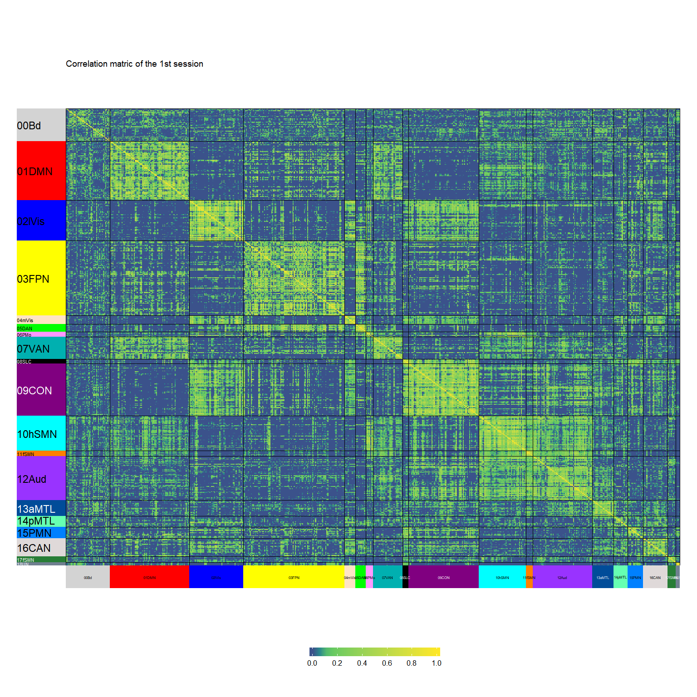
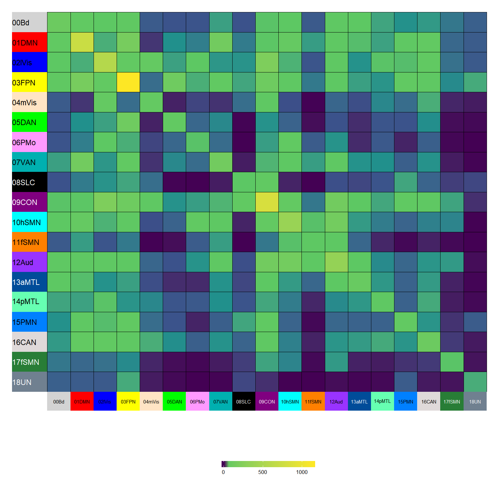
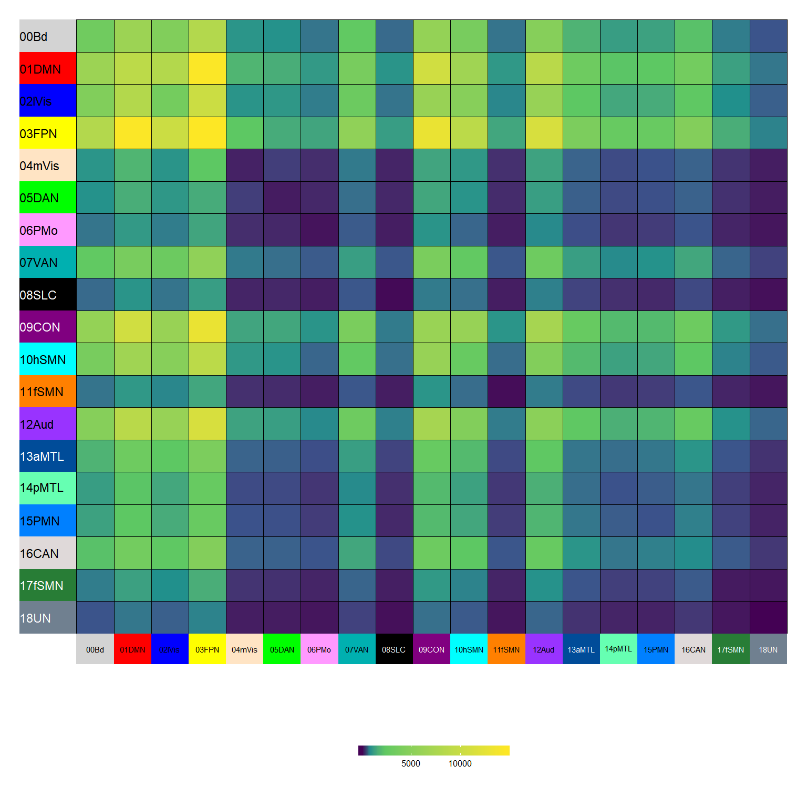
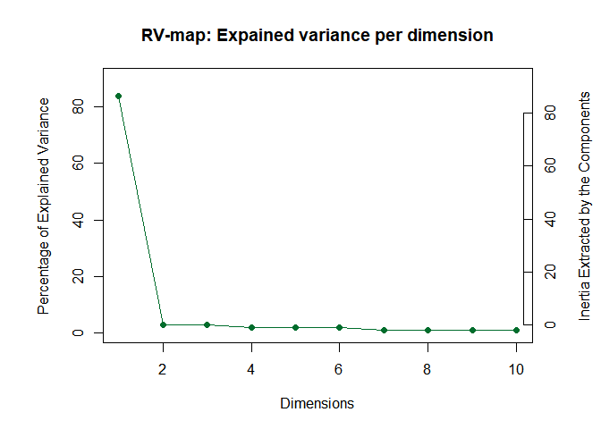
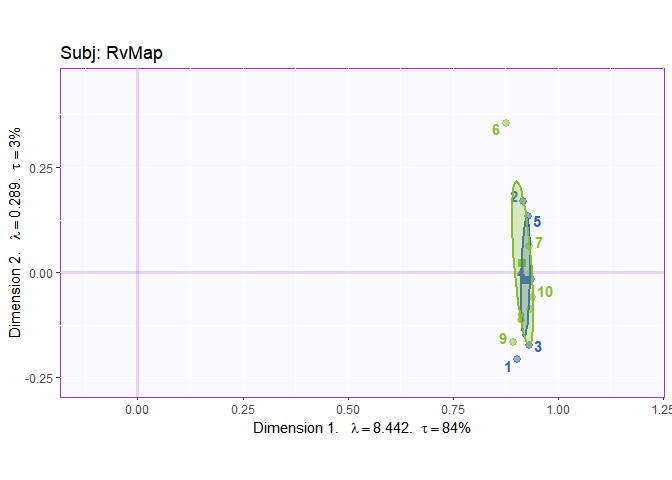
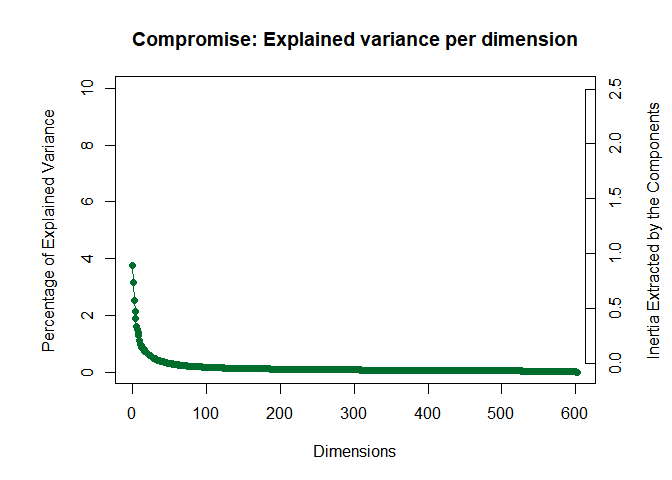
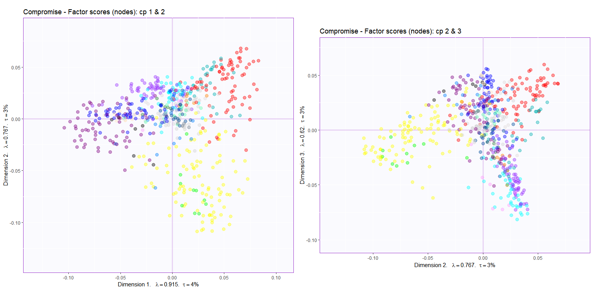
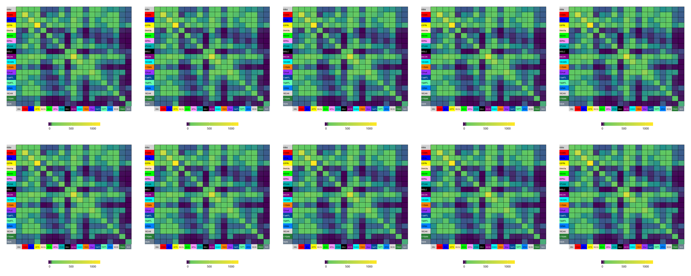
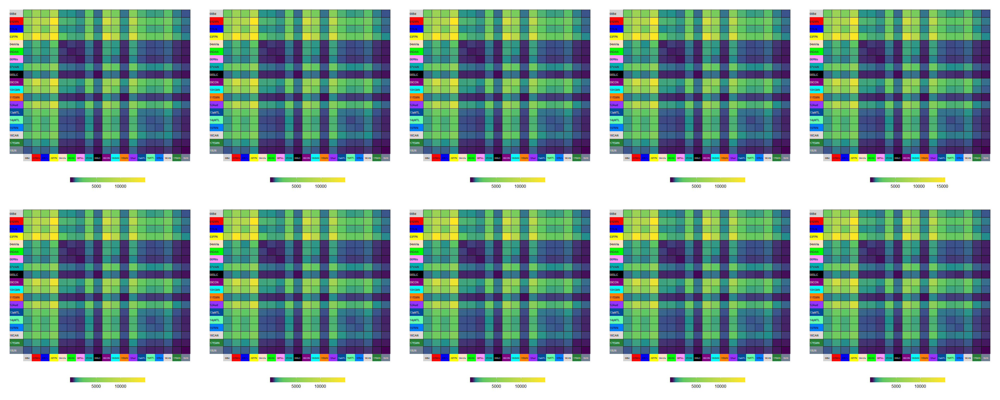
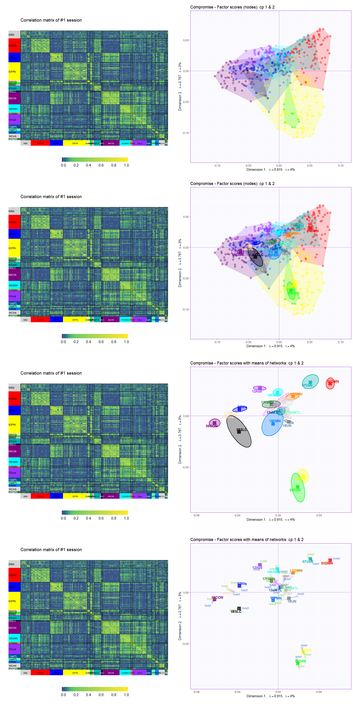

Demo\_DiSTATIS (2 x 5 sessions)
================

## Idea

To test how different normalization works on a cube, we first run a
DiSTATIS on this cube to get the result that we can compare the results
from other techniques to.

## Objectives

Here, we illustrate the DiSTATIS results from the 1-5 sessions and 6-10
sessions of subject 1 separately.

## Read data

This is a data cube of correlation: ROIs x ROIs x 10 sessions

``` r
## Exclude negative correlations
cubes$rcube[cubes$rcube < 0] <- 0
# Dimensions
dim(cubes$rcube)
## [1] 602 602  10
```

This correlation data are then transformed into distances (for
DiSTATIS). The distance data are separated into the first 5 sessions and
the last 5 sessions.

``` r
dcube <- cor2dist(cubes$rcube)
dcube_first5 <- cor2dist(cubes$rcube[,,1:5])
dcube_last5 <- cor2dist(cubes$rcube[,,6:10])
# Dimension
dim(dcube_first5)
## [1] 602 602   5
dim(dcube_last5)
## [1] 602 602   5
```

## Compute SS of each community

Get community information and create colors for different
communities

``` r
Comm.col <- list(oc = as.matrix(vox.des$Comm.Col), gc = as.matrix(CommName$CommColor))
rownames(Comm.col$oc) <- vox.des$NodeID
rownames(Comm.col$gc) <- CommName$CommLabel.short
```

## Check data with heatmap for the 1st session

<!-- -->

## Check the sums of squares (of correlation matrix) of the 1st session

<!-- -->

## Check the sums of squares (of distance matrix) of the 1st session

<!-- -->

## Run DiSTATIS

``` r
# DiSTATIS
distatis.res <- distatis(dcube)
```

## Plot results

### Rv space

#### Eigenvalues

<!-- -->

#### Factor scores

``` r
### Rv factor scores
Rv.f2plot <- distatis.res$res4Cmat$G
rv.graph <- createFactorMap(Rv.f2plot, 
                            axis1 = 1, axis2 = 2,
                            title = "Subj: RvMap",
                            col.points = color4Subj.list$oc,
                            col.labels = color4Subj.list$oc)

### Compute mean Rv for different subject
subjMean.Rv.tmp <- aggregate(Rv.f2plot, list(subj.des), mean)
subjMean.Rv <- subjMean.Rv.tmp[,2:ncol(subjMean.Rv.tmp)]
rownames(subjMean.Rv) <- subjMean.Rv.tmp[,1]
### Compute bootstrap estimates
BootCube.subj.Rv <- PTCA4CATA::Boot4Mean(Rv.f2plot, design = subj.des, niter = 100, suppressProgressBar = TRUE)
dimnames(BootCube.subj.Rv$BootCube)[[2]] <- paste0('dim', 1:dim(BootCube.subj.Rv$BootCube)[[2]])

### Dimension labels for the Rv map
rv.labels <- createxyLabels.gen(lambda = distatis.res$res4Cmat$eigValues,
                                tau = distatis.res$res4Cmat$tau,
                                axisName = "Dimension ")
### Create confidence intervals for the subjects
in.tmp <- sort(rownames(color4Subj.list$gc), index.return = TRUE)$ix
col4Sub <- color4Subj.list$gc[in.tmp]
### Plot means
rv.means.graph <- createFactorMap(subjMean.Rv,
                                  axis1 = 1, axis2 = 2,
                                  constraints = rv.graph$constraints,
                                  col.point = col4Sub,
                                  pch = 15,
                                  alpha.points = 1,
                                  col.labels = col4Sub)
GraphElli.rv <- MakeCIEllipses(BootCube.subj.Rv$BootCube[,1:2,],
                               names.of.factors = c("dim 1","dim 2"),
                               col = col4Sub,
                               p.level = .95)

### Show plot
Rvmap <- rv.graph$zeMap + rv.labels + rv.means.graph$zeMap_dots + GraphElli.rv
print(Rvmap)
```

<!-- -->

### Compromise space

#### Eigenvalues

<!-- -->

#### Factor scores

<!-- -->

#### The partial factor scores

``` r
# Partial factor scores and weights
F_j <- distatis.res$res4Splus$PartialF
alpha_j <- distatis.res$res4Cmat$alpha

# Group of sessions
code4Sub <- unique(subj.des)
nK <- length(code4Sub)

# Create empty array for F_k and alpha_k
F_k <- array(0, dim = c(dim(F_j)[[1]], dim(F_j)[[2]], nK))
dimnames(F_k) <- list(dimnames(F_j)[[1]], dimnames(F_j)[[2]], code4Sub)

alpha_k <- rep(0,nK)
names(alpha_k) <- code4Sub

Fa_j <- F_j

# multiply each factor score by alpha to compute partial factor scores
for (j in 1:dim(F_j)[[3]]){
  Fa_j[,,j] <- F_j[,,j] * alpha_j[j]
}

# get partial factor scores for each subject
for (k in 1:nK){
lindex <- subj.des == code4Sub[k]
alpha_k[k] <- sum(alpha_j[lindex])
F_k[,,k] <- (1/alpha_k[k])*apply(Fa_j[,,lindex],c(1,2),sum)
}
```

### Now plot the compromise space with means, confidence intervals, and tolerance intervals

#### Compute means for each network

``` r
BootCube.Comm <- Boot4Mean(distatis.res$res4Splus$F,
                         design = vox.des$Comm.rcd,
                         niter = 100,
                         suppressProgressBar = TRUE)
BootCube.Subj1 <- Boot4Mean(F_k[,,"Subj1"],
                        design = vox.des$Comm.rcd,
                        niter = 100,
                        suppressProgressBar = TRUE)
BootCube.Subj2 <- Boot4Mean(F_k[,,"Subj2"],
                        design = vox.des$Comm.rcd,
                        niter = 100,
                        suppressProgressBar = TRUE)
# create empty array for mean partial factor scores
F_k_Comm <- array(0, dim = c(dim(BootCube.Subj1$GroupMeans)[[1]], dim(BootCube.Subj1$GroupMeans)[[2]], nK))
dimnames(F_k_Comm) <- list(dimnames(BootCube.Subj1$GroupMeans)[[1]], dimnames(BootCube.Subj1$GroupMeans)[[2]], code4Sub)

# get the mean partial factor scores for each subject 
for (i in 1:nK){
  Boot2get <- get(sprintf('BootCube.%s', code4Sub[i]))
  F_k_Comm[,,i] <- Boot2get$GroupMeans
}
```

#### Plot

##### Plot partial factor scores

``` r
pf.mean.graph <- createPartialFactorScoresMap(factorScores = BootCube.Comm$GroupMeans,
                                              partialFactorScores = F_k_Comm,
                                              axis1 = 1, axis2 = 2,
                                              names4Partial = dimnames(F_k_Comm)[[3]],
                                              colors4Blocks = color4Subj.list$gc,
                                              font.labels = 'bold',
                                              size.points = 3,
                                              size.labels = 3)
f01e.pF.mean <- f.mean.graph.owncon$zeMap + pf.mean.graph$mapColByBlocks + f.labels
```

##### All heat maps and Rv

Rv factor
scores:

<!-- -->

Heap maps of correlation
matrices:

<!-- -->

Heap maps of SS of correlation
matrices:

<!-- -->

Heap maps of SS of distance
matrices:

<!-- -->

##### Component 1 & 2

<!-- -->

## Interpretation
