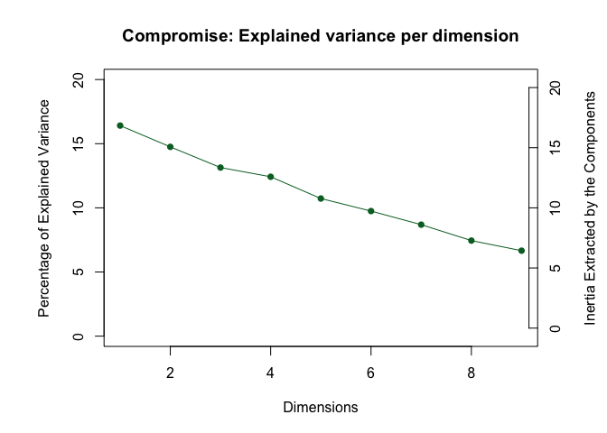
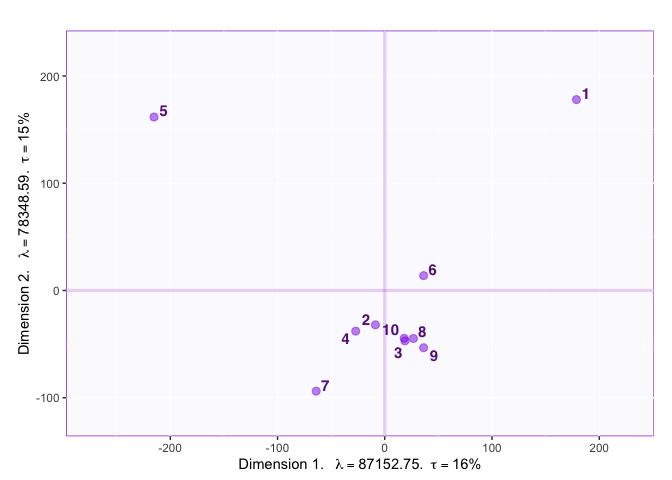
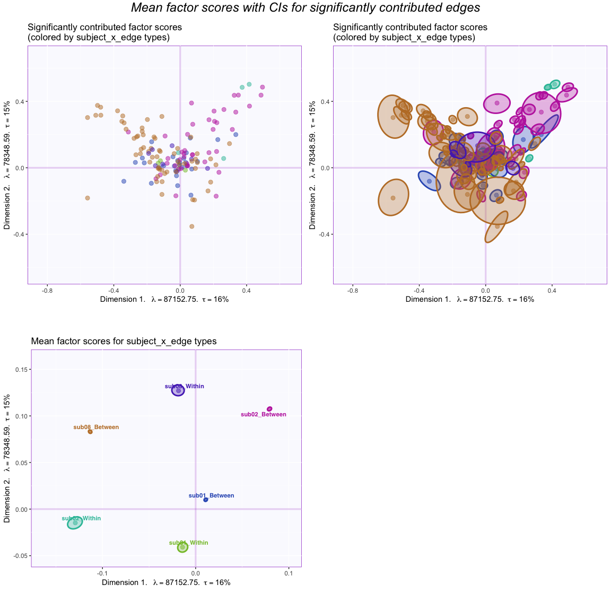

MuSu\_(NA, n, NA) - MSC01, MSC02, MSC08 (bad sub)
================

> This is an SVD with centered & normalized columns.

##### Data:

The data are from the morning scan club (MSC) resting-state data where the participants were each scanned 10 times. The data that are analyzed here are the z-transformed coefficients of correlation between regions. These regions can be categorized into 12 networks:

<table style="width:72%;">
<colgroup>
<col width="9%" />
<col width="38%" />
<col width="23%" />
</colgroup>
<thead>
<tr class="header">
<th align="center">Comm</th>
<th align="center">Community</th>
<th align="center">CommLabel.short</th>
</tr>
</thead>
<tbody>
<tr class="odd">
<td align="center">0</td>
<td align="center">UnAssign</td>
<td align="center">00Bd</td>
</tr>
<tr class="even">
<td align="center">1</td>
<td align="center">Default</td>
<td align="center">01DMN</td>
</tr>
<tr class="odd">
<td align="center">2</td>
<td align="center">lateral Visual</td>
<td align="center">02lVis</td>
</tr>
<tr class="even">
<td align="center">3</td>
<td align="center">Frontoparietal</td>
<td align="center">03FPN</td>
</tr>
<tr class="odd">
<td align="center">4</td>
<td align="center">medial Visual</td>
<td align="center">04mVis</td>
</tr>
<tr class="even">
<td align="center">5</td>
<td align="center">dorsal Attention</td>
<td align="center">05DAN</td>
</tr>
<tr class="odd">
<td align="center">6</td>
<td align="center">Premotor</td>
<td align="center">06PMo</td>
</tr>
<tr class="even">
<td align="center">7</td>
<td align="center">ventral Attention</td>
<td align="center">07VAN</td>
</tr>
<tr class="odd">
<td align="center">8</td>
<td align="center">Salience</td>
<td align="center">08SLC</td>
</tr>
<tr class="even">
<td align="center">9</td>
<td align="center">Cingular opercular</td>
<td align="center">09CON</td>
</tr>
<tr class="odd">
<td align="center">10</td>
<td align="center">Sensorimotor - hand</td>
<td align="center">10hSMN</td>
</tr>
<tr class="even">
<td align="center">11</td>
<td align="center">Sensorimotor - face</td>
<td align="center">11fSMN</td>
</tr>
<tr class="odd">
<td align="center">12</td>
<td align="center">Auditory</td>
<td align="center">12Aud</td>
</tr>
<tr class="even">
<td align="center">13</td>
<td align="center">anterior Medial temporal</td>
<td align="center">13aMTL</td>
</tr>
<tr class="odd">
<td align="center">14</td>
<td align="center">posterior Medial temporal</td>
<td align="center">14pMTL</td>
</tr>
<tr class="even">
<td align="center">15</td>
<td align="center">Parietal memory</td>
<td align="center">15PMN</td>
</tr>
<tr class="odd">
<td align="center">16</td>
<td align="center">Context</td>
<td align="center">16CAN</td>
</tr>
<tr class="even">
<td align="center">17</td>
<td align="center">Sensorimotor - foot</td>
<td align="center">17fSMN</td>
</tr>
<tr class="odd">
<td align="center">21</td>
<td align="center">Unknown</td>
<td align="center">21UN</td>
</tr>
<tr class="even">
<td align="center">25</td>
<td align="center">Unknown</td>
<td align="center">25UN</td>
</tr>
<tr class="odd">
<td align="center">29</td>
<td align="center">Unknown</td>
<td align="center">29UN</td>
</tr>
<tr class="even">
<td align="center">34</td>
<td align="center">UnKnown</td>
<td align="center">34UN</td>
</tr>
<tr class="odd">
<td align="center">37</td>
<td align="center">UnKnown</td>
<td align="center">37UN</td>
</tr>
</tbody>
</table>

``` r
# read parcel labels for each subject
parcel.comm.path <- "../../../data/parcel_community"
parcel.list <- lapply(1:length(parcelfile2read), function(x){
                      parcel <- read.table(paste0(parcel.comm.path, parcelfile2read[x]),sep = ",")
                      getVoxDes(parcel,CommName)
                      })
names(parcel.list) <- subj.name

#-- Create colors for heatmap 
labelcol <- list()
textcol <- list()
for(i in 1:length(subj.name)){
  labelcol[[i]] <- parcel.list[[i]]$Comm.col$gc[order(rownames(parcel.list[[i]]$Comm.col$gc))]
  names(labelcol)[i] <- subj.name[i]
  
  textcol[[i]] <- rep("black", length(labelcol[[i]]))
  textcol[[i]][as(colorspace::hex2RGB(labelcol[[i]]), "polarLUV")@coords[,1] < 35] <- "white"  # Convert hex2RGB to lum
}
```

As a result, the correlation matrix of each session of each subject will look like this:

This correlation matrix were then turned into a rectangular matrix

##### Rectangular data:

-   Rows: 5 sessions

-   Columns: Different edges (e.g, *within DMN*, *between DMN & CON*, *between DMN & FPN*, etc.) of different subjects

*Note: The data was transformed from the upper triangle of the correlation matrices. From the correlation matrix of each session, its upper triangle are reshape as a vector. These reshaped vectors of different sessions are then concatenated on the rows and those of different subjects are concatenated on the columns.*

##### Method:

-   Centering: across sessions (rows) (i.e., the columns are centered)

-   Normalizing: across sessions (rows) (i.e., the columns are normalized)

Then, the preprocessed data are decomposed by the SVD:

##### Results:

###### Scree plot

First, the scree plot illustrates the eigen value with percentage of explained variance of each component. The results showed that there are three important components with the percentage of explained variance more than average (i.e., 1/10).



###### Contributions

Before checking the factor scores, we first plot the contributions to check the importance of network edges. The important edges are defined as those that with significant mean contribution to both components 1 and 2.

We first compute the contribution and find the important edges and sessions:

``` r
#--- get the contribution of each component
cI <- svd.res$ExPosition.Data$ci
cJ <- svd.res$ExPosition.Data$cj
#--- get the sum of contribution for each edge
c_edge <- gtlabel$subjects_edge_label %>% as.matrix %>% makeNominalData %>% t %>% "%*%"(cJ)
rownames(c_edge) <- sub(".","",rownames(c_edge))
rownames(cI) <- c(1:10)
## Find important sessions
#--- get the contribution for component 1 AND 2 by sum(SS from 1, SS from 2)/sum(eigs 1, eigs 2)
sesCtr12 <- (cI[,1]+cI[,2])/(svd.res$ExPosition.Data$eigs[1] + svd.res$ExPosition.Data$eigs[2])
#--- the important sessions are the ones that contribute more than or equal to the average
importantSes <- (sesCtr12 >= 1/length(sesCtr12))
importantSes1 <- (cI[,1] >= 1/length(cI[,1]))
importantSes2 <- (cI[,2] >= 1/length(cI[,2]))
#--- color for sessions
col4ImportantSes <- as.matrix(rep("mediumorchid4",nrow(cI))) # get colors
col4NS <- 'gray48' # set color for not significant edges to gray
col4ImportantSes[!importantSes] <- col4NS # replace them in the color vector

## Find important edges
#--- compute the sums of squares of each variable for each component
absCtrEdg <- as.matrix(c_edge) %*% diag(svd.res$ExPosition.Data$eigs)
#--- get the contribution for component 1 AND 2 by sum(SS from 1, SS from 2)/sum(eigs 1, eigs 2)
edgCtr12 <- (absCtrEdg[,1] + absCtrEdg[,2])/(svd.res$ExPosition.Data$eigs[1] + svd.res$ExPosition.Data$eigs[2])
#--- the important variables are the ones that contribute more than or equal to the average
importantEdg <- (edgCtr12 >= 1/length(edgCtr12))
importantEdg1 <- (cI[,1] >= 1/length(cJ[,1]))
importantEdg2 <- (cI[,2] >= 1/length(cJ[,2]))
#--- find the between/within description for each network edge
net.edge <- matrix(NA, nrow = nrow(c_edge),ncol = 1)
for (i in 1:nrow(c_edge)){
  edge2check <- rownames(c_edge)[i]
  net.edge[i,1] <- unique(gtlabel[which(gtlabel$subjects_edge_label == edge2check),"subjects_wb"])
}
#--- create color based on the between/within description for network edges
net.edge.col <- net.edge %>% makeNominalData %>% createColorVectorsByDesign
rownames(net.edge.col$gc) <- sub(".","",rownames(net.edge.col$gc))
rownames(net.edge.col$oc) <- rownames(c_edge)
#--- color for networks
col4ImportantEdg <- net.edge.col$oc # get colors
col4NS <- 'gray90' # set color for not significant edges to gray
col4ImportantEdg[!importantEdg] <- col4NS # replace them in the color vector
```

Then the contributions are shown in plots

 The contribution for each network edge is computed by dividing its total SS across region edges and dimensions (i.e., the cross product of contribution and eigenvalues) by the total eigenvalues of the two components.

###### Factor scores

First, we plot the factor scores for the 10 sessions



We can also compute the partial factor scores for each participant:

``` r
# subj.table <- gtlabel$subjects_label
# n_subj <- length(unique(gtlabel$subjects_label))
# # compute partial factor scores: K x sv[1] x X_k x Q_k
# pFi <- sapply(1:n_subj, function(x){
#   n_subj/(sv[x])*cgt[,which(subj.table == unique(subj.table)[x])] %*% (svd.res$ExPosition.Data$pdq$q[which(subj.table == unique(subj.table)[x]),])
# }, simplify = "array")
# # name the dimension of the array that stores partial F
# dimnames(pFi) <- list(rownames(cgt),colnames(svd.res$ExPosition.Data$fi),unique(subj.table))
# 
# ## Check barycentric
# ch1 <- apply(pFi,c(1:2),mean)
# ch2 <- cgt %*% (svd.res$ExPosition.Data$pdq$q)
```

And plot them on the same factor map:

To have a clearer view of the factor scores for the subject x edges, we first compute the mean factor scores for the each network edge.

``` r
# Compute means of factor scores for different edges----
mean.fj <- getMeans(svd.res$ExPosition.Data$fj, gtlabel$subjects_edge_label) # with t(gt)
colnames(mean.fj) <- sapply(c(1:ncol(mean.fj)), function(x){sprintf("Factor %s",x)})

BootCube.Comm <- Boot4Mean(svd.res$ExPosition.Data$fj,
                           design = gtlabel$subjects_edge_label,
                           niter = 100,
                           suppressProgressBar = TRUE)


# Compute means of factor scores for different types of edges
mean.fj.bw <- getMeans(svd.res$ExPosition.Data$fj, gtlabel$subjects_wb) # with t(gt)
colnames(mean.fj.bw) <- sapply(c(1:ncol(mean.fj.bw)), function(x){sprintf("Factor %s",x)})

BootCube.Comm.bw <- Boot4Mean(svd.res$ExPosition.Data$fj,
                           design = gtlabel$subjects_wb,
                           niter = 100,
                           suppressProgressBar = TRUE)
```

Next, we plot the factor scores for the subject x edges (a mess): Dim 1 & 2


Note that a network edge with its region edges significantly contribute to the components both positively and negatively results in a significant mean factor score that is close to the origin. Also, a network edge with only few region edges will lead to a small total SS as compared to the total eigenvalues; this type of network edge might not be significant even when being far away from the origin. (This is shown in the chunk named `checkCtr` which is hidden/commented in the .rmd.)

We can also add boostrap intervals for the factor scores


