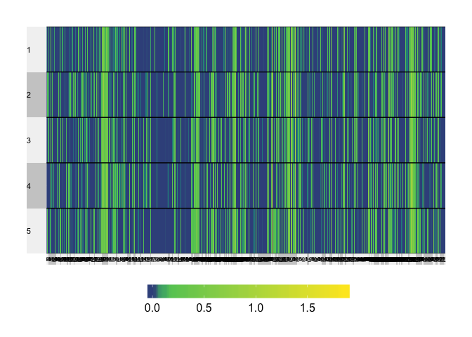
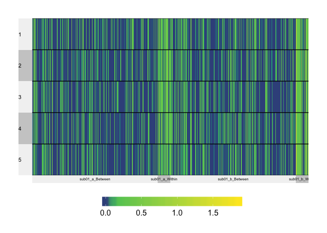
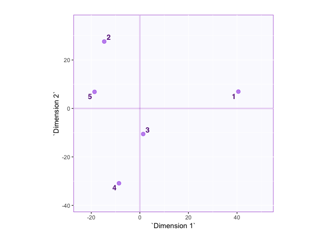
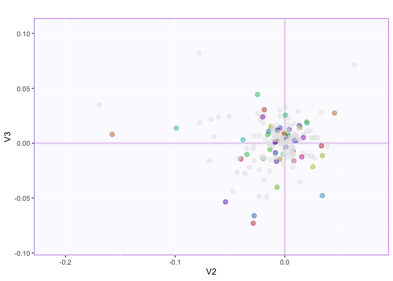
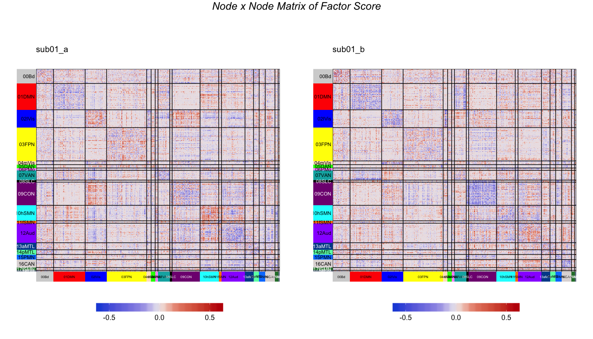
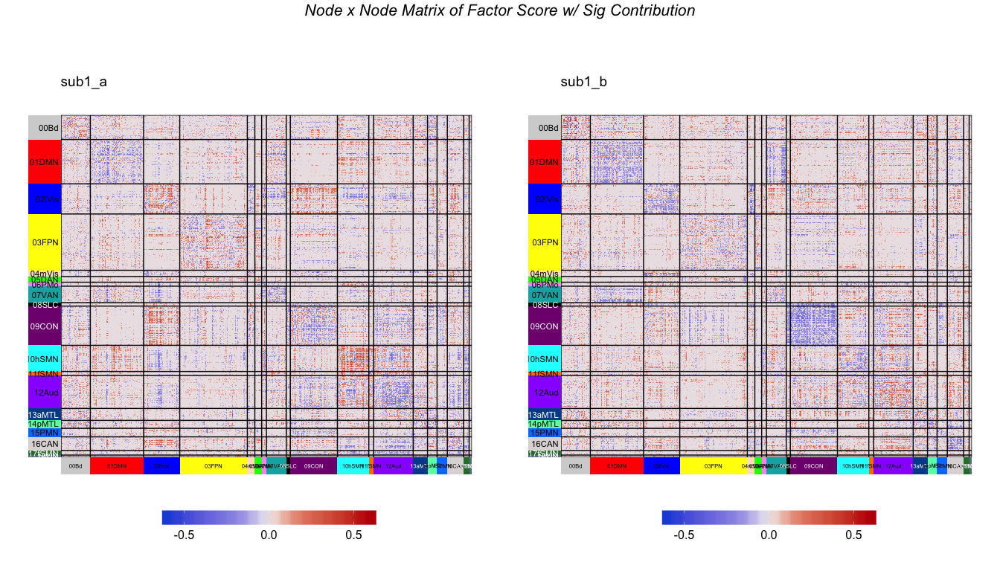
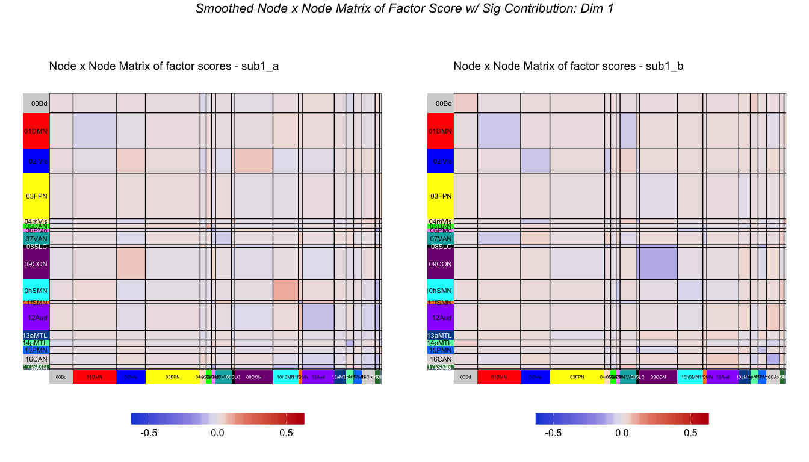

MuSuDemo\_nopreproc (2 sub01 x 5 sessions)
================

Outline
-------

##### Correlation matirx (first 5 sessions x of sub01 & next 5 sessions of sub01 ) -&gt; rectangular matrix \[sessions x edges by network by subject\] -&gt; center across sessions -&gt; SVD

This retains the same dimension across "two" subjects (data are all from sub01).

Objectives
----------

Here, we illustrate the results when the rectangular matrix (sessions x edges by network by subject) is analyzed by SVD after the each edge is centered (center across sessions).

Read cube data (z(correlation) matrix) and the information for communities
--------------------------------------------------------------------------

This is a data cube of correlation: ROIs x ROIs x 10 sessions

``` r
# Dimensions
dim(cubes$rcube)
```

    ## [1] 602 602  10

Read the rectangular table
--------------------------

### The grand table:



### the heatmap with columns arranged according to edgetype



Centered across sessions (rows)
-------------------------------

``` r
gt_centXsess <- expo.scale(gt, scale = FALSE)
```

SVD
---

The data are transposed so that the rows are now different edges of different subject and the columns are different sessions. The data are centered across sessions (each edge is centered).

``` r
# Use subject_edge_label as column names
colnames(gt_centXsess) <- labels$subjects_edge_label
# Transpose for epPCA
t_gt_centXsess <- t(gt_centXsess)
# SVD on the rectangular data ------------------------
pca.res.subj <- epPCA(t_gt_centXsess,scale = FALSE, center = FALSE, DESIGN = labels$subjects_edge_label, make_design_nominal = TRUE, graphs = FALSE)
```

    ## Warning in sqrt(eigOut$values): NaNs produced

``` r
# check dimension
dim(t_gt_centXsess)
```

    ## [1] 361802      5

### Check the contribution of each variable

``` r
#--- get the contribution of each component
cI <- pca.res.subj$ExPosition.Data$ci
#--- get the sum of contribution for each edge
c_edge <- labels$subjects_edge_label %>% as.matrix %>% makeNominalData %>% t %>% "%*%"(cI)
rownames(c_edge) <- sub(".","",rownames(c_edge))
#--- compute the sums of squares of each variable for each component
absCtrEdg <- as.matrix(c_edge) %*% diag(pca.res.subj$ExPosition.Data$eigs)
#--- get the contribution for component 1 AND 2 by sum(SS from 1, SS from 2)/sum(eigs 1, eigs 2)
edgCtr12 <- (absCtrEdg[,1] + absCtrEdg[,2])/(pca.res.subj$ExPosition.Data$eigs[1] + pca.res.subj$ExPosition.Data$eigs[2])
edgCtr23 <- (absCtrEdg[,3] + absCtrEdg[,2])/(pca.res.subj$ExPosition.Data$eigs[2] + pca.res.subj$ExPosition.Data$eigs[3])
#--- the important variables are the ones that contribute more than or equal to the average
importantEdg <- (edgCtr12 >= 1/length(edgCtr12))
importantEdg <- (edgCtr23 >= 1/length(edgCtr23))
#--- color for networks
col4ImportantEdg <- unique(pca.res.subj$Plotting.Data$fi.col) # get colors
col4NS <- 'gray90' # set color for not significant edges to gray
col4ImportantEdg[!importantEdg] <- col4NS # replace them in the color vector
```

Inference
---------

To have a (relatively) clearer view of the results, we compute the mean for each edge (or edge type) that we are interested in.

``` r
# Compute means of factor scores for different edges----
mean.fi <- getMeans(pca.res.subj$ExPosition.Data$fi, labels$subjects_edge_label) # with t(gt)

# BootCube.Comm <- Boot4Mean(pca.res.subj$ExPosition.Data$fi,
#                            design = labels$subjects_edge_label,
#                            niter = 100,
#                            suppressProgressBar = TRUE)


# Compute means of factor scores for different types of edges
mean.fi.bw <- getMeans(pca.res.subj$ExPosition.Data$fi, labels$subjects_wb) # with t(gt)

# BootCube.Comm.bw <- Boot4Mean(pca.res.subj$ExPosition.Data$fi,
#                            design = labels$subjects_wb,
#                            niter = 100,
#                            suppressProgressBar = TRUE)
```

Plot
----

First, we plot the 5 sessions



Plot column factor scores (a mess) 

Show column factor as square matrix of sub01\_a and sub01\_b



Factor score in squarem matrix that have significant contribution only



Smoothed Sig Factor Score


