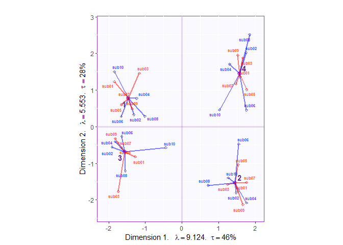
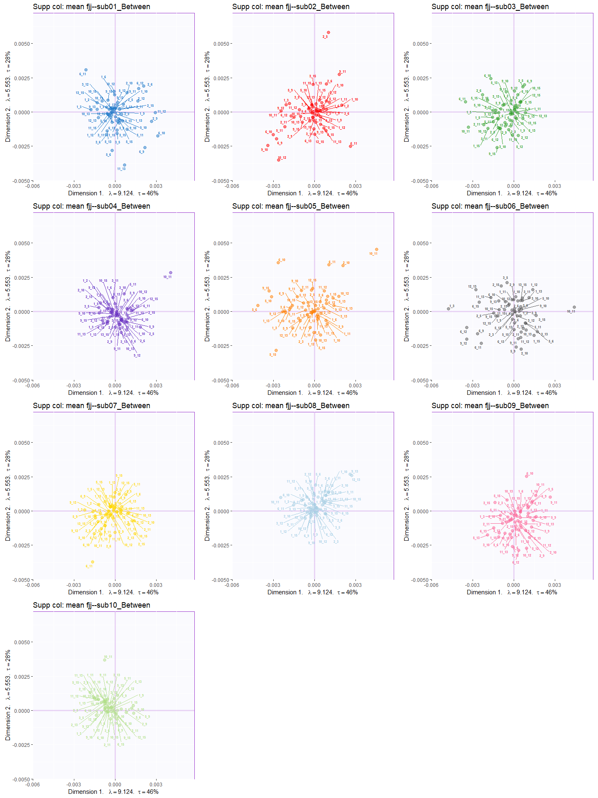
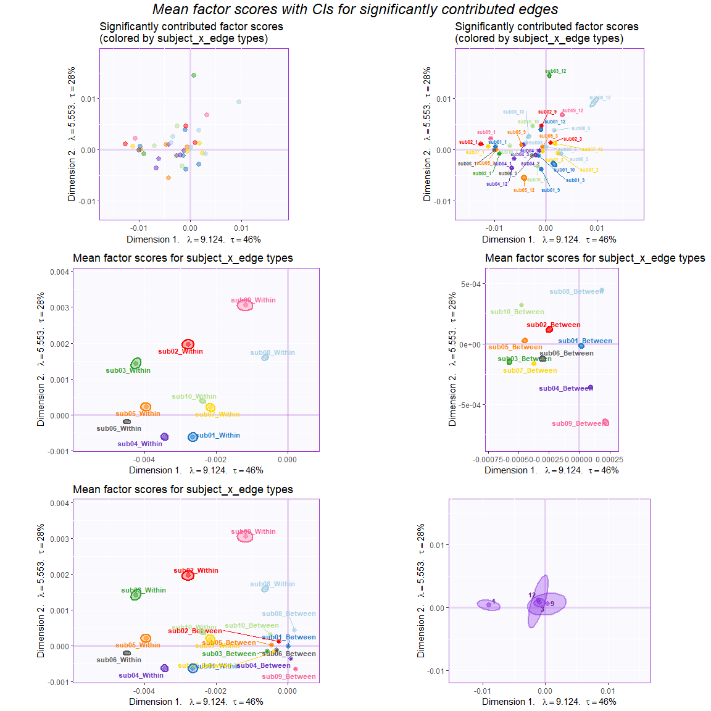

MuSu\_(NA, c, MFA\_ActiveWithin) - MSC All Subjects (N=10) Big Networks
4 Sessions (rows)- Sim Attack
================

> Reduce grandtable to have consistent networks only & only 4 sessions
> (rows)

``` r
gt <- gt[,gtlabel$bignet=="Y"]
gtlabel <- gtlabel[gtlabel$bignet=="Y",]

gt <- gt[2:5,]

# check dim
dim(gt); dim(gtlabel)
```

    ## [1]       4 1181892

    ## [1] 1181892       6

> Induce system-level changes (sim attack)

**Attack 1**

  - In all *subjects* and Even-numbered *sessions* (2 & 4), Reduce
    within connectivity in Default Mode (Syslabel: 1), Default-FP (1\_3)
    and Default\_VAN (1\_5).
      - identify within default connectivity, default-FP and default-VAN
      - Simulate reduced connectivity by dividing edges that were
        identified by above and reduce 50% of connectivity (/2)

<!-- end list -->

``` r
i_edges <- which(is.element(gtlabel$edges_label, c("1","1_3","1_5"))) 

## Commented out code that would be used to only manipulate even-# subjects
# i_sub <- which(is.element(gtlabel$subjects_label, sprintf("sub%02d", seq(2,length(subj.name),2))))
# i_attack <- intersect(i_edges, i_sub)
# gt[seq(2, nrow(gt), 2), i_attack] <- gt[seq(2, nrow(gt), 2), i_attack]/2  # reduce 50%

gt[seq(2, nrow(gt), 2), i_edges] <- gt[seq(2, nrow(gt), 2), i_edges]/2  # reduce 50%
```

> This is an SVD with centered columns and hierarchical (network edges
> -\> subjects) MFA-normalized tables.

##### Data:

The data are from the morning scan club (MSC) resting-state data where
the participants were each scanned 10 times. The data that are analyzed
here are the z-transformed coefficients of correlation between regions.
These regions can be categorized into different networks:

| Comm | Community | CommLabel.short |
| :--: | :-------: | :-------------: |
|  1   |  Default  |      01DMN      |
|  2   |  LatVis   |     02lVis      |
|  3   | FrontoPar |      03FPN      |
|  5   | DorsAttn  |      05DAN      |
|  6   | Premotor  |      06PMo      |
|  9   | CingOperc |      09CON      |
|  10  |  HandSM   |     10hSMN      |
|  11  |  FaceSM   |     11faSMN     |
|  12  | Auditory  |      12Aud      |
|  13  |  AntMTL   |     13aMTL      |
|  15  | ParMemory |      15PMN      |

``` r
# read parcel labels for each subject
parcel.list <- lapply(1:length(parcelfile2read), function(x){
  parcel <- read.table(paste0(parcel.comm.path, parcelfile2read[x]),sep = ",")
  getVoxDes(parcel,CommName)
})
names(parcel.list) <- subj.name
#-- Create colors for heatmap 
labelcol <- list()
textcol <- list()
for(i in 1:length(subj.name)){
  labelcol[[i]] <- parcel.list[[i]]$Comm.col$gc[order(rownames(parcel.list[[i]]$Comm.col$gc))]
  names(labelcol)[i] <- subj.name[i]
  
  textcol[[i]] <- rep("black", length(labelcol[[i]]))
  textcol[[i]][as(colorspace::hex2RGB(labelcol[[i]]), "polarLUV")@coords[,1] < 35] <- "white"  # Convert hex2RGB to lum
}
```

> The correlation matrices were turned into a rectangular matrix

##### Rectangular data:

  - Rows: 4 sessions

  - Columns: Different edges (e.g, *within DMN*, *between DMN & CON*,
    *between DMN & FPN*, etc.) of different subjects

*Note: The data was transformed from the upper triangle of the
correlation matrices. From the correlation matrix of each session, its
upper triangle are reshape as a vector. These reshaped vectors of
different sessions are then concatenated on the rows and those of
different subjects are concatenated on the columns.*

##### Method:

  - Data: only the within-network edges

  - Centering: across sessions (rows) (i.e., the columns are centered)

  - Normalizing: MFA-normalized by subjects (e.g., within-sub01,
    within-sub02, …)

  - Supplementary projection: the between-network edges

First we compute the weights that are used to MFA-normalized each
subject table. These weights are computed as the inverse of the first
singular value:

Use the within-network edges as ACTIVE data, and use the between-network
edges as SUPPLEMENTARY columns

``` r
gt_preproc.act <- gt_preproc[,gtlabel$wb == "Within"]
gtlabel.act <- gtlabel[gtlabel$wb == "Within",]
gt_preproc.supp <- gt_preproc[,gtlabel$wb == "Between"]
gtlabel.supp <- gtlabel[gtlabel$wb == "Between",]
```

Then, the preprocessed data are decomposed by the SVD:

##### Results:

###### Scree plot

First, the scree plot illustrates the eigen value with percentage of
explained variance of each component. The results showed that there are
three important components with the percentage of explained variance
more than average (i.e., 1/10).

<!-- -->

###### Contributions

Before checking the factor scores, we first plot the contributions to
check the importance of network edges. The important edges are defined
as those that with significant mean contribution to both components 1
and 2.

We first compute the contribution and find the important edges and
sessions:

``` r
#--- get the contribution of each component
cI <- svd.res$ExPosition.Data$ci
cJ <- svd.res$ExPosition.Data$cj

#--- get the sum of contribution for each edge
c_edge <- aggregate(cJ,list(edge = gtlabel.act$subjects_edge_label),sum)
rownames(c_edge) <- c_edge$edge
c_edge <- c_edge[,-1]
rownames(cI) <- c(1:nrow(gt))

## Find important sessions
#--- get the contribution for component 1 AND 2 by sum(SS from 1, SS from 2)/sum(eigs 1, eigs 2)
sesCtr12 <- (cI[,1]+cI[,2])/(svd.res$ExPosition.Data$eigs[1] + svd.res$ExPosition.Data$eigs[2])

#--- the important sessions are the ones that contribute more than or equal to the average
importantSes <- (sesCtr12 >= 1/length(sesCtr12))
importantSes1 <- (cI[,1] >= 1/length(cI[,1]))
importantSes2 <- (cI[,2] >= 1/length(cI[,2]))

#--- color for sessions
col4ImportantSes <- as.matrix(rep("mediumorchid4",nrow(cI)))  # get colors
col4NS <- 'gray48'                                            # set color for not significant edges to gray
col4ImportantSes[!importantSes] <- col4NS                     # replace them in the color vector

## Find important edges
#--- compute the sums of squares of each variable for each component
absCtrEdg <- as.matrix(c_edge) %*% diag(svd.res$ExPosition.Data$eigs)

#--- get the contribution for component 1 AND 2 by sum(SS from 1, SS from 2)/sum(eigs 1, eigs 2)
edgCtr12 <- (absCtrEdg[,1] + absCtrEdg[,2])/(svd.res$ExPosition.Data$eigs[1] + svd.res$ExPosition.Data$eigs[2])

#--- the important variables are the ones that contribute more than or equal to the average
importantEdg <- (edgCtr12 >= 1/length(edgCtr12))
importantEdg1 <- (absCtrEdg[,1] >= 1/length(absCtrEdg[,1]))
importantEdg2 <- (absCtrEdg[,2] >= 1/length(absCtrEdg[,2]))

#--- find the between/within description for each network edge
net.edge <- matrix(NA, nrow = nrow(c_edge),ncol = 2) %>% data.frame
for (i in 1:nrow(c_edge)){
  edge2check <- rownames(c_edge)[i]
  net.edge[i,1] <- unique(gtlabel.act[which(gtlabel.act$subjects_edge_label == edge2check),"subjects_wb"])
  net.edge[i,2] <- as.character(unique(gtlabel.act[which(gtlabel.act$subjects_edge_label == edge2check),"edges_label"]))
}
colnames(net.edge) <- c("subjects_wb", "network")
rownames(net.edge) <- rownames(c_edge)

# for supplementary between edges
supp.edge <- unique(gtlabel.supp$subjects_edge_label)
net.edge.supp <- matrix(NA, nrow = length(supp.edge),ncol = 2) %>% data.frame
for (i in 1:length(supp.edge)){
  edge2check <- supp.edge[i]
  net.edge.supp[i,1] <- unique(gtlabel.supp[which(gtlabel.supp$subjects_edge_label == edge2check),"subjects_wb"])
  net.edge.supp[i,2] <- as.character(unique(gtlabel.supp[which(gtlabel.supp$subjects_edge_label == edge2check),"edges_label"]))
}
colnames(net.edge.supp) <- c("subjects_wb", "network")
rownames(net.edge.supp) <- supp.edge

### identify important common edge------------------------------------------------------
#--- get the sum of contribution for each edge
c_commedge <- aggregate(cJ,by = list(commedge = gtlabel.act$edges_label),sum)
rownames(c_commedge) <- c_commedge$commedge
c_commedge <- c_commedge[,-1]

## Find important commedges
#--- compute the sums of squares of each variable for each component
absCtrCommEdg <- as.matrix(c_commedge) %*% diag(svd.res$ExPosition.Data$eigs)

#--- get the contribution for component 1 AND 2 by sum(SS from 1, SS from 2)/sum(eigs 1, eigs 2)
CommedgCtr12 <- (absCtrCommEdg[,1] + absCtrCommEdg[,2])/(svd.res$ExPosition.Data$eigs[1] + svd.res$ExPosition.Data$eigs[2])

#--- the important variables are the ones that contribute more than or equal to the average
importantCommEdg <- (CommedgCtr12 >= 1/length(CommedgCtr12))
importantCommEdg1 <- (absCtrCommEdg[,1] >= 1/length(cJ[,1]))
importantCommEdg2 <- (absCtrCommEdg[,2] >= 1/length(cJ[,2]))

## ------------------------------------------------------------------------------------

#--- create color based on the between/within description for network edges
## color by subject
net.edge.col.bysub <- list(oc = as.matrix(plyr::mapvalues(net.edge$subjects_wb,from = unique(net.edge$subjects_wb), to = cols25(10))),
                     gc = as.matrix(cols25(10)))
rownames(net.edge.col.bysub$oc) <- rownames(c_edge)
rownames(net.edge.col.bysub$gc) <- unique(net.edge$subjects_wb)

## color by network
net.edge.col.bynet <- list(oc = as.matrix(plyr::mapvalues(net.edge$network,from = unique(net.edge$network), to = parcel.list[[1]]$Comm.col$gc)),
                     gc = as.matrix(parcel.list[[1]]$Comm.col$gc))
rownames(net.edge.col.bynet$oc) <- rownames(c_edge)
rownames(net.edge.col.bynet$gc) <- unique(net.edge$network)

## color by subject of supplementary
net.edge.col.bysub.supp <- list(oc = as.matrix(plyr::mapvalues(net.edge.supp$subjects_wb,from = unique(net.edge.supp$subjects_wb), to = cols25(10))),
                     gc = as.matrix(cols25(10)))
rownames(net.edge.col.bysub.supp$oc) <- supp.edge
rownames(net.edge.col.bysub.supp$gc) <- unique(net.edge.supp$subjects_wb)

#--- color for networks by subjects
col4ImportantEdg <- net.edge.col.bysub$oc # get colors
col4NS <- 'gray90' # set color for not significant edges to gray
col4ImportantEdg[!importantEdg] <- col4NS # replace them in the color vector
#--- color for networks by networks
col4ImportantEdg.bynet <- net.edge.col.bynet$oc # get colors
col4NS.bynet <- 'gray90' # set color for not significant edges to gray
col4ImportantEdg.bynet[!importantEdg] <- col4NS.bynet # replace them in the color vector
```

Then the contributions are shown in plots

<!-- -->

The contribution for each network edge is computed by dividing its total
SS across region edges and dimensions (i.e., the cross product of
contribution and eigenvalues) by the total eigenvalues of the two
components.

###### Factor scores

First, we plot the factor scores for the 4 sessions

<!-- -->

We can also plot the partial factor scores that show how each subject
contribute to different sesssions.

``` r
# We can also compute the partial factor scores for each participant:
subj.table <- gtlabel.act$subjects_wb
table2normalize <- subtab_i[[1]][gtlabel$wb == "Within"]

n_subj <- length(unique(gtlabel.act$subjects_label))
n_table2normalize <- sapply(1:n_subj, function(x){
  length(unique(table2normalize[which(subj.table == unique(subj.table)[x])]))})

# compute partial factor scores: K.sub x sv[1] x sv[2] x X_k x Q_k
pFi <- sapply(1:n_subj, function(x){
  # weighted by the inverse of "the # of tables contributed for each subject"
  (sum(n_table2normalize)/n_table2normalize[x])*gt_preproc.act[,which(subj.table == unique(subj.table)[x])] %*% (svd.res$ExPosition.Data$pdq$q[which(subj.table == unique(subj.table)[x]),])
}, simplify = "array")

# name the dimension of the array that stores partial F
dimnames(pFi) <- list(rownames(cgt),colnames(svd.res$ExPosition.Data$fi),unique(subj.table))

## Check barycentric
ch1 <- apply(pFi,c(1:2),mean)
ch2 <- gt_preproc.act %*% (svd.res$ExPosition.Data$pdq$q)
```

Note that ALL subjects’ EVEN numbered sessions are induced with reduced
connectivity in default, default-FP and default-VAN.

<!-- -->

To have a clearer view of the factor scores for the subject x edges, we
first compute the mean factor scores for the each network edge.

``` r
# Compute means of factor scores for different edges----
mean.fj <- getMeans(svd.res$ExPosition.Data$fj, gtlabel.act$subjects_edge_label) # with t(gt)
mean.fj.supp <- getMeans(svd.res.supp$fjj, gtlabel.supp$subjects_edge_label) # between-network edges
colnames(mean.fj) <- paste("Factor", 1:ncol(mean.fj))
colnames(mean.fj.supp) <- paste("Factor", 1:ncol(mean.fj.supp))

tictoc::tic()
BootCube.Comm <- Boot4Mean(svd.res$ExPosition.Data$fj,
                           parallelize = T,
                           design = gtlabel.act$subjects_edge_label,
                           niter = 100,
                           suppressProgressBar = TRUE)
tictoc::toc()
```

    ## 34.83 sec elapsed

``` r
tictoc::tic()
BootCube.Comm.supp <- Boot4Mean(svd.res.supp$fjj,
                           parallelize = T,
                           design = gtlabel.supp$subjects_edge_label,
                           niter = 100,
                           suppressProgressBar = TRUE)
tictoc::toc()
```

    ## 259.48 sec elapsed

``` r
# compute mean factor scores for each edge and the partial factor scores of each subject for these factor scores
### use split string to separate the subject and edge labels (this is done at this step because we want to take the average across them after averaging across regions that belong to the same edge and subject)
mean.fj.label <- strsplit(sub('(^[^_]+)_(.*)$', '\\1 \\2', rownames(mean.fj)), ' ') %>% 
                    unlist %>% 
                    matrix(ncol = 2, byrow = T, dimnames = list(rownames(mean.fj),c("sub","edge"))) %>% 
                    data.frame
mean.fj.label.supp <- strsplit(sub('(^[^_]+)_(.*)$', '\\1 \\2', rownames(mean.fj.supp)), ' ') %>% 
                    unlist %>% 
                    matrix(ncol = 2, byrow = T, dimnames = list(rownames(mean.fj.supp),c("sub","edge"))) %>% 
                    data.frame

### compute means
mean.edge.fj <- getMeans(mean.fj, mean.fj.label$edge)
mean.edge.fj.supp <- getMeans(mean.fj.supp, mean.fj.label.supp$edge)

### create array for partial factor scores
edge.pF <- array(data = NA, 
                 dim = (c(nrow(mean.edge.fj), ncol(mean.fj), length(unique(mean.fj.label$sub)))), 
                 dimnames = list(rownames(mean.edge.fj), colnames(mean.fj), unique(mean.fj.label$sub)))

edge.pF.supp <- array(data = NA, 
                 dim = (c(nrow(mean.edge.fj.supp), ncol(mean.fj.supp), length(unique(mean.fj.label.supp$sub)))), 
                 dimnames = list(rownames(mean.edge.fj.supp), colnames(mean.fj.supp), unique(mean.fj.label.supp$sub)))

### fill the array of partial factor scores
n.edges <- dim(edge.pF)[1]
n.edges.supp <- dim(edge.pF.supp)[1]

for (i in 1:length(subj.name)){
  for (j in 1:n.edges){
    tbname <- subj.name[i]
    rwname <- rownames(edge.pF)[j]
    edge.pF[rwname,,tbname] <- as.matrix(mean.fj[which(mean.fj.label$sub == tbname & mean.fj.label$edge == rwname),])
  }
}

for (i in 1:length(subj.name)){
  for (j in 1:n.edges.supp){
    tbname <- subj.name[i]
    rwname <- rownames(edge.pF.supp)[j]
    edge.pF.supp[rwname,,tbname] <- as.matrix(mean.fj.supp[which(mean.fj.label.supp$sub == tbname & mean.fj.label.supp$edge == rwname),])
  }
}

### get bootstrap CI
tictoc::tic()
BootCube.Comm.edge <- Boot4Mean(mean.fj,
                                parallelize = T,
                                design = mean.fj.label$edge,
                                niter = 100,
                                suppressProgressBar = TRUE)
BootCube.Comm.edge.supp <- Boot4Mean(mean.fj.supp,
                                parallelize = T,
                                design = mean.fj.label.supp$edge,
                                niter = 100,
                                suppressProgressBar = TRUE)
tictoc::toc()
```

    ## 20.2 sec elapsed

``` r
# Compute means of factor scores for different types of edges
mean.fj.bw <- getMeans(svd.res$ExPosition.Data$fj, gtlabel.act$subjects_wb) # with t(gt)
mean.fj.bw.supp <- getMeans(svd.res.supp$fjj, gtlabel.supp$subjects_wb) # with t(gt)
colnames(mean.fj.bw) <- paste("Factor", 1:ncol(mean.fj.bw))
colnames(mean.fj.bw.supp) <- paste("Factor", 1:ncol(mean.fj.bw.supp))

tictoc::tic()
BootCube.Comm.bw <- Boot4Mean(svd.res$ExPosition.Data$fj,
                              parallelize = T,
                              design = gtlabel.act$subjects_wb,
                              niter = 100,
                              suppressProgressBar = TRUE)
BootCube.Comm.bw.supp <- Boot4Mean(svd.res.supp$fjj,
                              parallelize = T,
                              design = gtlabel.supp$subjects_wb,
                              niter = 100,
                              suppressProgressBar = TRUE)
tictoc::toc()
```

    ## 174.28 sec elapsed

Next, we plot the factor scores for the subject x edges (a mess): Dim 1
& 2

<!-- -->

Check dispersion of between-network edges for all subjects

<!-- -->

``` r
sub.idx <- gtlabel.supp$subjects_label == "sub01"
alledge.des <- gtlabel.supp$edges_label[sub.idx]
all.edge.color <- createColorVectorsByDesign(makeNominalData(as.matrix(alledge.des)))
f.sub.alledges <- createFactorMap(svd.res.supp$fjj[sub.idx,], axis1 = 1, axis2 = 2,
                               col.points = all.edge.color$oc,
                               col.labels = all.edge.color$oc,
                               constraints = minmaxHelper(mean.fj.supp),
                               text.cex = 1,
                               force = 0.5,
                               title = "sub01")


f.sub.alledges$zeMap_background + f.sub.alledges$zeMap_dots + 
  theme(legend.position = "topright")
```

    ## Warning: Removed 14920 rows containing missing values (geom_point).

<!-- -->

Note that a network edge with its region edges significantly contribute
to the components both positively and negatively results in a
significant mean factor score that is close to the origin. Also, a
network edge with only few region edges will lead to a small total SS as
compared to the total eigenvalues; this type of network edge might not
be significant even when being far away from the origin. (This is shown
in the chunk named `checkCtr` which is hidden/commented in the .rmd.)

We can also add boostrap intervals for the factor scores

<!-- -->

## Component 3

``` r
# #--- get the contribution of each component
# cI <- svd.res$ExPosition.Data$ci
# cJ <- svd.res$ExPosition.Data$cj
# 
# #--- get the sum of contribution for each edge
# c_edge <- aggregate(cJ,list(edge = gtlabel.act$subjects_edge_label),sum)
# rownames(c_edge) <- c_edge$edge
# c_edge <- c_edge[,-1]
# rownames(cI) <- c(1:nrow(gt))
# 
## Find important sessions
#--- get the contribution for component 1 AND 2 by sum(SS from 1, SS from 2)/sum(eigs 1, eigs 2)
sesCtr <- (cI[,1]+cI[,2]+cI[,3])/sum((svd.res$ExPosition.Data$eigs[1:3]))

#--- the important sessions are the ones that contribute more than or equal to the average
importantSes <- (sesCtr >= 1/length(sesCtr))
importantSes1 <- (cI[,1] >= 1/length(cI[,1]))
importantSes2 <- (cI[,2] >= 1/length(cI[,2]))
importantSes3 <- (cI[,3] >= 1/length(cI[,3]))

#--- color for sessions
col4ImportantSes <- as.matrix(rep("mediumorchid4",nrow(cI)))  # get colors
col4NS <- 'gray48'                                            # set color for not significant edges to gray
col4ImportantSes[!importantSes] <- col4NS                     # replace them in the color vector

## Find important edges
#--- compute the sums of squares of each variable for each component
absCtrEdg <- as.matrix(c_edge) %*% diag(svd.res$ExPosition.Data$eigs)

#--- get the contribution for component 1 AND 2 by sum(SS from 1, SS from 2)/sum(eigs 1, eigs 2)
edgCtr <- (absCtrEdg[,1] + absCtrEdg[,2] + absCtrEdg[,3])/sum(svd.res$ExPosition.Data$eigs[1:3])

#--- the important variables are the ones that contribute more than or equal to the average
importantEdg <- (edgCtr >= 1/length(edgCtr))
importantEdg1 <- (absCtrEdg[,1] >= 1/length(absCtrEdg[,1]))
importantEdg2 <- (absCtrEdg[,2] >= 1/length(absCtrEdg[,2]))
importantEdg3 <- (absCtrEdg[,3] >= 1/length(absCtrEdg[,3]))

#--- find the between/within description for each network edge
net.edge <- matrix(NA, nrow = nrow(c_edge),ncol = 2) %>% data.frame
for (i in 1:nrow(c_edge)){
  edge2check <- rownames(c_edge)[i]
  net.edge[i,1] <- unique(gtlabel.act[which(gtlabel.act$subjects_edge_label == edge2check),"subjects_wb"])
  net.edge[i,2] <- as.character(unique(gtlabel.act[which(gtlabel.act$subjects_edge_label == edge2check),"edges_label"]))
}
colnames(net.edge) <- c("subjects_wb", "network")
rownames(net.edge) <- rownames(c_edge)

# for supplementary between edges
supp.edge <- unique(gtlabel.supp$subjects_edge_label)
net.edge.supp <- matrix(NA, nrow = length(supp.edge),ncol = 2) %>% data.frame
for (i in 1:length(supp.edge)){
  edge2check <- supp.edge[i]
  net.edge.supp[i,1] <- unique(gtlabel.supp[which(gtlabel.supp$subjects_edge_label == edge2check),"subjects_wb"])
  net.edge.supp[i,2] <- as.character(unique(gtlabel.supp[which(gtlabel.supp$subjects_edge_label == edge2check),"edges_label"]))
}
colnames(net.edge.supp) <- c("subjects_wb", "network")
rownames(net.edge.supp) <- supp.edge

### identify important common edge------------------------------------------------------
#--- get the sum of contribution for each edge
c_commedge <- aggregate(cJ,by = list(commedge = gtlabel.act$edges_label),sum)
rownames(c_commedge) <- c_commedge$commedge
c_commedge <- c_commedge[,-1]

## Find important commedges
#--- compute the sums of squares of each variable for each component
absCtrCommEdg <- as.matrix(c_commedge) %*% diag(svd.res$ExPosition.Data$eigs)

#--- get the contribution for component 1 AND 2 by sum(SS from 1, SS from 2)/sum(eigs 1, eigs 2)
CommedgCtr <- rowSums(absCtrCommEdg[,1:3])/sum(svd.res$ExPosition.Data$eigs[1:3])

#--- the important variables are the ones that contribute more than or equal to the average
importantCommEdg <- (CommedgCtr >= 1/length(CommedgCtr))
importantCommEdg1 <- (absCtrCommEdg[,1] >= 1/length(cJ[,1]))
importantCommEdg2 <- (absCtrCommEdg[,2] >= 1/length(cJ[,2]))
importantCommEdg3 <- (absCtrCommEdg[,3] >= 1/length(cJ[,3]))
## ------------------------------------------------------------------------------------

#--- create color based on the between/within description for network edges
## color by subject
net.edge.col.bysub <- list(oc = as.matrix(plyr::mapvalues(net.edge$subjects_wb,from = unique(net.edge$subjects_wb), to = cols25(10))),
                     gc = as.matrix(cols25(10)))
rownames(net.edge.col.bysub$oc) <- rownames(c_edge)
rownames(net.edge.col.bysub$gc) <- unique(net.edge$subjects_wb)

## color by network
net.edge.col.bynet <- list(oc = as.matrix(plyr::mapvalues(net.edge$network,from = unique(net.edge$network), to = parcel.list[[1]]$Comm.col$gc)),
                     gc = as.matrix(parcel.list[[1]]$Comm.col$gc))
rownames(net.edge.col.bynet$oc) <- rownames(c_edge)
rownames(net.edge.col.bynet$gc) <- unique(net.edge$network)

## color by subject of supplementary
net.edge.col.bysub.supp <- list(oc = as.matrix(plyr::mapvalues(net.edge.supp$subjects_wb,from = unique(net.edge.supp$subjects_wb), to = cols25(10))),
                     gc = as.matrix(cols25(10)))
rownames(net.edge.col.bysub.supp$oc) <- supp.edge
rownames(net.edge.col.bysub.supp$gc) <- unique(net.edge.supp$subjects_wb)

#--- color for networks by subjects
col4ImportantEdg <- net.edge.col.bysub$oc # get colors
col4NS <- 'gray90' # set color for not significant edges to gray
col4ImportantEdg[!importantEdg] <- col4NS # replace them in the color vector
#--- color for networks by networks
col4ImportantEdg.bynet <- net.edge.col.bynet$oc # get colors
col4NS.bynet <- 'gray90' # set color for not significant edges to gray
col4ImportantEdg.bynet[!importantEdg] <- col4NS.bynet # replace them in the color vector
```

### Plots:

#### Row factor scores with partial factor scores:

``` r
f.labels.23 <- createxyLabels.gen(x_axis = 2, y_axis = 3,
                               lambda = svd.res$ExPosition.Data$eigs,
                               tau = svd.res$ExPosition.Data$t,
                               axisName = "Dimension ")

plot.f_sess.23 <- createFactorMap(svd.res$ExPosition.Data$fi,
                                  axis1 = 2, axis2 = 3,
                                  constraints = minmaxHelper(apply(pFi,2,rbind), axis1 = 2, axis2 = 3))
# plot 3rd component
plot.pf_sess.23 <- createPartialFactorScoresMap(
  colors4Blocks = rep(c("red","blue"),5),
  factorScores = svd.res$ExPosition.Data$fi,
  partialFactorScores = pFi,
  axis1 = 2, axis2 = 3,
  names4Partial = subj.name,
  font.labels = "bold"
)
plot.f_sess.23$zeMap + f.labels.23 + plot.pf_sess.23$mapColByBlocks
```

<!-- -->

#### Column factor scores:

<!-- -->
