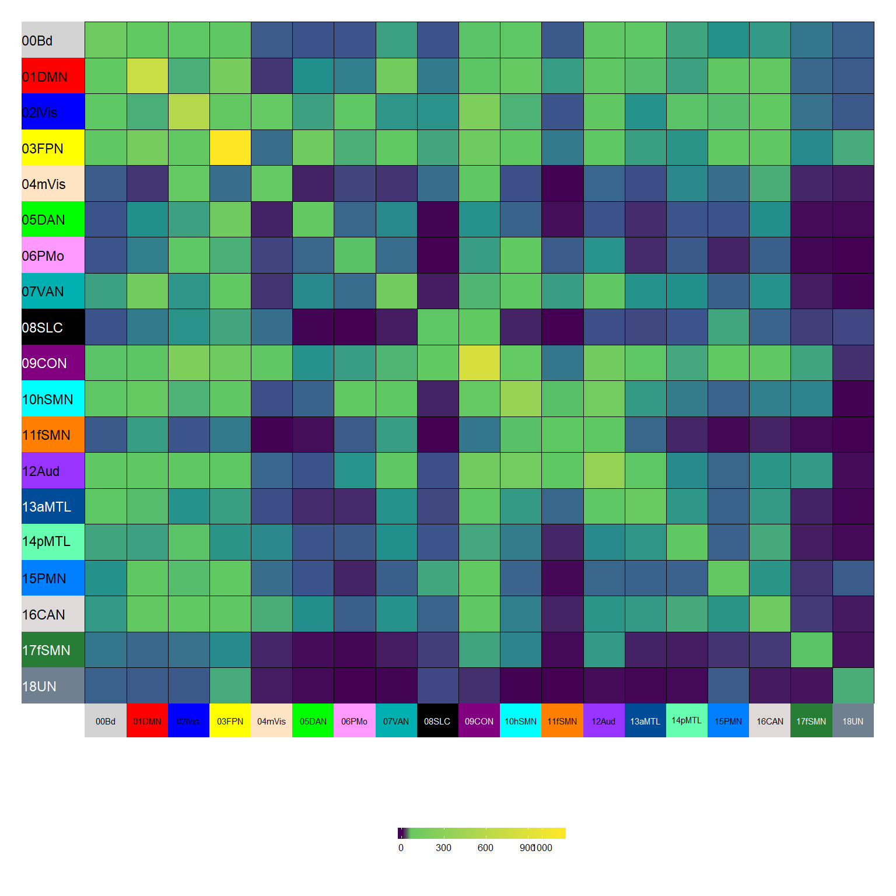
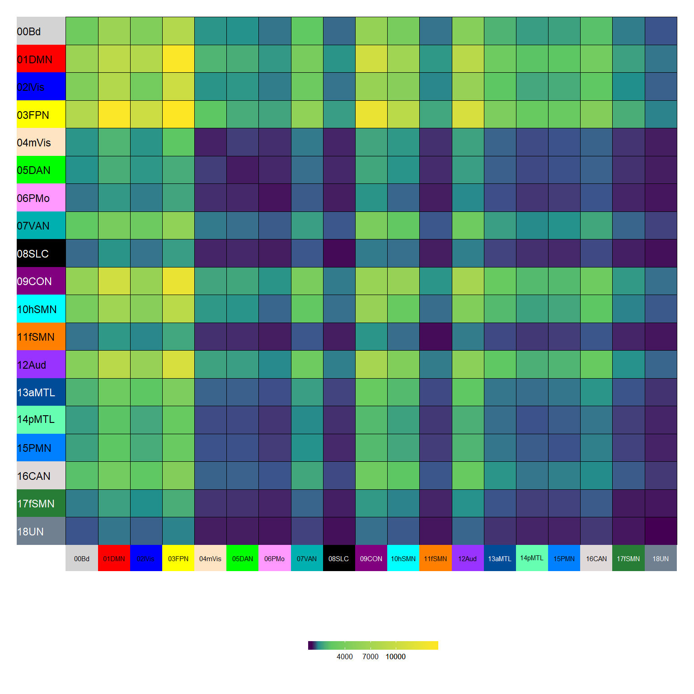
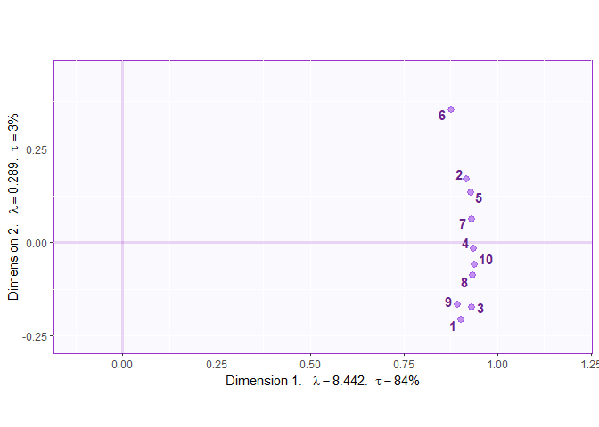
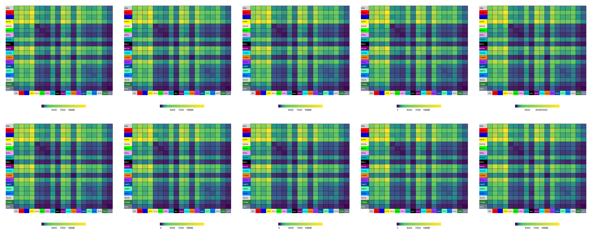
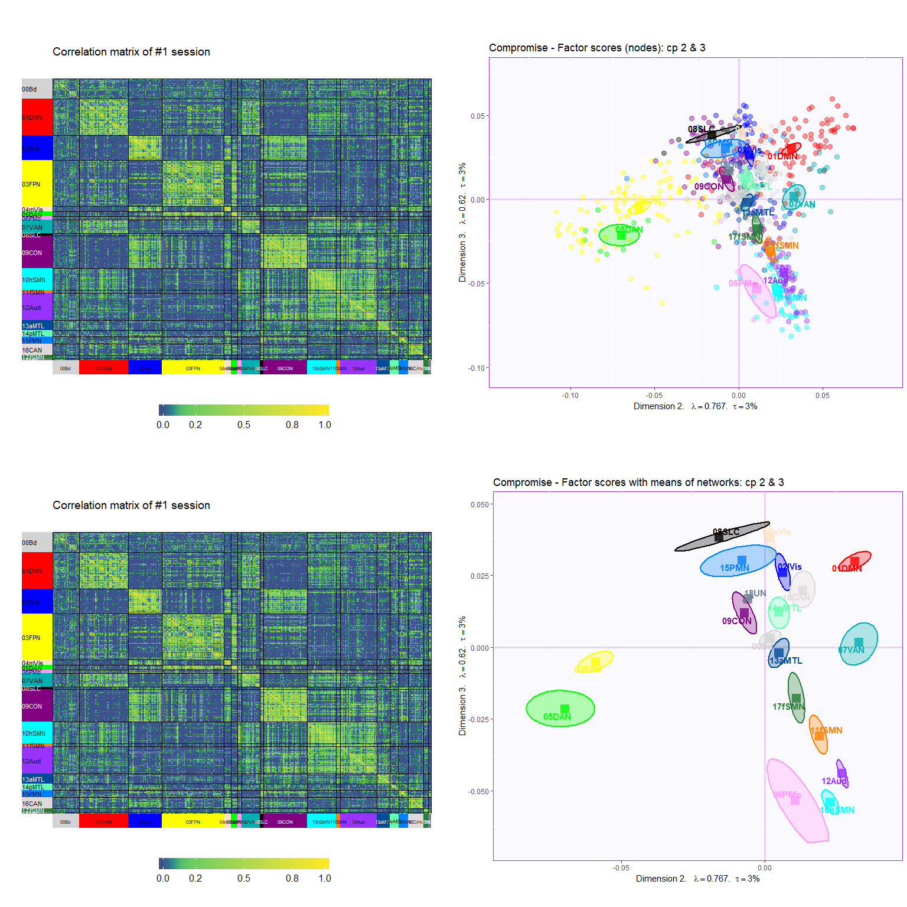

Demo\_DiSTATIS
================

## Idea

To test how different normalization works on a cube, we first run a
DiSTATIS on this cube to get the result that we can compare the results
from other techniques to.

## Objectives

Here, we illustrate the DiSTATIS results.

## Read data

This is a data cube of correlation: ROIs x ROIs x 10 sessions

``` r
## Exclude negative correlations
cubes$rcube[cubes$rcube < 0] <- 0
# Dimensions
dim(cubes$rcube)
## [1] 602 602  10
```

This correlation data are then transformed into distances (for DiSTATIS)

``` r
dcube <- cor2dist(cubes$rcube)
# Dimension
dim(dcube)
## [1] 602 602  10
```

## Compute SS of each community

Get community information and create colors for different
communities

``` r
Comm.col <- list(oc = as.matrix(vox.des$Comm.Col), gc = as.matrix(CommName$CommColor))
rownames(Comm.col$oc) <- vox.des$NodeID
rownames(Comm.col$gc) <- CommName$CommLabel.short
```

## Check data with heatmap for the 1st session

<!-- -->

## Check the sums of squares (of correlation matrix) of the 1st session

<!-- -->

## Check the sums of squares (of distance matrix) of the 1st session

<!-- -->

## Run DiSTATIS

``` r
# DiSTATIS
distatis.res <- distatis(dcube)
```

## Plot results

### Rv space

#### Eigenvalues

<!-- -->

#### Factor scores

``` r
### Rv factor scores
rv.graph <- createFactorMap(distatis.res$res4Cmat$G,
                axis1 = 1, axis2 = 2)
### Dimension labels for the Rv map
rv.labels <- createxyLabels.gen(lambda = distatis.res$res4Cmat$eigValues,
                                tau = distatis.res$res4Cmat$tau,
                                axisName = "Dimension ")
### Show plot
Rvmap <- rv.graph$zeMap + rv.labels
print(Rvmap)
```

<!-- -->

### Compromise space

#### Eigenvalues

<!-- -->

Set the components of interest

``` r
x_cp <- 1
y_cp <- 2
```

#### Factor scores

<!-- -->

### Now plot the compromise space with means, confidence intervals, and tolerance intervals

#### Compute means for each network

``` r
BootCube.Comm <- Boot4Mean(distatis.res$res4Splus$F,
                         design = vox.des$Comm.rcd,
                         niter = 100,
                         suppressProgressBar = TRUE)
```

#### Plot

##### All heat maps and Rv

Rv factor scores:

<!-- -->

Heap maps of correlation matrices:

<!-- -->

Heap maps of SS of correlation matrices:

<!-- -->

Heap maps of SS of distance matrices:

<!-- -->

##### Component 1 & 2

<!-- -->

##### Component 2 & 3

<!-- -->
