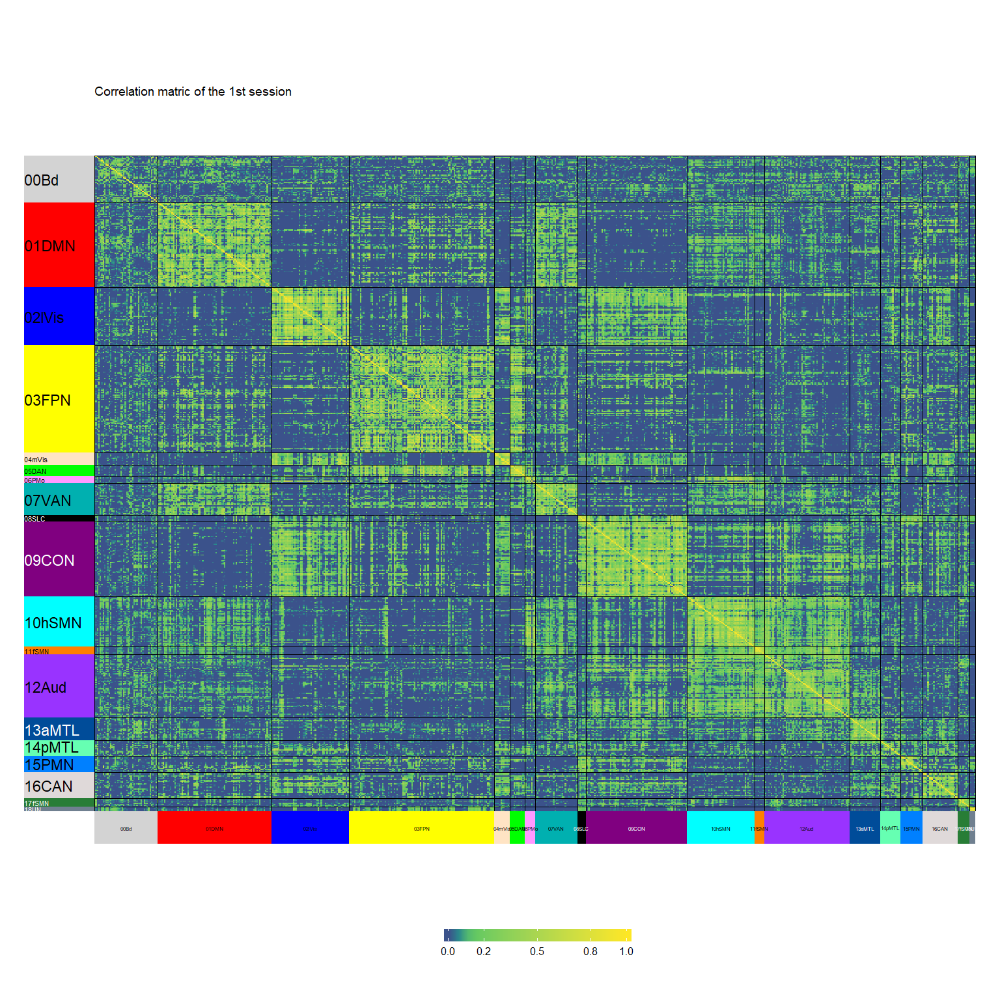
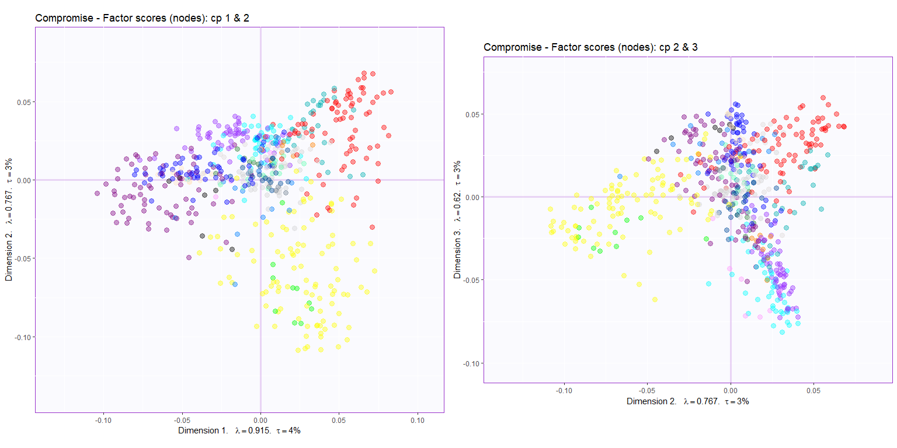

Demo\_DiSTATIS
================

## Idea

To test how different normalization works on a cube, we first run a
DiSTATIS on this cube to get the result that we can compare the results
from other techniques to.

## Objectives

Here, we illustrate the DiSTATIS results.

## Read data

This is a data cube of correlation: ROIs x ROIs x 10 sessions

``` r
## Exclude negative correlations
cubes$rcube[cubes$rcube < 0] <- 0
# Dimensions
dim(cubes$rcube)
## [1] 602 602  10
```

This correlation data are then transformed into distances (for DiSTATIS)

``` r
dcube <- cor2dist(cubes$rcube)
# Dimension
dim(dcube)
## [1] 602 602  10
```

Get community information and create colors for different communities

``` r
## order nodes according to community
vox.order <- vox.des[order(vox.des$Comm.recode),]
rcube.order <- cubes$rcube[vox.order$NodeID,vox.order$NodeID,]
rownames(rcube.order) <- vox.order$NodeID
colnames(rcube.order) <- vox.order$NodeID
## Create colors from the community assignment vector
Comm.col <- vox.des$Comm.recode %>% as.data.frame %>% makeNominalData %>% createColorVectorsByDesign(hsv = FALSE, offset = 25)
## rename the rows and take away the first two periods
rownames(Comm.col$gc) %<>% sub("..", "", .)
## design matrix
vox.order.df <- data.frame(Comm = factor(vox.order$Comm.recode), row.names = rownames(rcube.order[,,1]))
vox.order.col <- list(Comm = c("A" = Comm.col$gc[1],
                               "B" = Comm.col$gc[2],
                               "C" = Comm.col$gc[3],
                               "D" = Comm.col$gc[4],
                               "E" = Comm.col$gc[5],
                               "F" = Comm.col$gc[6],
                               "G" = Comm.col$gc[7],
                               "H" = Comm.col$gc[8],
                               "I" = Comm.col$gc[9],
                               "J" = Comm.col$gc[10],
                               "K" = Comm.col$gc[11],
                               "L" = Comm.col$gc[12],
                               "M" = Comm.col$gc[13],
                               "N" = Comm.col$gc[14],
                               "O" = Comm.col$gc[15],
                               "P" = Comm.col$gc[16],
                               "Q" = Comm.col$gc[17],
                               "R" = Comm.col$gc[18],
                               "S" = Comm.col$gc[19]))
value.col <- colorRamps::blue2red(100)
```

## Check data with heatmap

<!-- -->

## Run DiSTATIS

``` r
# DiSTATIS
distatis.res <- distatis(dcube)
```

## Plot results

### Rv space

#### Eigenvalues

<!-- -->

#### Factor scores

``` r
### Rv factor scores
rv.graph <- createFactorMap(distatis.res$res4Cmat$G,
                axis1 = 1, axis2 = 2)
### Dimension labels for the Rv map
rv.labels <- createxyLabels.gen(lambda = distatis.res$res4Cmat$eigValues,
                                tau = distatis.res$res4Cmat$tau,
                                axisName = "Dimension ")
### Show plot
Rvmap <- rv.graph$zeMap + rv.labels
print(Rvmap)
```

<!-- -->

### Compromise space

#### Eigenvalues

<!-- -->

Set the components of interest

``` r
x_cp <- 1
y_cp <- 2
```

#### Factor scores

<!-- -->

### Now plot the compromise space with means, confidence intervals, and tolerance intervals

#### Compute means for each network

``` r
BootCube.Comm <- Boot4Mean(distatis.res$res4Splus$F,
                         design = vox.des$Comm.recode,
                         niter = 100,
                         suppressProgressBar = TRUE)
```

#### Plot

##### Component 1 & 2

<!-- -->

##### Component 2 & 3

<!-- -->
