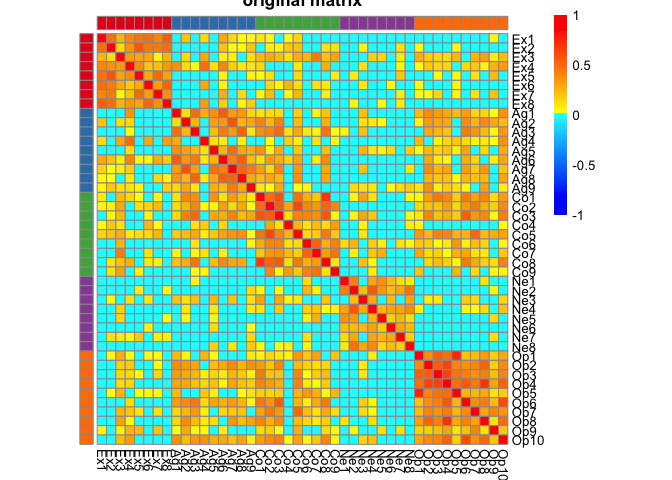
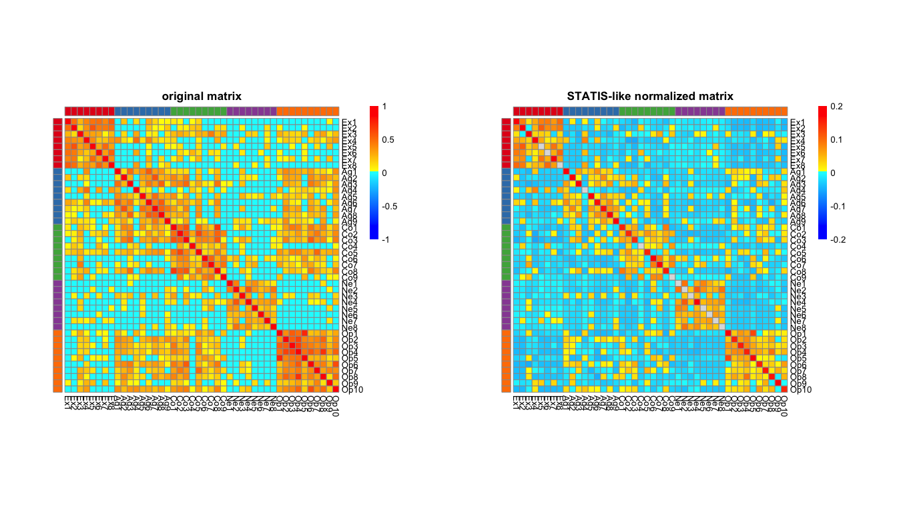
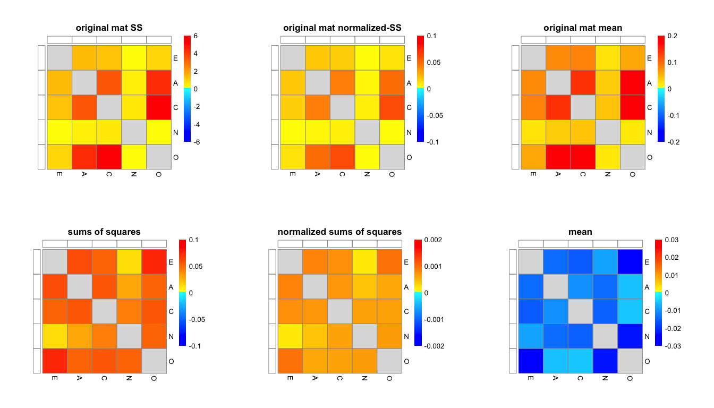
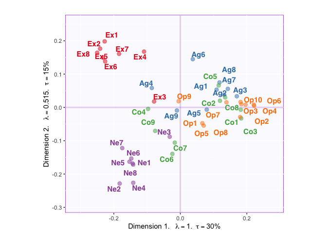

Demonstrating STATIS normalization on a correlation matrix
================

Idea
----

Before starting this project, we were not sure how we should normalize our data to control for counding factors (e.g., voxel size and network size) and keep important signals. (But what is really the important information?) Since the correlation matrix we work on resemble a distance matrix. We came up with the idea of matrix preprocessing steps similar to that of DiSTATIS (i.e., STATIS for distance matrices). This type of preprocessing consists of two steps:

-   Double-center
-   Normalized by the first eigenvalue of the double-centered matrix

Objectives
----------

Here, we illustrate how data are changed along these steps and how the final singular value decomposition (SVD) results are affected.

Start with an example data
--------------------------

### Fake data

We start with a fake data with blocks of correlation.

    ##      Ex1 Ex2 Ex3 Ex4 Ex5 Ex6 Ex7 Ex8 Ag1 Ag2 Ag3 Ag4 Ag5 Ag6 Ag7 Ag8 Ag9
    ## [1,]   5   2   4   4   4   3   3   3   2   4   5   3   3   3   3   4   4
    ## [2,]   2   2   4   4   4   3   2   2   3   4   4   4   4   4   4   4   5
    ## [3,]   3   2   4   3   2   2   2   5   1   1   1   5   1   1   1   1   4
    ## [4,]   2   2   2   2   2   3   2   4   2   5   5   3   3   3   4   4   4
    ## [5,]   4   3   2   3   3   3   4   4   2   4   5   2   2   3   4   4   5
    ## [6,]   5   4   2   4   4   4   4   5   2   4   5   4   4   4   2   2   4
    ##      Co1 Co2 Co3 Co4 Co5 Co6 Co7 Co8 Co9 Ne1 Ne2 Ne3 Ne4 Ne5 Ne6 Ne7 Ne8
    ## [1,]   5   4   5   2   3   4   4   4   3   3   4   5   5   2   1   3   4
    ## [2,]   3   2   4   3   4   4   4   4   4   2   2   4   3   2   2   2   2
    ## [3,]   1   1   2   4   1   5   4   1   5   5   5   1   5   5   5   5   2
    ## [4,]   3   4   5   2   2   4   4   4   5   5   3   2   4   3   2   2   3
    ## [5,]   5   1   5   1   2   5   4   5   2   2   3   4   3   4   3   4   3
    ## [6,]   4   4   5   5   2   4   4   5   2   4   4   4   5   2   4   1   2
    ##      Op1 Op2 Op3 Op4 Op5 Op6 Op7 Op8 Op9 Op10
    ## [1,]   2   5   3   4   2   3   5   5   3    4
    ## [2,]   5   5   5   5   4   4   4   5   4    4
    ## [3,]   5   4   1   3   4   1   1   5   5    2
    ## [4,]   4   5   5   5   3   4   2   5   4    5
    ## [5,]   3   4   4   4   4   5   4   4   5    2
    ## [6,]   4   4   4   2   2   5   4   2   5    4

### Fake correlation

Then, compute its correlation matrix.

``` r
### fake correlation:
# changed to all positive values
cor.X <- cor(X)
cor.X[cor.X<0] <- 0
dim(cor.X)
## [1] 44 44
```

Setting up colors for plotting

``` r
group.col <- RColorBrewer::brewer.pal(5,"Set1")[c(rep(x=1,8),rep(x=2,9),rep(x=3,9),rep(x=4,8),rep(x=5,10))]
group.des <- c(rep("E",8),rep("A",9),rep("C",9),rep("N",8),rep("O",10))
group.des.nominal <- makeNominalData(as.matrix(group.des))
group.des.nomnorm <- group.des.nominal/c(rep(8,8),rep(9,9),rep(9,9),rep(8,8),rep(10,10))
group.des.df <- data.frame(group = factor(group.des),row.names = colnames(X))
group.des.col <- list(group = c(E = RColorBrewer::brewer.pal(5,"Set1")[1],
                                A = RColorBrewer::brewer.pal(5,"Set1")[2],
                                C = RColorBrewer::brewer.pal(5,"Set1")[3],
                                N = RColorBrewer::brewer.pal(5,"Set1")[4],
                                O = RColorBrewer::brewer.pal(5,"Set1")[5]))
value.col <- colorRamps::blue2red(100)
```

Plot the original heatmap:



STATIS-like normalization
-------------------------

### STEP 1 : Double centering

Centering across columns and rows so that each row and column has a mean of 0.

``` r
# center columns and rows
corX.c <- cor.X %>% scale(scale = FALSE) %>% t %>% scale(scale = FALSE)
```

### STEP 1.5: Eigen decomposition

Perform an eigen decomposition and record the eigenvalues.

``` r
# get the first eigenvalue
eig.res.corX <-eigen(corX.c)
Lambda.corX <- eig.res.corX$`values`
Q.corX <- eig.res.corX$vectors
Q1 <- as.matrix(diag(Q.corX[,1]))
rownames(Q1) <- colnames(X)
colnames(Q1) <- colnames(X)
```

Plot double-centered matrix & eigen vectors:


### STEP 2 : Devided the double-centered matrix by the first eigenvalue

``` r
end.X <- corX.c/Lambda.corX[1]
```

Plot original matrix & normalized matrix:



With its sums of squares:

    ##            E          A          C          N          O
    ## E 0.53756572 0.06035231 0.05254408 0.01211016 0.07531015
    ## A 0.06035231 0.40397263 0.05739050 0.02935305 0.05395297
    ## C 0.05254408 0.05739050 0.41103609 0.04340758 0.05685418
    ## N 0.01211016 0.02935305 0.04340758 0.54467836 0.05296631
    ## O 0.07531015 0.05395297 0.05685418 0.05296631 0.45944721

With its normalized sums of squares:

    ##              E            A            C            N            O
    ## E 0.0083994644 0.0008382265 0.0007297789 0.0001892212 0.0009413769
    ## A 0.0008382265 0.0049873165 0.0007085246 0.0004076812 0.0005994775
    ## C 0.0007297789 0.0007085246 0.0050745196 0.0006028830 0.0006317131
    ## N 0.0001892212 0.0004076812 0.0006028830 0.0085105994 0.0006620789
    ## O 0.0009413769 0.0005994775 0.0006317131 0.0006620789 0.0045944721

With its block means:

    ##              E            A           C            N            O
    ## E  0.073204940 -0.013927558 -0.01608480 -0.008992446 -0.024358873
    ## A -0.013927558  0.041471647 -0.01063462 -0.013845716 -0.005534707
    ## C -0.016084799 -0.010634618  0.04382902 -0.015063325 -0.004956460
    ## N -0.008992446 -0.013845716 -0.01506332  0.070261870 -0.022997402
    ## O -0.024358873 -0.005534707 -0.00495646 -0.022997402  0.047327070

Original matrix's sums of squares:

    ##            E          A         C          N          O
    ## E 16.4088161  1.3515739  1.208547  0.1473785  0.8902429
    ## A  1.3515739 17.1068418  3.427903  0.3742935  4.4188633
    ## C  1.2085474  3.4279034 19.306031  0.5483490  5.4996670
    ## N  0.1473785  0.3742935  0.548349 12.4913467  0.1941629
    ## O  0.8902429  4.4188633  5.499667  0.1941629 25.9770096

Original matrix's normalized sums of squares:

    ##             E          A           C           N           O
    ## E 0.256387752 0.01877186 0.016785380 0.002302789 0.011128036
    ## A 0.018771860 0.21119558 0.042319795 0.005198520 0.049098481
    ## C 0.016785380 0.04231980 0.238346065 0.007615958 0.061107411
    ## N 0.002302789 0.00519852 0.007615958 0.195177292 0.002427037
    ## O 0.011128036 0.04909848 0.061107411 0.002427037 0.259770096

Original matrix's block means:

    ##            E          A          C          N          O
    ## E 0.44414906 0.07641620 0.08008157 0.02061252 0.05683041
    ## A 0.07641620 0.36777570 0.14046775 0.03335369 0.17906033
    ## C 0.08008157 0.14046775 0.40595829 0.04136409 0.19537509
    ## N 0.02061252 0.03335369 0.04136409 0.34365785 0.01968514
    ## O 0.05683041 0.17906033 0.19537509 0.01968514 0.45215325



Try PCA
-------

Let's see how the PCA results are changed after the STATIS-like normalization.

``` r
# Group design
group.des <- c(rep(x=1,8),rep(x=2,9),rep(x=3,9),rep(x=4,8),rep(x=5,10))
# PCA with original correlation matrix
corX.pca.res <- epPCA(cor.X, center = FALSE, scale = FALSE, DESIGN = group.des, make_design_nominal = TRUE, graphs = FALSE)
# PCA with the STATIS-normalized matrix
endX.pca.res <- epPCA(end.X, center = FALSE, scale = FALSE, DESIGN = group.des, make_design_nominal = TRUE, graphs = FALSE)
```

#### PCA results with original correlation matrix


#### PCA results with STATIS-normalized matrix


